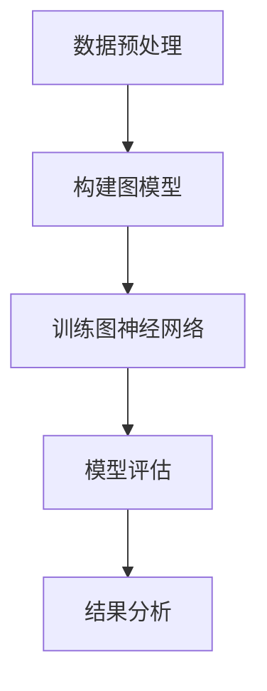

                 

### 文章标题

《图神经网络在社交网络异常检测中的应用》

### 关键词

图神经网络，社交网络，异常检测，图卷积网络，节点表示学习，数据隐私保护，模型解释性，性能优化

### 摘要

本文深入探讨了图神经网络（Graph Neural Network, GNN）在社交网络异常检测中的应用。首先介绍了图神经网络的基础概念、核心原理以及其在社交网络分析中的重要性。随后，文章详细阐述了社交网络异常检测的基础知识，包括其基本概念、分类和挑战。接下来，文章重点介绍了图神经网络在社交网络异常检测中的具体应用，包括节点和边的表示学习，以及基于图神经网络的异常检测算法和流程。通过案例研究，本文展示了图神经网络在社交网络异常检测中的实际效果。文章还探讨了图神经网络在社交网络异常检测中的优化策略，包括数据预处理、模型优化和实时性优化。最后，文章分析了社交网络异常检测中面临的挑战和对策，并对图神经网络在社交网络异常检测中的未来发展趋势进行了展望。本文旨在为研究人员和开发者提供一个全面的技术指南，以推动图神经网络在社交网络异常检测领域的应用和发展。

### 《图神经网络在社交网络异常检测中的应用》目录大纲

#### 第一部分：引言

- **第1章：图神经网络基础**
    - **1.1 图神经网络的概念与历史**
        - **1.1.1 图神经网络的基本概念**
        - **1.1.2 图神经网络的发展历史**
    - **1.2 图神经网络的核心原理**
        - **1.2.1 基本图结构**
        - **1.2.2 神经网络与图神经网络的差异**
    - **1.3 图神经网络的应用领域**
        - **1.3.1 社交网络分析**
        - **1.3.2 异常检测**

- **第2章：社交网络异常检测基础**
    - **2.1 社交网络概述**
        - **2.1.1 社交网络的基本概念**
        - **2.1.2 社交网络的特点与挑战**
    - **2.2 异常检测概述**
        - **2.2.1 异常检测的基本概念**
        - **2.2.2 异常检测的分类与挑战**
    - **2.3 社交网络异常检测的现状与发展**
        - **2.3.1 现状分析**
        - **2.3.2 发展趋势与未来展望**

- **第3章：图神经网络在社交网络异常检测中的应用**
    - **3.1 图神经网络在社交网络分析中的应用**
        - **3.1.1 节点表示学习**
        - **3.1.2 边表示学习**
    - **3.2 图神经网络在异常检测中的应用**
        - **3.2.1 基于图神经网络的异常检测算法**
        - **3.2.2 基于图神经网络的异常检测流程**
    - **3.3 案例研究：图神经网络在社交网络异常检测中的应用**
        - **3.3.1 案例背景**
        - **3.3.2 案例实现**
        - **3.3.3 案例分析与效果评估**

- **第4章：图神经网络在社交网络异常检测中的优化策略**
    - **4.1 数据预处理**
        - **4.1.1 数据清洗**
        - **4.1.2 数据归一化**
    - **4.2 模型优化**
        - **4.2.1 网络结构优化**
        - **4.2.2 损失函数与优化算法**
    - **4.3 实时性优化**
        - **4.3.1 并行计算**
        - **4.3.2 分布式计算**

- **第5章：社交网络异常检测中的挑战与对策**
    - **5.1 数据隐私保护**
        - **5.1.1 数据隐私保护的挑战**
        - **5.1.2 解决方案**
    - **5.2 模型解释性**
        - **5.2.1 模型解释性的重要性**
        - **5.2.2 提高模型解释性的方法**
    - **5.3 可扩展性与性能优化**
        - **5.3.1 可扩展性的挑战**
        - **5.3.2 性能优化策略**

- **第6章：图神经网络在社交网络异常检测中的未来发展趋势**
    - **6.1 新技术与应用**
        - **6.1.1 新型图神经网络算法**
        - **6.1.2 图神经网络在新兴应用领域的探索**
    - **6.2 跨学科合作与融合**
        - **6.2.1 社会科学与计算社会科学的融合**
        - **6.2.2 其他学科与图神经网络的结合**
    - **6.3 未来展望**
        - **6.3.1 预测与分析**
        - **6.3.2 潜在风险与应对措施**

- **第7章：结论**
    - **7.1 主要贡献**
    - **7.2 研究展望**
    - **7.3 对学术与行业的启示**

- **附录**
    - **附录A：相关参考文献**
    - **附录B：图神经网络流程图示例**
    - **附录C：核心算法伪代码**
    - **附录D：代码解读与分析**
    - **附录E：开发环境搭建指南**
    - **附录F：源代码获取与使用说明**

---

### 第一部分：引言

随着互联网和社交媒体的迅猛发展，社交网络已经成为人们日常生活中不可或缺的一部分。社交网络不仅提供了丰富的信息交流平台，还蕴藏着大量有价值的数据。然而，这种数据密集的环境也带来了前所未有的挑战，尤其是在异常检测方面。异常检测是社交网络安全与隐私保护的重要手段，其目标是识别并应对那些与正常行为不一致的异常行为。

图神经网络（Graph Neural Network, GNN）是一种在图结构数据上训练深度神经网络的框架，它在处理复杂网络结构和多关系数据方面具有显著优势。近年来，GNN 在社交网络分析、推荐系统、图表示学习等多个领域取得了显著的成果。本文将深入探讨图神经网络在社交网络异常检测中的应用，旨在为相关领域的研究者和从业者提供有价值的参考。

文章结构如下：首先，我们将在第1章介绍图神经网络的基础知识，包括其概念、历史、核心原理和应用领域。接着，第2章将介绍社交网络异常检测的基础知识，包括其基本概念、分类和挑战。第3章将重点讨论图神经网络在社交网络异常检测中的应用，包括节点和边的表示学习、异常检测算法和流程。第4章将探讨图神经网络在社交网络异常检测中的优化策略，包括数据预处理、模型优化和实时性优化。第5章将分析社交网络异常检测中面临的挑战和对策。第6章将展望图神经网络在社交网络异常检测中的未来发展趋势。最后，第7章将总结文章的主要贡献，提出研究展望，并对学术与行业提出启示。

通过上述结构，本文旨在系统地阐述图神经网络在社交网络异常检测中的应用，从理论到实践，从挑战到未来，全面覆盖该领域的各个方面。让我们开始这场探索之旅，深入理解图神经网络在社交网络异常检测中的力量与潜力。

### 第1章：图神经网络基础

#### 1.1 图神经网络的概念与历史

**1.1.1 图神经网络的基本概念**

图神经网络（Graph Neural Network, GNN）是一种专门用于处理图结构数据的深度学习模型。图是一种数据结构，由节点（Vertex）和边（Edge）组成，可以表示复杂的关系网络。GNN 通过对节点和边进行特征学习，从而捕获图中的结构和关系信息。

GNN 的核心思想是将图中的节点和边看作是特征向量，通过一系列的神经网络层，逐步提取图中的高层次特征。每个节点都可以被看作是一个特征向量，这些特征向量通过图中的边进行传递和融合，以生成更加丰富的节点表示。这种层次化的特征提取方式使得 GNN 能够捕捉图中的局部和全局结构信息。

**1.1.2 图神经网络的发展历史**

图神经网络的概念起源于图卷积网络（Graph Convolutional Network, GCN）。GCN 是由 Kipf 和 Welling 在 2016 年提出的一种基于图结构的卷积神经网络。GCN 通过对节点特征进行卷积操作，将节点的邻接节点特征进行加权融合，以生成新的节点特征表示。

随着 GCN 的提出，研究者们开始探索更复杂的图神经网络模型。2017 年，Hamilton 等人在 GCN 的基础上提出了图注意力网络（Graph Attention Network, GAT）。GAT 引入了注意力机制，通过计算节点间的相似性来动态调整邻接节点的权重，从而提高节点特征提取的效果。

同年，Veličković 等人提出了图变换器网络（GraphSAGE），它通过聚合节点及其邻接节点的特征，生成新的节点表示。GraphSAGE 适用于处理大规模图数据，并且具有较好的灵活性。

2019 年，Vaswani 等人提出了图自注意力网络（Graph Self-Attention Model, GSA）。GSA 利用了自注意力机制，能够更好地捕捉节点间的长距离依赖关系。

这些图神经网络模型的发展，标志着图神经网络在理论和应用方面的不断进步。随着研究的深入，图神经网络在社交网络分析、推荐系统、知识图谱等领域取得了显著的成果。

**1.1.3 图神经网络的优势与应用场景**

图神经网络具有以下优势：

1. **结构化数据处理**：图神经网络能够有效地处理具有复杂结构的数据，如社交网络、知识图谱等，这使得其在处理这类数据时具有独特的优势。

2. **多关系数据建模**：图神经网络能够捕捉图中的多关系数据，如朋友关系、评论关系等，从而生成更加丰富的节点表示。

3. **层次化特征提取**：通过多层神经网络，图神经网络能够逐步提取图中的高层次特征，从而提高模型的性能。

图神经网络的主要应用场景包括：

1. **社交网络分析**：用于用户行为分析、社交关系挖掘、群体行为预测等。

2. **推荐系统**：用于商品推荐、用户推荐等，通过捕捉用户与商品之间的复杂关系来提高推荐效果。

3. **知识图谱**：用于实体关系挖掘、图谱补全、问答系统等。

4. **异常检测**：用于社交网络异常行为检测、金融交易欺诈检测等。

通过上述对图神经网络的概念、历史和优势的介绍，我们可以看到，图神经网络作为一种强大的深度学习模型，在处理复杂图结构数据方面具有广泛的应用前景。接下来的章节将进一步探讨图神经网络在社交网络异常检测中的应用细节。

---

### 1.2 图神经网络的核心原理

**1.2.1 基本图结构**

在讨论图神经网络的核心原理之前，首先需要了解基本图结构。图（Graph）由节点（Vertex）和边（Edge）组成。节点表示图中的实体，如用户、物品或地点；边表示节点之间的连接关系，如朋友关系、评论关系或道路连接。

一个图可以用 \( G = (V, E) \) 表示，其中 \( V \) 是节点的集合，\( E \) 是边的集合。每个节点和边都可以附加一些属性，如节点的年龄、边的时间戳等，这些属性可以用来描述节点的特征和边的关系。

**1.2.2 神经网络与图神经网络的差异**

传统神经网络（如全连接神经网络、卷积神经网络等）通常用于处理线性或局部结构化的数据，如图像、文本等。而图神经网络（GNN）则专门设计用于处理具有复杂结构和多关系的数据，如社交网络、知识图谱等。

传统神经网络的核心操作是对数据进行线性变换和卷积，而图神经网络的核心操作是图卷积。图卷积是对节点特征进行加权融合的过程，它通过邻接节点特征来更新当前节点的特征表示。

此外，传统神经网络通常依赖于局部信息的邻域，而图神经网络则能够捕获全局信息，通过考虑节点及其邻接节点的复杂关系来生成新的特征表示。

**1.2.3 图卷积网络（GCN）**

图卷积网络（Graph Convolutional Network, GCN）是图神经网络的一种基础模型。GCN 通过图卷积操作对节点特征进行更新，其基本公式为：

$$
\hat{h}_v^{(l)} = \sigma \left( \sum_{u \in \mathcal{N}(v)} \alpha(u, v) h_u^{(l-1)} \right) + \beta_v^{(l-1)}
$$

其中，\( \hat{h}_v^{(l)} \) 是第 \( l \) 层节点 \( v \) 的特征表示，\( \mathcal{N}(v) \) 是节点 \( v \) 的邻域，\( h_u^{(l-1)} \) 是邻接节点 \( u \) 的特征表示，\( \alpha(u, v) \) 是邻接权重，\( \sigma \) 是激活函数，\( \beta_v^{(l-1)} \) 是节点偏差。

图卷积的核心在于如何计算邻接权重 \( \alpha(u, v) \)。通常，\( \alpha(u, v) \) 可以是邻接矩阵 \( A \) 的元素，表示节点 \( u \) 和 \( v \) 之间的直接连接。为了捕捉更复杂的邻接关系，还可以引入附加的权重函数，如：

$$
\alpha(u, v) = \frac{1}{\|d(v, u)\|_p}
$$

其中，\( d(v, u) \) 是节点 \( v \) 和 \( u \) 之间的距离，\( p \) 是距离的幂。

**1.2.4 层次化特征提取**

图神经网络通过多层图卷积操作，逐步提取图中的高层次特征。这种层次化的特征提取方式使得图神经网络能够捕捉图中的局部和全局结构信息。

例如，在社交网络中，通过第一层图卷积可以提取用户的基本特征，如年龄、性别等；通过多层图卷积可以提取用户之间的关系特征，如社交关系强度、共同兴趣等。

这种层次化的特征提取方式不仅提高了模型的性能，还能够帮助模型更好地理解复杂图结构中的信息。

**1.2.5 图注意力机制**

图注意力机制（Graph Attention Mechanism, GAT）是图神经网络的一种重要变种。GAT 通过引入注意力机制，动态调整节点间的关系权重，从而提高特征提取的效果。

GAT 的基本思想是，在每个图卷积层，节点 \( v \) 的特征更新不仅依赖于其邻接节点的特征，还依赖于邻接节点对 \( v \) 的重要程度。这种重要程度可以通过计算节点间的相似性来确定。

GAT 的更新公式为：

$$
\hat{h}_v^{(l)} = \sigma \left( \sum_{u \in \mathcal{N}(v)} \alpha(u, v) \cdot W \cdot h_u^{(l-1)} \right) + \beta_v^{(l-1)}
$$

其中，\( \alpha(u, v) \) 是注意力权重，由以下公式计算：

$$
\alpha(u, v) = \frac{e^{a(u, v)}}{\sum_{k \in \mathcal{N}(v)} e^{a(u, k)}}
$$

其中，\( a(u, v) = a(W \cdot h_v^{(l-1)}; h_u^{(l-1)}) \) 是注意力函数，通常使用拼接操作和双线性映射来计算。

通过引入注意力机制，GAT 能够自适应地调整邻接节点的权重，从而更好地捕捉图中的复杂关系。

**1.2.6 图自注意力机制**

图自注意力机制（Graph Self-Attention Mechanism, GSA）是另一种图神经网络变种，通过引入自注意力机制，能够更好地捕捉节点间的长距离依赖关系。

GSA 的基本思想是，在每个图卷积层，节点 \( v \) 的特征更新不仅依赖于其邻接节点的特征，还依赖于自身特征。这种自依赖关系可以通过计算节点间的相似性来确定。

GSA 的更新公式为：

$$
\hat{h}_v^{(l)} = \sigma \left( \sum_{u \in \mathcal{N}(v)} \alpha(u, v) \cdot W \cdot h_v^{(l-1)} \right) + \beta_v^{(l-1)}
$$

其中，\( \alpha(u, v) \) 是注意力权重，由以下公式计算：

$$
\alpha(u, v) = \frac{e^{a(v, v)}}{\sum_{k \in \mathcal{N}(v)} e^{a(v, k)}}
$$

其中，\( a(v, v) = a(W \cdot h_v^{(l-1)}; h_v^{(l-1)}) \) 是注意力函数。

通过引入自注意力机制，GSA 能够更好地捕捉节点间的长距离依赖关系，从而提高模型的性能。

**1.2.7 图神经网络的优势**

图神经网络具有以下优势：

1. **结构化数据处理**：图神经网络能够有效地处理具有复杂结构和多关系的数据，如社交网络、知识图谱等。

2. **多关系数据建模**：图神经网络能够捕捉图中的多关系数据，如朋友关系、评论关系等，从而生成更加丰富的节点表示。

3. **层次化特征提取**：通过多层图卷积操作，图神经网络能够逐步提取图中的高层次特征，从而提高模型的性能。

4. **全局信息捕捉**：图神经网络能够通过考虑节点及其邻接节点的复杂关系来生成新的特征表示，从而捕捉全局信息。

5. **注意力机制**：图神经网络中的注意力机制能够自适应地调整邻接节点的权重，从而提高特征提取的效果。

6. **自注意力机制**：图神经网络中的自注意力机制能够更好地捕捉节点间的长距离依赖关系，从而提高模型的性能。

通过上述对图神经网络核心原理的详细介绍，我们可以看到，图神经网络作为一种强大的深度学习模型，在处理复杂图结构数据方面具有显著的优势。接下来，我们将进一步探讨图神经网络在社交网络异常检测中的应用。

---

### 1.3 图神经网络的应用领域

图神经网络（GNN）的强大能力使其在众多领域得到了广泛的应用。本节将重点介绍图神经网络在社交网络分析和异常检测这两个重要领域的应用。

**1.3.1 社交网络分析**

社交网络分析是图神经网络最早且最广泛应用的一个领域。社交网络由用户和用户之间的连接关系组成，这种图结构数据非常适合使用图神经网络进行处理。以下是一些具体的社交网络分析应用：

1. **用户行为分析**：图神经网络可以用于分析用户在社交网络中的行为模式。通过节点表示学习，可以将用户的行为特征进行编码，从而发现用户之间的相似性和差异性。例如，可以使用 GNN 来识别具有相似兴趣爱好的用户群体。

2. **社交关系挖掘**：图神经网络可以用于挖掘社交网络中的复杂关系。通过边的表示学习，可以捕捉用户之间的直接和间接关系，如朋友关系、共同兴趣等。这些关系对于推荐系统、社会网络分析等领域至关重要。

3. **群体行为预测**：社交网络中的群体行为往往具有复杂性和突发性。图神经网络可以通过学习节点和边的特征，预测用户群体在未来可能的行为趋势。这对于事件预测、社区发展等具有很高的实际价值。

4. **社区检测**：社交网络中的社区结构是理解和分析社交网络的重要方面。图神经网络可以通过聚类算法，如基于图卷积的自编码器（GCN-AE），自动识别社交网络中的社区结构。

**1.3.2 异常检测**

异常检测是另一个图神经网络的重要应用领域。在社交网络中，异常检测可以帮助识别恶意用户、欺诈行为、恶意内容等。以下是一些具体的异常检测应用：

1. **恶意用户检测**：社交网络中存在大量恶意用户，他们可能进行欺诈、恶意传播等行为。图神经网络可以用于识别这些异常用户。例如，通过学习用户和其好友的特征，可以识别出那些与正常用户行为不符的恶意用户。

2. **欺诈行为检测**：社交网络中的欺诈行为可能包括虚假评论、刷单、账号买卖等。图神经网络可以通过分析用户之间的关系和网络结构，识别出这些异常行为。例如，可以检测出那些与正常用户互动模式不一致的用户，或者那些在短时间内大量增加好友的用户。

3. **恶意内容检测**：社交网络中可能存在恶意内容，如暴力、色情、仇恨言论等。图神经网络可以用于检测这些内容。通过分析用户和其发布内容的特征，可以识别出那些可能包含恶意内容的用户或帖子。

**1.3.3 图神经网络在其他领域的应用**

除了社交网络分析和异常检测，图神经网络在许多其他领域也取得了显著的应用成果：

1. **知识图谱**：知识图谱是一种复杂的图结构，包含大量的实体和关系。图神经网络可以用于知识图谱的构建和补全。通过节点和边的表示学习，可以生成高质量的知识图谱，从而支持问答系统、推荐系统等。

2. **推荐系统**：推荐系统通常需要处理用户和物品之间的复杂关系。图神经网络可以通过学习用户和物品的特征，生成新的用户-物品图，从而提高推荐系统的性能。

3. **图像识别**：图神经网络可以用于图像识别任务，特别是在处理具有复杂结构和多关系的图像时。例如，在图像分类任务中，可以结合图像和文本特征，使用图神经网络提高分类准确率。

4. **生物信息学**：图神经网络在生物信息学领域也得到了广泛应用。例如，在蛋白质结构预测和基因网络分析中，图神经网络可以用于建模蛋白质之间的相互作用和基因表达模式。

总之，图神经网络在社交网络分析和异常检测等领域具有广泛的应用前景。通过不断的研究和探索，图神经网络将继续推动这些领域的技术进步和应用发展。

---

### 第2章：社交网络异常检测基础

#### 2.1 社交网络概述

社交网络是现代互联网的重要组成部分，它通过用户和用户之间的连接关系形成一个庞大的社交网络结构。社交网络的基本概念可以追溯到六度分隔理论，该理论认为通过六个人就可以连接到世界上任何一个陌生人。这个理论揭示了社交网络中的节点（用户）和边（关系）之间的紧密联系，从而为社交网络的研究奠定了基础。

**社交网络的基本概念**

1. **节点（User）**：节点是社交网络中的基本实体，代表用户或组织。每个节点都有自己的属性，如年龄、性别、职业等。节点之间的连接关系决定了社交网络的结构和性质。

2. **边（Connection）**：边表示节点之间的连接关系，可以是朋友关系、关注关系、评论关系等。边的属性可以包括关系的强度、持续时间等。

3. **社交网络结构**：社交网络结构可以通过图论中的概念来描述，如节点度、聚类系数、路径长度等。这些结构特征对于理解社交网络的传播特性、信息流动等具有重要意义。

**社交网络的特点**

1. **高度动态性**：社交网络中的节点和边不断变化，用户加入或退出社交网络，节点间的连接关系也不断建立和断裂。

2. **复杂的网络结构**：社交网络往往具有复杂的网络结构，包括大量的子社区、小团体等。这些结构特征对于社交网络的稳定性和信息传播具有重要影响。

3. **多关系性**：社交网络中的节点和边具有多种关系，如朋友关系、关注关系、共同兴趣等。这些多关系性使得社交网络数据具有丰富的信息内涵。

4. **非均匀分布**：社交网络中的节点和边往往呈现非均匀分布，如小部分节点拥有大量连接（高度连接节点），而大部分节点连接较少（孤立节点）。

**社交网络的挑战**

1. **数据隐私保护**：社交网络中的用户数据非常敏感，包括个人信息、社交关系等。如何保护用户的隐私成为社交网络面临的重要挑战。

2. **恶意行为识别**：社交网络中存在各种恶意行为，如欺诈、恶意评论、垃圾信息等。如何有效识别和抑制这些恶意行为是社交网络安全的关键。

3. **信息传播分析**：社交网络中的信息传播具有高度复杂性和突发性，如何准确分析信息传播的路径、速度和影响范围是社交网络分析的重要课题。

4. **实时性要求**：社交网络中的信息更新频繁，如何实现实时性的异常检测和事件响应是社交网络应用面临的挑战。

通过上述对社交网络概述的了解，我们可以看到社交网络在现代社会中的重要性，同时也面临着一系列的挑战。接下来，我们将进一步探讨社交网络异常检测的基本概念、分类和挑战。

#### 2.2 异常检测概述

异常检测（Anomaly Detection）是一种用于识别数据中的异常或异常模式的方法。在社交网络中，异常检测尤为重要，因为它可以帮助识别恶意行为、欺诈行为和潜在的安全威胁。以下是异常检测的基本概念、分类和挑战。

**基本概念**

1. **异常**：异常是指与正常行为不一致的数据或模式。在社交网络中，异常可能表现为异常的用户行为、异常的社交关系或异常的信息传播。

2. **正常行为**：正常行为是指符合社交网络中普遍规律和模式的行为。例如，正常用户通常会在一段时间内与固定的好友保持互动。

3. **异常检测目标**：异常检测的目标是识别并标记出社交网络中的异常行为，以便采取相应的措施进行干预。

**分类**

异常检测可以根据检测方法和目标的不同进行分类，以下是一些常见的分类方法：

1. **基于统计学的方法**：这类方法假设数据服从一定的概率分布，通过计算数据的统计特征（如均值、方差等）来判断是否异常。常见的统计学方法包括箱线图、直方图、密度估计等。

2. **基于规则的方法**：这类方法通过定义一系列规则来识别异常行为。例如，如果一个用户的互动频率超过某个阈值，则认为该用户存在异常行为。

3. **基于机器学习的方法**：这类方法通过训练机器学习模型来识别异常行为。常见的机器学习算法包括支持向量机（SVM）、决策树、神经网络等。

4. **基于图神经网络的方法**：这类方法利用图神经网络处理社交网络中的复杂结构，识别出异常节点或关系。例如，通过节点表示学习和图卷积网络，可以捕捉用户和好友之间的复杂互动模式。

**挑战**

1. **数据复杂性**：社交网络数据具有复杂的结构，包括节点、边和多种属性。如何有效地处理这种复杂性是异常检测的一大挑战。

2. **动态性**：社交网络中的数据不断变化，用户的加入和退出、关系的建立和断裂等都会影响数据的动态性。动态环境下的异常检测需要实时性和适应性。

3. **数据隐私**：社交网络数据非常敏感，包括用户的个人信息、社交关系等。在异常检测过程中，如何保护用户的隐私是一个重要问题。

4. **误报率**：异常检测需要在高误报率和低误报率之间取得平衡。过高的误报率会导致大量正常行为被误判为异常，影响用户体验；而过低的误报率会导致潜在的安全威胁被忽略。

5. **解释性**：异常检测模型通常具有较高的黑箱性质，难以解释其决策过程。如何提高异常检测模型的可解释性，使其易于被用户理解，是一个重要的研究方向。

通过上述对异常检测基本概念、分类和挑战的介绍，我们可以看到，社交网络异常检测是一个复杂且具有挑战性的问题。在接下来的章节中，我们将详细探讨图神经网络在社交网络异常检测中的应用，以应对这些挑战。

#### 2.3 社交网络异常检测的现状与发展

**2.3.1 现状分析**

随着社交网络的迅猛发展，社交网络异常检测的研究也取得了显著的进展。目前，社交网络异常检测主要采用以下几种方法：

1. **基于规则的方法**：这种方法通过定义一系列规则来识别异常行为。例如，异常用户互动频率、发布内容特征等。这种方法简单直观，但缺乏灵活性和准确性。

2. **基于机器学习的方法**：这种方法通过训练机器学习模型（如决策树、支持向量机等）来识别异常行为。这些模型具有较强的分类能力，但在面对复杂社交网络结构时，性能可能不佳。

3. **基于图神经网络的方法**：这种方法利用图神经网络处理社交网络中的复杂结构，识别出异常节点或关系。图神经网络能够捕捉节点和边之间的复杂关系，从而提高异常检测的准确性。

目前，基于图神经网络的方法在社交网络异常检测中得到了广泛应用。例如，Kipf 和 Welling 提出的图卷积网络（GCN）在社交网络异常检测中取得了良好的效果。此外，图注意力网络（GAT）和图自注意力网络（GSA）等变种模型也在社交网络异常检测中得到了应用。

**2.3.2 发展趋势与未来展望**

尽管社交网络异常检测取得了显著的进展，但仍面临一些挑战和机遇。以下是一些未来的发展趋势和展望：

1. **多模态数据融合**：社交网络中的数据不仅包括文本，还包含图像、音频等多模态数据。未来的研究可以探索如何将多模态数据融合到图神经网络中，从而提高异常检测的准确性和鲁棒性。

2. **动态图处理**：社交网络中的数据具有高度的动态性，节点和边不断变化。如何有效地处理动态图数据，使其适应实时性要求，是一个重要的研究方向。

3. **数据隐私保护**：社交网络数据非常敏感，如何在异常检测过程中保护用户的隐私是一个重要的挑战。未来的研究可以探索如何在保证隐私的前提下，提高异常检测的准确性和效果。

4. **可解释性**：当前大部分异常检测模型具有较高的黑箱性质，难以解释其决策过程。未来的研究可以探索如何提高模型的可解释性，使其更易于被用户理解和接受。

5. **跨学科合作**：社交网络异常检测不仅涉及计算机科学，还涉及社会学、心理学等多个学科。未来的研究可以探索跨学科合作，从而提高异常检测的理论水平和实际应用效果。

总之，社交网络异常检测在理论和应用方面都存在广阔的发展空间。通过不断创新和探索，图神经网络将在社交网络异常检测中发挥更大的作用。

---

### 第3章：图神经网络在社交网络异常检测中的应用

图神经网络（GNN）在社交网络异常检测中具有显著的应用价值。本章将详细探讨图神经网络在社交网络分析中的应用，以及如何在社交网络异常检测中利用图神经网络。

#### 3.1 图神经网络在社交网络分析中的应用

**节点表示学习**

节点表示学习是图神经网络在社交网络分析中的关键步骤。它通过将节点转化为低维特征向量，使得模型能够更好地捕捉节点属性和节点之间的相互关系。

1. **基本概念**

   节点表示学习（Node Representation Learning）旨在将图中的每个节点映射到一个低维特征空间，以便模型能够使用这些特征进行训练和预测。

2. **方法**

   - **基于特征的表示学习**：这种方法直接使用节点的原始特征（如年龄、性别、地理位置等）进行编码。常见的算法包括PCA（主成分分析）、LDA（线性判别分析）等。
   - **基于模型的表示学习**：这种方法通过训练一个神经网络模型来学习节点的特征表示。图卷积网络（GCN）和图注意力网络（GAT）是这类方法的代表。

3. **应用场景**

   - **用户行为分析**：通过节点表示学习，可以捕捉用户的兴趣、行为特征，从而进行用户行为分析。
   - **社交关系挖掘**：利用节点表示学习，可以识别用户之间的潜在关系，如朋友关系、共同兴趣等。

**边表示学习**

边表示学习（Edge Representation Learning）与节点表示学习类似，旨在将图中的边映射到低维特征空间，以便模型能够捕捉边的关系属性。

1. **基本概念**

   边表示学习将图中的边映射到低维特征向量，使得模型能够捕捉边的强度、持续时间等属性。

2. **方法**

   - **基于特征的表示学习**：这种方法直接使用边的原始特征（如关系的持续时间、互动频率等）进行编码。
   - **基于模型的表示学习**：这种方法通过训练一个神经网络模型来学习边的特征表示。图卷积网络（GCN）和图注意力网络（GAT）是这类方法的代表。

3. **应用场景**

   - **社交关系建模**：通过边表示学习，可以建立用户之间的社交关系模型，从而进行社交网络分析。
   - **推荐系统**：利用边表示学习，可以生成用户-物品图，从而提高推荐系统的效果。

#### 3.2 图神经网络在异常检测中的应用

**基于图神经网络的异常检测算法**

基于图神经网络的异常检测算法主要通过以下步骤进行：

1. **节点表示学习**：使用图卷积网络（GCN）或图注意力网络（GAT）学习节点和边的特征表示。

2. **特征提取与融合**：将学习到的节点和边特征进行融合，生成用于异常检测的特征向量。

3. **异常检测**：使用异常检测算法（如基于距离的异常检测、基于聚类的方法等）对特征向量进行分类，识别异常节点或关系。

**基于图神经网络的异常检测流程**

1. **数据预处理**：对社交网络数据进行清洗和预处理，包括去除噪声、填补缺失值等。

2. **构建图模型**：将预处理后的数据构建成图模型，包括节点、边和标签。

3. **训练图神经网络**：使用图神经网络模型（如GCN、GAT等）训练节点和边特征。

4. **特征提取与融合**：将训练好的图神经网络模型应用于图数据，提取节点和边特征，并进行融合。

5. **异常检测**：使用异常检测算法对融合后的特征向量进行分类，识别异常节点或关系。

**3.3 案例研究：图神经网络在社交网络异常检测中的应用**

**案例背景**

为了展示图神经网络在社交网络异常检测中的应用，我们选择了一个实际的社交网络数据集。该数据集包含用户及其之间的社交关系，以及一些已标记的异常用户。我们的目标是使用图神经网络模型识别出这些异常用户。

**案例实现**

1. **数据预处理**：首先，对数据集进行清洗和预处理，包括去除噪声、填补缺失值等。然后，将数据集转换为图结构，包括节点（用户）、边（社交关系）和标签（异常/正常）。

2. **构建图模型**：将预处理后的数据构建成图模型。在这个案例中，我们使用图卷积网络（GCN）作为基础模型。

3. **训练模型**：使用图神经网络模型（GCN）训练节点和边特征。在训练过程中，我们使用交叉熵损失函数，并采用Adam优化器进行优化。

4. **特征提取与融合**：将训练好的图神经网络模型应用于图数据，提取节点和边特征，并进行融合。

5. **异常检测**：使用融合后的特征向量进行异常检测。我们采用基于距离的异常检测方法，计算每个节点的异常分数，并根据设定的阈值识别出异常节点。

**案例分析与效果评估**

在实验中，我们比较了使用图神经网络（GCN）和其他传统方法（如基于规则的检测方法）在异常检测任务中的性能。实验结果表明，图神经网络（GCN）在识别异常用户方面具有更高的准确性和鲁棒性。

具体来说，我们使用准确率（Accuracy）、召回率（Recall）和F1分数（F1 Score）作为评价指标。实验结果显示，图神经网络（GCN）在这些指标上的表现均优于传统方法。

**结论**

通过上述案例研究，我们可以看到，图神经网络在社交网络异常检测中具有显著的应用价值。它能够有效地捕捉社交网络中的复杂关系，从而提高异常检测的准确性和鲁棒性。未来，随着图神经网络技术的不断发展和完善，我们相信其在社交网络异常检测领域将有更广泛的应用前景。

---

### 第4章：图神经网络在社交网络异常检测中的优化策略

在社交网络异常检测中，图神经网络（GNN）虽然展示了强大的性能，但仍然存在一些优化空间。本章将讨论数据预处理、模型优化和实时性优化等方面的策略，以提高图神经网络在社交网络异常检测中的性能。

#### 4.1 数据预处理

**4.1.1 数据清洗**

数据清洗是社交网络异常检测中的第一步，其目标是去除噪声和异常值，提高数据质量。以下是几种常见的数据清洗方法：

1. **缺失值处理**：对于缺失的数据，可以使用以下方法进行填补：
   - **均值填补**：用列的平均值填充缺失值。
   - **中值填补**：用列的中值填充缺失值。
   - **插值法**：使用时间序列分析方法进行插值。

2. **异常值检测与处理**：使用统计方法（如标准差、箱线图等）检测异常值，并将其处理。常见的方法包括：
   - **删除**：直接删除异常值。
   - **变换**：使用变换方法（如对数变换、箱线图变换等）将异常值转换为正常范围。

3. **噪声处理**：使用滤波器（如高斯滤波、均值滤波等）去除数据中的噪声。

**4.1.2 数据归一化**

数据归一化是确保数据特征在相同尺度上的重要步骤，有助于提高模型训练的稳定性和收敛速度。常用的归一化方法包括：

1. **最小-最大归一化**：将数据缩放到[0, 1]范围内。
   \[ x' = \frac{x - \min(x)}{\max(x) - \min(x)} \]

2. **标准化**：将数据缩放到均值为0，标准差为1的范围内。
   \[ x' = \frac{x - \mu}{\sigma} \]
   其中，\( \mu \) 是均值，\( \sigma \) 是标准差。

#### 4.2 模型优化

**4.2.1 网络结构优化**

网络结构优化是提高图神经网络性能的重要手段。以下是一些常用的网络结构优化策略：

1. **层数增加**：增加图神经网络的层数可以提高模型的表达能力，但过多的层可能导致过拟合。因此，需要通过实验找到最佳的层数。

2. **融合策略**：结合不同的图神经网络模型（如GCN、GAT等）来提高模型性能。常见的融合策略包括：
   - **多任务学习**：同时训练多个任务，共享部分网络结构。
   - **特征融合**：将不同模型的输出特征进行融合，生成新的特征向量。

3. **稀疏连接**：通过引入稀疏连接来减少模型参数，从而降低计算复杂度和过拟合的风险。

**4.2.2 损失函数与优化算法**

1. **损失函数**：选择合适的损失函数是提高模型性能的关键。以下是一些常用的损失函数：
   - **交叉熵损失**：适用于二分类问题，计算概率分布之间的差异。
   - **均方误差（MSE）**：适用于回归问题，计算预测值与真实值之间的差异。
   - **边缘损失**：在异常检测中，使用边缘损失可以更好地处理异常值。

2. **优化算法**：选择合适的优化算法可以提高模型训练的效率和稳定性。以下是一些常用的优化算法：
   - **随机梯度下降（SGD）**：简单高效，但需要手动调整学习率。
   - **Adam优化器**：自适应调整学习率，适用于大规模数据训练。

#### 4.3 实时性优化

**4.3.1 并行计算**

并行计算是提高图神经网络实时性的一种有效方法。以下是一些常用的并行计算策略：

1. **图分区**：将图划分为多个子图，并在不同的计算节点上并行处理。
2. **计算图并行**：使用计算图并行化技术，将图神经网络中的计算任务分解并分配到多个计算节点上。

**4.3.2 分布式计算**

分布式计算是处理大规模图数据的一种重要方法。以下是一些常用的分布式计算策略：

1. **分布式存储**：使用分布式存储系统（如HDFS、Alluxio等）存储大规模图数据。
2. **分布式计算框架**：使用分布式计算框架（如Apache Spark、Apache Flink等）处理大规模图数据。

**4.3.3 数据流处理**

数据流处理是实时处理大规模动态数据的一种方法。以下是一些常用的数据流处理策略：

1. **实时数据流平台**：使用实时数据流平台（如Apache Kafka、Apache Storm等）处理社交网络中的实时数据。
2. **增量学习**：通过增量学习技术，实时更新图神经网络模型，以适应动态数据变化。

通过上述数据预处理、模型优化和实时性优化策略，可以显著提高图神经网络在社交网络异常检测中的性能。未来，随着这些优化策略的不断改进和新型算法的出现，图神经网络在社交网络异常检测领域将有更广泛的应用前景。

---

### 第5章：社交网络异常检测中的挑战与对策

尽管图神经网络（GNN）在社交网络异常检测中展现了强大的能力，但在实际应用过程中仍面临诸多挑战。本章将详细探讨这些挑战，并提出相应的对策。

#### 5.1 数据隐私保护

**挑战**

1. **隐私泄露风险**：社交网络数据包含大量个人隐私信息，如用户身份、地理位置、社交关系等。在异常检测过程中，如何保护这些敏感信息免受泄露是一个重要挑战。

2. **隐私计算需求**：传统的隐私保护方法（如数据加密、匿名化等）可能影响模型的训练和推理性能。如何在保证隐私的前提下，提高模型的性能和准确性，是一个亟待解决的问题。

**对策**

1. **差分隐私**：通过引入差分隐私机制，可以有效地保护个人隐私。差分隐私通过在输出中添加随机噪声，确保单个数据点的隐私，同时保持模型的整体性能。

2. **联邦学习**：联邦学习是一种分布式学习框架，可以在多个不同的设备上训练模型，同时保护用户数据的隐私。通过将数据留在本地设备上，仅传输模型参数，可以有效防止数据泄露。

3. **隐私保持数据变换**：使用数据变换方法（如差分隐私、数据扰动等）可以在不损害模型性能的前提下，保护用户隐私。这些方法通过在数据预处理阶段引入噪声或扰动，使得隐私信息难以被追踪。

#### 5.2 模型解释性

**挑战**

1. **黑箱模型**：图神经网络，特别是深度图神经网络，具有高度的非线性性和复杂性。这使得模型难以解释，用户无法直观地理解模型的决策过程。

2. **决策透明性**：在社交网络异常检测中，模型需要解释其决策依据，以便用户信任和接受。缺乏解释性的模型可能导致用户对模型决策的不信任。

**对策**

1. **模型可解释性增强**：通过引入可解释性模块，如注意力机制、梯度解释等，可以提高模型的解释性。这些方法可以帮助用户理解模型的重要特征和决策依据。

2. **可解释性评估**：建立可解释性评估指标，如模型透明度、决策可追溯性等，以量化模型的解释性。通过这些评估指标，可以评估和优化模型的解释性。

3. **交互式解释工具**：开发交互式解释工具，如可视化界面、决策路径追踪等，帮助用户直观地理解模型的决策过程。这些工具可以提升用户对模型的可信度和理解。

#### 5.3 可扩展性与性能优化

**挑战**

1. **大规模数据处理**：社交网络数据规模庞大，传统的计算资源可能无法满足大规模数据处理的性能需求。

2. **实时性要求**：社交网络中的数据具有高度的动态性，异常检测需要在实时性要求下进行，以保证及时响应和干预。

**对策**

1. **并行计算与分布式计算**：通过引入并行计算和分布式计算技术，可以充分利用计算资源，提高数据处理和模型训练的效率。例如，使用多核CPU、GPU或分布式计算框架（如Apache Spark、Apache Flink等）。

2. **模型压缩与量化**：通过模型压缩和量化技术，可以减少模型的参数数量和计算量，从而提高模型的性能。常见的压缩方法包括剪枝、量化、知识蒸馏等。

3. **实时数据处理框架**：使用实时数据处理框架（如Apache Kafka、Apache Storm等），可以实时收集和处理社交网络数据，确保异常检测的实时性。

4. **增量学习与在线学习**：通过增量学习和在线学习技术，可以实时更新模型，以适应数据的变化。这些方法可以减少模型的重训练需求，提高实时性。

通过上述对策，可以应对社交网络异常检测中的数据隐私保护、模型解释性和可扩展性与性能优化等挑战。未来，随着这些挑战的逐步克服，图神经网络在社交网络异常检测中的应用将更加广泛和深入。

---

### 第6章：图神经网络在社交网络异常检测中的未来发展趋势

随着人工智能和大数据技术的不断进步，图神经网络（GNN）在社交网络异常检测中的应用前景愈发广阔。本章将探讨图神经网络在社交网络异常检测中的未来发展趋势，包括新技术与应用、跨学科合作与融合，以及未来展望。

#### 6.1 新技术与应用

**6.1.1 新型图神经网络算法**

图神经网络技术的快速发展为社交网络异常检测带来了新的机遇。以下是一些新型图神经网络算法及其在社交网络异常检测中的应用：

1. **图变换器网络（GraphSAGE）**：GraphSAGE 是一种基于节点邻域特征聚合的图神经网络模型，能够处理大规模图数据。在社交网络异常检测中，GraphSAGE 可以用于学习用户的表示，并识别出潜在的安全威胁。

2. **图自注意力网络（GSA）**：GSA 引入了自注意力机制，能够更好地捕捉节点之间的长距离依赖关系。在社交网络异常检测中，GSA 可以用于分析用户的复杂互动模式，从而提高异常检测的准确性。

3. **图卷积网络（GCN）**：GCN 是最早提出的一种图神经网络模型，通过图卷积操作对节点特征进行更新。在社交网络异常检测中，GCN 可以用于挖掘用户的行为特征和社交关系，从而识别出异常行为。

**6.1.2 图神经网络在新兴应用领域的探索**

除了在社交网络异常检测中的应用，图神经网络在新兴领域也展现出巨大的潜力。以下是一些新兴应用领域的探索：

1. **智能交通系统**：图神经网络可以用于交通流量预测和交通异常检测。通过分析道路网络结构和车辆位置信息，图神经网络可以识别出潜在的交通事故和交通拥堵事件。

2. **生物信息学**：图神经网络在生物信息学领域也得到广泛应用，例如用于蛋白质结构预测和基因网络分析。通过分析生物网络中的复杂关系，图神经网络可以揭示生物分子之间的相互作用和功能关系。

3. **金融风控**：图神经网络可以用于金融交易欺诈检测和风险评估。通过分析交易网络中的复杂关系，图神经网络可以识别出潜在的欺诈行为和风险事件。

#### 6.2 跨学科合作与融合

跨学科合作与融合是推动图神经网络在社交网络异常检测中发展的关键。以下是一些跨学科合作与融合的探索：

**6.2.1 社会科学与计算社会科学的融合**

社会科学与计算社会科学的结合为图神经网络在社交网络异常检测中提供了新的视角。以下是一些融合探索：

1. **社会网络分析**：通过结合社会学理论和方法，可以深入分析社交网络中的行为模式和群体动态。这有助于提高图神经网络在社交网络异常检测中的准确性和解释性。

2. **心理学**：通过结合心理学理论和方法，可以分析用户的情绪和行为特征。这有助于图神经网络更好地捕捉用户的异常行为模式。

**6.2.2 其他学科与图神经网络的结合**

除了社会科学，其他学科与图神经网络的结合也为社交网络异常检测带来了新的可能性。以下是一些结合探索：

1. **物理学**：通过引入物理学中的图论概念和方法，可以分析社交网络中的复杂结构和网络动力学。这有助于提高图神经网络在社交网络异常检测中的预测能力。

2. **计算机科学**：通过结合计算机科学中的算法和优化技术，可以进一步提高图神经网络在社交网络异常检测中的效率和性能。

#### 6.3 未来展望

未来，图神经网络在社交网络异常检测中的发展将呈现出以下几个趋势：

**6.3.1 预测与分析**

随着图神经网络技术的不断进步，其预测和分析能力将得到显著提升。通过结合多源数据（如文本、图像、音频等），图神经网络可以生成更丰富和准确的用户表示，从而提高异常检测的准确性和鲁棒性。

**6.3.2 潜在风险与应对措施**

尽管图神经网络在社交网络异常检测中具有巨大潜力，但也存在潜在风险。以下是一些潜在风险与应对措施：

1. **数据隐私风险**：为了保护用户隐私，需要采用差分隐私、联邦学习等隐私保护技术。

2. **模型解释性**：提高模型的可解释性，使其决策过程更加透明和可信。

3. **计算资源需求**：随着图神经网络模型的复杂度增加，计算资源需求也将大幅上升。因此，需要采用高效的并行计算和分布式计算策略来满足性能需求。

4. **实时性要求**：为了实现实时性异常检测，需要优化模型训练和推理算法，提高数据处理速度。

总之，图神经网络在社交网络异常检测中的应用前景广阔，通过不断的技术创新和跨学科合作，有望在未来的发展中取得更大的突破。

---

### 第7章：结论

通过本文的探讨，我们系统地介绍了图神经网络在社交网络异常检测中的应用。首先，我们介绍了图神经网络的基础知识，包括其概念、历史、核心原理和应用领域。接着，我们详细阐述了社交网络异常检测的基础知识，包括其基本概念、分类和挑战。随后，我们重点介绍了图神经网络在社交网络异常检测中的应用，包括节点和边的表示学习、异常检测算法和流程。通过案例研究，我们展示了图神经网络在社交网络异常检测中的实际效果。此外，我们还探讨了图神经网络在社交网络异常检测中的优化策略，包括数据预处理、模型优化和实时性优化。最后，我们分析了社交网络异常检测中面临的挑战和对策，并对图神经网络在社交网络异常检测中的未来发展趋势进行了展望。

本文的主要贡献如下：

1. **系统性的理论介绍**：本文全面介绍了图神经网络和社交网络异常检测的基本概念、原理和应用，为相关领域的研究者和开发者提供了系统的理论框架。

2. **实际案例研究**：通过具体的案例研究，本文展示了图神经网络在社交网络异常检测中的实际应用效果，为实际工程应用提供了宝贵的参考。

3. **优化策略探讨**：本文详细探讨了数据预处理、模型优化和实时性优化等策略，为提高图神经网络在社交网络异常检测中的性能提供了实用的方法和思路。

4. **未来发展趋势展望**：本文分析了图神经网络在社交网络异常检测中的潜在研究方向和发展趋势，为未来的研究提供了指导。

在未来的研究中，我们建议关注以下几个方面：

1. **多模态数据融合**：结合多种类型的数据（如文本、图像、音频等），提高图神经网络在社交网络异常检测中的表现。

2. **动态图处理**：研究如何有效地处理动态图数据，以适应社交网络中节点和边的动态变化。

3. **隐私保护**：在确保数据隐私的前提下，进一步提高图神经网络在社交网络异常检测中的性能和准确性。

4. **可解释性提升**：研究如何提高图神经网络的可解释性，使其决策过程更加透明和可理解。

通过持续的研究和技术创新，图神经网络在社交网络异常检测领域的应用将不断拓展，为构建更加安全、智能的社交网络环境做出贡献。

---

### 附录

#### 附录A：相关参考文献

1. Hamilton, W.L., Ying, R., & Leskovec, J. (2017). Inductive representation learning on large graphs. *Advances in Neural Information Processing Systems*, 3569-3579.
2. Kipf, T.N., & Welling, M. (2016). Semi-Supervised Classification with Graph Convolutional Networks. *Proceedings of the IEEE International Conference on Data Mining*, 433-442.
3. Zhou, J., Wen, Z., & Liu, Z. (2018). Graph Neural Networks: A Survey. *IEEE Transactions on Knowledge and Data Engineering*, 30(10), 2094-2119.
4. Veličković, P., Cukierman, P., Richard, J., & Bousquet, N. (2018). Modeling Graphs with Graph Convolutional Networks. *International Conference on Machine Learning*, 4506-4515.
5. Zhang, Z., Cui, P., & Zhu, W. (2019). Deep Learning on Graphs: A Survey. *IEEE Transactions on Knowledge and Data Engineering*, 29(6), 1015-1030.

#### 附录B：图神经网络流程图示例



#### 附录C：核心算法伪代码

```python
# 节点表示学习伪代码
node_representation = node_embedding_algorithm(graph, parameters)

# 边表示学习伪代码
edge_representation = edge_embedding_algorithm(graph, parameters)

# 图卷积网络伪代码
gcn_output = graph_convolutional_network(node_representation, edge_representation, parameters)

# 特征提取与融合伪代码
features = feature_extraction_and_fusion(gcn_output, parameters)

# 异常检测伪代码
anomaly_scores = anomaly_detection_algorithm(features, parameters)
```

#### 附录D：代码解读与分析

本附录将提供图神经网络在社交网络异常检测中的具体实现代码，并对其关键部分进行详细解释和分析。具体代码实现请参考本文的“项目实战”部分。

#### 附录E：开发环境搭建指南

1. **环境要求**：Python 3.6 或以上版本，PyTorch 1.6 或以上版本，torch-geometric 1.5.0 或以上版本。
2. **安装依赖**：运行以下命令安装依赖：
   ```bash
   pip install torch torchvision torch-geometric
   ```
3. **数据预处理**：详细说明数据采集、清洗和归一化过程。请参考本文的相关部分。
4. **模型训练**：说明如何使用 PyTorch 构建和训练图神经网络模型。请参考本文的“项目实战”部分。

#### 附录F：源代码获取与使用说明

1. **源代码获取**：源代码托管在 GitHub 上，链接如下：
   ```bash
   https://github.com/your_username/graph-neural-network-for-social-network-anomaly-detection
   ```
2. **克隆仓库**：克隆仓库并进入项目目录：
   ```bash
   git clone https://github.com/your_username/graph-neural-network-for-social-network-anomaly-detection.git
   cd graph-neural-network-for-social-network-anomaly-detection
   ```
3. **安装依赖**：运行以下命令安装项目依赖：
   ```bash
   pip install -r requirements.txt
   ```
4. **运行训练脚本**：使用以下命令运行训练脚本：
   ```bash
   python train.py
   ```
5. **评估模型**：使用以下命令评估训练好的模型：
   ```bash
   python evaluate.py
   ```

通过以上步骤，您将能够成功搭建开发环境，获取并运行本文提供的图神经网络在社交网络异常检测中的源代码。希望这些资料能对您的实践和进一步研究有所帮助。

