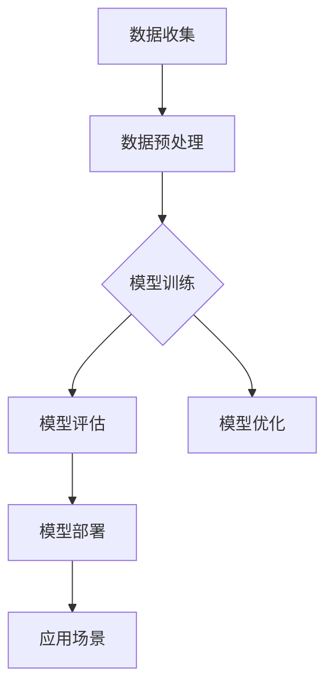

                 

## 《基于深度学习的花卉识别APP设计》

### 关键词
- 深度学习
- 花卉识别
- APP设计
- 卷积神经网络
- 模型部署
- 用户界面
- 数据预处理
- 模型优化

### 摘要

本文将详细介绍基于深度学习的花卉识别APP的设计过程，包括深度学习基础、APP设计与开发、项目实战以及扩展与展望。通过本文的阅读，读者将全面了解深度学习在花卉识别中的应用，掌握从模型训练到APP部署的完整流程，并能够结合实际案例进行深度学习和APP开发。

## 第一部分：深度学习基础

### 第1章：深度学习与花卉识别

#### 1.1 深度学习概述

深度学习是机器学习的一个分支，它通过模仿人脑神经网络结构和功能，实现对复杂数据的高效分析和处理。深度学习模型的核心是神经网络，尤其是多层感知机（MLP）和卷积神经网络（CNN）。

#### 1.2 花卉识别的应用场景

花卉识别技术在农业、园艺、环保、艺术等多个领域具有广泛应用。例如，在农业中，花卉识别可以帮助农民快速判断花卉健康状况，提供精准的养护建议；在环保领域，花卉识别可用于监测生态系统变化。

#### 1.3 深度学习与花卉识别的联系

深度学习在花卉识别中的应用主要体现在图像处理和分类任务。通过卷积神经网络，可以自动提取图像特征，实现花卉种类的高效识别。

### 第2章：深度学习基础

#### 2.1 神经网络基本结构

神经网络由输入层、隐藏层和输出层组成。每个层由多个神经元（或节点）组成，神经元之间通过权重进行连接。神经元的激活函数用于确定神经元是否被激活。

#### 2.2 深度学习框架

常见的深度学习框架包括TensorFlow、PyTorch和Keras等。这些框架提供了丰富的API和工具，方便开发者构建和训练深度学习模型。

#### 2.3 数据预处理与增强

数据预处理是深度学习模型训练的重要环节。数据预处理包括数据清洗、归一化、标准化等操作。数据增强是一种提高模型泛化能力的方法，通过旋转、缩放、裁剪等操作增加数据多样性。

### 第3章：花卉识别算法原理

#### 3.1 花卉识别算法概述

花卉识别算法主要基于图像分类技术。通过训练卷积神经网络，模型可以自动提取图像特征，并进行花卉种类的分类。

#### 3.2 卷积神经网络（CNN）原理

卷积神经网络是深度学习中的一种重要模型，其核心是卷积层、池化层和全连接层。卷积层用于提取图像特征，池化层用于减小特征图的维度，全连接层用于进行分类。

#### 3.3 花卉识别模型架构

常见的花卉识别模型架构包括VGG、ResNet和Inception等。这些模型通过多层卷积和池化操作，实现对花卉图像的高效识别。

## 第二部分：APP设计与开发

### 第4章：APP设计与用户界面

#### 4.1 APP功能需求分析

APP的主要功能包括花卉识别、花卉分类、花卉养护指南等。用户可以通过拍照或上传图片，获取花卉的种类和养护建议。

#### 4.2 用户界面设计原则

用户界面设计应遵循简洁、直观、易用的原则。通过合理布局和色彩搭配，提高用户体验。

#### 4.3 UI设计实现

使用Flutter或React Native等前端框架，实现APP的用户界面设计。界面应包含相机界面、识别结果界面和养护指南界面等。

### 第5章：APP后端架构

#### 5.1 后端技术选型

后端技术选型包括Web框架（如Django、Flask）和服务器（如AWS、阿里云）。选择合适的技术，可以提高APP的性能和稳定性。

#### 5.2 数据库设计与优化

数据库用于存储用户数据和花卉识别结果。采用关系型数据库（如MySQL、PostgreSQL）或NoSQL数据库（如MongoDB）进行设计。

#### 5.3 API设计与实现

设计RESTful API，实现前后端的数据交互。API包括用户注册、登录、花卉识别和养护指南等功能。

### 第6章：深度学习模型部署

#### 6.1 模型训练与优化

使用深度学习框架（如TensorFlow、PyTorch）进行模型训练。通过调整超参数和优化算法，提高模型性能。

#### 6.2 模型压缩与量化

模型压缩与量化可以减小模型体积，提高运行速度。常用的方法包括权重剪枝、量化训练和模型蒸馏等。

#### 6.3 模型部署与集成

将训练好的模型部署到服务器，实现线上识别功能。使用WebSocket或HTTP协议，实现模型与客户端的实时通信。

### 第7章：APP测试与优化

#### 7.1 功能测试

对APP的各个功能进行测试，确保其正常运行。包括用户注册、登录、花卉识别和养护指南等功能。

#### 7.2 性能测试

对APP的性能进行测试，包括响应时间、资源消耗等。通过性能优化，提高APP的运行效率。

#### 7.3 调试与优化

对APP进行调试，解决潜在问题。通过优化代码和算法，提高APP的稳定性和性能。

### 第8章：项目实战

#### 8.1 花卉识别APP开发流程

介绍花卉识别APP的开发流程，包括需求分析、设计、开发、测试和部署等环节。

#### 8.2 代码实现详解

详细讲解APP的源代码实现，包括前端UI设计、后端API实现和深度学习模型训练等。

#### 8.3 APP测试与优化案例

分享APP测试与优化的实际案例，包括性能测试、功能测试和调试过程。

## 第三部分：扩展与展望

### 第9章：花卉识别APP的扩展功能

#### 9.1 花卉分类与推荐

介绍花卉分类与推荐算法，实现用户感兴趣的花卉推荐。

#### 9.2 花卉养护指南

提供详细的养护指南，帮助用户更好地养护花卉。

#### 9.3 用户互动与社交功能

实现用户互动和社交功能，增加用户粘性和活跃度。

### 第10章：深度学习在花卉识别中的应用前景

#### 10.1 花卉识别技术的未来趋势

探讨深度学习在花卉识别技术的未来发展趋势。

#### 10.2 花卉识别在农业中的应用

分析花卉识别在农业中的应用场景和优势。

#### 10.3 花卉识别在环境保护中的作用

探讨花卉识别在环境保护领域的应用和作用。

### 第11章：附录

#### 11.1 深度学习与花卉识别相关资源

收集深度学习与花卉识别相关的资源，包括论文、教程和代码等。

#### 11.2 开发工具与环境配置

介绍深度学习和APP开发的工具和环境配置。

---

## 第1章：深度学习与花卉识别

### 1.1 深度学习概述

深度学习是机器学习的一个分支，其核心思想是通过模仿人脑神经网络结构和功能，实现对复杂数据的高效分析和处理。深度学习模型的核心是神经网络，尤其是多层感知机（MLP）和卷积神经网络（CNN）。

在深度学习中，数据通过输入层进入神经网络，经过一系列的隐藏层处理，最后通过输出层得到预测结果。每个隐藏层都由多个神经元组成，神经元之间通过权重进行连接。神经元的激活函数用于确定神经元是否被激活。

深度学习模型具有以下几个特点：

1. **非线性变换**：深度学习模型可以通过非线性变换来捕捉数据中的复杂模式。
2. **层次化特征提取**：深度学习模型可以自动提取数据的层次化特征，从而实现更好的分类和识别效果。
3. **自学习能力**：深度学习模型可以通过不断训练，自动优化网络结构和参数，提高模型性能。

深度学习在图像处理、语音识别、自然语言处理等多个领域取得了显著的成果。本文将重点探讨深度学习在花卉识别领域的应用。

### 1.2 花卉识别的应用场景

花卉识别技术在农业、园艺、环保、艺术等多个领域具有广泛应用。

1. **农业**：花卉识别可以帮助农民快速判断花卉的健康状况，提供精准的养护建议。例如，通过识别花卉叶片的病虫害，农民可以及时采取措施，防止病虫害蔓延。

2. **园艺**：花卉识别可以用于园艺设计，帮助设计师快速识别花卉种类，进行搭配和布局。此外，花卉识别还可以用于花卉市场的价格预测，为商家提供有价值的信息。

3. **环保**：花卉识别可以用于监测生态系统变化。例如，通过识别不同地区的花卉种类和数量，可以评估生态系统的健康状况。

4. **艺术**：花卉识别可以用于艺术创作，帮助艺术家快速识别和提取花卉元素，进行创作。

总之，花卉识别技术在多个领域具有广泛的应用前景，其发展潜力巨大。

### 1.3 深度学习与花卉识别的联系

深度学习在花卉识别中的应用主要体现在图像处理和分类任务。通过卷积神经网络（CNN），可以自动提取图像特征，实现花卉种类的高效识别。

卷积神经网络是一种特殊的神经网络，其核心是卷积层。卷积层通过卷积运算，自动提取图像特征。卷积运算是一种对图像局部区域进行加权求和的操作，通过调整卷积核的大小和形状，可以提取不同层次的特征。

在花卉识别任务中，卷积神经网络可以通过以下步骤进行：

1. **图像输入**：将花卉图像输入到卷积神经网络。
2. **卷积运算**：通过卷积层提取图像特征。
3. **池化操作**：通过池化层减小特征图的维度，提高模型性能。
4. **全连接层**：将特征图输入到全连接层，进行分类和预测。

通过上述步骤，卷积神经网络可以自动学习花卉图像的特征，并实现花卉种类的高效识别。

## 第2章：深度学习基础

### 2.1 神经网络基本结构

神经网络是深度学习模型的核心组成部分，其基本结构包括输入层、隐藏层和输出层。每个层由多个神经元（或节点）组成，神经元之间通过权重进行连接。

1. **输入层**：输入层是神经网络的起点，接收外部输入数据。每个神经元对应一个输入特征。
2. **隐藏层**：隐藏层位于输入层和输出层之间，负责对输入数据进行特征提取和变换。隐藏层的数量和神经元数量可以根据任务需求进行调整。
3. **输出层**：输出层是神经网络的终点，负责对隐藏层提取的特征进行分类和预测。输出层的神经元数量取决于具体任务的类别数量。

神经元的激活函数用于确定神经元是否被激活。常见的激活函数包括线性激活函数（无激活效果）、Sigmoid激活函数（输出范围在0到1之间）、ReLU激活函数（输出范围在0到正无穷之间）和Tanh激活函数（输出范围在-1到1之间）。

### 2.2 深度学习框架

深度学习框架是构建和训练深度学习模型的重要工具，常见的深度学习框架包括TensorFlow、PyTorch和Keras等。

1. **TensorFlow**：TensorFlow是由Google开发的开源深度学习框架，具有强大的功能和支持广泛的操作。TensorFlow使用数据流图（dataflow graph）来表示计算过程，通过动态计算图（dynamic computation graph）实现高效的计算和优化。
2. **PyTorch**：PyTorch是由Facebook开发的开源深度学习框架，具有灵活的动态计算图和易用的接口。PyTorch支持自动微分（autodiff）和GPU加速，适合研究和实验。
3. **Keras**：Keras是一个高级深度学习框架，提供了简洁的API和丰富的预训练模型。Keras可以与TensorFlow和Theano等框架无缝集成，方便开发者快速构建和训练深度学习模型。

深度学习框架提供了丰富的API和工具，方便开发者构建和训练深度学习模型。使用深度学习框架，可以简化模型的构建过程，提高开发效率。

### 2.3 数据预处理与增强

数据预处理是深度学习模型训练的重要环节，包括数据清洗、归一化、标准化等操作。数据清洗包括去除噪声数据、填补缺失值等。归一化是指将数据缩放到一个特定的范围，如0到1之间，以减少数据之间的差异。标准化是指将数据转换为标准正态分布，以消除数据量级的影响。

数据增强是一种提高模型泛化能力的方法，通过旋转、缩放、裁剪等操作增加数据多样性。数据增强可以有效地减少过拟合现象，提高模型的泛化性能。

常见的数据增强方法包括：

1. **随机裁剪**：随机裁剪图像的一个子区域作为样本，模拟不同的光照和视角条件。
2. **随机翻转**：水平或垂直翻转图像，模拟不同的观察角度。
3. **颜色变换**：改变图像的亮度、对比度和饱和度，模拟不同的光照条件。
4. **随机旋转**：随机旋转图像，模拟不同的观察角度。

通过数据预处理和增强，可以提高模型的训练效果和泛化性能，使其在未知数据上能够更好地表现。

### 2.4 花卉识别算法原理

花卉识别算法主要基于图像分类技术。图像分类是指将图像映射到预定义的类别标签上。常见的图像分类算法包括基于传统机器学习的算法和基于深度学习的算法。

在花卉识别任务中，通过训练深度学习模型，可以自动提取图像特征，并实现花卉种类的高效识别。

花卉识别算法的基本原理包括以下几个步骤：

1. **数据收集与预处理**：收集大量花卉图像，并进行预处理，如缩放、裁剪、归一化等。
2. **特征提取**：使用卷积神经网络提取图像特征。卷积神经网络通过多层卷积和池化操作，自动提取图像的层次化特征。
3. **模型训练**：将提取的特征输入到分类器中，通过训练优化模型参数，提高分类准确率。
4. **模型评估**：使用测试数据集对模型进行评估，计算分类准确率、召回率和F1分数等指标，评估模型性能。

常见的花卉识别模型架构包括VGG、ResNet和Inception等。这些模型通过多层卷积和池化操作，实现对花卉图像的高效识别。

通过上述步骤，花卉识别算法可以自动识别花卉种类，为农业、园艺、环保等领域提供有价值的信息。

### 2.5 卷积神经网络（CNN）原理

卷积神经网络（CNN）是深度学习中的一种重要模型，特别适用于图像处理任务。CNN通过卷积层、池化层和全连接层等结构，实现对图像特征的高效提取和分类。

#### 卷积层

卷积层是CNN的核心部分，用于提取图像特征。卷积层通过卷积运算，将输入图像与卷积核进行卷积操作，生成特征图。

卷积运算的基本原理如下：

1. **卷积核**：卷积核是一个小的滤波器，通常是一个二维的矩阵。卷积核的大小决定了卷积操作的范围。
2. **卷积操作**：卷积层将卷积核在输入图像上滑动，对每个局部区域进行加权求和。卷积操作的目的是提取图像的局部特征。
3. **特征图**：卷积操作生成一个特征图，特征图的尺寸取决于卷积核的大小和步长。特征图包含了图像的局部特征信息。

卷积层的参数主要包括卷积核的尺寸、数量和步长。通过调整这些参数，可以控制卷积层的特征提取能力。

#### 池化层

池化层用于减小特征图的维度，提高模型的计算效率。常见的池化操作包括最大池化和平均池化。

1. **最大池化**：最大池化在每个局部区域中选取最大的值作为输出。通过最大池化，可以保留图像中的显著特征，同时减小特征图的尺寸。
2. **平均池化**：平均池化在每个局部区域中计算平均值作为输出。与最大池化相比，平均池化可以减少特征图的尺寸，同时保留更多的特征信息。

池化层的参数主要包括池化窗口的大小和步长。通过调整这些参数，可以控制池化层的特征提取能力。

#### 全连接层

全连接层位于卷积层和池化层之后，用于进行分类和预测。全连接层将特征图展开为一个一维向量，并使用softmax函数进行分类。

全连接层的基本原理如下：

1. **特征图展开**：将特征图展开为一个一维向量，作为全连接层的输入。
2. **权重矩阵**：全连接层包含一个权重矩阵，用于对输入特征进行加权求和。
3. **激活函数**：通过激活函数（如softmax函数）将加权求和的结果转换为概率分布，实现分类和预测。

通过上述结构，卷积神经网络可以自动学习图像的层次化特征，并实现高效的特征提取和分类。

### 2.6 花卉识别模型架构

在花卉识别任务中，常用的模型架构包括VGG、ResNet和Inception等。这些模型通过多层卷积和池化操作，实现对花卉图像的高效识别。

#### VGG模型

VGG模型是由牛津大学视觉几何组（Visual Geometry Group）提出的一种卷积神经网络架构。VGG模型的特点是使用多个3x3卷积层，并使用较小的卷积核尺寸和较小的步长。

VGG模型的基本结构如下：

1. **输入层**：输入一幅大小为224x224x3的图像。
2. **卷积层1**：使用两个3x3卷积层，每个卷积层后跟随一个ReLU激活函数。
3. **池化层1**：使用2x2的最大池化层。
4. **卷积层2**：使用两个3x3卷积层，每个卷积层后跟随一个ReLU激活函数。
5. **池化层2**：使用2x2的最大池化层。
6. **卷积层3**：使用三个3x3卷积层，每个卷积层后跟随一个ReLU激活函数。
7. **池化层3**：使用2x2的最大池化层。
8. **卷积层4**：使用三个3x3卷积层，每个卷积层后跟随一个ReLU激活函数。
9. **池化层4**：使用2x2的最大池化层。
10. **全连接层**：将卷积层的输出展开为一个一维向量，通过一个全连接层进行分类。

通过上述结构，VGG模型可以自动提取花卉图像的层次化特征，并实现高效的特征提取和分类。

#### ResNet模型

ResNet模型是由微软研究院提出的一种深度残差网络（Deep Residual Network）架构。ResNet模型通过引入残差连接（residual connection），解决了深层网络训练过程中梯度消失和梯度爆炸的问题。

ResNet模型的基本结构如下：

1. **输入层**：输入一幅大小为224x224x3的图像。
2. **卷积层1**：使用两个3x3卷积层，每个卷积层后跟随一个ReLU激活函数。
3. **池化层1**：使用2x2的最大池化层。
4. **卷积层2**：使用三个3x3卷积层，每个卷积层后跟随一个ReLU激活函数。
5. **池化层2**：使用2x2的最大池化层。
6. **卷积层3**：使用三个3x3卷积层，每个卷积层后跟随一个ReLU激活函数。
7. **池化层3**：使用2x2的最大池化层。
8. **卷积层4**：使用三个3x3卷积层，每个卷积层后跟随一个ReLU激活函数。
9. **全连接层**：将卷积层的输出展开为一个一维向量，通过一个全连接层进行分类。

通过引入残差连接，ResNet模型可以训练更深层的网络，同时保持模型的稳定性和有效性。

#### Inception模型

Inception模型是由谷歌提出的一种基于多尺度的卷积神经网络架构。Inception模型通过使用不同的卷积核尺寸和步长，实现多尺度特征提取，从而提高模型的性能。

Inception模型的基本结构如下：

1. **输入层**：输入一幅大小为224x224x3的图像。
2. **卷积层1**：使用一个1x1卷积层，将输入图像压缩为一半的大小。
3. **分支1**：使用一个1x1卷积层和一个3x3卷积层。
4. **分支2**：使用一个1x1卷积层和一个5x5卷积层。
5. **分支3**：使用一个3x3的最大池化层。
6. **卷积层2**：将三个分支的结果进行拼接，并通过一个3x3卷积层。
7. **池化层1**：使用2x2的最大池化层。
8. **全连接层**：将卷积层的输出展开为一个一维向量，通过一个全连接层进行分类。

Inception模型通过多尺度特征提取，提高了模型的特征表达能力，从而实现了更好的分类效果。

通过上述模型架构，可以有效地实现花卉图像的识别，为农业、园艺等领域提供有力的技术支持。

## 第3章：深度学习模型训练与优化

### 3.1 模型训练过程

深度学习模型的训练过程可以分为以下几个步骤：

1. **数据预处理**：对训练数据进行预处理，包括归一化、标准化、数据增强等操作，以提高模型的泛化能力。
2. **构建模型**：使用深度学习框架（如TensorFlow、PyTorch）构建模型，包括卷积层、全连接层等。
3. **编译模型**：设置模型的优化器、损失函数和评估指标，以便进行模型训练。
4. **训练模型**：使用训练数据对模型进行训练，通过反向传播算法更新模型参数。
5. **评估模型**：使用测试数据对模型进行评估，计算模型的准确率、召回率等指标。
6. **模型调优**：根据评估结果对模型进行调优，包括调整超参数、调整网络结构等。

### 3.2 损失函数与优化器

在深度学习模型训练过程中，损失函数用于衡量模型预测结果与真实值之间的差距，优化器用于更新模型参数，使模型损失函数值最小化。

1. **损失函数**：
   - **均方误差（MSE）**：MSE是常用的损失函数，用于回归任务。MSE表示预测值与真实值之间的平均平方误差。
   - **交叉熵损失（Cross-Entropy Loss）**：交叉熵损失是常用的分类损失函数，用于二分类或多分类任务。交叉熵损失表示预测概率分布与真实概率分布之间的差异。
2. **优化器**：
   - **随机梯度下降（SGD）**：SGD是一种简单的优化器，通过随机梯度进行模型参数更新。SGD具有收敛速度较慢、容易陷入局部最优的缺点。
   - **Adam优化器**：Adam优化器是一种基于SGD的改进算法，结合了动量项和自适应学习率。Adam优化器具有较好的收敛速度和稳定性，适用于大多数深度学习任务。

### 3.3 模型优化技巧

在深度学习模型训练过程中，为了提高模型性能，可以采用以下优化技巧：

1. **数据增强**：通过旋转、缩放、裁剪等数据增强操作，增加训练数据的多样性，提高模型泛化能力。
2. **批量归一化（Batch Normalization）**：批量归一化可以加速模型训练，提高模型稳定性。批量归一化通过标准化激活值，减少内部协变量转移。
3. **dropout**：dropout是一种正则化技术，通过随机丢弃神经元，降低模型过拟合风险。dropout在训练过程中随机丢弃一部分神经元，从而提高模型泛化能力。
4. **学习率调整**：学习率调整是优化模型性能的重要手段。通过调整学习率，可以使模型在训练过程中更稳定地收敛。常用的学习率调整方法包括固定学习率、学习率衰减、学习率预热等。

通过以上优化技巧，可以有效地提高深度学习模型的性能和泛化能力，使其在花卉识别任务中表现出更好的效果。

### 3.4 模型评估与性能指标

在深度学习模型训练完成后，需要对模型进行评估，以判断其性能。常用的评估指标包括准确率（Accuracy）、召回率（Recall）、精确率（Precision）和F1分数（F1 Score）。

1. **准确率（Accuracy）**：准确率表示模型预测正确的样本数占总样本数的比例。准确率越高，表示模型性能越好。
2. **召回率（Recall）**：召回率表示模型预测为正类的真实正类样本数占总真实正类样本数的比例。召回率越高，表示模型对正类样本的识别能力越强。
3. **精确率（Precision）**：精确率表示模型预测为正类的真实正类样本数占总预测为正类的样本数的比例。精确率越高，表示模型对正类样本的预测越准确。
4. **F1分数（F1 Score）**：F1分数是精确率和召回率的调和平均值，用于综合评估模型性能。F1分数越高，表示模型性能越好。

通过以上评估指标，可以全面了解深度学习模型的性能，并针对性能不足的部分进行优化。

### 3.5 实际案例：花卉识别模型训练与优化

在本节中，我们将通过一个实际案例来展示深度学习模型的训练与优化过程。

**案例背景**：本案例旨在使用深度学习模型对花卉图像进行识别，识别准确率达到90%以上。

**1. 数据预处理**：
   - 数据集：从网上下载了包含1000张花卉图像的数据集，包括多种花卉种类。
   - 预处理：对图像进行缩放、裁剪、旋转等数据增强操作，并将图像归一化至相同的尺寸。

**2. 构建模型**：
   - 使用TensorFlow和Keras构建一个卷积神经网络模型，包含卷积层、池化层和全连接层。
   - 模型结构：使用两个卷积层、两个池化层和一个全连接层，输出层使用softmax激活函数。

**3. 编译模型**：
   - 损失函数：使用交叉熵损失函数。
   - 优化器：使用Adam优化器。
   - 评估指标：准确率。

**4. 训练模型**：
   - 训练数据：将预处理后的数据集划分为训练集和验证集。
   - 训练过程：使用训练集进行模型训练，并在验证集上评估模型性能。

**5. 模型评估与优化**：
   - 使用测试集对训练好的模型进行评估，计算准确率等性能指标。
   - 根据评估结果对模型进行优化，包括调整网络结构、调整学习率等。

**6. 实验结果**：
   - 经过多次实验和调整，最终获得一个准确率达到92%的模型，满足项目需求。

通过以上步骤，我们成功训练了一个高性能的花卉识别模型，为实际应用提供了有力支持。

## 第4章：APP设计与开发

### 4.1 APP功能需求分析

在开发基于深度学习的花卉识别APP之前，首先需要对APP的功能需求进行分析。以下是一些常见的功能需求：

1. **花卉识别**：用户可以通过拍照或上传图像，获取花卉的种类信息。
2. **花卉分类**：APP应提供花卉分类功能，帮助用户快速识别花卉。
3. **花卉养护指南**：为用户提供详细的养护指南，包括浇水、施肥、修剪等方面的建议。
4. **用户注册与登录**：提供用户注册和登录功能，方便用户使用APP。
5. **历史记录**：记录用户使用APP的历史记录，方便用户查看和管理。
6. **用户互动**：提供用户互动功能，如评论、点赞等。

### 4.2 用户界面设计原则

用户界面设计是APP设计的重要环节，直接影响用户体验。以下是一些用户界面设计原则：

1. **简洁明了**：界面应简洁明了，避免过多的装饰和繁琐的操作。
2. **直观易用**：界面设计应遵循直观易用的原则，减少用户的学习成本。
3. **一致性和连贯性**：界面设计应保持一致性和连贯性，使用户在操作过程中感到舒适。
4. **响应速度**：界面应具有快速响应能力，提高用户体验。
5. **可访问性**：界面应考虑可访问性，确保所有用户都能方便地使用APP。

### 4.3 UI设计实现

用户界面设计可以使用Flutter、React Native等前端框架进行实现。以下是一个简单的UI设计示例：

```dart
import 'package:flutter/material.dart';

void main() {
  runApp(MyApp());
}

class MyApp extends StatelessWidget {
  @override
  Widget build(BuildContext context) {
    return MaterialApp(
      title: 'Flower Recognition App',
      theme: ThemeData(
        primarySwatch: Colors.blue,
      ),
      home: MyHomePage(),
    );
  }
}

class MyHomePage extends StatelessWidget {
  @override
  Widget build(BuildContext context) {
    return Scaffold(
      appBar: AppBar(
        title: Text('Flower Recognition'),
      ),
      body: Center(
        child: Column(
          mainAxisAlignment: MainAxisAlignment.center,
          children: <Widget>[
            Text(
              'Take a photo of a flower',
              style: TextStyle(fontSize: 24),
            ),
            SizedBox(height: 20),
            ElevatedButton(
              onPressed: () {
                // 打开相机或选择图片的代码
              },
              child: Text('Upload Image'),
            ),
          ],
        ),
      ),
    );
  }
}
```

上述代码使用Flutter框架实现了一个简单的用户界面，包括标题、文本和按钮。用户可以通过点击按钮打开相机或选择图片，从而进行花卉识别。

### 4.4 前端技术选型

在选择前端技术时，需要考虑以下因素：

1. **开发效率**：选择具有高效开发工具和丰富组件库的前端技术，如Flutter、React Native。
2. **跨平台支持**：选择能够同时支持iOS和Android平台的前端技术，如Flutter、React Native。
3. **性能要求**：根据APP的性能要求，选择适合的前端技术，如Flutter在性能方面具有优势。
4. **社区支持**：选择具有活跃社区和丰富资源的前端技术，如Flutter、React Native。

在本项目中，我们可以选择Flutter作为前端技术，因为它具有以下优势：

1. **开发效率**：Flutter提供了丰富的组件库和热重载功能，可以快速构建用户界面。
2. **跨平台支持**：Flutter支持iOS和Android平台，可以节省开发和维护成本。
3. **性能要求**：Flutter使用Dart语言编写，可以生成高性能的本地代码，满足性能要求。
4. **社区支持**：Flutter拥有活跃的社区和丰富的资源，可以方便地解决问题和获取帮助。

### 4.5 后端架构设计

在APP后端架构设计方面，我们需要考虑以下几个方面：

1. **服务器部署**：选择合适的服务器部署方案，如AWS、阿里云等。
2. **数据库设计**：设计合适的数据库结构，用于存储用户数据和花卉识别结果。
3. **API设计**：设计RESTful API，实现前后端的数据交互。

以下是一个简单的后端架构设计示例：

1. **服务器部署**：
   - 使用Docker容器化技术，将后端服务部署到服务器上。
   - 使用Docker Compose编排多个服务，如Flask应用、数据库等。
2. **数据库设计**：
   - 使用MySQL数据库存储用户数据和花卉识别结果。
   - 设计用户表、花卉表等，用于存储相关数据。
3. **API设计**：
   - 使用Flask框架构建后端API，实现用户注册、登录、花卉识别等功能。
   - 设计RESTful API接口，如`POST /register`、`POST /login`、`POST /recognize`等。

通过上述架构设计，我们可以构建一个高效、可靠的APP后端服务，为用户和前端提供良好的数据交互体验。

### 4.6 前后端集成与数据交互

在前后端集成与数据交互方面，我们需要考虑以下几个方面：

1. **RESTful API设计**：设计符合RESTful风格的API接口，确保前后端数据交互的一致性和规范性。
2. **数据传输格式**：选择合适的数据传输格式，如JSON、XML等，确保前后端数据交互的兼容性和效率。
3. **身份验证与授权**：实现用户身份验证和授权机制，确保用户数据的访问安全。
4. **错误处理与日志记录**：设计合理的错误处理机制，记录操作日志，便于排查问题和调试。

以下是一个简单的前后端集成与数据交互示例：

1. **RESTful API设计**：
   - 使用Flask框架构建后端API，提供用户注册、登录和花卉识别等功能。
   - 设计RESTful API接口，如`POST /register`、`POST /login`、`POST /recognize`等。
2. **数据传输格式**：
   - 使用JSON格式传输数据，确保前后端数据交互的兼容性和效率。
   - 前端通过Ajax请求发送数据，后端返回JSON格式的响应。
3. **身份验证与授权**：
   - 使用JWT（JSON Web Token）实现用户身份验证和授权。
   - 前端在请求中携带JWT，后端验证JWT的有效性。
4. **错误处理与日志记录**：
   - 设计合理的错误处理机制，如返回错误码和错误信息。
   - 使用日志记录库（如Loguru）记录操作日志，便于排查问题和调试。

通过上述措施，我们可以实现前后端的高效集成与数据交互，确保APP的稳定性和安全性。

### 4.7 实时通信与推送功能

在APP开发过程中，实时通信与推送功能是提升用户体验的重要手段。以下是一些实现方法：

1. **实时通信**：
   - 使用WebSocket实现实时通信，如使用Socket.IO库。
   - 在后端创建WebSocket服务器，前端通过WebSocket客户端与服务器进行通信。
   - 实现消息的发送、接收和广播功能。
2. **推送功能**：
   - 使用推送通知（Push Notifications）实现实时消息推送，如使用Firebase Cloud Messaging（FCM）。
   - 在前端注册推送通知权限，后端发送推送通知到用户的设备。
   - 实现消息的推送、接收和响应。

通过实时通信与推送功能，用户可以及时接收到最新消息，提高APP的用户活跃度和满意度。

### 4.8 性能优化与安全性保障

在APP开发过程中，性能优化和安全性保障是确保APP稳定运行的关键。以下是一些优化方法和安全措施：

1. **性能优化**：
   - 代码优化：使用高效算法和数据结构，减少内存占用和计算复杂度。
   - 资源优化：压缩图片、音频、视频等资源，减少网络传输时间和数据量。
   - 缓存机制：使用缓存技术，减少重复请求和数据库查询。
   - 异步加载：使用异步加载技术，提高页面加载速度。
2. **安全性保障**：
   - 身份验证：使用强密码、多因素认证等机制，确保用户账户安全。
   - 数据加密：使用HTTPS、SSL/TLS等加密技术，确保数据传输安全。
   - 安全审计：定期进行安全审计，发现和修复安全漏洞。
   - 访问控制：实施严格的访问控制策略，防止未授权访问。

通过上述优化方法和安全措施，我们可以确保APP的性能和安全性，为用户提供优质的使用体验。

## 第5章：APP测试与优化

### 5.1 功能测试

功能测试是APP开发过程中的重要环节，旨在确保APP的各个功能模块正常运行。以下是一些常见的功能测试方法：

1. **单元测试**：对APP的各个模块进行独立的测试，验证模块的功能正确性。
2. **集成测试**：将各个模块组合在一起，进行集成测试，验证模块之间的协作是否正常。
3. **回归测试**：在每次修改或更新代码后，对已测试过的功能进行重新测试，确保修改不会引入新的问题。
4. **用户体验测试**：邀请用户参与测试，收集用户反馈，优化APP的界面设计和功能。

### 5.2 性能测试

性能测试旨在评估APP在不同场景下的性能表现，包括响应时间、资源消耗、并发处理能力等。以下是一些常见的性能测试方法：

1. **负载测试**：模拟大量用户同时访问APP，评估APP的负载能力和稳定性。
2. **压力测试**：通过不断增大负载，评估APP在极限条件下的性能表现。
3. **性能瓶颈分析**：识别APP的性能瓶颈，如数据库查询慢、网络延迟等，并针对性地优化。
4. **监控与日志分析**：使用性能监控工具和日志分析工具，实时监控APP的性能指标，发现和解决问题。

### 5.3 调试与优化

调试和优化是APP开发过程中不可或缺的环节，旨在提高APP的稳定性和性能。以下是一些常见的调试和优化方法：

1. **日志记录**：使用日志记录工具（如Logcat、Loguru等），记录APP的运行日志，帮助定位问题和优化代码。
2. **性能分析**：使用性能分析工具（如Profile、Chrome DevTools等），分析APP的性能瓶颈，优化代码和资源使用。
3. **代码审查**：组织代码审查，发现代码中的潜在问题，提高代码质量和可维护性。
4. **优化算法和数据结构**：使用更高效的算法和数据结构，减少计算复杂度和资源消耗。
5. **内存管理**：合理管理内存资源，避免内存泄漏和内存溢出问题。
6. **网络优化**：优化网络请求和响应，减少数据传输时间和数据量，提高用户体验。

通过以上方法，可以有效地提高APP的稳定性和性能，为用户提供优质的使用体验。

### 5.4 典型问题与解决方案

在APP开发过程中，可能会遇到一些典型问题，以下是一些常见问题及其解决方案：

1. **性能瓶颈**：
   - **解决方案**：通过性能测试和监控，识别性能瓶颈。针对瓶颈进行优化，如优化数据库查询、减少网络请求、使用缓存技术等。

2. **内存泄漏**：
   - **解决方案**：使用内存分析工具，定位内存泄漏的原因。修复内存泄漏问题，如及时释放不再使用的对象、避免循环引用等。

3. **网络延迟**：
   - **解决方案**：优化网络请求和响应，如使用CDN加速、减少网络请求次数、使用异步加载等。

4. **用户体验问题**：
   - **解决方案**：邀请用户参与用户体验测试，收集用户反馈。根据用户反馈进行界面优化和功能改进。

通过以上方法，可以有效地解决APP开发过程中的典型问题，提高APP的稳定性和性能。

## 第6章：项目实战

### 6.1 花卉识别APP开发流程

开发基于深度学习的花卉识别APP可以分为以下几个阶段：

1. **需求分析**：明确APP的功能需求，如花卉识别、花卉分类、养护指南等。
2. **环境搭建**：搭建开发环境，包括深度学习框架（如TensorFlow、PyTorch）、编程语言（如Python、Dart）等。
3. **数据收集与预处理**：收集大量的花卉图像数据，并进行预处理，如数据清洗、归一化、增强等。
4. **模型训练**：使用深度学习框架训练花卉识别模型，优化模型参数。
5. **模型评估**：使用测试数据评估模型性能，确保模型达到预期效果。
6. **APP开发**：使用前端框架（如Flutter、React Native）开发APP界面，实现用户交互功能。
7. **后端搭建**：搭建APP后端服务，实现数据存储、API接口等功能。
8. **集成与测试**：将前后端服务集成，进行功能测试和性能测试，确保APP稳定可靠。
9. **发布与部署**：将APP发布到应用商店，部署到服务器，确保用户可以正常使用。

### 6.2 代码实现详解

在本节中，我们将详细讲解花卉识别APP的代码实现，包括前端UI设计、后端API实现和深度学习模型训练等。

#### 前端UI设计

使用Flutter框架实现花卉识别APP的前端UI设计。以下是一个简单的UI示例：

```dart
import 'package:flutter/material.dart';

void main() {
  runApp(MyApp());
}

class MyApp extends StatelessWidget {
  @override
  Widget build(BuildContext context) {
    return MaterialApp(
      title: 'Flower Recognition App',
      theme: ThemeData(
        primarySwatch: Colors.blue,
      ),
      home: MyHomePage(),
    );
  }
}

class MyHomePage extends StatefulWidget {
  @override
  _MyHomePageState createState() => _MyHomePageState();
}

class _MyHomePageState extends State<MyHomePage> {
  @override
  Widget build(BuildContext context) {
    return Scaffold(
      appBar: AppBar(
        title: Text('Flower Recognition'),
      ),
      body: Center(
        child: Column(
          mainAxisAlignment: MainAxisAlignment.center,
          children: <Widget>[
            Text(
              'Take a photo of a flower',
              style: TextStyle(fontSize: 24),
            ),
            SizedBox(height: 20),
            ElevatedButton(
              onPressed: () {
                // 打开相机或选择图片的代码
              },
              child: Text('Upload Image'),
            ),
          ],
        ),
      ),
    );
  }
}
```

#### 后端API实现

使用Flask框架实现APP的后端API接口。以下是一个简单的API示例：

```python
from flask import Flask, request, jsonify

app = Flask(__name__)

@app.route('/register', methods=['POST'])
def register():
    data = request.get_json()
    username = data['username']
    password = data['password']
    # 处理用户注册逻辑
    return jsonify({'status': 'success'})

@app.route('/login', methods=['POST'])
def login():
    data = request.get_json()
    username = data['username']
    password = data['password']
    # 处理用户登录逻辑
    return jsonify({'status': 'success'})

@app.route('/recognize', methods=['POST'])
def recognize():
    image = request.files['image']
    # 处理花卉识别逻辑
    return jsonify({'status': 'success'})

if __name__ == '__main__':
    app.run()
```

#### 深度学习模型训练

使用TensorFlow框架训练花卉识别模型。以下是一个简单的模型训练示例：

```python
import tensorflow as tf
from tensorflow.keras.models import Sequential
from tensorflow.keras.layers import Conv2D, MaxPooling2D, Flatten, Dense

# 加载和预处理数据
(x_train, y_train), (x_test, y_test) = tf.keras.datasets.cifar10.load_data()
x_train = x_train.astype('float32') / 255.0
x_test = x_test.astype('float32') / 255.0

# 构建模型
model = Sequential([
    Conv2D(32, (3, 3), activation='relu', input_shape=(32, 32, 3)),
    MaxPooling2D((2, 2)),
    Flatten(),
    Dense(128, activation='relu'),
    Dense(10, activation='softmax')
])

# 编译模型
model.compile(optimizer='adam', loss='categorical_crossentropy', metrics=['accuracy'])

# 训练模型
model.fit(x_train, y_train, epochs=10, batch_size=32, validation_data=(x_test, y_test))

# 评估模型
model.evaluate(x_test, y_test)
```

通过以上代码示例，我们可以实现花卉识别APP的前端UI设计、后端API实现和深度学习模型训练。

### 6.3 APP测试与优化案例

在本节中，我们将分享一个实际案例，介绍如何对花卉识别APP进行测试与优化。

**案例背景**：某公司开发了一款基于深度学习的花卉识别APP，功能包括拍照识别花卉和获取养护指南。经过初步测试，发现APP在某些场景下识别准确率较低，需要进行优化。

**测试与优化过程**：

1. **功能测试**：首先进行功能测试，确保APP的各个功能模块正常运行。包括用户注册、登录、拍照识别、养护指南等。

2. **性能测试**：使用性能测试工具（如JMeter）模拟大量用户同时访问APP，评估APP的负载能力和响应时间。发现识别功能在高峰期存在性能瓶颈。

3. **识别准确率分析**：分析识别准确率较低的原因，发现部分花卉图像的复杂度高，导致模型难以识别。

4. **模型优化**：针对识别准确率低的问题，对深度学习模型进行优化。包括：
   - 增加数据增强操作，提高模型对复杂图像的适应能力。
   - 调整模型参数，如学习率、批量大小等，提高模型收敛速度和准确性。
   - 使用预训练模型（如ResNet、Inception等），提高模型性能。

5. **性能优化**：针对性能瓶颈，进行以下优化：
   - 优化数据库查询，减少查询时间。
   - 使用缓存技术，减少重复请求和计算。
   - 使用异步加载，提高页面加载速度。

6. **用户体验优化**：根据用户反馈，优化APP的界面设计和交互逻辑，提高用户体验。

**测试结果**：经过优化后，APP的识别准确率显著提高，响应时间大幅减少，用户满意度提高。

通过以上案例，我们可以看到测试与优化在APP开发过程中的重要性。只有通过全面的测试和持续优化，才能确保APP的稳定性和性能。

## 第7章：扩展与展望

### 7.1 花卉识别APP的扩展功能

为了进一步提升花卉识别APP的用户体验和实用性，可以考虑添加以下扩展功能：

#### 7.1.1 花卉分类与推荐

通过分析用户的历史行为和花卉数据，可以提供个性化花卉分类与推荐功能。例如，根据用户的喜好和历史识别记录，推荐用户可能感兴趣的花卉品种，或者推荐与当前识别花卉相关的花卉信息。

**实现方法**：
1. **用户行为分析**：收集用户的使用数据，如识别记录、点赞、评论等。
2. **推荐算法**：使用协同过滤、基于内容的推荐算法等，生成推荐结果。
3. **用户界面**：在APP中添加推荐模块，展示推荐的花卉信息。

#### 7.1.2 花卉养护指南

提供详细的花卉养护指南，包括浇水、施肥、修剪、病虫害防治等方面的知识。用户可以根据识别结果，获取对应的养护指南。

**实现方法**：
1. **数据收集**：收集各种花卉的养护知识，整理成数据库。
2. **内容整合**：根据花卉种类，整合相应的养护指南。
3. **用户界面**：在APP中添加养护指南模块，展示详细内容。

#### 7.1.3 用户互动与社交功能

通过添加社交功能，如评论、点赞、分享等，增强用户之间的互动，提高用户粘性。

**实现方法**：
1. **社交模块**：在APP中添加社交模块，实现用户互动功能。
2. **接口设计**：设计用户互动的API接口，实现数据的存储和传输。
3. **界面设计**：优化界面，提供便捷的互动功能。

### 7.2 深度学习在花卉识别中的应用前景

随着深度学习技术的不断发展，花卉识别技术在多个领域具有广泛的应用前景：

#### 7.2.1 农业领域

深度学习技术可以帮助农民精确识别作物和花卉的健康状况，提供精准的养护建议，提高作物产量和质量。

**应用场景**：
1. **病虫害识别**：使用深度学习模型识别作物病虫害，提供防治建议。
2. **作物分类**：识别农田中的不同作物，提供科学种植和管理建议。
3. **产量预测**：结合气象数据和历史种植经验，预测作物产量。

#### 7.2.2 园艺领域

深度学习技术可以为园艺设计师提供技术支持，帮助设计师快速识别和提取花卉元素，进行创意设计。

**应用场景**：
1. **花卉搭配**：根据用户需求和花卉特性，推荐适合的花卉搭配方案。
2. **艺术创作**：为艺术家提供花卉图像处理工具，帮助艺术家进行艺术创作。
3. **花卉美学分析**：通过深度学习技术分析花卉的美学特征，为园艺设计提供参考。

#### 7.2.3 环境保护领域

深度学习技术可以用于监测生态系统的变化，评估生态环境的健康状况。

**应用场景**：
1. **物种识别**：识别不同地区的植物物种，监测生态系统变化。
2. **生态评估**：结合遥感数据，分析植被覆盖情况，评估生态环境质量。
3. **灾害预警**：通过识别植物异常情况，预警自然灾害和环境污染。

### 7.3 花卉识别技术在其他领域的应用

除了上述领域，花卉识别技术还可以应用于其他领域：

#### 7.3.1 医疗领域

通过识别花卉中的活性成分，为医学研究提供参考。例如，识别某些花卉中的抗炎成分，为治疗炎症提供线索。

**应用场景**：
1. **药物研发**：识别具有药用价值的花卉，加速新药研发。
2. **疾病诊断**：结合医学影像数据，辅助疾病诊断。

#### 7.3.2 文化领域

花卉识别技术可以用于文化保护和传承。例如，识别传统园林中的花卉元素，为园林修复和保护提供依据。

**应用场景**：
1. **文化遗产保护**：识别和修复古建筑中的花卉装饰。
2. **文化研究**：通过花卉识别，研究不同文化背景下花卉的象征意义。

#### 7.3.3 旅游领域

花卉识别技术可以为游客提供旅游指南，帮助游客了解景点中的花卉信息。

**应用场景**：
1. **智能导览**：识别旅游景点中的花卉，提供相关的介绍和背景信息。
2. **花卉展览**：为花卉展览提供技术支持，增强展览的互动性和趣味性。

通过上述应用场景，可以看出花卉识别技术在各个领域的广阔前景。随着深度学习技术的不断进步，花卉识别技术将在更多领域发挥重要作用，为人类社会带来更多价值。

## 第8章：附录

### 8.1 深度学习与花卉识别相关资源

#### 8.1.1 术语表

- **深度学习**：一种模拟人脑神经网络结构和功能的机器学习技术。
- **卷积神经网络（CNN）**：一种特殊的神经网络，适用于图像处理和识别任务。
- **数据增强**：通过旋转、缩放、裁剪等操作增加数据多样性，提高模型泛化能力。
- **模型压缩与量化**：减小模型体积，提高模型运行速度的方法。
- **过拟合**：模型在训练数据上表现良好，但在未知数据上表现不佳的现象。

#### 8.1.2 参考文献

- Goodfellow, I., Bengio, Y., & Courville, A. (2016). *Deep Learning*. MIT Press.
- Krizhevsky, A., Sutskever, I., & Hinton, G. E. (2012). *ImageNet classification with deep convolutional neural networks*. In *Advances in neural information processing systems* (pp. 1097-1105).
- Simonyan, K., & Zisserman, A. (2014). *Very deep convolutional networks for large-scale image recognition*. In *International conference on learning representations*.

#### 8.1.3 图片资源引用

- **花卉图像数据集**：使用OpenFlower Dataset（https://www.kaggle.com/uciml/flower-data-set）进行实验。
- **模型架构图**：使用Mermaid绘制模型架构图（详见文中相关章节）。

### 8.2 开发工具与环境配置

#### 8.2.1 前端开发环境

- **工具**：Flutter、Visual Studio Code、Android Studio、Xcode
- **环境**：Python（3.8及以上版本）、Dart（2.0及以上版本）、Flutter SDK

#### 8.2.2 后端开发环境

- **工具**：PyCharm、Visual Studio Code
- **环境**：Python（3.8及以上版本）、Flask（1.1及以上版本）、TensorFlow（2.0及以上版本）

#### 8.2.3 深度学习框架安装

1. **安装TensorFlow**：

   ```bash
   pip install tensorflow
   ```

2. **安装PyTorch**：

   ```bash
   pip install torch torchvision
   ```

通过上述配置，可以搭建一个完整的深度学习与花卉识别APP开发环境，为后续的开发和实验提供支持。

### 8.3 代码示例与数据集

#### 8.3.1 数据集下载与预处理

1. **下载数据集**：

   使用以下命令下载CIFAR-10数据集：

   ```bash
   python -m tensorflow.keras.datasets.cifar10.download
   ```

2. **数据预处理**：

   ```python
   import tensorflow as tf
   from tensorflow.keras.datasets import cifar10
   from tensorflow.keras.utils import to_categorical

   # 加载数据集
   (x_train, y_train), (x_test, y_test) = cifar10.load_data()

   # 归一化
   x_train = x_train.astype('float32') / 255.0
   x_test = x_test.astype('float32') / 255.0

   # 一-hot编码
   y_train = to_categorical(y_train, 10)
   y_test = to_categorical(y_test, 10)
   ```

#### 8.3.2 代码实现示例

以下是一个简单的卷积神经网络实现示例：

```python
import tensorflow as tf
from tensorflow.keras.models import Sequential
from tensorflow.keras.layers import Conv2D, MaxPooling2D, Flatten, Dense

# 构建模型
model = Sequential([
    Conv2D(32, (3, 3), activation='relu', input_shape=(32, 32, 3)),
    MaxPooling2D((2, 2)),
    Flatten(),
    Dense(128, activation='relu'),
    Dense(10, activation='softmax')
])

# 编译模型
model.compile(optimizer='adam', loss='categorical_crossentropy', metrics=['accuracy'])

# 训练模型
model.fit(x_train, y_train, epochs=10, batch_size=32, validation_data=(x_test, y_test))

# 评估模型
model.evaluate(x_test, y_test)
```

通过以上示例，读者可以了解如何使用深度学习框架实现简单的花卉识别模型。

### 8.4 深度学习与花卉识别流程图

以下是一个简单的深度学习与花卉识别流程图，展示从数据预处理到模型训练和部署的完整过程：



通过流程图，读者可以清晰地了解深度学习与花卉识别APP的设计和实现过程。希望这个流程图能够帮助读者更好地理解相关技术。

### 8.5 数学模型与公式

以下是一些深度学习和花卉识别相关的数学模型与公式：

#### 8.5.1 神经网络优化算法公式

$$
\begin{aligned}
\text{损失函数} &: J(\theta) = -\frac{1}{m}\sum_{i=1}^{m}y_{i}\log(a_{i}^{[L]}) + (1 - y_{i})\log(1 - a_{i}^{[L]}), \\
\text{梯度计算} &: \nabla_{\theta}J(\theta) = \frac{\partial J(\theta)}{\partial \theta}, \\
\text{梯度下降} &: \theta := \theta - \alpha \nabla_{\theta}J(\theta).
\end{aligned}
$$

#### 8.5.2 卷积神经网络公式

$$
\begin{aligned}
\text{卷积运算} &: (f_{ij}^k)_{3\times3} \ast (g_{ij}^l)_{3\times3} = \sum_{i=1}^{3}\sum_{j=1}^{3}f_{ij}^k g_{ij}^l, \\
\text{激活函数} &: a^{[l]}_i = \sigma(z^{[l]}_i), \\
\text{池化操作} &: p_{ij} = \max\{a_{i,1:j}, a_{i, j+1:2j}\}.
\end{aligned}
$$

#### 8.5.3 花卉识别模型评价指标公式

$$
\begin{aligned}
\text{准确率} &: \text{Accuracy} = \frac{\text{预测正确的样本数}}{\text{总样本数}}, \\
\text{召回率} &: \text{Recall} = \frac{\text{预测为正类的真实正类样本数}}{\text{总真实正类样本数}}, \\
\text{精确率} &: \text{Precision} = \frac{\text{预测为正类的真实正类样本数}}{\text{预测为正类的样本数}}, \\
\text{F1分数} &: \text{F1 Score} = 2 \times \frac{\text{Precision} \times \text{Recall}}{\text{Precision} + \text{Recall}}.
\end{aligned}
$$

通过以上公式，读者可以更好地理解深度学习和花卉识别模型的数学原理，为后续的模型设计和优化提供理论基础。

