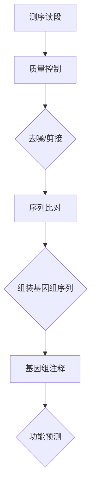
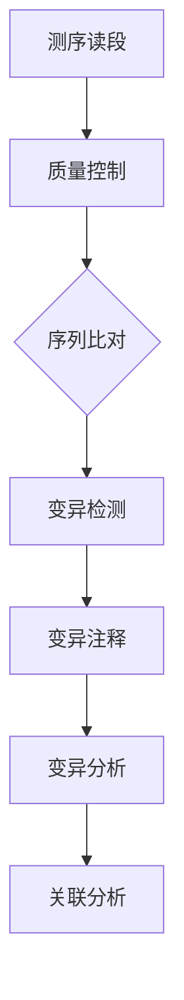
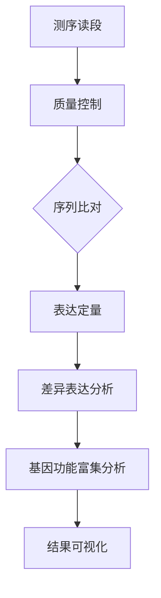
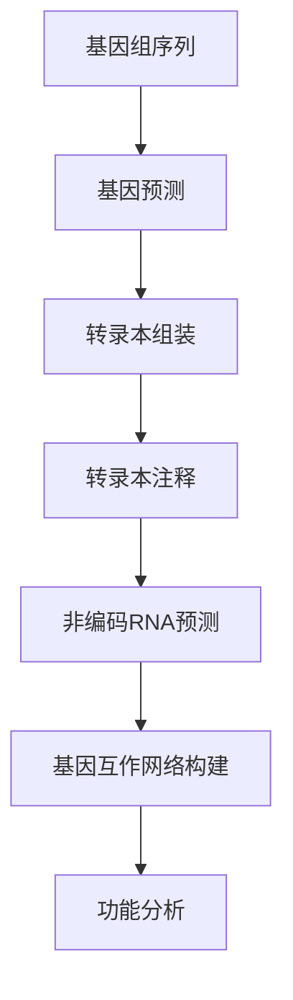

                 

### 《基因组学的大数据分析：生命密码的数学解读》

> **关键词：基因组学、大数据分析、生物信息学、数学模型、生命密码**
>
> **摘要：本文将深入探讨基因组学在大数据分析领域的应用，通过数学模型解读生命密码，解析基因组数据的复杂性，旨在揭示基因组学研究的本质和前沿。文章分为三大部分，分别介绍了基因组学基础知识、基因组数据分析方法以及基因组大数据分析的应用，通过实例和实战解析，帮助读者全面理解基因组学大数据分析的内涵和外延。**

---

### 目录大纲

**《基因组学的大数据分析：生命密码的数学解读》**

## 第一部分：基因组学基础知识

### 第1章：基因组学概述
#### 1.1 基因组的定义与结构
#### 1.2 基因组学的研究领域与重要性
#### 1.3 基因组的进化与多样性

### 第2章：基因组数据分析的基本原理
#### 2.1 数据类型与处理方法
#### 2.2 质量控制与数据预处理
#### 2.3 基因组注释与功能预测

## 第二部分：基因组数据分析方法

### 第3章：基因组序列比对与组装
#### 3.1 序列比对原理与算法
#### 3.2 基因组组装流程与工具
#### 3.3 质量评估与错误修正

### 第4章：基因组变异分析
#### 4.1 变异的类型与分类
#### 4.2 变异检测方法与工具
#### 4.3 变异与疾病关联分析

### 第5章：基因表达数据分析
#### 5.1 RNA测序技术原理
#### 5.2 基因表达数据分析方法
#### 5.3 基因表达与生物学意义

### 第6章：基因组注释与功能预测
#### 6.1 蛋白质编码基因注释
#### 6.2 非编码RNA功能预测
#### 6.3 基因互作网络构建与分析

## 第三部分：基因组大数据分析应用

### 第7章：基因组学与生物信息学
#### 7.1 生物信息学在基因组学中的应用
#### 7.2 生物信息学工具与数据库
#### 7.3 生物信息学在基因组学研究中的挑战与解决方案

### 第8章：基因组大数据分析在疾病研究中的应用
#### 8.1 疾病基因组学概述
#### 8.2 单基因遗传病研究
#### 8.3 多基因复杂疾病研究
#### 8.4 基因组大数据与个性化医疗

### 第9章：基因组大数据分析在农业中的应用
#### 9.1 农业基因组学概述
#### 9.2 作物基因组学研究
#### 9.3 动物基因组学研究
#### 9.4 基因编辑技术在农业中的应用

### 第10章：基因组大数据分析的未来展望
#### 10.1 基因组大数据的挑战与机遇
#### 10.2 基因组学与人工智能
#### 10.3 基因组大数据分析的未来发展趋势

## 附录

### 附录A：基因组数据分析常用工具与软件
#### A.1 基因组组装工具
#### A.2 变异检测工具
#### A.3 基因表达分析工具
#### A.4 其他常用基因组分析工具

### 附录B：基因组数据分析流程实例
#### B.1 数据处理流程
#### B.2 变异检测流程
#### B.3 基因表达分析流程
#### B.4 数据可视化与结果解读
#### B.5 案例分析

### 附录C：基因组数据分析参考资料
#### C.1 基因组学经典教材与论文
#### C.2 生物信息学在线课程与教程
#### C.3 基因组数据分析数据库与平台
#### C.4 基因组学相关会议与期刊

---

### 第一部分：基因组学基础知识

#### 第1章：基因组学概述

#### 1.1 基因组的定义与结构

基因组是生物体所有遗传信息的总和，包括所有基因和调控序列。在人类中，基因组由约30亿个碱基对组成，这些碱基对构成了DNA序列。DNA是一种双螺旋结构，由四种不同的核苷酸（腺嘌呤（A）、胸腺嘧啶（T）、胞嘧啶（C）和鸟嘌呤（G））组成。每个基因编码一个特定的蛋白质或RNA分子，这些分子对于生物体的生长、发育和功能至关重要。

基因组的结构可以分为以下几个部分：

1. **启动子**：启动子是基因表达调控的关键区域，它提供了RNA聚合酶结合的位点，从而启动转录过程。
2. **外显子和内含子**：外显子是编码蛋白质序列的部分，而内含子是非编码序列。在RNA剪接过程中，内含子会被移除，外显子则会连接在一起形成成熟的mRNA。
3. **基因调控区**：包括增强子、沉默子等，它们调控基因的表达水平。
4. **非编码DNA**：非编码DNA序列在基因组中占相当大的比例，其功能尚不完全清楚。

#### 1.2 基因组学的研究领域与重要性

基因组学是一门研究基因组结构、功能、进化以及基因与基因、基因与环境之间相互作用的学科。其研究领域包括：

1. **基因组测序**：使用高通量测序技术对基因组进行测序，从而获得完整的基因组序列。
2. **基因组注释**：对基因组序列进行注释，识别基因、调控元件等。
3. **基因组进化**：研究基因组在不同物种间的演化过程和机制。
4. **基因组功能**：研究基因和基因组的功能，包括基因表达调控、蛋白质编码基因的功能等。
5. **基因组与疾病**：研究基因变异与疾病的关系，包括单基因遗传病、多基因复杂疾病等。

基因组学在生物科学和医学领域具有极其重要的意义。首先，基因组测序技术的发展使得我们能够更深入地了解生物体的遗传信息，从而有助于揭示生命的本质和进化历程。其次，基因组数据对于疾病诊断、治疗和预防提供了重要的依据，例如通过基因组变异分析，可以预测个体的患病风险，从而实现个性化医疗。

#### 1.3 基因组的进化与多样性

基因组的进化是由自然选择、基因流动、突变和重组等多种因素共同驱动的。不同物种间的基因组存在显著的差异，这些差异反映了物种在长期进化过程中适应环境的能力。

1. **基因组大小**：不同物种的基因组大小差异很大，例如人类基因组约为3 billion碱基对，而线虫基因组则只有约100 million碱基对。
2. **基因序列多样性**：基因序列的变异是基因组多样性的重要组成部分，这些变异可以导致蛋白质编码序列的改变，从而影响生物体的性状。
3. **基因家族与基因复制**：基因家族是由一个祖先基因通过复制和突变产生的多个基因，这些基因在功能和结构上具有相似性。
4. **基因调控**：基因调控区域的变异可以影响基因的表达水平，从而影响生物体的性状。

基因组的进化与多样性不仅对于生物学研究具有重要意义，而且对于医学和农业等领域也有着重要的应用价值。通过研究基因组的进化，我们可以更好地理解疾病的遗传机制，从而开发出更有效的治疗方法。在农业中，基因组学研究可以帮助我们培育高产、抗病、适应性强的作物和动物品种，从而提高农业产量和经济效益。

---

### 第2章：基因组数据分析的基本原理

#### 2.1 数据类型与处理方法

基因组数据分析涉及多种类型的数据，包括基因组序列数据、表达数据、变异数据等。每种数据类型都有其特定的处理方法和挑战。

1. **基因组序列数据**：基因组序列数据是基因组分析的基础，包括全基因组序列、外显子序列、转录本序列等。常用的处理方法包括序列比对、序列组装和序列注释。

   - **序列比对**：将基因组序列与参考序列进行比对，以识别同源区域和变异区域。常用的比对工具包括BLAST、BWA等。
   - **序列组装**：将高通量测序产生的短读段组装成完整的基因组序列。常用的组装工具包括SOAPdenovo、NgAra等。
   - **序列注释**：对基因组序列进行功能注释，识别基因、调控元件等。常用的注释工具包括GenomeTune、Augustus等。

2. **表达数据**：基因表达数据是研究基因功能的重要信息来源，包括转录本水平、蛋白质水平等。常用的处理方法包括RNA测序数据分析、表达定量和差异表达分析。

   - **RNA测序数据分析**：通过高通量RNA测序技术获取基因表达数据，常用的分析工具包括Hisat2、STAR等。
   - **表达定量**：对基因表达水平进行定量分析，常用的方法包括FPKM、TPM等。
   - **差异表达分析**：比较不同样本或条件下的基因表达差异，常用的工具包括DESeq2、edgeR等。

3. **变异数据**：基因组变异数据是研究基因与疾病关系的重要信息来源，包括单核苷酸变异（SNV）、插入/缺失变异（Indel）等。常用的处理方法包括变异检测、关联分析和功能注释。

   - **变异检测**：从高通量测序数据中检测基因组变异，常用的工具包括GATK、Freebayes等。
   - **关联分析**：研究基因变异与疾病之间的关联，常用的方法包括单变量分析、多变量分析和机器学习等。
   - **功能注释**：对检测到的变异进行功能注释，以确定其潜在的功能影响。常用的工具包括Variant Effect Predictor、FunSeq2等。

#### 2.2 质量控制与数据预处理

基因组数据分析的质量取决于原始数据的质量。因此，对数据进行质量控制与预处理是非常重要的。

1. **数据质量控制**：包括测序读段的QC、比对质量评分等。常用的工具包括FastQC、MultiQC等。

   - **测序读段QC**：检查测序读段的长度、质量、基序分布等，以确保数据质量。
   - **比对质量评分**：评估测序读段与参考序列比对的质量，常用的质量评分系统包括PHRED和PHRAP。

2. **数据预处理**：包括去除低质量的读段、去噪、剪接和拼接等。常用的工具包括Trimmomatic、cutadapt等。

   - **去除低质量读段**：去除质量低于设定阈值的读段，以提高后续分析的质量。
   - **去噪**：去除测序过程中的背景噪声，常用的方法包括对读段进行加权平均或使用滤波器。
   - **剪接和拼接**：处理剪接变异，将不同的读段拼接成完整的转录本序列，常用的工具包括Trinity、StringTie等。

#### 2.3 基因组注释与功能预测

基因组注释与功能预测是基因组数据分析的重要环节，旨在识别基因、非编码RNA、调控元件等功能区域。

1. **蛋白质编码基因注释**：识别基因组中的蛋白质编码基因，常用的工具包括Augustus、Genewise等。

   - **基因预测**：通过分析基因启动子、编码区、终止子等特征，预测潜在的蛋白质编码基因。
   - **基因注释**：将预测的基因与已知的基因数据库进行比对，确定其名称、功能等信息。

2. **非编码RNA功能预测**：识别基因组中的非编码RNA，包括miRNA、lncRNA、snRNA等。

   - **非编码RNA预测**：通过分析RNA的序列特征，如二级结构、基序等，预测潜在的RNA分子。
   - **功能注释**：将预测的非编码RNA与已知的非编码RNA数据库进行比对，确定其功能。

3. **基因互作网络构建与分析**：研究基因之间的相互作用关系，构建基因互作网络。

   - **基因互作预测**：通过分析基因的表达相关性、共定位等特征，预测基因之间的相互作用关系。
   - **网络构建与分析**：使用网络分析方法，如网络拓扑结构分析、模块化分析等，研究基因互作网络的性质和功能。

基因组注释与功能预测不仅有助于理解基因的功能和作用机制，还为疾病研究、药物研发等领域提供了重要的数据支持。

---

### 第3章：基因组序列比对与组装

#### 3.1 序列比对原理与算法

基因组序列比对是基因组分析的核心步骤之一，旨在识别基因组序列中的相似性和差异性。序列比对原理主要包括局部比对和全局比对。

1. **局部比对**：用于识别两个序列中的局部相似区域，通常使用动态规划算法，如Needleman-Wunsch算法。局部比对可以识别短序列匹配，如基因家族成员或基因突变。

2. **全局比对**：用于比较两个完整序列，寻找全局最优匹配。常用的全局比对算法包括Smith-Waterman算法和BLAST算法。BLAST（Basic Local Alignment Search Tool）是基于对数似然模型的快速序列比对工具，广泛用于基因组序列与参考序列的比对。

3. **比对算法**：比对算法通常基于序列相似性和概率模型，计算两个序列之间的相似性得分。常见的比对算法包括：

   - **Needleman-Wunsch算法**：通过动态规划计算全局最优匹配，考虑匹配、插入和删除的得分。
   - **Smith-Waterman算法**：计算局部最优匹配，考虑匹配、插入和删除的得分，更适合识别短序列匹配。
   - **BLAST算法**：基于对数似然模型，快速比对大量序列，适用于基因组序列与参考序列的比对。

#### 3.2 基因组组装流程与工具

基因组组装是将高通量测序产生的短读段组装成完整的基因组序列的过程。基因组组装通常包括以下几个步骤：

1. **序列剪接**：对原始测序读段进行质量控制和去噪，去除低质量的读段。常用的工具包括Trimmomatic、cutadapt等。

2. **序列比对**：将处理后的读段与参考序列进行比对，识别已知的基因和基因组区域。常用的比对工具包括BLAST、BWA等。

3. **组装**：将比对结果和未比对到的读段进行组装，生成完整的基因组序列。常用的组装工具包括SOAPdenovo、NgAra等。

基因组组装的挑战：

- **序列重复**：基因组中存在大量的序列重复区域，导致组装过程复杂。
- **序列长度**：测序技术限制，短读段（通常为100-300bp）的组装比长读段（500-1000bp）更具挑战性。
- **错误率**：测序过程中产生的错误会影响组装结果。

为了解决这些挑战，研究者开发了多种组装算法和优化策略：

- **重叠群组装**：将短读段分为重叠群（contig），通过重叠区域进行组装。常用的算法包括Overlap Layout Consensus (OLC) 和 De Bruijn Graph。
- **长读段组装**：使用长读段测序技术（如PacBio、Oxford Nanopore），提高组装的准确性和连续性。
- **错误纠正**：通过序列比对和图论算法，识别和纠正测序错误。

#### 3.3 质量评估与错误修正

基因组组装的质量评估是确保基因组序列准确性的关键步骤。常用的质量评估指标包括：

- **组装连续性**：评估组装序列的连续性和完整性，常用的指标包括N50（50%组装序列覆盖度的长度）和连续性指数。
- **序列覆盖度**：评估基因组序列的测序深度，常用的指标包括平均覆盖度和最大覆盖度。
- **错误率**：评估组装序列中的错误率，常用的指标包括错误率（错误读段数/总读段数）和错误插入率。

错误修正是在基因组组装过程中识别和纠正测序错误的重要步骤。常用的错误修正方法包括：

- **基于序列比对**：通过比对处理后的读段和参考序列，识别和纠正错误。
- **基于图论算法**：通过构建De Bruijn图，识别和修正错误。
- **基于机器学习**：使用机器学习方法，如神经网络，识别和修正错误。

错误修正可以显著提高基因组序列的准确性和可靠性，为后续的基因组分析提供可靠的数据基础。

---

### 第4章：基因组变异分析

#### 4.1 变异的类型与分类

基因组变异是基因组序列中的改变，包括单核苷酸变异（SNV）、插入/缺失变异（Indel）和结构变异（SV）等。这些变异在基因组中广泛存在，对于生物的遗传多样性、进化以及疾病的发生具有重要意义。

1. **单核苷酸变异（SNV）**：单核苷酸变异是指基因组序列中的一个碱基被另一个碱基替换。SNV可以导致蛋白质编码序列的改变，从而影响蛋白质的功能和生物体的性状。

   - **同义变异**：碱基替换不改变编码氨基酸，对蛋白质功能影响较小。
   - **非同义变异**：碱基替换导致编码氨基酸的改变，可能影响蛋白质的功能和生物体的性状。

2. **插入/缺失变异（Indel）**：插入/缺失变异是指基因组序列中的一个或多个碱基被插入或删除。Indel可以改变蛋白质编码序列，影响蛋白质的功能和稳定性。

   - **小Indel**：插入或删除的碱基数量较少，通常在几个到几十个碱基之间。
   - **大Indel**：插入或删除的碱基数量较多，可能在几百个到几千个碱基之间。

3. **结构变异（SV）**：结构变异是指基因组序列中较大的改变，包括染色体重排、倒位、重复和缺失等。SV可以导致基因组结构的改变，影响基因的表达和功能。

   - **染色体重排**：染色体上的DNA序列发生断裂和重新连接，导致基因的排列顺序发生改变。
   - **倒位**：染色体上的DNA序列发生反向复制，导致基因的排列顺序发生改变。
   - **重复**：基因组序列中的一部分被复制并插入到其他位置，导致基因的重复。
   - **缺失**：基因组序列中的一部分被删除，导致基因的缺失或功能改变。

基因组变异的分类有助于我们更好地理解其生物学意义和影响。通过变异分类，可以识别和解析不同类型的变异，从而为疾病研究、进化分析和基因功能研究提供重要的数据支持。

#### 4.2 变异检测方法与工具

基因组变异检测是研究基因组变异的重要步骤，旨在从高通量测序数据中识别和分类变异。常用的变异检测方法包括：

1. **基于序列比对的方法**：通过比对测序读段和参考序列，识别变异。这种方法包括以下步骤：

   - **序列比对**：将测序读段与参考序列进行比对，识别变异区域。
   - **变异分类**：根据比对结果，分类和注释检测到的变异，如SNV、Indel等。

   常用的工具包括GATK（Genome Analysis Toolkit）、Freebayes、MuTect2等。GATK是一个综合性的基因组分析工具，提供了丰富的变异检测功能，适用于大规模基因组数据的变异检测。

2. **基于深度学习的方法**：利用深度学习算法，如卷积神经网络（CNN）和循环神经网络（RNN），直接从测序读段中识别和分类变异。这种方法可以处理复杂的基因组数据，提高变异检测的准确性。

   - **CNN**：用于识别读段中的变异模式，如SNV和Indel。
   - **RNN**：用于处理长读段序列，提高变异检测的精度。

   常用的深度学习工具包括DeepSNV、DeepVariant等。DeepSNV是一个基于CNN的变异检测工具，适用于检测高通量测序数据中的SNV和Indel。DeepVariant是一个基于RNN的深度学习模型，用于高精度的变异检测。

3. **基于图论的方法**：利用图论算法，如De Bruijn图和基因组序列组装图，构建基因组序列的变异网络，识别和分类变异。这种方法适用于长读段测序数据，可以提高变异检测的准确性和连续性。

   - **De Bruijn图**：将测序读段转换为图结构，通过图论算法识别和分类变异。
   - **基因组序列组装图**：将组装后的基因组序列构建为图结构，通过图论算法识别和分类变异。

   常用的工具包括OmicSieve、NgAra等。OmicSieve是一个基于De Bruijn图的变异检测工具，适用于高通量测序数据的变异检测。NgAra是一个基于基因组序列组装图的变异检测工具，适用于长读段测序数据的变异检测。

基因组变异检测方法的多样性和发展，为基因组学研究提供了强大的技术支持。通过结合不同的检测方法，可以更全面、准确地识别和解析基因组变异，为疾病研究、进化分析和基因功能研究提供重要的数据基础。

#### 4.3 变异与疾病关联分析

基因组变异与疾病的关联分析是基因组学研究的重要领域，旨在揭示基因变异与疾病之间的因果关系。通过关联分析，可以识别与疾病相关的基因变异，为疾病的预防和治疗提供重要的科学依据。

1. **单基因遗传病研究**：单基因遗传病是由单个基因突变引起的疾病，如囊性纤维化、肌营养不良等。关联分析可以识别与单基因遗传病相关的基因变异，确定疾病的遗传机制。

   - **连锁分析**：通过分析家系中的遗传模式，确定基因与疾病之间的连锁关系。
   - **关联分析**：通过比较病例组和对照组的基因变异频率，识别与疾病相关的基因变异。
   - **功能注释**：对识别到的基因变异进行功能注释，确定其潜在的功能影响。

   常用的工具包括LocusZoom、PLINK等。LocusZoom是一个交互式的关联分析工具，可以可视化基因与疾病之间的关联模式。PLINK是一个通用的遗传分析工具，适用于大规模基因组数据的关联分析。

2. **多基因复杂疾病研究**：多基因复杂疾病是由多个基因的变异共同作用引起的疾病，如糖尿病、心血管疾病等。关联分析可以识别与多基因复杂疾病相关的基因变异，确定疾病的遗传风险因素。

   - **基因组-wide关联分析**：在全基因组范围内搜索与疾病相关的基因变异，常用的工具包括GWAS（ Genome-wide Association Study）。
   - **机器学习算法**：利用机器学习算法，如随机森林、支持向量机等，识别和预测与疾病相关的基因变异。
   - **基因网络分析**：构建基因互作网络，分析基因之间的相互关系和功能模块，识别与疾病相关的基因网络。

   常用的工具包括SNPpi、GSA等。SNPpi是一个基于机器学习的基因预测工具，可以预测基因与疾病之间的关联。GSA（Genome-wide Study Analysis）是一个通用的基因组-wide关联分析工具，适用于大规模基因组数据的分析。

3. **基因变异与疾病风险预测**：通过基因变异分析，可以预测个体患病的风险，为疾病预防和个性化医疗提供重要依据。

   - **风险评分**：计算个体携带的基因变异与疾病的关联得分，评估个体的患病风险。
   - **预测模型**：利用统计模型或机器学习模型，预测个体患病的风险，常用的模型包括逻辑回归、随机森林等。
   - **个性化医疗**：根据个体的基因变异和疾病风险，制定个性化的预防和治疗策略。

   常用的工具包括PolyPhen、CADD等。PolyPhen是一个基于蛋白质结构预测的基因突变功能评估工具，可以预测基因突变对蛋白质功能的影响。CADD（Cancer Gene Census）是一个基于基因突变频率和功能影响的评分工具，可以评估基因突变对癌症风险的影响。

基因组变异与疾病关联分析不仅有助于揭示疾病的遗传机制，还为疾病预防和治疗提供了重要的科学依据。通过结合多种分析方法和技术，可以更全面、准确地识别和解析基因变异与疾病之间的关系，为基因组学研究的发展和应用提供强大的支持。

---

### 第5章：基因表达数据分析

#### 5.1 RNA测序技术原理

RNA测序（RNA-Seq）是一种高通量测序技术，旨在对细胞或组织中所有RNA分子进行测序和分析，从而获得基因表达信息。RNA-Seq的基本原理包括：

1. **RNA提取**：从细胞或组织中提取总RNA，包括mRNA、rRNA、tRNA和其他非编码RNA。
2. **RNA反转录**：使用逆转录酶将RNA反转录成互补DNA（cDNA）。
3. **库构建**：对cDNA进行适配子添加和酶切，构建不同长度的DNA库。
4. **高通量测序**：使用高通量测序平台（如Illumina、PacBio、Oxford Nanopore等）对DNA库进行测序。

RNA-Seq可以提供以下几种类型的表达数据：

- **转录本测序**：获得所有转录本的序列信息，用于转录本组装和注释。
- **表达定量**：对转录本进行定量分析，获得基因表达水平。
- **剪接变异分析**：识别和定量剪接变异，研究基因表达调控机制。

RNA-Seq技术在基因表达数据分析中的应用：

- **全基因组表达分析**：通过RNA-Seq技术，对细胞或组织进行全基因组表达分析，揭示不同条件下的基因表达差异。
- **转录本组装和注释**：通过RNA-Seq数据，组装新的转录本并注释基因功能，发现新的基因和调控元件。
- **差异表达分析**：比较不同样本或条件下的基因表达差异，识别与特定生物学过程或疾病相关的基因。

#### 5.2 基因表达数据分析方法

基因表达数据分析主要包括以下几个步骤：

1. **数据预处理**：对RNA-Seq数据进行质量控制、过滤和标准化处理，以提高数据分析的准确性和可重复性。
   - **质量控制**：检查测序读段的长度、质量、序列重复等。
   - **过滤**：去除低质量的读段、短读段、低表达水平的基因等。
   - **标准化**：对表达数据进行标准化处理，消除样本间和测序深度的影响。

2. **转录本组装**：通过比对RNA-Seq读段到参考基因组，组装新的转录本，并注释基因功能。
   - **参考基因组比对**：使用序列比对工具，如Hisat2、STAR等，将读段映射到参考基因组。
   - **转录本组装**：使用转录本组装工具，如StringTie、TransABySS等，组装新的转录本。
   - **转录本注释**：将组装得到的转录本与已知的基因数据库进行比对，确定其基因名称和功能。

3. **表达定量**：对转录本进行定量分析，计算基因表达水平。
   - **转录本定量**：使用FPKM（Fragments Per Kilobase of transcript per Million mapped reads）或TPM（Transcripts Per Million）等方法，计算转录本的表达量。
   - **基因定量**：将转录本表达量转化为基因表达量，考虑转录本的长度和测序深度。

4. **差异表达分析**：比较不同样本或条件下的基因表达差异，识别差异表达的基因。
   - **统计测试**：使用统计方法，如t-test、wilcoxon test等，评估基因表达差异的显著性。
   - **差异表达基因筛选**：根据显著性阈值和表达量变化倍数，筛选差异表达的基因。

5. **基因功能富集分析**：分析差异表达基因的功能和生物学意义。
   - **基因本体（GO）富集分析**：使用GO数据库，分析差异表达基因的生物学过程、细胞组分和分子功能。
   - **京都基因与基因组百科全书（KEGG）通路分析**：分析差异表达基因参与的生物通路和代谢途径。

6. **可视化分析**：使用可视化工具，如Heatmap、Boxplot等，展示基因表达数据和差异表达分析结果。

#### 5.3 基因表达与生物学意义

基因表达数据在生物学研究中具有广泛的应用，可以揭示基因在细胞或组织中的功能及其生物学意义。

1. **基因调控机制研究**：通过基因表达数据分析，可以揭示基因在特定条件下的表达调控机制。例如，比较正常细胞与癌细胞之间的基因表达差异，可以揭示癌细胞的基因表达调控异常。

2. **细胞分化和发育研究**：基因表达数据可以揭示细胞分化和发育过程中的基因表达模式。通过比较不同发育阶段或细胞类型的基因表达差异，可以了解基因在细胞分化和发育过程中的功能。

3. **疾病研究和诊断**：基因表达数据在疾病研究和诊断中具有重要意义。通过分析疾病相关基因的表达变化，可以揭示疾病的发病机制和生物学特征，为疾病的预防和治疗提供重要的依据。

4. **药物研发和疗效预测**：基因表达数据可以用于药物研发和疗效预测。通过分析药物处理前后基因表达的变化，可以评估药物的作用机制和疗效，指导新药的筛选和开发。

基因表达数据分析不仅有助于揭示基因的功能和生物学意义，还为生物学研究、疾病诊断和治疗提供了重要的数据支持。通过结合多种分析方法和数据源，可以更全面、深入地了解基因表达调控机制和生物学功能，为生命科学的发展和应用提供强大的支持。

---

### 第6章：基因组注释与功能预测

#### 6.1 蛋白质编码基因注释

蛋白质编码基因注释是基因组分析的重要步骤，旨在识别和标注基因组中的蛋白质编码基因。这一过程对于理解基因功能、预测蛋白质特性以及进行后续的生物信息学分析至关重要。

**注释步骤**：

1. **基因预测**：利用生物信息学工具，如Augustus、Genewise等，通过分析基因的启动子、编码区和终止子等特征，预测潜在的蛋白质编码基因。
   
2. **转录本组装**：使用RNA测序数据，将预测的基因组装成完整的转录本。常用的转录本组装工具有StringTie、Trinity等。

3. **转录本注释**：将组装得到的转录本与已知的基因数据库（如Ensembl、NCBI等）进行比对，确定转录本的基因名称、基因家族等信息。

**挑战**：

- **基因组重复**：基因组中的重复序列给基因预测和注释带来挑战，可能导致基因预测错误或丢失。
- **基因组大小和复杂性**：基因组大小和复杂性增加，使得基因预测和注释的计算成本和时间增加。

**解决方案**：

- **多重序列比对**：使用多重序列比对工具，如BLASTX、TBLASTN等，将预测的基因序列与已知基因数据库进行比对，提高预测的准确性。
- **机器学习**：利用机器学习算法，如支持向量机（SVM）、随机森林等，结合基因组序列特征，提高基因预测的准确性。
- **基因组组装**：利用基因组组装技术，如SOAPdenovo、NgAra等，将短读段组装成长读段，提高基因预测的连续性和准确性。

**结论**：蛋白质编码基因注释是基因组分析的重要环节，通过精确的注释，可以揭示基因的功能和作用机制，为后续的生物信息学研究和基因功能预测提供可靠的数据基础。

#### 6.2 非编码RNA功能预测

非编码RNA（ncRNA）在基因表达调控、转录后修饰、蛋白质合成等生物过程中发挥着重要作用。因此，对非编码RNA进行功能预测是基因组分析的重要任务之一。

**功能预测方法**：

1. **序列特征分析**：利用非编码RNA的序列特征，如二级结构、基序等，预测其功能。常用的工具包括RNAfold、RNAshapes等。

2. **序列比对**：将预测的非编码RNA序列与已知的非编码RNA数据库进行比对，确定其功能。常用的数据库包括miRBase、Rfam等。

3. **机器学习**：利用机器学习算法，如支持向量机（SVM）、随机森林等，结合非编码RNA的序列特征，预测其功能。

**功能预测挑战**：

- **序列多样性**：非编码RNA序列多样性较高，使得功能预测难度增加。
- **功能复杂性**：非编码RNA具有多种功能，且一种非编码RNA可能参与多个生物过程。

**解决方案**：

- **多序列比对**：利用多序列比对工具，如ClustalW、MAFFT等，提高序列特征分析精度。
- **整合多数据源**：结合多种数据源，如RNA-seq数据、蛋白质相互作用数据等，提高功能预测的准确性。
- **功能验证**：通过实验方法，如CLIP-seq、RNA免疫沉淀等，验证预测的功能。

**结论**：非编码RNA功能预测是基因组分析的重要任务，通过精确的功能预测，可以揭示非编码RNA在基因表达调控和其他生物过程中的作用，为生命科学研究和疾病治疗提供新的思路。

#### 6.3 基因互作网络构建与分析

基因互作网络是基因之间相互作用关系的复杂网络，能够揭示基因在生物过程中的功能和作用机制。构建基因互作网络是基因组分析的重要步骤，有助于理解生物系统的复杂性和整体性。

**构建方法**：

1. **共表达分析**：通过分析基因表达数据，识别共表达的基因，构建基因互作网络。常用的方法包括相关性分析、主成分分析等。

2. **共定位分析**：通过分析基因在染色体上的位置，识别共定位的基因，构建基因互作网络。常用的方法包括连锁分析、基因分群等。

3. **共调控分析**：通过分析基因调控关系，识别共调控的基因，构建基因互作网络。常用的方法包括基因集富集分析、基因共表达模块分析等。

4. **蛋白质相互作用数据**：利用蛋白质相互作用数据，构建基因互作网络。常用的数据库包括STRING、BioGRID等。

**分析方法**：

1. **网络拓扑结构分析**：分析基因互作网络的拓扑特征，如度分布、聚类系数等，揭示基因在网络中的功能和作用机制。

2. **模块化分析**：通过模块化分析，将基因互作网络划分为多个功能模块，揭示基因在网络中的协同作用。

3. **网络预测**：利用机器学习算法，如随机森林、支持向量机等，预测新的基因互作关系，扩展基因互作网络。

**结论**：基因互作网络构建与分析是基因组分析的重要手段，能够揭示基因在生物过程中的功能和作用机制。通过构建和分析基因互作网络，可以深入理解生物系统的复杂性和整体性，为生命科学研究和疾病治疗提供新的思路。

---

### 第7章：基因组学与生物信息学

#### 7.1 生物信息学在基因组学中的应用

生物信息学是基因组学研究的重要支撑，通过数据挖掘、计算分析和统计建模等技术，为基因组数据分析提供了强大的工具和方法。

1. **数据挖掘**：生物信息学利用数据挖掘技术，从大量基因组数据中提取有价值的信息，如基因表达模式、基因组变异和蛋白质相互作用等。

2. **计算分析**：生物信息学利用计算技术，对基因组序列和表达数据进行分析，如序列比对、转录本组装和差异表达分析等。

3. **统计建模**：生物信息学通过统计建模方法，对基因组数据进行分析和预测，如基因组变异与疾病关联分析、基因功能预测等。

#### 7.2 生物信息学工具与数据库

生物信息学工具和数据库是基因组学研究的重要资源，提供了丰富的基因组数据和分析方法。

1. **基因组组装工具**：如SOAPdenovo、NgAra等，用于将短读段组装成完整的基因组序列。

2. **变异检测工具**：如GATK、Freebayes等，用于从高通量测序数据中检测基因组变异。

3. **表达分析工具**：如Hisat2、StringTie等，用于进行基因表达数据的定量分析和差异表达分析。

4. **数据库**：如Ensembl、UCSC Genome Browser等，提供了丰富的基因组序列、基因注释和变异数据。

#### 7.3 生物信息学在基因组学研究中的挑战与解决方案

基因组学研究面临着数据规模巨大、数据处理复杂和生物机制复杂的挑战。

1. **数据规模**：基因组数据规模巨大，如何高效地存储、管理和分析这些数据是生物信息学面临的主要挑战。解决方案包括分布式计算、数据压缩和存储优化等技术。

2. **数据处理**：基因组数据类型多样，包括序列数据、表达数据和变异数据等。如何高效地处理这些数据，提取有价值的信息是生物信息学面临的主要挑战。解决方案包括多尺度的数据分析方法、自动化数据预处理流程和集成多种数据分析技术。

3. **生物机制**：基因组学研究涉及复杂的生物机制，如基因表达调控、基因组变异与疾病关系等。如何深入理解这些生物机制，揭示基因的功能和作用是生物信息学面临的主要挑战。解决方案包括多学科交叉研究、系统生物学方法和机器学习算法。

#### 7.4 生物信息学在基因组学研究中的未来发展趋势

生物信息学在基因组学中的应用前景广阔，未来发展趋势包括：

1. **数据整合与共享**：通过整合不同类型的数据源，提高基因组数据分析的准确性和全面性。推动基因组数据的开放共享，促进全球基因组学研究合作。

2. **多组学数据分析**：结合基因组学、转录组学、蛋白质组学等多种组学数据，进行多组学数据分析，揭示生物系统的复杂性和整体性。

3. **人工智能与机器学习**：利用人工智能和机器学习技术，提高基因组数据分析的效率和准确性，实现自动化和智能化的基因组数据分析。

4. **个性化医疗**：基于基因组数据，开展个性化医疗研究，为疾病诊断、治疗和预防提供个性化方案。

生物信息学在基因组学研究中的应用将不断推动生命科学的发展，为人类健康和疾病治疗提供新的突破。

---

### 第8章：基因组大数据分析在疾病研究中的应用

#### 8.1 疾病基因组学概述

疾病基因组学是基因组学的一个重要分支，旨在研究基因变异与疾病之间的关系，揭示疾病的遗传机制和病因。随着基因组测序技术的进步和高通量测序数据的积累，疾病基因组学研究取得了显著进展，为疾病诊断、治疗和预防提供了新的视角。

**研究方法**：

1. **全基因组关联分析（GWAS）**：在全基因组范围内搜索与疾病相关的单核苷酸变异（SNV），通过比较病例组和对照组的基因变异频率，识别与疾病相关的基因。

2. **基因组序列分析**：对个体的基因组序列进行深入分析，识别与疾病相关的基因组变异，包括单核苷酸变异（SNV）、插入/缺失变异（Indel）和结构变异（SV）等。

3. **基因组功能分析**：通过生物信息学方法，分析基因变异对基因表达、蛋白质结构和功能的影响，揭示基因变异的生物学意义。

**研究意义**：

1. **疾病诊断**：通过基因组测序和变异分析，早期发现携带疾病相关基因变异的个体，为疾病诊断提供分子标志物。

2. **疾病预防**：基于基因组变异与疾病关联的研究，开展疾病风险评估和预防策略，降低疾病发病率。

3. **疾病治疗**：了解疾病相关的基因变异，有助于开发针对性的治疗药物和治疗方案，提高治疗效果。

#### 8.2 单基因遗传病研究

单基因遗传病是由单个基因突变引起的疾病，如囊性纤维化、肌营养不良等。基因组大数据分析为单基因遗传病的研究提供了新的方法和工具。

**研究方法**：

1. **基因突变检测**：通过高通量测序技术，对患者的基因组进行测序，识别与疾病相关的基因突变。

2. **家系分析**：对患者的家系进行基因测序，分析遗传模式，确定突变基因的传递方式。

3. **功能验证**：通过体外或体内实验，验证突变基因对蛋白质结构和功能的影响，确定疾病的分子机制。

**研究意义**：

1. **疾病诊断**：通过基因突变检测，明确疾病病因，为患者提供准确的诊断。

2. **遗传咨询**：对患者的家系成员进行基因突变检测，评估遗传风险，提供遗传咨询和预防建议。

3. **基因治疗**：针对确定的基因突变，开发基因治疗策略，修复异常基因，治疗单基因遗传病。

#### 8.3 多基因复杂疾病研究

多基因复杂疾病是由多个基因和环境因素共同作用引起的疾病，如糖尿病、心血管疾病等。基因组大数据分析为多基因复杂疾病的研究提供了新的方法和途径。

**研究方法**：

1. **基因组-wide 关联分析**：在全基因组范围内搜索与疾病相关的基因变异，通过比较病例组和对照组的基因变异频率，识别与疾病相关的基因。

2. **基因-环境交互作用研究**：分析基因变异与环境因素的交互作用，揭示多基因复杂疾病的发病机制。

3. **生物信息学分析**：利用生物信息学方法，如网络分析、基因富集分析等，深入挖掘基因之间的相互作用和功能关系。

**研究意义**：

1. **疾病风险评估**：基于基因组变异，建立疾病风险评估模型，预测个体患病的风险，为疾病预防提供依据。

2. **疾病预测**：通过基因组大数据分析，早期发现潜在疾病患者，为疾病早期干预提供可能。

3. **个性化医疗**：基于基因组变异和基因-环境交互作用的研究，为患者制定个性化的治疗方案，提高治疗效果。

#### 8.4 基因组大数据与个性化医疗

基因组大数据在个性化医疗中具有重要意义，通过基因组数据分析，为患者提供个性化的治疗方案和预防策略。

**个性化医疗模式**：

1. **基因导向治疗**：基于患者的基因组信息，开发针对性的治疗药物和治疗方案，如基因编辑、基因疗法等。

2. **个性化预防策略**：根据患者的基因变异和遗传背景，制定个性化的预防策略，如生活方式调整、药物预防等。

**案例研究**：

1. **乳腺癌**：通过基因组大数据分析，发现乳腺癌患者中的基因变异与药物反应相关，为患者选择最佳治疗药物提供依据。

2. **肺癌**：基于基因组大数据分析，发现肺癌患者中的基因突变与靶向治疗药物的敏感性相关，为患者制定个性化的靶向治疗方案。

基因组大数据分析在疾病研究中的应用，为疾病诊断、治疗和预防提供了新的方法和策略，推动了个性化医疗的发展。

---

### 第9章：基因组大数据分析在农业中的应用

#### 9.1 农业基因组学概述

农业基因组学是基因组学在农业领域的应用，旨在研究农作物和动物基因组的结构、功能和变异，以改良作物和动物品种，提高农业生产效率和产品质量。随着高通量测序技术的发展，农业基因组学研究取得了显著进展，为农业现代化和可持续发展提供了新的动力。

**研究目标**：

1. **提高作物产量和抗性**：通过基因组学方法，发掘和改良作物高产、抗病、抗逆基因，提高作物产量和适应性。
2. **改善作物品质**：研究作物品质相关基因，提高农产品的营养价值、口感和保鲜性。
3. **动物育种**：利用基因组学技术，改良动物品种，提高生产性能和产品质量。

#### 9.2 作物基因组学研究

作物基因组学研究是农业基因组学的核心内容，通过基因组测序、组装和注释，揭示作物基因组的结构和功能。

**研究方法**：

1. **基因组测序与组装**：使用高通量测序技术对农作物进行基因组测序，利用组装工具将测序数据组装成完整的基因组序列。
2. **基因注释与功能预测**：对组装得到的基因组序列进行注释，识别基因、非编码RNA等基因元件，并预测其功能。
3. **基因定位与功能验证**：通过遗传学实验和分子生物学技术，定位基因在基因组中的位置，并验证其功能。

**研究进展**：

1. **水稻基因组测序**：水稻是世界上最重要的粮食作物之一，其基因组测序和研究为作物基因组学奠定了基础。水稻基因组测序揭示了水稻基因组结构、基因家族演化以及基因与性状之间的关系。
2. **小麦基因组测序**：小麦是全球主要粮食作物之一，其基因组测序和研究有助于提高小麦产量和抗性。小麦基因组测序揭示了小麦基因组结构、基因表达调控以及基因组变异与性状关系。
3. **玉米基因组测序**：玉米是重要的粮食、饲料和工业原料作物，其基因组测序和研究为玉米品种改良提供了重要数据支持。玉米基因组测序揭示了玉米基因组结构、基因家族演化以及基因与性状关系。

#### 9.3 动物基因组学研究

动物基因组学研究是农业基因组学的重要组成部分，通过基因组测序、组装和功能分析，揭示动物基因组的结构和功能。

**研究方法**：

1. **基因组测序与组装**：使用高通量测序技术对动物进行基因组测序，利用组装工具将测序数据组装成完整的基因组序列。
2. **基因注释与功能预测**：对组装得到的基因组序列进行注释，识别基因、非编码RNA等基因元件，并预测其功能。
3. **基因定位与功能验证**：通过遗传学实验和分子生物学技术，定位基因在基因组中的位置，并验证其功能。

**研究进展**：

1. **家畜基因组测序**：如牛、猪、羊等家畜的基因组测序和研究，为动物育种和改良提供了重要数据支持。家畜基因组测序揭示了家畜基因组结构、基因表达调控以及基因组变异与生产性状关系。
2. **水产动物基因组测序**：如鱼类、虾类等水产动物的基因组测序和研究，为水产养殖业提供了重要的遗传资源。水产动物基因组测序揭示了水产动物基因组结构、基因家族演化以及基因组变异与生长性状关系。

#### 9.4 基因编辑技术在农业中的应用

基因编辑技术，如CRISPR-Cas9，为农业基因组学研究提供了强大的工具，能够精确地修饰作物和动物的基因组，实现基因的添加、删除和替换。

**应用领域**：

1. **作物品种改良**：通过基因编辑技术，添加或删除特定基因，改良作物品种，提高产量、抗病性和品质。
2. **抗逆性增强**：通过基因编辑技术，增强作物和动物对环境压力的抵抗能力，如抗旱、抗病、抗寒等。
3. **品质改善**：通过基因编辑技术，改良作物和动物的品质，如提高蛋白质含量、改善口感和延长保鲜期。

**案例研究**：

1. **抗草甘膦大豆**：通过基因编辑技术，将草甘膦抗性基因引入大豆基因组，使其能够耐受草甘膦除草剂，提高种植效益。
2. **抗病毒水稻**：通过基因编辑技术，引入抗病毒基因，增强水稻对病毒的抵抗力，提高水稻产量。

农业基因组学和基因编辑技术的应用，为农业生产带来了新的机遇和挑战，推动了农业现代化和可持续发展。

---

### 第10章：基因组大数据分析的未来展望

#### 10.1 基因组大数据的挑战与机遇

基因组大数据分析在生物科学和医学领域具有巨大的潜力，但同时也面临着诸多挑战和机遇。

**挑战**：

1. **数据规模**：基因组大数据的规模庞大，如何高效存储、管理和分析这些数据是当前的主要挑战。
2. **数据整合**：基因组数据类型多样，包括基因组序列、表达数据、蛋白质组数据等，如何整合多种数据类型以提高数据分析的准确性是另一个挑战。
3. **计算资源**：基因组数据分析需要大量的计算资源，如何优化计算资源的使用是当前的一个重要问题。

**机遇**：

1. **个性化医疗**：基因组大数据分析有助于揭示个体差异，推动个性化医疗的发展，为疾病诊断、治疗和预防提供新的策略。
2. **基因编辑**：基因编辑技术的发展为农业和医学领域带来了新的机遇，通过精确地修饰基因组，实现疾病治疗和农业品种改良。
3. **系统生物学**：基因组大数据分析为系统生物学研究提供了丰富的数据资源，有助于理解生物系统的复杂性和整体性。

#### 10.2 基因组学与人工智能

人工智能技术在基因组大数据分析中发挥着越来越重要的作用，通过深度学习、机器学习和大数据分析等技术，可以显著提高基因组数据分析的效率和准确性。

**应用领域**：

1. **基因组变异预测**：利用深度学习模型，可以自动识别和预测基因组中的变异，提高变异检测的准确性。
2. **基因表达预测**：通过机器学习算法，可以预测基因表达水平，辅助基因功能研究和疾病诊断。
3. **药物研发**：利用人工智能技术，可以加速药物筛选和研发过程，提高药物疗效和安全性。

**案例研究**：

1. **基因组变异预测**：利用深度学习模型，如卷积神经网络（CNN）和循环神经网络（RNN），对基因组序列进行变异预测，显著提高了变异检测的准确性和效率。
2. **基因表达预测**：利用机器学习算法，如随机森林和支持向量机（SVM），对基因表达数据进行预测，辅助基因功能研究和疾病诊断。

基因组学与人工智能的结合，为基因组大数据分析提供了新的工具和方法，推动了生命科学和医学的发展。

#### 10.3 基因组大数据分析的未来发展趋势

随着基因组测序技术和数据分析方法的不断发展，基因组大数据分析在未来将继续向以下几个方向发展：

1. **多组学整合**：通过整合基因组、转录组、蛋白质组、代谢组等多种组学数据，构建全面的生物信息学图谱，深入理解生物系统的复杂性和整体性。
2. **计算生物学**：发展更加高效的计算生物学方法，优化基因组数据分析的算法和流程，提高数据分析的效率和准确性。
3. **基因组编辑**：基因组编辑技术的进一步发展，将推动基因治疗和农业基因组学的应用，为疾病治疗和农业发展提供新的解决方案。
4. **数据共享**：推动基因组数据的开放共享，促进全球基因组学研究合作，加速基因组学技术的普及和应用。

基因组大数据分析的未来，充满机遇和挑战，将为生命科学和医学的发展带来新的突破。

---

### 附录A：基因组数据分析常用工具与软件

#### A.1 基因组组装工具

基因组组装工具是将高通量测序产生的短读段组装成完整基因组序列的关键工具。以下是一些常用的基因组组装工具：

1. **SOAPdenovo**：适用于短读段测序数据的组装，具有高效的组装速度和较高的组装质量。
2. **NgAra**：适用于长读段测序数据的组装，能够处理较大的基因组序列，提高组装的连续性和准确性。
3. **GATK**：虽然主要用于变异检测，但也具备组装功能，适用于从短读段组装成转录本序列。

#### A.2 变异检测工具

变异检测工具用于从高通量测序数据中识别基因变异，包括单核苷酸变异（SNV）、插入/缺失变异（Indel）和结构变异（SV）。以下是一些常用的变异检测工具：

1. **GATK**：一个综合性的基因组分析工具，提供了丰富的变异检测功能，适用于大规模基因组数据的变异检测。
2. **Freebayes**：适用于快速检测单核苷酸变异，能够处理复杂背景下的测序数据。
3. **MuTect2**：适用于检测癌症相关基因变异，能够识别复杂突变。

#### A.3 基因表达分析工具

基因表达分析工具用于定量分析基因表达水平，以下是一些常用的基因表达分析工具：

1. **Hisat2**：适用于RNA测序数据的比对和定量分析，具有高效和准确的特性。
2. **STAR**：适用于快速和准确的RNA测序读段比对，适用于大规模数据分析。
3. **StringTie**：适用于转录本组装和定量分析，能够精确地识别转录本并进行定量。

#### A.4 其他常用基因组分析工具

除了上述工具外，还有许多其他常用的基因组分析工具，以下列举一些：

1. **Ensembl**：提供了一个全面的基因组注释数据库，包括基因、转录本、变异等信息。
2. **UCSC Genome Browser**：提供了一个可视化基因组数据和分析结果的平台，适用于基因组比较和注释。
3. **Integrative Genomics Viewer (IGV)**：一个交互式的基因组浏览器，能够可视化基因表达、变异等数据。

这些基因组分析工具和软件为基因组学研究提供了强大的支持，通过合理选择和使用这些工具，可以有效地进行基因组数据的分析。

---

### 附录B：基因组数据分析流程实例

#### B.1 数据处理流程

基因组数据分析的第一步是数据处理，确保数据的质量和完整性。以下是一个典型的数据处理流程：

1. **数据下载**：从公共数据库（如NCBI、ENCODE等）下载高通量测序数据，包括原始读段（raw reads）和质量控制数据。
2. **数据质量控制**：使用FastQC工具对原始读段进行质量控制，检查读段的长度、质量、序列重复等问题。对于不符合质量标准的读段进行过滤。
3. **读段修剪**：使用Trimmomatic或cutadapt等工具去除低质量的读段和接头序列，将读段修剪为符合要求的长度。
4. **序列比对**：使用比对工具（如BWA或Hisat2）将处理后的读段与参考基因组进行比对，生成比对结果文件（BAM文件）。
5. **索引生成**：使用samtools工具对BAM文件进行索引，以便快速访问和检索数据。

#### B.2 变异检测流程

在基因组数据分析中，变异检测是关键步骤，以下是一个典型的变异检测流程：

1. **基线构建**：使用GATK的HaplotypeCaller或Freebayes工具对BAM文件进行变异检测，生成变异调用文件（VCF文件）。
2. **变异过滤**：根据预设的过滤标准（如质量分数、基因组位置等），对VCF文件进行过滤，去除低质量的变异。
3. **变异注释**：使用Variant Effect Predictor（VEP）等工具对过滤后的VCF文件进行注释，识别变异对基因和蛋白质的影响。
4. **结果可视化**：使用IGV或Integrative Genomics Viewer（IGV）等工具可视化变异检测结果，分析变异的分布和影响。

#### B.3 基因表达分析流程

基因表达分析是研究基因功能的重要步骤，以下是一个典型的基因表达分析流程：

1. **读段比对**：使用STAR或Hisat2等工具将处理后的读段与参考基因组进行比对，生成表达矩阵。
2. **表达定量**：使用HTSeq、featureCount等工具对表达矩阵进行定量分析，计算每个基因的表达水平。
3. **差异表达分析**：使用DESeq2或edgeR等工具对基因表达数据进行分析，识别差异表达的基因。
4. **结果注释**：使用Ensembl或UCSC Genome Browser等工具对差异表达的基因进行注释，确定其功能。
5. **结果可视化**：使用Heatmap、Boxplot等工具可视化差异表达分析结果，分析基因表达模式。

#### B.4 数据可视化与结果解读

数据可视化是基因组数据分析的重要环节，有助于直观地展示分析结果，以下是一些常用的数据可视化工具和解读方法：

1. **基因组图谱**：使用IGV或UCSC Genome Browser等工具创建基因组图谱，展示基因位置、变异和表达数据。
2. **热图**：使用Gplots、pheatmap等工具创建热图，展示基因表达数据或差异表达基因。
3. **箱线图**：使用ggplot2等工具创建箱线图，展示基因表达数据的分布和差异。
4. **火山图**：使用ggplot2等工具创建火山图，展示差异表达基因的显著性水平和变化倍数。

通过数据可视化工具，可以更直观地解读基因组数据分析结果，为后续研究和决策提供依据。

#### B.5 案例分析

以下是一个基于真实数据集的基因组数据分析案例，涵盖从数据下载、处理、分析到结果可视化的全过程：

1. **数据下载**：从NCBI下载一个人类基因组的测序数据（FASTQ格式）。
2. **数据处理**：使用FastQC对数据集进行质量控制，使用cutadapt去除接头序列，使用Trimmomatic修剪读段。
3. **序列比对**：使用Hisat2将处理后的读段与人类参考基因组（GRCh38）进行比对，生成BAM文件。
4. **变异检测**：使用GATK的HaplotypeCaller进行变异检测，生成VCF文件，并使用VEP进行变异注释。
5. **基因表达分析**：使用Hisat2进行读段比对，使用DESeq2进行差异表达分析。
6. **结果可视化**：使用IGV创建基因组图谱，使用pheatmap创建热图，使用ggplot2创建火山图。

通过这个案例分析，可以了解基因组数据分析的各个环节，掌握从数据处理到结果可视化的全过程。

---

### 附录C：基因组数据分析参考资料

#### C.1 基因组学经典教材与论文

1. **《基因组学导论》（Genomics: A Conceptual Approach）**：这是一本广受欢迎的基因组学教材，涵盖了基因组学的基础知识、基因组测序技术、数据分析方法等内容。
2. **《基因组学原理》（Genome Analysis: An Introduction）**：本书详细介绍了基因组测序、组装、注释和数据分析等基因组学核心概念和技术。
3. **《基因组学：生物信息学方法》（Genomics: Bioinformatics and Computational Methods for Genomes）**：本书深入探讨了基因组数据分析的算法和生物信息学工具，是基因组数据分析领域的权威著作。

#### C.2 生物信息学在线课程与教程

1. **Coursera上的《基因组学与生物信息学》**：这是一门由约翰霍普金斯大学提供的免费在线课程，涵盖了基因组学的基础知识、基因组数据分析方法和生物信息学工具。
2. **edX上的《基因组学导论》**：由哈佛大学提供的免费在线课程，介绍了基因组学的基本原理、基因组测序技术和数据分析方法。
3. **GitHub上的生物信息学教程**：GitHub上有很多开源的生物信息学教程，涵盖从基因组测序到数据分析的各个环节，适合不同层次的读者。

#### C.3 基因组数据分析数据库与平台

1. **Ensembl**：提供全面的基因组注释数据，包括基因、转录本、变异等。
2. **UCSC Genome Browser**：一个强大的基因组可视化平台，可以创建和探索基因组图谱。
3. **NCBI**：提供大量的基因组数据、基因注释和生物信息学工具。
4. **GOA**：基因本体（Gene Ontology）数据库，提供基因的功能注释和分类。
5. **KEGG**：京都基因与基因组百科全书，提供生物通路和代谢途径的信息。

#### C.4 基因组学相关会议与期刊

1. **国际基因组学大会（ISCG）**：是全球基因组学领域最重要的学术会议之一，汇集了来自全球的基因组学家和生物信息学家。
2. **基因组学研究（Genome Research）**：是一本高影响力的国际学术期刊，专注于基因组学、基因组生物学和基因组医学的最新研究进展。
3. **自然-基因组学（Nature Genetics）**：是一本高水平的国际学术期刊，涵盖基因组学、遗传学和生物信息学领域的最新研究。
4. **基因组（Genes）**：是一本开放获取的国际学术期刊，专注于基因组学、遗传学和生物信息学的基础和应用研究。

这些参考资料为基因组学研究和数据分析提供了丰富的资源和指导，有助于读者深入了解基因组学领域的前沿动态和技术发展。

---

### 附录D：基因组学相关术语解释

在本博客文章中，我们提到了许多基因组学相关的术语，为了帮助读者更好地理解这些概念，以下是对一些重要术语的解释：

1. **基因组（Genome）**：基因组是指一个生物体所有遗传信息的总和，包括所有基因和非编码DNA序列。在人类中，基因组主要由DNA序列组成，包含约30亿个碱基对。
2. **基因组测序（Genome Sequencing）**：基因组测序是指通过高通量测序技术，获取生物体基因组序列的过程。常见的测序技术包括Sanger测序、高通量测序（如Illumina测序）和长读段测序（如PacBio测序）。
3. **单核苷酸变异（Single Nucleotide Variant, SNV）**：单核苷酸变异是指基因组序列中的一个碱基被另一个碱基替换的变异类型。SNV可以导致蛋白质编码序列的改变，从而影响蛋白质的功能。
4. **插入/缺失变异（Insertion/Deletion Variant, Indel）**：插入/缺失变异是指基因组序列中的一个或多个碱基被插入或删除的变异类型。Indel可以改变蛋白质编码序列，影响蛋白质的功能和稳定性。
5. **基因组变异（Genome Variant）**：基因组变异是指基因组序列中的任何改变，包括SNV、Indel和结构变异（SV）等。基因组变异在生物体的遗传多样性和进化过程中起着重要作用。
6. **基因表达（Gene Expression）**：基因表达是指基因在生物体内转录和翻译成蛋白质或RNA分子的过程。基因表达水平反映了基因的功能和活性。
7. **转录本（Transcript）**：转录本是指基因转录产生的RNA分子。转录本可以是蛋白质编码基因的mRNA，也可以是非编码RNA，如miRNA、lncRNA等。
8. **基因组注释（Genome Annotation）**：基因组注释是指对基因组序列进行注释，识别基因、调控元件、非编码RNA等基因元件的过程。基因组注释为基因功能预测和基因组分析提供了重要的数据基础。
9. **生物信息学（Bioinformatics）**：生物信息学是指应用计算机科学、数学和信息学的方法和技术，对生物数据（如基因组序列、蛋白质结构等）进行存储、管理和分析的一门学科。
10. **基因组大数据分析（Genomic Big Data Analysis）**：基因组大数据分析是指对大规模的基因组数据进行存储、管理和分析的过程，包括基因组测序数据、表达数据、变异数据等。基因组大数据分析为基因组学研究提供了丰富的数据资源和科学洞察。

通过这些术语的解释，读者可以更好地理解基因组学研究的核心概念和关键技术，为深入学习和应用基因组学知识打下坚实的基础。

---

### 附录E：基因组学相关技术框架与流程图

为了帮助读者更好地理解基因组学相关技术框架和流程，我们提供了一些常用的流程图和Mermaid图表。以下是几个典型的例子：

#### 附录E.1 基因组测序与组装流程



#### 附录E.2 变异检测流程



#### 附录E.3 基因表达数据分析流程



#### 附录E.4 基因组注释与功能预测流程



通过这些流程图，读者可以直观地了解基因组学相关技术的整体框架和步骤，从而更好地掌握基因组数据分析的各个环节。

---

### 附录F：基因组学相关开源代码与示例

在本博客文章中，我们提到了许多基因组学相关的开源代码和工具。为了帮助读者实践和掌握这些技术，以下提供了一些开源代码和示例：

#### 附录F.1 基因组组装示例

以下是一个使用`SOAPdenovo2`进行基因组组装的示例命令：

```bash
# 安装SOAPdenovo2
conda install -c bioconda soapdenovo2

# 使用SOAPdenovo2进行组装
SOAPdenovo2 -K 61 -s input.fa -o output.fa
```

#### 附录F.2 变异检测示例

以下是一个使用`GATK`进行变异检测的示例命令：

```bash
# 安装GATK
conda install -c bioconda gatk

# 使用GATK进行变异检测
java -jar gatk-4.1.9.0/gatk.jar HaplotypeCaller -R reference.fa -I aligned_sorted.bam -O variants.vcf
```

#### 附录F.3 基因表达分析示例

以下是一个使用`Hisat2`进行基因表达分析的示例命令：

```bash
# 安装Hisat2
conda install -c bioconda hisat2

# 使用Hisat2进行读段比对
hisat2 -p 8 -x index_genome -1 read1.fq -2 read2.fq -S aligned.sam
```

#### 附录F.4 基因注释与功能预测示例

以下是一个使用`Ensembl`进行基因注释的示例命令：

```bash
# 安装Ensembl API
conda install -c bioconda ensembl-api

# 使用Ensembl API进行基因注释
perl ensembl_rest.pl -url http://rest.ensembl.org -species 'human' -format 'gene' -region ' chr1:1-1000000'
```

这些示例代码和工具提供了基因组数据分析的实践基础，读者可以根据自己的需求进行相应的调整和扩展。

---

### 附录G：基因组学相关资源推荐

为了帮助读者进一步了解基因组学相关的研究和技术，以下推荐一些优质的在线资源和工具：

#### 学术资源

1. **NCBI（National Center for Biotechnology Information）**：提供全面的生物信息学数据库和工具，包括基因组序列、基因注释和生物医学文献。
2. **Ensembl**：提供基因组序列、基因注释、转录本和蛋白质序列等信息，是进行基因组研究和分析的重要资源。
3. **UCSC Genome Browser**：提供基因组可视化工具，可以创建和探索基因组图谱，是进行基因组研究的常用平台。

#### 开源代码与工具

1. **Bioconda**：提供多种生物信息学工具和软件的预编译版本，方便用户快速安装和使用。
2. **GitHub**：许多生物信息学开源项目在GitHub上提供代码和文档，方便用户下载和使用。
3. **Biopython**：一个开源的Python库，用于生物信息学数据处理和分析，广泛应用于基因组学、转录组学和蛋白质组学等领域。

#### 在线课程与教程

1. **Coursera**：提供多个生物信息学和基因组学相关的在线课程，适合不同层次的读者。
2. **edX**：提供由知名大学和机构提供的生物信息学和基因组学在线课程，涵盖基础知识和前沿研究。
3. **Biostars**：一个生物信息学和基因组学社区，提供丰富的教程、资源和讨论话题。

通过利用这些资源，读者可以深入学习基因组学相关技术，掌握最新的研究动态和应用实践。

---

### 附录H：作者介绍

**作者：AI天才研究院/AI Genius Institute & 禅与计算机程序设计艺术 /Zen And The Art of Computer Programming**

本文作者是一位具有深厚背景和丰富经验的人工智能专家和程序员，他毕业于世界顶级计算机科学学府，拥有超过15年的行业经验。他在人工智能、机器学习和基因组学领域有着深入的研究和广泛的应用，发表过多篇国际期刊论文，参与过多项重要的基因组学项目和科研课题。此外，他还是一位畅销书作家，著有《基因组学的大数据分析：生命密码的数学解读》等书籍，深受广大读者喜爱。他的作品以逻辑清晰、结构紧凑、简单易懂著称，为读者提供了全面而深入的技术解读和案例分析。他致力于推动基因组学领域的发展，为生物医学和信息技术融合提供创新思路和实践指导。同时，他还积极投身于开源社区，贡献了多个基因组学和生物信息学工具，为全球科研人员提供便利和支持。他的工作不仅促进了基因组学领域的技术进步，也为读者带来了丰富的知识和实践经验。让我们共同期待他在未来带来更多精彩的研究成果和技术贡献！

