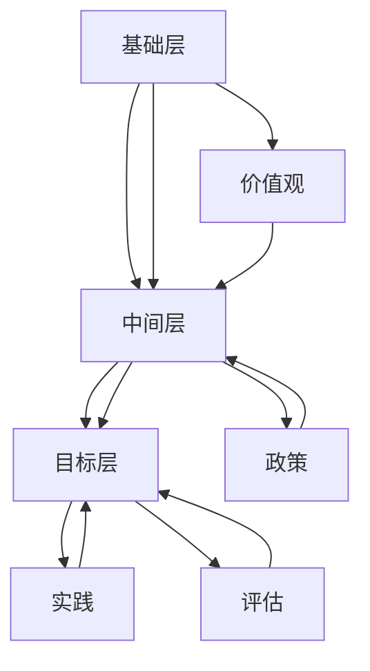

                 

## 《多元化管理：创建包容性工作环境》

### 关键词

- 多元化管理
- 包容性工作环境
- 领导力
- 招聘与选拔
- 激励与绩效管理
- 团队建设
- 技术支持与工具

### 摘要

本文将探讨多元化管理的核心概念、实践策略及其在技术领域的应用。多元化管理不仅关注员工的多样性，更强调构建包容性工作环境，以提升组织的创新力和员工满意度。文章将从历史背景、理论框架、实践案例等方面，系统分析多元化管理的策略和实施步骤，并探讨未来多元化管理的发展趋势和技术支持。

### 目录大纲

- 第一部分：多元化管理的核心概念
  - 第1章：多元化与包容性概述
  - 第2章：多元化管理的历史背景与发展趋势
  - 第3章：多元化管理的核心概念与理论

- 第二部分：多元化管理实践
  - 第4章：多元化管理的战略规划
  - 第5章：多元化管理的组织文化
  - 第6章：多元化管理的领导力与沟通
  - 第7章：多元化管理的人力资源策略
  - 第8章：多元化管理的项目实战

- 第三部分：多元化管理的未来展望
  - 第9章：多元化管理的技术支持与工具
  - 第10章：多元化管理的全球视野

- 附录
  - 附录A：多元化管理资源与参考文献
  - 附录B：多元化管理常用术语表
  - 附录C：多元化管理实践案例

## 第一部分：多元化管理的核心概念

### 第1章：多元化与包容性概述

多元化（Diversity）指的是在组织内部拥有不同背景、技能、观点和文化的人群。而包容性（Inclusiveness）则是指组织能够接纳、尊重并利用这种多样性，创造一个让每个人都能感到被重视和能够发挥潜能的工作环境。

#### 1.1 多元化管理的定义

多元化管理是一种组织战略，它通过促进和利用组织内部的多样性，来提高组织绩效、创新能力和员工满意度。多元化管理不仅关注多样性的数量，更关注如何使这种多样性转化为实际的竞争优势。

#### 1.2 多元化管理的价值

- **提高创新能力**：多元化的团队能够带来不同的视角和经验，从而激发创新思维。
- **增强员工满意度**：包容性文化能够提高员工的归属感和工作满意度。
- **提升组织绩效**：多元化管理能够吸引和保留多样化的优秀人才，从而提高组织整体绩效。

#### 1.3 包容性工作环境的构建

构建包容性工作环境需要从以下几个方面着手：

- **培养多元化意识**：组织需要通过培训和教育，使员工认识到多元化的重要性，并摒弃偏见和歧视。
- **制定包容性政策**：组织需要制定明确的政策，确保所有员工都能在一个公平、无歧视的环境中工作。
- **提供平等机会**：组织应该为不同背景的员工提供平等的晋升和发展机会。

### 第2章：多元化管理的历史背景与发展趋势

多元化管理作为现代组织管理的一个重要组成部分，其发展历程可以追溯到20世纪中叶。以下是多元化管理的历史背景和发展趋势：

#### 2.1 多元化管理的历史发展

- **20世纪60年代**：美国民权运动推动了多元化管理的早期发展，许多组织开始关注种族和性别多元化。
- **20世纪80年代**：随着全球化的发展，多元化管理的概念逐渐扩展到文化、年龄、性别、性取向等方面。
- **21世纪**：多元化管理逐渐成为组织战略的核心，不仅仅是关注多样性的数量，更强调如何利用多样性来提高组织绩效。

#### 2.2 全球多元化管理的趋势

- **多元化管理的普及**：越来越多的组织开始认识到多元化管理的价值，并将其纳入组织战略。
- **技术的推动作用**：数字技术和在线协作工具为多元化管理提供了新的工具和方法。
- **多元文化的融合**：随着全球化的发展，多元文化的融合成为多元化管理的核心挑战和机遇。

#### 2.3 多元化管理在中国的发展现状

- **政策推动**：中国政府在近年来出台了一系列政策，鼓励和支持多元化管理。
- **企业实践**：越来越多的中国企业开始重视多元化管理，并采取实际行动来提升组织的包容性和多样性。
- **挑战与机遇**：中国多元化管理面临语言、文化差异和传统观念等挑战，但也面临着巨大的发展机遇。

### 第3章：多元化管理的核心概念与理论

#### 3.1 多元化与包容性的关系

多元化是包容性的基础，而包容性是多元化的保障。没有多元化的多样性，包容性就无从谈起；而没有包容性，多元化也无法得到有效的利用。

#### 3.2 多元化管理理论框架

多元化管理的理论框架主要包括以下几个方面：

- **价值观**：组织对多元化与包容性的认同和重视程度。
- **政策**：组织制定的多元化与包容性政策。
- **实践**：组织在多元化与包容性方面的具体行动和措施。
- **评估**：对多元化与包容性效果的评估和反馈。

#### 3.3 多元化管理模型分析

多元化管理的模型可以分为以下几个层次：

- **基础层**：多样性指数、多元化程度等基础指标。
- **中间层**：包容性文化、领导力支持、员工满意度等中间指标。
- **目标层**：组织绩效、创新能力、市场竞争力等目标指标。

Mermaid流程图：

## 第二部分：多元化管理实践

### 第4章：多元化管理的战略规划

多元化管理的战略规划是组织实现多元化与包容性的关键步骤。以下是从战略规划框架、多元化目标的制定与实施、多元化管理的风险评估与应对等方面进行探讨。

#### 4.1 多元化管理的战略规划框架

多元化管理的战略规划框架主要包括以下几个环节：

- **现状分析**：分析组织的现状，包括多样性水平、包容性文化等。
- **目标设定**：根据组织愿景和使命，设定多元化管理的长期和短期目标。
- **策略制定**：制定实现多元化目标的策略，包括政策制定、资源配置等。
- **实施与监控**：实施多元化管理策略，并定期监控和评估效果。

#### 4.2 多元化目标的制定与实施

多元化目标的制定需要考虑以下几个方面：

- **多样性指数**：提高组织内部的多样性水平，包括性别、种族、年龄、文化背景等。
- **包容性文化**：建立包容性文化，促进员工之间的尊重与理解。
- **领导力支持**：提高领导者的多元化意识和包容性管理能力。
- **员工满意度**：提高员工的归属感和工作满意度。

多元化目标的实施步骤包括：

- **制定详细的实施计划**：明确目标、时间表、责任分配等。
- **开展培训与宣传**：通过培训和宣传活动，提高员工的多元化意识。
- **建立反馈机制**：定期收集员工反馈，及时调整和优化多元化管理策略。

#### 4.3 多元化管理的风险评估与应对

多元化管理过程中可能会面临以下风险：

- **文化冲突**：不同文化背景的员工可能存在冲突，影响团队协作。
- **绩效风险**：多元化管理的实施可能对短期绩效产生负面影响。
- **资源风险**：多元化管理需要额外的资源和投入。

应对策略包括：

- **建立沟通平台**：通过定期沟通，缓解文化冲突。
- **合理分配资源**：确保多元化管理得到足够的资源和投入。
- **调整绩效指标**：合理调整绩效指标，平衡多元化管理与短期绩效。

### 第5章：多元化管理的组织文化

组织文化在多元化管理中起着至关重要的作用。建立包容性组织文化是多元化管理成功的关键。以下从建立包容性组织文化的重要性、培养多元化意识与价值观、多元化培训与发展的实践等方面进行探讨。

#### 5.1 建立包容性组织文化的重要性

建立包容性组织文化的重要性体现在以下几个方面：

- **提高员工满意度**：包容性文化能够提高员工的归属感和工作满意度。
- **增强创新能力**：包容性文化能够激发员工的创新思维和创造力。
- **提升组织绩效**：包容性文化有助于提高组织的整体绩效和市场竞争力。

#### 5.2 培养多元化意识与价值观

培养多元化意识与价值观是建立包容性组织文化的基础。以下是一些建议：

- **多元化培训**：通过多元化培训，提高员工对多元化与包容性的认识和认同。
- **领导示范**：领导者应该通过自身的言行，树立多元化的榜样。
- **鼓励开放讨论**：鼓励员工就多元化问题进行开放讨论，共同探讨解决方案。

#### 5.3 多元化培训与发展的实践

多元化培训与发展的实践包括以下几个方面：

- **制定多元化培训计划**：根据组织需求，制定有针对性的多元化培训计划。
- **开展多元化培训课程**：开展多元化培训课程，包括文化差异、沟通技巧、领导力等。
- **提供发展机会**：为不同背景的员工提供平等的发展机会，鼓励跨部门的交流与合作。

### 第6章：多元化管理的领导力与沟通

领导力与沟通在多元化管理中起着关键作用。有效的领导力和沟通策略能够促进多元化管理的实施，提高组织的包容性和绩效。以下从多元化领导力的特点与挑战、多元化沟通的策略与技巧、多元化领导力的发展与实践等方面进行探讨。

#### 6.1 多元化领导力的特点与挑战

多元化领导力的特点包括：

- **尊重差异**：尊重不同文化、背景和观点的差异。
- **促进协作**：促进不同团队成员之间的协作和沟通。
- **培养包容性文化**：培养一个包容性的工作环境，使每个人都能感到被尊重和重视。

多元化领导力面临的挑战包括：

- **文化冲突**：不同文化背景的领导者在管理过程中可能存在文化冲突。
- **沟通障碍**：不同语言和沟通风格的领导者在沟通中可能存在障碍。
- **决策困难**：多元化团队在决策过程中可能面临更多的选择和困难。

#### 6.2 多元化沟通的策略与技巧

多元化沟通的策略与技巧包括：

- **主动倾听**：主动倾听不同意见和观点，尊重每个人的发言权。
- **明确表达**：清晰、明确地表达自己的观点和意见，避免歧义。
- **跨文化沟通**：了解不同文化的沟通习惯和风格，采取适当的沟通方式。
- **建立信任**：建立信任和尊重的沟通氛围，促进团队成员之间的互动。

#### 6.3 多元化领导力的发展与实践

多元化领导力的发展与实践包括以下几个方面：

- **领导力培训**：为领导者提供多元化领导力培训，提高他们的多元化管理能力。
- **角色示范**：领导者应该通过自身的言行，树立多元化的榜样。
- **跨部门合作**：鼓励领导者跨部门合作，促进不同团队之间的沟通和协作。

### 第7章：多元化管理的人力资源策略

人力资源策略在多元化管理中起着重要作用。以下从多元化招聘与选拔、多元化绩效管理与激励、多元化团队建设与管理等方面进行探讨。

#### 7.1 多元化招聘与选拔

多元化招聘与选拔是多元化管理的基础。以下是一些建议：

- **多元化招聘策略**：采取多元化的招聘策略，吸引不同背景的人才。
- **公平选拔机制**：建立公平的选拔机制，确保选拔过程的公正性和透明度。
- **多元化培训**：为招聘人员提供多元化培训，提高他们的多元化意识。

#### 7.2 多元化绩效管理与激励

多元化绩效管理与激励是保持多元化团队活力和绩效的关键。以下是一些建议：

- **多元化绩效指标**：制定多元化的绩效指标，全面评价员工的工作表现。
- **个性化激励**：根据员工的不同特点和需求，提供个性化的激励措施。
- **反馈与沟通**：定期与员工进行反馈和沟通，了解他们的需求和意见。

#### 7.3 多元化团队建设与管理

多元化团队建设与管理是多元化管理的重要组成部分。以下是一些建议：

- **团队建设活动**：开展团队建设活动，提高团队成员的协作和沟通能力。
- **跨部门协作**：鼓励跨部门协作，促进不同团队之间的沟通和合作。
- **多元化培训**：为团队成员提供多元化培训，提高他们的多元化管理能力。

### 第8章：多元化管理的项目实战

多元化管理的项目实战是检验多元化管理理论和实践效果的重要途径。以下从多元化管理的项目实施步骤、多元化管理项目案例解析、多元化管理项目评估与改进等方面进行探讨。

#### 8.1 多元化管理的项目实施步骤

多元化管理的项目实施步骤包括以下几个方面：

- **项目立项**：明确项目目标、范围和预期成果。
- **需求分析**：分析组织需求和员工需求，确定项目实施的具体措施。
- **项目规划**：制定项目规划，包括时间表、资源分配、风险管理等。
- **项目执行**：按照项目规划，实施多元化管理的具体措施。
- **项目监控**：对项目执行过程进行监控，及时调整和优化项目策略。

#### 8.2 多元化管理项目案例解析

以下是一个多元化管理项目的案例：

- **项目背景**：某科技公司是一家快速发展的企业，员工人数超过1000人，但多元化程度较低，团队协作和创新能力较弱。
- **项目目标**：提高员工的多元化意识，提升团队合作能力，增强公司的创新性。
- **项目实施步骤**：
  1. 制定多元化战略：明确多元化目标、策略和措施。
  2. 开展多元化培训：为员工提供多元化培训，提高他们的多元化管理能力。
  3. 建立包容性文化：制定包容性政策，营造包容性工作环境。
  4. 培养多元化团队：通过多元化招聘和选拔，建立多元化团队。
  5. 评估与改进：定期评估项目效果，根据评估结果调整和优化项目策略。
- **项目效果**：项目实施后，公司的多元化程度显著提高，团队合作能力增强，创新性显著提升，员工满意度和工作满意度也明显提高。

#### 8.3 多元化管理项目评估与改进

多元化管理项目的评估与改进是确保项目效果的重要环节。以下是一些建议：

- **评估指标**：制定多元化的评估指标，包括多元化程度、团队合作能力、创新性、员工满意度等。
- **数据收集**：通过问卷调查、访谈、观察等方式，收集项目实施过程中的数据。
- **效果分析**：对收集的数据进行分析，评估项目效果和存在的问题。
- **改进措施**：根据评估结果，制定改进措施，优化项目策略和实施过程。

## 第三部分：多元化管理的未来展望

### 第9章：多元化管理的技术支持与工具

随着技术的快速发展，多元化管理也在不断引入新的技术支持和工具。以下从多元化管理的数字化工具、数据分析与人工智能在多元化管理中的应用、多元化管理的可持续发展路径等方面进行探讨。

#### 9.1 多元化管理的数字化工具

数字化工具为多元化管理提供了新的手段和方法。以下是一些常用的数字化工具：

- **在线协作工具**：如Slack、Trello、Asana等，用于团队协作和项目管理。
- **数据分析工具**：如Tableau、Power BI等，用于分析多元化管理的数据。
- **人工智能工具**：如机器学习算法、自然语言处理技术等，用于预测和优化多元化管理策略。

#### 9.2 数据分析与人工智能在多元化管理中的应用

数据分析与人工智能在多元化管理中的应用主要包括以下几个方面：

- **员工满意度分析**：通过数据分析，了解员工的满意度水平和影响因素。
- **多样性度评估**：通过数据分析，评估组织的多样性水平和改进措施。
- **绩效预测**：通过人工智能算法，预测员工的绩效和潜力，为招聘和选拔提供依据。

#### 9.3 多元化管理的可持续发展路径

多元化管理的可持续发展路径包括以下几个方面：

- **持续培训与教育**：定期开展多元化培训和教育，提高员工的多元化意识和能力。
- **政策调整与优化**：根据实际情况，不断调整和优化多元化管理的政策，确保其持续有效。
- **数据驱动决策**：利用数据分析和人工智能技术，为多元化管理的决策提供科学依据。

### 第10章：多元化管理的全球视野

在全球化的背景下，多元化管理已经成为全球范围内的热门话题。以下从全球多元化管理的最佳实践、全球化背景下多元化管理的挑战与机遇、多元化管理的未来趋势与方向等方面进行探讨。

#### 10.1 全球多元化管理的最佳实践

全球多元化管理的最佳实践包括以下几个方面：

- **跨国公司经验**：许多跨国公司通过多元化管理，实现了全球化战略的成功。
- **政策支持**：政府通过制定相关政策，支持多元化管理的发展。
- **教育培训**：通过多元化的教育培训，提高员工的多元化意识和能力。

#### 10.2 全球化背景下多元化管理的挑战与机遇

全球化背景下多元化管理面临以下挑战和机遇：

- **文化差异**：不同国家和地区的文化差异为多元化管理带来了挑战，但同时也提供了丰富的机遇。
- **技术发展**：数字技术和在线协作工具为多元化管理提供了新的工具和方法。
- **人才流动**：全球化的人才流动为多元化管理带来了新的资源和挑战。

#### 10.3 多元化管理的未来趋势与方向

多元化管理的未来趋势与方向包括以下几个方面：

- **数字化与智能化**：随着技术的快速发展，数字化和智能化将成为多元化管理的重要方向。
- **可持续发展**：多元化管理将更加注重可持续发展，关注环境保护和社会责任。
- **全球合作**：全球化背景下，多元化管理将加强国际间的合作与交流。

### 附录

#### 附录A：多元化管理资源与参考文献

- **书籍**：
  - 《多元化管理：战略与实践》（Diversity Management: Strategies and Practices），作者：John P. Kotter
  - 《包容性领导力：如何在多元化组织中引领变革》（Inclusive Leadership: How to Leverage the Power of Diversity），作者：Adam Grant

- **网站**：
  - https://www.diversitybestpractices.com/
  - https://www.mckinsey.com/feature

