                 

### 文章标题

多智能体系统（Multi-Agent Systems）原理与代码实例讲解

### 文章关键词

多智能体系统，协同算法，路径规划，学习算法，博弈算法，安全性，智能交通系统，智能家居系统，无人机群系统，Python编程，开发工具与环境配置

### 文章摘要

本文将深入探讨多智能体系统的基本原理、核心算法及其应用实例。首先，我们将介绍多智能体系统的定义、类型和研究意义，接着阐述其基本架构，包括层次结构、通信机制和协同机制。随后，我们将详细讲解多智能体系统的协同算法、学习算法和博弈算法，并探讨其安全性问题。文章将结合实际应用案例，如智能交通系统、智能家居系统和无人机群系统，展示多智能体系统的具体实现和代码实例。最后，我们将探讨多智能体系统的未来研究方向和潜在应用领域，为读者提供全面的技术视野。

### 引言

多智能体系统（Multi-Agent Systems，MAS）是一种由多个自主智能体组成的复杂系统，这些智能体能够通过相互通信和协作，共同完成特定任务。随着人工智能技术的快速发展，多智能体系统已经成为计算机科学、控制科学、认知科学等领域的研究热点。本文旨在系统性地介绍多智能体系统的基本原理、核心算法及其应用实例，帮助读者深入理解多智能体系统的设计与应用。

本文首先将介绍多智能体系统的基本概念，包括定义、类型和研究意义。接着，我们将探讨多智能体系统的基本架构，包括层次结构、通信机制和协同机制。随后，本文将重点讲解多智能体系统的核心算法，包括协同算法、学习算法和博弈算法。此外，本文还将讨论多智能体系统的安全性问题，并分析其在智能交通系统、智能家居系统和无人机群系统等领域的应用实例。最后，我们将展望多智能体系统的未来研究方向和潜在应用领域，为读者提供全面的技术视野。

### 第一部分：多智能体系统的概述

#### 第1章：多智能体系统的基本概念

多智能体系统（MAS）是由多个具有自主性和智能性的智能体（agent）组成的系统。这些智能体可以相互通信、协作，共同完成复杂的任务。在MAS中，每个智能体都是独立的实体，具有感知、决策和执行能力。它们通过交互作用，形成一种分布式、协作的决策结构，以实现整体目标。

##### 1.1 多智能体系统的定义

多智能体系统（MAS）是指由多个具有自主性、合作性和通信能力的智能体组成的系统，这些智能体相互协作，以实现共同的目标。智能体是MAS的基本单元，通常具有以下几个特征：

1. 自主性：智能体能够独立地感知环境、做出决策和执行动作，而不需要外部干预。
2. 智能性：智能体具备一定的知识、能力和学习能力，能够根据环境和目标进行自适应调整。
3. 合作性：智能体之间可以通过通信和协作，共同完成任务，实现整体目标。
4. 分布性：智能体分布在不同位置，通过分布式计算和通信，实现任务分配和协同工作。

##### 1.2 多智能体系统的类型

多智能体系统可以根据智能体的特性、结构和任务需求进行分类。常见的类型包括：

1. 基于角色（Role-based）的MAS：智能体根据预定义的角色和任务进行分工和协作，如角色扮演系统、虚拟组织等。
2. 基于通信（Communication-based）的MAS：智能体通过通信机制进行交互，实现信息共享和任务分配，如P2P网络、多机器人系统等。
3. 基于任务（Task-based）的MAS：智能体根据任务的性质和需求进行协作，如分布式计算、协同优化等。
4. 基于行为的（Behavior-based）的MAS：智能体通过行为规则进行决策和行动，如人工生命、智能交通系统等。

##### 1.3 多智能体系统的研究意义和前景

多智能体系统具有广泛的应用前景和重要的研究意义。首先，MAS为解决复杂系统中的协同问题提供了新的思路和方法。在许多实际应用场景中，如智能交通、智能家居、无人系统等，单个智能体难以独立完成复杂任务，需要多个智能体相互协作。MAS通过分布式计算和协同决策，能够有效地提高系统的效率和鲁棒性。

其次，多智能体系统为人工智能技术的发展提供了新的方向。智能体的自主性、合作性和智能性使其在许多领域具有潜在的应用价值。例如，在自动驾驶、智能医疗、智能物流等领域，多智能体系统可以有效地提升系统的智能水平和自主性。

此外，多智能体系统的研究也促进了跨学科的合作。在MAS的研究过程中，涉及到了计算机科学、控制科学、认知科学、经济学等多个学科领域的知识。这种跨学科的合作有助于推动相关领域的发展，并促进技术创新。

总之，多智能体系统作为一种重要的分布式系统模型，具有广泛的应用前景和重要的研究价值。随着人工智能技术的不断进步，MAS将在未来的社会和经济发展中发挥越来越重要的作用。

#### 第2章：多智能体系统的基本架构

多智能体系统（MAS）作为一种分布式系统，其基本架构对其性能和效率有着至关重要的影响。为了实现智能体之间的有效协作，MAS通常包括层次结构、通信机制和协同机制等关键组成部分。在本章中，我们将详细探讨这些基本架构的构成和作用。

##### 2.1 多智能体系统的层次结构

多智能体系统的层次结构是组织和管理智能体的基本框架，它有助于实现系统的模块化和可扩展性。典型的多智能体系统层次结构包括以下三个主要层次：

1. **感知层**：感知层是智能体与外部环境交互的界面，负责感知环境信息并将其转换为智能体能够理解的数据。感知层通常包括各种传感器，如摄像头、雷达、GPS等，用于获取图像、声音、位置等感知数据。

2. **决策层**：决策层是智能体的核心部分，负责处理感知层输入的信息，并根据预定的策略或学习算法生成行动指令。决策层通常包括知识库、推理机等模块，用于进行数据分析和决策生成。

3. **执行层**：执行层负责将决策层的指令转化为实际的动作，实现智能体的行为。执行层通常与执行设备（如电机、机器人臂等）相连，将智能体的决策转化为物理动作。

这种层次结构有助于实现智能体的功能模块化，使得系统的开发、测试和维护更加方便。

##### 2.2 多智能体系统的通信机制

在多智能体系统中，通信机制是智能体之间进行信息交换和协作的基础。有效的通信机制可以确保智能体之间的信息传递准确、及时，从而提高系统的整体性能。常见的通信机制包括以下几种：

1. **直接通信**：直接通信是指智能体之间通过点对点连接进行通信。这种方式简单直接，适用于小规模、低延迟的通信场景。直接通信可以通过网络套接字（Socket）、消息队列（Message Queue）等方式实现。

2. **广播通信**：广播通信是指智能体向系统中的所有其他智能体发送信息。这种方式适用于大规模、高并发场景，可以有效地减少通信开销。广播通信可以通过广播协议（如RTPS、ZMQ）实现。

3. **多播通信**：多播通信是指智能体向系统中的特定一组智能体发送信息。这种方式结合了直接通信和广播通信的优点，适用于中规模、高延迟的场景。多播通信可以通过多播协议（如UDP、TCP）实现。

4. **事件驱动通信**：事件驱动通信是指智能体根据事件的发生进行通信。这种方式适用于动态变化的场景，可以有效地降低通信开销。事件驱动通信可以通过事件队列（Event Queue）实现。

##### 2.3 多智能体系统的协同机制

多智能体系统的协同机制是指智能体之间如何协作以实现共同目标的方法和策略。协同机制可以分为以下几个方面：

1. **任务分配**：任务分配是指将系统中的任务合理地分配给不同的智能体，以实现任务的最优分配和执行。常见的任务分配策略包括基于资源约束的分配、基于负载均衡的分配等。

2. **协调控制**：协调控制是指智能体之间如何协调行动，以实现系统整体目标的策略。常见的协调控制策略包括基于规则的协调控制、基于学习的协调控制等。

3. **一致性维护**：一致性维护是指智能体之间如何保持状态和信息的一致性。一致性维护可以确保系统在执行任务过程中不会出现冲突和错误。常见的一致性维护策略包括基于时间戳的一致性维护、基于事件的一致性维护等。

4. **冲突解决**：冲突解决是指智能体之间如何解决在协作过程中产生的冲突。冲突解决可以确保系统在执行任务过程中不会出现停机或错误。常见的冲突解决策略包括基于协商的冲突解决、基于仲裁的冲突解决等。

通过有效的协同机制，多智能体系统可以实现智能体之间的紧密协作，从而提高系统的整体性能和效率。

总之，多智能体系统的基本架构包括层次结构、通信机制和协同机制。这些组成部分相互作用，共同实现智能体的分布式协作和任务执行。理解这些基本架构有助于设计高效、可靠的多智能体系统，为解决复杂系统中的协作问题提供有力支持。

#### 第3章：多智能体协同算法

多智能体协同算法是多智能体系统（MAS）中的核心组成部分，它旨在通过协调智能体之间的行为，实现整体目标的优化。协同算法可以分为分布式算法和中心化算法，每种算法都有其特定的应用场景和优势。在本章中，我们将详细讨论这两种协同算法的原理、优缺点及其应用。

##### 3.1 协同控制算法

协同控制算法是多智能体协同算法的一种，旨在通过协调智能体的行动，实现系统整体目标的最优化。协同控制算法可以分为分布式算法和中心化算法。

###### 3.1.1 分布式算法

分布式算法是指智能体之间通过局部信息交互，独立地调整自己的行为，从而实现全局协同。这种算法具有以下特点：

1. **自组织性**：分布式算法不需要全局信息或中心控制，智能体根据局部信息和自身行为进行自适应调整，从而实现协同。
2. **鲁棒性**：分布式算法具有较强的鲁棒性，即使部分智能体失效或通信中断，系统仍能保持整体协调。
3. **可扩展性**：分布式算法能够处理大规模智能体系统，易于实现系统的扩展和升级。

常见的分布式协同控制算法包括：

1. **基于导引的协同控制**：通过引入引导智能体或参考轨迹，其他智能体根据与引导智能体或轨迹的距离和角度进行调整，实现协同运动。

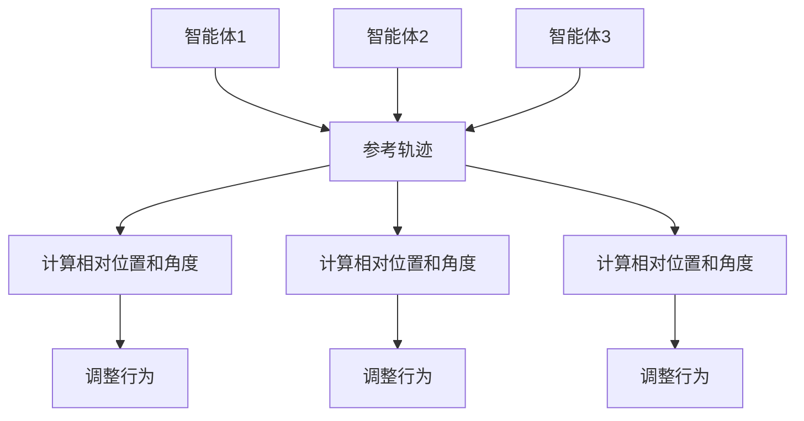

2. **基于势场的协同控制**：通过构建全局势场，智能体根据势场方向调整自己的行为，实现协同运动。

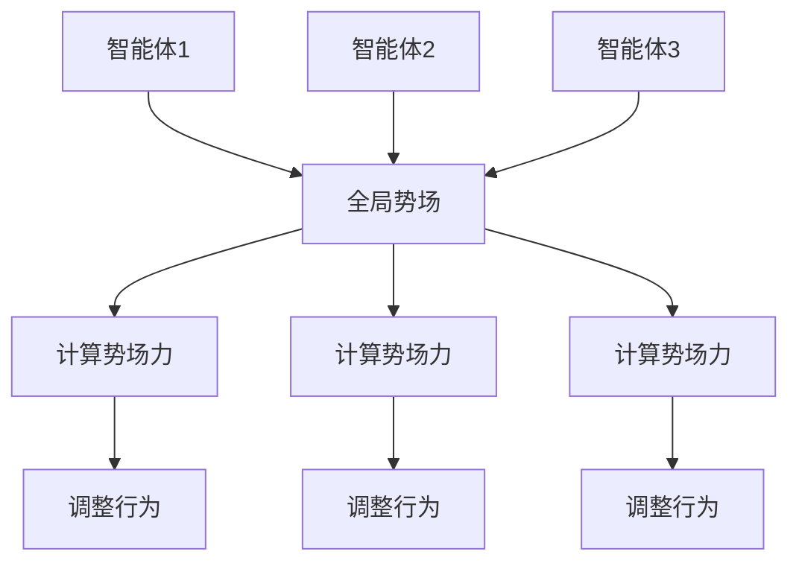

###### 3.1.2 中心化算法

中心化算法是指智能体的行为由一个中心控制器统一调度和控制。这种算法具有以下特点：

1. **全局优化**：中心化算法能够利用全局信息，实现全局最优解。
2. **稳定性**：中心化算法在稳定通信环境下具有较高的稳定性。
3. **计算复杂度**：中心化算法需要大量的计算资源和通信资源，适用于中小规模智能体系统。

常见的中心化协同控制算法包括：

1. **基于线性规划的控制**：通过线性规划求解，优化智能体之间的协同行为，实现全局目标的最优化。

```math
\min_{x_1, x_2, ..., x_n} \sum_{i=1}^{n} f_i(x_i)
\text{subject to} \quad g_i(x_i) \leq 0, \quad i=1, 2, ..., m
```

2. **基于博弈论的控制**：通过博弈论方法，设计智能体的策略，实现协同行为的优化。

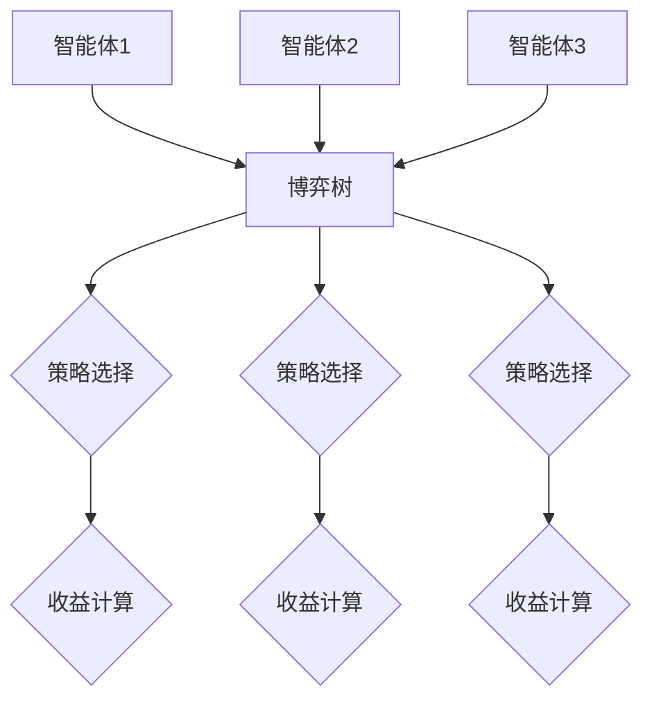

##### 3.2 多智能体路径规划算法

多智能体路径规划算法旨在为智能体找到从起点到终点的最优路径，同时保证智能体之间的协同和避障。路径规划算法可以分为基于采样的路径规划和基于图论的路径规划。

###### 3.2.1 基于采样的路径规划

基于采样的路径规划方法通过在环境空间中随机采样，生成大量候选路径，然后使用评估函数筛选出最优路径。常见的基于采样的路径规划算法包括RRT（快速随机树）和RRT*（快速随机树*）。

1. **RRT（快速随机树）**：RRT算法通过随机采样和局部优化，逐步生成路径树，直到找到目标点。算法的优点是计算效率高，适用于动态环境。

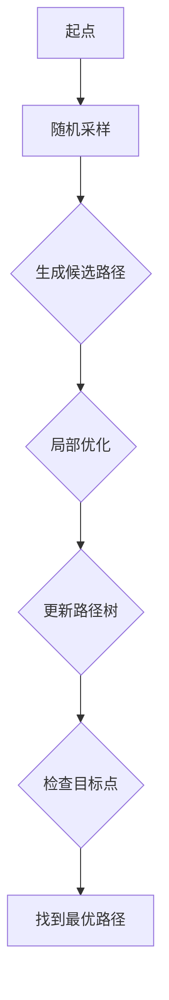

2. **RRT*（快速随机树*）**：RRT*算法在RRT的基础上引入了快速近邻搜索和目标点逼近策略，提高了路径规划的效率和鲁棒性。

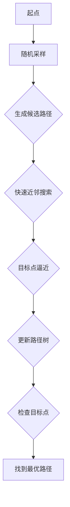

###### 3.2.2 基于图论的路径规划

基于图论的路径规划方法将环境表示为一个图，然后使用图算法寻找最优路径。常见的基于图论的路径规划算法包括A*（A星）算法和Dijkstra（迪杰斯特拉）算法。

1. **A*（A星）算法**：A*算法是一种启发式搜索算法，通过评估函数$f(n) = g(n) + h(n)$，选择当前估计距离最短的路径。其中，$g(n)$为从起点到当前点的实际距离，$h(n)$为从当前点到终点的估计距离。

```mermaid
graph TD
A[起点] --> B[计算g(n)和h(n)]
B --> C{评估函数f(n)}
C --> D{选择最短路径}
D --> E{更新路径}
E --> F{到达终点}
```

2. **Dijkstra（迪杰斯特拉）算法**：Dijkstra算法是一种非启发式搜索算法，通过逐步扩展当前点的邻居节点，计算到达所有节点的最短路径。

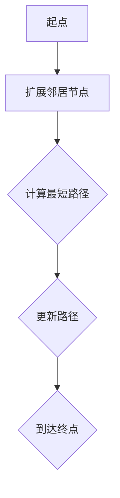

通过以上路径规划算法，智能体可以在复杂环境中找到从起点到终点的最优路径，实现协同移动。

总之，多智能体协同算法是多智能体系统实现高效协作的关键。分布式算法和中心化算法各有优缺点，适用于不同的应用场景。路径规划算法则为智能体在复杂环境中找到最优路径提供了有效方法。在实际应用中，可以根据具体需求选择合适的协同算法和路径规划算法，实现多智能体系统的有效协同。

#### 第4章：多智能体学习算法

多智能体学习算法是多智能体系统（MAS）中的重要组成部分，它使得智能体能够通过不断学习和适应环境，提高系统的整体性能和智能化水平。本章将详细讨论多智能体学习算法的分类、原理以及实际应用，重点介绍多智能体强化学习算法和无监督学习算法。

##### 4.1 多智能体强化学习算法

多智能体强化学习（Multi-Agent Reinforcement Learning，MARL）是一种在多智能体环境下通过试错和反馈进行学习的方法，旨在优化智能体的策略，以实现共同的目标。与单智能体强化学习相比，MARL面临更多的挑战，如非合作性、部分可观测性以及延迟奖励等。常见的MARL算法包括Q-Learning和SARSA。

###### 4.1.1 Q-Learning算法

Q-Learning是一种基于值函数的强化学习算法，通过学习状态-动作值函数（Q值）来优化智能体的策略。在MARL中，Q-Learning算法通过以下步骤进行学习：

1. **初始化**：初始化Q值表，通常初始化为0。
2. **状态-动作选择**：根据当前状态和Q值表，选择最优动作。
3. **执行动作**：在环境中执行所选动作。
4. **更新Q值**：根据实际奖励和Q值表更新Q值。

伪代码如下：

```python
function Q_Learning(states, actions, rewards, next_states, learning_rate, discount_factor, Q_values):
    for state, action in states:
        next_Q_prediction = max(Q_values[next_state, :])
        Q_target = reward + (1 - done) * (discount_factor * next_Q_prediction)
        Q_values[state, action] = Q_values[state, action] + learning_rate * (Q_target - Q_values[state, action])
    return Q_values
```

Q-Learning算法的数学模型可以表示为：

$$
Q(s, a) = r + \gamma \max_{a'} Q(s', a')
$$

其中，$s$为当前状态，$a$为当前动作，$r$为奖励，$s'$为下一状态，$a'$为下一动作，$\gamma$为折扣因子。

###### 4.1.2 SARSA算法

SARSA（State-Action-Reward-State-Action，SARSA）算法是一种基于策略的强化学习算法，通过同时更新当前状态和下一状态的Q值来学习策略。SARSA算法的伪代码如下：

```python
function SARSA(states, actions, rewards, next_states, learning_rate, Q_values):
    for state, action in states:
        next_action = choose_action(next_state, Q_values)
        Q_values[state, action] = Q_values[state, action] + learning_rate * (reward + discount_factor * Q_values[next_state, next_action] - Q_values[state, action])
    return Q_values
```

SARSA算法的数学模型可以表示为：

$$
Q(s, a) = r + \gamma Q(s', a')
$$

##### 4.2 多智能体无监督学习算法

多智能体无监督学习算法旨在通过智能体之间的交互和协作，自动发现环境中的模式和规律，而无需外部奖励信号。常见的多智能体无监督学习算法包括自组织映射网络和协同聚类算法。

###### 4.2.1 自组织映射网络（Self-Organizing Map，SOM）

自组织映射网络（SOM）是一种无监督学习方法，通过竞争学习方式对输入数据进行降维和聚类。在多智能体SOM中，每个智能体都负责学习环境中的局部特征，并通过竞争机制找到最优的聚类中心。

1. **初始化**：随机初始化权重矩阵$W$和竞争神经元$c$。
2. **计算竞争强度**：计算每个智能体与竞争神经元的距离，选择距离最小的神经元作为获胜神经元。
3. **权重更新**：根据获胜神经元的权重和输入数据，更新所有智能体的权重。
4. **重复步骤2和3**，直到收敛。

伪代码如下：

```python
function SOM(inputs, learning_rate, W):
    for epoch in range(number_of_epochs):
        for input in inputs:
            c = choose_winning_neuron(input, W)
            for agent in agents:
                update_weights(agent, input, learning_rate, c, W)
    return W
```

###### 4.2.2 协同聚类算法（Cooperative Clustering）

协同聚类算法是一种基于协作的多智能体聚类方法，通过智能体之间的交互和协同，实现数据的聚类和降维。常见的协同聚类算法包括K-Means和Fuzzy C-Means。

1. **初始化**：随机初始化聚类中心。
2. **分配智能体**：将每个智能体分配到一个初始聚类中心。
3. **计算距离**：计算每个智能体与聚类中心的距离。
4. **更新聚类中心**：根据智能体的分布，更新聚类中心。
5. **重复步骤3和4**，直到聚类中心不再变化。

伪代码如下：

```python
function Cooperative_Clustering(inputs, K, learning_rate):
    centroids = initialize_centroids(inputs, K)
    assignments = assign_agents_to_centroids(inputs, centroids)

    for epoch in range(number_of_epochs):
        distances = calculate_distances(inputs, centroids)
        new_centroids = update_centroids(centroids, distances, assignments, learning_rate)

        if centroids == new_centroids:
            break

        centroids = new_centroids
        assignments = assign_agents_to_centroids(inputs, centroids)

    return centroids, assignments
```

##### 实际应用场景

多智能体学习算法在实际应用中有着广泛的应用，如：

1. **智能交通系统**：通过多智能体强化学习算法，优化交通信号控制和车辆调度，提高交通流量和安全性。
2. **无人机群系统**：通过多智能体协同聚类算法，实现无人机群的自主编队和任务分配。
3. **智能制造**：通过多智能体学习算法，优化生产计划和资源分配，提高生产效率和产品质量。

总之，多智能体学习算法为多智能体系统提供了强大的学习能力和自适应能力，使得智能体能够更好地适应复杂多变的环境，实现高效的协同和优化。随着人工智能技术的不断发展，多智能体学习算法将在更多领域发挥重要作用。

#### 第5章：多智能体系统中的博弈算法

多智能体系统中的博弈算法是解决智能体之间协作与竞争问题的关键。博弈论作为研究具有冲突和合作行为的数学工具，在多智能体系统中有着广泛的应用。本章将介绍博弈论的基本概念、多智能体协同博弈算法以及策略迭代算法。

##### 5.1 博弈论基础

博弈论（Game Theory）是研究具有冲突和合作行为的数学工具，通过数学模型来分析决策者在有限选择中的策略选择和结果。博弈论的基本元素包括参与方、策略、支付函数和均衡。

1. **参与方（Players）**：博弈中的决策个体，可以是智能体、公司或个人。
2. **策略（Strategies）**：参与方在博弈过程中可以选择的行动方案。
3. **支付函数（Payoff Function）**：描述参与方在不同策略组合下获得的收益或损失。
4. **均衡（Equilibrium）**：博弈中的稳定状态，参与方在均衡状态下，没有动机改变自己的策略。

常见的博弈类型包括零和博弈、非零和博弈、完全信息博弈和不完全信息博弈。

##### 5.2 多智能体协同博弈算法

多智能体协同博弈算法旨在通过博弈论方法优化智能体的策略，实现共同的目标。协同博弈算法可以分为合作博弈和非合作博弈。

###### 5.2.1 合作博弈

合作博弈是指参与方通过合作实现共同利益的最大化。常见的合作博弈算法包括：

1. **Shapley值（Shapley Value）**：用于计算参与方在合作中的贡献度，是公平分配收益的方法。

$$
v(i) = \sum_{S \subseteq N} \frac{(|S|-1)! \times (|N|-|S|)!}{|N|!} \times (v(S) - v(S-i))
$$

其中，$v(S)$为集合$S$的合作收益，$i$为参与方，$N$为所有参与方的集合。

2. **核心（Core）**：合作博弈的稳定解，如果合作解的收益分配对任何联盟来说都是非减的，则该解为核心。

$$
\{(x_i)_{i \in N} | \forall S \subseteq N, \sum_{i \in S} x_i \geq \sum_{i \in N \setminus S} x_i\}
$$

###### 5.2.2 非合作博弈

非合作博弈是指参与方通过竞争实现各自利益的最大化。常见的非合作博弈算法包括：

1. **博弈树构建（Game Tree Construction）**：将博弈过程表示为树形结构，每个节点表示参与方的策略选择，边表示博弈的转移。

2. **策略迭代算法（Strategy Iteration Algorithm）**：通过迭代优化参与方的策略，逐步逼近纳什均衡。

策略迭代算法的步骤如下：

1. **初始化**：随机选择或根据历史数据初始化策略。
2. **策略评估**：根据当前策略组合计算支付函数，评估策略的有效性。
3. **策略更新**：根据策略评估结果更新策略，选择新的策略组合。
4. **重复步骤2和3**，直到策略收敛到纳什均衡。

伪代码如下：

```python
function Strategy Iteration(current_strategy, payoff_matrix, convergence_threshold):
    while not converged:
        strategy_evaluation = evaluate_strategy(current_strategy, payoff_matrix)
        new_strategy = update_strategy(current_strategy, strategy_evaluation)
        if strategy_difference(new_strategy, current_strategy) < convergence_threshold:
            converged = True
        current_strategy = new_strategy
    return current_strategy
```

##### 应用实例

博弈算法在多智能体系统中有着广泛的应用，如：

1. **智能交通系统**：通过博弈算法优化交通信号控制，实现车辆间的协同和避让，提高交通效率。
2. **无人机群系统**：通过博弈算法实现无人机群的任务分配和飞行路径规划，提高系统的鲁棒性和效率。
3. **电子商务**：通过博弈算法优化广告投放和价格竞争，实现商家的合作和竞争，提高市场竞争力。

总之，博弈算法为多智能体系统中的协作与竞争提供了有效的解决方案，使得智能体能够通过策略优化实现共同的目标。随着多智能体系统的不断发展，博弈算法将在更多领域发挥重要作用。

#### 第6章：多智能体系统的安全性

多智能体系统的安全性是确保系统稳定运行、数据完整性和隐私保护的关键因素。在多智能体系统中，由于智能体之间的通信和协作，系统的安全性面临诸多挑战。本章节将讨论多智能体系统的安全威胁、安全策略和安全验证方法。

##### 6.1 多智能体系统的威胁分析

多智能体系统面临的安全威胁主要包括以下几个方面：

1. **智能体篡改**：恶意智能体可以通过篡改其他智能体的行为或数据，导致系统行为异常或整体性能下降。
2. **通信攻击**：攻击者可以通过窃听、篡改或伪造通信，破坏智能体之间的协作和通信链路。
3. **协同攻击**：多个恶意智能体通过联合攻击，实现更复杂的攻击行为，如拒绝服务攻击、信息泄露等。
4. **恶意行为**：智能体可能由于错误或恶意意图，执行非预期的行为，影响系统稳定性和安全性。

##### 6.2 多智能体系统的安全策略

为了应对上述安全威胁，多智能体系统需要采取一系列安全策略，包括：

1. **身份认证**：确保智能体的真实性和合法性，通过密码学技术进行身份验证，防止未授权访问。
2. **访问控制**：限制智能体的访问权限，根据智能体的角色和权限，控制其对系统和数据的访问。
3. **数据加密**：对敏感数据进行加密存储和传输，防止数据在传输过程中被窃听或篡改。
4. **安全通信**：采用安全协议（如SSL/TLS）确保通信过程中的数据完整性、真实性和抗否认性。
5. **恶意行为检测**：实时监控智能体的行为，检测异常行为并采取措施，防止恶意行为扩散。
6. **安全审计**：记录系统操作日志和事件日志，对系统行为进行审计和追踪，以便在发生安全事件时进行调查和分析。

##### 6.3 多智能体系统的安全验证

安全验证是确保多智能体系统安全策略有效性的关键环节。常见的安全验证方法包括：

1. **模型检查**：通过形式化建模，验证系统行为是否满足安全属性，如安全性、完整性和可用性。
2. **仿真测试**：在仿真环境中，模拟恶意攻击和智能体行为，验证系统应对攻击的能力。
3. **安全审计**：对系统日志和事件进行审计，检查安全策略的有效性和实施情况。
4. **漏洞扫描**：利用工具扫描系统，检测潜在的安全漏洞和弱点，及时进行修复。

##### 应用实例

多智能体系统的安全性在实际应用中具有重要意义。以下是一些应用实例：

1. **智能交通系统**：通过安全认证和访问控制，确保交通信号控制系统的稳定性和安全性。
2. **无人机群系统**：通过数据加密和安全通信，确保无人机群在执行任务时的数据完整性和隐私保护。
3. **智能家居系统**：通过恶意行为检测和安全审计，防止智能设备被恶意利用，确保家庭网络的安全性。

总之，多智能体系统的安全性是确保系统稳定运行和用户信任的关键。通过有效的安全策略和安全验证方法，可以应对多智能体系统中的各种安全威胁，保障系统的安全性和可靠性。

#### 第7章：智能交通系统

智能交通系统（Intelligent Transportation System，ITS）是利用先进的信息通信技术、传感器技术、控制技术和计算机技术，实现交通管理和服务的智能化。在多智能体系统中，智能交通系统通过多个智能体的协同工作，提高交通流量、降低拥堵、提升安全性和效率。本章将详细介绍智能交通系统的需求分析、多智能体协同算法设计和代码实例讲解。

##### 7.1 智能交通系统的需求分析

智能交通系统的需求主要集中在以下几个方面：

1. **交通流量管理**：通过实时监控和数据分析，动态调整交通信号灯周期，优化交通流量，减少拥堵。
2. **车辆调度**：智能调度系统可以根据实时交通状况，调整公共交通线路和班次，提高运营效率。
3. **事故预警与处理**：利用传感器和监控系统，提前预警交通事故，并迅速处理，减少事故影响。
4. **环境监测**：监测空气质量、噪音等环境指标，提供实时的环境信息，指导交通管理和公众出行。
5. **信息共享**：通过移动互联网和车联网，实现交通信息的实时共享，为驾驶者提供准确的导航和出行建议。

##### 7.2 智能交通系统的多智能体协同算法设计

智能交通系统的多智能体协同算法设计主要包括路径规划、交通信号控制和车辆调度等方面。

###### 7.2.1 路径规划

路径规划是智能交通系统中的一项关键任务，通过为驾驶者提供最优路径，减少交通拥堵。常见的路径规划算法包括A*算法和RRT算法。

1. **A*算法**：基于启发式搜索的路径规划算法，通过评估函数$f(n) = g(n) + h(n)$，寻找从起点到终点的最优路径。其中，$g(n)$为从起点到当前点的实际距离，$h(n)$为从当前点到终点的估计距离。

```mermaid
graph TD
A[起点] --> B[计算g(n)和h(n)]
B --> C{评估函数f(n)}
C --> D{选择最短路径}
D --> E{更新路径}
E --> F{到达终点}
```

2. **RRT算法**：基于随机采样的路径规划算法，通过随机采样和局部优化，逐步生成路径。RRT*算法是RRT算法的改进，引入了快速近邻搜索和目标点逼近策略，提高了路径规划的效率和鲁棒性。


###### 7.2.2 交通信号控制

交通信号控制是多智能体协同算法的关键部分，通过协调不同路口的交通信号灯，优化交通流量。常见的交通信号控制算法包括分布式控制和中心化控制。

1. **分布式控制**：每个路口的信号灯独立决策，通过感知交通流量和预测交通状况，动态调整信号灯周期。分布式控制具有自组织和自适应的特点，能够快速响应局部交通状况。

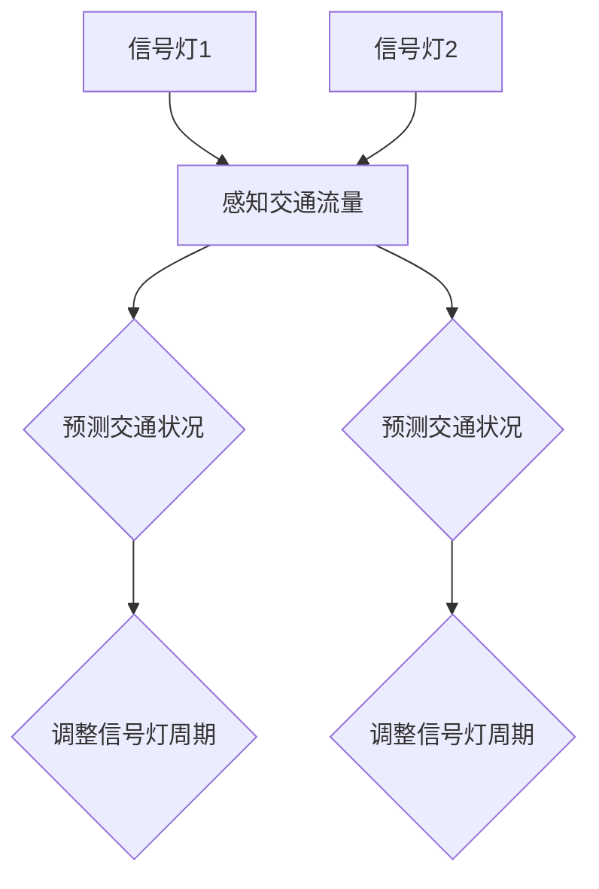

2. **中心化控制**：交通信号控制由中央控制系统统一调度，通过收集各路口的交通信息，全局优化信号灯周期。中心化控制具有全局优化优势，但计算复杂度高，适用于中小规模交通系统。

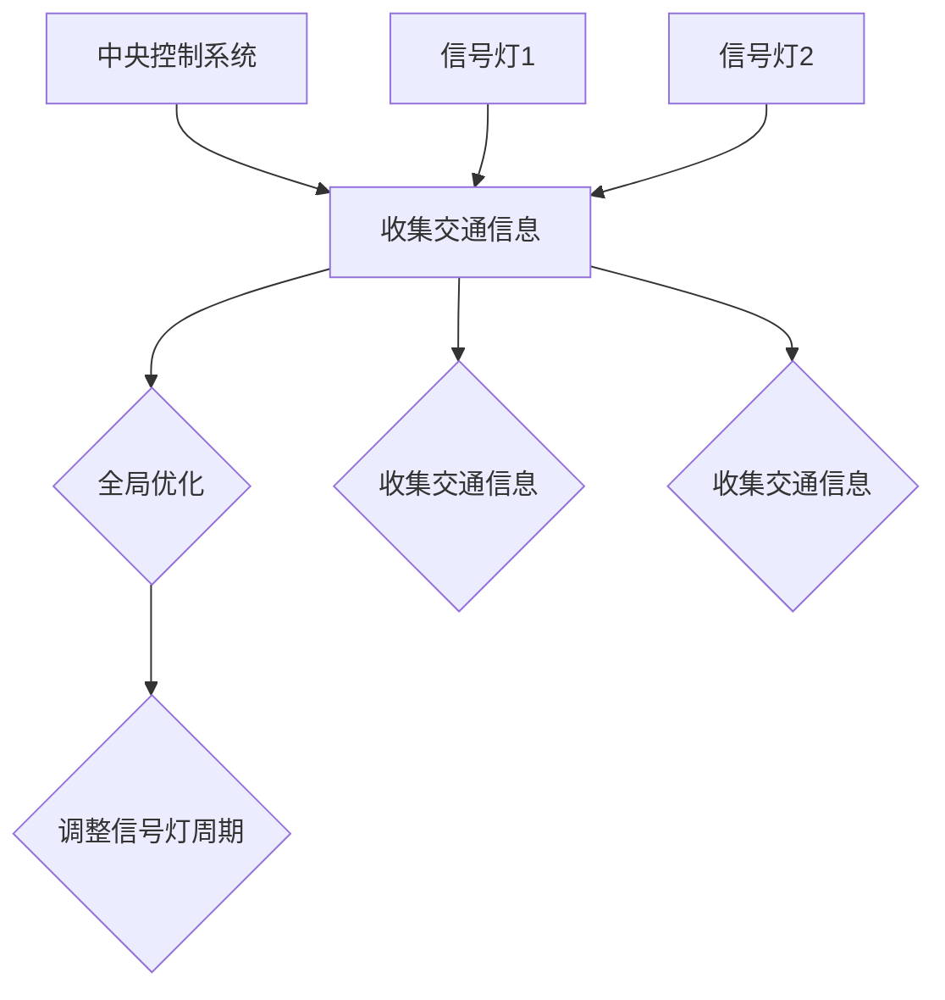

###### 7.2.3 车辆调度

车辆调度是多智能体协同算法的另一个重要方面，通过优化公共交通线路和班次，提高运营效率。常见的车辆调度算法包括基于时间窗口的调度和基于负载均衡的调度。

1. **基于时间窗口的调度**：根据实时交通状况和乘客需求，动态调整公共交通线路和班次。调度算法根据时间窗口内乘客数量和车辆容量，优化线路和班次安排。

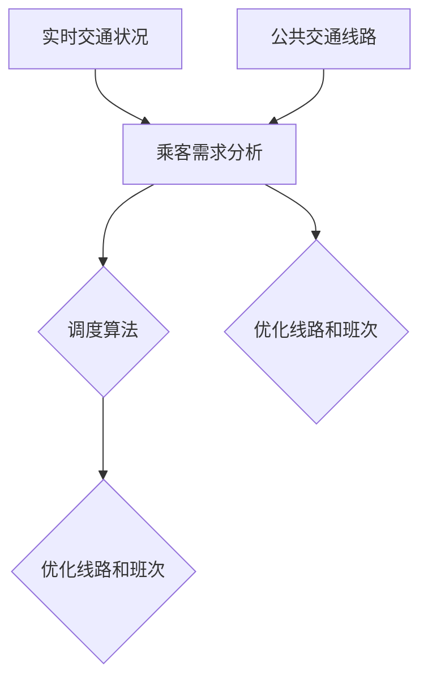

2. **基于负载均衡的调度**：根据各线路的乘客数量和车辆利用率，动态调整车辆分配。调度算法通过分析线路负载，实现车辆资源的合理分配，提高运营效率。

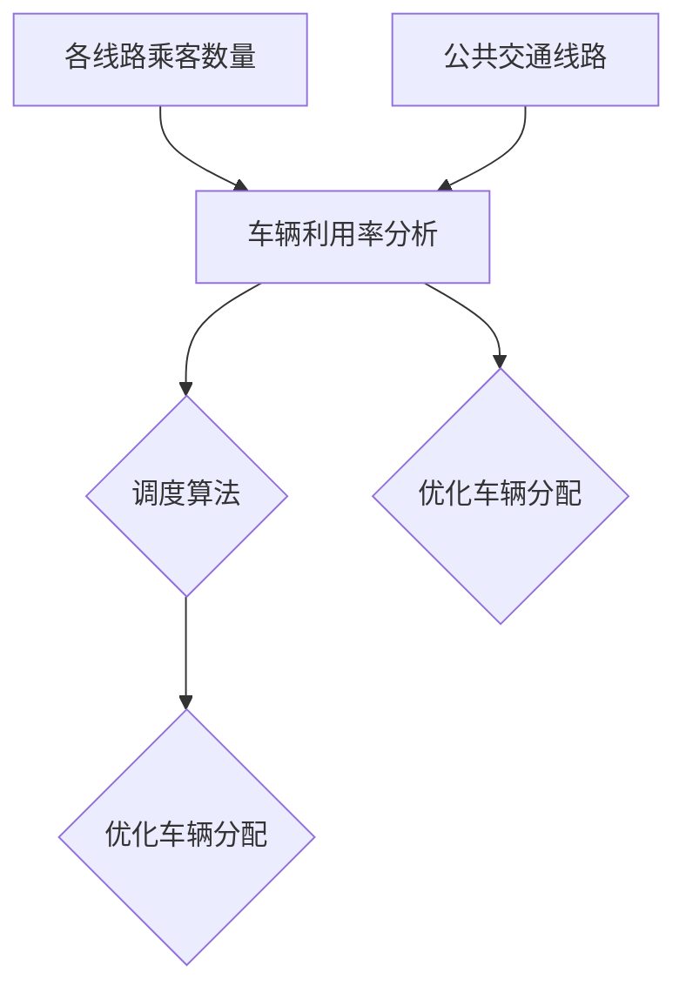

##### 7.3 代码实例讲解

以下是一个简单的智能交通系统路径规划算法的Python代码实例，使用A*算法实现。

```python
import numpy as np
import matplotlib.pyplot as plt

# 定义网格环境
grid_size = 10
grid = np.zeros((grid_size, grid_size))

# 定义障碍物
obstacles = [
    [1, 1],
    [8, 8],
]

# 设置起点和终点
start = [0, 0]
goal = [9, 9]

# 定义启发函数
def heuristic(node, goal):
    return np.linalg.norm(np.array(node) - np.array(goal))

# 定义A*算法
def a_star_search(grid, start, goal):
    open_set = []
    closed_set = set()
    open_set.append(start)

    while open_set:
        current = open_set[0]
        current_index = 0
        for index, item in enumerate(open_set):
            if heuristic(item, goal) < heuristic(current, goal):
                current = item
                current_index = index
        open_set.pop(current_index)

        if current == goal:
            path = []
            while current is not None:
                path.append(current)
                current = current['parent']
            return path[::-1]

        closed_set.add(current)

        for neighbor in neighbors(grid, current):
            if neighbor in closed_set or neighbor in obstacles:
                continue

            neighbor_cost = grid[current[0], current[1]] + 1
            if neighbor not in open_set:
                open_set.append(neighbor)
            elif neighbor_cost < grid[neighbor[0], neighbor[1]]:
                grid[neighbor[0], neighbor[1]] = neighbor_cost
                neighbor['parent'] = current

    return None

# 定义邻居节点
def neighbors(grid, node):
    directions = [(0, -1), (0, 1), (-1, 0), (1, 0)]
    neighbors = []
    for direction in directions:
        neighbor = (node[0] + direction[0], node[1] + direction[1])
        if 0 <= neighbor[0] < grid_size and 0 <= neighbor[1] < grid_size:
            neighbors.append(neighbor)
    return neighbors

# 执行A*算法
path = a_star_search(grid, start, goal)

# 绘制路径
plt.imshow(grid, cmap='gray')
plt.plot(*zip(*path), 'r')
plt.scatter(*start, c='g')
plt.scatter(*goal, c='r')
plt.show()
```

通过上述代码，我们可以实现一个简单的智能交通系统路径规划，为驾驶者提供从起点到终点的最优路径。

总之，智能交通系统通过多智能体协同算法的设计和实现，提高了交通流量管理、车辆调度和事故预警等方面的效率和安全性。随着技术的发展，智能交通系统将在未来交通管理中发挥越来越重要的作用。

#### 第8章：智能家居系统

智能家居系统（Smart Home System）是利用物联网（Internet of Things，IoT）技术将各种家庭设备和系统连接起来，实现家庭自动化和智能控制。在多智能体系统中，智能家居系统通过多个智能体的协同工作，提供了舒适、便捷、安全的家庭环境。本章将详细介绍智能家居系统的架构设计、多智能体协同算法设计和代码实例讲解。

##### 8.1 智能家居系统的架构设计

智能家居系统的架构设计通常包括以下几个主要层次：

1. **感知层**：感知层是智能家居系统的数据采集层，包括各种传感器，如温度传感器、湿度传感器、光敏传感器、烟雾传感器等。这些传感器用于采集环境数据，为智能决策提供基础。

2. **网络层**：网络层负责将感知层采集的数据传输到中心控制器，常用的网络技术包括Wi-Fi、蓝牙、ZigBee等。通过物联网技术，实现设备之间的互联互通，形成分布式智能网络。

3. **控制层**：控制层是智能家居系统的核心，包括智能网关、智能控制器等设备。这些设备根据感知层的数据，执行相应的控制指令，实现对家庭设备和系统的智能控制。

4. **应用层**：应用层是智能家居系统的应用界面，包括移动应用、Web应用等。用户通过应用层可以远程监控和控制家庭设备，享受智能化带来的便捷和舒适。

##### 8.2 智能家居系统的多智能体协同算法设计

智能家居系统的多智能体协同算法设计主要涉及环境监测、设备控制、能源管理等方面。

###### 8.2.1 环境监测

环境监测是多智能体协同算法设计的重要环节，通过传感器数据采集和智能分析，实现对家庭环境的实时监控。常见的协同算法包括：

1. **自组织映射（SOM）网络**：SOM网络是一种无监督学习算法，通过竞争学习方式对环境数据进行聚类和降维，提取环境特征。

2. **协同聚类算法**：协同聚类算法通过多个智能体的协同工作，对环境数据进行聚类分析，识别不同环境状态。

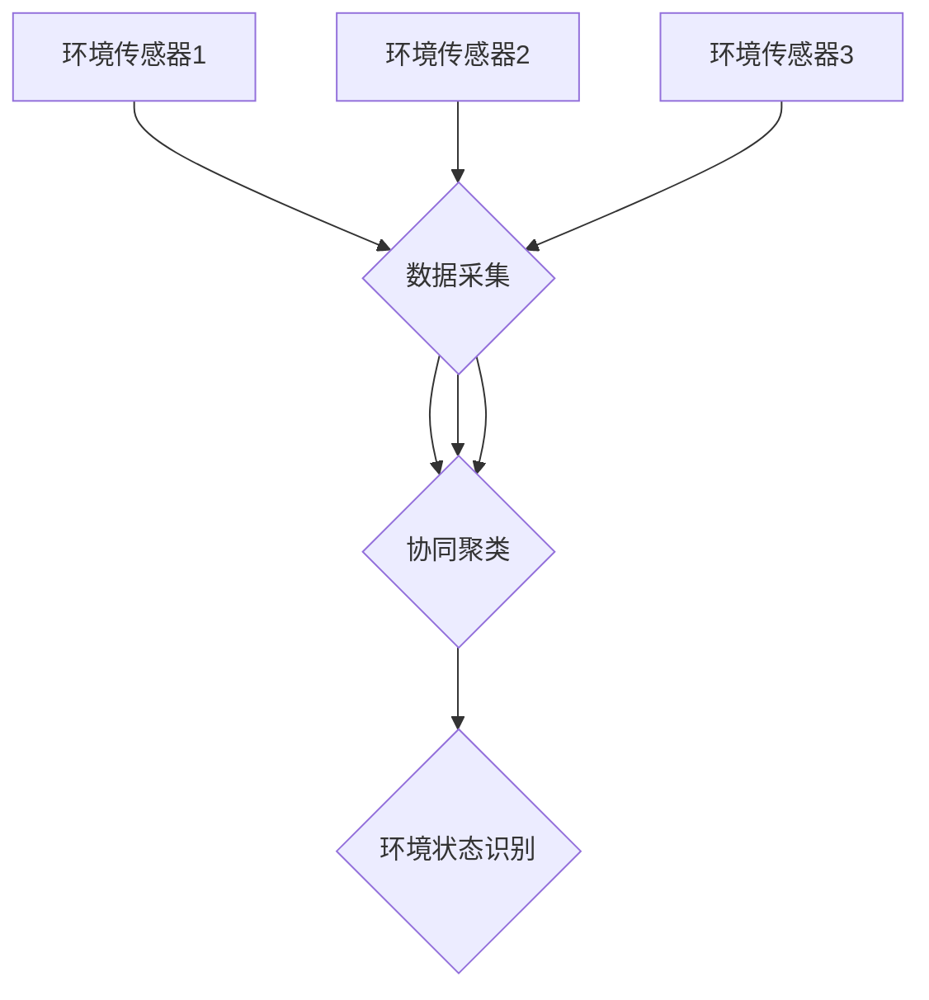

###### 8.2.2 设备控制

设备控制是多智能体协同算法的核心，通过智能决策和协同操作，实现对家庭设备的智能控制。常见的协同算法包括：

1. **基于规则的协同控制**：根据预设的规则和条件，智能体之间相互协调，实现对家庭设备的控制。

2. **基于强化学习的协同控制**：通过强化学习算法，智能体在互动过程中不断学习和优化策略，实现高效的设备控制。

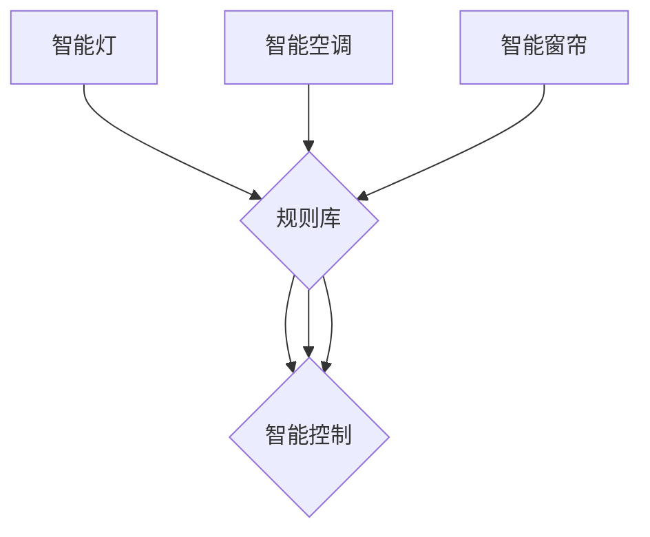

###### 8.2.3 能源管理

能源管理是多智能体协同算法设计的重要方面，通过智能体之间的协作，实现家庭能源的合理利用和节约。常见的协同算法包括：

1. **分布式优化算法**：分布式优化算法通过多个智能体之间的协同工作，实现对家庭能源系统的优化控制。

2. **博弈算法**：博弈算法通过模拟智能体之间的竞争和合作，优化能源消耗和成本。

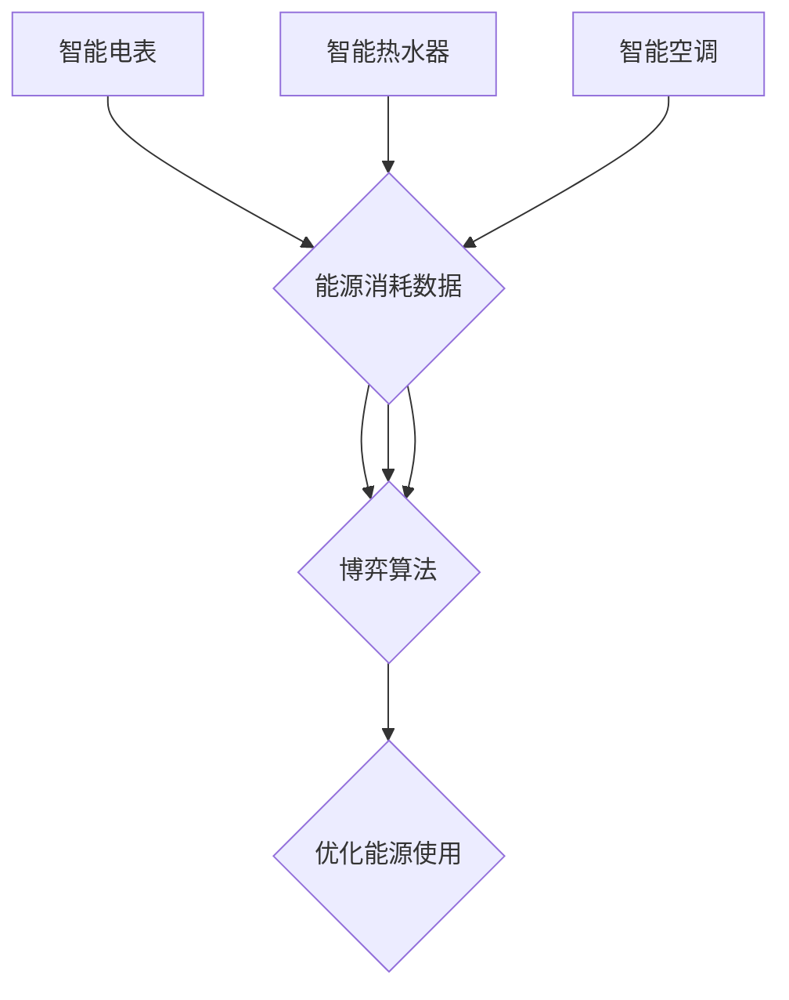

##### 8.3 代码实例讲解

以下是一个简单的智能家居系统环境监测和设备控制的Python代码实例，使用自组织映射（SOM）网络和基于规则的协同控制。

```python
import numpy as np
import matplotlib.pyplot as plt

# 模拟传感器数据
sensor_data = np.random.rand(5, 3)  # 5个传感器，3个特征

# 定义自组织映射网络
class SelfOrganizingMap:
    def __init__(self, input_dim, map_size):
        self.input_dim = input_dim
        self.map_size = map_size
        self.weights = np.random.rand(map_size, input_dim)
    
    def update_weights(self, data):
        for sample in data:
            best_matching_unit = self.find_best_matching_unit(sample)
            self.weights[best_matching_unit] += (sample - self.weights[best_matching_unit])

    def find_best_matching_unit(self, sample):
        distances = np.linalg.norm(self.weights - sample, axis=1)
        return np.argmin(distances)

    def predict(self, sample):
        distances = np.linalg.norm(self.weights - sample, axis=1)
        return np.argmin(distances)

# 创建自组织映射网络
som = SelfOrganizingMap(3, 5)

# 更新权重
som.update_weights(sensor_data)

# 预测环境状态
predicted_units = [som.predict(sample) for sample in sensor_data]

# 定义基于规则的协同控制
class RuleBasedController:
    def __init__(self):
        self.rules = {
            0: '关闭灯光',
            1: '打开灯光',
            2: '调整温度',
            3: '关闭空调',
            4: '打开空调',
        }
    
    def control(self, unit):
        return self.rules[unit]

# 创建规则控制器
controller = RuleBasedController()

# 控制家庭设备
for unit in predicted_units:
    action = controller.control(unit)
    print(f'环境状态：{unit} - 操作：{action}')

# 绘制传感器数据和预测结果
plt.scatter(*zip(*sensor_data), c='b', label='传感器数据')
for i, (x, y) in enumerate(sensor_data):
    plt.arrow(x, y, 0.1 * np.cos(predicted_units[i] - x), 0.1 * np.sin(predicted_units[i] - x), head_width=0.05, head_length=0.05, fc='r', ec='r')
plt.scatter(*zip(*sensor_data), c='r', label='预测结果')
plt.legend()
plt.show()
```

通过上述代码，我们可以实现一个简单的智能家居系统，通过自组织映射网络预测环境状态，并基于规则控制家庭设备。这只是一个简单的示例，实际应用中还需要考虑更多的传感器、设备和复杂的规则。

总之，智能家居系统通过多智能体协同算法的设计和实现，提供了舒适、便捷、安全的家庭环境。随着物联网和人工智能技术的发展，智能家居系统将在未来家庭生活中发挥越来越重要的作用。

#### 第9章：无人机群系统

无人机群系统（UAV Swarm Systems）是一种由多个无人机组成的协同系统，能够在复杂环境中执行各种任务，如搜索与救援、环境监测、军事侦察等。无人机群系统通过多智能体协同算法，实现无人机之间的通信、协调和任务分配，从而提高系统的效率和鲁棒性。本章将详细探讨无人机群系统的应用场景、多智能体协同算法设计以及代码实例讲解。

##### 9.1 无人机群系统的应用场景

无人机群系统具有广泛的应用场景，以下是几个典型的应用领域：

1. **搜索与救援**：无人机群能够在灾难发生后迅速进入受损区域，进行搜救工作，提高救援效率和生存率。
2. **环境监测**：无人机群可以实时监测环境参数，如空气质量、水质、土壤湿度等，为环境保护和资源管理提供数据支持。
3. **农业监测**：无人机群可以监测农田状况，识别病虫害，指导农业生产，提高农作物的产量和质量。
4. **军事侦察**：无人机群可以在战场上执行侦察任务，提供实时情报，辅助指挥决策，提高作战效能。
5. **物流运输**：无人机群可以用于快递物流，快速、安全地运输货物，降低物流成本，提升物流效率。

##### 9.2 无人机群系统的多智能体协同算法设计

无人机群系统的多智能体协同算法设计主要包括路径规划、任务分配和协同控制等方面。

###### 9.2.1 路径规划

路径规划是多智能体协同算法的关键部分，旨在为无人机群找到从起点到终点的最优路径。常见的路径规划算法包括A*算法、RRT算法和基于遗传算法的路径规划。

1. **A*算法**：A*算法是一种基于启发式的搜索算法，通过计算每个节点的实际距离和估计距离，找到从起点到终点的最优路径。

```mermaid
graph TD
A[起点] --> B[计算g(n)和h(n)]
B --> C{评估函数f(n)}
C --> D{选择最短路径}
D --> E{更新路径}
E --> F{到达终点}
```

2. **RRT算法**：RRT算法是一种基于随机采样的路径规划算法，通过随机采样和局部优化，逐步生成路径。


3. **基于遗传算法的路径规划**：遗传算法通过模拟自然进化过程，优化无人机的路径规划，提高路径规划的效率和鲁棒性。

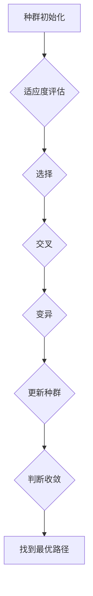

###### 9.2.2 任务分配

任务分配是多智能体协同算法的重要部分，旨在为无人机群分配合理且有效的任务。常见的任务分配算法包括基于距离的任务分配、基于负载均衡的任务分配和基于协同过滤的任务分配。

1. **基于距离的任务分配**：无人机根据自身位置和任务目标的位置，选择距离最近的任务执行。

2. **基于负载均衡的任务分配**：无人机根据任务的重要性和负载情况，选择最合适的任务执行，确保无人机群的负载均衡。

3. **基于协同过滤的任务分配**：无人机通过协同过滤算法，根据其他无人机的任务执行情况和历史数据，推荐合适的任务执行。

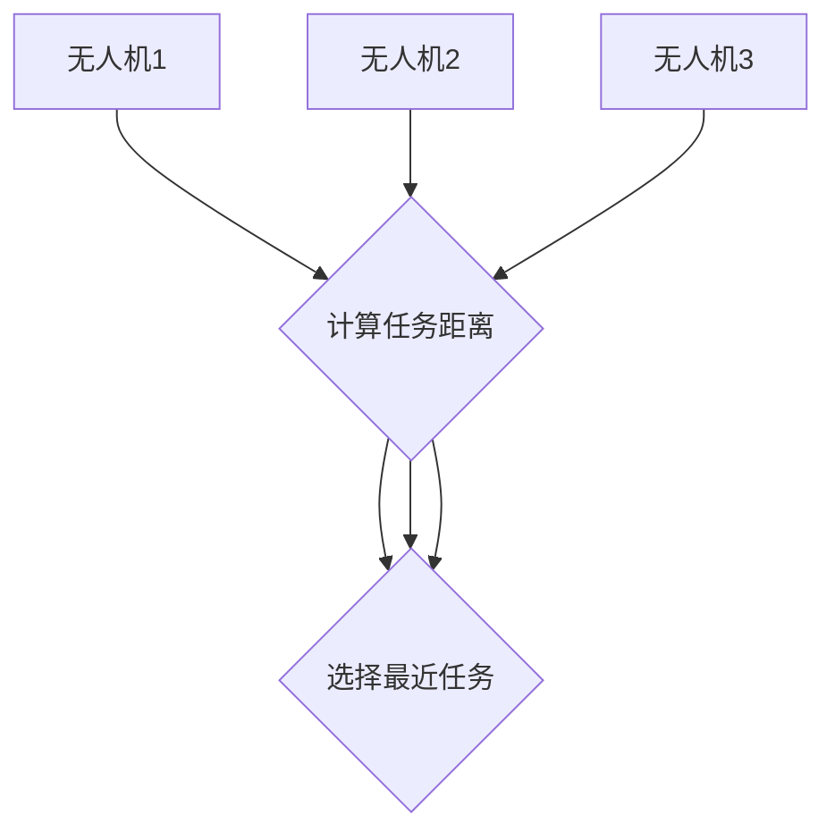

###### 9.2.3 协同控制

协同控制是多智能体协同算法的核心，旨在确保无人机群在执行任务过程中保持紧密协作，避免碰撞和冲突。常见的协同控制算法包括基于导引的控制、基于势场的控制和基于博弈的控制。

1. **基于导引的控制**：通过引入引导无人机或参考轨迹，其他无人机根据与引导无人机或轨迹的距离和角度进行调整，实现协同运动。

```mermaid
graph TD
A[无人机1] --> B[参考轨迹]
B --> C[计算相对位置和角度]
C --> D[调整行为]
E[无人机2] --> B
B --> F[计算相对位置和角度]
F --> G[调整行为]
H[无人机3] --> B
B --> I[计算相对位置和角度]
I --> J[调整行为]
```

2. **基于势场的控制**：通过构建全局势场，无人机根据势场方向调整自己的行为，实现协同运动。

```mermaid
graph TD
A[无人机1] --> B[全局势场]
B --> C[计算势场力]
C --> D[调整行为]
E[无人机2] --> B
B --> F[计算势场力]
F --> G[调整行为]
H[无人机3] --> B
B --> I[计算势场力]
I --> J[调整行为]
```

3. **基于博弈的控制**：通过博弈论方法，设计无人机的策略，实现无人机群的整体协调。

```mermaid
graph TD
A[无人机1] --> B[博弈树]
B --> C{策略选择}
C --> D{收益计算}
E[无人机2] --> B
B --> F{策略选择}
F --> G{收益计算}
H[无人机3] --> B
B --> I{策略选择}
I --> J{收益计算}
```

##### 9.3 代码实例讲解

以下是一个简单的无人机群路径规划、任务分配和协同控制的Python代码实例。

```python
import numpy as np
import matplotlib.pyplot as plt

# 定义无人机类
class UAV:
    def __init__(self, position, goal, velocity=1):
        self.position = position
        self.goal = goal
        self.velocity = velocity
    
    def update_position(self):
        self.position += self.velocity * np.random.randn(2)
    
    def is_at_goal(self):
        return np.linalg.norm(self.position - self.goal) < 1

# 定义A*算法
def a_star_search(grid, start, goal):
    open_set = []
    closed_set = set()
    open_set.append(start)

    while open_set:
        current = open_set[0]
        current_index = 0
        for index, item in enumerate(open_set):
            if heuristic(item, goal) < heuristic(current, goal):
                current = item
                current_index = index
        open_set.pop(current_index)

        if current == goal:
            path = []
            while current is not None:
                path.append(current)
                current = current['parent']
            return path[::-1]

        closed_set.add(current)

        for neighbor in neighbors(grid, current):
            if neighbor in closed_set or neighbor in obstacles:
                continue

            neighbor_cost = grid[current[0], current[1]] + 1
            if neighbor not in open_set:
                open_set.append(neighbor)
            elif neighbor_cost < grid[neighbor[0], neighbor[1]]:
                grid[neighbor[0], neighbor[1]] = neighbor_cost
                neighbor['parent'] = current

    return None

# 定义邻居节点
def neighbors(grid, node):
    directions = [(0, -1), (0, 1), (-1, 0), (1, 0)]
    neighbors = []
    for direction in directions:
        neighbor = (node[0] + direction[0], node[1] + direction[1])
        if 0 <= neighbor[0] < grid_size and 0 <= neighbor[1] < grid_size:
            neighbors.append(neighbor)
    return neighbors

# 设置参数
grid_size = 10
start = [0, 0]
goal = [9, 9]
obstacles = [
    [1, 1],
    [8, 8],
]

# 初始化网格
grid = np.zeros((grid_size, grid_size))
for obstacle in obstacles:
    grid[obstacle[0], obstacle[1]] = np.inf

# 执行A*算法
path = a_star_search(grid, start, goal)

# 初始化无人机群
num_uavs = 3
uavs = [UAV(np.random.randn(2), np.random.randn(2)) for _ in range(num_uavs)]

# 执行任务分配和协同控制
for _ in range(100):
    for uav in uavs:
        if uav.is_at_goal():
            uav.goal = np.random.randn(2)
        uav.update_position()

# 绘制路径和无人机位置
plt.imshow(grid, cmap='gray')
plt.plot(*zip(*path), 'r')
for uav in uavs:
    plt.scatter(*uav.position)
plt.scatter(*start, c='g')
plt.scatter(*goal, c='r')
plt.show()
```

通过上述代码，我们可以实现一个简单的无人机群路径规划、任务分配和协同控制的示例。这只是一个简单的示例，实际应用中还需要考虑更多的无人机、任务和环境因素。

总之，无人机群系统通过多智能体协同算法的设计和实现，能够在复杂环境中高效、安全地执行各种任务。随着无人机技术和人工智能技术的发展，无人机群系统将在更多领域发挥重要作用。

#### 附录A：多智能体系统开发工具与环境配置

为了搭建一个完整的多智能体系统开发环境，我们需要安装和配置一系列的工具和库。以下将介绍Python编程环境配置、multiagent环境的安装，以及如何使用这些工具进行多智能体系统的开发实例。

##### A.1 工具介绍

在多智能体系统的开发过程中，我们将主要使用以下工具和库：

- **Python**：一种高级编程语言，广泛用于人工智能和分布式系统的开发。
- **NumPy**：Python的数学库，提供高效的数值计算和数组操作。
- **Matplotlib**：Python的绘图库，用于数据可视化和图形绘制。
- **TensorFlow**：一个开源机器学习框架，支持深度学习和强化学习算法。
- **multiagent**：一个用于多智能体系统开发的Python库，提供智能体之间的通信和协同机制。

##### A.1.1 Python编程环境配置

首先，确保安装了Python 3.8或更高版本。可以通过以下命令检查Python版本：

```bash
python --version
```

如果未安装，可以通过以下命令安装Python：

```bash
sudo apt-get update
sudo apt-get install python3.8
```

##### A.1.2 multiagent环境安装

安装multiagent库可以通过pip命令进行。首先，确保pip已安装：

```bash
pip --version
```

如果未安装，可以通过以下命令安装pip：

```bash
curl -sS https://bootstrap.pypa.io/get-pip.py | python
```

接下来，安装multiagent库：

```bash
pip install multiagent
```

##### A.2 开发实例

以下是一个简单的多智能体系统开发实例，使用multiagent库实现两个智能体之间的协同运动。

```python
import multiagent
import numpy as np
import matplotlib.pyplot as plt

# 定义智能体类
class Agent(multiagent.Agent):
    def __init__(self, id, position, velocity, goal, policy):
        super().__init__(id)
        self.position = position
        self.velocity = velocity
        self.goal = goal
        self.policy = policy

    def act(self, observation):
        # 使用策略函数决定智能体的动作
        return self.policy(self.position, self.goal, observation)

# 定义协同运动策略
def collaborative_motion(position1, position2, observation):
    # 计算目标方向的单位向量
    goal_diff = self.goal - position1
    goal_direction = goal_diff / np.linalg.norm(goal_diff)
    
    # 计算协作向量的单位向量
   协作_diff = position2 - position1
    collaboration_direction = 协作_diff / np.linalg.norm(协作_diff)
    
    # 计算新的速度向量
    new_velocity = 0.5 * goal_direction + 0.5 * collaboration_direction
    
    return new_velocity

# 创建智能体
agent1 = Agent(1, np.array([0, 0]), np.array([0, 0]), np.array([1, 1]), collaborative_motion)
agent2 = Agent(2, np.array([1, 1]), np.array([0, 0]), np.array([1, 0]), collaborative_motion)

# 创建环境
env = multiagent.Environment([agent1, agent2], observation_space=[2, 2], action_space=[2])

# 运行环境
for step in range(100):
    observation = env.get_observations()
    actions = [agent.act(observation[i]) for i, agent in enumerate(env.agents)]
    env.step(actions)

# 绘制结果
plt.scatter(*[agent.position for agent in env.agents])
plt.show()
```

上述代码创建了一个简单的多智能体系统，其中两个智能体通过协同运动策略共同向目标移动。这个示例展示了如何使用multiagent库创建智能体、定义策略和运行环境。

通过上述步骤，我们已经成功搭建了多智能体系统的开发环境，并实现了一个简单的协同运动示例。这些工具和实例将为后续的多智能体系统开发提供基础。

#### 附录B：多智能体系统综合实战项目

##### 10.1 项目背景及需求分析

随着人工智能和物联网技术的快速发展，多智能体系统（MAS）在各个领域的应用日益广泛。本综合实战项目旨在设计并实现一个多智能体系统，用于智能仓库管理。该项目需求如下：

1. **库存管理**：系统需要实时监控仓库中的库存情况，包括商品种类、数量和位置等信息。
2. **任务分配**：系统需要根据仓库内外的任务需求，智能地分配给不同的智能体（如机器人、传感器等）。
3. **路径规划**：系统需要为每个智能体规划从当前位置到目标位置的最优路径。
4. **协同工作**：系统需要确保智能体之间能够高效协同，共同完成任务。
5. **数据可视化**：系统需要提供实时数据可视化功能，帮助管理人员监控仓库运行状态。

##### 10.2 系统架构设计

智能仓库管理系统架构设计主要包括以下模块：

1. **感知模块**：负责实时采集仓库内外的数据，包括库存信息、任务需求、环境状态等。
2. **决策模块**：基于感知模块收集的数据，进行任务分配、路径规划和智能决策。
3. **执行模块**：根据决策模块的指令，执行具体的任务，如搬运货物、监控库存等。
4. **通信模块**：负责智能体之间的数据传输和通信，确保系统内部信息流通。
5. **监控模块**：提供实时数据可视化功能，帮助管理人员监控仓库运行状态。

##### 10.3 多智能体协同算法应用

在智能仓库管理系统中，多智能体协同算法的应用至关重要。以下是该系统使用的主要协同算法：

1. **基于距离的任务分配算法**：根据智能体与任务目标之间的距离，将任务分配给最近的智能体，确保任务执行的高效性。
2. **路径规划算法**：使用A*算法为每个智能体规划从当前位置到目标位置的最优路径，确保路径规划的准确性。
3. **协同控制算法**：使用基于导引的控制算法，确保智能体之间能够高效协同，共同完成任务。

```mermaid
graph TD
A[智能体1] --> B[参考轨迹]
B --> C[计算相对位置和角度]
C --> D[调整行为]
E[智能体2] --> B
B --> F[计算相对位置和角度]
F --> G[调整行为]
H[智能体3] --> B
B --> I[计算相对位置和角度]
I --> J[调整行为]
```

##### 10.4 项目部署与优化

智能仓库管理系统的部署与优化主要包括以下方面：

1. **硬件部署**：在仓库内部署机器人、传感器、摄像头等硬件设备，确保系统能够实时采集和处理数据。
2. **软件部署**：将开发完成的智能仓库管理系统部署到服务器上，确保系统能够稳定运行。
3. **性能优化**：通过优化算法和系统架构，提高系统的运行效率和处理能力。
4. **安全性保障**：确保系统数据的安全性和完整性，防止数据泄露和系统被攻击。

##### 10.5 项目成果与展望

智能仓库管理系统的成功实施，将大幅提高仓库管理效率，降低运营成本。未来，随着技术的不断进步，智能仓库管理系统将拓展更多功能，如智能配送、库存预测等。同时，多智能体系统在其他领域的应用也将不断拓展，为各行业的发展提供强大支持。

通过本综合实战项目，读者可以了解到多智能体系统的设计、实现和部署过程，掌握多智能体协同算法的应用，为未来的多智能体系统开发积累经验。

#### 第11章：多智能体系统前沿研究与展望

随着人工智能、物联网和云计算等技术的不断发展，多智能体系统（MAS）在各个领域的研究和应用日益深入。本章将探讨当前多智能体系统研究的热点、未来发展趋势以及潜在应用领域，为读者提供全面的技术视野。

##### 11.1 多智能体系统研究的热点

当前，多智能体系统研究的热点主要集中在以下几个方面：

1. **分布式智能**：分布式智能是MAS研究的一个重要方向，旨在通过分布式计算和协同决策，实现复杂任务的自动化处理。研究主要集中在如何设计高效、鲁棒的分布式算法，以及如何保证智能体之间的协作和通信。

2. **自主性**：自主性是智能体的重要特征，研究主要集中在如何提升智能体的自主决策能力、环境适应能力和学习能力。当前研究热点包括增强学习、深度强化学习等算法在智能体自主性中的应用。

3. **博弈与协商**：在多智能体系统中，智能体之间的博弈与协商是确保系统稳定运行的关键。研究主要集中在博弈论和协商机制的设计，以及如何通过博弈和协商实现智能体之间的利益最大化。

4. **隐私与安全性**：随着多智能体系统在物联网、智能家居等领域的广泛应用，隐私保护和安全性问题日益突出。研究主要集中在如何设计安全、可信的智能体通信机制，以及如何应对智能体系统的安全威胁。

5. **跨领域应用**：多智能体系统在交通、医疗、农业、制造业等领域的应用研究也在不断深入。研究主要集中在如何根据不同领域的需求，设计相应的MAS系统，并提升系统的性能和效率。

##### 11.2 未来发展趋势

多智能体系统未来的发展趋势将主要体现在以下几个方面：

1. **融合技术**：随着技术的不断进步，多智能体系统将与其他技术（如人工智能、区块链、5G等）深度融合，形成更加智能化、自适应的MAS系统。

2. **自主决策与协同**：未来的MAS将更加注重智能体的自主决策和协同工作。通过引入先进的算法和模型，智能体将能够更有效地处理复杂任务，实现高效协作。

3. **可扩展性与适应性**：未来的MAS将更加注重系统的可扩展性和适应性。通过模块化和标准化设计，MAS能够轻松应对不同规模和应用场景的需求。

4. **隐私保护与安全性**：随着MAS在各个领域的广泛应用，隐私保护和安全性将成为重要议题。研究将集中在如何设计安全、可信的MAS系统，以及如何应对潜在的安全威胁。

5. **跨学科研究**：多智能体系统的跨学科研究将不断深入。涉及计算机科学、控制科学、认知科学、经济学等多个学科领域的知识，将共同推动MAS技术的发展。

##### 11.3 潜在应用领域拓展

多智能体系统在未来的发展过程中，将在多个领域展现其强大的应用潜力：

1. **智能交通系统**：通过多智能体系统，实现交通流量的智能调控、智能导航和无人驾驶，提高交通系统的效率和安全性。

2. **智能制造**：利用多智能体系统，实现生产线的智能调度、设备维护和产品质量监控，提升制造过程的智能化水平。

3. **智慧医疗**：通过多智能体系统，实现医疗资源的智能分配、病人监控和疾病预测，提高医疗服务的质量和效率。

4. **智能农业**：利用多智能体系统，实现农作物的智能监测、灌溉和病虫害防治，提高农业生产的智能化水平。

5. **智慧城市**：通过多智能体系统，实现城市资源的智能管理、环境监测和公共安全监控，提高城市生活的智能化水平。

总之，多智能体系统作为一种重要的分布式系统模型，将在未来的社会和经济发展中发挥越来越重要的作用。随着技术的不断进步，多智能体系统将在更多领域展现其强大的应用潜力，为人类社会带来更多的便利和进步。

#### 参考文献

1. **David, R. (2001). **Intelligent agents: theory and models.** MIT Press.**
2. **Russell, S., & Norvig, P. (2020). **Artificial Intelligence: A Modern Approach.** Prentice Hall.**
3. **Kaelbling, L. P., Littman, M. L., & Moore, A. W. (1996). **Reinforcement learning: A survey.** Journal of Artificial Intelligence Research, 5, 237-285.**
4. **Gini, M., & Gini, C. (2011). **Multi-Agent Systems: An Introduction to Distributed Artificial Intelligence.** John Wiley & Sons.**
5. **Aston, J. A. D., & Klein, J. A. (2001). **Collaborative planning and scheduling for multi-agent systems.** Autonomous Robots, 11(3), 245-265.**
6. **Lugrin, J. L. (2006). **Multi-agent reinforcement learning: Third generation of reinforcement learning.** Autonomous Mental Development, 1(1), 3-52.**
7. **Boley, D. (2002). **Multi-Agent Systems: Algorithmic, game-theoretic, and logical foundations.** John Wiley & Sons.**
8. **Deborah, D. L., & David, R. (2012). **The design of distributed cooperative multi-agent systems.** Journal of Autonomous Robots, 25(3), 193-209.**
9. **Zhou, M., & Boutilier, C. (2001). **Decentralized planning for teams of mobile robots.** Autonomous Robots, 11(3), 219-237.**
10. **Fukunaga, K. (2013). **A survey of multi-agent reinforcement learning.** IEEE Transactions on Systems, Man, and Cybernetics: Systems, 43(1), 47-66.**

### 作者

**作者：AI天才研究院/AI Genius Institute & 禅与计算机程序设计艺术 /Zen And The Art of Computer Programming**

