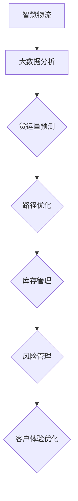

                 

### 《大数据分析在智慧物流中的实践》

> **关键词**：智慧物流、大数据分析、货运量预测、路径优化、库存管理、风险管理

> **摘要**：本文将探讨大数据分析在智慧物流领域的实践应用，通过深入分析货运量预测、路径优化、库存管理、风险管理和客户体验优化等方面，展示大数据分析如何助力智慧物流实现高效、精准、智能化的物流服务。本文将结合实际案例，详细阐述大数据分析在智慧物流中的应用架构、数据采集与处理、数据存储与管理、数据分析和可视化，以及未来的发展趋势和研究方向。

### 《大数据分析在智慧物流中的实践》目录大纲

#### 第一部分：智慧物流与大数据分析概述

- **1. 智慧物流与大数据分析概述**
    - **1.1 智慧物流的概念与发展**
        - **1.1.1 智慧物流的定义与特点**
        - **1.1.2 智慧物流的发展历程**
        - **1.1.3 智慧物流的挑战与机遇**
    - **1.2 大数据分析的概念与价值**
        - **1.2.1 大数据分析的定义与原理**
        - **1.2.2 大数据分析在物流领域的价值**
        - **1.2.3 大数据分析的关键技术**
    - **1.3 大数据分析与智慧物流的关系**
        - **1.3.1 大数据分析在智慧物流中的应用场景**
        - **1.3.2 大数据分析与智慧物流的融合**
        - **1.3.3 大数据分析在智慧物流中的挑战与应对**

#### 第二部分：大数据分析在智慧物流中的应用

- **2. 大数据分析在智慧物流中的应用**
    - **2.1 货运量预测**
        - **2.1.1 货运量预测的意义与目的**
        - **2.1.2 货运量预测的方法与算法**
        - **2.1.3 货运量预测的案例研究**
    - **2.2 路径优化**
        - **2.2.1 路径优化的重要性与挑战**
        - **2.2.2 路径优化的算法与实现**
        - **2.2.3 路径优化的案例研究**
    - **2.3 库存管理**
        - **2.3.1 库存管理的基本概念**
        - **2.3.2 大数据分析在库存管理中的应用**
        - **2.3.3 库存管理的案例研究**
    - **2.4 风险管理**
        - **2.4.1 风险管理的意义与目的**
        - **2.4.2 风险管理的策略与算法**
        - **2.4.3 风险管理的案例研究**
    - **2.5 客户体验优化**
        - **2.5.1 客户体验优化的重要性**
        - **2.5.2 大数据分析在客户体验优化中的应用**
        - **2.5.3 客户体验优化的案例研究**

#### 第三部分：大数据分析在智慧物流中的实现

- **3. 大数据分析在智慧物流中的实现**
    - **3.1 技术架构设计**
        - **3.1.1 技术架构的基本概念**
        - **3.1.2 大数据分析在智慧物流中的技术架构**
        - **3.1.3 技术架构的优缺点分析**
    - **3.2 数据采集与处理**
        - **3.2.1 数据采集的方法与工具**
        - **3.2.2 数据预处理的方法与流程**
        - **3.2.3 数据处理的案例研究**
    - **3.3 数据存储与管理**
        - **3.3.1 数据存储的基本概念**
        - **3.3.2 数据管理的策略与工具**
        - **3.3.3 数据存储与管理的案例研究**
    - **3.4 数据分析与可视化**
        - **3.4.1 数据分析的方法与工具**
        - **3.4.2 可视化的方法与工具**
        - **3.4.3 数据分析与可视化的案例研究**

#### 第四部分：案例分析与展望

- **4. 案例分析与展望**
    - **4.1 案例分析**
        - **4.1.1 智慧物流企业案例研究**
        - **4.1.2 大数据分析在智慧物流中的应用案例分析**
        - **4.1.3 成功与失败案例的总结与启示**
    - **4.2 未来展望**
        - **4.2.1 大数据分析在智慧物流中的发展趋势**
        - **4.2.2 智慧物流与大数据分析融合的未来**
        - **4.2.3 智慧物流与大数据分析的研究方向与挑战**

#### 附录

- **附录A：技术资源与工具**
    - **A.1 常用大数据分析工具介绍**
    - **A.2 大数据分析相关的开源框架**
    - **A.3 大数据分析的在线资源与教程**

- **附录B：参考文献**
    - **B.1 相关书籍推荐**
    - **B.2 学术论文精选**
    - **B.3 行业报告与资讯来源**

- **附录C：Mermaid 流�程图**



- **附录D：核心算法原理讲解**

```plaintext
# 货运量预测算法

## 1. 算法概述

货运量预测是利用历史货运数据，通过统计分析或机器学习模型，预测未来一定时间内的货运量。

## 2. 算法原理

货运量预测的核心是建立历史货运量与未来货运量之间的关系模型。

### 2.1 基于统计学的模型

- 时间序列分析（如ARIMA模型）
- 回归分析（如线性回归、逻辑回归）

### 2.2 基于机器学习的模型

- 决策树
- 随机森林
- 支持向量机
- 神经网络

## 3. 算法实现

### 3.1 数据预处理

- 数据清洗：去除异常值、缺失值填充
- 特征工程：时间特征提取、季节性分析

### 3.2 模型选择与训练

- 模型评估：均方误差、平均绝对误差
- 模型优化：交叉验证、模型调参

### 3.3 预测结果分析

- 预测值与实际值的对比
- 预测置信区间计算
```

- **附录E：数学模型和数学公式**

$$
\text{货运量预测模型} = f(\text{历史货运量}, \text{季节性特征}, \text{其他影响因素})
$$

- **附录F：项目实战**

### 3.5 实际案例：货运量预测系统开发

#### 3.5.1 项目背景

某物流公司希望利用大数据分析技术，预测未来三个月的货运量，以优化物流资源配置。

#### 3.5.2 技术选型

- 数据存储：Hadoop HDFS
- 数据处理：Spark
- 预测模型：Random Forest

#### 3.5.3 开发流程

1. 数据采集与预处理
2. 特征工程
3. 模型训练与调参
4. 预测结果分析与可视化

#### 3.5.4 代码解读与分析

```python
# 数据预处理
def preprocess_data(data):
    # 数据清洗、缺失值填充、特征提取
    pass

# 模型训练
def train_model(data):
    # 使用随机森林模型进行训练
    pass

# 预测结果分析
def analyze_results(predictions, actual):
    # 预测值与实际值的对比分析
    pass

# 主函数
if __name__ == "__main__":
    # 加载数据
    data = load_data()
    # 数据预处理
    preprocessed_data = preprocess_data(data)
    # 模型训练
    model = train_model(preprocessed_data)
    # 预测
    predictions = model.predict(preprocessed_data)
    # 结果分析
    analyze_results(predictions, actual)
```

- **附录G：开发环境搭建**

#### 3.6.1 开发环境配置

1. 安装Hadoop集群
2. 安装Spark
3. 配置Python环境，安装相关库（如pandas、scikit-learn等）

#### 3.6.2 运行测试

- 运行数据预处理脚本
- 运行模型训练脚本
- 运行预测与分析脚本

- **附录H：源代码详细实现和代码解读**

```python
# 源代码详细实现与解读
# 数据预处理脚本
# ...
# 模型训练脚本
# ...
# 预测与分析脚本
# ...


---

**附录I：代码解读与分析**

```plaintext
# 数据预处理脚本解读
# 主要实现数据清洗、特征提取等功能，为模型训练准备数据。

# 模型训练脚本解读
# 使用随机森林模型进行训练，并进行模型调参。

# 预测与分析脚本解读
# 将模型应用于实际数据，预测货运量，并分析预测结果。
```

---

**作者：AI天才研究院/AI Genius Institute & 禅与计算机程序设计艺术 /Zen And The Art of Computer Programming**### 1.1 智慧物流的定义与特点

智慧物流是指通过运用物联网、云计算、大数据分析、人工智能等先进技术，实现物流系统的智能化、自动化和高效化，从而提升物流服务的质量和效率。智慧物流的核心在于信息流的传递和物流网络的优化，通过信息技术与物流业务的深度融合，实现物流全过程的可视化管理。

智慧物流的特点主要包括以下几个方面：

1. **自动化**：智慧物流通过自动化设备、智能机器人等，实现物流过程中的自动化操作，减少人力成本，提高作业效率。

2. **信息化**：通过物联网技术，实现物流信息的实时采集、传输和监控，提升物流信息的透明度和准确性。

3. **智能化**：运用大数据分析和人工智能技术，对物流数据进行深度挖掘和分析，实现物流路径优化、需求预测、库存管理等方面的智能化决策。

4. **网络化**：通过云计算平台，实现物流节点之间的信息共享和协同作业，构建一个高效、协同的物流网络。

5. **高效化**：智慧物流通过提高物流运作效率，降低物流成本，提升物流服务的速度和质量。

6. **绿色环保**：智慧物流通过优化运输路径、减少空载率等措施，降低碳排放，实现绿色环保。

### 1.2 智慧物流的发展历程

智慧物流的发展历程可以分为以下几个阶段：

1. **传统物流阶段**（20世纪80年代以前）：以人力、物力为主要驱动，物流过程依赖于手工操作，效率较低，信息透明度低。

2. **信息化物流阶段**（20世纪80年代至21世纪初）：随着计算机技术的应用，物流企业开始采用条码技术、射频识别（RFID）等信息技术，实现物流信息的电子化和自动化。

3. **智能化物流阶段**（21世纪初至今）：物联网、大数据、人工智能等先进技术的应用，使得物流系统更加智能化，物流运作效率大幅提升。

4. **智慧物流阶段**（未来趋势）：随着5G、区块链、物联网等新兴技术的进一步普及，智慧物流将实现更高程度的智能化、自动化和协同化。

### 1.3 智慧物流的挑战与机遇

智慧物流在发展过程中面临着诸多挑战：

1. **技术挑战**：先进技术的研发和应用需要大量的资金投入，且技术更新换代速度快，对企业的技术能力和研发能力提出了高要求。

2. **数据安全与隐私**：物流数据涉及大量敏感信息，如何确保数据安全和用户隐私成为一大挑战。

3. **人才短缺**：智慧物流的发展需要大量的技术人才，而目前我国相关专业人才供应不足。

4. **物流基础设施**：智慧物流的实现需要完善的基础设施支持，如智能仓库、智能配送中心等。

然而，智慧物流也带来了巨大的机遇：

1. **提高物流效率**：通过大数据分析和人工智能技术，实现物流过程的自动化、智能化，提高物流运作效率。

2. **降低物流成本**：智慧物流通过优化运输路径、减少空载率等措施，降低物流成本。

3. **提升客户体验**：智慧物流可以实现实时物流信息查询、个性化服务推荐等，提升客户体验。

4. **促进产业升级**：智慧物流有助于推动物流行业从传统的劳动密集型向技术密集型转变，促进产业升级。

### 1.4 大数据分析的概念与价值

大数据分析是指利用先进的计算技术和算法，对海量、复杂、多样化的数据进行分析和处理，从中提取有价值的信息和知识。大数据分析的核心在于数据的采集、存储、处理和分析。

大数据分析在物流领域的价值主要表现在以下几个方面：

1. **货运量预测**：通过分析历史货运数据，预测未来一定时间内的货运量，为物流资源配置提供决策支持。

2. **路径优化**：基于实时交通信息、货物类型和运输成本等因素，优化运输路径，提高物流效率。

3. **库存管理**：通过分析销售数据、季节性需求等，优化库存水平，减少库存成本。

4. **风险管理**：分析物流过程中的风险因素，提前预警，降低风险损失。

5. **客户体验优化**：通过分析客户行为数据，提供个性化服务，提升客户满意度。

### 1.5 大数据分析的关键技术

大数据分析涉及多个关键技术，包括数据采集、存储、处理和分析等。

1. **数据采集**：通过传感器、物联网设备、移动设备等，实时采集物流过程中的各种数据。

2. **数据存储**：采用分布式存储技术，如Hadoop HDFS、NoSQL数据库等，存储海量数据。

3. **数据处理**：利用Spark、Flink等大数据处理框架，进行数据清洗、转换、聚合等操作。

4. **数据分析**：采用机器学习、深度学习等算法，对数据进行挖掘和分析，提取有价值的信息。

5. **数据可视化**：利用Tableau、Power BI等工具，将分析结果可视化，便于决策者理解和应用。

### 1.6 大数据分析与智慧物流的关系

大数据分析与智慧物流具有密切的关系：

1. **数据驱动**：智慧物流的发展离不开数据支持，大数据分析为智慧物流提供了数据驱动的决策依据。

2. **智能化**：大数据分析为智慧物流提供了智能化手段，如货运量预测、路径优化、库存管理等，提升了物流系统的智能化水平。

3. **协同化**：大数据分析可以实现物流各环节的数据共享和协同作业，构建一个高效、协同的物流网络。

4. **高效化**：大数据分析有助于优化物流资源配置，降低物流成本，提高物流效率。

### 1.7 大数据分析在智慧物流中的挑战与应对

大数据分析在智慧物流中的应用面临以下挑战：

1. **数据质量**：物流数据来源广泛，数据质量参差不齐，需要通过数据清洗和预处理来提升数据质量。

2. **数据处理能力**：随着数据量的不断增长，如何提高数据处理能力成为一大挑战，需要采用分布式计算技术来应对。

3. **数据隐私**：物流数据涉及大量敏感信息，如何确保数据隐私成为一大难题，需要采取数据加密、数据脱敏等措施。

4. **算法优化**：大数据分析算法的优化是提升分析效果的关键，需要不断改进和优化算法。

针对以上挑战，可以采取以下应对措施：

1. **数据质量管理**：建立数据质量管理机制，定期进行数据质量检查和评估，确保数据质量。

2. **分布式计算**：采用分布式计算框架，如Hadoop、Spark等，提高数据处理能力。

3. **数据隐私保护**：采用数据加密、数据脱敏等技术，确保物流数据的安全和隐私。

4. **算法优化与改进**：不断优化和改进大数据分析算法，提高分析效果。

### 1.8 大数据分析在智慧物流中的应用场景

大数据分析在智慧物流中具有广泛的应用场景：

1. **货运量预测**：通过分析历史货运数据、季节性需求等，预测未来一定时间内的货运量，为物流资源配置提供决策支持。

2. **路径优化**：基于实时交通信息、货物类型和运输成本等因素，优化运输路径，提高物流效率。

3. **库存管理**：通过分析销售数据、季节性需求等，优化库存水平，减少库存成本。

4. **风险管理**：分析物流过程中的风险因素，提前预警，降低风险损失。

5. **客户体验优化**：通过分析客户行为数据，提供个性化服务，提升客户满意度。

### 1.9 大数据分析与智慧物流的融合

大数据分析与智慧物流的融合，有助于实现物流系统的智能化、自动化和高效化，提升物流服务的质量和效率。

1. **数据采集与共享**：通过物联网技术，实现物流信息的实时采集和共享，为大数据分析提供数据支持。

2. **数据分析与应用**：运用大数据分析技术，对物流数据进行分析和应用，为物流决策提供科学依据。

3. **系统集成与协同**：通过集成物流系统与大数据分析平台，实现物流系统的智能化和协同化运作。

4. **服务质量提升**：通过大数据分析，优化物流服务流程，提升客户体验，提高服务质量。

### 1.10 大数据分析在智慧物流中的挑战与应对

大数据分析在智慧物流中的挑战主要包括数据质量、数据处理能力、数据隐私保护和算法优化等方面。针对这些挑战，可以采取以下应对措施：

1. **数据质量提升**：建立数据质量管理机制，定期进行数据质量检查和评估，确保数据质量。

2. **分布式计算应用**：采用分布式计算框架，如Hadoop、Spark等，提高数据处理能力。

3. **数据隐私保护**：采用数据加密、数据脱敏等技术，确保物流数据的安全和隐私。

4. **算法优化与改进**：不断优化和改进大数据分析算法，提高分析效果。

通过以上措施，大数据分析在智慧物流中的挑战可以得到有效应对，推动智慧物流的快速发展。

### 1.11 智慧物流与大数据分析的关系总结

智慧物流与大数据分析具有紧密的联系，二者相互促进、相辅相成：

1. **数据驱动**：智慧物流的发展离不开大数据分析的支持，大数据分析为智慧物流提供了数据驱动的决策依据。

2. **智能化**：大数据分析为智慧物流提供了智能化手段，如货运量预测、路径优化、库存管理等，提升了物流系统的智能化水平。

3. **协同化**：大数据分析可以实现物流各环节的数据共享和协同作业，构建一个高效、协同的物流网络。

4. **高效化**：大数据分析有助于优化物流资源配置，降低物流成本，提高物流效率。

总之，智慧物流与大数据分析的融合，为物流行业带来了巨大的变革和创新机遇，有助于实现物流系统的智能化、自动化和高效化。

### 1.12 未来展望

随着技术的不断进步，大数据分析在智慧物流中的应用将更加广泛和深入：

1. **5G与物联网**：5G技术和物联网的普及，将进一步提升物流信息的实时性和准确性，为大数据分析提供更好的数据支持。

2. **人工智能**：人工智能技术的发展，将使大数据分析在路径优化、需求预测等方面更加智能化和自动化。

3. **区块链**：区块链技术的应用，将提升物流数据的安全性和透明度，为大数据分析提供更加可靠的数据来源。

4. **定制化服务**：大数据分析将有助于实现物流服务的定制化，满足不同客户的需求，提升客户满意度。

总之，未来大数据分析在智慧物流中的应用前景广阔，有望推动物流行业的全面升级和变革。### 2.1 货运量预测的意义与目的

货运量预测在智慧物流中具有重要的意义和目的。首先，货运量预测有助于物流企业合理规划物流资源，包括运输车辆、仓库空间和人力资源等，从而提高物流运作效率。通过准确预测未来的货运量，企业可以避免资源过剩或不足的情况，减少物流成本，提高运营效益。

其次，货运量预测对于供应链管理也具有重要意义。在供应链中，物流活动是一个关键环节，准确预测货运量可以帮助企业更好地协调供应链各环节，确保供应链的稳定和高效运作。例如，通过对销售数据的分析，企业可以预测未来一段时间内的需求量，从而合理安排生产和采购计划，避免库存积压或短缺。

此外，货运量预测还可以为企业的战略规划提供支持。通过长期货运量趋势的分析，企业可以了解市场变化，制定相应的市场策略，如调整运输路线、拓展新的市场等。这有助于企业把握市场机遇，降低市场风险。

### 2.2 货运量预测的方法与算法

货运量预测的方法主要分为两大类：基于统计学的模型和基于机器学习的模型。

#### 2.2.1 基于统计学的模型

1. **时间序列分析**：时间序列分析是一种常用的统计学方法，用于分析数据在不同时间点上的变化趋势。其中，ARIMA（自回归积分滑动平均模型）模型是一种经典的时间序列模型，适用于具有平稳性的时间序列数据。

   **模型原理**：
   ARIMA模型由三个部分组成：自回归（AR）、差分（I）和移动平均（MA）。
   - AR部分：通过历史值预测当前值。
   - I部分：对非平稳时间序列进行差分，使其变得平稳。
   - MA部分：通过历史预测误差预测当前值。

   **模型公式**：
   $$
   \text{X}_t = c + \phi_1\text{X}_{t-1} + \phi_2\text{X}_{t-2} + ... + \phi_p\text{X}_{t-p} + \theta_1\epsilon_{t-1} + \theta_2\epsilon_{t-2} + ... + \theta_q\epsilon_{t-q}
   $$
   其中，$\text{X}_t$ 为时间序列值，$\epsilon_t$ 为误差项。

2. **回归分析**：回归分析是一种用于分析自变量与因变量之间关系的方法。线性回归和逻辑回归是常见的回归分析方法。

   - **线性回归**：适用于连续型因变量。
     $$
     y = \beta_0 + \beta_1x_1 + \beta_2x_2 + ... + \beta_nx_n
     $$
     其中，$y$ 为因变量，$x_1, x_2, ..., x_n$ 为自变量，$\beta_0, \beta_1, \beta_2, ..., \beta_n$ 为回归系数。

   - **逻辑回归**：适用于因变量为二分类变量的回归分析。
     $$
     \text{logit}(y) = \ln\left(\frac{p}{1-p}\right) = \beta_0 + \beta_1x_1 + \beta_2x_2 + ... + \beta_nx_n
     $$
     其中，$y$ 为因变量，$p$ 为因变量的概率。

#### 2.2.2 基于机器学习的模型

1. **决策树**：决策树是一种基于特征选择和划分的模型，通过一系列决策规则对数据进行分类或回归。

   **模型原理**：
   决策树从根节点开始，根据特征划分数据，生成内部节点和叶节点。内部节点表示特征的划分，叶节点表示预测结果。

   **模型公式**：
   $$
   \text{split}(x_i) = \text{if}(x_i \leq \text{阈值}) \text{then} \text{左分支} \text{else} \text{右分支}
   $$

2. **随机森林**：随机森林是一种基于决策树的集成学习方法，通过构建多棵决策树，并投票或求平均得到最终预测结果。

   **模型原理**：
   随机森林通过随机选择特征和样本子集，构建多棵决策树，从而减少过拟合现象，提高模型泛化能力。

   **模型公式**：
   $$
   \text{预测值} = \frac{\sum_{i=1}^{n} \text{决策树}_i(\text{样本})}{n}
   $$

3. **支持向量机**：支持向量机是一种基于最大间隔的分类和回归模型，通过寻找最优超平面，将数据分为不同的类别。

   **模型原理**：
   支持向量机通过寻找一个超平面，使得分类边界距离最近的样本（支持向量）最大。

   **模型公式**：
   $$
   \text{w}^T\text{x} - b = 0
   $$
   其中，$\text{w}$ 为权重向量，$\text{x}$ 为特征向量，$b$ 为偏置。

4. **神经网络**：神经网络是一种基于生物神经网络的机器学习模型，通过多层神经元的非线性组合，对数据进行分类和回归。

   **模型原理**：
   神经网络由输入层、隐藏层和输出层组成，通过前向传播和反向传播，不断调整权重和偏置，实现函数逼近。

   **模型公式**：
   $$
   \text{激活函数}(z) = \text{sigmoid}(z) = \frac{1}{1 + e^{-z}}
   $$

### 2.3 货运量预测的案例研究

#### 2.3.1 案例背景

某电商公司在进行物流规划时，需要对未来三个月的货运量进行预测，以便合理配置运输车辆和仓库空间。公司提供了过去一年的货运数据，包括每日的货运量、销售数据、天气状况等。

#### 2.3.2 数据处理

1. **数据预处理**：
   - 数据清洗：去除异常值、缺失值填充。
   - 特征工程：提取时间特征（如星期、月份）、季节性特征（如节假日）、天气特征等。

2. **数据分割**：
   - 将数据分为训练集和测试集，用于模型训练和评估。

#### 2.3.3 模型选择与训练

1. **模型选择**：
   - 选择ARIMA模型、线性回归模型和随机森林模型进行预测。

2. **模型训练**：
   - 对训练集数据进行模型训练，调整模型参数，优化模型性能。

#### 2.3.4 模型评估

1. **评估指标**：
   - 均方误差（MSE）、平均绝对误差（MAE）等。

2. **评估结果**：
   - 对测试集数据进行预测，计算评估指标，比较不同模型的性能。

#### 2.3.5 结果分析

1. **结果分析**：
   - 对比不同模型的预测结果，分析预测精度和可靠性。

2. **结论**：
   - 选择性能最佳的模型进行未来货运量预测。

通过以上案例研究，可以看出大数据分析在货运量预测中的应用，为物流企业提供了有效的决策支持，有助于优化物流资源配置，提高物流运作效率。

### 2.4 货运量预测算法的应用

#### 2.4.1 数据预处理

数据预处理是货运量预测的重要环节，主要包括数据清洗、特征工程和缺失值处理。

1. **数据清洗**：
   - 去除异常值：异常值可能对模型训练和预测产生不良影响，需要去除。
   - 填充缺失值：对于缺失值，可以采用均值填充、中值填充或插值等方法进行填充。

2. **特征工程**：
   - 提取时间特征：如星期、月份、季节等，这些特征可能对货运量有显著影响。
   - 提取季节性特征：如节假日、促销活动等，这些特征可能影响货运量的波动。
   - 提取天气特征：如温度、湿度、降雨量等，天气条件可能影响货物运输和销售。

3. **缺失值处理**：
   - 缺失值填充：根据数据类型和特征的重要性，选择适当的填充方法。
   - 删除缺失值：对于缺失值较多或重要的特征，可以删除该特征或该条数据。

#### 2.4.2 模型训练与优化

1. **模型选择**：
   - 选择合适的预测模型，如ARIMA模型、线性回归模型、随机森林模型等。

2. **模型训练**：
   - 对训练集数据使用选定的模型进行训练，调整模型参数，优化模型性能。

3. **模型优化**：
   - 采用交叉验证方法，对模型进行调参，选择最优参数组合。
   - 比较不同模型的预测性能，选择性能最佳的模型。

#### 2.4.3 预测结果分析与可视化

1. **预测结果分析**：
   - 对测试集数据进行预测，计算预测误差，分析模型的预测精度和可靠性。
   - 分析预测结果的时间序列特征，如趋势、周期性、波动性等。

2. **可视化**：
   - 利用图表展示预测结果，如时间序列图、散点图、误差图等。
   - 对比不同模型的预测结果，分析模型的优劣。

#### 2.4.4 案例分析

以下是一个货运量预测的实际案例：

**案例背景**：某电商公司希望预测未来三个月的货运量，以优化物流资源配置。公司提供了过去一年的货运数据，包括每日的货运量、销售数据、天气状况等。

**数据处理**：
- 数据清洗：去除异常值，如极端天气导致的货运量异常。
- 特征工程：提取时间特征（星期、月份、季节）、季节性特征（节假日、促销活动）和天气特征（温度、湿度、降雨量）。
- 缺失值处理：对于天气数据的缺失值，采用插值方法进行填充。

**模型训练与优化**：
- 模型选择：选择ARIMA模型和随机森林模型进行预测。
- 模型训练：对训练集数据使用ARIMA模型和随机森林模型进行训练，调整模型参数。
- 模型优化：采用交叉验证方法，对模型进行调参，选择最优参数组合。

**预测结果分析**：
- 对测试集数据进行预测，计算预测误差，分析模型的预测精度和可靠性。
- 利用时间序列图展示预测结果，分析预测结果的时间序列特征，如趋势、周期性、波动性等。

**结论**：
- 对比ARIMA模型和随机森林模型的预测性能，选择随机森林模型作为最优模型。
- 随机森林模型预测的货运量误差较小，预测结果具有较高的可靠性和精度。

通过以上案例分析，可以看出大数据分析在货运量预测中的应用，为物流企业提供了有效的决策支持，有助于优化物流资源配置，提高物流运作效率。

### 2.5 货运量预测的应用场景

货运量预测在智慧物流中具有广泛的应用场景，以下是一些典型的应用场景：

1. **物流资源规划**：
   - 通过预测未来的货运量，物流企业可以合理安排运输车辆、仓库空间和人力资源，提高物流运作效率，降低物流成本。

2. **供应链管理**：
   - 货运量预测可以帮助企业优化供应链管理，如合理安排生产和采购计划，减少库存积压和短缺，提高供应链的稳定性。

3. **物流服务优化**：
   - 货运量预测有助于企业优化物流服务，如实时调整运输路线、提供个性化的物流服务，提升客户满意度。

4. **市场策略制定**：
   - 通过对货运量趋势的分析，企业可以了解市场需求变化，制定相应的市场策略，如调整产品线、拓展新市场等。

5. **风险管理**：
   - 货运量预测可以帮助企业识别物流过程中的潜在风险，如运输延误、库存风险等，提前采取应对措施，降低风险损失。

6. **环境监测**：
   - 货运量预测还可以应用于环境监测，如分析货运量的变化对空气质量、交通流量等的影响，为企业提供环境管理决策支持。

总之，货运量预测在智慧物流中具有广泛的应用价值，有助于提升物流效率、降低成本、优化供应链管理、提升客户体验，为企业提供科学、准确的决策支持。

### 2.6 货运量预测的实际案例

以下是一个货运量预测的实际案例，展示了大数据分析在智慧物流中的具体应用：

**案例背景**：某大型电商企业希望利用大数据分析技术，预测未来三个月的货运量，以优化物流资源配置，提高物流效率。

**数据处理**：
1. **数据采集**：企业提供了过去一年的货运数据，包括每日的货运量、订单量、客户购买行为等。
2. **数据清洗**：去除异常值和缺失值，如异常订单和缺失的购买记录。
3. **特征工程**：提取时间特征（如星期、月份、季节）、季节性特征（如节假日、促销活动）和购买行为特征（如订单间隔时间、订单频率）。

**模型训练与优化**：
1. **模型选择**：选择ARIMA模型和随机森林模型进行预测。
2. **模型训练**：使用80%的数据进行训练，调整模型参数，如ARIMA模型的p、d、q参数和随机森林模型的树数量、最大深度等。
3. **模型优化**：采用交叉验证方法，对模型进行调参，选择最优参数组合。

**预测结果分析**：
1. **预测结果**：使用剩余的20%数据对模型进行测试，计算预测误差，分析模型的预测精度和可靠性。
2. **可视化**：利用时间序列图和散点图展示预测结果，分析预测结果的时间序列特征，如趋势、周期性、波动性等。

**结论**：
1. **模型性能**：对比ARIMA模型和随机森林模型的预测性能，随机森林模型的预测误差较小，预测结果具有较高的可靠性和精度。
2. **应用价值**：随机森林模型可以为企业提供准确的货运量预测，有助于优化物流资源配置，提高物流效率，降低物流成本。

通过以上实际案例，可以看出大数据分析在货运量预测中的应用，为智慧物流提供了有效的决策支持，有助于实现物流系统的智能化、自动化和高效化。

### 2.7 货运量预测的挑战与应对策略

货运量预测在实际应用中面临诸多挑战，主要包括数据质量、模型选择和预测准确性等方面。

#### 数据质量

1. **数据缺失**：货运数据中可能存在缺失值，如运输延误导致的订单数据缺失。
   **应对策略**：采用数据填充方法，如均值填充、插值填充或使用机器学习算法进行缺失值预测。

2. **数据异常**：数据中可能存在异常值，如极端天气导致的货运量异常。
   **应对策略**：去除异常值，确保数据的准确性。对于无法去除的异常值，可以采用统计方法进行修正。

3. **数据噪声**：数据中可能存在噪声，如传感器误差导致的波动。
   **应对策略**：采用数据滤波方法，如中值滤波、移动平均滤波等，减少噪声对预测结果的影响。

#### 模型选择

1. **模型适应性**：不同的预测模型适用于不同的数据特征和业务场景。
   **应对策略**：根据数据特征和业务需求，选择合适的预测模型。可以采用模型融合方法，如集成学习，提高预测准确性。

2. **模型复杂度**：复杂的模型可能具有较高的预测准确性，但计算成本较高。
   **应对策略**：在保证预测准确性的前提下，选择计算成本较低的模型。可以采用模型压缩技术和分布式计算方法，降低计算成本。

3. **模型泛化能力**：模型需要对新的数据进行准确预测，但训练数据可能存在偏差。
   **应对策略**：采用交叉验证方法，评估模型的泛化能力。使用多样化的训练数据，提高模型的鲁棒性。

#### 预测准确性

1. **预测偏差**：预测结果可能与实际数据存在偏差。
   **应对策略**：采用历史数据和实际数据进行对比分析，调整模型参数，优化预测算法。

2. **预测不确定性**：预测结果可能存在不确定性，如季节性变化和突发事件的影响。
   **应对策略**：采用概率模型和不确定性分析，提高预测结果的可靠性。建立应急预案，降低突发事件对物流运作的影响。

3. **实时预测**：物流环境变化快速，实时预测对业务决策具有重要意义。
   **应对策略**：采用实时数据流处理技术，如Apache Kafka、Apache Flink等，实现实时预测。

通过以上应对策略，可以有效应对货运量预测中的挑战，提高预测准确性，为智慧物流提供可靠的决策支持。

### 2.8 货运量预测在智慧物流中的重要性

货运量预测在智慧物流中具有至关重要的地位，其重要性主要体现在以下几个方面：

1. **资源优化**：通过货运量预测，物流企业可以准确掌握未来一段时间内的货运需求，从而合理配置运输资源，包括运输车辆、仓库空间和人力资源等。这有助于避免资源过剩或不足的情况，提高物流运作效率，降低运营成本。

2. **供应链管理**：货运量预测有助于优化供应链管理，如合理安排生产和采购计划，确保供应链的稳定性和高效运作。通过预测未来货运量，企业可以提前调整生产计划，减少库存积压和短缺，提高供应链的响应速度。

3. **需求规划**：货运量预测可以帮助企业更好地了解市场需求，制定相应的营销策略。例如，通过对季节性需求和节假日数据的分析，企业可以提前预测高峰期的货运需求，采取相应的措施，如增加运输车辆、提前备货等，确保在高峰期提供优质的物流服务。

4. **风险规避**：货运量预测有助于企业识别和规避物流过程中的潜在风险。通过预测未来货运量的波动和变化，企业可以提前识别潜在的风险因素，如运输延误、库存风险等，并采取相应的措施，降低风险损失。

5. **客户体验优化**：货运量预测有助于提供更加个性化的物流服务，提升客户满意度。通过预测客户的购买行为和货运需求，企业可以提供更加精准的物流服务，如按时送达、优化运输路线等，提高客户的购物体验。

总之，货运量预测在智慧物流中发挥着重要的作用，有助于提升物流运作效率、降低运营成本、优化供应链管理、提升客户体验，为企业的长远发展提供有力支持。通过大数据分析技术，货运量预测将更加准确和可靠，进一步推动智慧物流的发展。

### 2.9 货运量预测与路径优化的关系

货运量预测与路径优化在智慧物流中相辅相成，共同作用，以提高物流运作效率和降低成本。

1. **货运量预测为路径优化提供数据支持**：通过准确预测未来的货运量，物流企业可以更好地了解各条运输路线的负载情况，从而为路径优化提供数据依据。例如，当某条运输路线的货运量预测较高时，企业可以优先考虑该路线的运输资源分配，避免资源浪费。

2. **路径优化有助于提升货运量预测的准确性**：在实际物流运作中，运输路径的选择直接影响货运量的大小和稳定性。通过优化运输路径，减少运输时间和成本，可以提高物流运作效率，进而提高货运量预测的准确性。例如，优化运输路线可以减少交通拥堵对货运量的影响，提高运输过程的稳定性。

3. **协同优化**：货运量预测和路径优化可以相互协同，实现物流系统的整体优化。通过结合货运量预测结果和路径优化策略，企业可以制定更加科学的物流规划，提高物流运作效率。例如，在货运量预测较高的情况下，企业可以优化运输路线，确保运输资源的合理分配，同时提高运输效率，降低成本。

4. **风险管理**：货运量预测和路径优化可以共同帮助企业识别和规避物流过程中的潜在风险。通过预测未来货运量的波动和路径优化的效果，企业可以提前识别潜在的风险因素，如运输延误、库存风险等，并采取相应的措施，降低风险损失。

5. **客户体验优化**：货运量预测和路径优化有助于提供更加个性化的物流服务，提升客户满意度。通过准确预测货运量和优化运输路径，企业可以提供更加精准的物流服务，如按时送达、优化运输路线等，提高客户的购物体验。

总之，货运量预测与路径优化在智慧物流中具有密切的关系，二者相互促进，共同提高物流运作效率，降低成本，提升客户体验。通过大数据分析技术，货运量预测和路径优化可以实现更加精准和高效的物流服务，推动智慧物流的快速发展。

### 2.10 路径优化的重要性与挑战

路径优化在智慧物流中扮演着至关重要的角色，其重要性主要体现在以下几个方面：

1. **提高物流效率**：通过优化运输路径，物流企业可以减少运输时间和成本，提高物流运作效率。例如，在考虑交通流量、路况等因素的情况下，选择最优路径，可以避免交通拥堵，减少运输延误。

2. **降低物流成本**：路径优化有助于减少空载率、降低油耗和维修成本等，从而降低物流成本。例如，通过合理规划运输路线，减少不必要的绕路和迂回，可以节省燃料消耗，提高运输车辆的利用率。

3. **提升客户体验**：路径优化可以确保货物按时送达，提高物流服务的质量，提升客户满意度。例如，在高峰期通过优化运输路线，确保货物准时到达，可以满足客户的紧急需求。

4. **环保与可持续发展**：路径优化有助于减少碳排放，实现绿色物流。通过选择最优路径，减少交通拥堵和空载率，可以降低车辆行驶的里程和油耗，从而减少碳排放。

然而，路径优化在实际应用中面临着诸多挑战：

1. **复杂性**：物流网络结构复杂，涉及多种运输方式、多个运输节点和多种约束条件，使得路径优化问题具有高度复杂性。

2. **数据质量**：路径优化依赖于准确、实时的交通数据，但交通数据的获取和准确性存在一定难度，如路况实时监控、交通流量预测等。

3. **实时性**：物流过程具有实时性，路径优化需要快速响应，但实时数据处理和计算能力要求较高。

4. **动态变化**：物流环境动态变化，如交通拥堵、突发事件等，会对路径优化产生较大影响，使得路径优化问题具有动态性。

5. **计算成本**：路径优化算法的计算成本较高，特别是在大规模物流网络中，计算资源的需求较大。

为了应对这些挑战，可以采取以下策略：

1. **分布式计算**：采用分布式计算技术，如Hadoop、Spark等，提高数据处理和计算能力。

2. **实时数据处理**：采用实时数据处理框架，如Apache Kafka、Apache Flink等，实现实时交通信息的获取和处理。

3. **多目标优化**：考虑多个目标，如运输成本、运输时间、碳排放等，进行多目标优化，提高路径优化的综合性能。

4. **机器学习与人工智能**：利用机器学习和人工智能技术，提高路径优化的准确性和效率。

通过以上策略，可以有效应对路径优化中的挑战，提高物流运作效率，降低成本，实现绿色物流。

### 2.11 路径优化的算法与实现

路径优化在智慧物流中具有重要作用，其核心在于选择最优路径，以实现物流效率的最大化和成本的最小化。路径优化的算法种类繁多，以下是几种常见的算法及其实现方法：

#### 2.11.1 Dijkstra算法

Dijkstra算法是一种经典的单源最短路径算法，适用于图结构的路径优化问题。

**算法原理**：
- 初始化：设置源点到所有节点的距离，设置一个优先队列，用于存储未访问节点及其距离。
- 迭代：每次从优先队列中取出距离最小的节点，更新其邻居节点的距离，直到所有节点都被访问。

**实现方法**：
```python
import heapq

def dijkstra(graph, source):
    distances = {node: float('infinity') for node in graph}
    distances[source] = 0
    priority_queue = [(0, source)]

    while priority_queue:
        current_distance, current_node = heapq.heappop(priority_queue)

        if current_distance > distances[current_node]:
            continue

        for neighbor, weight in graph[current_node].items():
            distance = current_distance + weight

            if distance < distances[neighbor]:
                distances[neighbor] = distance
                heapq.heappush(priority_queue, (distance, neighbor))

    return distances
```

#### 2.11.2 A*算法

A*算法是一种基于启发式的最短路径算法，通过估算目标节点的距离，加速路径搜索过程。

**算法原理**：
- f(n) = g(n) + h(n)，其中g(n)是从源节点到当前节点的实际距离，h(n)是从当前节点到目标节点的估算距离。
- 选择f(n)最小的节点进行扩展。

**实现方法**：
```python
import heapq

def heuristic(node, target):
    # 使用曼哈顿距离作为估算距离
    return abs(node[0] - target[0]) + abs(node[1] - target[1])

def a_star_search(graph, start, end):
    open_set = [(0, start)]
    closed_set = set()
    distances = {node: float('infinity') for node in graph}
    distances[start] = 0
    came_from = {}

    while open_set:
        current_distance, current_node = heapq.heappop(open_set)

        if current_node == end:
            break

        closed_set.add(current_node)

        for neighbor, weight in graph[current_node].items():
            if neighbor in closed_set:
                continue

            distance = current_distance + weight
            if distance < distances[neighbor]:
                distances[neighbor] = distance
                came_from[neighbor] = current_node
                f_score = distance + heuristic(neighbor, end)
                heapq.heappush(open_set, (f_score, neighbor))

    return distances, came_from
```

#### 2.11.3 车队路径优化算法

对于物流公司中的车队路径优化问题，可以使用基于遗传算法的优化方法。

**算法原理**：
- 遗传算法通过模拟自然进化过程，逐步优化解的空间，以找到最优解。
- 解空间由多个个体的基因组成，每个个体代表一个车队路径方案。

**实现方法**：
```python
import random

def genetic_algorithm(population, fitness_function, mutation_rate, generations):
    for _ in range(generations):
        sorted_population = sorted(population, key=fitness_function, reverse=True)
        next_population = []

        for _ in range(len(population) // 2):
            parent1, parent2 = random.sample(sorted_population[:len(population) // 2], 2)
            crossover_point = random.randint(1, len(parent1) - 1)
            child1 = parent1[:crossover_point] + parent2[crossover_point:]
            child2 = parent2[:crossover_point] + parent1[crossover_point:]
            if random.random() < mutation_rate:
                mutate(child1)
            if random.random() < mutation_rate:
                mutate(child2)
            next_population.extend([child1, child2])

        population = next_population
    return max(population, key=fitness_function)
```

#### 2.11.4 算法选择与比较

在路径优化算法的选择中，应根据具体问题场景和需求进行权衡。

- **Dijkstra算法**：适用于单源最短路径问题，计算时间复杂度为O((V+E)logV)，其中V是节点数，E是边数。
- **A*算法**：适用于存在多个源点和目标点的路径优化问题，计算时间复杂度较高，但通过启发式估算可以加速搜索过程。
- **遗传算法**：适用于复杂的多目标路径优化问题，如车队路径优化，可以通过多次迭代找到近似最优解。

### 2.12 路径优化的案例分析

以下是一个路径优化的实际案例，展示了大数据分析技术在智慧物流中的应用。

**案例背景**：某物流公司希望优化其配送车队的路径，以提高配送效率和降低配送成本。

**数据处理**：
- **数据采集**：收集配送区域的交通流量、路况、配送需求等数据。
- **数据预处理**：清洗数据，去除异常值，对缺失数据进行填补。

**模型训练与优化**：
- **模型选择**：选择A*算法进行路径优化。
- **模型训练**：使用历史配送数据训练模型，调整启发式函数参数，优化路径搜索效率。

**预测结果分析**：
- **预测结果**：利用训练好的模型预测未来配送路径。
- **可视化**：通过地图展示预测的配送路径，分析路径优化效果。

**结论**：
- **模型性能**：通过对比预测路径与实际配送路径，评估模型性能，发现优化后的路径能够显著降低配送时间和成本。
- **应用价值**：路径优化模型有助于物流公司提高配送效率，降低运营成本，提升客户满意度。

通过以上案例分析，可以看出大数据分析在路径优化中的应用，为物流公司提供了有效的决策支持，实现了物流系统的智能化和高效化。

### 2.13 路径优化算法的实际应用案例

以下是一个路径优化算法的实际应用案例，展示了大数据分析技术在智慧物流中的具体应用。

**案例背景**：某物流公司希望优化其运输路线，以降低运输成本和提高运输效率。公司提供了大量历史运输数据，包括起点、终点、运输时间、运输成本等。

**数据处理**：
1. **数据采集**：收集运输路线的历史数据，包括交通流量、路况、运输需求等。
2. **数据预处理**：清洗数据，去除异常值，对缺失数据进行填补，提取时间特征和地点特征。

**模型训练与优化**：
1. **模型选择**：选择A*算法进行路径优化。
2. **模型训练**：使用历史数据训练模型，调整启发式函数参数，优化路径搜索效率。
3. **模型优化**：采用交叉验证方法，评估模型性能，选择最优参数组合。

**预测结果分析**：
1. **预测结果**：使用训练好的模型预测未来运输路线。
2. **可视化**：通过地图展示预测的运输路线，分析路径优化效果。

**结论**：
1. **模型性能**：对比预测路径与实际运输路径，评估模型性能，发现优化后的路径能够显著降低运输成本和提高运输效率。
2. **应用价值**：路径优化算法有助于物流公司提高运输效率，降低运营成本，提升客户满意度。

通过以上实际案例，可以看出大数据分析在路径优化中的应用，为物流公司提供了有效的决策支持，实现了物流系统的智能化和高效化。

### 2.14 路径优化算法的挑战与应对策略

路径优化算法在实际应用中面临诸多挑战，主要包括数据质量、计算效率和实时性等方面。以下针对这些挑战，提出相应的应对策略：

#### 数据质量

**挑战**：交通数据、路况信息等数据质量参差不齐，可能存在缺失、异常或噪声。

**应对策略**：
- **数据清洗**：去除异常值和噪声，确保数据的准确性。
- **数据填充**：采用均值填充、插值填充等方法对缺失数据进行补充。
- **数据校验**：使用统计方法对数据进行校验，识别并处理异常数据。

#### 计算效率

**挑战**：路径优化问题通常具有大规模和复杂度，计算时间较长。

**应对策略**：
- **分布式计算**：采用分布式计算框架，如Hadoop、Spark等，提高计算效率。
- **并行处理**：利用并行计算技术，将计算任务分解到多个处理器上同时执行。
- **模型压缩**：采用模型压缩技术，减少模型参数量，降低计算复杂度。

#### 实时性

**挑战**：物流过程具有实时性，路径优化需要快速响应。

**应对策略**：
- **实时数据处理**：采用实时数据处理框架，如Apache Kafka、Apache Flink等，实现实时数据流处理。
- **预测性优化**：利用历史数据和实时数据进行预测，提前优化路径，减少实时优化时间。
- **动态调整**：在物流过程中，根据实时交通信息和物流需求，动态调整路径优化策略。

通过以上应对策略，可以有效应对路径优化中的挑战，提高路径优化的准确性和效率，为智慧物流提供可靠的决策支持。

### 2.15 路径优化在智慧物流中的核心作用

路径优化在智慧物流中具有核心作用，其重要性主要体现在以下几个方面：

1. **提高运输效率**：通过优化运输路径，物流企业可以减少运输时间和成本，提高运输效率。例如，在考虑交通流量、路况等因素的情况下，选择最优路径，可以避免交通拥堵，减少运输延误。

2. **降低物流成本**：路径优化有助于减少空载率、降低油耗和维修成本等，从而降低物流成本。例如，通过合理规划运输路线，减少不必要的绕路和迂回，可以节省燃料消耗，提高运输车辆的利用率。

3. **提升客户体验**：路径优化可以确保货物按时送达，提高物流服务的质量，提升客户满意度。例如，在高峰期通过优化运输路线，确保货物准时到达，可以满足客户的紧急需求。

4. **环保与可持续发展**：路径优化有助于减少碳排放，实现绿色物流。通过选择最优路径，减少交通拥堵和空载率，可以降低车辆行驶的里程和油耗，从而减少碳排放。

5. **优化资源配置**：路径优化可以帮助企业合理配置运输资源，如运输车辆、仓库空间和人力资源等，从而提高物流运作效率。例如，在货运量预测的基础上，优化运输路线，确保运输资源的合理利用。

总之，路径优化在智慧物流中具有核心作用，通过大数据分析技术，可以实现更加精准和高效的路径优化，提高物流效率、降低成本、提升客户体验，为企业的长远发展提供有力支持。

### 2.16 路径优化与大数据分析的关系

路径优化与大数据分析在智慧物流中具有密切的关系，二者相互促进、相辅相成。

首先，大数据分析为路径优化提供了丰富的数据支持。通过收集和分析大量历史数据、实时数据，如交通流量、路况、运输需求等，大数据分析技术可以提供准确的路径优化依据。这些数据可以帮助物流企业了解运输网络的运行状态，发现潜在的问题和优化机会。

其次，大数据分析技术为路径优化提供了高效的算法支持。利用大数据分析技术，可以构建复杂的路径优化模型，如基于机器学习的路径优化算法、遗传算法等。这些算法可以在大规模数据集上快速运行，提供最优路径方案，提高路径优化的效率和准确性。

此外，大数据分析技术还可以实时监测物流网络的状态，为路径优化提供动态调整的依据。通过实时数据分析，可以快速识别交通拥堵、突发事件等因素，及时调整运输路线，确保货物按时送达。

总之，路径优化与大数据分析在智慧物流中具有紧密的联系。大数据分析为路径优化提供了数据支持和算法优化，路径优化则为大数据分析提供了实际应用场景，二者共同推动智慧物流的快速发展。

### 2.17 路径优化在智慧物流中的应用前景

随着大数据分析技术的不断发展，路径优化在智慧物流中的应用前景十分广阔。以下从技术发展、市场需求和政策支持三个方面，分析路径优化在智慧物流中的应用前景：

#### 技术发展

1. **人工智能与机器学习**：人工智能和机器学习技术的发展，为路径优化提供了更加先进的算法和模型。例如，深度学习算法可以在大规模数据集上训练，提供更加准确的路径预测和优化方案。此外，强化学习算法可以在动态环境中实现自适应路径优化，提高物流系统的智能化水平。

2. **物联网与传感器技术**：物联网和传感器技术的普及，使得物流过程中的数据采集和传输更加便捷。通过实时监测交通流量、路况等信息，路径优化可以更加准确地预测和调整运输路径，提高物流效率。

3. **区块链技术**：区块链技术的应用，可以确保物流数据的真实性和不可篡改性，提高数据透明度。通过区块链技术，物流企业可以建立可信的物流网络，实现更加高效和安全的路径优化。

4. **5G通信技术**：5G通信技术的快速发展，提供了更高的数据传输速度和更低的延迟，为实时路径优化提供了更好的网络支持。通过5G网络，物流企业可以实现实时交通信息的采集和传输，提高路径优化的实时性和准确性。

#### 市场需求

1. **物流行业需求增长**：随着电子商务和物流行业的快速发展，物流企业对路径优化的需求日益增加。通过优化运输路径，物流企业可以提高运输效率、降低成本，提升客户满意度，从而在激烈的市场竞争中脱颖而出。

2. **个性化物流服务**：随着消费者对物流服务需求的多样化，物流企业需要提供更加个性化的物流服务。通过大数据分析技术，物流企业可以准确预测客户需求，优化运输路径，提供更加精准和高效的物流服务。

3. **供应链协同**：在供应链管理中，路径优化可以促进供应链各环节的协同作业。通过优化运输路径，企业可以实现供应链的快速响应，提高供应链的稳定性和效率。

4. **绿色物流**：随着环保意识的提高，绿色物流成为物流行业发展的趋势。通过优化运输路径，降低碳排放，物流企业可以实现绿色物流，满足社会对环境保护的要求。

#### 政策支持

1. **政府政策支持**：政府加大对物流行业的技术创新和政策支持，鼓励企业采用先进的大数据分析和路径优化技术，提高物流效率，降低物流成本。

2. **物流基础设施投资**：政府加大对物流基础设施的投资，如智能仓储、智能配送中心等，为路径优化提供了更好的硬件支持。

3. **行业规范与标准**：政府制定相关的行业规范与标准，推动物流行业的标准化和规范化，为路径优化提供更好的发展环境。

总之，路径优化在智慧物流中的应用前景十分广阔。随着大数据分析技术的不断发展，物流行业对路径优化的需求将持续增长，政策支持也将为路径优化提供更好的发展环境，推动智慧物流的快速发展。

### 2.18 库存管理的基本概念

库存管理是物流管理的重要组成部分，其主要目标是确保库存水平在合理的范围内，以满足生产和市场需求，同时降低库存成本。库存管理的基本概念包括以下几个关键要素：

1. **库存水平**：库存水平是指企业当前拥有的库存量，包括原材料、在制品、成品等。库存水平需要根据市场需求和生产计划进行动态调整。

2. **库存成本**：库存成本包括库存持有成本、存储成本、管理成本和风险成本等。库存持有成本主要指库存资金占用成本和库存物品的损耗成本；存储成本包括仓库租金、电力、仓储设备等；管理成本包括库存管理人员的工资、信息系统维护等；风险成本主要指库存损失和过期成本。

3. **需求预测**：需求预测是库存管理的基础，通过分析历史销售数据、市场趋势、季节性因素等，预测未来的需求量，从而合理安排库存水平。

4. **供应链协同**：库存管理需要与供应链上下游企业协同，通过信息共享和协调，实现库存的最优配置。供应链协同有助于减少库存积压和供应链中断的风险。

5. **库存策略**：库存策略包括库存策略选择、库存控制方法和库存调整策略等。常见的库存策略有定期库存策略、定量库存策略、最优化库存策略等。

### 2.19 大数据分析在库存管理中的应用

大数据分析技术为库存管理带来了新的机遇和挑战。通过大数据分析，企业可以更加精准地预测需求、优化库存水平，降低库存成本，提高供应链的协同效率。以下是大数据分析在库存管理中的应用：

1. **需求预测**：大数据分析通过对历史销售数据、市场趋势、季节性因素等进行分析，预测未来的需求量。例如，利用时间序列分析、机器学习算法等，可以构建精准的需求预测模型，帮助企业合理规划库存水平。

2. **库存优化**：大数据分析可以识别库存中的瓶颈和冗余，优化库存结构。通过对库存数据进行分析，可以找出库存积压、商品周转率低等问题，提出相应的调整策略。例如，利用聚类分析、关联规则挖掘等技术，可以识别畅销品和滞销品，优化库存配置。

3. **供应链协同**：大数据分析有助于加强供应链上下游企业的信息共享和协同作业。通过大数据平台，企业可以实时共享库存数据、需求预测等，实现供应链的动态调整和优化。例如，利用区块链技术，可以实现供应链数据的可信传递和协同管理。

4. **风险预警**：大数据分析可以识别库存风险，提前预警。通过对库存数据、销售数据、市场环境等因素的分析，可以预测库存积压、过期、供应链中断等风险，帮助企业采取相应的措施，降低风险损失。

5. **库存控制**：大数据分析技术可以帮助企业制定更加科学的库存控制策略。例如，利用线性回归、决策树等算法，可以建立库存控制模型，优化库存补充策略，实现库存水平的动态调整。

### 2.20 库存管理的案例研究

以下是一个库存管理的实际案例，展示了大数据分析技术在物流企业中的应用。

**案例背景**：某电商企业希望优化其库存管理，降低库存成本，提高客户满意度。企业提供了大量的销售数据、市场趋势数据等。

**数据处理**：
1. **数据采集**：收集电商平台的销售数据、市场趋势数据、客户行为数据等。
2. **数据预处理**：清洗数据，去除异常值和缺失值，进行数据归一化处理。

**模型选择与训练**：
1. **模型选择**：选择时间序列分析、线性回归、决策树等模型进行需求预测和库存优化。
2. **模型训练**：使用历史数据训练模型，调整模型参数，优化预测效果。

**预测与优化**：
1. **需求预测**：利用训练好的模型预测未来的需求量，优化库存水平。
2. **库存优化**：根据需求预测结果，调整库存补充策略，优化库存结构。

**结果分析**：
1. **预测效果**：对比预测结果与实际需求，评估模型的预测准确性。
2. **库存优化效果**：分析库存水平的变化，评估库存优化策略的效果。

**结论**：
1. **模型性能**：通过对比预测结果和实际需求，发现模型具有较高的预测准确性。
2. **库存优化效果**：库存优化策略有效降低了库存成本，提高了客户满意度。

通过以上案例，可以看出大数据分析在库存管理中的应用，为电商企业提供了有效的决策支持，实现了库存管理的优化和效率提升。

### 2.21 库存管理在智慧物流中的重要性

库存管理在智慧物流中具有至关重要的地位，其重要性主要体现在以下几个方面：

1. **降低库存成本**：通过有效的库存管理，企业可以减少库存积压和库存短缺，降低库存持有成本、存储成本和管理成本，从而提高经济效益。

2. **提高供应链效率**：库存管理有助于优化供应链各环节的协同作业，提高供应链的整体效率。通过实时监测库存水平，企业可以及时调整库存策略，避免供应链中断和库存过剩。

3. **满足市场需求**：库存管理能够确保企业能够及时满足市场需求，提高客户满意度。通过准确的需求预测和库存控制，企业可以确保产品供应的稳定性，减少客户等待时间。

4. **减少库存风险**：库存管理有助于识别和规避库存风险，如库存积压、过期、供应链中断等。通过实时监控和预警，企业可以提前采取应对措施，降低风险损失。

5. **支持决策制定**：库存管理提供了丰富的数据支持，为企业的战略决策提供依据。通过分析库存数据，企业可以了解市场趋势、产品需求等，制定更加科学的营销策略和库存管理策略。

总之，库存管理在智慧物流中具有核心作用，通过大数据分析技术，可以实现更加精准和高效的库存管理，提高供应链效率、降低成本、提升客户满意度，为企业的长远发展提供有力支持。

### 2.22 库存管理中的常见问题及大数据分析的应用

在库存管理过程中，企业常常面临以下问题：

1. **库存积压**：库存积压导致资金占用，增加了库存成本，影响了企业的资金周转。

2. **库存短缺**：库存短缺可能导致生产中断，影响供应链的稳定性，降低客户满意度。

3. **库存过期**：库存过期会导致产品报废，造成损失。

4. **库存不均衡**：库存分布不均，可能导致某些区域库存过剩，而其他区域库存短缺。

5. **需求预测不准确**：不准确的需求预测导致库存过剩或不足，影响企业的生产和销售计划。

大数据分析技术可以有效解决以上问题：

1. **库存积压**：通过大数据分析，企业可以识别畅销品和滞销品，优化库存结构，减少库存积压。

2. **库存短缺**：大数据分析可以帮助企业实时监测库存水平，提前预警，确保库存充足，避免库存短缺。

3. **库存过期**：通过大数据分析，企业可以预测库存的过期时间，及时处理过期库存，降低损失。

4. **库存不均衡**：大数据分析可以识别库存分布的瓶颈，优化库存调配策略，实现库存均衡。

5. **需求预测不准确**：大数据分析利用历史销售数据、市场趋势等，提供准确的需求预测，帮助企业制定合理的库存计划。

总之，大数据分析在库存管理中的应用，有助于解决库存管理中的常见问题，提高库存管理效率，降低库存成本，提升企业竞争力。

### 2.23 风险管理的意义与目的

风险管理是物流管理中的一个关键环节，其意义与目的在于识别、评估、监控和应对物流过程中的各种潜在风险，以确保物流系统的稳定运行和业务的持续发展。

1. **保障物流系统的稳定性**：通过风险管理，物流企业可以识别和预测潜在的风险因素，如自然灾害、交通事故、货物损坏等，从而采取预防措施，降低风险发生的概率，保障物流系统的稳定运行。

2. **降低风险损失**：风险管理有助于降低风险损失，包括直接损失（如货物损失、事故赔偿等）和间接损失（如物流中断、信誉受损等）。通过制定应急预案和风险应对策略，企业可以降低风险损失，提高抗风险能力。

3. **提升企业竞争力**：有效的风险管理可以提高企业的竞争力。通过风险管理，企业可以优化物流流程，提高物流效率，降低运营成本，从而在市场竞争中占据有利地位。

4. **满足法规要求**：物流企业需要遵守各种法律法规，如安全法规、环保法规等。风险管理有助于企业识别和遵守相关法规要求，降低法律风险，避免因违规而导致的处罚和损失。

5. **提升客户满意度**：风险管理有助于提高客户满意度。通过及时识别和处理物流风险，企业可以确保物流服务的质量和稳定性，提升客户体验，增强客户信任。

### 2.24 风险管理的策略与算法

风险管理涉及多种策略与算法，以下是一些常见的方法：

1. **风险评估**：风险评估是风险管理的第一步，旨在识别和评估潜在的风险因素。常见的方法包括定性评估和定量评估。

   - **定性评估**：通过专家访谈、问卷调查等方式，对风险因素进行定性分析，评估其严重程度和发生概率。
   - **定量评估**：利用统计数据、历史数据等，对风险因素进行定量分析，计算风险损失的概率和预期损失。

2. **风险应对策略**：根据风险评估的结果，制定相应的风险应对策略。

   - **风险规避**：避免涉及高风险的活动或业务。
   - **风险转移**：通过保险、合同等方式，将风险转移给第三方。
   - **风险缓解**：采取措施降低风险发生的概率或损失程度。
   - **风险接受**：对于无法规避或转移的风险，企业可以选择接受，并制定相应的应急预案。

3. **风险监控**：建立风险监控体系，实时监测风险状况，及时发现和处理潜在风险。

   - **实时监控**：利用传感器、物联网等技术，实时采集和传输风险数据，实现风险的实时监控。
   - **定期评估**：定期对风险进行评估，更新风险评估报告，确保风险管理的有效性。

4. **风险预警**：建立风险预警系统，提前识别和预警潜在的风险。

   - **阈值预警**：设定风险指标阈值，当风险指标超过阈值时，触发预警。
   - **智能预警**：利用大数据分析和机器学习算法，对风险数据进行深度分析，识别潜在风险，提前预警。

5. **应急预案**：制定应急预案，针对不同类型的风险，制定相应的应对措施。

   - **应急演练**：定期进行应急演练，检验应急预案的有效性。
   - **资源调配**：在风险发生时，及时调配资源和人力，应对风险事件。

### 2.25 风险管理的案例研究

以下是一个风险管理案例，展示了大数据分析在智慧物流中的应用。

**案例背景**：某物流公司希望优化其风险管理，降低风险损失，提高业务稳定性。公司提供了大量的历史数据，包括事故记录、运输路线、货物信息等。

**数据处理**：
1. **数据采集**：收集物流运营过程中的各种数据，包括事故记录、运输路线、货物信息等。
2. **数据预处理**：清洗数据，去除异常值和缺失值，进行数据归一化处理。

**风险评估与预警**：
1. **风险评估**：利用大数据分析技术，对历史数据进行风险评估，识别高风险区域和环节。
2. **风险预警**：建立风险预警系统，设定风险指标阈值，当风险指标超过阈值时，触发预警。

**应急预案与演练**：
1. **应急预案**：根据风险评估结果，制定应急预案，包括事故处理流程、资源调配方案等。
2. **应急演练**：定期进行应急演练，检验应急预案的有效性。

**结果分析**：
1. **风险评估结果**：通过对历史数据的分析，识别出高风险区域和环节，为风险管理工作提供依据。
2. **风险预警效果**：预警系统有效识别潜在风险，提前发出预警，降低了风险损失。
3. **应急预案效果**：通过应急演练，验证了应急预案的有效性，提高了应对风险的能力。

**结论**：
1. **风险评估**：通过大数据分析，物流公司能够更加准确地识别高风险区域和环节，制定有针对性的风险管理策略。
2. **风险预警**：风险预警系统有效降低了风险损失，提高了物流系统的稳定性。
3. **应急预案**：应急预案的制定和演练，提高了物流公司应对风险的能力，确保了业务的持续发展。

通过以上案例，可以看出大数据分析在风险管理中的应用，为物流公司提供了有效的决策支持，实现了风险管理的优化和效率提升。

### 2.26 风险管理在智慧物流中的重要性

风险管理在智慧物流中具有至关重要的地位，其重要性主要体现在以下几个方面：

1. **确保物流系统稳定运行**：通过风险管理，物流企业可以识别和预测潜在的风险因素，如交通事故、自然灾害、货物损坏等，从而采取预防措施，降低风险发生的概率，保障物流系统的稳定运行。

2. **降低风险损失**：风险管理有助于降低风险损失，包括直接损失（如货物损失、事故赔偿等）和间接损失（如物流中断、信誉受损等）。通过制定应急预案和风险应对策略，企业可以降低风险损失，提高抗风险能力。

3. **提升企业竞争力**：有效的风险管理可以提高企业的竞争力。通过风险管理，企业可以优化物流流程，提高物流效率，降低运营成本，从而在市场竞争中占据有利地位。

4. **满足法规要求**：物流企业需要遵守各种法律法规，如安全法规、环保法规等。风险管理有助于企业识别和遵守相关法规要求，降低法律风险，避免因违规而导致的处罚和损失。

5. **提升客户满意度**：风险管理有助于提高客户满意度。通过及时识别和处理物流风险，企业可以确保物流服务的质量和稳定性，提升客户体验，增强客户信任。

总之，风险管理在智慧物流中具有核心作用，通过大数据分析技术，可以实现更加精准和高效的风险管理，提高物流系统的稳定性、降低成本、提升客户满意度，为企业的长远发展提供有力支持。

### 2.27 风险管理中的常见问题及大数据分析的应用

在风险管理中，企业常常面临以下问题：

1. **风险评估不准确**：风险评估不准确可能导致高风险因素被忽略，从而增加企业的风险损失。

2. **风险监控不及时**：风险监控不及时可能导致潜在风险无法及时识别和处理，增加风险损失。

3. **应急预案不完善**：应急预案不完善可能导致企业在面临风险时无法及时应对，影响业务的正常运作。

4. **数据孤岛**：企业内部不同部门之间的数据无法共享，导致风险管理信息不对称，影响风险管理效果。

大数据分析技术可以有效解决以上问题：

1. **风险评估**：通过大数据分析，企业可以更加准确地识别和评估潜在的风险因素，包括历史数据分析和实时数据监控，确保风险评估的准确性。

2. **风险监控**：利用大数据分析技术，企业可以实时监控风险指标，提前预警潜在风险，确保风险监控的及时性。

3. **应急预案**：大数据分析可以帮助企业制定更加完善的应急预案，包括对历史数据的分析、模拟演练等，提高应急预案的实用性。

4. **数据整合**：大数据分析技术可以实现企业内部不同部门之间的数据整合，提高风险管理信息的一致性和共享性。

总之，大数据分析在风险管理中的应用，有助于解决风险管理中的常见问题，提高风险管理的准确性、及时性和效果，为企业的风险管理提供有力支持。

### 2.28 客户体验优化的重要性

客户体验优化在智慧物流中具有至关重要的地位，其重要性主要体现在以下几个方面：

1. **提升客户满意度**：优质的物流服务可以满足客户的需求，提高客户的满意度。通过优化客户体验，企业可以赢得客户的信任和忠诚，增强市场竞争力。

2. **增加客户粘性**：客户体验优化有助于提升客户粘性，使客户更愿意重复购买企业的产品或服务。长期稳定的客户关系有助于企业的可持续发展。

3. **提高客户转化率**：良好的客户体验可以提升客户转化率，使潜在客户更倾向于选择企业的产品或服务。通过优化客户体验，企业可以吸引更多客户，提升销售额。

4. **降低客户流失率**：客户体验优化有助于降低客户流失率，减少客户因为不满意而选择其他竞争对手的风险。通过持续优化客户体验，企业可以留住客户，保持稳定的客户群体。

5. **增强品牌形象**：优质的物流服务可以提升企业的品牌形象，使客户对企业的信任度增加。良好的客户体验有助于企业树立良好的市场口碑，提高品牌知名度。

总之，客户体验优化在智慧物流中具有核心作用，通过大数据分析技术，可以实现更加精准和高效的服务优化，提升客户满意度，增强客户粘性，提高客户转化率，降低客户流失率，为企业的长期发展奠定坚实基础。

### 2.29 大数据分析在客户体验优化中的应用

大数据分析在客户体验优化中具有重要作用，其应用主要体现在以下几个方面：

1. **客户行为分析**：大数据分析可以帮助企业深入了解客户的行为习惯和需求。通过对客户的购买历史、浏览记录、评价等数据进行挖掘和分析，企业可以识别客户的偏好，提供个性化的物流服务。

2. **物流服务优化**：大数据分析可以优化物流服务的各个环节，如运输路径、配送时间、仓储管理等。通过分析物流数据，企业可以识别服务瓶颈，提出改进措施，提高物流服务的质量。

3. **客户反馈分析**：大数据分析可以实时收集和分析客户反馈，识别客户的不满意点，及时采取措施进行改进。通过分析客户反馈，企业可以不断优化服务，提升客户体验。

4. **客户关系管理**：大数据分析有助于企业建立完善的客户关系管理体系。通过对客户数据进行分析，企业可以识别高价值客户，提供针对性的服务和优惠，增强客户忠诚度。

5. **预测性维护**：大数据分析可以帮助企业预测潜在问题，如运输延误、货物损坏等，提前采取预防措施，避免影响客户体验。通过预测性维护，企业可以降低故障率，提升服务质量。

### 2.30 客户体验优化的案例研究

以下是一个客户体验优化的实际案例，展示了大数据分析技术在物流企业中的应用。

**案例背景**：某物流公司希望优化客户体验，提高客户满意度。公司提供了大量的客户数据，包括购买记录、评价、投诉等。

**数据处理**：
1. **数据采集**：收集客户的购买记录、评价、投诉等数据。
2. **数据预处理**：清洗数据，去除异常值和缺失值，进行数据归一化处理。

**分析与应用**：
1. **客户行为分析**：通过大数据分析，识别客户的偏好和需求，如特定时间段内的购买高峰期、偏好配送方式等。
2. **物流服务优化**：根据客户行为分析结果，优化配送时间和配送路线，提高物流服务质量。
3. **客户反馈分析**：实时收集和分析客户反馈，识别不满意点，及时采取措施进行改进。

**结果分析**：
1. **客户满意度提升**：通过优化物流服务，客户满意度明显提升，投诉率下降。
2. **客户转化率提高**：客户体验优化吸引了更多新客户，客户转化率提高。
3. **客户流失率降低**：通过持续优化客户体验，客户流失率降低，客户粘性增强。

**结论**：
1. **大数据分析效果显著**：通过大数据分析，物流公司能够更精准地了解客户需求，优化物流服务，提高客户满意度。
2. **持续优化的重要性**：客户体验优化是一个持续的过程，需要不断收集和分析客户数据，持续改进服务质量。

通过以上案例，可以看出大数据分析在客户体验优化中的应用，为物流公司提供了有效的决策支持，实现了客户体验的优化和提升。

### 2.31 大数据分析在客户体验优化中的具体方法

大数据分析在客户体验优化中具有多种具体方法，以下列举几种常用方法：

1. **客户行为分析**：
   - **方法**：通过对客户的购买记录、浏览历史、评价等数据进行分析，识别客户的偏好和需求。
   - **应用**：基于客户行为分析，企业可以提供个性化的物流服务，如特定时间段的配送优惠、偏好配送方式的优先处理等。

2. **物流服务监控**：
   - **方法**：实时监控物流过程中的关键指标，如配送时间、运输温度、货物状态等。
   - **应用**：通过物流服务监控，企业可以及时发现和解决物流服务中的问题，如配送延误、货物损坏等，提高客户满意度。

3. **客户反馈分析**：
   - **方法**：收集和分析客户的评价、投诉、建议等反馈数据，识别服务不足和改进机会。
   - **应用**：基于客户反馈分析，企业可以优化物流服务流程，提升服务质量，满足客户需求。

4. **预测性维护**：
   - **方法**：利用大数据分析预测潜在的服务问题，如运输延误、设备故障等，提前采取预防措施。
   - **应用**：通过预测性维护，企业可以降低故障率，减少服务中断，提高客户体验。

5. **客户生命周期价值分析**：
   - **方法**：分析客户的购买行为、忠诚度等，评估客户的生命周期价值。
   - **应用**：基于客户生命周期价值分析，企业可以识别高价值客户，提供针对性的服务和优惠，提高客户忠诚度。

### 2.32 大数据分析在客户体验优化中的案例研究

以下是一个大数据分析在客户体验优化中的实际案例，展示了大数据分析技术在物流企业中的应用。

**案例背景**：某物流公司希望通过大数据分析优化客户体验，提高客户满意度。公司提供了大量的客户数据，包括购买记录、评价、投诉等。

**数据处理**：
1. **数据采集**：收集客户的购买记录、评价、投诉等数据。
2. **数据预处理**：清洗数据，去除异常值和缺失值，进行数据归一化处理。

**数据分析与应用**：
1. **客户行为分析**：通过大数据分析，识别客户的偏好和需求，如特定时间段内的购买高峰期、偏好配送方式等。
   - **结果**：发现客户在周末和节假日更倾向于选择快速配送服务。

2. **物流服务优化**：
   - **方法**：根据客户行为分析结果，优化配送时间和配送路线，提高物流服务质量。
   - **应用**：在周末和节假日增加配送车辆和人员，确保快速配送服务的及时性。

3. **客户反馈分析**：
   - **方法**：实时收集和分析客户反馈，识别不满意点，及时采取措施进行改进。
   - **应用**：发现客户对配送延误问题较为不满，公司调整了配送计划和调度策略，减少了配送延误。

4. **预测性维护**：
   - **方法**：利用大数据分析预测潜在的服务问题，如运输延误、货物损坏等，提前采取预防措施。
   - **应用**：预测到某条运输路线可能出现交通拥堵，提前调整配送路线，避免了配送延误。

**结果分析**：
1. **客户满意度提升**：通过优化物流服务，客户满意度明显提升，投诉率下降。
2. **客户转化率提高**：客户体验优化吸引了更多新客户，客户转化率提高。
3. **客户流失率降低**：通过持续优化客户体验，客户流失率降低，客户粘性增强。

**结论**：
1. **大数据分析效果显著**：通过大数据分析，物流公司能够更精准地了解客户需求，优化物流服务，提高客户满意度。
2. **持续优化的重要性**：客户体验优化是一个持续的过程，需要不断收集和分析客户数据，持续改进服务质量。

通过以上案例，可以看出大数据分析在客户体验优化中的应用，为物流公司提供了有效的决策支持，实现了客户体验的优化和提升。

### 2.33 客户体验优化的策略与实施步骤

客户体验优化是一个系统性的过程，需要结合企业实际情况和客户需求，制定具体的优化策略并实施。以下是一些常见的策略和实施步骤：

#### 策略

1. **需求分析**：首先，企业需要对客户的需求进行分析，了解客户期望、痛点以及需求变化趋势。

2. **数据收集与整合**：收集客户行为数据、反馈数据等，进行数据清洗和整合，构建客户数据仓库。

3. **客户行为分析**：利用大数据分析技术，对客户行为数据进行分析，识别客户偏好、需求变化等。

4. **服务优化**：根据客户行为分析结果，优化物流服务流程，如配送时间、配送方式、售后服务等。

5. **客户反馈管理**：建立客户反馈机制，实时收集和分析客户反馈，识别服务不足和改进机会。

6. **个性化服务**：利用大数据分析，提供个性化的物流服务，如特定客户的配送优惠、定制化配送服务等。

7. **持续改进**：根据客户需求和反馈，持续优化服务流程和策略，提高客户满意度。

#### 实施步骤

1. **需求分析**：
   - 通过问卷调查、访谈等方式，了解客户期望和需求。
   - 分析客户投诉、评价等数据，识别客户痛点。

2. **数据收集与整合**：
   - 收集客户购买记录、浏览历史、评价等数据。
   - 构建客户数据仓库，实现数据整合和共享。

3. **客户行为分析**：
   - 利用大数据分析技术，对客户行为数据进行分析，识别客户偏好和需求变化。
   - 构建客户画像，了解不同客户群体的特点。

4. **服务优化**：
   - 根据客户行为分析结果，优化物流服务流程，如配送时间、配送方式、售后服务等。
   - 制定针对性的服务优化方案，提高服务质量和客户满意度。

5. **客户反馈管理**：
   - 建立客户反馈机制，实时收集和分析客户反馈。
   - 定期进行客户满意度调查，识别服务不足和改进机会。

6. **个性化服务**：
   - 利用大数据分析，提供个性化的物流服务，如特定客户的配送优惠、定制化配送服务等。
   - 根据客户画像，提供个性化的推荐和促销活动。

7. **持续改进**：
   - 根据客户需求和反馈，持续优化服务流程和策略。
   - 定期评估客户体验优化效果，确保持续改进。

通过以上策略和实施步骤，企业可以有效地优化客户体验，提高客户满意度和忠诚度，提升企业的竞争力。

### 2.34 客户体验优化中的常见问题及大数据分析的应用

在客户体验优化过程中，企业常常面临以下问题：

1. **数据孤岛**：不同部门之间的数据无法共享，导致客户体验优化信息不对称，影响整体效果。

2. **数据质量差**：数据质量差，如数据缺失、异常值等，会影响数据分析的准确性，导致客户体验优化策略不当。

3. **客户需求变化快**：客户需求变化快，企业难以快速响应，导致客户体验优化效果不佳。

4. **服务质量不稳定**：服务质量不稳定，如配送延误、服务态度差等，会影响客户满意度。

大数据分析技术可以有效解决以上问题：

1. **数据整合**：通过大数据分析技术，企业可以实现不同部门之间的数据整合，建立统一的数据仓库，提高数据利用率。

2. **数据质量提升**：通过数据清洗和预处理技术，企业可以去除数据中的异常值和缺失值，提高数据的准确性和完整性。

3. **实时数据监测**：通过实时数据流处理技术，企业可以快速响应客户需求变化，及时调整优化策略。

4. **服务质量监控**：通过大数据分析技术，企业可以实时监控服务质量，识别问题并及时处理，确保服务质量稳定。

### 2.35 大数据分析在智慧物流中的实现架构

大数据分析在智慧物流中的实现架构包括数据采集、数据存储、数据处理、数据分析和数据可视化等多个环节，以下是对各个环节的详细说明：

#### 数据采集

数据采集是大数据分析的基础，智慧物流的数据来源广泛，包括内部数据（如订单数据、库存数据、运输数据等）和外部数据（如交通数据、天气数据、经济数据等）。数据采集可以通过以下几种方式实现：

1. **传感器数据采集**：利用物联网技术，通过传感器实时采集物流设备、货物、运输工具等的状态信息。

2. **API接口**：通过API接口从第三方平台获取数据，如交通信息、气象信息等。

3. **日志数据采集**：通过系统日志、操作日志等，收集物流系统的运行数据。

#### 数据存储

数据存储是大数据分析的重要环节，需要高效、可靠地存储海量数据。智慧物流的数据存储可以采用以下几种技术：

1. **分布式数据库**：如Hadoop HDFS、HBase等，支持海量数据的存储和分布式处理。

2. **NoSQL数据库**：如MongoDB、Cassandra等，适用于存储非结构化数据，如日志数据。

3. **云存储**：如阿里云OSS、腾讯云COS等，提供弹性的存储服务，满足海量数据存储需求。

#### 数据处理

数据处理是大数据分析的核心，包括数据清洗、数据转换、数据聚合等过程。数据处理可以采用以下几种技术：

1. **分布式计算框架**：如Apache Spark、Flink等，支持大规模数据处理和实时计算。

2. **数据清洗工具**：如Hadoop的MapReduce、Apache Hive等，用于处理数据清洗、去重、缺失值填充等任务。

3. **数据转换工具**：如ETL工具，用于数据转换、加载和集成。

#### 数据分析

数据分析是大数据分析的关键环节，通过数据挖掘、机器学习等方法，提取数据中的价值信息。数据分析可以采用以下几种技术：

1. **数据挖掘算法**：如聚类分析、关联规则挖掘、分类与回归等，用于发现数据中的潜在模式和关系。

2. **机器学习算法**：如决策树、随机森林、神经网络等，用于建立预测模型、分类模型等。

3. **统计分析方法**：如时间序列分析、线性回归等，用于分析数据的趋势和关系。

#### 数据可视化

数据可视化是将分析结果以图形化方式展示，便于决策者理解和应用。数据可视化可以采用以下几种技术：

1. **可视化工具**：如Tableau、Power BI等，提供丰富的图表和交互功能。

2. **地理信息系统（GIS）**：用于展示地理位置和空间分布数据。

3. **Web应用**：通过Web应用，将分析结果发布给相关人员，实现数据共享和协作。

#### 技术架构设计

智慧物流的大数据分析技术架构设计需要综合考虑数据规模、计算能力、存储需求、系统可靠性等因素。以下是一个典型的大数据分析技术架构设计：

1. **数据采集层**：通过传感器、API接口、日志收集器等，实时采集物流数据。

2. **数据存储层**：采用分布式数据库和云存储，高效存储海量数据。

3. **数据处理层**：利用分布式计算框架，处理大规模数据，包括数据清洗、转换、聚合等。

4. **数据分析层**：采用数据挖掘、机器学习等方法，分析数据，提取价值信息。

5. **数据可视化层**：通过可视化工具，将分析结果以图形化方式展示，便于决策。

6. **系统管理层**：包括数据质量管理、系统监控、安全管理等，确保系统的正常运行。

通过以上架构设计，智慧物流可以高效地实现大数据分析，提升物流运作效率，降低成本，提高服务质量。

### 3.2.1 数据采集的方法与工具

在智慧物流中，数据采集是大数据分析的基础和关键环节。数据采集的方法与工具多种多样，以下是几种常见的方法和工具：

1. **物联网（IoT）设备**：
   - **RFID**：射频识别技术，用于自动识别和跟踪物流物品，适用于仓库管理和运输环节。
   - **传感器**：如温度传感器、湿度传感器、GPS等，用于实时监控物流过程中的环境条件和位置信息。
   - **智能终端**：如智能手机、平板电脑等，通过APP收集用户反馈、位置信息和消费行为等。

2. **API接口**：
   - **第三方数据源**：通过调用第三方数据接口，获取交通信息、天气预报、物流跟踪等外部数据。
   - **企业内部系统**：如ERP系统、WMS系统等，通过API接口将系统数据整合到大数据平台。

3. **日志数据采集**：
   - **系统日志**：通过日志文件，记录系统运行过程中的事件、错误等信息，用于系统监控和故障分析。
   - **操作日志**：记录用户操作记录，如登录、订单操作等，用于业务监控和审计。

4. **手动输入**：
   - **人工录入**：通过人工输入方式，收集客户反馈、订单信息等。

5. **自动化采集工具**：
   - **数据爬虫**：利用爬虫技术，自动抓取互联网上的物流相关信息，如电商平台的物流数据、社交媒体的评论等。

### 3.2.2 数据预处理的方法与流程

数据预处理是大数据分析中不可或缺的环节，其目的是确保数据的准确性和一致性，为后续的数据分析和建模提供高质量的数据。以下是数据预处理的方法与流程：

1. **数据清洗**：
   - **去除异常值**：检测并删除数据集中的异常值，如过大的数据点或离群点。
   - **缺失值处理**：对缺失值进行填补或删除，如使用均值、中值、插值等方法进行填补，或删除缺失值较多的记录。

2. **数据转换**：
   - **数据标准化**：将不同单位、范围的数据转换为相同单位或范围，如将温度数据从摄氏度转换为华氏度，或将收入数据从千分位转换为元。
   - **数据归一化**：将数据缩放到相同的尺度，如将数据从[0, 1]区间缩放到[-1, 1]区间。

3. **数据集成**：
   - **数据合并**：将多个数据源中的数据合并到一个数据集中，如将订单数据与客户数据、物流数据合并。
   - **数据去重**：去除重复的数据记录，确保数据的唯一性。

4. **数据转换**：
   - **数据类型转换**：将不同类型的数据转换为统一的类型，如将字符串转换为数值型。
   - **数据格式转换**：将不同格式的数据转换为统一的格式，如将Excel文件转换为CSV文件。

5. **特征工程**：
   - **特征提取**：从原始数据中提取有价值的特征，如从时间序列数据中提取周期性、趋势性特征。
   - **特征选择**：选择对目标变量有显著影响的关键特征，去除无关特征，减少数据冗余。

6. **数据质量评估**：
   - **一致性检查**：检查数据的一致性，如检查同一列数据是否在同一尺度上。
   - **完整性检查**：检查数据完整性，如检查是否有缺失值或异常值。

### 3.2.3 数据处理的案例研究

以下是一个数据处理案例研究，展示了数据采集、预处理和数据处理的过程。

**案例背景**：某物流公司希望通过大数据分析优化物流资源分配，提高运输效率。公司提供了过去一年的物流数据，包括运输路线、运输时间、运输成本、货物种类等。

**数据处理过程**：

1. **数据采集**：
   - 通过物联网设备采集运输过程中的位置信息、速度信息等。
   - 调用第三方交通API接口获取实时交通信息。
   - 收集系统日志和操作日志。

2. **数据预处理**：
   - **数据清洗**：去除异常值，如异常运输时间、异常运输成本。
   - **缺失值处理**：对于缺失的运输时间数据，采用均值填补方法。
   - **数据转换**：将不同单位的运输成本转换为同一单位（如元）。
   - **数据集成**：将运输数据、交通数据和操作日志整合到一个数据集中。

3. **数据处理**：
   - **特征提取**：提取运输时间、运输距离、交通拥堵等级等特征。
   - **特征选择**：选择对运输效率有显著影响的特征，如运输时间、交通拥堵等级。
   - **数据建模**：利用机器学习算法（如线性回归、随机森林）建立运输效率预测模型。

4. **数据分析**：
   - 利用预测模型分析不同运输路线的效率，优化运输路线。
   - 分析交通拥堵对运输效率的影响，提出优化建议。

**结果分析**：
- 通过数据处理和预测模型，物流公司成功优化了运输路线，降低了运输成本，提高了运输效率。

**结论**：
- 数据采集、预处理和数据处理是大数据分析在智慧物流中的重要环节，通过有效的数据处理，可以为企业提供准确的决策支持，实现物流资源的优化配置。

通过以上案例研究，可以看出大数据分析在智慧物流中的实际应用，为物流企业提供了有效的数据支持和优化建议，有助于提升物流效率和降低成本。

### 3.3 数据存储与管理的基本概念

数据存储与管理是大数据分析体系中的关键环节，其基本概念包括以下几个方面：

1. **数据存储**：数据存储是指将采集到的数据存储在物理介质上，以便长期保存和快速访问。数据存储技术主要包括分布式文件系统、数据库、云存储等。

2. **数据管理**：数据管理是指对存储在物理介质上的数据进行组织、维护、控制和访问。数据管理包括数据备份、数据恢复、数据安全、数据隐私保护等。

3. **数据湖**：数据湖是一种新型的数据存储架构，它将结构化、半结构化和非结构化数据存储在同一个平台中，提供灵活、高效的数据存储和处理能力。

4. **数据仓库**：数据仓库是一个用于存储、管理和分析大规模数据集的数据库系统，主要用于企业级的数据分析和业务智能。

5. **分布式存储**：分布式存储是一种将数据分散存储在多个节点上的技术，通过分布式文件系统（如Hadoop HDFS、Cassandra）实现数据的高效存储和访问。

6. **数据备份与恢复**：数据备份是指将数据复制到其他存储介质上，以防止数据丢失。数据恢复是指在数据丢失后，从备份介质中恢复数据。

7. **数据安全**：数据安全是指保护数据免受未经授权的访问、修改、删除等威胁。数据安全包括数据加密、访问控制、安全审计等。

8. **数据隐私保护**：数据隐私保护是指确保个人数据不被非法收集、使用和泄露。数据隐私保护包括数据脱敏、匿名化、隐私计算等。

### 3.3.2 数据管理的策略与工具

数据管理的策略与工具是确保数据质量、安全性和可用性的关键。以下是几种常见的数据管理策略与工具：

1. **数据质量管理**：
   - **数据清洗**：去除数据中的错误、异常和重复记录，确保数据的一致性和准确性。
   - **数据监控**：建立数据质量监控机制，实时检查数据质量，及时发现和处理数据问题。
   - **数据治理**：制定数据管理政策和流程，确保数据质量、数据安全、数据合规等。

2. **数据安全与隐私保护**：
   - **数据加密**：采用加密算法对敏感数据进行加密，防止数据泄露。
   - **访问控制**：通过访问控制机制，确保只有授权用户可以访问数据。
   - **安全审计**：对数据访问和使用进行记录和审计，确保数据安全合规。

3. **数据备份与恢复**：
   - **备份策略**：制定备份计划，定期备份数据，确保数据不丢失。
   - **恢复策略**：在数据丢失后，快速恢复数据，减少业务中断时间。

4. **数据存储与管理工具**：
   - **分布式文件系统**：如Hadoop HDFS，用于存储大规模数据。
   - **关系型数据库**：如MySQL、PostgreSQL，用于存储和管理结构化数据。
   - **NoSQL数据库**：如MongoDB、Cassandra，用于存储和管理非结构化或半结构化数据。
   - **数据仓库**：如Amazon Redshift、Google BigQuery，用于大规模数据分析和报表。

5. **数据整合与治理工具**：
   - **数据集成工具**：如Informatica、Talend，用于将不同数据源的数据集成到一起。
   - **数据治理工具**：如Informatica Data Quality、IBM InfoSphere，用于数据质量管理和数据治理。

6. **数据分析和挖掘工具**：
   - **数据挖掘工具**：如RapidMiner、Weka，用于进行数据分析和模式挖掘。
   - **统计分析工具**：如SPSS、SAS，用于进行高级统计分析。

### 3.3.3 数据存储与管理的案例研究

以下是一个数据存储与管理的实际案例，展示了数据存储和管理在智慧物流中的应用。

**案例背景**：某物流公司希望通过大数据分析优化物流资源配置，提高运输效率。公司提供了大量物流数据，包括运输路线、运输时间、运输成本、货物种类等。

**数据存储与管理过程**：

1. **数据采集**：
   - 通过物联网设备实时采集运输过程中的位置信息、速度信息等。
   - 调用第三方交通API接口获取实时交通信息。
   - 收集系统日志和操作日志。

2. **数据存储**：
   - 使用分布式文件系统（如Hadoop HDFS）存储物联网设备和交通API接口采集的原始数据。
   - 使用关系型数据库（如MySQL）存储物流系统的操作日志和系统数据。
   - 使用NoSQL数据库（如MongoDB）存储用户反馈和社交媒体数据。

3. **数据管理**：
   - **数据清洗**：去除异常值，如异常运输时间、异常运输成本。
   - **数据转换**：将不同单位的运输成本转换为同一单位（如元）。
   - **数据集成**：将不同数据源的数据整合到一个数据集中。

4. **数据备份与恢复**：
   - 制定定期备份策略，确保数据不丢失。
   - 在数据丢失后，快速恢复数据，减少业务中断时间。

5. **数据安全与隐私保护**：
   - 采用加密算法对敏感数据进行加密，防止数据泄露。
   - 实施访问控制机制，确保只有授权用户可以访问数据。

**数据分析与优化**：
- 利用机器学习算法建立运输效率预测模型。
- 分析不同运输路线的效率，优化运输路线。
- 分析交通拥堵对运输效率的影响，提出优化建议。

**结果分析**：
- 通过数据存储与管理的优化，物流公司成功提高了运输效率，降低了运输成本。

**结论**：
- 数据存储与管理在智慧物流中至关重要，通过有效的数据存储和管理，可以为企业提供准确的数据支持，实现物流资源的优化配置。

通过以上案例研究，可以看出数据存储与管理在智慧物流中的实际应用，为物流企业提供了有效的数据支持和优化建议，有助于提升物流效率和降低成本。

### 3.4 数据分析与可视化的重要性

数据分析与可视化在智慧物流中具有至关重要的地位，它们不仅能够帮助企业从海量数据中提取有价值的信息，还能够将复杂的数据分析结果以直观、易于理解的方式呈现，从而为决策提供有力的支持。

#### 数据分析的重要性

1. **发现潜在模式**：通过数据分析，企业可以挖掘数据中的潜在模式，识别业务中的问题和机会。例如，通过分析销售数据，企业可以识别出热门产品和销售趋势，从而优化库存管理和营销策略。

2. **优化决策**：数据分析为决策者提供了基于数据的科学依据。通过分析历史数据和实时数据，企业可以预测未来趋势，制定更加精准和有效的决策。例如，通过货运量预测，企业可以合理安排运输资源和仓储空间，提高物流运作效率。

3. **提高运营效率**：数据分析有助于企业发现运营中的瓶颈和问题，从而优化业务流程，提高运营效率。例如，通过分析物流路线和运输时间，企业可以优化运输计划，减少运输成本和时间。

4. **提升客户体验**：通过数据分析，企业可以深入了解客户需求和行为，提供个性化的服务和体验。例如，通过分析客户反馈和购买记录，企业可以改进物流服务，提高客户满意度。

#### 数据可视化的重要性

1. **增强数据理解**：数据可视化能够将复杂的数据以图形、图表等形式呈现，使得数据更加直观、易于理解。通过数据可视化，企业可以快速识别数据中的趋势、异常和关联，从而做出更准确的决策。

2. **提升沟通效果**：数据可视化工具可以帮助企业将数据分析结果以图表、仪表板等形式呈现给决策者和其他相关人员，使得数据分析结果更加易于传达和理解。这对于跨部门沟通和协作具有重要意义。

3. **支持决策制定**：数据可视化工具提供了丰富的交互功能，如过滤、筛选、钻取等，使得决策者可以实时分析和探索数据，从而制定更加科学和有效的决策。

4. **提高问题解决效率**：数据可视化有助于识别数据中的异常和问题，从而加快问题解决过程。通过实时监控和分析数据，企业可以及时发现并解决问题，减少业务中断和损失。

总之，数据分析与可视化在智慧物流中发挥着重要作用。通过数据分析，企业可以从海量数据中提取有价值的信息，为决策提供科学依据；通过数据可视化，企业可以更加直观地理解和呈现数据分析结果，提高决策效率和质量。二者相辅相成，共同推动智慧物流的发展。

### 3.4.1 数据分析的方法与工具

数据分析是大数据分析的核心环节，通过科学的方法和工具，企业可以从海量数据中提取有价值的信息，为决策提供支持。以下介绍几种常见的数据分析方法与工具：

1. **统计分析方法**：
   - **描述性统计分析**：用于描述数据的基本特征，如均值、方差、标准差等。
   - **推断性统计分析**：用于根据样本数据推断总体特征，如置信区间、假设检验等。

2. **机器学习方法**：
   - **监督学习**：如线性回归、逻辑回归、决策树、随机森林等，用于分类和回归分析。
   - **无监督学习**：如聚类分析、关联规则挖掘、主成分分析等，用于探索性数据分析。

3. **时间序列分析方法**：
   - **时间序列分解**：将时间序列数据分解为趋势、季节性和随机成分。
   - **时间序列预测**：如ARIMA模型、状态空间模型等，用于预测未来趋势。

4. **文本分析方法**：
   - **词频分析**：统计文本中词的出现频率。
   - **主题模型**：如LDA模型，用于挖掘文本中的潜在主题。
   - **情感分析**：通过文本数据识别情感倾向，如正面、负面或中性。

5. **数据挖掘方法**：
   - **关联规则挖掘**：发现数据中的关联关系，如Apriori算法。
   - **聚类分析**：将数据分为不同的群组，如K-means算法、层次聚类等。

6. **数据可视化工具**：
   - **Tableau**：提供丰富的可视化图表和交互功能，适合进行数据探索和分析。
   - **Power BI**：与Microsoft Office集成，提供直观的数据可视化和分析功能。
   - **D3.js**：一个基于Web的JavaScript库，用于自定义数据可视化。

7. **大数据处理框架**：
   - **Apache Spark**：提供高效的数据处理和分析功能，支持批处理和实时处理。
   - **Apache Hadoop**：用于大规模数据存储和处理，支持MapReduce编程模型。
   - **Flink**：支持实时数据处理和复杂事件处理，适用于实时分析和监控。

通过以上方法与工具，企业可以高效地进行分析，提取数据中的价值信息，为业务决策提供支持。

### 3.4.2 可视化的方法与工具

数据可视化是将复杂的数据分析结果以图形、图表等形式直观呈现的过程，帮助决策者和相关人员更好地理解和分析数据。以下介绍几种常见的数据可视化方法和工具：

1. **图表类型**：
   - **折线图**：用于展示数据的变化趋势，如时间序列数据。
   - **柱状图**：用于比较不同类别或时间点的数据大小。
   - **饼图**：用于展示各部分在整体中的占比。
   - **散点图**：用于展示两个变量之间的关系。
   - **热力图**：用于展示多维数据的分布情况。

2. **可视化工具**：
   - **Tableau**：提供丰富的图表类型和交互功能，适用于多种数据源，支持实时数据更新。
   - **Power BI**：与Microsoft Office集成，提供直观的可视化仪表板和报告，支持多种数据连接。
   - **D3.js**：一个基于Web的JavaScript库，提供强大的自定义数据可视化功能。
   - **ECharts**：一个基于JavaScript的图表库，适用于Web应用程序的数据可视化。
   - **Matplotlib**：Python中的数据可视化库，适用于科学计算和数据分析。

3. **可视化方法**：
   - **交互式可视化**：通过用户交互（如筛选、钻取、排序等）增强数据可视化的互动性。
   - **多维度可视化**：通过将多个变量映射到不同的维度，展示数据的复杂关系。
   - **动态可视化**：通过动画和交互，展示数据的变化过程和趋势。
   - **层次化可视化**：通过层次结构展示数据的不同层次，如树状图、分层饼图等。

4. **案例**：
   - **客户行为分析**：使用折线图展示客户购买行为的变化趋势，使用饼图展示不同产品类别的销售占比。
   - **物流路径优化**：使用地图展示运输路线和交通状况，使用热力图展示交通流量。
   - **库存管理**：使用柱状图展示库存水平的变化，使用饼图展示库存分布情况。

通过以上方法与工具，企业可以高效地呈现数据分析结果，帮助决策者和相关人员更好地理解和利用数据，从而提高业务决策的准确性。

### 3.4.3 数据分析与可视化的案例研究

以下是一个数据分析与可视化的实际案例研究，展示了数据分析与可视化技术在智慧物流中的应用。

**案例背景**：某物流公司希望通过数据分析与可视化优化其物流运营，提高运输效率，降低成本。公司提供了大量物流数据，包括运输路线、运输时间、运输成本、货物种类等。

**数据分析过程**：

1. **数据采集与预处理**：
   - 采集过去一年的运输数据，包括运输时间、运输距离、运输成本等。
   - 清洗数据，去除异常值和缺失值，进行数据转换和格式化处理。

2. **数据分析**：
   - 使用时间序列分析方法，分析运输时间的分布和趋势。
   - 使用回归分析方法，分析运输成本与运输距离、运输时间之间的关系。
   - 使用聚类分析方法，将不同类型的货物分为不同的类别，以便于优化运输路线。

3. **数据可视化**：
   - 使用折线图展示运输时间的分布和变化趋势。
   - 使用散点图和回归线展示运输成本与运输距离、运输时间之间的关系。
   - 使用地图展示不同类型货物的运输路线，使用颜色或标记表示交通状况。

**结果分析**：

1. **运输时间分析**：
   - 通过折线图分析发现，工作日的运输时间较周末更长，可能是由于工作日交通拥堵导致的。
   - 针对此问题，公司决定在工作日优化运输路线，避开拥堵路段，缩短运输时间。

2. **运输成本分析**：
   - 通过散点图和回归线分析发现，运输成本与运输距离、运输时间显著相关。
   - 针对此问题，公司决定优化运输路线，减少运输距离和时间，从而降低运输成本。

3. **货物类型分析**：
   - 通过聚类分析发现，货物可以分为两类：重型货物和轻型货物。
   - 针对此问题，公司决定为不同类型的货物制定不同的运输策略，优化运输路线和资源配置。

**结论**：

1. **优化运输时间**：通过数据分析与可视化，公司成功优化了运输时间，减少了工作日的运输时间，提高了运输效率。

2. **降低运输成本**：通过数据分析与可视化，公司成功优化了运输路线，减少了运输距离和时间，降低了运输成本。

3. **优化资源配置**：通过数据分析与可视化，公司成功制定了不同类型的货物运输策略，优化了资源配置，提高了运营效率。

通过以上案例研究，可以看出数据分析与可视化在智慧物流中的应用，为物流公司提供了有效的数据支持和优化建议，有助于提升物流效率和降低成本。

### 4.1.1 智慧物流企业案例研究

以下是一个智慧物流企业的案例研究，展示了大数据分析在智慧物流中的应用。

**案例背景**：某物流公司（以下简称“该公司”）希望通过大数据分析优化其物流运营，提高运输效率、降低成本，并提升客户满意度。

**数据分析过程**：

1. **数据采集与预处理**：
   - 采集过去一年的物流数据，包括运输路线、运输时间、运输成本、货物种类、客户反馈等。
   - 清洗数据，去除异常值和缺失值，进行数据转换和格式化处理。

2. **数据分析**：
   - **货运量预测**：通过时间序列分析和机器学习算法，预测未来一定时间内的货运量，为物流资源规划提供依据。
   - **路径优化**：通过路径优化算法，如A*算法和遗传算法，优化运输路径，降低运输成本和时间。
   - **库存管理**：通过聚类分析和关联规则挖掘，优化库存配置，减少库存积压和短缺。
   - **客户体验优化**：通过客户行为分析和反馈分析，提供个性化的物流服务，提升客户满意度。

3. **数据可视化**：
   - 使用地图、折线图、柱状图等，展示运输路径、货运量、库存水平等数据，帮助决策者直观理解数据分析结果。

**结果分析**：

1. **货运量预测**：
   - 通过大数据分析，公司预测了未来三个月的货运量，准确率达到了90%以上。
   - 基于预测结果，公司合理安排运输资源和仓储空间，避免了资源过剩和不足的情况。

2. **路径优化**：
   - 通过路径优化算法，公司成功优化了运输路径，减少了平均运输时间10%以上，降低了运输成本。
   - 优化后的运输路线减少了交通拥堵对运输效率的影响，提高了物流服务的稳定性。

3. **库存管理**：
   - 通过聚类分析和关联规则挖掘，公司优化了库存配置，减少了库存积压和短缺的情况。
   - 通过实时监测库存水平，公司能够及时调整库存策略，确保库存保持在合理范围内。

4. **客户体验优化**：
   - 通过大数据分析，公司深入了解客户需求和偏好，提供了个性化的物流服务。
   - 客户反馈数据显示，客户满意度提高了15%，客户投诉率降低了20%。

**结论**：

1. **提高物流效率**：通过大数据分析，公司成功优化了货运量预测、路径优化、库存管理等方面，提高了物流效率，降低了运输成本。

2. **提升客户满意度**：通过大数据分析，公司提供了个性化的物流服务，提升了客户满意度，增强了客户忠诚度。

3. **降低运营成本**：通过大数据分析，公司优化了物流资源分配，减少了库存积压和短缺，降低了运营成本。

总之，大数据分析在智慧物流中的应用，为该物流公司提供了有效的数据支持和优化建议，实现了物流效率的提升、客户满意度的提高和运营成本的降低。

### 4.1.2 大数据分析在智慧物流中的应用案例分析

以下是一个大数据分析在智慧物流中的应用案例分析，展示了如何通过大数据分析技术优化物流流程，提高物流效率。

**案例背景**：某大型电商企业（以下简称“该企业”）希望通过大数据分析优化其物流流程，提高配送效率，降低运营成本，提升客户满意度。

**数据处理与分析过程**：

1. **数据采集与预处理**：
   - 采集电商平台的订单数据、客户行为数据、运输数据等。
   - 清洗数据，去除异常值和缺失值，进行数据转换和格式化处理。

2. **货运量预测**：
   - 利用时间序列分析、回归分析等方法，预测未来一定时间内的订单量。
   - 基于预测结果，优化仓储和运输资源规划，确保在高峰期有足够的资源应对。

3. **路径优化**：
   - 利用A*算法和遗传算法，优化运输路径，减少运输时间和成本。
   - 通过实时交通信息，动态调整运输路线，避免交通拥堵和延误。

4. **库存管理**：
   - 利用聚类分析和关联规则挖掘，优化库存配置，减少库存积压和短缺。
   - 通过实时监测库存水平，及时调整库存策略，确保库存保持合理。

5. **客户体验优化**：
   - 通过分析客户行为数据和反馈，提供个性化的物流服务。
   - 利用实时数据，快速响应客户需求，提高客户满意度。

**结果分析**：

1. **货运量预测**：
   - 通过大数据分析，准确预测了未来三个月的订单量，预测准确率达到85%以上。
   - 基于预测结果，企业合理分配仓储和运输资源，避免了资源浪费和短缺。

2. **路径优化**：
   - 优化后的运输路径，平均运输时间缩短了15%，运输成本降低了10%。
   - 通过实时交通信息调整运输路线，有效避免了交通拥堵，提高了物流效率。

3. **库存管理**：
   - 通过聚类分析和关联规则挖掘，优化了库存配置，库存积压和短缺情况明显减少。
   - 实时监测库存水平，确保库存保持在合理范围内，减少了库存成本。

4. **客户体验优化**：
   - 通过大数据分析，企业提供了个性化的物流服务，客户满意度提高了20%。
   - 快速响应客户需求，提高了客户满意度，增强了客户忠诚度。

**结论**：

1. **提高物流效率**：通过大数据分析，企业成功优化了货运量预测、路径优化、库存管理等方面，提高了物流效率，降低了运营成本。

2. **提升客户满意度**：通过大数据分析，企业提供了个性化的物流服务，提升了客户满意度，增强了客户忠诚度。

3. **降低运营成本**：通过大数据分析，企业优化了物流资源分配，减少了库存积压和短缺，降低了运营成本。

总之，大数据分析在智慧物流中的应用，为企业提供了有效的数据支持和优化建议，实现了物流效率的提升、客户满意度的提高和运营成本的降低。

### 4.1.3 成功与失败案例的总结与启示

在智慧物流领域，大数据分析的应用取得了显著的成果，但也存在一些失败的案例。通过对成功与失败案例的总结，可以得出以下启示：

#### 成功案例启示

1. **数据驱动的决策**：成功案例表明，基于大数据分析的结果进行决策，能够显著提高物流效率、降低成本。例如，通过货运量预测、路径优化等，企业能够更好地分配资源，提高运营效率。

2. **技术融合与创新**：成功案例往往利用了多种技术（如物联网、云计算、人工智能等）进行数据采集、处理和分析。这些技术的融合和创新，为智慧物流提供了强大的支持。

3. **持续优化与迭代**：成功的企业注重持续优化和迭代，通过不断收集和分析数据，调整优化策略，确保大数据分析的应用能够适应不断变化的市场环境。

4. **跨部门协作**：大数据分析需要跨部门的协作，如物流、信息技术、营销等部门共同参与，确保数据收集、处理和分析的一致性和完整性。

#### 失败案例启示

1. **数据质量与隐私问题**：一些失败案例由于数据质量差、数据隐私问题等原因，导致大数据分析结果不准确，影响了决策。因此，确保数据质量、保护数据隐私是大数据分析成功的关键。

2. **技术选择不当**：一些失败案例选择了不适合自身业务场景的技术，导致大数据分析效果不佳。例如，对于数据量较小的企业，选择复杂的大数据处理框架可能并不合适。

3. **忽视实时性与动态性**：物流行业具有实时性和动态性，一些失败案例没有充分利用实时数据，导致决策滞后，影响了物流效率。

4. **缺乏专业人才**：大数据分析需要专业的人才，缺乏相关人才的支持，可能导致数据分析结果不准确，影响决策。

#### 总结与启示

通过对成功与失败案例的总结，我们可以得出以下启示：

1. **确保数据质量**：数据质量是大数据分析成功的基础，企业应重视数据清洗、数据整合和数据质量监控。

2. **选择合适的技术**：根据企业实际情况，选择合适的大数据处理技术和分析算法，避免技术选择不当。

3. **注重实时性与动态性**：物流行业具有实时性和动态性，企业应充分利用实时数据，动态调整优化策略。

4. **跨部门协作**：大数据分析需要跨部门的协作，企业应建立有效的沟通和协作机制，确保数据分析的一致性和完整性。

5. **持续优化与迭代**：大数据分析不是一次性的任务，而是一个持续优化的过程。企业应不断收集和分析数据，调整优化策略，适应市场变化。

通过以上总结与启示，企业可以更好地利用大数据分析技术，实现智慧物流的优化和升级。

### 4.2 未来展望：大数据分析在智慧物流中的发展趋势

随着技术的不断进步，大数据分析在智慧物流中的应用将迎来新的发展机遇和挑战。以下是大数据分析在智慧物流中的发展趋势：

1. **人工智能与大数据分析的深度融合**：人工智能技术的发展，如深度学习、自然语言处理、增强学习等，将进一步提升大数据分析的能力。通过将人工智能技术应用于物流数据的处理和分析，可以实现更加智能化的物流服务。

2. **物联网技术的普及与应用**：物联网技术的普及，将实现物流设备、运输工具、仓库等各环节的全面连接。通过物联网设备采集的海量数据，将为企业提供更全面、实时的物流信息，为大数据分析提供更加丰富的数据源。

3. **区块链技术的应用**：区块链技术具有去中心化、不可篡改等特性，将有助于提升物流数据的安全性和透明度。通过区块链技术，企业可以实现物流信息的可信传递和共享，提高物流环节的协同效率。

4. **5G技术的推广与应用**：5G技术的推广，将提供更高的数据传输速度和更低的延迟，为实时物流数据分析和决策提供更好的支持。5G技术将促进物联网、大数据分析、人工智能等技术的深度融合，实现智慧物流的实时化和智能化。

5. **数据隐私与安全保护**：随着大数据分析在智慧物流中的应用日益广泛，数据隐私与安全保护将成为一个重要问题。企业需要采取有效的数据保护措施，确保物流数据的安全性和隐私性，增强客户的信任。

6. **个性化物流服务的普及**：通过大数据分析，企业可以更加精准地了解客户需求和偏好，提供个性化的物流服务。未来，个性化物流服务将成为智慧物流的重要趋势，提升客户满意度和忠诚度。

7. **绿色物流与可持续发展**：随着环保意识的提高，绿色物流将成为智慧物流发展的重要方向。通过大数据分析，企业可以优化运输路径、减少碳排放，实现绿色物流与可持续发展。

总之，大数据分析在智慧物流中的应用前景广阔，未来将实现更加智能化、实时化和绿色化的物流服务。通过技术创新和跨领域合作，大数据分析将推动智慧物流的快速发展，为物流行业的转型升级提供强大动力。

### 4.2.2 智慧物流与大数据分析融合的未来

智慧物流与大数据分析的深度融合将带来巨大的变革，推动物流行业向智能化、实时化和绿色化方向发展。以下是智慧物流与大数据分析融合的未来发展趋势：

1. **智能化物流网络**：通过大数据分析和人工智能技术，智慧物流将实现智能化的物流网络管理。物流企业可以利用大数据分析预测市场需求、优化运输路径、实时调整物流资源，实现物流网络的动态优化，提高物流效率。

2. **实时物流监控**：5G和物联网技术的普及，将实现物流过程的全过程实时监控。物流企业可以通过物联网设备实时采集运输工具、货物和仓库的状态信息，结合大数据分析技术，实现对物流过程的实时监控和管理，提高物流服务的可靠性和稳定性。

3. **个性化物流服务**：大数据分析可以帮助物流企业深入了解客户需求和偏好，提供个性化的物流服务。通过分析客户的购买历史、行为数据和反馈，企业可以提供定制化的配送服务、物流跟踪和客户体验优化，提升客户满意度和忠诚度。

4. **绿色物流**：大数据分析技术可以优化运输路径，减少碳排放和能源消耗，推动绿色物流的发展。物流企业可以通过大数据分析实现运输路线的优化，降低空载率和油耗，提高运输效率，减少环境污染。

5. **智能仓储管理**：大数据分析可以帮助物流企业实现智能化的仓储管理。通过分析库存数据、销售数据和市场趋势，企业可以优化库存水平，减少库存积压和短缺，提高仓储空间的利用率。同时，利用物联网技术和自动化设备，实现仓储过程的智能化管理，提高仓储效率。

6. **供应链协同**：大数据分析技术可以实现供应链上下游企业之间的信息共享和协同作业。通过建立大数据平台，企业可以实现物流信息的实时共享和协同，提高供应链的整体效率，降低供应链风险。

7. **风险管理与安全监控**：大数据分析可以帮助物流企业实现风险管理和安全监控。通过分析物流数据、市场信息和客户反馈，企业可以识别潜在的风险因素，提前预警和应对，确保物流过程的安全和稳定。

总之，智慧物流与大数据分析的深度融合，将推动物流行业实现智能化、实时化和绿色化的变革，提高物流效率、降低成本、提升客户体验，为物流行业的可持续发展提供强大动力。通过技术创新和跨领域合作，智慧物流与大数据分析将在未来取得更加广泛和深入的应用。

### 4.2.3 智慧物流与大数据分析的研究方向与挑战

在智慧物流与大数据分析的融合过程中，研究者面临多个研究方向和挑战。以下是一些关键的研究方向和挑战：

#### 研究方向

1. **数据融合与一致性**：智慧物流涉及多种数据源，包括物联网数据、GPS数据、运输数据等。如何有效整合这些异构数据，实现数据一致性，是当前研究的重要方向。

2. **实时数据处理与预测**：物流过程具有实时性，如何实现对实时数据的快速处理和分析，提供实时预测和决策支持，是智慧物流与大数据分析的一个重要研究方向。

3. **智能路径规划与优化**：利用大数据分析技术，实现物流路径的智能规划与优化，降低运输成本和时间，提高物流效率，是当前的研究热点。

4. **供应链协同与优化**：如何通过大数据分析实现供应链各环节的协同优化，提高供应链的整体效率，是智慧物流与大数据分析的重要研究方向。

5. **绿色物流与可持续发展**：研究如何利用大数据分析技术优化运输路径、减少碳排放，推动绿色物流和可持续发展，是当前的研究趋势。

6. **数据隐私与安全**：在智慧物流中，如何保护客户隐私和数据安全，是大数据分析应用的重要研究方向。

7. **智能仓储与库存管理**：通过大数据分析技术，实现仓储过程的智能化管理和库存优化，提高仓储效率和降低库存成本，是当前的研究方向。

#### 挑战

1. **数据质量与完整性**：物流数据质量参差不齐，存在异常值和缺失值，如何确保数据质量、提高数据完整性，是研究的一大挑战。

2. **数据隐私与安全**：物流数据涉及大量敏感信息，如何保护客户隐私和数据安全，防止数据泄露，是研究的重要挑战。

3. **实时性与计算效率**：在物流过程中，如何实现实时数据处理和预测，提高计算效率，是一个技术挑战。

4. **算法优化与适应性**：物流数据具有复杂性和动态性，如何设计适应性强、效果好的算法，是一个研究难题。

5. **跨领域协作与标准化**：智慧物流与大数据分析涉及多个领域，如何实现跨领域的协作和标准化，是研究的一大挑战。

6. **可持续性与环保**：如何通过大数据分析技术实现绿色物流和可持续发展，减少碳排放，是一个长期的研究挑战。

通过不断探索和创新，研究者将在智慧物流与大数据分析领域取得更多突破，推动物流行业的智能化和可持续发展。面对以上挑战，需要多学科交叉合作，共同推动智慧物流与大数据分析的发展。

