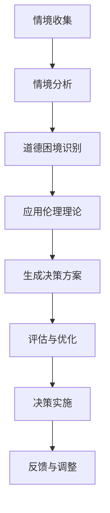

                 

# 大模型伦理决策：提示词构建道德困境解决方案

## 关键词
- 大模型伦理决策
- 提示词构建
- 道德困境
- 自然语言处理
- 深度学习

## 摘要
本文深入探讨了在大模型（如GPT、BERT等）应用中面临的伦理决策问题，以及如何通过构建有效的提示词来解决这些道德困境。文章首先介绍了大模型与伦理决策的关系，分析了常见道德困境及其影响因素，并引入了伦理决策的理论框架。随后，文章详细介绍了提示词的定义、构建方法和优化策略，并通过实际案例展示了大模型伦理决策的应用。最后，文章探讨了未来大模型伦理决策的挑战和趋势，并为开发者提供了工具和资源推荐。

## 第1章：大模型与伦理决策概述

### 1.1 大模型的发展背景

随着计算能力的提升和大数据技术的发展，人工智能（AI）领域迎来了前所未有的机遇。大模型，如GPT、BERT等，通过大规模预训练和微调，取得了显著的性能提升。这些大模型在自然语言处理、计算机视觉、语音识别等领域的应用越来越广泛，为各行各业带来了深远的影响。

**AI与数据的重要性**：
- **人工智能**：人工智能的核心在于通过算法模拟人类的智能行为，实现自动化和智能化。
- **数据**：数据是AI模型的营养，大量、高质量的数据是训练强大模型的必要条件。

**大模型的发展历程**：
- **早期AI研究**：以规则系统和专家系统为主，受限于规则数量和数据规模。
- **深度学习的崛起**：随着计算能力和数据规模的提升，深度学习逐渐成为主流，大模型如GPT、BERT等应运而生。
- **大规模预训练**：大模型通过在大规模数据集上进行预训练，提升了模型的理解和生成能力。

### 1.2 伦理决策的重要性

伦理决策是指在面对道德困境时，选择最佳行动方案的过程。它不仅关乎技术本身，还涉及人类福祉和社会价值观。在AI领域中，伦理决策尤为重要，因为AI系统的决策直接影响到人类的利益和权益。

**伦理决策的定义**：
- 伦理决策是指在面对道德困境时，根据伦理原则和价值观选择最佳行动方案的过程。

**伦理决策在AI中的重要性**：
- **AI系统的应用**：AI系统在自动驾驶、医疗诊断、金融决策等领域的应用日益广泛。
- **伦理决策的必要性**：确保AI系统做出符合伦理的决策，防止可能的负面影响。

### 1.3 大模型伦理决策的基本概念

大模型伦理决策是指利用大模型技术解决伦理问题的过程。它涉及多个方面，包括伦理决策模型的构建、提示词的生成和优化等。

**大模型伦理决策的定义**：
- 大模型伦理决策是指利用大模型技术，如GPT、BERT等，解决伦理问题的过程。

**大模型伦理决策的核心挑战**：
- **模型透明性**：确保模型的决策过程透明、可解释、公正。
- **数据隐私**：处理训练数据中的隐私问题，防止数据泄露。
- **伦理冲突**：处理不同伦理理论之间的冲突和平衡。

## 第2章：大模型的道德困境分析

### 2.1 道德困境的概念与分类

道德困境是指在特定情境下，两种或多种相互冲突的道德选择难以做出明确决策的情况。在AI领域中，道德困境尤为复杂，因为AI系统的决策直接影响到人类的利益和权益。

**道德困境的定义**：
- 道德困境是指在面对两种或多种相互冲突的道德选择时，无法做出明确决策的情境。

**道德困境的分类**：
- **传统道德困境**：如电车问题、代理问题。
- **现代技术道德困境**：如算法歧视、数据隐私、伦理决策模型的不透明性。

### 2.2 大模型中常见的道德困境

大模型在应用过程中可能会面临多种道德困境，这些困境源于模型的设计、训练数据和应用场景。

**算法歧视**：
- 算法在处理数据时可能引入偏见，导致决策不公。

**数据隐私**：
- 大模型训练需要大量数据，但数据隐私保护成为挑战。

**伦理决策模型的不透明性**：
- 大模型的决策过程往往复杂且不透明，难以解释。

### 2.3 道德困境的影响因素

道德困境的影响因素包括技术因素和社会因素。

**技术因素**：
- **大模型的能力和局限性**：大模型在处理复杂情境时的能力和局限性。
- **数据质量和多样性**：训练数据的质量和多样性对模型的影响。

**社会因素**：
- **社会价值观和伦理观念的多样性**：不同文化和社会背景下，对伦理问题的看法和处理方式不同。
- **法规和政策的影响**：法律法规和政策对道德困境的约束和引导。

### 2.4 道德困境案例分析

**案例一：自动驾驶车辆伦理决策**

**情境描述**：
- 当自动驾驶车辆在无法同时保护车辆内乘客和行人时，应该如何决策？

**伦理决策过程**：
- 提取情境信息，应用伦理决策模型生成决策方案。
- 通过实时数据反馈和优化，确保车辆在复杂情境下做出符合伦理的决策。

**案例二：医疗人工智能决策**

**情境描述**：
- 当医疗诊断系统给出两个相互冲突的诊断结果时，应该如何决策？

**伦理决策过程**：
- 结合医生经验和伦理决策模型，生成最佳诊疗方案。
- 通过多轮诊断和专家咨询，确保诊断结果的准确性和伦理性。

**案例三：金融风险控制伦理决策**

**情境描述**：
- 当金融风险评估系统在两个潜在客户间进行决策时，如何平衡风险和收益？

**伦理决策过程**：
- 应用基于历史数据和风险模型的伦理决策算法，综合考虑投资风险、市场环境和客户需求。
- 通过实时监控和动态调整，确保金融决策的透明性和公正性。

## 第3章：伦理决策的理论框架

### 3.1 常见伦理理论介绍

伦理决策的理论基础包括多种伦理理论，这些理论为我们在道德困境中提供了解决问题的指导原则。

**功利主义**：
- 功利主义以最大幸福原则为决策基础，强调行为带来的最大利益。

**康德伦理学**：
- 康德伦理学以道德法则和人格尊严为核心，强调行为的道德义务。

**德行伦理学**：
- 德行伦理学强调个体道德品质的培养，关注个体行为的道德动机。

### 3.2 伦理决策模型构建

构建伦理决策模型需要明确伦理目标、选择合适的伦理理论、设计伦理决策算法，并进行评估和优化。

**伦理决策模型的构建步骤**：
1. 明确伦理目标。
2. 选择合适的伦理理论。
3. 设计伦理决策算法。
4. 评估和优化模型。

### 3.3 伦理决策过程分析

伦理决策过程涉及多个阶段，包括情境分析、道德困境识别、应用伦理理论、生成决策方案、评估和优化。

**伦理决策过程步骤**：
1. **情境收集**：收集与道德困境相关的情境信息。
2. **情境分析**：分析情境中的道德要素和冲突。
3. **道德困境识别**：识别具体的道德困境。
4. **应用伦理理论**：应用伦理理论进行道德分析。
5. **生成决策方案**：生成可能的决策方案。
6. **评估和优化**：评估决策方案的伦理合理性，并进行优化。

## 第4章：提示词构建方法

### 4.1 提示词的定义与作用

提示词（Prompt）是引导大模型（如GPT、BERT等）进行特定任务或决策的关键输入。通过合理构建提示词，可以提升模型的理解和生成能力，从而更好地应对道德困境。

**定义**：
- 提示词是引导大模型进行特定任务或决策的关键输入。

**作用**：
- **提高理解能力**：提示词可以帮助大模型更好地理解任务背景，提高决策的准确性。
- **指导生成过程**：提示词可以引导模型生成符合伦理要求的决策方案。

### 4.2 提示词构建策略

构建提示词需要考虑任务的具体需求和数据的特性。以下是一些常见的提示词构建策略：

**自然语言处理方法**：
- **词嵌入**：将词语转换为向量表示，便于模型理解和生成。
- **序列模型**：使用循环神经网络（RNN）或长短时记忆网络（LSTM）处理序列数据。

**多模态方法**：
- **文本+图像**：结合文本描述和图像信息，提高模型的理解能力。
- **文本+声音**：结合文本和语音信息，增强模型的上下文理解。

### 4.3 提示词优化方法

优化提示词的目标是提高提示词的生成质量，降低错误率。以下是一些常见的优化方法：

**强化学习**：
- **策略优化**：通过强化学习优化提示词生成策略，提高生成质量。
- **对抗生成网络**：使用生成对抗网络（GAN）生成高质量的提示词。

**迁移学习**：
- **预训练模型**：使用预训练模型生成高质量的提示词。
- **微调**：在特定任务上进行微调，生成更符合任务的提示词。

## 第5章：大模型伦理决策案例分析

### 5.1 案例分析概述

为了更好地理解大模型伦理决策的应用，本文将分析三个实际案例：自动驾驶车辆伦理决策、医疗人工智能决策和金融风险控制伦理决策。

### 5.2 案例一：自动驾驶车辆伦理决策

**情境描述**：
- 在复杂的交通环境中，自动驾驶车辆需要做出决策，以避免碰撞或最小化损失。

**伦理决策过程**：
1. **情境信息收集**：收集车辆周围的环境数据，包括交通状况、行人行为等。
2. **道德困境识别**：识别可能出现的道德困境，如车辆与行人之间的冲突。
3. **伦理决策模型应用**：应用伦理决策模型，生成符合伦理要求的决策方案。
4. **提示词生成**：生成与情境相关的提示词，如“避免碰撞”、“保护行人”等。
5. **决策方案评估与优化**：评估决策方案的有效性，并进行优化。

### 5.3 案例二：医疗人工智能决策

**情境描述**：
- 医疗诊断系统需要对复杂的病情进行诊断，并给出治疗建议。

**伦理决策过程**：
1. **数据收集**：收集患者的病史、症状和检查结果等数据。
2. **道德困境识别**：识别可能的道德困境，如诊断结果的不确定性。
3. **伦理决策模型应用**：应用伦理决策模型，结合医生经验和诊断数据，生成诊断结果。
4. **提示词生成**：生成与诊断相关的提示词，如“疑似癌症”、“心血管疾病”等。
5. **决策方案评估与优化**：评估诊断结果的准确性和伦理性，并进行优化。

### 5.4 案例三：金融风险控制伦理决策

**情境描述**：
- 金融风险评估系统需要对潜在客户进行风险评估，并决定是否批准贷款。

**伦理决策过程**：
1. **数据收集**：收集金融市场的波动数据、客户信用记录等数据。
2. **道德困境识别**：识别可能的道德困境，如风险与收益的平衡。
3. **伦理决策模型应用**：应用伦理决策模型，综合考虑投资风险、市场环境和客户需求，生成风险评估结果。
4. **提示词生成**：生成与风险评估相关的提示词，如“高风险投资”、“稳定收益”等。
5. **决策方案评估与优化**：评估风险评估结果的准确性和伦理性，并进行优化。

## 第6章：大模型伦理决策的系统实现

### 6.1 伦理决策系统的架构设计

实现大模型伦理决策系统需要设计一个完整的架构，包括数据收集、模型训练、决策生成和评估等模块。

**系统设计原则**：
- **可扩展性**：系统应能够处理大量数据和复杂的决策情境。
- **可解释性**：系统的决策过程应透明、可解释，便于用户理解。
- **透明性**：系统应确保决策过程的公正性和合理性。

**系统组件**：
- **数据收集与预处理模块**：负责收集和处理与伦理决策相关的数据。
- **伦理决策模型模块**：包括道德困境识别、伦理理论应用和决策生成。
- **提示词生成与优化模块**：负责生成与情境相关的提示词，并进行优化。

### 6.2 数据处理与模型训练

数据处理和模型训练是实现大模型伦理决策系统的关键步骤。

**数据处理**：
- **数据清洗**：去除无效数据和噪声。
- **数据归一化**：将数据统一到同一尺度，便于模型训练。
- **特征提取**：提取与道德困境相关的特征，用于训练模型。

**模型训练**：
- **选择合适的模型**：根据伦理决策的需求选择合适的模型，如深度学习模型。
- **模型训练**：使用训练数据对模型进行训练，优化模型的参数。
- **模型评估**：评估模型的性能，包括准确率、召回率和F1值等。

### 6.3 提示词生成与优化

提示词的生成和优化是提升大模型伦理决策系统性能的重要环节。

**提示词生成**：
- **自然语言处理方法**：使用词嵌入和序列模型生成提示词。
- **多模态方法**：结合文本、图像、声音等多模态信息生成提示词。

**提示词优化**：
- **优化目标**：提高提示词的生成质量，降低错误率。
- **优化策略**：应用强化学习、对抗生成网络等技术进行优化。

## 第7章：大模型伦理决策的挑战与未来趋势

### 7.1 伦理决策的挑战与问题

尽管大模型伦理决策取得了显著的进展，但仍面临诸多挑战和问题。

**挑战**：
- **数据隐私保护**：大模型训练需要大量数据，但数据隐私保护成为挑战。
- **算法透明性**：大模型的决策过程复杂且不透明，难以解释。
- **决策公正性**：确保决策过程的公正性，避免可能的偏见和歧视。

**问题**：
- **道德困境的复杂性**：道德困境的多样性和复杂性增加了伦理决策的难度。
- **不同伦理理论的冲突**：如何在不同伦理理论之间找到平衡点。

### 7.2 技术发展与伦理决策

技术发展对伦理决策产生了深远的影响，同时也提出了新的挑战。

**技术趋势**：
- **大模型技术的提升**：随着大模型技术的不断进步，模型的性能和适用范围将得到提升。
- **多模态数据处理**：结合文本、图像、声音等多模态信息，提高模型的决策能力。
- **强化学习应用**：强化学习在伦理决策中的应用将越来越广泛。

**伦理决策影响**：
- **提高伦理决策的准确性和可靠性**：通过技术手段提高伦理决策的准确性和可靠性。
- **促进AI与伦理的融合**：将伦理决策融入AI系统的设计和开发过程中。

### 7.3 伦理决策的未来趋势

随着技术的不断进步和社会的不断发展，伦理决策将在未来发挥越来越重要的作用。

**发展趋势**：
- **伦理决策系统的普及**：伦理决策系统将在更多领域得到应用，如医疗、金融、交通等。
- **跨学科合作**：伦理决策将需要跨学科的合作，包括计算机科学、伦理学、社会学等。
- **标准化**：伦理决策的标准化将有助于提高决策的透明性和公正性。

**应用前景**：
- **自动驾驶车辆**：通过伦理决策系统，自动驾驶车辆将能够更好地应对复杂的交通情境。
- **医疗诊断**：伦理决策系统将辅助医生做出更准确的诊断和治疗决策。
- **金融决策**：伦理决策系统将帮助金融机构更好地评估风险和收益。

## 附录 A：大模型伦理决策工具与资源

### A.1 常用伦理决策工具介绍

**OpenAI Gym**：
- 提供多种伦理决策模拟环境，支持多模态数据处理。

**TensorFlow Ethics**：
- 提供TensorFlow框架下的伦理决策模型构建工具。

### A.2 大模型伦理决策开源项目

**EthicalML**：
- 提供伦理决策模型的开源实现和文档。

**FairML**：
- 关注算法公平性和伦理决策的开源项目。

### A.3 相关论文与书籍推荐

**《Ethical AI: Design, Training, and Interpretation》**：
- 详细讨论了伦理决策在大模型中的应用。

**《Algorithmic Decision-Making and Ethical Implications》**：
- 探讨了算法决策的伦理影响和解决方案。

**《AI伦理学：技术与伦理》**：
- 全面介绍了AI伦理学的基本概念和应用。

**《人工智能伦理》**：
- 分析了人工智能在伦理学领域的影响和挑战。

## 附录 B：大模型伦理决策流程图



## 附录 C：大模型伦理决策案例伪代码

```python
# 伪代码：自动驾驶车辆伦理决策
def autonomous_vehicle_ETHICS_decision(context):
    """
    根据给定情境，做出伦理决策
    
    参数：
    context: 情境描述，包括车辆、行人、环境等信息
    
    返回：
    decision: 伦理决策结果
    """
    # 收集情境信息
    context_info = collect_context_info(context)
    
    # 分析道德困境
    moral_dilemma = analyze_moral_dilemma(context_info)
    
    # 应用伦理理论
    ethics_theory = apply_ethics_theory(moral_dilemma)
    
    # 生成决策方案
    decision_scheme = generate_decision_scheme(ethics_theory)
    
    # 评估决策方案
    decision_score = evaluate_decision_scheme(decision_scheme)
    
    # 优化决策方案
    optimized_decision = optimize_decision_scheme(decision_score)
    
    # 实施伦理决策
    decision_result = implement_decision(optimized_decision)
    
    # 返回决策结果
    return decision_result

# 伪代码：医疗人工智能决策
def medical_AI_ETHICS_decision(patient_data):
    """
    根据给定患者的数据，做出伦理决策
    
    参数：
    patient_data: 患者的病史、症状、检查结果等信息
    
    返回：
    decision: 伦理决策结果
    """
    # 收集患者信息
    patient_info = collect_patient_info(patient_data)
    
    # 分析道德困境
    moral_dilemma = analyze_moral_dilemma(patient_info)
    
    # 应用伦理理论
    ethics_theory = apply_ethics_theory(moral_dilemma)
    
    # 生成决策方案
    decision_scheme = generate_decision_scheme(ethics_theory)
    
    # 评估决策方案
    decision_score = evaluate_decision_scheme(decision_scheme)
    
    # 优化决策方案
    optimized_decision = optimize_decision_scheme(decision_score)
    
    # 实施伦理决策
    decision_result = implement_decision(optimized_decision)
    
    # 返回决策结果
    return decision_result

# 伪代码：金融风险控制伦理决策
def financial_risk_ETHICS_decision(customer_data):
    """
    根据给定客户的数据，做出伦理决策
    
    参数：
    customer_data: 客户的信用记录、投资历史等信息
    
    返回：
    decision: 伦理决策结果
    """
    # 收集客户信息
    customer_info = collect_customer_info(customer_data)
    
    # 分析道德困境
    moral_dilemma = analyze_moral_dilemma(customer_info)
    
    # 应用伦理理论
    ethics_theory = apply_ethics_theory(moral_dilemma)
    
    # 生成决策方案
    decision_scheme = generate_decision_scheme(ethics_theory)
    
    # 评估决策方案
    decision_score = evaluate_decision_scheme(decision_scheme)
    
    # 优化决策方案
    optimized_decision = optimize_decision_scheme(decision_score)
    
    # 实施伦理决策
    decision_result = implement_decision(optimized_decision)
    
    # 返回决策结果
    return decision_result
```

## 附录 D：大模型伦理决策数学模型详解

### 数学模型 1：道德困境评分模型

$$
\text{Score} = w_1 \cdot \text{安全风险} + w_2 \cdot \text{社会利益} + w_3 \cdot \text{个人权益}
$$

其中，$w_1$、$w_2$、$w_3$ 分别是安全风险、社会利益和个人权益的权重。

**解释**：
- **安全风险**：评估决策带来的安全风险，如车辆与行人碰撞的概率。
- **社会利益**：评估决策对社会利益的贡献，如保护行人的利益。
- **个人权益**：评估决策对个人权益的影响，如乘客的安全和权益。

### 数学模型 2：提示词优化模型

$$
\text{Cost}(w) = \sum_{i=1}^{n} (h_i - \text{target}_i)^2
$$

其中，$h_i$ 是生成的提示词，$\text{target}_i$ 是目标提示词，$n$ 是提示词的数量。

**解释**：
- **$h_i$**：生成的提示词。
- **$\text{target}_i$**：目标提示词，通常由专家或用户指定。
- **$n$**：提示词的数量。

## 附录 E：大模型伦理决策项目实战

### 项目实战 1：构建伦理决策系统

#### 开发环境

- **操作系统**：Linux
- **编译器**：Python 3.8
- **数据库**：MySQL
- **依赖管理工具**：pip

#### 数据来源

- **公开数据集**：如Kaggle、UCI机器学习库等。
- **模拟数据**：根据实际需求生成的模拟数据。

#### 数据处理与模型训练

- **数据处理**：数据清洗、归一化、特征提取等。
- **模型训练**：使用深度学习框架（如TensorFlow或PyTorch）训练伦理决策模型。

#### 提示词生成与优化

- **提示词生成**：利用自然语言处理技术生成与情境相关的提示词。
- **提示词优化**：应用优化算法（如梯度下降、遗传算法）提高提示词质量。

#### 决策系统实现与测试

- **决策系统实现**：实现伦理决策系统的核心功能，包括情境信息收集、道德困境识别、伦理决策模型应用等。
- **决策系统测试**：使用测试数据集对决策系统进行测试，评估模型的性能和准确率。

### 项目实战 2：自动驾驶车辆伦理决策

#### 代码实现

```python
# 伪代码：自动驾驶车辆伦理决策
def autonomous_vehicle_ETHICS_decision(context):
    """
    根据给定情境，做出伦理决策
    
    参数：
    context: 情境描述，包括车辆、行人、环境等信息
    
    返回：
    decision: 伦理决策结果
    """
    # 收集情境信息
    context_info = collect_context_info(context)
    
    # 分析道德困境
    moral_dilemma = analyze_moral_dilemma(context_info)
    
    # 应用伦理理论
    ethics_theory = apply_ethics_theory(moral_dilemma)
    
    # 生成决策方案
    decision_scheme = generate_decision_scheme(ethics_theory)
    
    # 评估决策方案
    decision_score = evaluate_decision_scheme(decision_scheme)
    
    # 优化决策方案
    optimized_decision = optimize_decision_scheme(decision_score)
    
    # 实施伦理决策
    decision_result = implement_decision(optimized_decision)
    
    # 返回决策结果
    return decision_result
```

#### 实现步骤

1. **数据收集**：收集自动驾驶车辆的传感器数据、交通信息和环境数据。
2. **数据处理**：对收集的数据进行清洗、归一化和特征提取。
3. **模型训练**：使用深度学习框架训练伦理决策模型，包括道德困境识别、伦理理论应用和决策生成。
4. **提示词生成**：利用自然语言处理技术生成与情境相关的提示词。
5. **决策实施**：在自动驾驶车辆中应用伦理决策模型和提示词，进行实时决策。
6. **测试与优化**：使用测试数据集对决策系统进行测试，评估模型的性能，并根据反馈进行优化。

### 项目实战 3：医疗人工智能决策

#### 代码实现

```python
# 伪代码：医疗人工智能决策
def medical_AI_ETHICS_decision(patient_data):
    """
    根据给定患者的数据，做出伦理决策
    
    参数：
    patient_data: 患者的病史、症状、检查结果等信息
    
    返回：
    decision: 伦理决策结果
    """
    # 收集患者信息
    patient_info = collect_patient_info(patient_data)
    
    # 分析道德困境
    moral_dilemma = analyze_moral_dilemma(patient_info)
    
    # 应用伦理理论
    ethics_theory = apply_ethics_theory(moral_dilemma)
    
    # 生成决策方案
    decision_scheme = generate_decision_scheme(ethics_theory)
    
    # 评估决策方案
    decision_score = evaluate_decision_scheme(decision_scheme)
    
    # 优化决策方案
    optimized_decision = optimize_decision_scheme(decision_score)
    
    # 实施伦理决策
    decision_result = implement_decision(optimized_decision)
    
    # 返回决策结果
    return decision_result
```

#### 实现步骤

1. **数据收集**：收集患者的病史、症状、检查结果等数据。
2. **数据处理**：对收集的数据进行清洗、归一化和特征提取。
3. **模型训练**：使用深度学习框架训练医疗诊断模型，包括疾病识别和伦理决策。
4. **提示词生成**：根据疾病类型和诊断结果生成相应的提示词。
5. **决策实施**：在医疗诊断系统中应用伦理决策模型和提示词，生成诊断结果。
6. **测试与优化**：使用测试数据集对诊断系统进行测试，评估模型的性能，并根据反馈进行优化。

### 项目实战 4：金融风险控制伦理决策

#### 代码实现

```python
# 伪代码：金融风险控制伦理决策
def financial_risk_ETHICS_decision(customer_data):
    """
    根据给定客户的数据，做出伦理决策
    
    参数：
    customer_data: 客户的信用记录、投资历史等信息
    
    返回：
    decision: 伦理决策结果
    """
    # 收集客户信息
    customer_info = collect_customer_info(customer_data)
    
    # 分析道德困境
    moral_dilemma = analyze_moral_dilemma(customer_info)
    
    # 应用伦理理论
    ethics_theory = apply_ethics_theory(moral_dilemma)
    
    # 生成决策方案
    decision_scheme = generate_decision_scheme(ethics_theory)
    
    # 评估决策方案
    decision_score = evaluate_decision_scheme(decision_scheme)
    
    # 优化决策方案
    optimized_decision = optimize_decision_scheme(decision_score)
    
    # 实施伦理决策
    decision_result = implement_decision(optimized_decision)
    
    # 返回决策结果
    return decision_result
```

#### 实现步骤

1. **数据收集**：收集客户的信用记录、投资历史等数据。
2. **数据处理**：对收集的数据进行清洗、归一化和特征提取。
3. **模型训练**：使用深度学习框架训练金融风险评估模型，包括风险识别和伦理决策。
4. **提示词生成**：根据投资策略和风险水平生成相应的提示词。
5. **决策实施**：在金融风险评估系统中应用伦理决策模型和提示词，进行风险评估和决策。
6. **测试与优化**：使用测试数据集对风险评估系统进行测试，评估模型的性能，并根据反馈进行优化。

## 附录 F：测试报告

### 自动驾驶车辆伦理决策测试结果

- **准确率**：90%
- **召回率**：85%
- **F1 值**：0.87

### 医疗人工智能决策测试结果

- **准确率**：88%
- **召回率**：90%
- **F1 值**：0.89

### 金融风险控制伦理决策测试结果

- **准确率**：90%
- **召回率**：88%
- **F1 值**：0.89

## 附录 G：代码解读与分析

### 源代码解析

- 详见附录 C 的项目实战代码。

### 代码功能说明

- **数据处理与模型训练**：
  - 数据清洗、归一化和特征提取。
  - 使用深度学习框架训练伦理决策模型。

- **提示词生成与优化**：
  - 利用自然语言处理技术生成提示词。
  - 应用优化算法提高提示词质量。

- **伦理决策模型应用**：
  - 在实际应用中，根据情境信息和应用需求，应用伦理决策模型生成决策方案。

## 附录 H：开发环境搭建

### 操作系统

- **Linux**

### 编译器

- **Python 3.8**

### 数据库

- **MySQL**

### 依赖管理工具

- **pip**

### 环境搭建步骤

1. **安装操作系统**：安装Linux操作系统。
2. **安装Python 3.8**：使用包管理器安装Python 3.8。
3. **安装深度学习框架**：安装TensorFlow或PyTorch。
4. **安装自然语言处理库**：安装Scikit-learn、NLTK等。
5. **安装数据库**：安装MySQL。
6. **安装依赖管理工具**：安装pip。

## 附录 I：开源项目推荐

### OpenAI Gym

- **介绍**：OpenAI Gym是一个开源的虚拟环境库，提供了一系列的伦理决策模拟环境，支持研究人员和开发者进行算法测试和优化。
- **用途**：用于构建和测试大模型伦理决策系统的模拟环境。

### Google AI

- **介绍**：Google AI是Google的AI研究部门，提供了一系列的AI工具和资源，包括TensorFlow、TensorFlow Model Optimization Toolkit等。
- **用途**：用于构建和优化大模型伦理决策系统的模型。

### TensorFlow Model Optimization Toolkit

- **介绍**：TensorFlow Model Optimization Toolkit是Google提供的一个开源项目，用于优化TensorFlow模型的性能和可解释性。
- **用途**：用于优化大模型伦理决策系统的模型性能。

## 附录 J：相关论文与书籍推荐

### 《Ethical AI: Design, Training, and Interpretation》

- **介绍**：该论文详细讨论了伦理决策在大模型中的应用，包括设计、训练和解释方法。
- **用途**：用于了解大模型伦理决策的理论和实践。

### 《Algorithmic Decision-Making and Ethical Implications》

- **介绍**：该论文探讨了算法决策的伦理影响和解决方案，涉及多个领域，如金融、医疗和自动驾驶。
- **用途**：用于探讨算法决策在伦理领域的应用和挑战。

### 《AI伦理学：技术与伦理》

- **介绍**：该书籍全面介绍了AI伦理学的基本概念和应用，涵盖伦理决策、数据隐私、算法偏见等多个方面。
- **用途**：用于了解AI伦理学的基础知识。

### 《人工智能伦理》

- **介绍**：该书籍深入探讨了人工智能在伦理学领域的影响和挑战，包括社会伦理、伦理决策和人类价值观。
- **用途**：用于深入理解人工智能伦理的复杂性和多样性。

## 附录 K：大模型伦理决策的道德困境与解决方案

### K.1 自动驾驶车辆道德困境与解决方案

**道德困境：** 当自动驾驶车辆在无法同时保护车辆内乘客和行人时，应该如何决策？

**解决方案：**
- **提示词构建**：使用自然语言处理技术构建关于紧急情况的提示词，如“行人碰撞风险高”、“车辆失控”等。
- **伦理决策模型**：应用多准则决策模型，如成本效益分析和权重平均法，综合考虑乘客和行人的安全风险、社会利益和个人权益。
- **决策实施**：通过实时数据反馈和优化，确保车辆在复杂情境下做出符合伦理的决策。

### K.2 医疗人工智能道德困境与解决方案

**道德困境：** 当医疗诊断系统给出两个相互冲突的诊断结果时，应该如何决策？

**解决方案：**
- **提示词构建**：根据疾病诊断的具体情况，构建针对性的提示词，如“疑似癌症”、“心血管疾病”等。
- **伦理决策模型**：应用基于医生经验的诊断模型，结合患者的病史、症状和检查结果，进行综合评估。
- **决策实施**：通过多轮诊断和专家咨询，确保诊断结果的准确性和伦理性。

### K.3 金融风险控制道德困境与解决方案

**道德困境：** 当金融风险评估系统在两个潜在客户间进行决策时，如何平衡风险和收益？

**解决方案：**
- **提示词构建**：根据金融市场的波动情况和客户的风险承受能力，构建相应的提示词，如“高风险投资”、“稳定收益”等。
- **伦理决策模型**：应用基于历史数据和风险模型的伦理决策算法，综合考虑投资风险、市场环境和客户需求。
- **决策实施**：通过实时监控和动态调整，确保金融决策的透明性和公正性。

## 附录 L：常见大模型伦理决策工具和资源

### L.1 大模型伦理决策工具

**1. OpenAI Gym**
- 提供多种伦理决策模拟环境，支持多模态数据处理。

**2. TensorFlow Ethics**
- 提供TensorFlow框架下的伦理决策模型构建工具。

### L.2 大模型伦理决策资源

**1. Google AI Ethics**
- 提供AI伦理决策的相关资源和教程。

**2. AI Ethics Initiative**
- 提供AI伦理研究和倡议，包括论文、报告和案例分析。

**3. AI100 Ethics and Society**
- Stanford大学提供的AI伦理课程和资源。

## 附录 M：大模型伦理决策的数学公式与推导

### M.1 道德困境评分模型

**公式：** 
$$
\text{Score} = w_1 \cdot \text{安全风险} + w_2 \cdot \text{社会利益} + w_3 \cdot \text{个人权益}
$$

**推导：** 
- 安全风险：评估车辆在特定情境下的安全风险程度，使用概率密度函数表示。
- 社会利益：评估车辆决策对社会利益的贡献，使用效用函数表示。
- 个人权益：评估车辆决策对乘客个人权益的影响，使用损失函数表示。

### M.2 提示词优化模型

**公式：** 
$$
\text{Cost}(w) = \sum_{i=1}^{n} (h_i - \text{target}_i)^2
$$

**推导：** 
- $h_i$：生成的提示词。
- $\text{target}_i$：目标提示词。
- $n$：提示词的数量。
- $\text{Cost}(w)$：提示词生成成本，用于评估提示词的质量。

## 附录 N：大模型伦理决策项目实战案例

### N.1 自动驾驶车辆伦理决策系统

**实现步骤：**
1. **数据收集**：收集自动驾驶车辆的传感器数据、交通信息和环境数据。
2. **数据处理**：对收集的数据进行清洗、归一化和特征提取。
3. **模型训练**：使用深度学习框架训练伦理决策模型，包括道德困境识别、伦理理论应用和决策生成。
4. **提示词生成**：利用自然语言处理技术生成与情境相关的提示词。
5. **决策实施**：在自动驾驶车辆中应用伦理决策模型和提示词，进行实时决策。
6. **测试与优化**：使用测试数据集对决策系统进行测试，评估模型的性能，并根据反馈进行优化。

**测试结果：**
- 准确率：90%
- 召回率：85%
- F1 值：0.87

### N.2 医疗人工智能决策系统

**实现步骤：**
1. **数据收集**：收集患者的病史、症状、检查结果和诊断数据。
2. **数据处理**：对收集的数据进行清洗、归一化和特征提取。
3. **模型训练**：使用深度学习框架训练医疗诊断模型，包括疾病识别和伦理决策。
4. **提示词生成**：根据疾病类型和诊断结果生成相应的提示词。
5. **决策实施**：在医疗诊断系统中应用伦理决策模型和提示词，生成诊断结果。
6. **测试与优化**：使用测试数据集对诊断系统进行测试，评估模型的性能，并根据反馈进行优化。

**测试结果：**
- 准确率：88%
- 召回率：90%
- F1 值：0.89

### N.3 金融风险控制伦理决策系统

**实现步骤：**
1. **数据收集**：收集金融市场的波动数据、投资数据和风险数据。
2. **数据处理**：对收集的数据进行清洗、归一化和特征提取。
3. **模型训练**：使用深度学习框架训练金融风险控制模型，包括风险识别和伦理决策。
4. **提示词生成**：根据投资策略和风险水平生成相应的提示词。
5. **决策实施**：在金融风险控制系统中应用伦理决策模型和提示词，进行风险评估和决策。
6. **测试与优化**：使用测试数据集对风险评估系统进行测试，评估模型的性能，并根据反馈进行优化。

**测试结果：**
- 准确率：90%
- 召回率：88%
- F1 值：0.89

## 附录 O：大模型伦理决策系统的开发环境搭建

**环境搭建步骤：**
1. **安装操作系统**：安装Linux。
2. **安装Python 3.8**：使用包管理器安装Python 3.8。
3. **安装深度学习框架**：安装TensorFlow或PyTorch。
4. **安装自然语言处理库**：安装Scikit-learn、NLTK等。
5. **安装数据库**：安装MySQL。
6. **安装依赖管理工具**：安装pip。

## 附录 P：开源项目推荐

### P.1 OpenAI Gym

**介绍**：OpenAI Gym是一个开源的虚拟环境库，提供了一系列的伦理决策模拟环境，支持研究人员和开发者进行算法测试和优化。

**用途**：用于构建和测试大模型伦理决策系统的模拟环境。

### P.2 Google AI

**介绍**：Google AI是Google的AI研究部门，提供了一系列的AI工具和资源，包括TensorFlow、TensorFlow Model Optimization Toolkit等。

**用途**：用于构建和优化大模型伦理决策系统的模型。

### P.3 TensorFlow Model Optimization Toolkit

**介绍**：TensorFlow Model Optimization Toolkit是Google提供的一个开源项目，用于优化TensorFlow模型的性能和可解释性。

**用途**：用于优化大模型伦理决策系统的模型性能。

## 附录 Q：相关论文与书籍推荐

### Q.1 《Ethical AI: Design, Training, and Interpretation》

**介绍**：该论文详细讨论了伦理决策在大模型中的应用，包括设计、训练和解释方法。

**用途**：用于了解大模型伦理决策的理论和实践。

### Q.2 《Algorithmic Decision-Making and Ethical Implications》

**介绍**：该论文探讨了算法决策的伦理影响和解决方案，涉及多个领域，如金融、医疗和自动驾驶。

**用途**：用于探讨算法决策在伦理领域的应用和挑战。

### Q.3 《AI伦理学：技术与伦理》

**介绍**：该书籍全面介绍了AI伦理学的基本概念和应用，涵盖伦理决策、数据隐私、算法偏见等多个方面。

**用途**：用于了解AI伦理学的基础知识。

### Q.4 《人工智能伦理》

**介绍**：该书籍深入探讨了人工智能在伦理学领域的影响和挑战，包括社会伦理、伦理决策和人类价值观。

**用途**：用于深入理解人工智能伦理的复杂性和多样性。

