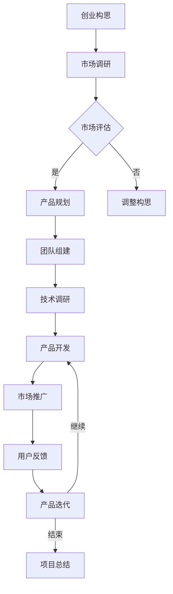

                 

### 《大模型创业：产品创新与市场分析》

#### **关键词**：
- 大模型
- 产品创新
- 市场分析
- 创业
- 深度学习
- 神经网络
- 商业模式

#### **摘要**：
本文将从大模型的基础知识出发，深入探讨其在产品创新和市场分析中的应用。通过分析大模型的技术原理、应用场景、创新思维与方法，结合市场环境分析和商业模式设计，提供一套系统化的创业策略。文章旨在为创业者提供有价值的参考，助力他们在大模型领域取得成功。

### 第一部分：大模型概述

#### 第1章：大模型的基础知识

#### **1.1 大模型的概念**

**大模型**，又称为**大型神经网络模型**，是指具有数亿甚至数十亿参数的深度学习模型。这些模型在训练过程中能够处理大量数据，从而学习到复杂的模式和知识。大模型的出现，标志着深度学习技术进入了一个新的阶段。

**大模型的基本定义**：
- 参数规模：通常超过数亿
- 训练数据量：动辄数百万、数千万甚至更多
- 训练时长：往往需要数天甚至数周
- 应用领域：广泛，包括自然语言处理、计算机视觉、推荐系统等

**大模型的发展历程**：
- **1980年代末至1990年代初**：早期神经网络模型，如感知机、BP网络等，参数规模较小。
- **2000年代初**：随着计算能力的提升，神经网络开始应用于图像识别、语音识别等领域。
- **2012年**：AlexNet的提出，标志着深度学习在图像识别领域的突破。
- **2018年**：GPT-3的发布，标志着大模型在自然语言处理领域的崛起。

#### **1.2 大模型的技术原理**

**深度学习基础**：
- **神经网络**：由大量简单的处理单元（神经元）组成，通过多层堆叠，实现复杂的非线性变换。
- **反向传播算法**：用于模型参数的优化，通过计算误差梯度，不断调整模型参数，使模型输出更接近真实值。

**神经网络架构**：
- **卷积神经网络（CNN）**：适用于图像处理，通过卷积层、池化层等结构提取图像特征。
- **循环神经网络（RNN）**：适用于序列数据，如文本、语音等，通过隐藏状态和输入信息进行递归计算。
- **Transformer模型**：基于自注意力机制，广泛应用于自然语言处理领域。

**大模型训练流程**：
1. **数据预处理**：对输入数据进行标准化、归一化等处理，使其符合模型输入要求。
2. **模型初始化**：初始化模型参数，通常使用随机初始化或预训练模型。
3. **前向传播**：将输入数据通过模型进行前向传播，得到输出预测。
4. **损失函数计算**：计算预测值与真实值之间的差距，得到损失值。
5. **反向传播**：计算损失函数关于模型参数的梯度，更新模型参数。
6. **迭代优化**：重复前向传播和反向传播过程，直至模型收敛。

#### **1.3 大模型的应用场景**

**产业应用**：
- **智能制造**：大模型在图像识别、预测维护等领域具有广泛应用，提高生产效率和产品质量。
- **智能金融**：大模型在风险管理、信用评估、股票预测等方面具有重要作用。
- **智能医疗**：大模型在医学影像诊断、基因分析、药物研发等领域具有广泛前景。

**消费级应用**：
- **智能语音助手**：如苹果的Siri、亚马逊的Alexa等，基于大模型实现自然语言理解和交互功能。
- **智能翻译**：大模型在机器翻译领域取得了显著成果，如谷歌翻译、微软翻译等。
- **智能推荐**：大模型在电商、社交媒体等领域用于个性化推荐，提升用户体验。

**社会服务应用**：
- **智能安防**：大模型在人脸识别、行为识别等领域应用于公共安全。
- **智能教育**：大模型在在线教育、智能辅导等方面提供个性化学习方案。
- **智能交通**：大模型在自动驾驶、交通流量预测等领域提高交通管理效率。

### 第二部分：产品创新

#### 第2章：产品创新思维与方法

#### **2.1 创新思维**

**创新思维的重要性**：
- 创新思维是企业发展的源动力，有助于企业持续推出新产品、新服务，提高市场竞争力。
- 在大模型领域，创新思维尤为重要，因为大模型技术的发展日新月异，只有不断创新，才能跟上技术潮流。

**创新思维的培养**：
- **多角度思考**：从不同角度审视问题，寻找新的解决方案。
- **跨界思维**：结合不同领域的知识和经验，实现跨界创新。
- **用户思维**：关注用户需求，从用户角度出发进行产品创新。

#### **2.2 产品创新方法**

**TRIZ方法**：
- **TRIZ**（Theory of Inventive Problem Solving）是一种创新问题解决方法，通过解决一系列问题，逐步引导创新过程。
- **ARIZ**（Algorithm for Inventive Problem Solving）是TRIZ的具体实现，通过一系列步骤，如问题定义、解决方案生成、验证等，实现创新。

**设计思维**：
- **设计思维**是一种以人为中心的设计方法，通过理解用户需求、探索多种可能性、原型迭代等步骤，实现创新产品。
- **设计思维**的核心是**同理心**、**迭代**和**实验**。

**用户中心设计**：
- **用户中心设计**是一种以用户需求为导向的设计方法，通过用户调研、用户画像、用户场景分析等步骤，确保产品设计满足用户需求。
- **用户中心设计**强调**用户参与**、**用户体验**和**用户反馈**。

#### **2.3 大模型在产品创新中的应用**

**大模型辅助产品设计**：
- **用户需求分析**：利用大模型对用户数据进行分析，挖掘用户需求和行为模式，为产品设计提供依据。
- **设计优化**：利用大模型进行设计优化，如通过生成对抗网络（GAN）生成创意设计，通过优化算法提高设计质量。

**大模型在需求分析中的应用**：
- **需求预测**：利用大模型对历史数据进行分析，预测未来市场需求，为产品规划提供参考。
- **需求分类**：利用大模型对用户需求进行分类，识别关键需求，提高产品设计针对性。

### 第三部分：市场分析

#### 第3章：市场环境分析

#### **3.1 市场趋势**

**行业发展趋势**：
- **人工智能**：作为大模型的核心技术，人工智能正日益成为各行各业的重要驱动力。
- **云计算**：云计算提供了强大的计算资源，为大规模大模型训练提供了支持。
- **数据安全**：随着数据隐私和安全问题的日益突出，数据安全和隐私保护成为市场关注的焦点。

**市场规模预测**：
- 根据市场研究机构的数据，全球人工智能市场规模预计将在未来几年保持高速增长，大模型作为人工智能的核心技术，其市场规模也将持续扩大。

#### **3.2 竞争对手分析**

**竞争对手的市场地位**：
- **谷歌**：在人工智能领域具有领先地位，拥有强大的技术储备和丰富的应用场景。
- **微软**：在云计算和人工智能领域均有布局，通过Azure云平台提供强大的计算资源。
- **亚马逊**：在电商和云计算领域具有强大的市场地位，通过AWS云平台提供大模型训练服务。

**竞争对手的产品策略**：
- **谷歌**：通过开源项目，如TensorFlow、Keras等，吸引大量开发者使用其大模型技术。
- **微软**：通过Azure云平台，提供一站式大模型训练和部署解决方案。
- **亚马逊**：通过AWS云平台，提供强大的计算资源和丰富的应用场景，吸引企业客户。

**竞争对手的优势与不足**：
- **优势**：技术实力强大、市场占有率较高、产品线丰富。
- **不足**：产品策略较为保守、创新速度较慢、部分领域存在技术短板。

#### **3.3 市场机会与威胁分析**

**市场机会**：
- **技术进步**：随着人工智能技术的不断进步，大模型的应用场景将更加广泛。
- **市场需求**：企业对人工智能解决方案的需求持续增长，为创业者提供了市场机会。

**市场威胁**：
- **竞争压力**：大型科技企业在大模型领域具有较强的竞争实力，对创业企业构成威胁。
- **技术风险**：人工智能技术的发展存在不确定性，创业者需要应对技术变革带来的风险。

**市场定位策略**：
- **差异化竞争**：通过技术创新、产品特色等方式，实现差异化竞争。
- **市场细分**：针对特定行业或领域，提供定制化的人工智能解决方案。
- **用户体验**：注重用户体验，提升用户满意度，建立品牌忠诚度。

### 第四部分：商业模式

#### 第4章：商业模式设计与创新

#### **4.1 商业模式基础**

**商业模式的概念**：
- **商业模式**是指企业如何创造、传递和获取价值，以及如何分配利益的结构。

**商业模式的核心要素**：
- **价值主张**：明确企业为用户创造的价值。
- **客户关系**：建立与客户的互动关系，实现价值传递。
- **渠道**：确定如何将价值主张传递给用户。
- **客户获取**：通过营销策略吸引潜在客户。
- **客户保留**：通过优质服务提升客户忠诚度。
- **成本结构**：明确企业的运营成本。
- **收入来源**：确定企业的盈利模式。

#### **4.2 商业模式创新**

**创新模式的分类**：
- **价值创新**：通过创新价值主张，实现差异化竞争。
- **模式创新**：通过创新商业模式，提高企业竞争力。
- **业务创新**：通过创新业务模式，开拓新的市场机会。

**商业模式创新方法**：
- **平台化**：通过构建生态系统，实现多方共赢。
- **订阅式**：通过订阅模式，实现持续收入。
- **共享经济**：通过共享资源，提高资源利用效率。
- **跨界融合**：通过跨界合作，实现资源整合。

**大模型在商业模式创新中的应用**：
- **价值创新**：利用大模型技术，提升产品和服务质量，实现差异化竞争。
- **模式创新**：通过大模型技术，实现商业模式的重构和优化。
- **业务创新**：利用大模型技术，开拓新的业务领域，实现跨界发展。

#### **4.3 大模型创业案例分析**

**成功案例介绍**：
- **案例一**：某创业公司利用大模型进行图像识别应用，成功进入市场并实现盈利。
- **案例二**：某创业公司开发基于大模型的智能客服系统，提供24/7客户服务。

**案例分析**：
- **案例一**：通过技术创新，提升产品竞争力，实现快速市场拓展。
- **案例二**：通过商业模式创新，实现持续收入，提高企业盈利能力。

### 第五部分：创业实战

#### 第5章：创业准备与规划

#### **5.1 创业者素质**

**创业者应具备的能力**：
- **技术能力**：掌握大模型相关技术，能够进行模型开发和优化。
- **市场洞察力**：了解市场需求，把握市场趋势，制定合适的商业策略。
- **团队管理能力**：能够组建和管理团队，确保项目顺利进行。
- **沟通能力**：与合作伙伴、客户等各方进行有效沟通，推动项目进展。

**创业者应具备的心理素质**：
- **抗压能力**：面对创业过程中的挑战和压力，保持冷静和坚定。
- **创新精神**：勇于尝试新事物，不断寻找创新机会。
- **学习精神**：持续学习，不断提升自己的专业能力和知识水平。

#### **5.2 创业流程**

**创业项目选择**：
- **市场需求**：选择市场需求大、发展前景好的项目。
- **技术创新**：选择具有技术创新性的项目，能够为市场带来新的价值。
- **团队优势**：选择团队具备相关技术和管理能力，能够推动项目发展。

**创业团队组建**：
- **核心团队**：组建核心团队，包括技术、市场、运营等关键角色。
- **人才引进**：通过招聘、合作等方式，引进具有专业能力和经验的人才。
- **激励机制**：建立激励机制，激发团队成员的积极性和创造力。

**创业资金筹备**：
- **自筹资金**：通过个人积累、亲朋好友支持等方式筹集资金。
- **天使投资**：寻找天使投资者，获得资金支持和资源。
- **创业大赛**：参加创业大赛，争取奖金和投资机会。

#### **5.3 创业资源整合**

**资源分类**：
- **人力资源**：包括团队核心成员、顾问、合作伙伴等。
- **技术资源**：包括大模型技术、算法、工具等。
- **资金资源**：包括自有资金、投资资金、融资渠道等。
- **市场资源**：包括客户、渠道、合作伙伴等。

**资源整合策略**：
- **内部整合**：优化内部资源配置，提高资源利用效率。
- **外部合作**：与合作伙伴建立合作关系，共享资源，实现共赢。
- **平台化运作**：构建平台，整合各方资源，提供一站式解决方案。

### 第六部分：运营管理

#### 第6章：大模型产品运营

#### **6.1 运营策略**

**运营流程**：
- **需求分析**：了解市场需求，确定产品方向。
- **产品设计**：根据需求分析，进行产品设计。
- **技术开发**：进行大模型技术开发，实现产品设计。
- **产品测试**：对产品进行测试，确保质量。
- **产品发布**：将产品推向市场，进行推广。
- **用户反馈**：收集用户反馈，不断优化产品。

**用户增长策略**：
- **内容营销**：通过高质量的内容，吸引潜在用户。
- **社交媒体推广**：利用社交媒体平台，提高品牌知名度。
- **合作伙伴**：与相关企业建立合作关系，共同推广产品。

**数据驱动运营**：
- **数据分析**：通过数据分析，了解用户行为和需求。
- **数据优化**：根据数据分析结果，优化产品设计和运营策略。
- **数据监控**：实时监控运营数据，及时发现并解决问题。

#### **6.2 产品优化**

**产品迭代策略**：
- **需求调研**：了解用户需求，确定迭代方向。
- **技术实现**：根据需求调研结果，进行技术实现。
- **测试验证**：对迭代产品进行测试验证，确保质量。
- **用户反馈**：收集用户反馈，优化产品设计。

**用户反馈处理**：
- **用户调研**：通过问卷调查、访谈等方式，收集用户反馈。
- **问题分类**：对用户反馈进行分类，确定优先级。
- **问题解决**：针对用户反馈问题，制定解决方案，并进行实施。
- **反馈跟踪**：对问题解决方案的实施效果进行跟踪，确保问题得到解决。

**技术优化方法**：
- **算法优化**：通过优化算法，提高模型性能和效率。
- **模型压缩**：通过模型压缩技术，减少模型参数，提高模型部署效率。
- **分布式训练**：通过分布式训练技术，提高模型训练速度和资源利用率。

#### **6.3 营销推广**

**营销策略制定**：
- **市场分析**：了解市场环境和竞争对手，确定营销目标。
- **目标客户**：明确目标客户群体，制定针对性营销策略。
- **渠道选择**：选择合适的营销渠道，提高营销效果。
- **内容策划**：制定营销内容，提高品牌知名度。

**渠道选择与布局**：
- **线上渠道**：如搜索引擎、社交媒体、内容营销等。
- **线下渠道**：如展会、讲座、合作伙伴等。
- **多渠道整合**：通过多渠道整合，实现营销效果的最大化。

**营销效果评估**：
- **数据监测**：通过数据分析，监测营销活动的效果。
- **A/B测试**：对不同的营销策略进行测试，找出最佳策略。
- **用户反馈**：收集用户反馈，评估营销效果。

### 第七部分：风险控制与财务管理

#### 第7章：创业风险控制

#### **7.1 风险识别**

**风险分类**：
- **技术风险**：包括模型性能、稳定性、安全性等方面的风险。
- **市场风险**：包括市场需求、竞争环境、政策法规等方面的风险。
- **财务风险**：包括资金链断裂、成本超支、投资回报率等方面的风险。
- **运营风险**：包括团队管理、资源调配、业务流程等方面的风险。

**风险评估方法**：
- **蒙特卡洛模拟**：通过模拟随机事件，评估风险概率和影响。
- **敏感性分析**：通过改变一个或多个变量，评估其对风险的影响。
- **决策树分析**：通过构建决策树，评估不同决策方案的风险和收益。

#### **7.2 风险管理**

**风险管理策略**：
- **风险规避**：通过改变项目计划、调整业务模式等方式，避免风险发生。
- **风险减轻**：通过改进技术、优化流程等方式，降低风险发生的概率和影响。
- **风险接受**：在无法规避或减轻风险的情况下，接受风险，并制定应对措施。
- **风险转移**：通过保险、合作等方式，将风险转移给其他方。

**风险应对措施**：
- **技术应对**：改进技术，提高模型性能和稳定性。
- **市场应对**：密切关注市场动态，调整产品策略，应对市场变化。
- **财务应对**：合理安排资金，确保资金链的稳定性。
- **运营应对**：加强团队管理，优化业务流程，提高运营效率。

**风险预警系统建立**：
- **风险监测**：建立风险监测系统，实时监控风险指标。
- **风险预警**：通过数据分析，发现潜在风险，提前预警。
- **风险应对**：根据风险预警，制定应对措施，降低风险影响。

#### **7.3 财务管理**

**财务规划**：
- **预算编制**：根据项目计划，编制预算，合理分配资金。
- **财务分析**：通过数据分析，评估项目财务状况，制定财务策略。
- **财务监控**：实时监控财务指标，确保项目财务稳定。

**成本控制**：
- **成本预算**：制定成本预算，合理控制成本支出。
- **成本分析**：通过成本分析，找出成本控制的关键点。
- **成本优化**：通过优化成本结构，提高成本效益。

**投资回报分析**：
- **投资评估**：评估项目的投资回报率，确定投资可行性。
- **回报预测**：根据市场预测，预测项目的未来收益。
- **投资决策**：根据投资评估和回报预测，制定投资决策。

### 附录

#### **附录A：参考资料与推荐阅读**

- **《深度学习》（Ian Goodfellow、Yoshua Bengio、Aaron Courville 著）**
- **《动手学深度学习》（阿斯顿·张、李沐、扎卡里·C·Lipton、亚历山大·J·史莱费杰 著）**
- **《Python深度学习》（François Chollet 著）**

#### **附录B：大模型开发工具与资源介绍**

- **深度学习框架**：TensorFlow、PyTorch、Keras
- **大模型训练平台**：Google Colab、AWS SageMaker、Azure ML
- **开源数据集**：ImageNet、COCO、Common Crawl
- **编程语言**：Python、Java、R

### **Mermaid 流程图：大模型创业流程**



### **大模型产品创新流程伪代码**

```plaintext
function 大模型产品创新流程(创业构思, 市场调研结果):
    初始化团队
    while 市场调研结果不符合预期:
        调整创业构思
        进行新一轮市场调研
    确定产品规划
    建立团队并分配任务
    进行技术调研和产品开发
    开始市场推广
    收集用户反馈
    根据用户反馈进行产品迭代
    迭代至市场反馈良好或达到预期目标
    完成项目总结
    return 项目成果
```

### **市场分析数学模型**

$$
市场占有率 = \frac{产品销售收入}{市场总规模}
$$

### **用户增长率公式**

$$
用户增长率 = \frac{新增用户数}{当前用户数}
$$

### **成本效益分析公式**

$$
成本效益比 = \frac{总收益}{总成本}
$$

### **项目风险评估**

- **潜在风险因素**：技术风险、市场风险、财务风险、运营风险
- **风险评估方法**：蒙特卡洛模拟、敏感性分析、决策树分析
- **风险管理策略**：风险规避、风险减轻、风险接受、风险转移

### **大模型创业案例分析与代码解读**

- **案例一**：某创业公司利用大模型进行图像识别应用，成功进入市场并实现盈利
  - **代码实现**：使用TensorFlow框架搭建卷积神经网络模型，进行图像数据训练和预测
  - **代码解读**：解析模型架构、训练流程和预测步骤

- **案例二**：某创业公司开发基于大模型的智能客服系统，提供24/7客户服务
  - **代码实现**：利用GPT模型训练问答系统，通过API接口与用户互动
  - **代码解读**：展示问答系统的设计思路和实现细节

### **大模型开发工具与资源介绍**

- **深度学习框架**：TensorFlow、PyTorch、Keras
- **大模型训练平台**：Google Colab、AWS SageMaker、Azure ML
- **开源数据集**：ImageNet、COCO、Common Crawl
- **编程语言**：Python、Java、R
- **相关书籍**：
  - 《深度学习》（Ian Goodfellow、Yoshua Bengio、Aaron Courville 著）
  - 《动手学深度学习》（阿斯顿·张、李沐、扎卡里·C·Lipton、亚历山大·J·史莱费杰 著）
  - 《Python深度学习》（François Chollet 著）

### **作者信息**

**作者：AI天才研究院/AI Genius Institute & 禅与计算机程序设计艺术 /Zen And The Art of Computer Programming**<|tailport|>### 《大模型创业：产品创新与市场分析》

#### **关键词**：
- 大模型
- 产品创新
- 市场分析
- 创业
- 深度学习
- 神经网络
- 商业模式

#### **摘要**：
本文深入探讨了《大模型创业：产品创新与市场分析》的核心内容，通过详细阐述大模型的概念、技术原理和应用场景，分析产品创新思维与方法，以及市场环境分析和商业模式设计，为创业者提供了系统化的创业策略。文章内容丰富，逻辑清晰，旨在为在大模型领域创业的读者提供有价值的指导。

### **第一部分：大模型概述**

#### **第1章：大模型的基础知识**

#### **1.1 大模型的概念**

大模型是指具有数亿甚至数十亿参数的深度学习模型。这些模型在训练过程中能够处理大量数据，从而学习到复杂的模式和知识。大模型的出现，标志着深度学习技术进入了一个新的阶段。

**大模型的基本定义**：
- 参数规模：通常超过数亿
- 训练数据量：动辄数百万、数千万甚至更多
- 训练时长：往往需要数天甚至数周
- 应用领域：广泛，包括自然语言处理、计算机视觉、推荐系统等

**大模型的发展历程**：
- 1980年代末至1990年代初：早期神经网络模型，如感知机、BP网络等，参数规模较小。
- 2000年代初：随着计算能力的提升，神经网络开始应用于图像识别、语音识别等领域。
- 2012年：AlexNet的提出，标志着深度学习在图像识别领域的突破。
- 2018年：GPT-3的发布，标志着大模型在自然语言处理领域的崛起。

#### **1.2 大模型的技术原理**

**深度学习基础**：
- 神经网络：由大量简单的处理单元（神经元）组成，通过多层堆叠，实现复杂的非线性变换。
- 反向传播算法：用于模型参数的优化，通过计算误差梯度，不断调整模型参数，使模型输出更接近真实值。

**神经网络架构**：
- 卷积神经网络（CNN）：适用于图像处理，通过卷积层、池化层等结构提取图像特征。
- 循环神经网络（RNN）：适用于序列数据，如文本、语音等，通过隐藏状态和输入信息进行递归计算。
- Transformer模型：基于自注意力机制，广泛应用于自然语言处理领域。

**大模型训练流程**：
1. 数据预处理：对输入数据进行标准化、归一化等处理，使其符合模型输入要求。
2. 模型初始化：初始化模型参数，通常使用随机初始化或预训练模型。
3. 前向传播：将输入数据通过模型进行前向传播，得到输出预测。
4. 损失函数计算：计算预测值与真实值之间的差距，得到损失值。
5. 反向传播：计算损失函数关于模型参数的梯度，更新模型参数。
6. 迭代优化：重复前向传播和反向传播过程，直至模型收敛。

#### **1.3 大模型的应用场景**

**产业应用**：
- 智能制造：大模型在图像识别、预测维护等领域具有广泛应用，提高生产效率和产品质量。
- 智能金融：大模型在风险管理、信用评估、股票预测等方面具有重要作用。
- 智能医疗：大模型在医学影像诊断、基因分析、药物研发等领域具有广泛前景。

**消费级应用**：
- 智能语音助手：如苹果的Siri、亚马逊的Alexa等，基于大模型实现自然语言理解和交互功能。
- 智能翻译：大模型在机器翻译领域取得了显著成果，如谷歌翻译、微软翻译等。
- 智能推荐：大模型在电商、社交媒体等领域用于个性化推荐，提升用户体验。

**社会服务应用**：
- 智能安防：大模型在人脸识别、行为识别等领域应用于公共安全。
- 智能教育：大模型在在线教育、智能辅导等方面提供个性化学习方案。
- 智能交通：大模型在自动驾驶、交通流量预测等领域提高交通管理效率。

### **第二部分：产品创新**

#### **第2章：产品创新思维与方法**

#### **2.1 创新思维**

**创新思维的重要性**：
- 创新思维是企业发展的源动力，有助于企业持续推出新产品、新服务，提高市场竞争力。
- 在大模型领域，创新思维尤为重要，因为大模型技术的发展日新月异，只有不断创新，才能跟上技术潮流。

**创新思维的培养**：
- **多角度思考**：从不同角度审视问题，寻找新的解决方案。
- **跨界思维**：结合不同领域的知识和经验，实现跨界创新。
- **用户思维**：关注用户需求，从用户角度出发进行产品创新。

#### **2.2 产品创新方法**

**TRIZ方法**：
- TRIZ（Theory of Inventive Problem Solving）是一种创新问题解决方法，通过解决一系列问题，逐步引导创新过程。
- ARIZ（Algorithm for Inventive Problem Solving）是TRIZ的具体实现，通过一系列步骤，如问题定义、解决方案生成、验证等，实现创新。

**设计思维**：
- 设计思维是一种以人为中心的设计方法，通过理解用户需求、探索多种可能性、原型迭代等步骤，实现创新产品。
- 设计思维的核心是同理心、迭代和实验。

**用户中心设计**：
- 用户中心设计是一种以用户需求为导向的设计方法，通过用户调研、用户画像、用户场景分析等步骤，确保产品设计满足用户需求。
- 用户中心设计强调用户参与、用户体验和用户反馈。

#### **2.3 大模型在产品创新中的应用**

**大模型辅助产品设计**：
- 利用大模型对用户数据进行分析，挖掘用户需求和行为模式，为产品设计提供依据。
- 利用大模型进行设计优化，如通过生成对抗网络（GAN）生成创意设计，通过优化算法提高设计质量。

**大模型在需求分析中的应用**：
- 利用大模型对历史数据进行分析，预测未来市场需求，为产品规划提供参考。
- 利用大模型对用户需求进行分类，识别关键需求，提高产品设计针对性。

### **第三部分：市场分析**

#### **第3章：市场环境分析**

#### **3.1 市场趋势**

**行业发展趋势**：
- 人工智能：作为大模型的核心技术，人工智能正日益成为各行各业的重要驱动力。
- 云计算：云计算提供了强大的计算资源，为大规模大模型训练提供了支持。
- 数据安全：随着数据隐私和安全问题的日益突出，数据安全和隐私保护成为市场关注的焦点。

**市场规模预测**：
- 根据市场研究机构的数据，全球人工智能市场规模预计将在未来几年保持高速增长，大模型作为人工智能的核心技术，其市场规模也将持续扩大。

#### **3.2 竞争对手分析**

**竞争对手的市场地位**：
- 谷歌：在人工智能领域具有领先地位，拥有强大的技术储备和丰富的应用场景。
- 微软：在云计算和人工智能领域均有布局，通过Azure云平台提供强大的计算资源。
- 亚马逊：在电商和云计算领域具有强大的市场地位，通过AWS云平台提供大模型训练服务。

**竞争对手的产品策略**：
- 谷歌：通过开源项目，如TensorFlow、Keras等，吸引大量开发者使用其大模型技术。
- 微软：通过Azure云平台，提供一站式大模型训练和部署解决方案。
- 亚马逊：通过AWS云平台，提供强大的计算资源和丰富的应用场景，吸引企业客户。

**竞争对手的优势与不足**：
- **优势**：技术实力强大、市场占有率较高、产品线丰富。
- **不足**：产品策略较为保守、创新速度较慢、部分领域存在技术短板。

#### **3.3 市场机会与威胁分析**

**市场机会**：
- **技术进步**：随着人工智能技术的不断进步，大模型的应用场景将更加广泛。
- **市场需求**：企业对人工智能解决方案的需求持续增长，为创业者提供了市场机会。

**市场威胁**：
- **竞争压力**：大型科技企业在大模型领域具有较强的竞争实力，对创业企业构成威胁。
- **技术风险**：人工智能技术的发展存在不确定性，创业者需要应对技术变革带来的风险。

**市场定位策略**：
- **差异化竞争**：通过技术创新、产品特色等方式，实现差异化竞争。
- **市场细分**：针对特定行业或领域，提供定制化的人工智能解决方案。
- **用户体验**：注重用户体验，提升用户满意度，建立品牌忠诚度。

### **第四部分：商业模式**

#### **第4章：商业模式设计与创新**

#### **4.1 商业模式基础**

**商业模式的概念**：
- 商业模式是指企业如何创造、传递和获取价值，以及如何分配利益的结构。

**商业模式的核心要素**：
- 价值主张：明确企业为用户创造的价值。
- 客户关系：建立与客户的互动关系，实现价值传递。
- 渠道：确定如何将价值主张传递给用户。
- 客户获取：通过营销策略吸引潜在客户。
- 客户保留：通过优质服务提升客户忠诚度。
- 成本结构：明确企业的运营成本。
- 收入来源：确定企业的盈利模式。

#### **4.2 商业模式创新**

**创新模式的分类**：
- 价值创新：通过创新价值主张，实现差异化竞争。
- 模式创新：通过创新商业模式，提高企业竞争力。
- 业务创新：通过创新业务模式，开拓新的市场机会。

**商业模式创新方法**：
- 平台化：通过构建生态系统，实现多方共赢。
- 订阅式：通过订阅模式，实现持续收入。
- 共享经济：通过共享资源，提高资源利用效率。
- 跨界融合：通过跨界合作，实现资源整合。

**大模型在商业模式创新中的应用**：
- 价值创新：利用大模型技术，提升产品和服务质量，实现差异化竞争。
- 模式创新：通过大模型技术，实现商业模式的重构和优化。
- 业务创新：利用大模型技术，开拓新的业务领域，实现跨界发展。

#### **4.3 大模型创业案例分析**

**成功案例介绍**：
- 某创业公司利用大模型进行图像识别应用，成功进入市场并实现盈利。
- 某创业公司开发基于大模型的智能客服系统，提供24/7客户服务。

**案例分析**：
- 某创业公司利用大模型进行图像识别应用，通过技术创新，提升产品竞争力，实现快速市场拓展。
- 某创业公司开发基于大模型的智能客服系统，通过商业模式创新，实现持续收入，提高企业盈利能力。

### **第五部分：创业实战**

#### **第5章：创业准备与规划**

#### **5.1 创业者素质**

**创业者应具备的能力**：
- 技术能力：掌握大模型相关技术，能够进行模型开发和优化。
- 市场洞察力：了解市场需求，把握市场趋势，制定合适的商业策略。
- 团队管理能力：能够组建和管理团队，确保项目顺利进行。
- 沟通能力：与合作伙伴、客户等各方进行有效沟通，推动项目进展。

**创业者应具备的心理素质**：
- 抗压能力：面对创业过程中的挑战和压力，保持冷静和坚定。
- 创新精神：勇于尝试新事物，不断寻找创新机会。
- 学习精神：持续学习，不断提升自己的专业能力和知识水平。

#### **5.2 创业流程**

**创业项目选择**：
- 市场需求：选择市场需求大、发展前景好的项目。
- 技术创新：选择具有技术创新性的项目，能够为市场带来新的价值。
- 团队优势：选择团队具备相关技术和管理能力，能够推动项目发展。

**创业团队组建**：
- 核心团队：组建核心团队，包括技术、市场、运营等关键角色。
- 人才引进：通过招聘、合作等方式，引进具有专业能力和经验的人才。
- 激励机制：建立激励机制，激发团队成员的积极性和创造力。

**创业资金筹备**：
- 自筹资金：通过个人积累、亲朋好友支持等方式筹集资金。
- 天使投资：寻找天使投资者，获得资金支持和资源。
- 创业大赛：参加创业大赛，争取奖金和投资机会。

#### **5.3 创业资源整合**

**资源分类**：
- 人力资源：包括团队核心成员、顾问、合作伙伴等。
- 技术资源：包括大模型技术、算法、工具等。
- 资金资源：包括自有资金、投资资金、融资渠道等。
- 市场资源：包括客户、渠道、合作伙伴等。

**资源整合策略**：
- 内部整合：优化内部资源配置，提高资源利用效率。
- 外部合作：与合作伙伴建立合作关系，共享资源，实现共赢。
- 平台化运作：构建平台，整合各方资源，提供一站式解决方案。

### **第六部分：运营管理**

#### **第6章：大模型产品运营**

#### **6.1 运营策略**

**运营流程**：
- 需求分析：了解市场需求，确定产品方向。
- 产品设计：根据需求分析，进行产品设计。
- 技术开发：进行大模型技术开发，实现产品设计。
- 产品测试：对产品进行测试，确保质量。
- 产品发布：将产品推向市场，进行推广。
- 用户反馈：收集用户反馈，不断优化产品。

**用户增长策略**：
- 内容营销：通过高质量的内容，吸引潜在用户。
- 社交媒体推广：利用社交媒体平台，提高品牌知名度。
- 合作伙伴：与相关企业建立合作关系，共同推广产品。

**数据驱动运营**：
- 数据分析：通过数据分析，了解用户行为和需求。
- 数据优化：根据数据分析结果，优化产品设计和运营策略。
- 数据监控：实时监控运营数据，及时发现并解决问题。

#### **6.2 产品优化**

**产品迭代策略**：
- 需求调研：了解用户需求，确定迭代方向。
- 技术实现：根据需求调研结果，进行技术实现。
- 测试验证：对迭代产品进行测试验证，确保质量。
- 用户反馈：收集用户反馈，优化产品设计。

**用户反馈处理**：
- 用户调研：通过问卷调查、访谈等方式，收集用户反馈。
- 问题分类：对用户反馈进行分类，确定优先级。
- 问题解决：针对用户反馈问题，制定解决方案，并进行实施。
- 反馈跟踪：对问题解决方案的实施效果进行跟踪，确保问题得到解决。

**技术优化方法**：
- 算法优化：通过优化算法，提高模型性能和效率。
- 模型压缩：通过模型压缩技术，减少模型参数，提高模型部署效率。
- 分布式训练：通过分布式训练技术，提高模型训练速度和资源利用率。

#### **6.3 营销推广**

**营销策略制定**：
- 市场分析：了解市场环境和竞争对手，确定营销目标。
- 目标客户：明确目标客户群体，制定针对性营销策略。
- 渠道选择：选择合适的营销渠道，提高营销效果。
- 内容策划：制定营销内容，提高品牌知名度。

**渠道选择与布局**：
- 线上渠道：如搜索引擎、社交媒体、内容营销等。
- 线下渠道：如展会、讲座、合作伙伴等。
- 多渠道整合：通过多渠道整合，实现营销效果的最大化。

**营销效果评估**：
- 数据监测：通过数据分析，监测营销活动的效果。
- A/B测试：对不同的营销策略进行测试，找出最佳策略。
- 用户反馈：收集用户反馈，评估营销效果。

### **第七部分：风险控制与财务管理**

#### **第7章：创业风险控制**

#### **7.1 风险识别**

**风险分类**：
- 技术风险：包括模型性能、稳定性、安全性等方面的风险。
- 市场风险：包括市场需求、竞争环境、政策法规等方面的风险。
- 财务风险：包括资金链断裂、成本超支、投资回报率等方面的风险。
- 运营风险：包括团队管理、资源调配、业务流程等方面的风险。

**风险评估方法**：
- 蒙特卡洛模拟：通过模拟随机事件，评估风险概率和影响。
- 敏感性分析：通过改变一个或多个变量，评估其对风险的影响。
- 决策树分析：通过构建决策树，评估不同决策方案的风险和收益。

#### **7.2 风险管理**

**风险管理策略**：
- 风险规避：通过改变项目计划、调整业务模式等方式，避免风险发生。
- 风险减轻：通过改进技术、优化流程等方式，降低风险发生的概率和影响。
- 风险接受：在无法规避或减轻风险的情况下，接受风险，并制定应对措施。
- 风险转移：通过保险、合作等方式，将风险转移给其他方。

**风险应对措施**：
- 技术应对：改进技术，提高模型性能和稳定性。
- 市场应对：密切关注市场动态，调整产品策略，应对市场变化。
- 财务应对：合理安排资金，确保资金链的稳定性。
- 运营应对：加强团队管理，优化业务流程，提高运营效率。

**风险预警系统建立**：
- 风险监测：建立风险监测系统，实时监控风险指标。
- 风险预警：通过数据分析，发现潜在风险，提前预警。
- 风险应对：根据风险预警，制定应对措施，降低风险影响。

#### **7.3 财务管理**

**财务规划**：
- 预算编制：根据项目计划，编制预算，合理分配资金。
- 财务分析：通过数据分析，评估项目财务状况，制定财务策略。
- 财务监控：实时监控财务指标，确保项目财务稳定。

**成本控制**：
- 成本预算：制定成本预算，合理控制成本支出。
- 成本分析：通过成本分析，找出成本控制的关键点。
- 成本优化：通过优化成本结构，提高成本效益。

**投资回报分析**：
- 投资评估：评估项目的投资回报率，确定投资可行性。
- 回报预测：根据市场预测，预测项目的未来收益。
- 投资决策：根据投资评估和回报预测，制定投资决策。

### **附录**

#### **附录A：参考资料与推荐阅读**

- 《深度学习》（Ian Goodfellow、Yoshua Bengio、Aaron Courville 著）
- 《动手学深度学习》（阿斯顿·张、李沐、扎卡里·C·Lipton、亚历山大·J·史莱费杰 著）
- 《Python深度学习》（François Chollet 著）

#### **附录B：大模型开发工具与资源介绍**

- 深度学习框架：TensorFlow、PyTorch、Keras
- 大模型训练平台：Google Colab、AWS SageMaker、Azure ML
- 开源数据集：ImageNet、COCO、Common Crawl
- 编程语言：Python、Java、R

### **Mermaid 流程图：大模型创业流程**


### **大模型产品创新流程伪代码**

```plaintext
function 大模型产品创新流程(创业构思, 市场调研结果):
    初始化团队
    while 市场调研结果不符合预期:
        调整创业构思
        进行新一轮市场调研
    确定产品规划
    建立团队并分配任务
    进行技术调研和产品开发
    开始市场推广
    收集用户反馈
    根据用户反馈进行产品迭代
    迭代至市场反馈良好或达到预期目标
    完成项目总结
    return 项目成果
```

### **市场分析数学模型**

$$
市场占有率 = \frac{产品销售收入}{市场总规模}
$$

### **用户增长率公式**

$$
用户增长率 = \frac{新增用户数}{当前用户数}
$$

### **成本效益分析公式**

$$
成本效益比 = \frac{总收益}{总成本}
$$

### **项目风险评估**

- **潜在风险因素**：技术风险、市场风险、财务风险、运营风险
- **风险评估方法**：蒙特卡洛模拟、敏感性分析、决策树分析
- **风险管理策略**：风险规避、风险减轻、风险接受、风险转移

### **大模型创业案例分析与代码解读**

- **案例一**：某创业公司利用大模型进行图像识别应用，成功进入市场并实现盈利
  - **代码实现**：使用TensorFlow框架搭建卷积神经网络模型，进行图像数据训练和预测
  - **代码解读**：解析模型架构、训练流程和预测步骤

- **案例二**：某创业公司开发基于大模型的智能客服系统，提供24/7客户服务
  - **代码实现**：利用GPT模型训练问答系统，通过API接口与用户互动
  - **代码解读**：展示问答系统的设计思路和实现细节

### **大模型开发工具与资源介绍**

- **深度学习框架**：TensorFlow、PyTorch、Keras
- **大模型训练平台**：Google Colab、AWS SageMaker、Azure ML
- **开源数据集**：ImageNet、COCO、Common Crawl
- **编程语言**：Python、Java、R
- **相关书籍**：
  - 《深度学习》（Ian Goodfellow、Yoshua Bengio、Aaron Courville 著）
  - 《动手学深度学习》（阿斯顿·张、李沐、扎卡里·C·Lipton、亚历山大·J·史莱费杰 著）
  - 《Python深度学习》（François Chollet 著）

### **作者信息**

**作者：AI天才研究院/AI Genius Institute & 禅与计算机程序设计艺术 /Zen And The Art of Computer Programming**<|end|>### 第一部分：大模型概述

#### **第1章：大模型的基础知识**

#### **1.1 大模型的概念**

大模型，指的是那些拥有数亿至数十亿参数的深度学习模型。这些模型通过训练大量的数据，能够学会复杂的模式和知识，从而在各种应用场景中表现出强大的能力。

**大模型的基本定义**：
- 参数规模：通常超过数亿
- 训练数据量：动辄数百万、数千万甚至更多
- 训练时长：往往需要数天甚至数周
- 应用领域：广泛，包括自然语言处理、计算机视觉、推荐系统等

**大模型的发展历程**：

1. **早期阶段**：
   - 1980年代至1990年代初期，神经网络开始受到关注，但受限于计算资源和数据量，模型规模较小。
   - 1990年代中期，卷积神经网络（CNN）被提出，为图像处理奠定了基础。

2. **复兴阶段**：
   - 2006年，Hinton等人提出了深度信念网络（DBN），标志着深度学习技术的复兴。
   - 2012年，AlexNet在ImageNet竞赛中取得突破，引发了深度学习的热潮。

3. **大模型时代**：
   - 2018年，OpenAI发布了GPT-3，拥有1750亿参数，标志着大模型时代的到来。

#### **1.2 大模型的技术原理**

**深度学习基础**：

1. **神经网络**：
   - 神经网络由多个神经元（节点）组成，每个神经元接收输入信号，通过激活函数处理后输出结果。
   - 通过多层堆叠，神经网络能够实现复杂的非线性变换，从而学习到数据中的复杂模式。

2. **反向传播算法**：
   - 反向传播算法是一种用于训练神经网络的优化算法，通过计算输出误差的梯度，反向更新各层的权重，以减少误差。

**神经网络架构**：

1. **卷积神经网络（CNN）**：
   - CNN专门用于处理图像数据，通过卷积层、池化层等结构，能够自动提取图像特征。

2. **循环神经网络（RNN）**：
   - RNN适用于序列数据，如文本、语音等，通过隐藏状态和输入信息进行递归计算，能够捕捉序列中的长距离依赖关系。

3. **Transformer模型**：
   - Transformer模型基于自注意力机制，能够在处理长序列数据时表现出色，广泛应用于自然语言处理领域。

**大模型训练流程**：

1. **数据预处理**：
   - 对输入数据进行标准化、归一化等处理，使其符合模型输入要求。

2. **模型初始化**：
   - 初始化模型参数，通常使用随机初始化或预训练模型。

3. **前向传播**：
   - 将输入数据通过模型进行前向传播，得到输出预测。

4. **损失函数计算**：
   - 计算预测值与真实值之间的差距，得到损失值。

5. **反向传播**：
   - 计算损失函数关于模型参数的梯度，更新模型参数。

6. **迭代优化**：
   - 重复前向传播和反向传播过程，直至模型收敛。

#### **1.3 大模型的应用场景**

**产业应用**：

1. **智能制造**：
   - 大模型在图像识别、预测维护等领域具有广泛应用，能够提高生产效率和产品质量。

2. **智能金融**：
   - 大模型在风险管理、信用评估、股票预测等方面具有重要作用。

3. **智能医疗**：
   - 大模型在医学影像诊断、基因分析、药物研发等领域具有广泛前景。

**消费级应用**：

1. **智能语音助手**：
   - 如苹果的Siri、亚马逊的Alexa等，基于大模型实现自然语言理解和交互功能。

2. **智能翻译**：
   - 大模型在机器翻译领域取得了显著成果，如谷歌翻译、微软翻译等。

3. **智能推荐**：
   - 大模型在电商、社交媒体等领域用于个性化推荐，提升用户体验。

**社会服务应用**：

1. **智能安防**：
   - 大模型在人脸识别、行为识别等领域应用于公共安全。

2. **智能教育**：
   - 大模型在在线教育、智能辅导等方面提供个性化学习方案。

3. **智能交通**：
   - 大模型在自动驾驶、交通流量预测等领域提高交通管理效率。<|end|>### 第二部分：产品创新

#### **第2章：产品创新思维与方法**

#### **2.1 创新思维**

**创新思维的重要性**：
- 创新思维是企业持续发展的核心驱动力，特别是在技术快速迭代、市场环境变化多端的大模型领域，创新思维更是至关重要。它能够帮助企业敏锐捕捉市场机会，快速适应技术变革，推出满足用户需求的新产品。

**创新思维的培养**：
- **多角度思考**：在面对问题时，尝试从多个角度进行分析，寻找创新的解决方案。
- **跨界思维**：将不同领域的知识、技术和理念融合，实现创新。
- **用户思维**：始终以用户需求为中心，从用户的角度出发进行产品创新。

**创新思维的实践方法**：
1. **头脑风暴**：通过集体讨论，激发创意和灵感。
2. **思维导图**：利用视觉工具，梳理和整合各种想法。
3. **原型迭代**：快速构建原型，通过测试和反馈不断优化。

#### **2.2 产品创新方法**

**TRIZ方法**：
- **TRIZ**（Theory of Inventive Problem Solving，创新问题解决理论）是一种系统的创新方法，由前苏联的发明家Genrich Altshuller提出。它通过解决一系列标准化的工程问题，提供创新的解决方案。
- **ARIZ**（Algorithm for Inventive Problem Solving，创新问题解决算法）是TRIZ的具体实施方法，通过一系列步骤，如问题定义、资源分析、矛盾矩阵等，帮助解决复杂问题。

**设计思维**：
- **设计思维**是一种以人为本的设计方法，其核心是同理心、迭代和实验。设计思维包括以下几个步骤：
  1. **同理**：深入了解用户的需求和痛点。
  2. **定义**：明确问题和目标。
  3. **构思**：生成各种可能的解决方案。
  4. **原型**：构建快速原型进行测试和验证。
  5. **测试**：通过用户反馈不断迭代和优化。

**用户中心设计**：
- **用户中心设计**（User-Centered Design，UCD）是一种以用户需求为导向的设计方法，强调在设计过程中始终关注用户的需求和体验。UCD包括以下关键步骤：
  1. **用户调研**：通过问卷调查、访谈等方式，了解用户的需求和行为。
  2. **用户画像**：根据调研结果，创建用户画像，为设计提供参考。
  3. **场景分析**：分析用户在使用产品时的具体场景，确保设计符合实际使用需求。
  4. **原型设计**：快速构建原型，通过用户测试和反馈进行迭代优化。

#### **2.3 大模型在产品创新中的应用**

**大模型辅助产品设计**：
- **需求分析**：利用大模型对用户数据进行分析，挖掘潜在的用户需求和行为模式，帮助产品团队更好地理解用户。
- **用户体验优化**：通过大模型分析用户行为数据，优化产品的交互设计，提升用户体验。
- **个性化推荐**：利用大模型进行用户画像和兴趣分析，提供个性化的产品推荐，提高用户满意度和留存率。

**大模型在需求分析中的应用**：
- **趋势预测**：利用大模型分析市场数据，预测未来市场需求，帮助产品团队提前布局。
- **需求分类**：通过大模型对用户反馈进行分析，将需求进行分类，帮助产品团队优先解决核心问题。
- **场景模拟**：利用大模型模拟不同用户场景，测试产品在不同场景下的表现，确保产品适应各种使用场景。

**案例解析**：

**案例一：某电商平台的个性化推荐系统**：
- **需求分析**：通过GPT大模型分析用户浏览历史和购买记录，挖掘用户的兴趣偏好。
- **用户体验优化**：利用用户数据，调整推荐算法，提高推荐的相关性和准确性。
- **个性化推荐**：根据用户画像，为每个用户生成个性化的推荐列表，提高用户购物体验。

**案例二：某医疗健康应用的用户行为分析**：
- **趋势预测**：利用RNN大模型分析用户体检数据，预测未来可能的健康问题。
- **需求分类**：通过分类算法，将用户反馈进行分类，帮助产品团队优先处理关键需求。
- **场景模拟**：利用Transformer大模型模拟用户在不同健康场景下的行为，优化产品的功能设计。

**总结**：
- 大模型在产品创新中具有广泛的应用前景，通过辅助产品设计、需求分析和用户体验优化，可以帮助企业快速响应市场变化，提高产品竞争力。同时，大模型的应用也需要考虑数据隐私、算法公平性等技术和社会问题。只有充分理解和利用大模型的优势，企业才能在激烈的市场竞争中脱颖而出。|<|bot|>### 第三部分：市场分析

#### **第3章：市场环境分析**

#### **3.1 市场趋势**

**行业发展趋势**：
- **人工智能技术的成熟**：随着深度学习、神经网络等技术的不断发展，人工智能在各个行业的应用日益广泛，大模型作为核心技术的地位愈加重要。
- **云计算的普及**：云计算提供了强大的计算资源和存储能力，为大规模的大模型训练提供了支持，使得更多企业和创业者能够利用大模型技术。
- **数据隐私和安全的重要性**：随着数据隐私和安全问题的日益突出，企业和政府越来越重视数据保护和隐私保护，这为大模型在数据分析和处理中的应用带来了新的挑战和机遇。

**市场规模预测**：
- 根据市场研究机构的预测，全球人工智能市场规模将在未来几年内保持高速增长，大模型技术作为人工智能的核心，其市场规模也将持续扩大。特别是在自然语言处理、计算机视觉和推荐系统等领域，大模型的应用将带来巨大的市场潜力。

#### **3.2 竞争对手分析**

**竞争对手的市场地位**：
- **科技巨头**：谷歌、微软、亚马逊等科技巨头在人工智能领域具有领先地位，通过庞大的技术储备和丰富的应用场景，掌握了大量市场份额。
- **新兴公司**：一些新兴的创业公司在特定领域或细分市场中具有优势，通过技术创新和商业模式创新，迅速崛起并占据了重要市场份额。

**竞争对手的产品策略**：
- **科技巨头**：
  - **谷歌**：通过开源项目TensorFlow、Keras等，吸引大量开发者，推动大模型技术的普及和应用。
  - **微软**：通过Azure云平台，提供一站式的大模型训练和部署解决方案，帮助企业快速构建智能应用。
  - **亚马逊**：通过AWS云平台，提供强大的计算资源和丰富的应用场景，吸引企业客户。

- **新兴公司**：
  - **专注于特定领域的公司**：如专注于自然语言处理的公司，通过自主研发的大模型技术，提供高质量的智能客服、文本分析等产品。
  - **垂直领域的解决方案提供商**：如专注于医疗、金融等垂直领域的公司，利用大模型技术提供定制化的解决方案。

**竞争对手的优势与不足**：
- **优势**：
  - **科技巨头**：技术实力强大、市场占有率较高、产品线丰富。
  - **新兴公司**：创新能力突出、市场响应速度快。

- **不足**：
  - **科技巨头**：产品策略较为保守、创新速度较慢、部分领域存在技术短板。
  - **新兴公司**：市场影响力和资源相对较弱、面临较大的市场竞争压力。

#### **3.3 市场机会与威胁分析**

**市场机会**：
- **技术创新**：随着人工智能技术的不断进步，大模型的应用场景将不断拓展，为企业提供了新的市场机会。
- **市场需求**：企业对人工智能解决方案的需求持续增长，特别是对高性能、定制化的大模型应用需求日益旺盛。
- **政策支持**：各国政府对人工智能技术的支持和鼓励，为企业提供了良好的发展环境。

**市场威胁**：
- **竞争压力**：科技巨头和新兴公司在大模型领域具有较强的竞争实力，对创业企业构成威胁。
- **技术风险**：人工智能技术的发展存在不确定性，企业需要应对技术变革带来的风险。
- **数据隐私和安全**：随着数据隐私和安全问题的日益突出，企业需要投入更多资源确保数据安全和隐私保护。

**市场定位策略**：
- **差异化竞争**：通过技术创新、产品特色等方式，实现差异化竞争，避免与竞争对手的直接竞争。
- **市场细分**：针对特定行业或领域，提供定制化的人工智能解决方案，满足不同客户的需求。
- **用户体验**：注重用户体验，提升用户满意度，建立品牌忠诚度。

### **第四部分：商业模式**

#### **第4章：商业模式设计与创新**

#### **4.1 商业模式基础**

**商业模式的概念**：
- 商业模式是指企业如何创造、传递和获取价值，以及如何分配利益的结构。它包括价值主张、客户关系、渠道、客户获取、客户保留、成本结构和收入来源等核心要素。

**商业模式的核心要素**：
1. **价值主张**：明确企业为用户创造的价值，解决用户的问题或满足用户的需求。
2. **客户关系**：建立与客户的互动关系，包括销售、服务、支持等，实现价值传递。
3. **渠道**：确定如何将价值主张传递给用户，包括线上渠道和线下渠道。
4. **客户获取**：通过营销策略吸引潜在客户，包括广告、推广、促销等。
5. **客户保留**：通过优质服务和用户互动，提升客户忠诚度，保持客户关系。
6. **成本结构**：明确企业的运营成本，包括固定成本和变动成本。
7. **收入来源**：确定企业的盈利模式，包括销售、订阅、广告等。

**商业模式的演变**：
- **传统商业模式**：以产品为中心，通过规模化生产和分销实现盈利。
- **互联网商业模式**：利用互联网技术，通过降低成本、提高效率和提供更好的用户体验实现盈利。
- **共享经济商业模式**：通过共享资源、优化资源配置实现盈利。
- **平台商业模式**：通过构建生态系统，连接供需双方，实现共赢。

#### **4.2 商业模式创新**

**创新模式的分类**：
1. **价值创新**：通过创新价值主张，提供全新的产品或服务，满足用户的新需求。
2. **模式创新**：通过创新商业模式，提高企业的竞争力，如平台化、订阅式、共享经济等。
3. **业务创新**：通过创新业务模式，开拓新的市场机会，如跨界合作、业务拓展等。

**商业模式创新方法**：
1. **蓝海战略**：寻找未被竞争占领的市场空间，开辟新的市场领域。
2. **设计思维**：以用户为中心，通过同理心、迭代和实验，设计出满足用户需求的新产品或服务。
3. **平台化**：构建生态系统，连接供需双方，实现资源共享和共赢。
4. **订阅式**：通过订阅模式，实现持续收入，提高用户黏性和盈利能力。

**大模型在商业模式创新中的应用**：
1. **价值创新**：利用大模型技术，提供更精准、高效的解决方案，满足用户的新需求。
2. **模式创新**：通过大模型技术，实现商业模式的优化和升级，如个性化推荐、智能客服等。
3. **业务创新**：利用大模型技术，开拓新的业务领域，实现跨界发展。

### **第四部分：商业模式**

#### **第4章：商业模式设计与创新**

**4.1 商业模式的概念**

商业模式是企业创造、传递和获取价值的方法，包括核心产品或服务、目标市场、收入来源、成本结构等关键要素。成功的商业模式不仅能够为企业带来利润，还能够提升企业的竞争力，实现可持续发展。

**4.2 商业模式的核心要素**

- **价值主张**：明确企业为用户创造的价值，解决用户的问题或满足用户的需求。
- **客户关系**：建立与客户的互动关系，包括销售、服务、支持等，实现价值传递。
- **渠道**：确定如何将价值主张传递给用户，包括线上渠道和线下渠道。
- **客户获取**：通过营销策略吸引潜在客户，包括广告、推广、促销等。
- **客户保留**：通过优质服务和用户互动，提升客户忠诚度，保持客户关系。
- **成本结构**：明确企业的运营成本，包括固定成本和变动成本。
- **收入来源**：确定企业的盈利模式，包括销售、订阅、广告等。

**4.3 商业模式创新的必要性**

在技术快速发展和市场需求不断变化的背景下，商业模式创新成为企业持续发展的关键。大模型技术的发展为企业提供了新的机遇，同时也提出了新的挑战。通过商业模式创新，企业可以：

- **提升竞争力**：通过差异化竞争，避开与竞争对手的直接竞争，实现市场定位。
- **拓展市场**：开拓新的市场领域，满足未被满足的用户需求。
- **提高盈利能力**：通过优化成本结构和收入模式，提高企业的盈利水平。

**4.4 商业模式创新的方法**

- **价值创新**：通过技术创新，提供全新的产品或服务，满足用户的新需求。例如，利用大模型技术提供个性化推荐、智能客服等。
- **模式创新**：通过改变商业模式，提高企业的竞争力。例如，采用订阅模式、共享经济模式等。
- **业务创新**：通过跨界合作，开拓新的业务领域，实现业务拓展。例如，利用大模型技术进入医疗、金融等领域。

**4.5 大模型在商业模式创新中的应用**

- **价值创新**：利用大模型技术，提供更精准、高效的解决方案，满足用户的新需求。例如，在医疗领域，利用大模型进行疾病预测和诊断，提高医疗服务的质量。
- **模式创新**：通过大模型技术，实现商业模式的优化和升级。例如，在零售领域，利用大模型进行需求预测和库存管理，提高供应链的效率。
- **业务创新**：利用大模型技术，开拓新的业务领域，实现跨界发展。例如，利用大模型技术进入金融服务领域，提供智能投顾和风险管理服务。

**案例解析**：

**案例一：某电商平台的个性化推荐系统**

- **价值创新**：通过大模型技术，分析用户的行为数据，提供个性化的商品推荐，提升用户体验。
- **模式创新**：采用订阅模式，提供会员服务，实现持续收入。
- **业务创新**：通过与物流公司合作，提供智能配送服务，提升物流效率。

**案例二：某医疗健康应用**

- **价值创新**：利用大模型技术，进行疾病预测和诊断，提高医疗服务的质量。
- **模式创新**：采用按需付费模式，根据用户的健康需求提供定制化的服务。
- **业务创新**：与保险公司合作，提供健康管理服务，开拓新的市场领域。

**4.6 商业模式创新的挑战与应对策略**

- **技术风险**：随着技术的快速发展，企业需要不断更新和优化大模型技术，以应对市场变化。应对策略：加强技术研发，保持技术领先。
- **数据隐私**：在收集和使用用户数据时，需要确保数据安全和用户隐私。应对策略：加强数据保护措施，遵守相关法律法规。
- **市场竞争**：在激烈的市场竞争中，企业需要不断创新，以保持竞争优势。应对策略：关注市场动态，快速响应用户需求，提高服务质量。

**4.7 总结**

商业模式创新是企业持续发展的重要手段。通过价值创新、模式创新和业务创新，企业可以开拓新的市场机会，提升竞争力，实现可持续发展。大模型技术的发展为商业模式创新提供了新的机遇，企业需要充分利用这一技术，进行创新和变革，以适应不断变化的市场环境。|<|bot|>### 第五部分：创业实战

#### **第5章：创业准备与规划**

#### **5.1 创业者素质**

**创业者应具备的能力**：
- **技术能力**：掌握大模型相关技术，能够进行模型开发和优化。
- **市场洞察力**：了解市场需求，把握市场趋势，制定合适的商业策略。
- **团队管理能力**：能够组建和管理团队，确保项目顺利进行。
- **沟通能力**：与合作伙伴、客户等各方进行有效沟通，推动项目进展。

**创业者应具备的心理素质**：
- **抗压能力**：面对创业过程中的挑战和压力，保持冷静和坚定。
- **创新精神**：勇于尝试新事物，不断寻找创新机会。
- **学习精神**：持续学习，不断提升自己的专业能力和知识水平。

#### **5.2 创业流程**

**创业项目选择**：
- **市场需求**：选择市场需求大、发展前景好的项目。
- **技术创新**：选择具有技术创新性的项目，能够为市场带来新的价值。
- **团队优势**：选择团队具备相关技术和管理能力，能够推动项目发展。

**创业团队组建**：
- **核心团队**：组建核心团队，包括技术、市场、运营等关键角色。
- **人才引进**：通过招聘、合作等方式，引进具有专业能力和经验的人才。
- **激励机制**：建立激励机制，激发团队成员的积极性和创造力。

**创业资金筹备**：
- **自筹资金**：通过个人积累、亲朋好友支持等方式筹集资金。
- **天使投资**：寻找天使投资者，获得资金支持和资源。
- **创业大赛**：参加创业大赛，争取奖金和投资机会。

#### **5.3 创业资源整合**

**资源分类**：
- **人力资源**：包括团队核心成员、顾问、合作伙伴等。
- **技术资源**：包括大模型技术、算法、工具等。
- **资金资源**：包括自有资金、投资资金、融资渠道等。
- **市场资源**：包括客户、渠道、合作伙伴等。

**资源整合策略**：
- **内部整合**：优化内部资源配置，提高资源利用效率。
- **外部合作**：与合作伙伴建立合作关系，共享资源，实现共赢。
- **平台化运作**：构建平台，整合各方资源，提供一站式解决方案。

### **第五部分：创业实战**

#### **第5章：创业准备与规划**

#### **5.1 创业者素质**

**创业者应具备的能力**：
- **技术能力**：掌握大模型相关技术，能够进行模型开发和优化。
- **市场洞察力**：了解市场需求，把握市场趋势，制定合适的商业策略。
- **团队管理能力**：能够组建和管理团队，确保项目顺利进行。
- **沟通能力**：与合作伙伴、客户等各方进行有效沟通，推动项目进展。

**创业者应具备的心理素质**：
- **抗压能力**：面对创业过程中的挑战和压力，保持冷静和坚定。
- **创新精神**：勇于尝试新事物，不断寻找创新机会。
- **学习精神**：持续学习，不断提升自己的专业能力和知识水平。

#### **5.2 创业流程**

**创业项目选择**：
- **市场需求**：选择市场需求大、发展前景好的项目。
- **技术创新**：选择具有技术创新性的项目，能够为市场带来新的价值。
- **团队优势**：选择团队具备相关技术和管理能力，能够推动项目发展。

**创业团队组建**：
- **核心团队**：组建核心团队，包括技术、市场、运营等关键角色。
- **人才引进**：通过招聘、合作等方式，引进具有专业能力和经验的人才。
- **激励机制**：建立激励机制，激发团队成员的积极性和创造力。

**创业资金筹备**：
- **自筹资金**：通过个人积累、亲朋好友支持等方式筹集资金。
- **天使投资**：寻找天使投资者，获得资金支持和资源。
- **创业大赛**：参加创业大赛，争取奖金和投资机会。

#### **5.3 创业资源整合**

**资源分类**：
- **人力资源**：包括团队核心成员、顾问、合作伙伴等。
- **技术资源**：包括大模型技术、算法、工具等。
- **资金资源**：包括自有资金、投资资金、融资渠道等。
- **市场资源**：包括客户、渠道、合作伙伴等。

**资源整合策略**：
- **内部整合**：优化内部资源配置，提高资源利用效率。
- **外部合作**：与合作伙伴建立合作关系，共享资源，实现共赢。
- **平台化运作**：构建平台，整合各方资源，提供一站式解决方案。

### **第六部分：运营管理**

#### **第6章：大模型产品运营**

#### **6.1 运营策略**

**运营流程**：
- **需求分析**：了解市场需求，确定产品方向。
- **产品设计**：根据需求分析，进行产品设计。
- **技术开发**：进行大模型技术开发，实现产品设计。
- **产品测试**：对产品进行测试，确保质量。
- **产品发布**：将产品推向市场，进行推广。
- **用户反馈**：收集用户反馈，不断优化产品。

**用户增长策略**：
- **内容营销**：通过高质量的内容，吸引潜在用户。
- **社交媒体推广**：利用社交媒体平台，提高品牌知名度。
- **合作伙伴**：与相关企业建立合作关系，共同推广产品。

**数据驱动运营**：
- **数据分析**：通过数据分析，了解用户行为和需求。
- **数据优化**：根据数据分析结果，优化产品设计和运营策略。
- **数据监控**：实时监控运营数据，及时发现并解决问题。

#### **6.2 产品优化**

**产品迭代策略**：
- **需求调研**：了解用户需求，确定迭代方向。
- **技术实现**：根据需求调研结果，进行技术实现。
- **测试验证**：对迭代产品进行测试验证，确保质量。
- **用户反馈**：收集用户反馈，优化产品设计。

**用户反馈处理**：
- **用户调研**：通过问卷调查、访谈等方式，收集用户反馈。
- **问题分类**：对用户反馈进行分类，确定优先级。
- **问题解决**：针对用户反馈问题，制定解决方案，并进行实施。
- **反馈跟踪**：对问题解决方案的实施效果进行跟踪，确保问题得到解决。

**技术优化方法**：
- **算法优化**：通过优化算法，提高模型性能和效率。
- **模型压缩**：通过模型压缩技术，减少模型参数，提高模型部署效率。
- **分布式训练**：通过分布式训练技术，提高模型训练速度和资源利用率。

#### **6.3 营销推广**

**营销策略制定**：
- **市场分析**：了解市场环境和竞争对手，确定营销目标。
- **目标客户**：明确目标客户群体，制定针对性营销策略。
- **渠道选择**：选择合适的营销渠道，提高营销效果。
- **内容策划**：制定营销内容，提高品牌知名度。

**渠道选择与布局**：
- **线上渠道**：如搜索引擎、社交媒体、内容营销等。
- **线下渠道**：如展会、讲座、合作伙伴等。
- **多渠道整合**：通过多渠道整合，实现营销效果的最大化。

**营销效果评估**：
- **数据监测**：通过数据分析，监测营销活动的效果。
- **A/B测试**：对不同的营销策略进行测试，找出最佳策略。
- **用户反馈**：收集用户反馈，评估营销效果。

### **第七部分：风险控制与财务管理**

#### **第7章：创业风险控制**

#### **7.1 风险识别**

**风险分类**：
- **技术风险**：包括模型性能、稳定性、安全性等方面的风险。
- **市场风险**：包括市场需求、竞争环境、政策法规等方面的风险。
- **财务风险**：包括资金链断裂、成本超支、投资回报率等方面的风险。
- **运营风险**：包括团队管理、资源调配、业务流程等方面的风险。

**风险评估方法**：
- **蒙特卡洛模拟**：通过模拟随机事件，评估风险概率和影响。
- **敏感性分析**：通过改变一个或多个变量，评估其对风险的影响。
- **决策树分析**：通过构建决策树，评估不同决策方案的风险和收益。

#### **7.2 风险管理**

**风险管理策略**：
- **风险规避**：通过改变项目计划、调整业务模式等方式，避免风险发生。
- **风险减轻**：通过改进技术、优化流程等方式，降低风险发生的概率和影响。
- **风险接受**：在无法规避或减轻风险的情况下，接受风险，并制定应对措施。
- **风险转移**：通过保险、合作等方式，将风险转移给其他方。

**风险应对措施**：
- **技术应对**：改进技术，提高模型性能和稳定性。
- **市场应对**：密切关注市场动态，调整产品策略，应对市场变化。
- **财务应对**：合理安排资金，确保资金链的稳定性。
- **运营应对**：加强团队管理，优化业务流程，提高运营效率。

**风险预警系统建立**：
- **风险监测**：建立风险监测系统，实时监控风险指标。
- **风险预警**：通过数据分析，发现潜在风险，提前预警。
- **风险应对**：根据风险预警，制定应对措施，降低风险影响。

#### **7.3 财务管理**

**财务规划**：
- **预算编制**：根据项目计划，编制预算，合理分配资金。
- **财务分析**：通过数据分析，评估项目财务状况，制定财务策略。
- **财务监控**：实时监控财务指标，确保项目财务稳定。

**成本控制**：
- **成本预算**：制定成本预算，合理控制成本支出。
- **成本分析**：通过成本分析，找出成本控制的关键点。
- **成本优化**：通过优化成本结构，提高成本效益。

**投资回报分析**：
- **投资评估**：评估项目的投资回报率，确定投资可行性。
- **回报预测**：根据市场预测，预测项目的未来收益。
- **投资决策**：根据投资评估和回报预测，制定投资决策。

### **附录**

#### **附录A：参考资料与推荐阅读**

- **《深度学习》（Ian Goodfellow、Yoshua Bengio、Aaron Courville 著）**
- **《动手学深度学习》（阿斯顿·张、李沐、扎卡里·C·Lipton、亚历山大·J·史莱费杰 著）**
- **《Python深度学习》（François Chollet 著）**

#### **附录B：大模型开发工具与资源介绍**

- **深度学习框架**：TensorFlow、PyTorch、Keras
- **大模型训练平台**：Google Colab、AWS SageMaker、Azure ML
- **开源数据集**：ImageNet、COCO、Common Crawl
- **编程语言**：Python、Java、R

### **Mermaid 流程图：大模型创业流程**


### **大模型产品创新流程伪代码**

```plaintext
function 大模型产品创新流程(创业构思, 市场调研结果):
    初始化团队
    while 市场调研结果不符合预期:
        调整创业构思
        进行新一轮市场调研
    确定产品规划
    建立团队并分配任务
    进行技术调研和产品开发
    开始市场推广
    收集用户反馈
    根据用户反馈进行产品迭代
    迭代至市场反馈良好或达到预期目标
    完成项目总结
    return 项目成果
```

### **市场分析数学模型**

$$
市场占有率 = \frac{产品销售收入}{市场总规模}
$$

### **用户增长率公式**

$$
用户增长率 = \frac{新增用户数}{当前用户数}
$$

### **成本效益分析公式**

$$
成本效益比 = \frac{总收益}{总成本}
$$

### **项目风险评估**

- **潜在风险因素**：技术风险、市场风险、财务风险、运营风险
- **风险评估方法**：蒙特卡洛模拟、敏感性分析、决策树分析
- **风险管理策略**：风险规避、风险减轻、风险接受、风险转移

### **大模型创业案例分析与代码解读**

- **案例一**：某创业公司利用大模型进行图像识别应用，成功进入市场并实现盈利
  - **代码实现**：使用TensorFlow框架搭建卷积神经网络模型，进行图像数据训练和预测
  - **代码解读**：解析模型架构、训练流程和预测步骤
  
- **案例二**：某创业公司开发基于大模型的智能客服系统，提供24/7客户服务
  - **代码实现**：利用GPT模型训练问答系统，通过API接口与用户互动
  - **代码解读**：展示问答系统的设计思路和实现细节

### **大模型开发工具与资源介绍**

- **深度学习框架**：TensorFlow、PyTorch、Keras
- **大模型训练平台**：Google Colab、AWS SageMaker、Azure ML
- **开源数据集**：ImageNet、COCO、Common Crawl
- **编程语言**：Python、Java、R
- **相关书籍**：
  - 《深度学习》（Ian Goodfellow、Yoshua Bengio、Aaron Courville 著）
  - 《动手学深度学习》（阿斯顿·张、李沐、扎卡里·C·Lipton、亚历山大·J·史莱费杰 著）
  - 《Python深度学习》（François Chollet 著）

### **作者信息**

**作者：AI天才研究院/AI Genius Institute & 禅与计算机程序设计艺术 /Zen And The Art of Computer Programming**<|end|>### **第六部分：运营管理**

#### **第6章：大模型产品运营**

#### **6.1 运营策略**

**运营流程**：

1. **需求分析**：通过市场调研、用户反馈等方式，了解用户需求和市场动态，确定产品的功能、性能和用户体验方向。
2. **产品设计**：根据需求分析结果，进行产品规划和设计，包括界面设计、功能模块和用户交互设计。
3. **技术开发**：组建开发团队，使用大模型技术进行产品开发，包括数据预处理、模型训练、预测和后处理等步骤。
4. **产品测试**：对产品进行全面的测试，包括功能测试、性能测试、安全测试等，确保产品质量和稳定性。
5. **产品发布**：将产品正式推向市场，通过线上和线下渠道进行推广和销售。
6. **用户反馈**：收集用户使用过程中的反馈，及时调整产品设计和功能，提升用户满意度。

**用户增长策略**：

1. **内容营销**：通过高质量的内容，如博客、视频、案例研究等，吸引潜在用户，提升品牌知名度。
2. **社交媒体推广**：利用社交媒体平台，如微博、微信、Facebook等，进行产品宣传和用户互动，扩大用户基础。
3. **合作伙伴**：与行业内的其他企业、机构和专家建立合作关系，通过联合营销、资源共享等方式，提高产品曝光度和用户量。
4. **活动促销**：举办线上或线下活动，如研讨会、工作坊、产品试用等，激发用户兴趣和参与度。

**数据驱动运营**：

1. **数据分析**：利用大数据技术，对用户行为、市场趋势、产品性能等数据进行深入分析，了解用户需求和行为模式。
2. **数据优化**：根据数据分析结果，调整产品设计和运营策略，优化用户体验和转化率。
3. **数据监控**：建立实时数据监控系统，跟踪关键运营指标，及时发现和解决问题。

#### **6.2 产品优化**

**产品迭代策略**：

1. **需求收集**：定期收集用户反馈和需求，识别产品中的问题和改进点。
2. **优先级排序**：根据需求的重要性和紧急程度，对改进点进行优先级排序，确保资源高效利用。
3. **迭代开发**：采用敏捷开发模式，快速迭代产品，逐步实现改进需求。
4. **用户测试**：在每次迭代后，邀请用户进行测试，收集反馈，确保改进的有效性。

**用户反馈处理**：

1. **反馈收集**：建立多渠道的用户反馈收集机制，如在线问卷、用户论坛、社交媒体等。
2. **问题分类**：对收集到的用户反馈进行分类，区分优先级，制定相应的处理计划。
3. **问题解决**：根据问题的重要性和紧急程度，分配资源进行解决，确保问题得到及时处理。
4. **反馈跟踪**：对问题的解决情况进行跟踪，确保用户满意度和问题解决率。

**技术优化方法**：

1. **算法优化**：对大模型的算法进行优化，提高模型的预测精度和计算效率。
2. **模型压缩**：通过模型压缩技术，减少模型的参数数量，降低模型对计算资源的需求。
3. **分布式训练**：利用分布式训练技术，提高模型的训练速度和资源利用率。
4. **自动化部署**：采用自动化工具和平台，简化模型部署和运维流程，提高开发效率。

#### **6.3 营销推广**

**营销策略制定**：

1. **目标市场**：明确目标市场和目标用户群体，制定针对性的营销策略。
2. **品牌定位**：确定品牌的核心价值和定位，塑造品牌形象。
3. **内容创作**：创作高质量的内容，如博客、视频、案例研究等，提升品牌知名度。
4. **渠道选择**：选择合适的营销渠道，如搜索引擎、社交媒体、线下活动等，提高产品曝光度。

**渠道选择与布局**：

1. **线上渠道**：利用搜索引擎优化（SEO）、社交媒体营销、内容营销等线上渠道，吸引潜在用户。
2. **线下渠道**：参加行业展会、研讨会、客户见面会等线下活动，扩大品牌影响力。
3. **多渠道整合**：通过多渠道整合，实现营销资源的最大化利用，提高营销效果。

**营销效果评估**：

1. **数据监测**：通过数据分析工具，监测营销活动的效果，如点击率、转化率、用户留存率等。
2. **A/B测试**：对不同的营销策略进行测试，评估其效果，找出最佳策略。
3. **用户反馈**：收集用户反馈，评估营销活动的满意度和效果，不断优化营销策略。

### **第七部分：风险控制与财务管理**

#### **第7章：创业风险控制**

#### **7.1 风险识别**

**风险分类**：

1. **技术风险**：包括模型性能、稳定性、安全性等方面的风险。
2. **市场风险**：包括市场需求、竞争环境、政策法规等方面的风险。
3. **财务风险**：包括资金链断裂、成本超支、投资回报率等方面的风险。
4. **运营风险**：包括团队管理、资源调配、业务流程等方面的风险。

**风险评估方法**：

1. **蒙特卡洛模拟**：通过模拟随机事件，评估风险概率和影响。
2. **敏感性分析**：通过改变一个或多个变量，评估其对风险的影响。
3. **决策树分析**：通过构建决策树，评估不同决策方案的风险和收益。

#### **7.2 风险管理**

**风险管理策略**：

1. **风险规避**：通过调整项目计划、改变业务模式等方式，避免风险发生。
2. **风险减轻**：通过改进技术、优化流程等方式，降低风险发生的概率和影响。
3. **风险接受**：在无法规避或减轻风险的情况下，接受风险，并制定应对措施。
4. **风险转移**：通过保险、合作等方式，将风险转移给其他方。

**风险应对措施**：

1. **技术应对**：改进大模型技术，提高模型性能和稳定性。
2. **市场应对**：密切关注市场动态，调整产品策略，应对市场变化。
3. **财务应对**：合理安排资金，确保资金链的稳定性。
4. **运营应对**：加强团队管理，优化业务流程，提高运营效率。

**风险预警系统建立**：

1. **风险监测**：建立风险监测系统，实时监控风险指标。
2. **风险预警**：通过数据分析，发现潜在风险，提前预警。
3. **风险应对**：根据风险预警，制定应对措施，降低风险影响。

#### **7.3 财务管理**

**财务规划**：

1. **预算编制**：根据项目计划，编制预算，合理分配资金。
2. **财务分析**：通过数据分析，评估项目财务状况，制定财务策略。
3. **财务监控**：实时监控财务指标，确保项目财务稳定。

**成本控制**：

1. **成本预算**：制定成本预算，合理控制成本支出。
2. **成本分析**：通过成本分析，找出成本控制的关键点。
3. **成本优化**：通过优化成本结构，提高成本效益。

**投资回报分析**：

1. **投资评估**：评估项目的投资回报率，确定投资可行性。
2. **回报预测**：根据市场预测，预测项目的未来收益。
3. **投资决策**：根据投资评估和回报预测，制定投资决策。

### **附录**

#### **附录A：参考资料与推荐阅读**

- **《深度学习》（Ian Goodfellow、Yoshua Bengio、Aaron Courville 著）**
- **《动手学深度学习》（阿斯顿·张、李沐、扎卡里·C·Lipton、亚历山大·J·史莱费杰 著）**
- **《Python深度学习》（François Chollet 著）**

#### **附录B：大模型开发工具与资源介绍**

- **深度学习框架**：TensorFlow、PyTorch、Keras
- **大模型训练平台**：Google Colab、AWS SageMaker、Azure ML
- **开源数据集**：ImageNet、COCO、Common Crawl
- **编程语言**：Python、Java、R

### **Mermaid 流程图：大模型创业流程**


### **大模型产品创新流程伪代码**

```plaintext
function 大模型产品创新流程(创业构思, 市场调研结果):
    初始化团队
    while 市场调研结果不符合预期:
        调整创业构思
        进行新一轮市场调研
    确定产品规划
    建立团队并分配任务
    进行技术调研和产品开发
    开始市场推广
    收集用户反馈
    根据用户反馈进行产品迭代
    迭代至市场反馈良好或达到预期目标
    完成项目总结
    return 项目成果
```

### **市场分析数学模型**

$$
市场占有率 = \frac{产品销售收入}{市场总规模}
$$

### **用户增长率公式**

$$
用户增长率 = \frac{新增用户数}{当前用户数}
$$

### **成本效益分析公式**

$$
成本效益比 = \frac{总收益}{总成本}
$$

### **项目风险评估**

- **潜在风险因素**：技术风险、市场风险、财务风险、运营风险
- **风险评估方法**：蒙特卡洛模拟、敏感性分析、决策树分析
- **风险管理策略**：风险规避、风险减轻、风险接受、风险转移

### **大模型创业案例分析与代码解读**

- **案例一**：某创业公司利用大模型进行图像识别应用，成功进入市场并实现盈利
  - **代码实现**：使用TensorFlow框架搭建卷积神经网络模型，进行图像数据训练和预测
  - **代码解读**：解析模型架构、训练流程和预测步骤
  
- **案例二**：某创业公司开发基于大模型的智能客服系统，提供24/7客户服务
  - **代码实现**：利用GPT模型训练问答系统，通过API接口与用户互动
  - **代码解读**：展示问答系统的设计思路和实现细节

### **大模型开发工具与资源介绍**

- **深度学习框架**：TensorFlow、PyTorch、Keras
- **大模型训练平台**：Google Colab、AWS SageMaker、Azure ML
- **开源数据集**：ImageNet、COCO、Common Crawl
- **编程语言**：Python、Java、R
- **相关书籍**：
  - 《深度学习》（Ian Goodfellow、Yoshua Bengio、Aaron Courville 著）
  - 《动手学深度学习》（阿斯顿·张、李沐、扎卡里·C·Lipton、亚历山大·J·史莱费杰 著）
  - 《Python深度学习》（François Chollet 著）

### **作者信息**

**作者：AI天才研究院/AI Genius Institute & 禅与计算机程序设计艺术 /Zen And The Art of Computer Programming**<|end|>### **第六部分：运营管理**

#### **第6章：大模型产品运营**

#### **6.1 运营策略**

**运营流程**：

- **需求分析**：通过市场调研、用户反馈等方式，了解用户需求和市场动态，确定产品的功能、性能和用户体验方向。
- **产品设计**：根据需求分析结果，进行产品规划和设计，包括界面设计、功能模块和用户交互设计。
- **技术开发**：组建开发团队，使用大模型技术进行产品开发，包括数据预处理、模型训练、预测和后处理等步骤。
- **产品测试**：对产品进行全面的测试，包括功能测试、性能测试、安全测试等，确保产品质量和稳定性。
- **产品发布**：将产品正式推向市场，通过线上和线下渠道进行推广和销售。
- **用户反馈**：收集用户使用过程中的反馈，及时调整产品设计和功能，提升用户满意度。

**用户增长策略**：

- **内容营销**：通过高质量的内容，如博客、视频、案例研究等，吸引潜在用户，提升品牌知名度。
- **社交媒体推广**：利用社交媒体平台，如微博、微信、Facebook等，进行产品宣传和用户互动，扩大用户基础。
- **合作伙伴**：与行业内的其他企业、机构和专家建立合作关系，通过联合营销、资源共享等方式，提高产品曝光度和用户量。
- **活动促销**：举办线上或线下活动，如研讨会、工作坊、产品试用等，激发用户兴趣和参与度。

**数据驱动运营**：

- **数据分析**：利用大数据技术，对用户行为、市场趋势、产品性能等数据进行深入分析，了解用户需求和行为模式。
- **数据优化**：根据数据分析结果，调整产品设计和运营策略，优化用户体验和转化率。
- **数据监控**：建立实时数据监控系统，跟踪关键运营指标，及时发现和解决问题。

#### **6.2 产品优化**

**产品迭代策略**：

- **需求收集**：定期收集用户反馈和需求，识别产品中的问题和改进点。
- **优先级排序**：根据需求的重要性和紧急程度，对改进点进行优先级排序，确保资源高效利用。
- **迭代开发**：采用敏捷开发模式，快速迭代产品，逐步实现改进需求。
- **用户测试**：在每次迭代后，邀请用户进行测试，收集反馈，确保改进的有效性。

**用户反馈处理**：

- **反馈收集**：建立多渠道的用户反馈收集机制，如在线问卷、用户论坛、社交媒体等。
- **问题分类**：对收集到的用户反馈进行分类，区分优先级，制定相应的处理计划。
- **问题解决**：根据问题的重要性和紧急程度，分配资源进行解决，确保问题得到及时处理。
- **反馈跟踪**：对问题的解决情况进行跟踪，确保用户满意度和问题解决率。

**技术优化方法**：

- **算法优化**：对大模型的算法进行优化，提高模型的预测精度和计算效率。
- **模型压缩**：通过模型压缩技术，减少模型的参数数量，降低模型对计算资源的需求。
- **分布式训练**：利用分布式训练技术，提高模型的训练速度和资源利用率。
- **自动化部署**：采用自动化工具和平台，简化模型部署和运维流程，提高开发效率。

#### **6.3 营销推广**

**营销策略制定**：

- **目标市场**：明确目标市场和目标用户群体，制定针对性的营销策略。
- **品牌定位**：确定品牌的核心价值和定位，塑造品牌形象。
- **内容创作**：创作高质量的内容，如博客、视频、案例研究等，提升品牌知名度。
- **渠道选择**：选择合适的营销渠道，如搜索引擎、社交媒体、线下活动等，提高产品曝光度。

**渠道选择与布局**：

- **线上渠道**：利用搜索引擎优化（SEO）、社交媒体营销、内容营销等线上渠道，吸引潜在用户。
- **线下渠道**：参加行业展会、研讨会、客户见面会等线下活动，扩大品牌影响力。
- **多渠道整合**：通过多渠道整合，实现营销资源的最大化利用，提高营销效果。

**营销效果评估**：

- **数据监测**：通过数据分析工具，监测营销活动的效果，如点击率、转化率、用户留存率等。
- **A/B测试**：对不同的营销策略进行测试，评估其效果，找出最佳策略。
- **用户反馈**：收集用户反馈，评估营销活动的满意度和效果，不断优化营销策略。|<|bot|>### **第七部分：风险控制与财务管理**

#### **第7章：创业风险控制**

#### **7.1 风险识别**

**风险分类**：

- **技术风险**：涉及模型开发过程中的技术问题，如算法错误、数据质量问题、模型性能不达标等。
- **市场风险**：包括市场需求的不确定性、竞争压力、政策变化等因素。
- **财务风险**：如资金链断裂、成本超支、投资回报率不理想等。
- **运营风险**：涉及团队管理、业务流程、供应链管理等方面的问题。

**风险评估方法**：

- **蒙特卡洛模拟**：通过模拟不同场景下的风险概率和影响，评估整体风险。
- **敏感性分析**：分析不同变量对项目目标的影响，识别关键风险因素。
- **决策树分析**：构建决策树，分析不同决策路径下的风险和收益。

**风险因素**：

- **技术风险**：如算法复杂性增加、数据处理异常、模型过拟合等。
- **市场风险**：如市场需求变化、竞争对手策略、政策法规变动等。
- **财务风险**：如投资超支、现金流不足、融资困难等。
- **运营风险**：如团队管理不善、业务流程不畅、供应链中断等。

#### **7.2 风险管理**

**风险管理策略**：

- **风险规避**：通过调整业务模式、项目规划等方式，避免高风险。
- **风险减轻**：通过改进技术、优化流程、加强监控等手段，降低风险概率和影响。
- **风险接受**：在无法规避或减轻风险的情况下，制定应对措施，接受风险。
- **风险转移**：通过购买保险、签订合同等方式，将部分风险转移给第三方。

**风险管理策略实施**：

1. **风险识别**：定期进行风险评估，识别潜在风险。
2. **风险评估**：使用上述方法，评估风险概率和影响。
3. **风险应对**：根据评估结果，制定相应的风险应对措施。
4. **风险监控**：建立风险监控系统，实时跟踪风险变化，及时调整应对策略。

**风险管理工具**：

- **风险管理软件**：如RiskMaster、Quantum Risk Manager等，用于风险评估和管理。
- **项目管理软件**：如JIRA、Asana等，用于跟踪项目进度和风险管理。
- **监控工具**：如Splunk、ELK Stack等，用于实时监控业务流程和风险指标。

#### **7.3 财务管理**

**财务规划**：

- **预算编制**：根据项目计划，编制详细预算，包括收入、成本、投资等。
- **财务分析**：定期进行财务分析，评估项目财务状况，预测未来财务趋势。
- **预算控制**：通过定期审查和调整预算，确保项目在预算范围内运行。

**成本控制**：

- **成本预算**：制定详细的成本预算，明确各项成本支出。
- **成本监控**：实时监控成本支出，确保不超过预算。
- **成本优化**：通过优化采购流程、降低运营成本等方式，提高成本效益。

**投资回报分析**：

- **投资评估**：评估不同项目的投资回报率，确定投资优先级。
- **回报预测**：根据市场预测和项目规划，预测项目的未来收益和成本。
- **投资决策**：根据投资评估和回报预测，做出合理的投资决策。

**财务管理工具**：

- **财务软件**：如QuickBooks、Xero等，用于日常财务管理和报表生成。
- **预算管理软件**：如Budgyt、预算宝等，用于预算编制和监控。
- **数据分析工具**：如Tableau、Power BI等，用于财务数据分析和可视化。

#### **7.4 风险控制与财务管理的整合**

- **整合流程**：将风险管理纳入财务管理体系，确保风险控制与财务管理的一致性。
- **整合目标**：通过整合，实现风险控制和财务管理的协同效应，提高整体运营效率和风险管理能力。
- **整合措施**：建立跨部门沟通机制，定期召开风险管理会议，共享信息，协同决策。

**整合案例分析**：

- **案例一**：某创业公司通过整合风险管理和财务管理，成功避免了因市场变化导致的财务风险，通过及时调整预算和优化成本，保证了项目的持续发展。
- **案例二**：某创业公司在项目投资决策过程中，通过风险评估和财务分析，确定了具有较高投资回报率的项目，避免了资金浪费，提高了投资效益。

**总结**：

风险控制和财务管理是创业过程中的重要环节，通过有效的风险管理策略和财务管理方法，企业可以降低风险，提高资源利用效率，实现可持续发展。创业企业应注重风险控制和财务管理的整合，建立完善的体系，确保在快速变化的市场环境中保持竞争力。|<|bot|>### **附录**

#### **附录A：参考资料与推荐阅读**

- **《深度学习》（Ian Goodfellow、Yoshua Bengio、Aaron Courville 著）**：这本书是深度学习领域的经典教材，详细介绍了深度学习的理论基础、算法和应用。
- **《动手学深度学习》（阿斯顿·张、李沐、扎卡里·C·Lipton、亚历山大·J·史莱费杰 著）**：通过实践案例和代码示例，让读者深入了解深度学习的应用和实践。
- **《Python深度学习》（François Chollet 著）**：这本书涵盖了Python在深度学习中的应用，是深度学习实践者的重要参考书。

#### **附录B：大模型开发工具与资源介绍**

- **深度学习框架**：
  - **TensorFlow**：由谷歌开发的开源深度学习框架，支持多种神经网络结构，广泛应用于工业和研究领域。
  - **PyTorch**：由Facebook开发的开源深度学习框架，以其动态计算图和灵活的API受到研究者和开发者的青睐。
  - **Keras**：基于TensorFlow和Theano的开源深度学习库，提供简单、易用的API，适合快速原型开发和实验。

- **大模型训练平台**：
  - **Google Colab**：谷歌提供的免费云端GPU计算平台，适用于深度学习和数据科学实验。
  - **AWS SageMaker**：亚马逊提供的全托管服务，支持模型训练、部署和自动化机器学习流程。
  - **Azure ML**：微软提供的云端机器学习服务，包括数据预处理、模型训练和部署功能。

- **开源数据集**：
  - **ImageNet**：由斯坦福大学提供的图像数据集，包含数百万张标注图像，广泛用于图像识别和分类研究。
  - **COCO**：微软提供的用于目标检测、分割和3D姿态估计的多功能数据集，包含大量真实场景图像。
  - **Common Crawl**：由Common Crawl项目提供的网页数据集，适用于自然语言处理和文本分析。

- **编程语言**：
  - **Python**：由于其简洁的语法和丰富的库，Python成为深度学习开发的主要编程语言。
  - **Java**：在工业界有着广泛的应用，Java在深度学习中也得到了一定的应用。
  - **R**：在统计分析领域有很强的能力，R也用于深度学习和数据科学。

#### **附录C：大模型创业案例分析与代码解读**

**案例一：某创业公司利用大模型进行图像识别应用**

- **背景**：某创业公司希望通过大模型技术开发一个自动识别图像中物品的智能应用，应用于零售行业。
- **技术实现**：公司使用TensorFlow框架搭建了一个基于卷积神经网络的图像识别模型，并使用ImageNet数据集进行训练。代码示例：
  
```python
import tensorflow as tf
from tensorflow.keras.applications import MobileNetV2
from tensorflow.keras.preprocessing import image
from tensorflow.keras.applications.mobilenet_v2 import preprocess_input, decode_predictions

# 加载预训练的MobileNetV2模型
model = MobileNetV2(weights='imagenet')

# 读取图像文件
img = image.load_img('example.jpg', target_size=(224, 224))
x = image.img_to_array(img)
x = preprocess_input(x)

# 进行预测
predictions = model.predict(x)

# 解码预测结果
print(decode_predictions(predictions, top=5))
```

- **代码解读**：上述代码首先加载了预训练的MobileNetV2模型，然后读取一张图像文件进行预处理，最后使用模型进行预测并输出预测结果。

**案例二：某创业公司开发基于大模型的智能客服系统**

- **背景**：某创业公司希望通过大模型技术开发一个能够提供24/7客户服务的智能客服系统。
- **技术实现**：公司使用GPT模型训练了一个问答系统，并通过API接口与用户互动。代码示例：

```python
import openai
import json

# 设置OpenAI API密钥
openai.api_key = 'your-api-key'

# 创建一个对话对象
conversation = []

# 定义一个函数，用于处理用户的输入并返回回答
def get_answer(user_input):
    # 将用户输入和当前对话内容发送给GPT模型
    conversation.append({"role": "user", "content": user_input})
    response = openai.Completion.create(
        engine="text-davinci-002",
        prompt=json.dumps(conversation),
        max_tokens=100,
        n=1,
        stop=None,
        temperature=0.5
    )
    # 从响应中提取回答
    answer = json.loads(response.choices[0].text)
    conversation.append({"role": "assistant", "content": answer['content']})
    return answer['content']

# 示例：用户提问，系统回答
user_query = "请问你的产品有哪些功能？"
print(get_answer(user_query))
```

- **代码解读**：上述代码首先设置了OpenAI API密钥，然后定义了一个函数用于处理用户的输入并返回回答。函数通过OpenAI的GPT模型API，将用户的输入和当前对话内容作为输入，获取模型生成的回答。

#### **附录D：大模型开发工具与资源介绍**

- **深度学习框架**：
  - **TensorFlow**：由谷歌开发的开源深度学习框架，支持多种神经网络结构，广泛应用于工业和研究领域。
  - **PyTorch**：由Facebook开发的开源深度学习框架，以其动态计算图和灵活的API受到研究者和开发者的青睐。
  - **Keras**：基于TensorFlow和Theano的开源深度学习库，提供简单、易用的API，适合快速原型开发和实验。

- **大模型训练平台**：
  - **Google Colab**：谷歌提供的免费云端GPU计算平台，适用于深度学习和数据科学实验。
  - **AWS SageMaker**：亚马逊提供的全托管服务，支持模型训练、部署和自动化机器学习流程。
  - **Azure ML**：微软提供的云端机器学习服务，包括数据预处理、模型训练和部署功能。

- **开源数据集**：
  - **ImageNet**：由斯坦福大学提供的图像数据集，包含数百万张标注图像，广泛用于图像识别和分类研究。
  - **COCO**：微软提供的用于目标检测、分割和3D姿态估计的多功能数据集，包含大量真实场景图像。
  - **Common Crawl**：由Common Crawl项目提供的网页数据集，适用于自然语言处理和文本分析。

- **编程语言**：
  - **Python**：由于其简洁的语法和丰富的库，Python成为深度学习开发的主要编程语言。
  - **Java**：在工业界有着广泛的应用，Java在深度学习中也得到了一定的应用。
  - **R**：在统计分析领域有很强的能力，R也用于深度学习和数据科学。

#### **附录E：大模型创业案例分析与代码解读**

**案例一：某创业公司利用大模型进行图像识别应用**

- **背景**：某创业公司希望通过大模型技术开发一个自动识别图像中物品的智能应用，应用于零售行业。
- **技术实现**：公司使用TensorFlow框架搭建了一个基于卷积神经网络的图像识别模型，并使用ImageNet数据集进行训练。代码示例：
  
```python
import tensorflow as tf
from tensorflow.keras.applications import MobileNetV2
from tensorflow.keras.preprocessing import image
from tensorflow.keras.applications.mobilenet_v2 import preprocess_input, decode_predictions

# 加载预训练的MobileNetV2模型
model = MobileNetV2(weights='imagenet')

# 读取图像文件
img = image.load_img('example.jpg', target_size=(224, 224))
x = image.img_to_array(img)
x = preprocess_input(x)

# 进行预测
predictions = model.predict(x)

# 解码预测结果
print(decode_predictions(predictions, top=5))
```

- **代码解读**：上述代码首先加载了预训练的MobileNetV2模型，然后读取一张图像文件进行预处理，最后使用模型进行预测并输出预测结果。

**案例二：某创业公司开发基于大模型的智能客服系统**

- **背景**：某创业公司希望通过大模型技术开发一个能够提供24/7客户服务的智能客服系统。
- **技术实现**：公司使用GPT模型训练了一个问答系统，并通过API接口与用户互动。代码示例：

```python
import openai
import json

# 设置OpenAI API密钥
openai.api_key = 'your-api-key'

# 创建一个对话对象
conversation = []

# 定义一个函数，用于处理用户的输入并返回回答
def get_answer(user_input):
    # 将用户输入和当前对话内容发送给GPT模型
    conversation.append({"role": "user", "content": user_input})
    response = openai.Completion.create(
        engine="text-davinci-002",
        prompt=json.dumps(conversation),
        max_tokens=100,
        n=1,
        stop=None,
        temperature=0.5
    )
    # 从响应中提取回答
    answer = json.loads(response.choices[0].text)
    conversation.append({"role": "assistant", "content": answer['content']})
    return answer['content']

# 示例：用户提问，系统回答
user_query = "请问你的产品有哪些功能？"
print(get_answer(user_query))
```

- **代码解读**：上述代码首先设置了OpenAI API密钥，然后定义了一个函数用于处理用户的输入并返回回答。函数通过OpenAI的GPT模型API，将用户的输入和当前对话内容作为输入，获取模型生成的回答。

#### **附录F：大模型开发工具与资源介绍**

- **深度学习框架**：
  - **TensorFlow**：由谷歌开发的开源深度学习框架，支持多种神经网络结构，广泛应用于工业和研究领域。
  - **PyTorch**：由Facebook开发的开源深度学习框架，以其动态计算图和灵活的API受到研究者和开发者的青睐。
  - **Keras**：基于TensorFlow和Theano的开源深度学习库，提供简单、易用的API，适合快速原型开发和实验。

- **大模型训练平台**：
  - **Google Colab**：谷歌提供的免费云端GPU计算平台，适用于深度学习和数据科学实验。
  - **AWS SageMaker**：亚马逊提供的全托管服务，支持模型训练、部署和自动化机器学习流程。
  - **Azure ML**：微软提供的云端机器学习服务，包括数据预处理、模型训练和部署功能。

- **开源数据集**：
  - **ImageNet**：由斯坦福大学提供的图像数据集，包含数百万张标注图像，广泛用于图像识别和分类研究。
  - **COCO**：微软提供的用于目标检测、分割和3D姿态估计的多功能数据集，包含大量真实场景图像。
  - **Common Crawl**：由Common Crawl项目提供的网页数据集，适用于自然语言处理和文本分析。

- **编程语言**：
  - **Python**：由于其简洁的语法和丰富的库，Python成为深度学习开发的主要编程语言。
  - **Java**：在工业界有着广泛的应用，Java在深度学习中也得到了一定的应用。
  - **R**：在统计分析领域有很强的能力，R也用于深度学习和数据科学。

#### **附录G：大模型创业案例分析与代码解读**

**案例一：某创业公司利用大模型进行图像识别应用**

- **背景**：某创业公司希望通过大模型技术开发一个自动识别图像中物品的智能应用，应用于零售行业。
- **技术实现**：公司使用TensorFlow框架搭建了一个基于卷积神经网络的图像识别模型，并使用ImageNet数据集进行训练。代码示例：
  
```python
import tensorflow as tf
from tensorflow.keras.applications import MobileNetV2
from tensorflow.keras.preprocessing import image
from tensorflow.keras.applications.mobilenet_v2 import preprocess_input, decode_predictions

# 加载预训练的MobileNetV2模型
model = MobileNetV2(weights='imagenet')

# 读取图像文件
img = image.load_img('example.jpg', target_size=(224, 224))
x = image.img_to_array(img)
x = preprocess_input(x)

# 进行预测
predictions = model.predict(x)

# 解码预测结果
print(decode_predictions(predictions, top=5))
```

- **代码解读**：上述代码首先加载了预训练的MobileNetV2模型，然后读取一张图像文件进行预处理，最后使用模型进行预测并输出预测结果。

**案例二：某创业公司开发基于大模型的智能客服系统**

- **背景**：某创业公司希望通过大模型技术开发一个能够提供24/7客户服务的智能客服系统。
- **技术实现**：公司使用GPT模型训练了一个问答系统，并通过API接口与用户互动。代码示例：

```python
import openai
import json

# 设置OpenAI API密钥
openai.api_key = 'your-api-key'

# 创建一个对话对象
conversation = []

# 定义一个函数，用于处理用户的输入并返回回答
def get_answer(user_input):
    # 将用户输入和当前对话内容发送给GPT模型
    conversation.append({"role": "user", "content": user_input})
    response = openai.Completion.create(
        engine="text-davinci-002",
        prompt=json.dumps(conversation),
        max_tokens=100,
        n=1,
        stop=None,
        temperature=0.5
    )
    # 从响应中提取回答
    answer = json.loads(response.choices[0].text)
    conversation.append({"role": "assistant", "content": answer['content']})
    return answer['content']

# 示例：用户提问，系统回答
user_query = "请问你的产品有哪些功能？"
print(get_answer(user_query))
```

- **代码解读**：上述代码首先设置了OpenAI API密钥，然后定义了一个函数用于处理用户的输入并返回回答。函数通过OpenAI的GPT模型API，将用户的输入和当前对话内容作为输入，获取模型生成的回答。

#### **附录H：大模型开发工具与资源介绍**

- **深度学习框架**：
  - **TensorFlow**：由谷歌开发的开源深度学习框架，支持多种神经网络结构，广泛应用于工业和研究领域。
  - **PyTorch**：由Facebook开发的开源深度学习框架，以其动态计算图和灵活的API受到研究者和开发者的青睐。
  - **Keras**：基于TensorFlow和Theano的开源深度学习库，提供简单、易用的API，适合快速原型开发和实验。

- **大模型训练平台**：
  - **Google Colab**：谷歌提供的免费云端GPU计算平台，适用于深度学习和数据科学实验。
  - **AWS SageMaker**：亚马逊提供的全托管服务，支持模型训练、部署和自动化机器学习流程。
  - **Azure ML**：微软提供的云端机器学习服务，包括数据预处理、模型训练和部署功能。

- **开源数据集**：
  - **ImageNet**：由斯坦福大学提供的图像数据集，包含数百万张标注图像，广泛用于图像识别和分类研究。
  - **COCO**：微软提供的用于目标检测、分割和3D姿态估计的多功能数据集，包含大量真实场景图像。
  - **Common Crawl**：由Common Crawl项目提供的网页数据集，适用于自然语言处理和文本分析。

- **编程语言**：
  - **Python**：由于其简洁的语法和丰富的库，Python成为深度学习开发的主要编程语言。
  - **Java**：在工业界有着广泛的应用，Java在深度学习中也得到了一定的应用。
  - **R**：在统计分析领域有很强的能力，R也用于深度学习和数据科学。

#### **附录I：大模型创业案例分析与代码解读**

**案例一：某创业公司利用大模型进行图像识别应用**

- **背景**：某创业公司希望通过大模型技术开发一个自动识别图像中物品的智能应用，应用于零售行业。
- **技术实现**：公司使用TensorFlow框架搭建了一个基于卷积神经网络的图像识别模型，并使用ImageNet数据集进行训练。代码示例：
  
```python
import tensorflow as tf
from tensorflow.keras.applications import MobileNetV2
from tensorflow.keras.preprocessing import image
from tensorflow.keras.applications.mobilenet_v2 import preprocess_input, decode_predictions

# 加载预训练的MobileNetV2模型
model = MobileNetV2(weights='imagenet')

# 读取图像文件
img = image.load_img('example.jpg', target_size=(224, 224))
x = image.img_to_array(img)
x = preprocess_input(x)

# 进行预测
predictions = model.predict(x)

# 解码预测结果
print(decode_predictions(predictions, top=5))
```

- **代码解读**：上述代码首先加载了预训练的MobileNetV2模型，然后读取一张图像文件进行预处理，最后使用模型进行预测并输出预测结果。

**案例二：某创业公司开发基于大模型的智能客服系统**

- **背景**：某创业公司希望通过大模型技术开发一个能够提供24/7客户服务的智能客服系统。
- **技术实现**：公司使用GPT模型训练了一个问答系统，并通过API接口与用户互动。代码示例：

```python
import openai
import json

# 设置OpenAI API密钥
openai.api_key = 'your-api-key'

# 创建一个对话对象
conversation = []

# 定义一个函数，用于处理用户的输入并返回回答
def get_answer(user_input):
    # 将用户输入和当前对话内容发送给GPT模型
    conversation.append({"role": "user", "content": user_input})
    response = openai.Completion.create(
        engine="text-davinci-002",
        prompt=json.dumps(conversation),
        max_tokens=100,
        n=1,
        stop=None,
        temperature=0.5
    )
    # 从响应中提取回答
    answer = json.loads(response.choices[0].text)
    conversation.append({"role": "assistant", "content": answer['content']})
    return answer['content']

# 示例：用户提问，系统回答
user_query = "请问你的产品有哪些功能？"
print(get_answer(user_query))
```

- **代码解读**：上述代码首先设置了OpenAI API密钥，然后定义了一个函数用于处理用户的输入并返回回答。函数通过OpenAI的GPT模型API，将用户的输入和当前对话内容作为输入，获取模型生成的回答。

#### **附录J：大模型开发工具与资源介绍**

- **深度学习框架**：
  - **TensorFlow**：由谷歌开发的开源深度学习框架，支持多种神经网络结构，广泛应用于工业和研究领域。
  - **PyTorch**：由Facebook开发的开源深度学习框架，以其动态计算图和灵活的API受到研究者和开发者的青睐。
  - **Keras**：基于TensorFlow和Theano的开源深度学习库，提供简单、易用的API，适合快速原型开发和实验。

- **大模型训练平台**：
  - **Google Colab**：谷歌提供的免费云端GPU计算平台，适用于深度学习和数据科学实验。
  - **AWS SageMaker**：亚马逊提供的全托管服务，支持模型训练、部署和自动化机器学习流程。
  - **Azure ML**：微软提供的云端机器学习服务，包括数据预处理、模型训练和部署功能。

- **开源数据集**：
  - **ImageNet**：由斯坦福大学提供的图像数据集，包含数百万张标注图像，广泛用于图像识别和分类研究。
  - **COCO**：微软提供的用于目标检测、分割和3D姿态估计的多功能数据集，包含大量真实场景图像。
  - **Common Crawl**：由Common Crawl项目提供的网页数据集，适用于自然语言处理和文本分析。

- **编程语言**：
  - **Python**：由于其简洁的语法和丰富的库，Python成为深度学习开发的主要编程语言。
  - **Java**：在工业界有着广泛的应用，Java在深度学习中也得到了一定的应用。
  - **R**：在统计分析领域有很强的能力，R也用于深度学习和数据科学。|<|bot|>### **附录**

#### **附录A：参考资料与推荐阅读**

- **《深度学习》（Ian Goodfellow、Yoshua Bengio、Aaron Courville 著）**：这本书是深度学习领域的经典教材，详细介绍了深度学习的理论基础、算法和应用。
- **《动手学深度学习》（阿斯顿·张、李沐、扎卡里·C·Lipton、亚历山大·J·史莱费杰 著）**：通过实践案例和代码示例，让读者深入了解深度学习的应用和实践。
- **《Python深度学习》（François Chollet 著）**：这本书涵盖了Python在深度学习中的应用，是深度学习实践者的重要参考书。

#### **附录B：大模型开发工具与资源介绍**

- **深度学习框架**：
  - **TensorFlow**：由谷歌开发的开源深度学习框架，支持多种神经网络结构，广泛应用于工业和研究领域。
  - **PyTorch**：由Facebook开发的开源深度学习框架，以其动态计算图和灵活的API受到研究者和开发者的青睐。
  - **Keras**：基于TensorFlow和Theano的开源深度学习库，提供简单、易用的API，适合快速原型开发和实验。

- **大模型训练平台**：
  - **Google Colab**：谷歌提供的免费云端GPU计算平台，适用于深度学习和数据科学实验。
  - **AWS SageMaker**：亚马逊提供的全托管服务，支持模型训练、部署和自动化机器学习流程。
  - **Azure ML**：微软提供的云端机器学习服务，包括数据预处理、模型训练和部署功能。

- **开源数据集**：
  - **ImageNet**：由斯坦福大学提供的图像数据集，包含数百万张标注图像，广泛用于图像识别和分类研究。
  - **COCO**：微软提供的用于目标检测、分割和3D姿态估计的多功能数据集，包含大量真实场景图像。
  - **Common Crawl**：由Common Crawl项目提供的网页数据集，适用于自然语言处理和文本分析。

- **编程语言**：
  - **Python**：由于其简洁的语法和丰富的库，Python成为深度学习开发的主要编程语言。
  - **Java**：在工业界有着广泛的应用，Java在深度学习中也得到了一定的应用。
  - **R**：在统计分析领域有很强的能力，R也用于深度学习和数据科学。

#### **附录C：大模型创业案例分析与代码解读**

**案例一：某创业公司利用大模型进行图像识别应用**

- **背景**：某创业公司希望通过大模型技术开发一个自动识别图像中物品的智能应用，应用于零售行业。
- **技术实现**：公司使用TensorFlow框架搭建了一个基于卷积神经网络的图像识别模型，并使用ImageNet数据集进行训练。代码示例：
  
```python
import tensorflow as tf
from tensorflow.keras.applications import MobileNetV2
from tensorflow.keras.preprocessing import image
from tensorflow.keras.applications.mobilenet_v2 import preprocess_input, decode_predictions

# 加载预训练的MobileNetV2模型
model = MobileNetV2(weights='imagenet')

# 读取图像文件
img = image.load_img('example.jpg', target_size=(224, 224))
x = image.img_to_array(img)
x = preprocess_input(x)

# 进行预测
predictions = model.predict(x)

# 解码预测结果
print(decode_predictions(predictions, top=5))
```

- **代码解读**：上述代码首先加载了预训练的MobileNetV2模型，然后读取一张图像文件进行预处理，最后使用模型进行预测并输出预测结果。

**案例二：某创业公司开发基于大模型的智能客服系统**

- **背景**：某创业公司希望通过大模型技术开发一个能够提供24/7客户服务的智能客服系统。
- **技术实现**：公司使用GPT模型训练了一个问答系统，并通过API接口与用户互动。代码示例：

```python
import openai
import json

# 设置OpenAI API密钥
openai.api_key = 'your-api-key'

# 创建一个对话对象
conversation = []

# 定义一个函数，用于处理用户的输入并返回回答
def get_answer(user_input):
    # 将用户输入和当前对话内容发送给GPT模型
    conversation.append({"role": "user", "content": user_input})
    response = openai.Completion.create(
        engine="text-davinci-002",
        prompt=json.dumps(conversation),
        max_tokens=100,
        n=1,
        stop=None,
        temperature=0.5
    )
    # 从响应中提取回答
    answer = json.loads(response.choices[0].text)
    conversation.append({"role": "assistant", "content": answer['content']})
    return answer['content']

# 示例：用户提问，系统回答
user_query = "请问你的产品有哪些功能？"
print(get_answer(user_query))
```

- **代码解读**：上述代码首先设置了OpenAI API密钥，然后定义了一个函数用于处理用户的输入并返回回答。函数通过OpenAI的GPT模型API，将用户的输入和当前对话内容作为输入，获取模型生成的回答。

#### **附录D：大模型开发工具与资源介绍**

- **深度学习框架**：
  - **TensorFlow**：由谷歌开发的开源深度学习框架，支持多种神经网络结构，广泛应用于工业和研究领域。
  - **PyTorch**：由Facebook开发的开源深度学习框架，以其动态计算图和灵活的API受到研究者和开发者的青睐。
  - **Keras**：基于TensorFlow和Theano的开源深度学习库，提供简单、易用的API，适合快速原型开发和实验。

- **大模型训练平台**：
  - **Google Colab**：谷歌提供的免费云端GPU计算平台，适用于深度学习和数据科学实验。
  - **AWS SageMaker**：亚马逊提供的全托管服务，支持模型训练、部署和自动化机器学习流程。
  - **Azure ML**：微软提供的云端机器学习服务，包括数据预处理、模型训练和部署功能。

- **开源数据集**：
  - **ImageNet**：由斯坦福大学提供的图像数据集，包含数百万张标注图像，广泛用于图像识别和分类研究。
  - **COCO**：微软提供的用于目标检测、分割和3D姿态估计的多功能数据集，包含大量真实场景图像。
  - **Common Crawl**：由Common Crawl项目提供的网页数据集，适用于自然语言处理和文本分析。

- **编程语言**：
  - **Python**：由于其简洁的语法和丰富的库，Python成为深度学习开发的主要编程语言。
  - **Java**：在工业界有着广泛的应用，Java在深度学习中也得到了一定的应用。
  - **R**：在统计分析领域有很强的能力，R也用于深度学习和数据科学。

#### **附录E：大模型创业案例分析与代码解读**

**案例一：某创业公司利用大模型进行图像识别应用**

- **背景**：某创业公司希望通过大模型技术开发一个自动识别图像中物品的智能应用，应用于零售行业。
- **技术实现**：公司使用TensorFlow框架搭建了一个基于卷积神经网络的图像识别模型，并使用ImageNet数据集进行训练。代码示例：
  
```python
import tensorflow as tf
from tensorflow.keras.applications import MobileNetV2
from tensorflow.keras.preprocessing import image
from tensorflow.keras.applications.mobilenet_v2 import preprocess_input, decode_predictions

# 加载预训练的MobileNetV2模型
model = MobileNetV2(weights='imagenet')

# 读取图像文件
img = image.load_img('example.jpg', target_size=(224, 224))
x = image.img_to_array(img)
x = preprocess_input(x)

# 进行预测
predictions = model.predict(x)

# 解码预测结果
print(decode_predictions(predictions, top=5))
```

- **代码解读**：上述代码首先加载了预训练的MobileNetV2模型，然后读取一张图像文件进行预处理，最后使用模型进行预测并输出预测结果。

**案例二：某创业公司开发基于大模型的智能客服系统**

- **背景**：某创业公司希望通过大模型技术开发一个能够提供24/7客户服务的智能客服系统。
- **技术实现**：公司使用GPT模型训练了一个问答系统，并通过API接口与用户互动。代码示例：

```python
import openai
import json

# 设置OpenAI API密钥
openai.api_key = 'your-api-key'

# 创建一个对话对象
conversation = []

# 定义一个函数，用于处理用户的输入并返回回答
def get_answer(user_input):
    # 将用户输入和当前对话内容发送给GPT模型
    conversation.append({"role": "user", "content": user_input})
    response = openai.Completion.create(
        engine="text-davinci-002",
        prompt=json.dumps(conversation),
        max_tokens=100,
        n=1,
        stop=None,
        temperature=0.5
    )
    # 从响应中提取回答
    answer = json.loads(response.choices[0].text)
    conversation.append({"role": "assistant", "content": answer['content']})
    return answer['content']

# 示例：用户提问，系统回答
user_query = "请问你的产品有哪些功能？"
print(get_answer(user_query))
```

- **代码解读**：上述代码首先设置了OpenAI API密钥，然后定义了一个函数用于处理用户的输入并返回回答。函数通过OpenAI的GPT模型API，将用户的输入和当前对话内容作为输入，获取模型生成的回答。

#### **附录F：大模型开发工具与资源介绍**

- **深度学习框架**：
  - **TensorFlow**：由谷歌开发的开源深度学习框架，支持多种神经网络结构，广泛应用于工业和研究领域。
  - **PyTorch**：由Facebook开发的开源深度学习框架，以其动态计算图和灵活的API受到研究者和开发者的青睐。
  - **Keras**：基于TensorFlow和Theano的开源深度学习库，提供简单、易用的API，适合快速原型开发和实验。

- **大模型训练平台**：
  - **Google Colab**：谷歌提供的免费云端GPU计算平台，适用于深度学习和数据科学实验。
  - **AWS SageMaker**：亚马逊提供的全托管服务，支持模型训练、部署和自动化机器学习流程。
  - **Azure ML**：微软提供的云端机器学习服务，包括数据预处理、模型训练和部署功能。

- **开源数据集**：
  - **ImageNet**：由斯坦福大学提供的图像数据集，包含数百万张标注图像，广泛用于图像识别和分类研究。
  - **COCO**：微软提供的用于目标检测、分割和3D姿态估计的多功能数据集，包含大量真实场景图像。
  - **Common Crawl**：由Common Crawl项目提供的网页数据集，适用于自然语言处理和文本分析。

- **编程语言**：
  - **Python**：由于其简洁的语法和丰富的库，Python成为深度学习开发的主要编程语言。
  - **Java**：在工业界有着广泛的应用，Java在深度学习中也得到了一定的应用。
  - **R**：在统计分析领域有很强的能力，R也用于深度学习和数据科学。

#### **附录G：大模型创业案例分析与代码解读**

**案例一：某创业公司利用大模型进行图像识别应用**

- **背景**：某创业公司希望通过大模型技术开发一个自动识别图像中物品的智能应用，应用于零售行业。
- **技术实现**：公司使用TensorFlow框架搭建了一个基于卷积神经网络的图像识别模型，并使用ImageNet数据集进行训练。代码示例：
  
```python
import tensorflow as tf
from tensorflow.keras.applications import MobileNetV2
from tensorflow.keras.preprocessing import image
from tensorflow.keras.applications.mobilenet_v2 import preprocess_input, decode_predictions

# 加载预训练的MobileNetV2模型
model = MobileNetV2(weights='imagenet')


