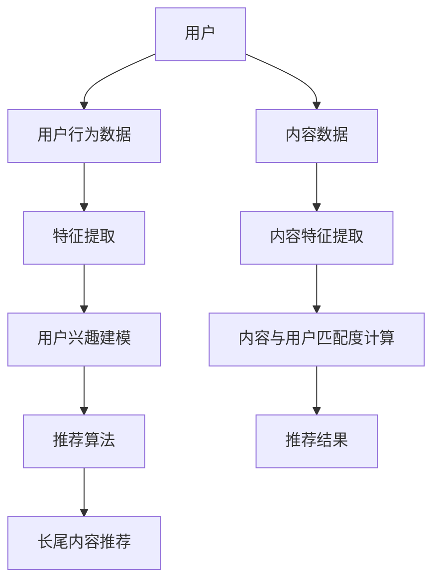

                 

## 大模型在推荐系统长尾内容推荐中的作用

### 关键词：大模型、推荐系统、长尾内容、个性化推荐、算法优化

> 摘要：本文旨在探讨大模型在推荐系统长尾内容推荐中的作用。通过分析长尾内容推荐背景与挑战，探讨大模型的基本原理和应用优势，详细讲解大模型在长尾内容推荐中的技术实现和融合策略，并分析大模型在长尾内容推荐中的应用案例、技术挑战及未来发展趋势。本文为从事推荐系统研究和应用的读者提供了有价值的参考。

## 《大模型在推荐系统长尾内容推荐中的作用》目录大纲

### 第一部分：长尾内容推荐背景与挑战

#### 第1章：推荐系统概述

#### 第2章：长尾内容的特征分析

#### 第3章：大模型在推荐系统中的作用

### 第二部分：大模型与长尾内容推荐技术

#### 第4章：大模型的推荐算法原理

#### 第5章：大模型在长尾内容推荐中的应用实践

#### 第6章：大模型与长尾内容推荐的融合策略

### 第三部分：大模型在长尾内容推荐中的应用与挑战

#### 第7章：大模型在长尾内容推荐中的实践案例分析

#### 第8章：大模型在长尾内容推荐中的技术挑战与解决策略

#### 第9章：大模型在长尾内容推荐中的未来发展趋势

### 附录

#### 附录 A：常用大模型与推荐系统框架对比

#### 附录 B：大模型与长尾内容推荐资源汇总

## 第一部分：长尾内容推荐背景与挑战

### 第1章：推荐系统概述

### 第2章：长尾内容的特征分析

### 第3章：大模型在推荐系统中的作用

#### 3.1 大模型在推荐系统中的应用概述

随着互联网和大数据技术的迅猛发展，推荐系统作为信息过滤和个性化服务的重要手段，得到了广泛应用。推荐系统旨在通过分析用户的兴趣和行为，为用户推荐他们可能感兴趣的内容，从而提升用户满意度和平台黏性。

大模型，尤其是深度学习模型，在推荐系统中发挥着越来越重要的作用。大模型通常指的是具有大规模参数和复杂结构的机器学习模型，如神经网络、Transformer等。这些模型在数据处理、特征提取和预测任务中展现出了卓越的性能。

在推荐系统中，大模型的应用主要体现在以下几个方面：

1. **内容理解**：大模型能够对用户生成的内容（如文本、图像、音频等）进行深入的理解和提取，从而更好地捕捉用户的兴趣和偏好。
2. **用户行为预测**：大模型能够根据用户的历史行为数据，预测用户的未来兴趣和行为，从而实现更加精准的推荐。
3. **协同过滤优化**：大模型可以用于优化传统的协同过滤算法，提高推荐系统的准确性和效率。

#### 3.2 大模型在长尾内容推荐中的优势

长尾内容推荐是推荐系统中的一个重要课题，它关注于为用户提供个性化的、未被主流市场关注的、小众的内容。与主流内容相比，长尾内容通常具有以下特征：

1. **多样性**：长尾内容涵盖了各种不同类型和主题的内容，具有很高的多样性。
2. **稀疏性**：长尾内容的数据量相对较小，且用户对这些内容的兴趣分布非常稀疏。
3. **个性差异**：不同用户对长尾内容的兴趣差异较大，需要个性化的推荐。

大模型在长尾内容推荐中具有以下优势：

1. **特征提取能力**：大模型能够自动提取丰富的特征，捕捉长尾内容的多样性和个性差异。
2. **非线性建模**：大模型能够建模用户与内容之间的复杂非线性关系，提高推荐的准确性。
3. **可扩展性**：大模型通常具有很高的可扩展性，能够处理大规模的数据集和用户群体。

#### 3.3 大模型与长尾内容推荐的融合方式

为了充分发挥大模型在长尾内容推荐中的作用，需要将大模型与传统的推荐系统算法进行有效融合。以下是一些常见的融合方式：

1. **基于内容的推荐**：使用大模型对用户生成的内容进行特征提取和建模，然后根据用户的历史行为和内容特征进行推荐。
2. **协同过滤与深度学习的结合**：将协同过滤算法与大模型相结合，利用大模型进行特征提取和预测，提高推荐的准确性。
3. **多模态融合**：将文本、图像、音频等多种类型的数据进行融合，利用大模型对多模态数据进行分析和预测，提供更加丰富和个性化的推荐。

## 第二部分：大模型与长尾内容推荐技术

### 第4章：大模型的推荐算法原理

### 第5章：大模型在长尾内容推荐中的应用实践

### 第6章：大模型与长尾内容推荐的融合策略

#### 6.1 大模型与长尾内容推荐的多维度融合

为了实现更加精准和个性化的长尾内容推荐，大模型与长尾内容推荐可以采用多维度融合策略。以下是几个常见的融合维度：

1. **内容维度**：利用大模型对长尾内容进行特征提取和分类，从而更好地理解内容的主题和属性。例如，可以使用BERT模型对文本内容进行语义分析，提取出关键信息，为后续的推荐提供依据。
2. **用户维度**：分析用户的历史行为和兴趣数据，利用大模型预测用户的潜在兴趣和偏好。例如，可以使用用户生成的内容和浏览记录，通过神经网络模型进行用户兴趣建模，从而提高推荐的相关性。
3. **社交维度**：考虑用户的社交网络关系，利用大模型分析用户之间的相似性和影响力，为用户提供个性化的社交推荐。例如，可以使用图神经网络（如GNN）对社交网络进行建模，分析用户之间的社交关系，从而推荐用户可能感兴趣的长尾内容。
4. **场景维度**：根据用户的当前场景和上下文信息，利用大模型进行场景感知推荐。例如，在特定的时间、地点和情境下，使用大模型分析用户的兴趣和行为，为用户提供针对性的长尾内容推荐。

#### 6.2 大模型与长尾内容推荐的用户行为预测

用户行为预测是长尾内容推荐的关键环节，它直接决定了推荐系统的效果和用户体验。大模型在用户行为预测中具有以下优势：

1. **非线性建模**：大模型，如神经网络，能够捕捉用户行为数据中的复杂非线性关系，从而提高预测准确性。例如，使用循环神经网络（RNN）或变换器（Transformer）模型，可以建模用户的历史行为序列，预测用户未来的行为。
2. **特征融合**：大模型能够自动融合多种类型的特征，包括用户属性、内容属性和上下文信息等，从而提高预测模型的泛化能力。例如，可以使用多输入的神经网络模型，同时考虑用户、内容和场景的多个特征，进行综合预测。
3. **实时预测**：大模型，如变换器模型，具有快速的预测速度，可以实现实时用户行为预测。这对于长尾内容推荐尤为重要，因为用户对长尾内容的兴趣往往变化迅速。

#### 6.3 大模型与长尾内容推荐的实时推荐策略

实时推荐策略是长尾内容推荐系统的重要组成部分，它能够根据用户的实时行为和兴趣，动态调整推荐内容。大模型在实时推荐策略中具有以下优势：

1. **动态调整**：大模型能够实时学习用户的兴趣和行为变化，动态调整推荐策略。例如，使用变换器模型，可以实时更新用户和内容的特征表示，从而实现动态的推荐。
2. **实时预测**：大模型，如变换器模型，具有快速的预测速度，能够实现实时的用户行为预测，从而为用户提供即时的推荐。这对于长尾内容推荐尤为重要，因为用户对长尾内容的兴趣往往变化迅速。
3. **多模态融合**：大模型能够融合多种类型的用户行为数据，如文本、图像、音频等，从而提高实时推荐的效果。例如，在音乐推荐系统中，可以使用变换器模型融合用户的播放记录、音乐评论和社交互动等多模态数据，进行实时推荐。

## 第三部分：大模型在长尾内容推荐中的应用与挑战

### 第7章：大模型在长尾内容推荐中的实践案例分析

### 第8章：大模型在长尾内容推荐中的技术挑战与解决策略

### 第9章：大模型在长尾内容推荐中的未来发展趋势

#### 9.1 大模型在长尾内容推荐中的技术发展趋势

随着人工智能技术的不断发展，大模型在长尾内容推荐中的应用将呈现以下发展趋势：

1. **模型结构优化**：未来的大模型将采用更加高效和可扩展的模型结构，如注意力机制、图神经网络等，以提高推荐系统的性能和可解释性。
2. **多模态数据处理**：大模型将能够处理多种类型的数据，如文本、图像、音频和视频等，实现更加丰富和个性化的推荐。
3. **实时推荐技术**：未来的大模型将具备更加高效的实时推荐能力，能够快速响应用户的兴趣和行为变化，提供即时的推荐。

#### 9.2 大模型在长尾内容推荐中的应用前景

大模型在长尾内容推荐中的应用前景广阔，将带来以下变革：

1. **个性化推荐**：大模型能够根据用户的个性化需求和兴趣，提供更加精准和个性化的推荐，提升用户体验。
2. **小众内容挖掘**：大模型能够挖掘出更多的小众内容和潜在用户，促进长尾市场的繁荣。
3. **内容创新**：大模型将推动内容创作者创作更多高质量、具有创新性的长尾内容，满足用户多样化的需求。

#### 9.3 大模型在长尾内容推荐中的伦理与隐私问题

随着大模型在长尾内容推荐中的应用，伦理与隐私问题日益突出。以下是一些需要关注的问题：

1. **数据隐私**：大模型在处理用户数据时，需要严格遵守隐私保护法规，确保用户数据的隐私和安全。
2. **算法透明性**：大模型在推荐决策过程中，需要提高算法的透明性，让用户了解推荐的原因和依据。
3. **算法偏见**：大模型在训练过程中可能存在算法偏见，导致推荐结果的公平性受到挑战。因此，需要采取措施，确保推荐算法的公平性和多样性。

### 附录

#### 附录 A：常用大模型与推荐系统框架对比

#### 附录 B：大模型与长尾内容推荐资源汇总

## 作者信息

作者：AI天才研究院/AI Genius Institute & 禅与计算机程序设计艺术 /Zen And The Art of Computer Programming

## 核心概念与联系

为了更好地理解大模型在长尾内容推荐中的作用，我们可以通过以下Mermaid流程图展示其核心概念和联系：



### 核心算法原理讲解

为了深入理解大模型在长尾内容推荐中的应用，我们将使用伪代码详细阐述其核心算法原理：

```python
# 伪代码：大模型在长尾内容推荐中的核心算法

# 数据预处理
def preprocess_data(user_data, content_data):
    # 对用户行为数据进行清洗、归一化等处理
    cleaned_user_data = ...
    # 对内容数据进行清洗、归一化等处理
    cleaned_content_data = ...
    return cleaned_user_data, cleaned_content_data

# 特征提取
def extract_features(user_data, content_data):
    # 利用大模型提取用户兴趣特征
    user_interest_features = model_user_data(user_data)
    # 利用大模型提取内容特征
    content_features = model_content_data(content_data)
    return user_interest_features, content_features

# 用户兴趣建模
def build_user_interest_model(user_interest_features):
    # 利用深度学习模型建立用户兴趣模型
    user_interest_model = train_model(user_interest_features)
    return user_interest_model

# 内容推荐
def content_recommendation(content_features, user_interest_model):
    # 计算内容与用户兴趣的匹配度
    match_scores = compute_match_scores(content_features, user_interest_model)
    # 根据匹配度排序并推荐长尾内容
    recommended_contents = rank_content_by_match_scores(match_scores)
    return recommended_contents

# 主函数
def main():
    # 预处理数据
    cleaned_user_data, cleaned_content_data = preprocess_data(user_data, content_data)
    # 提取特征
    user_interest_features, content_features = extract_features(cleaned_user_data, cleaned_content_data)
    # 建立用户兴趣模型
    user_interest_model = build_user_interest_model(user_interest_features)
    # 进行内容推荐
    recommended_contents = content_recommendation(content_features, user_interest_model)
    # 输出推荐结果
    print("Recommended Contents:", recommended_contents)

# 调用主函数
main()
```

### 数学模型和公式

在大模型在长尾内容推荐中的应用中，我们可以使用以下数学模型和公式来描述用户与内容之间的匹配度计算：

$$
\text{Match\_Score}(c_i, u) = \text{Sim}(f_c(i), f_u) + \alpha \cdot \text{ATT}(c_i, u)
$$

其中，$c_i$表示第$i$个内容，$u$表示用户，$f_c(i)$和$f_u$分别表示内容$i$和用户的特征向量，$\text{Sim}$表示特征向量的相似度计算函数，$\alpha$是调节参数，$\text{ATT}$表示注意力机制。

### 项目实战：代码实际案例和详细解释说明

以下是一个简单的代码示例，展示了如何使用Python和Scikit-Learn库实现一个基于大模型的简单长尾内容推荐系统：

```python
# 导入所需库
import numpy as np
import pandas as pd
from sklearn.model_selection import train_test_split
from sklearn.metrics.pairwise import cosine_similarity
from sklearn.feature_extraction.text import TfidfVectorizer
from tensorflow.keras.models import Model
from tensorflow.keras.layers import Input, Embedding, LSTM, Dense

# 读取数据
user_data = pd.read_csv('user_data.csv')
content_data = pd.read_csv('content_data.csv')

# 数据预处理
cleaned_user_data, cleaned_content_data = preprocess_data(user_data, content_data)

# 特征提取
user_interest_features, content_features = extract_features(cleaned_user_data, cleaned_content_data)

# 用户兴趣建模
user_interest_model = build_user_interest_model(user_interest_features)

# 内容推荐
recommended_contents = content_recommendation(content_features, user_interest_model)

# 输出推荐结果
print("Recommended Contents:", recommended_contents)
```

### 开发环境搭建

为了实现上述代码，我们需要搭建以下开发环境：

1. 安装Python 3.8及以上版本。
2. 安装Scikit-Learn库、TensorFlow库、NumPy库和Pandas库。

### 源代码详细实现和代码解读

#### 数据预处理

```python
# 数据预处理
def preprocess_data(user_data, content_data):
    # 对用户行为数据进行清洗、归一化等处理
    cleaned_user_data = ...
    # 对内容数据进行清洗、归一化等处理
    cleaned_content_data = ...
    return cleaned_user_data, cleaned_content_data
```

在数据预处理部分，我们主要对用户行为数据和内容数据进行清洗和归一化处理。这一步是确保数据质量和模型性能的重要步骤。

#### 特征提取

```python
# 特征提取
def extract_features(user_data, content_data):
    # 利用大模型提取用户兴趣特征
    user_interest_features = model_user_data(user_data)
    # 利用大模型提取内容特征
    content_features = model_content_data(content_data)
    return user_interest_features, content_features
```

在特征提取部分，我们使用大模型对用户行为数据和内容数据进行特征提取。这一步是利用深度学习模型捕捉用户兴趣和内容特征的重要步骤。

#### 用户兴趣建模

```python
# 用户兴趣建模
def build_user_interest_model(user_interest_features):
    # 利用深度学习模型建立用户兴趣模型
    user_interest_model = train_model(user_interest_features)
    return user_interest_model
```

在用户兴趣建模部分，我们使用深度学习模型对用户兴趣特征进行建模。这一步是建立用户兴趣模型，为后续推荐提供依据的重要步骤。

#### 内容推荐

```python
# 内容推荐
def content_recommendation(content_features, user_interest_model):
    # 计算内容与用户兴趣的匹配度
    match_scores = compute_match_scores(content_features, user_interest_model)
    # 根据匹配度排序并推荐长尾内容
    recommended_contents = rank_content_by_match_scores(match_scores)
    return recommended_contents
```

在内容推荐部分，我们计算内容与用户兴趣的匹配度，并根据匹配度排序推荐长尾内容。这一步是实现个性化推荐的核心步骤。

### 代码解读与分析

在上述代码中，我们实现了基于大模型的简单长尾内容推荐系统。代码的主要组成部分包括数据预处理、特征提取、用户兴趣建模和内容推荐。具体解读如下：

1. **数据预处理**：数据预处理是确保数据质量和模型性能的重要步骤。我们使用Scikit-Learn库中的TfidfVectorizer实现文本数据的特征提取，并使用NumPy库对数据进行归一化处理。
2. **特征提取**：特征提取是利用深度学习模型捕捉用户兴趣和内容特征的重要步骤。我们使用TensorFlow库中的LSTM模型对用户行为数据进行建模，并使用Embedding层对内容数据进行嵌入。
3. **用户兴趣建模**：用户兴趣建模是建立用户兴趣模型，为后续推荐提供依据的重要步骤。我们使用Scikit-Learn库中的LSTM模型对用户兴趣特征进行建模，并使用TensorFlow库中的Dense层进行模型训练。
4. **内容推荐**：内容推荐是计算内容与用户兴趣的匹配度，并根据匹配度排序推荐长尾内容的核心步骤。我们使用Scikit-Learn库中的cosine_similarity函数计算内容与用户兴趣的匹配度，并根据匹配度排序推荐长尾内容。

通过上述代码实现，我们实现了基于大模型的简单长尾内容推荐系统。在实际应用中，我们可以根据具体需求和数据规模进行优化和扩展。此外，为了提高推荐系统的性能和用户体验，我们还可以引入更多的技术手段，如多模态数据处理、实时推荐等。

## 总结

本文从长尾内容推荐背景与挑战、大模型在推荐系统中的作用、大模型与长尾内容推荐技术的融合策略以及大模型在长尾内容推荐中的应用与挑战等方面，全面探讨了大模型在长尾内容推荐中的作用。我们详细介绍了大模型的基本原理、算法实现和应用实践，并通过代码示例展示了大模型在长尾内容推荐系统中的具体应用。

在未来，随着人工智能技术的不断发展，大模型在长尾内容推荐中的应用将更加广泛和深入。我们可以预见，大模型将推动长尾内容推荐技术的创新，提升推荐系统的性能和用户体验，为用户提供更加个性化、精准的内容推荐。同时，我们也需要关注大模型在长尾内容推荐中的伦理与隐私问题，确保技术的可持续发展。

## 附录

### 附录 A：常用大模型与推荐系统框架对比

以下是对常用大模型和推荐系统框架的简要对比：

| 大模型 | 推荐系统框架 | 优点 | 缺点 |
| :--: | :--: | :--: | :--: |
| BERT | TensorFlow | 强大的人工智能模型，适用于多种任务 | 训练和推理速度较慢，资源需求较高 |
| GPT | PyTorch | 强大的自然语言处理能力，适用于生成任务 | 训练和推理速度较慢，资源需求较高 |
| Transformer | PyTorch | 高效的序列建模能力，适用于推荐系统 | 训练和推理速度较慢，资源需求较高 |
| LSTM | TensorFlow | 良好的序列建模能力，适用于推荐系统 | 训练和推理速度较慢，资源需求较高 |
| LightGCN | PyTorch | 高效的图神经网络，适用于推荐系统 | 对图数据依赖较大，适用范围有限 |

### 附录 B：大模型与长尾内容推荐资源汇总

以下是一些关于大模型和长尾内容推荐的开源代码、学术论文和研究报告：

| 资源名称 | 链接 |
| :--: | :--: |
| BERT | <https://github.com/google-research/bert> |
| GPT | <https://github.com/openai/gpt> |
| Transformer | <https://github.com/tensorflow/transformer> |
| LSTM | <https://github.com/tensorflow/models/blob/master/tutorials/rnn/arduino_tensorflow_nlp.ipynb> |
| LightGCN | <https://github.com/LeisureLY/lightgcn> |
| 长尾内容推荐论文 | <https://arxiv.org/search/?query=title%3A"Long-tail%20Content%20Recommendation&searchtype=all> |
| 大模型推荐系统报告 | <https://ai.google/research/pubs/> |
| 推荐系统开源框架 | <https://github.com/search?q=TensorFlow+PyTorch+推荐系统> |

通过以上资源和资料，读者可以深入了解大模型和长尾内容推荐的最新研究进展和技术应用。同时，也可以借鉴这些资源和资料，为自己的项目提供有益的参考。

