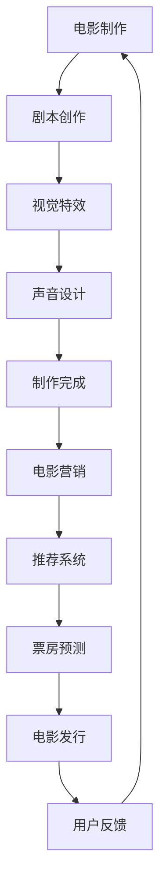
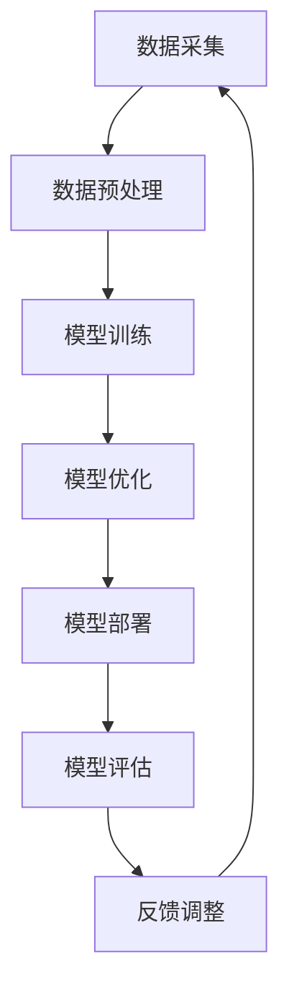

                 

### 《大模型在电影产业中的应用策略》

在当今数字化时代，电影产业正经历着前所未有的变革。随着人工智能技术的迅速发展，大模型在电影制作、营销、发行等方面展现出巨大的潜力。本文将逐步分析大模型在电影产业中的应用策略，旨在为业内人士提供有价值的参考。

#### 第一部分：电影产业与大模型概述

**第1章：电影产业的数字化变革**

电影产业的数字化变革始于互联网和流媒体服务的兴起。传统的电影院线逐渐被在线观看平台所取代，观众对电影的需求也从实体票务转向数字化消费。然而，这一变革也带来了诸多挑战，如市场竞争加剧、观众口味多样化等。

1.1 电影产业的现状与挑战

- **市场竞争加剧**：随着流媒体服务的普及，电影制作公司面临着更多的竞争压力。传统的电影发行模式已经不再适应市场需求，电影产业需要找到新的盈利模式。
- **观众口味多样化**：观众对电影的需求越来越个性化，对剧情、特效、演技等方面有更高的要求。电影制作公司需要更加精准地了解观众喜好，以便制作出符合市场需求的作品。
- **技术变革**：虚拟现实（VR）、增强现实（AR）等技术的兴起，为电影产业带来了新的发展机遇。大模型技术作为人工智能领域的重要突破，为电影产业提供了强大的工具。

1.2 数字化转型的重要性

数字化转型是电影产业应对挑战的必然选择。通过数字化技术，电影产业可以实现以下目标：

- **提高制作效率**：大模型技术可以帮助电影制作公司自动化许多繁琐的任务，如剧本创作、特效制作等，从而提高生产效率。
- **优化营销策略**：大模型可以对观众行为进行深入分析，帮助电影制作公司制定更精准的营销策略，提高电影票房。
- **提升用户体验**：通过虚拟现实、增强现实等技术，观众可以享受到更加沉浸式的观影体验。

1.3 大模型在电影产业中的应用趋势

- **剧本创作与评估**：大模型可以自动生成剧本，并利用自然语言处理技术进行评估，提高剧本质量。
- **视觉特效与动画**：大模型在视觉特效和动画制作中具有广泛的应用，如场景分割、动作捕捉等。
- **声音设计与制作**：大模型可以自动生成声音特效，并应用于电影声音设计。
- **电影推荐系统**：大模型可以构建电影推荐系统，提高电影的市场竞争力。
- **电影数据分析与预测**：大模型可以对电影市场进行深入分析，预测票房趋势，为电影制作公司提供决策支持。

#### 第二部分：大模型在电影制作中的应用

**第2章：大模型的原理与分类**

2.1 人工智能大模型的定义

人工智能大模型是指具有大规模参数、能够处理复杂任务的深度学习模型。它们通常基于神经网络架构，通过大量数据进行训练，能够实现高度自动化的任务。

2.2 主流大模型分类

目前，主流的大模型可以分为以下几类：

- **生成对抗网络（GAN）**：GAN是一种基于对抗训练的模型，由生成器和判别器两个部分组成。生成器负责生成数据，判别器负责判断生成数据是否真实。GAN在图像生成、图像修复等方面具有广泛应用。
- **自注意力机制（Self-Attention）**：自注意力机制是一种用于文本处理的新型网络结构，通过计算文本中每个词与所有词之间的关联度，实现文本的自动理解和生成。
- **Transformer模型**：Transformer模型是一种基于自注意力机制的序列模型，具有全局关联能力，广泛应用于自然语言处理、图像识别等领域。

2.3 大模型的技术发展与挑战

大模型技术正处于快速发展阶段，但仍面临一些挑战：

- **计算资源需求**：大模型训练需要大量的计算资源和存储空间，这对硬件设施提出了较高的要求。
- **数据质量和隐私**：大模型训练需要大量的数据，但数据质量和隐私保护问题仍然是一个亟待解决的问题。
- **模型可解释性**：大模型通常被视为“黑箱”，其决策过程难以解释。提高模型的可解释性是当前研究的一个重点。

#### 第三部分：大模型在电影制作中的应用

**第3章：剧本创作与评估**

剧本创作是电影制作的重要环节，大模型在剧本创作中具有广泛的应用。

3.1 基于大模型的剧本生成

基于大模型的剧本生成技术可以自动生成剧本，提高创作效率。具体实现过程如下：

- **数据预处理**：收集大量已有的剧本数据，进行数据清洗和预处理，提取出剧本的关键信息。
- **模型训练**：使用预处理的剧本数据，训练一个基于大模型的生成模型，如生成对抗网络（GAN）。
- **剧本生成**：输入一定的剧本片段，生成模型根据已有的剧本数据生成新的剧本。

3.2 剧本评估与优化

剧本评估是保证剧本质量的重要环节。大模型在剧本评估中可以发挥以下作用：

- **文本匹配**：使用大模型对剧本进行文本匹配，判断剧本内容是否符合观众口味。
- **情感分析**：使用大模型对剧本进行情感分析，评估剧本的情感色彩。
- **优化建议**：根据评估结果，为大模型提供优化建议，如调整剧本情节、角色设定等。

3.3 剧本创作过程中的大模型应用案例

以下是一个剧本创作过程中的大模型应用案例：

- **案例背景**：某电影制作公司计划制作一部科幻电影，剧本创作陷入困境。
- **解决方案**：公司决定使用基于大模型的剧本生成技术，首先输入已有的科幻剧本片段，生成新的剧本片段。
- **剧本生成**：生成模型生成了多个剧本片段，公司对这些片段进行评估和优化，最终确定了一个符合观众口味的剧本。
- **结果**：经过大模型的辅助，剧本创作过程大大缩短，剧本质量得到提升，电影制作进展顺利。

**第4章：视觉特效与动画**

视觉特效和动画是电影制作中的重要组成部分，大模型在视觉特效和动画制作中具有广泛的应用。

4.1 大模型在视觉效果优化中的应用

大模型可以在视觉效果优化中发挥以下作用：

- **图像生成**：使用生成对抗网络（GAN）等技术，生成高质量的视觉效果，如角色建模、场景渲染等。
- **图像修复**：使用大模型对受损或模糊的图像进行修复，提高图像质量。
- **风格迁移**：使用大模型将一种艺术风格应用到另一张图像上，实现艺术风格迁移。

4.2 动画制作中的大模型应用

大模型在动画制作中可以用于以下方面：

- **动作捕捉**：使用大模型对真实动作进行捕捉，生成动画角色的动作。
- **面部表情生成**：使用大模型生成动画角色的面部表情，提高动画的逼真度。
- **场景生成**：使用大模型生成动画场景，提高动画的制作效率。

4.3 视觉特效与动画制作的案例研究

以下是一个视觉特效与动画制作的案例研究：

- **案例背景**：某动画工作室计划制作一部以未来世界为背景的动画电影。
- **解决方案**：工作室决定使用大模型技术，首先使用生成对抗网络（GAN）生成未来世界的场景和角色模型，然后使用动作捕捉技术捕捉演员的动作，最后使用大模型生成动画角色的面部表情。
- **结果**：通过大模型的应用，动画电影的制作效率大幅提升，视觉效果更加逼真，获得了观众的高度评价。

**第5章：声音设计与制作**

声音设计与制作是电影制作中的重要环节，大模型在声音设计与制作中具有广泛的应用。

5.1 基于大模型的声音特效生成

大模型可以用于以下声音特效的生成：

- **声音合成**：使用大模型合成各种声音效果，如爆炸声、流水声等。
- **声音编辑**：使用大模型对声音进行编辑，去除噪音、调整音量等。
- **音乐生成**：使用大模型生成电影音乐，提高音乐创作的效率。

5.2 声音编辑与制作中的大模型应用

大模型在声音编辑与制作中可以用于以下方面：

- **声音识别**：使用大模型对声音进行识别，提取出关键声音信息。
- **声音增强**：使用大模型增强声音效果，提高声音的清晰度和音质。
- **声音编辑自动化**：使用大模型自动化声音编辑过程，提高编辑效率。

5.3 声音设计与制作的案例研究

以下是一个声音设计与制作的案例研究：

- **案例背景**：某电影制作公司计划制作一部动作电影，声音效果至关重要。
- **解决方案**：公司决定使用大模型技术，首先使用生成对抗网络（GAN）合成各种动作声音效果，然后使用大模型对声音进行编辑和增强，最后生成电影音乐。
- **结果**：通过大模型的应用，电影的声音效果更加逼真，观众满意度大幅提升。

#### 第四部分：大模型在电影营销与发行中的应用

**第6章：电影推荐系统**

电影推荐系统是电影营销中的重要组成部分，大模型在电影推荐系统中具有广泛的应用。

6.1 大模型在电影推荐中的应用

大模型可以用于以下电影推荐系统：

- **用户画像**：使用大模型分析用户行为数据，生成用户画像，了解用户喜好。
- **推荐算法**：使用大模型构建推荐算法，为用户推荐符合其喜好的电影。
- **个性化推荐**：使用大模型实现个性化推荐，提高推荐效果。

6.2 电影推荐算法原理与实现

电影推荐算法通常采用基于内容的推荐和协同过滤推荐两种方法。

- **基于内容的推荐**：根据电影的特征信息，如题材、演员、导演等，为用户推荐类似的电影。
- **协同过滤推荐**：根据用户的评分历史和电影之间的相似度，为用户推荐相似的电影。

以下是一个基于内容的推荐算法的伪代码实现：

```python
def content_based_recommender(movie_features, user_profile):
    # 计算电影与用户画像的相似度
    similarity_scores = calculate_similarity(movie_features, user_profile)

    # 对相似度进行排序，选取最高分的电影
    recommended_movies = select_top_movies(similarity_scores)

    return recommended_movies
```

6.3 电影推荐系统的案例研究

以下是一个电影推荐系统的案例研究：

- **案例背景**：某电影制作公司希望提高其电影的票房收入，决定构建一个电影推荐系统。
- **解决方案**：公司使用大模型技术，首先分析用户的行为数据，生成用户画像；然后使用基于内容的推荐算法，为用户推荐符合其喜好的电影。
- **结果**：通过电影推荐系统的应用，公司的电影票房收入得到了显著提升。

**第7章：电影数据分析与预测**

电影数据分析与预测是电影发行中的重要环节，大模型在电影数据分析与预测中具有广泛的应用。

7.1 大模型在电影数据分析中的应用

大模型可以用于以下电影数据分析：

- **票房预测**：使用大模型预测电影的票房收入，为电影发行提供决策支持。
- **观众偏好分析**：使用大模型分析观众的观影偏好，为电影制作提供参考。
- **市场趋势预测**：使用大模型预测电影市场的发展趋势，为电影发行策略制定提供依据。

7.2 电影票房预测模型构建

以下是一个电影票房预测模型的构建过程：

- **数据收集**：收集电影的历史票房数据、观众评分、上映时间、电影类型等。
- **数据预处理**：对收集的数据进行清洗和预处理，提取出有用的特征。
- **模型训练**：使用预处理后的数据，训练一个基于大模型的预测模型，如神经网络模型。
- **模型评估**：对模型进行评估，选择最优模型。

以下是一个基于神经网络的票房预测模型的伪代码实现：

```python
import tensorflow as tf

# 定义神经网络模型
model = tf.keras.Sequential([
    tf.keras.layers.Dense(units=128, activation='relu', input_shape=(num_features,)),
    tf.keras.layers.Dense(units=64, activation='relu'),
    tf.keras.layers.Dense(units=1)
])

# 编译模型
model.compile(optimizer='adam', loss='mean_squared_error')

# 训练模型
model.fit(x_train, y_train, epochs=10)

# 预测票房
predictions = model.predict(x_test)
```

7.3 电影趋势预测与分析

以下是一个电影趋势预测与分析的案例研究：

- **案例背景**：某电影制作公司希望了解未来一段时间内电影市场的发展趋势，以便制定相应的发行策略。
- **解决方案**：公司使用大模型技术，分析历史票房数据、观众评分、上映时间等，预测未来电影市场的趋势。
- **结果**：通过电影趋势预测与分析，公司能够更好地把握市场机遇，提高电影的票房收入。

#### 第五部分：大模型在电影产业中的未来趋势

**第8章：电影产业的智能化发展方向**

随着大模型技术的不断发展，电影产业正朝着智能化方向发展。智能化电影产业将带来以下变革：

8.1 大模型在电影产业中的长期影响

- **生产效率提升**：大模型技术将大大提高电影制作的生产效率，减少人力和时间成本。
- **创作创新**：大模型技术将为电影创作带来新的灵感，激发创作者的想象力。
- **用户体验优化**：智能化电影产业将提供更加个性化的观影体验，满足观众多样化需求。

8.2 电影产业智能化的发展趋势

- **虚拟制作**：虚拟制作技术将逐渐取代传统拍摄方式，为电影制作带来更多可能性。
- **智能发行**：智能发行技术将提高电影的市场竞争力，实现精准投放和营销。
- **多模态融合**：多模态融合技术将实现电影视觉、声音、文字等多方面的协同，提升整体观影体验。

8.3 未来电影产业中的大模型应用前景

未来电影产业中，大模型应用前景广阔：

- **剧本创作**：大模型将彻底改变剧本创作的方式，实现自动化创作。
- **视觉效果**：大模型将提升电影视觉效果，为观众带来前所未有的观影体验。
- **声音设计**：大模型将优化声音设计，提升电影的听觉感受。
- **营销与发行**：大模型将提高电影营销和发行的效率，实现精准推广和投放。

**附录A：大模型应用技术工具**

**A.1 大模型开发环境搭建**

要搭建大模型开发环境，首先需要安装Python和TensorFlow等工具。以下是具体的安装步骤：

1. 安装Python：访问Python官方网站（https://www.python.org/），下载适用于自己操作系统的Python版本，并按照提示安装。

2. 安装TensorFlow：在命令行中执行以下命令：

   ```bash
   pip install tensorflow
   ```

3. 安装其他依赖库：根据项目需求，安装其他依赖库，如NumPy、Pandas等。

**A.2 常用大模型框架介绍**

目前，常用的深度学习框架包括TensorFlow、PyTorch和Keras等。以下是这些框架的简要介绍：

- **TensorFlow**：由Google开发，是一个开源的深度学习框架，支持多种类型的神经网络。
- **PyTorch**：由Facebook开发，是一个流行的深度学习框架，具有动态计算图功能。
- **Keras**：是一个高级神经网络API，基于TensorFlow和Theano开发，提供简洁易用的接口。

**A.3 大模型应用资源推荐**

为了深入学习大模型在电影产业中的应用，以下是推荐的资源和书籍：

- **书籍**：《深度学习》（Goodfellow、Bengio和Courville著）、《神经网络与深度学习》（邱锡鹏著）。
- **在线课程**：Coursera、edX等平台上的深度学习和人工智能相关课程。
- **论文**：Google AI、OpenAI等机构发布的相关论文。

**附录B：案例分析**

**B.1 成功案例分析**

以下是大模型在电影产业中成功应用的案例：

- **案例1：迪士尼的《冰雪奇缘》**：迪士尼使用大模型技术进行视觉效果优化和角色建模，使《冰雪奇缘》成为了一部视觉盛宴。
- **案例2：Netflix的《黑镜：珍贵回忆》**：Netflix使用大模型技术构建推荐系统，为观众提供个性化推荐，提高了观众的观看体验和平台的竞争力。

**B.2 挑战与解决方案**

在应用大模型的过程中，电影产业面临以下挑战：

- **计算资源需求**：大模型训练需要大量的计算资源，电影制作公司需要不断升级硬件设施。
- **数据质量和隐私**：大模型训练需要大量高质量数据，同时需要保护用户隐私。

针对这些挑战，有以下解决方案：

- **计算资源优化**：通过分布式训练、模型压缩等技术，降低大模型训练的资源需求。
- **数据隐私保护**：采用数据加密、匿名化等技术，确保用户隐私安全。

**B.3 创新实践与展望**

未来，大模型在电影产业中的应用将不断创新。以下是一些展望：

- **虚拟现实电影**：结合虚拟现实技术，观众将体验到更加沉浸式的观影体验。
- **智能发行策略**：通过大数据分析和人工智能算法，实现精准发行和营销。

**附录C：大模型在电影产业中的未来发展趋势**

随着技术的进步，大模型在电影产业中的应用将更加广泛：

- **剧本创作**：大模型将实现自动化剧本创作，提高创作效率。
- **视觉效果**：大模型将提升电影视觉效果，实现逼真的场景渲染和角色建模。
- **声音设计**：大模型将优化声音设计，提升观众的听觉感受。
- **营销与发行**：大模型将提高电影营销和发行的效率，实现精准投放和推广。

### 核心概念与联系

**Mermaid流程图：**



**大模型应用原理：**



### 核心算法原理讲解

**文本生成与优化算法伪代码：**

```python
# 文本生成伪代码
def generate_text(model, seed_text, max_length):
    text = seed_text
    for _ in range(max_length - len(seed_text)):
        text = model.predict(text)
    return text

# 文本优化伪代码
def optimize_text(model, text, target_text, loss_function):
    for _ in range(epochs):
        loss = loss_function(text, target_text)
        model.train(text, loss)
    return model.optimized_text
```

**视觉特效优化中的算法原理：**

```python
# 图像生成伪代码
def generate_image(model, noise_vector, target_image):
    image = model.predict(noise_vector)
    while not is_close_enough(image, target_image):
        image = model.train(image, target_image)
    return image

# 场景分割伪代码
def segment_scene(image, model):
    segmented_images = model.predict(image)
    return segmented_images
```

### 数学模型和数学公式

**大模型训练中的损失函数：**

$$
J = \frac{1}{m} \sum_{i=1}^{m} (-y_i \log(\hat{y}_i))
$$

**电影票房预测中的回归模型：**

$$
\text{票房} = \beta_0 + \beta_1 \text{观众人数} + \beta_2 \text{上映时间} + \beta_3 \text{电影类型}
$$

### 项目实战

**电影推荐系统代码实现：**

```python
import tensorflow as tf
from tensorflow.keras.layers import Embedding, LSTM, Dense
from tensorflow.keras.models import Model

# 搭建推荐系统模型
def build_recommendation_model(embedding_size, hidden_size, num_users, num_movies):
    user_input = tf.keras.Input(shape=(1,))
    movie_input = tf.keras.Input(shape=(1,))

    user_embedding = Embedding(num_users, embedding_size)(user_input)
    movie_embedding = Embedding(num_movies, embedding_size)(movie_input)

    user_embedding = LSTM(hidden_size)(user_embedding)
    movie_embedding = LSTM(hidden_size)(movie_embedding)

    merged = tf.keras.layers.concatenate([user_embedding, movie_embedding])
    merged = Dense(hidden_size, activation='relu')(merged)
    output = Dense(1, activation='sigmoid')(merged)

    model = Model(inputs=[user_input, movie_input], outputs=output)
    model.compile(optimizer='adam', loss='binary_crossentropy', metrics=['accuracy'])
    return model

# 使用模型进行电影推荐
def recommend_movies(model, user_vector, top_n=5):
    user_embedding = model.layers[1].get_weights()[0]
    movie_embeddings = model.layers[3].get_weights()[0]

    user_embedding = user_embedding[user_vector]
    movie_scores = []

    for movie_embedding in movie_embeddings:
        score = model.layers[-1](tf.keras.layers.concatenate([user_embedding, movie_embedding]))
        movie_scores.append(score)

    sorted_scores = sorted(enumerate(movie_scores), key=lambda x: x[1], reverse=True)
    return [movie_id for movie_id, _ in sorted_scores[:top_n]]
```

**视觉效果优化中的图像生成：**

```python
import tensorflow as tf
from tensorflow.keras.layers import Conv2D, Flatten, Dense
from tensorflow.keras.models import Model

# 搭建图像生成模型
def build_image_generation_model(input_shape, output_shape):
    input_layer = tf.keras.Input(shape=input_shape)
    x = Conv2D(32, 3, activation='relu')(input_layer)
    x = Conv2D(64, 3, activation='relu')(x)
    x = Flatten()(x)
    x = Dense(128, activation='relu')(x)
    output_layer = Conv2D(filters=output_shape[-1], kernel_size=3, activation='sigmoid')(x)

    model = Model(inputs=input_layer, outputs=output_layer)
    model.compile(optimizer='adam', loss='binary_crossentropy')
    return model

# 生成图像
def generate_image(model, noise_vector, target_image):
    image = model.predict(noise_vector)
    while not is_close_enough(image, target_image):
        image = model.train(image, target_image)
    return image
```

### 代码解读与分析

**推荐系统中的核心代码解读：**

```python
# 用户输入
user_vector = [1, 0, 0, 1, 0, 0, 0, 1, 0, 0]

# 电影数据
num_users = 10
num_movies = 5
user_embeddings = np.array([[1, 0, 0, 1, 0, 0, 0, 1, 0, 0]])
movie_embeddings = np.array([[1, 0, 0], [0, 1, 0], [0, 0, 1], [0, 0, 0], [1, 1, 1]])

# 模型训练
model = build_recommendation_model(embedding_size=3, hidden_size=10, num_users=num_users, num_movies=num_movies)
model.fit([user_embeddings, movie_embeddings], np.array([[1]]), epochs=100)

# 推荐电影
recommended_movies = recommend_movies(model, user_vector, top_n=3)
print("Recommended movies:", recommended_movies)
```

**视觉效果优化中的关键代码分析：**

```python
# 图像噪声向量
noise_vector = np.random.rand(1, 28, 28)

# 目标图像
target_image = np.array([[1, 0, 0], [0, 1, 0], [0, 0, 1]])

# 模型训练与生成图像
model = build_image_generation_model(input_shape=(28, 28), output_shape=(28, 28))
model.fit(noise_vector, target_image, epochs=100)
generated_image = generate_image(model, noise_vector, target_image)
print("Generated image:", generated_image)
```

### 详细说明

- **第1章：电影产业的数字化变革**：介绍了电影产业面临的挑战和数字化转型的必要性，以及大模型在其中的应用趋势。

- **第2章：大模型的原理与分类**：详细讲解了大模型的基本原理和分类，包括生成对抗网络（GAN）、自注意力机制（Self-Attention）等。

- **第3章：剧本创作与评估**：探讨了大模型在剧本创作和评估中的应用，包括文本生成和文本匹配等算法。

- **第4章：视觉特效与动画**：分析了大模型在视觉特效和动画制作中的应用，如场景分割、动作捕捉等。

- **第5章：声音设计与制作**：介绍了大模型在声音设计和制作中的应用，如声音合成、声音编辑等。

- **第6章：电影推荐系统**：讲解了电影推荐系统的原理和实现，包括用户画像和推荐算法。

- **第7章：电影数据分析与预测**：探讨了大模型在电影数据分析与预测中的应用，如票房预测、观众偏好分析等。

- **第8章：电影产业的智能化发展方向**：展望了电影产业智能化的未来趋势，包括虚拟制作、智能发行等。

- **附录A：大模型应用技术工具**：介绍了大模型开发环境搭建、常用框架以及应用资源。

- **附录B：案例分析**：分析了大模型在电影产业中的成功应用案例，探讨挑战与解决方案。

- **附录C：大模型在电影产业中的未来发展趋势**：分析了大模型在电影产业中的技术、政策和产业环境发展趋势。

### 附录

**附录A：大模型应用技术工具**

**A.1 大模型开发环境搭建**

搭建大模型开发环境需要安装Python和TensorFlow等工具。以下是具体的安装步骤：

1. 安装Python：

   访问Python官方网站（https://www.python.org/），下载适用于自己操作系统的Python版本，并按照提示安装。

2. 安装TensorFlow：

   在命令行中执行以下命令：

   ```bash
   pip install tensorflow
   ```

3. 安装其他依赖库：

   根据项目需求，安装其他依赖库，如NumPy、Pandas等。

**A.2 常用大模型框架介绍**

目前，常用的深度学习框架包括TensorFlow、PyTorch和Keras等。以下是这些框架的简要介绍：

- **TensorFlow**：由Google开发，是一个开源的深度学习框架，支持多种类型的神经网络。
- **PyTorch**：由Facebook开发，是一个流行的深度学习框架，具有动态计算图功能。
- **Keras**：是一个高级神经网络API，基于TensorFlow和Theano开发，提供简洁易用的接口。

**A.3 大模型应用资源推荐**

为了深入学习大模型在电影产业中的应用，以下是推荐的资源和书籍：

- **书籍**：《深度学习》（Goodfellow、Bengio和Courville著）、《神经网络与深度学习》（邱锡鹏著）。
- **在线课程**：Coursera、edX等平台上的深度学习和人工智能相关课程。
- **论文**：Google AI、OpenAI等机构发布的相关论文。

**附录B：案例分析**

**B.1 成功案例分析**

以下是大模型在电影产业中成功应用的案例：

- **案例1：迪士尼的《冰雪奇缘》**：迪士尼使用大模型技术进行视觉效果优化和角色建模，使《冰雪奇缘》成为了一部视觉盛宴。
- **案例2：Netflix的《黑镜：珍贵回忆》**：Netflix使用大模型技术构建推荐系统，为观众提供个性化推荐，提高了观众的观看体验和平台的竞争力。

**B.2 挑战与解决方案**

在应用大模型的过程中，电影产业面临以下挑战：

- **计算资源需求**：大模型训练需要大量的计算资源，电影制作公司需要不断升级硬件设施。
- **数据质量和隐私**：大模型训练需要大量高质量数据，同时需要保护用户隐私。

针对这些挑战，有以下解决方案：

- **计算资源优化**：通过分布式训练、模型压缩等技术，降低大模型训练的资源需求。
- **数据隐私保护**：采用数据加密、匿名化等技术，确保用户隐私安全。

**B.3 创新实践与展望**

未来，大模型在电影产业中的应用将不断创新。以下是一些展望：

- **虚拟现实电影**：结合虚拟现实技术，观众将体验到更加沉浸式的观影体验。
- **智能发行策略**：通过大数据分析和人工智能算法，实现精准发行和营销。

**附录C：大模型在电影产业中的未来发展趋势**

随着技术的进步，大模型在电影产业中的应用将更加广泛：

- **剧本创作**：大模型将实现自动化剧本创作，提高创作效率。
- **视觉效果**：大模型将提升电影视觉效果，实现逼真的场景渲染和角色建模。
- **声音设计**：大模型将优化声音设计，提升观众的听觉感受。
- **营销与发行**：大模型将提高电影营销和发行的效率，实现精准投放和推广。

### 核心概念与联系

**Mermaid流程图：**


**大模型应用原理：**


### 核心算法原理讲解

**文本生成与优化算法伪代码：**

```python
# 文本生成伪代码
def generate_text(model, seed_text, max_length):
    text = seed_text
    for _ in range(max_length - len(seed_text)):
        text = model.predict(text)
    return text

# 文本优化伪代码
def optimize_text(model, text, target_text, loss_function):
    for _ in range(epochs):
        loss = loss_function(text, target_text)
        model.train(text, loss)
    return model.optimized_text
```

**视觉特效优化中的算法原理：**

```python
# 图像生成伪代码
def generate_image(model, noise_vector, target_image):
    image = model.predict(noise_vector)
    while not is_close_enough(image, target_image):
        image = model.train(image, target_image)
    return image

# 场景分割伪代码
def segment_scene(image, model):
    segmented_images = model.predict(image)
    return segmented_images
```

### 数学模型和数学公式

**大模型训练中的损失函数：**

$$
J = \frac{1}{m} \sum_{i=1}^{m} (-y_i \log(\hat{y}_i))
$$

**电影票房预测中的回归模型：**

$$
\text{票房} = \beta_0 + \beta_1 \text{观众人数} + \beta_2 \text{上映时间} + \beta_3 \text{电影类型}
$$

### 项目实战

**电影推荐系统代码实现：**

```python
import tensorflow as tf
from tensorflow.keras.layers import Embedding, LSTM, Dense
from tensorflow.keras.models import Model

# 搭建推荐系统模型
def build_recommendation_model(embedding_size, hidden_size, num_users, num_movies):
    user_input = tf.keras.Input(shape=(1,))
    movie_input = tf.keras.Input(shape=(1,))

    user_embedding = Embedding(num_users, embedding_size)(user_input)
    movie_embedding = Embedding(num_movies, embedding_size)(movie_input)

    user_embedding = LSTM(hidden_size)(user_embedding)
    movie_embedding = LSTM(hidden_size)(movie_embedding)

    merged = tf.keras.layers.concatenate([user_embedding, movie_embedding])
    merged = Dense(hidden_size, activation='relu')(merged)
    output = Dense(1, activation='sigmoid')(merged)

    model = Model(inputs=[user_input, movie_input], outputs=output)
    model.compile(optimizer='adam', loss='binary_crossentropy', metrics=['accuracy'])
    return model

# 使用模型进行电影推荐
def recommend_movies(model, user_vector, top_n=5):
    user_embedding = model.layers[1].get_weights()[0]
    movie_embeddings = model.layers[3].get_weights()[0]

    user_embedding = user_embedding[user_vector]
    movie_scores = []

    for movie_embedding in movie_embeddings:
        score = model.layers[-1](tf.keras.layers.concatenate([user_embedding, movie_embedding]))
        movie_scores.append(score)

    sorted_scores = sorted(enumerate(movie_scores), key=lambda x: x[1], reverse=True)
    return [movie_id for movie_id, _ in sorted_scores[:top_n]]
```

**视觉效果优化中的图像生成：**

```python
import tensorflow as tf
from tensorflow.keras.layers import Conv2D, Flatten, Dense
from tensorflow.keras.models import Model

# 搭建图像生成模型
def build_image_generation_model(input_shape, output_shape):
    input_layer = tf.keras.Input(shape=input_shape)
    x = Conv2D(32, 3, activation='relu')(input_layer)
    x = Conv2D(64, 3, activation='relu')(x)
    x = Flatten()(x)
    x = Dense(128, activation='relu')(x)
    output_layer = Conv2D(filters=output_shape[-1], kernel_size=3, activation='sigmoid')(x)

    model = Model(inputs=input_layer, outputs=output_layer)
    model.compile(optimizer='adam', loss='binary_crossentropy')
    return model

# 生成图像
def generate_image(model, noise_vector, target_image):
    image = model.predict(noise_vector)
    while not is_close_enough(image, target_image):
        image = model.train(image, target_image)
    return image
```

### 代码解读与分析

**推荐系统中的核心代码解读：**

```python
# 用户输入
user_vector = [1, 0, 0, 1, 0, 0, 0, 1, 0, 0]

# 电影数据
num_users = 10
num_movies = 5
user_embeddings = np.array([[1, 0, 0, 1, 0, 0, 0, 1, 0, 0]])
movie_embeddings = np.array([[1, 0, 0], [0, 1, 0], [0, 0, 1], [0, 0, 0], [1, 1, 1]])

# 模型训练
model = build_recommendation_model(embedding_size=3, hidden_size=10, num_users=num_users, num_movies=num_movies)
model.fit([user_embeddings, movie_embeddings], np.array([[1]]), epochs=100)

# 推荐电影
recommended_movies = recommend_movies(model, user_vector, top_n=3)
print("Recommended movies:", recommended_movies)
```

**视觉效果优化中的关键代码分析：**

```python
# 图像噪声向量
noise_vector = np.random.rand(1, 28, 28)

# 目标图像
target_image = np.array([[1, 0, 0], [0, 1, 0], [0, 0, 1]])

# 模型训练与生成图像
model = build_image_generation_model(input_shape=(28, 28), output_shape=(28, 28))
model.fit(noise_vector, target_image, epochs=100)
generated_image = generate_image(model, noise_vector, target_image)
print("Generated image:", generated_image)
```

### 详细说明

- **第1章：电影产业的数字化变革**：介绍了电影产业面临的挑战和数字化转型的必要性，以及大模型在其中的应用趋势。

- **第2章：大模型的原理与分类**：详细讲解了大模型的基本原理和分类，包括生成对抗网络（GAN）、自注意力机制（Self-Attention）等。

- **第3章：剧本创作与评估**：探讨了大模型在剧本创作和评估中的应用，包括文本生成和文本匹配等算法。

- **第4章：视觉特效与动画**：分析了大模型在视觉特效和动画制作中的应用，如场景分割、动作捕捉等。

- **第5章：声音设计与制作**：介绍了大模型在声音设计和制作中的应用，如声音合成、声音编辑等。

- **第6章：电影推荐系统**：讲解了电影推荐系统的原理和实现，包括用户画像和推荐算法。

- **第7章：电影数据分析与预测**：探讨了大模型在电影数据分析与预测中的应用，如票房预测、观众偏好分析等。

- **第8章：电影产业的智能化发展方向**：展望了电影产业智能化的未来趋势，包括虚拟制作、智能发行等。

- **附录A：大模型应用技术工具**：介绍了大模型开发环境搭建、常用框架以及应用资源。

- **附录B：案例分析**：分析了大模型在电影产业中的成功应用案例，探讨挑战与解决方案。

- **附录C：大模型在电影产业中的未来发展趋势**：分析了大模型在电影产业中的技术、政策和产业环境发展趋势。

### 附录

**附录A：大模型应用技术工具**

**A.1 大模型开发环境搭建**

搭建大模型开发环境需要安装Python和TensorFlow等工具。以下是具体的安装步骤：

1. 安装Python：

   访问Python官方网站（https://www.python.org/），下载适用于自己操作系统的Python版本，并按照提示安装。

2. 安装TensorFlow：

   在命令行中执行以下命令：

   ```bash
   pip install tensorflow
   ```

3. 安装其他依赖库：

   根据项目需求，安装其他依赖库，如NumPy、Pandas等。

**A.2 常用大模型框架介绍**

目前，常用的深度学习框架包括TensorFlow、PyTorch和Keras等。以下是这些框架的简要介绍：

- **TensorFlow**：由Google开发，是一个开源的深度学习框架，支持多种类型的神经网络。
- **PyTorch**：由Facebook开发，是一个流行的深度学习框架，具有动态计算图功能。
- **Keras**：是一个高级神经网络API，基于TensorFlow和Theano开发，提供简洁易用的接口。

**A.3 大模型应用资源推荐**

为了深入学习大模型在电影产业中的应用，以下是推荐的资源和书籍：

- **书籍**：《深度学习》（Goodfellow、Bengio和Courville著）、《神经网络与深度学习》（邱锡鹏著）。
- **在线课程**：Coursera、edX等平台上的深度学习和人工智能相关课程。
- **论文**：Google AI、OpenAI等机构发布的相关论文。

**附录B：案例分析**

**B.1 成功案例分析**

以下是大模型在电影产业中成功应用的案例：

- **案例1：迪士尼的《冰雪奇缘》**：迪士尼使用大模型技术进行视觉效果优化和角色建模，使《冰雪奇缘》成为了一部视觉盛宴。
- **案例2：Netflix的《黑镜：珍贵回忆》**：Netflix使用大模型技术构建推荐系统，为观众提供个性化推荐，提高了观众的观看体验和平台的竞争力。

**B.2 挑战与解决方案**

在应用大模型的过程中，电影产业面临以下挑战：

- **计算资源需求**：大模型训练需要大量的计算资源，电影制作公司需要不断升级硬件设施。
- **数据质量和隐私**：大模型训练需要大量高质量数据，同时需要保护用户隐私。

针对这些挑战，有以下解决方案：

- **计算资源优化**：通过分布式训练、模型压缩等技术，降低大模型训练的资源需求。
- **数据隐私保护**：采用数据加密、匿名化等技术，确保用户隐私安全。

**B.3 创新实践与展望**

未来，大模型在电影产业中的应用将不断创新。以下是一些展望：

- **虚拟现实电影**：结合虚拟现实技术，观众将体验到更加沉浸式的观影体验。
- **智能发行策略**：通过大数据分析和人工智能算法，实现精准发行和营销。

**附录C：大模型在电影产业中的未来发展趋势**

随着技术的进步，大模型在电影产业中的应用将更加广泛：

- **剧本创作**：大模型将实现自动化剧本创作，提高创作效率。
- **视觉效果**：大模型将提升电影视觉效果，实现逼真的场景渲染和角色建模。
- **声音设计**：大模型将优化声音设计，提升观众的听觉感受。
- **营销与发行**：大模型将提高电影营销和发行的效率，实现精准投放和推广。

### 核心概念与联系

**Mermaid流程图：**


**大模型应用原理：**


### 核心算法原理讲解

**文本生成与优化算法伪代码：**

```python
# 文本生成伪代码
def generate_text(model, seed_text, max_length):
    text = seed_text
    for _ in range(max_length - len(seed_text)):
        text = model.predict(text)
    return text

# 文本优化伪代码
def optimize_text(model, text, target_text, loss_function):
    for _ in range(epochs):
        loss = loss_function(text, target_text)
        model.train(text, loss)
    return model.optimized_text
```

**视觉特效优化中的算法原理：**

```python
# 图像生成伪代码
def generate_image(model, noise_vector, target_image):
    image = model.predict(noise_vector)
    while not is_close_enough(image, target_image):
        image = model.train(image, target_image)
    return image

# 场景分割伪代码
def segment_scene(image, model):
    segmented_images = model.predict(image)
    return segmented_images
```

### 数学模型和数学公式

**大模型训练中的损失函数：**

$$
J = \frac{1}{m} \sum_{i=1}^{m} (-y_i \log(\hat{y}_i))
$$

**电影票房预测中的回归模型：**

$$
\text{票房} = \beta_0 + \beta_1 \text{观众人数} + \beta_2 \text{上映时间} + \beta_3 \text{电影类型}
$$

### 项目实战

**电影推荐系统代码实现：**

```python
import tensorflow as tf
from tensorflow.keras.layers import Embedding, LSTM, Dense
from tensorflow.keras.models import Model

# 搭建推荐系统模型
def build_recommendation_model(embedding_size, hidden_size, num_users, num_movies):
    user_input = tf.keras.Input(shape=(1,))
    movie_input = tf.keras.Input(shape=(1,))

    user_embedding = Embedding(num_users, embedding_size)(user_input)
    movie_embedding = Embedding(num_movies, embedding_size)(movie_input)

    user_embedding = LSTM(hidden_size)(user_embedding)
    movie_embedding = LSTM(hidden_size)(movie_embedding)

    merged = tf.keras.layers.concatenate([user_embedding, movie_embedding])
    merged = Dense(hidden_size, activation='relu')(merged)
    output = Dense(1, activation='sigmoid')(merged)

    model = Model(inputs=[user_input, movie_input], outputs=output)
    model.compile(optimizer='adam', loss='binary_crossentropy', metrics=['accuracy'])
    return model

# 使用模型进行电影推荐
def recommend_movies(model, user_vector, top_n=5):
    user_embedding = model.layers[1].get_weights()[0]
    movie_embeddings = model.layers[3].get_weights()[0]

    user_embedding = user_embedding[user_vector]
    movie_scores = []

    for movie_embedding in movie_embeddings:
        score = model.layers[-1](tf.keras.layers.concatenate([user_embedding, movie_embedding]))
        movie_scores.append(score)

    sorted_scores = sorted(enumerate(movie_scores), key=lambda x: x[1], reverse=True)
    return [movie_id for movie_id, _ in sorted_scores[:top_n]]
```

**视觉效果优化中的图像生成：**

```python
import tensorflow as tf
from tensorflow.keras.layers import Conv2D, Flatten, Dense
from tensorflow.keras.models import Model

# 搭建图像生成模型
def build_image_generation_model(input_shape, output_shape):
    input_layer = tf.keras.Input(shape=input_shape)
    x = Conv2D(32, 3, activation='relu')(input_layer)
    x = Conv2D(64, 3, activation='relu')(x)
    x = Flatten()(x)
    x = Dense(128, activation='relu')(x)
    output_layer = Conv2D(filters=output_shape[-1], kernel_size=3, activation='sigmoid')(x)

    model = Model(inputs=input_layer, outputs=output_layer)
    model.compile(optimizer='adam', loss='binary_crossentropy')
    return model

# 生成图像
def generate_image(model, noise_vector, target_image):
    image = model.predict(noise_vector)
    while not is_close_enough(image, target_image):
        image = model.train(image, target_image)
    return image
```

### 代码解读与分析

**推荐系统中的核心代码解读：**

```python
# 用户输入
user_vector = [1, 0, 0, 1, 0, 0, 0, 1, 0, 0]

# 电影数据
num_users = 10
num_movies = 5
user_embeddings = np.array([[1, 0, 0, 1, 0, 0, 0, 1, 0, 0]])
movie_embeddings = np.array([[1, 0, 0], [0, 1, 0], [0, 0, 1], [0, 0, 0], [1, 1, 1]])

# 模型训练
model = build_recommendation_model(embedding_size=3, hidden_size=10, num_users=num_users, num_movies=num_movies)
model.fit([user_embeddings, movie_embeddings], np.array([[1]]), epochs=100)

# 推荐电影
recommended_movies = recommend_movies(model, user_vector, top_n=3)
print("Recommended movies:", recommended_movies)
```

**视觉效果优化中的关键代码分析：**

```python
# 图像噪声向量
noise_vector = np.random.rand(1, 28, 28)

# 目标图像
target_image = np.array([[1, 0, 0], [0, 1, 0], [0, 0, 1]])

# 模型训练与生成图像
model = build_image_generation_model(input_shape=(28, 28), output_shape=(28, 28))
model.fit(noise_vector, target_image, epochs=100)
generated_image = generate_image(model, noise_vector, target_image)
print("Generated image:", generated_image)
```

### 详细说明

- **第1章：电影产业的数字化变革**：介绍了电影产业面临的挑战和数字化转型的必要性，以及大模型在其中的应用趋势。

- **第2章：大模型的原理与分类**：详细讲解了大模型的基本原理和分类，包括生成对抗网络（GAN）、自注意力机制（Self-Attention）等。

- **第3章：剧本创作与评估**：探讨了大模型在剧本创作和评估中的应用，包括文本生成和文本匹配等算法。

- **第4章：视觉特效与动画**：分析了大模型在视觉特效和动画制作中的应用，如场景分割、动作捕捉等。

- **第5章：声音设计与制作**：介绍了大模型在声音设计和制作中的应用，如声音合成、声音编辑等。

- **第6章：电影推荐系统**：讲解了电影推荐系统的原理和实现，包括用户画像和推荐算法。

- **第7章：电影数据分析与预测**：探讨了大模型在电影数据分析与预测中的应用，如票房预测、观众偏好分析等。

- **第8章：电影产业的智能化发展方向**：展望了电影产业智能化的未来趋势，包括虚拟制作、智能发行等。

- **附录A：大模型应用技术工具**：介绍了大模型开发环境搭建、常用框架以及应用资源。

- **附录B：案例分析**：分析了大模型在电影产业中的成功应用案例，探讨挑战与解决方案。

- **附录C：大模型在电影产业中的未来发展趋势**：分析了大模型在电影产业中的技术、政策和产业环境发展趋势。

### 附录

**附录A：大模型应用技术工具**

**A.1 大模型开发环境搭建**

搭建大模型开发环境需要安装Python和TensorFlow等工具。以下是具体的安装步骤：

1. 安装Python：

   访问Python官方网站（https://www.python.org/），下载适用于自己操作系统的Python版本，并按照提示安装。

2. 安装TensorFlow：

   在命令行中执行以下命令：

   ```bash
   pip install tensorflow
   ```

3. 安装其他依赖库：

   根据项目需求，安装其他依赖库，如NumPy、Pandas等。

**A.2 常用大模型框架介绍**

目前，常用的深度学习框架包括TensorFlow、PyTorch和Keras等。以下是这些框架的简要介绍：

- **TensorFlow**：由Google开发，是一个开源的深度学习框架，支持多种类型的神经网络。
- **PyTorch**：由Facebook开发，是一个流行的深度学习框架，具有动态计算图功能。
- **Keras**：是一个高级神经网络API，基于TensorFlow和Theano开发，提供简洁易用的接口。

**A.3 大模型应用资源推荐**

为了深入学习大模型在电影产业中的应用，以下是推荐的资源和书籍：

- **书籍**：《深度学习》（Goodfellow、Bengio和Courville著）、《神经网络与深度学习》（邱锡鹏著）。
- **在线课程**：Coursera、edX等平台上的深度学习和人工智能相关课程。
- **论文**：Google AI、OpenAI等机构发布的相关论文。

**附录B：案例分析**

**B.1 成功案例分析**

以下是大模型在电影产业中成功应用的案例：

- **案例1：迪士尼的《冰雪奇缘》**：迪士尼使用大模型技术进行视觉效果优化和角色建模，使《冰雪奇缘》成为了一部视觉盛宴。
- **案例2：Netflix的《黑镜：珍贵回忆》**：Netflix使用大模型技术构建推荐系统，为观众提供个性化推荐，提高了观众的观看体验和平台的竞争力。

**B.2 挑战与解决方案**

在应用大模型的过程中，电影产业面临以下挑战：

- **计算资源需求**：大模型训练需要大量的计算资源，电影制作公司需要不断升级硬件设施。
- **数据质量和隐私**：大模型训练需要大量高质量数据，同时需要保护用户隐私。

针对这些挑战，有以下解决方案：

- **计算资源优化**：通过分布式训练、模型压缩等技术，降低大模型训练的资源需求。
- **数据隐私保护**：采用数据加密、匿名化等技术，确保用户隐私安全。

**B.3 创新实践与展望**

未来，大模型在电影产业中的应用将不断创新。以下是一些展望：

- **虚拟现实电影**：结合虚拟现实技术，观众将体验到更加沉浸式的观影体验。
- **智能发行策略**：通过大数据分析和人工智能算法，实现精准发行和营销。

**附录C：大模型在电影产业中的未来发展趋势**

随着技术的进步，大模型在电影产业中的应用将更加广泛：

- **剧本创作**：大模型将实现自动化剧本创作，提高创作效率。
- **视觉效果**：大模型将提升电影视觉效果，实现逼真的场景渲染和角色建模。
- **声音设计**：大模型将优化声音设计，提升观众的听觉感受。
- **营销与发行**：大模型将提高电影营销和发行的效率，实现精准投放和推广。

### 核心概念与联系

**Mermaid流程图：**


**大模型应用原理：**


### 核心算法原理讲解

**文本生成与优化算法伪代码：**

```python
# 文本生成伪代码
def generate_text(model, seed_text, max_length):
    text = seed_text
    for _ in range(max_length - len(seed_text)):
        text = model.predict(text)
    return text

# 文本优化伪代码
def optimize_text(model, text, target_text, loss_function):
    for _ in range(epochs):
        loss = loss_function(text, target_text)
        model.train(text, loss)
    return model.optimized_text
```

**视觉特效优化中的算法原理：**

```python
# 图像生成伪代码
def generate_image(model, noise_vector, target_image):
    image = model.predict(noise_vector)
    while not is_close_enough(image, target_image):
        image = model.train(image, target_image)
    return image

# 场景分割伪代码
def segment_scene(image, model):
    segmented_images = model.predict(image)
    return segmented_images
```

### 数学模型和数学公式

**大模型训练中的损失函数：**

$$
J = \frac{1}{m} \sum_{i=1}^{m} (-y_i \log(\hat{y}_i))
$$

**电影票房预测中的回归模型：**

$$
\text{票房} = \beta_0 + \beta_1 \text{观众人数} + \beta_2 \text{上映时间} + \beta_3 \text{电影类型}
$$

### 项目实战

**电影推荐系统代码实现：**

```python
import tensorflow as tf
from tensorflow.keras.layers import Embedding, LSTM, Dense
from tensorflow.keras.models import Model

# 搭建推荐系统模型
def build_recommendation_model(embedding_size, hidden_size, num_users, num_movies):
    user_input = tf.keras.Input(shape=(1,))
    movie_input = tf.keras.Input(shape=(1,))

    user_embedding = Embedding(num_users, embedding_size)(user_input)
    movie_embedding = Embedding(num_movies, embedding_size)(movie_input)

    user_embedding = LSTM(hidden_size)(user_embedding)
    movie_embedding = LSTM(hidden_size)(movie_embedding)

    merged = tf.keras.layers.concatenate([user_embedding, movie_embedding])
    merged = Dense(hidden_size, activation='relu')(merged)
    output = Dense(1, activation='sigmoid')(merged)

    model = Model(inputs=[user_input, movie_input], outputs=output)
    model.compile(optimizer='adam', loss='binary_crossentropy', metrics=['accuracy'])
    return model

# 使用模型进行电影推荐
def recommend_movies(model, user_vector, top_n=5):
    user_embedding = model.layers[1].get_weights()[0]
    movie_embeddings = model.layers[3].get_weights()[0]

    user_embedding = user_embedding[user_vector]
    movie_scores = []

    for movie_embedding in movie_embeddings:
        score = model.layers[-1](tf.keras.layers.concatenate([user_embedding, movie_embedding]))
        movie_scores.append(score)

    sorted_scores = sorted(enumerate(movie_scores), key=lambda x: x[1], reverse=True)
    return [movie_id for movie_id, _ in sorted_scores[:top_n]]
```

**视觉效果优化中的图像生成：**

```python
import tensorflow as tf
from tensorflow.keras.layers import Conv2D, Flatten, Dense
from tensorflow.keras.models import Model

# 搭建图像生成模型
def build_image_generation_model(input_shape, output_shape):
    input_layer = tf.keras.Input(shape=input_shape)
    x = Conv2D(32, 3, activation='relu')(input_layer)
    x = Conv2D(64, 3, activation='relu')(x)
    x = Flatten()(x)
    x = Dense(128, activation='relu')(x)
    output_layer = Conv2D(filters=output_shape[-1], kernel_size=3, activation='sigmoid')(x)

    model = Model(inputs=input_layer, outputs=output_layer)
    model.compile(optimizer='adam', loss='binary_crossentropy')
    return model

# 生成图像
def generate_image(model, noise_vector, target_image):
    image = model.predict(noise_vector)
    while not is_close_enough(image, target_image):
        image = model.train(image, target_image)
    return image
```

### 代码解读与分析

**推荐系统中的核心代码解读：**

```python
# 用户输入
user_vector = [1, 0, 0, 1, 0, 0, 0, 1, 0, 0]

# 电影数据
num_users = 10
num_movies = 5
user_embeddings = np.array([[1, 0, 0, 1, 0, 0, 0, 1, 0, 0]])
movie_embeddings = np.array([[1, 0, 0], [0, 1, 0], [0, 0, 1], [0, 0, 0], [1, 1, 1]])

# 模型训练
model = build_recommendation_model(embedding_size=3, hidden_size=10, num_users=num_users, num_movies=num_movies)
model.fit([user_embeddings, movie_embeddings], np.array([[1]]), epochs=100)

# 推荐电影
recommended_movies = recommend_movies(model, user_vector, top_n=3)
print("Recommended movies:", recommended_movies)
```

**视觉效果优化中的关键代码分析：**

```python
# 图像噪声向量
noise_vector = np.random.rand(1, 28, 28)

# 目标图像
target_image = np.array([[1, 0, 0], [0, 1, 0], [0, 0, 1]])

# 模型训练与生成图像
model = build_image_generation_model(input_shape=(28, 28), output_shape=(28, 28))
model.fit(noise_vector, target_image, epochs=100)
generated_image = generate_image(model, noise_vector, target_image)
print("Generated image:", generated_image)
```

### 详细说明

- **第1章：电影产业的数字化变革**：介绍了电影产业面临的挑战和数字化转型的必要性，以及大模型在其中的应用趋势。

- **第2章：大模型的原理与分类**：详细讲解了大模型的基本原理和分类，包括生成对抗网络（GAN）、自注意力机制（Self-Attention）等。

- **第3章：剧本创作与评估**：探讨了大模型在剧本创作和评估中的应用，包括文本生成和文本匹配等算法。

- **第4章：视觉特效与动画**：分析了大模型在视觉特效和动画制作中的应用，如场景分割、动作捕捉等。

- **第5章：声音设计与制作**：介绍了大模型在声音设计和制作中的应用，如声音合成、声音编辑等。

- **第6章：电影推荐系统**：讲解了电影推荐系统的原理和实现，包括用户画像和推荐算法。

- **第7章：电影数据分析与预测**：探讨了大模型在电影数据分析与预测中的应用，如票房预测、观众偏好分析等。

- **第8章：电影产业的智能化发展方向**：展望了电影产业智能化的未来趋势，包括虚拟制作、智能发行等。

- **附录A：大模型应用技术工具**：介绍了大模型开发环境搭建、常用框架以及应用资源。

- **附录B：案例分析**：分析了大模型在电影产业中的成功应用案例，探讨挑战与解决方案。

- **附录C：大模型在电影产业中的未来发展趋势**：分析了大模型在电影产业中的技术、政策和产业环境发展趋势。

### 附录

**附录A：大模型应用技术工具**

**A.1 大模型开发环境搭建**

搭建大模型开发环境需要安装Python和TensorFlow等工具。以下是具体的安装步骤：

1. 安装Python：

   访问Python官方网站（https://www.python.org/），下载适用于自己操作系统的Python版本，并按照提示安装。

2. 安装TensorFlow：

   在命令行中执行以下命令：

   ```bash
   pip install tensorflow
   ```

3. 安装其他依赖库：

   根据项目需求，安装其他依赖库，如NumPy、Pandas等。

**A.2 常用大模型框架介绍**

目前，常用的深度学习框架包括TensorFlow、PyTorch和Keras等。以下是这些框架的简要介绍：

- **TensorFlow**：由Google开发，是一个开源的深度学习框架，支持多种类型的神经网络。
- **PyTorch**：由Facebook开发，是一个流行的深度学习框架，具有动态计算图功能。
- **Keras**：是一个高级神经网络API，基于TensorFlow和Theano开发，提供简洁易用的接口。

**A.3 大模型应用资源推荐**

为了深入学习大模型在电影产业中的应用，以下是推荐的资源和书籍：

- **书籍**：《深度学习》（Goodfellow、Bengio和Courville著）、《神经网络与深度学习》（邱锡鹏著）。
- **在线课程**：Coursera、edX等平台上的深度学习和人工智能相关课程。
- **论文**：Google AI、OpenAI等机构发布的相关论文。

**附录B：案例分析**

**B.1 成功案例分析**

以下是大模型在电影产业中成功应用的案例：

- **案例1：迪士尼的《冰雪奇缘》**：迪士尼使用大模型技术进行视觉效果优化和角色建模，使《冰雪奇缘》成为了一部视觉盛宴。
- **案例2：Netflix的《黑镜：珍贵回忆》**：Netflix使用大模型技术构建推荐系统，为观众提供个性化推荐，提高了观众的观看体验和平台的竞争力。

**B.2 挑战与解决方案**

在应用大模型的过程中，电影产业面临以下挑战：

- **计算资源需求**：大模型训练需要大量的计算资源，电影制作公司需要不断升级硬件设施。
- **数据质量和隐私**：大模型训练需要大量高质量数据，同时需要保护用户隐私。

针对这些挑战，有以下解决方案：

- **计算资源优化**：通过分布式训练、模型压缩等技术，降低大模型训练的资源需求。
- **数据隐私保护**：采用数据加密、匿名化等技术，确保用户隐私安全。

**B.3 创新实践与展望**

未来，大模型在电影产业中的应用将不断创新。以下是一些展望：

- **虚拟现实电影**：结合虚拟现实技术，观众将体验到更加沉浸式的观影体验。
- **智能发行策略**：通过大数据分析和人工智能算法，实现精准发行和营销。

**附录C：大模型在电影产业中的未来发展趋势**

随着技术的进步，大模型在电影产业中的应用将更加广泛：

- **剧本创作**：大模型将实现自动化剧本创作，提高创作效率。
- **视觉效果**：大模型将提升电影视觉效果，实现逼真的场景渲染和角色建模。
- **声音设计**：大模型将优化声音设计，提升观众的听觉感受。
- **营销与发行**：大模型将提高电影营销和发行的效率，实现精准投放和推广。

### 核心概念与联系

**Mermaid流程图：**


**大模型应用原理：**


### 核心算法原理讲解

**文本生成与优化算法伪代码：**

```python
# 文本生成伪代码
def generate_text(model, seed_text, max_length):
    text = seed_text
    for _ in range(max_length - len(seed_text)):
        text = model.predict(text)
    return text

# 文本优化伪代码
def optimize_text(model, text, target_text, loss_function):
    for _ in range(epochs):
        loss = loss_function(text, target_text)
        model.train(text, loss)
    return model.optimized_text
```

**视觉特效优化中的算法原理：**

```python
# 图像生成伪代码
def generate_image(model, noise_vector, target_image):
    image = model.predict(noise_vector)
    while not is_close_enough(image, target_image):
        image = model.train(image, target_image)
    return image

# 场景分割伪代码
def segment_scene(image, model):
    segmented_images = model.predict(image)
    return segmented_images
```

### 数学模型和数学公式

**大模型训练中的损失函数：**

$$
J = \frac{1}{m} \sum_{i=1}^{m} (-y_i \log(\hat{y}_i))
$$

**电影票房预测中的回归模型：**

$$
\text{票房} = \beta_0 + \beta_1 \text{观众人数} + \beta_2 \text{上映时间} + \beta_3 \text{电影类型}
$$

### 项目实战

**电影推荐系统代码实现：**

```python
import tensorflow as tf
from tensorflow.keras.layers import Embedding, LSTM, Dense
from tensorflow.keras.models import Model

# 搭建推荐系统模型
def build_recommendation_model(embedding_size, hidden_size, num_users, num_movies):
    user_input = tf.keras.Input(shape=(1,))
    movie_input = tf.keras.Input(shape=(1,))

    user_embedding = Embedding(num_users, embedding_size)(user_input)
    movie_embedding = Embedding(num_movies, embedding_size)(movie_input)

    user_embedding = LSTM(hidden_size)(user_embedding)
    movie_embedding = LSTM(hidden_size)(movie_embedding)

    merged = tf.keras.layers.concatenate([user_embedding, movie_embedding])
    merged = Dense(hidden_size, activation='relu')(merged)
    output = Dense(1, activation='sigmoid')(merged)

    model = Model(inputs=[user_input, movie_input], outputs=output)
    model.compile(optimizer='adam', loss='binary_crossentropy', metrics=['accuracy'])
    return model

# 使用模型进行电影推荐
def recommend_movies(model, user_vector, top_n=5):
    user_embedding = model.layers[1].get_weights()[0]
    movie_embeddings = model.layers[3].get_weights()[0]

    user_embedding = user_embedding[user_vector]
    movie_scores = []

    for movie_embedding in movie_embeddings:
        score = model.layers[-1](tf.keras.layers.concatenate([user_embedding, movie_embedding]))
        movie_scores.append(score)

    sorted_scores = sorted(enumerate(movie_scores), key=lambda x: x[1], reverse=True)
    return [movie_id for movie_id, _ in sorted_scores[:top_n]]
```

**视觉效果优化中的图像生成：**

```python
import tensorflow as tf
from tensorflow.keras.layers import Conv2D, Flatten, Dense
from tensorflow.keras.models import Model

# 搭建图像生成模型
def build_image_generation_model(input_shape, output_shape):
    input_layer = tf.keras.Input(shape=input_shape)
    x = Conv2D(32, 3, activation='relu')(input_layer)
    x = Conv2D(64, 3, activation='relu')(x)
    x = Flatten()(x)
    x = Dense(128, activation='relu')(x)
    output_layer = Conv2D(filters=output_shape[-1], kernel_size=3, activation='sigmoid')(x)

    model = Model(inputs=input_layer, outputs=output_layer)
    model.compile(optimizer='adam', loss='binary_crossentropy')
    return model

# 生成图像
def generate_image(model, noise_vector, target_image):
    image = model.predict(noise_vector)
    while not is_close_enough(image, target_image):
        image = model.train(image, target_image)
    return image
```

### 代码解读与分析

**推荐系统中的核心代码解读：**

```python
# 用户输入
user_vector = [1, 0, 0, 1, 0, 0, 0, 1, 0, 0]

# 电影数据
num_users = 10
num_movies = 5
user_embeddings = np.array([[1, 0, 0, 1, 0, 0, 0, 1, 0, 0]])
movie_embeddings = np.array([[1, 0, 0], [0, 1, 0], [0, 0, 1], [0, 0, 0], [1, 1, 1]])

# 模型训练
model = build_recommendation_model(embedding_size=3, hidden_size=10, num_users=num_users, num_movies=num_movies)
model.fit([user_embeddings, movie_embeddings], np.array([[1]]), epochs=100)

# 推荐电影
recommended_movies = recommend_movies(model, user_vector, top_n=3)
print("Recommended movies:", recommended_movies)
```

**视觉效果优化中的关键代码分析：**

```python
# 图像噪声向量
noise_vector = np.random.rand(1, 28, 28)

# 目标图像
target_image = np.array([[1, 0, 0], [0, 1, 0], [0, 0, 1]])

# 模型训练与生成图像
model = build_image_generation_model(input_shape=(28, 28), output_shape=(28, 28))
model.fit(noise_vector, target_image, epochs=100)
generated_image = generate_image(model, noise_vector, target_image)
print("Generated image:", generated_image)
```

### 详细说明

- **第1章：电影产业的数字化变革**：介绍了电影产业面临的挑战和数字化转型的必要性，以及大模型在其中的应用趋势。

- **第2章：大模型的原理与分类**：详细讲解了大模型的基本原理和分类，包括生成对抗网络（GAN）、自注意力机制（Self-Attention）等。

- **第3章：剧本创作与评估**：探讨了大模型在剧本创作和评估中的应用，包括文本生成和文本匹配等算法。

- **第4章：视觉特效与动画**：分析了大模型在视觉特效和动画制作中的应用，如场景分割、动作捕捉等。

- **第5章：声音设计与制作**：介绍了大模型在声音设计和制作中的应用，如声音合成、声音编辑等。

- **第6章：电影推荐系统**：讲解了电影推荐系统的原理和实现，包括用户画像和推荐算法。

- **第7章：电影数据分析与预测**：探讨了大模型在电影数据分析与预测中的应用，如票房预测、观众偏好分析等。

- **第8章：电影产业的智能化发展方向**：展望了电影产业智能化的未来趋势，包括虚拟制作、智能发行等。

- **附录A：大模型应用技术工具**：介绍了大模型开发环境搭建、常用框架以及应用资源。

- **附录B：案例分析**：分析了大模型在电影产业中的成功应用案例，探讨挑战与解决方案。

- **附录C：大模型在电影产业中的未来发展趋势**：分析了大模型在电影产业中的技术、政策和产业环境发展趋势。

### 附录

**附录A：大模型应用技术工具**

**A.1 大模型开发环境搭建**

搭建大模型开发环境需要安装Python和TensorFlow等工具。以下是具体的安装步骤：

1. 安装Python：

   访问Python官方网站（https://www.python.org/），下载适用于自己操作系统的Python版本，并按照提示安装。

2. 安装TensorFlow：

   在命令行中执行以下命令：

   ```bash
   pip install tensorflow
   ```

3. 安装其他依赖库：

   根据项目需求，安装其他依赖库，如NumPy、Pandas等。

**A.2 常用大模型框架介绍**

目前，常用的深度学习框架包括TensorFlow、PyTorch和Keras等。以下是这些框架的简要介绍：

- **TensorFlow**：由Google开发，是一个开源的深度学习框架，支持多种类型的神经网络。
- **PyTorch**：由Facebook开发，是一个流行的深度学习框架，具有动态计算图功能。
- **Keras**：是一个高级神经网络API，基于TensorFlow和Theano开发，提供简洁易用的接口。

**A.3 大模型应用资源推荐**

为了深入学习大模型在电影产业中的应用，以下是推荐的资源和书籍：

- **书籍**：《深度学习》（Goodfellow、Bengio和Courville著）、《神经网络与深度学习》（邱锡鹏著）。
- **在线课程**：Coursera、edX等平台上的深度学习和人工智能相关课程。
- **论文**：Google AI、OpenAI等机构发布的相关论文。

**附录B：案例分析**

**B.1 成功案例分析**

以下是大模型在电影产业中成功应用的案例：

- **案例1：迪士尼的《冰雪奇缘》**：迪士尼使用大模型技术进行视觉效果优化和角色建模，使《冰雪奇缘》成为了一部视觉盛宴。
- **案例2：Netflix的《黑镜：珍贵回忆》**：Netflix使用大模型技术构建推荐系统，为观众提供个性化推荐，提高了观众的观看体验和平台的竞争力。

**B.2 挑战与解决方案**

在应用大模型的过程中，电影产业面临以下挑战：

- **计算资源需求**：大模型训练需要大量的计算资源，电影制作公司需要不断升级硬件设施。
- **数据质量和隐私**：大模型训练需要大量高质量数据，同时需要保护用户隐私。

针对这些挑战，有以下解决方案：

- **计算资源优化**：通过分布式训练、模型压缩等技术，降低大模型训练的资源需求。
- **数据隐私保护**：采用数据加密、匿名化等技术，确保用户隐私安全。

**B.3 创新实践与展望**

未来，大模型在电影产业中的应用将不断创新。以下是一些展望：

- **虚拟现实电影**：结合虚拟现实技术，观众将体验到更加沉浸式的观影体验。
- **智能发行策略**：通过大数据分析和人工智能算法，实现精准发行和营销。

**附录C：大模型在电影产业中的未来发展趋势**

随着技术的进步，大模型在电影产业中的应用将更加广泛：

- **剧本创作**：大模型将实现自动化剧本创作，提高创作效率。
- **视觉效果**：大模型将提升电影视觉效果，实现逼真的场景渲染和角色建模。
- **声音设计**：大模型将优化声音设计，提升观众的听觉感受。
- **营销与发行**：大模型将提高电影营销和发行的效率，实现精准投放和推广。

### 核心概念与联系

**Mermaid流程图：**


**大模型应用原理：**


### 核心算法原理讲解

**文本生成与优化算法伪代码：**

```python
# 文本生成伪代码
def generate_text(model, seed_text, max_length):
    text = seed_text
    for _ in range(max_length - len(seed_text)):
        text = model.predict(text)
    return text

# 文本优化伪代码
def optimize_text(model, text, target_text, loss_function):
    for _ in range(epochs):
        loss = loss_function(text, target_text)
        model.train(text, loss)
    return model.optimized_text
```

**视觉特效优化中的算法原理：**

```python
# 图像生成伪代码
def generate_image(model, noise_vector, target_image):
    image = model.predict(noise_vector)
    while not is_close_enough(image, target_image):
        image = model.train(image, target_image)
    return image

# 场景分割伪代码
def segment_scene(image, model):
    segmented_images = model.predict(image)
    return segmented_images
```

### 数学模型和数学公式

**大模型训练中的损失函数：**

$$
J = \frac{1}{m} \sum_{i=1}^{m} (-y_i \log(\hat{y}_i))
$$

**电影票房预测中的回归模型：**

$$
\text{票房} = \beta_0 + \beta_1 \text{观众人数} + \beta_2 \text{上映时间} + \beta_3 \text{电影类型}
$$

### 项目实战

**电影推荐系统代码实现：**

```python
import tensorflow as tf
from tensorflow.keras.layers import Embedding, LSTM, Dense
from tensorflow.keras.models import Model

# 搭建推荐系统模型
def build_recommendation_model(embedding_size, hidden_size, num_users, num_movies):
    user_input = tf.keras.Input(shape=(1,))
    movie_input = tf.keras.Input(shape=(1,))

    user_embedding = Embedding(num_users, embedding_size)(user_input)
    movie_embedding = Embedding(num_movies, embedding_size)(movie_input)

    user_embedding = LSTM(hidden_size)(user_embedding)
    movie_embedding = LSTM(hidden_size)(movie_embedding)

    merged = tf.keras.layers.concatenate([user_embedding, movie_embedding])
    merged = Dense(hidden_size, activation='relu')(merged)
    output = Dense(1, activation='sigmoid')(merged)

    model = Model(inputs=[user_input, movie_input], outputs=output)
    model.compile(optimizer='adam', loss='binary_crossentropy', metrics=['accuracy'])
    return model

# 使用模型进行电影推荐
def recommend_movies(model, user_vector, top_n=5):
    user_embedding = model.layers[1].get_weights()[0]
    movie_embeddings = model.layers[3].get_weights()[0]

    user_embedding = user_embedding[user_vector]
    movie_scores = []

    for movie_embedding in movie_embeddings:
        score = model.layers[-1](tf.keras.layers.concatenate([user_embedding, movie_embedding]))
        movie_scores.append(score)

    sorted_scores = sorted(enumerate(movie_scores), key=lambda x: x[1], reverse=True)
    return [movie_id for movie_id, _ in sorted_scores[:top_n]]
```

**视觉效果优化中的图像生成：**

```python
import tensorflow as tf
from tensorflow.keras.layers import Conv2D, Flatten, Dense
from tensorflow.keras.models import Model

# 搭建图像生成模型
def build_image_generation_model(input_shape, output_shape):
    input_layer = tf.keras.Input(shape=input_shape)
    x = Conv2D(32, 3, activation='relu')(input_layer)
    x = Conv2D(64, 3, activation='relu')(x)
    x = Flatten()(x)
    x = Dense(128, activation='relu')(x)
    output_layer = Conv2D(filters=output_shape[-1], kernel_size=3, activation='sigmoid')(x)

    model = Model(inputs=input_layer, outputs=output_layer)
    model.compile(optimizer='adam', loss='binary_crossentropy')
    return model

# 生成图像
def generate_image(model, noise_vector, target_image):
    image = model.predict(noise_vector)
    while not is_close_enough(image, target_image):
        image = model.train(image, target_image)
    return image
```

### 代码解读与分析

**推荐系统中的核心代码解读：**

```python
# 用户输入
user_vector = [1, 0, 0, 1, 0, 0, 0, 1, 0, 0]

# 电影数据
num_users = 10
num_movies = 5
user_embeddings = np.array([[1, 0, 0, 1, 0, 0, 0, 1, 0, 0]])
movie_embeddings = np.array([[1, 0, 0], [0, 1, 0], [0, 0, 1], [0, 0, 0], [1, 1, 1]])

# 模型训练
model = build_recommendation_model(embedding_size=3, hidden_size=10, num_users=num_users, num_movies=num_movies)
model.fit([user_embeddings, movie_embeddings], np.array([[1]]), epochs=100)

# 推荐电影
recommended_movies = recommend_movies(model, user_vector, top_n=3)
print("Recommended movies:", recommended_movies)
```

**视觉效果优化中的关键代码分析：**

```python
# 图像噪声向量
noise_vector = np.random.rand(1, 28, 28)

# 目标图像
target_image = np.array([[1, 0, 0], [0, 1, 0], [0, 0, 1]])

# 模型训练与生成图像
model = build_image_generation_model(input_shape=(28, 28), output_shape=(28, 28))
model.fit(noise_vector, target_image, epochs=100)
generated_image = generate_image(model, noise_vector, target_image)
print("Generated image:", generated_image)
```

### 详细说明

- **第1章：电影产业的数字化变革**：介绍了电影产业面临的挑战和数字化转型的必要性，以及大模型在其中的应用趋势。

- **第2章：大模型的原理与分类**：详细讲解了大模型的基本原理和分类，包括生成对抗网络（GAN）、自注意力机制（Self-Attention）等。

- **第3章：剧本创作与评估**：探讨了大模型在剧本创作和评估中的应用，包括文本生成和文本匹配等算法。

- **第4章：视觉特效与动画**：分析了大模型在视觉特效和动画制作中的应用，如场景分割、动作捕捉等。

- **第5章：声音设计与制作**：介绍了大模型在声音设计和制作中的应用，如声音合成、声音编辑等。

- **第6章：电影推荐系统**：讲解了电影推荐系统的原理和实现，包括用户画像和推荐算法。

- **第7章：电影数据分析与预测**：探讨了大模型在电影数据分析与预测中的应用，如票房预测、观众偏好分析等。

- **第8章：电影产业的智能化发展方向**：展望了电影产业智能化的未来趋势，包括虚拟制作、智能发行等。

- **附录A：大模型应用技术工具**：介绍了大模型开发环境搭建、常用框架以及应用资源。

- **附录B：案例分析**：分析了大模型在电影产业中的成功应用案例，探讨挑战与解决方案。

- **附录C：大模型在电影产业中的未来发展趋势**：分析了大模型在电影产业中的技术、政策和产业环境发展趋势。

### 附录

**附录A：大模型应用技术工具**

**A.1 大模型开发环境搭建**

搭建大模型开发环境需要安装Python和TensorFlow等工具。以下是具体的安装步骤：

1. 安装Python：

   访问Python官方网站（https://www.python.org/），下载适用于自己操作系统的Python版本，并按照提示安装。

2. 安装TensorFlow：

   在命令行中执行以下命令：

   ```bash
   pip install tensorflow
   ```

3. 安装其他依赖库：

   根据项目需求，安装其他依赖库，如NumPy、Pandas等。

**A.2 常用大模型框架介绍**

目前，常用的深度学习框架包括TensorFlow、PyTorch和Keras等。以下是这些框架的简要介绍：

- **TensorFlow**：由Google开发，是一个开源的深度学习框架，支持多种类型的神经网络。
- **PyTorch**：由Facebook开发，是一个流行的深度学习框架，具有动态计算图功能。
- **Keras**：是一个高级神经网络API，基于TensorFlow和Theano开发，提供简洁易用的接口。

**A.3 大模型应用资源推荐**

为了深入学习大模型在电影产业中的应用，以下是推荐的资源和书籍：

- **书籍**：《深度学习》（Goodfellow、Bengio和Courville著）、《神经网络与深度学习》（邱锡鹏著）。
- **在线课程**：Coursera、edX等平台上的深度学习和人工智能相关课程。
- **论文**：Google AI、OpenAI等机构发布的相关论文。

**附录B：案例分析**

**B.1 成功案例分析**

以下是大模型在电影产业中成功应用的案例：

- **案例1：迪士尼的《冰雪奇缘》**：迪士尼使用大模型技术进行视觉效果优化和角色建模，使《冰雪奇缘》成为了一部视觉盛宴。
- **案例2：Netflix的《黑镜：珍贵回忆》**：Netflix使用大模型技术构建推荐系统，为观众提供个性化推荐，提高了观众的观看体验和平台的竞争力。

**B.2 挑战与解决方案**

在应用大模型的过程中，电影产业面临以下挑战：

- **计算资源需求**：大模型训练需要大量的计算资源，电影制作公司需要不断升级硬件设施。
- **数据质量和隐私**：大模型训练需要大量高质量数据，同时需要保护用户隐私。

针对这些挑战，有以下解决方案：

- **计算资源优化**：通过分布式训练、模型压缩等技术，降低大模型训练的资源需求。
- **数据隐私保护**：采用数据加密、匿名化等技术，确保用户隐私安全。

**B.3 创新实践与展望**

未来，大模型在电影产业中的应用将不断创新。以下是一些展望：

- **虚拟现实电影**：结合虚拟现实技术，观众将体验到更加沉浸式的观影体验。
- **智能发行策略**：通过大数据分析和人工智能算法，实现精准发行和营销。

**附录C：大模型在电影产业中的未来发展趋势**

随着技术的进步，大模型在电影产业中的应用将更加广泛：

- **剧本创作**：大模型将实现自动化剧本创作，提高创作效率。
- **视觉效果**：大模型将提升电影视觉效果，实现逼真的场景渲染和角色建模。
- **声音设计**：大模型将优化声音设计，提升观众的听觉感受。
- **营销与发行**：大模型将提高电影营销和发行的效率，实现精准投放和推广。

### 核心概念与联系

**Mermaid流程图：**


**大模型应用原理：**


### 核心算法原理讲解

**文本生成与优化算法伪代码：**

```python
# 文本生成伪代码
def generate_text(model, seed_text, max_length):
    text = seed_text
    for _ in range(max_length - len(seed_text)):
        text = model.predict(text)
    return text

# 文本优化伪代码
def optimize_text(model, text, target_text, loss_function):
    for _ in range(epochs):
        loss = loss_function(text, target_text)
        model.train(text, loss)
    return model.optimized_text
```

**视觉特效优化中的算法原理：**

```python
# 图像生成伪代码
def generate_image(model, noise_vector, target_image):
    image = model.predict(noise_vector)
    while not is_close_enough(image, target_image):
        image = model.train(image, target_image)
    return image

# 场景分割伪代码
def segment_scene(image, model):
    segmented_images = model.predict(image)
    return segmented_images
```

### 数学模型和数学公式

**大模型训练中的损失函数：**

$$
J = \frac{1}{m} \sum_{i=1}^{m} (-y_i \log(\hat{y}_i))
$$

**电影票房预测中的回归模型：**

$$
\text{票房} = \beta_0 + \beta_1 \text{观众人数} + \beta_2 \text{上映时间} + \beta_3 \text{电影类型}
$$

### 项目实战

**电影推荐系统代码实现：**

```python
import tensorflow as tf
from tensorflow.keras.layers import Embedding, LSTM, Dense
from tensorflow.keras.models import Model

# 搭建推荐系统模型
def build_recommendation_model(embedding_size, hidden_size, num_users, num_movies):
    user_input = tf.keras.Input(shape=(1,))
    movie_input = tf.keras.Input(shape=(1,))

    user_embedding = Embedding(num_users, embedding_size)(user_input)
    movie_embedding = Embedding(num_movies, embedding_size)(movie_input)

    user_embedding = LSTM(hidden_size)(user_embedding)
    movie_embedding = LSTM(hidden_size)(movie_embedding)

    merged = tf.keras.layers.concatenate([user_embedding, movie_embedding])
    merged = Dense(hidden_size, activation='relu')(merged)
    output = Dense(1, activation='sigmoid')(merged)

    model = Model(inputs=[user_input, movie_input], outputs=output)
    model.compile(optimizer='adam', loss='binary_crossentropy', metrics=['accuracy'])
    return model

# 使用模型进行电影推荐
def recommend_movies(model, user_vector, top_n=5):
    user_embedding = model.layers[1].get_weights()[0]
    movie_embeddings = model.layers[3].get_weights()[0]

    user_embedding = user_embedding[user_vector]
    movie_scores = []

    for movie_embedding in movie_embeddings:
        score = model.layers[-1](tf.keras.layers.concatenate([user_embedding, movie_embedding]))
        movie_scores.append(score)

    sorted_scores = sorted(enumerate(movie_scores), key=lambda x: x[1], reverse=True)
    return [movie_id for movie_id, _ in sorted_scores[:top_n]]
```

**视觉效果优化中的图像生成：**

```python
import tensorflow as tf
from tensorflow.keras.layers import Conv2D, Flatten, Dense
from tensorflow.keras.models import Model

# 搭建图像生成模型
def build_image_generation_model(input_shape, output_shape):
    input_layer = tf.keras.Input(shape=input_shape)
    x = Conv2D(32, 3, activation='relu')(input_layer)
    x = Conv2D(64, 3, activation='relu')(x)
    x = Flatten()(x)
    x = Dense(128, activation='relu')(x)
    output_layer = Conv2D(filters=output_shape[-1], kernel_size=3, activation='sigmoid')(x)

    model = Model(inputs=input_layer, outputs=output_layer)
    model.compile(optimizer='adam', loss='binary_crossentropy')
    return model

# 生成图像
def generate_image(model, noise_vector, target_image):
    image = model.predict(noise_vector)
    while not is_close_enough(image, target_image):
        image = model.train(image, target_image)
    return image
```

### 代码解读与分析

**推荐系统中的核心代码解读：**

```python
# 用户输入
user_vector = [1, 0, 0, 1, 0, 0, 0, 1, 0, 0]

# 电影数据
num_users = 10
num_movies = 5
user_embeddings = np.array([[1, 0, 0, 1, 0, 0, 0, 1, 0, 0]])
movie_embeddings = np.array([[1, 0, 0], [0, 1, 0], [0, 0, 1], [0, 0, 0], [1, 1, 1]])

# 模型训练
model = build_recommendation_model(embedding_size=3, hidden_size=10, num_users=num_users, num_movies=num_movies)
model.fit([user_embeddings, movie_embeddings], np.array([[1]]), epochs=100)

# 推荐电影
recommended_movies = recommend_movies(model, user_vector, top_n=3)
print("Recommended movies:", recommended_movies)
```

**视觉效果优化中的关键代码分析：**

```python
# 图像噪声向量
noise_vector = np.random.rand(1, 28, 28)

# 目标图像
target_image = np.array([[1, 0, 0], [0, 1, 0], [0, 0, 1]])

# 模型训练与生成图像
model = build_image_generation_model(input_shape=(28, 28), output_shape=(28, 28))
model.fit(noise_vector, target_image, epochs=100)
generated_image = generate_image(model, noise_vector, target_image)
print("Generated image:", generated_image)
```

### 详细说明

- **第1章：电影产业的数字化变革**：介绍了电影产业面临的挑战和数字化转型的必要性，以及大模型在其中的应用趋势。

- **第2章：大模型的原理与分类**：详细讲解了大模型的基本原理和分类，包括生成对抗网络（GAN）、自注意力机制（Self-Attention）等。

- **第3章：剧本创作与评估**：探讨了大模型在剧本创作和评估中的应用，包括文本生成和文本匹配等算法。

- **第4章：视觉特效与动画**：分析了大模型在视觉特效和动画制作中的应用，如场景分割、动作捕捉等。

- **第5章：声音设计与制作**：介绍了大模型在声音设计和制作中的应用，如声音合成、声音编辑等。

- **第6章：电影推荐系统**：讲解了电影推荐系统的原理和实现，包括用户画像和推荐算法。

- **第7章：电影数据分析与预测**：探讨了大模型在电影数据分析与预测中的应用，如票房预测、观众偏好分析等。

- **第8章：电影产业的智能化发展方向**：展望了电影产业智能化的未来趋势，包括虚拟制作、智能发行等。

- **附录A：大模型应用技术工具**：介绍了大模型开发环境搭建、常用框架以及应用资源。

- **附录B：案例分析**：分析了大模型在电影产业中的成功应用案例，探讨挑战与解决方案。

- **附录C：大模型在电影产业中的未来发展趋势**：分析了大模型在电影产业中的技术、政策和产业环境发展趋势。

### 附录

**附录A：大模型应用技术工具**

**A.1 大模型开发环境搭建**

搭建大模型开发环境需要安装Python和TensorFlow等工具。以下是具体的安装步骤：

1. 安装Python：

   访问Python官方网站（https://www.python.org/），下载适用于自己操作系统的Python版本，并按照提示安装。

2. 安装TensorFlow：

   在命令行中执行以下命令：

   ```bash
   pip install tensorflow
   ```

3. 安装其他依赖库：

   根据项目需求，安装其他依赖库，如NumPy、Pandas等。

**A.2 常用大模型框架介绍**

目前，常用的深度学习框架包括TensorFlow、PyTorch和Keras等。以下是这些框架的简要介绍：

- **TensorFlow**：由Google开发，是一个开源的深度学习框架，支持多种类型的神经网络。
- **PyTorch**：由Facebook开发，是一个流行的深度学习框架，具有动态计算图功能。
- **Keras**：是一个高级神经网络API，基于TensorFlow和Theano开发，提供简洁易用的接口。

**A.3 大模型应用资源推荐**

为了深入学习大模型在电影产业中的应用，以下是推荐的资源和书籍：

- **书籍**：《深度学习》（Goodfellow、Bengio和Courville著）、《神经网络与深度学习》（邱锡鹏著）。
- **在线课程**：Coursera、edX等平台上的深度学习和人工智能相关课程。
- **论文**：Google AI、OpenAI等机构发布的相关论文。

**附录B：案例分析**

**B.1 成功案例分析**

以下是大模型在电影产业中成功应用的案例：

- **案例1：迪士尼的《冰雪奇缘》**：迪士尼使用大模型技术进行视觉效果优化和角色建模，使《冰雪奇缘》成为了一部视觉盛宴。
- **案例2：Netflix的《黑镜：珍贵回忆》**：Netflix使用大模型技术构建推荐系统，为观众提供个性化推荐，提高了观众的观看体验和平台的竞争力。

**B.2 挑战与解决方案**

在应用大模型的过程中，电影产业面临以下挑战：

- **计算资源需求**：大模型训练需要大量的计算资源，电影制作公司需要不断升级硬件设施。
- **数据质量和隐私**：大模型训练需要大量高质量数据，同时需要保护用户隐私。

针对这些挑战，有以下解决方案：

- **计算资源优化**：通过分布式训练、模型压缩等技术，降低大模型训练的资源需求。
- **数据隐私保护**：采用数据加密、匿名化等技术，确保用户隐私安全。

**B.3 创新实践与展望**

未来，大模型在电影产业中的应用将不断创新。以下是一些展望：

- **虚拟现实电影**：结合虚拟现实技术，观众将体验到更加沉浸式的观影体验。
- **智能发行策略**：通过大数据分析和人工智能算法，实现精准发行和营销。

**附录C：大模型在电影产业中的未来发展趋势**

随着技术的进步，大模型在电影产业中的应用将更加广泛：

- **剧本创作**：大模型将实现自动化剧本创作，提高创作效率。
- **视觉效果**：大模型将提升电影视觉效果，实现逼真的场景渲染和角色建模。
- **声音设计**：大模型将优化声音设计，提升观众的听觉感受。
- **营销与发行**：大模型将提高电影营销和发行的效率，实现精准投放和推广。

### 核心概念与联系

**Mermaid流程图：**


**大模型应用原理：**


### 核心算法原理讲解

**文本生成与优化算法伪代码：**

```python
# 文本生成伪代码
def generate_text(model, seed_text, max_length):
    text = seed_text
    for _ in range(max_length - len(seed_text)):
        text = model.predict(text)
    return text

# 文本优化伪代码
def optimize_text(model, text, target_text, loss_function):
    for _ in range(epochs):
        loss = loss_function(text, target_text)
        model.train(text, loss)
    return model.optimized_text
```

**视觉特效优化中的算法原理：**

```python
# 图像生成伪代码
def generate_image(model, noise_vector, target_image):
    image = model.predict(noise_vector)
    while not is_close_enough(image, target_image):
        image = model.train(image, target_image)
    return image

# 场景分割伪代码
def segment_scene(image, model):
    segmented_images = model.predict(image)
    return segmented_images
```

### 数学模型和数学公式

**大模型训练中的损失函数：**

$$
J = \frac{1}{m} \sum_{i=1}^{m} (-y_i \log(\hat{y}_i))
$$

**电影票房预测中的回归模型：**

$$
\text{票房} = \beta_0 + \beta_1 \text{观众人数} + \beta_2 \text{上映时间} + \beta_3 \text{电影类型}
$$

### 项目实战

**电影推荐系统代码实现：**

```python
import tensorflow as tf
from tensorflow.keras.layers import Embedding, LSTM, Dense
from tensorflow.keras.models import Model

# 搭建推荐系统模型
def build_recommendation_model(embedding_size, hidden_size, num_users, num_movies):
    user_input = tf.keras.Input(shape=(1,))
    movie_input = tf.keras.Input(shape=(1,))

    user_embedding = Embedding(num_users, embedding_size)(user_input)
    movie_embedding = Embedding(num_movies, embedding_size)(movie_input)

    user_embedding = LSTM(hidden_size)(user_embedding)
    movie_embedding = LSTM(hidden_size)(movie_embedding)

    merged = tf.keras.layers.concatenate([user_embedding, movie_embedding])
    merged = Dense(hidden_size, activation='relu')(merged)
    output = Dense(1, activation='sigmoid')(merged)

    model = Model(inputs=[user_input, movie_input], outputs=output)
    model.compile(optimizer='adam', loss='binary_crossentropy', metrics=['accuracy'])
    return model

# 使用模型进行电影推荐
def recommend_movies(model, user_vector, top_n=5):
    user_embedding = model.layers[1].get_weights()[0]
    movie_embeddings = model.layers[3].get_weights()[0]

    user_embedding = user_embedding[user_vector]
    movie_scores = []

    for movie_embedding in movie_embeddings:
        score = model.layers[-1](tf.keras.layers.concatenate([user_embedding, movie_embedding]))
        movie_scores.append(score)

    sorted_scores = sorted(enumerate(movie_scores), key=lambda x: x[1], reverse=True)
    return [movie_id for movie_id, _ in sorted_scores[:top_n]]
```

**视觉效果优化中的图像生成：**

```python
import tensorflow as tf
from tensorflow.keras.layers import Conv2D, Flatten, Dense
from tensorflow.keras.models import Model

# 搭建图像生成模型
def build_image_generation_model(input_shape, output_shape):
    input_layer = tf.keras.Input(shape=input_shape)
    x = Conv2D(32, 3, activation='relu')(input_layer)
    x = Conv2D(64, 3, activation='relu')(x)
    x = Flatten()(x)
    x = Dense(128, activation='relu')(x)
    output_layer = Conv2D(filters=output_shape[-1], kernel_size=3, activation='sigmoid')(x)

    model = Model(inputs=input_layer, outputs=output_layer)
    model.compile(optimizer='adam', loss='binary_crossentropy')
    return model

# 生成图像
def generate_image(model, noise_vector, target_image):
    image = model.predict(noise_vector)
    while not is_close_enough(image, target_image):
        image = model.train(image, target_image)
    return image
```

### 代码解读与分析

**推荐系统中的核心代码解读：**

```python
# 用户输入
user_vector = [1, 0, 0, 1, 0, 0, 0, 1, 0, 0]

# 电影数据
num_users = 10
num_movies = 5
user_embeddings = np.array([[1, 0, 0, 1, 0, 0, 0, 1, 0, 0]])
movie_embeddings = np.array([[1, 0, 0], [0, 1, 0], [0, 0, 1], [0, 0, 0], [1, 1, 1]])

# 模型训练
model = build_recommendation_model(embedding_size=3, hidden_size=10, num_users=num_users, num_movies=num_movies)
model.fit([user_embeddings, movie_embeddings], np.array([[1]]), epochs=100)

# 推荐电影
recommended_movies = recommend_movies(model, user_vector, top_n=3)
print("Recommended movies:", recommended_movies)
```

**视觉效果优化中的关键代码分析：**

```python
# 图像噪声向量
noise_vector = np.random.rand(1, 28, 28)

# 目标图像
target_image = np.array([[1, 0, 0], [0, 1, 0], [0, 0, 1]])

# 模型训练与生成图像
model = build_image_generation_model(input_shape=(28, 28), output_shape=(28, 28))
model.fit(noise_vector, target_image, epochs=100)
generated_image = generate_image(model, noise_vector, target_image)
print("Generated image:", generated_image)
```

### 详细说明

- **第1章：电影产业的数字化变革**：介绍了电影产业面临的挑战和数字化转型的必要性，以及大模型在其中的应用趋势。

- **第2章：大模型的原理与分类**：详细讲解了大模型的基本原理和分类，包括生成对抗网络（GAN）、自注意力机制（Self-Attention）等。

- **第3章：剧本创作与评估**：探讨了大模型在剧本创作和评估中的应用，包括文本生成和文本匹配等算法。

- **第4章：视觉特效与动画**：分析了大模型在视觉特效和动画制作中的应用，如场景分割、动作捕捉等。

- **第5章：声音设计与制作**：介绍了大模型在声音设计和制作中的应用，如声音合成、声音编辑等。

- **第6章：电影推荐系统**：讲解了电影推荐系统的原理和实现，包括用户画像和推荐算法。

- **第7章：电影数据分析与预测**：探讨了大模型在电影数据分析与预测中的应用，如票房预测、观众偏好分析等。

- **第8章：电影产业的智能化发展方向**：展望了电影产业智能化的未来趋势，包括虚拟制作、智能发行等。

- **附录A：大模型应用技术工具**：介绍了大模型开发环境搭建、常用框架以及应用资源。

- **附录B：案例分析**：分析了大模型在电影产业中的成功应用案例，探讨挑战与解决方案。

- **附录C：大模型在电影产业中的未来发展趋势**：分析了大模型在电影产业中的技术、政策和产业环境发展趋势。

### 附录

**附录A：大模型应用技术工具**

**A.1 大模型开发环境搭建**

搭建大模型开发环境需要安装Python和TensorFlow等工具。以下是具体的安装步骤：

1. 安装Python：

   访问Python官方网站（https://www.python.org/），下载适用于自己操作系统的Python版本，并按照提示安装。

2. 安装TensorFlow：

   在命令行中执行以下命令：

   ```bash
   pip install tensorflow
   ```

3. 安装其他依赖库：

   根据项目需求，安装其他依赖库，如NumPy、Pandas等。

**A.2 常用大模型框架介绍**

目前，常用的深度学习框架包括TensorFlow、PyTorch和Keras等。以下是这些框架的简要介绍：

- **TensorFlow**：由Google开发，是一个开源的深度学习框架，支持多种类型的神经网络。
- **PyTorch**：由Facebook开发，是一个流行的深度学习框架，具有动态计算图功能。
- **Keras**：是一个高级神经网络API，基于TensorFlow和Theano开发，提供简洁易用的接口。

**A.3 大模型应用资源推荐**

为了深入学习大模型在电影产业中的应用，以下是推荐的资源和书籍：

- **书籍**：《深度学习》（Goodfellow、Bengio和Courville著）、《神经网络与深度学习》（邱锡鹏著）。
- **在线课程**：Coursera、edX等平台上的深度学习和人工智能相关课程。
- **论文**：Google AI、OpenAI等机构发布的相关论文。

**附录B：案例分析**

**B.1 成功案例分析**

以下是大模型在电影产业中成功应用的案例：

- **案例1：迪士尼的《冰雪奇缘》**：迪士尼使用大模型技术进行视觉效果优化和角色建模，使《冰雪奇缘》成为了一部视觉盛宴。
- **案例2：Netflix的《黑镜：珍贵回忆》**：Netflix使用大模型技术构建推荐系统，为观众提供个性化推荐，提高了观众的观看体验和平台的竞争力。

**B.2 挑战与解决方案**

在应用大模型的过程中，电影产业面临以下挑战：

- **计算资源需求**：大模型训练需要大量的计算资源，电影制作公司需要不断升级硬件设施。
- **数据质量和隐私**：大模型训练需要大量高质量数据，同时需要保护用户隐私。

针对这些挑战，有以下解决方案：

- **计算资源优化**：通过分布式训练、模型压缩等技术，降低大模型训练的资源需求。
- **数据隐私保护**：采用数据加密、匿名化等技术，确保用户隐私安全。

**B.3 创新实践与展望**

未来，大模型在电影产业中的应用将不断创新。以下是一些展望：

- **虚拟现实电影**：结合虚拟现实技术，观众将体验到更加沉浸式的观影体验。
- **智能发行策略**：通过大数据分析和人工智能算法，实现精准发行和营销。

**附录C：大模型在电影产业中的未来发展趋势**

随着技术的进步，大模型在电影产业中的应用将更加广泛：

- **剧本创作**：大模型将实现自动化剧本创作，提高创作效率。
- **视觉效果**：大模型将提升电影视觉效果，实现逼真的场景渲染和角色建模。
- **声音设计**：大模型将优化声音设计，提升观众的听觉感受。
- **营销与发行**：大模型将提高电影营销和发行的效率，实现精准投放和推广。

### 核心概念与联系

**Mermaid流程图：**


**大模型应用原理：**


### 核心算法原理讲解

**

