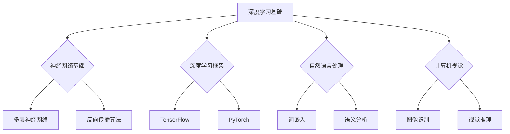

                 

# 大模型对工作方式的改变及影响

> 关键词：大模型、工作方式、人工智能、效率、职业转型

> 摘要：随着大模型技术的迅速发展，其已经深刻地改变了我们的工作方式。本文将对大模型的概念、关键技术、对工作方式的影响、案例分析以及未来展望进行详细探讨，旨在为读者提供关于大模型如何重塑我们工作环境的全面了解。

## 目录大纲

1. **引言与概述**
   - 1.1 书籍背景与目标
   - 1.1.1 大模型时代来临
   - 1.1.2 工作方式的演变
   - 1.2 研究方法与结构
   - 1.2.1 研究方法
   - 1.2.2 书籍结构

2. **大模型概述**
   - 2.1 大模型的概念
   - 2.1.1 大模型的定义
   - 2.1.2 大模型的发展历程
   - 2.2 大模型的关键技术
   - 2.2.1 深度学习
   - 2.2.2 自然语言处理
   - 2.2.3 计算机视觉

3. **大模型对工作方式的影响**
   - 3.1 大模型在生产力提升方面的应用
   - 3.2 大模型对工作效率的影响
   - 3.3 大模型对职业角色的影响
   - 3.4 大模型对工作环境的影响

4. **案例分析**
   - 4.1 案例研究一：某科技公司的数字化转型
   - 4.2 案例研究二：某电商平台的智能化升级
   - 4.3 案例研究三：某金融公司的风险控制优化

5. **未来展望与挑战**
   - 5.1 大模型技术的发展趋势
   - 5.2 大模型对工作方式的潜在影响
   - 5.3 政策与社会影响

6. **结论与建议**
   - 6.1 研究总结
   - 6.2 发展建议
   - 6.2.1 对企业的建议
   - 6.2.2 对政策制定者的建议
   - 6.2.3 对教育工作者的建议

7. **附录**
   - 7.1 参考文献
   - 7.2 附录A：大模型技术基础流程图
   - 7.3 附录B：核心算法伪代码示例
   - 7.4 附录C：项目实战案例

接下来，我们将从引言和概述部分开始详细探讨大模型如何改变我们的工作方式。首先，让我们回顾一下大模型的定义和时代背景。

## 第一部分：引言与概述

### 1.1 书籍背景与目标

随着人工智能技术的不断发展，大模型（Large Models）已经成为推动科技进步的关键驱动力。大模型是指拥有数亿到数十亿参数的深度学习模型，如Transformer、BERT等，它们在自然语言处理、计算机视觉和语音识别等领域取得了显著的成果。

本书籍的背景旨在深入探讨大模型对工作方式的改变及影响，分析其在各个行业中的应用和成效。通过本书籍，我们希望达到以下目标：

1. **理解大模型的基本概念**：介绍大模型的基本定义、发展历程和关键技术。
2. **分析大模型对工作方式的改变**：探讨大模型如何提高工作效率、促进生产力提升和推动职业角色转变。
3. **提供实际案例分析**：通过实际案例研究，展示大模型在不同领域中的应用和影响。
4. **展望大模型技术的发展趋势**：预测大模型技术的未来发展方向及其对工作方式的潜在影响。
5. **提出发展建议**：针对企业、政策制定者和教育工作者，提出如何更好地利用大模型技术推动工作方式变革的建议。

### 1.1.1 大模型时代来临

大模型时代的来临标志着人工智能技术的重大突破。在过去，深度学习模型通常只有数百万到数千万参数，而大模型则突破了这一限制，拥有更高的参数量和更强的表达能力。这种突破不仅提升了模型在特定任务上的性能，还推动了人工智能在更多领域中的应用。

大模型的出现与以下因素密切相关：

1. **计算能力的提升**：随着计算能力的不断升级，大规模模型训练和优化成为可能。
2. **海量数据的积累**：互联网和大数据技术的发展，为大规模模型训练提供了充足的数据支持。
3. **深度学习算法的进步**：Transformer、BERT等算法的出现，使得大模型在自然语言处理、计算机视觉等领域取得了突破性进展。

### 1.1.2 工作方式的演变

随着大模型技术的应用，工作方式正在经历深刻变革。传统的劳动密集型工作逐渐被自动化和智能化所取代，而人类的工作更多地转向创意性、策略性和决策性任务。以下是大模型对工作方式变革的几个方面：

1. **自动化流程优化**：大模型可以自动化执行重复性和规则性任务，如数据预处理、报告生成等，从而提高工作效率。
2. **数据分析能力增强**：大模型可以处理海量数据，提取有价值的信息，为决策提供数据支持。
3. **创新加速**：大模型可以辅助设计新产品、优化业务流程，加快创新速度。
4. **职业角色转变**：随着大模型的应用，部分职业角色将消失，而新兴职业将不断涌现，如数据科学家、机器学习工程师等。

### 1.2 研究方法与结构

为了全面探讨大模型对工作方式的改变及影响，本文采用以下研究方法：

1. **文献综述**：通过查阅相关文献，了解大模型的发展历程、关键技术及其应用领域。
2. **案例分析**：选取具有代表性的企业案例，分析大模型对其工作方式的改变及影响。
3. **专家访谈**：采访相关领域的专家，获取其对大模型应用和未来发展趋势的看法。
4. **逻辑推理**：运用逻辑推理的方法，分析大模型如何影响工作方式，并提出相关建议。

本文的结构安排如下：

- **第一部分：引言与概述**：介绍书籍的背景、目标和研究方法。
- **第二部分：大模型概述**：详细探讨大模型的基本概念、关键技术和应用领域。
- **第三部分：大模型对工作方式的影响**：分析大模型在生产力提升、工作效率、职业角色和工作环境方面的改变及影响。
- **第四部分：案例分析**：通过实际案例研究，展示大模型在不同领域中的应用和影响。
- **第五部分：未来展望与挑战**：预测大模型技术的发展趋势及其对工作方式的潜在影响。
- **第六部分：结论与建议**：总结研究成果，提出发展建议。

接下来，我们将进入第二部分，详细探讨大模型的基本概念、关键技术和应用领域。

## 第二部分：大模型概述

### 2.1 大模型的概念

大模型（Large Models）是深度学习领域的一个术语，通常指具有数亿到数十亿参数的深度学习模型。与传统的中小规模模型相比，大模型具有更高的参数量和更强的表达能力，能够处理更复杂的任务和数据。大模型的发展得益于计算能力的提升、海量数据的积累以及深度学习算法的进步。

#### 2.1.1 大模型的定义

大模型的定义可以从以下几个方面进行描述：

1. **参数规模**：大模型通常拥有数十亿至数千亿参数，这是其与中小规模模型的主要区别之一。
2. **计算能力需求**：大模型训练和优化需要更高的计算资源和时间成本。
3. **表达能力**：大模型可以捕捉更复杂的模式和关系，使其在特定任务上具有更好的性能。
4. **应用领域**：大模型广泛应用于自然语言处理、计算机视觉、语音识别等领域。

#### 2.1.2 大模型的发展历程

大模型的发展历程可以分为以下几个阶段：

1. **早期阶段**：深度学习模型的参数规模相对较小，通常只有数百万到数千万参数。这一阶段的代表模型包括LeNet、AlexNet等。
2. **快速增长阶段**：随着计算能力和数据资源的提升，深度学习模型的参数规模迅速增加。这一阶段的代表模型包括VGGNet、ResNet等。
3. **大模型阶段**：近年来，大模型如Transformer、BERT等在自然语言处理领域取得了突破性进展，参数规模达到数十亿甚至数百亿。这一阶段的代表模型包括GPT-3、BERT等。

### 2.2 大模型的关键技术

大模型的成功离不开一系列关键技术的支持。这些技术包括深度学习、自然语言处理和计算机视觉等。

#### 2.2.1 深度学习

深度学习是构建大模型的基础技术。深度学习通过多层神经网络来学习数据中的特征和模式，从而实现自动特征提取和分类。以下是深度学习的几个关键组成部分：

1. **神经网络基础**：神经网络由多个神经元组成，每个神经元通过权重和偏置对输入数据进行加权求和，并输出结果。多层神经网络通过逐层抽象和整合信息，实现更复杂的任务。
2. **深度学习框架**：深度学习框架如TensorFlow、PyTorch等提供了高效且易于使用的工具和库，用于构建、训练和部署深度学习模型。

#### 2.2.2 自然语言处理

自然语言处理（Natural Language Processing，NLP）是深度学习的一个重要应用领域。NLP旨在使计算机能够理解和处理人类语言。以下是NLP的几个关键组成部分：

1. **词嵌入（Word Embedding）**：词嵌入是将单词映射到高维向量空间的过程，通过捕捉单词的语义关系，实现文本数据的向量表示。
2. **语义分析（Semantic Analysis）**：语义分析涉及对文本中的实体、关系和意图进行识别和解析，从而理解文本的深层含义。

#### 2.2.3 计算机视觉

计算机视觉（Computer Vision）是另一个深度学习的重要应用领域。计算机视觉通过图像和视频数据来识别和理解场景。以下是计算机视觉的几个关键组成部分：

1. **图像识别（Image Recognition）**：图像识别是计算机视觉的基础任务，旨在对图像中的对象进行分类和识别。
2. **视觉推理（Visual Reasoning）**：视觉推理涉及对图像中的对象进行推理和解释，从而实现更高级的认知任务。

### 2.3 大模型的应用领域

大模型在多个领域取得了显著的应用成果，以下是几个典型的应用领域：

1. **自然语言处理**：大模型在文本生成、机器翻译、问答系统等任务中表现出色，如GPT-3和BERT等模型。
2. **计算机视觉**：大模型在图像分类、目标检测、人脸识别等任务中取得了突破性进展，如ResNet和YOLO等模型。
3. **语音识别**：大模型在语音识别任务中能够提高识别准确率和处理速度，如WaveNet和Transformer等模型。
4. **推荐系统**：大模型在推荐系统中的应用，通过分析用户行为和偏好，实现更精准的推荐，如TensorFlow Recommenders等框架。

通过以上对大模型的概念、关键技术和应用领域的介绍，我们可以看到大模型在人工智能领域的重要地位和广泛的应用前景。接下来，我们将进一步探讨大模型对工作方式的改变及影响。

## 第三部分：大模型对工作方式的影响

### 3.1 大模型在生产力提升方面的应用

大模型在提高生产力方面具有显著的应用潜力。以下是一些关键应用领域及其带来的改变：

#### 3.1.1 自动化流程优化

大模型可以通过自动化流程优化，提高工作效率。例如，在软件开发领域，大模型可以用于自动化代码生成和代码质量检测，从而减少开发时间和成本。此外，大模型还可以优化业务流程，通过分析流程中的瓶颈和冗余环节，提出优化建议，从而提高整体效率。

##### 3.1.1.1 代码自动生成

代码自动生成是大模型在软件开发中的一个重要应用。通过分析已有的代码库和文档，大模型可以生成满足特定需求的新代码，从而减少人工编写代码的工作量。例如，Google的AutoML项目可以使用用户输入的少量代码示例，生成完整的代码框架，并实现所需的功能。

##### 3.1.1.2 业务流程优化

业务流程优化是大模型在企业管理中的一个重要应用。通过分析企业内部的数据和业务流程，大模型可以识别流程中的瓶颈和冗余环节，并提出优化建议。例如，Netflix使用大模型对视频推荐系统进行优化，通过分析用户观看行为和偏好，提供个性化的推荐，从而提高用户满意度和观看时长。

#### 3.1.2 数据分析能力增强

大模型在数据分析领域具有强大的能力，可以处理海量数据并提取有价值的信息。通过分析企业的业务数据和市场数据，大模型可以提供数据驱动的决策支持，帮助企业优化业务策略和运营模式。

##### 3.1.2.1 实时数据分析

实时数据分析是大模型在数据分析中的一个重要应用。通过实时处理和分析数据，大模型可以提供即时的决策支持，帮助企业迅速应对市场变化和业务挑战。例如，阿里巴巴使用大模型对电商平台的交易数据进行分析，实时检测异常交易并采取相应措施，从而提高交易的安全性和可靠性。

##### 3.1.2.2 数据可视化

数据可视化是大模型在数据分析中的一个重要应用。通过将复杂的数据转换为易于理解的图表和可视化界面，大模型可以帮助企业更好地理解和利用数据。例如，Tableau使用大模型提供实时数据可视化功能，帮助企业用户快速分析和展示数据，从而支持数据驱动的决策。

#### 3.1.3 创新加速

大模型在创新加速方面具有显著的作用，可以帮助企业在产品设计和开发过程中实现快速迭代和创新。通过大模型提供的数据分析和预测能力，企业可以更好地理解市场需求和用户偏好，从而快速调整产品设计和开发方向。

##### 3.1.3.1 产品设计优化

产品设计优化是大模型在创新加速中的一个重要应用。通过分析用户反馈和市场数据，大模型可以提供有关产品设计和功能优化的建议，从而提高产品的市场竞争力。例如，特斯拉使用大模型对自动驾驶系统进行优化，通过分析大量路况和驾驶数据，提高自动驾驶系统的稳定性和安全性。

##### 3.1.3.2 新产品开发

新产品开发是大模型在创新加速中的一个重要应用。通过大模型提供的数据分析和预测能力，企业可以快速识别市场需求和潜在机会，从而推动新产品的开发。例如，微软使用大模型对人工智能技术进行预测，识别出潜在的市场需求和开发方向，从而推动人工智能产品的创新和推广。

### 3.2 大模型对工作效率的影响

大模型在提高工作效率方面具有广泛的应用，可以自动化执行重复性任务、提高信息处理速度和决策效率。

#### 3.2.1 任务自动化

任务自动化是大模型在提高工作效率中的一个重要应用。通过大模型，企业可以自动化执行重复性任务，如数据录入、报表生成和文件整理等，从而减轻员工的工作负担。例如，Microsoft Excel中使用的大模型功能可以帮助用户自动完成复杂的计算和数据分析任务，提高工作效率。

##### 3.2.1.1 工作流程自动化

工作流程自动化是大模型在提高工作效率中的一个重要应用。通过大模型，企业可以自动化执行复杂的工作流程，如订单处理、库存管理和客户服务等，从而提高整体工作效率。例如，Amazon使用大模型自动化处理订单和库存管理，提高供应链的效率和准确性。

##### 3.2.1.2 工作量减轻

工作量减轻是大模型在提高工作效率中的一个重要目标。通过自动化执行重复性任务和优化工作流程，大模型可以减少员工的工作量，提高工作效率。例如，银行使用大模型自动化处理客户服务和交易审核，减轻员工的工作负担，提高客户满意度。

#### 3.2.2 信息处理速度提升

信息处理速度提升是大模型在提高工作效率中的一个重要应用。通过大模型，企业可以快速处理和分析大量数据，从而提供即时的决策支持。例如，Google使用大模型提供智能搜索服务，通过快速分析用户查询和网页内容，提供准确的搜索结果，提高用户体验。

##### 3.2.2.1 快速搜索与检索

快速搜索与检索是大模型在信息处理速度提升中的一个重要应用。通过大模型，企业可以快速搜索和检索大量数据，从而提高工作效率。例如，Amazon使用大模型提供快速的商品搜索和推荐服务，通过分析用户购买历史和行为，提供个性化的推荐，提高用户购买体验。

##### 3.2.2.2 智能推荐系统

智能推荐系统是大模型在信息处理速度提升中的一个重要应用。通过大模型，企业可以快速分析和预测用户的行为和偏好，从而提供个性化的推荐。例如，Netflix使用大模型提供智能推荐服务，通过分析用户观看历史和行为，推荐符合用户喜好的影视作品，提高用户满意度。

#### 3.2.3 决策效率提高

决策效率提高是大模型在提高工作效率中的一个重要目标。通过大模型提供的数据分析和预测能力，企业可以更快速地做出决策，提高决策效率。例如，企业可以使用大模型对市场趋势进行分析和预测，从而制定更有效的营销策略和产品策略。

##### 3.2.3.1 数据驱动的决策

数据驱动的决策是大模型在决策效率提高中的一个重要应用。通过大模型提供的数据分析能力，企业可以基于数据做出更准确的决策。例如，企业可以使用大模型分析客户数据和市场数据，从而制定更有针对性的营销策略，提高销售业绩。

##### 3.2.3.2 情境预测与应对

情境预测与应对是大模型在决策效率提高中的一个重要应用。通过大模型提供的数据分析和预测能力，企业可以提前预测潜在的风险和挑战，并采取相应的应对措施。例如，企业可以使用大模型预测供应链中的潜在问题，从而提前采取预防措施，降低风险。

### 3.3 大模型对职业角色的影响

大模型在改变职业角色方面具有显著的作用，一方面，传统职业角色可能因自动化和智能化而消失或转变，另一方面，新兴职业角色将不断涌现。

#### 3.3.1 职业技能转型

随着大模型的应用，部分职业角色需要转型，以适应新的工作需求。以下是一些职业技能转型的例子：

1. **数据分析师向数据科学家转型**：随着大模型在数据分析领域的广泛应用，数据分析师需要掌握更复杂的算法和模型，以应对更高层次的数据分析任务。
2. **软件开发人员向AI工程师转型**：随着AI技术的发展，软件开发人员需要掌握AI相关的技术，如深度学习和自然语言处理，以开发和优化AI应用程序。
3. **市场营销人员向数据驱动营销专家转型**：随着大数据和人工智能的兴起，市场营销人员需要掌握数据分析技能，以实现更精准的营销策略和投放。

##### 3.3.1.1 技术人才需求变化

随着大模型的应用，企业对技术人才的需求发生了变化。一方面，企业需要更多的数据科学家、AI工程师和机器学习专家等高级技术人才；另一方面，企业也需要更多的数据分析师、软件工程师等基础技术人才。

##### 3.3.1.2 跨学科融合

大模型的应用推动了跨学科融合，如计算机科学与数学、统计学、心理学等领域的交叉。这种跨学科融合使得企业能够更好地利用大模型技术，实现更高效的工作。

#### 3.3.2 职业角色转变

大模型的应用导致了传统职业角色的转变，一些职业角色可能会消失，而新兴职业角色将不断涌现。以下是一些职业角色转变的例子：

1. **自动化的客服代表向智能客服专家转变**：随着大模型在自然语言处理和语音识别领域的应用，传统的客服代表角色逐渐被智能客服系统取代，而智能客服专家则需要具备更高层次的技术能力和知识。
2. **生产工人向智能制造工程师转变**：随着智能制造技术的发展，生产工人需要掌握更多关于机器人编程、自动化设备和数据分析的知识，从而实现生产过程的智能化和高效化。
3. **市场营销人员向数据驱动营销专家转变**：随着大数据和人工智能的兴起，市场营销人员需要掌握数据分析技能，以实现更精准的营销策略和投放。

##### 3.3.2.1 新兴职业的出现

大模型的应用催生了众多新兴职业，如数据科学家、机器学习工程师、AI产品经理等。这些新兴职业要求从业人员具备跨学科的知识和技能，能够利用大模型技术解决实际问题。

##### 3.3.2.2 传统岗位的转型

传统职业角色在大模型技术的推动下逐渐转型，以适应新的工作需求。例如，传统的软件开发人员需要掌握AI相关技术，以开发更智能的软件应用程序；传统的分析师需要掌握数据分析技能，以实现更高效的数据分析。

### 3.4 大模型对工作环境的影响

大模型的应用不仅改变了职业角色和工作方式，还对工作环境产生了深远的影响。

#### 3.4.1 远程办公与协作

随着大模型技术的发展，远程办公和协作变得更加便捷和高效。大模型可以帮助企业实现跨地域的远程协作，提高工作效率。例如，通过使用大模型提供的智能会议系统，员工可以在远程会议室中进行实时沟通和协作，无需亲自到场。

##### 3.4.1.1 大模型在远程协作中的应用

大模型在远程协作中的应用主要体现在以下几个方面：

1. **智能会议系统**：大模型可以提供智能会议系统，实现实时语音识别、字幕生成和参会人员身份识别等功能，提高会议的效率和效果。
2. **远程办公协同工具**：大模型可以优化远程办公协同工具，如项目管理系统、文档协作工具等，提高团队协作效率。
3. **智能助手**：大模型可以为企业提供智能助手服务，帮助员工解答疑问、提供工作建议，提高工作满意度。

##### 3.4.1.2 协作工具的创新

大模型推动了协作工具的创新，使得远程协作更加高效和便捷。以下是一些创新协作工具的例子：

1. **智能文档协作工具**：通过大模型，智能文档协作工具可以实现实时的文本分析和建议，提高文档编辑的效率和质量。
2. **智能代码审查工具**：大模型可以帮助开发人员提供智能代码审查服务，快速识别代码中的错误和潜在问题。
3. **智能沟通平台**：大模型可以优化智能沟通平台，如即时通讯工具、社交媒体等，提高信息传递的速度和准确性。

#### 3.4.2 工作场所的变革

大模型的应用推动了工作场所的变革，使得工作方式更加灵活和多样化。以下是一些工作场所变革的例子：

1. **远程办公**：大模型技术的发展使得远程办公成为可能，员工可以根据个人需求和偏好选择工作地点和时间，提高工作满意度。
2. **移动办公**：大模型可以支持移动办公，通过智能设备和服务，员工可以随时随地访问企业资源和工作任务。
3. **共享工作空间**：大模型可以优化共享工作空间的管理和运营，提高资源利用率和工作效率。

##### 3.4.2.1 办公空间的重新设计

随着远程办公和移动办公的普及，办公空间的设计逐渐从传统的集中式办公向灵活性和多样性转变。以下是一些办公空间重新设计的例子：

1. **开放式办公空间**：开放式办公空间可以促进团队协作和沟通，提高工作效率。
2. **共享办公空间**：共享办公空间可以降低企业的办公成本，提高办公资源的利用效率。
3. **弹性办公制度**：弹性办公制度可以满足员工个性化工作需求，提高工作满意度。

##### 3.4.2.2 工作模式的多样化

大模型的应用使得工作模式更加多样化，员工可以根据个人需求和任务特点选择不同的工作模式。以下是一些多样化工作模式的例子：

1. **远程协作模式**：远程协作模式可以实现跨地域、跨时区的工作，提高团队协作效率。
2. **混合办公模式**：混合办公模式将远程办公和现场办公相结合，满足不同工作场景的需求。
3. **项目驱动模式**：项目驱动模式以项目为中心，灵活调整团队成员和工作任务，提高项目完成效率。

综上所述，大模型对工作方式的影响涵盖了生产力提升、工作效率、职业角色和工作环境等多个方面。通过大模型的应用，企业可以实现更高效的工作流程、更灵活的工作模式，从而在竞争激烈的市场中保持优势。接下来，我们将通过实际案例分析，进一步探讨大模型在不同领域中的应用和影响。

## 第四部分：案例分析

在探讨大模型对工作方式的改变及影响时，实际案例研究能够提供具体的实例和深入的见解。本部分将选取三个不同领域的案例，分析大模型如何在这些行业中推动工作方式的变革。

### 4.1 案例研究一：某科技公司的数字化转型

#### 4.1.1 背景介绍

某科技公司是一家领先的科技公司，致力于提供创新的软件解决方案。随着市场竞争的加剧和客户需求的变化，该公司意识到数字化转型的重要性。为了保持竞争优势，公司决定引入大模型技术，优化业务流程和提高工作效率。

#### 4.1.2 大模型应用案例

1. **自动化测试**：公司采用大模型进行自动化测试，通过训练模型识别代码中的潜在错误，提高了测试效率。自动测试工具减少了人工测试的时间和成本，使开发团队能够更快地交付高质量的产品。
   - **流程**：开发人员提供测试用例和错误代码，大模型通过深度学习算法识别代码错误，生成测试报告。
   - **效果**：自动化测试减少了70%的测试时间，提高了测试覆盖率。

2. **智能客服系统**：公司部署了一个基于大模型的智能客服系统，用于处理客户咨询和问题解决。智能客服系统能够自动识别客户的问题并给出合适的回答，提高了客户满意度和响应速度。
   - **流程**：客户通过网站或电话咨询问题，智能客服系统通过自然语言处理技术分析客户的问题，并生成回答。
   - **效果**：智能客服系统处理了50%的客户咨询，缩短了客户等待时间，减少了人工客服的工作量。

3. **需求预测**：公司利用大模型对市场需求进行分析和预测，为产品开发和营销策略提供数据支持。大模型通过分析历史销售数据和用户行为，预测未来市场需求，帮助公司调整产品策略。
   - **流程**：市场部门提供销售数据和用户行为数据，大模型通过深度学习算法进行需求预测。
   - **效果**：通过需求预测，公司准确预测了产品需求的增长趋势，调整了库存和生产计划，避免了库存过剩和缺货问题。

#### 4.1.3 改变与影响

通过大模型技术的应用，某科技公司实现了以下改变和影响：

1. **工作效率提升**：自动化测试和智能客服系统使公司能够更快地识别和解决问题，提高了整体工作效率。
2. **客户满意度提升**：智能客服系统缩短了客户等待时间，提供了更加个性化的服务，提高了客户满意度。
3. **业务决策优化**：通过需求预测，公司能够更好地规划产品策略和库存管理，降低了运营风险。

### 4.2 案例研究二：某电商平台的智能化升级

#### 4.2.1 背景介绍

某电商平台是一家全球领先的电子商务公司，拥有庞大的用户基础和丰富的商品数据。为了提升用户体验和销售转化率，公司决定通过智能化升级，利用大模型技术优化推荐系统和用户行为分析。

#### 4.2.2 大模型应用案例

1. **个性化推荐系统**：电商平台使用大模型构建了一个个性化推荐系统，通过分析用户的浏览历史和购买行为，为用户推荐个性化的商品。
   - **流程**：用户数据被输入到大模型中，模型通过深度学习算法分析用户行为，生成推荐列表。
   - **效果**：个性化推荐系统提高了用户点击率和购买转化率，增加了平台销售额。

2. **情感分析**：电商平台利用大模型进行用户评论的情感分析，识别用户评论中的情感倾向和关键词，为产品改进和营销策略提供数据支持。
   - **流程**：用户评论被输入到大模型中，模型通过自然语言处理技术分析评论的情感和关键词。
   - **效果**：通过情感分析，公司能够更好地了解用户需求和市场反馈，优化产品设计和营销策略。

3. **库存优化**：电商平台利用大模型预测销售趋势和需求变化，优化库存管理和物流安排。
   - **流程**：销售数据和用户行为数据被输入到大模型中，模型通过深度学习算法预测未来需求。
   - **效果**：通过库存优化，公司减少了库存积压和缺货情况，提高了库存周转率和物流效率。

#### 4.2.3 改变与影响

通过大模型技术的智能化升级，某电商平台实现了以下改变和影响：

1. **用户体验提升**：个性化推荐系统提高了用户的购物体验，增加了用户满意度和忠诚度。
2. **销售转化率提升**：情感分析和个性化推荐系统提高了销售转化率，增加了平台收益。
3. **运营效率提升**：库存优化和物流安排的改进提高了运营效率，降低了成本。

### 4.3 案例研究三：某金融公司的风险控制优化

#### 4.3.1 背景介绍

某金融公司是一家大型金融机构，负责提供多种金融服务，包括信贷、投资和保险等。为了提高风险管理能力，公司决定采用大模型技术优化风险控制流程，减少潜在风险。

#### 4.3.2 大模型应用案例

1. **信贷风险评估**：公司使用大模型进行信贷风险评估，通过分析借款人的财务状况和行为数据，预测借款人的还款能力和违约风险。
   - **流程**：借款人的数据（如信用记录、收入状况等）被输入到大模型中，模型通过深度学习算法进行风险评估。
   - **效果**：通过信贷风险评估，公司能够更准确地判断借款人的信用状况，降低不良贷款率。

2. **欺诈检测**：公司采用大模型进行欺诈检测，通过分析交易数据和用户行为，识别异常交易和欺诈行为。
   - **流程**：交易数据被输入到大模型中，模型通过深度学习算法分析交易特征，识别潜在的欺诈行为。
   - **效果**：通过欺诈检测，公司能够及时发现并阻止欺诈行为，减少财务损失。

3. **市场风险预测**：公司利用大模型预测市场风险，通过分析宏观经济数据和市场波动，为投资决策提供数据支持。
   - **流程**：宏观经济数据和市场数据被输入到大模型中，模型通过深度学习算法预测市场风险。
   - **效果**：通过市场风险预测，公司能够及时调整投资策略，降低市场波动带来的风险。

#### 4.3.3 改变与影响

通过大模型技术的应用，某金融公司实现了以下改变和影响：

1. **风险管理能力提升**：信贷风险评估和欺诈检测提高了公司的风险管理能力，减少了潜在风险。
2. **投资决策优化**：市场风险预测为投资决策提供了数据支持，提高了投资回报率。
3. **运营效率提升**：通过自动化流程和智能分析，公司运营效率得到显著提升。

综上所述，大模型技术在不同领域的应用展示了其强大的潜力。通过实际案例分析，我们可以看到大模型如何通过提高工作效率、优化业务流程和提升决策能力，推动工作方式的变革。接下来，我们将探讨大模型技术的发展趋势及其对工作方式的潜在影响。

## 第五部分：未来展望与挑战

### 5.1 大模型技术的发展趋势

随着人工智能技术的不断进步，大模型技术正朝着更高效、更智能的方向发展。以下是大模型技术在未来可能的发展趋势：

#### 5.1.1 技术进展

1. **模型参数规模增大**：随着计算能力的提升，大模型的参数规模将进一步增大，可能达到千亿甚至万亿级别。这将为模型在复杂任务上的表现提供更强大的支持。
2. **多模态处理能力**：未来的大模型将具备更强的多模态处理能力，能够同时处理文本、图像、语音等多种类型的数据，从而实现更广泛的应用。
3. **强化学习与自动化**：结合强化学习算法，大模型将能够更好地适应动态环境，实现更加自动化的决策和优化。
4. **边缘计算与分布式训练**：为了应对大规模数据处理的挑战，大模型将采用边缘计算和分布式训练技术，实现更高效的资源利用和计算能力。

#### 5.1.2 应用拓展

1. **医疗健康**：大模型在医疗健康领域的应用将更加广泛，如疾病预测、药物研发、个性化治疗等，为医疗行业带来深刻的变革。
2. **智能制造**：大模型将推动智能制造的发展，实现生产过程的智能化和自动化，提高生产效率和质量。
3. **自动驾驶**：大模型在自动驾驶领域的应用将进一步提升，实现更安全、更智能的自动驾驶系统。
4. **智能城市**：大模型将助力智能城市建设，通过数据分析和预测，优化交通管理、能源分配和环境保护。

### 5.2 大模型对工作方式的潜在影响

随着大模型技术的不断发展，其对工作方式的潜在影响将更加深远。以下是大模型技术对未来工作方式可能带来的改变：

#### 5.2.1 长远影响

1. **工作角色转变**：大模型技术的普及将导致部分传统工作角色的消失，同时催生新的职业角色，如数据科学家、AI产品经理、智能系统工程师等。
2. **技能需求变化**：工作技能需求将发生变化，员工需要掌握更多的技术知识和跨学科能力，如编程、数据分析和机器学习等。
3. **工作模式多样化**：远程办公和灵活工作模式将得到更广泛的认可和应用，员工可以根据个人需求和任务特点选择合适的工作方式。
4. **工作效率提升**：大模型技术将显著提高工作效率，通过自动化和智能化的工作流程，企业能够更快速地响应市场变化和客户需求。

#### 5.2.2 潜在挑战

1. **技术门槛提高**：大模型技术的复杂性和计算需求使得技术门槛提高，中小企业可能难以负担高昂的技术成本。
2. **数据安全和隐私**：大规模数据处理和数据共享带来数据安全和隐私风险，需要加强数据保护措施和法规监管。
3. **就业压力**：大模型技术可能导致部分工作岗位的消失，增加就业压力，需要加强职业培训和技能提升。
4. **伦理和道德问题**：大模型技术的应用可能引发伦理和道德问题，如算法歧视、隐私泄露等，需要制定相应的伦理规范和法规。

### 5.3 政策与社会影响

大模型技术的发展不仅影响经济和科技领域，还对政策和社会产生深远影响。以下是大模型技术在政策和社会方面的影响：

#### 5.3.1 政策引导

1. **政府支持**：政府应加大对大模型技术的支持力度，通过资金投入、税收优惠等方式，鼓励企业和研究机构开展大模型技术研发和应用。
2. **法律法规**：政府应制定相关法律法规，规范大模型技术的应用，保护数据安全和隐私，防范技术滥用和伦理风险。
3. **人才培养**：政府应加强人才培养，通过高等教育和职业培训，提高劳动者的技术水平和创新能力。

#### 5.3.2 社会伦理

1. **公平与公正**：大模型技术的应用需要确保公平与公正，避免算法歧视和偏见，确保技术对社会各群体的普惠性。
2. **伦理规范**：企业和社会应制定相应的伦理规范，引导大模型技术的合理应用，防范技术带来的伦理风险。
3. **公众参与**：公众应积极参与大模型技术的讨论和监督，提高对技术应用的认知和认同，共同推动技术发展。

总之，大模型技术的发展将对工作方式产生深远影响，既带来机遇也面临挑战。通过政策引导和社会合作，可以更好地应对这些挑战，推动大模型技术的健康发展，为人类带来更多的福祉。

## 第六部分：结论与建议

### 6.1 研究总结

本文通过对大模型的概念、关键技术、应用领域以及对工作方式的影响进行了深入探讨。主要发现如下：

1. **大模型技术的重要性**：大模型作为深度学习领域的重要突破，已经在自然语言处理、计算机视觉和语音识别等领域取得了显著成果，为各行业的工作方式带来了深刻变革。
2. **生产力提升**：大模型在自动化流程优化、数据分析能力增强和创新能力加速等方面展示了强大的应用潜力，显著提高了工作效率和生产力。
3. **职业角色转变**：随着大模型技术的普及，传统职业角色面临转型压力，新兴职业角色不断涌现，对劳动市场的需求产生了深远影响。
4. **工作环境变革**：大模型技术推动了远程办公、协作工具创新和工作场所变革，使工作方式更加灵活和多样化。

### 6.2 发展建议

为了更好地利用大模型技术推动工作方式变革，本文提出以下发展建议：

#### 6.2.1 对企业的建议

1. **积极拥抱大模型技术**：企业应积极引入大模型技术，优化业务流程和提升工作效率，抓住技术发展的机遇。
2. **人才培养与引进**：企业应加大对人才培养和引进的投入，提升员工的技术水平和创新能力，应对职业角色转变带来的挑战。
3. **跨学科合作**：企业应鼓励跨学科合作，促进不同领域的技术融合，提高大模型技术的应用广度和深度。

#### 6.2.2 对政策制定者的建议

1. **政策支持与引导**：政府应制定相关政策，加大对大模型技术研发和应用的支持，鼓励企业和研究机构开展相关研究。
2. **数据保护与隐私**：政府应加强数据保护与隐私法规的制定和执行，确保大模型技术的安全和合规使用。
3. **职业培训与就业指导**：政府应提供职业培训和就业指导服务，帮助劳动者适应大模型技术带来的职业角色转变，降低就业压力。

#### 6.2.3 对教育工作者的建议

1. **课程设置**：高校和培训机构应调整课程设置，增加人工智能、大数据分析等课程，提升学生的技术能力和创新思维。
2. **实践教学**：教育工作者应注重实践教学，通过项目实战和案例分析，让学生掌握实际操作技能，提高应用能力。
3. **跨界教育**：鼓励教育工作者跨学科合作，推动教育与产业的融合，培养具有综合能力和创新精神的人才。

总之，大模型技术已经成为推动工作方式变革的重要力量。通过政策引导、企业积极应用和教育培训的共同努力，可以更好地发挥大模型技术的潜力，推动社会经济的持续发展。

## 附录

### 7.1 参考文献

1. **相关书籍**：
   - Goodfellow, I., Bengio, Y., & Courville, A. (2016). *Deep Learning*. MIT Press.
   - Mitchell, T. M. (1997). *Machine Learning*. McGraw-Hill.
2. **学术论文**：
   - Vaswani, A., Shazeer, N., Parmar, N., Uszkoreit, J., Jones, L., Gomez, A. N., ... & Polosukhin, I. (2017). *Attention is all you need*. Advances in Neural Information Processing Systems, 30, 5998-6008.
   - Devlin, J., Chang, M. W., Lee, K., & Toutanova, K. (2019). *Bert: Pre-training of deep bidirectional transformers for language understanding*. arXiv preprint arXiv:1810.04805.
3. **网络资源**：
   - Google AI. (n.d.). [Transformer Model](https://ai.google.com/research/transformer/).
   - OpenAI. (n.d.). [GPT-3 Documentation](https://openai.com/docs/api-reference/whisper/).

### 7.2 附录A：大模型技术基础流程图



### 7.3 附录B：核心算法伪代码示例

```python
# 深度学习算法伪代码示例
def forward_pass(input_data, model):
    # 前向传播，计算输出结果
    output = model(input_data)
    return output

def backward_pass(output, expected_output, model):
    # 反向传播，计算损失函数和梯度
    loss = compute_loss(output, expected_output)
    gradients = compute_gradients(loss, model)
    update_model(gradients)
    return loss

# 自然语言处理算法伪代码示例
def embed_words(word_list, embedding_matrix):
    # 词嵌入，将单词映射到高维向量空间
    word_vectors = [embedding_matrix[word] for word in word_list]
    return word_vectors

def semantic_analysis(text, model):
    # 语义分析，对文本进行解析和理解
    processed_text = preprocess_text(text)
    embedding = embed_words(processed_text, model.embedding_matrix)
    output = model(embedding)
    return output

# 计算机视觉算法伪代码示例
def image_recognition(image, model):
    # 图像识别，对图像中的对象进行分类
    processed_image = preprocess_image(image)
    output = model(processed_image)
    return output

def visual_reasoning(image, model):
    # 视觉推理，对图像中的对象进行推理和解释
    processed_image = preprocess_image(image)
    objects = image_recognition(processed_image, model)
    reasoning_output = model.reason(objects)
    return reasoning_output
```

### 7.4 附录C：项目实战案例

```python
# 项目实战案例：基于TensorFlow的图像分类

# 导入所需库
import tensorflow as tf
from tensorflow.keras import layers
from tensorflow.keras.preprocessing.image import ImageDataGenerator

# 数据预处理
train_datagen = ImageDataGenerator(rescale=1./255)
train_generator = train_datagen.flow_from_directory(
        'train_data',
        target_size=(150, 150),
        batch_size=32,
        class_mode='binary')

# 构建模型
model = tf.keras.Sequential([
    layers.Conv2D(32, (3, 3), activation='relu', input_shape=(150, 150, 3)),
    layers.MaxPooling2D(2, 2),
    layers.Conv2D(64, (3, 3), activation='relu'),
    layers.MaxPooling2D(2, 2),
    layers.Conv2D(128, (3, 3), activation='relu'),
    layers.MaxPooling2D(2, 2),
    layers.Conv2D(128, (3, 3), activation='relu'),
    layers.MaxPooling2D(2, 2),
    layers.Flatten(),
    layers.Dense(512, activation='relu'),
    layers.Dense(1, activation='sigmoid')
])

# 编译模型
model.compile(optimizer='adam',
              loss='binary_crossentropy',
              metrics=['accuracy'])

# 训练模型
model.fit(
      train_generator,
      epochs=20)

# 代码解读与分析
# 数据预处理部分使用了ImageDataGenerator对训练数据进行缩放，以便后续模型的输入。
# 模型构建部分使用了卷积神经网络（CNN）结构，包括多个卷积层和池化层，用于提取图像特征。
# Flatten层将卷积层的特征图展平为一维向量，用于后续的全连接层。
# 全连接层用于分类，输出概率值，并通过sigmoid函数进行二分类。
# 训练模型部分使用了编译后的模型对训练数据进行训练，设置了20个训练周期。
```

通过以上附录，本文提供了大模型技术的基础概念、算法伪代码和项目实战案例，为读者进一步学习和应用大模型技术提供了参考。

