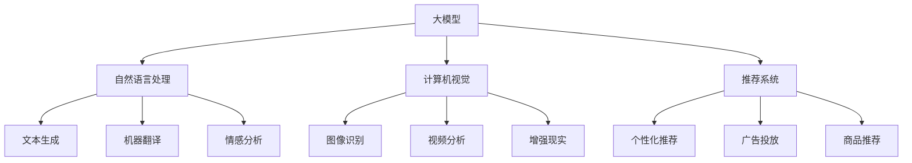

                 

# 《大模型应用场景不断拓展，创业者发掘新增长点》

## 关键词

大模型、自然语言处理、计算机视觉、推荐系统、创业机会、技术演进

### 摘要

随着人工智能技术的飞速发展，大模型（Large Models）逐渐成为各行业应用的核心驱动力。本文将探讨大模型的基本概念、技术架构及其在多个领域中的应用，分析大模型为创业者带来的新增长点。通过成功与失败案例的解析，本文旨在为创业者提供有价值的参考和启示，助力其在技术创新和市场开拓中取得成功。

---

### 目录大纲

# 《大模型应用场景不断拓展，创业者发掘新增长点》

## 第一部分：大模型概述

### 第1章：大模型的概念与价值
#### 1.1 大模型的基本概念
#### 1.2 大模型的技术背景
#### 1.3 大模型的应用价值

### 第2章：大模型的技术架构
#### 2.1 大模型的组成结构
#### 2.2 大模型的训练与优化
#### 2.3 大模型的技术演进

## 第二部分：大模型的应用场景

### 第3章：大模型在自然语言处理中的应用
#### 3.1 大模型在文本生成中的应用
#### 3.2 大模型在机器翻译中的应用
#### 3.3 大模型在情感分析中的应用

### 第4章：大模型在计算机视觉中的应用
#### 4.1 大模型在图像识别中的应用
#### 4.2 大模型在视频分析中的应用
#### 4.3 大模型在增强现实中的应用

### 第5章：大模型在推荐系统中的应用
#### 5.1 大模型在个性化推荐中的应用
#### 5.2 大模型在广告投放中的应用
#### 5.3 大模型在商品推荐中的应用

## 第三部分：大模型创业机会分析

### 第6章：大模型创业的可行性分析
#### 6.1 创业者面临的挑战
#### 6.2 创业机会的识别
#### 6.3 创业项目的规划

### 第7章：大模型创业案例分析
#### 7.1 成功案例解析
#### 7.2 失败案例反思
#### 7.3 案例启示与借鉴

## 第四部分：大模型应用的未来展望

### 第8章：大模型应用的未来发展趋势
#### 8.1 技术演进趋势
#### 8.2 应用场景拓展
#### 8.3 社会影响与伦理挑战

### 第9章：大模型应用的发展策略
#### 9.1 政策与市场环境分析
#### 9.2 企业发展策略建议
#### 9.3 技术创新与商业模式的融合

## 附录

### 附录 A：大模型应用工具与资源
#### A.1 开源框架与应用工具
#### A.2 大模型学习资源
#### A.3 大模型社区与论坛

### 附录 B：大模型应用案例汇编
#### B.1 自然语言处理案例
#### B.2 计算机视觉案例
#### B.3 推荐系统案例
#### B.4 其他应用领域案例

---

**Mermaid 流程图**

---

### 第一部分：大模型概述

### 第1章：大模型的概念与价值

#### 1.1 大模型的基本概念

大模型（Large Models）是指那些拥有数百万甚至数十亿参数的深度学习模型。这些模型通过对海量数据的训练，能够实现高效的数据处理和复杂的任务执行。与传统的中小型模型相比，大模型在处理复杂问题和生成高质量结果方面具有显著优势。

#### 1.2 大模型的技术背景

大模型的发展离不开深度学习技术的进步。深度学习（Deep Learning）是人工智能（Artificial Intelligence, AI）的一个重要分支，通过多层神经网络（Neural Networks）模拟人类大脑的思考过程，实现从数据中自动提取特征、进行分类和预测等功能。

近年来，随着计算能力的提升和大数据技术的普及，大模型的研究和应用得到了广泛关注。特别是2018年，Google推出了Transformer模型，开启了大模型研究的新篇章。此后，OpenAI的GPT系列模型、DeepMind的BERT模型等大模型相继涌现，进一步推动了人工智能技术的发展。

#### 1.3 大模型的应用价值

大模型在多个领域展现出了巨大的应用价值。以下是其主要应用价值：

1. **高效的数据处理能力**：大模型能够快速处理海量数据，提高数据处理效率，降低计算成本。

2. **生成高质量结果**：大模型通过训练学习到丰富的特征，能够生成更准确、更符合人类预期的结果。

3. **适应多种任务场景**：大模型具有较强的泛化能力，能够适应不同的任务场景，实现跨领域的应用。

4. **推动人工智能发展**：大模型的研究和应用推动了人工智能技术的进步，为各个行业带来了新的发展机遇。

### 第2章：大模型的技术架构

#### 2.1 大模型的组成结构

大模型的组成结构主要包括以下几个部分：

1. **输入层**：接收外部输入数据，如文本、图像、声音等。

2. **隐藏层**：通过多层神经网络对输入数据进行特征提取和变换。

3. **输出层**：根据隐藏层的输出结果进行分类、预测或生成。

4. **参数**：大模型的核心部分，包括权重（weights）和偏置（biases），用于调整模型的行为。

#### 2.2 大模型的训练与优化

大模型的训练与优化过程主要包括以下几个步骤：

1. **数据预处理**：将原始数据转化为适合模型处理的形式，如归一化、标准化等。

2. **模型初始化**：随机初始化模型参数，以避免模型在训练过程中陷入局部最优。

3. **前向传播**：将输入数据传递到模型中，计算输出结果。

4. **损失函数计算**：计算预测结果与真实结果之间的差距，通常使用交叉熵（Cross-Entropy）作为损失函数。

5. **反向传播**：通过反向传播算法更新模型参数，以减少损失函数。

6. **优化算法**：使用优化算法（如随机梯度下降SGD、Adam等）加速模型训练。

7. **评估与调整**：使用验证集对模型进行评估，根据评估结果调整模型参数，优化模型性能。

#### 2.3 大模型的技术演进

大模型的技术演进主要表现在以下几个方面：

1. **模型架构**：从传统的卷积神经网络（CNN）到循环神经网络（RNN），再到自注意力机制（Self-Attention）和Transformer模型，模型架构不断优化。

2. **参数规模**：从数百万参数到数十亿参数，大模型的参数规模不断扩大。

3. **计算能力**：随着计算能力的提升，大模型的训练和推理速度得到显著提高。

4. **数据质量**：高质量的训练数据有助于提升大模型的表现，因此数据质量和数据清洗技术也得到了广泛关注。

### 第二部分：大模型的应用场景

大模型在自然语言处理、计算机视觉、推荐系统等多个领域都取得了显著的应用成果。以下将分别介绍大模型在这些领域的应用场景。

#### 第3章：大模型在自然语言处理中的应用

自然语言处理（Natural Language Processing, NLP）是人工智能领域的一个重要分支，主要研究如何让计算机理解和处理自然语言。大模型在NLP领域具有广泛的应用场景，以下将介绍大模型在文本生成、机器翻译和情感分析等领域的应用。

##### 3.1 大模型在文本生成中的应用

文本生成是指利用模型生成符合语法和语义规则的文本。大模型在文本生成领域具有显著优势，能够生成高质量、多样化的文本。以下是大模型在文本生成中的应用场景：

1. **自动写作**：大模型可以自动生成文章、报告、博客等文本内容，节省人力成本。

2. **对话系统**：大模型可以用于构建聊天机器人、虚拟助手等对话系统，实现与用户的自然互动。

3. **内容推荐**：大模型可以根据用户的历史行为和兴趣生成个性化内容推荐。

##### 3.2 大模型在机器翻译中的应用

机器翻译是指将一种自然语言翻译成另一种自然语言。大模型在机器翻译领域具有出色的性能，能够实现高质量、流畅的翻译结果。以下是大模型在机器翻译中的应用场景：

1. **跨语言交流**：大模型可以用于实现不同语言之间的实时翻译，促进跨文化交流。

2. **内容国际化**：大模型可以帮助企业将产品、服务等内容翻译成多种语言，拓展国际市场。

3. **教育领域**：大模型可以用于辅助学习外语，提供实时翻译和语音输入等功能。

##### 3.3 大模型在情感分析中的应用

情感分析是指通过分析文本中的情感倾向，判断用户的情感状态。大模型在情感分析领域具有强大的能力，能够实现高效的情感识别和分类。以下是大模型在情感分析中的应用场景：

1. **舆情监测**：大模型可以用于实时监测网络舆情，分析公众对特定事件、产品的情感倾向。

2. **客户反馈分析**：大模型可以分析客户的反馈意见，为企业提供改进产品和服务的建议。

3. **情感计算**：大模型可以应用于情感计算领域，实现情感识别、情感交互等功能。

#### 第4章：大模型在计算机视觉中的应用

计算机视觉（Computer Vision）是人工智能领域的一个重要分支，主要研究如何使计算机具有类似人类的视觉感知能力。大模型在计算机视觉领域具有广泛的应用，以下将介绍大模型在图像识别、视频分析和增强现实等领域的应用。

##### 4.1 大模型在图像识别中的应用

图像识别是指通过模型对图像中的物体、场景进行分类和识别。大模型在图像识别领域具有出色的性能，能够实现高效、准确的图像识别。以下是大模型在图像识别中的应用场景：

1. **安防监控**：大模型可以用于安防监控领域，实现实时人脸识别、行为分析等功能。

2. **医疗影像分析**：大模型可以用于医疗影像分析，帮助医生进行疾病诊断和病情评估。

3. **自动驾驶**：大模型可以用于自动驾驶领域，实现车辆识别、车道线检测等功能。

##### 4.2 大模型在视频分析中的应用

视频分析是指通过模型对视频中的物体、动作进行识别和分析。大模型在视频分析领域具有强大的能力，能够实现高效的视频识别和分类。以下是大模型在视频分析中的应用场景：

1. **智能监控**：大模型可以用于智能监控领域，实现实时目标检测、追踪等功能。

2. **运动分析**：大模型可以用于运动分析领域，实现运动轨迹识别、动作识别等功能。

3. **交通管理**：大模型可以用于交通管理领域，实现交通流量分析、交通事故预警等功能。

##### 4.3 大模型在增强现实中的应用

增强现实（Augmented Reality, AR）是指通过计算机生成虚拟信息，叠加到真实环境中，增强用户的感知和交互体验。大模型在增强现实领域具有广泛的应用，以下是大模型在增强现实中的应用场景：

1. **娱乐体验**：大模型可以用于增强现实游戏、虚拟现实（VR）等领域，提供更加沉浸式的娱乐体验。

2. **教育培训**：大模型可以用于教育培训领域，实现虚拟课堂、交互式学习等功能。

3. **远程协作**：大模型可以用于远程协作领域，实现虚拟会议、远程操作等功能。

#### 第5章：大模型在推荐系统中的应用

推荐系统（Recommender System）是指通过分析用户的历史行为和偏好，为用户推荐感兴趣的商品、内容等。大模型在推荐系统领域具有显著的优势，能够实现高效、准确的推荐。以下是大模型在个性化推荐、广告投放和商品推荐等领域的应用。

##### 5.1 大模型在个性化推荐中的应用

个性化推荐是指根据用户的历史行为和偏好，为用户推荐个性化的商品、内容等。大模型在个性化推荐领域具有出色的性能，能够实现高效、准确的推荐。以下是大模型在个性化推荐中的应用场景：

1. **电商推荐**：大模型可以用于电商平台，为用户推荐个性化商品，提升用户购买体验。

2. **内容推荐**：大模型可以用于内容平台，为用户推荐个性化内容，提高用户粘性。

3. **音乐推荐**：大模型可以用于音乐平台，为用户推荐个性化音乐，提升用户体验。

##### 5.2 大模型在广告投放中的应用

广告投放是指通过投放广告，吸引用户关注并产生购买行为。大模型在广告投放领域具有显著的优势，能够实现高效、精准的广告投放。以下是大模型在广告投放中的应用场景：

1. **搜索引擎广告**：大模型可以用于搜索引擎广告，根据用户搜索关键词为用户推荐相关的广告。

2. **社交媒体广告**：大模型可以用于社交媒体广告，根据用户社交行为和偏好为用户推荐相关的广告。

3. **视频广告**：大模型可以用于视频广告，根据用户观看行为和偏好为用户推荐相关的广告。

##### 5.3 大模型在商品推荐中的应用

商品推荐是指为用户推荐符合其兴趣和需求的商品。大模型在商品推荐领域具有出色的性能，能够实现高效、准确的商品推荐。以下是大模型在商品推荐中的应用场景：

1. **电商平台**：大模型可以用于电商平台，为用户推荐符合其兴趣和需求的商品。

2. **超市购物**：大模型可以用于超市购物，为用户推荐符合其购买习惯的商品。

3. **跨境购物**：大模型可以用于跨境购物，为用户推荐符合其兴趣和需求的国际商品。

### 第三部分：大模型创业机会分析

随着大模型技术的不断发展，越来越多的创业者看到了其中的巨大商机。以下将分析大模型创业的可行性，以及创业者如何识别和把握这些机会。

#### 第6章：大模型创业的可行性分析

##### 6.1 创业者面临的挑战

1. **技术门槛**：大模型技术的研发和应用具有较高的技术门槛，需要创业者具备深厚的计算机科学和人工智能背景。

2. **数据质量**：大模型的应用效果很大程度上取决于训练数据的质量，创业者需要投入大量资源收集和清洗高质量的数据。

3. **计算资源**：大模型的训练和推理需要大量的计算资源，创业者需要具备足够的计算能力来支撑模型的训练和部署。

4. **市场竞争**：大模型领域竞争激烈，创业者需要具备独特的创新能力和竞争优势，以在市场中脱颖而出。

##### 6.2 创业机会的识别

1. **垂直行业应用**：针对特定行业的需求，开发定制化的大模型应用，如医疗、金融、教育等。

2. **跨领域融合**：将大模型与其他技术（如物联网、区块链等）相结合，创造新的应用场景。

3. **技术创新**：研发新型的大模型架构、优化算法等，提升模型的性能和应用效果。

4. **数据服务**：提供数据采集、清洗、标注等数据服务，为其他创业者提供数据支持。

##### 6.3 创业项目的规划

1. **项目定位**：明确创业项目的目标和应用领域，确保项目具有明确的市场定位。

2. **团队建设**：组建一支具备专业知识和经验的团队，共同推动项目发展。

3. **技术储备**：积累大模型相关技术，提升项目的核心竞争力。

4. **市场推广**：制定市场推广策略，扩大项目的影响力，吸引潜在客户。

### 第7章：大模型创业案例分析

为了更好地理解大模型创业的实际情况，以下将介绍两个成功案例和一个失败案例，并进行分析和反思。

##### 7.1 成功案例解析

##### 案例一：OpenAI与GPT-3

OpenAI是一家专注于人工智能研究的初创公司，其推出的GPT-3模型是全球最大的预训练语言模型，拥有1750亿个参数。GPT-3模型在文本生成、机器翻译、代码生成等领域取得了显著的应用成果。

**成功原因**：

1. **技术创新**：OpenAI在GPT-3模型研发中采用了Transformer架构，并使用了大量的计算资源进行训练，使得模型具有了出色的性能。

2. **数据驱动**：OpenAI收集了大量的互联网文本数据，对模型进行了充分的训练，使得模型能够更好地理解和生成自然语言。

3. **开放合作**：OpenAI通过API接口开放GPT-3模型，与其他企业和开发者合作，推动了模型的应用和普及。

##### 案例二：DeepMind与AlphaGo

DeepMind是一家专注于人工智能研究的初创公司，其推出的AlphaGo模型在围棋领域取得了突破性成果，成为首个击败人类围棋世界冠军的计算机程序。

**成功原因**：

1. **技术创新**：DeepMind采用了深度学习和强化学习等技术，结合了棋谱数据和策略网络，使得AlphaGo具有了出色的棋力。

2. **算法优化**：DeepMind对AlphaGo的算法进行了持续优化，提高了模型的计算效率和棋力。

3. **团队协作**：DeepMind组建了一支强大的团队，涵盖了计算机科学、机器学习、围棋等领域的人才，共同推动了项目的发展。

##### 7.2 失败案例反思

##### 案例一：特斯拉的自动驾驶项目

特斯拉的自动驾驶项目曾因多次发生交通事故而受到广泛关注。虽然特斯拉在自动驾驶技术上取得了显著进展，但在实际应用中仍然存在诸多问题。

**失败原因**：

1. **数据质量**：特斯拉的自动驾驶数据质量存在一定问题，导致模型训练效果不佳。

2. **算法缺陷**：特斯拉的自动驾驶算法在应对复杂场景时存在缺陷，无法准确识别和应对突发情况。

3. **决策系统**：特斯拉的自动驾驶决策系统存在一定的滞后性，无法在紧急情况下做出快速反应。

##### 案例二：Facebook的AI聊天机器人

Facebook曾推出了一款名为“Chatbot”的AI聊天机器人，但该项目在上线后迅速遭到了用户和市场的质疑。

**失败原因**：

1. **数据集偏颇**：Chatbot的数据集存在一定的偏颇，导致模型在特定场景下表现不佳。

2. **模型训练不足**：Chatbot的模型在训练过程中没有得到充分的训练，导致其在实际应用中无法胜任复杂任务。

3. **应用场景复杂**：聊天机器人的应用场景非常复杂，需要模型具备较高的适应能力和灵活性，但Chatbot在这方面表现不佳。

##### 7.3 案例启示与借鉴

通过以上案例的分析，我们可以得出以下启示：

1. **重视数据质量**：高质量的数据是模型训练的基础，创业者需要投入大量资源收集和清洗数据。

2. **持续算法优化**：算法的持续优化是提升模型性能的关键，创业者需要不断迭代和改进算法。

3. **应用场景调研**：创业者需要对目标应用场景进行充分调研，确保模型能够适应复杂多变的环境。

4. **团队协作**：创业者需要组建一支具备专业知识和经验的团队，共同推动项目发展。

### 第四部分：大模型应用的未来展望

大模型技术在人工智能领域的应用前景广阔，其发展将受到技术进步、政策环境、市场需求的共同驱动。以下将从技术演进、应用场景拓展和社会影响与伦理挑战三个方面对大模型应用的未来进行展望。

#### 第8章：大模型应用的未来发展趋势

##### 8.1 技术演进趋势

1. **模型架构优化**：随着深度学习技术的不断发展，新型神经网络架构（如图神经网络、变分自编码器等）将不断涌现，进一步提升大模型的性能和应用范围。

2. **参数规模扩大**：随着计算资源和存储技术的提升，大模型的参数规模将不断增大，实现更加复杂和精细的任务处理。

3. **推理速度提升**：通过优化算法和硬件加速，大模型的推理速度将显著提升，使其在实时应用场景中具有更高的实用价值。

4. **泛化能力增强**：大模型将通过多任务学习、迁移学习等技术，提升在不同任务和应用场景中的泛化能力。

##### 8.2 应用场景拓展

1. **智能医疗**：大模型在医疗领域的应用将得到进一步拓展，实现疾病诊断、治疗方案推荐等功能。

2. **智能教育**：大模型在教育领域的应用将实现个性化教学、智能评估等功能，提高教育质量和效率。

3. **智能制造**：大模型在智能制造领域的应用将实现生产线的自动化、智能化，提升生产效率和产品质量。

4. **智能交通**：大模型在智能交通领域的应用将实现交通流量优化、事故预警等功能，提高交通运行效率。

##### 8.3 社会影响与伦理挑战

1. **隐私保护**：随着大模型应用场景的拓展，个人隐私保护问题将愈发突出，需要制定相应的法律法规和隐私保护措施。

2. **公平性**：大模型在决策过程中可能存在歧视和偏见，需要通过算法优化和公平性评估来确保模型的公平性。

3. **透明度**：大模型的应用需要具备一定的透明度，使用户了解模型的决策过程和依据，提高用户对模型信任度。

4. **伦理审查**：大模型的应用需要接受伦理审查，确保其符合社会伦理和道德规范，避免产生负面影响。

#### 第9章：大模型应用的发展策略

##### 9.1 政策与市场环境分析

1. **政策支持**：政府应加大对人工智能技术的支持力度，制定相关政策鼓励大模型的研究和应用。

2. **市场规范**：建立完善的市场规范，加强对大模型应用的监管，确保市场的公平竞争。

3. **人才培养**：加强人工智能领域的人才培养，提高人才的素质和技能，为行业发展提供人才保障。

##### 9.2 企业发展策略建议

1. **技术创新**：企业应持续关注大模型技术的发展趋势，加大研发投入，提升自身的技术水平。

2. **合作共赢**：企业应与其他企业、科研机构等开展合作，共同推动大模型应用的发展。

3. **应用拓展**：企业应结合自身业务特点和市场需求，积极拓展大模型的应用场景，实现业务升级和转型。

4. **风险控制**：企业应建立健全的风险控制机制，防范大模型应用过程中可能出现的风险和挑战。

##### 9.3 技术创新与商业模式的融合

1. **技术创新**：企业应聚焦于大模型技术的创新，不断优化模型架构、算法和推理速度。

2. **商业模式创新**：企业应结合市场需求和自身优势，探索新的商业模式，实现大模型应用的商业化。

3. **产业协同**：企业应加强与产业链上下游企业的协同，形成产业联盟，共同推动大模型应用的发展。

### 附录

#### 附录 A：大模型应用工具与资源

##### A.1 开源框架与应用工具

1. **PyTorch**：适用于构建和训练大模型的深度学习框架。

2. **TensorFlow**：适用于构建和训练大模型的深度学习框架。

3. **Transformers**：适用于构建和训练大模型的Transformer模型。

4. **Hugging Face**：一个提供大量预训练模型和工具的开源平台。

##### A.2 大模型学习资源

1. **《深度学习》**：由Ian Goodfellow、Yoshua Bengio和Aaron Courville合著，是深度学习领域的经典教材。

2. **《Python深度学习》**：由François Chollet编写，介绍了使用Python和Keras进行深度学习的实践方法。

3. **《自然语言处理与深度学习》**：由理查德·SO和克里斯·J.C. Burges合著，介绍了自然语言处理中的深度学习技术。

##### A.3 大模型社区与论坛

1. **深度学习社区**：一个面向深度学习和人工智能领域的在线社区，提供丰富的学习资源和交流机会。

2. **机器学习社区**：一个面向机器学习和数据挖掘领域的在线社区，涵盖多个技术领域。

3. **GitHub**：一个代码托管和协作平台，包含大量大模型相关的开源项目和代码。

#### 附录 B：大模型应用案例汇编

##### B.1 自然语言处理案例

1. **GPT-3**：OpenAI开发的全球最大预训练语言模型，应用于文本生成、机器翻译等领域。

2. **BERT**：Google开发的预训练语言模型，应用于文本分类、问答系统等领域。

3. **ChatGPT**：基于GPT-3模型的聊天机器人，应用于客户服务、智能助手等领域。

##### B.2 计算机视觉案例

1. **ImageNet**：一个大规模的图像识别数据集，用于训练和评估图像识别模型。

2. **COCO**：一个大规模的图像识别和分割数据集，用于训练和评估计算机视觉模型。

3. **Face++**：商汤科技推出的面部识别技术，应用于人脸识别、安全认证等领域。

##### B.3 推荐系统案例

1. **Netflix**：Netflix使用的推荐系统，应用于电影推荐、内容个性化等领域。

2. **Amazon**：Amazon使用的推荐系统，应用于商品推荐、广告投放等领域。

3. **Google Ads**：Google的广告推荐系统，应用于广告投放、流量分配等领域。

##### B.4 其他应用领域案例

1. **智能医疗**：智能医疗系统，应用于疾病诊断、治疗方案推荐等领域。

2. **智能交通**：智能交通系统，应用于交通流量预测、事故预警等领域。

3. **智能制造**：智能制造系统，应用于生产优化、质量控制等领域。

---

### 总结

大模型技术在人工智能领域取得了显著的成果，其在自然语言处理、计算机视觉、推荐系统等多个领域的应用场景不断拓展。本文通过对大模型的基本概念、技术架构、应用场景、创业机会以及未来展望的深入探讨，为广大创业者提供了有益的参考和启示。在未来的发展中，大模型技术将继续推动人工智能的创新和应用，为各行各业带来新的发展机遇。同时，我们也需要关注大模型应用中的伦理和社会挑战，确保其健康发展，造福人类社会。

