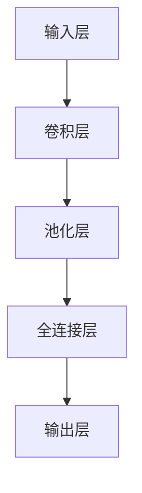
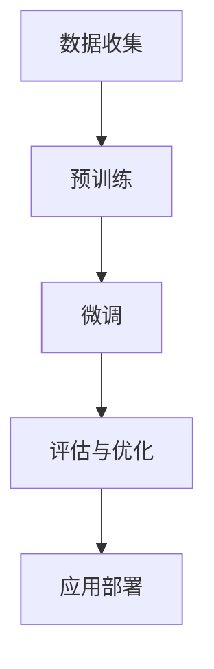
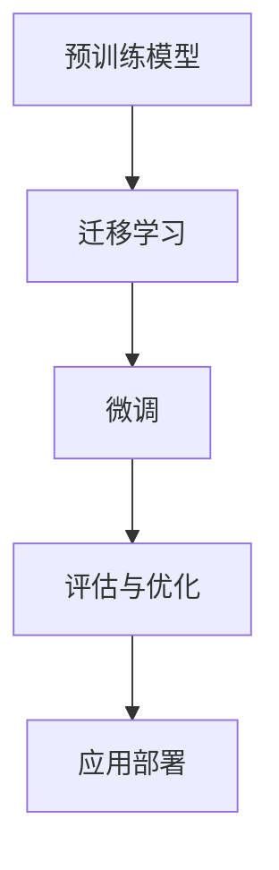

                 

### 大模型应用开发的关键技术

> **关键词：** 大模型，预训练，微调，模型压缩，自然语言处理，计算机视觉，应用开发。

> **摘要：** 本文将深入探讨大模型应用开发的关键技术，包括大模型基础知识、大模型的技术核心、大模型应用开发流程、大模型在自然语言处理和计算机视觉中的应用，以及大模型在实际项目中的应用案例和未来趋势与挑战。通过本文，读者将全面了解大模型应用开发的核心技术和实际应用，为未来的研究和实践提供指导。

### 第一部分：大模型基础知识

#### 第1章：大模型概述

#### 1.1 大模型的概念与历史背景

**1.1.1 大模型的定义**

大模型，通常指的是具有非常大量参数和极高计算复杂度的深度学习模型。这些模型通常具有数十亿甚至数万亿的参数，能够在大量数据上进行预训练，从而实现优异的性能。大模型的典型代表包括GPT-3、BERT、Turing、ImageNet等。

**1.1.2 大模型的发展历程**

大模型的发展历程可以追溯到深度学习理论的兴起。20世纪80年代，随着计算机硬件和算法的进步，神经网络开始受到重视。早期的研究主要集中在浅层神经网络，但随着时间的推移，研究者们逐渐认识到深层神经网络在处理复杂数据方面的潜力。

2006年，Hinton等人的研究成功训练了第一个深层神经网络，这一突破标志着深度学习时代的到来。随后，随着计算能力的不断提升和大数据的普及，深度学习模型逐渐变得庞大和复杂，大模型逐渐成为研究热点。

**1.1.3 大模型的重要性**

大模型在各个领域都展现出了强大的能力，尤其是在自然语言处理、计算机视觉等任务中。大模型能够通过预训练学习到大量通用知识，从而在特定任务上实现高性能。同时，大模型的研究也为人工智能领域提供了新的理论基础和算法思路。

#### 1.2 大模型的技术体系

**1.2.1 深度学习基础**

深度学习是构建大模型的核心技术。深度学习基于多层神经网络，通过逐层提取特征，实现对复杂数据的建模。以下是深度学习的一些基本概念：

1. **神经网络（Neural Network）**：神经网络是由大量神经元组成的计算模型，每个神经元可以表示一个简单的函数。通过多层神经元的组合，神经网络可以处理复杂的数据。

2. **深度学习框架（Deep Learning Framework）**：深度学习框架提供了高效、易用的工具，用于构建、训练和部署深度学习模型。常见的深度学习框架包括TensorFlow、PyTorch、Keras等。

3. **优化算法（Optimization Algorithm）**：优化算法用于调整神经网络的参数，以最小化损失函数。常见的优化算法包括梯度下降、Adam、RMSProp等。

**1.2.2 深度学习框架**

深度学习框架是构建大模型的重要工具。以下是几种常见的深度学习框架：

1. **TensorFlow**：TensorFlow是由谷歌开发的开源深度学习框架，具有强大的计算图功能，适合大规模模型的训练和部署。

2. **PyTorch**：PyTorch是由Facebook开发的开源深度学习框架，以其灵活的动态计算图著称，适合快速原型开发和模型研究。

3. **Keras**：Keras是一个高层次的深度学习框架，基于TensorFlow和Theano构建，提供了简洁、直观的API，适合快速构建和实验深度学习模型。

**1.2.3 优化算法**

优化算法是训练深度学习模型的关键步骤。以下是一些常用的优化算法：

1. **梯度下降（Gradient Descent）**：梯度下降是最基本的优化算法，通过计算损失函数的梯度来更新模型参数。

2. **Adam（Adaptive Moment Estimation）**：Adam是一种自适应优化算法，结合了Adam和RMSProp的优点，适用于快速收敛。

3. **RMSProp（Root Mean Square Propagation）**：RMSProp是一种基于均方误差的优化算法，通过考虑历史梯度信息来调整学习率。

#### 1.3 大模型的应用领域

大模型在自然语言处理和计算机视觉等领域取得了显著进展。以下是这两个领域的一些应用：

**1.3.1 自然语言处理**

自然语言处理（NLP）是人工智能的重要分支，旨在使计算机能够理解和生成自然语言。大模型在NLP领域具有广泛的应用，包括：

1. **语言模型（Language Model）**：语言模型用于预测下一个单词或句子，是自然语言处理的基础。

2. **机器翻译（Machine Translation）**：机器翻译是将一种语言的文本翻译成另一种语言的文本，大模型通过预训练和微调可以实现高效准确的翻译。

3. **文本生成（Text Generation）**：文本生成是生成自然语言文本的任务，大模型通过预训练和序列生成模型可以实现高质量的文本生成。

**1.3.2 计算机视觉**

计算机视觉是使计算机能够像人类一样理解和解释视觉信息的技术。大模型在计算机视觉领域取得了显著进展，包括：

1. **图像分类（Image Classification）**：图像分类是将图像分为预定义的类别，大模型通过卷积神经网络可以实现高效准确的分类。

2. **目标检测（Object Detection）**：目标检测是识别图像中的对象并定位其位置的任务，大模型通过卷积神经网络和目标检测算法可以实现高效准确的目标检测。

3. **语义分割（Semantic Segmentation）**：语义分割是将图像中的每个像素分类为预定义的类别，大模型通过卷积神经网络和语义分割算法可以实现高效准确的语义分割。

## 第2章：大模型的技术核心

### 2.1 预训练模型

预训练模型是构建大模型的重要技术之一。预训练模型通过在大规模数据集上进行预训练，学习到丰富的特征和知识，从而在特定任务上实现高性能。

**2.1.1 预训练的概念**

预训练是指在大规模数据集上对模型进行初步训练，使其学习到通用特征和知识。预训练后的模型可以进一步在特定任务上进行微调，以适应具体的应用场景。

**2.1.2 预训练的任务**

预训练任务可以分为两种：通用预训练和特定任务预训练。

1. **通用预训练**：通用预训练是指在大规模文本数据或图像数据上对模型进行预训练，使其学习到通用的语言或视觉特征。常见的通用预训练任务包括语言模型预训练和图像分类预训练。

2. **特定任务预训练**：特定任务预训练是指在大规模特定任务数据集上对模型进行预训练，使其学习到特定任务的特征和知识。常见的特定任务预训练任务包括机器翻译、文本生成、图像分割等。

**2.1.3 预训练的方法**

预训练方法可以分为两类：自监督学习和有监督学习。

1. **自监督学习**：自监督学习是指在不使用标注数据的情况下，利用数据中的内在结构进行预训练。常见的自监督学习方法包括预测下一个词、图像分类、图像生成等。

2. **有监督学习**：有监督学习是指利用标注数据对模型进行预训练。常见的有监督预训练方法包括在文本数据上预训练语言模型，在图像数据上预训练图像分类模型等。

### 2.2 微调与迁移学习

微调和迁移学习是利用预训练模型进行模型定制的重要技术。

**2.2.1 微调的概念**

微调是指在预训练模型的基础上，利用少量标注数据对模型进行进一步训练，以适应特定任务。微调可以通过调整模型的部分参数，使模型在特定任务上取得更好的性能。

**2.2.2 微调的方法**

微调方法可以分为两种：全量微调和增量微调。

1. **全量微调**：全量微调是指对预训练模型的所有参数进行训练，以适应特定任务。全量微调可以充分利用预训练模型的知识，但在计算资源有限的情况下可能不适用。

2. **增量微调**：增量微调是指只对预训练模型的一部分参数进行训练，以适应特定任务。增量微调可以减少计算资源的需求，但在某些情况下可能导致性能下降。

**2.2.3 迁移学习原理**

迁移学习是指将预训练模型的知识应用到其他任务中。迁移学习的原理是利用预训练模型在大规模数据上学习到的通用特征，从而提高在其他任务上的性能。

迁移学习可以分为两种类型：同领域迁移学习和跨领域迁移学习。

1. **同领域迁移学习**：同领域迁移学习是指将预训练模型的知识应用到相同领域的任务中。例如，在图像分类任务上预训练的模型可以用于其他图像分类任务。

2. **跨领域迁移学习**：跨领域迁移学习是指将预训练模型的知识应用到不同领域的任务中。例如，在图像分类任务上预训练的模型可以用于文本分类任务。

### 2.3 模型压缩与量化

模型压缩与量化是提高大模型可扩展性和可部署性的重要技术。

**2.3.1 模型压缩方法**

模型压缩是指通过减少模型参数数量和计算复杂度，降低模型的大小和计算资源需求。常见的模型压缩方法包括：

1. **知识蒸馏（Knowledge Distillation）**：知识蒸馏是指将大型模型的知识传递给小型模型，使小型模型能够复现大型模型在特定任务上的性能。

2. **算法剪枝（Algorithm Pruning）**：算法剪枝是指通过剪枝算法来删除模型中不重要或冗余的参数，从而减少模型的大小和计算复杂度。

3. **模型量化（Model Quantization）**：模型量化是指将模型中的浮点数参数转换为低精度的整数参数，以减少模型的存储和计算需求。

**2.3.1.1 知识蒸馏**

知识蒸馏是指将大型模型的知识传递给小型模型的过程。知识蒸馏可以分为两种类型：

1. **硬知识蒸馏（Hard Knowledge Distillation）**：硬知识蒸馏是指将大型模型的输出传递给小型模型，作为小型模型的标签进行训练。

2. **软知识蒸馏（Soft Knowledge Distillation）**：软知识蒸馏是指将大型模型的输出作为小型模型的额外输入，通过软标签来指导小型模型的训练。

**2.3.1.2 算法剪枝**

算法剪枝是指通过剪枝算法来删除模型中不重要或冗余的参数。常见的算法剪枝方法包括：

1. **结构剪枝（Structure Pruning）**：结构剪枝是指通过删除模型中的部分层或部分神经元来减少模型的大小和计算复杂度。

2. **权重剪枝（Weight Pruning）**：权重剪枝是指通过删除模型中不重要的权重参数来减少模型的大小和计算复杂度。

**2.3.1.3 模型量化**

模型量化是指将模型中的浮点数参数转换为低精度的整数参数。常见的模型量化方法包括：

1. **全量化（Full Quantization）**：全量化是指将模型中的所有浮点数参数都转换为整数参数。

2. **部分量化（Partial Quantization）**：部分量化是指只将模型中的部分浮点数参数转换为整数参数。

### 2.4 模型解释与可解释性

模型解释与可解释性是提高大模型可靠性和信任度的关键技术。

**2.4.1 模型解释的重要性**

模型解释是指对模型的决策过程进行解释，使其易于理解和验证。模型解释的重要性在于：

1. **提高模型的可靠性**：通过模型解释，可以识别模型可能存在的错误和偏差，从而提高模型的可靠性。

2. **增强模型的透明度**：模型解释使模型变得更加透明，有助于用户理解和信任模型。

3. **指导模型的改进**：通过模型解释，可以发现模型存在的问题和不足，从而指导模型的改进。

**2.4.2 模型解释的方法**

模型解释方法可以分为两类：全局解释和局部解释。

1. **全局解释**：全局解释是指对整个模型进行解释，通常通过可视化方法来展示模型的结构和权重。

2. **局部解释**：局部解释是指对模型在特定输入下的决策过程进行解释，通常通过局部解释方法来分析模型的激活和权重。

**2.4.2.1 层级解释**

层级解释是指通过分析模型的多层结构，逐层解释模型的决策过程。常见的层级解释方法包括：

1. **层级可视化（Hierarchical Visualization）**：层级可视化通过将模型分解为多个层级，展示每个层级的特征和权重。

2. **层级特征重要性（Hierarchical Feature Importance）**：层级特征重要性通过分析每个层级特征的贡献，评估其对模型决策的影响。

**2.4.2.2 局部解释**

局部解释是指对模型在特定输入下的决策过程进行解释。常见的局部解释方法包括：

1. **敏感性分析（Sensitivity Analysis）**：敏感性分析通过分析输入变量对模型输出的影响，评估模型的稳定性和可靠性。

2. **激活映射（Activation Mapping）**：激活映射通过将输入映射到模型的激活空间，展示模型对输入的响应。

## 第3章：大模型应用开发流程

### 3.1 数据收集与预处理

数据收集与预处理是构建大模型的基础步骤，直接影响到模型的性能和可靠性。

**3.1.1 数据收集方法**

数据收集方法可以分为两种：主动收集和被动收集。

1. **主动收集**：主动收集是指通过手动收集或自动化工具收集数据。常见的方法包括爬虫、问卷调查、数据集购买等。

2. **被动收集**：被动收集是指通过日志、传感器、API等方式收集数据。常见的方法包括用户行为数据收集、网络流量数据收集等。

**3.1.2 数据预处理步骤**

数据预处理步骤包括数据清洗、数据归一化和数据增强。

1. **数据清洗**：数据清洗是指去除数据中的噪声、错误和冗余信息，确保数据质量。

2. **数据归一化**：数据归一化是指将不同规模的数据转换为相同规模的数据，以便模型训练。

3. **数据增强**：数据增强是指通过变换、扩展、生成等方式增加数据量，提高模型的泛化能力。

### 3.2 模型选择与优化

模型选择与优化是构建大模型的关键步骤，直接影响到模型的性能和效率。

**3.2.1 模型选择策略**

模型选择策略包括以下几种：

1. **基于任务的模型选择**：根据具体任务的需求，选择适合的模型。例如，在图像分类任务中，选择卷积神经网络；在自然语言处理任务中，选择语言模型。

2. **基于数据的模型选择**：根据数据的特点，选择适合的模型。例如，在数据量较大的任务中，选择大型模型；在数据量较小的任务中，选择小型模型。

3. **基于性能的模型选择**：根据模型的性能指标，选择最优的模型。例如，在准确率、召回率、F1分数等方面，选择最优的模型。

**3.2.2 模型优化方法**

模型优化方法包括以下几种：

1. **损失函数选择**：选择适合任务的损失函数，以最小化模型在训练数据上的误差。

2. **优化器选择**：选择适合模型的优化器，以调整模型参数，提高模型性能。

3. **学习率调整**：调整学习率，使模型在训练过程中能够快速收敛。

4. **正则化**：通过引入正则化项，防止模型过拟合。

### 3.3 模型评估与调优

模型评估与调优是确保模型性能的重要步骤。

**3.3.1 评估指标**

常见的评估指标包括：

1. **准确率（Accuracy）**：准确率是指模型预测正确的样本数量占总样本数量的比例。

2. **召回率（Recall）**：召回率是指模型预测正确的正样本数量占总正样本数量的比例。

3. **F1分数（F1 Score）**：F1分数是准确率和召回率的调和平均值。

**3.3.2 调优策略**

调优策略包括以下几种：

1. **参数调整**：调整模型参数，如学习率、正则化参数等，以提高模型性能。

2. **模型选择**：根据评估结果，选择更适合的模型。

3. **交叉验证**：通过交叉验证，评估模型在不同数据集上的性能，以避免过拟合。

4. **集成学习**：通过集成多个模型，提高模型的整体性能。

## 第4章：大模型在自然语言处理中的应用

### 4.1 语言模型

语言模型（Language Model，LM）是自然语言处理（Natural Language Processing，NLP）的重要工具，用于预测下一个单词或句子。

**4.1.1 语言模型的原理**

语言模型的原理基于统计模型和深度学习。传统的语言模型使用统计方法，如N元语法（N-gram），通过计算单词序列的概率来预测下一个单词。深度学习语言模型，如循环神经网络（RNN）和变换器（Transformer），通过学习大量的文本数据，生成单词序列的概率分布。

**4.1.2 语言模型的构建**

构建语言模型的主要步骤包括：

1. **数据预处理**：对文本数据进行分析，去除噪声，进行分词和标记化处理。

2. **模型选择**：选择适合的语言模型架构，如RNN、Transformer等。

3. **训练**：通过大量文本数据进行训练，优化模型参数。

4. **评估**：使用评估数据集对模型进行评估，调整模型参数。

**4.1.2.1 Word2Vec模型**

Word2Vec是一种基于神经网络的语言模型，通过将单词映射到低维向量空间，实现单词表示和相似度计算。

1. **Skip-Gram模型**：Skip-Gram模型通过预测一个单词周围的上下文单词，训练单词向量。

2. **CBOW模型**：CBOW模型通过预测中心单词周围的多个单词，训练单词向量。

**4.1.2.1 BERT模型**

BERT（Bidirectional Encoder Representations from Transformers）是一种基于Transformer的预训练语言模型，通过双向编码器学习单词的上下文表示。

1. **预训练任务**：BERT通过掩码语言建模（Masked Language Model，MLM）和下一句预测（Next Sentence Prediction，NSP）进行预训练。

2. **模型架构**：BERT由多个Transformer层组成，每个层都包含自注意力机制和前馈神经网络。

### 4.2 文本生成

文本生成（Text Generation）是NLP的重要应用，通过模型生成有意义的文本。

**4.2.1 文本生成的原理**

文本生成基于序列模型，通过输入序列生成输出序列。常见的文本生成模型包括自动编码器和序列到序列（Seq2Seq）模型。

**4.2.2 文本生成的模型**

1. **自动编码器（Autoencoder）**：自动编码器是一种无监督学习模型，通过编码器将输入序列映射到潜在空间，再通过解码器将潜在空间映射回输出序列。

2. **序列到序列（Seq2Seq）模型**：Seq2Seq模型通过编码器和解码器，将输入序列映射到输出序列。常见的解码器包括循环神经网络（RNN）和解码器网络（Decoder Network）。

**4.2.2.1 自动编码器**

自动编码器的主要步骤包括：

1. **编码**：编码器将输入序列映射到潜在空间。

2. **解码**：解码器将潜在空间映射回输出序列。

3. **重构**：通过计算重构误差，优化模型参数。

**4.2.2.1 序列到序列模型**

序列到序列模型的主要步骤包括：

1. **编码**：编码器将输入序列编码为固定长度的向量。

2. **解码**：解码器将编码器的输出作为输入，逐步生成输出序列。

3. **预测**：通过输出序列的概率分布，生成最终的输出序列。

### 4.3 机器翻译

机器翻译（Machine Translation，MT）是将一种语言的文本翻译成另一种语言的文本。

**4.3.1 机器翻译的原理**

机器翻译基于序列模型，通过输入序列生成输出序列。常见的机器翻译模型包括基于规则的方法和基于统计的方法。

**4.3.2 机器翻译的模型**

1. **基于规则的方法**：基于规则的方法通过定义语法规则和翻译规则，实现文本翻译。常见的基于规则的方法包括直译法和意译法。

2. **基于统计的方法**：基于统计的方法通过学习大量的双语语料库，建立翻译模型。常见的基于统计的方法包括统计机器翻译（SMT）和神经机器翻译（NMT）。

**4.3.2.1 神经机器翻译**

神经机器翻译（Neural Machine Translation，NMT）是基于深度学习的机器翻译方法，通过编码器和解码器，实现文本的翻译。

1. **编码器**：编码器将输入句子编码为固定长度的向量。

2. **解码器**：解码器将编码器的输出作为输入，逐步生成输出句子。

3. **翻译模型**：通过解码器的输出序列，生成最终的输出句子。

**4.3.2.1 数据集介绍**

常见的机器翻译数据集包括：

1. **WMT数据集**：WMT（Workshop on Machine Translation）数据集是机器翻译领域的重要数据集，包括英语到德语、英语到法语等多种语言的翻译数据。

2. **翻译例句数据集**：翻译例句数据集是用于训练和评估机器翻译模型的文本数据，包括大量的双语句子。

## 第5章：大模型在计算机视觉中的应用

### 5.1 图像分类

图像分类（Image Classification）是将图像分为预定义的类别。

**5.1.1 图像分类的原理**

图像分类基于深度学习模型，通过卷积神经网络（Convolutional Neural Network，CNN）学习图像的特征，然后使用全连接层进行分类。

**5.1.2 图像分类的模型**

常见的图像分类模型包括卷积神经网络（CNN）和变换器（Transformer）。

1. **卷积神经网络（CNN）**：CNN通过卷积层、池化层和全连接层，学习图像的特征。

2. **变换器（Transformer）**：Transformer是一种基于自注意力机制的神经网络，可以处理序列数据，包括图像分类任务。

**5.1.2.1 卷积神经网络**

卷积神经网络的主要组成部分包括：

1. **卷积层**：卷积层通过卷积操作提取图像特征。

2. **池化层**：池化层通过最大池化或平均池化操作，减小特征图的大小。

3. **全连接层**：全连接层将特征映射到预定义的类别。

**5.1.2.1 Inception模型**

Inception模型是一种基于卷积神经网络的图像分类模型，通过不同尺寸的卷积核和池化层，提取多尺度的特征。

### 5.2 目标检测

目标检测（Object Detection）是识别图像中的对象并定位其位置。

**5.2.1 目标检测的原理**

目标检测基于深度学习模型，通过卷积神经网络和目标检测算法，实现图像中对象的识别和定位。

**5.2.2 目标检测的模型**

常见的目标检测模型包括R-CNN系列模型和YOLO系列模型。

1. **R-CNN系列模型**：R-CNN系列模型通过区域建议网络（Region Proposal Network，RPN）和分类网络，实现目标检测。

2. **YOLO系列模型**：YOLO系列模型通过卷积神经网络和边界框预测，实现实时目标检测。

**5.2.2.1 R-CNN系列模型**

R-CNN系列模型的主要组成部分包括：

1. **区域建议网络（RPN）**：RPN通过锚点生成和分类，生成区域建议。

2. **分类网络**：分类网络通过区域建议，对目标进行分类。

**5.2.2.1 YOLO系列模型**

YOLO系列模型的主要组成部分包括：

1. **卷积神经网络（CNN）**：CNN用于提取图像特征。

2. **边界框预测（Bounding Box Prediction）**：边界框预测通过回归操作，预测目标的边界框。

### 5.3 语义分割

语义分割（Semantic Segmentation）是将图像中的每个像素分类为预定义的类别。

**5.3.1 语义分割的原理**

语义分割基于深度学习模型，通过卷积神经网络和语义分割算法，实现图像的语义分割。

**5.3.2 语义分割的模型**

常见的语义分割模型包括全卷积网络（FCN）和U-Net模型。

1. **全卷积网络（FCN）**：FCN通过卷积神经网络和全连接层，实现像素级别的分类。

2. **U-Net模型**：U-Net模型是一种基于卷积神经网络的语义分割模型，通过收缩路径和扩张路径，实现像素级别的分类。

**5.3.2.1 FCN模型**

FCN模型的主要组成部分包括：

1. **收缩路径**：收缩路径通过卷积层和池化层，减小特征图的大小。

2. **扩张路径**：扩张路径通过反卷积层和卷积层，扩大特征图的大小。

3. **分类层**：分类层通过全连接层，实现像素级别的分类。

**5.3.2.1 U-Net模型**

U-Net模型的主要组成部分包括：

1. **收缩路径**：收缩路径通过卷积层和池化层，减小特征图的大小。

2. **扩张路径**：扩张路径通过反卷积层和卷积层，扩大特征图的大小。

3. **分类层**：分类层通过卷积层，实现像素级别的分类。

## 第6章：大模型在实际项目中的应用案例

### 6.1 案例一：基于大模型的智能问答系统

**6.1.1 项目背景**

智能问答系统是一种基于自然语言处理技术的人工智能系统，旨在为用户提供实时、准确的答案。随着深度学习技术的快速发展，基于大模型的智能问答系统逐渐成为研究热点。本文将介绍一个基于GPT-3模型的智能问答系统的开发过程。

**6.1.2 技术实现**

1. **数据收集与预处理**

   - 数据收集：从互联网上收集大量问答对，包括问题、答案和标签。
   - 数据预处理：对收集到的数据进行清洗、分词、去停用词等处理，将问题转换为向量表示。

2. **模型选择与训练**

   - 模型选择：选择GPT-3模型作为问答系统的核心模型。
   - 模型训练：使用预处理后的数据对GPT-3模型进行训练，调整模型参数，优化模型性能。

3. **模型评估与优化**

   - 模型评估：使用验证集对训练好的模型进行评估，计算准确率、召回率等指标。
   - 模型优化：根据评估结果，调整模型参数，优化模型性能。

**6.1.3 模型评估与优化**

1. **评估指标**

   - 准确率：准确率是指模型预测正确的问答对数量占总问答对数量的比例。
   - 召回率：召回率是指模型预测正确的问答对数量占实际正确答案数量的比例。
   - F1分数：F1分数是准确率和召回率的调和平均值。

2. **优化策略**

   - 调整学习率：调整学习率，使模型在训练过程中能够快速收敛。
   - 正则化：通过引入正则化项，防止模型过拟合。

### 6.2 案例二：基于大模型的图像识别系统

**6.2.1 项目背景**

图像识别系统是一种基于计算机视觉技术的人工智能系统，旨在对图像进行分类和识别。随着深度学习技术的快速发展，基于大模型的图像识别系统逐渐成为研究热点。本文将介绍一个基于ResNet-50模型的图像识别系统的开发过程。

**6.2.2 技术实现**

1. **数据收集与预处理**

   - 数据收集：从互联网上收集大量图像数据，包括不同类别和不同尺寸的图像。
   - 数据预处理：对收集到的数据进行清洗、归一化、缩放等处理，将图像转换为向量表示。

2. **模型选择与训练**

   - 模型选择：选择ResNet-50模型作为图像识别系统的核心模型。
   - 模型训练：使用预处理后的数据对ResNet-50模型进行训练，调整模型参数，优化模型性能。

3. **模型评估与优化**

   - 模型评估：使用验证集对训练好的模型进行评估，计算准确率、召回率等指标。
   - 模型优化：根据评估结果，调整模型参数，优化模型性能。

**6.2.3 模型评估与优化**

1. **评估指标**

   - 准确率：准确率是指模型预测正确的图像数量占总图像数量的比例。
   - 召回率：召回率是指模型预测正确的图像数量占实际正确类别数量的比例。
   - F1分数：F1分数是准确率和召回率的调和平均值。

2. **优化策略**

   - 调整学习率：调整学习率，使模型在训练过程中能够快速收敛。
   - 正则化：通过引入正则化项，防止模型过拟合。

## 第7章：大模型应用开发的未来趋势与挑战

### 7.1 大模型应用的未来趋势

大模型应用在未来将继续发展，并呈现以下趋势：

1. **新应用领域的拓展**：随着深度学习技术的不断进步，大模型将应用于更多的新兴领域，如自动驾驶、医疗诊断、智能客服等。

2. **跨领域融合**：大模型将在不同领域之间实现跨领域融合，通过整合多源数据，提升模型的泛化能力和鲁棒性。

3. **个性化与自适应**：大模型应用将更加注重个性化与自适应，通过用户行为数据和偏好分析，为用户提供更个性化的服务。

### 7.2 大模型应用开发的挑战

大模型应用开发面临以下挑战：

1. **计算资源需求**：大模型训练和推理需要大量的计算资源，如何高效地利用计算资源成为一大挑战。

2. **数据隐私与安全**：大模型应用涉及大量用户数据，如何保护用户隐私和安全成为关键问题。

3. **模型解释与可靠性**：大模型决策过程复杂，如何对模型进行解释和验证，确保模型的可靠性和公平性，是亟待解决的问题。

### 附录A：大模型应用开发资源

#### 1. 开发工具与框架

- TensorFlow：https://www.tensorflow.org/
- PyTorch：https://pytorch.org/
- Keras：https://keras.io/

#### 2. 教程与资料

- 《深度学习》（Goodfellow et al.）：https://www.deeplearningbook.org/
- 《动手学深度学习》（Dumoulin et al.）：https://d2l.ai/

#### 3. 社区与论坛

- TensorFlow论坛：https://discuss.tensorflow.org/
- PyTorch论坛：https://discuss.pytorch.org/
- Keras论坛：https://keras.io/forums/

### 附录B：Mermaid 流程图

#### Mermaid 图1：深度学习架构



#### Mermaid 图2：预训练模型流程



#### Mermaid 图3：迁移学习流程



### 附录C：伪代码示例

#### 1. 语言模型训练伪代码

```python
# 初始化模型
model = LanguageModel()

# 加载训练数据
train_data = load_data("train_data.txt")

# 定义损失函数和优化器
loss_function = CrossEntropyLoss()
optimizer = Adam(model.parameters(), lr=0.001)

# 模型训练
for epoch in range(num_epochs):
    for input_sequence, target_sequence in train_data:
        optimizer.zero_grad()
        output = model(input_sequence)
        loss = loss_function(output, target_sequence)
        loss.backward()
        optimizer.step()
        
    print(f"Epoch {epoch+1}/{num_epochs}, Loss: {loss.item()}")
```

#### 2. 图像分类模型训练伪代码

```python
# 初始化模型
model = ImageClassifier()

# 加载训练数据
train_data = load_data("train_data.csv")

# 定义损失函数和优化器
loss_function = CrossEntropyLoss()
optimizer = SGD(model.parameters(), lr=0.001, momentum=0.9)

# 模型训练
for epoch in range(num_epochs):
    for images, labels in train_data:
        optimizer.zero_grad()
        output = model(images)
        loss = loss_function(output, labels)
        loss.backward()
        optimizer.step()
        
    print(f"Epoch {epoch+1}/{num_epochs}, Loss: {loss.item()}")
```

#### 3. 机器翻译模型训练伪代码

```python
# 初始化模型
model = MachineTranslationModel()

# 加载训练数据
train_data = load_data("train_data.txt")

# 定义损失函数和优化器
loss_function =BLEU()
optimizer = Adam(model.parameters(), lr=0.001)

# 模型训练
for epoch in range(num_epochs):
    for source_sequence, target_sequence in train_data:
        optimizer.zero_grad()
        output = model(source_sequence)
        loss = loss_function(output, target_sequence)
        loss.backward()
        optimizer.step()
        
    print(f"Epoch {epoch+1}/{num_epochs}, Loss: {loss.item()}")
```

### 附录D：数学公式

#### 公式1：损失函数

$$
L = -\sum_{i=1}^{n} y_i \log(p_i)
$$

其中，$y_i$ 为真实标签，$p_i$ 为模型预测概率。

#### 公式2：梯度下降优化算法

$$
\theta_{t+1} = \theta_{t} - \alpha \cdot \nabla_\theta L(\theta)
$$

其中，$\theta$ 为模型参数，$\alpha$ 为学习率，$\nabla_\theta L(\theta)$ 为损失函数对参数的梯度。

#### 公式3：卷积神经网络参数更新算法

$$
\theta_{ij}^{new} = \theta_{ij}^{old} - \alpha \cdot \frac{\partial L}{\partial \theta_{ij}}
$$

其中，$\theta_{ij}$ 为卷积神经网络的权重参数，$\alpha$ 为学习率，$\frac{\partial L}{\partial \theta_{ij}}$ 为损失函数对权重参数的梯度。

