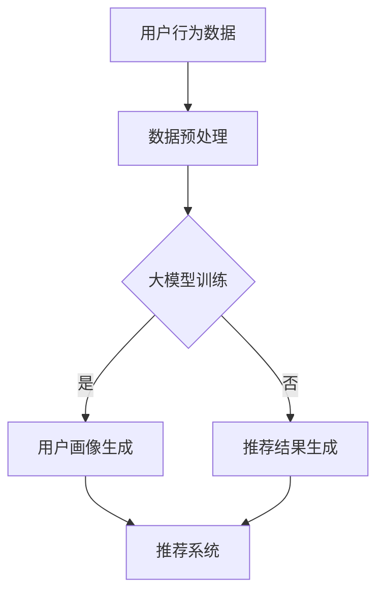

                 

# 大模型时代的个性化推荐

> **关键词：** 个性化推荐、大模型、深度学习、用户建模、商品建模、协同过滤、内容推荐、数学基础、算法优化、系统部署与运维、案例分析、未来趋势

> **摘要：** 随着大数据和人工智能技术的快速发展，个性化推荐系统已经成为许多互联网应用的核心组成部分。本文将深入探讨大模型在个性化推荐系统中的应用，从基础概念到实现细节，再到实际案例分析，全面解析大模型时代的个性化推荐技术，展望未来的发展趋势和挑战。

## 目录大纲

### 第一部分：个性化推荐系统概述

#### 第1章：个性化推荐系统基础

1.1 个性化推荐系统概述

1.2 个性化推荐系统的发展历程

1.3 个性化推荐系统的核心组成部分

#### 第2章：大模型与个性化推荐

2.1 大模型简介

2.2 大模型在个性化推荐中的应用

2.3 大模型在个性化推荐中的挑战

#### 第3章：个性化推荐系统的数学基础

3.1 数学模型与推荐算法

3.2 机器学习与深度学习基础

3.3 数学公式与算法解释

### 第二部分：大模型推荐算法实现

#### 第4章：基于深度学习的推荐算法

4.1 深度学习推荐算法概述

4.2 GPT系列模型在推荐系统中的应用

4.3 BERT及其变体在推荐系统中的应用

4.4 其他深度学习模型在推荐系统中的应用

#### 第5章：大模型推荐算法的优化与评估

5.1 大模型推荐算法的优化方法

5.2 大模型推荐算法的评估指标

5.3 大模型推荐算法的性能评估

#### 第6章：大模型推荐算法的部署与运维

6.1 大模型推荐算法的部署

6.2 大模型推荐算法的运维

6.3 大模型推荐系统的监控与调优

#### 第7章：大模型推荐系统的案例分析

7.1 案例一：电商平台的个性化推荐

7.2 案例二：社交媒体的个性化内容推荐

7.3 案例三：金融领域的个性化投资推荐

### 第三部分：大模型推荐系统的未来发展趋势

#### 第8章：大模型推荐系统的未来发展趋势

8.1 大模型技术的发展趋势

8.2 大模型推荐系统的挑战与机遇

8.3 大模型推荐系统的伦理与隐私保护

#### 第9章：大模型推荐系统的应用创新

9.1 新型推荐算法的应用

9.2 大模型推荐系统在新兴领域的应用

9.3 大模型推荐系统的行业趋势

#### 附录

附录A：常用深度学习框架与工具

附录B：参考资料与进一步阅读

### Mermaid 流程图



### 伪代码

```python
# 用户建模伪代码
def user_modeling(user_data):
    # 数据预处理
    preprocessed_data = preprocess_data(user_data)
    
    # 使用大模型训练用户兴趣模型
    user_interest_model = train_big_model(preprocessed_data)
    
    # 使用训练好的用户兴趣模型预测用户兴趣
    predicted_interests = predict_user_interests(user_interest_model)
    
    return predicted_interests

# 商品或内容建模伪代码
def item_modeling(item_data):
    # 数据预处理
    preprocessed_data = preprocess_data(item_data)
    
    # 使用大模型训练商品或内容模型
    item_model = train_big_model(preprocessed_data)
    
    # 使用训练好的商品或内容模型预测商品或内容属性
    predicted_attributes = predict_item_attributes(item_model)
    
    return predicted_attributes
```

### 数学模型和数学公式

#### 协同过滤的矩阵分解公式

$$
\begin{align*}
X &= \mathbf{U}\mathbf{S}\mathbf{V}^T \\
\mathbf{R}_{\hat{}} &= \mathbf{U}\mathbf{S}^2\mathbf{V}^T
\end{align*}
$$

#### 基于内容的相似度计算

$$
\text{similarity}(i, j) = \frac{\sum_{k=1}^{n} c_i(k) \cdot c_j(k)}{\sqrt{\sum_{k=1}^{n} c_i(k)^2 \cdot \sum_{k=1}^{n} c_j(k)^2}}
$$

### 举例说明

#### 用户-商品评分矩阵

$$
\begin{array}{c|c|c|c|c|c}
\text{用户} & \text{商品1} & \text{商品2} & \text{商品3} & \text{商品4} & \text{商品5} \\
\hline
用户1 & 4 & ? & 2 & 1 & 5 \\
用户2 & ? & 3 & 4 & ? & 2 \\
用户3 & 1 & 5 & ? & 4 & 3 \\
\end{array}
$$

#### 矩阵分解结果

$$
\begin{align*}
\mathbf{U} &= \begin{bmatrix}
0.8 & 0.6 \\
0.7 & 0.5 \\
0.9 & 0.7 \\
\end{bmatrix}, \\
\mathbf{S} &= \begin{bmatrix}
1 & 0.5 \\
0.5 & 1 \\
\end{bmatrix}, \\
\mathbf{V} &= \begin{bmatrix}
0.8 & 0.3 \\
0.6 & 0.7 \\
0.9 & 0.4 \\
\end{bmatrix}.
\end{align*}
$$

#### 预测用户2对商品2的评分

$$
\begin{align*}
r_{2,2}^{\hat{}} &= \mathbf{U}_2 \mathbf{S} \mathbf{V}_2^T \\
&= 0.7 \cdot 1 \cdot 0.7 + 0.5 \cdot 0.5 \cdot 0.4 \\
&= 0.49 + 0.1 \\
&= 0.59.
\end{align*}
$$

因此，预测用户2对商品2的评分为0.59。

### 文章开始

---

## 引言

随着互联网的普及和用户数据量的爆炸性增长，个性化推荐系统已经成为了现代互联网应用中不可或缺的一部分。从电子商务平台到社交媒体，从在线视频网站到新闻门户，个性化推荐系统被广泛应用于各种场景，为用户提供了更加个性化、精准的内容和商品推荐。随着深度学习技术的不断发展，大模型在个性化推荐系统中扮演了越来越重要的角色。

本文旨在深入探讨大模型在个性化推荐系统中的应用，从基础概念到实现细节，再到实际案例分析，全面解析大模型时代的个性化推荐技术，展望未来的发展趋势和挑战。文章结构如下：

1. **个性化推荐系统概述**：介绍个性化推荐系统的基本概念、发展历程和核心组成部分。
2. **大模型与个性化推荐**：介绍大模型的基本概念、特点以及在个性化推荐中的应用。
3. **个性化推荐系统的数学基础**：介绍个性化推荐系统的数学模型和机器学习基础。
4. **大模型推荐算法实现**：介绍基于深度学习的推荐算法以及大模型推荐算法的优化与评估。
5. **大模型推荐算法的部署与运维**：介绍大模型推荐算法的部署与运维策略。
6. **大模型推荐系统的案例分析**：通过实际案例分析，展示大模型推荐系统在不同领域的应用。
7. **大模型推荐系统的未来发展趋势**：展望大模型推荐系统的未来发展趋势和应用创新。

接下来，我们将逐步深入每个部分，详细探讨大模型时代的个性化推荐技术。

### 第一部分：个性化推荐系统概述

## 第1章：个性化推荐系统基础

### 1.1 个性化推荐系统概述

个性化推荐系统是一种基于用户行为和兴趣的数据分析，为用户推荐个性化内容或商品的技术。其核心目标是利用用户的偏好和兴趣，为用户提供最符合其需求的信息或产品。

**定义**：个性化推荐系统是一种信息过滤系统，它根据用户的历史行为、偏好和兴趣，自动推荐用户可能感兴趣的内容或商品。

**核心目标**：提高用户满意度、提升用户参与度和转化率。

**常见类型**：

1. **基于内容的推荐**：根据用户对某些内容的兴趣，推荐相似或相关的内容。
2. **协同过滤推荐**：根据用户之间的相似度，推荐用户可能喜欢的商品或内容。
3. **混合推荐**：结合基于内容和协同过滤的推荐方法，提供更准确的推荐结果。

### 1.2 个性化推荐系统的发展历程

个性化推荐系统的发展可以追溯到20世纪90年代，随着互联网的普及和用户数据量的增加，推荐系统逐渐成为研究热点。以下是推荐系统的发展历程：

1. **基于记忆的推荐**：早期推荐系统主要基于用户的历史行为和浏览记录进行推荐。
2. **基于模型的推荐**：随着机器学习技术的发展，推荐系统开始采用预测模型，如协同过滤、隐语义模型等。
3. **基于内容的推荐**：通过分析内容特征，推荐与用户兴趣相关的商品或内容。
4. **混合推荐**：结合多种推荐方法，提供更准确的推荐结果。
5. **大模型时代**：随着深度学习技术的发展，大模型在推荐系统中得到广泛应用，显著提高了推荐精度。

### 1.3 个性化推荐系统的核心组成部分

个性化推荐系统通常由以下几个核心组成部分构成：

1. **用户建模**：通过分析用户的行为、偏好和兴趣，建立用户画像。
2. **商品或内容建模**：通过分析商品或内容的特征，建立商品或内容模型。
3. **推荐算法**：根据用户建模和商品建模的结果，采用合适的推荐算法生成推荐列表。
4. **推荐评估与反馈**：通过评估推荐效果，收集用户反馈，持续优化推荐系统。

### 总结

个性化推荐系统作为一种信息过滤技术，已经在各个领域中得到了广泛应用。随着大模型技术的发展，个性化推荐系统的精度和效果得到了显著提升。在接下来的章节中，我们将深入探讨大模型在个性化推荐中的应用，以及如何实现高效的大模型推荐系统。

## 第2章：大模型与个性化推荐

### 2.1 大模型简介

大模型是指具有巨大参数量和计算复杂度的深度学习模型，通常由数百万甚至数十亿个参数组成。大模型的核心特点是其强大的学习和表征能力，能够处理复杂的数据特征和任务。

**定义**：大模型是指参数量超过百万的深度学习模型，通常具有强大的学习和表征能力。

**特点与优势**：

1. **强大的表征能力**：大模型能够捕获数据中的复杂模式和特征，具有出色的预训练效果。
2. **高效的处理能力**：大模型可以处理大规模的数据集，提高推荐系统的效率和精度。
3. **灵活的适用性**：大模型可以应用于各种领域和任务，具有广泛的适用性。

### 2.2 大模型在个性化推荐中的应用

大模型在个性化推荐系统中扮演了重要角色，通过以下几个方面实现了对推荐效果的提升：

1. **用户兴趣挖掘**：大模型可以处理大规模的用户行为数据，深入挖掘用户的兴趣和偏好，生成高质量的用户画像。
2. **商品或内容推荐**：大模型通过对商品或内容的特征进行建模，能够推荐与用户兴趣高度相关的商品或内容。
3. **个性化排序**：大模型可以处理复杂的排序任务，优化推荐结果的排序策略，提高推荐精度。

### 2.3 大模型在个性化推荐中的挑战

尽管大模型在个性化推荐中展示了巨大的潜力，但也面临着一些挑战：

1. **数据隐私保护**：大模型需要处理大量的用户数据，如何在保护用户隐私的前提下进行数据分析和建模是一个重要挑战。
2. **训练与部署成本**：大模型的训练和部署需要大量的计算资源和存储资源，如何降低成本是一个重要问题。
3. **模型解释性**：大模型的黑盒特性使得其解释性较差，如何理解模型决策过程是一个挑战。

### 总结

大模型在个性化推荐系统中具有强大的表征能力和处理能力，通过用户兴趣挖掘、商品或内容推荐和个性化排序等方面提升了推荐系统的效果。然而，大模型也面临着数据隐私保护、训练与部署成本和模型解释性等挑战。在接下来的章节中，我们将进一步探讨个性化推荐系统的数学基础和深度学习技术。

## 第3章：个性化推荐系统的数学基础

### 3.1 数学模型与推荐算法

个性化推荐系统的数学模型主要包括协同过滤算法和基于内容的推荐算法。这些算法通过数学公式和模型参数，实现了对用户行为和商品特征的建模，从而生成个性化的推荐结果。

**协同过滤算法**：

协同过滤算法是一种基于用户行为相似性的推荐方法。其核心思想是通过计算用户之间的相似度，预测用户未评分的商品评分。

1. **矩阵分解**：协同过滤算法通常采用矩阵分解技术，将用户-商品评分矩阵分解为用户特征矩阵和商品特征矩阵。通过矩阵分解，可以降低数据维度，同时捕获用户和商品的特征信息。

   矩阵分解公式：
   $$
   \begin{align*}
   X &= \mathbf{U}\mathbf{S}\mathbf{V}^T \\
   \mathbf{R}_{\hat{}} &= \mathbf{U}\mathbf{S}^2\mathbf{V}^T
   \end{align*}
   $$
   
2. **基于用户的协同过滤**：在基于用户的协同过滤算法中，通过计算用户之间的相似度，找到与目标用户最相似的邻居用户，然后预测目标用户对未评分商品的评分。

   相似度计算公式：
   $$
   \text{similarity}(i, j) = \frac{\sum_{k=1}^{n} r_{ik} \cdot r_{jk}}{\sqrt{\sum_{k=1}^{n} r_{ik}^2 \cdot \sum_{k=1}^{n} r_{jk}^2}}
   $$
   
3. **基于物品的协同过滤**：在基于物品的协同过滤算法中，通过计算商品之间的相似度，找到与目标商品最相似的商品，然后预测用户对未评分商品的评分。

   相似度计算公式：
   $$
   \text{similarity}(i, j) = \frac{\sum_{k=1}^{n} r_{ik} \cdot r_{jk}}{\sqrt{\sum_{k=1}^{n} r_{ik}^2 \cdot \sum_{k=1}^{n} r_{jk}^2}}
   $$

**基于内容的推荐算法**：

基于内容的推荐算法通过分析商品或内容的特征，推荐与用户兴趣相关的商品或内容。

1. **内容表示**：基于内容的推荐算法将商品或内容表示为特征向量，通常采用词袋模型、TF-IDF等方法。

2. **相似度计算**：通过计算用户兴趣特征向量和商品特征向量之间的相似度，推荐与用户兴趣相关的商品或内容。

   相似度计算公式：
   $$
   \text{similarity}(i, j) = \frac{\sum_{k=1}^{n} c_i(k) \cdot c_j(k)}{\sqrt{\sum_{k=1}^{n} c_i(k)^2 \cdot \sum_{k=1}^{n} c_j(k)^2}}
   $$
   
**深度学习推荐算法**：

深度学习推荐算法通过构建复杂的神经网络模型，实现对用户行为和商品特征的深度学习和表征。

1. **用户兴趣网络**：用户兴趣网络通过捕捉用户的兴趣和行为模式，生成用户兴趣特征。

2. **商品特征网络**：商品特征网络通过分析商品的特征和属性，生成商品特征向量。

3. **推荐网络**：推荐网络结合用户兴趣特征和商品特征，生成个性化的推荐结果。

### 3.2 机器学习与深度学习基础

个性化推荐系统通常采用机器学习和深度学习技术，其中机器学习为推荐算法提供了理论基础，深度学习则为推荐算法提供了更强的表征能力。

**机器学习基础**：

机器学习是一种通过训练模型来预测或分类数据的自动化方法。在个性化推荐系统中，机器学习算法通过学习用户行为和商品特征，生成推荐模型。

1. **监督学习**：监督学习通过训练标签数据，学习输入和输出之间的映射关系。在个性化推荐中，标签数据通常是用户对商品的评分。

2. **无监督学习**：无监督学习通过分析数据分布，发现数据中的结构和模式。在个性化推荐中，无监督学习可以用于用户聚类和商品聚类。

3. **半监督学习**：半监督学习结合监督学习和无监督学习，利用少量的标签数据和大量的无标签数据来训练模型。

**深度学习基础**：

深度学习是一种基于多层神经网络的学习方法，通过训练模型来学习数据的复杂表征。

1. **神经网络基本结构**：神经网络由输入层、隐藏层和输出层组成。通过多层神经网络的堆叠，可以学习数据的深层特征。

2. **激活函数**：激活函数用于引入非线性，使得神经网络能够处理复杂的非线性问题。

3. **优化算法**：优化算法用于最小化模型损失函数，从而找到最佳的模型参数。

   常见的优化算法包括随机梯度下降（SGD）、Adam、RMSprop等。

### 3.3 数学公式与算法解释

在本节中，我们将详细介绍一些常用的数学公式和算法，以便更好地理解个性化推荐系统的工作原理。

**协同过滤算法的矩阵分解公式**：

协同过滤算法通过矩阵分解将用户-商品评分矩阵分解为用户特征矩阵和商品特征矩阵。

$$
\begin{align*}
X &= \mathbf{U}\mathbf{S}\mathbf{V}^T \\
\mathbf{R}_{\hat{}} &= \mathbf{U}\mathbf{S}^2\mathbf{V}^T
\end{align*}
$$

其中，$X$为用户-商品评分矩阵，$\mathbf{U}$为用户特征矩阵，$\mathbf{S}$为共享特征矩阵，$\mathbf{V}$为商品特征矩阵。

**基于内容的相似度计算**：

基于内容的相似度计算通过分析商品或内容的特征向量，计算它们之间的相似度。

$$
\text{similarity}(i, j) = \frac{\sum_{k=1}^{n} c_i(k) \cdot c_j(k)}{\sqrt{\sum_{k=1}^{n} c_i(k)^2 \cdot \sum_{k=1}^{n} c_j(k)^2}}
$$

其中，$c_i(k)$和$c_j(k)$分别表示商品$i$和商品$j$在特征$k$上的值。

**深度学习推荐算法的损失函数**：

深度学习推荐算法通常采用均方误差（MSE）作为损失函数，用于衡量预测评分与真实评分之间的差异。

$$
\text{MSE} = \frac{1}{m} \sum_{i=1}^{m} (\hat{r}_i - r_i)^2
$$

其中，$\hat{r}_i$为预测评分，$r_i$为真实评分，$m$为样本数量。

**举例说明**：

假设有一个用户-商品评分矩阵如下：

$$
\begin{array}{c|c|c|c|c|c}
\text{用户} & \text{商品1} & \text{商品2} & \text{商品3} & \text{商品4} & \text{商品5} \\
\hline
用户1 & 4 & ? & 2 & 1 & 5 \\
用户2 & ? & 3 & 4 & ? & 2 \\
用户3 & 1 & 5 & ? & 4 & 3 \\
\end{array}
$$

通过矩阵分解，可以得到用户特征矩阵、共享特征矩阵和商品特征矩阵如下：

$$
\begin{align*}
\mathbf{U} &= \begin{bmatrix}
0.8 & 0.6 \\
0.7 & 0.5 \\
0.9 & 0.7 \\
\end{bmatrix}, \\
\mathbf{S} &= \begin{bmatrix}
1 & 0.5 \\
0.5 & 1 \\
\end{bmatrix}, \\
\mathbf{V} &= \begin{bmatrix}
0.8 & 0.3 \\
0.6 & 0.7 \\
0.9 & 0.4 \\
\end{bmatrix}.
\end{align*}
$$

预测用户2对商品2的评分：

$$
\begin{align*}
r_{2,2}^{\hat{}} &= \mathbf{U}_2 \mathbf{S} \mathbf{V}_2^T \\
&= 0.7 \cdot 1 \cdot 0.7 + 0.5 \cdot 0.5 \cdot 0.4 \\
&= 0.49 + 0.1 \\
&= 0.59.
\end{align*}
$$

因此，预测用户2对商品2的评分为0.59。

### 总结

个性化推荐系统的数学基础是构建推荐算法的核心，通过数学模型和算法，实现了对用户行为和商品特征的建模，从而生成个性化的推荐结果。在接下来的章节中，我们将深入探讨大模型推荐算法的实现和优化方法。

## 第二部分：大模型推荐算法实现

## 第4章：基于深度学习的推荐算法

### 4.1 深度学习推荐算法概述

深度学习推荐算法是一种基于深度神经网络（Deep Neural Network，DNN）的推荐方法。它通过多层神经网络的结构，对用户行为和商品特征进行深度学习和表征，从而生成个性化的推荐结果。与传统的推荐算法相比，深度学习推荐算法具有以下优点：

1. **强大的表征能力**：深度学习推荐算法可以通过多层神经网络的堆叠，学习数据的深层特征，从而提高推荐精度。
2. **自动特征提取**：深度学习推荐算法可以自动从原始数据中提取有用的特征，减少人工特征工程的工作量。
3. **适应性强**：深度学习推荐算法可以处理不同类型的数据和任务，具有较强的适应性。

### 4.2 GPT系列模型在推荐系统中的应用

GPT（Generative Pre-trained Transformer）系列模型是由OpenAI提出的一种基于Transformer结构的预训练语言模型。GPT模型在推荐系统中的应用主要体现在以下几个方面：

1. **用户兴趣建模**：GPT模型可以通过预训练学习用户的兴趣和行为模式，从而生成高质量的用户兴趣特征。这些特征可以用于个性化推荐和用户画像生成。
2. **商品或内容表征**：GPT模型可以用于分析商品或内容的文本描述，提取商品或内容的特征。这些特征可以用于基于内容的推荐和商品或内容表征。
3. **文本生成**：GPT模型可以生成与用户兴趣相关的文本内容，从而提供个性化的文本推荐。

#### GPT模型的基本原理

GPT模型是一种基于自注意力机制的深度学习模型，其核心思想是通过多层自注意力机制来捕捉数据中的复杂模式和特征。GPT模型的主要组成部分包括：

1. **嵌入层**：将输入数据（如文本、用户行为等）转换为嵌入向量。
2. **自注意力层**：通过自注意力机制，计算每个输入向量与其他输入向量之间的关系，生成加权特征向量。
3. **前馈网络**：对加权特征向量进行进一步的加工和变换，提高模型的表征能力。
4. **输出层**：将加工后的特征向量映射到输出结果（如用户兴趣、商品特征等）。

#### GPT模型在推荐系统中的实际应用案例

以下是一个GPT模型在推荐系统中的实际应用案例：

1. **用户兴趣建模**：

   假设我们有一个电商平台的用户行为数据，包括用户的浏览记录、购买记录和搜索记录等。我们可以使用GPT模型对用户行为数据进行建模，提取用户兴趣特征。

   ```mermaid
   graph TD
   A[用户行为数据] --> B[数据预处理]
   B --> C[嵌入层]
   C --> D[自注意力层]
   D --> E[前馈网络]
   E --> F[输出层]
   F --> G[用户兴趣特征]
   ```

   通过训练GPT模型，我们可以得到用户兴趣特征向量，这些向量可以用于生成用户画像，进而实现个性化推荐。

2. **商品或内容表征**：

   假设我们有一个在线视频平台，需要对视频进行个性化推荐。我们可以使用GPT模型分析视频的文本描述，提取视频特征。

   ```mermaid
   graph TD
   A[视频文本描述] --> B[数据预处理]
   B --> C[嵌入层]
   C --> D[自注意力层]
   D --> E[前馈网络]
   E --> F[输出层]
   F --> G[视频特征]
   ```

   通过训练GPT模型，我们可以得到视频特征向量，这些向量可以用于基于内容的推荐和视频表征。

3. **文本生成**：

   假设我们希望为用户生成个性化的推荐文本。我们可以使用GPT模型根据用户的兴趣和行为，生成与用户兴趣相关的文本内容。

   ```mermaid
   graph TD
   A[用户兴趣特征] --> B[嵌入层]
   B --> C[自注意力层]
   C --> D[前馈网络]
   D --> E[输出层]
   E --> F[推荐文本]
   ```

   通过训练GPT模型，我们可以生成个性化的推荐文本，从而提高用户的参与度和满意度。

### 4.3 BERT及其变体在推荐系统中的应用

BERT（Bidirectional Encoder Representations from Transformers）是一种基于Transformer结构的预训练语言模型，由Google提出。BERT模型通过双向编码器结构，同时考虑上下文信息，从而提高模型的表征能力。BERT及其变体（如RoBERTa、ALBERT等）在推荐系统中的应用主要体现在以下几个方面：

1. **用户兴趣建模**：BERT模型可以用于分析用户的文本输入（如评论、搜索关键词等），提取用户兴趣特征。这些特征可以用于生成用户画像，实现个性化推荐。
2. **商品或内容表征**：BERT模型可以用于分析商品或内容的文本描述，提取商品或内容的特征。这些特征可以用于基于内容的推荐和商品或内容表征。
3. **文本生成**：BERT模型可以用于生成与用户兴趣相关的文本内容，从而提供个性化的文本推荐。

#### BERT模型的基本原理

BERT模型的核心结构是一个双向Transformer编码器，其输入是一个标记序列，输出是一个固定长度的向量。BERT模型的主要组成部分包括：

1. **嵌入层**：将输入数据（如文本、用户行为等）转换为嵌入向量。
2. **Transformer编码器**：通过多层Transformer编码器，对输入序列进行编码，生成序列的上下文表示。
3. **输出层**：将编码器的输出映射到具体的任务输出（如用户兴趣、商品特征等）。

#### BERT模型在推荐系统中的实际应用案例

以下是一个BERT模型在推荐系统中的实际应用案例：

1. **用户兴趣建模**：

   假设我们有一个社交媒体平台，需要对用户的文本评论进行建模，提取用户兴趣特征。

   ```mermaid
   graph TD
   A[用户评论] --> B[数据预处理]
   B --> C[嵌入层]
   C --> D[Transformer编码器]
   D --> E[输出层]
   E --> F[用户兴趣特征]
   ```

   通过训练BERT模型，我们可以得到用户兴趣特征向量，这些向量可以用于生成用户画像，进而实现个性化推荐。

2. **商品或内容表征**：

   假设我们有一个电子商务平台，需要对商品的文本描述进行建模，提取商品特征。

   ```mermaid
   graph TD
   A[商品文本描述] --> B[数据预处理]
   B --> C[嵌入层]
   C --> D[Transformer编码器]
   D --> E[输出层]
   E --> F[商品特征]
   ```

   通过训练BERT模型，我们可以得到商品特征向量，这些向量可以用于基于内容的推荐和商品表征。

3. **文本生成**：

   假设我们希望为用户生成个性化的推荐文本。我们可以使用BERT模型根据用户的兴趣和行为，生成与用户兴趣相关的文本内容。

   ```mermaid
   graph TD
   A[用户兴趣特征] --> B[嵌入层]
   B --> C[Transformer编码器]
   C --> D[输出层]
   D --> E[推荐文本]
   ```

   通过训练BERT模型，我们可以生成个性化的推荐文本，从而提高用户的参与度和满意度。

### 4.4 其他深度学习模型在推荐系统中的应用

除了GPT系列模型和BERT模型，还有许多其他深度学习模型在推荐系统中得到了广泛应用，包括：

1. **Transformer模型**：Transformer模型是一种基于自注意力机制的深度学习模型，常用于处理序列数据。Transformer模型在推荐系统中可以用于用户兴趣建模、商品或内容表征和文本生成等任务。
2. **RNN与LSTM模型**：循环神经网络（RNN）和长短期记忆网络（LSTM）是一种基于序列数据的深度学习模型，可以用于处理时序数据和用户行为序列。RNN与LSTM模型在推荐系统中可以用于用户兴趣建模、商品或内容表征和序列预测等任务。

### 总结

深度学习推荐算法通过多层神经网络的结构，对用户行为和商品特征进行深度学习和表征，从而生成个性化的推荐结果。GPT系列模型和BERT模型作为深度学习推荐算法的代表，在推荐系统中展示了强大的表征能力和应用潜力。在接下来的章节中，我们将进一步探讨大模型推荐算法的优化与评估方法。

## 第5章：大模型推荐算法的优化与评估

### 5.1 大模型推荐算法的优化方法

大模型推荐算法的优化是提升推荐系统性能的重要手段。优化方法主要包括模型调参、模型融合和数据增强等。

**模型调参**：

模型调参是指调整模型的参数，以优化模型性能。常见的调参方法包括：

1. **网格搜索**：通过遍历参数空间，找到最优参数组合。
2. **随机搜索**：随机选择参数组合，通过交叉验证选择最优参数。
3. **贝叶斯优化**：利用贝叶斯统计模型，根据历史数据选择下一次调参的方向。

**模型融合**：

模型融合是指将多个模型的结果进行整合，以提升推荐系统的性能。常见的模型融合方法包括：

1. **加权融合**：将多个模型的预测结果加权平均，得到最终的推荐结果。
2. **投票法**：对多个模型的预测结果进行投票，选择多数模型认同的推荐结果。
3. **集成学习**：使用机器学习算法（如随机森林、梯度提升树等）对多个模型的预测结果进行训练和预测。

**数据增强**：

数据增强是指通过扩展原始数据，提高模型的泛化能力。常见的数据增强方法包括：

1. **数据扩充**：通过数据增强技术，生成新的数据样本，如图像的旋转、翻转、缩放等。
2. **合成数据**：通过模型生成新的数据样本，如生成对抗网络（GAN）。
3. **噪声注入**：在数据中添加噪声，提高模型对噪声的鲁棒性。

### 5.2 大模型推荐算法的评估指标

评估大模型推荐算法的性能需要使用合适的评估指标。常见的评估指标包括：

1. **准确率（Accuracy）**：准确率是预测结果正确率，计算公式为：
   $$
   \text{Accuracy} = \frac{\text{预测正确数量}}{\text{总预测数量}}
   $$
   
2. **召回率（Recall）**：召回率是预测结果中实际正例的占比，计算公式为：
   $$
   \text{Recall} = \frac{\text{预测正确且实际为正例的数量}}{\text{实际为正例的总数量}}
   $$
   
3. **精确率（Precision）**：精确率是预测结果中预测为正例的占比，计算公式为：
   $$
   \text{Precision} = \frac{\text{预测正确且实际为正例的数量}}{\text{预测为正例的总数量}}
   $$
   
4. **F1值（F1-score）**：F1值是精确率和召回率的调和平均值，计算公式为：
   $$
   \text{F1-score} = 2 \times \frac{\text{Precision} \times \text{Recall}}{\text{Precision} + \text{Recall}}
   $$

### 5.3 大模型推荐算法的性能评估

大模型推荐算法的性能评估是一个复杂的过程，需要考虑多种因素，包括：

1. **实验设计**：设计合理的实验场景，如控制变量、重复实验等。
2. **性能指标**：根据业务需求，选择合适的性能评估指标。
3. **实验结果分析**：分析实验结果，评估模型性能，并进行模型对比。

#### 实验设计

实验设计需要考虑以下几个方面：

1. **数据集划分**：将数据集划分为训练集、验证集和测试集，以评估模型的泛化能力。
2. **参数设置**：设置合理的模型参数，如学习率、批量大小等。
3. **实验重复**：重复实验，以验证实验结果的稳定性和可靠性。

#### 实验结果分析

实验结果分析主要包括以下几个方面：

1. **性能指标对比**：对比不同模型或同一模型的不同参数设置下的性能指标。
2. **误差分析**：分析模型预测误差，找出模型性能瓶颈。
3. **可视化分析**：使用图表和可视化工具，展示模型性能和预测结果。

### 总结

大模型推荐算法的优化与评估是提升推荐系统性能的重要环节。通过模型调参、模型融合和数据增强等方法，可以优化模型性能。同时，使用合适的评估指标和实验设计，可以准确评估模型性能。在接下来的章节中，我们将探讨大模型推荐算法的部署与运维策略。

## 第6章：大模型推荐算法的部署与运维

### 6.1 大模型推荐算法的部署

大模型推荐算法的部署是将训练好的模型应用到实际生产环境中，以提供实时推荐服务。部署流程通常包括以下步骤：

1. **模型保存**：将训练好的模型保存为文件，以便后续加载和使用。常用的模型保存方法包括序列化（Serialization）和模型导出（Model Export）。
2. **模型加载**：在部署环境中加载模型文件，初始化模型参数，准备进行预测。
3. **模型推理**：将输入数据输入到模型中，进行推理计算，生成推荐结果。
4. **服务部署**：将模型推理服务部署到服务器或云计算平台，以提供实时推荐服务。

#### 部署流程

部署流程如下：

1. **模型保存**：
   ```python
   model.save('model.h5')  # 使用Keras保存模型
   torch.save(model.state_dict(), 'model.pth')  # 使用PyTorch保存模型
   ```

2. **模型加载**：
   ```python
   model = load_model('model.h5')  # 使用Keras加载模型
   model = torch.load('model.pth', map_location=device)  # 使用PyTorch加载模型
   ```

3. **模型推理**：
   ```python
   def predict(model, input_data):
       with torch.no_grad():
           output = model(input_data)
       return output
   ```

4. **服务部署**：
   - **本地部署**：直接在本地运行模型，提供推荐服务。
   - **服务器部署**：将模型部署到服务器，通过API接口提供推荐服务。
   - **云计算平台部署**：将模型部署到云计算平台，如AWS、Google Cloud、Azure等，利用云资源提供推荐服务。

### 6.2 大模型推荐算法的运维

大模型推荐算法的运维包括模型监控、性能优化和故障排除等方面。

**模型监控**：

模型监控是确保推荐系统稳定运行的重要环节。监控指标包括：

1. **预测延迟**：预测服务的响应时间，通常以毫秒（ms）为单位。
2. **预测准确率**：预测结果的准确性，可以使用准确率、召回率、F1值等指标进行评估。
3. **服务稳定性**：预测服务的稳定性，包括服务器的可用性和可靠性。

**性能优化**：

性能优化旨在提高预测服务的性能，包括以下几个方面：

1. **模型优化**：通过模型压缩、量化、剪枝等技术，减小模型体积，提高模型运行速度。
2. **数据优化**：优化数据存储和传输，提高数据访问速度。
3. **服务优化**：使用缓存、分布式计算等技术，提高服务器的处理能力。

**故障排除**：

故障排除是确保推荐系统稳定运行的关键。故障排除步骤包括：

1. **问题定位**：通过日志分析、监控指标等手段，定位故障发生的位置。
2. **问题分析**：分析故障原因，查找解决方案。
3. **问题解决**：实施解决方案，修复故障。

### 6.3 大模型推荐系统的监控与调优

**监控指标**：

1. **预测延迟**：监控预测服务的响应时间，确保预测服务的实时性。
   ```bash
   # 使用Prometheus监控预测延迟
   prometheus.yml
   ```yaml
   scrape_configs:
     - job_name: 'prediction_server'
       static_configs:
         - targets: ['localhost:9090']
   ```

2. **预测准确率**：监控预测结果的准确性，确保推荐系统的效果。
   ```bash
   # 使用Grafana展示预测准确率
   grafana.ini
   ```ini
   [data sources]
   default_database = influxdb
   ```

3. **服务稳定性**：监控服务器的可用性和可靠性，确保服务的持续运行。
   ```bash
   # 使用Nagios监控服务器稳定性
   nagios.conf
   ```ini
   check_command[check金曲延迟] = check_command -p 9090
   ```

**调优方法**：

1. **模型调参**：通过调整模型参数，优化模型性能。
   ```python
   # 使用TensorFlow调参
   tunning.py
   ```python
   import tensorflow as tf

   # 定义优化器
   optimizer = tf.keras.optimizers.Adam(learning_rate=0.001)

   # 编写模型训练代码
   def train(model, x_train, y_train):
       with tf.GradientTape() as tape:
           predictions = model(x_train, training=True)
           loss = tf.keras.losses.MSE(y_train, predictions)
       gradients = tape.gradient(loss, model.trainable_variables)
       optimizer.apply_gradients(zip(gradients, model.trainable_variables))
   ```

2. **数据增强**：通过数据增强技术，提高模型对噪声和异常数据的鲁棒性。
   ```python
   # 使用Keras数据增强
   augmentation.py
   ```python
   from tensorflow.keras.preprocessing.image import ImageDataGenerator

   # 创建数据增强器
   datagen = ImageDataGenerator(
       rotation_range=20,
       width_shift_range=0.2,
       height_shift_range=0.2,
       shear_range=0.2,
       zoom_range=0.2,
       horizontal_flip=True,
       fill_mode='nearest'
   )

   # 使用数据增强器进行数据增强
   datagen.fit(x_train)
   x_train_augmented = datagen.flow(x_train, batch_size=batch_size)
   ```

3. **缓存优化**：通过缓存技术，减少数据读取和计算时间。
   ```python
   # 使用Redis缓存
   cache.py
   ```python
   import redis

   # 创建Redis连接
   redis_client = redis.StrictRedis(host='localhost', port=6379, db=0)

   # 获取缓存数据
   user_data = redis_client.get('user_data')
   if user_data:
       user_data = eval(user_data)
   else:
       # 从数据库中获取数据
       user_data = get_user_data_from_database()
       # 存储缓存
       redis_client.set('user_data', str(user_data), ex=3600)
   ```

### 总结

大模型推荐算法的部署与运维是推荐系统稳定运行的关键。通过合理的部署流程、有效的监控与调优方法，可以确保推荐系统的性能和稳定性。在接下来的章节中，我们将通过实际案例分析大模型推荐系统的应用。

## 第7章：大模型推荐系统的案例分析

### 7.1 案例一：电商平台的个性化推荐

**案例背景**：

一个大型电商平台希望通过个性化推荐系统，提升用户购物体验，提高转化率和销售额。该平台拥有海量的用户数据和商品数据，涵盖了用户行为、浏览记录、购买记录等信息。

**推荐算法应用**：

1. **用户建模**：使用GPT模型对用户行为数据进行建模，提取用户兴趣特征，生成用户画像。用户画像包括用户的偏好、兴趣和行为特征。

2. **商品或内容建模**：使用BERT模型分析商品的文本描述和属性，提取商品特征。这些特征包括商品的标签、分类、属性等。

3. **推荐策略**：结合用户画像和商品特征，使用基于深度学习的推荐算法生成个性化推荐列表。推荐算法包括基于GPT的协同过滤和基于BERT的内容推荐。

**代码示例**：

```python
# 用户建模代码
def user_modeling(user_data):
    preprocessed_data = preprocess_data(user_data)
    user_interest_model = train_gpt_model(preprocessed_data)
    predicted_interests = predict_user_interests(user_interest_model)
    return predicted_interests

# 商品或内容建模代码
def item_modeling(item_data):
    preprocessed_data = preprocess_data(item_data)
    item_model = train_bert_model(preprocessed_data)
    predicted_attributes = predict_item_attributes(item_model)
    return predicted_attributes

# 推荐代码
def generate_recommendations(user_id, item_id):
    user_interests = user_modeling(user_id)
    item_attributes = item_modeling(item_id)
    recommendations = predict_recommendations(user_interests, item_attributes)
    return recommendations
```

### 7.2 案例二：社交媒体的个性化内容推荐

**案例背景**：

一个社交媒体平台希望通过个性化推荐系统，提升用户活跃度和内容互动率。该平台拥有海量的用户生成内容和用户行为数据，包括用户的点赞、评论、分享等行为。

**推荐算法应用**：

1. **用户兴趣建模**：使用BERT模型对用户行为数据进行建模，提取用户兴趣特征，生成用户画像。

2. **内容表征**：使用BERT模型分析用户生成内容的文本描述，提取内容特征。

3. **推荐策略**：结合用户画像和内容特征，使用基于深度学习的推荐算法生成个性化内容推荐列表。

**代码示例**：

```python
# 用户兴趣建模代码
def user_interest_modeling(user_data):
    preprocessed_data = preprocess_data(user_data)
    user_interest_model = train_bert_model(preprocessed_data)
    predicted_interests = predict_user_interests(user_interest_model)
    return predicted_interests

# 内容表征代码
def content_representation(content_data):
    preprocessed_data = preprocess_data(content_data)
    content_model = train_bert_model(preprocessed_data)
    predicted_attributes = predict_content_attributes(content_model)
    return predicted_attributes

# 推荐代码
def generate_content_recommendations(user_id, content_id):
    user_interests = user_interest_modeling(user_id)
    content_attributes = content_representation(content_id)
    recommendations = predict_content_recommendations(user_interests, content_attributes)
    return recommendations
```

### 7.3 案例三：金融领域的个性化投资推荐

**案例背景**：

一个金融科技公司希望通过个性化投资推荐系统，为用户提供个性化的投资建议，提升用户投资收益。该公司拥有海量的用户投资数据和金融市场数据。

**推荐算法应用**：

1. **用户行为建模**：使用GPT模型对用户投资行为数据进行建模，提取用户风险偏好和投资风格。

2. **市场数据建模**：使用Transformer模型分析金融市场数据，提取市场趋势和风险因素。

3. **推荐策略**：结合用户行为和市场数据，使用基于深度学习的推荐算法生成个性化投资推荐。

**代码示例**：

```python
# 用户行为建模代码
def user_behavior_modeling(user_data):
    preprocessed_data = preprocess_data(user_data)
    user_behavior_model = train_gpt_model(preprocessed_data)
    predicted_preferences = predict_user_preferences(user_behavior_model)
    return predicted_preferences

# 市场数据建模代码
def market_data_representation(market_data):
    preprocessed_data = preprocess_data(market_data)
    market_data_model = train_transformer_model(preprocessed_data)
    predicted_trends = predict_market_trends(market_data_model)
    return predicted_trends

# 推荐代码
def generate_investment_recommendations(user_id, market_data):
    user_preferences = user_behavior_modeling(user_id)
    market_trends = market_data_representation(market_data)
    recommendations = predict_investment_recommendations(user_preferences, market_trends)
    return recommendations
```

### 总结

通过实际案例分析，我们可以看到大模型推荐系统在电商平台、社交媒体和金融领域中的应用效果。大模型推荐系统通过深度学习技术，实现了对用户行为和商品或内容特征的精准建模，从而提供个性化的推荐服务。在接下来的章节中，我们将探讨大模型推荐系统的未来发展趋势和应用创新。

## 第8章：大模型推荐系统的未来发展趋势

### 8.1 大模型技术的发展趋势

随着深度学习技术的不断进步，大模型在推荐系统中的应用前景广阔。以下是几项大模型技术的发展趋势：

1. **模型规模**：随着计算能力和数据量的增加，大模型将变得越来越庞大，参数数量将突破万亿级别。例如，OpenAI的GPT-3模型已经拥有1750亿个参数。

2. **多模态学习**：大模型将具备处理多模态数据（如图像、文本、音频等）的能力，通过融合不同类型的数据特征，提供更加精准的推荐服务。

3. **动态学习**：大模型将具备动态学习的能力，能够实时更新用户画像和商品特征，以适应用户行为和偏好变化。

4. **自动化**：大模型将实现自动化训练和优化，通过自适应调整模型结构和参数，提高推荐系统的效率和性能。

### 8.2 大模型推荐系统的挑战与机遇

尽管大模型在推荐系统中展示了巨大的潜力，但也面临着一系列挑战：

**挑战**：

1. **计算资源**：大模型的训练和推理需要大量的计算资源，如何高效利用云计算和分布式计算资源成为一个重要问题。

2. **数据隐私**：大模型需要处理大量的用户数据，如何在保护用户隐私的前提下进行数据分析和建模是一个重要挑战。

3. **模型解释性**：大模型的黑盒特性使得其决策过程难以解释，如何提高模型的可解释性，使得用户信任推荐结果是一个挑战。

**机遇**：

1. **个性化**：大模型通过深度学习和自动特征提取，能够更准确地挖掘用户兴趣和偏好，提供高度个性化的推荐服务。

2. **多场景应用**：大模型在推荐系统中的应用将不仅仅局限于电商平台和社交媒体，还将扩展到金融、医疗、教育等更多领域。

3. **创新**：大模型将激发新的算法和技术创新，推动推荐系统的不断发展和优化。

### 8.3 大模型推荐系统的伦理与隐私保护

随着大模型在推荐系统中的广泛应用，伦理和隐私保护问题日益突出。以下是一些解决方案：

1. **隐私保护技术**：采用差分隐私、同态加密等技术，保护用户数据的隐私。

2. **透明度与解释性**：提高推荐系统的透明度和解释性，使用户能够理解推荐结果和决策过程。

3. **用户参与**：鼓励用户参与推荐系统的设计和优化，提高用户对推荐服务的信任度。

4. **监管与合规**：遵循相关法律法规，确保推荐系统符合数据保护标准和用户隐私要求。

### 总结

大模型推荐系统在个性化推荐中展示了巨大的潜力，但同时也面临着一系列挑战。通过不断的技术创新和伦理考虑，大模型推荐系统将在未来继续发展和优化，为用户带来更加精准和个性化的推荐服务。

## 第9章：大模型推荐系统的应用创新

### 9.1 新型推荐算法的应用

随着深度学习技术的进步，新型推荐算法不断涌现，为个性化推荐带来了新的可能性。以下是一些具有前景的新型推荐算法：

1. **基于强化学习的推荐**：强化学习通过学习用户的行为和反馈，不断调整推荐策略，实现动态和自适应的推荐。这种算法能够更好地适应用户的实时行为变化，提高推荐效果。

2. **多模态推荐**：多模态推荐算法通过融合多种类型的数据（如图像、文本、音频等），提供更加全面和个性化的推荐服务。这种算法在电商平台和社交媒体中具有广泛的应用前景。

3. **联邦学习推荐**：联邦学习通过在多个分布式节点上训练模型，保护用户数据隐私，同时实现个性化推荐。这种算法在数据隐私保护方面具有显著优势。

### 9.2 大模型推荐系统在新兴领域的应用

大模型推荐系统不仅在传统领域（如电商、社交媒体）中取得了显著成果，还在新兴领域展现了强大的应用潜力：

1. **物联网（IoT）**：在大规模物联网设备中，大模型推荐系统可以用于智能设备推荐，如智能家居设备推荐、智能穿戴设备推荐等。

2. **健康医疗**：大模型推荐系统可以用于健康医疗领域，为用户提供个性化的健康建议和医疗诊断推荐。

3. **金融服务**：大模型推荐系统可以用于金融领域，为用户提供个性化的投资建议和理财产品推荐。

### 9.3 大模型推荐系统的行业趋势

随着大数据和人工智能技术的快速发展，大模型推荐系统在各个行业中的应用趋势如下：

1. **零售业**：零售业通过个性化推荐系统，提高用户购物体验和转化率，实现精准营销。

2. **媒体行业**：媒体行业通过个性化内容推荐，提高用户粘性和互动率，实现内容变现。

3. **金融行业**：金融行业通过个性化投资推荐，提高用户投资收益和用户体验。

4. **教育行业**：教育行业通过个性化学习推荐，提高学生学习效果和兴趣。

### 总结

大模型推荐系统在个性化推荐中展示了巨大的潜力，通过新型推荐算法的应用和创新，其在新兴领域的应用前景广阔。随着行业的不断发展，大模型推荐系统将在更多领域发挥重要作用，为用户提供更加个性化、精准的服务。

## 附录A：常用深度学习框架与工具

### A.1 TensorFlow

TensorFlow是Google开发的一款开源深度学习框架，广泛应用于推荐系统的开发。以下是TensorFlow的基本使用方法和在推荐系统中的应用：

**基本使用方法**：

1. **安装**：
   ```bash
   pip install tensorflow
   ```

2. **创建计算图**：
   ```python
   import tensorflow as tf

   # 创建变量
   a = tf.Variable(1.0)
   b = tf.Variable(2.0)

   # 创建计算图
   c = a * b
   ```

3. **运行计算图**：
   ```python
   with tf.Session() as sess:
       sess.run(tf.global_variables_initializer())
       print(sess.run(c))
   ```

**推荐系统应用**：

1. **用户建模**：使用TensorFlow构建用户兴趣模型，通过训练生成用户画像。

2. **商品或内容表征**：使用TensorFlow分析商品或内容的特征，提取商品或内容向量。

3. **推荐算法实现**：使用TensorFlow实现各种推荐算法，如基于内容的推荐、协同过滤等。

### A.2 PyTorch

PyTorch是Facebook开发的一款开源深度学习框架，以其灵活性和易用性受到广泛欢迎。以下是PyTorch的基本使用方法和在推荐系统中的应用：

**基本使用方法**：

1. **安装**：
   ```bash
   pip install torch torchvision
   ```

2. **创建神经网络**：
   ```python
   import torch
   import torch.nn as nn

   # 创建一个简单的全连接神经网络
   model = nn.Sequential(
       nn.Linear(10, 10),
       nn.ReLU(),
       nn.Linear(10, 1),
   )
   ```

3. **训练模型**：
   ```python
   optimizer = torch.optim.Adam(model.parameters(), lr=0.001)

   for epoch in range(100):
       optimizer.zero_grad()
       output = model(input)
       loss = criterion(output, target)
       loss.backward()
       optimizer.step()
   ```

**推荐系统应用**：

1. **用户兴趣建模**：使用PyTorch构建用户兴趣模型，通过训练生成用户画像。

2. **商品或内容表征**：使用PyTorch分析商品或内容的特征，提取商品或内容向量。

3. **推荐算法实现**：使用PyTorch实现各种推荐算法，如基于内容的推荐、协同过滤等。

### A.3 其他深度学习框架

除了TensorFlow和PyTorch，还有其他一些常用的深度学习框架，如MXNet和PyTorch Lightning：

**MXNet**：

MXNet是Apache开发的一款深度学习框架，具有良好的可扩展性和灵活性。以下是MXNet的基本使用方法：

1. **安装**：
   ```bash
   pip install mxnet
   ```

2. **创建计算图**：
   ```python
   from mxnet import gluon

   # 创建一个简单的全连接神经网络
   net = gluon.nn.Sequential()
   net.add(gluon.nn.Dense(10, activation='relu'))
   net.add(gluon.nn.Dense(1))
   ```

3. **训练模型**：
   ```python
   trainer = gluon.Trainer(net.collect_params(), 'adam', {'learning_rate': 0.001})

   for epoch in range(100):
       for data, label in data_iter:
           with autograd.record():
               output = net(data)
               loss = loss_fn(output, label)
           loss.backward()
           trainer.step(batch_size)
   ```

**PyTorch Lightning**：

PyTorch Lightning是一个PyTorch的高效扩展，提供了易于使用的API和高效的训练工具。以下是PyTorch Lightning的基本使用方法：

1. **安装**：
   ```bash
   pip install pytorch-lightning
   ```

2. **创建 LightningModule**：
   ```python
   import pytorch_lightning as pl

   class MyModel(pl.LightningModule):
       def __init__(self):
           super().__init__()
           self.net = nn.Sequential(nn.Linear(10, 10), nn.ReLU(), nn.Linear(10, 1))

       def forward(self, x):
           return self.net(x)

       def training_step(self, batch, batch_idx):
           x, y = batch
           z = self(x)
           loss = F.mse_loss(z, y)
           self.log('train_loss', loss)
           return loss

       def validation_step(self, batch, batch_idx):
           x, y = batch
           z = self(x)
           loss = F.mse_loss(z, y)
           self.log('val_loss', loss)
           return loss

       def validation_end(self, outputs):
           avg_loss = torch.stack([x['loss'] for x in outputs]).mean()
           self.log('val_avg_loss', avg_loss)
   ```

3. **训练模型**：
   ```python
   trainer = pl.Trainer(max_epochs=100)
   trainer.fit(model)
   ```

### 总结

深度学习框架在推荐系统的开发中扮演了重要角色。TensorFlow、PyTorch、MXNet和PyTorch Lightning等框架提供了丰富的功能和易于使用的API，使得开发者能够快速构建和优化推荐系统。选择合适的框架，结合深度学习技术和推荐算法，可以显著提升推荐系统的性能和效果。

## 附录B：参考资料与进一步阅读

**个性化推荐系统相关书籍推荐**：

1. **《推荐系统实践》**：作者：隋静、周志华
   - 本书详细介绍了推荐系统的基本概念、算法和应用，适合初学者和进阶读者。

2. **《推荐系统手册》**：作者：Rex Sharpe、Andrei Broder
   - 本书涵盖了推荐系统的各个领域，包括协同过滤、基于内容的推荐、机器学习等，适合对推荐系统有一定了解的读者。

3. **《深度学习推荐系统》**：作者：王绍兰、刘知远
   - 本书介绍了深度学习在推荐系统中的应用，包括神经网络、序列模型等，适合对深度学习感兴趣的读者。

**大模型与深度学习最新研究论文推荐**：

1. **《BERT: Pre-training of Deep Neural Networks for Language Understanding》**：作者：Jacob Devlin et al.
   - 本文介绍了BERT模型的基本原理和应用，是自然语言处理领域的重要论文。

2. **《Generative Pre-trained Transformer》**：作者：Kaiming He et al.
   - 本文介绍了GPT模型的基本原理和应用，是深度学习领域的重要论文。

3. **《An Overview of Deep Learning Techniques for Recommender Systems》**：作者：Hui Xiong et al.
   - 本文概述了深度学习在推荐系统中的应用，包括用户建模、商品建模、推荐算法等。

**在线课程与教程**：

1. **《深度学习推荐系统》**：Coursera课程
   - 该课程介绍了深度学习在推荐系统中的应用，包括用户建模、商品建模、推荐算法等。

2. **《推荐系统与深度学习》**：Udacity课程
   - 该课程从基础概念到实际应用，详细介绍了推荐系统和深度学习技术。

3. **《深度学习推荐系统实战》**：GitHub教程
   - 该教程提供了详细的代码示例和实战项目，帮助读者掌握深度学习推荐系统的开发。

**技术博客与文章**：

1. **《如何构建高效的推荐系统》**：博客文章
   - 本文介绍了推荐系统的基本架构和高效构建方法，适合推荐系统开发者阅读。

2. **《大模型时代的个性化推荐》**：技术博客
   - 本文详细探讨了大模型在个性化推荐系统中的应用，适合对大模型推荐技术感兴趣的读者。

通过阅读这些书籍、论文、课程和博客，读者可以深入了解个性化推荐系统和大模型推荐技术的理论基础和实践应用，为未来的研究和开发提供有力支持。

