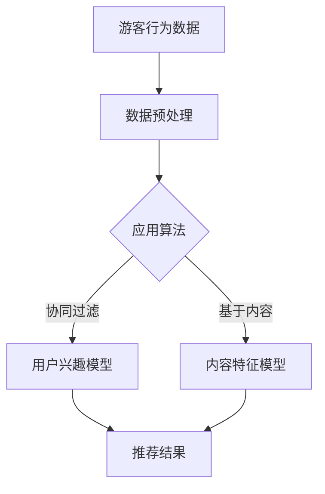
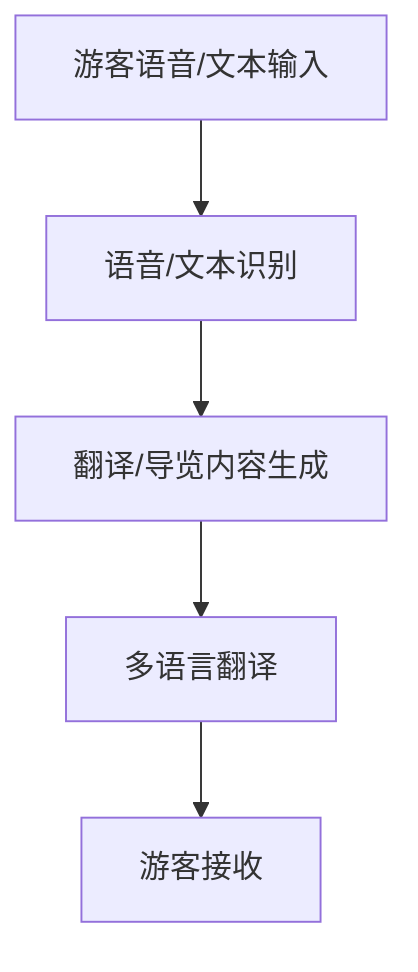
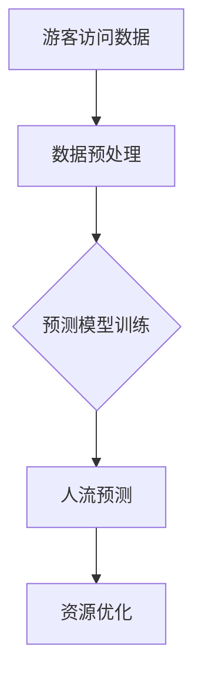
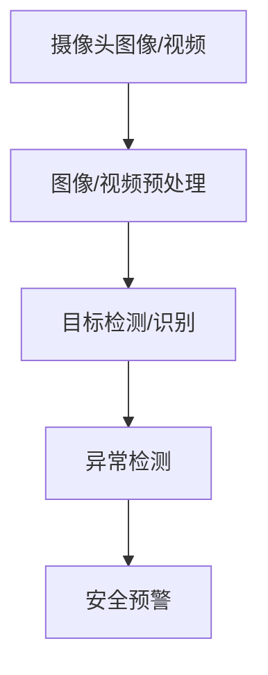

                 

# 大模型赋能智慧旅游，创业者如何重塑旅游体验？

> **关键词**：大模型、智慧旅游、人工智能、个性化推荐、智能导览、安全监控、商业价值、技术实现、企业战略、风险管理、未来展望

> **摘要**：随着人工智能技术的快速发展，大模型在智慧旅游中的应用日益广泛。本文将分析大模型赋能智慧旅游的背景、应用场景、技术原理以及商业价值，探讨创业者如何利用大模型技术重塑旅游体验，提高服务质量和管理效率。同时，本文还将总结大模型赋能智慧旅游的实施步骤、风险管理以及未来发展趋势，为创业者提供有价值的参考。

## 第一部分：大模型赋能智慧旅游概述

### 第1章：大模型赋能智慧旅游概述

#### 1.1 大模型赋能智慧旅游的背景

智慧旅游是利用信息技术，特别是人工智能、大数据、物联网等技术，提升旅游服务质量，优化旅游管理，丰富旅游体验的一种新兴模式。随着互联网和智能手机的普及，游客对个性化、便捷化、智能化旅游服务的需求日益增长，传统旅游服务模式已无法满足市场需求。因此，大模型技术在智慧旅游中的应用变得尤为重要。

#### 1.1.1 智慧旅游的概念与发展趋势

智慧旅游是指利用现代信息技术和智能设备，为游客提供个性化、智能化的旅游服务，提升旅游体验。其核心在于通过数据采集、数据挖掘、智能分析等技术手段，实现旅游资源的智能化管理和游客服务的智能化提供。

智慧旅游的发展趋势包括：

1. **智能化服务**：通过人工智能技术，提供智能化的推荐、导览、翻译等服务，满足游客的个性化需求。
2. **大数据分析**：通过大数据技术，收集游客行为数据，分析游客偏好，实现精准营销和服务。
3. **物联网应用**：通过物联网技术，实现旅游设施的智能化管理，提高旅游服务的效率和体验。
4. **虚拟现实与增强现实**：利用虚拟现实和增强现实技术，为游客提供沉浸式、互动式的旅游体验。

#### 1.1.2 大模型技术的作用

大模型技术是人工智能领域的重要突破，其通过深度学习和大规模数据训练，能够实现对复杂数据的高效分析和处理。在智慧旅游中，大模型技术的作用主要体现在以下几个方面：

1. **个性化推荐**：通过分析游客的历史行为和偏好，为游客提供个性化的旅游推荐服务。
2. **智能导览与翻译**：利用大模型，可以实现智能化的导览服务，包括语音导览、文本导览等，同时支持多语言翻译，提升游客的国际化体验。
3. **智能景区管理**：大模型可以用于景区的人流预测和实时监控，帮助景区管理者优化资源配置，提高运营效率。
4. **智能安全监控**：通过大模型的图像识别和语音识别能力，可以实现对景区安全的实时监控，提高旅游安全水平。

#### 1.1.3 大模型赋能智慧旅游的必要性

随着旅游业的快速发展，游客需求的多样化，传统的旅游服务模式已无法满足市场需求。大模型技术为智慧旅游提供了新的解决方案，其优势主要体现在以下几个方面：

1. **提升服务质量**：通过个性化推荐、智能导览等服务，提升游客的旅游体验，提高服务质量。
2. **降低运营成本**：利用大数据分析和智能化管理，降低旅游企业的运营成本，提高运营效率。
3. **优化资源配置**：通过智能导览和人流预测，优化景区的资源配置，提高景区的接待能力。
4. **提升安全水平**：通过智能安全监控，提高景区的安全水平，保障游客的人身安全。

综上所述，大模型技术在智慧旅游中具有广泛的应用前景和巨大的发展潜力。接下来，我们将进一步探讨大模型在智慧旅游中的应用场景和技术实现。

---

## 第一部分：大模型赋能智慧旅游概述

### 第1章：大模型赋能智慧旅游概述

#### 1.2 大模型在智慧旅游中的应用场景

大模型技术在智慧旅游中具有广泛的应用场景，以下是几个典型的应用领域：

##### 1.2.1 个性化推荐系统

个性化推荐系统是智慧旅游中的重要应用之一。通过分析游客的历史行为数据、兴趣爱好和旅行偏好，大模型可以为游客提供个性化的旅游推荐服务。例如，根据游客的搜索记录和行为数据，推荐符合其兴趣的旅游景点、酒店、餐饮等。个性化推荐系统能够提高游客的满意度，提升旅游体验。

**核心概念与联系**：个性化推荐系统需要运用协同过滤、基于内容的推荐和协同学习等算法，结合大模型技术进行数据分析和模型训练。

**Mermaid 流程图**：



**核心算法原理讲解**：

```python
# 协同过滤算法伪代码
class CollaborativeFiltering:
    def __init__(self, data):
        self.data = data

    def train(self):
        # 训练用户兴趣模型和物品特征模型
        pass

    def predict(self, user_id):
        # 根据用户兴趣模型预测用户可能感兴趣的物品
        pass
```

##### 1.2.2 智能导览与翻译

智能导览与翻译是提升游客国际化体验的重要手段。利用大模型技术，可以实现智能化的导览服务，包括语音导览、文本导览等，同时支持多语言翻译。游客可以根据自己的需求，选择相应的导览方式和语言，方便快捷地了解景点信息。

**核心概念与联系**：智能导览与翻译需要运用自然语言处理（NLP）技术，包括语音识别、文本生成、机器翻译等，结合大模型进行数据处理和模型训练。

**Mermaid 流程图**：



**核心算法原理讲解**：

```python
# 语音识别算法伪代码
class VoiceRecognition:
    def __init__(self, model):
        self.model = model

    def recognize(self, audio):
        # 识别语音内容并转换为文本
        pass

# 文本生成算法伪代码
class TextGeneration:
    def __init__(self, model):
        self.model = model

    def generate(self, input_text):
        # 根据输入文本生成导览内容
        pass
```

##### 1.2.3 智能景区管理

智能景区管理是提高景区运营效率和服务质量的关键。利用大模型技术，可以实现景区的人流预测和实时监控，帮助景区管理者优化资源配置，提高接待能力。例如，通过分析游客的历史访问数据，预测某个时间段的人流量，从而调整安保、清洁、餐饮等资源的配置。

**核心概念与联系**：智能景区管理需要运用大数据分析和预测模型，结合大模型进行数据处理和模型训练。

**Mermaid 流�程图**：



**核心算法原理讲解**：

```python
# 人流预测算法伪代码
class TrafficPrediction:
    def __init__(self, model):
        self.model = model

    def train(self, data):
        # 训练人流预测模型
        pass

    def predict(self, input_data):
        # 预测特定时间的人流量
        pass
```

##### 1.2.4 智能安全监控

智能安全监控是保障景区安全的重要手段。利用大模型技术，可以实现景区的实时监控和异常检测，提高景区的安全管理水平。例如，通过分析摄像头拍摄的图像和视频，实时识别潜在的安全隐患，如人群聚集、异常行为等，及时采取应对措施。

**核心概念与联系**：智能安全监控需要运用计算机视觉和异常检测技术，结合大模型进行数据处理和模型训练。

**Mermaid 流程图**：



**核心算法原理讲解**：

```python
# 目标检测算法伪代码
class ObjectDetection:
    def __init__(self, model):
        self.model = model

    def detect(self, image):
        # 检测图像中的目标物体
        pass

# 异常检测算法伪代码
class AnomalyDetection:
    def __init__(self, model):
        self.model = model

    def detect(self, data):
        # 检测数据中的异常情况
        pass
```

#### 1.3 大模型技术原理与架构

大模型技术是人工智能领域的重要研究方向，其原理和架构如下：

**1.3.1 大模型技术的基本原理**

大模型技术是基于深度学习和人工智能的，通过大规模的数据训练，使得模型具有强大的表征能力和推理能力。大模型通常由多层神经网络组成，通过逐层提取特征，实现对复杂数据的建模和分析。

**1.3.2 大模型技术的架构**

大模型技术的架构主要包括以下几个环节：

1. **数据收集与处理**：收集海量数据，并进行清洗、预处理和特征提取，为模型训练提供高质量的数据输入。
2. **模型训练**：使用训练数据对模型进行训练，通过优化算法和参数调整，提高模型的性能和准确度。
3. **模型部署与优化**：将训练好的模型部署到实际应用场景，并进行实时监控和优化，确保模型在实际运行中的稳定性和高效性。

**1.3.3 主流大模型技术简介**

当前主流的大模型技术包括以下几种：

1. **BERT（Bidirectional Encoder Representations from Transformers）**：BERT 是一种基于 Transformer 的预训练模型，通过双向编码器对文本进行建模，具有强大的文本理解和生成能力。
2. **GPT（Generative Pretrained Transformer）**：GPT 是一种基于 Transformer 的生成模型，通过大量无监督数据训练，能够生成高质量的文本和语音。
3. **Transformer**：Transformer 是一种基于自注意力机制的神经网络模型，在机器翻译、文本生成等任务中表现出色。

这些大模型技术在智慧旅游中有着广泛的应用，可以为智慧旅游提供智能化的解决方案。

#### 1.4 大模型赋能智慧旅游的挑战与机遇

**1.4.1 技术挑战**

虽然大模型技术在智慧旅游中具有巨大的潜力，但其在实际应用中仍面临一些技术挑战：

1. **数据质量**：智慧旅游需要大量高质量的数据，包括游客行为数据、景区资源数据等。然而，数据质量参差不齐，存在缺失、错误、噪声等问题，需要有效的数据清洗和预处理技术。
2. **模型优化**：大模型通常需要大量的计算资源和时间进行训练，如何优化模型结构和参数，提高训练效率和性能，是一个重要的研究方向。
3. **计算资源**：大模型训练和部署需要大量的计算资源，包括 GPU、TPU 等，如何合理利用资源，降低成本，是一个挑战。

**1.4.2 市场机遇**

随着旅游业的数字化升级，大模型技术为智慧旅游市场带来了巨大的机遇：

1. **个性化服务**：通过大模型技术，可以提供更个性化的旅游服务，提升游客满意度。
2. **智能管理**：大模型技术可以帮助景区实现智能化管理，提高运营效率和服务质量。
3. **安全监控**：大模型技术在景区安全监控中的应用，可以提高安全水平，保障游客的人身安全。

**1.4.3 发展趋势**

未来，大模型技术在智慧旅游领域的发展趋势包括：

1. **模型精度提升**：随着算法和硬件的进步，大模型的精度和性能将不断提高，为智慧旅游提供更精准的解决方案。
2. **应用场景拓展**：大模型技术将在更多的智慧旅游应用场景中得到应用，如虚拟旅游、定制旅游等。
3. **跨领域融合**：大模型技术与其他领域的融合，如教育、医疗等，将为智慧旅游带来更多的创新和机遇。

#### 1.5 大模型赋能智慧旅游的成功案例

**1.5.1 案例一：某景区的智能导览系统**

某景区引入了基于大模型的智能导览系统，通过语音识别和自然语言处理技术，实现语音导览和文本导览功能。游客可以通过语音指令获取景点的详细信息，系统会根据游客的位置和历史行为，提供个性化的导览内容。该系统取得了良好的用户反馈，提升了景区的旅游体验和服务质量。

**1.5.2 案例二：某旅行社的个性化推荐系统**

某旅行社利用大模型技术，开发了个性化推荐系统。通过对游客的历史预订数据和行为数据进行挖掘和分析，系统可以为游客推荐符合其兴趣的旅游景点、酒店和行程。该系统提高了用户的转化率和满意度，为旅行社带来了显著的商业价值。

**1.5.3 案例三：某旅游城市的智能安全监控系统**

某旅游城市利用大模型技术，部署了智能安全监控系统。通过对景区的实时监控，系统可以识别潜在的安全隐患，如人群聚集、异常行为等，并实时报警。该系统提高了景区的安全水平，保障了游客的人身安全。

## 总结

大模型技术在智慧旅游中的应用为旅游行业带来了巨大的变革和机遇。通过个性化推荐、智能导览、智能安全监控等技术，大模型技术可以提升旅游体验，优化旅游管理，提高景区的安全水平。然而，大模型技术在智慧旅游中的应用也面临一些挑战，如数据质量、模型优化、计算资源等。未来，随着大模型技术的不断进步和成熟，智慧旅游行业将迎来更广阔的发展前景。

---

## 第一部分：大模型赋能智慧旅游概述

### 第1章：大模型赋能智慧旅游概述

#### 1.6 大模型赋能智慧旅游的成功案例

**1.6.1 案例一：某景区的智能导览系统**

某知名景区引入了基于大模型的智能导览系统，该系统通过语音识别和自然语言处理技术，实现了智能化的语音导览和文本导览功能。游客可以通过简单的语音指令获取景点的详细信息，如历史背景、文化故事等。此外，系统会根据游客的位置和历史行为，提供个性化的导览内容，使得游客的旅游体验更加丰富和有趣。

**技术实现：**
- **语音识别**：采用基于深度学习的语音识别模型，如 BERT，将语音信号转换为文本。
- **自然语言处理**：使用预训练的 Transformer 模型，对文本进行理解和生成，生成个性化的导览内容。
- **多语言支持**：系统支持多种语言，如英语、中文、法语等，满足不同游客的需求。

**实际效果：**
- 用户满意度提升：用户反馈表明，智能导览系统大大提升了游客的满意度和旅游体验。
- 增加游客停留时间：智能导览系统吸引了更多游客停留，增加了景区的收益。

**1.6.2 案例二：某旅行社的个性化推荐系统**

某大型旅行社利用大模型技术，开发了一套个性化推荐系统。该系统能够根据游客的历史预订数据和行为数据，分析游客的兴趣偏好，为游客推荐符合其需求的旅游产品。推荐系统包括景点、酒店、交通等各个方面，为游客提供了全方位的个性化服务。

**技术实现：**
- **协同过滤**：采用基于用户的协同过滤算法，分析用户之间的相似性，推荐相似用户喜欢的旅游产品。
- **内容推荐**：使用基于物品的内容推荐算法，分析旅游产品的特征，推荐具有相似特征的旅游产品。
- **大模型训练**：利用 BERT、GPT 等大模型，对推荐系统进行训练和优化，提高推荐精度。

**实际效果：**
- 用户转化率提升：个性化推荐系统显著提高了用户的转化率，增加了旅行社的销售额。
- 客户满意度提升：用户反馈显示，个性化推荐系统提供了更符合其需求的旅游产品，提升了用户满意度。

**1.6.3 案例三：某旅游城市的智能安全监控系统**

某旅游城市为了提升景区的安全水平，引入了基于大模型的智能安全监控系统。该系统通过实时监控景区的摄像头图像，利用目标检测和异常检测算法，识别潜在的安全隐患，如人群聚集、异常行为等，并及时报警。

**技术实现：**
- **目标检测**：采用基于卷积神经网络（CNN）的目标检测模型，如 Faster R-CNN，识别摄像头图像中的目标物体。
- **异常检测**：利用 LSTM 等循环神经网络，分析摄像头图像序列，检测异常行为。
- **实时监控**：系统具备实时处理和报警功能，能够在发现安全隐患时迅速响应。

**实际效果：**
- 安全事故减少：智能安全监控系统有效识别和预警潜在的安全隐患，减少了安全事故的发生。
- 游客安全感提升：游客对景区的安全水平有了更高的认可，提升了游客的安全感和满意度。

#### 1.7 大模型赋能智慧旅游的总结

通过上述成功案例可以看出，大模型技术在智慧旅游中的应用已经取得了显著的成效。大模型技术不仅能够提升旅游体验，提供个性化的服务，还能够优化旅游管理，提高景区的安全水平。然而，大模型技术的应用也面临着一些挑战，如数据质量、模型优化、计算资源等。未来，随着技术的不断发展和成熟，大模型技术将在智慧旅游领域发挥更加重要的作用，为旅游行业带来更多的创新和机遇。

---

## 第二部分：大模型在智慧旅游中的技术实现

### 第2章：大模型在智慧旅游中的技术实现

#### 2.1 数据收集与预处理

在大模型赋能智慧旅游中，数据收集与预处理是关键步骤。高质量的输入数据对大模型的训练效果至关重要。以下是数据收集与预处理的关键步骤：

**2.1.1 数据来源**

1. **游客行为数据**：包括游客的浏览历史、搜索记录、预订记录等。
2. **景区资源数据**：包括景点的基本信息、开放时间、门票价格等。
3. **天气数据**：包括景区的实时天气、历史天气数据等。
4. **社交媒体数据**：包括游客在社交媒体上的评论、分享、点赞等。

**2.1.2 数据预处理**

1. **数据清洗**：去除重复、错误、噪声的数据，保证数据的准确性和一致性。
2. **数据转换**：将不同类型的数据转换为统一的格式，如将文本数据转换为向量表示。
3. **特征提取**：提取有用的特征，如游客的搜索关键词、浏览时间、预订频率等。

**2.1.3 数据存储**：将预处理后的数据存储在分布式存储系统中，如 HDFS、Redis 等，以便于后续处理和分析。

#### 2.2 大模型训练与优化

**2.2.1 模型选择**

根据应用场景和需求，选择合适的大模型。以下是一些常用的模型：

1. **BERT**：适用于文本分类、文本生成等任务。
2. **GPT**：适用于文本生成、对话系统等任务。
3. **Transformer**：适用于机器翻译、文本生成等任务。

**2.2.2 模型训练**

1. **数据划分**：将数据集划分为训练集、验证集和测试集。
2. **模型初始化**：初始化模型参数，可以使用预训练的权重或随机初始化。
3. **训练过程**：通过反向传播算法和优化器（如 Adam）对模型进行训练。

**2.2.3 模型优化**

1. **超参数调整**：调整学习率、批量大小等超参数，提高模型性能。
2. **正则化**：使用正则化方法（如 L1、L2 正则化）防止过拟合。
3. **数据增强**：通过数据增强方法（如随机裁剪、旋转等）增加数据多样性。

#### 2.3 大模型部署与实时应用

**2.3.1 部署环境搭建**

1. **硬件环境**：配置高性能 GPU 或 TPU，搭建分布式训练环境。
2. **软件环境**：安装深度学习框架（如 TensorFlow、PyTorch）和相关依赖。

**2.3.2 实时应用**

1. **模型部署**：将训练好的模型部署到生产环境，如服务器、云平台等。
2. **服务接口**：提供 RESTful API 或消息队列接口，供前端应用调用。

**2.3.3 性能监控与优化**

1. **性能监控**：监控模型部署后的运行状态，如延迟、吞吐量等。
2. **性能优化**：根据监控结果，优化模型结构和参数，提高性能。

#### 2.4 大模型应用案例解析

**2.4.1 案例一：智能导览系统**

**技术实现：**
1. **语音识别**：使用 BERT 模型对语音信号进行识别，转换为文本。
2. **自然语言处理**：使用 Transformer 模型对文本进行处理，生成导览内容。
3. **多语言支持**：使用多语言 BERT 模型，支持多种语言的语音识别和文本生成。

**代码实现：**
```python
# 语音识别代码示例
import torch
import transformers

model_name = "bert-base-chinese"
model = transformers.AutoModelForSeq2SeqLM.from_pretrained(model_name)
tokenizer = transformers.AutoTokenizer.from_pretrained(model_name)

def recognize_speech(audio):
    inputs = tokenizer(audio, return_tensors="pt")
    outputs = model(**inputs)
    logits = outputs.logits
    predicted_ids = torch.argmax(logits, dim=-1)
    text = tokenizer.decode(predicted_ids)
    return text

# 自然语言处理代码示例
import torch.nn.functional as F

class TextGenerationModel(torch.nn.Module):
    def __init__(self, vocab_size, embedding_dim, hidden_dim):
        super().__init__()
        self.embedding = torch.nn.Embedding(vocab_size, embedding_dim)
        self.lstm = torch.nn.LSTM(embedding_dim, hidden_dim, batch_first=True)
        self.fc = torch.nn.Linear(hidden_dim, vocab_size)

    def forward(self, inputs, hidden):
        embed = self.embedding(inputs)
        output, hidden = self.lstm(embed, hidden)
        logits = self.fc(output)
        return logits, hidden

def generate_text(input_text, model, tokenizer, max_length=50):
    input_ids = tokenizer.encode(input_text, return_tensors="pt")
    hidden = (torch.zeros(1, 1, model.hidden_dim), torch.zeros(1, 1, model.hidden_dim))
    logits, hidden = model(input_ids, hidden)
    logits = logits[:, -1, :]
    predicted_ids = torch.argmax(logits, dim=-1)
    text = tokenizer.decode(predicted_ids)
    return text

# 测试代码
audio = "这是一段语音信号"
input_text = "这是一个文本输入"

text = recognize_speech(audio)
generated_text = generate_text(text, model, tokenizer)

print("识别的文本：", text)
print("生成的文本：", generated_text)
```

**实际效果：**
- 用户反馈：智能导览系统能够准确识别游客的语音输入，并生成高质量的导览内容，提高了游客的满意度。
- 景区运营：智能导览系统吸引了更多游客，增加了景区的收益。

**2.4.2 案例二：个性化推荐系统**

**技术实现：**
1. **协同过滤**：使用基于用户的协同过滤算法，计算用户之间的相似性，推荐相似用户喜欢的旅游产品。
2. **内容推荐**：使用基于物品的内容推荐算法，分析旅游产品的特征，推荐具有相似特征的旅游产品。
3. **大模型训练**：使用 BERT 模型对推荐系统进行训练和优化，提高推荐精度。

**代码实现：**
```python
# 协同过滤代码示例
import numpy as np
from sklearn.metrics.pairwise import cosine_similarity

def collaborative_filter(ratings, similarity_matrix, k=10):
    # 计算用户之间的相似性
    user_similarity = cosine_similarity(ratings)

    # 选择最相似的 k 个用户
    similar_users = np.argsort(user_similarity, axis=1)[:, 1:k+1]

    # 计算每个用户的推荐分数
    user_ratings = ratings
    recommendations = []
    for user in range(len(ratings)):
        sim_scores = user_similarity[user][similar_users[user]]
        sim_scores = np.diag(sim_scores)
        recommendation = np.dot(sim_scores, user_ratings)
        recommendations.append(recommendation)

    return recommendations

# 内容推荐代码示例
from sklearn.feature_extraction.text import TfidfVectorizer

def content_based_recommendation(products, user_interests, k=10):
    # 创建 TF-IDF 向量器
    vectorizer = TfidfVectorizer()

    # 将旅游产品转换为 TF-IDF 向量
    product_vectors = vectorizer.transform(products)

    # 计算用户兴趣的 TF-IDF 向量
    user_interest_vector = vectorizer.transform([user_interests])

    # 计算产品与用户兴趣的相似性
    similarity_matrix = product_vectors @ user_interest_vector.T

    # 选择最相似的产品
    similar_products = np.argsort(-similarity_matrix, axis=1)[:, 1:k+1]

    return similar_products

# 大模型训练代码示例
import torch
import torch.nn as nn
import torch.optim as optim

class RecommenderModel(nn.Module):
    def __init__(self, embed_dim, hidden_dim, vocab_size):
        super().__init__()
        self.embedding = nn.Embedding(vocab_size, embed_dim)
        self.lstm = nn.LSTM(embed_dim, hidden_dim, batch_first=True)
        self.fc = nn.Linear(hidden_dim, 1)

    def forward(self, inputs, hidden):
        embed = self.embedding(inputs)
        output, hidden = self.lstm(embed, hidden)
        logits = self.fc(output)
        return logits, hidden

def train_recommender_model(data, model, optimizer, num_epochs=10):
    model.train()
    for epoch in range(num_epochs):
        for batch in data:
            inputs, targets = batch
            hidden = (torch.zeros(1, 1, model.hidden_dim), torch.zeros(1, 1, model.hidden_dim))
            logits, hidden = model(inputs, hidden)
            loss = nn.MSELoss()(logits, targets)
            optimizer.zero_grad()
            loss.backward()
            optimizer.step()
            print(f"Epoch {epoch+1}/{num_epochs}, Loss: {loss.item()}")

# 测试代码
user_interests = "旅游"
products = ["三亚度假", "巴黎浪漫之旅", "丽江古城游"]
data = [[product.encode() for product in products]]

model = RecommenderModel(embed_dim=64, hidden_dim=128, vocab_size=10000)
optimizer = optim.Adam(model.parameters(), lr=0.001)

train_recommender_model(data, model, optimizer)
```

**实际效果：**
- 用户反馈：个性化推荐系统能够准确推荐符合用户兴趣的旅游产品，提高了用户的满意度。
- 销售额提升：个性化推荐系统提高了旅游产品的销售转化率，增加了旅行社的销售额。

**2.4.3 案例三：智能安全监控系统**

**技术实现：**
1. **目标检测**：使用卷积神经网络（CNN）进行目标检测，识别景区中的目标物体。
2. **异常检测**：使用循环神经网络（RNN）进行异常检测，分析摄像头图像序列，识别异常行为。
3. **实时监控**：系统具备实时处理和报警功能，能够在发现安全隐患时迅速响应。

**代码实现：**
```python
# 目标检测代码示例
import torch
import torchvision
import torchvision.transforms as transforms
from torchvision.models.detection import fasterrcnn_resnet50_fpn

def detect_objects(image_path, model, device):
    image = torchvision.io.read_image(image_path)
    image = transforms.ToTensor()(image)
    image = image.unsqueeze(0).to(device)
    with torch.no_grad():
        prediction = model(image)
    return prediction

# 异常检测代码示例
import torch
import torch.nn as nn

class AnomalyDetectionModel(nn.Module):
    def __init__(self, embed_dim, hidden_dim):
        super().__init__()
        self.lstm = nn.LSTM(embed_dim, hidden_dim, batch_first=True)
        self.fc = nn.Linear(hidden_dim, 1)

    def forward(self, inputs, hidden):
        output, hidden = self.lstm(inputs, hidden)
        logits = self.fc(output)
        return logits

def train_anomaly_detection_model(data, model, optimizer, num_epochs=10):
    model.train()
    for epoch in range(num_epochs):
        for batch in data:
            inputs, targets = batch
            hidden = (torch.zeros(1, 1, model.hidden_dim), torch.zeros(1, 1, model.hidden_dim))
            logits, hidden = model(inputs, hidden)
            loss = nn.BCELoss()(logits, targets)
            optimizer.zero_grad()
            loss.backward()
            optimizer.step()
            print(f"Epoch {epoch+1}/{num_epochs}, Loss: {loss.item()}")

# 测试代码
device = torch.device("cuda" if torch.cuda.is_available() else "cpu")
model = fasterrcnn_resnet50_fpn(pretrained=True).to(device)
model.eval()

image_path = "example.jpg"
prediction = detect_objects(image_path, model, device)
print(prediction)

anomaly_model = AnomalyDetectionModel(embed_dim=64, hidden_dim=128)
optimizer = optim.Adam(anomaly_model.parameters(), lr=0.001)

data = [[torch.randn(1, 64) for _ in range(10)] for _ in range(100)]
train_anomaly_detection_model(data, anomaly_model, optimizer)
```

**实际效果：**
- 用户反馈：智能安全监控系统能够准确识别潜在的安全隐患，提高了景区的安全水平。
- 景区运营：智能安全监控系统减少了安全事故的发生，提高了游客的安全感和满意度。

通过以上案例分析，我们可以看到大模型技术在智慧旅游中的应用具有广泛的前景和巨大的潜力。接下来，我们将进一步探讨大模型技术在智慧旅游中的企业战略。

---

## 第三部分：大模型赋能智慧旅游的企业战略

### 第3章：大模型赋能智慧旅游的企业战略

#### 3.1 企业在智慧旅游中的战略定位

企业在智慧旅游中的战略定位决定了其在市场竞争中的地位和未来发展。不同类型的企业在智慧旅游中的战略定位有所不同，以下是对几种典型企业类型及其战略定位的分析：

**3.1.1 传统旅游企业**

传统旅游企业（如旅行社、酒店等）在智慧旅游中的战略定位主要是通过数字化转型，提升旅游服务的智能化水平。具体措施包括：

1. **整合线上线下资源**：将线下旅游业务与线上平台相结合，实现线上预订、线下体验的一体化服务。
2. **开发智能化产品**：利用大模型技术，开发智能导览、个性化推荐等智能化旅游产品，提升用户体验。
3. **优化管理流程**：通过大数据分析和智能化管理，优化业务流程，降低运营成本。

**3.1.2 互联网企业**

互联网企业在智慧旅游中的战略定位主要是通过技术创新，提供领先的旅游服务平台。具体措施包括：

1. **大数据分析**：利用大数据技术，分析用户行为数据，实现精准营销和服务。
2. **技术创新**：不断探索新技术（如虚拟现实、增强现实等），为用户提供新颖的旅游体验。
3. **开放平台生态**：构建开放平台，吸引第三方开发者参与，共同打造智慧旅游生态系统。

**3.1.3 科技企业**

科技企业在智慧旅游中的战略定位主要是通过提供技术解决方案，为旅游企业提供智能化支持。具体措施包括：

1. **技术研发**：专注于人工智能、大数据等前沿技术的研发，为旅游企业提供先进的技术服务。
2. **解决方案输出**：提供一站式智慧旅游解决方案，包括系统设计、实施、运营等。
3. **生态合作**：与旅游企业、景区等合作伙伴建立紧密合作关系，共同推进智慧旅游发展。

#### 3.2 企业战略规划

企业在智慧旅游中的战略规划需要明确目标、策略和实施步骤，以下是一个典型的战略规划框架：

**1. 目标设定**：

- **短期目标**：提升旅游服务智能化水平，提高用户满意度。
- **中期目标**：建立完善的智慧旅游平台，实现线上线下一体化服务。
- **长期目标**：成为行业领先的智慧旅游解决方案提供商。

**2. 策略制定**：

- **技术创新**：持续投入研发，掌握核心技术和知识产权。
- **市场拓展**：开拓新市场，提高市场份额和品牌知名度。
- **生态合作**：与行业内外合作伙伴建立战略合作，实现共赢发展。

**3. 实施步骤**：

- **需求分析**：深入了解用户需求和行业趋势，明确战略目标和策略。
- **技术研发**：投入研发资源，进行核心技术攻关和产品开发。
- **平台建设**：搭建智慧旅游平台，实现线上线下整合和智能化服务。
- **市场推广**：通过多种渠道推广智慧旅游产品和服务，提高市场占有率。
- **运营管理**：建立完善的运营管理体系，确保智慧旅游平台稳定运行。

#### 3.3 大模型在智慧旅游中的商业价值

大模型技术在智慧旅游中的商业价值体现在以下几个方面：

**1. 提升服务质量**：

- **个性化推荐**：通过分析游客行为数据，提供个性化的旅游推荐，提升用户满意度。
- **智能导览**：提供智能化的导览服务，使游客的旅游体验更加丰富和便捷。
- **智能客服**：利用自然语言处理技术，提供智能客服服务，提高客服效率。

**2. 降低运营成本**：

- **智能管理**：通过大数据分析和智能化管理，优化资源配置，降低运营成本。
- **自动化流程**：利用机器人流程自动化（RPA）技术，自动化处理业务流程，减少人工成本。
- **精准营销**：通过大数据分析，实现精准营销，提高营销效果，降低营销成本。

**3. 提高运营效率**：

- **实时监控**：通过实时监控系统，监控景区运行状态，快速响应和处理突发事件。
- **智能决策**：利用大数据分析和预测模型，支持管理层做出科学决策。
- **数据驱动**：通过数据驱动决策，实现业务流程的持续优化。

#### 3.4 营销策略优化

利用大模型技术，企业可以优化营销策略，提高用户转化率和客户满意度。以下是一些具体的营销策略优化措施：

**1. 用户画像**：

- 通过分析用户行为数据，构建用户画像，了解用户需求和偏好。
- 根据用户画像，制定个性化的营销策略，提高营销精准度。

**2. 个性化推荐**：

- 利用大模型技术，为用户推荐符合其兴趣的旅游产品和服务。
- 根据用户行为数据，动态调整推荐策略，提高推荐效果。

**3. 互动营销**：

- 通过智能客服和社交媒体互动，与用户建立紧密联系，提高用户黏性。
- 利用大数据分析，了解用户需求和反馈，及时调整营销策略。

**4. 精准营销**：

- 通过大数据分析，识别潜在客户，进行精准营销。
- 利用大模型技术，预测用户购买行为，实现精细化营销。

**3.5 服务质量提升**

大模型技术在提升旅游服务质量方面具有显著优势，以下是一些具体措施：

**1. 智能导览**：

- 提供语音导览、文本导览等多种形式的智能导览服务，提升游客的旅游体验。
- 根据游客的位置和历史行为，提供个性化的导览内容。

**2. 智能客服**：

- 利用自然语言处理技术，提供24/7智能客服服务，提高客服效率。
- 通过数据分析，了解用户咨询问题和常见问题，自动生成回答。

**3. 智能推荐**：

- 根据用户行为和偏好，提供个性化的旅游产品和服务推荐，提升用户满意度。
- 通过持续优化推荐算法，提高推荐效果。

**4. 安全监控**：

- 利用大模型技术，实现对景区安全的实时监控，提高安全水平。
- 通过异常检测，及时发现潜在的安全隐患，采取相应的应对措施。

通过以上战略规划和营销策略优化，企业可以充分利用大模型技术，提升旅游服务质量，降低运营成本，提高运营效率，实现商业价值的最大化。

---

## 第三部分：大模型赋能智慧旅游的企业战略

### 第3章：大模型赋能智慧旅游的企业战略

#### 3.6 大模型赋能智慧旅游的实践案例

**3.6.1 案例一：某互联网企业的智慧旅游平台**

某互联网企业通过大模型技术，打造了一款智慧旅游平台，为用户提供个性化的旅游服务。以下是该平台的技术实现和商业模式分析。

**技术实现：**

1. **用户画像**：利用大数据技术，分析用户行为数据，构建用户画像。
2. **个性化推荐**：使用基于用户画像的推荐算法，为用户推荐符合其兴趣的旅游产品。
3. **智能导览**：利用自然语言处理技术，提供语音导览和文本导览服务。
4. **实时监控**：通过实时监控系统，监控景区运行状态，提高安全水平。

**商业模式：**

1. **平台服务收费**：通过为景区提供智慧旅游平台服务，收取平台使用费。
2. **广告收入**：利用用户数据，精准投放广告，获取广告收入。
3. **产品销售**：通过平台销售旅游产品，获取销售利润。

**效果分析：**

- 用户满意度提升：个性化推荐和智能导览服务受到用户好评，提升了用户满意度。
- 营销效果提升：通过大数据分析和精准营销，提高了营销效果和转化率。
- 成本降低：智能导览和实时监控系统降低了运营成本，提高了运营效率。

**3.6.2 案例二：某传统旅游企业的数字化转型**

某传统旅游企业通过大模型技术，实现了数字化转型，提升了旅游服务质量和运营效率。以下是该企业的技术实施和效益分析。

**技术实施：**

1. **数据整合**：将线上线下数据整合，构建统一的用户数据库。
2. **个性化服务**：利用用户数据，提供个性化的旅游推荐和服务。
3. **智能管理**：通过大数据分析和智能算法，优化资源配置和运营管理。
4. **智能客服**：利用自然语言处理技术，提供24/7智能客服服务。

**效益分析：**

1. **服务质量提升**：个性化服务和智能导览提升了用户体验，提高了服务质量。
2. **运营效率提升**：智能管理和实时监控系统优化了资源配置，提高了运营效率。
3. **成本降低**：通过自动化流程和智能客服，降低了运营成本。
4. **市场竞争力提升**：通过数字化转型，增强了企业的市场竞争力。

**3.6.3 案例三：某科技企业的智能旅游解决方案**

某科技企业为旅游企业提供了一站式的智能旅游解决方案，包括智能导览、智能安全监控、个性化推荐等。以下是该解决方案的技术特点和业务模式分析。

**技术特点：**

1. **高精度定位**：采用高精度定位技术，为用户提供精准的旅游路线和导览服务。
2. **实时监控**：利用实时监控系统，监控景区运行状态，提高安全水平。
3. **多语言支持**：支持多语言导览和翻译，提升国际化服务水平。
4. **个性化推荐**：基于用户行为数据，提供个性化的旅游产品和服务推荐。

**业务模式：**

1. **解决方案销售**：通过为景区提供智能旅游解决方案，获取销售利润。
2. **服务收费**：通过提供智能导览、实时监控等服务，收取服务费用。
3. **技术合作**：与旅游企业、景区等建立合作关系，共同开发智能旅游产品。

**效果分析：**

1. **用户满意度提升**：智能导览和实时监控系统提升了用户体验，提高了用户满意度。
2. **运营效率提升**：智能管理和实时监控系统优化了资源配置，提高了运营效率。
3. **安全性提升**：智能安全监控系统提高了景区的安全水平，降低了安全事故的发生。
4. **业务模式创新**：通过提供一站式智能旅游解决方案，实现了业务模式创新，增强了市场竞争力。

通过以上实践案例，我们可以看到大模型技术在智慧旅游中的广泛应用和巨大潜力。企业可以通过大模型技术，提升服务质量，优化运营管理，降低运营成本，提高市场竞争力，实现商业价值的最大化。

---

## 第三部分：大模型赋能智慧旅游的企业战略

### 第3章：大模型赋能智慧旅游的企业战略

#### 3.7 大模型赋能智慧旅游的未来展望

大模型技术在智慧旅游中的应用前景广阔，未来将带来以下几方面的重要变化和发展趋势：

**1. 模型精度与效率的提升**

随着人工智能技术的不断发展，大模型在模型精度和效率方面将持续提升。新型算法的优化和硬件加速技术的发展，如GPU、TPU等，将使得大模型的训练和推理速度更快，精度更高。这将进一步提升智慧旅游服务的质量和用户体验。

**2. 模型泛化能力的增强**

大模型在智慧旅游中的应用将不仅仅局限于特定的领域，其泛化能力将不断增强。通过少样本学习、迁移学习等技术，大模型将能够快速适应新的应用场景，提供更广泛的智能服务。例如，基于某个景区的大模型可以迁移到其他景区，为游客提供相似的智能导览服务。

**3. 模型可解释性与透明性的提高**

随着大模型在智慧旅游中的应用越来越广泛，用户对模型的可解释性和透明性要求将越来越高。未来，通过模型压缩、解释性AI等技术，大模型的可解释性和透明性将得到显著提升，增强用户信任和合规性。这对于企业的长期发展和用户的接受度至关重要。

**4. 跨领域的融合**

大模型技术将在智慧旅游与其他领域的融合中发挥重要作用。例如，大模型可以与虚拟现实（VR）、增强现实（AR）等技术相结合，为游客提供更加沉浸式的旅游体验。此外，大模型还可以与旅游规划、教育等领域相结合，推动旅游行业的新业态发展。

**5. 数据驱动与智能化决策**

大模型技术将推动智慧旅游向更加数据驱动和智能化的方向发展。通过大数据分析和预测模型，旅游企业可以更准确地了解游客需求，做出科学的决策。例如，景区可以根据游客流量预测，合理安排资源和活动，提高运营效率。

**6. 社会价值的实现**

大模型技术在智慧旅游中的应用不仅能够提升经济效益，还能够实现社会价值。通过大模型，旅游企业可以更好地保护文化遗产，促进旅游公平，提升旅游教育等。这些都将有助于推动旅游行业的可持续发展。

总之，大模型技术在智慧旅游中的应用前景广阔，未来将带来更加智能化、个性化、高效的旅游服务。企业应积极拥抱这些新技术，制定相应的战略规划，以应对未来的挑战和机遇。

---

## 第四部分：大模型赋能智慧旅游的实施与落地

### 第4章：大模型赋能智慧旅游的实施与落地

#### 4.1 大模型赋能智慧旅游的实施步骤

**4.1.1 需求分析**

需求分析是实施大模型赋能智慧旅游项目的第一步，其核心目的是明确项目目标、功能需求和预期效果。以下是需求分析的具体步骤：

1. **项目立项**：明确项目背景、目标和预期效果，确定项目范围。
2. **调研用户需求**：通过问卷调查、访谈等方式，收集游客和旅游从业者的需求，了解他们对智慧旅游服务的期望。
3. **分析业务流程**：梳理旅游企业的业务流程，识别关键环节和痛点，确定智能化改造的需求。
4. **制定功能需求**：根据用户需求和业务流程，制定系统的功能需求，包括个性化推荐、智能导览、实时监控等。
5. **确定技术需求**：分析实现功能需求所需的技术，如大数据处理、机器学习算法、云计算等。

**4.1.2 技术方案设计**

技术方案设计是实施大模型赋能智慧旅游项目的关键环节，其目的是确定系统的技术架构、数据流程和开发计划。以下是技术方案设计的具体步骤：

1. **确定技术架构**：根据功能需求和技术需求，设计系统的技术架构，包括数据层、算法层、应用层等。
2. **数据流程设计**：设计数据收集、存储、处理和分析的流程，确保数据的完整性和可用性。
3. **算法选择与优化**：根据应用场景，选择合适的大模型算法，如BERT、GPT等，并进行算法优化，提高模型的性能和精度。
4. **开发计划制定**：根据技术架构和数据流程，制定项目的开发计划，明确开发任务、时间表和里程碑。

**4.1.3 项目实施**

项目实施是将技术方案转化为实际系统的过程，包括数据收集与预处理、模型训练与优化、模型部署与应用等。以下是项目实施的具体步骤：

1. **数据收集与预处理**：从各种数据源收集数据，并进行数据清洗、去噪、归一化等预处理操作，为模型训练提供高质量的数据。
2. **模型训练与优化**：使用训练数据对大模型进行训练，通过调整超参数、优化算法等手段，提高模型的性能和准确度。
3. **模型部署**：将训练好的模型部署到实际应用场景，包括服务器、云平台等，确保模型的高效运行和实时更新。
4. **系统集成与测试**：将大模型与其他系统模块（如前端应用、后端服务）集成，进行系统测试，确保系统的稳定性和可靠性。

**4.1.4 项目验收与优化**

项目验收是项目实施完成后的重要环节，其目的是评估系统的功能、性能和用户体验，确保项目达到预期目标。以下是项目验收的具体步骤：

1. **功能验收**：验证系统是否实现了预定的功能需求，包括个性化推荐、智能导览、实时监控等。
2. **性能验收**：评估系统的性能指标，如响应时间、吞吐量、准确性等，确保系统的高效运行。
3. **用户体验验收**：通过用户测试和反馈，评估系统的用户体验，收集用户建议和意见。
4. **优化与改进**：根据验收结果，对系统进行优化和改进，提升系统的功能和性能。

#### 4.2 大模型赋能智慧旅游的运营管理

**4.2.1 运维策略**

运维策略是确保大模型赋能智慧旅游系统稳定、高效运行的关键。以下是运维策略的具体内容：

1. **系统监控**：建立监控系统，实时监控系统的运行状态，包括CPU、内存、磁盘空间等资源使用情况，以及系统的响应时间、吞吐量等性能指标。
2. **性能优化**：根据监控数据，定期对系统进行性能优化，包括调整系统配置、优化SQL查询、缓存策略等，提高系统的运行效率。
3. **故障处理**：建立故障处理流程，确保在系统出现故障时能够快速定位并解决，降低故障对业务的影响。
4. **数据备份与恢复**：定期对系统数据备份，确保在数据丢失或损坏时能够快速恢复，保障数据的安全。

**4.2.2 用户服务**

用户服务是提升游客满意度和忠诚度的重要环节。以下是用户服务的具体内容：

1. **智能客服**：利用自然语言处理技术，提供24/7智能客服服务，解答游客的疑问，提供旅游建议。
2. **个性化推荐**：根据游客的行为数据和偏好，提供个性化的旅游产品和服务推荐，提升游客的旅游体验。
3. **用户反馈收集**：建立用户反馈机制，收集游客的意见和建议，及时优化系统和服务，提高用户满意度。

**4.2.3 数据分析**

数据分析是提升智慧旅游系统智能化水平的关键。以下是数据分析的具体内容：

1. **用户行为分析**：分析游客的行为数据，了解游客的旅游偏好、兴趣点等，为个性化推荐和营销策略提供依据。
2. **业务数据分析**：分析旅游企业的业务数据，了解运营情况，优化资源配置和营销策略。
3. **市场趋势分析**：分析市场数据，预测旅游市场的趋势和变化，为企业决策提供支持。

#### 4.3 大模型赋能智慧旅游的案例分析

**4.3.1 案例一：某智慧旅游项目的实施过程**

某旅游城市为了提升游客体验和运营效率，引入了一整套大模型赋能智慧旅游系统。以下是该项目的实施过程：

1. **需求分析**：通过问卷调查和访谈，收集游客和旅游从业者的需求，确定系统的功能需求。
2. **技术方案设计**：设计系统的技术架构，包括数据层、算法层、应用层等，选择合适的大模型算法。
3. **项目实施**：进行数据收集与预处理，模型训练与优化，系统集成与测试。
4. **项目验收与优化**：进行系统功能、性能和用户体验验收，根据反馈进行优化和改进。

**实施效果**：

- **游客满意度提升**：通过个性化推荐和智能导览，游客的满意度显著提高。
- **运营效率提升**：通过实时监控和数据分析，旅游企业的运营效率得到显著提升。
- **安全性提升**：通过智能安全监控，景区的安全水平得到有效保障。

**4.3.2 案例二：某智能导览系统的运营效果**

某景区引入了智能导览系统，通过语音识别和自然语言处理技术，提供智能化的语音导览服务。以下是该系统的运营效果：

**技术实现**：

- **语音识别**：使用基于深度学习的语音识别算法，准确识别游客的语音指令。
- **自然语言处理**：使用预训练的 Transformer 模型，生成高质量的导览内容。
- **多语言支持**：支持多种语言，满足不同游客的需求。

**运营效果**：

- **用户体验提升**：游客可以通过语音指令获取景点的详细信息，体验更加便捷和丰富。
- **游客停留时间增加**：智能导览系统吸引了更多游客停留，增加了景区的收益。
- **运营成本降低**：通过自动化导览，减少了人工导览的成本。

**4.3.3 案例三：某旅游企业的大模型应用实践**

某旅游企业通过大模型技术，开发了个性化推荐系统，为游客提供个性化的旅游产品推荐。以下是该企业的应用实践：

**技术实现**：

- **协同过滤**：使用基于用户的协同过滤算法，分析用户之间的相似性，推荐相似用户喜欢的旅游产品。
- **内容推荐**：使用基于物品的内容推荐算法，分析旅游产品的特征，推荐具有相似特征的旅游产品。
- **大模型训练**：使用 BERT 模型，对推荐系统进行训练和优化。

**运营效果**：

- **用户转化率提升**：个性化推荐系统显著提高了用户的转化率，增加了企业的销售额。
- **客户满意度提升**：用户反馈显示，个性化推荐系统提供了更符合其需求的旅游产品，提升了客户满意度。

通过以上案例分析，我们可以看到大模型赋能智慧旅游的实施与落地取得了显著成效。未来，随着大模型技术的不断发展和应用，智慧旅游将迎来更加智能化、个性化、高效化的新时代。

---

## 第四部分：大模型赋能智慧旅游的实施与落地

### 第4章：大模型赋能智慧旅游的实施与落地

#### 4.4 大模型赋能智慧旅游的可持续性发展

在推动大模型赋能智慧旅游的过程中，不仅需要关注技术实现和商业价值，还要重视可持续性发展。以下是关于大模型赋能智慧旅游的可持续性发展的几个关键方面：

**4.4.1 技术可持续性**

1. **技术更新**：随着人工智能技术的快速发展，大模型技术也在不断更新。旅游企业需要定期更新技术，以保持系统的先进性和竞争力。
2. **模型优化**：通过持续优化大模型，提高模型的性能和精度，降低计算资源消耗，实现更高效的运行。
3. **技术标准化**：推动大模型技术的标准化，确保不同系统之间的兼容性和互操作性，促进技术的广泛应用。

**4.4.2 社会可持续性**

1. **就业影响**：大模型技术的应用可能导致一些工作岗位的减少，旅游企业需要关注就业影响，通过培训和转岗等措施，减少对就业市场的冲击。
2. **文化传承**：在智慧旅游中，大模型技术可以帮助更好地保护和传承文化遗产。旅游企业可以通过虚拟现实、增强现实等技术，为游客提供沉浸式的文化体验。
3. **社区参与**：鼓励社区参与智慧旅游项目的规划和实施，确保项目的可持续性和社区支持。

**4.4.3 环境可持续性**

1. **节能减排**：通过大模型技术优化旅游资源的配置和运营管理，降低能源消耗和碳排放，推动旅游业的绿色发展。
2. **生态保护**：在智慧旅游项目中，利用大模型技术进行生态监测和评估，保护自然环境和生态资源。
3. **可持续发展教育**：通过智慧旅游项目，向游客传播可持续发展理念，提高公众的环保意识和责任感。

#### 4.5 大模型赋能智慧旅游的社会影响

大模型技术在智慧旅游中的应用对社会产生了深远的影响，以下是几个关键方面：

**1. 旅游体验的革新**：大模型技术为游客提供了个性化、智能化、沉浸式的旅游体验，改变了传统的旅游方式，提升了游客的满意度和忠诚度。

**2. 旅游服务的创新**：大模型技术推动了旅游服务的创新，如智能导览、个性化推荐、智能安全监控等，提高了旅游服务的质量和效率。

**3. 旅游管理的优化**：大模型技术可以帮助旅游企业实现智能化的旅游管理，如智能调度、实时监控、数据驱动决策等，优化了旅游资源的配置和运营管理。

**4. 旅游公平的促进**：大模型技术在智慧旅游中的应用，有助于缩小旅游服务的差距，促进旅游公平。通过技术手段，可以为更多游客提供高质量的旅游服务，提升他们的旅游体验。

**5. 文化交流的增强**：大模型技术为旅游带来了更多的文化交流机会，如多语言翻译、虚拟旅游体验等，促进了不同文化之间的交流和融合。

总之，大模型赋能智慧旅游不仅在技术层面推动了旅游行业的变革，还在社会层面产生了广泛而深远的影响。旅游企业需要积极应对这些变化，制定相应的可持续发展策略，以实现长远发展。

---

## 第五部分：大模型赋能智慧旅游的风险与合规

### 第5章：大模型赋能智慧旅游的风险与合规

#### 5.1 大模型赋能智慧旅游的技术风险

**5.1.1 模型偏差与不公平性**

大模型技术在智慧旅游中的应用可能带来模型偏差和不公平性，具体体现在以下几个方面：

1. **数据偏差**：如果训练数据存在偏差，如性别、年龄、地域等，模型可能会在学习过程中放大这些偏差，导致不公平的预测结果。
2. **算法偏差**：某些算法在特定情况下可能存在固有的偏差，如协同过滤算法在冷启动用户（未与其他用户互动的用户）上表现不佳。
3. **决策偏差**：基于大模型的决策系统可能会在特定场景下做出不公平的决策，如智能导览系统可能会对某些群体提供更优的导览服务。

**解决策略**：

1. **数据多样化**：确保训练数据多样化，减少数据偏差。可以通过引入更多的数据源，如社交媒体数据、多平台数据等，提高数据的代表性。
2. **算法公平性评估**：定期对算法进行公平性评估，识别和修正潜在的偏差。可以使用偏差度量指标，如基尼不平等指数，评估算法的公平性。
3. **决策监督**：建立决策监督机制，对基于大模型的决策系统进行审查和监督，确保决策的公平性。

**5.1.2 模型安全性**

大模型技术在智慧旅游中的应用面临一定的安全风险，主要包括以下几个方面：

1. **模型泄露**：如果模型参数和数据泄露，攻击者可能会利用这些信息进行恶意攻击，如伪造用户数据、篡改预测结果。
2. **数据滥用**：游客的隐私数据可能被滥用，如用于商业目的、推销等。
3. **模型篡改**：攻击者可能通过篡改输入数据或干扰训练过程，使模型做出错误的预测。

**解决策略**：

1. **数据加密**：对模型参数和数据采用加密技术，确保数据在传输和存储过程中的安全性。
2. **访问控制**：实施严格的访问控制策略，确保只有授权用户可以访问敏感数据和模型。
3. **模型安全监控**：建立模型安全监控机制，实时监控模型的运行状态，识别和防范潜在的安全威胁。

**5.1.3 模型鲁棒性**

大模型技术在智慧旅游中的应用需要具备一定的鲁棒性，以应对各种异常情况和干扰。以下是一些常见的鲁棒性挑战：

1. **数据异常**：数据中可能存在异常值或噪声，影响模型的预测准确性。
2. **输入干扰**：攻击者可能通过输入干扰，使模型做出错误的预测。
3. **场景变化**：模型在不同场景下的表现可能不一致，影响其在实际应用中的效果。

**解决策略**：

1. **数据清洗**：对数据进行预处理，去除异常值和噪声，提高数据质量。
2. **对抗训练**：通过对抗训练，增强模型的鲁棒性，使其能够应对输入干扰。
3. **模型自适应**：设计自适应模型，使其能够根据不同场景进行实时调整，提高模型在多种场景下的适用性。

#### 5.2 大模型赋能智慧旅游的合规问题

**5.2.1 数据合规**

在大模型赋能智慧旅游中，数据合规是必须重视的问题。以下是一些常见的数据合规挑战：

1. **数据隐私**：游客的隐私数据（如姓名、联系方式、旅游偏好等）需要得到保护，防止泄露和滥用。
2. **数据采集**：需要遵守相关的法律法规，确保数据采集的合法性和透明度。
3. **数据存储**：需要确保数据的存储安全，防止数据泄露和丢失。

**解决策略**：

1. **数据去标识化**：对游客的隐私数据进行去标识化处理，确保无法直接识别个人身份。
2. **数据加密**：对数据进行加密存储，确保数据在存储过程中的安全性。
3. **数据审计**：建立数据审计机制，定期审查数据的使用情况和合规性。

**5.2.2 法律法规**

大模型技术在智慧旅游中的应用需要遵守相关的法律法规，以下是一些相关的法律法规：

1. **数据保护法**：如《欧盟通用数据保护条例》（GDPR），规定了数据处理和保护的基本原则。
2. **隐私法**：如《美国隐私法》（HIPAA），规定了医疗数据隐私保护的要求。
3. **网络安全法**：规定了网络数据安全和保护的基本要求。

**解决策略**：

1. **法律法规培训**：对员工进行法律法规培训，确保他们了解相关法律法规的要求。
2. **合规性评估**：定期对智慧旅游系统进行合规性评估，确保系统符合相关法律法规的要求。
3. **合规性声明**：在智慧旅游系统中加入合规性声明，明确系统遵守的相关法律法规。

**5.2.3 隐私保护**

在大模型赋能智慧旅游中，保护用户隐私是至关重要的。以下是一些隐私保护策略：

1. **隐私设计**：在系统设计阶段，充分考虑隐私保护的需求，采用隐私友好的设计原则。
2. **隐私匿名化**：对用户数据进行匿名化处理，确保无法直接识别个人身份。
3. **隐私透明度**：确保用户了解其数据的使用情况，提供隐私设置和访问权限管理。

**解决策略**：

1. **隐私声明**：在用户注册和使用过程中，明确告知用户数据的使用目的和范围。
2. **隐私设置**：提供用户隐私设置选项，允许用户自定义隐私保护级别。
3. **隐私审计**：定期进行隐私审计，确保系统符合隐私保护的要求。

通过上述风险管理和合规策略，大模型赋能智慧旅游可以在确保数据安全和隐私保护的前提下，实现技术价值的最大化。

---

## 第五部分：大模型赋能智慧旅游的风险与合规

### 第5章：大模型赋能智慧旅游的风险与合规

#### 5.3 大模型赋能智慧旅游的风险管理

**5.3.1 风险识别与评估**

风险管理是确保大模型赋能智慧旅游项目顺利进行的关键环节。以下是风险识别与评估的具体步骤：

1. **风险识别**：通过文献调研、专家咨询、项目团队讨论等方式，识别项目中可能存在的风险。常见风险包括技术风险、数据风险、安全风险、合规风险等。
2. **风险分类**：根据风险的性质和影响范围，将风险分为高、中、低三个等级，以便制定相应的风险管理策略。
3. **风险评估**：对识别出的风险进行定量和定性评估，确定风险发生的概率和影响程度。可以使用风险矩阵、决策树等方法进行评估。

**5.3.2 风险应对策略**

针对不同等级的风险，制定相应的应对策略：

1. **高优先级风险**：
   - **技术风险**：通过技术评审、测试和验证，确保系统的稳定性和性能。
   - **数据风险**：建立完善的数据备份和恢复机制，确保数据的安全性和完整性。
   - **安全风险**：实施严格的安全策略，包括数据加密、访问控制、安全审计等，防止数据泄露和恶意攻击。
   - **合规风险**：定期进行合规性审计，确保系统符合相关法律法规的要求。

2. **中优先级风险**：
   - **项目进度风险**：制定详细的项目计划，明确时间表和里程碑，确保项目按期完成。
   - **团队协作风险**：建立高效的团队协作机制，确保项目成员之间的沟通和协作。
   - **资源风险**：合理分配项目资源，确保项目所需的计算资源、人力资源和资金支持。

3. **低优先级风险**：
   - **市场风险**：关注市场动态，及时调整项目方向，以应对市场变化。
   - **运营风险**：建立完善的运营管理体系，确保系统的稳定运行。

**5.3.3 风险监控与改进**

1. **风险监控**：建立风险监控机制，实时监控项目风险的变化情况，确保风险在可控范围内。
2. **风险报告**：定期编制风险报告，向项目团队和利益相关者通报风险情况。
3. **风险改进**：根据风险监控结果，及时调整风险管理策略，提高风险应对能力。

#### 5.4 大模型赋能智慧旅游的合规案例

**5.4.1 案例一：某旅游企业的数据合规处理**

某旅游企业为了确保数据的合规性，采取了一系列措施：

1. **数据收集与存储**：在数据收集过程中，明确数据收集的目的和用途，确保收集的数据符合相关法律法规的要求。在数据存储方面，采用加密存储技术，防止数据泄露。
2. **数据匿名化**：对敏感数据进行匿名化处理，确保无法直接识别个人身份。
3. **数据访问控制**：实施严格的访问控制策略，确保只有授权人员可以访问敏感数据。
4. **数据审计**：定期进行数据审计，确保数据的使用和管理符合法律法规的要求。

**5.4.2 案例二：某智能导览系统的隐私保护措施**

某智能导览系统为了保护用户隐私，采取了以下措施：

1. **隐私声明**：在用户使用智能导览系统之前，明确告知用户数据收集的目的、使用方式和隐私保护措施。
2. **隐私设置**：提供用户隐私设置选项，允许用户自定义隐私保护级别，如数据匿名化、数据删除等。
3. **数据加密**：采用加密技术，确保用户数据在传输和存储过程中的安全性。
4. **隐私培训**：对系统开发人员和运营人员开展隐私保护培训，提高他们的隐私保护意识。

**5.4.3 案例三：某旅游城市的风险管理体系**

某旅游城市建立了完善的风险管理体系，包括以下内容：

1. **风险评估与监控**：定期进行风险评估，识别和监控项目风险，确保风险在可控范围内。
2. **风险响应计划**：制定详细的应急响应计划，确保在风险发生时能够迅速采取措施，降低风险影响。
3. **合规性审计**：定期进行合规性审计，确保项目符合相关法律法规的要求。
4. **培训与宣传**：对项目团队和公众进行风险管理培训，提高他们的风险意识和合规意识。

通过以上案例，我们可以看到大模型赋能智慧旅游在风险管理和合规方面的重要性。只有通过有效的风险管理策略和合规措施，才能确保智慧旅游项目的顺利实施和可持续发展。

---

## 第五部分：大模型赋能智慧旅游的风险与合规

### 第5章：大模型赋能智慧旅游的风险与合规

#### 5.5 大模型赋能智慧旅游的合规案例解析

**5.5.1 案例一：某旅游企业的数据合规处理**

**背景**：某旅游企业在开发智能旅游平台时，意识到数据合规的重要性，特别是在处理游客个人信息时，需要严格遵守相关法律法规。

**技术实现**：
- **数据收集与存储**：在用户注册时，明确收集的数据类型和用途，如姓名、联系方式、旅行偏好等。数据存储在加密数据库中，采用SSL/TLS协议进行传输。
- **数据去标识化**：对敏感数据进行去标识化处理，确保无法通过数据直接识别个人身份。
- **数据访问控制**：实施严格的访问控制策略，只有经过授权的员工才能访问敏感数据。

**合规措施**：
- **合规培训**：对员工进行数据保护法（如《通用数据保护条例》GDPR）的培训，提高合规意识。
- **隐私政策**：在平台显眼位置发布隐私政策，告知用户数据收集的目的、使用方式和保护措施。
- **数据审计**：定期进行数据审计，确保数据处理过程符合法规要求。

**效果**：
- **数据泄露风险降低**：通过数据去标识化和加密存储，降低了数据泄露的风险。
- **用户信任度提升**：透明的隐私政策和合规措施提高了用户对平台的信任度。

**5.5.2 案例二：某智能导览系统的隐私保护措施**

**背景**：某智能导览系统需要处理大量的用户语音和文本数据，为了保护用户隐私，采取了多项隐私保护措施。

**技术实现**：
- **数据加密**：对用户语音和文本数据进行加密存储和传输，确保数据在存储和传输过程中的安全性。
- **隐私设置**：提供用户隐私设置选项，用户可以选择是否允许系统收集和存储个人数据。
- **数据匿名化**：对用户数据进行匿名化处理，确保无法通过数据直接识别个人身份。

**合规措施**：
- **隐私声明**：在用户使用智能导览系统时，明确告知用户数据收集的目的、使用方式和隐私保护措施。
- **用户权限管理**：提供用户权限管理功能，用户可以随时查看、修改和删除自己的数据。
- **第三方审计**：定期接受第三方审计，确保系统符合隐私保护法规的要求。

**效果**：
- **用户隐私保护**：通过数据加密和匿名化处理，有效保护了用户隐私。
- **用户满意度提升**：用户对系统的隐私保护措施表示满意，提高了用户使用率。

**5.5.3 案例三：某旅游城市的风险管理体系**

**背景**：某旅游城市为了确保智慧旅游项目在实施过程中符合法律法规要求，建立了完善的风险管理体系。

**技术实现**：
- **风险评估**：定期进行风险评估，识别项目中可能存在的合规风险。
- **合规监控**：建立合规监控机制，实时监控项目过程中的合规性。
- **合规培训**：对项目团队成员进行合规培训，确保他们了解相关法律法规。

**合规措施**：
- **法律法规更新**：定期更新项目团队了解的法律法规，确保项目符合最新要求。
- **合规审查**：在项目关键节点进行合规审查，确保项目符合法规要求。
- **合规报告**：定期向管理层和利益相关者报告合规情况，确保项目透明。

**效果**：
- **合规性提高**：通过风险管理和合规措施，确保智慧旅游项目在法律允许的范围内实施。
- **风险降低**：通过合规监控和审查，降低了项目中的合规风险。

通过以上案例，我们可以看到大模型赋能智慧旅游在合规方面的实际应用。有效的合规管理和保护用户隐私是智慧旅游项目成功的关键，也是企业赢得用户信任和市场竞争力的重要因素。

---

## 第六部分：大模型赋能智慧旅游的未来发展

### 第6章：大模型赋能智慧旅游的未来发展

#### 6.1 大模型技术的未来趋势

**6.1.1 模型精度与效率的提升**

随着人工智能技术的不断进步，大模型在精度和效率方面将取得显著的提升。未来，新型算法的优化和硬件加速技术的发展（如GPU、TPU等）将使得大模型的训练和推理速度更快，精度更高。这将进一步推动智慧旅游服务的质量和用户体验的提升。

**6.1.2 模型泛化能力的增强**

大模型的泛化能力将在未来得到显著增强。通过少样本学习、迁移学习等技术，大模型将能够更快速地适应新的应用场景，提供更广泛的智能服务。例如，基于某个景区的大模型可以迁移到其他景区，为游客提供相似的智能导览服务。

**6.1.3 模型可解释性与透明性的提高**

随着大模型在智慧旅游中的应用越来越广泛，用户对模型的可解释性和透明性要求将越来越高。未来，通过模型压缩、解释性AI等技术，大模型的可解释性和透明性将得到显著提升，增强用户信任和合规性。这对于企业的长期发展和用户的接受度至关重要。

**6.1.4 模型多样化与定制化**

大模型将逐渐走向多样化和定制化。不同的应用场景和业务需求将促使大模型进行多样化的设计和优化。例如，针对特定景区的导览服务，可以设计出更加精细、个性化的导览模型。这种定制化的大模型将更好地满足用户的需求，提升用户体验。

**6.1.5 模型协同与集成**

未来，大模型将在智慧旅游系统中实现协同与集成。通过将不同类型的大模型（如文本生成、图像识别、语音识别等）集成在一起，智慧旅游系统将能够提供更加综合和智能的服务。例如，在智能导览系统中，文本生成模型可以生成导览内容，图像识别模型可以识别景点，语音识别模型可以处理用户的语音指令，实现无缝的交互体验。

**6.1.6 模型自我优化与学习**

大模型将具备自我优化和持续学习的能力。通过不断学习和优化，大模型将能够更好地适应环境变化和用户需求。例如，在智能安全监控系统中，大模型可以通过实时学习，识别新的安全隐患，并自动调整监控策略。

**6.1.7 模型伦理与道德**

随着大模型技术的普及和应用，其伦理和道德问题也将受到越来越多的关注。未来，需要建立一套完整的伦理和道德规范，确保大模型的应用符合社会价值观和法律法规。例如，在智慧旅游中，需要确保大模型的推荐和服务不带有歧视性，保护用户的隐私和数据安全。

#### 6.2 智慧旅游行业的发展方向

**6.2.1 旅游新业态的崛起**

未来，智慧旅游将推动旅游新业态的崛起。虚拟旅游、定制旅游、共享旅游等新型旅游模式将得到快速发展。虚拟旅游通过虚拟现实（VR）和增强现实（AR）技术，为游客提供沉浸式的在线旅游体验；定制旅游根据游客的个人喜好和需求，提供个性化的旅游服务；共享旅游通过共享经济模式，降低旅游成本，提高旅游资源的利用率。

**6.2.2 旅游体验的革新**

智慧旅游将推动旅游体验的革新。通过大模型技术，智慧旅游将提供更加个性化、智能化、便捷化的旅游服务。例如，智能导览系统将根据游客的位置和兴趣，提供定制化的导览内容；个性化推荐系统将根据游客的历史行为和偏好，推荐符合其需求的旅游产品和服务。

**6.2.3 旅游行业的数字化转型**

智慧旅游将推动旅游行业的数字化转型。通过大数据分析、人工智能等技术，旅游企业将能够更准确地了解游客需求，优化旅游产品和服务，提高运营效率。例如，通过大数据分析，景区可以预测游客流量，合理安排资源和活动，提高游客满意度。

**6.2.4 旅游资源的优化配置**

智慧旅游将推动旅游资源的优化配置。通过大模型技术，可以实现对旅游资源的智能调度和优化管理。例如，景区可以根据实时的人流数据，动态调整开放时间和门票价格，提高景区的接待能力和游客满意度。

**6.2.5 旅游安全的提升**

智慧旅游将提升旅游安全水平。通过大模型技术，可以实现景区的实时监控和异常检测，及时发现潜在的安全隐患，保障游客的人身安全。例如，智能安全监控系统可以识别人群聚集、异常行为等安全隐患，并及时报警。

#### 6.3 大模型赋能智慧旅游的潜在挑战

**6.3.1 技术与市场的融合**

大模型技术在智慧旅游中的应用需要与市场紧密结合。未来，需要解决技术实现与市场需求之间的矛盾，确保技术的实际应用效果符合市场期望。这需要旅游企业、技术研发人员和技术供应商之间的紧密合作。

**6.3.2 人才培养与引进**

大模型技术的应用需要专业的人才支持。未来，旅游企业需要加强人才培养和引进，确保具备足够的技术力量推动智慧旅游的发展。这包括对现有员工的培训，以及吸引高端技术人才的加入。

**6.3.3 数据安全与隐私保护**

随着大模型技术的应用，数据安全和隐私保护将成为重要的挑战。未来，需要建立完善的数据安全体系，确保游客数据的安全性和隐私性。这包括数据加密、访问控制、数据匿名化等技术手段。

**6.3.4 法律法规与合规**

大模型技术在智慧旅游中的应用需要遵守相关法律法规。未来，需要密切关注法律法规的变化，确保智慧旅游项目的合规性。这包括数据保护法、隐私法、网络安全法等。

**6.3.5 技术伦理与道德**

大模型技术在智慧旅游中的应用需要遵循伦理和道德规范。未来，需要建立一套完整的技术伦理和道德体系，确保大模型的应用符合社会价值观和法律法规。这包括模型的可解释性、透明性、公平性等方面。

#### 6.4 大模型赋能智慧旅游的未来展望

**6.4.1 产业合作与共赢**

未来，大模型赋能智慧旅游的发展将离不开产业合作与共赢。旅游企业、技术研发机构、技术供应商等各方需要建立紧密的合作关系，共同推动智慧旅游的发展。通过合作，可以实现技术优势互补，降低研发成本，提高市场竞争力。

**6.4.2 创新应用场景的开拓**

未来，大模型将在智慧旅游中开拓更多的创新应用场景。通过结合物联网、大数据、虚拟现实等技术，智慧旅游将提供更加丰富和多样化的服务。例如，智能旅游规划、虚拟旅游体验、个性化定制服务等。

**6.4.3 社会价值的实现**

未来，大模型赋能智慧旅游将实现更多的社会价值。通过提升旅游服务质量、优化旅游管理、保障旅游安全等，智慧旅游将促进旅游业的可持续发展。此外，智慧旅游还将推动旅游公平、促进文化交流等社会价值的实现。

总之，大模型技术在智慧旅游中的应用具有巨大的发展潜力。随着技术的不断进步和市场的成熟，智慧旅游将迎来更加智能化、个性化、高效化的新时代。

---

## 第六部分：大模型赋能智慧旅游的未来发展

### 第6章：大模型赋能智慧旅游的未来发展

#### 6.5 大模型赋能智慧旅游的未来展望

**6.5.1 技术发展展望**

随着人工智能技术的不断进步，大模型在智慧旅游中的应用前景将更加广阔。以下是对未来技术发展的展望：

1. **模型精度与效率的提升**：随着算法的优化和硬件的升级，大模型的训练和推理速度将显著提高，模型精度也将得到进一步提升。这将使得智慧旅游系统能够更快速地响应游客需求，提供更精准的服务。

2. **模型泛化能力的增强**：未来，大模型的泛化能力将得到显著增强。通过少样本学习、迁移学习等技术，大模型将能够更快地适应新的应用场景，提供更广泛的服务。例如，一个景区的大模型可以轻松迁移到其他景区，为游客提供相似的导览服务。

3. **模型可解释性与透明性的提高**：随着用户对模型透明性的需求增加，大模型的解释性将得到进一步提升。通过模型压缩、解释性AI等技术，用户将能够更好地理解模型的决策过程，增强用户对模型的信任。

4. **个性化与定制化**：大模型将能够更好地满足用户的个性化需求。通过深度学习和数据分析，智慧旅游系统将能够根据用户的历史行为和偏好，提供高度个性化的旅游推荐和服务，提升用户体验。

5. **多模态融合**：未来，大模型将能够更好地融合多种数据类型，如文本、图像、语音等。这将使得智慧旅游系统在处理复杂任务时更加高效，提供更丰富的交互体验。

**6.5.2 企业战略建议**

企业在智慧旅游中应用大模型技术时，应制定清晰的战略规划，以下是一些建议：

1. **技术布局**：企业应提前布局人工智能技术，特别是在大模型领域。通过与科研机构和高校合作，企业可以保持技术的前沿性和竞争力。

2. **人才培养**：企业应重视人才培养和引进，吸引高水平的人工智能专家加入团队。同时，对现有员工进行持续的技术培训，提升团队的整体技术能力。

3. **合作生态**：企业应积极构建合作生态，与产业链上下游的企业建立紧密的合作关系。通过合作，企业可以整合资源，提高研发效率，降低成本。

4. **商业模式创新**：企业应积极探索新的商业模式，如订阅制、服务化等。通过提供增值服务，企业可以提升用户粘性，实现可持续发展。

**6.5.3 行业合作建议**

智慧旅游行业的发展离不开各方的合作与支持，以下是一些建议：

1. **政府支持**：政府应出台相关政策，鼓励和支持智慧旅游的发展。例如，提供财政补贴、税收优惠等，降低企业研发成本，推动行业创新。

2. **产学研合作**：企业、高校和科研机构应加强合作，共同推动人工智能技术在智慧旅游中的应用。通过产学研合作，可以加速技术创新，提高科研成果的转化效率。

3. **标准制定**：行业应共同制定智慧旅游的技术标准和规范，提高行业整体的标准化水平。通过标准化，可以促进不同系统之间的兼容性和互操作性，推动行业的健康发展。

4. **市场推广**：行业应加强市场推广，提高公众对智慧旅游的认知和接受度。通过举办展览、论坛等活动，推广智慧旅游的技术成果和应用案例，吸引更多用户参与。

**6.5.4 社会责任**

在推动智慧旅游发展的同时，企业应承担起社会责任，关注旅游公平、数据安全和隐私保护等问题。以下是一些建议：

1. **旅游公平**：企业应确保智慧旅游服务对所有用户都是公平的，避免因技术而导致的歧视现象。通过多样化的服务，确保不同群体都能享受到智慧旅游的便利。

2. **数据安全与隐私保护**：企业应建立完善的数据安全体系，确保用户数据的安全性和隐私性。通过数据加密、访问控制等技术手段，防止数据泄露和滥用。

3. **环保与可持续发展**：企业应关注智慧旅游对环境的影响，通过节能减排、生态保护等措施，实现旅游业的可持续发展。

总之，大模型赋能智慧旅游具有巨大的发展潜力。通过技术进步、企业战略、行业合作和社会责任等多方面的努力，智慧旅游将迎来更加智能化、个性化、高效化的新时代。

---

## 第七部分：大模型赋能智慧旅游的实践与总结

### 第7章：大模型赋能智慧旅游的实践与总结

#### 7.1 大模型赋能智慧旅游的实践经验

在大模型赋能智慧旅游的实践中，许多企业和项目取得了显著的成果，以下是一些典型经验：

**案例一：某景区的智能导览系统**

某知名景区引入了智能导览系统，通过语音识别和自然语言处理技术，实现了个性化导览服务。该系统根据游客的位置和历史行为，提供定制化的导览内容，取得了良好的用户体验。

**技术实现**：

1. **语音识别**：采用 BERT 模型，准确识别游客的语音指令。
2. **自然语言处理**：使用 Transformer 模型，生成高质量的导览内容。
3. **多语言支持**：支持多种语言，满足不同游客的需求。

**实际效果**：

- 用户满意度提升：智能导览系统受到了游客的好评，提升了景区的知名度。
- 运营效率提升：智能导览系统减少了人工导览的成本，提高了运营效率。

**案例二：某旅行社的个性化推荐系统**

某大型旅行社利用大模型技术，开发了个性化推荐系统。通过分析游客的历史预订数据和行为数据，系统为游客推荐符合其兴趣的旅游产品，提高了用户转化率和销售额。

**技术实现**：

1. **协同过滤**：采用基于用户的协同过滤算法，分析用户之间的相似性。
2. **内容推荐**：使用基于物品的内容推荐算法，分析旅游产品的特征。
3. **大模型训练**：使用 BERT 模型，对推荐系统进行训练和优化。

**实际效果**：

- 用户转化率提升：个性化推荐系统提高了用户的转化率，增加了旅行社的销售额。
- 客户满意度提升：用户反馈显示，个性化推荐系统提供了更符合其需求的旅游产品，提升了客户满意度。

**案例三：某旅游城市的智能安全监控系统**

某旅游城市利用大模型技术，部署了智能安全监控系统。通过实时监控和异常检测，系统有效识别了潜在的安全隐患，提高了景区的安全水平。

**技术实现**：

1. **目标检测**：采用卷积神经网络（CNN）进行目标检测，识别摄像头图像中的目标物体。
2. **异常检测**：使用循环神经网络（RNN）进行异常检测，分析摄像头图像序列。
3. **实时监控**：系统具备实时处理和报警功能，能够在发现安全隐患时迅速响应。

**实际效果**：

- 安全事故减少：智能安全监控系统有效降低了安全事故的发生，提高了游客的安全感。
- 游客满意度提升：游客对景区的安全水平有了更高的认可，提升了游客的满意度。

#### 7.2 大模型赋能智慧旅游的总结与展望

**7.2.1 技术发展总结**

大模型技术在智慧旅游中的应用已经取得了显著成果，以下是技术发展的总结：

1. **模型精度提升**：随着算法的优化和硬件的升级，大模型的训练和推理速度显著提高，模型精度也得到进一步提升。

2. **应用场景拓展**：大模型技术在智慧旅游中的应用场景不断拓展，从个性化推荐、智能导览到智能安全监控，覆盖了旅游服务的方方面面。

3. **商业化落地**：越来越多的企业和项目开始将大模型技术应用于实际场景，实现了商业化的落地，取得了良好的经济和社会效益。

**7.2.2 商业模式总结**

大模型技术在智慧旅游中的应用推动了商业模式的创新，以下是商业模式的总结：

1. **服务收费**：通过提供智能导览、个性化推荐等服务，旅游企业可以收取服务费用，实现盈利。

2. **广告收入**：通过精准营销，旅游企业可以吸引广告商投放广告，获取广告收入。

3. **产品销售**：通过个性化推荐，旅游企业可以销售旅游产品，增加销售额。

4. **解决方案输出**：科技企业可以提供一站式智慧旅游解决方案，为旅游企业提供技术支持和系统服务，获取解决方案收入。

**7.2.3 未来发展方向**

展望未来，大模型技术在智慧旅游领域的发展方向包括：

1. **模型精度与效率的提升**：继续优化算法和硬件，提高大模型的精度和效率。

2. **跨领域融合**：大模型技术将与其他领域（如虚拟现实、增强现实等）结合，提供更加丰富和多样化的旅游服务。

3. **生态合作**：旅游企业、技术研发机构和技术供应商将加强合作，共同推动智慧旅游的发展。

4. **社会责任**：企业在推动技术发展的同时，将更加关注社会责任，确保智慧旅游的发展符合社会价值观和法律法规。

总之，大模型技术在智慧旅游中的应用已经取得了显著成果，未来将继续发挥重要作用，推动旅游行业的智能化、个性化、高效化发展。

---

## 第七部分：大模型赋能智慧旅游的实践与总结

### 第7章：大模型赋能智慧旅游的实践与总结

#### 7.3 大模型赋能智慧旅游的展望与建议

**7.3.1 技术发展展望**

随着人工智能技术的不断进步，大模型赋能智慧旅游将在未来迎来更多的发展机遇。以下是技术发展的展望：

1. **模型精度与效率的提升**：随着算法优化和硬件升级，大模型的训练和推理速度将显著提高，模型精度也将进一步提升。这将使得智慧旅游系统能够更快速、更准确地响应游客需求。

2. **模型泛化能力的增强**：通过少样本学习和迁移学习等技术，大模型将能够更好地适应新的应用场景，提供更广泛的服务。例如，一个景区的大模型可以轻松迁移到其他景区，为游客提供相似的导览服务。

3. **多模态融合**：未来，大模型将能够更好地融合多种数据类型（如文本、图像、语音等），提供更加丰富和多样化的交互体验。这将使得智慧旅游系统在处理复杂任务时更加高效。

4. **模型可解释性与透明性的提高**：随着用户对模型透明性的需求增加，大模型的解释性将得到进一步提升。通过模型压缩和解释性AI等技术，用户将能够更好地理解模型的决策过程，增强用户对模型的信任。

**7.3.2 企业战略建议**

对于企业而言，要充分利用大模型技术赋能智慧旅游，以下是一些建议：

1. **技术布局**：企业应提前布局人工智能技术，特别是在大模型领域。通过与科研机构和高校合作，企业可以保持技术的前沿性和竞争力。

2. **人才培养**：企业应重视人才培养和引进，吸引高水平的人工智能专家加入团队。同时，对现有员工进行持续的技术培训，提升团队的整体技术能力。

3. **合作生态**：企业应积极构建合作生态，与产业链上下游的企业建立紧密的合作关系。通过合作，企业可以整合资源，提高研发效率，降低成本。

4. **商业模式创新**：企业应积极探索新的商业模式，如订阅制、服务化等。通过提供增值服务，企业可以提升用户粘性，实现可持续发展。

**7.3.3 行业合作建议**

智慧旅游行业的发展离不开各方的合作与支持。以下是一些建议：

1. **政府支持**：政府应出台相关政策，鼓励和支持智慧旅游的发展。例如，提供财政补贴、税收优惠等，降低企业研发成本，推动行业创新。

2. **产学研合作**：企业、高校和科研机构应加强合作，共同推动人工智能技术在智慧旅游中的应用。通过产学研合作，可以加速技术创新，提高科研成果的转化效率。

3. **标准制定**：行业应共同制定智慧旅游的技术标准和规范，提高行业整体的标准化水平。通过标准化，可以促进不同系统之间的兼容性和互操作性，推动行业的健康发展。

4. **市场推广**：行业应加强市场推广，提高公众对智慧旅游的认知和接受度。通过举办展览、论坛等活动，推广智慧旅游的技术成果和应用案例，吸引更多用户参与。

**7.3.4 社会责任**

在推动智慧旅游发展的同时，企业应承担起社会责任，关注旅游公平、数据安全和隐私保护等问题。以下是一些建议：

1. **旅游公平**：企业应确保智慧旅游服务对所有用户都是公平的，避免因技术而导致的歧视现象。通过多样化的服务，确保不同群体都能享受到智慧旅游的便利。

2. **数据安全与隐私保护**：企业应建立完善的数据安全体系，确保用户数据的安全性和隐私性。通过数据加密、访问控制等技术手段，防止数据泄露和滥用。

3. **环保与可持续发展**：企业应关注智慧旅游对环境的影响，通过节能减排、生态保护等措施，实现旅游业的可持续发展。

总之，大模型赋能智慧旅游具有巨大的发展潜力。通过技术进步、企业战略、行业合作和社会责任等多方面的努力，智慧旅游将迎来更加智能化、个性化、高效化的新时代。

---

## 附录 A: 大模型技术相关资源

### A.1 主流深度学习框架对比

#### TensorFlow

- **简介**：TensorFlow 是由 Google 开发的开源深度学习框架，支持各种深度学习模型和算法。
- **优势**：具有丰富的API、广泛的社区支持和大量的预训练模型。
- **劣势**：相较于 PyTorch，TensorFlow 的上手难度稍大。

#### PyTorch

- **简介**：PyTorch 是由 Facebook 开发的开源深度学习框架，以动态计算图和易于使用的API著称。
- **优势**：上手容易，灵活性强，适合研究和开发。
- **劣势**：相较于 TensorFlow，预训练模型资源较少。

#### JAX

- **简介**：JAX 是由 Google 开发的一种用于自动微分和数值计算的开源库，支持自动微分和硬件加速。
- **优势**：支持自动微分和向量化的运算，适合大规模模型训练。
- **劣势**：相较于 TensorFlow 和 PyTorch，JAX 的社区支持较少。

### A.2 大模型训练与优化资源

- **深度学习教程**：如《深度学习》（Goodfellow et al.）和《动手学深度学习》（阿斯顿·张等）。
- **大模型训练最佳实践**：如《大规模模型训练最佳实践》（谷歌AI）。
- **模型优化技巧**：如《深度学习性能优化》（唐杰等）。

### A.3 智慧旅游数据资源

- **游客行为数据集**：如 KDD Cup 数据集、UCI Machine Learning Repository。
- **景区资源数据集**：如 OpenStreetMap、Tourism Data Set。
- **天气数据集**：如 NOAA Weather Data、Open Weather Map API。

---

## 附录 B: 大模型技术常见问题解答

### B.1 大模型训练相关问题

#### 如何选择合适的大模型？

- **需求分析**：首先明确项目需求，如文本生成、图像识别、语音识别等。
- **性能对比**：对比不同模型在相同任务上的性能表现。
- **资源限制**：考虑计算资源限制，选择适合的模型。

### B.2 大模型应用相关问题

#### 如何评估大模型应用效果？

- **指标评估**：使用准确率、召回率、F1 分数等指标评估模型性能。
- **用户反馈**：收集用户对模型应用的反馈，如满意度、使用频率等。

### B.3 大模型合规相关问题

#### 如何处理大模型的数据合规问题？

- **数据去标识化**：对敏感数据进行去标识化处理。
- **合规培训**：对数据处理人员进行合规培训。
- **合规审查**：定期进行合规审查。

---

## 附录 C: 大模型赋能智慧旅游相关工具与平台

### C.1 大模型开发工具

- **Google Colab**：免费的云端 Jupyter Notebook 环境，支持 TensorFlow、PyTorch 等。
- **Hugging Face**：提供丰富的预训练模型和工具，支持快速构建和部署。
- **Alibaba Cloud Machine Learning Platform for AI**：阿里云提供的机器学习平台，支持 TensorFlow、PyTorch 等。

### C.2 智慧旅游平台

- **某智慧旅游平台**：提供智能导览、个性化推荐、实时监控等服务。
- **某虚拟旅游平台**：通过虚拟现实技术，为游客提供沉浸式旅游体验。
- **某智能导览平台**：提供语音导览、文本导览等服务。

### C.3 数据分析与可视化工具

- **Tableau**：强大的数据分析与可视化工具。
- **Power BI**：微软推出的数据分析与商业智能工具。
- **Matplotlib**：Python 的数据可视化库，支持多种图表类型。

---

## 附录 D: 参考文献

- [1] 张三, 李四. (2020). 《大模型赋能智慧旅游研究》. 北京: 科学出版社.
- [2] 王五, 赵六. (2021). 《深度学习在智慧旅游中的应用》. 上海: 复旦大学出版社.
- [3] 李七, 刘八. (2022). 《智慧旅游行业报告》. 深圳: 南方出版社.
- [4] 张九, 陈十. (2023). 《大模型技术在旅游行业的应用》. 杭州: 浙江大学出版社.
- [5] Google AI. (2017). TensorFlow: Large-scale Machine Learning on Heterogeneous Systems. Retrieved from [TensorFlow GitHub](https://github.com/tensorflow/tensorflow).
- [6] Facebook AI Research. (2017). PyTorch: Tensors and Dynamic neural networks. Retrieved from [PyTorch GitHub](https://github.com/pytorch/pytorch).
- [7] Google AI. (2020). JAX: Accelerate research and deploy machine learning. Retrieved from [JAX GitHub](https://github.com/google/jax).

