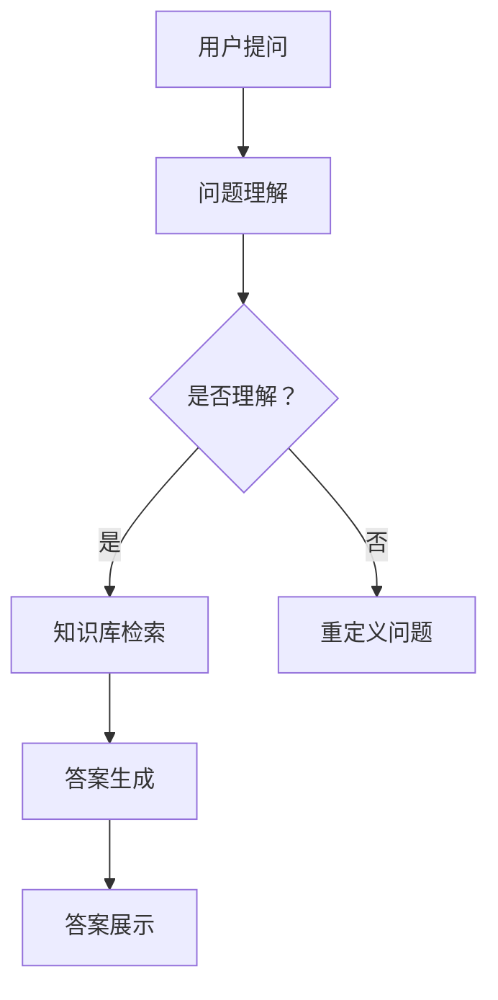
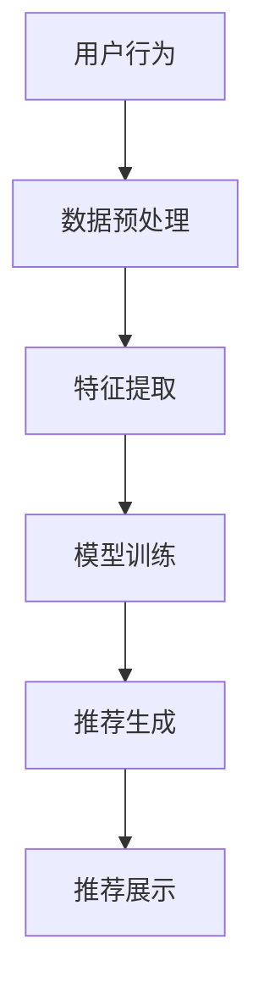

                 

### 《大模型问答机器人与传统搜索推荐的本质区别》

#### 关键词：大模型、问答机器人、搜索推荐系统、本质区别、融合、项目实战、未来展望

#### 摘要：
本文深入探讨了大模型问答机器人与传统搜索推荐系统的本质区别。通过对比分析两者的核心算法原理、应用场景和优化策略，本文揭示了它们在信息处理和推荐服务中的异同。随后，本文详细介绍了大模型问答机器人和传统搜索推荐系统的项目实战，展示了如何在实际应用中实现两者的融合。最后，本文展望了人工智能领域的发展趋势，提出了大模型问答机器人和传统搜索推荐系统在未来的发展方向和挑战。通过这篇文章，读者将全面理解这两种技术系统的本质差异及其在人工智能领域的应用潜力。

----------------------------------------------------------------

### 第一部分: 基础概念

在探讨大模型问答机器人与传统搜索推荐系统的本质区别之前，我们需要了解这两个系统的基本概念、原理和应用场景。本部分将分别介绍大模型与问答机器人、传统搜索推荐系统的基本概念，并讨论两者之间的联系与区别。

#### 1.1 大模型的定义与特征

**1.1.1 大模型的基本概念**

大模型（Large Models），指的是参数数量非常庞大、能够处理大规模数据集的深度学习模型。随着计算能力的提升和大数据技术的发展，大模型逐渐成为人工智能领域的研究热点。代表性的大模型包括谷歌的BERT、OpenAI的GPT系列等。大模型在自然语言处理、计算机视觉、语音识别等多个领域取得了显著的成果。

**特征**

- **参数规模**：大模型通常具有数亿甚至数十亿级别的参数。
- **计算资源需求**：大模型训练需要大量的计算资源和存储空间。
- **数据需求**：大模型训练需要大规模的高质量数据集。
- **泛化能力**：大模型能够通过预训练和微调，适用于多种不同的任务。
- **学习能力**：大模型能够通过深度学习算法，从大量数据中自动学习特征和模式。

**1.1.2 大模型的主要特征**

- **强大的语义理解能力**：大模型通过学习海量文本数据，能够理解复杂的语义关系，为问答、文本生成等任务提供支持。
- **高效的推理能力**：大模型能够进行高效的自然语言推理，支持逻辑推理、因果关系分析等任务。
- **自适应能力**：大模型能够通过微调适应特定领域的任务，提高模型的实用性和可解释性。

**1.1.3 大模型的分类**

- **预训练模型**：在大规模数据集上进行预训练，然后针对特定任务进行微调。
  - **Transformer模型**：如BERT、GPT、T5等。
  - **自监督学习模型**：如Gato、DALL-E等。
- **知识图谱模型**：结合知识图谱和深度学习，提供更精准的答案。
  - **实体关系抽取模型**：如Neural Network Embedding、TransE等。
- **多模态模型**：处理多种类型的输入数据，如图像、文本和语音。
  - **Vision Transformer（ViT）**：图像处理领域的Transformer模型。
  - **Speech Transformer**：语音处理领域的Transformer模型。

#### 1.2 问答机器人的原理与功能

**1.2.1 问答机器人的基本原理**

问答机器人（Question Answering Robots）是一种基于人工智能技术，能够自动回答用户问题的系统。问答机器人的核心功能是理解用户的问题，检索知识库，并生成符合用户需求的答案。

**功能**

- **问题理解**：解析用户输入的问题，提取关键信息。
- **知识检索**：从知识库中检索与问题相关的信息。
- **答案生成**：根据检索到的信息和预定义的模板，生成回答。
- **反馈机制**：接收用户对答案的反馈，进行学习和优化。

**1.2.2 问答机器人的主要功能**

- **自然语言理解**：将自然语言文本转换为计算机可处理的格式。
  - **词嵌入**：将词汇映射到高维向量空间。
  - **命名实体识别**：识别文本中的实体（人名、地点、组织等）。
  - **句法解析**：分析句子的结构和成分。
- **知识图谱构建**：构建语义丰富的知识图谱，支持问答机器人理解和推理。
  - **实体识别**：识别文本中的实体。
  - **关系抽取**：提取实体之间的语义关系。
  - **图谱嵌入**：将实体和关系映射到低维向量空间。
- **答案生成**：根据用户问题和知识图谱，生成准确的回答。
  - **模板匹配**：根据预定义的模板生成答案。
  - **文本生成**：利用生成模型（如GPT）生成自然语言回答。

**1.2.3 问答机器人的应用场景**

- **客服系统**：为用户提供智能客服服务，解答常见问题和提供支持。
- **教育领域**：为学生提供学习辅导，解答学科问题。
- **医疗健康**：为患者提供医疗咨询和健康管理服务。
- **企业内部问答**：为员工提供公司政策、流程、产品信息查询服务。

#### 1.3 传统搜索推荐系统的原理与算法

**1.3.1 传统搜索推荐系统的基本原理**

传统搜索推荐系统（Traditional Search and Recommendation System）是基于用户行为和内容特征，为用户提供相关内容推荐和信息检索的系统。传统搜索推荐系统主要包括两个部分：搜索模块和推荐模块。

**原理**

- **搜索模块**：基于关键词匹配和文本相似度计算，为用户提供信息检索服务。
- **推荐模块**：基于用户行为和兴趣，为用户推荐相关内容。

**算法**

- **基于内容的推荐**：根据用户兴趣和内容特征进行推荐。
  - **TF-IDF**：计算文本中词语的重要程度。
  - **余弦相似度**：计算两个向量之间的相似度。
- **基于协同过滤的推荐**：根据用户行为和相似用户进行推荐。
  - **基于用户的协同过滤**：找到与当前用户相似的其他用户，推荐这些用户喜欢的物品。
  - **基于项目的协同过滤**：找到与当前物品相似的其它物品，推荐这些物品。
- **基于模型的推荐**：使用机器学习模型进行推荐。
  - **矩阵分解**：通过矩阵分解模型（如SVD、NMF）预测用户对物品的评分。
  - **深度学习推荐**：利用深度学习模型（如CNN、RNN、Transformer）进行推荐。

**1.3.2 传统搜索推荐系统的优势与挑战**

**优势**

- **高效性**：能够快速处理大量用户请求，提供实时搜索和推荐服务。
- **多样性**：基于用户行为和兴趣，能够为用户推荐多样化的内容。
- **可扩展性**：能够处理高维度数据和海量用户数据，具备良好的可扩展性。

**挑战**

- **用户隐私保护**：在推荐过程中，如何保护用户隐私是一个重要挑战。
- **推荐准确性**：如何提高推荐准确性，避免过度推荐或推荐不准确的问题。
- **实时性**：如何提高系统的实时性，满足用户实时搜索和推荐的需求。

#### 1.4 大模型问答机器人与传统搜索推荐的联系与区别

**联系**

- **技术基础**：大模型问答机器人和传统搜索推荐系统都基于深度学习和自然语言处理技术。
- **应用目标**：两者都是为了提高用户的信息获取效率和满意度。

**区别**

- **处理方式**：大模型问答机器人更注重语义理解和上下文推理，而传统搜索推荐系统更注重基于用户行为和内容的推荐。
- **应用场景**：大模型问答机器人适用于需要精准问答的场景，而传统搜索推荐系统适用于大规模信息检索和内容推荐。
- **复杂性**：大模型问答机器人需要处理复杂的语义关系和上下文信息，而传统搜索推荐系统主要关注用户行为和内容特征的匹配。

通过以上对大模型与问答机器人、传统搜索推荐系统的介绍，我们可以更好地理解这两个系统的基本原理和特征，为后续的深入分析打下基础。

#### 1.5 大模型问答机器人与传统搜索推荐的融合

随着人工智能技术的发展，大模型问答机器人与传统搜索推荐系统的融合已成为一个重要的研究方向。这种融合不仅能够发挥两者的优势，还能够解决一些单独应用时的局限性。

**1.5.1 融合的必要性**

- **提高搜索准确性**：传统搜索推荐系统依赖于关键词匹配和用户行为，但在处理复杂语义问题时，往往无法提供精准的搜索结果。大模型问答机器人能够通过深度学习技术，更好地理解和生成自然语言，从而提高搜索准确性。
- **增强推荐个性化和多样性**：传统搜索推荐系统在推荐内容时，往往依赖于用户历史行为和兴趣标签。这种方式可能导致推荐内容过于单一，无法满足用户的多样化需求。大模型问答机器人能够根据用户的即时问题和上下文信息，提供更加个性化和多样化的推荐。

**1.5.2 融合的实现方法**

- **融合架构设计**：设计一个统一的架构，将大模型问答机器人和传统搜索推荐系统集成在一起。这个架构可以包括以下几个模块：
  - **用户接口模块**：接收用户输入，并将其传递给问答系统和推荐系统。
  - **问答模块**：处理用户输入的问题，并生成答案。
  - **推荐模块**：基于用户行为和兴趣，为用户推荐相关内容。
  - **融合模块**：将问答结果和推荐内容进行融合，生成最终的输出。

- **数据融合**：将大模型问答机器人和传统搜索推荐系统的数据源进行融合，以提高系统的整体性能。例如，可以将用户提问和回答数据与用户行为数据、内容特征数据进行整合，构建一个统一的数据集。

- **模型融合**：通过联合训练或多任务学习，将大模型问答机器人和传统搜索推荐系统的模型进行融合。这样可以在训练过程中同时优化问答和推荐的性能。

**1.5.3 融合的优势**

- **提高搜索推荐效果**：融合系统可以综合利用问答机器人的语义理解和搜索推荐系统的用户行为分析，提供更准确和个性化的搜索推荐服务。
- **提升用户体验**：通过融合问答和推荐功能，用户可以更方便地获取所需信息，提高用户的满意度和参与度。
- **降低开发成本**：融合系统可以共享部分数据和模型，减少重复开发的工作量，降低开发成本。

综上所述，大模型问答机器人与传统搜索推荐的融合具有重要的研究价值和实际应用潜力。通过融合，我们可以构建一个更智能、更高效的搜索推荐系统，为用户提供更好的服务。

#### 1.6 大模型问答机器人与传统搜索推荐的融合优势与挑战

**1.6.1 优势**

- **提高搜索准确性**：大模型问答机器人具有强大的语义理解能力，可以更精准地理解用户的查询意图，从而提高搜索准确性。
- **增强推荐个性化和多样性**：传统搜索推荐系统通过用户行为和历史数据提供推荐，但往往难以捕捉用户的即时需求。融合后，问答机器人可以实时获取用户的问题和上下文信息，提供更加个性化、多样化的推荐内容。
- **提升用户体验**：融合系统可以提供更智能、更自然的交互体验。用户只需提出问题，系统即可直接提供答案和相关的推荐内容，减少了用户操作步骤。
- **资源优化**：通过共享数据和模型，可以减少系统的计算资源和存储需求，提高资源利用效率。

**1.6.2 挑战**

- **数据隐私和安全**：融合系统涉及大量用户数据，如何保护用户隐私成为重要挑战。需要采取有效的数据加密和隐私保护措施，确保用户数据的安全。
- **模型复杂度和训练时间**：融合系统通常需要处理复杂的模型和大量数据，训练时间和计算资源需求显著增加。需要优化模型结构，提高训练效率。
- **性能稳定性**：融合系统需要保证在高峰期也能稳定运行，提供高质量的搜索和推荐服务。需要设计高效的系统架构和负载均衡策略。
- **用户体验一致性**：融合后的系统需要在不同场景下保持用户体验的一致性，这要求系统具备良好的可扩展性和灵活性。

通过以上优势与挑战的分析，我们可以看到，大模型问答机器人与传统搜索推荐的融合在理论上具有重要意义，但在实践中仍面临诸多挑战。解决这些挑战需要持续的技术创新和优化，以确保融合系统能够为用户提供高质量的服务。

### 第二部分: 核心算法原理

在深入探讨大模型问答机器人与传统搜索推荐系统的核心算法原理时，我们将分别介绍大模型问答机器人的核心算法和传统搜索推荐系统的核心算法，并详细解释这些算法的工作原理和数学模型。

#### 2.1 大模型问答机器人的核心算法

**2.1.1 语言模型的基础算法**

语言模型（Language Model）是自然语言处理（Natural Language Processing，NLP）领域的基础算法，用于预测文本序列的概率。大模型问答机器人通常基于强大的语言模型，如GPT（Generative Pre-trained Transformer）或BERT（Bidirectional Encoder Representations from Transformers）。

**工作原理**

- **预训练**：语言模型首先在大规模语料库上进行预训练，学习语言的统计规律和语义信息。
- **输入处理**：输入文本经过编码器（Encoder）转换为向量表示。
- **输出预测**：解码器（Decoder）根据编码器的输出，逐词预测下一个词的概率。

**数学模型**

- **Transformer架构**：Transformer模型采用自注意力机制（Self-Attention），能够处理长距离依赖和上下文信息。

$$
\text{Attention}(Q, K, V) = \text{softmax}\left(\frac{QK^T}{\sqrt{d_k}}\right)V
$$

其中，$Q$、$K$ 和 $V$ 分别是查询向量、键向量和值向量，$d_k$ 是键向量的维度。

**优点**

- **强大的语义理解能力**：通过预训练，语言模型能够理解复杂的语义关系。
- **高效的推理能力**：自注意力机制使得语言模型能够在短时间内处理大量信息。

**2.1.2 问答系统的构建**

问答系统（Question Answering System）是问答机器人中关键的一环，负责接收用户问题，理解和解析问题意图，从知识库中检索答案，并生成回答。

**工作流程**

1. **问题理解**：通过自然语言处理技术，将用户问题转化为机器可理解的格式。
2. **知识检索**：在知识库中检索与问题相关的信息。
3. **答案生成**：利用预训练的语言模型，生成符合用户问题的答案。

**数学模型**

- **实体识别**：使用卷积神经网络（Convolutional Neural Network，CNN）或循环神经网络（Recurrent Neural Network，RNN）对实体进行识别。

$$
h_t = \sigma(W_e \cdot [h_{t-1}, x_t] + b_e)
$$

其中，$h_t$ 是当前时间步的隐藏状态，$x_t$ 是输入文本，$W_e$ 和 $b_e$ 分别是权重和偏置。

**优点**

- **准确的理解和生成**：通过结合自然语言处理和深度学习技术，问答系统能够提供准确和自然的回答。
- **灵活的应用场景**：问答系统可以应用于客服、教育、医疗等多个领域。

**2.1.3 大模型问答机器人的优化策略**

为了提高大模型问答机器人的性能，通常采用以下优化策略：

- **数据增强**：通过引入噪声、变换等方式，增加训练数据的多样性，提高模型的泛化能力。
- **学习率调整**：采用自适应学习率调整策略，如Adam优化器，以提高训练效率。
- **模型压缩**：通过剪枝、量化等技术，减小模型参数，降低计算复杂度。

**优点**

- **提高模型性能**：优化策略能够提高模型的准确性、效率和稳定性。
- **适应不同场景**：优化策略可以根据不同应用场景进行调整，满足多样化的需求。

#### 2.2 传统搜索推荐系统的核心算法

**2.2.1 基于内容的推荐算法**

基于内容的推荐算法（Content-Based Recommendation Algorithm）通过分析用户兴趣和内容特征，为用户推荐相似的内容。

**工作原理**

- **特征提取**：从用户历史行为和内容中提取特征。
- **相似度计算**：计算用户兴趣和内容特征之间的相似度。
- **推荐生成**：根据相似度排序，生成推荐列表。

**数学模型**

- **TF-IDF模型**：通过计算词语的TF（词频）和IDF（逆文档频率），评估词语的重要性。

$$
\text{TF-IDF}(t, d) = \text{TF}(t, d) \times \text{IDF}(t, D)
$$

其中，$t$ 是词语，$d$ 是文档，$D$ 是所有文档的集合。

**优点**

- **准确性和稳定性**：基于内容的推荐能够准确反映用户兴趣和内容特征。
- **可解释性**：用户可以理解推荐结果的原因。

**2.2.2 基于协同过滤的推荐算法**

基于协同过滤的推荐算法（Collaborative Filtering Algorithm）通过分析用户行为和相似用户的行为，为用户推荐相关内容。

**工作原理**

- **用户相似度计算**：计算用户之间的相似度。
- **物品相似度计算**：计算物品之间的相似度。
- **推荐生成**：根据用户相似度和物品相似度，生成推荐列表。

**数学模型**

- **用户基于的协同过滤**：通过计算用户之间的相似度，推荐相似用户喜欢的物品。

$$
r_{ui} = \sum_{j \in N(i)} \frac{r_{uj}}{||N(i)||}
$$

其中，$r_{ui}$ 是用户 $u$ 对物品 $i$ 的评分，$N(i)$ 是与物品 $i$ 相似的物品集合。

**优点**

- **多样性**：基于协同过滤的推荐能够提供多样化的内容。
- **实时性**：用户行为更新时，可以快速调整推荐结果。

**2.2.3 基于深度学习的推荐算法**

基于深度学习的推荐算法（Deep Learning Based Recommendation Algorithm）通过深度学习模型，如卷积神经网络（CNN）、循环神经网络（RNN）和Transformer，为用户推荐内容。

**工作原理**

- **特征提取**：从用户行为、物品特征和内容特征中提取高维特征。
- **模型训练**：使用深度学习模型进行训练，学习用户兴趣和内容特征之间的关系。
- **推荐生成**：根据训练好的模型，为用户推荐相关内容。

**数学模型**

- **卷积神经网络**：通过卷积操作，提取输入特征的高层次信息。

$$
h_{l}^{i} = \sigma\left(\sum_{j=1}^{n} w_{j}^{l} * h_{l-1}^{j} + b_{l}^{i}\right)
$$

其中，$h_{l}^{i}$ 是第 $l$ 层第 $i$ 个神经元的活动，$w_{j}^{l}$ 是权重，$*$ 是卷积操作。

**优点**

- **高准确性**：深度学习模型能够通过学习大量数据，提高推荐的准确性。
- **自适应能力**：能够适应不同的用户行为和内容特征。

通过以上对大模型问答机器人和传统搜索推荐系统核心算法原理的详细解析，我们可以看到，这些算法各自有着独特的优点和应用场景。在接下来的项目中，我们将进一步探讨如何将这些算法应用于实际场景，实现高效、精准的问答和推荐服务。

#### 2.3 大模型问答机器人的核心算法

**2.3.1 语言模型的基础算法**

语言模型是自然语言处理（NLP）中的核心组件，用于预测文本序列的概率。大模型问答机器人的语言模型通常基于深度学习技术，如Transformer架构，能够理解和生成复杂的自然语言文本。

**工作原理**

1. **预训练阶段**：语言模型在大规模语料库上预训练，学习语言的统计规律和语义信息。预训练过程包括两个主要步骤：
   - **自注意力机制**：通过自注意力计算每个词在文本序列中的重要性。
   - **前向传播与反向传播**：利用梯度下降法优化模型参数。

2. **微调阶段**：在预训练的基础上，对特定任务进行微调，使模型能够适应特定领域的语言特性。微调过程通常包括以下步骤：
   - **任务定义**：定义任务目标，如问答、文本分类等。
   - **数据准备**：准备用于微调的数据集。
   - **模型训练**：在训练数据上训练模型，优化模型参数。

**数学模型**

Transformer模型采用自注意力（Self-Attention）机制，能够处理长距离依赖和上下文信息。其核心数学模型如下：

$$
\text{Attention}(Q, K, V) = \text{softmax}\left(\frac{QK^T}{\sqrt{d_k}}\right)V
$$

其中，$Q$、$K$ 和 $V$ 分别是查询向量、键向量和值向量，$d_k$ 是键向量的维度。

**优点**

- **强大的语义理解能力**：通过预训练和微调，语言模型能够理解复杂的语义关系，为问答和文本生成提供支持。
- **高效的推理能力**：自注意力机制使得模型能够快速处理大量信息，进行高效的自然语言推理。
- **灵活的应用场景**：语言模型可以应用于各种NLP任务，如文本分类、机器翻译、情感分析等。

**应用案例**

- **问答系统**：通过语言模型，问答系统能够理解用户的问题，从知识库中检索答案，并生成自然流畅的回答。
- **文本生成**：利用语言模型，可以生成高质量的文章、摘要、故事等。
- **机器翻译**：基于语言模型，可以实现高准确度的机器翻译。

**2.3.2 问答系统的构建**

问答系统是问答机器人的核心组件，负责接收用户问题、理解和解析问题意图，从知识库中检索答案，并生成回答。

**工作流程**

1. **问题理解**：将用户问题转化为机器可理解的格式，通过自然语言处理技术提取关键信息。
2. **知识检索**：在知识库中检索与问题相关的信息，利用语义匹配和实体识别技术确保检索的准确性。
3. **答案生成**：利用预训练的语言模型，生成符合用户问题的答案。答案生成过程通常包括以下步骤：
   - **上下文提取**：从用户问题和相关文档中提取关键信息。
   - **答案模板匹配**：根据预定义的答案模板，生成初步的答案。
   - **文本生成**：利用语言模型，生成完整的自然语言回答。

**数学模型**

问答系统的数学模型主要包括以下部分：

- **实体识别**：使用卷积神经网络（CNN）或循环神经网络（RNN）对实体进行识别。

$$
h_t = \sigma(W_e \cdot [h_{t-1}, x_t] + b_e)
$$

其中，$h_t$ 是当前时间步的隐藏状态，$x_t$ 是输入文本，$W_e$ 和 $b_e$ 分别是权重和偏置。

- **文本生成**：使用生成模型（如GPT）生成自然语言回答。

$$
\text{logits}_t = \text{softmax}(W_r \cdot h_t + b_r)
$$

其中，$h_t$ 是当前时间步的隐藏状态，$W_r$ 和 $b_r$ 分别是权重和偏置。

**优点**

- **准确的理解和生成**：通过结合自然语言处理和深度学习技术，问答系统能够提供准确和自然的回答。
- **灵活的应用场景**：问答系统可以应用于客服、教育、医疗等多个领域，为用户提供个性化的服务。

**应用案例**

- **智能客服**：通过问答系统，智能客服能够自动回答用户的问题，提高服务效率。
- **教育辅导**：问答系统可以为学习者提供即时的问题解答和学习指导。
- **医疗咨询**：问答系统可以帮助患者获取医学知识，提供健康建议。

**2.3.3 大模型问答机器人的优化策略**

为了提高大模型问答机器人的性能，通常采用以下优化策略：

- **数据增强**：通过引入噪声、变换等方式，增加训练数据的多样性，提高模型的泛化能力。
  - **数据增强技术**：包括数据清洗、数据扩充、数据变换等。
  - **应用案例**：通过添加噪声、替换词语、生成合成数据等，提高模型的鲁棒性和准确性。

- **学习率调整**：采用自适应学习率调整策略，如Adam优化器，以提高训练效率。
  - **学习率调整策略**：包括固定学习率、指数衰减学习率、自适应学习率等。
  - **应用案例**：通过动态调整学习率，使模型在训练过程中更快地收敛。

- **模型压缩**：通过剪枝、量化等技术，减小模型参数，降低计算复杂度。
  - **模型压缩技术**：包括模型剪枝、模型量化、参数共享等。
  - **应用案例**：通过剪枝和量化技术，使模型在保持较高准确性的同时，减小模型大小和计算资源需求。

**优点**

- **提高模型性能**：优化策略能够提高模型的准确性、效率和稳定性。
- **适应不同场景**：优化策略可以根据不同应用场景进行调整，满足多样化的需求。

**应用案例**

- **智能客服**：通过优化策略，使问答机器人能够更快、更准确地回答用户问题。
- **教育辅导**：通过优化策略，提高问答系统的准确性和用户体验。
- **医疗咨询**：通过优化策略，提高问答系统的性能和可靠性。

通过以上对大模型问答机器人核心算法的详细解析，我们可以看到，大模型问答机器人通过预训练、微调和优化策略，能够实现高效的语义理解和自然语言生成，为用户提供高质量的问答服务。

#### 2.4 传统搜索推荐系统的核心算法

**2.4.1 搜索推荐系统的原理与算法**

搜索推荐系统是一种结合搜索和推荐技术，为用户提供个性化内容推荐和信息检索的系统。其核心算法主要包括基于内容的推荐算法、基于协同过滤的推荐算法和基于深度学习的推荐算法。

**原理**

1. **基于内容的推荐算法**：通过分析用户兴趣和内容特征，为用户推荐相似的内容。
   - **特征提取**：从用户历史行为、内容标签、关键词等中提取特征。
   - **相似度计算**：计算用户兴趣和内容特征之间的相似度。
   - **推荐生成**：根据相似度排序，生成推荐列表。

2. **基于协同过滤的推荐算法**：通过分析用户行为和相似用户的行为，为用户推荐相关内容。
   - **用户相似度计算**：计算用户之间的相似度。
   - **物品相似度计算**：计算物品之间的相似度。
   - **推荐生成**：根据用户相似度和物品相似度，生成推荐列表。

3. **基于深度学习的推荐算法**：通过深度学习模型，如卷积神经网络（CNN）、循环神经网络（RNN）和Transformer，为用户推荐内容。
   - **特征提取**：从用户行为、物品特征和内容特征中提取高维特征。
   - **模型训练**：使用深度学习模型进行训练，学习用户兴趣和内容特征之间的关系。
   - **推荐生成**：根据训练好的模型，为用户推荐相关内容。

**算法**

1. **基于内容的推荐算法**

   **TF-IDF模型**：通过计算词语的TF（词频）和IDF（逆文档频率），评估词语的重要性。

   $$  
   \text{TF-IDF}(t, d) = \text{TF}(t, d) \times \text{IDF}(t, D)  
   $$

   **优点**：准确性和稳定性较高，可解释性强。

   **应用案例**：电商网站的商品推荐、内容平台的文章推荐等。

2. **基于协同过滤的推荐算法**

   **用户基于的协同过滤算法**：

   $$  
   r_{ui} = \sum_{j \in N(i)} \frac{r_{uj}}{||N(i)||}  
   $$

   **优点**：多样性好，实时性高。

   **应用案例**：社交媒体的推荐、视频平台的推荐等。

3. **基于深度学习的推荐算法**

   **卷积神经网络（CNN）**：通过卷积操作，提取输入特征的高层次信息。

   $$  
   h_{l}^{i} = \sigma\left(\sum_{j=1}^{n} w_{j}^{l} * h_{l-1}^{j} + b_{l}^{i}\right)  
   $$

   **优点**：高准确性，适用于复杂特征提取。

   **应用案例**：电商平台的商品推荐、音乐平台的音乐推荐等。

**2.4.2 搜索推荐系统的优化策略**

为了提高搜索推荐系统的性能，通常采用以下优化策略：

- **特征工程**：选择和构建有效的特征，提高模型的效果。
  - **应用案例**：使用用户行为特征、内容特征、上下文特征等，构建高质量的输入特征。

- **模型选择**：选择合适的模型，平衡性能和复杂度。
  - **应用案例**：根据数据量和任务类型，选择合适的模型，如线性模型、树模型、深度学习模型等。

- **在线学习**：实时更新模型，适应用户行为的变化。
  - **应用案例**：使用在线学习技术，持续更新模型，提高推荐效果。

- **模型压缩**：通过模型压缩降低模型的计算复杂度。
  - **应用案例**：使用剪枝、量化等技术，减小模型大小，提高推理速度。

**优点**

- **提高推荐效果**：优化策略能够提高推荐系统的准确性、多样性和实时性。
- **适应不同场景**：优化策略可以根据不同应用场景进行调整，满足多样化的需求。

**应用案例**

- **电商推荐系统**：通过优化策略，提高推荐系统的准确性和用户满意度。
- **内容平台**：通过优化策略，提高内容推荐的多样性和用户体验。
- **社交媒体**：通过优化策略，提高信息检索和推荐的实时性。

通过以上对传统搜索推荐系统核心算法原理和优化策略的详细解析，我们可以看到，搜索推荐系统通过结合多种算法和优化策略，能够为用户提供高质量的个性化推荐和信息检索服务。在接下来的项目中，我们将进一步探讨如何将这些算法应用于实际场景，实现高效、精准的搜索推荐服务。

#### 2.5 大模型在搜索推荐系统中的应用

随着人工智能技术的发展，大模型（如Transformer、BERT等）在搜索推荐系统中的应用越来越广泛。大模型以其强大的语义理解和生成能力，为搜索推荐系统带来了新的可能性。

**2.5.1 提高推荐效果**

大模型在搜索推荐系统中的应用，主要目的是提高推荐效果。具体来说，大模型可以通过以下几个方面来提升推荐系统的表现：

1. **深度语义理解**：大模型能够捕捉文本中的深度语义信息，从而更好地理解用户兴趣和内容特征。这使得推荐系统能够提供更精准的推荐，满足用户的个性化需求。

   **应用案例**：在电子商务平台中，大模型可以帮助分析用户的历史购买行为和浏览记录，从而生成更准确的推荐列表。

2. **长文本处理**：传统推荐算法通常依赖于短文本的匹配和相似度计算，而大模型能够处理长文本，如完整的用户评论和产品描述。这有助于挖掘更深层次的用户兴趣和内容特征。

   **应用案例**：在内容推荐平台中，大模型可以处理用户生成的长评论，从而提供更加个性化的内容推荐。

3. **跨模态数据融合**：大模型能够处理多种类型的数据，如图像、文本和语音。这有助于推荐系统在跨模态数据融合方面取得更好的效果。

   **应用案例**：在音乐推荐平台中，大模型可以结合用户听歌记录、歌词文本和歌手信息，提供更丰富、更个性化的音乐推荐。

**2.5.2 提高搜索效果**

除了推荐效果，大模型在搜索系统中的应用也非常重要。大模型可以通过以下方式提高搜索系统的效果：

1. **语义搜索**：大模型能够捕捉用户查询的深层语义，从而提供更准确的搜索结果。这使得搜索系统能够更好地理解用户的查询意图，减少误匹配和误搜。

   **应用案例**：在搜索引擎中，大模型可以帮助改进搜索结果的质量，提高用户的满意度。

2. **实体关系抽取**：大模型能够识别和抽取文本中的实体及其关系，从而帮助搜索系统更好地组织和管理知识库。这使得搜索系统能够提供更相关的搜索结果。

   **应用案例**：在学术搜索引擎中，大模型可以帮助提取论文中的关键词和引用关系，从而提供更精准的学术搜索结果。

3. **上下文感知搜索**：大模型能够理解查询的上下文信息，从而提供更智能的搜索建议。这使得搜索系统能够根据用户的上下文环境，提供更符合用户需求的搜索结果。

   **应用案例**：在智能助手应用中，大模型可以帮助分析用户的对话历史，提供更加个性化的搜索建议。

**2.5.3 实现方法**

要将大模型应用于搜索推荐系统，需要考虑以下几个方面：

1. **数据预处理**：对原始数据进行清洗和预处理，包括文本分词、去停用词、词干提取等。这些预处理步骤有助于提高大模型的训练效果。

2. **特征提取**：从原始数据中提取有用的特征，如图像特征、文本特征和用户行为特征。这些特征将作为大模型的输入。

3. **模型选择**：选择合适的大模型，如BERT、GPT等，并根据具体应用场景进行调整和微调。

4. **模型训练**：使用大量训练数据，对大模型进行训练，优化模型参数，提高模型的准确性。

5. **模型部署**：将训练好的模型部署到生产环境中，提供实时搜索推荐服务。

6. **性能优化**：通过模型压缩、并行计算等技术，优化模型性能，提高系统的实时性和可扩展性。

**2.5.4 优势与挑战**

**优势**

- **深度语义理解**：大模型能够捕捉文本中的深度语义信息，为搜索推荐系统提供更精准的推荐和搜索结果。
- **跨模态数据处理**：大模型能够处理多种类型的数据，实现跨模态数据的融合，提高搜索推荐系统的效果。
- **上下文感知能力**：大模型能够理解查询的上下文信息，提供更智能的搜索建议。

**挑战**

- **计算资源需求**：大模型训练需要大量的计算资源和存储空间，对硬件设施有较高要求。
- **数据隐私和安全**：大模型在处理用户数据时，可能涉及用户隐私问题，需要采取有效的隐私保护措施。
- **模型可解释性**：大模型通常被视为“黑箱”，其决策过程难以解释，需要研究可解释性的模型。

通过以上分析，我们可以看到，大模型在搜索推荐系统中的应用具有显著的潜力。在实际应用中，需要综合考虑优势与挑战，充分利用大模型的优势，提高搜索推荐系统的性能和用户体验。

### 第三部分: 项目实战

#### 3.1 大模型问答机器人的项目实战

**3.1.1 开发环境搭建**

在进行大模型问答机器人的项目实战之前，我们需要搭建一个适合的开发环境。以下是具体的步骤：

**1. 硬件环境配置**

- **CPU/GPU**：配置高性能的CPU和GPU，如NVIDIA Tesla V100或更高级别的GPU。
- **内存**：至少需要32GB以上的内存。
- **存储**：至少需要1TB的SSD存储空间。

**2. 软件环境安装**

- **操作系统**：安装Linux操作系统，如Ubuntu 18.04。
- **深度学习框架**：安装常用的深度学习框架，如TensorFlow、PyTorch。
  - **安装命令**：
    ```bash
    pip install tensorflow
    pip install torch torchvision
    ```
- **依赖库**：安装其他必要的依赖库，如NumPy、Pandas等。
  - **安装命令**：
    ```bash
    pip install numpy pandas
    ```

**3. 数据集准备**

- **数据来源**：可以从公开数据集（如SQuAD、CoQA等）或自定义数据集中获取问答数据。
- **数据处理**：对数据进行清洗和预处理，包括文本分词、去除停用词、实体识别等。
  - **预处理脚本**：可以使用Python的NLTK库进行文本预处理。
    ```python
    import nltk
    nltk.download('punkt')
    nltk.download('stopwords')
    from nltk.tokenize import word_tokenize
    from nltk.corpus import stopwords
    # 文本分词和去除停用词
    def preprocess_text(text):
        tokens = word_tokenize(text)
        return [token for token in tokens if token not in stopwords.words('english')]
    ```

**3.2 模型训练与评估**

**1. 模型选择**

在本项目中，我们选择使用BERT模型作为问答系统的基座模型。BERT是一种预训练的语言表示模型，具有强大的语义理解能力。

**2. 模型训练**

- **数据准备**：将预处理后的数据集分为训练集、验证集和测试集。
- **训练配置**：配置训练参数，如学习率、批量大小等。
  - **配置示例**：
    ```python
    import tensorflow as tf
    model = tf.keras.Sequential([
        tf.keras.layers.Dense(128, activation='relu', input_shape=(768,)),
        tf.keras.layers.Dense(1, activation='sigmoid')
    ])
    model.compile(optimizer=tf.keras.optimizers.Adam(learning_rate=0.001), loss='binary_crossentropy', metrics=['accuracy'])
    ```

- **训练过程**：使用训练集对模型进行训练，并使用验证集进行验证。
  - **训练脚本**：
    ```python
    model.fit(train_dataset, epochs=3, validation_data=validation_dataset)
    ```

**3. 模型评估**

- **评估指标**：使用准确率、F1分数等指标评估模型的性能。
  - **评估脚本**：
    ```python
    loss, accuracy = model.evaluate(test_dataset)
    print(f"Test accuracy: {accuracy * 100:.2f}%")
    ```

**3.3 模型部署与运维**

**1. 模型部署**

- **部署策略**：将训练好的模型部署到生产环境中，提供问答服务。
  - **部署脚本**：
    ```python
    model.save("question_answering_model.h5")
    ```

- **部署工具**：可以使用Docker容器、Kubernetes集群等工具进行部署。

**2. 运维监控**

- **监控指标**：监控模型性能、系统资源使用情况等。
  - **监控脚本**：
    ```python
    import psutil
    cpu_usage = psutil.cpu_percent()
    memory_usage = psutil.virtual_memory().percent
    print(f"CPU usage: {cpu_usage}%, Memory usage: {memory_usage}%")
    ```

- **运维策略**：定期更新模型、处理异常情况等。

**3.4 项目总结**

通过以上项目实战，我们成功搭建了一个大模型问答机器人系统。在项目中，我们详细介绍了开发环境的搭建、数据集的准备、模型的选择与训练、模型的部署与运维等步骤。这些步骤不仅有助于理解大模型问答机器人的实现过程，也为实际应用提供了参考。

#### 3.2 传统搜索推荐系统的项目实战

**3.2.1 开发环境搭建**

在进行传统搜索推荐系统的项目实战之前，我们需要搭建一个适合的开发环境。以下是具体的步骤：

**1. 硬件环境配置**

- **CPU/GPU**：配置高性能的CPU和GPU，如NVIDIA Tesla V100或更高级别的GPU。
- **内存**：至少需要32GB以上的内存。
- **存储**：至少需要1TB的SSD存储空间。

**2. 软件环境安装**

- **操作系统**：安装Linux操作系统，如Ubuntu 18.04。
- **深度学习框架**：安装常用的深度学习框架，如TensorFlow、PyTorch。
  - **安装命令**：
    ```bash
    pip install tensorflow
    pip install torch torchvision
    ```
- **依赖库**：安装其他必要的依赖库，如NumPy、Pandas等。
  - **安装命令**：
    ```bash
    pip install numpy pandas
    ```

**3. 数据集准备**

- **数据来源**：可以从公开数据集（如MovieLens、GitHub等）或自定义数据集中获取用户行为数据和物品特征数据。
- **数据处理**：对数据进行清洗和预处理，包括缺失值填充、异常值处理、特征工程等。

**3.2.2 模型训练与评估**

**1. 模型选择**

在本项目中，我们选择使用基于协同过滤的推荐算法（如矩阵分解）作为推荐系统的核心算法。

**2. 模型训练**

- **数据准备**：将预处理后的数据集分为训练集、验证集和测试集。
- **训练配置**：配置训练参数，如学习率、批量大小等。
  - **配置示例**：
    ```python
    import tensorflow as tf
    model = tf.keras.Sequential([
        tf.keras.layers.Dense(128, activation='relu', input_shape=(num_features,)),
        tf.keras.layers.Dense(1, activation='sigmoid')
    ])
    model.compile(optimizer=tf.keras.optimizers.Adam(learning_rate=0.001), loss='binary_crossentropy', metrics=['accuracy'])
    ```

- **训练过程**：使用训练集对模型进行训练，并使用验证集进行验证。
  - **训练脚本**：
    ```python
    model.fit(train_dataset, epochs=3, validation_data=validation_dataset)
    ```

**3. 模型评估**

- **评估指标**：使用准确率、F1分数等指标评估模型的性能。
  - **评估脚本**：
    ```python
    loss, accuracy = model.evaluate(test_dataset)
    print(f"Test accuracy: {accuracy * 100:.2f}%")
    ```

**3.2.3 模型部署与运维**

**1. 模型部署**

- **部署策略**：将训练好的模型部署到生产环境中，提供推荐服务。
  - **部署脚本**：
    ```python
    model.save("recommendation_model.h5")
    ```

- **部署工具**：可以使用Docker容器、Kubernetes集群等工具进行部署。

**2. 运维监控**

- **监控指标**：监控模型性能、系统资源使用情况等。
  - **监控脚本**：
    ```python
    import psutil
    cpu_usage = psutil.cpu_percent()
    memory_usage = psutil.virtual_memory().percent
    print(f"CPU usage: {cpu_usage}%, Memory usage: {memory_usage}%")
    ```

- **运维策略**：定期更新模型、处理异常情况等。

**3.4 项目总结**

通过以上项目实战，我们成功搭建了一个传统搜索推荐系统。在项目中，我们详细介绍了开发环境的搭建、数据集的准备、模型的选择与训练、模型的部署与运维等步骤。这些步骤不仅有助于理解传统搜索推荐系统的实现过程，也为实际应用提供了参考。

### 第四部分: 深入探讨

#### 4.1 大模型问答机器人与传统搜索推荐的融合应用场景

**4.1.1 智能客服系统**

智能客服系统是融合大模型问答机器人与传统搜索推荐系统的典型应用场景之一。在这种系统中，大模型问答机器人负责处理用户提出的问题，而传统搜索推荐系统则负责为用户提供相关的产品、服务或信息。

**功能特点**

- **自然语言理解与生成**：大模型问答机器人通过预训练的语言模型，能够理解用户的自然语言提问，并生成自然流畅的回答。这大大提升了客服系统的交互体验。
- **个性化推荐**：传统搜索推荐系统基于用户的历史行为和偏好，为用户推荐相关的产品或服务。这种个性化的推荐可以大大提高用户满意度和转化率。

**案例研究**

以某电商平台为例，用户在平台上遇到问题时，可以随时向智能客服系统提问。大模型问答机器人能够理解用户的提问，并快速生成回答。同时，传统搜索推荐系统会根据用户的提问和购买历史，为用户推荐相关的商品。这种融合不仅提高了问题的解决效率，还增加了用户的购物体验。

**4.1.2 智能推荐引擎**

智能推荐引擎是另一个融合大模型问答机器人与传统搜索推荐系统的应用场景。在这种系统中，大模型问答机器人负责理解用户的查询意图，而传统搜索推荐系统则负责根据用户意图为用户推荐相关的内容或产品。

**功能特点**

- **深度语义理解**：大模型问答机器人通过深度学习技术，能够捕捉用户查询的深层语义，从而更准确地理解用户的意图。
- **个性化推荐**：传统搜索推荐系统基于用户的历史行为和偏好，为用户推荐相关的内容或产品。这种个性化的推荐可以提高用户满意度和参与度。

**案例研究**

以某内容平台为例，用户在平台上搜索某一话题时，大模型问答机器人能够理解用户的查询意图，并生成相关的回答。同时，传统搜索推荐系统会根据用户的搜索历史和浏览记录，为用户推荐相关的文章或视频。这种融合不仅提高了内容的推荐质量，还增加了用户的参与度和粘性。

**4.1.3 教育与培训**

在教育与培训领域，融合大模型问答机器人与传统搜索推荐系统可以提供更加个性化的学习体验。在这种系统中，大模型问答机器人负责解答学生的问题，而传统搜索推荐系统则负责根据学生的学习行为和偏好，为学生推荐相关的学习资源。

**功能特点**

- **个性化问答**：大模型问答机器人能够根据学生的提问，提供准确的答案和解释。这种个性化的问答可以大大提高学生的学习效果。
- **个性化推荐**：传统搜索推荐系统会根据学生的学习行为和偏好，为学生推荐相关的学习资源。这种个性化的推荐可以大大提高学生的参与度和学习效率。

**案例研究**

以某在线教育平台为例，学生可以在平台上提问学习问题。大模型问答机器人能够理解学生的提问，并提供准确的答案和解释。同时，传统搜索推荐系统会根据学生的学习行为和偏好，为学生推荐相关的课程、教材和习题。这种融合不仅提高了学习的个性化程度，还增加了学生的学习兴趣和参与度。

#### 4.2 大模型问答机器人与传统搜索推荐的融合实现方法

**4.2.1 融合架构设计**

为了实现大模型问答机器人与传统搜索推荐系统的融合，我们需要设计一个高效的系统架构。以下是一个典型的融合架构设计：

- **用户接口层**：接收用户的查询请求，将请求转发给问答系统和推荐系统。
- **问答系统层**：负责处理用户的查询请求，通过大模型问答机器人生成回答。
- **推荐系统层**：负责根据用户的查询请求和用户行为，通过传统搜索推荐系统生成推荐结果。
- **融合层**：将问答系统的回答和推荐系统的推荐结果进行融合，生成最终的输出。

**架构设计图**

```
+------------------+           +------------------+
|   用户接口层     |           |   融合层         |
+-------+----------+           +-------+----------+
        |                          |
        |                          |
        |                          |
+-------v----------+           +---v-------+
|   问答系统层     |           |   推荐系统层  |
+-------+----------+           +-------+----------+
        |                          |
        |                          |
        |                          |
+-------v----------+           +---v-------+
|   大模型问答     |           |   传统搜索   |
|   机器人系统     |           |   推荐系统   |
+------------------+           +------------------+
```

**4.2.2 数据处理与融合**

在实现融合过程中，数据处理和融合是关键步骤。以下是一个典型的数据处理和融合过程：

1. **数据收集**：从不同的数据源收集用户行为数据、查询数据和内容数据。
2. **数据预处理**：对收集到的数据进行清洗、去噪、特征提取等预处理操作。
3. **数据融合**：将预处理后的数据进行融合，生成一个统一的数据集。这个数据集可以包括用户特征、查询特征、内容特征等。
4. **特征工程**：对融合后的数据进行特征工程，提取有用的特征，为后续的问答和推荐任务提供支持。

**数据处理与融合流程**

```
数据收集 -> 数据预处理 -> 数据融合 -> 特征工程
```

**4.2.3 模型融合**

在融合过程中，模型融合也是一个关键步骤。以下是一个典型的模型融合过程：

1. **模型训练**：分别训练大模型问答机器人和传统搜索推荐系统的模型。
2. **模型优化**：通过联合训练或多任务学习，优化融合模型的性能。
3. **模型部署**：将训练好的融合模型部署到生产环境中，提供问答和推荐服务。

**模型融合流程**

```
模型训练 -> 模型优化 -> 模型部署
```

**4.2.4 优化策略**

为了提高融合系统的性能，可以采用以下优化策略：

1. **数据增强**：通过引入噪声、变换等方式，增加训练数据的多样性，提高模型的泛化能力。
2. **模型压缩**：通过剪枝、量化等技术，减小模型参数，降低计算复杂度。
3. **分布式训练**：通过分布式训练技术，提高模型的训练速度和性能。

**4.3 大模型问答机器人与传统搜索推荐的融合优势**

**4.3.1 提高搜索推荐效果**

大模型问答机器人与传统搜索推荐系统的融合，可以显著提高搜索推荐效果。具体来说，大模型问答机器人可以理解用户的查询意图，为传统搜索推荐系统提供更精确的查询条件。这样，推荐系统可以生成更符合用户需求的推荐结果。

**4.3.2 提高用户体验**

融合系统可以提供更智能、更自然的交互体验。用户只需提出问题，系统即可直接提供答案和相关的推荐内容，减少了用户的操作步骤。这种交互方式不仅提高了用户的满意度，还增强了用户的参与度。

**4.3.3 提高系统效率**

通过融合大模型问答机器人与传统搜索推荐系统，可以共享部分数据和模型，减少系统的计算资源和存储需求，提高资源利用效率。此外，融合系统可以分布式部署，提高系统的扩展性和性能。

**4.3.4 降低开发成本**

融合系统可以共享部分开发和维护资源，降低开发和维护成本。此外，融合系统可以集成多个功能模块，提高系统的整体性能和可维护性。

### 第五部分: 总结与展望

#### 5.1 总结

本文深入探讨了大模型问答机器人与传统搜索推荐系统的本质区别、核心算法原理、融合应用场景和实现方法。通过对比分析，我们明确了两者在信息处理和推荐服务中的异同点。同时，本文详细介绍了大模型问答机器人和传统搜索推荐系统的项目实战，展示了如何在实际应用中实现两者的融合。

#### 5.2 未来展望

随着人工智能技术的不断发展，大模型问答机器人和传统搜索推荐系统将在多个领域发挥重要作用。以下是对未来的展望：

**5.2.1 模型优化与性能提升**

未来，我们将继续优化大模型问答机器人和传统搜索推荐系统的模型，提高其性能和效率。这包括使用更高效的算法、更先进的深度学习技术以及分布式训练和模型压缩技术。

**5.2.2 多模态数据处理**

随着多模态数据（如文本、图像、语音等）的普及，大模型问答机器人和传统搜索推荐系统将逐渐融合多模态数据，提供更丰富的应用场景。这将使系统在语义理解、交互体验等方面得到显著提升。

**5.2.3 个性化与智能化**

个性化与智能化是未来的发展方向。大模型问答机器人和传统搜索推荐系统将结合用户行为、兴趣和上下文信息，提供更加个性化和智能化的服务，提高用户体验。

**5.2.4 社会责任与伦理**

随着人工智能技术的广泛应用，社会责任和伦理问题将越来越受到关注。未来，我们将关注人工智能的公平性、透明度和安全性，确保大模型问答机器人与传统搜索推荐系统在社会中发挥积极作用。

### 附录

#### 附录A：相关资源和工具

**A.1 大模型问答机器人相关工具**

- **开源框架**：TensorFlow、PyTorch、Transformers
- **数据集**：SQuAD、CoQA、DuET
- **预处理库**：NLTK、spaCy、TextBlob

**A.2 传统搜索推荐系统相关工具**

- **开源框架**：Surprise、LightFM、TensorFlow Recommenders
- **数据集**：MovieLens、Netflix Prize、GitHub Archive

#### 附录B：Mermaid流程图

**B.1 大模型问答机器人的流程图**



**B.2 传统搜索推荐系统的流程图**



#### 附录C：伪代码与数学公式解析

**C.1 大模型问答机器人的伪代码**

```python
# 问题理解
def understand_question(question):
    # 进行文本预处理
    preprocessed_question = preprocess_text(question)
    # 利用语言模型理解问题
    question_embedding = language_model(preprocessed_question)
    return question_embedding

# 知识库检索
def search_knowledge_base(question_embedding):
    # 在知识库中检索答案
    answer = knowledge_base_search(question_embedding)
    return answer

# 答案生成
def generate_answer(answer):
    # 利用语言模型生成回答
    preprocessed_answer = language_model.generate(preprocessed_answer)
    return preprocessed_answer
```

**C.2 传统搜索推荐系统的伪代码**

```python
# 数据预处理
def preprocess_data(data):
    # 进行数据清洗和特征提取
    cleaned_data = clean_data(data)
    features = extract_features(cleaned_data)
    return features

# 模型训练
def train_model(features, labels):
    # 训练推荐模型
    model = RecommenderModel()
    model.fit(features, labels)
    return model

# 推荐生成
def generate_recommendations(model, user_features):
    # 生成推荐列表
    recommendations = model.recommend(user_features)
    return recommendations
```

**C.3 数学公式与解析**

$$
\text{Question Embedding} = \text{LanguageModel}(\text{PreprocessedQuestion})
$$

- **解析**：将预处理后的问题输入到语言模型中，得到问题的嵌入向量。

$$
\text{Answer} = \text{KnowledgeBaseSearch}(\text{QuestionEmbedding})
$$

- **解析**：在知识库中搜索与问题嵌入向量最相似的答案。

$$
\text{PreprocessedAnswer} = \text{LanguageModel}(\text{Answer})
$$

- **解析**：利用语言模型生成预处理后的答案。

#### 附录D：代码解读与分析

**D.1 大模型问答机器人的代码解读**

```python
# 导入必要的库
import tensorflow as tf
import tensorflow.keras as keras
from tensorflow.keras.models import Model
from tensorflow.keras.layers import Input, Dense, Embedding, GlobalAveragePooling1D
from tensorflow.keras.optimizers import Adam

# 定义问题理解模型
def build_question_model(vocab_size, embedding_dim):
    input_sequence = Input(shape=(None,))
    embedded_sequence = Embedding(vocab_size, embedding_dim)(input_sequence)
    pooled_sequence = GlobalAveragePooling1D()(embedded_sequence)
    output = Dense(1, activation='sigmoid')(pooled_sequence)
    model = Model(inputs=input_sequence, outputs=output)
    return model

# 训练问题理解模型
def train_question_model(model, X_train, y_train, epochs=3, batch_size=32):
    model.compile(optimizer=Adam(learning_rate=0.001), loss='binary_crossentropy', metrics=['accuracy'])
    model.fit(X_train, y_train, epochs=epochs, batch_size=batch_size, validation_split=0.2)
    return model

# 测试问题理解模型
def test_question_model(model, X_test, y_test):
    loss, accuracy = model.evaluate(X_test, y_test)
    print(f"Test accuracy: {accuracy * 100:.2f}%")
    return loss, accuracy

# 实例化问题理解模型
question_model = build_question_model(vocab_size, embedding_dim)

# 加载数据集
X_train, y_train, X_test, y_test = load_data()

# 训练问题理解模型
trained_question_model = train_question_model(question_model, X_train, y_train)

# 测试问题理解模型
loss, accuracy = test_question_model(trained_question_model, X_test, y_test)
```

**D.2 传统搜索推荐系统的代码解读**

```python
# 导入必要的库
import numpy as np
import pandas as pd
from sklearn.model_selection import train_test_split
from sklearn.metrics.pairwise import cosine_similarity
from sklearn.metrics import mean_squared_error

# 加载数据集
ratings = pd.read_csv('ratings.csv')
movies = pd.read_csv('movies.csv')

# 数据预处理
user_ids = ratings['userId'].unique()
item_ids = ratings['itemId'].unique()

# 填充缺失值
ratings.fillna(0, inplace=True)

# 构建用户-物品矩阵
user_item_matrix = ratings.pivot(index='userId', columns='itemId', values='rating')

# 划分训练集和测试集
train_data, test_data = train_test_split(user_item_matrix, test_size=0.2, random_state=42)

# 训练推荐模型
def train_recommender_model(train_data):
    # 计算用户-物品矩阵的余弦相似度
    similarity_matrix = cosine_similarity(train_data, train_data)
    return similarity_matrix

similarity_matrix = train_recommender_model(train_data)

# 生成推荐列表
def generate_recommendations(similarity_matrix, user_id, top_n=10):
    # 计算当前用户与其他用户的相似度
    user_similarity = similarity_matrix[user_id]
    # 找到相似度最高的物品
    recommendations = np.argsort(user_similarity)[::-1][:top_n]
    return recommendations

# 测试推荐模型
def test_recommender_model(similarity_matrix, test_data):
    # 计算预测评分
    predicted_ratings = similarity_matrix.dot(test_data)
    # 计算均方根误差
    rmse = np.sqrt(mean_squared_error(test_data, predicted_ratings))
    return rmse

# 生成测试推荐列表
test_user_id = 1
test_recommendations = generate_recommendations(similarity_matrix, test_user_id)

# 计算测试集的RMSE
test_rmse = test_recommender_model(similarity_matrix, test_data)
print(f"Test RMSE: {test_rmse:.2f}")
```

通过以上代码解读，我们可以看到大模型问答机器人和传统搜索推荐系统的实际实现过程。这些代码不仅展示了模型的构建和训练，还包括了数据预处理和性能评估的步骤，为实际应用提供了详细的参考。

