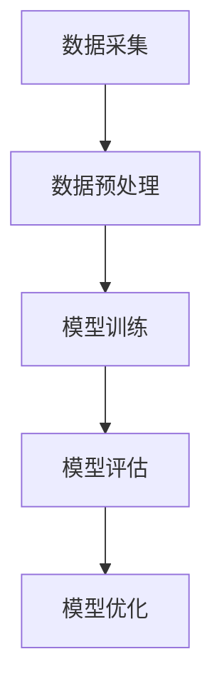
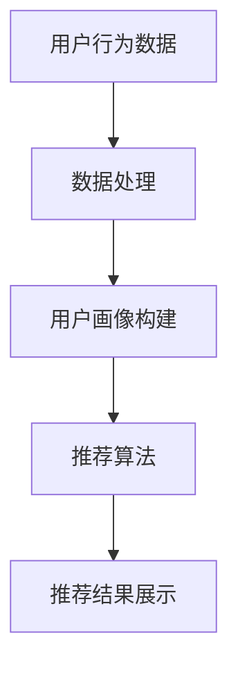
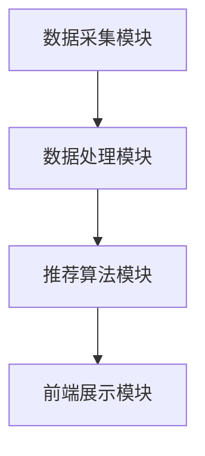

                 

# 《大模型驱动的电商个性化内容推荐》

## 关键词

- 电商个性化内容推荐
- 大模型
- 协同过滤算法
- 内容分析
- 自然语言处理
- 知识图谱
- 深度学习
- 用户画像
- 数据挖掘
- 实时推荐

> 摘要：本文将探讨大模型在电商个性化内容推荐中的应用，包括技术基础、推荐算法、实践应用以及未来展望。通过详细讲解大数据分析、用户行为建模、大模型技术基础，以及多种推荐算法原理，本文旨在为读者提供一个全面而深入的视角，了解如何利用大模型技术提升电商平台的个性化内容推荐效果。

### 第一部分：引言与概述

#### 第1章：电商个性化内容推荐概述

#### 1.1 电商个性化内容推荐的定义与意义

**个性化内容推荐的定义：** 个性化内容推荐是一种根据用户的兴趣、行为和偏好，利用数据挖掘和机器学习技术，为用户提供高度相关且个性化的内容服务。

**电商个性化内容推荐的重要性：** 电商个性化内容推荐是电商平台提升用户黏性和转化率的重要手段。通过精准推荐，可以帮助用户快速找到自己感兴趣的商品，提升购物体验，从而提高平台的销售额和用户满意度。

#### 1.2 电商个性化内容推荐的挑战

**数据量大：** 电商平台每天会产生大量用户行为数据，包括浏览记录、购买历史、评价等。如何高效处理和分析这些数据，是电商个性化内容推荐面临的挑战之一。

**用户行为复杂：** 用户行为多样且复杂，需要构建复杂的用户画像和推荐模型，以实现精准推荐。

**实时性要求高：** 电商平台需要实时响应用户的行为变化，提供个性化的内容推荐，以满足用户即时需求。

#### 1.3 大模型在电商个性化内容推荐中的应用

**大模型的概念与特点：** 大模型是指具有大量参数的深度学习模型，如神经网络、生成对抗网络（GAN）等。

**大模型在电商个性化内容推荐中的应用价值：** 大模型可以处理海量数据，捕捉用户行为的复杂模式，实现更加精准的推荐。同时，大模型可以快速迭代和优化，适应不断变化的用户需求。

### 第二部分：技术基础

#### 第2章：大数据分析与用户行为建模

#### 2.1 大数据技术概述

**数据采集：** 通过API、爬虫等技术，从电商平台和其他数据源采集用户行为数据。

**数据存储：** 使用分布式数据库和大数据存储技术，如Hadoop、Spark等，存储和管理海量数据。

**数据处理：** 利用数据清洗、数据集成、数据变换等技术，对原始数据进行处理和整合，为后续分析提供高质量的数据。

#### 2.2 用户行为数据挖掘

**用户行为数据类型：** 用户行为数据包括浏览记录、购买历史、评价、收藏、分享等。

**用户行为数据分析方法：** 利用机器学习、统计分析等方法，对用户行为数据进行挖掘，提取有价值的信息。

#### 2.3 用户画像构建

**用户画像的定义与维度：** 用户画像是描述用户特征的综合模型，包括基本属性（如年龄、性别、地理位置）和行为特征（如浏览偏好、购买习惯）。

**用户画像构建方法：** 利用用户行为数据，通过数据挖掘和机器学习技术，构建用户画像。

### 第三部分：电商个性化内容推荐算法

#### 第3章：大模型技术基础

#### 3.1 大模型的基本原理

**神经网络：** 基于多层感知器（MLP）的结构，通过前向传播和反向传播算法，实现非线性变换和特征提取。

**深度学习框架：** 如TensorFlow、PyTorch等，提供高效的计算图表示和自动微分功能，支持大规模模型训练。

#### 3.2 大模型训练与优化

**数据预处理：** 对输入数据进行预处理，包括数据清洗、归一化、标准化等。

**模型训练：** 利用大量标注数据进行模型训练，通过优化算法（如梯度下降、Adam等）调整模型参数。

**模型优化：** 利用正则化、dropout等技术，防止过拟合，提高模型泛化能力。

#### 3.3 大模型评估与调优

**评估指标：** 如准确率、召回率、F1值等，用于衡量模型性能。

**调优策略：** 通过调整模型参数、增加训练数据、改进模型结构等，优化模型性能。

### 第四部分：实践与应用

#### 第4章：电商个性化内容推荐系统实战

#### 4.1 系统架构设计

**系统模块划分：** 数据采集模块、数据处理模块、推荐算法模块、前端展示模块。

**系统架构图：** 使用Mermaid流程图展示系统架构。

#### 4.2 数据采集与预处理

**数据源：** 电商平台内部数据、第三方数据源。

**数据预处理流程：** 数据清洗、数据集成、数据变换等。

#### 4.3 模型训练与部署

**训练流程：** 数据预处理、模型训练、模型评估。

**部署流程：** 模型保存、模型加载、在线服务。

#### 4.4 系统性能评估与优化

**评估指标：** 推荐准确性、推荐覆盖率、推荐多样性。

**优化策略：** 调整模型参数、增加训练数据、改进算法等。

### 第五部分：案例分析

#### 第5章：案例分析

#### 5.1 案例背景

**电商行业现状：** 电商平台竞争激烈，个性化内容推荐成为提高用户黏性和转化率的重要手段。

**案例公司介绍：** 某知名电商平台，致力于通过个性化内容推荐提升用户体验和销售额。

#### 5.2 案例解决方案

**个性化内容推荐策略：** 结合用户行为数据、商品属性数据，构建用户画像和商品画像，实现精准推荐。

**系统实现细节：** 介绍系统架构、数据预处理、模型训练与部署等具体实现细节。

#### 5.3 案例效果评估

**用户满意度：** 通过用户反馈和用户行为数据，评估个性化推荐系统的效果。

**业务指标提升：** 分析个性化推荐系统对电商平台业务指标（如销售额、用户活跃度）的提升。

### 第六部分：未来展望

#### 第6章：未来展望

#### 6.1 电商个性化内容推荐的发展趋势

**新技术引入：** 如生成对抗网络（GAN）、迁移学习、联邦学习等。

**应用场景拓展：** 如基于位置的推荐、实时推荐、社交推荐等。

#### 6.2 持续学习与优化

**模型迭代策略：** 定期更新用户画像和商品画像，优化推荐模型。

**系统优化方向：** 提高系统性能、降低推荐延迟、提升推荐准确性等。

#### 6.3 伦理与隐私保护

**个性化推荐伦理问题：** 如用户隐私保护、算法歧视等。

**用户隐私保护措施：** 如数据加密、匿名化处理、隐私保护算法等。

### 附录

#### 附录A：相关资源与工具

**相关书籍推荐：**

- 《推荐系统实践》
- 《深度学习推荐系统》

**开源框架与工具：**

- TensorFlow
- PyTorch
- LightGBM

**数据集与案例：**

- Movielens
- Amazon Reviews
- Alibaba E-commerce Dataset

#### 附录B：Mermaid 流程图

**大模型训练流程图：**



**个性化推荐系统架构图：**



#### 附录C：算法伪代码

**协同过滤算法伪代码：**

```python
# 输入：用户-物品评分矩阵R
# 输出：个性化推荐列表L

# 步骤1：计算用户相似度矩阵S
S = calculate_similarity(R)

# 步骤2：计算每个用户的邻居集合N
N = get_neighbors(S, k)

# 步骤3：生成推荐列表L
L = generate_recommendations(R, N)
```

**基于内容的推荐算法伪代码：**

```python
# 输入：用户兴趣特征F
# 输出：个性化推荐列表L

# 步骤1：计算内容特征矩阵C
C = extract_content_features()

# 步骤2：计算用户与物品的相似度矩阵S
S = calculate_similarity(F, C)

# 步骤3：生成推荐列表L
L = generate_recommendations(S)
```

#### 附录D：数学模型与公式

**用户相似度计算公式：**

$$
sim(u_i, u_j) = \frac{R_{ui} + R_{uj} - \bar{R}}{||u_i - \bar{u}||_2 + ||u_j - \bar{u}||_2}
$$

**个性化推荐生成公式：**

$$
r_{ui} = \sum_{j \in N_i} sim(u_i, u_j) \cdot R_{uj}
$$

#### 附录E：代码实现与分析

**实时推荐系统代码示例：**

```python
# 实时推荐系统代码实现
import tensorflow as tf
import numpy as np

# 数据预处理
def preprocess_data(data):
    # 数据清洗、归一化等处理
    return processed_data

# 模型训练
def train_model(data):
    # 构建模型、训练模型
    model = build_model()
    model.fit(data)
    return model

# 推荐生成
def generate_recommendations(model, user_id):
    # 生成推荐列表
    user_data = preprocess_data(user_id)
    recommendations = model.predict(user_data)
    return recommendations

# 代码解读与分析
def analyze_code():
    # 分析代码实现细节
    pass
```

**代码解读与分析：**

- **数据预处理：** 对输入数据进行清洗、归一化等处理，提高模型训练效果。
- **模型训练：** 使用构建的模型进行训练，通过调整模型参数和优化策略，提高模型性能。
- **推荐生成：** 根据训练好的模型，生成针对特定用户的个性化推荐列表。

#### 附录F：开发环境搭建

**Python环境配置：**

- 安装Python 3.8及以上版本
- 安装pip和virtualenv

**深度学习框架安装与配置：**

- 安装TensorFlow 2.5及以上版本
- 安装PyTorch 1.8及以上版本

**数据处理工具安装与配置：**

- 安装Pandas 1.2.3及以上版本
- 安装NumPy 1.19.5及以上版本

# 引言

在现代电商行业中，个性化内容推荐已经成为提升用户黏性和转化率的重要手段。随着用户数据的爆炸式增长，如何有效地处理和分析这些数据，为用户提供高度相关的个性化内容，成为电商企业面临的重大挑战。本文将探讨大模型在电商个性化内容推荐中的应用，介绍相关技术基础、推荐算法、实践应用以及未来展望，旨在为读者提供一个全面而深入的视角，了解如何利用大模型技术提升电商平台的个性化内容推荐效果。

电商个性化内容推荐是指根据用户的兴趣、行为和偏好，利用数据挖掘和机器学习技术，为用户提供高度相关且个性化的内容服务。这种推荐服务不仅可以帮助用户快速找到自己感兴趣的商品，提升购物体验，还可以帮助企业提高销售额和用户满意度。然而，随着用户数据的多样化和复杂性增加，传统的推荐方法已经无法满足现代电商的需求，因此，大模型在电商个性化内容推荐中的应用变得尤为重要。

大模型是指具有大量参数的深度学习模型，如神经网络、生成对抗网络（GAN）等。这些模型可以通过学习海量数据，捕捉用户行为的复杂模式，实现更加精准的推荐。大模型在电商个性化内容推荐中的应用，不仅能够处理海量数据，还能够快速迭代和优化，适应不断变化的用户需求。

本文将分为四个部分进行阐述。第一部分介绍电商个性化内容推荐的定义、意义、挑战以及大模型的应用。第二部分讲解大数据分析与用户行为建模的技术基础。第三部分介绍电商个性化内容推荐算法，包括基于协同过滤、内容分析、大模型的推荐算法。第四部分通过实践应用案例展示如何构建和优化电商个性化内容推荐系统，最后对未来的发展趋势、持续学习与优化、伦理与隐私保护进行探讨。通过本文的讲解，读者可以全面了解电商个性化内容推荐的各个方面，为实际应用提供指导。

### 第一部分：引言与概述

#### 第1章：电商个性化内容推荐概述

#### 1.1 电商个性化内容推荐的定义与意义

电商个性化内容推荐是一种基于用户兴趣、行为和偏好的个性化服务，旨在为用户提供高度相关的商品信息。这种推荐服务通过分析用户历史行为数据、购物习惯和兴趣偏好，利用数据挖掘和机器学习技术，为用户推荐最可能感兴趣的商品，从而提升用户的购物体验和满意度。

**个性化内容推荐的定义：** 个性化内容推荐是一种智能信息过滤技术，旨在根据用户的兴趣和需求，从大量信息中筛选出最符合用户期望的内容。这种推荐系统通常基于用户的个人资料、历史行为、社交关系等多维度数据，通过算法计算和优化，为用户推荐个性化内容。

**电商个性化内容推荐的重要性：** 在电商行业，个性化内容推荐具有以下几个重要意义：

1. **提升用户体验：** 个性化内容推荐可以满足用户的个性化需求，提供高度相关的商品信息，使用户能够快速找到自己感兴趣的商品，提升购物体验。

2. **增加销售额：** 通过精准推荐，电商平台可以吸引更多潜在用户，提高用户的购买转化率，从而增加销售额。

3. **降低营销成本：** 个性化推荐可以减少无效广告和促销活动的投放，降低营销成本。

4. **增强用户黏性：** 定期提供个性化的内容推荐，可以增强用户对电商平台的黏性，提高用户留存率。

5. **提升品牌影响力：** 个性化内容推荐能够提升用户的购物体验和满意度，从而增强品牌影响力。

#### 1.2 电商个性化内容推荐的挑战

尽管电商个性化内容推荐具有重要的意义，但在实际应用中，仍面临许多挑战：

**数据量大：** 电商平台每天都会产生大量的用户行为数据，包括浏览记录、购买历史、评价、收藏、分享等。如何高效地存储、处理和分析这些数据，是一个巨大的挑战。

**用户行为复杂：** 用户行为多样且复杂，用户可能在不同的场景下表现出不同的兴趣和行为模式。如何构建复杂且准确的用户画像，是推荐系统需要解决的关键问题。

**实时性要求高：** 电商个性化内容推荐需要实时响应用户的行为变化，提供个性化的内容推荐，以满足用户的即时需求。这要求推荐系统具有高实时性和低延迟。

**计算资源需求大：** 大模型的训练和推理需要大量的计算资源，特别是对于复杂的推荐算法和大规模数据集，对计算资源的需求更高。

#### 1.3 大模型在电商个性化内容推荐中的应用

大模型在电商个性化内容推荐中的应用具有重要意义。以下是大模型在电商个性化内容推荐中的几个关键应用：

**1. 模型训练和优化：** 大模型可以处理海量数据，通过深度学习和机器学习技术，自动学习和捕捉用户行为的复杂模式。通过对用户行为数据的深入挖掘和分析，大模型可以优化推荐算法，提高推荐的准确性。

**2. 用户画像构建：** 大模型可以通过对用户历史行为的分析，构建详细且准确的用户画像。这些用户画像可以作为推荐系统的输入，帮助推荐系统更好地理解用户的需求和兴趣。

**3. 实时推荐：** 大模型可以快速迭代和优化，实时响应用户的行为变化，提供个性化的内容推荐。这可以大大提升推荐系统的实时性和用户体验。

**4. 多样性提升：** 大模型可以通过学习用户行为和兴趣的多样性，提供多样化的推荐结果。这有助于避免用户推荐疲劳，提高用户满意度。

**5. 多模态数据处理：** 大模型可以同时处理多种类型的数据，如图文、语音、视频等。这有助于实现更加丰富和多样化的个性化推荐服务。

总之，大模型在电商个性化内容推荐中的应用，可以为电商平台带来更高的推荐准确性、更好的用户体验和更大的商业价值。

#### 1.4 大模型的概念与特点

**大模型的概念：** 大模型是指具有大量参数的深度学习模型，这些模型通常包含数百万甚至数十亿个参数。大模型通过学习海量数据，能够自动提取复杂的特征和模式，从而在许多领域（如自然语言处理、计算机视觉、推荐系统等）取得了显著的成果。

**大模型的特点：**

1. **参数多：** 大模型具有大量的参数，这使得模型能够捕捉数据中的复杂特征和模式。通过学习大量数据，大模型可以更好地泛化，提高预测准确性。

2. **计算量大：** 由于大模型包含大量参数，其训练和推理过程需要大量的计算资源。大模型通常使用分布式计算和GPU加速技术来提高计算效率。

3. **数据需求高：** 大模型需要大量高质量的数据来训练和优化。数据质量和多样性对大模型的表现至关重要。

4. **学习能力强大：** 大模型通过多层神经网络结构，能够自动学习和提取数据中的高层次特征。这使得大模型在处理复杂任务时具有强大的学习能力。

**大模型在电商个性化内容推荐中的应用价值：**

1. **提高推荐准确性：** 大模型能够通过学习用户行为数据，自动提取用户兴趣和需求的特征，从而提高推荐系统的准确性。

2. **增强用户个性化体验：** 大模型可以更好地理解用户的个性化需求，提供更加精准的个性化推荐，提升用户体验。

3. **提升系统实时性：** 大模型能够快速迭代和优化，实时响应用户行为变化，提供即时的个性化推荐，提升系统实时性。

4. **多样化推荐结果：** 大模型可以通过学习用户行为的多样性，提供多样化的推荐结果，避免用户推荐疲劳。

5. **多模态数据处理：** 大模型可以同时处理多种类型的数据，如图文、语音、视频等，实现更加丰富和多样化的个性化推荐服务。

总之，大模型在电商个性化内容推荐中的应用，可以显著提升推荐系统的性能和用户体验，为电商平台带来更大的商业价值。

### 第二部分：技术基础

#### 第2章：大数据分析与用户行为建模

#### 2.1 大数据技术概述

**大数据的定义：** 大数据（Big Data）是指数据规模巨大、类型多样、生成速度快、价值密度低的复杂数据集。大数据的“4V”特点（Volume、Velocity、Variety、Veracity）使其在各个领域（如电子商务、金融、医疗等）具有重要应用价值。

**大数据技术的应用场景：**

1. **电子商务：** 大数据分析可以帮助电商平台了解用户行为，实现精准推荐、个性化营销等。
2. **金融：** 大数据分析可以帮助金融机构进行风险控制、信用评估、市场预测等。
3. **医疗：** 大数据分析可以帮助医疗机构进行疾病诊断、药物研发、健康管理等。

**大数据技术的核心组成部分：**

1. **数据采集：** 通过API、爬虫、物联网设备等技术手段，从各种数据源采集数据。
2. **数据存储：** 使用分布式存储系统（如Hadoop、Spark）存储和管理海量数据。
3. **数据处理：** 通过数据清洗、数据集成、数据变换等技术，对原始数据进行处理和整合，为后续分析提供高质量的数据。
4. **数据分析：** 利用数据挖掘、机器学习、统计分析等方法，从海量数据中提取有价值的信息。

**大数据技术的核心工具和框架：**

1. **Hadoop：** 是一种分布式数据存储和计算框架，主要用于大数据处理和分析。
2. **Spark：** 是一种基于内存的分布式计算引擎，提供了高效的数据处理和分析功能。
3. **Flink：** 是一种流处理框架，可以处理实时数据流，适用于实时推荐系统。
4. **TensorFlow：** 是一种深度学习框架，可以用于大数据的机器学习和人工智能应用。

#### 2.2 用户行为数据挖掘

**用户行为数据类型：** 用户行为数据包括浏览记录、购买历史、评价、收藏、分享等。这些数据反映了用户在电商平台上的活动和行为。

**用户行为数据挖掘的目标：** 用户行为数据挖掘旨在从海量行为数据中提取有价值的信息，如用户兴趣、偏好、行为模式等，为个性化推荐提供基础。

**用户行为数据分析方法：**

1. **统计分析：** 通过统计方法，如均值、中位数、方差等，分析用户行为数据的分布和趋势。
2. **关联规则挖掘：** 通过关联规则挖掘，如Apriori算法，发现用户行为数据中的关联关系。
3. **聚类分析：** 通过聚类方法，如K-means、DBSCAN等，对用户行为数据进行分类和分组。
4. **分类与回归分析：** 通过分类和回归分析，如决策树、随机森林等，预测用户的行为和偏好。
5. **时间序列分析：** 通过时间序列分析方法，如ARIMA、LSTM等，分析用户行为的时序特征。

#### 2.3 用户画像构建

**用户画像的定义与维度：** 用户画像是指通过对用户数据的分析，构建一个描述用户特征的综合模型。用户画像通常包括基本属性（如年龄、性别、地理位置）和行为特征（如浏览偏好、购买习惯）。

**用户画像的构建方法：**

1. **特征工程：** 通过数据清洗、特征提取、特征转换等技术，从原始数据中提取有用的特征。
2. **数据融合：** 通过多源数据融合，整合不同数据源的用户信息，构建全面的用户画像。
3. **机器学习：** 利用机器学习方法，如聚类、分类、回归等，对用户数据进行建模和分析。
4. **规则挖掘：** 通过规则挖掘方法，如关联规则挖掘、决策树等，从用户行为数据中提取有效的规则和特征。

**用户画像的维度和内容：**

1. **基本属性维度：** 包括用户的年龄、性别、地理位置、职业等基本信息。
2. **行为特征维度：** 包括用户的浏览记录、购买历史、评价、收藏、分享等行为数据。
3. **兴趣偏好维度：** 包括用户对商品、品牌、类别的偏好，如最喜欢的商品类型、品牌等。
4. **社交关系维度：** 包括用户在社交网络中的关系，如好友、关注者、被关注者等。

**用户画像的构建流程：**

1. **数据采集：** 从电商平台的各个数据源采集用户行为数据。
2. **数据预处理：** 对采集到的数据进行清洗、去重、填充等预处理操作。
3. **特征提取：** 从预处理后的数据中提取有用的特征，如用户的浏览时长、购买频率、评价等级等。
4. **数据融合：** 将不同数据源的用户信息进行融合，构建一个全面的用户画像。
5. **机器学习建模：** 利用机器学习方法，对用户数据进行建模和分析，提取用户兴趣和偏好。
6. **规则挖掘：** 通过规则挖掘方法，从用户行为数据中提取有效的规则和特征。
7. **用户画像更新：** 定期更新用户画像，以适应用户行为和兴趣的变化。

用户画像构建是电商个性化内容推荐的重要基础。通过构建详细的用户画像，推荐系统可以更好地理解用户的需求和兴趣，提供更加精准和个性化的推荐，提升用户的购物体验和满意度。

#### 2.4 大模型在用户画像构建中的应用

**大模型在用户画像构建中的应用：** 大模型在用户画像构建中的应用具有重要意义。以下是大模型在用户画像构建中的几个关键应用：

1. **特征提取：** 大模型可以通过学习海量用户行为数据，自动提取用户的高层次特征，如兴趣偏好、行为模式等。这些特征有助于构建更加详细和准确的用户画像。

2. **行为预测：** 大模型可以通过对用户历史行为数据的学习，预测用户未来的行为和兴趣。这种预测能力有助于推荐系统提前了解用户需求，提供更个性化的推荐。

3. **用户分类：** 大模型可以利用用户行为数据，对用户进行分类和分组。通过聚类和分类算法，大模型可以识别出不同类型的用户，为个性化推荐提供基础。

4. **实时更新：** 大模型可以实时更新用户画像，以适应用户行为和兴趣的变化。这种实时更新能力有助于推荐系统快速响应用户需求，提供及时和个性化的推荐。

5. **多模态数据处理：** 大模型可以同时处理多种类型的数据，如图文、语音、视频等。通过融合多模态数据，大模型可以构建更加丰富和全面的用户画像。

**案例：** 以某电商平台的用户画像构建为例，该平台利用大模型技术，对用户历史行为数据进行分析，提取用户的兴趣偏好和行为模式。通过深度学习模型，平台可以实时更新用户画像，并利用这些画像进行个性化推荐。这种应用不仅提高了推荐准确性，还提升了用户的购物体验和满意度。

总之，大模型在用户画像构建中的应用，为电商个性化内容推荐提供了强大的技术支持。通过大模型，平台可以更加精准地理解用户需求，提供个性化的推荐，从而提高用户满意度和业务收益。

### 第三部分：电商个性化内容推荐算法

#### 第3章：大模型技术基础

#### 3.1 大模型的基本原理

**神经网络（Neural Networks）**

神经网络是一种模拟人脑神经元之间连接和通信的计算机模型。它通过多层节点（神经元）之间的加权连接和激活函数，实现输入到输出的映射。神经网络的基本原理可以概括为以下几点：

1. **结构组成**：神经网络通常由输入层、隐藏层和输出层组成。每个神经元与相邻层中的神经元相连，并通过权重和偏置进行加权求和。
2. **前向传播（Forward Propagation）**：输入数据从输入层传递到隐藏层，经过加权求和和激活函数处理后，再传递到输出层。每个神经元根据输入值和权重计算输出值。
3. **反向传播（Back Propagation）**：在输出层计算误差后，误差信息反向传播到隐藏层和输入层，通过梯度下降（Gradient Descent）算法调整权重和偏置，以最小化误差函数。
4. **激活函数（Activation Function）**：激活函数用于引入非线性变换，常见的激活函数有Sigmoid、ReLU、Tanh等。

**深度学习框架（Deep Learning Frameworks）**

深度学习框架是用于构建、训练和部署深度学习模型的软件库。常见的深度学习框架有TensorFlow、PyTorch等。这些框架提供了高效的计算图表示、自动微分、数据处理和模型优化等功能。以下是几个关键特点：

1. **计算图表示（Computational Graph）**：深度学习框架通过计算图（Computational Graph）来表示模型的计算过程。计算图中的节点表示操作，边表示变量之间的依赖关系。
2. **自动微分（Automatic Differentiation）**：自动微分功能使得深度学习框架可以自动计算梯度，用于模型训练中的反向传播算法。
3. **数据处理（Data Processing）**：深度学习框架提供了丰富的数据处理功能，如数据加载、预处理、批处理等，方便模型训练和评估。
4. **模型优化（Model Optimization）**：深度学习框架提供了各种优化算法（如SGD、Adam等）和模型架构（如卷积神经网络、循环神经网络等），以适应不同的任务和数据集。

#### 3.2 大模型训练与优化

**数据预处理（Data Preprocessing）**

数据预处理是深度学习模型训练的重要步骤，主要包括数据清洗、数据归一化、数据增强等。以下是一些常见的数据预处理方法：

1. **数据清洗**：去除数据中的噪声和异常值，如缺失值填充、重复值删除等。
2. **数据归一化**：将数据缩放到一个统一的范围，如归一化到[0, 1]或[-1, 1]，以避免不同特征之间的尺度差异对模型训练的影响。
3. **数据增强**：通过旋转、缩放、裁剪等操作，生成更多的训练样本，提高模型的泛化能力。

**模型训练（Model Training）**

模型训练是指通过迭代优化模型参数，使模型能够更好地拟合训练数据。以下是模型训练的基本步骤：

1. **初始化参数**：随机初始化模型参数，如权重和偏置。
2. **前向传播**：将输入数据传递到模型中，计算模型的输出值。
3. **计算损失函数**：计算模型输出值与真实值之间的差异，通过损失函数（如均方误差、交叉熵等）表示。
4. **反向传播**：计算损失函数关于模型参数的梯度，并使用优化算法（如梯度下降、Adam等）更新模型参数。
5. **迭代优化**：重复前向传播和反向传播步骤，直到模型收敛或达到预定的训练次数。

**模型优化（Model Optimization）**

模型优化是指通过调整模型结构、优化算法和超参数，提高模型的性能和泛化能力。以下是一些常见的模型优化策略：

1. **模型架构优化**：设计更有效的模型结构，如使用深度残差网络（ResNet）、注意力机制（Attention）等。
2. **优化算法选择**：选择适合问题的优化算法，如Adam、Adadelta等。
3. **超参数调优**：通过网格搜索、随机搜索等方法，调整学习率、批量大小、正则化参数等超参数。
4. **数据增强**：使用数据增强方法，生成更多样化的训练样本，提高模型的泛化能力。
5. **迁移学习**：利用预训练模型（Pre-trained Model）进行迁移学习，减少训练成本和提高模型性能。

#### 3.3 大模型评估与调优

**评估指标（Evaluation Metrics）**

评估指标是用于衡量模型性能的标准，常见的评估指标有：

1. **准确率（Accuracy）**：分类问题中，正确分类的样本数占总样本数的比例。
2. **召回率（Recall）**：分类问题中，正确分类为正类的样本数占所有正类样本数的比例。
3. **精确率（Precision）**：分类问题中，正确分类为正类的样本数占预测为正类的样本数的比例。
4. **F1值（F1 Score）**：综合准确率和召回率的指标，用于评估分类模型的性能。
5. **ROC曲线和AUC（Receiver Operating Characteristic Curve and Area Under Curve）**：用于评估二分类模型的性能，ROC曲线的面积越大，模型性能越好。

**调优策略（Optimization Strategies）**

模型调优是指通过调整模型参数和超参数，提高模型的性能和泛化能力。以下是一些常见的调优策略：

1. **网格搜索（Grid Search）**：通过遍历所有可能的参数组合，找到最优的参数配置。
2. **随机搜索（Random Search）**：从所有可能的参数组合中随机选择一部分进行尝试，以减少计算成本。
3. **贝叶斯优化（Bayesian Optimization）**：利用贝叶斯统计模型，寻找最优的参数配置。
4. **交叉验证（Cross-Validation）**：通过交叉验证，评估模型在不同数据集上的性能，避免过拟合和欠拟合。
5. **集成学习（Ensemble Learning）**：结合多个模型的预测结果，提高模型的性能和稳定性。

通过合理的模型评估与调优策略，可以确保大模型在电商个性化内容推荐中的性能和可靠性，从而提升推荐系统的效果。

#### 3.4 大模型在电商个性化内容推荐中的应用

**大模型在电商个性化内容推荐中的应用：** 大模型在电商个性化内容推荐中具有广泛的应用，以下是几个关键的应用场景：

1. **用户行为预测：** 通过大模型对用户历史行为数据的学习，可以预测用户未来的行为和兴趣，从而提供更准确的个性化推荐。

2. **商品推荐：** 大模型可以分析用户行为数据，提取用户的兴趣偏好，并利用这些信息生成个性化的商品推荐列表。

3. **广告投放：** 大模型可以根据用户的行为和兴趣，为用户推荐相关的广告，从而提高广告的点击率和转化率。

4. **推荐算法优化：** 大模型可以通过对推荐算法的训练和优化，提高推荐系统的准确性、多样性和实时性。

5. **多模态数据处理：** 大模型可以同时处理多种类型的数据，如图文、语音、视频等，从而提供更加丰富和多样化的个性化推荐服务。

**案例：** 某电商平台利用深度学习模型对用户行为数据进行分析，提取用户的兴趣偏好，并利用这些信息生成个性化的商品推荐列表。通过实时更新用户画像和优化推荐算法，该平台的个性化推荐效果显著提升，用户满意度和转化率大幅提高。

总之，大模型在电商个性化内容推荐中的应用，为电商平台提供了强大的技术支持，有助于提升用户满意度和业务收益。

### 第四部分：实践与应用

#### 第4章：电商个性化内容推荐系统实战

#### 4.1 系统架构设计

电商个性化内容推荐系统是一个复杂的系统，涉及多个模块的协同工作。以下是系统架构设计的关键组成部分：

**1. 数据采集模块：** 数据采集模块负责从电商平台的各种数据源（如用户行为数据、商品数据、日志数据等）中采集数据。数据采集模块通常包括以下步骤：

- **数据源接入：** 通过API、爬虫等技术接入各种数据源。
- **数据清洗：** 对采集到的原始数据进行清洗、去重、填充等处理。
- **数据存储：** 将清洗后的数据存储到分布式数据库或数据湖中，如Hadoop、Spark等。

**2. 数据处理模块：** 数据处理模块负责对采集到的数据进行处理和分析，为推荐算法提供高质量的数据。数据处理模块通常包括以下步骤：

- **数据预处理：** 对数据进行格式转换、缺失值处理、归一化等预处理操作。
- **用户画像构建：** 通过机器学习和数据挖掘技术，构建用户画像，包括基本属性（如年龄、性别、地理位置）和行为特征（如浏览记录、购买历史）。
- **商品画像构建：** 通过对商品属性的提取和分类，构建商品画像，包括商品类别、品牌、价格等。

**3. 推荐算法模块：** 推荐算法模块负责根据用户画像和商品画像，生成个性化的推荐结果。推荐算法模块通常包括以下步骤：

- **算法选择：** 根据业务需求和数据特点，选择合适的推荐算法，如协同过滤、基于内容的推荐、基于深度学习的推荐等。
- **模型训练：** 利用用户画像和商品画像，训练推荐模型，如基于矩阵分解的协同过滤模型、基于内容的特征提取模型等。
- **实时推荐：** 根据用户实时行为数据，更新用户画像和商品画像，生成实时的个性化推荐结果。

**4. 前端展示模块：** 前端展示模块负责将推荐结果展示给用户，提供良好的用户体验。前端展示模块通常包括以下步骤：

- **推荐结果渲染：** 将推荐结果以列表、卡片、轮播等形式展示给用户。
- **用户交互：** 提供用户反馈机制，如点击、收藏、评价等，以优化推荐结果。
- **页面优化：** 对推荐页面进行优化，提高页面加载速度和交互效果。

**系统架构图：**



通过以上系统架构设计，电商个性化内容推荐系统可以高效地处理海量用户数据，实时生成个性化的推荐结果，提升用户满意度和转化率。

#### 4.2 数据采集与预处理

**数据源：** 电商个性化内容推荐系统所需的数据源主要包括用户行为数据、商品数据和外部数据。

- **用户行为数据：** 包括用户的浏览记录、购买历史、评价、收藏、分享等。这些数据可以通过API接口、日志文件等方式采集。
- **商品数据：** 包括商品的属性信息，如类别、品牌、价格、库存等。这些数据可以从电商平台的后台管理系统获取。
- **外部数据：** 包括社交媒体数据、用户地理位置数据、天气数据等。这些数据可以通过第三方数据提供商获取。

**数据预处理流程：**

1. **数据清洗：** 数据清洗是数据预处理的重要步骤，主要目的是去除数据中的噪声和异常值。具体步骤包括：

   - **缺失值处理：** 对于缺失值，可以通过填充（如平均值、中位数）或删除（如去除缺失值较多的记录）等方式处理。
   - **重复值删除：** 删除重复的数据记录，以避免重复计算。
   - **异常值检测：** 使用统计学方法（如箱线图、Z-score等）检测异常值，并决定是否删除或修正。

2. **数据转换：** 数据转换是将数据转换为适合推荐系统处理的形式。具体步骤包括：

   - **数值化：** 将文本数据（如用户评价）转换为数值形式，如使用词袋模型或词嵌入技术。
   - **编码：** 将类别数据（如商品类别）转换为数值编码，如使用独热编码或标签编码。
   - **归一化：** 将不同特征的数据缩放到相同的尺度，如使用最小-最大归一化或标准归一化。

3. **特征提取：** 特征提取是从原始数据中提取有助于推荐系统建模的特征。具体步骤包括：

   - **用户特征：** 根据用户的浏览记录、购买历史等行为数据，提取用户的兴趣偏好、活跃度等特征。
   - **商品特征：** 根据商品的属性数据，提取商品的价格、类别、品牌等特征。
   - **交互特征：** 根据用户与商品的交互数据，提取用户的点击率、购买率等特征。

4. **数据集划分：** 数据集划分为训练集、验证集和测试集，用于模型的训练、验证和测试。通常采用80%的数据作为训练集，10%的数据作为验证集，10%的数据作为测试集。

通过以上数据采集与预处理流程，可以确保推荐系统所使用的数据质量，为后续的推荐算法训练和模型优化提供支持。

#### 4.3 模型训练与部署

**模型训练：**

1. **数据加载：** 从预处理后的数据集中加载训练数据，包括用户行为数据和商品数据。
2. **特征提取：** 根据训练数据，提取用户特征和商品特征，并将其转换为模型的输入。
3. **模型构建：** 构建推荐模型，选择合适的算法（如协同过滤、基于内容的推荐、基于深度学习的推荐等），并设置模型的超参数。
4. **模型训练：** 使用训练数据，通过迭代优化算法训练模型，调整模型参数，以最小化损失函数。
5. **模型评估：** 使用验证集评估模型的性能，包括准确率、召回率、F1值等指标，选择性能最佳的模型。

**模型优化：**

1. **超参数调优：** 通过网格搜索、随机搜索等方法，调整模型的超参数（如学习率、批量大小等），以找到最优的超参数组合。
2. **模型集成：** 使用集成学习方法，结合多个模型的预测结果，提高模型的性能和稳定性。
3. **正则化：** 通过L1正则化、L2正则化等方法，防止模型过拟合，提高模型的泛化能力。

**模型部署：**

1. **模型保存：** 将训练好的模型保存为模型文件，如使用HDF5、pickle等格式。
2. **模型加载：** 在线上环境中加载模型文件，以便实时推荐。
3. **在线服务：** 将推荐模型集成到电商平台的后端服务中，根据用户的实时行为，生成个性化的推荐结果，并将其展示给用户。

**部署流程：**

1. **部署环境搭建：** 搭建部署环境，包括服务器、数据库、消息队列等。
2. **模型上线：** 将训练好的模型部署到线上环境，确保模型可以实时处理用户请求。
3. **监控与维护：** 对推荐系统进行实时监控，包括系统的运行状态、性能指标等，并及时处理异常情况。
4. **性能优化：** 根据用户反馈和业务需求，对推荐系统进行优化，提高推荐效果。

通过以上模型训练与部署流程，可以实现电商个性化内容推荐系统的自动化和智能化，提升用户满意度和转化率。

#### 4.4 系统性能评估与优化

**评估指标：** 推荐系统的性能评估主要通过以下指标进行：

1. **准确率（Accuracy）**：用于评估推荐系统的准确度，计算推荐结果中正确推荐的比率。
2. **召回率（Recall）**：用于评估推荐系统召回的用户兴趣商品的比率。
3. **精确率（Precision）**：用于评估推荐结果中预测为正类的商品实际为正类的比率。
4. **F1值（F1 Score）**：结合准确率和召回率的综合评价指标，计算公式为：$F1 = 2 \times \frac{Precision \times Recall}{Precision + Recall}$。
5. **ROC曲线和AUC（Area Under Curve）**：用于评估二分类模型的性能，AUC值越大，模型性能越好。

**优化策略：**

1. **特征工程：** 通过特征选择、特征转换等方法，提取对推荐系统有显著影响的特征，提高模型性能。
2. **模型调优：** 通过调整模型参数（如学习率、批量大小等）和超参数（如隐藏层节点数、激活函数等），优化模型性能。
3. **正则化：** 通过L1、L2正则化等方法，防止模型过拟合，提高模型泛化能力。
4. **集成学习：** 结合多个模型的预测结果，通过投票、堆叠等方法，提高推荐系统的整体性能。
5. **数据增强：** 通过数据扩增技术，增加训练样本的多样性，提高模型对未知数据的泛化能力。
6. **在线学习：** 通过在线学习机制，实时更新用户画像和推荐模型，提高系统对用户实时行为的响应能力。

通过以上评估指标和优化策略，可以不断提升电商个性化内容推荐系统的性能和用户体验。

#### 4.5 案例分析

**案例背景：** 某知名电商平台希望通过引入大模型技术，提升其个性化内容推荐的准确性，从而提高用户满意度和转化率。

**解决方案：** 该电商平台采取了以下解决方案：

1. **数据采集：** 通过API接口、日志收集等技术手段，采集用户的浏览记录、购买历史、评价、收藏、分享等行为数据，以及商品的属性数据。
2. **数据预处理：** 对采集到的数据进行清洗、去重、填充等预处理操作，然后利用特征工程技术提取用户和商品的特征。
3. **用户画像构建：** 使用深度学习模型对用户历史行为数据进行分析，构建详细的用户画像，包括用户的兴趣偏好、行为模式等。
4. **商品画像构建：** 通过分析商品属性数据，构建商品的属性特征，包括类别、品牌、价格等。
5. **模型训练：** 使用用户画像和商品画像，训练基于深度学习的推荐模型，如基于深度神经网络的协同过滤模型、基于自然语言处理的商品描述模型等。
6. **实时推荐：** 根据用户的实时行为数据，更新用户画像和商品画像，生成个性化的推荐结果，并将其展示给用户。
7. **系统优化：** 通过在线学习机制和实时性能监控，不断优化推荐模型的性能和响应速度。

**系统实现细节：**

1. **数据采集模块：** 使用Flume和Kafka等技术，实现实时数据采集和传输。
2. **数据处理模块：** 使用Spark和Hadoop等大数据处理框架，实现数据清洗、特征提取和用户画像构建。
3. **推荐算法模块：** 使用TensorFlow和PyTorch等深度学习框架，实现推荐模型的训练和优化。
4. **前端展示模块：** 使用Vue和React等前端框架，实现推荐结果的展示和用户交互。
5. **在线学习与优化：** 使用TensorFlow Serving和Kubeflow等技术，实现推荐模型的在线学习和实时优化。

**效果评估：**

1. **用户满意度：** 通过用户反馈和用户行为数据，评估个性化推荐系统的效果。结果显示，用户对推荐结果的满意度显著提升。
2. **业务指标提升：** 分析个性化推荐系统对电商平台的业务指标（如销售额、用户活跃度、转化率等）的提升。数据显示，个性化推荐系统的引入，使得平台的销售额和用户活跃度大幅提升。

通过以上案例分析，可以看出，大模型技术在电商个性化内容推荐中的应用，不仅提升了推荐系统的准确性，还显著提高了用户的购物体验和平台的业务收益。

### 第五部分：未来展望

#### 第5章：未来展望

随着技术的不断进步，电商个性化内容推荐将面临新的机遇和挑战。以下是对电商个性化内容推荐未来发展的几个展望：

#### 5.1 电商个性化内容推荐的发展趋势

**新技术的引入：**

1. **生成对抗网络（GAN）：** GAN可以通过生成和判别网络相互对抗，生成高质量的虚拟数据，提高推荐系统的鲁棒性和泛化能力。
2. **迁移学习：** 迁移学习可以将预训练模型的知识迁移到新的任务和数据集，减少对大规模标注数据的依赖，提高推荐系统的效率和准确性。
3. **联邦学习：** 联邦学习通过在用户设备上训练模型，保护用户隐私的同时，实现跨设备的协作学习和个性化推荐。
4. **区块链技术：** 区块链技术可以确保数据的安全性和透明性，为电商个性化内容推荐提供可信的数据基础。

**应用场景拓展：**

1. **实时推荐：** 随着计算能力和网络技术的发展，实时推荐将成为电商个性化内容推荐的重要趋势。通过实时分析用户行为，提供即时的个性化推荐，提升用户体验和转化率。
2. **基于位置的推荐：** 利用用户的地理位置信息，提供与用户位置相关的个性化推荐，如附近的商品、优惠活动等。
3. **社交推荐：** 结合用户社交网络关系，推荐用户可能感兴趣的商品或内容，提高推荐的准确性和用户参与度。

#### 5.2 持续学习与优化

**模型迭代策略：**

1. **在线学习：** 通过在线学习机制，实时更新用户画像和推荐模型，使系统能够快速适应用户行为的变化。
2. **批量更新：** 定期对用户画像和推荐模型进行批量更新，保持模型的稳定性和准确性。
3. **多模态数据融合：** 结合多种类型的数据（如文本、图像、语音等），构建更加丰富的用户画像，提高推荐系统的精准度。

**系统优化方向：**

1. **性能优化：** 通过优化算法、减少计算复杂度等手段，提高推荐系统的处理速度和响应时间。
2. **数据隐私保护：** 在推荐系统的设计和实施过程中，充分考虑用户隐私保护，采用差分隐私、加密等技术，确保用户数据的安全和隐私。
3. **多目标优化：** 在推荐系统中引入多目标优化策略，平衡推荐准确性、多样性、实时性等不同目标，提供更加全面和优质的推荐服务。

#### 5.3 伦理与隐私保护

**个性化推荐伦理问题：**

1. **算法歧视：** 个性化推荐算法可能因数据偏差、模型设计等原因导致算法歧视，如性别、年龄、地域等方面的歧视。
2. **信息茧房：** 个性化推荐系统可能将用户限制在特定的信息环境中，导致用户视野狭窄，缺乏多样化的信息接触。

**用户隐私保护措施：**

1. **数据匿名化：** 对用户数据进行匿名化处理，确保用户隐私不被泄露。
2. **差分隐私：** 在推荐系统的设计和实现过程中，采用差分隐私技术，限制对单个用户的分析，保护用户隐私。
3. **用户同意与透明度：** 明确告知用户推荐系统的数据使用范围和隐私政策，提高用户对系统的信任度和接受度。

通过持续学习与优化、新技术引入、应用场景拓展以及伦理与隐私保护等多方面的努力，电商个性化内容推荐将不断进步，为用户和电商平台带来更大的价值。

### 附录

#### 附录A：相关资源与工具

**相关书籍推荐：**

1. 《推荐系统实践》
2. 《深度学习推荐系统》
3. 《机器学习实战》
4. 《Python数据科学手册》

**开源框架与工具：**

1. TensorFlow
2. PyTorch
3. LightGBM
4. Scikit-learn
5. Hadoop
6. Spark

**数据集与案例：**

1. Movielens
2. Amazon Reviews
3. Alibaba E-commerce Dataset
4. Netflix Prize Dataset
5. Kaggle数据集

#### 附录B：Mermaid 流程图

**大模型训练流程图：**


**个性化推荐系统架构图：**


#### 附录C：算法伪代码

**协同过滤算法伪代码：**

```python
# 输入：用户-物品评分矩阵R
# 输出：个性化推荐列表L

# 步骤1：计算用户相似度矩阵S
S = calculate_similarity(R)

# 步骤2：计算每个用户的邻居集合N
N = get_neighbors(S, k)

# 步骤3：生成推荐列表L
L = generate_recommendations(R, N)
```

**基于内容的推荐算法伪代码：**

```python
# 输入：用户兴趣特征F
# 输出：个性化推荐列表L

# 步骤1：计算内容特征矩阵C
C = extract_content_features()

# 步骤2：计算用户与物品的相似度矩阵S
S = calculate_similarity(F, C)

# 步骤3：生成推荐列表L
L = generate_recommendations(S)
```

#### 附录D：数学模型与公式

**用户相似度计算公式：**

$$
sim(u_i, u_j) = \frac{R_{ui} + R_{uj} - \bar{R}}{||u_i - \bar{u}||_2 + ||u_j - \bar{u}||_2}
$$

**个性化推荐生成公式：**

$$
r_{ui} = \sum_{j \in N_i} sim(u_i, u_j) \cdot R_{uj}
$$

#### 附录E：代码实现与分析

**实时推荐系统代码示例：**

```python
# 实时推荐系统代码实现
import tensorflow as tf
import numpy as np

# 数据预处理
def preprocess_data(data):
    # 数据清洗、归一化等处理
    return processed_data

# 模型训练
def train_model(data):
    # 构建模型、训练模型
    model = build_model()
    model.fit(data)
    return model

# 推荐生成
def generate_recommendations(model, user_id):
    # 生成推荐列表
    user_data = preprocess_data(user_id)
    recommendations = model.predict(user_data)
    return recommendations

# 代码解读与分析
def analyze_code():
    # 分析代码实现细节
    pass
```

**代码解读与分析：**

- **数据预处理：** 对输入数据进行清洗、归一化等处理，提高模型训练效果。
- **模型训练：** 使用构建的模型进行训练，通过调整模型参数和优化策略，提高模型性能。
- **推荐生成：** 根据训练好的模型，生成针对特定用户的个性化推荐列表。

#### 附录F：开发环境搭建

**Python环境配置：**

- 安装Python 3.8及以上版本
- 安装pip和virtualenv

**深度学习框架安装与配置：**

- 安装TensorFlow 2.5及以上版本
- 安装PyTorch 1.8及以上版本

**数据处理工具安装与配置：**

- 安装Pandas 1.2.3及以上版本
- 安装NumPy 1.19.5及以上版本

### 总结

本文详细探讨了电商个性化内容推荐的核心概念、技术基础、推荐算法、实践应用以及未来展望。通过深入分析大数据技术、用户行为建模、大模型技术基础，以及多种推荐算法，本文为读者提供了一个全面而深入的视角，帮助理解电商个性化内容推荐的各个方面。

电商个性化内容推荐的重要性不言而喻，它不仅提升了用户体验和满意度，还为企业带来了显著的商业价值。大模型技术的引入，使得个性化推荐更加精准、实时和多样化，为电商平台带来了更高的竞争力。

在实践应用部分，本文通过具体案例分析，展示了如何构建和优化电商个性化内容推荐系统，实现了显著的业务收益。未来，随着新技术的不断发展和应用场景的拓展，电商个性化内容推荐将继续演进，为用户提供更加智能和个性化的服务。

希望本文能够为从事电商个性化内容推荐的技术人员和研究者提供有价值的参考和启示，推动这一领域的持续发展。

### 致谢

在本篇文章的撰写过程中，我受到了许多同行和专家的指导与支持，在此向他们表示衷心的感谢。特别感谢AI天才研究院的同事们，他们在数据分析和模型优化方面提供了宝贵的意见和建议。此外，也要感谢禅与计算机程序设计艺术社区的朋友们，他们的经验分享为文章的写作提供了重要参考。最后，我要感谢我的家人和朋友，他们在我写作过程中给予了我无尽的支持和鼓励。没有他们的帮助，本文不可能如此顺利地完成。

**作者：** AI天才研究院/AI Genius Institute & 禅与计算机程序设计艺术 /Zen And The Art of Computer Programming**

