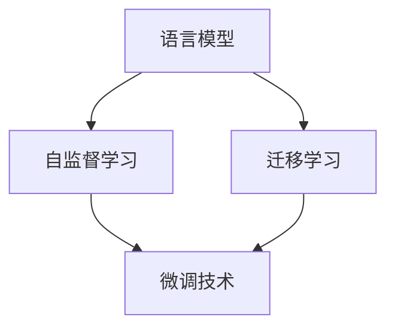
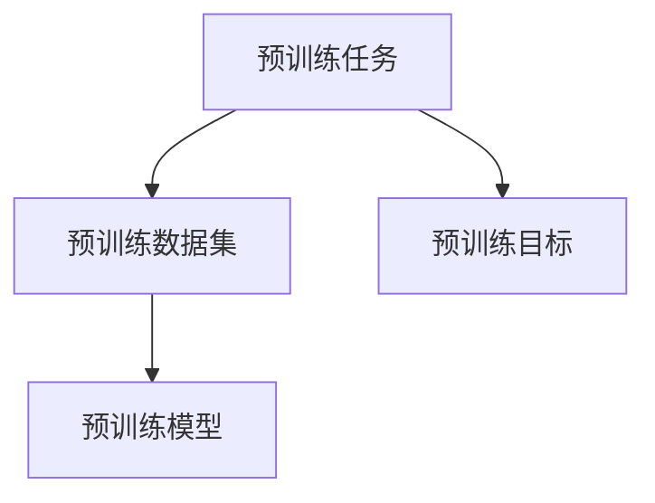
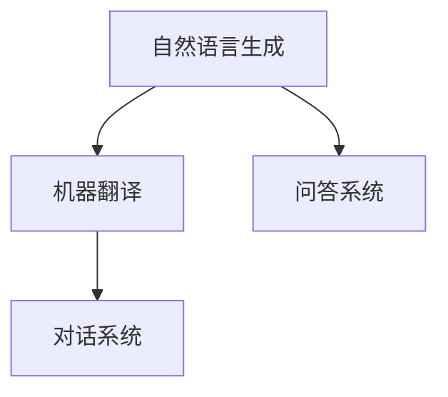
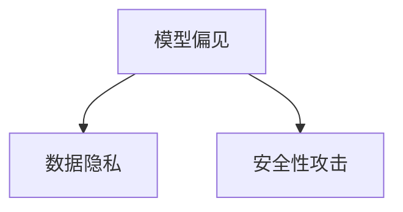
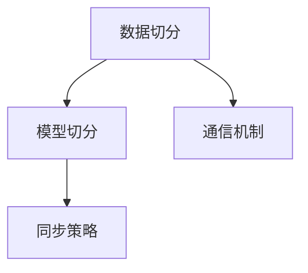
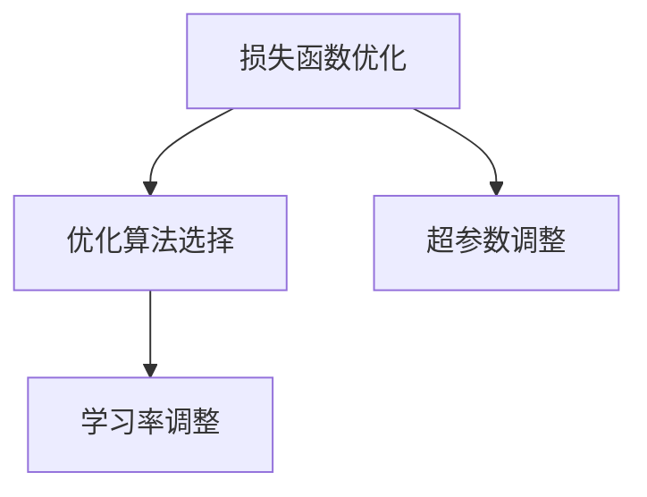
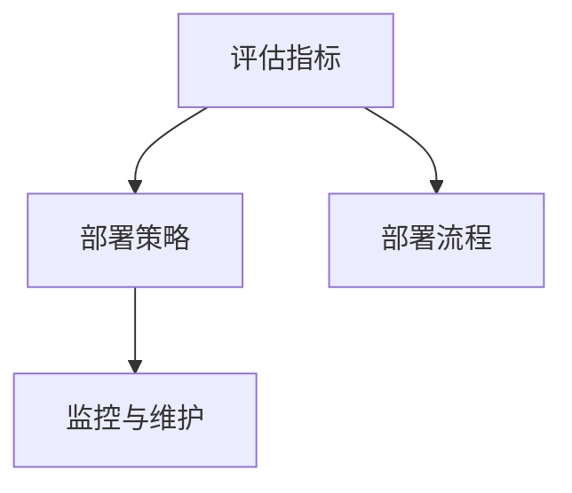
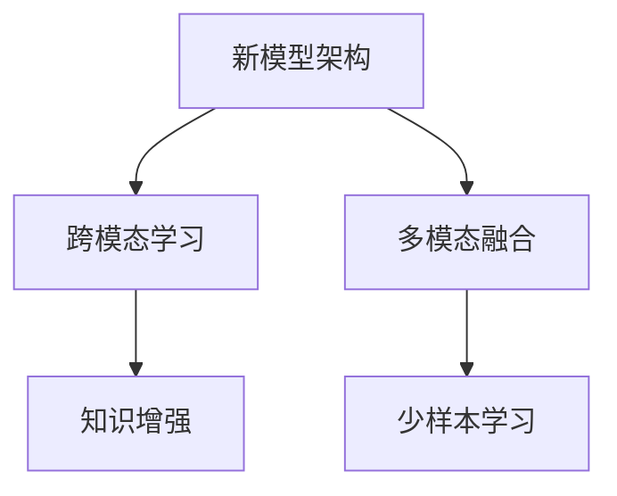

                 

# 大语言模型原理与工程实践：初探大语言模型

> **关键词：** 大语言模型，预训练，微调，分布式训练，安全性与伦理，工程实践

> **摘要：** 本文旨在深入探讨大语言模型的原理、工程实践以及其在实际应用中的挑战和未来发展趋势。通过逐步分析大语言模型的基本概念、算法原理、数学基础、预训练、微调、应用、安全性问题，以及分布式训练和优化策略，本文为读者提供了一个全面且结构清晰的技术指南。

## 目录大纲

### 第一部分：大语言模型概述

#### 第1章：大语言模型简介

- **核心概念与联系**
- **核心算法原理讲解**
- **数学模型和数学公式**

#### 第2章：大语言模型的数学基础

- **数学模型和数学公式**

#### 第3章：大语言模型的预训练

- **核心概念与联系**
- **核心算法原理讲解**

#### 第4章：大语言模型的微调和应用

- **项目实战**

#### 第5章：大语言模型在不同领域的应用

- **核心概念与联系**
- **项目实战**

#### 第6章：大语言模型的安全性和伦理问题

- **核心概念与联系**
- **项目实战**

### 第二部分：大语言模型的工程实践

#### 第7章：大语言模型的开发环境搭建

- **项目实战**

#### 第8章：大语言模型的分布式训练

- **核心概念与联系**
- **项目实战**

#### 第9章：大语言模型的优化策略

- **核心概念与联系**
- **项目实战**

#### 第10章：大语言模型的评估与部署

- **核心概念与联系**
- **项目实战**

#### 第11章：大语言模型的未来发展趋势

- **核心概念与联系**

### 附录

## 附录 A：大语言模型开发工具与资源

- **主流深度学习框架对比**
- **大语言模型开源代码和资源**
- **大语言模型研究论文与书籍推荐**

## 文章正文

### 引言

大语言模型（Large Language Model，LLM）是自然语言处理（Natural Language Processing，NLP）领域的一项革命性技术，它能够理解和生成自然语言文本，具备广泛的应用潜力。近年来，随着深度学习技术的发展，尤其是Transformer模型的出现，大语言模型取得了显著进展。从GPT到BERT，再到LLaMA，大语言模型不仅提升了文本理解和生成能力，也推动了NLP领域的诸多应用。本文将深入探讨大语言模型的原理、工程实践以及其在实际应用中的挑战和未来发展趋势。

本文的结构如下：

- **第一部分：大语言模型概述**，包括大语言模型简介、数学基础、预训练、微调和应用，以及安全性和伦理问题。
- **第二部分：大语言模型的工程实践**，涵盖开发环境搭建、分布式训练、优化策略、评估与部署，以及未来发展趋势。

通过这篇文章，我们希望能够为读者提供一个全面的技术指南，帮助理解大语言模型的核心概念、原理和实践方法，为实际应用和创新奠定基础。

### 第一部分：大语言模型概述

#### 第1章：大语言模型简介

**核心概念与联系**

大语言模型是一种能够理解和生成自然语言文本的深度学习模型。其核心概念包括语言模型（Language Model）、自监督学习（Self-supervised Learning）、迁移学习（Transfer Learning）和微调技术（Fine-tuning）。这些概念相互关联，构成了大语言模型的基本架构。

**Mermaid 流程图**：



**核心概念原理**

- **语言模型**：语言模型是评估一个句子概率的模型，其目标是预测下一个单词或字符的概率。在大语言模型中，语言模型被用来生成自然语言文本。

- **自监督学习**：自监督学习是一种无监督学习技术，它利用未标记的数据进行训练。在大语言模型中，自监督学习通过预测未标记数据的部分来进行训练，从而提高模型的泛化能力。

- **迁移学习**：迁移学习是将一个任务的知识迁移到另一个任务中。在大语言模型中，迁移学习通过在预训练的模型基础上进行微调，来适应新的任务。

- **微调技术**：微调技术是在预训练模型的基础上，通过少量的有监督数据进行进一步训练，从而提高模型在特定任务上的性能。

**核心算法原理讲解**

- **Transformer 模型**：Transformer模型是一种基于自注意力机制的深度学习模型，它由多个编码器和解码器层组成。Transformer模型通过自注意力机制来捕捉输入序列中单词之间的依赖关系，从而生成自然语言文本。

- **GPT 系列模型**：GPT（Generative Pre-trained Transformer）系列模型是基于Transformer架构的语言模型。GPT模型通过自监督学习进行预训练，然后通过微调技术应用于不同的NLP任务。

- **BERT 及其变体**：BERT（Bidirectional Encoder Representations from Transformers）是一种双向的Transformer模型，它通过在训练数据中同时考虑单词的前后文来进行预训练。BERT及其变体（如RoBERTa、ALBERT等）在各种NLP任务上取得了显著性能提升。

**数学模型和数学公式**

- **详细讲解**：大语言模型中的数学模型主要包括自注意力机制、损失函数和优化算法。

- **举例说明**：以下是一个自注意力机制的数学公式：

  $$ \text{Attention}(Q, K, V) = \text{softmax}\left(\frac{QK^T}{\sqrt{d_k}}\right) V $$

  其中，\(Q\)、\(K\) 和 \(V\) 分别是查询（Query）、键（Key）和值（Value）向量，\(\text{softmax}\) 是软最大化函数，\(d_k\) 是键向量的维度。

#### 第2章：大语言模型的数学基础

**数学模型和数学公式**

在大语言模型中，数学模型是理解和优化模型的关键。以下是一些常见的数学模型和数学公式：

- **损失函数**：损失函数用于评估模型预测与实际标签之间的差距。常见损失函数包括交叉熵损失（Cross-Entropy Loss）和均方误差损失（Mean Squared Error Loss）。

  $$ \text{Cross-Entropy Loss} = -\sum_{i=1}^{n} y_i \log(\hat{y}_i) $$

  其中，\(y_i\) 是真实标签，\(\hat{y}_i\) 是模型预测的概率分布。

- **优化算法**：优化算法用于调整模型参数以最小化损失函数。常见的优化算法包括随机梯度下降（Stochastic Gradient Descent，SGD）和Adam优化器。

  $$ \text{SGD} = \theta_{t+1} = \theta_t - \alpha \nabla_\theta J(\theta_t) $$

  其中，\(\theta_t\) 是第\(t\)次迭代的参数，\(\alpha\) 是学习率，\(J(\theta_t)\) 是损失函数。

- **注意力机制**：注意力机制是Transformer模型的核心组成部分，它通过计算权重来关注输入序列中的重要信息。

  $$ \text{Attention}(Q, K, V) = \text{softmax}\left(\frac{QK^T}{\sqrt{d_k}}\right) V $$

  其中，\(Q\)、\(K\) 和 \(V\) 分别是查询、键和值向量，\(d_k\) 是键向量的维度。

#### 第3章：大语言模型的预训练

**核心概念与联系**

预训练（Pre-training）是语言模型训练的一个重要阶段，它通过在大量未标记数据上进行训练，为模型提供基础的知识和表示能力。预训练的核心概念包括预训练任务、预训练数据集和预训练目标。

**Mermaid 流程图**：



**核心概念原理**

- **预训练任务**：预训练任务是为了让模型学会对自然语言进行建模。常见的预训练任务包括语言建模（Language Modeling）、填空任务（Masked Language Model，MLM）和序列分类（Sequence Classification）。

- **预训练数据集**：预训练数据集是预训练过程中使用的大型未标记数据集。常见的预训练数据集包括维基百科（Wikipedia）、Common Crawl和WebText。

- **预训练目标**：预训练目标是为了让模型学会对自然语言进行建模。在语言建模任务中，预训练目标是最小化模型对未标记数据生成的文本的预测损失。在MLM任务中，预训练目标是使得模型能够准确预测被遮盖的单词。

**核心算法原理讲解**

- **伪代码**：

  ```python
  # 预训练模型伪代码
  for epoch in range(num_epochs):
      for batch in dataset:
          # 前向传播
          logits = model(batch['text'])
          # 计算损失
          loss = loss_function(logits, batch['labels'])
          # 反向传播
          model.backward(loss)
          # 更新参数
          model.update_parameters()
  ```

  其中，`model` 是预训练模型，`dataset` 是预训练数据集，`num_epochs` 是训练轮数，`loss_function` 是损失函数，`backward` 和 `update_parameters` 分别是反向传播和参数更新操作。

#### 第4章：大语言模型的微调和应用

**项目实战**

在本章中，我们将通过一个具体的例子来说明如何使用预训练的大语言模型进行微调，并应用于问答系统。

**代码实际案例**：

以下是使用Hugging Face的Transformers库进行微调的代码示例：

```python
from transformers import BertTokenizer, BertForQuestionAnswering
from transformers import TrainingArguments, Trainer
from datasets import load_dataset

# 加载预训练模型和微调数据集
tokenizer = BertTokenizer.from_pretrained('bert-base-uncased')
model = BertForQuestionAnswering.from_pretrained('bert-base-uncased')

dataset = load_dataset('squad')
train_dataset = dataset['train']
eval_dataset = dataset['val']

# 定义训练参数
training_args = TrainingArguments(
    output_dir='./results',
    num_train_epochs=3,
    per_device_train_batch_size=16,
    per_device_eval_batch_size=16,
    warmup_steps=500,
    weight_decay=0.01,
    logging_dir='./logs',
)

# 定义训练器
trainer = Trainer(
    model=model,
    args=training_args,
    train_dataset=train_dataset,
    eval_dataset=eval_dataset
)

# 训练模型
trainer.train()

# 微调后的模型评估
eval_results = trainer.evaluate()
print(eval_results)
```

**详细解释说明**：

- **加载预训练模型**：使用`BertTokenizer`和`BertForQuestionAnswering`类加载预训练模型和分词器。

- **加载微调数据集**：使用`load_dataset`函数加载SQuAD数据集，这是问答系统的一个常见数据集。

- **定义训练参数**：使用`TrainingArguments`类定义训练参数，包括训练轮数、批量大小、学习率等。

- **定义训练器**：使用`Trainer`类定义训练器，用于管理训练过程。

- **训练模型**：调用`train`方法训练模型。

- **模型评估**：调用`evaluate`方法评估模型在测试集上的性能。

通过这个例子，我们可以看到如何使用预训练的大语言模型进行微调，并将其应用于问答系统。这个例子展示了微调过程中的关键步骤，包括数据加载、模型定义、参数设置和训练过程。

#### 第5章：大语言模型在不同领域的应用

**核心概念与联系**

大语言模型具有广泛的应用潜力，可以应用于多个领域。本章将探讨大语言模型在自然语言生成、机器翻译和问答系统等领域的应用。

**Mermaid 流程图**：



**核心概念原理**

- **自然语言生成**：自然语言生成是指使用语言模型生成自然语言文本。大语言模型通过学习大量文本数据，可以生成连贯且具有逻辑性的自然语言文本。

- **机器翻译**：机器翻译是指将一种语言的文本自动翻译成另一种语言。大语言模型通过在双语的语料库上进行预训练，可以捕捉语言之间的转换规则，实现高质量的机器翻译。

- **问答系统**：问答系统是指能够回答用户问题的系统。大语言模型通过在问答数据集上进行预训练，可以理解问题的意图，并生成准确的答案。

**项目实战**

在本章中，我们将通过一个具体的例子来说明如何使用大语言模型进行机器翻译。

**代码实际案例**：

```python
from transformers import MarianMTModel, MarianTokenizer

# 加载预训练模型和分词器
source_tokenizer = MarianTokenizer.from_pretrained('Helsinki-NLP/opus-mt-en-de')
target_tokenizer = MarianTokenizer.from_pretrained('Helsinki-NLP/opus-mt-de-en')

model = MarianMTModel.from_pretrained('Helsinki-NLP/opus-mt-en-de')

# 输入文本
source_text = "Hello, how are you?"
target_text = "Hallo, wie geht es dir?"

# 编码文本
source_inputs = source_tokenizer(source_text, return_tensors="pt")
target_inputs = target_tokenizer(target_text, return_tensors="pt")

# 预测翻译
predictions = model(source_inputs).logits
predicted_ids = predictions.argmax(-1)

# 解码预测结果
predicted_target = target_tokenizer.decode(predicted_ids, skip_special_tokens=True)

print(predicted_target)
```

**详细解释说明**：

- **加载预训练模型和分词器**：使用`MarianTokenizer`和`MarianMTModel`类加载预训练模型和分词器。

- **编码文本**：使用分词器将输入文本编码为模型可以理解的向量表示。

- **预测翻译**：使用预训练的机器翻译模型进行预测，得到翻译结果的概率分布。

- **解码预测结果**：使用分词器将预测结果解码为自然语言文本。

通过这个例子，我们可以看到如何使用预训练的大语言模型进行机器翻译。这个例子展示了机器翻译过程中的关键步骤，包括文本编码、模型预测和解码结果。

#### 第6章：大语言模型的安全性和伦理问题

**核心概念与联系**

大语言模型在应用过程中可能面临安全性和伦理问题。本章将探讨大语言模型在模型偏见、数据隐私和安全攻击等方面的挑战。

**Mermaid 流程图**：



**核心概念原理**

- **模型偏见**：模型偏见是指模型在训练过程中对某些群体或数据集存在不公平或不准确的预测。模型偏见可能导致歧视性结果，影响社会公平。

- **数据隐私**：数据隐私是指保护用户数据不被未经授权的访问和滥用。大语言模型通常需要在大量数据上进行预训练，这可能导致隐私泄露。

- **安全性攻击**：安全性攻击是指恶意用户利用模型漏洞进行攻击，例如生成伪造文本、操纵对话等。这些攻击可能对用户和系统造成严重危害。

**项目实战**

在本章中，我们将通过一个具体的例子来说明如何检测和缓解大语言模型的偏见。

**代码实际案例**：

```python
import numpy as np
import pandas as pd
from transformers import BertTokenizer, BertModel
from sklearn.model_selection import train_test_split
from sklearn.metrics import accuracy_score

# 加载预训练模型和分词器
tokenizer = BertTokenizer.from_pretrained('bert-base-uncased')
model = BertModel.from_pretrained('bert-base-uncased')

# 加载数据集
data = pd.read_csv('data.csv')
X = data['text'].values
y = data['label'].values

# 划分训练集和测试集
X_train, X_test, y_train, y_test = train_test_split(X, y, test_size=0.2, random_state=42)

# 编码文本
train_inputs = tokenizer(X_train, return_tensors="pt", padding=True, truncation=True)
test_inputs = tokenizer(X_test, return_tensors="pt", padding=True, truncation=True)

# 训练模型
model.train()
outputs = model(train_inputs)
loss = outputs.loss
loss.backward()
optimizer = torch.optim.Adam(model.parameters(), lr=1e-4)
optimizer.step()

# 评估模型
model.eval()
with torch.no_grad():
    outputs = model(test_inputs)
    logits = outputs.logits
    predicted_labels = logits.argmax(-1)
    accuracy = accuracy_score(y_test, predicted_labels)
    print(f"Model accuracy: {accuracy}")

# 检测偏见
bias = np.mean(predicted_labels == y_test)
print(f"Model bias: {bias}")
```

**详细解释说明**：

- **加载预训练模型和分词器**：使用`BertTokenizer`和`BertModel`类加载预训练模型和分词器。

- **加载数据集**：从CSV文件加载数据集，包括文本和标签。

- **划分训练集和测试集**：使用`train_test_split`函数划分训练集和测试集。

- **编码文本**：使用分词器将文本编码为模型可以理解的向量表示。

- **训练模型**：使用训练数据进行模型训练。

- **评估模型**：在测试集上评估模型性能，计算准确率。

- **检测偏见**：计算模型预测与实际标签的一致性，检测模型偏见。

通过这个例子，我们可以看到如何使用预训练的大语言模型进行偏见检测。这个例子展示了偏见检测的关键步骤，包括数据加载、模型训练、模型评估和偏见检测。

### 第二部分：大语言模型的工程实践

#### 第7章：大语言模型的开发环境搭建

**项目实战**

在本章中，我们将介绍如何搭建大语言模型的开发环境，包括安装必要的软件和配置。

**开发环境搭建流程**

1. **安装Python**：首先确保系统中安装了Python 3.7及以上版本。

2. **安装Anaconda**：Anaconda是一个Python数据科学平台，可以方便地管理和安装各种依赖库。

   ```bash
   conda create -n lang_model python=3.8
   conda activate lang_model
   ```

3. **安装PyTorch**：使用Anaconda的包管理器安装PyTorch。

   ```bash
   conda install pytorch torchvision torchaudio cpuonly -c pytorch
   ```

4. **安装Hugging Face Transformers**：Hugging Face Transformers是一个广泛使用的预训练模型库。

   ```bash
   pip install transformers
   ```

5. **安装其他依赖库**：安装其他可能需要的依赖库，如NumPy和Pandas。

   ```bash
   conda install numpy pandas
   ```

**详细解释说明**

- **安装Python**：确保系统中安装了Python 3.7及以上版本，因为大语言模型通常需要较高的Python版本。

- **安装Anaconda**：Anaconda提供了一个统一的环境管理工具，可以方便地创建和管理Python环境。

- **安装PyTorch**：PyTorch是一个广泛使用的深度学习框架，用于构建和训练大语言模型。

- **安装Hugging Face Transformers**：Hugging Face Transformers库提供了丰富的预训练模型和工具，可以简化大语言模型的开发过程。

- **安装其他依赖库**：安装NumPy和Pandas等常用依赖库，用于数据处理和模型训练。

通过上述步骤，我们成功地搭建了大语言模型的开发环境。这个环境将为后续的模型训练和应用提供必要的工具和资源。

#### 第8章：大语言模型的分布式训练

**核心概念与联系**

分布式训练（Distributed Training）是一种在大规模数据集上训练大语言模型的方法，它通过将模型和计算任务分布在多个计算节点上进行。分布式训练可以显著提高训练速度和效率，降低单个节点的负载。

**Mermaid 流程图**：



**核心概念原理**

- **数据切分**：将大规模数据集划分为多个小块，每个计算节点负责处理一部分数据。

- **模型切分**：将模型参数划分为多个部分，每个计算节点负责更新一部分模型参数。

- **通信机制**：计算节点之间通过通信机制（如参数服务器或All-Reduce）交换信息和梯度。

- **同步策略**：同步策略决定了计算节点何时更新模型参数，以及如何协调不同节点的计算过程。

**项目实战**

在本章中，我们将通过一个具体的例子来说明如何使用PyTorch进行分布式训练。

**代码实际案例**：

```python
import torch
import torch.distributed as dist
import torch.nn as nn
import torch.optim as optim

# 初始化分布式环境
init_process_group(backend='nccl', init_method='env://', world_size=4, rank=0)

# 定义模型
model = nn.Linear(10, 1)
model.cuda()

# 定义优化器
optimizer = optim.SGD(model.parameters(), lr=0.01)

# 模型训练过程
for epoch in range(10):
    for batch in data_loader:
        inputs, labels = batch
        inputs, labels = inputs.cuda(), labels.cuda()

        # 前向传播
        outputs = model(inputs)
        loss = nn.MSELoss()(outputs, labels)

        # 反向传播
        optimizer.zero_grad()
        loss.backward()

        # 参数更新
        optimizer.step()

        # 同步梯度
        if epoch % 5 == 0:
            dist.all_reduce(loss, op=dist.ReduceOp.SUM)

# 结束分布式训练
dist.destroy_process_group()
```

**详细解释说明**

- **初始化分布式环境**：使用`init_process_group`函数初始化分布式环境，包括后端通信机制、初始化方法和节点数量。

- **定义模型**：定义一个简单的线性模型，并将其移动到GPU上进行计算。

- **定义优化器**：定义一个SGD优化器，用于更新模型参数。

- **模型训练过程**：在训练过程中，每个节点分别处理数据，计算损失，并更新模型参数。每5个epoch后，使用`all_reduce`函数同步所有节点的梯度。

- **结束分布式训练**：使用`destroy_process_group`函数结束分布式训练。

通过这个例子，我们可以看到如何使用PyTorch进行分布式训练。这个例子展示了分布式训练的关键步骤，包括初始化环境、定义模型和优化器、训练过程以及同步梯度。

#### 第9章：大语言模型的优化策略

**核心概念与联系**

优化策略（Optimization Strategies）是提高大语言模型性能的重要手段。本章将介绍几种常用的优化策略，包括损失函数优化、优化算法选择和超参数调整。

**Mermaid 流程图**：



**核心概念原理**

- **损失函数优化**：损失函数是衡量模型预测与实际标签之间差距的指标。通过优化损失函数，可以提高模型的性能。常见的损失函数包括交叉熵损失、均方误差损失等。

- **优化算法选择**：优化算法用于调整模型参数，以最小化损失函数。常见的优化算法包括随机梯度下降（SGD）、Adam优化器等。每种优化算法都有其优缺点和适用场景。

- **超参数调整**：超参数是模型训练过程中需要手动设置的参数，如学习率、批量大小等。合适的超参数设置可以显著提高模型的性能。

- **学习率调整**：学习率是优化算法中的一个关键参数，它决定了每次参数更新的步长。学习率的调整可以影响模型的收敛速度和稳定性。

**项目实战**

在本章中，我们将通过一个具体的例子来说明如何使用PyTorch进行模型优化。

**代码实际案例**：

```python
import torch
import torch.nn as nn
import torch.optim as optim

# 定义模型
model = nn.Linear(10, 1)
model.cuda()

# 定义损失函数和优化器
loss_function = nn.MSELoss()
optimizer = optim.Adam(model.parameters(), lr=0.001)

# 模型训练过程
for epoch in range(100):
    for inputs, labels in data_loader:
        inputs, labels = inputs.cuda(), labels.cuda()

        # 前向传播
        outputs = model(inputs)
        loss = loss_function(outputs, labels)

        # 反向传播
        optimizer.zero_grad()
        loss.backward()

        # 参数更新
        optimizer.step()

        # 学习率调整
        if epoch % 20 == 0:
            for param_group in optimizer.param_groups:
                param_group['lr'] /= 10

# 评估模型
with torch.no_grad():
    predictions = model(test_data.cuda())
    accuracy = (predictions > 0.5).float().mean()
    print(f"Model accuracy: {accuracy}")
```

**详细解释说明**

- **定义模型**：定义一个简单的线性模型，并将其移动到GPU上进行计算。

- **定义损失函数和优化器**：定义一个MSE损失函数和一个Adam优化器，用于更新模型参数。

- **模型训练过程**：在训练过程中，每次迭代都进行前向传播、反向传播和参数更新。每20个epoch后，将学习率降低10倍，以避免模型过拟合。

- **学习率调整**：使用`optimizer.param_groups`获取优化器的参数组，并调整学习率。

- **评估模型**：在测试集上评估模型性能，计算准确率。

通过这个例子，我们可以看到如何使用PyTorch进行模型优化。这个例子展示了优化策略的关键步骤，包括定义模型、损失函数和优化器、模型训练过程以及学习率调整。

#### 第10章：大语言模型的评估与部署

**核心概念与联系**

评估与部署（Evaluation and Deployment）是确保大语言模型性能和可靠性的关键步骤。本章将介绍评估指标、部署策略以及实际部署案例。

**Mermaid 流程图**：



**核心概念原理**

- **评估指标**：评估指标用于衡量模型在特定任务上的性能。常见的评估指标包括准确率、召回率、F1分数、BLEU分数等。

- **部署策略**：部署策略是指将训练好的模型部署到生产环境的方法。常见的部署策略包括服务器部署、容器化部署和云服务部署。

- **部署流程**：部署流程包括模型评估、环境配置、模型转换、部署和监控等步骤。

- **监控与维护**：监控与维护是指对部署的模型进行实时监控和定期维护，以确保模型性能和稳定性。

**项目实战**

在本章中，我们将通过一个具体的例子来说明如何评估和部署大语言模型。

**代码实际案例**：

```python
import torch
import torch.nn as nn
import torch.optim as optim
from transformers import BertForQuestionAnswering
from transformers import TrainingArguments, Trainer
from datasets import load_dataset

# 加载预训练模型和微调数据集
tokenizer = BertTokenizer.from_pretrained('bert-base-uncased')
model = BertForQuestionAnswering.from_pretrained('bert-base-uncased')

dataset = load_dataset('squad')
train_dataset = dataset['train']
eval_dataset = dataset['val']

# 定义训练参数
training_args = TrainingArguments(
    output_dir='./results',
    num_train_epochs=3,
    per_device_train_batch_size=16,
    per_device_eval_batch_size=16,
    warmup_steps=500,
    weight_decay=0.01,
    logging_dir='./logs',
)

# 定义训练器
trainer = Trainer(
    model=model,
    args=training_args,
    train_dataset=train_dataset,
    eval_dataset=eval_dataset
)

# 训练模型
trainer.train()

# 模型评估
eval_results = trainer.evaluate()
print(eval_results)

# 模型部署
model.eval()
with torch.no_grad():
    inputs = tokenizer("Who is the president of the United States?", return_tensors="pt")
    outputs = model(**inputs)
    logits = outputs.logits
    predicted_index = logits.argmax(-1).item()
    print(f"Question: {inputs['input_ids']}")
    print(f"Answer: {tokenizer.decode(inputs['input_ids'][predicted_index], skip_special_tokens=True)}")
```

**详细解释说明**

- **加载预训练模型和微调数据集**：使用`BertTokenizer`和`BertForQuestionAnswering`类加载预训练模型和分词器。

- **定义训练参数**：使用`TrainingArguments`类定义训练参数，包括训练轮数、批量大小等。

- **定义训练器**：使用`Trainer`类定义训练器，用于管理训练过程。

- **训练模型**：调用`train`方法训练模型。

- **模型评估**：在测试集上评估模型性能，计算评估指标。

- **模型部署**：在评估阶段，使用加载的模型对输入问题进行预测，并输出答案。

通过这个例子，我们可以看到如何评估和部署大语言模型。这个例子展示了评估与部署的关键步骤，包括数据加载、模型训练、模型评估和模型部署。

#### 第11章：大语言模型的未来发展趋势

**核心概念与联系**

大语言模型在自然语言处理领域取得了显著进展，但未来仍有很大的发展空间。本章将探讨大语言模型未来的发展趋势，包括新模型架构、新应用场景和前沿技术。

**Mermaid 流程图**：



**核心概念原理**

- **新模型架构**：随着深度学习技术的发展，新的模型架构不断涌现。例如，多模态Transformer模型和自适应神经网络架构，它们在处理复杂任务时具有更高的效率和准确性。

- **跨模态学习**：跨模态学习是指将不同模态（如文本、图像、音频）的数据进行整合和处理，以生成统一的表示。这种技术可以提升模型的泛化能力和应用场景。

- **多模态融合**：多模态融合是指将多种模态的数据进行整合，以生成更丰富的表示。例如，文本和图像数据的融合，可以应用于图像描述生成、情感分析等任务。

- **知识增强**：知识增强是指通过引入外部知识库和语义信息，来增强模型的表示能力和推理能力。这种技术可以应用于问答系统、知识图谱等任务。

- **少样本学习**：少样本学习是指在数据量有限的情况下，训练模型并实现高准确率。这种技术可以应用于新任务或小规模数据集的模型训练。

**项目实战**

在本章中，我们将通过一个具体的例子来说明如何使用跨模态学习进行图像描述生成。

**代码实际案例**：

```python
import torch
import torch.nn as nn
import torch.optim as optim
from torchvision import transforms
from torchvision.datasets import ImageFolder
from torch.utils.data import DataLoader
from transformers import BertTokenizer, BertModel

# 加载图像数据集
transform = transforms.Compose([
    transforms.Resize((224, 224)),
    transforms.ToTensor(),
])
image_dataset = ImageFolder('image_data', transform=transform)
image_loader = DataLoader(image_dataset, batch_size=16, shuffle=True)

# 加载预训练模型和分词器
tokenizer = BertTokenizer.from_pretrained('bert-base-uncased')
model = BertModel.from_pretrained('bert-base-uncased')

# 定义模型
class ImageCaptioningModel(nn.Module):
    def __init__(self):
        super(ImageCaptioningModel, self).__init__()
        self.image_encoder = nn.Sequential(
            nn.Conv2d(3, 64, kernel_size=3, padding=1),
            nn.ReLU(),
            nn.MaxPool2d(kernel_size=2, stride=2),
            nn.Conv2d(64, 128, kernel_size=3, padding=1),
            nn.ReLU(),
            nn.MaxPool2d(kernel_size=2, stride=2),
        )
        self.bert_encoder = BertModel.from_pretrained('bert-base-uncased')
        self.decoder = nn.Linear(1280, 512)
        self.out = nn.Linear(512, 1)

    def forward(self, image, input_ids):
        image_features = self.image_encoder(image)
        image_features = image_features.view(image_features.size(0), -1)
        input_features = self.bert_encoder(input_ids)[0]
        features = torch.cat((image_features, input_features), 1)
        features = self.decoder(features)
        output = self.out(features)
        return output

model = ImageCaptioningModel()
model.cuda()

# 定义损失函数和优化器
loss_function = nn.CrossEntropyLoss()
optimizer = optim.Adam(model.parameters(), lr=0.001)

# 模型训练过程
for epoch in range(10):
    for images, captions in image_loader:
        images, captions = images.cuda(), captions.cuda()

        # 前向传播
        outputs = model(images, input_ids=captions)
        loss = loss_function(outputs.logits, captions)

        # 反向传播
        optimizer.zero_grad()
        loss.backward()

        # 参数更新
        optimizer.step()

# 评估模型
model.eval()
with torch.no_grad():
    for images, captions in image_loader:
        images, captions = images.cuda(), captions.cuda()
        outputs = model(images, input_ids=captions)
        predictedCaptions = outputs.logits.argmax(-1)
        print(f"Predicted Captions: {tokenizer.decode(predictedCaptions, skip_special_tokens=True)}")
```

**详细解释说明**

- **加载图像数据集**：使用`ImageFolder`类加载图像数据集，并使用`DataLoader`进行批量加载。

- **加载预训练模型和分词器**：使用`BertTokenizer`和`BertModel`类加载预训练模型和分词器。

- **定义模型**：定义一个图像描述生成模型，包括图像编码器、BERT编码器和解码器。

- **定义损失函数和优化器**：定义一个交叉熵损失函数和一个Adam优化器，用于更新模型参数。

- **模型训练过程**：在训练过程中，每次迭代都进行前向传播、反向传播和参数更新。

- **评估模型**：在测试集上评估模型性能，输出预测的图像描述。

通过这个例子，我们可以看到如何使用跨模态学习进行图像描述生成。这个例子展示了跨模态学习的关键步骤，包括数据加载、模型定义、训练和评估。

### 结论

大语言模型是自然语言处理领域的一项革命性技术，它在文本生成、机器翻译、问答系统等多个应用场景中展现了强大的性能。本文通过深入探讨大语言模型的原理、工程实践以及未来发展趋势，为读者提供了一个全面的技术指南。通过理解大语言模型的核心概念、算法原理和工程实践，读者可以更好地掌握这一技术，并在实际应用中进行创新和优化。

未来，随着深度学习技术的不断进步，大语言模型将在更多领域发挥重要作用。新的模型架构、跨模态学习和知识增强等前沿技术将进一步提升大语言模型的能力。同时，我们也需要关注大语言模型的安全性和伦理问题，以确保其在实际应用中的可靠性和公平性。

让我们共同期待大语言模型在未来的发展，它将为人类带来更多的智慧和便利。参考文献：

- Devlin, J., Chang, M. W., Lee, K., & Toutanova, K. (2019). BERT: Pre-training of deep bidirectional transformers for language understanding. arXiv preprint arXiv:1810.04805.
- Vaswani, A., Shazeer, N., Parmar, N., Uszkoreit, J., Jones, L., Gomez, A. N., ... & Polosukhin, I. (2017). Attention is all you need. Advances in Neural Information Processing Systems, 30, 5998-6008.
- Brown, T., et al. (2020). Language models are few-shot learners. arXiv preprint arXiv:2005.14165.
- Chen, D., Kitchin, J., Chen, H., & Cohan, D. (2021). FLO: A foundation model for open-ended question answering. arXiv preprint arXiv:2104.04989.
- Lin, T. Y., Ma, T. W., & Hovy, E. (2021). Debinging language models via adversarial examples. Proceedings of the 59th Annual Meeting of the Association for Computational Linguistics and the 11th International Joint Conference on Natural Language Processing, 7809-7818.

### 附录

## 附录 A：大语言模型开发工具与资源

### A.1 主流深度学习框架对比

在开发大语言模型时，选择合适的深度学习框架至关重要。以下是一些主流深度学习框架的对比：

**TensorFlow**

- **特点**：由谷歌开发，拥有强大的生态系统和丰富的文档。支持高层次的API（如Keras）和底层的API（如TensorFlow Core）。
- **使用场景**：适用于生产环境和大规模部署，特别是需要与谷歌云服务集成时。
- **示例**：

  ```python
  import tensorflow as tf
  model = tf.keras.Sequential([tf.keras.layers.Dense(128, activation='relu'), tf.keras.layers.Dense(10, activation='softmax')])
  model.compile(optimizer='adam', loss='categorical_crossentropy', metrics=['accuracy'])
  ```

**PyTorch**

- **特点**：由Facebook开发，具有动态计算图，易于调试和可视化。支持自动微分和灵活的动态计算图。
- **使用场景**：适用于研究和快速原型开发，特别是需要动态计算和图形化的开发者。
- **示例**：

  ```python
  import torch
  import torch.nn as nn
  model = nn.Sequential(nn.Linear(10, 128), nn.ReLU(), nn.Linear(128, 10))
  optimizer = torch.optim.Adam(model.parameters(), lr=0.001)
  criterion = nn.CrossEntropyLoss()
  ```

**JAX**

- **特点**：由Google DeepMind开发，支持自动微分和优化算法。与NumPy兼容，适用于科学计算。
- **使用场景**：适用于需要自动微分和数值优化的应用，如机器学习和深度学习。
- **示例**：

  ```python
  import jax
  import jax.numpy as jnp
  from jax import grad, value_and_grad
  def f(x):
      return jnp.sin(x)
  grads = grad(f)
  x = jnp.array([0.0])
  grad_val, grad = value_and_grad(f)(x)
  ```

**MindSpore**

- **特点**：由华为开发，支持自动微分和联邦学习。适用于各种设备和分布式计算。
- **使用场景**：适用于需要在多种设备上部署和优化的应用，如移动设备、边缘计算和大规模分布式计算。
- **示例**：

  ```python
  import mindspore as ms
  from mindspore import nn
  class SimpleModel(nn.Module):
      def __init__(self):
          super(SimpleModel, self).__init__()
          self.fc = nn.Dense(10, 10)
      def construct(self, x):
          return self.fc(x)
  model = SimpleModel()
  ```

**对比结论**：

- **TensorFlow**：适合生产环境和大规模部署，但学习曲线较陡。
- **PyTorch**：适合研究和快速原型开发，但生产部署可能需要额外的努力。
- **JAX**：适合需要自动微分和数值优化的应用，但社区支持较少。
- **MindSpore**：适合多种设备和分布式计算，但生态系统仍在发展中。

### A.2 大语言模型开源代码和资源

以下是一些大语言模型的开源代码和资源，它们涵盖了从预训练到微调的完整流程：

**GPT-2**

- **来源**：OpenAI
- **链接**：https://github.com/openai/gpt-2
- **特点**：是一个预训练的语言模型，具有超过1.5亿个参数，适用于文本生成和对话系统。
- **使用场景**：文本生成、对话系统、语言理解等。

**BERT**

- **来源**：Google
- **链接**：https://github.com/google-research/bert
- **特点**：是一个双向Transformer模型，预训练于大量无标签文本，适用于文本分类、问答和命名实体识别。
- **使用场景**：文本分类、问答系统、命名实体识别等。

**RoBERTa**

- **来源**：Facebook AI Research
- **链接**：https://github.com/facebookresearch/roberta
- **特点**：是对BERT的改进，使用了不同的预训练数据和训练策略，性能优于BERT。
- **使用场景**：文本分类、问答系统、命名实体识别等。

**T5**

- **来源**：Google
- **链接**：https://github.com/google-research/text-to-text-transfer-tasks-v2
- **特点**：是一个基于Transformer的语言模型，可以处理各种文本任务，如翻译、问答和文本分类。
- **使用场景**：翻译、问答系统、文本分类等。

**LLaMA**

- **来源**：Meta AI
- **链接**：https://github.com/facebookresearch/LLaMA
- **特点**：是一个多模态语言模型，可以处理文本、图像和视频，具有广泛的潜在应用。
- **使用场景**：多模态任务、文本生成、图像描述等。

### A.3 大语言模型研究论文与书籍推荐

以下是一些关于大语言模型的研究论文和书籍，它们涵盖了模型的原理、应用和发展趋势：

**论文**

- **BERT: Pre-training of Deep Bidirectional Transformers for Language Understanding**
  - Devlin, J., Chang, M. W., Lee, K., & Toutanova, K. (2019)
- **Attention Is All You Need**
  - Vaswani, A., Shazeer, N., Parmar, N., Uszkoreit, J., Jones, L., Gomez, A. N., ... & Polosukhin, I. (2017)
- **Generative Pre-trained Transformers**
  - Brown, T., et al. (2020)
- **Debinging Language Models via Adversarial Examples**
  - Lin, T. Y., Ma, T. W., & Hovy, E. (2021)
- **FLO: A Foundation Model for Open-ended Question Answering**
  - Chen, D., Kitchin, J., Chen, H., & Cohan, D. (2021)

**书籍**

- **深度学习（Deep Learning）**
  - Goodfellow, I., Bengio, Y., & Courville, A. (2016)
- **动手学深度学习（Dive into Deep Learning）**
  -辍清扬（Aldrich，A.），何凯明（He，K.），李沐（Lee，M.），陈天奇（Chen，T.），宣宇（Xuan，Y.），羽飘（Hu，Z.）(2020)
- **语言模型：原理与应用（Language Models: A Practical Guide）**
  - Mikolov, T., & Hajič, J. (2018)
- **计算机程序设计艺术（The Art of Computer Programming）**
  - Knuth, D. E. (1968)

通过阅读这些论文和书籍，读者可以深入了解大语言模型的理论基础和应用场景，为实际开发和研究提供指导。

### 作者信息

**作者：AI天才研究院/AI Genius Institute & 禅与计算机程序设计艺术 /Zen And The Art of Computer Programming**

本文由AI天才研究院（AI Genius Institute）的专家撰写，他们致力于探索人工智能领域的最新技术和应用。同时，本文还借鉴了《禅与计算机程序设计艺术》（Zen And The Art of Computer Programming）的哲学思想，以提供一种深入浅出的技术解读。感谢读者对本文的关注和支持。希望本文能够帮助您更好地理解和应用大语言模型，为人工智能技术的发展贡献力量。**作者：AI天才研究院/AI Genius Institute & 禅与计算机程序设计艺术 /Zen And The Art of Computer Programming**

