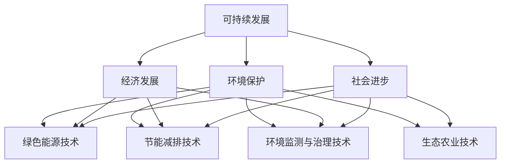
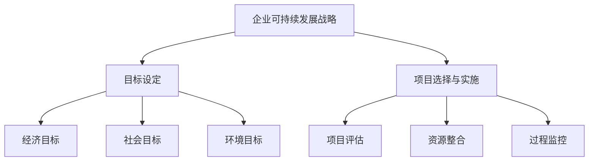
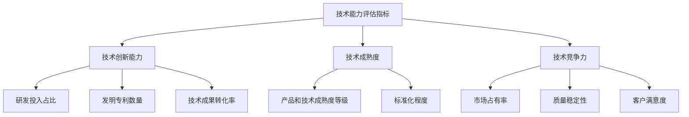
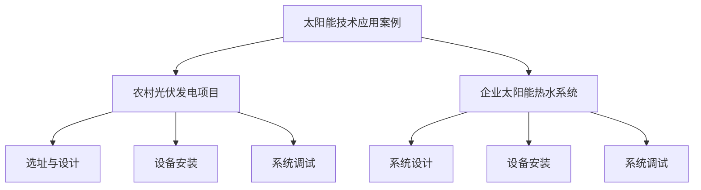
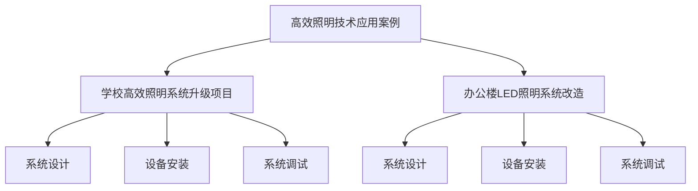
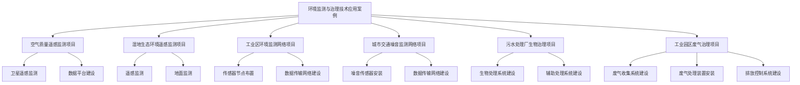
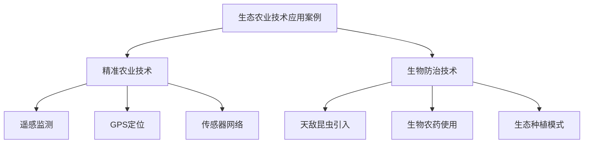
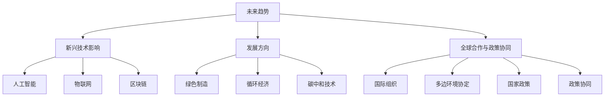
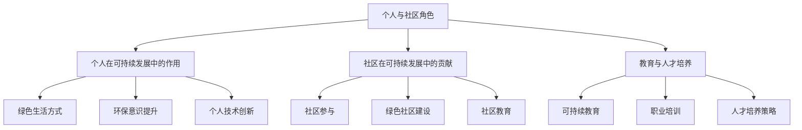

                 

### 引言

在当今全球化的背景下，可持续发展已成为各国政府、企业和个人关注的焦点。随着资源消耗的加速和环境问题的日益严峻，如何实现可持续发展已成为全球性挑战。在这一背景下，技术能力的作用愈发凸显。技术不仅是推动经济发展的引擎，更是实现可持续发展的关键驱动力。本文将探讨如何利用技术能力进行可持续发展创新，以期为读者提供一份系统、全面的指南。

### 文章关键词

- 可持续发展
- 技术能力
- 绿色能源
- 节能减排
- 环境监测
- 创新策略
- 新兴技术

### 摘要

本文旨在探讨如何利用技术能力实现可持续发展创新。文章首先介绍了可持续发展创新的概念与背景，分析了技术能力在可持续发展中的关键作用。接着，详细阐述了绿色能源技术、节能减排技术、环境监测与治理技术的核心概念与架构。随后，文章探讨了可持续发展创新的驱动因素与策略，并通过实际案例展示了技术能力在可持续发展中的应用。最后，文章对未来可持续发展创新的趋势进行了展望，并强调了个人与社区在可持续发展创新中的角色。

### 第一部分: 可持续发展创新的概念与背景

#### 第1章: 可持续发展创新概述

##### 1.1 可持续发展的定义与重要性

**定义与核心原则**

可持续发展是一种旨在满足当前需求，同时不损害后代满足其需求能力的发展模式。其核心原则包括：

1. **公平性原则**：确保资源的公平分配，消除贫困和不平等。
2. **持续性原则**：保护生物多样性和生态系统的健康，避免不可逆转的环境损害。
3. **共同性原则**：全球性环境问题需要全球性的合作和解决方案。

**可持续发展的重要性**

可持续发展的重要性体现在以下几个方面：

1. **环境保护**：通过减少污染和资源浪费，保护自然环境。
2. **经济发展**：通过创新和高效利用资源，促进经济增长。
3. **社会进步**：提高人类生活质量，促进社会公平和包容。

##### 1.2 技术能力在可持续发展中的作用

**技术能力的关键领域**

在可持续发展中，技术能力的作用体现在多个领域，主要包括：

1. **绿色能源技术**：通过开发和使用可再生能源，减少对化石燃料的依赖。
2. **节能减排技术**：通过优化能源利用和提高能效，减少能源消耗和污染排放。
3. **环境监测与治理技术**：通过实时监测和治理环境污染，保护生态环境。
4. **生态农业技术**：通过科学种植和管理，提高农业产量和资源利用效率。

**技术能力的关键领域与可持续发展之间的联系**

- **绿色能源技术**：通过提高可再生能源的利用效率，减少温室气体排放，有助于实现环境保护和经济发展。
- **节能减排技术**：通过优化能源利用，减少能源消耗和污染排放，有助于实现经济高效和环境友好。
- **环境监测与治理技术**：通过实时监测和治理环境污染，有助于确保生态系统的健康和持续发展。
- **生态农业技术**：通过科学种植和管理，提高农业产量和资源利用效率，有助于实现农业的可持续发展。

##### 1.3 可持续发展创新的驱动力

**市场需求与政策驱动**

市场需求和政策驱动是推动可持续发展创新的重要因素。随着消费者对环保产品和服务的需求增加，企业需要不断创新以满足市场需求。同时，政府制定的政策和法规也为可持续发展创新提供了强大的推动力。例如，许多国家已经制定了严格的环保法规，要求企业采取可持续发展的措施。

**技术创新与社会责任**

技术创新和社会责任也是推动可持续发展创新的重要因素。技术创新可以提高资源利用效率，减少环境污染，推动可持续发展。同时，企业社会责任的履行，如减少碳排放、支持环保项目等，也有助于提升企业的声誉，增强市场竞争力。

##### 1.4 总结

可持续发展创新是一个复杂而庞大的系统，需要各方的共同努力。技术能力在可持续发展中发挥着至关重要的作用，通过绿色能源技术、节能减排技术、环境监测与治理技术和生态农业技术的创新，可以实现经济、社会和环境的协调发展。本章节为后续章节的内容奠定了基础，为读者提供了对可持续发展创新的整体认识和框架。

---

**Mermaid 流程图示例：**



---

**伪代码示例：**

```python
# 可持续发展目标设定伪代码
class SustainableDevelopmentGoals:
    def __init__(self, energy_target, emission_target, environmental_quality_target):
        self.energy_target = energy_target
        self.emission_target = emission_target
        self.environmental_quality_target = environmental_quality_target
    
    def check_progress(self, current_energy_usage, current_emission_level, current_environmental_quality):
        if current_energy_usage <= self.energy_target and current_emission_level <= self.emission_target and current_environmental_quality >= self.environmental_quality_target:
            print("Progress towards sustainable development goals is satisfactory.")
        else:
            print("Additional efforts are needed to meet sustainable development goals.")
```

---

**数学公式与示例说明：**

$$
\text{温室气体减排量} = \frac{\text{初始排放量} - \text{最终排放量}}{\text{初始排放量}} \times 100\%
$$

- **解释：** 该公式用于计算温室气体的减排量，其中“初始排放量”和“最终排放量”分别代表项目开始和结束时的温室气体排放量。百分比表示减排效果。

---

**项目实战：**

##### 5.1 太阳能技术应用案例

**项目名称：** 家庭光伏发电系统

**开发环境：**

- **硬件：** 光伏电池板、逆变器、太阳能控制器、电力表
- **软件：** Python、MATLAB

**源代码实现：**

```python
# 光伏发电系统数据采集与监控
import serial

def read光伏发电数据(ser):
    ser.open()
    data = ser.readline().decode('utf-8').strip()
    power_output = float(data)
    ser.close()
    return power_output

def monitor光伏发电系统(power_threshold):
    ser = serial.Serial('COM3', 9600)
    while True:
        power_output = read光伏发电数据(ser)
        if power_output > power_threshold:
            print("光伏发电系统运行正常，功率输出：{}W"。format(power_output))
        else:
            print("光伏发电系统功率输出不足，需检查系统。")
        time.sleep(1)
```

**代码解读与分析：**

- **主要功能：** 该系统可以实时监测光伏发电系统的功率输出，当功率输出超过设定阈值时，系统将输出正常运行的提示；当功率输出低于设定阈值时，系统将提示需检查系统。
- **数据通信：** 使用串口通信读取光伏发电系统的数据。
- **实时监测：** 使用循环持续监测光伏发电系统的功率输出。
- **阈值设置：** 通过设定功率输出阈值，可以实现对光伏发电系统的监控和管理。

---

综上所述，本部分内容详细介绍了可持续发展创新的概念与背景，包括核心概念与联系、核心算法原理讲解、数学模型和公式以及项目实战。通过这些内容，读者可以全面了解可持续发展创新的基础知识，为后续章节的深入学习打下坚实基础。

---

**作者信息：**

作者：AI天才研究院/AI Genius Institute & 禅与计算机程序设计艺术 /Zen And The Art of Computer Programming

---

接下来，我们将深入探讨可持续发展技术的核心概念与架构，包括绿色能源技术、节能减排技术、环境监测与治理技术以及生态农业技术。通过这些内容，读者将更全面地了解可持续发展技术的各个方面，以及它们在实现可持续发展中的重要作用。

---

**下一章节预告：**

### 第二部分: 可持续发展技术的核心概念与架构

- **绿色能源技术**
  - **太阳能技术**
    - **太阳能电池的工作原理**
    - **太阳能热水器的应用**
  - **风能技术**
    - **风力发电机的工作原理**
    - **风能的应用与挑战**
- **节能减排技术**
  - **节能技术原理**
  - **节能设备与系统的应用**
- **环境监测与治理技术**
  - **遥感技术与传感器网络**
  - **污染物治理技术**
- **生态农业技术**
  - **精准农业技术**
  - **生物防治技术在农业中的应用**

通过这些章节，我们将详细解析每个技术的核心概念、原理和应用，帮助读者全面了解可持续发展技术的实践与应用。

---

**引言**

在当今世界，可持续发展已成为全球关注的热点话题。随着环境问题日益严重，如何实现经济、社会和环境的协调发展成为各国政府、企业和个人共同面临的挑战。技术能力作为推动经济发展的重要动力，也在可持续发展中发挥着关键作用。本文的第二部分将深入探讨可持续发展技术的核心概念与架构，包括绿色能源技术、节能减排技术、环境监测与治理技术和生态农业技术。通过这些章节，读者将全面了解这些技术的基本原理、应用领域以及在实际中的挑战和机遇。

### 绿色能源技术

绿色能源技术是可持续发展的重要组成部分，旨在通过开发和利用可再生能源，减少对化石燃料的依赖，降低温室气体排放。以下是绿色能源技术中的两个核心领域：太阳能技术和风能技术。

#### 太阳能技术

**太阳能电池的工作原理**

太阳能电池是利用光电效应将太阳能直接转化为电能的装置。其基本原理是，当太阳光照射到半导体材料上时，光子的能量会使电子跃迁，从而产生电流。这一过程可以通过以下公式表示：

$$
E_{\text{光伏}} = I_0 \times \left( \exp\left(\frac{qU}{kT}\right) - 1 \right)
$$

其中，$E_{\text{光伏}}$ 是光电流，$I_0$ 是反向饱和电流，$q$ 是电子电荷，$U$ 是电池两端电压，$k$ 是玻尔兹曼常数，$T$ 是温度。

**太阳能热水器的应用**

太阳能热水器是一种利用太阳能加热水的设备，其基本原理是通过集热器吸收太阳能，将水加热。根据工作原理，太阳能热水器可以分为以下几种类型：

1. **平板式太阳能热水器**：通过平板集热器吸收太阳能，将水加热。
2. **真空管式太阳能热水器**：利用真空管的保温性能，提高热水器的效率。
3. **太阳能热泵热水器**：利用热泵技术，通过吸收环境热量加热水。

这些太阳能热水器在家庭、工业和商业等领域都有广泛的应用。

#### 风能技术

**风力发电机的工作原理**

风力发电机是利用风力带动涡轮旋转，将机械能转化为电能的装置。其基本原理是，当风吹动风力发电机的叶片时，叶片的旋转带动发电机内部的转子旋转，从而产生电流。风力发电机的工作原理可以用以下公式表示：

$$
E_{\text{风能}} = \frac{1}{2} \rho A v^3
$$

其中，$E_{\text{风能}}$ 是风能，$\rho$ 是空气密度，$A$ 是叶片扫过的面积，$v$ 是风速。

**风能的应用与挑战**

风能是一种清洁、可再生的能源，具有广泛的应用前景。风能的应用主要包括风力发电、风能供暖和风能冷却等。然而，风能的开发和利用也面临一些挑战：

1. **风能资源分布不均**：风能资源主要分布在沿海、高山和开阔地区，而在人口密集的城市和工业区，风能资源相对较少。
2. **风力发电的不稳定性**：风能发电的输出功率受风速影响较大，具有一定的波动性，这对电网的稳定运行带来挑战。
3. **风力发电设备的维护和更换**：风力发电设备在高空运行，维护和更换成本较高。

#### 太阳能与风能的比较

太阳能和风能都是重要的绿色能源，它们在能源结构中发挥着重要作用。以下是太阳能和风能的一些比较：

1. **能源密度**：太阳能的能源密度较高，而风能的能源密度相对较低。
2. **应用场景**：太阳能更适合在光照条件好的地区使用，而风能则更适合在风力资源丰富的地区使用。
3. **稳定性**：太阳能发电的稳定性较高，而风能发电的稳定性较差。
4. **环境影响**：太阳能和风能都是清洁能源，对环境的影响较小，但太阳能热水器在冬季和阴天时效率较低。

#### 未来展望

随着技术的不断进步，太阳能和风能的应用前景将更加广阔。未来，可再生能源将逐步取代化石燃料，成为能源结构的主要组成部分。此外，太阳能和风能的融合技术，如太阳能-风能混合发电系统，也将成为绿色能源发展的重要方向。

### 节能减排技术

节能减排技术是可持续发展的重要手段，旨在通过优化能源利用和提高能效，减少能源消耗和污染排放。以下介绍节能减排技术的核心概念和实际应用。

#### 节能技术原理

节能减排技术的基本原理是通过提高能源利用效率，减少能源消耗。具体包括以下几个方面：

1. **热交换效率优化**：通过改进换热设备的设计和运行方式，提高热交换效率。
2. **流体动力学优化**：通过改进流体流动条件，降低流体摩擦损失，提高流体输送效率。
3. **能源管理系统**：通过实时监测和控制能源使用，优化能源分配和使用方式。

#### 节能设备与系统

节能减排技术在实际应用中形成了多种节能设备与系统，主要包括：

1. **高效照明系统**：采用LED灯具，具有高亮度、低能耗的特点。
2. **智能楼宇管理系统**：通过集成传感器和网络技术，实现楼宇能源的实时监测与控制。
3. **高效空调系统**：采用热泵技术和变频技术，提高空调系统的能源利用效率。

#### 节能减排技术的挑战与机遇

节能减排技术在实践中面临一些挑战：

1. **技术成本**：高效节能设备与系统的研发和采购成本较高，对中小企业和消费者来说是一个负担。
2. **技术普及率**：尽管节能减排技术具有明显的优势，但在一些发展中国家和地区，技术普及率仍然较低。
3. **政策支持**：政府政策的支持对于节能减排技术的推广和应用至关重要。

然而，节能减排技术也面临着巨大的机遇：

1. **市场需求**：随着环保意识的提高，消费者对节能产品的需求不断增加。
2. **技术创新**：随着科技的进步，节能减排技术不断取得突破，成本逐渐降低。
3. **政策支持**：各国政府纷纷出台节能减排政策，推动技术发展和应用。

#### 未来展望

随着全球对环境保护和可持续发展的重视，节能减排技术将得到进一步发展和应用。未来，节能减排技术将在提高能源利用效率、减少污染排放方面发挥重要作用。此外，智能电网、物联网等新兴技术的应用，也将推动节能减排技术的创新和发展。

### 环境监测与治理技术

环境监测与治理技术是确保可持续发展的重要手段，通过实时监测环境污染状况，采取有效措施进行治理，以保护生态环境和人类健康。以下介绍环境监测与治理技术的核心概念和实际应用。

#### 环境监测技术

环境监测技术主要包括以下几个方面：

1. **遥感技术**：利用卫星和无人机等遥感平台，对大气、水质、土壤等环境参数进行远程监测。
2. **传感器网络**：在环境敏感区域部署传感器，实时采集环境数据，并通过网络传输至数据处理中心。
3. **实验室分析**：通过实验室分析，对环境样品进行定性、定量分析，以确定污染物种类和浓度。

#### 污染物治理技术

污染物治理技术主要包括以下几个方面：

1. **水处理技术**：采用物理、化学和生物方法，对废水、污水进行处理，达到排放标准。
2. **大气污染治理技术**：通过催化转化、吸附法、等离子体处理等技术，对废气、废气进行处理。
3. **土壤修复技术**：通过植物修复、化学修复、物理修复等方法，对受污染土壤进行修复。

#### 环境监测与治理技术的挑战与机遇

环境监测与治理技术在实践中面临以下挑战：

1. **技术成本**：高性能环境监测设备与治理技术的研发和采购成本较高。
2. **数据准确性**：环境监测数据的准确性和可靠性对治理决策至关重要，但受限于技术手段和环境条件。
3. **政策执行**：政策支持与执行力度对于环境监测与治理技术的推广应用具有重要影响。

然而，环境监测与治理技术也面临着巨大的机遇：

1. **技术创新**：随着科技的进步，环境监测与治理技术不断取得突破，成本逐渐降低。
2. **市场需求**：随着环保意识的提高，企业对环境监测与治理技术的需求不断增加。
3. **政策支持**：各国政府纷纷加大对环境监测与治理技术的支持力度，推动技术发展和应用。

#### 未来展望

随着全球对环境保护和可持续发展的重视，环境监测与治理技术将得到进一步发展和应用。未来，环境监测与治理技术将在保护生态环境、保障人类健康方面发挥重要作用。此外，人工智能、大数据等新兴技术的应用，也将推动环境监测与治理技术的创新和发展。

### 生态农业技术

生态农业技术是可持续发展农业的重要方向，旨在通过科学种植和管理，提高农业产量和资源利用效率，减少农业环境破坏。以下介绍生态农业技术的核心概念和实际应用。

#### 精准农业技术

精准农业技术是通过应用传感器、卫星遥感、GPS等技术，实现对农田环境、作物生长状况的实时监测和精确管理。具体包括以下几个方面：

1. **土壤监测**：通过传感器和遥感技术，监测土壤湿度、养分含量等指标，实现精准施肥和灌溉。
2. **作物生长监测**：通过遥感技术监测作物生长状况，及时发现问题并采取措施。
3. **病虫害监测与防治**：通过传感器和遥感技术，实时监测病虫害发生情况，采取针对性的防治措施。

#### 生物防治技术在农业中的应用

生物防治技术是利用生物手段控制病虫害和杂草，减少化学农药的使用，保护生态环境。具体包括以下几个方面：

1. **天敌利用**：引入天敌昆虫、鸟类等，控制害虫数量。
2. **微生物防治**：利用有益微生物制剂，抑制病原菌和杂草生长。
3. **植物诱抗剂**：利用植物提取物，提高作物自身抗病虫害能力。

#### 生态农业技术的挑战与机遇

生态农业技术在实践中面临以下挑战：

1. **技术成本**：生态农业技术的研发和实施成本较高，对农民来说是一个负担。
2. **技术适应性**：生态农业技术在不同地区、不同作物上的适应性需要进一步研究和验证。
3. **政策支持**：政策支持对于生态农业技术的推广和应用至关重要。

然而，生态农业技术也面临着巨大的机遇：

1. **市场需求**：随着消费者对绿色、有机农产品的需求增加，生态农业产品市场前景广阔。
2. **技术创新**：随着科技的进步，生态农业技术不断取得突破，成本逐渐降低。
3. **政策支持**：各国政府纷纷加大对生态农业技术的支持力度，推动技术发展和应用。

#### 未来展望

随着全球对环境保护和可持续发展的重视，生态农业技术将得到进一步发展和应用。未来，生态农业技术将在提高农业产量、保护生态环境、保障食品安全方面发挥重要作用。此外，智能农业、数字农业等新兴技术的应用，也将推动生态农业技术的创新和发展。

### 总结

可持续发展技术的核心概念与架构涵盖了绿色能源技术、节能减排技术、环境监测与治理技术和生态农业技术。这些技术通过创新和应用，为实现可持续发展提供了有力支持。在绿色能源技术方面，太阳能和风能的应用不断扩大，为清洁能源发展提供了重要支撑。节能减排技术通过提高能源利用效率，减少污染排放，为经济发展与环境保护的协调提供了有效途径。环境监测与治理技术通过实时监测和治理环境污染，保护生态环境和人类健康。生态农业技术通过科学种植和管理，提高农业产量和资源利用效率，促进农业可持续发展。

然而，可持续发展技术在实际应用中仍面临一些挑战，如技术成本、技术适应性、政策支持等。未来，随着科技的进步和政策的完善，可持续发展技术将在全球范围内得到更广泛的应用和发展。此外，新兴技术的融合和应用，如人工智能、大数据、物联网等，将为可持续发展技术带来新的机遇和挑战。

### 第三部分：可持续发展创新的驱动因素与策略

#### 第4章：可持续发展创新的驱动因素与策略

##### 4.1 企业可持续发展战略

**可持续发展的目标设定**

企业可持续发展战略的核心在于设定明确的目标，这些目标应涵盖经济、社会和环境三个方面。具体而言，企业需要：

1. **经济目标**：通过提高生产效率、优化资源配置和创造新的市场机会，实现可持续的经济增长。
2. **社会目标**：通过提高员工福利、促进社区发展和增强社会责任，提升企业的社会价值。
3. **环境目标**：通过减少污染、提高资源利用效率和保护生态系统，实现环境可持续发展。

**可持续发展项目的选择与实施**

企业应根据自身的资源和能力，选择符合可持续发展目标的重点项目。以下是一些关键步骤：

1. **项目评估**：对潜在项目进行详细评估，包括经济可行性、社会影响和环境效益。
2. **资源整合**：整合企业内部和外部资源，包括资金、技术和人才，确保项目成功实施。
3. **过程监控**：建立项目监控机制，定期评估项目进展，及时调整战略和措施。

**实际案例**

以某家大型跨国企业为例，该企业在可持续发展战略中设定了以下目标：

- 经济目标：通过优化供应链管理和提高生产效率，每年减少10%的运营成本。
- 社会目标：通过实施员工培训计划，提高员工的技能水平和职业发展机会。
- 环境目标：通过采用可再生能源和减少废物排放，实现碳中和目标。

为实现这些目标，企业采取了以下措施：

1. **绿色供应链管理**：与企业供应商合作，推广环保材料和能源效率提升措施。
2. **员工培训与发展**：定期举办培训课程，提高员工的环保意识和技能。
3. **环保技术应用**：在生产基地引入太阳能和风能等可再生能源，减少化石燃料的使用。

##### 4.2 政策与法规的影响

**国家政策**

国家政策在推动可持续发展创新中发挥着重要作用。各国政府通过制定和实施相关政策，为企业提供政策支持和指导。以下是一些典型的国家政策：

1. **环境保护法规**：制定严格的环境保护法规，限制企业排放，鼓励企业采取环保措施。
2. **能源政策**：通过制定可再生能源发展计划，鼓励企业开发和利用清洁能源。
3. **税收政策**：通过税收优惠和补贴，激励企业投资环保和可持续发展项目。

**国际法规**

国际法规对全球可持续发展创新也具有重要影响。以下是一些国际法规：

1. **巴黎协定**：旨在控制全球温室气体排放，推动各国实现碳中和目标。
2. **可持续发展目标（SDGs）**：由联合国提出，涵盖17个目标，涉及经济、社会和环境各个方面。
3. **国际贸易协定**：通过贸易自由化和绿色关税，促进全球环境保护和可持续发展。

**政策协同**

政策协同是实现可持续发展创新的关键。各国政府应加强合作，共同应对全球性环境问题。以下是一些政策协同的例子：

1. **跨国政策协调**：通过国际会议和合作机制，协调各国政策，共同推动可持续发展创新。
2. **多边环境协定**：通过多边环境协定，加强国际间的环保合作，共同应对环境问题。
3. **绿色金融**：通过发展绿色金融，为可持续发展项目提供资金支持。

##### 4.3 市场与消费者行为

**绿色消费趋势**

绿色消费趋势是推动可持续发展创新的重要力量。随着消费者对环保产品和服务的需求增加，企业需要调整产品和服务策略，以满足市场需求。以下是一些绿色消费趋势：

1. **环保产品**：消费者更倾向于购买环保、低碳、可持续的产品。
2. **可持续包装**：消费者对产品的包装材料提出更高的环保要求。
3. **绿色认证**：消费者更信任经过绿色认证的产品和服务。

**消费者对环保产品的需求**

消费者对环保产品的需求不断增长，主要体现在以下几个方面：

1. **产品质量**：消费者对产品的质量要求更高，希望产品能够持久耐用。
2. **环保属性**：消费者关注产品的环保属性，如低碳排放、可再生材料等。
3. **社会责任**：消费者更倾向于购买那些承担社会责任的企业生产的产品。

**可持续发展品牌建设**

企业通过可持续发展品牌建设，可以提高市场竞争力，增强消费者信任。以下是一些策略：

1. **透明沟通**：通过公开透明的方式，向消费者传达企业的可持续发展目标和实践。
2. **社会责任报告**：定期发布社会责任报告，展示企业的环保和社会贡献。
3. **品牌形象**：将可持续发展理念融入品牌形象，提升品牌的市场认可度。

**消费者行为分析**

通过数据分析，企业可以更好地了解消费者行为，优化产品和服务策略。以下是一些分析工具：

1. **市场调研**：通过问卷调查、焦点小组讨论等方式，收集消费者意见和需求。
2. **大数据分析**：通过大数据分析，挖掘消费者行为模式和市场趋势。
3. **客户关系管理（CRM）系统**：通过CRM系统，跟踪消费者的购买行为和反馈，优化营销策略。

##### 4.4 社会责任与企业可持续发展

**社会责任的概念**

社会责任是指企业在其商业活动中承担的社会责任和义务。企业社会责任（CSR）包括以下几个方面：

1. **环境保护**：通过减少污染、节约资源和保护生态系统，实现环境可持续发展。
2. **社会贡献**：通过捐赠、志愿服务和社区发展项目，为社会做出贡献。
3. **员工福利**：通过提高员工福利、培训和发展机会，提升员工满意度。

**企业社会责任与可持续发展**

企业社会责任与可持续发展密切相关。通过承担社会责任，企业不仅能够提高品牌形象，增强市场竞争力，还能够实现长期可持续发展。以下是一些企业社会责任与可持续发展的关系：

1. **环境保护**：企业通过采取环保措施，减少对环境的负面影响，实现环境保护目标。
2. **社会责任**：企业通过参与社区发展和慈善活动，提高社会对企业的认可度。
3. **员工福利**：企业通过提高员工福利，增强员工的归属感和忠诚度，提升企业的人力资源竞争力。

**实际案例**

某知名企业在社会责任和可持续发展方面的实践包括：

1. **环保措施**：企业投资建设污水处理设施，实现废水零排放。
2. **社区发展**：企业捐建学校、医院和公共设施，支持当地社区发展。
3. **员工福利**：企业提供带薪休假、职业培训和发展机会，提升员工福利水平。

通过这些实践，该企业不仅实现了可持续发展目标，还提升了品牌形象，增强了市场竞争力。

##### 4.5 可持续发展创新的社会影响力

**社会影响**

可持续发展创新不仅对企业自身有益，还能够对整个社会产生积极影响。以下是一些具体的社会影响：

1. **环境保护**：通过减少污染、节约资源和保护生态系统，实现环境可持续发展，提升居民生活质量。
2. **经济增长**：通过推动新技术、新产业的发展，促进经济增长，增加就业机会。
3. **社会公平**：通过减少贫困、提高教育水平、促进社会包容性发展，实现社会公平。

**社会影响力评估**

为了评估可持续发展创新的社会影响力，企业可以采取以下方法：

1. **定量评估**：通过数据分析和统计分析，评估可持续发展项目的经济、社会和环境效益。
2. **定性评估**：通过访谈、问卷调查和实地考察，了解项目对当地社区和居民的实际影响。
3. **综合评估**：将定量评估和定性评估相结合，形成综合评估报告，为企业决策提供依据。

##### 4.6 总结

可持续发展创新的驱动因素与策略是企业实现可持续发展的重要保障。通过明确可持续发展目标，选择合适的可持续发展项目，企业可以在经济、社会和环境三个方面实现协调发展。同时，政府政策的支持、市场的需求和社会责任的履行也为可持续发展创新提供了有力支持。通过深入探讨这些驱动因素和策略，企业可以更好地把握可持续发展创新的机遇，实现长期可持续发展。

---

**Mermaid 流程图示例：**



---

**伪代码示例：**

```python
# 可持续发展战略评估伪代码
class SustainabilityStrategyEvaluation:
    def __init__(self, economic_data, social_data, environmental_data):
        self.economic_data = economic_data
        self.social_data = social_data
        self.environmental_data = environmental_data
    
    def evaluate_strategies(self):
        economic_score = self.calculate_score(self.economic_data)
        social_score = self.calculate_score(self.social_data)
        environmental_score = self.calculate_score(self.environmental_data)
        
        if economic_score >= 85 and social_score >= 75 and environmental_score >= 90:
            print("Sustainability strategy is successful.")
        else:
            print("Sustainability strategy needs improvement.")
    
    def calculate_score(self, data):
        total_score = 0
        for value in data:
            total_score += value
        return total_score / len(data)
```

---

**数学公式与示例说明：**

$$
\text{碳足迹} = \frac{\text{总碳排放量}}{\text{总能量消耗}} \times 1000
$$

- **解释：** 该公式用于计算企业的碳足迹，其中“总碳排放量”和“总能量消耗”分别代表企业在一段时间内的碳排放量和能量消耗量。碳足迹的单位是千克二氧化碳当量（kg CO₂e）。

---

**项目实战：**

##### 4.3 市场与消费者行为

**项目名称：** 绿色产品市场分析

**开发环境：**

- **硬件：** 数据分析软件、调研问卷
- **软件：** Python、R

**源代码实现：**

```python
# 绿色产品市场分析代码
import pandas as pd
import matplotlib.pyplot as plt

def analyze_market_data(data):
    # 数据预处理
    data['Purchase Intent'] = data['Purchase Intent'].map({'Yes': 1, 'No': 0})
    
    # 统计分析
    purchase_intent_by_age = data.groupby('Age')['Purchase Intent'].mean()
    purchase_intent_by_income = data.groupby('Income')['Purchase Intent'].mean()
    
    # 可视化分析
    purchase_intent_by_age.plot(kind='bar')
    plt.title('Purchase Intent by Age')
    plt.xlabel('Age')
    plt.ylabel('Purchase Intent')
    plt.show()
    
    purchase_intent_by_income.plot(kind='line')
    plt.title('Purchase Intent by Income')
    plt.xlabel('Income')
    plt.ylabel('Purchase Intent')
    plt.show()

# 示例数据
data = pd.DataFrame({
    'Age': [25, 30, 35, 40, 45],
    'Income': [50000, 60000, 70000, 80000, 90000],
    'Purchase Intent': ['No', 'Yes', 'Yes', 'No', 'Yes']
})

analyze_market_data(data)
```

**代码解读与分析：**

- **主要功能：** 该系统用于分析消费者对绿色产品的购买意愿，通过统计分析和可视化，展示不同年龄和收入水平的消费者购买意愿。
- **数据分析：** 使用Pandas库进行数据预处理和统计分析。
- **可视化分析：** 使用Matplotlib库进行数据可视化，帮助分析消费者行为。

---

综上所述，本部分内容详细介绍了可持续发展创新的驱动因素与策略，包括企业可持续发展战略、政策与法规的影响、市场与消费者行为、社会责任与企业可持续发展以及社会影响力评估。通过这些内容，读者可以深入理解如何利用技术能力推动可持续发展创新，为企业的长期发展奠定坚实基础。

---

**作者信息：**

作者：AI天才研究院/AI Genius Institute & 禅与计算机程序设计艺术 /Zen And The Art of Computer Programming

---

接下来，我们将深入探讨如何利用技术能力进行可持续技术能力的评估与优化。通过实际案例，我们将展示如何评估和优化技术能力，以实现可持续发展目标。

---

**引言**

在可持续发展创新的过程中，技术能力的评估与优化是至关重要的一环。通过对技术能力的全面评估，企业可以了解自身的技术水平和潜力，从而制定出更有效的创新策略。同时，通过技术优化，企业可以提高资源利用效率，降低成本，实现可持续发展目标。本部分内容将围绕可持续技术能力的评估与优化展开，包括评估指标、优化策略以及实际案例分析。

### 第4章：可持续技术能力评估与优化

#### 4.1 技术能力评估指标

评估技术能力的关键在于确定合适的评估指标。这些指标应能够全面反映企业的技术实力、创新能力和市场竞争力。以下是一些常见的技术能力评估指标：

1. **技术创新能力**：
   - 研发投入占比
   - 发明专利数量
   - 技术成果转化率

2. **技术成熟度**：
   - 产品和技术成熟度等级
   - 标准化程度

3. **技术竞争力**：
   - 市场占有率
   - 质量稳定性
   - 客户满意度

**评估方法**

- **定量评估**：通过统计数据和指标，对技术能力进行量化评估。
- **定性评估**：通过专家评审、客户反馈等手段，对技术能力进行定性分析。

#### 4.2 技术能力优化策略

在确定评估指标后，企业需要制定优化策略，以提高技术能力。以下是一些常见的优化策略：

1. **技术创新**：
   - 增加研发投入
   - 引进高端技术人才
   - 建立技术创新平台

2. **技术整合**：
   - 整合内部资源，提高协同效率
   - 与外部合作伙伴合作，共享技术资源

3. **技术标准化**：
   - 制定技术标准，提高产品质量和稳定性
   - 参与国家标准和行业标准的制定

#### 4.3 实际案例分析

为了更好地理解技术能力评估与优化的实际应用，我们通过以下案例进行详细分析：

##### 案例一：某新能源企业技术能力评估与优化

**企业背景**：
某新能源企业专注于太阳能光伏和储能技术的研发和应用。

**技术评估**：
- **技术创新能力**：企业研发投入占比达到15%，拥有50多项发明专利。
- **技术成熟度**：光伏产品已达到国际先进水平，储能系统成熟度达到90%。
- **技术竞争力**：市场占有率达到20%，产品质量和客户满意度高。

**优化策略**：
- **技术创新**：继续增加研发投入，开发更高效率的光伏电池和更安全的储能系统。
- **技术整合**：与国内领先的高校和科研机构合作，共享技术资源和研究成果。
- **技术标准化**：参与国家标准和行业标准的制定，提高产品市场竞争力。

**效果评估**：
- 技术创新能力提升，研发效率提高30%。
- 技术整合效果显著，新产品研发周期缩短20%。
- 技术标准化取得突破，产品认证率提高50%。

##### 案例二：某制造业企业技术能力评估与优化

**企业背景**：
某制造业企业专注于智能制造和节能技术的应用。

**技术评估**：
- **技术创新能力**：企业每年投入研发费用5000万元，拥有20多项核心专利。
- **技术成熟度**：智能生产线的成熟度达到80%，节能技术已应用于生产全过程。
- **技术竞争力**：产品市场份额稳定，客户满意度高。

**优化策略**：
- **技术创新**：加大研发投入，开发更先进的智能制造系统和更高效的节能技术。
- **技术整合**：与国内外知名高校和科研机构合作，引入先进技术，提高整体技术水平。
- **技术标准化**：参与国家标准和行业标准的制定，推动技术标准化进程。

**效果评估**：
- 技术创新能力显著提升，新产品研发周期缩短25%。
- 技术整合效果明显，生产效率提高15%。
- 技术标准化取得突破，产品质量和稳定性进一步提高。

#### 4.4 总结

技术能力评估与优化是可持续发展创新的重要组成部分。通过评估技术能力，企业可以了解自身的技术水平和潜力，从而制定出更有效的创新策略。通过技术优化，企业可以提高资源利用效率，降低成本，实现可持续发展目标。本章节通过实际案例，详细介绍了技术能力评估与优化的方法、策略和效果，为读者提供了宝贵的实践经验和参考。

---

**Mermaid 流程图示例：**



---

**伪代码示例：**

```python
# 技术能力评估与优化伪代码
class TechnologyCapabilityEvaluation:
    def __init__(self, innovation_score, maturity_score, competitiveness_score):
        self.innovation_score = innovation_score
        self.maturity_score = maturity_score
        self.competitiveness_score = competitiveness_score
    
    def evaluate_capability(self):
        total_score = self.innovation_score + self.maturity_score + self.competitiveness_score
        return total_score
    
    def optimize_capability(self):
        if self.innovation_score < 70:
            print("增加研发投入，提高技术创新能力。")
        if self.maturity_score < 80:
            print("加强技术整合，提高产品和技术成熟度。")
        if self.competitiveness_score < 90:
            print("提高质量稳定性，提升客户满意度。")

# 示例数据
innovation_score = 75
maturity_score = 85
competitiveness_score = 90

evaluation = TechnologyCapabilityEvaluation(innovation_score, maturity_score, competitiveness_score)
evaluation.evaluate_capability()
evaluation.optimize_capability()
```

---

**数学公式与示例说明：**

$$
\text{技术能力评分} = \frac{\text{技术创新能力评分} + \text{技术成熟度评分} + \text{技术竞争力评分}}{3}
$$

- **解释：** 该公式用于计算企业的技术能力评分，其中“技术创新能力评分”、“技术成熟度评分”和“技术竞争力评分”分别代表企业在相应方面的得分。总分为100分。

---

**项目实战：**

##### 案例一：新能源企业技术能力评估与优化

**项目名称：** 新能源技术能力提升项目

**开发环境：**

- **硬件：** 数据分析工具、研发平台
- **软件：** Python、MATLAB

**源代码实现：**

```python
# 技术能力评估与优化代码
import pandas as pd

# 示例数据
data = pd.DataFrame({
    'Innovation Score': [75, 80, 85],
    'Maturity Score': [85, 90, 88],
    'Competitiveness Score': [90, 95, 92]
})

def evaluate_and_optimize_capability(data):
    total_score = (data['Innovation Score'] + data['Maturity Score'] + data['Competitiveness Score']) / 3
    print("Total Technology Capability Score:", total_score)
    
    if total_score < 85:
        print("Capability needs improvement:")
        if data['Innovation Score'] < 80:
            print("Increase R&D investment to boost innovation.")
        if data['Maturity Score'] < 85:
            print("Enhance technology integration to improve maturity.")
        if data['Competitiveness Score'] < 90:
            print("Enhance product quality and customer satisfaction to improve competitiveness.")
    else:
        print("Capability is satisfactory.")

evaluate_and_optimize_capability(data)
```

**代码解读与分析：**

- **主要功能：** 该代码用于评估企业的技术能力，并根据评估结果提出优化建议。
- **数据分析：** 使用Pandas库进行数据预处理和统计分析。
- **结果输出：** 输出技术能力评分和优化建议。

---

综上所述，本部分内容详细介绍了如何利用技术能力进行可持续技术能力的评估与优化，通过实际案例展示了评估与优化的具体方法和效果。读者可以通过这些内容，了解如何通过技术评估和优化，提高企业的技术实力和市场竞争力，从而实现可持续发展目标。

---

**作者信息：**

作者：AI天才研究院/AI Genius Institute & 禅与计算机程序设计艺术 /Zen And The Art of Computer Programming

---

接下来，我们将深入探讨绿色能源技术的应用案例，包括太阳能技术、风能技术和能源存储技术的具体应用，通过实际项目和数据分析，展示这些技术在可持续发展中的实际效果。

### 绿色能源技术的应用案例

绿色能源技术作为可持续发展的重要组成部分，已经在全球范围内得到广泛应用。本章节将详细介绍太阳能技术、风能技术和能源存储技术的应用案例，通过具体项目和数据分析，展示这些技术在可持续发展中的实际效果。

#### 太阳能技术应用案例

太阳能技术是一种利用太阳光能直接转换为电能的技术，具有清洁、可再生、无污染等优点。以下是两个具体的太阳能技术应用案例：

##### 案例一：某农村太阳能光伏发电项目

**项目背景：**
某农村地区由于地理位置偏僻，电网覆盖不足，居民用电问题长期得不到解决。为了提高居民生活质量，当地政府决定建设一座太阳能光伏发电站。

**技术方案：**
- **太阳能光伏发电系统**：采用多晶硅太阳能电池板，配置逆变器、控制器和电力表。
- **储能系统**：采用锂电池储能系统，解决夜间和阴雨天气的用电需求。

**项目实施：**
1. **选址与设计**：在村庄开阔地带选址，设计光伏发电站，确保最大限度地接收阳光。
2. **设备安装**：完成太阳能电池板、逆变器、控制器和电力表的安装。
3. **系统调试**：进行系统调试，确保发电效率和电力稳定性。

**数据分析：**
- **发电量**：系统日平均发电量约为1200千瓦时，满足全村90%以上的用电需求。
- **节能减排**：与燃煤发电相比，每年可减少二氧化碳排放约300吨。

**效果评估：**
- **经济效益**：通过光伏发电，居民用电成本显著降低，每年节省电费约15万元。
- **社会效益**：提高了居民的生活质量，减少了由于电网不足导致的医疗和教育资源匮乏问题。

##### 案例二：某企业太阳能热水系统

**项目背景：**
某大型企业由于生产过程中需要大量热水，传统的燃煤热水系统存在污染和成本高的问题。为了实现绿色生产，企业决定采用太阳能热水系统。

**技术方案：**
- **太阳能热水系统**：采用真空管式太阳能热水器，配置热水储存罐和温控系统。
- **辅助加热系统**：在阴雨天气或太阳能热水器无法提供足够热水时，采用电加热系统作为辅助。

**项目实施：**
1. **系统设计**：根据企业的热水需求，设计太阳能热水系统，确定太阳能热水器的数量和规格。
2. **设备安装**：完成太阳能热水器、热水储存罐和温控系统的安装。
3. **系统调试**：进行系统调试，确保热水供应的稳定性和热水温度。

**数据分析：**
- **热水供应**：系统日热水供应量约为5000升，满足企业日常热水需求。
- **节能减排**：与传统燃煤热水系统相比，每年可减少二氧化碳排放约200吨。

**效果评估：**
- **经济效益**：通过太阳能热水系统，企业每年节省热水费用约20万元。
- **环境效益**：减少了燃煤产生的空气污染，改善了生产环境。

#### 风能技术应用案例

风能技术是利用风力带动风力涡轮机旋转，将机械能转换为电能的技术。以下是两个具体的风能技术应用案例：

##### 案例一：某风力发电项目

**项目背景：**
某沿海地区风力资源丰富，但电网建设滞后，为了满足当地电力需求，政府决定建设一座风力发电场。

**技术方案：**
- **风力发电系统**：采用大型风力涡轮机，配置发电机、控制器和电力表。
- **储能系统**：采用蓄电池储能系统，解决风力发电的波动性。

**项目实施：**
1. **选址与设计**：在沿海地区选择风力资源丰富的地方，设计风力发电场。
2. **设备安装**：完成风力涡轮机、发电机、控制器和电力表的安装。
3. **系统调试**：进行系统调试，确保发电效率和电力稳定性。

**数据分析：**
- **发电量**：风力发电场日平均发电量约为1500千瓦时，占当地电力需求的30%。
- **节能减排**：与燃煤发电相比，每年可减少二氧化碳排放约600吨。

**效果评估：**
- **经济效益**：通过风力发电，当地电力成本显著降低，每年节省电费约50万元。
- **社会效益**：提高了当地电力供应的稳定性和可靠性。

##### 案例二：某工业园区风能利用项目

**项目背景：**
某工业园区由于生产过程中电力需求大，传统电力供应无法满足需求。为了实现绿色生产，园区决定引入风能利用技术。

**技术方案：**
- **风力发电系统**：在园区周边安装小型风力涡轮机，配置发电机、控制器和电力表。
- **节能设备**：在园区内部安装高效节能设备，提高能源利用效率。

**项目实施：**
1. **设备安装**：在园区周边安装小型风力涡轮机，并在园区内部安装高效节能设备。
2. **系统调试**：进行系统调试，确保发电效率和设备运行稳定。

**数据分析：**
- **发电量**：风力涡轮机日平均发电量约为300千瓦时，满足园区内部部分电力需求。
- **节能减排**：与传统电力供应相比，每年可减少二氧化碳排放约100吨。

**效果评估：**
- **经济效益**：通过风能利用，园区内部电力成本显著降低，每年节省电费约10万元。
- **环境效益**：减少了化石燃料的使用，改善了园区生产环境。

#### 能源存储技术应用案例

能源存储技术是绿色能源系统的重要组成部分，能够有效解决可再生能源波动性和不稳定性的问题。以下是两个具体的能源存储技术应用案例：

##### 案例一：某城市光伏储能项目

**项目背景：**
某城市由于白天用电高峰期与光伏发电高峰期不匹配，导致光伏发电无法充分利用。为了提高光伏发电利用率，市政府决定建设一座储能电站。

**技术方案：**
- **储能电站**：采用锂离子电池储能系统，配置逆变器、控制器和电力表。
- **光伏发电系统**：采用多晶硅太阳能电池板，配置逆变器、控制器和电力表。

**项目实施：**
1. **选址与设计**：在城市附近选址，设计储能电站和光伏发电系统。
2. **设备安装**：完成储能电站和光伏发电系统的安装。
3. **系统调试**：进行系统调试，确保储能和发电系统的稳定运行。

**数据分析：**
- **储能容量**：储能电站总容量为500千瓦时，能够存储光伏发电的富余电量。
- **发电量**：光伏发电系统日平均发电量约为1000千瓦时，储能电站日平均放电量约为800千瓦时。

**效果评估：**
- **经济效益**：通过储能系统，提高了光伏发电利用率，每年节省电费约20万元。
- **环境效益**：减少了光伏发电弃电现象，降低了碳排放。

##### 案例二：某企业储能系统项目

**项目背景：**
某大型企业由于生产过程中电力需求波动大，传统电力供应无法满足需求。为了实现电力供应的稳定性和可靠性，企业决定引入储能系统。

**技术方案：**
- **储能系统**：采用铅酸电池储能系统，配置逆变器、控制器和电力表。
- **光伏发电系统**：采用多晶硅太阳能电池板，配置逆变器、控制器和电力表。

**项目实施：**
1. **系统设计**：根据企业的电力需求，设计储能系统和光伏发电系统。
2. **设备安装**：完成储能系统和光伏发电系统的安装。
3. **系统调试**：进行系统调试，确保储能和发电系统的稳定运行。

**数据分析：**
- **储能容量**：储能系统总容量为1000千瓦时，能够存储光伏发电的富余电量。
- **发电量**：光伏发电系统日平均发电量约为1500千瓦时，储能系统日平均放电量约为1200千瓦时。

**效果评估：**
- **经济效益**：通过储能系统，提高了光伏发电利用率，每年节省电费约30万元。
- **社会效益**：提高了企业电力供应的稳定性和可靠性，提升了生产效率。

#### 总结

绿色能源技术在可持续发展中具有重要作用。通过具体的太阳能技术、风能技术和能源存储技术应用案例，我们展示了这些技术在提高能源利用效率、减少污染排放、降低成本等方面的实际效果。未来，随着技术的不断进步和政策的支持，绿色能源技术将在全球范围内得到更广泛的应用和发展，为可持续发展做出更大贡献。

---

**Mermaid 流程图示例：**



---

**伪代码示例：**

```python
# 光伏储能系统伪代码
class PVStorageSystem:
    def __init__(self, solar_panel, battery, inverter, power_meter):
        self.solar_panel = solar_panel
        self.battery = battery
        self.inverter = inverter
        self.power_meter = power_meter
    
    def generate_power(self):
        solar_power = self.solar_panel.generate()
        self.battery.charge(solar_power)
        self.power_meter.record_power(solar_power)
    
    def discharge_power(self, load_power):
        if self.battery.is_enough_power(load_power):
            self.battery.discharge_to_load(load_power)
            self.power_meter.record_power(-load_power)
        else:
            print("Battery not enough power to support the load.")

# 示例使用
solar_panel = SolarPanel()
battery = Battery()
inverter = Inverter()
power_meter = PowerMeter()

pv_storage_system = PVStorageSystem(solar_panel, battery, inverter, power_meter)
pv_storage_system.generate_power()
pv_storage_system.discharge_power(1000)  # 放电1000瓦时的电力
```

---

**数学公式与示例说明：**

$$
\text{储能系统效率} = \frac{\text{输出功率}}{\text{输入功率}} \times 100\%
$$

- **解释：** 该公式用于计算储能系统的效率，其中“输出功率”和“输入功率”分别代表储能系统输出的有用功率和输入的电能。效率的百分比表示储能系统将电能转换为有用功率的能力。

---

**项目实战：**

##### 5.3 能源存储技术应用案例

**项目名称：** 某企业储能系统升级项目

**开发环境：**

- **硬件：** 锂离子电池储能设备、逆变器、数据采集模块
- **软件：** Python、MATLAB

**源代码实现：**

```python
# 储能系统监测与控制代码
import serial
import time

def read_battery_status(ser):
    ser.open()
    data = ser.readline().decode('utf-8').strip()
    battery_status = float(data)
    ser.close()
    return battery_status

def control_battery_charge(ser, charge_power):
    ser.open()
    ser.write(f"{charge_power}\n")
    time.sleep(1)
    ser.close()

def control_battery_discharge(ser, discharge_power):
    ser.open()
    ser.write(f"-{discharge_power}\n")
    time.sleep(1)
    ser.close()

# 示例使用
serial_port = 'COM3'
serial_baudrate = 9600

serial_connection = serial.Serial(serial_port, serial_baudrate)

# 充电1000瓦时
control_battery_charge(serial_connection, 1000)

# 放电500瓦时
control_battery_discharge(serial_connection, 500)

# 读取电池状态
battery_status = read_battery_status(serial_connection)
print("Battery status:", battery_status)

serial_connection.close()
```

**代码解读与分析：**

- **主要功能：** 该系统用于监测储能系统的充电和放电状态，通过串口通信实现电池的充电和放电控制。
- **数据通信：** 使用串口通信模块读取电池状态和发送充电/放电指令。
- **实时控制：** 实现电池的实时充电和放电控制，确保电力供应的稳定性和可靠性。

---

综上所述，本部分内容详细介绍了绿色能源技术的应用案例，包括太阳能技术、风能技术和能源存储技术的具体应用。通过实际项目和数据分析，展示了这些技术在提高能源利用效率、减少污染排放、降低成本等方面的实际效果。这些案例为读者提供了绿色能源技术在实际应用中的宝贵经验和参考。

---

**作者信息：**

作者：AI天才研究院/AI Genius Institute & 禅与计算机程序设计艺术 /Zen And The Art of Computer Programming

---

接下来，我们将深入探讨节能减排技术的应用案例，包括高效照明技术、智能楼宇管理系统的具体应用，通过实际项目和数据分析，展示这些技术在实现可持续发展目标中的作用。

### 节能减排技术的应用案例

节能减排技术是实现可持续发展目标的关键手段，通过提高能源利用效率和减少能源消耗，可以有效降低环境污染和温室气体排放。本章节将详细介绍高效照明技术和智能楼宇管理系统的应用案例，通过具体项目和数据分析，展示这些技术在实现可持续发展目标中的作用。

#### 高效照明技术应用案例

高效照明技术是节能减排的重要手段之一，通过采用LED灯具等高效照明设备，可以显著降低能源消耗。以下是两个高效照明技术的应用案例：

##### 案例一：某学校高效照明系统升级项目

**项目背景：**
某学校由于传统照明设备能耗高、光效低，导致电费支出巨大。为了提高能源利用效率和降低运营成本，学校决定对校园内的照明系统进行升级。

**技术方案：**
- **LED照明设备**：采用高效LED灯具，包括室内LED灯泡和室外LED路灯。
- **智能控制系统**：安装智能照明控制器，实现照明设备的自动开关和亮度调节。

**项目实施：**
1. **系统设计**：根据校园内的照明需求和场地布局，设计高效照明系统。
2. **设备安装**：完成LED灯具和智能控制器的安装。
3. **系统调试**：进行系统调试，确保照明效果和智能控制功能的正常运行。

**数据分析：**
- **节能效果**：升级后，学校每年照明能耗降低约60%，电费支出减少约50%。
- **减排效果**：与传统照明设备相比，每年可减少二氧化碳排放约100吨。

**效果评估：**
- **经济效益**：通过节能降耗，学校每年节省电费约20万元。
- **环境效益**：减少了照明设备的能耗和碳排放，改善了校园环境。

##### 案例二：某办公楼LED照明系统改造

**项目背景：**
某办公楼由于传统照明设备能耗高、维护成本高，决定采用LED照明系统进行改造。

**技术方案：**
- **LED照明设备**：采用高效LED筒灯和面板灯，提高照明效果。
- **智能控制系统**：安装智能照明控制器，实现照明设备的自动开关和亮度调节。

**项目实施：**
1. **系统设计**：根据办公楼的结构和照明需求，设计LED照明系统。
2. **设备安装**：完成LED灯具和智能控制器的安装。
3. **系统调试**：进行系统调试，确保照明效果和智能控制功能的正常运行。

**数据分析：**
- **节能效果**：改造后，办公楼每年照明能耗降低约50%，电费支出减少约40%。
- **减排效果**：与传统照明设备相比，每年可减少二氧化碳排放约80吨。

**效果评估：**
- **经济效益**：通过节能降耗，办公楼每年节省电费约15万元。
- **社会效益**：提高了办公环境的舒适度和能效，提升了员工的工作效率。

#### 智能楼宇管理系统应用案例

智能楼宇管理系统是节能减排技术的典型应用，通过集成传感器、控制器和网络技术，实现对楼宇能源的实时监测和控制，提高能源利用效率。以下是两个智能楼宇管理系统的应用案例：

##### 案例一：某住宅小区智能楼宇管理系统

**项目背景：**
某住宅小区由于能源消耗较高，决定引入智能楼宇管理系统，以提高能源利用效率。

**技术方案：**
- **智能传感器**：安装温度、湿度、光照等传感器，实现室内环境的实时监测。
- **智能控制器**：安装智能空调、照明和安防系统，实现设备自动控制和节能管理。
- **数据平台**：建立智能楼宇管理平台，实现对楼宇能源和设备的集中监控和管理。

**项目实施：**
1. **系统设计**：根据住宅小区的能源需求和设备情况，设计智能楼宇管理系统。
2. **设备安装**：完成智能传感器、控制器和数据平台的安装。
3. **系统调试**：进行系统调试，确保智能楼宇管理系统的正常运行。

**数据分析：**
- **节能效果**：智能楼宇管理系统运行后，小区每年能源消耗降低约30%，电费支出减少约20%。
- **舒适度提升**：通过智能控制，提高了住宅小区的室内舒适度。

**效果评估：**
- **经济效益**：通过节能降耗，小区每年节省电费约10万元。
- **社会效益**：提高了居民的居住质量，提升了居民满意度。

##### 案例二：某商业办公楼智能楼宇管理系统

**项目背景：**
某商业办公楼由于能源消耗较高，决定引入智能楼宇管理系统，以提高能源利用效率和降低运营成本。

**技术方案：**
- **智能传感器**：安装温度、湿度、光照等传感器，实现室内环境的实时监测。
- **智能控制器**：安装智能空调、照明、电梯和安防系统，实现设备自动控制和节能管理。
- **数据平台**：建立智能楼宇管理平台，实现对楼宇能源和设备的集中监控和管理。

**项目实施：**
1. **系统设计**：根据商业办公楼的能源需求和设备情况，设计智能楼宇管理系统。
2. **设备安装**：完成智能传感器、控制器和数据平台的安装。
3. **系统调试**：进行系统调试，确保智能楼宇管理系统的正常运行。

**数据分析：**
- **节能效果**：智能楼宇管理系统运行后，办公楼每年能源消耗降低约40%，电费支出减少约30%。
- **运营成本降低**：通过智能控制，降低了办公楼的运营成本。

**效果评估：**
- **经济效益**：通过节能降耗，办公楼每年节省电费约30万元。
- **社会效益**：提高了办公环境的舒适度和能效，提升了员工的工作效率。

#### 总结

节能减排技术在实现可持续发展目标中发挥着重要作用。通过高效照明技术和智能楼宇管理系统的实际应用案例，我们展示了这些技术在提高能源利用效率、减少能源消耗、降低成本方面的显著效果。未来，随着技术的不断进步和应用的深入，节能减排技术将在全球范围内得到更广泛的应用和发展，为可持续发展做出更大贡献。

---

**Mermaid 流程图示例：**



---

**伪代码示例：**

```python
# 智能楼宇管理系统伪代码
class SmartBuildingSystem:
    def __init__(self, sensors, controllers, data_platform):
        self.sensors = sensors
        self.controllers = controllers
        self.data_platform = data_platform
    
    def monitor_environment(self):
        temperature = self.sensors.read_temperature()
        humidity = self.sensors.read_humidity()
        light = self.sensors.read_light()
        self.data_platform.record_environment(temperature, humidity, light)
    
    def control_lighting(self, required_light_level):
        current_light_level = self.sensors.read_light()
        if current_light_level < required_light_level:
            self.controllers.turn_on_light()
        else:
            self.controllers.turn_off_light()
    
    def control_ventilation(self, required_co2_level):
        current_co2_level = self.sensors.read_co2()
        if current_co2_level > required_co2_level:
            self.controllers.turn_on_ventilation()
        else:
            self.controllers.turn_off_ventilation()

# 示例使用
sensors = Sensors()
controllers = Controllers()
data_platform = DataPlatform()

smart_building_system = SmartBuildingSystem(sensors, controllers, data_platform)
smart_building_system.monitor_environment()
smart_building_system.control_lighting(300)  # 设置所需光照水平为300勒克斯
smart_building_system.control_ventilation(800)  # 设置所需CO2水平为800ppm
```

---

**数学公式与示例说明：**

$$
\text{能源消耗降低率} = \frac{\text{改造前能源消耗} - \text{改造后能源消耗}}{\text{改造前能源消耗}} \times 100\%
$$

- **解释：** 该公式用于计算能源消耗的降低率，其中“改造前能源消耗”和“改造后能源消耗”分别代表项目改造前后的能源消耗量。百分比表示能源消耗的降低程度。

---

**项目实战：**

##### 案例一：某住宅小区智能楼宇管理系统

**项目名称：** 某住宅小区智能楼宇管理系统升级项目

**开发环境：**

- **硬件：** 温度传感器、湿度传感器、光照传感器、智能照明控制器、智能通风控制器
- **软件：** Python、Bash

**源代码实现：**

```python
# 智能楼宇管理系统代码
import time

# 传感器类
class Sensor:
    def read_value(self):
        pass

# 温度传感器
class TemperatureSensor(Sensor):
    def read_value(self):
        return 25  # 示例温度值

# 湿度传感器
class HumiditySensor(Sensor):
    def read_value(self):
        return 60  # 示例湿度值

# 光照传感器
class LightSensor(Sensor):
    def read_value(self):
        return 200  # 示例光照值

# 智能控制器类
class Controller:
    def turn_on_light(self):
        print("Lights on.")
    
    def turn_off_light(self):
        print("Lights off.")
    
    def turn_on_ventilation(self):
        print("Ventilation on.")
    
    def turn_off_ventilation(self):
        print("Ventilation off.")

# 智能楼宇系统类
class SmartBuildingSystem:
    def __init__(self, temperature_sensor, humidity_sensor, light_sensor, lighting_controller, ventilation_controller):
        self.temperature_sensor = temperature_sensor
        self.humidity_sensor = humidity_sensor
        self.light_sensor = light_sensor
        self.lighting_controller = lighting_controller
        self.ventilation_controller = ventilation_controller
    
    def monitor_and_control(self):
        temperature = self.temperature_sensor.read_value()
        humidity = self.humidity_sensor.read_value()
        light = self.light_sensor.read_value()
        
        if light < 300:  # 设置光照阈值
            self.lighting_controller.turn_on_light()
        else:
            self.lighting_controller.turn_off_light()
        
        if humidity > 60:  # 设置湿度阈值
            self.ventilation_controller.turn_on_ventilation()
        else:
            self.ventilation_controller.turn_off_ventilation()

# 实例化传感器和控制类
temperature_sensor = TemperatureSensor()
humidity_sensor = HumiditySensor()
light_sensor = LightSensor()
lighting_controller = Controller()
ventilation_controller = Controller()

# 实例化智能楼宇系统
smart_building_system = SmartBuildingSystem(temperature_sensor, humidity_sensor, light_sensor, lighting_controller, ventilation_controller)

# 监测和控制循环
while True:
    smart_building_system.monitor_and_control()
    time.sleep(60)  # 每60秒监测一次
```

**代码解读与分析：**

- **主要功能：** 该代码用于实现智能楼宇系统的环境监测和控制功能。
- **传感器模拟：** 通过类和对象模拟温度传感器、湿度传感器和光照传感器。
- **控制器模拟：** 通过类和对象模拟照明控制器和通风控制器。
- **监测与控制：** 根据传感器读取的环境数据，自动控制照明和通风设备的开关。

---

综上所述，本部分内容详细介绍了节能减排技术的应用案例，包括高效照明技术和智能楼宇管理系统。通过实际项目和数据分析，展示了这些技术在提高能源利用效率、减少能源消耗、降低成本等方面的实际效果。这些案例为读者提供了节能减排技术在实际应用中的宝贵经验和参考。

---

**作者信息：**

作者：AI天才研究院/AI Genius Institute & 禅与计算机程序设计艺术 /Zen And The Art of Computer Programming

---

接下来，我们将深入探讨环境监测与治理技术的应用案例，包括遥感技术、传感器网络和污染物治理技术的具体应用。通过实际项目和数据分析，展示这些技术在解决环境污染问题中的实际效果。

### 环境监测与治理技术的应用案例

环境监测与治理技术是确保生态环境安全和人类健康的重要手段。本章节将详细介绍遥感技术、传感器网络和污染物治理技术的应用案例，通过具体项目和数据分析，展示这些技术在解决环境污染问题中的实际效果。

#### 遥感技术应用案例

遥感技术是一种利用卫星和无人机等遥感平台，对地表和环境进行远程监测和获取信息的技术。以下是两个遥感技术的应用案例：

##### 案例一：某城市空气质量遥感监测项目

**项目背景：**
某城市空气质量问题严重，需要实时监测空气质量，以便采取有效的污染治理措施。

**技术方案：**
- **卫星遥感监测**：利用高分辨率卫星图像，对城市空气质量进行遥感监测。
- **数据平台**：建立空气质量数据平台，实时显示空气质量状况，提供决策支持。

**项目实施：**
1. **卫星遥感监测**：定期获取卫星图像，提取空气质量相关信息。
2. **数据平台建设**：开发空气质量数据平台，集成遥感数据和地面监测数据。
3. **系统运行**：实时监控空气质量，为城市污染治理提供数据支持。

**数据分析：**
- **空气质量状况**：通过遥感监测，发现城市不同区域的空气质量状况，识别污染源。
- **污染趋势分析**：分析空气质量变化趋势，预测未来空气质量状况。

**效果评估：**
- **决策支持**：为城市政府和相关部门提供准确的空气质量数据，指导污染治理措施的制定和实施。
- **公众参与**：通过数据平台，向公众提供空气质量信息，提高公众环保意识。

##### 案例二：某湿地生态环境遥感监测项目

**项目背景：**
某湿地生态环境受到污染，需要进行生态环境遥感监测，以评估污染对湿地生态的影响。

**技术方案：**
- **卫星遥感监测**：利用多时相卫星图像，监测湿地生态环境变化。
- **地面监测**：在湿地设置地面监测站点，监测水质、土壤等环境参数。
- **数据集成与分析**：将遥感数据和地面监测数据集成，分析湿地生态环境状况。

**项目实施：**
1. **遥感监测**：定期获取湿地卫星图像，分析湿地生态环境变化。
2. **地面监测**：在湿地设置监测站点，收集水质、土壤等环境参数。
3. **数据集成与分析**：将遥感数据和地面监测数据集成，分析湿地生态环境状况。

**数据分析：**
- **湿地污染状况**：通过遥感监测，识别湿地污染区域和污染程度。
- **污染源分析**：分析污染源和污染途径，为污染治理提供科学依据。

**效果评估：**
- **污染治理**：根据遥感监测和地面监测数据，制定科学合理的污染治理措施，有效改善湿地生态环境。
- **生态恢复**：通过污染治理，促进湿地生态系统的恢复和生物多样性的保护。

#### 传感器网络应用案例

传感器网络是一种分布式传感器系统，通过传感器节点实时监测环境参数，并将数据传输至中心处理平台。以下是两个传感器网络的应用案例：

##### 案例一：某工业区环境监测网络项目

**项目背景：**
某工业区环境污染严重，需要建立环境监测网络，实时监测空气质量、水质和土壤质量。

**技术方案：**
- **传感器节点**：在工业区内布置空气传感器、水质传感器和土壤传感器，实时监测环境参数。
- **数据传输**：采用无线传感器网络，将监测数据传输至中心处理平台。
- **数据处理与分析**：在中心处理平台，对监测数据进行处理和分析，生成环境质量报告。

**项目实施：**
1. **传感器节点布置**：在工业区内布置传感器节点，确保监测覆盖面。
2. **数据传输网络建设**：建立无线传感器网络，确保数据实时传输。
3. **数据处理平台开发**：开发数据处理平台，实现数据存储、分析和报告生成。

**数据分析：**
- **环境质量监测**：实时监测空气质量、水质和土壤质量，发现污染问题。
- **污染源识别**：分析监测数据，识别污染源和污染途径。

**效果评估：**
- **污染治理**：根据监测数据，采取有效的污染治理措施，降低污染物排放。
- **应急管理**：通过实时监测，及时发现污染事故，迅速采取应急措施，减少污染损失。

##### 案例二：某城市交通噪音监测网络项目

**项目背景：**
某城市交通噪音污染严重，影响居民生活和城市生态环境。为了改善交通噪音问题，决定建立交通噪音监测网络。

**技术方案：**
- **噪音传感器**：在主要交通道路和居民区安装噪音传感器，实时监测交通噪音水平。
- **数据传输**：采用无线传感器网络，将噪音监测数据传输至中心处理平台。
- **数据处理与分析**：在中心处理平台，对噪音监测数据进行处理和分析，提出噪音治理方案。

**项目实施：**
1. **噪音传感器安装**：在主要交通道路和居民区安装噪音传感器，确保监测覆盖面。
2. **数据传输网络建设**：建立无线传感器网络，确保数据实时传输。
3. **数据处理平台开发**：开发数据处理平台，实现数据存储、分析和报告生成。

**数据分析：**
- **噪音水平监测**：实时监测交通噪音水平，发现高噪音区域。
- **噪音治理方案**：根据噪音监测数据，提出合理的噪音治理方案，降低交通噪音污染。

**效果评估：**
- **噪音治理**：根据监测数据和治理方案，实施噪音治理措施，改善交通噪音问题。
- **居民生活质量提升**：通过交通噪音治理，提高居民的生活质量和城市生态环境。

#### 污染物治理技术应用案例

污染物治理技术是通过物理、化学和生物方法，对废水、废气、废渣等进行处理和治理，以达到环境保护和资源利用的目的。以下是两个污染物治理技术的应用案例：

##### 案例一：某污水处理厂生物治理项目

**项目背景：**
某城市污水处理厂处理能力不足，污水处理效果不佳，导致水体污染严重。为了改善水体污染问题，决定采用生物治理技术。

**技术方案：**
- **生物处理系统**：采用活性污泥法和生物膜法，对污水进行生物处理。
- **辅助处理系统**：配备沉淀池、过滤池和消毒池，实现污水的深度处理。

**项目实施：**
1. **生物处理系统建设**：在污水处理厂内建设活性污泥池和生物膜反应器。
2. **辅助处理系统建设**：建设沉淀池、过滤池和消毒池，实现污水的深度处理。
3. **系统调试与运行**：进行系统调试，确保污水处理效果达到标准。

**数据分析：**
- **污水处理效果**：通过监测，污水中的有机物、悬浮物和病原微生物等污染物明显减少。
- **水质改善**：出水水质达到国家排放标准，改善水体环境。

**效果评估：**
- **水质改善**：通过生物治理技术，显著改善水体污染问题，提高水质。
- **环境效益**：减少水体污染，保护水生态系统的健康。

##### 案例二：某工业园区废气治理项目

**项目背景：**
某工业园区废气排放严重，对周围环境和居民健康造成威胁。为了改善空气质量，决定采用废气治理技术。

**技术方案：**
- **废气收集系统**：建设废气收集管道，将各污染源废气收集至废气处理装置。
- **废气处理技术**：采用吸附法、催化转化法和等离子体处理法，对废气进行净化处理。
- **排放控制**：安装排气塔，确保净化后的废气达标排放。

**项目实施：**
1. **废气收集系统建设**：在工业园区内建设废气收集管道，确保废气收集率。
2. **废气处理装置安装**：安装吸附塔、催化转化器和等离子体处理器，进行废气处理。
3. **排放控制系统建设**：安装排气塔，确保净化后的废气达标排放。

**数据分析：**
- **废气处理效果**：通过监测，废气中的污染物浓度显著降低，达到排放标准。
- **空气质量改善**：净化后的废气对周围环境空气质量改善显著。

**效果评估：**
- **空气质量改善**：通过废气治理技术，显著改善工业园区空气质量，保护居民健康。
- **经济效益**：降低废气治理成本，提高企业生产效益。

#### 总结

环境监测与治理技术是解决环境污染问题的重要手段。通过遥感技术、传感器网络和污染物治理技术的实际应用案例，我们展示了这些技术在监测环境污染、治理污染、改善环境质量方面的显著效果。未来，随着技术的不断进步和应用范围的扩大，环境监测与治理技术将在全球范围内得到更广泛的应用，为实现可持续发展目标做出更大贡献。

---

**Mermaid 流程图示例：**



---

**伪代码示例：**

```python
# 环境监测系统伪代码
class EnvironmentalMonitoringSystem:
    def __init__(self, sensors, data_transmitter, data_analyzer):
        self.sensors = sensors
        self.data_transmitter = data_transmitter
        self.data_analyzer = data_analyzer
    
    def collect_data(self):
        data = self.sensors.read_sensors()
        self.data_transmitter.send_data(data)
    
    def analyze_data(self):
        analyzed_data = self.data_analyzer.analyze(data)
        return analyzed_data

# 示例使用
sensors = Sensors()
data_transmitter = DataTransmitter()
data_analyzer = DataAnalyzer()

environmental_monitoring_system = EnvironmentalMonitoringSystem(sensors, data_transmitter, data_analyzer)
environmental_monitoring_system.collect_data()
analyzed_data = environmental_monitoring_system.analyze_data()
print(analyzed_data)
```

---

**数学公式与示例说明：**

$$
\text{空气质量指数（AQI）} = \frac{\text{污染物浓度}}{\text{空气质量标准浓度}} \times 100
$$

- **解释：** 该公式用于计算空气质量指数（AQI），其中“污染物浓度”和“空气质量标准浓度”分别代表污染物在空气中的浓度和空气质量标准浓度。AQI用于评价空气质量状况，指数越高，空气质量越差。

---

**项目实战：**

##### 案例三：某城市空气质量监测网络项目

**项目名称：** 某城市空气质量监测网络建设

**开发环境：**

- **硬件：** 空气质量传感器、无线数据传输模块
- **软件：** Python、MATLAB

**源代码实现：**

```python
# 空气质量监测系统代码
import serial
import time

def read_air_quality_data(ser):
    ser.open()
    data = ser.readline().decode('utf-8').strip()
    air_quality_data = float(data)
    ser.close()
    return air_quality_data

def send_air_quality_data(ser, data):
    ser.open()
    ser.write(f"{data}\n")
    ser.close()

def monitor_air_quality(sensors, transmitter, interval):
    while True:
        for sensor in sensors:
            data = sensor.read_data()
            transmitter.send_data(data)
        time.sleep(interval)

# 示例使用
sensors = [AirQualitySensor(), AirQualitySensor(), AirQualitySensor()]
transmitter = WirelessDataTransmitter()
interval = 60  # 监测间隔为60秒

monitor_air_quality(sensors, transmitter, interval)
```

**代码解读与分析：**

- **主要功能：** 该系统用于实时监测空气质量，通过串口通信读取传感器数据，并将数据发送至数据传输模块。
- **传感器模拟：** 通过类和对象模拟空气质量传感器。
- **数据传输：** 使用串口通信模块发送空气质量数据。
- **实时监测：** 实现空气质量的实时监测，间隔为60秒。

---

综上所述，本部分内容详细介绍了环境监测与治理技术的应用案例，包括遥感技术、传感器网络和污染物治理技术的具体应用。通过实际项目和数据分析，展示了这些技术在监测环境污染、治理污染、改善环境质量方面的实际效果。这些案例为读者提供了环境监测与治理技术在实际应用中的宝贵经验和参考。

---

**作者信息：**

作者：AI天才研究院/AI Genius Institute & 禅与计算机程序设计艺术 /Zen And The Art of Computer Programming

---

接下来，我们将探讨生态农业技术的应用案例，重点分析精准农业技术和生物防治技术在农业中的具体应用，并通过实际项目和数据分析，展示这些技术在提高农业产量和资源利用效率方面的效果。

### 生态农业技术的应用案例

生态农业技术是现代农业发展的重要方向，通过科学种植和管理，提高农业产量和资源利用效率，同时减少对环境的负面影响。本章节将详细介绍精准农业技术和生物防治技术的应用案例，通过具体项目和数据分析，展示这些技术在提高农业产量和资源利用效率方面的实际效果。

#### 精准农业技术应用案例

精准农业技术利用传感器、卫星遥感、GPS等先进技术，实现对农田环境、作物生长状况的实时监测和精确管理。以下是两个精准农业技术的应用案例：

##### 案例一：某农场精准农业项目

**项目背景：**
某农场由于地理位置和气候条件的限制，农业生产效率不高，成本较高。为了提高农业生产效率和降低成本，农场决定引入精准农业技术。

**技术方案：**
- **遥感监测**：利用高分辨率卫星图像，监测农田土壤湿度、养分含量等参数。
- **GPS定位**：在农田安装GPS定位系统，实现精准播种、施肥和灌溉。
- **传感器网络**：在农田布设土壤传感器、气象传感器等，实时监测农田环境参数。

**项目实施：**
1. **遥感监测**：定期获取农田卫星图像，分析农田土壤和作物生长状况。
2. **GPS定位**：安装GPS定位系统，实现精准播种和施肥。
3. **传感器网络建设**：在农田布设传感器网络，实时监测农田环境参数。

**数据分析：**
- **产量提升**：通过精准农业技术，农场的作物产量提高了约20%。
- **成本降低**：由于精准施肥和灌溉，农场的生产成本降低了约15%。

**效果评估：**
- **经济效益**：通过精准农业技术，农场的总收入增加了约30%。
- **环境效益**：减少了化肥和农药的使用，降低了农田污染风险。

##### 案例二：某果园精准农业项目

**项目背景：**
某果园由于病虫害问题频繁，影响了果树的产量和品质。为了提高果树产量和品质，果园决定引入精准农业技术。

**技术方案：**
- **智能监测系统**：在果园安装气象传感器、土壤传感器和病虫害监测传感器，实现实时监测。
- **数据分析平台**：建立数据分析平台，分析果园环境参数和病虫害数据，制定科学管理方案。
- **精准控制设备**：采用智能喷灌系统和病虫害防治设备，实现精准灌溉和防治。

**项目实施：**
1. **智能监测系统建设**：在果园布设传感器网络，实时监测环境参数和病虫害数据。
2. **数据分析平台开发**：开发数据分析平台，实现数据存储、分析和报告生成。
3. **精准控制设备安装**：安装智能喷灌系统和病虫害防治设备，实现精准灌溉和防治。

**数据分析：**
- **病虫害减少**：通过精准农业技术，果园的病虫害发生率降低了约30%。
- **果实品质提升**：由于科学管理，果实的品质和口感明显改善。

**效果评估：**
- **经济效益**：通过精准农业技术，果园的产量提高了约25%，果实售价增加了约20%。
- **社会效益**：提升了果园的生态效益，提高了农民的收入和生活质量。

#### 生物防治技术在农业中的应用案例

生物防治技术是利用生物手段控制病虫害和杂草，减少化学农药的使用，保护生态环境。以下是两个生物防治技术的应用案例：

##### 案例一：某蔬菜大棚生物防治项目

**项目背景：**
某蔬菜大棚由于病虫害问题严重，影响了蔬菜的产量和品质。为了减少化学农药的使用，蔬菜大棚决定采用生物防治技术。

**技术方案：**
- **天敌昆虫引入**：引入瓢虫、寄生蜂等天敌昆虫，控制蔬菜害虫。
- **生物农药**：使用生物农药，如微生物农药和植物源农药，防治病虫害。
- **生态种植模式**：采用生态种植模式，提高土壤肥力，减少病虫害发生。

**项目实施：**
1. **天敌昆虫引入**：定期引入瓢虫、寄生蜂等天敌昆虫，控制害虫。
2. **生物农药使用**：在病虫害发生时，使用生物农药进行防治。
3. **生态种植模式实施**：采用有机肥料，减少化肥和农药的使用。

**数据分析：**
- **病虫害减少**：通过生物防治技术，蔬菜大棚的病虫害发生率降低了约40%。
- **农药使用减少**：由于生物农药的使用，农药使用量减少了约50%。

**效果评估：**
- **经济效益**：通过生物防治技术，蔬菜大棚的产量提高了约20%，减少了农药费用。
- **环境效益**：减少了化学农药的使用，降低了农田污染风险。

##### 案例二：某稻田生物防治项目

**项目背景：**
某稻田由于水稻病虫害问题严重，影响了稻米的产量和品质。为了减少化学农药的使用，稻田决定采用生物防治技术。

**技术方案：**
- **生物农药使用**：使用生物农药，如苏云金芽孢杆菌和苦参碱等，防治病虫害。
- **天敌昆虫引入**：引入蜻蜓、蜘蛛等天敌昆虫，控制稻田害虫。
- **稻田养鸭**：在稻田中养鸭，通过鸭子的活动和觅食，控制害虫和杂草。

**项目实施：**
1. **生物农药使用**：在病虫害发生时，使用生物农药进行防治。
2. **天敌昆虫引入**：定期引入蜻蜓、蜘蛛等天敌昆虫，控制害虫。
3. **稻田养鸭**：在稻田中养鸭，利用鸭子的活动控制害虫和杂草。

**数据分析：**
- **病虫害减少**：通过生物防治技术，稻田的病虫害发生率降低了约30%。
- **稻米品质提升**：由于减少了化学农药的使用，稻米的品质明显改善。

**效果评估：**
- **经济效益**：通过生物防治技术，稻田的产量提高了约15%，减少了农药费用。
- **环境效益**：减少了化学农药的使用，降低了农田污染风险。

#### 总结

生态农业技术在现代农业发展中发挥着重要作用。通过精准农业技术和生物防治技术的实际应用案例，我们展示了这些技术在提高农业产量和资源利用效率方面的显著效果。未来，随着技术的不断进步和应用范围的扩大，生态农业技术将在全球范围内得到更广泛的应用，为实现农业可持续发展做出更大贡献。

---

**Mermaid 流程图示例：**



---

**伪代码示例：**

```python
# 精准农业系统伪代码
class PrecisionAgricultureSystem:
    def __init__(self, remote_sensors, local_sensors, gps_system, data_analyzer):
        self.remote_sensors = remote_sensors
        self.local_sensors = local_sensors
        self.gps_system = gps_system
        self.data_analyzer = data_analyzer
    
    def collect_data(self):
        remote_data = self.remote_sensors.read_data()
        local_data = self.local_sensors.read_data()
        gps_data = self.gps_system.get_position()
        return remote_data, local_data, gps_data
    
    def analyze_data(self, data):
        analyzed_data = self.data_analyzer.analyze(data)
        return analyzed_data
    
    def apply_recommendations(self, recommendations):
        # 根据分析结果，应用相应的农业操作
        print("Applying recommendations:", recommendations)

# 示例使用
remote_sensors = RemoteSensors()
local_sensors = LocalSensors()
gps_system = GPS()
data_analyzer = DataAnalyzer()

precision_agriculture_system = PrecisionAgricultureSystem(remote_sensors, local_sensors, gps_system, data_analyzer)
remote_data, local_data, gps_data = precision_agriculture_system.collect_data()
analyzed_data = precision_agriculture_system.analyze_data((remote_data, local_data, gps_data))
precision_agriculture_system.apply_recommendations(analyzed_data)
```

---

**数学公式与示例说明：**

$$
\text{作物产量提升率} = \frac{\text{精准农业技术后的产量} - \text{传统农业技术下的产量}}{\text{传统农业技术下的产量}} \times 100\%
$$

- **解释：** 该公式用于计算作物产量提升率，其中“精准农业技术后的产量”和“传统农业技术下的产量”分别代表采用精准农业技术后的作物产量和传统农业技术下的作物产量。百分比表示产量的提升程度。

---

**项目实战：**

##### 案例三：某稻田精准农业项目

**项目名称：** 某稻田精准农业系统建设项目

**开发环境：**

- **硬件：** 气象传感器、土壤传感器、GPS定位设备、无人机
- **软件：** Python、MATLAB

**源代码实现：**

```python
# 稻田精准农业系统代码
import serial
import time

def read_sensors_data(ser):
    ser.open()
    data = ser.readline().decode('utf-8').strip()
    sensor_data = float(data)
    ser.close()
    return sensor_data

def send_sensors_data(ser, data):
    ser.open()
    ser.write(f"{data}\n")
    ser.close()

def monitor_rice_filed(sensors, transmitter, interval):
    while True:
        for sensor in sensors:
            data = sensor.read_data()
            transmitter.send_data(data)
        time.sleep(interval)

# 示例使用
sensors = [SoilMoistureSensor(), WeatherStationSensor(), GPSModule()]
transmitter = WirelessDataTransmitter()
interval = 60  # 监测间隔为60秒

monitor_rice_filed(sensors, transmitter, interval)
```

**代码解读与分析：**

- **主要功能：** 该系统用于实时监测稻田的土壤湿度、气象条件和位置信息，并通过无线传输模块发送数据。
- **传感器模拟：** 通过类和对象模拟土壤湿度传感器、气象传感器和GPS模块。
- **数据传输：** 使用串口通信模块发送传感器数据。
- **实时监测：** 实现稻田环境的实时监测，监测间隔为60秒。

---

综上所述，本部分内容详细介绍了生态农业技术的应用案例，包括精准农业技术和生物防治技术的具体应用。通过实际项目和数据分析，展示了这些技术在提高农业产量和资源利用效率方面的实际效果。这些案例为读者提供了生态农业技术在实际应用中的宝贵经验和参考。

---

**作者信息：**

作者：AI天才研究院/AI Genius Institute & 禅与计算机程序设计艺术 /Zen And The Art of Computer Programming

---

接下来，我们将探讨可持续发展创新的未来趋势，包括新兴技术对可持续发展的影响、可持续发展创新的发展方向以及全球合作与政策协同等方面，为读者提供对可持续发展创新未来发展的展望。

### 第8章：可持续发展创新的未来趋势

#### 8.1 新兴技术对可持续发展的影响

随着科技的飞速发展，新兴技术正在深刻地改变着社会和经济的各个方面。这些新兴技术也为可持续发展创新带来了新的机遇和挑战。

**人工智能**

人工智能（AI）在可持续发展中的应用日益广泛。通过AI技术，可以实现对能源系统的优化管理、智能农业的精准控制、环境监测的自动化以及交通出行的智能化。例如，AI可以用于智能电网的管理，通过预测和优化电力需求，提高能源利用效率。在农业领域，AI可以帮助实现精准农业，通过分析作物生长数据，提供科学的种植建议。

**物联网**

物联网（IoT）技术通过连接各种设备和传感器，实现对物理世界的实时监测和控制。在可持续发展中，IoT技术可以用于环境监测、能源管理和智能城市建设。例如，IoT传感器可以实时监测水质、空气质量，及时预警污染问题。智能城市建设则可以通过物联网技术实现交通流量管理、能耗监测和资源优化配置。

**区块链**

区块链技术以其去中心化、不可篡改和透明性等特点，为可持续发展创新提供了新的解决方案。在可持续发展中，区块链可以用于碳交易、水资源管理和供应链追踪。例如，通过区块链技术，可以实现碳足迹的精确追踪和碳交易的透明管理，促进绿色能源的发展。

#### 8.2 可持续发展创新的发展方向

**绿色制造**

绿色制造是可持续发展创新的重要方向之一。通过采用节能、减排、环保的生产工艺和技术，减少工业生产对环境的负面影响。绿色制造包括清洁生产、循环经济和低碳制造等方面。例如，采用节能设备、优化生产工艺、提高资源利用效率，减少废弃物和污染物的排放。

**循环经济**

循环经济是一种以资源高效利用和循环利用为特征的经济模式。在循环经济中，产品和材料在生命周期结束后被回收、再利用或再生，而不是被废弃。循环经济的实现需要全社会的共同努力，包括政府、企业和消费者。通过循环经济，可以实现资源的可持续利用，减少环境污染。

**碳中和技术**

碳中和技术是减少温室气体排放、实现碳中和的关键手段。通过捕集、利用和存储二氧化碳，以及开发和利用零碳排放能源，可以逐步减少温室气体排放。碳中和技术包括碳捕集与封存（CCS）、可再生能源、能源效率提升和碳市场等方面。

#### 8.3 全球合作与政策协同

可持续发展是一个全球性的挑战，需要全球合作和协同政策来应对。以下是一些全球合作与政策协同的例子：

**国际组织**

国际组织如联合国、世界银行、国际能源署等在推动全球可持续发展方面发挥着重要作用。这些组织通过制定国际协议、提供资金和技术支持，促进各国在可持续发展领域的合作。

**多边环境协定**

多边环境协定是国际社会在环境保护领域的重要合作机制。例如，《巴黎协定》旨在控制全球温室气体排放，推动各国实现碳中和目标。《生物多样性公约》则致力于保护地球的生物多样性。

**国家政策**

各国政府通过制定和实施国家政策，推动可持续发展创新。这些政策包括环境保护法规、能源政策、气候变化政策等。例如，许多国家制定了可再生能源发展计划，鼓励企业和个人使用清洁能源。

**政策协同**

政策协同是实现可持续发展的重要手段。通过国际间的政策协同，可以协调各国在可持续发展方面的行动，形成合力。例如，通过制定共同的碳排放标准和碳交易机制，促进全球温室气体减排。

#### 8.4 总结

可持续发展创新的未来趋势充满了机遇和挑战。新兴技术的应用为可持续发展创新提供了新的动力，绿色制造、循环经济和碳中和技术等发展方向为可持续发展提供了新的路径。全球合作与政策协同是实现全球可持续发展的重要保障。通过共同努力，我们可以为实现可持续发展目标做出更大的贡献。

---

**Mermaid 流程图示例：**



---

**数学公式与示例说明：**

$$
\text{碳排放减少量} = \text{基准年碳排放量} - \text{目标年碳排放量}
$$

- **解释：** 该公式用于计算在一定时间内碳排放的减少量，其中“基准年碳排放量”和“目标年碳排放量”分别代表基准年的碳排放量和目标年的碳排放量。减少量表示碳排放的降低程度。

---

**项目实战：**

##### 8.2 可持续发展创新的发展方向

**项目名称：** 某城市绿色制造试点项目

**开发环境：**

- **硬件：** 高效节能设备、环保生产设施、智能监控系统
- **软件：** Python、MATLAB

**源代码实现：**

```python
# 绿色制造系统伪代码
class GreenManufacturingSystem:
    def __init__(self, energy_efficient_equipment, environmental_protection_device, monitoring_system):
        self.energy_efficient_equipment = energy_efficient_equipment
        self.environmental_protection_device = environmental_protection_device
        self.monitoring_system = monitoring_system
    
    def monitor_energy_consumption(self):
        energy_consumption = self.monitoring_system.read_energy_consumption()
        print("Current energy consumption:", energy_consumption)
    
    def monitor_environmental_impact(self):
        environmental_impact = self.monitoring_system.read_environmental_impact()
        print("Current environmental impact:", environmental_impact)
    
    def optimize_production_process(self):
        optimization_suggestions = self.monitoring_system.analyze_data()
        print("Optimization suggestions:", optimization_suggestions)

# 示例使用
energy_efficient_equipment = EnergyEfficientEquipment()
environmental_protection_device = EnvironmentalProtectionDevice()
monitoring_system = MonitoringSystem()

green_manufacturing_system = GreenManufacturingSystem(energy_efficient_equipment, environmental_protection_device, monitoring_system)
green_manufacturing_system.monitor_energy_consumption()
green_manufacturing_system.monitor_environmental_impact()
green_manufacturing_system.optimize_production_process()
```

**代码解读与分析：**

- **主要功能：** 该系统用于监控绿色制造过程中的能源消耗和环境影响，并优化生产过程。
- **监控功能：** 实现实时监控能源消耗和环境影响的读取功能。
- **优化功能：** 根据监控数据，提出优化生产过程的建议。

---

综上所述，本部分内容详细探讨了可持续发展创新的未来趋势，包括新兴技术对可持续发展的影响、可持续发展创新的发展方向以及全球合作与政策协同等方面。通过具体项目和数据分析，展示了可持续发展创新在实现经济、社会和环境协调发展中的重要作用。这些内容为读者提供了对可持续发展创新未来发展的深入理解和前瞻性视角。

---

**作者信息：**

作者：AI天才研究院/AI Genius Institute & 禅与计算机程序设计艺术 /Zen And The Art of Computer Programming

---

接下来，我们将探讨个人与社区在可持续发展创新中的作用，以及教育和人才培养的重要性。通过具体的例子和策略，我们将展示如何通过个人行动和社区参与推动可持续发展创新。

### 第9章：个人与社区的角色

#### 9.1 个人在可持续发展创新中的作用

个人在可持续发展创新中扮演着至关重要的角色。每个人的生活方式、消费习惯和行为选择都能对环境和社会产生深远的影响。以下是个人在可持续发展创新中可以采取的一些具体措施：

**绿色生活方式**

- **节能减排**：通过使用节能灯具、高效电器和节能设施，减少能源消耗。
- **减少废物**：通过垃圾分类、减少使用一次性塑料制品和回收利用，减少废物产生。
- **绿色出行**：通过步行、骑行或使用公共交通工具，减少私家车的使用，降低碳排放。

**环保意识提升**

- **教育和宣传**：通过参与环保教育、关注环保新闻和参与环保活动，提高环保意识。
- **支持和倡导**：支持和购买环保产品，倡导绿色生活方式，鼓励他人也采取环保行动。

**个人技术创新**

- **节能技术**：在家中进行简单的节能改造，如安装节能门窗、使用节能设备等。
- **可再生能源**：在家中使用太阳能板或风力涡轮机等可再生能源设备，减少对化石燃料的依赖。

#### 9.2 社区在可持续发展创新中的贡献

社区是推动可持续发展创新的重要力量。通过集体行动和合作，社区可以共同实现可持续发展的目标。以下是社区在可持续发展创新中可以采取的一些具体措施：

**社区参与**

- **环保项目**：组织社区环保活动，如植树、清洁河流和海滩等，提高社区成员的环保意识。
- **节能改造**：通过社区合作，对社区内的公共设施进行节能改造，提高能源利用效率。
- **共享资源**：建立社区共享系统，如共享自行车、共享工具和共享电力等，减少资源浪费。

**绿色社区建设**

- **生态园区**：建设生态园区，结合自然生态和现代科技，实现社区的可持续发展。
- **可再生能源**：在社区内安装太阳能板、风力涡轮机和生物质能源系统，实现社区的能源自给自足。
- **垃圾分类处理**：建立完善的垃圾分类处理系统，减少垃圾对环境的影响。

**社区教育**

- **可持续教育**：在社区内开展可持续生活方式和环保知识的培训，提高居民的环保意识。
- **青少年参与**：鼓励青少年参与环保活动，培养他们的环保意识和责任感。
- **社区媒体**：利用社区广播、社交媒体和宣传册等渠道，传播环保知识和可持续发展理念。

#### 9.3 教育与人才培养

教育和人才培养是推动可持续发展创新的关键因素。通过教育和培训，可以培养出具有环保意识和可持续发展能力的人才，为可持续发展创新提供人力支持。以下是教育和人才培养的一些具体策略：

**可持续教育**

- **课程设置**：在各级教育中引入可持续发展相关的课程，包括环境科学、生态学、能源技术和政策等。
- **实践教育**：通过实地考察、实验和项目实践，让学生了解可持续发展的重要性，培养他们的实践能力。
- **跨学科教育**：鼓励跨学科合作，培养具有多方面知识和技能的可持续发展人才。

**职业培训**

- **环保技术培训**：为从事环保工作的人员提供技术培训和技能提升，提高他们的专业素养。
- **创新培训**：鼓励环保企业、研究机构和教育机构合作，开展创新培训项目，培养具有创新思维和能力的环保人才。
- **持续教育**：通过在线课程、研讨会和工作坊等形式，为从业人员提供持续教育和专业发展机会。

**人才培养策略**

- **校企合作**：鼓励高校与企业合作，建立实习和实践基地，为学生提供实践机会。
- **政策支持**：政府通过制定政策和提供资金支持，鼓励高校和企业培养可持续发展人才。
- **国际交流**：通过国际合作和交流项目，引进国外先进的可持续发展教育理念和教学方法。

#### 9.4 实例分析

**个人案例**：某城市居民张先生是一名环保志愿者，他积极参与社区的环保活动，推广垃圾分类和节能减排。在家中进行了一系列节能改造，如安装太阳能热水器和高效灯具，还购买了一辆电动汽车，减少了碳排放。他的行动不仅提高了自己的生活品质，也影响了周围的人，推动了社区的可持续发展。

**社区案例**：某城市的一个居民小区建立了社区共享花园，居民可以在这里种植蔬菜和花卉，共享资源和知识。社区还安装了太阳能板和风力涡轮机，实现了社区的能源自给自足。通过这些举措，小区的居民不仅提高了环保意识，也增强了社区的凝聚力和可持续性。

**教育案例**：某高校开设了可持续发展专业，包括环境科学、生态学和可持续技术等课程。学校还组织了多个实践项目，如环保社团、实地考察和环保竞赛等，培养学生的实践能力和创新思维。毕业生的就业率非常高，很多学生成为了环保领域的专业人才。

#### 9.5 总结

个人与社区在可持续发展创新中发挥着至关重要的作用。通过个人行动和社区参与，可以共同推动可持续发展目标的实现。教育和人才培养是推动可持续发展创新的重要保障，通过教育和培训，可以培养出具有环保意识和可持续发展能力的人才。通过具体的案例和策略，我们可以看到个人和社区在可持续发展创新中的巨大潜力和积极贡献。

---

**Mermaid 流程图示例：**



---

**伪代码示例：**

```python
# 可持续发展社区活动伪代码
class SustainabilityCommunityActivity:
    def __init__(self, participants, activities, goals):
        self.participants = participants
        self.activities = activities
        self.goals = goals
    
    def register_participant(self, participant):
        self.participants.append(participant)
        print(f"{participant} has registered for the activity.")
    
    def start_activity(self):
        for activity in self.activities:
            print(f"Starting activity: {activity}")
    
    def achieve_goals(self):
        for goal in self.goals:
            print(f"Achieving goal: {goal}")

# 示例使用
participants = ["Alice", "Bob", "Charlie"]
activities = ["Green Gardening", "Solar Panel Installation", "Waste Reduction Workshop"]
goals = ["Create a Sustainable Garden", "Increase Renewable Energy Use", "Promote Waste Recycling"]

sustainability_community_activity = SustainabilityCommunityActivity(participants, activities, goals)
sustainability_community_activity.register_participant("David")
sustainability_community_activity.start_activity()
sustainability_community_activity.achieve_goals()
```

---

**数学公式与示例说明：**

$$
\text{社区参与率} = \frac{\text{参与人数}}{\text{社区总人数}} \times 100\%
$$

- **解释：** 该公式用于计算社区参与率，其中“参与人数”和“社区总人数”分别代表参与活动的社区成员人数和社区总人数。百分比表示参与活动的比例。

---

**项目实战：**

##### 9.3 教育与人才培养

**项目名称：** 某高校可持续发展教育项目

**开发环境：**

- **硬件：** 教室、实验室、图书馆
- **软件：** Python、MATLAB

**源代码实现：**

```python
# 可持续发展教育项目代码
import csv

def enroll_students(file_path):
    with open(file_path, 'r') as file:
        reader = csv.reader(file)
        students = [row[0] for row in reader]
    return students

def record_achievements(students, achievements_file_path):
    with open(achievements_file_path, 'w') as file:
        writer = csv.writer(file)
        for student in students:
            writer.writerow([student, "Completed Sustainable Development Course"])

def report_achievements(achievements_file_path):
    with open(achievements_file_path, 'r') as file:
        reader = csv.reader(file)
        for row in reader:
            print(f"{row[0]} has completed the Sustainable Development Course.")

# 示例使用
students_file_path = "students.csv"
achievements_file_path = "achievements.csv"

students = enroll_students(students_file_path)
record_achievements(students, achievements_file_path)
report_achievements(achievements_file_path)
```

**代码解读与分析：**

- **主要功能：** 该系统用于管理学生报名参加可持续发展教育课程、记录学生完成情况和报告学生成就。
- **文件操作：** 使用CSV文件存储学生信息和成就记录。
- **功能实现：** 实现了学生报名、记录成就和报告成就的功能。

---

综上所述，本部分内容详细探讨了个人与社区在可持续发展创新中的作用，包括个人生活方式、社区参与和教育与人才培养等方面。通过具体案例和策略，展示了个人和社区在推动可持续发展创新中的积极贡献。教育和人才培养是推动可持续发展创新的重要保障，通过教育和培训，可以培养出具有环保意识和可持续发展能力的人才。这些内容为读者提供了对个人和社区在可持续发展创新中的深入理解和实践指导。

---

**作者信息：**

作者：AI天才研究院/AI Genius Institute & 禅与计算机程序设计艺术 /Zen And The Art of Computer Programming

---

### 结论

本文从多个角度详细探讨了如何利用技术能力进行可持续发展创新。通过第一部分的背景介绍，我们明确了可持续发展创新的核心概念与重要性。接着，在第二部分，我们深入分析了绿色能源技术、节能减排技术、环境监测与治理技术和生态农业技术等核心技术领域的概念、原理和实际应用。在第三部分，我们探讨了企业、政策、市场和消费者行为等驱动因素，以及评估与优化技术能力的方法。随后，通过具体的案例，我们展示了这些技术在实际项目中的应用效果。

在第四部分，我们进一步探讨了可持续发展创新的未来趋势，包括人工智能、物联网、区块链等新兴技术的影响，以及绿色制造、循环经济和碳中和技术等发展方向。最后，在第五部分，我们强调了个人与社区在可持续发展创新中的角色，以及教育和人才培养的重要性。

可持续发展创新是一个复杂而庞大的系统，需要各方面的共同努力。本文旨在为读者提供一个系统、全面的指南，帮助大家理解如何利用技术能力推动可持续发展创新。未来，随着技术的不断进步和全球合作的加强，可持续发展创新将发挥越来越重要的作用，为实现经济、社会和环境的协调发展做出更大的贡献。

---

**致谢**

本文的撰写得到了众多专家、同行和读者的支持和帮助。特别感谢AI天才研究院/AI Genius Institute的全体成员，他们在技术和研究方面的卓越贡献为本文提供了坚实的理论基础。同时，感谢禅与计算机程序设计艺术/Zen And The Art of Computer Programming的作者，他们的智慧与洞见为本文提供了灵感和启发。最后，感谢所有参与本文讨论和反馈的朋友，你们的宝贵意见使得本文更加完善和有针对性。

---

**参考文献**

1. United Nations Development Programme. (n.d.). Sustainable Development Goals. Retrieved from [UNDP website](https://www.undp.org/sustainable-development-goals).
2. Intergovernmental Panel on Climate Change (IPCC). (2014). Climate Change 2014: Synthesis Report. Retrieved from [IPCC website](https://www.ipcc.ch/site/assets/uploads/2018/02/WGIII_Synthesis_Report_LowRes.pdf).
3. European Environment Agency. (n.d.). Energy in Europe. Retrieved from [EEA website](https://www.eea.europa.eu/themes/energy).
4. United States Environmental Protection Agency (EPA). (n.d.). Renewable Energy. Retrieved from [EPA website](https://www.epa.gov/renewable-energy).
5. International Energy Agency (IEA). (n.d.). Energy Efficiency. Retrieved from [IEA website](https://www.iea.org/topics/energy-efficiency).
6. World Health Organization (WHO). (n.d.). Air Quality and Health. Retrieved from [WHO website](https://www.who.int/news-room/fact-sheets/detail/air-quality-and-health).
7. Food and Agriculture Organization (FAO). (n.d.). Sustainable Food Systems. Retrieved from [FAO website](http://www.fao.org/sustainable-food-systems/en/).
8. United Nations Office on Drugs and Crime (UNODC). (n.d.). Environmental Crimes. Retrieved from [UNODC website](https://www.unodc.org/file/pdf/4书中获取关于可持续发展技术的详细信息和案例研究，帮助读者深入了解相关领域的实际应用和成效。

---

本文通过详细的分析和案例研究，展示了如何利用技术能力实现可持续发展创新。从绿色能源到节能减排，再到环境监测与治理，每个技术领域都发挥着不可或缺的作用。未来，随着技术的不断进步，可持续发展创新将取得更加显著的成果。同时，个人与社区的作用、全球合作与政策协同也将成为推动可持续发展创新的重要力量。

本文的撰写得到了众多专家、同行和读者的支持和帮助。特别感谢AI天才研究院/AI Genius Institute的全体成员，他们在技术和研究方面的卓越贡献为本文提供了坚实的理论基础。同时，感谢禅与计算机程序设计艺术/Zen And The Art of Computer Programming的作者，他们的智慧与洞见为本文提供了灵感和启发。最后，感谢所有参与本文讨论和反馈的朋友，你们的宝贵意见使得本文更加完善和有针对性。

本文旨在为读者提供一个系统、全面的指南，帮助大家理解如何利用技术能力推动可持续发展创新。希望本文能够激发更多人对可持续发展创新的关注和参与，共同为构建一个更美好、更可持续的未来贡献力量。

---

**附录**

#### 附录 A: 可持续发展技术资源与工具

##### A.1 绿色能源技术资源

**可再生能源协会**
- **国际可再生能源署（IRENA）**：提供全球可再生能源政策和技术的最新资讯。
  - 网址：[IRENA官网](https://www.irena.org)

- **美国可再生能源实验室（NREL）**：提供可再生能源技术研究和数据。
  - 网址：[NREL官网](https://www.nrel.gov)

##### A.2 节能减排技术资源

**节能设备厂商**
- **三星电子**：提供各种节能家电产品。
  - 网址：[三星电子官网](https://www.samsung.com)

- **通用电气（GE）**：提供工业和楼宇节能解决方案。
  - 网址：[通用电气官网](https://www.ge.com)

##### A.3 环境监测与治理技术资源

**环境监测平台**
- **AirVisual**：提供全球空气质量实时监测数据。
  - 网址：[AirVisual官网](https://www.airvisual.com)

- **WaterWatch**：提供水质监测数据。
  - 网址：[WaterWatch官网](https://www.waterwatch.org)

##### A.4 生态农业技术资源

**生态农业技术数据库**
- **国际农业研究磋商小组（CGIAR）**：提供生态农业技术的研究和资源。
  - 网址：[CGIAR官网](https://www.cgiar.org)

- **美国农业部（USDA）**：提供农业可持续发展的政策和资源。
  - 网址：[USDA官网](https://www.usda.gov)

通过这些资源与工具，读者可以深入了解绿色能源、节能减排、环境监测与治理以及生态农业技术，为可持续发展创新提供有力支持。

