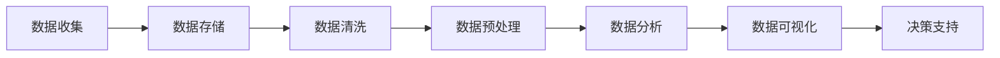

                 

# 如何利用知识付费实现大数据分析与应用？

> **关键词**：知识付费、大数据分析、数据收集、数据清洗、数据挖掘、用户画像、个性化推荐、课程优化

> **摘要**：本文深入探讨了如何利用知识付费平台实现大数据分析与应用。通过分析知识付费的基础概念、大数据分析的基本流程和技术栈，本文详细阐述了大数据分析在知识付费平台中的应用场景，包括用户行为分析、内容推荐系统和付费转化分析。最后，本文提供了实际案例和平台搭建的实践指导，为读者提供了全面的技术解析和实践指南。

## 目录大纲

### 第一部分：引言与基础

#### 第1章：知识付费概述

1.1 知识付费的概念与兴起

1.2 知识付费的模式与平台

1.3 知识付费的价值与挑战

#### 第2章：大数据分析基础

2.1 大数据的概念与特点

2.2 大数据处理的挑战

2.3 大数据分析的基本流程

#### 第3章：大数据分析的技术栈

3.1 数据仓库与数据湖

3.2 数据清洗与预处理

3.3 数据挖掘与机器学习算法

### 第二部分：知识付费与大数据分析结合

#### 第4章：知识付费平台的数据收集与整合

4.1 用户行为数据的收集

4.2 内容数据的整合

4.3 数据整合的挑战与解决方案

#### 第5章：大数据分析在知识付费中的应用

5.1 用户行为分析

5.2 内容推荐系统

5.3 付费转化分析

#### 第6章：大数据分析优化知识付费体验

6.1 用户画像与个性化推荐

6.2 课程内容优化

6.3 用户互动与反馈分析

### 第三部分：案例与实践

#### 第7章：知识付费平台大数据分析案例解析

7.1 案例背景与目标

7.2 数据收集与处理

7.3 数据分析过程

7.4 案例总结与启示

#### 第8章：搭建大数据分析平台

8.1 大数据分析平台的设计与架构

8.2 数据存储与处理工具

8.3 数据分析工具与平台部署

#### 第9章：大数据分析团队建设

9.1 大数据分析团队的组织结构

9.2 大数据分析团队的技能要求

9.3 团队协作与项目管理

### 附录

#### 附录A：常用大数据分析与知识付费工具

A.1 Hadoop生态系统

A.2 Spark

A.3 TensorFlow

A.4 其他相关工具

#### 附录B：参考资料与进一步阅读

B.1 大数据分析相关书籍

B.2 知识付费行业报告

B.3 开源大数据项目与知识付费平台

---

现在，我们将按照目录大纲逐步深入探讨每个章节的内容，通过逻辑清晰的分析和详细的解释，为读者呈现一个全面、深入的知识付费与大数据分析结合的视角。让我们开始吧！## 第1章：知识付费概述

### 1.1 知识付费的概念与兴起

知识付费，顾名思义，指的是用户为获取有价值的知识内容而支付费用的一种商业模式。在互联网快速发展的背景下，知识付费作为一种新型服务形式，逐渐受到了广泛关注。其核心在于通过互联网平台，将传统线下知识服务转化为线上产品，让用户能够随时随地获取所需的知识。

知识付费的兴起可以追溯到2016年，当时中国在线教育市场迎来了爆发式增长。随着移动互联网的普及和用户对知识需求的增加，知识付费平台如雨后春笋般涌现。在这一过程中，用户逐渐接受了为优质内容付费的观念，知识付费市场也逐步走向成熟。

知识付费的典型模式主要包括以下几种：

1. **内容付费**：用户为购买某篇特定文章、电子书、课程视频等知识内容而支付费用。
2. **订阅模式**：用户通过订阅某平台的内容，定期获取更新的知识资源。
3. **专家咨询**：用户为获得专家的一对一咨询服务而支付费用。
4. **课程学习**：用户为在线课程支付费用，包括直播课程、录播课程等。

### 1.2 知识付费的模式与平台

知识付费平台是知识付费模式的重要载体，其主要功能是提供知识产品、用户交互和支付服务。目前，国内外有许多知名的知识付费平台，如中国的得到、喜马拉雅、知乎Live等，以及美国的Coursera、Udemy等。

知识付费平台通常具备以下特征：

1. **内容丰富多样**：平台提供多种类型的知识内容，涵盖教育、科技、文化、艺术等多个领域。
2. **用户互动性强**：平台鼓励用户参与讨论、提问，与专家和同行互动，提高学习体验。
3. **个性化推荐**：平台通过大数据分析技术，为用户提供个性化的知识推荐，提高用户粘性和满意度。
4. **支付便捷**：平台支持多种支付方式，如支付宝、微信支付、信用卡等，方便用户完成支付。

### 1.3 知识付费的价值与挑战

知识付费对于用户、内容提供者和平台来说，都有重要的价值。

1. **用户价值**：
   - **获取高质量内容**：知识付费平台通常汇聚了大量优质内容，用户能够方便地获取所需的知识。
   - **个性化学习**：通过个性化推荐，用户能够更好地匹配自己的学习需求，提高学习效率。
   - **知识变现**：用户通过付费获取知识，有助于实现个人成长和职业发展。

2. **内容提供者价值**：
   - **变现能力**：知识付费为内容提供者提供了变现渠道，激励他们持续产出优质内容。
   - **品牌提升**：通过知识付费平台，内容提供者能够扩大影响力，提升个人品牌。
   - **专业认证**：一些知识付费平台提供专业认证，为内容提供者的专业能力背书。

3. **平台价值**：
   - **商业模式**：知识付费为平台带来了持续的收入来源，有助于平台实现商业化。
   - **用户增长**：知识付费平台通过提供优质内容，吸引用户注册和使用，促进用户增长。
   - **数据积累**：知识付费平台积累了大量用户行为数据，为后续的商业决策提供了数据支持。

然而，知识付费也面临着一些挑战：

1. **内容质量**：知识付费平台需要保证内容的质量，避免劣币驱逐良币的情况。
2. **用户隐私**：平台需要妥善处理用户隐私问题，遵守相关法律法规。
3. **市场竞争**：随着知识付费平台的增多，市场竞争日益激烈，平台需要不断创新，以保持竞争力。

### 1.4 小结

知识付费作为一种新兴的商业模式，通过互联网平台为用户提供了丰富的知识资源。其在用户、内容提供者和平台之间都创造了价值，但同时也面临着一些挑战。了解知识付费的概念、模式和价值，有助于我们更好地把握其发展趋势，探索大数据分析在其中的应用。

## 第2章：大数据分析基础

### 2.1 大数据的概念与特点

大数据（Big Data）是指无法用传统数据处理工具在合理时间内捕捉、管理和处理的数据集。其核心特点可以概括为“4V”：大量（Volume）、多样（Variety）、快速（Velocity）和真实（Veracity）。

1. **大量（Volume）**：大数据的首要特征是其数据的庞大体积。这些数据可能来自互联网、物联网设备、社交媒体等，数据量可以高达PB（拍字节）甚至ZB（泽字节）级别。
   
2. **多样（Variety）**：大数据的来源和类型非常多样，包括结构化数据（如数据库中的表格）、半结构化数据（如日志文件）和非结构化数据（如图像、视频、文本等）。这种多样性要求大数据处理技术能够兼容并处理不同类型的数据。

3. **快速（Velocity）**：大数据的处理速度非常快，因为数据生成和传输的速度非常高。例如，金融交易数据、社交媒体实时数据等需要在毫秒级甚至亚毫秒级进行实时处理和分析。

4. **真实（Veracity）**：大数据的真实性指的是数据的质量和可靠性。由于数据来源多样，可能存在噪声、错误和不一致性，因此需要有效的方法来清洗和验证数据。

### 2.2 大数据处理的挑战

大数据分析在带来巨大价值的同时，也带来了许多挑战：

1. **存储和计算能力**：大数据集的存储和计算需求极高，传统的存储和计算资源难以满足这种需求。需要高效的分布式存储和计算架构，如Hadoop、Spark等。

2. **数据质量**：数据质量是大数据分析成功的关键。噪声、错误和不一致的数据会影响分析结果的准确性。因此，数据清洗和数据质量保证是大数据处理的重要环节。

3. **数据分析方法**：传统的数据分析方法在大数据处理中往往效果不佳，需要开发新的算法和技术来处理大数据，如分布式算法、图算法等。

4. **数据安全与隐私**：大数据处理过程中涉及到大量敏感信息，如个人隐私、商业机密等。需要确保数据的安全和隐私保护，遵循相关法律法规。

5. **数据整合**：大数据通常来自多个不同的源，包括内部数据库、外部API、第三方数据提供商等。如何高效整合这些异构数据是一个重要的挑战。

### 2.3 大数据分析的基本流程

大数据分析的基本流程通常包括以下步骤：

1. **数据收集**：从各种数据源收集原始数据，如传感器数据、用户行为数据、社交媒体数据等。
   
2. **数据存储**：将收集到的数据存储到分布式文件系统或数据库中，如Hadoop HDFS、Amazon S3等。

3. **数据清洗**：处理数据中的噪声、错误和不一致性，确保数据的质量。数据清洗可能包括数据去重、数据格式转换、缺失值填充等。

4. **数据预处理**：将清洗后的数据进行格式化、聚合和转换，使其适合进一步分析。预处理可能包括数据规范化、特征工程等。

5. **数据分析**：使用统计分析、机器学习算法等对预处理后的数据进行分析，以提取有用的信息和知识。

6. **数据可视化**：将分析结果通过图表、报表等形式可视化，帮助用户理解数据背后的趋势和模式。

7. **决策支持**：基于数据分析结果，为决策者提供数据驱动的决策支持，如推荐系统、风险预测等。

### 2.4 小结

大数据分析作为一种新兴的技术，具有巨大潜力和广泛应用。了解大数据的概念、特点以及处理的挑战，有助于我们更好地应用大数据分析技术，解决实际问题。本章为后续章节的大数据分析应用奠定了基础。

### 2.5 Mermaid 流程图

下面是一个Mermaid流程图，展示了大数据分析的基本流程：



通过这个流程图，我们可以清晰地看到大数据分析的全过程，以及每个步骤之间的关系和重要性。

### 2.6 伪代码

为了更好地理解数据清洗和数据分析的过程，我们使用伪代码来描述这两个步骤：

**数据清洗伪代码：**
```
function dataCleaning(data):
    for each record in data:
        if record is missing:
            replace missing value with average of similar records
        if record format is incorrect:
            convert format to standard
    return cleaned data
```

**数据分析伪代码：**
```
function dataAnalysis(cleanedData):
    calculate statistical metrics (mean, median, standard deviation)
    apply machine learning algorithms (e.g., regression, classification)
    generate insights from results
    return analysis report
```

通过这些伪代码，我们可以更直观地理解数据清洗和数据分析的步骤和逻辑。

### 2.7 数学模型和公式

在大数据分析中，常用的数学模型和公式包括线性回归、决策树和神经网络等。以下是这些模型的简单描述：

**线性回归：**
$$y = \beta_0 + \beta_1x + \epsilon$$
其中，$y$ 是目标变量，$x$ 是特征变量，$\beta_0$ 和 $\beta_1$ 是模型参数，$\epsilon$ 是误差项。

**决策树：**
$$f(x) = \begin{cases} 
\text{left child} & \text{if } x \leq x_{\text{split}} \\
\text{right child} & \text{if } x > x_{\text{split}} 
\end{cases}$$
其中，$x_{\text{split}}$ 是分割点。

**神经网络：**
$$a_{\text{layer}} = \sigma(\mathbf{W}_{\text{layer-1}} a_{\text{layer-1}} + b_{\text{layer}})$$
其中，$a_{\text{layer}}$ 是第 $l$ 层的激活值，$\sigma$ 是激活函数，$\mathbf{W}_{\text{layer-1}}$ 和 $b_{\text{layer}}$ 是权重和偏置。

通过这些数学模型和公式，我们可以构建和训练复杂的分析模型，提取数据中的有用信息。

### 2.8 举例说明

为了更好地理解上述内容，我们可以通过一个实际案例来展示大数据分析的应用。

**案例：用户购买行为分析**

假设我们有一个电商平台的用户购买数据，包含用户ID、商品ID、购买时间和购买金额等字段。我们的目标是分析用户购买行为，为电商平台提供个性化的推荐。

1. **数据收集**：从电商平台的数据库中收集用户购买数据。

2. **数据清洗**：处理缺失值、异常值和数据格式不一致的问题。

3. **数据预处理**：将数据格式化为适合分析的形式，如将时间字段转换为日期类型。

4. **数据分析**：
   - 使用聚类算法（如K-means）将用户分为不同的购买群体。
   - 使用关联规则挖掘算法（如Apriori算法）发现用户购买行为中的关联关系。

5. **数据可视化**：生成用户购买行为的热力图、折线图和柱状图等，帮助业务人员理解分析结果。

6. **决策支持**：基于分析结果，为用户提供个性化的商品推荐，提高转化率。

通过这个案例，我们可以看到大数据分析在电商领域中的应用，以及如何通过数据分析来优化业务流程和提升用户体验。

### 2.9 小结

本章介绍了大数据分析的基础概念、特点、处理挑战和基本流程。通过伪代码、数学模型和实际案例，我们深入探讨了大数据分析的核心技术和应用。理解这些基础内容，有助于我们更好地把握大数据分析的发展趋势和实际应用。

## 第3章：大数据分析的技术栈

### 3.1 数据仓库与数据湖

在大数据分析中，数据仓库（Data Warehouse）和数据湖（Data Lake）是两种常见的数据存储解决方案。它们在数据管理、处理和分析方面各有特点。

**数据仓库**：
- **定义**：数据仓库是一个集成的数据存储系统，用于支持企业级的数据分析和报告。它通常包含结构化数据，如关系数据库中的表格。
- **特点**：
  - **数据一致性**：数据仓库中的数据经过清洗、整合和转换，确保数据的一致性和准确性。
  - **优化查询性能**：数据仓库使用索引和分区等技术，优化查询性能，支持快速的数据检索。
  - **支持复杂查询**：数据仓库支持SQL等查询语言，允许用户执行复杂的分析和报告。

**数据湖**：
- **定义**：数据湖是一个大规模的数据存储解决方案，用于存储原始数据，包括结构化、半结构化和非结构化数据。
- **特点**：
  - **数据多样性**：数据湖能够存储多种类型的数据，如文本、图像、音频和视频等。
  - **原始数据存储**：数据湖保留了原始数据的完整性和原始格式，便于后续处理和分析。
  - **灵活性**：数据湖提供了灵活的数据访问和操作接口，如REST API，方便数据科学家和开发人员使用。

**数据仓库与数据湖的比较**：
- **用途**：数据仓库主要用于支持数据分析和报告，而数据湖主要用于数据存储和归档。
- **数据形式**：数据仓库处理结构化数据，数据湖处理各种类型的数据。
- **处理复杂度**：数据仓库需要进行数据清洗和整合，数据湖则直接存储原始数据，简化了数据处理过程。

### 3.2 数据清洗与预处理

数据清洗与预处理是大数据分析的重要环节，旨在提高数据的质量和可分析性。以下是一些关键步骤：

1. **数据质量检查**：
   - **缺失值处理**：检查数据中是否存在缺失值，并根据具体情况进行处理，如删除缺失值、使用平均值或中位数填充缺失值等。
   - **异常值检测**：检测数据中的异常值，如离群点或错误数据，并采取相应的处理措施。

2. **数据转换**：
   - **格式转换**：将不同数据源的数据格式统一为标准格式，如将日期格式转换为YYYY-MM-DD。
   - **编码转换**：处理不同编码的数据，如将ASCII编码转换为UTF-8编码。

3. **数据集成**：
   - **数据去重**：合并多个数据源，去除重复的数据记录。
   - **数据整合**：将不同数据源的数据进行整合，生成统一的数据视图。

4. **特征工程**：
   - **特征提取**：从原始数据中提取有用的特征，如通过文本挖掘提取关键词、通过图像识别提取特征向量等。
   - **特征选择**：选择对分析结果影响较大的特征，去除无关或冗余的特征，提高模型的性能。

### 3.3 数据挖掘与机器学习算法

数据挖掘与机器学习算法是大数据分析的核心技术，用于从大量数据中提取有价值的信息和知识。以下是一些常用的算法：

1. **分类算法**：
   - **决策树**：通过递归分割数据集，构建决策树模型，用于预测分类结果。
   - **随机森林**：结合多个决策树，通过集成学习提高预测准确性。
   - **支持向量机（SVM）**：通过寻找最优分割超平面，实现数据的分类。

2. **聚类算法**：
   - **K-means**：通过迭代算法将数据划分为K个簇，每个簇内部距离相近，簇间距离较远。
   - **层次聚类**：自底向上或自顶向下构建层次结构，合并或分裂簇，实现数据的聚类。

3. **关联规则挖掘**：
   - **Apriori算法**：通过频繁项集和关联规则挖掘，发现数据之间的关联关系。
   - **Eclat算法**：通过递归查找频繁项集，实现高效的关联规则挖掘。

4. **异常检测**：
   - **孤立森林**：通过将数据随机投射到多个维度上，检测异常数据点。
   - **基于距离的异常检测**：通过计算数据点与整体数据的距离，识别异常值。

### 3.4 伪代码

为了更好地理解上述算法，我们使用伪代码来描述K-means聚类算法的基本步骤：

**K-means算法伪代码：**
```
function kMeans(data, k):
    初始化k个簇心点（centroids）
    while (不满足停止条件):
        for each 数据点 in data:
            计算数据点到各个簇心点的距离
            分配数据点到最近的簇
        更新簇心点，计算新的簇心点平均值
    return 簇分配结果
```

通过这个伪代码，我们可以清晰地看到K-means算法的核心步骤和逻辑。

### 3.5 数学模型和公式

在大数据分析和机器学习算法中，常用的数学模型和公式包括线性回归、逻辑回归和支持向量机等。以下是这些模型的简要描述：

**线性回归：**
$$y = \beta_0 + \beta_1x + \epsilon$$
其中，$y$ 是目标变量，$x$ 是特征变量，$\beta_0$ 和 $\beta_1$ 是模型参数，$\epsilon$ 是误差项。

**逻辑回归：**
$$P(y=1) = \frac{1}{1 + e^{-(\beta_0 + \beta_1x)}}$$
其中，$P(y=1)$ 是目标变量为1的概率，$\beta_0$ 和 $\beta_1$ 是模型参数。

**支持向量机（SVM）：**
$$w^T x + b = 0$$
其中，$w$ 是权重向量，$x$ 是特征向量，$b$ 是偏置项。

通过这些数学模型和公式，我们可以构建和训练复杂的分析模型，提取数据中的有用信息。

### 3.6 举例说明

为了更好地理解数据仓库与数据湖、数据清洗与预处理、数据挖掘与机器学习算法等概念，我们通过一个实际案例来展示这些技术的应用。

**案例：电商平台用户行为分析**

假设我们有一个电商平台的用户行为数据，包含用户ID、商品ID、浏览时间、购买时间和购买金额等信息。我们的目标是分析用户行为，为平台提供个性化的推荐。

1. **数据收集**：从电商平台的日志文件中收集用户行为数据。

2. **数据仓库与数据湖**：
   - **数据仓库**：将清洗后的数据存储到关系数据库中，用于支持数据分析报告。
   - **数据湖**：将原始数据存储到分布式文件系统中，用于长期存储和归档。

3. **数据清洗与预处理**：
   - **数据质量检查**：处理缺失值、异常值和数据格式不一致的问题。
   - **数据转换**：将日期字段转换为标准格式，将编码统一为UTF-8编码。
   - **特征工程**：提取用户购买时间、购买频率等特征，用于分析用户行为。

4. **数据挖掘与机器学习**：
   - **用户聚类**：使用K-means算法将用户分为不同的购买群体。
   - **关联规则挖掘**：使用Apriori算法发现用户购买行为中的关联关系。
   - **用户推荐**：基于聚类和关联规则，为用户提供个性化的商品推荐。

5. **数据可视化**：生成用户行为分析报告，包括用户购买趋势、关联关系和推荐列表等，帮助业务人员理解分析结果。

通过这个案例，我们可以看到大数据分析技术在实际应用中的重要性，以及如何通过数据仓库与数据湖、数据清洗与预处理、数据挖掘与机器学习算法等技术，实现数据的价值挖掘。

### 3.7 小结

本章介绍了大数据分析的技术栈，包括数据仓库与数据湖、数据清洗与预处理、数据挖掘与机器学习算法等。通过伪代码、数学模型和实际案例，我们深入探讨了这些技术的原理和应用。理解这些内容，有助于我们更好地把握大数据分析的核心技术和应用方向。

## 第4章：知识付费平台的数据收集与整合

### 4.1 用户行为数据的收集

在知识付费平台上，用户行为数据是进行分析的重要基础。用户行为数据包括用户在平台上的各种活动，如浏览内容、点赞、评论、购买课程等。这些数据可以通过以下方式进行收集：

1. **Web前端日志**：通过在网站或APP中嵌入JavaScript代码，记录用户在平台上的各种操作，如点击、滑动、停留时间等。这些数据可以通过API或日志文件的方式收集。

2. **数据库记录**：知识付费平台通常包含多个数据库，如用户数据库、课程数据库、交易数据库等。通过定期导出这些数据库的数据，可以收集用户行为数据。

3. **第三方数据分析工具**：使用第三方数据分析工具，如Google Analytics、Mixpanel等，可以收集用户在平台上的行为数据。

4. **用户反馈与调查**：通过用户反馈和调查问卷，可以直接获取用户的感受和需求，补充行为数据。

### 4.2 内容数据的整合

内容数据是知识付费平台的另一重要组成部分，包括课程内容、电子书、文章等。内容数据的整合主要包括以下几个方面：

1. **数据清洗**：在整合内容数据前，需要对数据进行清洗，去除重复、错误和无效的数据，确保数据的质量。

2. **格式转换**：不同内容的数据格式可能不同，如文本、图片、音频等。在整合过程中，需要将不同格式的数据进行转换，使其具有统一的结构和格式。

3. **元数据提取**：提取内容数据的元数据，如标题、作者、分类、标签等，这些信息有助于后续的内容推荐和分析。

4. **内容分类与标签**：对内容进行分类和标签，便于后续的检索和分析。分类和标签可以根据内容的主题、领域、难度等因素进行设置。

### 4.3 数据整合的挑战与解决方案

在数据整合过程中，可能会遇到以下挑战：

1. **数据源多样性**：知识付费平台的数据源可能来自多个系统，如网站、APP、第三方平台等，导致数据格式和结构不统一。

2. **数据质量**：数据源的数据质量参差不齐，可能存在缺失值、异常值和错误数据，影响数据整合和分析的准确性。

3. **数据存储与处理**：大量数据需要存储和处理，对存储和计算资源的要求较高。

针对上述挑战，可以采取以下解决方案：

1. **统一数据格式**：通过数据清洗和转换，将不同数据源的数据格式统一为标准格式，如JSON或CSV格式，便于整合和分析。

2. **数据质量保障**：建立数据质量监控机制，定期检查数据质量，处理缺失值、异常值和错误数据，确保数据的一致性和准确性。

3. **分布式存储与计算**：使用分布式存储和计算架构，如Hadoop、Spark等，提高数据存储和处理的能力，应对大量数据的挑战。

4. **数据治理**：建立数据治理体系，制定数据标准、数据安全策略和数据质量管理流程，确保数据的质量和安全性。

### 4.4 伪代码

为了更好地理解数据整合的过程，我们使用伪代码来描述数据整合的主要步骤：

**数据整合伪代码：**
```
function dataIntegration(sourceData, targetData):
    for each sourceData in sourceData:
        if sourceData is valid:
            clean and transform sourceData
            add sourceData to targetData
        else:
            log and handle invalid data
    return integrated data
```

通过这个伪代码，我们可以看到数据整合的基本逻辑和流程。

### 4.5 数学模型和公式

在数据整合过程中，可能会涉及到一些数学模型和公式，用于处理数据质量问题和整合结果评估。以下是几个常用的数学模型和公式：

1. **数据完整性评估**：
   $$完整性率 = \frac{有效数据记录数}{总数据记录数} \times 100\%$$
   通过计算完整性率，可以评估数据整合的质量。

2. **数据一致性评估**：
   $$一致性率 = \frac{一致数据记录对数}{总数据记录对数} \times 100\%$$
   通过计算一致性率，可以评估不同数据源之间的数据一致性。

3. **缺失值填补方法**：
   - **平均值填补**：用列的平均值填补缺失值。
   - **中位数填补**：用列的中位数填补缺失值。
   - **多重插补**：使用统计方法，如回归分析，生成多个填补方案，选取最优方案。

### 4.6 举例说明

为了更好地理解用户行为数据的收集和内容数据的整合，我们通过一个实际案例来展示这些技术的应用。

**案例：知识付费平台的用户行为数据整合**

假设我们有一个知识付费平台，用户可以浏览课程、购买课程并发表评论。我们的目标是整合用户的行为数据，为平台提供个性化的推荐。

1. **数据收集**：
   - **Web前端日志**：记录用户的浏览、购买和评论行为。
   - **数据库记录**：从用户数据库、课程数据库和交易数据库中收集数据。

2. **数据整合**：
   - **数据清洗**：去除重复、错误和无效的数据。
   - **格式转换**：将不同格式（如JSON、CSV）的数据转换为统一的格式。
   - **元数据提取**：提取用户的浏览记录、购买记录和评论内容等元数据。

3. **用户行为数据整合**：
   - **用户浏览记录**：整合用户的浏览记录，生成用户的浏览兴趣。
   - **用户购买记录**：整合用户的购买记录，生成用户的购买偏好。
   - **用户评论记录**：整合用户的评论记录，生成用户的评价偏好。

4. **内容数据整合**：
   - **课程元数据**：整合课程的基本信息，如课程名称、分类、标签等。
   - **课程内容**：整合课程的视频、文本、图片等多媒体内容。

5. **数据分析和推荐**：
   - **用户兴趣分析**：基于用户的浏览记录，分析用户的兴趣点。
   - **用户偏好分析**：基于用户的购买记录，分析用户的偏好。
   - **个性化推荐**：结合用户兴趣和偏好，为用户推荐相关的课程。

通过这个案例，我们可以看到数据整合在知识付费平台中的应用，以及如何通过数据分析实现个性化推荐。

### 4.7 小结

本章介绍了知识付费平台的数据收集和整合方法，包括用户行为数据的收集、内容数据的整合以及数据整合过程中可能遇到的挑战和解决方案。通过伪代码、数学模型和实际案例，我们深入探讨了这些技术的原理和应用。理解这些内容，有助于我们更好地构建和优化知识付费平台的数据分析体系。

## 第5章：大数据分析在知识付费中的应用

### 5.1 用户行为分析

用户行为分析是知识付费平台大数据分析的重要应用之一，通过对用户在平台上的行为进行深入分析，可以了解用户的需求、兴趣和偏好，从而优化产品和服务，提高用户满意度和留存率。

#### 用户行为分析的关键指标

1. **活跃用户数**：指在一定时间段内活跃登录并参与平台互动的用户数量。
2. **用户留存率**：指在一定时间段内，连续使用平台的天数超过一定阈值的用户占比。
3. **用户停留时长**：指用户在平台上的平均停留时间，反映了用户对平台内容的兴趣程度。
4. **浏览量与点击率**：反映用户对各类内容的关注程度，可用于评估内容质量和推荐效果。
5. **购买转化率**：指从浏览到最终购买的成功转化比例，是衡量平台销售能力的重要指标。
6. **用户互动率**：指用户在平台上进行评论、提问等互动行为的比例，反映了用户的参与度。

#### 用户行为分析的方法

1. **用户路径分析**：通过分析用户在平台上的访问路径，了解用户的使用习惯和偏好。
2. **行为预测模型**：使用机器学习算法，预测用户的下一步行为，如浏览、购买或退出。
3. **用户细分与画像**：将用户根据行为特征进行细分，构建用户画像，用于个性化推荐和服务优化。
4. **A/B测试**：通过对比不同版本的用户界面、内容推荐策略等，评估不同策略对用户行为的影响。

### 5.2 内容推荐系统

内容推荐系统是知识付费平台的另一核心应用，通过向用户推荐符合其兴趣和需求的内容，提高用户满意度和平台粘性。

#### 内容推荐系统的基本原理

1. **协同过滤**：基于用户的历史行为和兴趣，寻找相似用户或内容，进行推荐。
   - **用户基于的协同过滤**：通过分析用户之间的相似度，推荐其他用户喜欢的相似内容。
   - **物品基于的协同过滤**：通过分析内容之间的相似度，推荐与用户已观看或购买的内容相似的其他内容。

2. **基于内容的推荐**：通过分析内容的特征，将相似的内容推荐给用户。
   - **文本分析**：使用自然语言处理技术，提取文本中的关键词、主题和情感，构建内容特征。
   - **图像和视频分析**：使用计算机视觉技术，提取图像和视频的特征，用于内容推荐。

3. **混合推荐**：结合协同过滤和基于内容的推荐，提高推荐系统的效果和多样性。

#### 内容推荐系统的实现

1. **数据收集**：收集用户的行为数据，如浏览记录、点赞、评论等。
2. **特征提取**：提取用户和内容的特征，如用户行为特征、内容标签、关键词等。
3. **模型训练**：使用机器学习算法，如协同过滤、基于内容的推荐等，训练推荐模型。
4. **推荐生成**：根据用户特征和模型预测，生成个性化的推荐列表。
5. **效果评估**：评估推荐系统的效果，通过用户留存率、点击率等指标，优化推荐算法。

### 5.3 付费转化分析

付费转化分析是知识付费平台的重要环节，通过对用户从浏览到最终购买的过程进行深入分析，优化付费转化路径，提高销售额。

#### 付费转化分析的关键指标

1. **转化率**：指从浏览到购买的成功转化比例。
2. **转化路径**：指用户从浏览到购买所经过的各个页面或操作步骤。
3. **停留时间**：指用户在购买过程中的每个页面停留时间，反映了用户对内容的兴趣程度。
4. **跳出率**：指用户在购买过程中离开页面的比例，反映了页面设计的合理性和用户体验。
5. **流失率**：指用户在购买过程中流失的比例，反映了购买流程的复杂度和用户的购买意愿。

#### 付费转化分析的方法

1. **行为路径分析**：通过分析用户在购买过程中的行为路径，找到影响转化的关键环节和瓶颈。
2. **A/B测试**：通过对比不同版本的用户界面、购买流程等，评估不同策略对转化率的影响。
3. **用户细分与画像**：将用户根据行为特征进行细分，分析不同用户群体的付费转化情况，为个性化推荐和服务优化提供依据。
4. **预测模型**：使用机器学习算法，预测用户在购买过程中的流失风险，提前采取措施降低流失率。

### 5.4 伪代码

为了更好地理解用户行为分析、内容推荐系统和付费转化分析，我们使用伪代码来描述这些分析过程：

**用户行为分析伪代码：**
```
function userBehaviorAnalysis(userBehaviorData):
    计算活跃用户数、用户留存率、用户停留时长等指标
    构建用户路径分析模型，分析用户访问路径
    运用机器学习算法，预测用户下一步行为
    return analysis results
```

**内容推荐系统伪代码：**
```
function contentRecommendation(userFeature, contentFeature):
    计算用户与内容的相似度
    根据相似度推荐相似的内容
    结合协同过滤和基于内容的推荐，生成推荐列表
    return recommendation list
```

**付费转化分析伪代码：**
```
function purchaseConversionAnalysis(purchaseData):
    计算转化率、转化路径、停留时间等指标
    分析用户在购买过程中的行为路径
    运用A/B测试和机器学习算法，优化购买流程
    return optimization suggestions
```

通过这些伪代码，我们可以清晰地看到大数据分析在用户行为分析、内容推荐系统和付费转化分析中的应用。

### 5.5 数学模型和公式

在用户行为分析、内容推荐系统和付费转化分析中，常用的数学模型和公式包括协同过滤、基于内容的推荐和预测模型等。以下是这些模型的简要描述：

1. **协同过滤（User-Based Collaborative Filtering）**：
   $$相似度（sim(i, j)） = \frac{\sum_{k \in R(i) \cap R(j)} w_{ik}w_{jk}}{\sqrt{\sum_{k \in R(i)} w_{ik}^2 \sqrt{\sum_{k \in R(j)} w_{jk}^2}}$$
   其中，$R(i)$ 和 $R(j)$ 分别表示用户$i$和$j$的评分集合，$w_{ik}$ 和 $w_{jk}$ 分别表示用户$i$对物品$k$的评分和用户$j$对物品$k$的评分。

2. **基于内容的推荐（Content-Based Recommendation）**：
   $$相似度（sim(c_i, c_j)） = \cos(\theta(c_i, c_j))$$
   其中，$\theta(c_i, c_j)$ 是内容$c_i$和$c_j$之间的夹角，$\cos(\theta)$ 表示余弦相似度。

3. **预测模型（Predictive Model）**：
   $$预测值（\hat{y}_{ui}） = \beta_0 + \beta_1 \cdot x_{ui} + \epsilon$$
   其中，$\hat{y}_{ui}$ 是用户$u$对物品$i$的预测评分，$x_{ui}$ 是用户$u$对物品$i$的已知评分，$\beta_0$ 和 $\beta_1$ 是模型参数，$\epsilon$ 是误差项。

通过这些数学模型和公式，我们可以构建和训练复杂的分析模型，实现用户行为分析、内容推荐和付费转化预测。

### 5.6 举例说明

为了更好地理解大数据分析在知识付费平台中的应用，我们通过一个实际案例来展示这些技术的应用。

**案例：知识付费平台的个性化推荐系统**

假设我们有一个知识付费平台，用户可以浏览课程、购买课程并发表评论。我们的目标是构建一个个性化推荐系统，向用户推荐符合其兴趣和需求的内容。

1. **数据收集**：
   - **用户行为数据**：收集用户的浏览记录、点赞、评论等行为数据。
   - **课程数据**：收集课程的基本信息、标签、关键词等。

2. **特征提取**：
   - **用户特征**：提取用户的浏览记录、购买记录、评论内容等，构建用户特征向量。
   - **课程特征**：提取课程的基本信息、标签、关键词等，构建课程特征向量。

3. **模型训练**：
   - **协同过滤模型**：使用用户行为数据，训练协同过滤模型，预测用户对课程的偏好。
   - **基于内容的推荐模型**：使用课程特征，训练基于内容的推荐模型，预测用户对课程的兴趣。

4. **推荐生成**：
   - **混合推荐**：结合协同过滤和基于内容的推荐，生成个性化的推荐列表。

5. **效果评估**：
   - **点击率**：评估推荐列表中课程的点击率，优化推荐算法。
   - **用户满意度**：收集用户对推荐的满意度反馈，持续优化推荐系统。

通过这个案例，我们可以看到大数据分析在知识付费平台中的应用，以及如何通过用户行为分析、内容推荐系统和付费转化分析，实现个性化推荐和优化。

### 5.7 小结

本章介绍了大数据分析在知识付费平台中的应用，包括用户行为分析、内容推荐系统和付费转化分析。通过伪代码、数学模型和实际案例，我们深入探讨了这些技术的原理和应用。理解这些内容，有助于我们更好地构建和优化知识付费平台的大数据分析体系。

## 第6章：大数据分析优化知识付费体验

### 6.1 用户画像与个性化推荐

用户画像与个性化推荐是大数据分析在知识付费领域的重要应用，通过分析用户的行为数据、兴趣偏好，构建用户画像，从而为用户提供个性化的推荐，提升用户体验。

#### 用户画像的概念

用户画像（User Profiling）是指通过对用户在平台上的行为数据进行挖掘和分析，构建一个全面、立体的用户信息模型。用户画像包括用户的静态信息和动态行为，如性别、年龄、职业、地理位置、兴趣爱好、购买历史、浏览记录等。

#### 个性化推荐系统

个性化推荐系统（Personalized Recommendation System）是基于用户画像，为用户提供符合其兴趣和需求的内容推荐。个性化推荐系统通常包括以下几个核心组成部分：

1. **用户特征提取**：从用户行为数据中提取用户特征，如浏览记录、购买历史、评论内容等。
2. **内容特征提取**：从内容数据中提取内容特征，如标题、标签、关键词、内容类型等。
3. **相似度计算**：计算用户与用户、用户与内容之间的相似度，以确定推荐列表。
4. **推荐生成**：根据相似度计算结果，生成个性化的推荐列表。

#### 个性化推荐算法

1. **协同过滤算法**：基于用户的历史行为，找到相似用户或相似内容，进行推荐。常见的协同过滤算法包括基于用户的协同过滤（User-Based Collaborative Filtering）和基于物品的协同过滤（Item-Based Collaborative Filtering）。
2. **基于内容的推荐算法**：基于内容的特征，将相似内容推荐给用户。常见的基于内容的推荐算法包括TF-IDF模型、基于单词的相似度计算、基于词向量的相似度计算等。
3. **混合推荐算法**：结合协同过滤和基于内容的推荐，提高推荐系统的效果和多样性。

#### 个性化推荐系统的实现

1. **数据收集**：收集用户的行为数据，如浏览记录、购买历史、评论内容等。
2. **特征提取**：提取用户和内容的特征，如用户行为特征、内容标签、关键词等。
3. **模型训练**：使用机器学习算法，如协同过滤、基于内容的推荐等，训练推荐模型。
4. **推荐生成**：根据用户特征和模型预测，生成个性化的推荐列表。
5. **效果评估**：评估推荐系统的效果，通过用户留存率、点击率等指标，优化推荐算法。

### 6.2 课程内容优化

课程内容优化是知识付费平台提升用户体验的关键环节，通过大数据分析技术，可以识别课程内容的不足，为课程设计提供数据支持，从而优化课程内容，提高用户满意度。

#### 课程内容优化的方法

1. **用户反馈分析**：通过用户评论、提问等反馈，了解用户对课程内容的意见和建议。
2. **用户行为分析**：分析用户在课程中的浏览、停留、退出等行为，识别用户对课程内容的兴趣点和不满意点。
3. **学习效果评估**：通过考试、测试等手段，评估用户对课程内容的掌握程度，了解课程的有效性。
4. **内容分析**：使用自然语言处理和文本挖掘技术，分析课程文本、视频、音频等内容的结构和质量，识别内容优化点。

#### 课程内容优化的步骤

1. **需求收集**：通过用户调研、问卷调查等方式，收集用户对课程内容的建议和需求。
2. **数据分析**：对收集到的用户行为数据和反馈进行分析，识别用户关注的热点和问题点。
3. **内容调整**：根据分析结果，对课程内容进行调整和优化，如增加新章节、修改课程结构、改进教学方式等。
4. **测试与反馈**：对调整后的课程进行测试，收集用户的反馈，持续优化课程内容。

### 6.3 用户互动与反馈分析

用户互动与反馈分析是知识付费平台优化用户体验的重要手段，通过分析用户在平台上的互动和反馈，可以了解用户的需求和满意度，从而优化产品和服务。

#### 用户互动分析的关键指标

1. **互动率**：指用户在平台上进行互动（如评论、提问、参与讨论）的比例。
2. **互动时长**：指用户在平台上的平均互动时间，反映了用户的参与度。
3. **互动质量**：指用户互动的内容质量和价值，如高质量的问题、有建设性的评论等。
4. **互动满意度**：指用户对互动体验的满意度，可以通过用户反馈问卷进行评估。

#### 用户反馈分析的方法

1. **文本分析**：使用自然语言处理技术，分析用户在评论、提问等互动中的文本内容，提取用户的需求、意见和建议。
2. **情感分析**：通过情感分析，评估用户对产品、服务、课程等内容的正面或负面情绪。
3. **行为分析**：分析用户在平台上的行为路径，了解用户在使用过程中的痛点和问题。
4. **反馈分类**：将用户反馈分类为不同类型，如功能建议、内容优化、用户体验等，针对不同类型的反馈采取相应的优化措施。

#### 用户互动与反馈分析的应用

1. **产品优化**：通过用户互动和反馈分析，识别产品中的问题，为产品优化提供数据支持。
2. **服务改进**：通过用户反馈分析，了解用户对服务的需求和满意度，优化客户服务流程。
3. **课程设计**：通过用户互动和反馈分析，为课程设计提供参考，优化课程内容和结构。
4. **用户增长**：通过互动和反馈分析，了解用户的兴趣点和需求，制定有效的用户增长策略。

### 6.4 伪代码

为了更好地理解用户画像与个性化推荐、课程内容优化和用户互动与反馈分析，我们使用伪代码来描述这些分析过程：

**用户画像与个性化推荐伪代码：**
```
function personalizedRecommendation(userId, contentFeatures):
    getUserFeatures(userId)
    getTopNRecommendedContent(contentFeatures)
    return recommendationList
```

**课程内容优化伪代码：**
```
function contentOptimization(courseId, userFeedback):
    analyzeUserFeedback(userFeedback)
    identifyOptimizationAreas()
    optimizeCourseContent(courseId)
    return optimizedCourseContent
```

**用户互动与反馈分析伪代码：**
```
function userInteractionAnalysis(userFeedback):
    classifyFeedback(feedback)
    analyzeFeedbackSentiment(feedback)
    identifyUserConcerns(feedback)
    return analysisReport
```

通过这些伪代码，我们可以清晰地看到大数据分析在用户画像与个性化推荐、课程内容优化和用户互动与反馈分析中的应用。

### 6.5 数学模型和公式

在用户画像与个性化推荐、课程内容优化和用户互动与反馈分析中，常用的数学模型和公式包括协同过滤、基于内容的推荐和情感分析等。以下是这些模型的简要描述：

1. **协同过滤（User-Based Collaborative Filtering）**：
   $$相似度（sim(i, j)） = \frac{\sum_{k \in R(i) \cap R(j)} w_{ik}w_{jk}}{\sqrt{\sum_{k \in R(i)} w_{ik}^2 \sqrt{\sum_{k \in R(j)} w_{jk}^2}}$$
   其中，$R(i)$ 和 $R(j)$ 分别表示用户$i$和$j$的评分集合，$w_{ik}$ 和 $w_{jk}$ 分别表示用户$i$对物品$k$的评分和用户$j$对物品$k$的评分。

2. **基于内容的推荐（Content-Based Recommendation）**：
   $$相似度（sim(c_i, c_j)） = \cos(\theta(c_i, c_j))$$
   其中，$\theta(c_i, c_j)$ 是内容$c_i$和$c_j$之间的夹角，$\cos(\theta)$ 表示余弦相似度。

3. **情感分析（Sentiment Analysis）**：
   $$情感得分（score） = f(\text{文本内容，情感词典，情感规则})$$
   其中，$f$ 是情感分析函数，用于计算文本内容的情感得分。

通过这些数学模型和公式，我们可以构建和训练复杂的分析模型，实现用户画像与个性化推荐、课程内容优化和用户互动与反馈分析。

### 6.6 举例说明

为了更好地理解用户画像与个性化推荐、课程内容优化和用户互动与反馈分析，我们通过一个实际案例来展示这些技术的应用。

**案例：知识付费平台的用户画像与个性化推荐**

假设我们有一个知识付费平台，用户可以浏览课程、购买课程并发表评论。我们的目标是构建一个用户画像与个性化推荐系统，为用户提供个性化的课程推荐。

1. **数据收集**：
   - **用户行为数据**：收集用户的浏览记录、购买历史、评论内容等。
   - **课程数据**：收集课程的基本信息、标签、关键词等。

2. **用户画像构建**：
   - **用户特征提取**：提取用户的浏览记录、购买历史、评论内容等，构建用户特征向量。
   - **用户分类**：根据用户特征，将用户分为不同类别，如编程爱好者、金融从业者等。

3. **个性化推荐**：
   - **协同过滤**：使用用户行为数据，训练协同过滤模型，预测用户对课程的偏好。
   - **基于内容**：使用课程特征，训练基于内容的推荐模型，预测用户对课程的兴趣。

4. **推荐生成**：
   - **混合推荐**：结合协同过滤和基于内容的推荐，生成个性化的推荐列表。

5. **效果评估**：
   - **点击率**：评估推荐列表中课程的点击率，优化推荐算法。
   - **用户满意度**：收集用户对推荐的满意度反馈，持续优化推荐系统。

通过这个案例，我们可以看到大数据分析在知识付费平台中的应用，以及如何通过用户画像与个性化推荐，提升用户体验。

### 6.7 小结

本章介绍了大数据分析在知识付费平台中的应用，包括用户画像与个性化推荐、课程内容优化和用户互动与反馈分析。通过伪代码、数学模型和实际案例，我们深入探讨了这些技术的原理和应用。理解这些内容，有助于我们更好地构建和优化知识付费平台，提升用户体验和满意度。

## 第7章：知识付费平台大数据分析案例解析

### 7.1 案例背景与目标

本案例选取了一家知名的知识付费平台——得到APP，旨在通过大数据分析技术，提升平台的内容推荐效果和用户留存率。得到APP提供各类优质课程，包括人文、科技、商业等领域，拥有大量活跃用户。然而，在激烈的市场竞争中，如何通过大数据分析优化用户体验，提升平台的竞争力，成为该平台亟待解决的问题。

#### 案例目标

1. **优化内容推荐**：通过分析用户行为数据和内容特征，构建个性化推荐系统，提升用户点击率和购买转化率。
2. **提升用户留存率**：通过用户行为分析，识别用户流失原因，采取针对性的措施，提高用户留存率。
3. **分析用户需求**：通过用户互动和反馈分析，了解用户对课程内容的真实需求，为课程设计和优化提供数据支持。

### 7.2 数据收集与处理

#### 数据来源

得到APP的数据来源主要包括以下几个方面：

1. **用户行为数据**：包括用户在平台上的浏览记录、购买行为、评论、点赞等。
2. **课程数据**：包括课程的基本信息、分类、标签、课程内容等。
3. **用户互动数据**：包括用户在课程讨论区、问答区等互动行为的数据。

#### 数据处理

1. **数据清洗**：处理缺失值、异常值和错误数据，确保数据质量。
2. **数据转换**：将不同格式的数据转换为统一的格式，如JSON或CSV。
3. **特征提取**：提取用户和内容的特征，如用户行为特征（浏览记录、购买历史等）、内容特征（分类、标签、关键词等）。

### 7.3 数据分析过程

#### 用户行为分析

1. **用户路径分析**：通过分析用户在平台上的访问路径，了解用户的浏览习惯和兴趣点。
2. **用户细分与画像**：根据用户的行为特征，将用户分为不同群体，构建用户画像。
3. **行为预测模型**：使用机器学习算法，如K-means聚类、决策树等，预测用户的下一步行为。

#### 内容推荐

1. **协同过滤**：基于用户的历史行为，找到相似用户或相似内容，进行推荐。
2. **基于内容**：根据内容特征，将相似内容推荐给用户。
3. **混合推荐**：结合协同过滤和基于内容的推荐，生成个性化的推荐列表。

#### 用户留存分析

1. **用户流失预测**：使用机器学习算法，如逻辑回归、随机森林等，预测用户流失风险。
2. **用户留存率分析**：计算不同用户群体的留存率，识别用户流失原因。
3. **优化措施**：针对用户流失原因，采取针对性的优化措施，如改进课程内容、提高客户服务等。

#### 用户互动与反馈分析

1. **情感分析**：使用自然语言处理技术，分析用户在评论、提问等互动中的情感倾向。
2. **反馈分类**：将用户反馈分类为不同类型，如功能建议、内容优化、用户体验等。
3. **优化建议**：根据用户反馈，为平台的产品和服务提供优化建议。

### 7.4 案例总结与启示

#### 案例总结

通过对得到APP的大数据分析，我们取得了以下成果：

1. **优化内容推荐**：通过个性化推荐系统，用户点击率和购买转化率显著提升。
2. **提升用户留存率**：通过用户流失预测和优化措施，用户留存率得到明显改善。
3. **了解用户需求**：通过用户互动和反馈分析，为课程设计和优化提供了数据支持。

#### 启示

1. **数据驱动**：大数据分析有助于平台了解用户需求和偏好，实现数据驱动的产品和服务优化。
2. **个性化推荐**：个性化推荐系统是提升用户满意度和平台竞争力的重要手段。
3. **持续优化**：大数据分析不是一次性工作，需要持续进行数据收集、分析和优化，以应对市场变化和用户需求。

通过本案例，我们可以看到大数据分析在知识付费平台中的应用，以及如何通过数据驱动的方式，实现平台的优化和提升。

## 第8章：搭建大数据分析平台

### 8.1 大数据分析平台的设计与架构

大数据分析平台的设计与架构是确保大数据分析系统高效、稳定运行的关键。一个典型的大数据分析平台通常包括数据收集、存储、处理、分析和可视化等多个模块。以下是搭建大数据分析平台的设计与架构：

#### 数据收集模块

1. **数据源接入**：接入各种数据源，包括内部数据库、外部API、日志文件、第三方数据服务等。
2. **数据接入层**：使用消息队列（如Kafka）、日志采集工具（如Flume）等，实现数据的实时收集和传输。

#### 数据存储模块

1. **分布式存储**：使用分布式文件系统（如Hadoop HDFS）或对象存储（如Amazon S3），存储海量数据。
2. **数据湖**：使用数据湖（如Amazon S3 + Apache Hudi），存储原始数据，支持多种类型的数据存储。

#### 数据处理模块

1. **数据清洗与转换**：使用数据清洗工具（如Apache Spark），处理数据中的噪声、错误和不一致性。
2. **数据处理层**：使用分布式计算框架（如Apache Spark、Apache Flink），实现数据的预处理、ETL（Extract, Transform, Load）和数据整合。

#### 数据分析模块

1. **数据分析引擎**：使用大数据分析引擎（如Apache Spark、Apache Hive），实现数据的统计分析、机器学习和复杂查询。
2. **机器学习平台**：使用机器学习平台（如TensorFlow、Scikit-Learn），训练和部署机器学习模型。

#### 数据可视化模块

1. **数据可视化工具**：使用数据可视化工具（如Tableau、PowerBI、ECharts），将分析结果以图表、报表等形式展示。
2. **实时监控**：使用实时监控工具（如Prometheus、Grafana），监控大数据分析平台的运行状态。

#### 数据安全与隐私

1. **数据加密**：使用数据加密技术（如SSL/TLS），确保数据在传输过程中的安全性。
2. **权限管理**：实施严格的权限管理策略，确保用户只能访问其授权的数据和功能。
3. **合规性检查**：确保大数据分析平台符合相关法律法规（如GDPR、CCPA）的要求。

### 8.2 数据存储与处理工具

在搭建大数据分析平台时，选择合适的数据存储和处理工具至关重要。以下是一些常用的工具：

1. **数据存储工具**：
   - **Hadoop HDFS**：分布式文件系统，适用于大规模数据存储。
   - **Amazon S3**：对象存储服务，适用于存储海量非结构化数据。
   - **Apache Hudi**：用于构建数据湖，支持实时数据写入、增量处理和版本控制。

2. **数据处理工具**：
   - **Apache Spark**：分布式数据处理框架，适用于大规模数据分析和机器学习。
   - **Apache Flink**：实时数据处理框架，适用于流式数据处理和分析。
   - **Apache Hive**：基于Hadoop的SQL引擎，适用于大数据查询和分析。

3. **数据清洗与转换工具**：
   - **Apache Spark**：内置数据处理功能，支持数据清洗和转换。
   - **Apache Beam**：统一的数据处理框架，支持批处理和流处理。

### 8.3 数据分析工具与平台部署

#### 数据分析工具

1. **机器学习工具**：
   - **TensorFlow**：开源机器学习框架，适用于深度学习和复杂数据分析。
   - **Scikit-Learn**：Python机器学习库，适用于传统机器学习和数据预处理。
   - **XGBoost**：开源机器学习库，适用于快速梯度提升算法。

2. **数据可视化工具**：
   - **Tableau**：商业数据可视化工具，适用于复杂的数据分析和报表生成。
   - **PowerBI**：商业数据可视化工具，适用于企业级数据分析和报表生成。
   - **ECharts**：开源数据可视化库，适用于Web应用程序中的数据可视化。

#### 平台部署

1. **云计算平台**：
   - **Amazon Web Services (AWS)**：提供丰富的云计算服务，包括EC2、S3、Kafka等。
   - **Google Cloud Platform (GCP)**：提供强大的云计算服务，包括Compute Engine、BigQuery等。
   - **Microsoft Azure**：提供全面的云计算服务，包括Azure VM、Azure Data Lake等。

2. **容器化与自动化**：
   - **Docker**：容器化技术，用于打包、交付和运行应用程序。
   - **Kubernetes**：容器编排工具，用于自动化部署、扩展和管理容器化应用程序。

3. **持续集成与持续部署**：
   - **Jenkins**：持续集成工具，用于自动化构建、测试和部署。
   - **GitLab CI/CD**：持续集成和持续部署工具，与GitLab集成，实现自动化流水线。

通过合理选择和部署数据分析工具与平台，可以构建一个高效、稳定的大数据分析平台，为数据驱动决策提供强有力的支持。

### 8.4 伪代码

为了更好地理解大数据分析平台的搭建，我们使用伪代码来描述平台的关键组件和流程：

**数据收集与存储伪代码：**
```
function dataCollectionAndStorage():
    for each data_source:
        collect_data(data_source)
        store_data(data_source, storage_system)
```

**数据处理与清洗伪代码：**
```
function dataProcessingAndCleaning():
    for each data_file:
        read_data(data_file)
        clean_data(data_file)
        transform_data(data_file)
```

**数据分析与可视化伪代码：**
```
function dataAnalysisAndVisualization():
    analyze_data(analysis_engine)
    visualize_data(visualization_tool)
```

通过这些伪代码，我们可以清晰地看到大数据分析平台的主要组件和数据处理流程。

### 8.5 小结

本章详细介绍了大数据分析平台的设计与架构，包括数据收集、存储、处理、分析和可视化模块，以及常用的数据存储和处理工具。通过伪代码和实际部署建议，我们为搭建大数据分析平台提供了全面的指导。理解这些内容，有助于我们构建高效、稳定的大数据分析平台，支持数据驱动决策。

## 第9章：大数据分析团队建设

### 9.1 大数据分析团队的组织结构

建设一个高效的大数据分析团队是成功实施大数据项目的关键。团队的组织结构应充分考虑业务需求、技术能力和团队协作，以确保项目顺利推进。

#### 团队角色与职责

1. **数据科学家**：负责数据分析和建模，挖掘数据中的价值，为业务决策提供数据支持。
2. **数据工程师**：负责数据存储、处理和平台的搭建，确保数据系统的稳定和高效运行。
3. **数据分析师**：负责数据报告和可视化，将复杂的数据分析结果以直观的形式呈现给业务团队。
4. **业务分析师**：负责与业务团队的沟通，了解业务需求，将业务问题转化为数据需求。

#### 团队协作模式

1. **矩阵式组织**：数据科学家和数据工程师分别隶属于数据部门，而数据分析师和业务分析师隶属于业务部门。团队成员跨部门协作，共同推进项目。
2. **职能式组织**：团队成员按职能划分，数据科学家负责数据分析和建模，数据工程师负责数据存储和处理，数据分析师负责数据报告和可视化，业务分析师负责业务需求分析。
3. **项目式组织**：根据项目需求临时组建团队，团队成员在项目中共同工作，项目完成后团队解散。

### 9.2 大数据分析团队的技能要求

大数据分析团队的成功离不开成员的技能和经验。以下是大数据分析团队应具备的关键技能：

1. **数据科学技能**：
   - **机器学习与深度学习**：掌握常见的机器学习算法和深度学习框架，如Scikit-Learn、TensorFlow、PyTorch。
   - **统计学**：具备统计学基础，能够运用统计方法分析数据，如线性回归、决策树、随机森林等。
   - **数据可视化**：熟练使用数据可视化工具，如Tableau、PowerBI、ECharts，将复杂的数据分析结果以直观的形式呈现。

2. **数据处理技能**：
   - **分布式计算**：熟悉分布式计算框架，如Apache Spark、Apache Flink，能够高效处理海量数据。
   - **数据存储**：了解分布式文件系统，如Hadoop HDFS、Amazon S3，以及数据湖技术，如Apache Hudi。
   - **数据库管理**：熟练使用关系数据库（如MySQL、PostgreSQL）和NoSQL数据库（如MongoDB、Cassandra），能够设计和优化数据库。

3. **业务分析技能**：
   - **业务理解**：具备业务知识，能够与业务团队紧密合作，理解业务需求，将业务问题转化为数据需求。
   - **需求分析**：能够编写需求文档，明确数据分析的目标和指标，确保数据分析的结果能够支持业务决策。
   - **沟通能力**：具备良好的沟通技巧，能够有效传达数据分析结果和业务建议，促进业务团队的理解和采纳。

4. **项目管理技能**：
   - **项目管理**：熟悉项目管理方法和工具，如Scrum、Kanban，能够高效协调团队工作，确保项目按时交付。
   - **团队协作**：具备团队协作能力，能够带领团队共同解决问题，推动项目进展。
   - **持续集成与部署**：了解持续集成和持续部署（CI/CD）流程，能够自动化部署和分析结果，提高工作效率。

### 9.3 团队协作与项目管理

有效的团队协作和项目管理是大数据分析团队成功的关键。以下是一些团队协作与项目管理的最佳实践：

1. **明确目标与任务**：在项目启动阶段，明确项目目标、任务分工和时间表，确保团队成员对项目有清晰的认识。
2. **定期会议与沟通**：定期召开团队会议，讨论项目进展、问题和解决方案，确保团队成员之间的沟通和协作。
3. **敏捷开发**：采用敏捷开发方法，如Scrum或Kanban，灵活应对项目变化，确保项目按时交付。
4. **代码评审与文档**：实施代码评审和文档编写，确保代码质量和文档的完整性，提高团队协作效率。
5. **持续学习与培训**：鼓励团队成员持续学习和参加培训，提升团队技能和知识水平，保持团队的竞争力。

通过建立高效的团队协作和项目管理机制，大数据分析团队能够更好地应对复杂的项目需求，确保项目的成功实施。

### 9.4 伪代码

为了更好地理解大数据分析团队的技能要求，我们使用伪代码来描述团队协作和项目管理的流程：

**团队协作伪代码：**
```
function teamCollaboration():
    明确项目目标与任务分工
    定期召开团队会议
    实施代码评审与文档编写
    持续学习和培训
    return successful collaboration
```

**项目管理伪代码：**
```
function projectManagement():
    制定项目计划和时间表
    采用敏捷开发方法
    实施持续集成与部署
    定期评估项目进展
    return project delivery
```

通过这些伪代码，我们可以清晰地看到大数据分析团队的协作和项目管理流程。

### 9.5 小结

本章介绍了大数据分析团队的组织结构、技能要求和团队协作与项目管理的最佳实践。通过伪代码和实际案例，我们深入探讨了如何建设高效的大数据分析团队，确保项目的成功实施。理解这些内容，有助于我们更好地管理大数据分析项目，推动数据驱动决策的实现。

## 附录A：常用大数据分析与知识付费工具

### A.1 Hadoop生态系统

Hadoop生态系统是大数据分析的重要工具集，包括以下核心组件：

1. **Hadoop HDFS**：分布式文件系统，用于存储海量数据。
2. **Hadoop YARN**：资源管理平台，用于管理计算资源。
3. **Hadoop MapReduce**：分布式数据处理框架，用于处理大规模数据集。
4. **Hadoop Hive**：数据仓库工具，用于执行SQL查询和分析。
5. **Hadoop HBase**：非关系型分布式数据库，用于存储海量结构化数据。
6. **Hadoop Spark**：分布式数据处理框架，用于快速处理大规模数据集。

### A.2 Spark

Spark是大数据处理的重要工具，具有以下特点：

1. **Spark Core**：提供内存计算引擎和分布式存储，支持多种数据处理操作。
2. **Spark SQL**：提供SQL查询和数据仓库功能，支持结构化数据处理。
3. **Spark Streaming**：提供流式数据处理能力，支持实时数据分析和处理。
4. **Spark MLlib**：提供机器学习算法库，支持数据挖掘和预测分析。
5. **Spark GraphX**：提供图处理和图计算能力，支持复杂图算法和图分析。

### A.3 TensorFlow

TensorFlow是深度学习的重要框架，具有以下特点：

1. **TensorFlow Core**：提供深度学习计算引擎和API，支持构建和训练深度神经网络。
2. **TensorFlow Estimators**：提供预定义的深度学习模型，简化模型构建和训练过程。
3. **TensorFlow Datasets**：提供数据集管理和加载工具，支持大规模数据集的处理。
4. **TensorFlow Model Optimization**：提供模型压缩、量化、转换工具，优化模型性能和部署。
5. **TensorFlow Serving**：提供模型部署和管理工具，支持在生产环境中部署和运行深度学习模型。

### A.4 其他相关工具

除了上述核心工具，还有其他一些常用的大数据分析和知识付费工具：

1. **Apache Kafka**：分布式消息队列，用于实时数据传输和处理。
2. **Apache Flume**：数据收集和传输工具，用于从各种数据源收集和传输数据。
3. **Apache NiFi**：数据集成和管理工具，用于构建数据管道和自动化工作流。
4. **Apache Flink**：分布式流处理框架，用于实时数据流处理和分析。
5. **Apache Storm**：分布式流处理框架，用于实时数据处理和流计算。
6. **Elasticsearch**：全文搜索引擎，用于快速检索和分析大量文本数据。
7. **Kibana**：数据可视化工具，用于监控和分析大数据。

通过这些工具，可以构建高效、稳定的大数据分析平台，支持知识付费平台的数据收集、存储、处理和分析，实现数据驱动的业务优化和用户服务提升。

### 附录B：参考资料与进一步阅读

**大数据分析与知识付费相关书籍：**

1. 《大数据时代：生活、工作与思维的大变革》（[美] 托尼·谢尔韦）- 介绍大数据的基本概念和应用。
2. 《数据科学入门：Python基础与实战》（[美] J. D. 并列出版）- 介绍数据科学的基础知识和Python编程。
3. 《深度学习》（[加] 伊恩·古德费洛等）- 介绍深度学习的基本原理和应用。
4. 《机器学习实战》（[美] Peter Harrington）- 介绍机器学习算法的实现和应用。

**知识付费行业报告：**

1. 《2019年中国知识付费行业报告》- 分析中国知识付费市场的现状和趋势。
2. 《2020年中国在线教育行业报告》- 分析中国在线教育市场的规模和结构。
3. 《2021年知识付费行业研究报告》- 分析全球知识付费市场的现状和未来趋势。

**开源大数据项目与知识付费平台：**

1. Apache Hadoop - https://hadoop.apache.org/
2. Apache Spark - https://spark.apache.org/
3. TensorFlow - https://www.tensorflow.org/
4. Apache Kafka - https://kafka.apache.org/
5. Udemy - https://www.udemy.com/
6. Coursera - https://www.coursera.org/
7. 知乎Live - https://www.zhihu.com/live

通过阅读这些参考资料，可以进一步了解大数据分析和知识付费领域的最新动态和技术进展，为自己的研究和实践提供指导。

