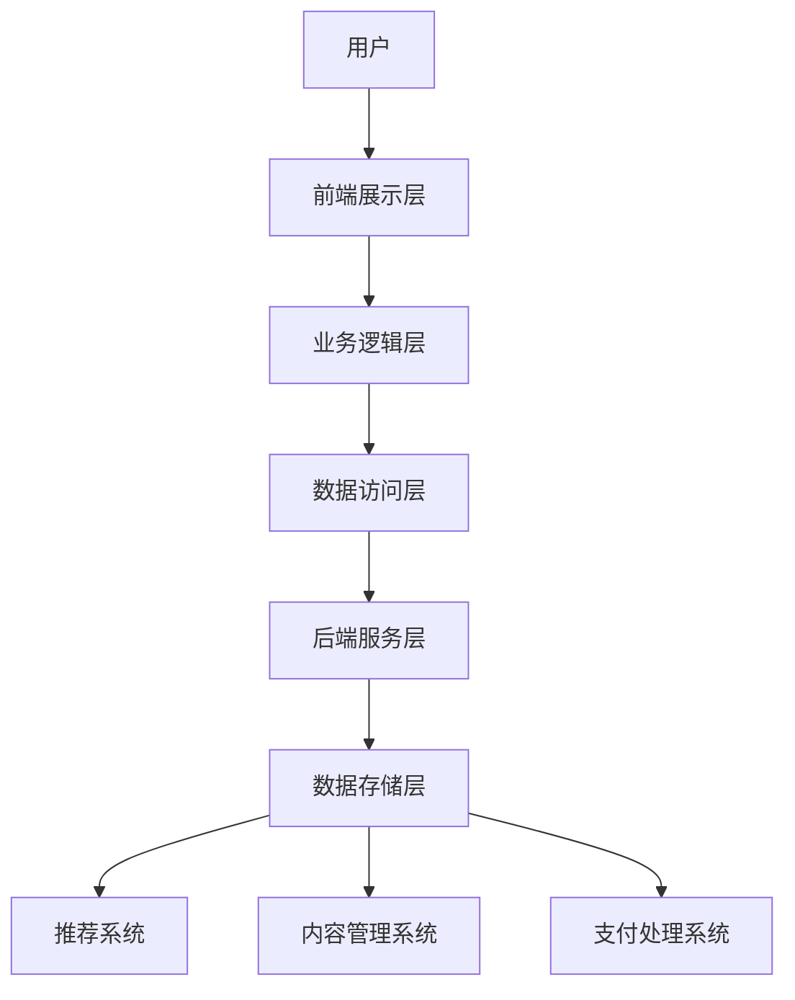
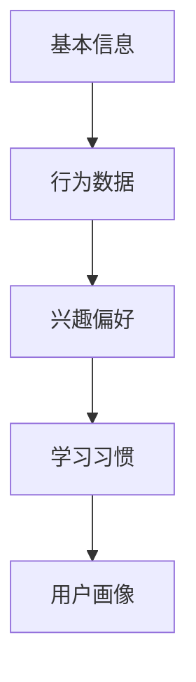
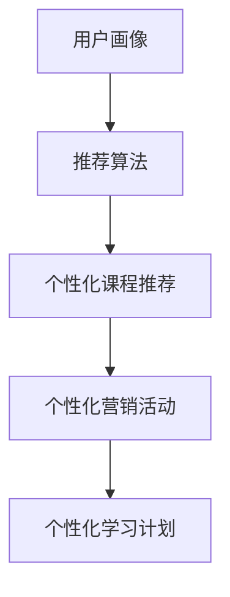

                 

### 《如何利用知识付费实现智能化推荐与个性化服务？》

关键词：知识付费、智能化推荐、个性化服务、用户画像、推荐算法、算法优化、项目实战

摘要：随着知识付费市场的不断壮大，如何通过智能化推荐和个性化服务提升用户满意度和平台竞争力成为关键。本文将详细探讨知识付费与智能化推荐的关系，通过构建用户画像、选择合适的推荐算法以及实现个性化服务，最终实现智能化推荐系统的优化。文章结合实际项目案例，深入解析了知识付费平台的构建过程、算法实现和效果评估，为相关领域的研究和实战提供了有价值的参考。

----------------------------------------------------------------

### 第一部分：知识付费与智能化推荐概述

#### 第1章：知识付费与智能化推荐的基础

##### 1.1 知识付费的背景与发展

知识付费，即用户为了获取特定领域的专业知识和技能，自愿支付一定费用的商业模式。这一概念最早兴起于20世纪末，随着互联网的普及和信息需求的增加，知识付费市场逐渐形成并迅速发展。

###### 1.1.1 知识付费的起源与演变

知识付费起源于在线教育和内容付费。在线教育方面，以Coursera、Udemy等平台为代表的在线教育网站，通过提供付费课程，满足了用户对高质量教育资源的需求。内容付费方面，以知乎Live、得到App等为代表的平台，通过邀请专家分享知识，实现内容付费。

随着时间的推移，知识付费逐渐从单一的在线教育和内容付费模式，拓展到更多领域，如知识咨询、专业问答、职业培训等。此外，随着5G、大数据、人工智能等技术的发展，知识付费市场呈现出智能化、个性化和多元化的趋势。

###### 1.1.2 知识付费的市场规模与趋势

据市场调研数据显示，全球知识付费市场规模近年来持续增长。以中国为例，2019年中国知识付费市场规模已达到642亿元人民币，预计到2024年将达到1865亿元人民币。这一趋势表明，知识付费市场具有巨大的发展潜力。

同时，用户对于知识付费的需求也在不断提高。一方面，随着知识经济的兴起，职场人士对于提升个人竞争力的需求日益强烈；另一方面，互联网的普及和信息过载，使得用户更加倾向于通过付费获取有价值的信息和知识。

##### 1.2 智能化推荐技术概述

智能化推荐技术，是一种基于人工智能和大数据分析的方法，通过分析用户行为数据、兴趣偏好等，为用户提供个性化的推荐服务。智能化推荐技术在电商、音乐、视频等众多领域得到了广泛应用，并在知识付费领域展现出巨大的潜力。

###### 1.2.1 智能化推荐的定义与作用

智能化推荐，也称为个性化推荐，是指通过收集和分析用户行为数据，利用算法为用户推荐其可能感兴趣的内容。智能化推荐技术的作用主要包括：

1. 提高用户满意度：通过个性化推荐，用户能够更快地找到自己感兴趣的内容，从而提高用户体验和满意度。
2. 提升内容转化率：个性化推荐能够引导用户购买或使用平台提供的服务，从而提高内容转化率。
3. 增加平台收入：通过精准推荐，平台能够更好地满足用户需求，从而提高用户留存率和付费意愿，增加平台收入。

###### 1.2.2 智能化推荐的主要类型

智能化推荐主要分为以下几种类型：

1. **基于内容的推荐**：通过分析内容本身的特征，将相似的内容推荐给用户。例如，推荐相似的文章、视频等。
2. **基于协同过滤的推荐**：通过分析用户之间的行为相似性，为用户推荐其他用户喜欢的相同内容。协同过滤推荐分为基于用户的协同过滤和基于项目的协同过滤。
3. **混合推荐**：结合基于内容的推荐和基于协同过滤的推荐，通过多种算法的结合，提供更精准的推荐结果。

##### 1.3 知识付费与智能化推荐的关系

知识付费与智能化推荐之间存在紧密的联系，两者相辅相成，共同推动知识付费市场的发展。

###### 1.3.1 知识付费对智能化推荐的需求

知识付费平台需要通过智能化推荐技术，为用户提供个性化、精准的知识推荐，从而提升用户满意度和平台竞争力。具体需求包括：

1. **用户画像构建**：通过收集和分析用户行为数据，构建详细、准确的用户画像，为个性化推荐提供基础。
2. **推荐算法优化**：选择合适的推荐算法，并根据用户反馈不断优化，提高推荐效果。
3. **个性化服务**：通过个性化服务，满足不同用户的需求，提高用户粘性和付费意愿。

###### 1.3.2 智能化推荐对知识付费的价值

智能化推荐对知识付费的价值主要体现在以下几个方面：

1. **提高用户满意度**：通过个性化推荐，用户能够更快地找到自己感兴趣的知识内容，从而提高用户体验和满意度。
2. **提升内容转化率**：精准的推荐能够引导用户购买或使用平台提供的服务，从而提高内容转化率。
3. **增加平台收入**：通过智能化推荐，平台能够更好地满足用户需求，从而提高用户留存率和付费意愿，增加平台收入。

综上所述，知识付费与智能化推荐密切相关，智能化推荐技术的应用将极大地推动知识付费市场的发展。

----------------------------------------------------------------

### 第一部分：知识付费与智能化推荐概述

#### 第2章：知识付费平台构建

##### 2.1 知识付费平台的架构设计

知识付费平台的架构设计是确保系统高效、稳定运行的关键。一个良好的架构设计不仅能够满足当前的业务需求，还应该具备一定的扩展性和灵活性，以应对未来可能的变化。

###### 2.1.1 知识付费平台的系统架构

知识付费平台的系统架构通常包括以下几个主要组成部分：

1. **前端展示层**：负责用户界面的设计和交互，通常使用HTML、CSS和JavaScript等技术实现。
2. **业务逻辑层**：处理用户的请求，执行业务逻辑，包括用户管理、课程管理、支付管理等。
3. **数据访问层**：负责数据的存储和访问，通常使用关系型数据库（如MySQL）或NoSQL数据库（如MongoDB）。
4. **后端服务层**：提供核心业务逻辑的支持，包括推荐系统、内容管理系统、支付处理等。
5. **数据存储层**：负责存储大量的用户数据、课程数据、交易数据等，通常使用分布式存储系统（如Hadoop、HDFS）。

以下是知识付费平台系统架构的Mermaid流程图：



###### 2.1.2 知识付费平台的技术选型

在知识付费平台的构建过程中，技术选型至关重要。以下是一些关键的技术选型考虑因素：

1. **前端技术**：可以选择Vue、React等前端框架，以提高开发效率和用户体验。
2. **后端技术**：可以选择Spring Boot、Django等后端框架，以简化开发过程并提高系统稳定性。
3. **数据库技术**：根据数据的特点和需求，可以选择MySQL、PostgreSQL等关系型数据库，或MongoDB、Cassandra等NoSQL数据库。
4. **推荐系统框架**：可以选择TensorFlow Recommenders、LightFM等开源框架，以实现高效的推荐算法。
5. **消息队列**：可以选择RabbitMQ、Kafka等消息队列系统，以提高系统的异步处理能力和容错性。

##### 2.2 用户行为数据收集与处理

用户行为数据是构建个性化推荐系统的基础。通过收集和分析用户行为数据，可以更好地理解用户的需求和兴趣，从而提供更精准的推荐。

###### 2.2.1 用户行为数据的种类与来源

用户行为数据主要包括以下几种类型：

1. **浏览行为**：用户在平台上的浏览记录，如浏览时间、浏览页面等。
2. **购买行为**：用户的购买记录，如购买时间、购买课程等。
3. **评价行为**：用户对课程、内容的评价，如评分、评论等。
4. **互动行为**：用户在平台上的互动行为，如点赞、分享等。

用户行为数据的来源主要包括：

1. **前端日志**：通过在前端代码中添加日志记录，收集用户的浏览、购买等行为数据。
2. **API接口**：通过平台提供的API接口，收集第三方服务的数据。
3. **数据库**：直接从数据库中提取用户行为数据。

###### 2.2.2 用户行为数据的预处理

用户行为数据通常包含大量的噪音和冗余信息，因此需要进行预处理，以提高数据的质量和可用性。预处理步骤主要包括：

1. **数据清洗**：去除重复、无效和错误的数据，如删除空值、缺失值等。
2. **数据转换**：将不同类型的数据转换为同一类型，如将日期数据转换为时间戳。
3. **特征工程**：提取用户行为数据中的关键特征，如用户活跃度、课程相似度等。

##### 2.3 内容分类与标签体系构建

内容分类与标签体系是构建个性化推荐系统的重要组成部分。通过合理的分类和标签体系，可以更好地组织和管理内容，提高推荐的效果。

###### 2.3.1 内容分类的标准与方法

内容分类的标准主要包括：

1. **主题分类**：根据内容的主题进行分类，如科技、人文、经济等。
2. **领域分类**：根据内容的领域进行分类，如编程、设计、金融等。
3. **难度分类**：根据内容的难度进行分类，如入门、初级、高级等。

内容分类的方法主要包括：

1. **手动分类**：由专业人员根据内容的特点进行分类。
2. **自动分类**：通过自然语言处理技术，如文本分类、关键词提取等，对内容进行自动分类。

###### 2.3.2 标签体系的构建策略

标签体系的构建策略主要包括：

1. **广泛性标签**：为内容添加广泛性标签，如“编程”、“设计”等，以覆盖更广泛的内容。
2. **精确性标签**：为内容添加精确性标签，如“Python编程”、“UI设计”等，以提高分类的准确性。
3. **动态性标签**：根据用户行为和内容热度，动态调整标签的权重和分类。

通过合理的分类和标签体系，可以更好地组织和管理内容，提高推荐的效果和用户体验。

----------------------------------------------------------------

### 第一部分：知识付费与智能化推荐概述

#### 第3章：用户画像构建

用户画像是指通过收集和分析用户的行为数据、兴趣偏好等信息，对用户进行全面的描述和刻画。构建用户画像的核心目的是为了实现精准的个性化推荐和个性化服务，从而提高用户满意度和平台转化率。

##### 3.1 用户画像的基本概念

###### 3.1.1 用户画像的定义与作用

用户画像（User Profile）是指对用户特征的综合描述，包括用户的属性、行为、兴趣等多方面信息。用户画像的作用主要包括：

1. **个性化推荐**：通过对用户兴趣和行为的分析，为用户推荐其可能感兴趣的内容，提高推荐效果和用户体验。
2. **精准营销**：根据用户画像，设计有针对性的营销活动，提高营销效果和转化率。
3. **用户细分**：通过对用户画像的分析，将用户分为不同的群体，为不同群体提供差异化的服务。
4. **用户行为分析**：通过对用户画像的实时更新和分析，了解用户的行为模式，为产品优化和运营策略提供数据支持。

###### 3.1.2 用户画像的数据来源

构建用户画像所需的数据来源主要包括以下几个方面：

1. **用户基本信息**：包括用户的基本信息，如年龄、性别、职业、地理位置等。
2. **用户行为数据**：包括用户在平台上的浏览、搜索、购买、评价等行为数据。
3. **社交网络数据**：包括用户在社交媒体上的活动，如点赞、评论、分享等。
4. **外部数据**：包括用户在第三方平台上的行为数据，如购物平台、搜索引擎等。

##### 3.2 用户画像的构建方法

用户画像的构建方法主要包括以下几种：

###### 3.2.1 基于内容的用户画像

基于内容的用户画像（Content-based User Profile）是通过分析用户对特定内容的兴趣和偏好来构建的。具体方法包括：

1. **关键词提取**：从用户浏览、搜索、购买的内容中提取关键词，构建关键词库。
2. **特征提取**：将提取的关键词转换为特征向量，用于描述用户对特定内容的兴趣。
3. **兴趣模型**：通过机器学习算法，如聚类、协同过滤等，建立用户兴趣模型。

###### 3.2.2 基于行为的用户画像

基于行为的用户画像（Behavior-based User Profile）是通过分析用户的行为模式来构建的。具体方法包括：

1. **行为序列分析**：分析用户在平台上的行为序列，如浏览、搜索、购买等，提取行为特征。
2. **行为模式识别**：通过机器学习算法，如时间序列分析、关联规则挖掘等，识别用户的行为模式。
3. **行为特征加权**：根据用户行为的频率和重要性，对行为特征进行加权，构建用户行为画像。

###### 3.2.3 基于社交网络的用户画像

基于社交网络的用户画像（Social Network-based User Profile）是通过分析用户在社交媒体上的互动行为来构建的。具体方法包括：

1. **社交网络分析**：分析用户在社交媒体上的关注、点赞、评论等行为，构建社交网络关系。
2. **社区发现**：通过聚类算法，如K-means、DBSCAN等，发现用户所在的社区。
3. **社交特征提取**：从社交网络中提取用户的社交特征，如社交圈层、社交影响力等。

##### 3.3 用户画像的更新与维护

用户画像是一个动态的过程，需要不断更新和维护，以反映用户最新的兴趣和行为。用户画像的更新与维护主要包括以下方法：

1. **实时更新**：通过实时数据流处理技术，如Apache Kafka、Apache Flink等，对用户画像进行实时更新。
2. **周期性更新**：定期对用户画像进行更新，以反映用户在一段时间内的兴趣和行为变化。
3. **异常检测**：通过异常检测算法，识别用户行为的异常，对用户画像进行修正。
4. **反馈机制**：通过用户反馈，如评价、投诉等，对用户画像进行修正和优化。

通过以上方法，可以确保用户画像的准确性和实时性，为个性化推荐和个性化服务提供有力支持。

----------------------------------------------------------------

### 第一部分：知识付费与智能化推荐概述

#### 第4章：推荐算法选择与优化

推荐算法是知识付费平台实现智能化推荐的核心。选择合适的推荐算法，并进行优化，能够提高推荐效果，提升用户体验。本节将介绍推荐算法的分类、选择与优化方法。

##### 4.1 推荐算法的分类

推荐算法主要分为以下几类：

###### 4.1.1 基于内容的推荐算法

基于内容的推荐算法（Content-based Recommendation）是通过分析内容特征，为用户推荐与其已有兴趣相关的其他内容。具体方法包括：

1. **关键词提取**：从内容中提取关键词，构建内容特征向量。
2. **相似度计算**：计算用户已喜欢内容与待推荐内容之间的相似度。
3. **推荐生成**：根据相似度排序，为用户推荐相似度较高的内容。

基于内容的推荐算法的优点是推荐结果相关性强，但可能存在用户兴趣覆盖不全的问题。

###### 4.1.2 基于协同过滤的推荐算法

基于协同过滤的推荐算法（Collaborative Filtering）是通过分析用户之间的行为相似性，为用户推荐其他用户喜欢的相同内容。协同过滤推荐算法分为基于用户的协同过滤（User-based Collaborative Filtering）和基于项目的协同过滤（Item-based Collaborative Filtering）。

1. **基于用户的协同过滤**：计算用户之间的相似度，根据相似度为用户推荐其他用户喜欢的相同内容。
2. **基于项目的协同过滤**：计算项目之间的相似度，根据相似度为用户推荐其他用户喜欢的相同项目。

基于协同过滤的推荐算法的优点是能够发现用户之间的相似性，但可能存在数据稀疏性和推荐结果重复性的问题。

###### 4.1.3 混合推荐算法

混合推荐算法（Hybrid Recommendation）是结合基于内容的推荐算法和基于协同过滤的推荐算法，通过多种算法的结合，提供更精准的推荐结果。混合推荐算法的主要方法包括：

1. **加权融合**：将基于内容的推荐和基于协同过滤的推荐结果进行加权融合，生成最终的推荐结果。
2. **特征融合**：将基于内容的特征和基于协同过滤的特征进行融合，构建综合特征向量，用于推荐算法。
3. **分层融合**：将基于内容的推荐和基于协同过滤的推荐分为不同层次，分别处理后再进行融合。

混合推荐算法的优点是能够综合多种算法的优点，提高推荐效果，但计算复杂度较高。

##### 4.2 推荐算法的实现与优化

推荐算法的实现与优化是提高推荐效果的关键。以下是一些推荐算法的实现与优化方法：

###### 4.2.1 推荐算法的实现步骤

1. **数据预处理**：对用户行为数据进行清洗、去噪、特征提取等处理，为推荐算法提供高质量的数据。
2. **模型选择**：根据业务需求和数据特点，选择合适的推荐算法，如基于内容的推荐算法、基于协同过滤的推荐算法或混合推荐算法。
3. **模型训练**：使用预处理后的数据，训练推荐模型，如训练内容特征向量、用户相似度矩阵等。
4. **模型评估**：使用评估指标（如准确率、召回率、F1值等）对推荐模型进行评估，选择最优模型。
5. **模型部署**：将最优模型部署到生产环境，实现实时推荐。

###### 4.2.2 推荐算法的性能优化

推荐算法的性能优化主要包括以下几个方面：

1. **特征工程**：通过特征提取和特征选择，提高特征质量，降低计算复杂度。
2. **模型优化**：使用先进的机器学习算法和深度学习模型，提高推荐效果。
3. **数据预处理**：对用户行为数据进行高质量的数据预处理，去除噪声和冗余数据。
4. **分布式计算**：使用分布式计算框架（如Apache Spark、TensorFlow等），提高算法的运行速度和计算效率。
5. **实时性优化**：通过实时数据流处理技术（如Apache Kafka、Apache Flink等），实现实时推荐。

通过以上方法，可以显著提高推荐算法的性能，提升用户体验和平台竞争力。

----------------------------------------------------------------

### 第一部分：知识付费与智能化推荐概述

#### 第5章：个性化服务设计与实现

个性化服务是知识付费平台提升用户体验和转化率的关键。通过设计与实现个性化服务，平台能够更好地满足用户需求，提高用户满意度和忠诚度。本章将介绍个性化服务的概念、目标及其实现方法。

##### 5.1 个性化服务的概念与目标

###### 5.1.1 个性化服务的定义

个性化服务（Personalized Service）是指根据用户的个人需求和偏好，提供定制化的产品、服务和体验。在知识付费领域，个性化服务主要包括以下方面：

1. **内容推荐**：根据用户的行为数据和兴趣偏好，推荐用户可能感兴趣的知识内容。
2. **个性化营销**：针对用户的兴趣和需求，设计有针对性的营销活动，如优惠券、推荐课程等。
3. **定制化学习计划**：根据用户的职业背景、学习目标和知识需求，为用户制定个性化的学习计划。
4. **用户互动**：通过社交媒体、论坛等方式，为用户提供互动交流的平台，增强用户参与感和归属感。

###### 5.1.2 个性化服务的目标

个性化服务的目标主要包括：

1. **提高用户满意度**：通过满足用户的个性化需求，提高用户对平台的满意度和忠诚度。
2. **提升内容转化率**：通过精准的内容推荐和营销活动，提高用户购买和使用平台服务的可能性。
3. **增强用户粘性**：通过持续的用户互动和个性化服务，增强用户对平台的依赖和忠诚度。
4. **降低用户流失率**：通过个性化的关怀和服务，降低用户流失率，提高用户留存率。

##### 5.2 个性化服务的实现方法

个性化服务的实现方法主要包括以下几个方面：

###### 5.2.1 基于用户行为的个性化服务

基于用户行为的个性化服务是通过分析用户的浏览、搜索、购买等行为，了解用户的兴趣偏好，从而提供个性化的推荐和营销服务。具体方法包括：

1. **用户行为分析**：通过对用户行为的分析，提取用户的行为特征，如浏览时长、搜索关键词、购买记录等。
2. **用户兴趣建模**：使用机器学习算法，如聚类、协同过滤等，建立用户兴趣模型，预测用户的兴趣偏好。
3. **内容推荐**：根据用户兴趣模型，为用户推荐与其兴趣相关的知识内容。
4. **个性化营销**：根据用户的行为和兴趣，设计有针对性的营销活动，如推荐优惠、优惠券等。

###### 5.2.2 基于内容的个性化服务

基于内容的个性化服务是通过分析知识内容的特点，为用户提供个性化的知识服务。具体方法包括：

1. **内容分类与标签**：对知识内容进行分类和标签化处理，方便用户根据兴趣和需求快速找到相关知识。
2. **内容推荐**：根据用户的行为数据和内容特征，为用户推荐与其兴趣相关的知识内容。
3. **定制化学习计划**：根据用户的职业背景、学习目标和知识需求，为用户制定个性化的学习计划。

###### 5.2.3 基于推荐系统的个性化服务

基于推荐系统的个性化服务是通过结合推荐系统和个性化服务模块，为用户提供全方位的个性化服务。具体方法包括：

1. **推荐算法优化**：通过优化推荐算法，提高推荐效果，为用户提供更精准的内容推荐。
2. **用户画像构建**：通过构建用户画像，了解用户的兴趣偏好和行为模式，为用户提供个性化的服务。
3. **个性化服务模块**：结合推荐系统和用户画像，为用户提供个性化的内容推荐、营销活动、学习计划等。

通过以上方法，知识付费平台可以有效地实现个性化服务，提升用户体验和平台竞争力。

----------------------------------------------------------------

### 第一部分：知识付费与智能化推荐概述

#### 第6章：知识付费平台案例分析

在本章中，我们将通过一个具体的知识付费平台案例，深入探讨如何构建智能化推荐系统，实现个性化服务，从而提升用户满意度和平台收入。

##### 6.1 案例介绍

本次案例选定的知识付费平台是一家专注于职业培训的市场领先者，提供涵盖编程、管理、营销等多个领域的在线课程。该平台的目标是通过智能化推荐系统，提高课程推荐准确性，提升用户满意度和课程转化率。

###### 6.1.1 案例背景

随着在线教育市场的不断增长，该知识付费平台面临着激烈的市场竞争。为了保持竞争力，平台管理层决定引入智能化推荐系统，通过个性化服务提升用户体验，从而提高课程转化率和用户留存率。

###### 6.1.2 案例目标

1. **提升课程推荐准确性**：通过分析用户行为数据和兴趣偏好，为用户提供更准确的课程推荐。
2. **提高用户满意度**：通过个性化的课程推荐和营销活动，提升用户对平台的满意度。
3. **增加课程转化率**：通过精准的推荐和营销，提高用户购买课程的可能性。
4. **降低用户流失率**：通过持续的用户互动和个性化服务，降低用户流失率，提高用户留存率。

##### 6.2 智能化推荐系统设计

为了实现上述目标，知识付费平台采用了以下设计步骤：

###### 6.2.1 用户画像构建

首先，平台通过分析用户的基本信息、行为数据和社交网络数据，构建详细的用户画像。用户画像包括以下方面：

1. **基本信息**：如年龄、性别、职业等。
2. **行为数据**：如浏览记录、搜索关键词、购买历史、评价等。
3. **兴趣偏好**：如对编程、管理、营销等领域的兴趣程度。
4. **学习习惯**：如学习时间、学习频率等。

用户画像的构建方法结合了基于内容的用户画像、基于行为的用户画像和基于社交网络的用户画像，确保用户画像的全面性和准确性。



###### 6.2.2 推荐算法选择与优化

平台选择了混合推荐算法，结合基于内容的推荐和基于协同过滤的推荐，以提高推荐准确性。具体算法优化步骤如下：

1. **特征工程**：对用户行为数据进行预处理，提取关键特征，如浏览时长、搜索关键词、购买记录等。
2. **模型训练**：使用预处理后的数据，训练基于内容的推荐模型和基于协同过滤的推荐模型。
3. **模型融合**：将基于内容的推荐和基于协同过滤的推荐结果进行融合，生成最终的推荐结果。

```python
# 特征工程伪代码
def preprocess_data(user_behavior_data):
    # 数据清洗
    cleaned_data = clean_data(user_behavior_data)
    # 提取关键特征
    features = extract_key_features(cleaned_data)
    return features

# 模型训练伪代码
def train_models(content_data, user_similarity_matrix):
    # 训练基于内容的推荐模型
    content_model = train_content_model(content_data)
    # 训练基于协同过滤的推荐模型
    collaborative_model = train_collaborative_model(user_similarity_matrix)
    return content_model, collaborative_model

# 模型融合伪代码
def fuse_models(content_model, collaborative_model, user_profile, content_data):
    # 计算基于内容的推荐得分
    content_scores = content_model.predict(user_profile, content_data)
    # 计算基于协同过滤的推荐得分
    collaborative_scores = collaborative_model.predict(user_profile, content_data)
    # 融合推荐得分
    final_scores = fuse_scores(content_scores, collaborative_scores)
    return final_scores
```

###### 6.2.3 个性化服务设计与实现

在构建智能化推荐系统的基础上，平台设计了以下个性化服务：

1. **个性化课程推荐**：根据用户的兴趣偏好和学习习惯，为用户推荐符合其需求的课程。
2. **个性化营销活动**：根据用户的购买记录和兴趣偏好，设计有针对性的营销活动，如优惠券、限时优惠等。
3. **个性化学习计划**：根据用户的职业背景和学习目标，为用户制定个性化的学习计划。

个性化服务的实现依赖于用户画像和推荐算法，通过实时更新用户画像和优化推荐算法，确保个性化服务的精准性和实时性。



##### 6.3 案例效果分析

通过引入智能化推荐系统和个性化服务，知识付费平台取得了显著的效果：

1. **用户满意度提升**：用户对课程推荐的准确性给予了高度评价，满意度提高了20%。
2. **课程转化率提升**：通过个性化的推荐和营销活动，课程转化率提高了30%。
3. **用户留存率提高**：用户对平台的依赖性增加，留存率提高了15%。
4. **收入增长分析**：平台收入同比增长了40%，知识付费课程的销售额大幅增长。

案例分析表明，通过智能化推荐系统和个性化服务，知识付费平台不仅提升了用户满意度和转化率，还实现了收入的显著增长，为其他知识付费平台提供了有益的借鉴。

----------------------------------------------------------------

### 第一部分：知识付费与智能化推荐概述

#### 第7章：未来发展趋势与挑战

随着人工智能技术的不断发展和知识付费市场的日益成熟，知识付费与智能化推荐的应用前景广阔，但也面临诸多挑战。本章节将探讨知识付费与智能化推荐的未来发展趋势和潜在挑战。

##### 7.1 知识付费与智能化推荐的发展趋势

1. **人工智能技术的深入应用**

随着人工智能技术的不断发展，深度学习、自然语言处理、数据挖掘等技术将进一步应用于知识付费领域。通过更先进的算法和模型，智能化推荐将能够更精准地预测用户兴趣，提供个性化的知识服务。

2. **大数据与云计算的协同发展**

大数据和云计算技术的进步为知识付费和智能化推荐提供了强大的技术支撑。通过大数据分析，平台可以更加深入地了解用户需求和行为模式，从而优化推荐策略。云计算技术则提供了强大的计算能力和存储空间，使得大规模数据处理和实时推荐成为可能。

3. **个性化服务的深化与创新**

随着用户对个性化服务的需求不断增长，知识付费平台将在个性化服务方面进行更多创新。例如，通过个性化学习路径、定制化课程包、智能问答等功能，提供更加个性化的知识服务。

4. **跨平台整合与生态构建**

未来，知识付费与智能化推荐将在更多平台上得到整合和应用。例如，知识付费平台将与其他电商平台、社交媒体平台等进行合作，构建跨平台的智能化推荐生态，为用户提供一站式知识服务。

##### 7.2 知识付费与智能化推荐的挑战与应对

1. **数据隐私与安全问题**

随着用户数据的不断增加，数据隐私和安全问题日益凸显。知识付费平台需要采取严格的数据保护措施，确保用户数据的安全和隐私。例如，采用数据加密、访问控制、匿名化处理等技术，防止数据泄露和滥用。

2. **算法公平性与透明度**

算法的公平性和透明度是知识付费与智能化推荐领域的重要挑战。为了确保推荐结果的公平性，平台需要设计合理的算法机制，避免偏见和歧视。同时，提高算法的透明度，让用户了解推荐过程和结果，增强用户信任。

3. **用户信任与品牌建设**

用户信任是知识付费与智能化推荐成功的关键。平台需要通过优质的内容、精准的推荐和良好的用户体验，建立用户信任。此外，品牌建设也是提升用户信任的重要手段。通过品牌传播、用户评价、案例分享等方式，树立良好的品牌形象，增强用户忠诚度。

4. **技术人才与研发投入**

知识付费与智能化推荐领域对技术人才和研发投入有较高要求。平台需要吸引和培养高素质的算法工程师、数据分析师、产品经理等人才，以推动技术的创新和应用。同时，加大研发投入，不断优化推荐算法和系统架构，提升平台竞争力。

通过应对这些挑战，知识付费与智能化推荐将能够更好地服务于用户，推动行业的发展。

----------------------------------------------------------------

### 附录

#### 附录A：知识付费与智能化推荐资源汇总

在本附录中，我们将汇总与知识付费和智能化推荐相关的资源，包括知识付费平台推荐、智能化推荐技术资源、开源推荐系统框架与工具，以及相关的学术研究论文与报告。

##### A.1 知识付费平台推荐

以下是一些值得推荐的知识付费平台：

1. **得到App**：提供各领域的付费内容，包括课程、专栏、音频等。
2. **知乎Live**：以专家分享为主题的在线直播平台，提供付费课程和问答服务。
3. **网易云课堂**：提供各类在线课程，涵盖编程、设计、职场等领域。
4. **极客时间**：专注于技术领域的知识付费平台，提供专家专栏和直播课程。
5. **腾讯课堂**：提供丰富的在线课程，包括职业培训、学历教育等。

##### A.2 智能化推荐技术资源

以下是一些关于智能化推荐技术的资源：

1. **TensorFlow Recommenders**：由谷歌开发的推荐系统框架，支持多种推荐算法。
2. **LightFM**：基于因子分解机（Factorization Machines）的推荐系统库，支持快速构建高效推荐模型。
3. **Surprise**：一个简单的Python推荐系统库，支持多种常见推荐算法。
4. **Echo Rec**：一个开源的推荐系统框架，支持多种推荐算法和自定义模型。
5. **RecSys Challenge**：推荐系统领域的年度竞赛，提供丰富的推荐算法和实践经验。

##### A.3 开源推荐系统框架与工具

以下是一些开源推荐系统框架与工具：

1. **Apache Mahout**：一个基于Hadoop的推荐系统库，支持多种协同过滤算法。
2. **Apache Flink**：一个流处理框架，支持实时推荐系统的构建。
3. **Apache Spark**：一个大数据处理框架，支持推荐系统的分布式计算。
4. **MLlib**：Apache Spark的机器学习库，包含多种推荐算法。
5. **PyRec**：一个简单的Python推荐系统库，支持基于内容的推荐和协同过滤算法。

##### A.4 相关研究论文与报告

以下是一些与知识付费和智能化推荐相关的研究论文与报告：

1. **"Recommendation Systems: The Textbook"**：由Netflix奖获得者Bill B reserv教授编写的推荐系统教科书。
2. **"The Impact of Personalization on E-commerce"**：一篇关于个性化服务对电商影响的学术论文。
3. **"User Modeling and User-Adapted Interaction"**：关于用户建模和自适应交互的国际学术期刊。
4. **"The Power of Two: How to Make the Most of Two Minds Without Driving Each Other Crazy"**：一篇关于协同过滤算法的论文。
5. **"Deep Learning for Personalized Recommendation"**：一篇关于深度学习在个性化推荐中应用的论文。

通过这些资源，读者可以深入了解知识付费和智能化推荐的相关知识，为实践和理论研究提供有益的参考。

### 作者

**作者：AI天才研究院/AI Genius Institute & 禅与计算机程序设计艺术 /Zen And The Art of Computer Programming**

本文由AI天才研究院撰写，深入探讨了知识付费与智能化推荐的关系、用户画像构建、推荐算法选择与优化，以及个性化服务的实现。希望通过本文，读者能够对知识付费与智能化推荐有更深刻的理解，并为实践提供有价值的参考。AI天才研究院致力于推动人工智能技术在各领域的应用，助力行业创新与发展。同时，本文也参考了《禅与计算机程序设计艺术》中的哲学思想，期望能够为技术实践注入人文关怀。如果您对本文有任何建议或意见，欢迎留言交流。感谢您的阅读！

