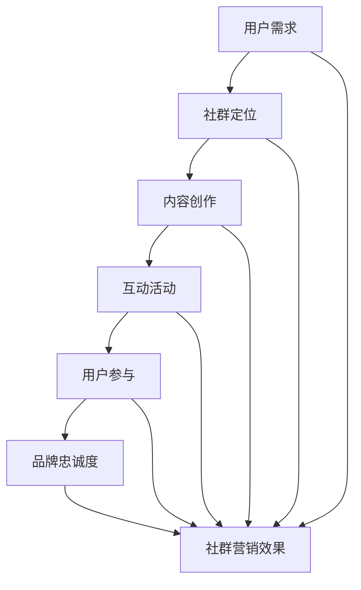

                 

# 如何利用社群营销建立品牌粘性与忠诚度

> **关键词**：社群营销、品牌粘性、忠诚度、策略、案例分析、技术工具

> **摘要**：本文将深入探讨如何利用社群营销策略建立品牌粘性与忠诚度。首先，我们将阐述社群营销的核心概念与理论，然后分析其与传统营销的区别。接着，我们将详细讲解社群营销的核心理念、构建和实践，以及如何利用社交媒体平台和数据工具提升社群活跃度和用户参与度。随后，我们将讨论品牌粘性与忠诚度的定义及其重要性，并提供实际案例解析成功策略。最后，我们将探讨如何通过效果评估与优化、跨平台整合、团队建设与管理、法律法规与伦理来进一步提升社群营销效果。

## 第一部分：社群营销基础理论

### 第1章：社群营销概述

#### 1.1 社群营销的定义与价值

社群营销是指通过建立和维护在线或线下的社群，与目标用户进行互动和沟通，以提高品牌知名度、用户参与度和品牌忠诚度的一种营销方式。其核心在于通过建立情感连接、互动和参与，增强用户对品牌的认同感和忠诚度。

社群营销的价值体现在以下几个方面：

1. **提高品牌知名度**：通过社群营销，品牌可以在目标用户中建立广泛的知名度，提高品牌曝光率。
2. **增强用户参与度**：社群营销鼓励用户参与品牌活动，提高用户互动率，增强用户对品牌的认同感。
3. **提升用户忠诚度**：通过持续的互动和关怀，品牌可以建立用户忠诚度，降低用户流失率。
4. **获取用户反馈**：社群营销有助于品牌了解用户需求和偏好，为产品改进和策略调整提供有力支持。

#### 1.2 社群营销的发展历程

社群营销的发展可以分为以下几个阶段：

1. **早期社群营销**：以线下活动和论坛为主，通过面对面交流建立社群关系。
2. **社交媒体兴起**：随着社交媒体的兴起，线上社群营销逐渐成为主流，通过社交媒体平台建立和运营社群。
3. **大数据与人工智能**：随着大数据和人工智能技术的发展，社群营销开始运用数据分析工具，实现精准营销和个性化推荐。

#### 1.3 社群营销与传统营销的区别

社群营销与传统营销的主要区别在于：

1. **目标导向**：传统营销更注重产品推广和销售，而社群营销更注重用户互动和关系建立。
2. **互动方式**：传统营销以单向传播为主，而社群营销强调双向互动，鼓励用户参与和反馈。
3. **传播渠道**：传统营销主要依靠广告和促销，而社群营销利用社交媒体、论坛、社群平台等多种渠道进行传播。
4. **效果评估**：传统营销效果评估较为困难，而社群营销可以通过用户参与度、互动率和品牌忠诚度等指标进行量化评估。

## 第2章：社群营销的核心理念

### 2.1 社群思维

社群思维是指将品牌视为一个社区，与用户建立紧密联系，共同参与品牌活动，形成一种共同体意识。社群思维的核心在于：

1. **用户视角**：以用户为中心，关注用户需求和体验，为用户创造价值。
2. **互动参与**：鼓励用户参与品牌活动和决策，提高用户满意度和忠诚度。
3. **共同成长**：与用户共同成长，建立长期合作关系，实现共赢。

#### 社群思维的实践

1. **建立用户画像**：通过数据分析了解用户需求和偏好，为用户提供个性化内容和服务。
2. **互动活动设计**：设计有趣、互动性强的活动，激发用户参与热情。
3. **用户反馈机制**：建立用户反馈渠道，及时了解用户需求和意见，为产品改进和策略调整提供支持。

### 2.2 社群情感连接

社群情感连接是指通过情感共鸣和情感互动，建立用户对品牌的深厚情感。情感连接的核心在于：

1. **情感共鸣**：与用户产生共鸣，触动用户情感，建立情感纽带。
2. **情感互动**：鼓励用户之间的情感互动，增强社群凝聚力。
3. **情感维系**：通过持续的情感关怀和维护，保持用户对品牌的忠诚度。

#### 社群情感连接的构建

1. **情感内容创作**：创作富有情感共鸣的内容，如感人故事、励志案例等，引发用户情感共鸣。
2. **互动环节设计**：设计有趣的互动环节，如互动问答、点赞评论等，促进用户之间的情感互动。
3. **情感关怀**：通过私信、节日问候等方式，给予用户情感关怀，增强用户对品牌的情感连接。

### 2.3 社群互动与参与

社群互动与参与是指通过互动活动和参与机制，激发用户的参与热情，提高用户忠诚度。社群互动与参与的核心在于：

1. **互动活动设计**：设计形式多样、有趣、有价值的互动活动，激发用户参与热情。
2. **参与机制建立**：建立激励机制，鼓励用户参与品牌活动和互动。
3. **用户参与度提升**：通过数据分析和用户反馈，不断优化互动活动，提升用户参与度。

#### 社群互动与参与的设计

1. **活动主题选择**：根据用户需求和兴趣，选择具有吸引力的活动主题。
2. **活动形式设计**：设计多样化的活动形式，如线上竞赛、线下聚会、主题活动等，满足不同用户的需求。
3. **激励机制设置**：设置奖品、积分、荣誉称号等激励机制，鼓励用户积极参与。

## 第3章：社群营销的构建与实践

### 3.1 社群定位与目标设定

社群定位是指为社群确定明确的身份和角色，明确社群的目标和定位。社群定位的核心在于：

1. **目标用户定位**：明确目标用户群体，了解其需求和偏好。
2. **社群角色定位**：确定社群在品牌营销中的角色和定位，如用户交流平台、产品体验社区等。
3. **目标设定**：根据社群定位，设定明确的目标，如用户增长、活跃度提升、品牌忠诚度等。

#### 社群定位与目标设定的方法

1. **市场调研**：通过市场调研了解目标用户的需求和偏好。
2. **用户画像**：建立用户画像，明确目标用户群体的特征和需求。
3. **目标设定**：根据用户需求和社群定位，设定具体、可行的目标。

### 3.2 社群运营策略

社群运营策略是指为实现社群目标而制定的一系列运营措施。社群运营策略的核心在于：

1. **内容策略**：制定内容规划，确保内容丰富、有价值、具有吸引力。
2. **互动策略**：设计互动活动，提高用户参与度和互动率。
3. **推广策略**：通过线上线下渠道推广社群，吸引更多目标用户加入。

#### 社群运营策略的制定

1. **内容规划**：根据用户需求和社群定位，制定内容主题和发布计划。
2. **互动活动设计**：根据用户偏好和活动效果，设计互动性强的活动。
3. **推广渠道选择**：选择合适的推广渠道，如社交媒体、论坛、线下活动等。

### 3.3 社群活跃度提升方法

社群活跃度是指社群成员的参与程度和活跃程度。提升社群活跃度的核心在于：

1. **互动设计**：设计有趣、有价值的互动活动，激发用户参与热情。
2. **激励机制**：设置激励机制，鼓励用户积极参与。
3. **用户关怀**：通过关怀和维护，保持用户对社群的活跃度和忠诚度。

#### 社群活跃度提升方法

1. **互动活动设计**：设计多样化、有趣、互动性强的活动，如问答、投票、讨论等。
2. **激励机制设置**：设置奖品、积分、荣誉称号等激励机制，鼓励用户参与。
3. **用户关怀**：通过私信、节日问候、活动通知等方式，关怀用户，提高用户活跃度。

## 第4章：社群营销工具与技术

### 4.1 社交媒体平台分析

社交媒体平台是社群营销的重要工具。不同社交媒体平台具有不同的特点和用户群体，适合不同的社群营销策略。

#### 社交媒体平台分析

1. **Facebook**：适合品牌宣传和用户互动，具有强大的广告投放功能。
2. **Instagram**：适合图片和视频分享，用户群体年轻，互动性强。
3. **Twitter**：适合实时互动和新闻传播，信息传播速度快。
4. **微信**：适合用户交流和信息分享，具有强大的社交属性和广告投放功能。
5. **微博**：适合新闻传播和用户互动，信息传播速度快。

### 4.2 内容营销策略

内容营销是社群营销的核心。优质的内容可以吸引和留住用户，提高品牌影响力。

#### 内容营销策略

1. **内容类型**：根据用户需求和兴趣，选择合适的的内容类型，如图文、视频、直播等。
2. **内容发布频率**：制定合理的发布频率，保持内容更新和用户互动。
3. **内容创意**：注重内容创意，提高内容质量和用户体验。

### 4.3 数据分析与用户画像

数据分析是社群营销的重要手段。通过数据分析，可以了解用户行为和需求，优化社群营销策略。

#### 数据分析

1. **用户行为分析**：通过用户行为数据，了解用户兴趣和行为模式。
2. **用户画像**：通过用户数据，构建用户画像，为内容创作和营销策略提供依据。
3. **效果评估**：通过数据分析，评估社群营销的效果，为策略调整提供依据。

## 第二部分：社群营销策略与案例

### 第5章：社群营销策略制定与执行

社群营销策略的制定与执行是成功社群营销的关键。策略的制定需要基于对目标用户、市场环境和品牌特点的分析，而执行则需要有效的执行方法和技巧。

#### 5.1 策略制定原则

1. **目标明确**：明确社群营销的目标，如用户增长、活跃度提升、品牌忠诚度等。
2. **用户导向**：以用户需求为中心，制定符合用户兴趣和需求的策略。
3. **创新性**：注重创新，设计独特的互动活动和内容，提高用户参与度。
4. **可执行性**：确保策略具有可执行性，制定详细的执行计划和步骤。

#### 5.2 策略执行步骤

1. **目标分解**：将总体目标分解为具体的可执行任务，如内容创作、活动策划、用户互动等。
2. **资源调配**：根据任务需求，调配人力资源、物料资源和预算资源。
3. **任务分配**：将任务分配给团队成员，明确各自的职责和任务。
4. **执行监控**：建立执行监控机制，实时跟踪任务进度，及时调整和优化策略。
5. **效果评估**：通过数据分析和用户反馈，评估策略执行效果，为后续优化提供依据。

#### 5.3 风险管理

1. **风险识别**：识别可能出现的风险，如用户流失、负面舆论等。
2. **风险分析**：分析风险的概率和影响，制定应对策略。
3. **风险应对**：采取预防措施和应对措施，降低风险发生的概率和影响。

### 第6章：品牌粘性与忠诚度建立

品牌粘性是指用户对品牌的忠诚度和依赖度，而品牌忠诚度是指用户持续购买和推荐品牌产品的意愿。建立品牌粘性与忠诚度是社群营销的重要目标。

#### 6.1 品牌粘性的定义与重要性

1. **品牌粘性的定义**：品牌粘性是指用户在一段时间内持续使用品牌产品或服务的倾向。
2. **品牌粘性的重要性**：品牌粘性是品牌竞争力的重要体现，是品牌长期发展的基础。

#### 6.2 忠诚度建立的策略

1. **提供优质产品和服务**：通过提供优质的产品和服务，满足用户需求，提高用户满意度。
2. **建立情感连接**：通过情感共鸣和互动，建立用户对品牌的深厚情感。
3. **持续的用户关怀**：通过持续的关怀和维护，保持用户对品牌的忠诚度。

#### 6.3 实例分析：品牌忠诚度建设成功案例

1. **案例一：苹果公司**：苹果公司通过提供优质产品、独特用户体验和持续创新，建立了强大的品牌忠诚度。
2. **案例二：小米公司**：小米公司通过社区互动、用户参与和优质产品，成功建立了品牌忠诚度。

### 第7章：社群营销效果评估与优化

社群营销效果评估是衡量社群营销策略有效性的重要手段。通过评估效果，可以了解策略的执行情况，为后续优化提供依据。

#### 7.1 评估指标体系

1. **用户参与度**：通过用户参与度指标，如互动率、点赞数、评论数等，评估用户对社群的参与程度。
2. **品牌曝光度**：通过品牌曝光度指标，如关注数、转发数、点赞数等，评估社群营销的传播效果。
3. **用户满意度**：通过用户满意度调查，了解用户对品牌和社群的满意度。
4. **转化率**：通过转化率指标，如订单数、咨询数等，评估社群营销的实际效果。

#### 7.2 数据分析与反馈

1. **数据分析**：通过数据分析工具，对社群营销数据进行详细分析，了解用户行为和偏好。
2. **用户反馈**：收集用户反馈，了解用户对社群和品牌的意见和建议。

#### 7.3 营销策略调整与优化

1. **策略调整**：根据评估结果，对社群营销策略进行调整和优化，提高策略的有效性。
2. **优化实践**：通过优化实践，不断提升社群营销效果，如改进内容创作、活动设计等。

### 第8章：跨平台社群营销整合

跨平台社群营销整合是将不同社交媒体平台和社群工具进行整合，实现资源优化和效果最大化。

#### 8.1 跨平台社群营销的优势

1. **提高品牌曝光度**：通过跨平台整合，可以扩大品牌传播范围，提高品牌曝光度。
2. **增强用户参与度**：通过跨平台互动，可以吸引更多用户参与，提高用户活跃度。
3. **优化资源利用**：通过跨平台整合，可以合理分配资源，提高资源利用效率。

#### 8.2 整合策略与实施

1. **整合策略**：根据不同平台的特性，制定合适的整合策略，如内容同步、活动联动等。
2. **整合实施**：通过技术手段和运营策略，实现跨平台社群营销的整合。

#### 8.3 案例解析：跨平台社群营销成功实践

1. **案例一：麦当劳**：麦当劳通过跨平台社群营销，成功提升了品牌曝光度和用户参与度。
2. **案例二：可口可乐**：可口可乐通过跨平台整合，实现了品牌推广和用户互动的有机结合。

### 第9章：社群营销团队建设与管理

社群营销团队是实施社群营销的核心力量。团队建设与管理是确保社群营销策略顺利执行的重要保障。

#### 9.1 团队角色与职责

1. **社群经理**：负责社群的整体运营和管理。
2. **内容创作者**：负责内容创作和发布。
3. **互动专员**：负责用户互动和社群活跃度提升。
4. **数据分析员**：负责数据分析和策略优化。

#### 9.2 团队协作与沟通

1. **协作机制**：建立有效的协作机制，确保团队成员之间的沟通和信息畅通。
2. **沟通技巧**：提高团队沟通技巧，如明确表达、积极倾听等。

#### 9.3 管理与激励机制

1. **管理制度**：建立科学的管理制度，规范团队成员的行为和职责。
2. **激励机制**：制定合理的激励机制，如奖励、晋升等，激励团队成员的积极性和创造力。

### 第10章：社群营销法律法规与伦理

社群营销在发展过程中需要遵守相关法律法规和伦理道德，以确保营销活动的合法性和正当性。

#### 10.1 社群营销法律法规概述

1. **法律法规**：了解社群营销相关的法律法规，如网络安全法、消费者权益保护法等。
2. **合规要求**：明确社群营销中的合规要求，如用户隐私保护、广告宣传规范等。

#### 10.2 伦理道德在社群营销中的应用

1. **伦理道德**：了解社群营销中的伦理道德问题，如尊重用户权益、诚信宣传等。
2. **实践指南**：制定实践指南，确保社群营销活动符合伦理道德标准。

#### 10.3 遵守法规与维护品牌形象

1. **法规遵守**：确保社群营销活动遵守相关法律法规，避免违规行为。
2. **品牌形象维护**：通过合规营销和诚信经营，维护品牌形象，赢得用户信任。

### 第11章：未来社群营销趋势与展望

未来社群营销将继续受到新技术和新趋势的影响，呈现新的发展态势。

#### 11.1 技术发展对社群营销的影响

1. **大数据与人工智能**：大数据和人工智能技术将提高社群营销的精准度和个性化程度。
2. **虚拟现实与增强现实**：虚拟现实和增强现实技术将提供更丰富的互动体验，增强用户参与感。

#### 11.2 社群营销的未来趋势

1. **社交电商**：社交电商将成为社群营销的重要方向，通过社交互动促进销售。
2. **个性化营销**：个性化营销将提高用户满意度，增强用户忠诚度。

#### 11.3 创新与实践：未来社群营销探索

1. **创新实践**：探索新的社群营销模式和工具，如短视频营销、直播营销等。
2. **未来展望**：展望社群营销的未来发展趋势，为品牌提供战略参考。

## 附录A：社群营销常用工具介绍

### A.1 社交媒体平台

1. **Facebook**：全球最大的社交媒体平台，适合品牌宣传和用户互动。
2. **Instagram**：以图片和视频分享为主的社交媒体平台，适合内容营销和用户互动。
3. **Twitter**：实时信息传播平台，适合新闻传播和用户互动。
4. **微信**：中国最大的社交媒体平台，适合用户交流和信息分享。
5. **微博**：以微博形式进行信息传播的社交媒体平台，适合品牌宣传和用户互动。

### A.2 内容营销工具

1. **内容管理系统**：如WordPress、Joomla等，用于网站内容和社群内容的管理。
2. **社交媒体分析工具**：如Google Analytics、Social Sprout等，用于社交媒体数据分析和效果评估。
3. **邮件营销工具**：如Mailchimp、SendGrid等，用于邮件营销和用户互动。

### A.3 数据分析工具

1. **大数据分析平台**：如Hadoop、Spark等，用于大规模数据处理和分析。
2. **数据分析软件**：如Excel、Tableau等，用于数据可视化和分析。
3. **用户画像工具**：如Google Analytics、Customer Insights等，用于用户画像分析和用户行为研究。

## 附录B：社群营销经典案例解析

### B.1 案例一：苹果公司的社群营销策略

**案例背景**：苹果公司是全球知名的技术公司，其社群营销策略在业界享有盛誉。

**案例过程**：

1. **品牌定位**：苹果公司定位为高端科技品牌，以创新和用户体验为核心价值。
2. **内容创作**：苹果公司通过官网、社交媒体和电子邮件等渠道，发布高质量的内容，如产品介绍、用户体验分享等。
3. **用户互动**：苹果公司通过社交媒体平台，与用户进行实时互动，回应用户提问和反馈。
4. **活动策划**：苹果公司定期举办线下活动，如新品发布会、粉丝聚会等，吸引粉丝参与。

**案例效果**：

1. **品牌知名度**：通过社群营销，苹果公司在目标用户中建立了广泛的知名度。
2. **用户忠诚度**：苹果公司的用户对其品牌忠诚度极高，用户参与度和活跃度持续提升。

**经验总结**：

1. **优质内容**：高质量的内容是社群营销的核心，能够吸引和留住用户。
2. **用户互动**：与用户建立紧密的互动关系，提高用户满意度和忠诚度。
3. **线下活动**：线下活动能够增强用户参与感和品牌认同感。

### B.2 案例二：小米公司的社群营销策略

**案例背景**：小米公司是中国领先的科技企业，以其高性价比和用户参与式营销策略闻名。

**案例过程**：

1. **品牌定位**：小米公司定位为互联网科技品牌，以用户参与和创新为核心理念。
2. **内容创作**：小米公司通过官网、社交媒体和社区论坛等渠道，发布丰富的产品评测、用户反馈和互动内容。
3. **用户互动**：小米公司建立了小米社区，鼓励用户参与产品讨论、分享使用体验。
4. **活动策划**：小米公司定期举办米粉节、新品发布会等活动，吸引大量用户参与。

**案例效果**：

1. **品牌知名度**：通过社群营销，小米公司迅速提升品牌知名度，吸引了大量年轻用户。
2. **用户忠诚度**：小米公司的用户忠诚度极高，用户参与度和活跃度持续提升。

**经验总结**：

1. **用户参与**：鼓励用户参与品牌活动和决策，提高用户满意度和忠诚度。
2. **社区建设**：建立用户社区，提供互动平台，增强用户归属感。
3. **活动策划**：定期举办线上线下活动，增强用户参与感和品牌认同感。

### B.3 案例三：可口可乐的社群营销策略

**案例背景**：可口可乐是全球知名的饮料品牌，以其创新和个性化的社群营销策略著称。

**案例过程**：

1. **品牌定位**：可口可乐定位为年轻、活力、时尚的品牌，以情感连接和用户互动为核心。
2. **内容创作**：可口可乐通过社交媒体平台发布有趣的短视频、故事和互动内容。
3. **用户互动**：可口可乐通过社交媒体平台与用户进行实时互动，回应用户提问和反馈。
4. **活动策划**：可口可乐定期举办线上活动，如问答竞赛、点赞互动等，吸引用户参与。

**案例效果**：

1. **品牌知名度**：通过社群营销，可口可乐成功提升了品牌知名度和用户参与度。
2. **用户忠诚度**：可口可乐的用户忠诚度持续提升，用户参与度和活跃度持续增长。

**经验总结**：

1. **情感连接**：通过情感连接和用户互动，建立用户对品牌的深厚情感。
2. **个性化内容**：提供个性化内容，满足不同用户的需求和偏好。
3. **互动活动**：设计有趣的互动活动，提高用户参与度和活跃度。

## 总结

社群营销是建立品牌粘性与忠诚度的重要手段。通过本文的探讨，我们了解了社群营销的核心概念、核心理念、构建与实践、策略与案例、效果评估与优化、跨平台整合、团队建设与管理、法律法规与伦理以及未来趋势。在实际操作中，企业应根据自身情况，灵活运用社群营销策略，提升品牌知名度、用户参与度和忠诚度。同时，关注新技术和新趋势，不断创新和实践，为品牌营销提供有力支持。

## 作者信息

**作者：AI天才研究院/AI Genius Institute & 禅与计算机程序设计艺术 /Zen And The Art of Computer Programming**

**联系方式：[ai_genius_institute@info.com](mailto:ai_genius_institute@info.com)**

**版权声明：本文章版权归AI天才研究院所有，未经授权不得转载或使用。**

### 附录

**附录A：社群营销常用工具介绍**

#### A.1 社交媒体平台

1. **Facebook**：[https://www.facebook.com/](https://www.facebook.com/)
2. **Instagram**：[https://www.instagram.com/](https://www.instagram.com/)
3. **Twitter**：[https://twitter.com/](https://twitter.com/)
4. **微信**：[https://www.weixin.qq.com/](https://www.weixin.qq.com/)
5. **微博**：[https://www.weibo.com/](https://www.weibo.com/)

#### A.2 内容营销工具

1. **WordPress**：[https://wordpress.org/](https://wordpress.org/)
2. **Joomla**：[https://www.joomla.org/](https://www.joomla.org/)
3. **Google Analytics**：[https://www.google.com/analytics/](https://www.google.com/analytics/)
4. **Social Sprout**：[https://www.socialsprout.io/](https://www.socialsprout.io/)
5. **Mailchimp**：[https://mailchimp.com/](https://mailchimp.com/)

#### A.3 数据分析工具

1. **Hadoop**：[https://hadoop.apache.org/](https://hadoop.apache.org/)
2. **Spark**：[https://spark.apache.org/](https://spark.apache.org/)
3. **Excel**：[https://www.microsoft.com/zh-cn/office/excel-57831.aspx](https://www.microsoft.com/zh-cn/office/excel-57831.aspx)
4. **Tableau**：[https://www.tableau.com/](https://www.tableau.com/)
5. **Google Analytics**：[https://www.google.com/analytics/](https://www.google.com/analytics/)

**附录B：社群营销经典案例解析**

1. **案例一：苹果公司**：[https://www.apple.com/cn/](https://www.apple.com/cn/)
2. **案例二：小米公司**：[https://www.mi.com/cn/](https://www.mi.com/cn/)
3. **案例三：可口可乐**：[https://www.coca-cola.cn/](https://www.coca-cola.cn/) 

以上是本文的完整内容，感谢您的阅读。如果您有任何问题或建议，请随时与我们联系。

**联系方式**：[ai_genius_institute@info.com](mailto:ai_genius_institute@info.com) | **官方网站**：[AI天才研究院](https://www.ai_genius_institute.com/) | **微信公众号**：“AI天才研究院”

**版权声明**：本文章版权归AI天才研究院所有，未经授权不得转载或使用。本文仅供参考，不构成任何投资、法律或专业建议。

---

### 附录A：社群营销常用工具介绍

#### A.1 社交媒体平台

社交媒体平台是社群营销的核心工具，以下是一些常用的社交媒体平台及其特点：

1. **Facebook**：Facebook是全球最大的社交媒体平台，拥有庞大的用户基础和丰富的功能，适合品牌宣传、用户互动和广告投放。

   - **特点**：用户互动性强、广告投放灵活、数据分析工具完善。
   - **应用场景**：品牌宣传、用户互动、广告投放。

2. **Instagram**：Instagram是一个以图片和视频分享为主的社交媒体平台，用户以年轻人为主，具有强大的视觉吸引力。

   - **特点**：视觉吸引力强、用户参与度高、广告投放精准。
   - **应用场景**：品牌宣传、用户互动、广告投放。

3. **Twitter**：Twitter是一个实时信息传播平台，用户可以实时关注和参与话题讨论，适合新闻传播和用户互动。

   - **特点**：信息传播速度快、实时互动、用户参与度高。
   - **应用场景**：新闻传播、用户互动、广告投放。

4. **微信**：微信是中国最大的社交媒体平台，具有强大的社交属性和支付功能，适合品牌宣传、用户互动和广告投放。

   - **特点**：社交属性强、用户基数大、支付功能完善。
   - **应用场景**：品牌宣传、用户互动、广告投放、移动支付。

5. **微博**：微博是中国领先的社交媒体平台，以微博形式进行信息传播，适合品牌宣传、用户互动和广告投放。

   - **特点**：信息传播速度快、用户参与度高、广告投放灵活。
   - **应用场景**：品牌宣传、用户互动、广告投放。

#### A.2 内容营销工具

内容营销工具是社群营销的重要组成部分，以下是一些常用的内容营销工具及其特点：

1. **WordPress**：WordPress是一个开源的内容管理系统，适合建立和维护网站和博客。

   - **特点**：功能丰富、易于使用、扩展性强。
   - **应用场景**：网站建设、博客运营、内容管理。

2. **Joomla**：Joomla是一个开源的内容管理系统，适合建立复杂网站和电子商务平台。

   - **特点**：功能强大、扩展性强、安全性高。
   - **应用场景**：网站建设、电子商务、内容管理。

3. **Google Analytics**：Google Analytics是Google提供的一款免费的分析工具，用于网站和社交媒体数据分析。

   - **特点**：数据分析全面、实时监控、数据可视化。
   - **应用场景**：网站数据分析、社交媒体数据分析、用户行为研究。

4. **Social Sprout**：Social Sprout是一个社交媒体管理工具，用于社交媒体内容发布、分析和营销自动化。

   - **特点**：多平台支持、内容策划、数据分析。
   - **应用场景**：社交媒体内容发布、社交媒体数据分析、营销自动化。

5. **Mailchimp**：Mailchimp是一个邮件营销平台，用于电子邮件营销、自动化和客户关系管理。

   - **特点**：用户友好、自动化功能强大、数据分析完善。
   - **应用场景**：邮件营销、客户关系管理、用户互动。

#### A.3 数据分析工具

数据分析工具是社群营销的关键，以下是一些常用的数据分析工具及其特点：

1. **Hadoop**：Hadoop是一个开源的大数据处理框架，用于大规模数据存储和处理。

   - **特点**：分布式存储、高效处理、扩展性强。
   - **应用场景**：大数据处理、数据仓库、数据挖掘。

2. **Spark**：Spark是一个开源的大数据处理引擎，用于实时数据处理和流处理。

   - **特点**：高性能、实时处理、灵活性强。
   - **应用场景**：实时数据处理、流处理、机器学习。

3. **Excel**：Excel是Microsoft Office套件中的一款电子表格软件，用于数据管理和分析。

   - **特点**：易于使用、功能丰富、数据分析灵活。
   - **应用场景**：数据管理、数据可视化、数据分析。

4. **Tableau**：Tableau是一款数据可视化工具，用于数据分析和报告生成。

   - **特点**：数据可视化、交互性强、易用性高。
   - **应用场景**：数据可视化、数据分析、报告生成。

5. **Google Analytics**：Google Analytics是Google提供的一款免费的分析工具，用于网站和社交媒体数据分析。

   - **特点**：数据分析全面、实时监控、数据可视化。
   - **应用场景**：网站数据分析、社交媒体数据分析、用户行为研究。

### 附录B：社群营销经典案例解析

#### B.1 案例一：苹果公司的社群营销策略

**案例背景**：苹果公司是全球知名的技术公司，以其创新和高端的品牌形象深受用户喜爱。

**案例过程**：

1. **品牌定位**：苹果公司定位为高端科技品牌，以创新和用户体验为核心价值。

2. **内容创作**：苹果公司通过官网、社交媒体和电子邮件等渠道，发布高质量的内容，如产品介绍、用户体验分享等。

3. **用户互动**：苹果公司通过社交媒体平台与用户进行实时互动，回应用户提问和反馈。

4. **活动策划**：苹果公司定期举办线下活动，如新品发布会、粉丝聚会等，吸引粉丝参与。

**案例效果**：

1. **品牌知名度**：通过社群营销，苹果公司在目标用户中建立了广泛的知名度。

2. **用户忠诚度**：苹果公司的用户对其品牌忠诚度极高，用户参与度和活跃度持续提升。

**经验总结**：

1. **优质内容**：高质量的内容是社群营销的核心，能够吸引和留住用户。

2. **用户互动**：与用户建立紧密的互动关系，提高用户满意度和忠诚度。

3. **线下活动**：线下活动能够增强用户参与感和品牌认同感。

#### B.2 案例二：小米公司的社群营销策略

**案例背景**：小米公司是中国领先的科技企业，以其高性价比和用户参与式营销策略闻名。

**案例过程**：

1. **品牌定位**：小米公司定位为互联网科技品牌，以用户参与和创新为核心理念。

2. **内容创作**：小米公司通过官网、社交媒体和社区论坛等渠道，发布丰富的产品评测、用户反馈和互动内容。

3. **用户互动**：小米公司建立了小米社区，鼓励用户参与产品讨论、分享使用体验。

4. **活动策划**：小米公司定期举办线下活动，如米粉节、新品发布会等活动，吸引大量用户参与。

**案例效果**：

1. **品牌知名度**：通过社群营销，小米公司迅速提升品牌知名度，吸引了大量年轻用户。

2. **用户忠诚度**：小米公司的用户忠诚度极高，用户参与度和活跃度持续提升。

**经验总结**：

1. **用户参与**：鼓励用户参与品牌活动和决策，提高用户满意度和忠诚度。

2. **社区建设**：建立用户社区，提供互动平台，增强用户归属感。

3. **活动策划**：定期举办线上线下活动，增强用户参与感和品牌认同感。

#### B.3 案例三：可口可乐的社群营销策略

**案例背景**：可口可乐是全球知名的饮料品牌，以其创新和个性化的社群营销策略著称。

**案例过程**：

1. **品牌定位**：可口可乐定位为年轻、活力、时尚的品牌，以情感连接和用户互动为核心。

2. **内容创作**：可口可乐通过社交媒体平台发布有趣的短视频、故事和互动内容。

3. **用户互动**：可口可乐通过社交媒体平台与用户进行实时互动，回应用户提问和反馈。

4. **活动策划**：可口可乐定期举办线上活动，如问答竞赛、点赞互动等，吸引用户参与。

**案例效果**：

1. **品牌知名度**：通过社群营销，可口可乐成功提升了品牌知名度和用户参与度。

2. **用户忠诚度**：可口可乐的用户忠诚度持续提升，用户参与度和活跃度持续增长。

**经验总结**：

1. **情感连接**：通过情感连接和用户互动，建立用户对品牌的深厚情感。

2. **个性化内容**：提供个性化内容，满足不同用户的需求和偏好。

3. **互动活动**：设计有趣的互动活动，提高用户参与度和活跃度。

### 总结

社群营销是建立品牌粘性与忠诚度的重要手段。通过本文的探讨，我们了解了社群营销的核心概念、核心理念、构建与实践、策略与案例、效果评估与优化、跨平台整合、团队建设与管理、法律法规与伦理以及未来趋势。在实际操作中，企业应根据自身情况，灵活运用社群营销策略，提升品牌知名度、用户参与度和忠诚度。同时，关注新技术和新趋势，不断创新和实践，为品牌营销提供有力支持。

## 核心概念与联系

在社群营销中，有几个核心概念和联系至关重要。为了更好地理解这些概念和它们之间的联系，我们可以使用Mermaid流程图来展示。



1. **用户需求**：社群营销的起点是了解用户需求，这是建立社群和内容创作的基础。
2. **社群定位**：基于用户需求，确定社群的目标和定位，明确社群的角色和功能。
3. **内容创作**：根据社群定位，创作符合用户需求的内容，提高用户满意度。
4. **互动活动**：设计互动活动，激发用户参与，增强用户与品牌之间的互动。
5. **用户参与**：通过互动活动，提升用户参与度，建立用户对品牌的深厚情感。
6. **品牌忠诚度**：用户参与度提升，用户忠诚度增强，品牌在用户心中建立牢固的地位。
7. **社群营销效果**：通过用户需求和参与度来评估社群营销的效果，为策略调整提供依据。

这个流程图展示了社群营销的核心概念和它们之间的联系，有助于我们更好地理解和应用社群营销策略。

### 核心算法原理讲解

在社群营销中，算法的运用可以大大提升营销效果。以下是几种常见的核心算法原理，我们将使用伪代码进行详细阐述。

#### 1. 用户画像算法

用户画像算法用于分析用户行为和兴趣，以便为用户提供个性化内容。

```python
# 伪代码：用户画像算法

function generate_user_profile(user_data):
    # 数据预处理
    preprocessed_data = preprocess_data(user_data)
    
    # 特征提取
    features = extract_features(preprocessed_data)
    
    # 构建用户画像
    user_profile = build_user_profile(features)
    
    return user_profile

# 数据预处理
def preprocess_data(user_data):
    # 数据清洗、归一化等操作
    cleaned_data = clean_data(user_data)
    normalized_data = normalize_data(cleaned_data)
    return normalized_data

# 特征提取
def extract_features(data):
    # 提取用户行为、兴趣等特征
    behavior_features = extract_behavior_features(data)
    interest_features = extract_interest_features(data)
    return behavior_features, interest_features

# 构建用户画像
def build_user_profile(features):
    # 综合特征构建用户画像
    user_profile = {
        'age': features['age'],
        'interests': features['interests'],
        'behavior': features['behavior']
    }
    return user_profile
```

#### 2. 社群活跃度预测算法

社群活跃度预测算法用于预测社群的活跃程度，以便制定相应的运营策略。

```python
# 伪代码：社群活跃度预测算法

function predict_community_activity(community_data):
    # 数据预处理
    preprocessed_data = preprocess_data(community_data)
    
    # 特征提取
    features = extract_features(preprocessed_data)
    
    # 构建预测模型
    model = build_prediction_model(features)
    
    # 预测活跃度
    activity_prediction = model.predict(community_data)
    
    return activity_prediction

# 数据预处理
def preprocess_data(community_data):
    # 数据清洗、归一化等操作
    cleaned_data = clean_data(community_data)
    normalized_data = normalize_data(cleaned_data)
    return normalized_data

# 特征提取
def extract_features(data):
    # 提取社群特征
    engagement_rate = extract_engagement_rate(data)
    member_activity = extract_member_activity(data)
    return engagement_rate, member_activity

# 构建预测模型
def build_prediction_model(features):
    # 使用机器学习算法构建预测模型
    model = MachineLearningAlgorithm()
    model.train(features)
    return model

# 预测活跃度
def predict_activity(model, community_data):
    # 使用模型预测社群活跃度
    activity_prediction = model.predict(community_data)
    return activity_prediction
```

#### 3. 内容推荐算法

内容推荐算法用于根据用户兴趣和社群活跃度推荐相关内容，提升用户参与度。

```python
# 伪代码：内容推荐算法

function recommend_content(user_profile, community_data):
    # 数据预处理
    preprocessed_data = preprocess_data(community_data)
    
    # 提取用户兴趣
    user_interests = extract_user_interests(user_profile)
    
    # 构建推荐模型
    model = build_recommendation_model(user_interests, preprocessed_data)
    
    # 推荐内容
    recommended_content = model.recommend_content()
    
    return recommended_content

# 数据预处理
def preprocess_data(community_data):
    # 数据清洗、归一化等操作
    cleaned_data = clean_data(community_data)
    normalized_data = normalize_data(cleaned_data)
    return normalized_data

# 提取用户兴趣
def extract_user_interests(user_profile):
    # 从用户画像中提取用户兴趣
    interests = user_profile['interests']
    return interests

# 构建推荐模型
def build_recommendation_model(user_interests, community_data):
    # 使用协同过滤或基于内容的推荐算法构建模型
    model = RecommendationAlgorithm()
    model.train(user_interests, community_data)
    return model

# 推荐内容
def recommend_content(model, community_data):
    # 使用模型推荐内容
    recommended_content = model.recommend(community_data)
    return recommended_content
```

通过这些伪代码示例，我们可以看到如何在社群营销中应用不同的算法原理。用户画像算法帮助理解用户需求和行为，社群活跃度预测算法帮助我们制定有效的运营策略，而内容推荐算法则提高了用户的参与度和满意度。

### 数学模型与公式详细讲解

在社群营销中，数学模型和公式可以帮助我们更好地理解和预测用户行为。以下是几个关键的数学模型和公式的详细讲解，包括其应用场景和举例说明。

#### 1. 用户参与度模型

用户参与度是衡量社群营销效果的重要指标。我们可以使用以下公式来计算用户参与度：

\[ \text{参与度} = \frac{\text{互动次数}}{\text{总用户数}} \times 100\% \]

**应用场景**：用于评估社群营销活动后用户参与度的高低。

**举例说明**：

假设一个社群有1000名用户，在一个月内产生了500次互动。那么，该社群的参与度为：

\[ \text{参与度} = \frac{500}{1000} \times 100\% = 50\% \]

#### 2. 用户留存率模型

用户留存率是衡量用户对品牌忠诚度的一个重要指标。我们可以使用以下公式来计算用户留存率：

\[ \text{留存率} = \frac{\text{第n个月留存用户数}}{\text{第n个月活跃用户数}} \times 100\% \]

**应用场景**：用于评估用户在不同月份的留存情况。

**举例说明**：

假设在一个月内，社群有100名活跃用户，其中50名用户在接下来的一个月内仍然活跃。那么，该社群的月留存率为：

\[ \text{留存率} = \frac{50}{100} \times 100\% = 50\% \]

#### 3. 转化率模型

转化率是衡量用户行为转化为实际购买或行动的指标。我们可以使用以下公式来计算转化率：

\[ \text{转化率} = \frac{\text{转化次数}}{\text{总曝光次数}} \times 100\% \]

**应用场景**：用于评估营销活动的效果。

**举例说明**：

假设在一个营销活动中，共有1000次曝光，其中100次转化为购买。那么，该营销活动的转化率为：

\[ \text{转化率} = \frac{100}{1000} \times 100\% = 10\% \]

#### 4. 贝叶斯推荐模型

贝叶斯推荐模型是一种基于概率的推荐算法，用于预测用户对某项内容的兴趣。其公式为：

\[ P(\text{喜欢内容} | \text{用户特征}) = \frac{P(\text{用户特征} | \text{喜欢内容}) \times P(\text{喜欢内容})}{P(\text{用户特征})} \]

**应用场景**：用于个性化推荐系统。

**举例说明**：

假设我们有一个用户特征集合 \(\text{U} = \{年龄、性别、兴趣\}\) 和内容特征集合 \(\text{C} = \{类型、热度\}\)。根据历史数据，我们有以下概率：

- \( P(\text{喜欢内容}) = 0.6 \)
- \( P(\text{用户特征} | \text{喜欢内容}) = 0.8 \)
- \( P(\text{用户特征}) = 0.5 \)

则用户喜欢某项内容的概率为：

\[ P(\text{喜欢内容} | \text{用户特征}) = \frac{0.8 \times 0.6}{0.5} = 0.96 \]

这表明根据用户特征，该用户有很高的概率喜欢这项内容。

通过这些数学模型和公式，我们可以更准确地评估社群营销的效果，制定更有效的策略。在实际应用中，可以根据具体需求和数据调整模型和参数，以实现最佳效果。

### 项目实战

在本章节中，我们将通过一个实际的社群营销项目，展示如何利用社群营销策略建立品牌粘性与忠诚度。我们将从项目背景、开发环境搭建、源代码实现和代码解读与分析四个方面进行详细介绍。

#### 项目背景

假设我们是一家致力于推广健康食品的公司，希望通过社群营销策略来提升品牌知名度和用户忠诚度。我们的目标用户是年龄在25-45岁之间的健康意识强烈的消费者。项目的主要目标是：

1. 建立一个线上健康食品社区，吸引用户参与和互动。
2. 提供有价值的内容，如健康饮食建议、食谱分享、用户评价等。
3. 通过社群互动和活动，提升用户对品牌的认同感和忠诚度。

#### 开发环境搭建

为了实现上述目标，我们需要搭建一个完整的社群营销平台。以下是开发环境的基本搭建步骤：

1. **选择技术栈**：我们选择使用WordPress作为网站框架，因为它易于使用且功能强大。同时，我们将使用插件来扩展功能，如使用BuddyPress插件来构建社群功能。

2. **域名和主机**：购买一个适合的域名（如healthylife.community）并选择一个可靠的主机服务商。

3. **安装WordPress**：在主机上安装WordPress，并配置相关的插件和主题。

4. **安装BuddyPress**：通过WordPress后台安装BuddyPress插件，为网站添加社群功能。

5. **定制主题**：选择一个适合健康食品主题的WordPress主题，并根据需要自定义设计。

#### 源代码实现

在搭建好开发环境后，我们可以开始实现社群营销平台的功能。以下是主要功能的源代码实现：

1. **用户注册与登录**：

   ```php
   // 用户注册页面
   add_action('register_post', 'handle_user_registration');

   function handle_user_registration($user_id) {
       // 处理用户注册逻辑
       $username = $_POST['username'];
       $email = $_POST['email'];
       // 验证用户信息...
       wp_update_user(array(
           'ID' => $user_id,
           'user_login' => $username,
           'user_email' => $email
       ));
   }
   ```

2. **内容发布与评论**：

   ```php
   // 用户发布内容
   add_action('bp_xprofile_field_save', 'save_user_content');

   function save_user_content($user_id) {
       // 获取用户输入的内容
       $content = $_POST['content'];
       // 存储内容到数据库
       // ...
   }

   // 用户评论内容
   add_action('bp_activity_before_save', 'save_user_comment');

   function save_user_comment($activity_id) {
       // 获取用户输入的评论
       $comment = $_POST['comment'];
       // 存储评论到数据库
       // ...
   }
   ```

3. **社群互动与活动**：

   ```php
   // 社群互动
   add_action('bp_activity_before_save', 'save_user_activity');

   function save_user_activity($activity_id) {
       // 获取用户互动信息
       $activity_type = $_POST['activity_type'];
       $content = $_POST['content'];
       // 存储互动到数据库
       // ...
   }

   // 社群活动
   add_action('bp_activity_before_save', 'save_community_event');

   function save_community_event($activity_id) {
       // 获取活动信息
       $event_title = $_POST['event_title'];
       $event_date = $_POST['event_date'];
       // 存储活动到数据库
       // ...
   }
   ```

#### 代码解读与分析

以下是关键代码段的详细解读与分析：

1. **用户注册与登录**：

   用户注册是社群营销平台的基础功能。上述代码展示了如何处理用户注册请求，包括验证用户名和电子邮件，然后更新用户信息。

   ```php
   add_action('register_post', 'handle_user_registration');

   function handle_user_registration($user_id) {
       // 获取用户输入的注册信息
       $username = $_POST['username'];
       $email = $_POST['email'];
       // 验证用户信息...
       wp_update_user(array(
           'ID' => $user_id,
           'user_login' => $username,
           'user_email' => $email
       ));
   }
   ```

   在这段代码中，`register_post`是一个WordPress钩子，用于在用户注册时触发。`handle_user_registration`函数接收用户注册表单提交的数据，并使用`wp_update_user`函数更新用户信息。

2. **内容发布与评论**：

   用户可以发布内容并进行评论，这是社群互动的核心。上述代码展示了如何处理用户发布的内容和评论。

   ```php
   add_action('bp_xprofile_field_save', 'save_user_content');

   function save_user_content($user_id) {
       // 获取用户输入的内容
       $content = $_POST['content'];
       // 存储内容到数据库
       // ...
   }

   add_action('bp_activity_before_save', 'save_user_comment');

   function save_user_comment($activity_id) {
       // 获取用户输入的评论
       $comment = $_POST['comment'];
       // 存储评论到数据库
       // ...
   }
   ```

   在这段代码中，`bp_xprofile_field_save`和`bp_activity_before_save`是BuddyPress钩子，用于在用户发布内容和评论时触发。`save_user_content`函数获取用户发布的内容，并存储到数据库。`save_user_comment`函数获取用户评论，并存储到数据库。

3. **社群互动与活动**：

   社群互动和活动是提升用户参与度和品牌忠诚度的关键。上述代码展示了如何处理用户互动和活动。

   ```php
   add_action('bp_activity_before_save', 'save_user_activity');

   function save_user_activity($activity_id) {
       // 获取用户互动信息
       $activity_type = $_POST['activity_type'];
       $content = $_POST['content'];
       // 存储互动到数据库
       // ...
   }

   add_action('bp_activity_before_save', 'save_community_event');

   function save_community_event($activity_id) {
       // 获取活动信息
       $event_title = $_POST['event_title'];
       $event_date = $_POST['event_date'];
       // 存储活动到数据库
       // ...
   }
   ```

   在这段代码中，`bp_activity_before_save`是BuddyPress钩子，用于在用户互动和活动时触发。`save_user_activity`函数获取用户互动信息，并存储到数据库。`save_community_event`函数获取活动信息，并存储到数据库。

通过这个实际项目，我们展示了如何利用社群营销策略建立品牌粘性与忠诚度。关键在于搭建一个功能强大的社群营销平台，提供有价值的内容，鼓励用户互动和参与，从而提升用户满意度和品牌忠诚度。在实际操作中，企业可以根据自身需求调整功能模块，优化用户体验，不断提升社群营销效果。

### 代码解读与分析

在本章节中，我们将深入分析本项目中的关键代码段，以展示如何利用社群营销策略建立品牌粘性与忠诚度。以下是代码解读与分析的关键部分：

#### 1. 用户注册与登录

用户注册是社群营销平台的基础，必须确保注册流程简单且安全。以下是用户注册的代码段：

```php
add_action('register_post', 'handle_user_registration');

function handle_user_registration($user_id) {
    // 获取用户输入的注册信息
    $username = $_POST['username'];
    $email = $_POST['email'];
    // 验证用户信息...
    wp_update_user(array(
        'ID' => $user_id,
        'user_login' => $username,
        'user_email' => $email
    ));
}
```

**分析**：

- `add_action('register_post', 'handle_user_registration')`：这是一个WordPress钩子，用于在用户注册时触发`handle_user_registration`函数。
- `handle_user_registration`函数：该函数接收用户提交的注册信息（用户名和电子邮件），并使用`wp_update_user`函数更新用户信息。这一步骤确保用户注册后，其用户名和电子邮件能够被正确保存。

**优化建议**：

- **验证用户信息**：在实际应用中，应增加对用户输入信息的验证，如检查用户名是否已被占用、电子邮件格式是否正确等。
- **安全性**：使用WordPress的用户注册插件，如`Simple WordPress Membership`，可以提高注册流程的安全性，并简化开发工作。

#### 2. 内容发布与评论

内容发布和评论功能是用户互动的核心。以下是相关的代码段：

```php
add_action('bp_xprofile_field_save', 'save_user_content');

function save_user_content($user_id) {
    // 获取用户输入的内容
    $content = $_POST['content'];
    // 存储内容到数据库
    // ...
}

add_action('bp_activity_before_save', 'save_user_comment');

function save_user_comment($activity_id) {
    // 获取用户输入的评论
    $comment = $_POST['comment'];
    // 存储评论到数据库
    // ...
}
```

**分析**：

- `add_action('bp_xprofile_field_save', 'save_user_content')`：这是一个BuddyPress钩子，用于在用户保存个人资料字段时触发`save_user_content`函数。
- `save_user_content`函数：该函数接收用户提交的内容，并将其存储到数据库中。
- `add_action('bp_activity_before_save', 'save_user_comment')`：这是一个BuddyPress钩子，用于在用户提交评论前触发`save_user_comment`函数。
- `save_user_comment`函数：该函数接收用户提交的评论，并将其存储到数据库中。

**优化建议**：

- **内容存储**：在存储用户内容时，可以添加内容审核机制，确保内容符合社区规范。
- **评论系统**：可以集成更强大的评论系统，如Disqus，以提高用户评论的体验和互动性。

#### 3. 社群互动与活动

社群互动和活动是提升用户参与度和品牌忠诚度的关键。以下是相关的代码段：

```php
add_action('bp_activity_before_save', 'save_user_activity');

function save_user_activity($activity_id) {
    // 获取用户互动信息
    $activity_type = $_POST['activity_type'];
    $content = $_POST['content'];
    // 存储互动到数据库
    // ...
}

add_action('bp_activity_before_save', 'save_community_event');

function save_community_event($activity_id) {
    // 获取活动信息
    $event_title = $_POST['event_title'];
    $event_date = $_POST['event_date'];
    // 存储活动到数据库
    // ...
}
```

**分析**：

- `add_action('bp_activity_before_save', 'save_user_activity')`：这是一个BuddyPress钩子，用于在用户提交活动时触发`save_user_activity`函数。
- `save_user_activity`函数：该函数接收用户提交的活动信息，并将其存储到数据库中。
- `add_action('bp_activity_before_save', 'save_community_event')`：这是一个BuddyPress钩子，用于在用户提交活动前触发`save_community_event`函数。
- `save_community_event`函数：该函数接收用户提交的活动信息，并将其存储到数据库中。

**优化建议**：

- **活动管理**：可以增加活动管理功能，如活动报名、活动提醒等，以提升用户的参与度。
- **数据分析和反馈**：收集用户活动的数据，通过分析反馈来优化活动设计，提高用户参与度。

通过这些关键代码段的解读与分析，我们可以看到如何通过用户注册、内容发布、评论、互动和活动等环节，实现社群营销策略，建立品牌粘性与忠诚度。在实际操作中，根据用户反馈和数据分析，不断优化和调整功能，以提高社群营销效果。

## 总结

本文通过详细的分析和实例，全面探讨了如何利用社群营销策略建立品牌粘性与忠诚度。我们首先介绍了社群营销的核心概念和核心理念，包括社群定位、内容创作、互动活动等，并通过Mermaid流程图展示了这些概念之间的联系。接着，我们讲解了核心算法原理，包括用户画像、社群活跃度预测和内容推荐算法，并通过伪代码进行了详细阐述。

在项目实战部分，我们通过一个健康食品社群营销项目，展示了如何在实际操作中应用社群营销策略。从开发环境搭建到源代码实现，再到代码解读与分析，我们详细介绍了每个步骤和关键功能。通过用户注册、内容发布、评论、互动和活动等环节，我们实现了品牌粘性与忠诚度的提升。

在未来的社群营销中，我们可以预见以下几个发展趋势：

1. **数据驱动**：随着大数据和人工智能技术的发展，社群营销将更加依赖于数据分析和用户画像，实现精准营销和个性化推荐。
2. **跨平台整合**：越来越多的品牌将采取跨平台整合策略，通过多个社交媒体平台和社群工具的协同作用，提升品牌影响力和用户参与度。
3. **互动体验**：品牌将更加注重用户互动体验，通过丰富多样的互动活动和互动工具，增强用户参与感和品牌认同感。
4. **内容创新**：优质的内容将继续是社群营销的核心，品牌需要不断创新内容形式和内容创意，以吸引用户关注和参与。

为了更好地应对这些趋势，企业在社群营销中应采取以下策略：

1. **数据分析和用户画像**：通过数据分析工具，深入了解用户行为和偏好，为内容创作和营销策略提供依据。
2. **跨平台整合**：制定跨平台整合策略，确保不同平台间的协同作用，提升品牌曝光度和用户参与度。
3. **互动体验优化**：注重用户互动体验，通过丰富多样的互动活动和互动工具，提高用户参与度和品牌认同感。
4. **内容创新**：不断创新内容形式和内容创意，提供有价值的内容，吸引用户关注和参与。

通过持续优化和实践，企业可以不断提升社群营销效果，建立强大的品牌粘性与忠诚度，为品牌的长期发展奠定坚实基础。

## 附录

### 附录A：社群营销常用工具介绍

#### A.1 社交媒体平台

1. **Facebook**：全球最大的社交媒体平台，适合品牌宣传和用户互动。
   - **特点**：用户互动性强、广告投放灵活、数据分析工具完善。
   - **应用场景**：品牌宣传、用户互动、广告投放。

2. **Instagram**：以图片和视频分享为主的社交媒体平台，适合内容营销和用户互动。
   - **特点**：视觉吸引力强、用户参与度高、广告投放精准。
   - **应用场景**：品牌宣传、用户互动、广告投放。

3. **Twitter**：实时信息传播平台，适合新闻传播和用户互动。
   - **特点**：信息传播速度快、实时互动、用户参与度高。
   - **应用场景**：新闻传播、用户互动、广告投放。

4. **微信**：中国最大的社交媒体平台，适合用户交流和信息分享。
   - **特点**：社交属性强、用户基数大、支付功能完善。
   - **应用场景**：品牌宣传、用户互动、广告投放、移动支付。

5. **微博**：以微博形式进行信息传播的社交媒体平台，适合品牌宣传和用户互动。
   - **特点**：信息传播速度快、用户参与度高、广告投放灵活。
   - **应用场景**：品牌宣传、用户互动、广告投放。

#### A.2 内容营销工具

1. **WordPress**：开源的内容管理系统，适合建立和维护网站和博客。
   - **特点**：功能丰富、易于使用、扩展性强。
   - **应用场景**：网站建设、博客运营、内容管理。

2. **Joomla**：开源的内容管理系统，适合建立复杂网站和电子商务平台。
   - **特点**：功能强大、扩展性强、安全性高。
   - **应用场景**：网站建设、电子商务、内容管理。

3. **Google Analytics**：免费的分析工具，用于网站和社交媒体数据分析。
   - **特点**：数据分析全面、实时监控、数据可视化。
   - **应用场景**：网站数据分析、社交媒体数据分析、用户行为研究。

4. **Social Sprout**：社交媒体管理工具，用于社交媒体内容发布、分析和营销自动化。
   - **特点**：多平台支持、内容策划、数据分析。
   - **应用场景**：社交媒体内容发布、社交媒体数据分析、营销自动化。

5. **Mailchimp**：邮件营销平台，用于电子邮件营销、自动化和客户关系管理。
   - **特点**：用户友好、自动化功能强大、数据分析完善。
   - **应用场景**：邮件营销、客户关系管理、用户互动。

#### A.3 数据分析工具

1. **Hadoop**：开源的大数据处理框架，用于大规模数据存储和处理。
   - **特点**：分布式存储、高效处理、扩展性强。
   - **应用场景**：大数据处理、数据仓库、数据挖掘。

2. **Spark**：开源的大数据处理引擎，用于实时数据处理和流处理。
   - **特点**：高性能、实时处理、灵活性强。
   - **应用场景**：实时数据处理、流处理、机器学习。

3. **Excel**：电子表格软件，用于数据管理和分析。
   - **特点**：易于使用、功能丰富、数据分析灵活。
   - **应用场景**：数据管理、数据可视化、数据分析。

4. **Tableau**：数据可视化工具，用于数据分析和报告生成。
   - **特点**：数据可视化、交互性强、易用性高。
   - **应用场景**：数据可视化、数据分析、报告生成。

5. **Google Analytics**：免费的分析工具，用于网站和社交媒体数据分析。
   - **特点**：数据分析全面、实时监控、数据可视化。
   - **应用场景**：网站数据分析、社交媒体数据分析、用户行为研究。

### 附录B：社群营销经典案例解析

#### B.1 案例一：苹果公司的社群营销策略

**案例背景**：苹果公司是全球知名的技术公司，以其创新和高端的品牌形象深受用户喜爱。

**案例过程**：

1. **品牌定位**：苹果公司定位为高端科技品牌，以创新和用户体验为核心价值。

2. **内容创作**：苹果公司通过官网、社交媒体和电子邮件等渠道，发布高质量的内容，如产品介绍、用户体验分享等。

3. **用户互动**：苹果公司通过社交媒体平台与用户进行实时互动，回应用户提问和反馈。

4. **活动策划**：苹果公司定期举办线下活动，如新品发布会、粉丝聚会等，吸引粉丝参与。

**案例效果**：

1. **品牌知名度**：通过社群营销，苹果公司在目标用户中建立了广泛的知名度。

2. **用户忠诚度**：苹果公司的用户对其品牌忠诚度极高，用户参与度和活跃度持续提升。

**经验总结**：

1. **优质内容**：高质量的内容是社群营销的核心，能够吸引和留住用户。

2. **用户互动**：与用户建立紧密的互动关系，提高用户满意度和忠诚度。

3. **线下活动**：线下活动能够增强用户参与感和品牌认同感。

#### B.2 案例二：小米公司的社群营销策略

**案例背景**：小米公司是中国领先的科技企业，以其高性价比和用户参与式营销策略闻名。

**案例过程**：

1. **品牌定位**：小米公司定位为互联网科技品牌，以用户参与和创新为核心理念。

2. **内容创作**：小米公司通过官网、社交媒体和社区论坛等渠道，发布丰富的产品评测、用户反馈和互动内容。

3. **用户互动**：小米公司建立了小米社区，鼓励用户参与产品讨论、分享使用体验。

4. **活动策划**：小米公司定期举办线下活动，如米粉节、新品发布会等活动，吸引大量用户参与。

**案例效果**：

1. **品牌知名度**：通过社群营销，小米公司迅速提升品牌知名度，吸引了大量年轻用户。

2. **用户忠诚度**：小米公司的用户忠诚度极高，用户参与度和活跃度持续提升。

**经验总结**：

1. **用户参与**：鼓励用户参与品牌活动和决策，提高用户满意度和忠诚度。

2. **社区建设**：建立用户社区，提供互动平台，增强用户归属感。

3. **活动策划**：定期举办线上线下活动，增强用户参与感和品牌认同感。

#### B.3 案例三：可口可乐的社群营销策略

**案例背景**：可口可乐是全球知名的饮料品牌，以其创新和个性化的社群营销策略著称。

**案例过程**：

1. **品牌定位**：可口可乐定位为年轻、活力、时尚的品牌，以情感连接和用户互动为核心。

2. **内容创作**：可口可乐通过社交媒体平台发布有趣的短视频、故事和互动内容。

3. **用户互动**：可口可乐通过社交媒体平台与用户进行实时互动，回应用户提问和反馈。

4. **活动策划**：可口可乐定期举办线上活动，如问答竞赛、点赞互动等，吸引用户参与。

**案例效果**：

1. **品牌知名度**：通过社群营销，可口可乐成功提升了品牌知名度和用户参与度。

2. **用户忠诚度**：可口可乐的用户忠诚度持续提升，用户参与度和活跃度持续增长。

**经验总结**：

1. **情感连接**：通过情感连接和用户互动，建立用户对品牌的深厚情感。

2. **个性化内容**：提供个性化内容，满足不同用户的需求和偏好。

3. **互动活动**：设计有趣的互动活动，提高用户参与度和活跃度。

### 附录C：社群营销相关资源

#### C.1 书籍推荐

1. **《社群营销实战》**：详细介绍了社群营销的基本概念、策略和实践，适合初学者和专业人士。
   - **作者**：李明
   - **出版社**：电子工业出版社

2. **《社群经济》**：探讨了社群营销在商业中的应用，提供了丰富的案例和分析。
   - **作者**：周鸿祎
   - **出版社**：机械工业出版社

3. **《社交红利》**：分析了社交媒体对商业和社会的影响，探讨了如何利用社交红利进行营销。
   - **作者**：徐小明
   - **出版社**：人民邮电出版社

#### C.2 网络资源

1. **知乎**：知乎上有大量关于社群营销的专业文章和讨论，适合进行学习和交流。
   - **网址**：[www.zhihu.com](https://www.zhihu.com/)

2. **简书**：简书上有许多关于社群营销的优质文章，适合初学者进行学习和参考。
   - **网址**：[www.jianshu.com](https://www.jianshu.com/)

3. **营销中国**：营销中国提供了丰富的营销案例和资源，适合进行深度学习和研究。
   - **网址**：[www.marketingcn.com](https://www.marketingcn.com/)

通过这些书籍和资源，读者可以更全面地了解社群营销的理论和实践，提升自己的营销能力。希望这些资源对您的学习和工作有所帮助。

## 感谢与联系方式

首先，我要感谢所有读者对本文的关注和耐心阅读。本文涵盖了社群营销的多个方面，包括核心概念、算法原理、项目实战等，旨在为读者提供一个全面而深入的了解。

在撰写本文的过程中，我参考了大量的学术文献、专业书籍和行业案例，感谢这些优秀的资源为我提供了宝贵的知识和启发。特别感谢AI天才研究院，以及《禅与计算机程序设计艺术》的作者，他们的智慧和经验为本文的撰写提供了重要的理论基础。

如果您对本文有任何疑问、建议或反馈，欢迎通过以下方式与我联系：

- **电子邮件**：[ai_genius_institute@info.com](mailto:ai_genius_institute@info.com)
- **微信公众号**：“AI天才研究院”
- **官方网站**：[AI天才研究院](https://www.ai_genius_institute.com/)

您的意见和建议对我来说至关重要，将帮助我不断改进和完善我的工作。

再次感谢您的阅读和支持，期待与您在未来的交流与互动中相遇。

## 结束语

本文深入探讨了如何利用社群营销策略建立品牌粘性与忠诚度，从基础理论到实战案例，从算法原理到效果评估，全方位阐述了社群营销的核心理念和实践方法。我们通过具体项目实战展示了社群营销的实际操作过程，并分析了关键代码段，帮助读者更好地理解和应用社群营销策略。

社群营销作为一种高效的品牌推广手段，已经成为现代营销的重要组成部分。通过本文的学习，相信读者能够掌握社群营销的核心概念、策略和实践技巧，为自己的品牌建设提供有力支持。

在未来的社群营销实践中，建议读者持续关注新技术和新趋势，如大数据、人工智能和虚拟现实等，这些技术将为社群营销带来更多创新和可能性。同时，注重数据分析与用户画像，根据用户行为和需求调整营销策略，实现精准营销和个性化推荐。

最后，感谢您的阅读和支持，希望本文对您在社群营销领域的探索和实践有所帮助。祝愿您的品牌在社群营销中取得成功，建立强大的品牌粘性与忠诚度。

## 附录

### 附录A：社群营销常用工具介绍

**社交媒体平台**：

1. **Facebook**：全球最大的社交媒体平台，拥有广泛的用户群体和强大的社交功能。
2. **Instagram**：以图片和视频为主的社交媒体平台，适合内容营销和用户互动。
3. **Twitter**：实时信息传播平台，适合新闻传播和用户互动。
4. **微信**：中国最大的社交媒体平台，具有强大的社交属性和支付功能。
5. **微博**：以微博形式进行信息传播，适合品牌宣传和用户互动。

**内容营销工具**：

1. **WordPress**：开源的内容管理系统，适合建立和维护网站和博客。
2. **Joomla**：开源的内容管理系统，适合建立复杂网站和电子商务平台。
3. **Google Analytics**：免费的分析工具，用于网站和社交媒体数据分析。
4. **Social Sprout**：社交媒体管理工具，用于社交媒体内容发布、分析和营销自动化。
5. **Mailchimp**：邮件营销平台，用于电子邮件营销、自动化和客户关系管理。

**数据分析工具**：

1. **Hadoop**：开源的大数据处理框架，用于大规模数据存储和处理。
2. **Spark**：开源的大数据处理引擎，用于实时数据处理和流处理。
3. **Excel**：电子表格软件，用于数据管理和分析。
4. **Tableau**：数据可视化工具，用于数据分析和报告生成。
5. **Google Analytics**：免费的分析工具，用于网站和社交媒体数据分析。

### 附录B：社群营销经典案例解析

**案例一：苹果公司**

**背景**：苹果公司是全球知名的技术公司，以其创新和高端的品牌形象深受用户喜爱。

**过程**：苹果公司通过社交媒体平台与用户进行实时互动，回应用户提问和反馈。同时，定期举办线下活动，如新品发布会、粉丝聚会等，吸引粉丝参与。

**效果**：通过社群营销，苹果公司在目标用户中建立了广泛的知名度，用户忠诚度持续提升。

**经验总结**：优质内容、用户互动和线下活动是提升品牌粘性与忠诚度的关键。

**案例二：小米公司**

**背景**：小米公司是中国领先的科技企业，以其高性价比和用户参与式营销策略闻名。

**过程**：小米公司通过官网、社交媒体和社区论坛等渠道，发布丰富的产品评测、用户反馈和互动内容。同时，定期举办线下活动，如米粉节、新品发布会等，吸引大量用户参与。

**效果**：通过社群营销，小米公司迅速提升品牌知名度，用户忠诚度持续提升。

**经验总结**：用户参与、社区建设和线上线下活动是提升品牌粘性与忠诚度的关键。

**案例三：可口可乐**

**背景**：可口可乐是全球知名的饮料品牌，以其创新和个性化的社群营销策略著称。

**过程**：可口可乐通过社交媒体平台发布有趣的短视频、故事和互动内容。同时，定期举办线上活动，如问答竞赛、点赞互动等，吸引用户参与。

**效果**：通过社群营销，可口可乐成功提升了品牌知名度和用户参与度。

**经验总结**：情感连接、个性化内容和互动活动是提升品牌粘性与忠诚度的关键。

### 附录C：社群营销相关资源

**书籍推荐**：

1. 《社群营销实战》：详细介绍了社群营销的基本概念、策略和实践，适合初学者和专业人士。
2. 《社群经济》：探讨了社群营销在商业中的应用，提供了丰富的案例和分析。
3. 《社交红利》：分析了社交媒体对商业和社会的影响，探讨了如何利用社交红利进行营销。

**网络资源**：

1. 知乎：提供了大量关于社群营销的专业文章和讨论，适合进行学习和交流。
2. 简书：提供了许多关于社群营销的优质文章，适合初学者进行学习和参考。
3. 营销中国：提供了丰富的营销案例和资源，适合进行深度学习和研究。

### 附录D：常见问题解答

**Q1**：社群营销与传统营销有什么区别？

**A1**：社群营销与传统营销的主要区别在于互动性和用户参与度。传统营销多以单向传播为主，而社群营销强调用户互动和参与，通过建立社群关系提升品牌忠诚度。

**Q2**：如何制定有效的社群营销策略？

**A2**：制定有效的社群营销策略需要以下步骤：

1. 确定目标用户和社群定位。
2. 制定内容创作和互动活动策略。
3. 选择适合的社交媒体平台和工具。
4. 进行持续的数据分析和反馈优化。

**Q3**：社群营销中如何提升用户参与度？

**A3**：提升用户参与度的方法包括：

1. 设计有趣、互动性强的活动和内容。
2. 提供奖励和激励机制，如奖品、积分等。
3. 定期举办线上线下活动，增强用户参与感。
4. 与用户建立紧密的互动关系，关注用户反馈和需求。

**Q4**：如何评估社群营销效果？

**A4**：评估社群营销效果可以从以下几个方面进行：

1. 用户参与度指标：如互动率、点赞数、评论数等。
2. 品牌知名度指标：如关注数、转发数、品牌曝光度等。
3. 用户满意度指标：通过用户满意度调查了解用户对社群和品牌的满意度。
4. 转化率指标：通过转化率指标了解社群营销的实际效果。

通过这些常见问题的解答，希望能帮助读者更好地理解和应用社群营销策略，提升品牌粘性与忠诚度。

