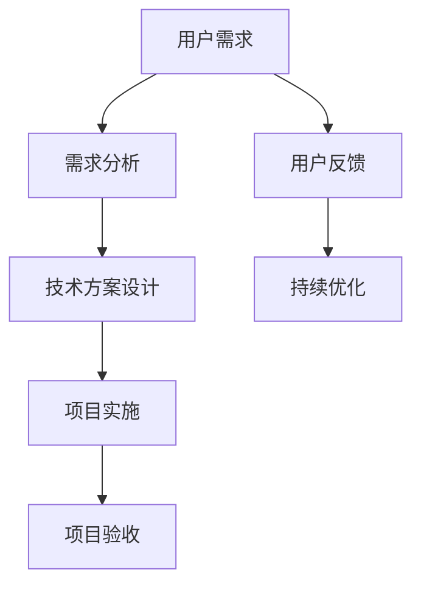

                 

### 《字节跳动2024校招技术用户需求分析师面试题集锦（含案例）》

#### 关键词：
- 字节跳动
- 校招
- 技术用户需求分析师
- 面试题集锦
- 实战案例

> 摘要：
本文章旨在为准备字节跳动2024校招技术用户需求分析师岗位的求职者提供一份详细的面试题集锦，包括技术基础知识、业务理解、用户需求分析以及编程实战等多个方面的内容。通过本文章的阅读和学习，求职者可以全面了解该岗位所需技能和面试题型，提高面试成功率。

----------------------------------------------------------------

### 《字节跳动2024校招技术用户需求分析师面试题集锦（含案例）》目录大纲

#### 第一部分：面试准备与基础知识

##### 第1章：技术用户需求分析师角色定位与职责

**1.1 技术用户需求分析师的职业概述**

**1.2 技术用户需求分析师的核心能力**

**1.3 技术用户需求分析师的职业发展路径**

**1.4 技术用户需求分析师的日常工作流程**

##### 第2章：技术基础

**2.1 数据结构与算法**

- **2.1.1 常见数据结构（数组、链表、栈、队列、树、图）**

- **2.1.2 算法复杂度分析（时间复杂度和空间复杂度）**

- **2.1.3 排序算法（冒泡、选择、插入、快速排序等）**

- **2.1.4 搜索算法（顺序、二分）**

**2.2 计算机网络**

- **2.2.1 网络协议（OSI七层模型、TCP/IP模型）**

- **2.2.2 网络设备（路由器、交换机、防火墙）**

- **2.2.3 网络故障排查**

**2.3 数据库**

- **2.3.1 关系型数据库（MySQL、Oracle）**

- **2.3.2 非关系型数据库（MongoDB、Redis）**

- **2.3.3 数据库索引、事务、锁**

##### 第3章：字节跳动核心业务与技术架构

**3.1 字节跳动业务概述**

**3.2 字节跳动技术架构**

- **3.2.1 大数据架构**

- **3.2.2 分布式系统**

- **3.2.3 容器化与Kubernetes**

- **3.2.4 AI与大数据的结合**

##### 第4章：用户需求分析与评估方法

**4.1 用户需求分析框架**

**4.2 用户行为分析**

- **4.2.1 用户行为数据收集**

- **4.2.2 用户画像构建**

- **4.2.3 用户行为预测**

**4.3 需求评估方法**

- **4.3.1 KPI设定与监控**

- **4.3.2 评估指标与模型**

##### 第二部分：面试题解析与实战案例

##### 第5章：编程题实战

**5.1 算法题目解析**

- **5.1.1 动态规划**

- **5.1.2 图算法**

- **5.1.3 字符串处理**

**5.2 实战案例解析**

##### 第6章：数据结构与算法面试题解析

**6.1 数据结构面试题解析**

**6.2 算法面试题解析**

##### 第7章：计算机网络与数据库面试题解析

**7.1 计算机网络面试题解析**

**7.2 数据库面试题解析**

##### 第8章：字节跳动常见面试题解析

**8.1 业务理解面试题**

**8.2 技术实现面试题**

**8.3 团队协作与沟通面试题**

##### 第9章：模拟面试与备考策略

**9.1 模拟面试**

**9.2 面试备考策略**

#### 附录

##### 附录A：面试准备资料与工具

**A.1 面试准备书籍推荐**

**A.2 面试准备网站和论坛**

**A.3 面试工具和软件**

##### 附录B：字节跳动招聘流程与注意事项

**B.1 招聘流程**

**B.2 面试技巧与注意事项**

### 第1章：技术用户需求分析师角色定位与职责

#### 1.1 技术用户需求分析师的职业概述

技术用户需求分析师是连接技术团队和业务团队的关键桥梁，其主要职责是深入理解业务需求，将用户需求转化为具体的技术解决方案，并确保这些解决方案能够满足业务目标和用户需求。

在字节跳动这样的互联网公司中，技术用户需求分析师的工作尤为重要。他们需要具备强大的业务敏感度和技术能力，能够迅速把握业务发展趋势，洞察用户需求，从而推动产品迭代和优化。

技术用户需求分析师的主要职责包括以下几个方面：

1. **需求收集与调研**：通过与业务团队的密切合作，深入理解业务目标和用户需求，收集和整理需求文档。

2. **需求分析**：对收集到的需求进行详细分析，确定需求的优先级和可行性，制定详细的解决方案。

3. **需求文档编写**：撰写清晰、准确的需求文档，确保技术团队对需求的全面理解。

4. **技术方案设计**：根据需求文档，设计具体的技术方案，包括系统架构、模块划分、技术选型等。

5. **项目管理**：与项目团队成员密切配合，确保项目按时按质完成，协调解决项目中的技术问题和业务需求。

6. **质量保证**：参与项目测试和验收，确保最终产品能够满足业务和用户需求。

7. **持续优化**：根据用户反馈和市场变化，对现有产品进行持续优化和改进。

#### 1.2 技术用户需求分析师的核心能力

技术用户需求分析师需要具备以下几方面的核心能力：

1. **业务理解能力**：能够快速了解业务背景，理解业务目标和用户需求，将业务需求转化为具体的技术需求。

2. **数据分析能力**：具备一定的数据分析能力，能够通过数据分析来挖掘用户需求，优化产品功能。

3. **技术知识储备**：掌握常用的数据结构与算法、计算机网络、数据库等基础技术知识，能够设计和实现复杂的技术方案。

4. **沟通与协作能力**：具备良好的沟通能力，能够与技术团队、业务团队和产品团队有效沟通，协调解决问题。

5. **项目管理能力**：能够有效地进行项目管理，确保项目按时按质完成。

#### 1.3 技术用户需求分析师的职业发展路径

技术用户需求分析师的职业发展路径通常可以分为以下几个阶段：

1. **初级分析师**：主要负责需求收集、需求分析和编写需求文档，逐渐熟悉业务和技术。

2. **中级分析师**：具备较强的业务理解能力和技术方案设计能力，能够独立负责项目的需求分析和方案设计。

3. **高级分析师**：具备丰富的项目经验和全局视野，能够从战略层面出发，指导项目规划和优化。

4. **技术经理**：具备项目管理能力和团队管理能力，负责团队建设和项目管理工作。

5. **技术总监**：具备深厚的技术背景和业务理解能力，负责公司的技术战略规划和技术创新。

#### 1.4 技术用户需求分析师的日常工作流程

技术用户需求分析师的日常工作流程通常包括以下几个步骤：

1. **需求收集**：通过与业务团队的沟通、市场调研、用户反馈等方式，收集业务需求。

2. **需求分析**：对收集到的需求进行详细分析，确定需求的优先级和可行性，制定解决方案。

3. **需求文档编写**：编写清晰、准确的需求文档，确保技术团队对需求有全面的理解。

4. **技术方案设计**：根据需求文档，设计具体的技术方案，包括系统架构、模块划分、技术选型等。

5. **项目跟进**：与项目团队成员密切配合，确保项目按时按质完成，协调解决项目中的技术问题和业务需求。

6. **质量保证**：参与项目测试和验收，确保最终产品能够满足业务和用户需求。

7. **持续优化**：根据用户反馈和市场变化，对现有产品进行持续优化和改进。

### 第2章：技术基础

技术基础是技术用户需求分析师的必备能力，本章将介绍数据结构与算法、计算机网络和数据库的基础知识，帮助读者更好地理解和应用这些技术。

#### 2.1 数据结构与算法

数据结构与算法是计算机科学的核心内容，掌握常见的数据结构和算法对于技术用户需求分析师至关重要。

##### 2.1.1 常见数据结构

常见的数据结构包括数组、链表、栈、队列、树和图等。

- **数组**：数组是一种线性数据结构，它允许快速随机访问元素。数组的缺点是它的长度是固定的，不能动态扩展。

- **链表**：链表是一种线性数据结构，由一系列节点组成，每个节点包含数据和指向下一个节点的指针。链表的优势在于它能够动态扩展。

- **栈**：栈是一种后进先出（LIFO）的数据结构，用于存储临时数据。栈的主要操作包括入栈、出栈和栈顶元素访问。

- **队列**：队列是一种先进先出（FIFO）的数据结构，用于存储按顺序处理的元素。队列的主要操作包括入队、出队和队首元素访问。

- **树**：树是一种层级数据结构，用于存储具有层次关系的元素。常见的树包括二叉树、平衡树、红黑树等。

- **图**：图是一种非层级数据结构，用于表示具有复杂关系的元素。图的主要操作包括节点添加、边添加、节点删除和边删除等。

##### 2.1.2 算法复杂度分析

算法复杂度分析是评估算法性能的重要手段，包括时间复杂度和空间复杂度。

- **时间复杂度**：时间复杂度表示算法执行所需时间的增长速度，通常用大O符号表示。例如，线性查找的时间复杂度为O(n)，二分查找的时间复杂度为O(log n)。

- **空间复杂度**：空间复杂度表示算法执行所需内存的增长速度，同样用大O符号表示。例如，数组的空间复杂度为O(n)，链表的空间复杂度为O(1)。

##### 2.1.3 排序算法

排序算法用于将一组无序数据转化为有序数据，常见的排序算法包括冒泡排序、选择排序、插入排序和快速排序等。

- **冒泡排序**：冒泡排序是一种简单的排序算法，通过不断交换相邻的未排序元素，直到所有元素有序。

- **选择排序**：选择排序是一种简单的排序算法，每次从未排序的部分选择最小的元素，放到已排序部分的末尾。

- **插入排序**：插入排序是一种简单的排序算法，通过将未排序的元素插入到已排序部分的适当位置，直到所有元素有序。

- **快速排序**：快速排序是一种高效的排序算法，通过递归地将数组划分为已排序部分和未排序部分，再分别对两部分进行排序。

##### 2.1.4 搜索算法

搜索算法用于在数据结构中查找特定元素，常见的搜索算法包括顺序搜索和二分搜索等。

- **顺序搜索**：顺序搜索是一种简单的搜索算法，逐个比较数据结构中的每个元素，直到找到目标元素或到达数据结构末尾。

- **二分搜索**：二分搜索是一种高效的搜索算法，基于有序数据结构，通过递归地将搜索范围分为一半，直到找到目标元素或确定目标元素不存在。

#### 2.2 计算机网络

计算机网络是连接计算机设备的通信系统，它使得计算机之间能够进行数据交换和通信。

##### 2.2.1 网络协议

网络协议是计算机网络中用于数据传输和通信的规则和标准。常见的网络协议包括OSI七层模型和TCP/IP模型。

- **OSI七层模型**：OSI七层模型将计算机网络划分为七层，包括物理层、数据链路层、网络层、传输层、会话层、表示层和应用层。

- **TCP/IP模型**：TCP/IP模型将计算机网络划分为四层，包括网络接口层、互联网层、传输层和应用层。

##### 2.2.2 网络设备

网络设备是计算机网络中的硬件设备，用于连接和传输数据。常见的网络设备包括路由器、交换机、防火墙等。

- **路由器**：路由器是计算机网络中的核心设备，用于将数据包从源地址转发到目标地址。

- **交换机**：交换机是计算机网络中的设备，用于在局域网内交换数据包。

- **防火墙**：防火墙是计算机网络中的设备，用于保护网络免受未授权访问和攻击。

##### 2.2.3 网络故障排查

网络故障排查是计算机网络维护过程中的一项重要任务，通过分析网络故障现象和排查故障原因，确保网络的稳定运行。

- **故障现象分析**：分析网络故障现象，确定故障的影响范围和程度。

- **故障原因排查**：根据故障现象，排查可能的故障原因，如硬件故障、软件故障、配置错误等。

- **故障解决**：针对故障原因，采取相应的解决措施，如更换硬件、修复软件、调整配置等。

#### 2.3 数据库

数据库是用于存储、管理和查询数据的系统，对于技术用户需求分析师来说，掌握数据库的基本知识至关重要。

##### 2.3.1 关系型数据库

关系型数据库是一种基于表格存储数据的数据库，它通过关系模型来描述数据之间的关联。常见的
```markdown
关系型数据库包括MySQL、Oracle等。

- **MySQL**：MySQL是一个开源的关系型数据库，广泛应用于Web应用、大数据等领域。
- **Oracle**：Oracle是一个商业关系型数据库，具有强大的数据管理能力和优化功能。

##### 2.3.2 非关系型数据库

非关系型数据库（NoSQL）是一种不同于关系型数据库的数据存储方案，它适用于大规模分布式系统和高并发的应用场景。常见的非关系型数据库包括MongoDB、Redis等。

- **MongoDB**：MongoDB是一个开源的文档数据库，它将数据存储为JSON格式，具有高扩展性和灵活性。
- **Redis**：Redis是一个开源的内存数据存储系统，适用于缓存、会话管理、实时消息处理等场景。

##### 2.3.3 数据库索引、事务、锁

数据库索引、事务和锁是数据库的核心概念，对于保证数据的一致性和高效性至关重要。

- **数据库索引**：数据库索引是用于加快数据查询的机制，它通过索引结构来存储数据表中的关键字。
- **事务**：事务是一组操作序列，它保证数据库的一致性和完整性。事务具有原子性、一致性、隔离性和持久性（ACID）特性。
- **锁**：锁是用于控制并发访问的一种机制，它通过锁定数据资源来避免数据冲突和竞态条件。

### 第3章：字节跳动核心业务与技术架构

#### 3.1 字节跳动业务概述

字节跳动是中国领先的互联网科技公司，旗下拥有多个知名产品，如抖音、今日头条、微博、懂车帝等。字节跳动的业务范围涵盖了新闻资讯、短视频、社交、短视频直播、汽车资讯等多个领域。

字节跳动的业务模式主要基于人工智能和大数据技术，通过对用户行为数据的分析，实现个性化推荐和内容分发，提高用户体验和用户粘性。字节跳动在短视频、社交和资讯等领域的创新和突破，使其成为互联网行业的重要力量。

#### 3.2 字节跳动技术架构

字节跳动技术架构具有分布式、容器化和大数据处理等特点，以满足大规模用户访问和海量数据存储的需求。

##### 3.2.1 大数据架构

字节跳动的大数据架构主要包括数据采集、数据处理、数据存储和数据可视化等环节。

- **数据采集**：通过数据采集系统，实时收集来自各种业务场景的数据，如用户行为数据、日志数据、业务数据等。
- **数据处理**：通过数据处理系统，对采集到的数据进行清洗、转换和聚合，为数据分析和挖掘提供基础数据。
- **数据存储**：通过分布式数据库和大数据存储系统，存储和处理海量数据，支持数据的高效访问和查询。
- **数据可视化**：通过数据可视化工具，将数据分析和挖掘结果以图形化形式展示，帮助业务团队和管理层更好地了解业务情况和数据趋势。

##### 3.2.2 分布式系统

分布式系统是字节跳动技术架构的核心组成部分，它通过将计算和存储资源分布到多个节点上，实现系统的高可用性和高性能。

- **分布式存储**：通过分布式文件系统（如HDFS）和分布式数据库（如HBase、Cassandra），实现海量数据的高效存储和管理。
- **分布式计算**：通过分布式计算框架（如MapReduce、Spark），实现大规模数据处理和分析。
- **分布式服务**：通过分布式服务架构（如微服务架构、服务网格），实现高并发、高可用的服务部署和管理。

##### 3.2.3 容器化与Kubernetes

容器化是字节跳动技术架构的重要发展方向，通过容器化技术，实现应用的高效部署和管理。

- **容器化技术**：通过容器（如Docker），将应用及其依赖环境打包到一个独立的运行时环境中，实现应用的无状态部署和分布式部署。
- **Kubernetes**：Kubernetes是一个开源的容器编排平台，用于自动化部署、扩展和管理容器化应用。字节跳动使用Kubernetes进行容器化应用的部署和管理，提高系统的可扩展性和可维护性。

##### 3.2.4 AI与大数据的结合

字节跳动将人工智能技术应用于大数据处理和分析，实现个性化推荐和智能决策。

- **AI技术**：字节跳动在自然语言处理、计算机视觉、语音识别等领域具备深厚的AI技术积累，通过AI技术实现图像识别、文本分类、语音识别等应用。
- **大数据分析**：通过对海量用户行为数据的分析，字节跳动能够洞察用户需求，实现个性化推荐和内容分发。

#### 3.3 字节跳动技术架构案例分析

以下是一个字节跳动技术架构案例分析，展示了其在实际应用中的架构设计和关键技术。

- **项目背景**：字节跳动在短视频领域推出一款名为“抖音”的应用，针对年轻用户群体，提供短视频拍摄、编辑和分享功能。
- **架构设计**：
  - **前端**：抖音的前端架构基于React框架，通过组件化开发和模块化设计，实现高效的开发和维护。
  - **后端**：抖音的后端架构采用微服务架构，将不同功能模块拆分为独立的微服务，如用户服务、视频服务、评论服务等，通过Kubernetes进行部署和管理。
  - **数据存储**：抖音的数据存储采用分布式数据库（如MongoDB、Redis）和分布式文件系统（如HDFS），实现海量数据的存储和管理。
  - **数据处理**：抖音采用Spark进行数据处理和数据分析，通过实时计算和离线计算，实现对用户行为的分析和推荐算法的优化。
- **关键技术**：
  - **容器化与Kubernetes**：抖音的前后端应用采用容器化技术进行部署和管理，通过Kubernetes实现应用的高可用性和可扩展性。
  - **AI与大数据结合**：抖音通过AI技术实现短视频内容的识别和分类，通过大数据分析实现个性化推荐和用户行为预测。

### 第4章：用户需求分析与评估方法

#### 4.1 用户需求分析框架

用户需求分析是技术用户需求分析师的重要任务之一，通过建立用户需求分析框架，可以系统地收集、分析和处理用户需求。

用户需求分析框架通常包括以下几个步骤：

1. **需求收集**：通过访谈、问卷调查、用户反馈等方式收集用户需求。
2. **需求分类**：将收集到的需求进行分类，如功能需求、性能需求、安全需求等。
3. **需求排序**：根据需求的紧急程度和优先级对需求进行排序，确定需求处理的优先级。
4. **需求分析**：对每个需求进行详细分析，确定需求的可行性、影响范围和实现方案。
5. **需求文档编写**：将分析结果整理成需求文档，明确需求的详细描述、实现方案和验收标准。

#### 4.2 用户行为分析

用户行为分析是用户需求分析的重要环节，通过对用户行为数据的收集、处理和分析，可以深入了解用户需求和行为习惯。

用户行为分析主要包括以下几个步骤：

1. **数据收集**：通过日志系统、用户行为跟踪工具等收集用户行为数据，如页面访问、点击、搜索等。
2. **数据处理**：对收集到的用户行为数据进行清洗、转换和聚合，为数据分析和挖掘提供基础数据。
3. **用户画像构建**：通过对用户行为数据的分析，构建用户画像，包括用户的基本信息、兴趣爱好、行为特征等。
4. **用户行为预测**：利用机器学习算法和统计模型，对用户行为进行预测，为产品优化和需求分析提供依据。

#### 4.3 需求评估方法

需求评估是确保需求实现可行性和有效性的重要环节，通过需求评估方法，可以评估需求的优先级、影响范围和实现成本。

需求评估方法主要包括以下几个方面：

1. **KPI设定与监控**：设定关键绩效指标（KPI），用于衡量需求实现的效果和业务价值，如用户活跃度、转化率、满意度等。通过监控KPI的实时数据，可以评估需求的影响和效果。
2. **评估指标与模型**：建立评估指标体系，包括质量指标、效率指标、成本指标等，用于评估需求的实现情况和业务价值。通过数据分析和模型预测，可以评估需求的影响和风险。
3. **成本效益分析**：通过成本效益分析，评估需求的实现成本和预期收益，确定需求的优先级和投资回报。

### 第5章：编程题实战

#### 5.1 算法题目解析

算法题目是面试中常见的一类题目，通过对算法题目的解析，可以加深对数据结构和算法的理解。

以下是一些常见的算法题目及其解析：

1. **动态规划**
   - **题目描述**：给定一个数组和两个整数m和n，找到数组中长度为m的最小子序列和，其中子序列和可以通过移除至多n个元素得到。
   - **解题思路**：使用动态规划方法，定义状态dp[i][j]表示从数组的前i个元素中删除j个元素后得到的最小子序列和。根据状态转移方程，计算dp[m][n]的值即为所求。
   - **伪代码**
     ```python
     function minSubsequenceSum(array, m, n):
         dp = 初始化数组
         for i from 1 to m:
             for j from 0 to n:
                 dp[i][j] = min(dp[i-1][j], dp[i-1][j-1] + array[i])
         return dp[m][n]
     ```

2. **图算法**
   - **题目描述**：给定一个无向图，判断图中是否存在一个路径，使得路径上的节点的度都不小于k。
   - **解题思路**：使用深度优先搜索（DFS）或广度优先搜索（BFS）算法，从某个节点开始遍历图，记录每个节点的度，如果路径上的所有节点的度都不小于k，则存在满足条件的路径。
   - **伪代码**
     ```python
     function existPath(graph, k):
         for node in graph:
             if node.degree >= k:
                 path = dfs(node)
                 if path is not None:
                     return True
         return False

     function dfs(node):
         if node is None:
             return None
         if node.degree < k:
             return None
         path = []
         for neighbor in node.neighbors:
             path.append(neighbor)
             result = dfs(neighbor)
             if result is not None:
                 return path + result
         return path
     ```

3. **字符串处理**
   - **题目描述**：给定一个字符串，判断它是否是回文串。
   - **解题思路**：使用双指针方法，从字符串的两端开始遍历，比较对应的字符是否相等，如果所有字符都相等，则字符串是回文串。
   - **伪代码**
     ```python
     function isPalindrome(s):
         left = 0
         right = length(s) - 1
         while left < right:
             if s[left] != s[right]:
                 return False
             left += 1
             right -= 1
         return True
     ```

#### 5.2 实战案例解析

以下是一个编程题实战案例，展示了如何使用Python实现一个简单的待办事项列表应用程序。

**案例描述**：实现一个待办事项列表应用程序，用户可以通过命令行输入待办事项，应用程序会将其添加到列表中。用户可以查看所有待办事项、标记已完成的任务，并删除指定任务。

**开发环境**：Python 3.x、命令行界面

**实现步骤**：

1. **需求分析**：
   - 功能1：添加待办事项
   - 功能2：查看所有待办事项
   - 功能3：标记已完成的任务
   - 功能4：删除指定任务

2. **数据结构设计**：
   - 使用列表存储待办事项，每个事项是一个字典，包含任务名称和状态（已完成/未完成）。

3. **实现代码**：

```python
todo_list = []

def add_todo(item):
    todo_list.append({"name": item, "completed": False})

def show_todos():
    for todo in todo_list:
        if todo["completed"]:
            print(f"[X] {todo['name']}")
        else:
            print(f"[ ] {todo['name']}")

def mark_as_completed(index):
    if 0 <= index < len(todo_list):
        todo_list[index]["completed"] = True

def delete_todo(index):
    if 0 <= index < len(todo_list):
        todo_list.pop(index)

def main():
    while True:
        print("\n待办事项列表")
        print("1. 添加事项")
        print("2. 查看事项")
        print("3. 标记已完成")
        print("4. 删除事项")
        print("5. 退出")
        choice = input("请选择操作：")

        if choice == "1":
            item = input("请输入待办事项：")
            add_todo(item)
        elif choice == "2":
            show_todos()
        elif choice == "3":
            index = int(input("请输入待办事项的序号："))
            mark_as_completed(index)
        elif choice == "4":
            index = int(input("请输入待办事项的序号："))
            delete_todo(index)
        elif choice == "5":
            break
        else:
            print("无效的输入，请重新输入。")

if __name__ == "__main__":
    main()
```

**代码解读与分析**：

- **数据结构设计**：使用列表`todo_list`存储待办事项，每个事项是一个字典，包含任务名称和状态。
- **功能实现**：
  - `add_todo(item)`：添加待办事项到列表中。
  - `show_todos()`：遍历列表，根据任务状态显示待办事项。
  - `mark_as_completed(index)`：根据索引标记任务为已完成。
  - `delete_todo(index)`：根据索引删除任务。
- **主函数`main()`**：提供命令行界面，根据用户输入执行相应的功能。

### 第6章：数据结构与算法面试题解析

#### 6.1 数据结构面试题解析

数据结构面试题是面试中的常见题型，以下是一些常见的数据结构面试题及其解析。

1. **链表**

   - **题目描述**：实现一个单链表，包括插入、删除、查找和遍历等功能。
   - **解析**：单链表是一种线性数据结构，每个节点包含数据和指向下一个节点的指针。实现单链表需要定义节点类和链表类，并实现相应的操作方法。

2. **栈**

   - **题目描述**：实现一个栈，包括入栈、出栈、 peek 和判断栈空等功能。
   - **解析**：栈是一种后进先出的数据结构，可以使用数组或链表实现。实现栈需要定义栈顶指针和栈底指针，并实现入栈、出栈、 peek 和判断栈空等操作。

3. **队列**

   - **题目描述**：实现一个队列，包括入队、出队、 peek 和判断队列空等功能。
   - **解析**：队列是一种先进先出的数据结构，可以使用数组或链表实现。实现队列需要定义队头指针和队尾指针，并实现入队、出队、 peek 和判断队列空等操作。

4. **树**

   - **题目描述**：实现一个二叉树，包括创建节点、插入节点、删除节点、遍历等功能。
   - **解析**：二叉树是一种树形数据结构，每个节点最多有两个子节点。实现二叉树需要定义节点类和树类，并实现创建节点、插入节点、删除节点、遍历等操作。

5. **图**

   - **题目描述**：实现一个图，包括创建节点、添加边、删除节点、删除边、遍历等功能。
   - **解析**：图是一种复杂的数据结构，用于表示多个实体之间的复杂关系。实现图需要定义节点类和图类，并实现创建节点、添加边、删除节点、删除边、遍历等操作。

#### 6.2 算法面试题解析

算法面试题是面试中的另一类常见题型，以下是一些常见的算法面试题及其解析。

1. **排序算法**

   - **题目描述**：实现冒泡排序、选择排序、插入排序、快速排序等排序算法。
   - **解析**：排序算法用于将一组无序数据转化为有序数据。常见的排序算法包括冒泡排序、选择排序、插入排序、快速排序等。每种排序算法的实现方式不同，但核心思想都是通过比较和交换元素位置来实现排序。

2. **查找算法**

   - **题目描述**：实现二分查找、顺序查找等查找算法。
   - **解析**：查找算法用于在数据结构中查找特定元素。常见的查找算法包括顺序查找和二分查找。顺序查找是逐个比较元素，直到找到目标元素或到达数据结构末尾。二分查找是基于有序数据结构，通过递归地将搜索范围分为一半，直到找到目标元素或确定目标元素不存在。

3. **动态规划**

   - **题目描述**：实现一个动态规划算法，解决最短路径、最长子序列等优化问题。
   - **解析**：动态规划是一种优化算法，通过将复杂问题分解为子问题并保存子问题的解，从而避免重复计算。动态规划算法的核心是状态转移方程，通过状态转移方程递推得到最终结果。

4. **图算法**

   - **题目描述**：实现深度优先搜索（DFS）和广度优先搜索（BFS）算法，解决图的遍历问题。
   - **解析**：图是一种复杂的数据结构，用于表示多个实体之间的复杂关系。深度优先搜索和广度优先搜索是两种常见的图遍历算法。深度优先搜索从某个节点开始，不断深入探索相邻节点，直到找到目标节点或所有节点都被访问。广度优先搜索从某个节点开始，逐层访问相邻节点，直到找到目标节点或所有节点都被访问。

### 第7章：计算机网络与数据库面试题解析

#### 7.1 计算机网络面试题解析

计算机网络是计算机科学中的重要分支，以下是一些常见的计算机网络面试题及其解析。

1. **网络协议**

   - **题目描述**：简述TCP/IP协议的层次结构，并解释各层的主要功能。
   - **解析**：TCP/IP协议是计算机网络通信的基础协议，分为四层：网络接口层、互联网层、传输层和应用层。网络接口层负责物理传输和网络设备之间的通信；互联网层负责路由和转发；传输层负责端到端的可靠传输；应用层负责提供各种网络应用服务。

2. **网络设备**

   - **题目描述**：解释路由器、交换机和防火墙的作用和工作原理。
   - **解析**：路由器是网络中的核心设备，用于将数据包从源地址转发到目标地址；交换机是网络中用于连接设备的重要设备，用于在局域网内交换数据包；防火墙是网络安全的重要设备，用于保护网络免受未授权访问和攻击。

3. **网络故障排查**

   - **题目描述**：描述网络故障排查的一般流程和常用工具。
   - **解析**：网络故障排查的一般流程包括：故障现象分析、故障原因排查、故障解决和故障验证。常用的故障排查工具包括网络诊断工具（如ping、traceroute）、网络流量分析工具（如Wireshark）和系统监控工具（如Nagios）。

#### 7.2 数据库面试题解析

数据库是用于存储和管理数据的重要系统，以下是一些常见的数据库面试题及其解析。

1. **关系型数据库**

   - **题目描述**：简述关系型数据库的体系结构和基本概念，如表、行、列、索引等。
   - **解析**：关系型数据库采用关系模型来组织数据，数据存储在表中，表由行和列组成。行表示一条记录，列表示一个字段。索引是数据库中的数据结构，用于加快数据查询速度。

2. **非关系型数据库**

   - **题目描述**：解释非关系型数据库（NoSQL）的基本概念和适用场景。
   - **解析**：非关系型数据库（NoSQL）是一种不同于关系型数据库的数据存储方案，适用于大规模分布式系统和高并发的应用场景。常见的NoSQL数据库包括MongoDB、Redis等，它们具有高扩展性、灵活性和高性能的特点。

3. **数据库索引**

   - **题目描述**：解释数据库索引的工作原理和优缺点。
   - **解析**：数据库索引是一种用于加快数据查询的机制，它通过索引结构来存储数据表中的关键字。索引的优缺点包括：优点：加快数据查询速度；缺点：占用额外的存储空间，对数据更新操作（如插入、删除和修改）有一定性能影响。

4. **数据库事务**

   - **题目描述**：解释数据库事务的概念和特性，如原子性、一致性、隔离性和持久性（ACID）。
   - **解析**：数据库事务是一组操作序列，它保证数据库的一致性和完整性。事务具有原子性、一致性、隔离性和持久性（ACID）特性。原子性确保事务中的所有操作要么全部执行，要么全部回滚；一致性确保事务执行后数据库状态满足一致性约束；隔离性确保并发执行的事务不会相互干扰；持久性确保事务一旦提交，其对数据库的修改将永久保存。

### 第8章：字节跳动常见面试题解析

#### 8.1 业务理解面试题

业务理解面试题旨在考察应聘者对字节跳动业务的理解和思考能力。以下是一些常见的业务理解面试题及其解析。

1. **字节跳动的主要业务有哪些？**

   - **解析**：字节跳动的主要业务包括短视频（如抖音、TikTok）、新闻资讯（如今日头条、懂车帝）、社交（如微博）、短视频直播等。每个业务都有其独特的用户群体和盈利模式。

2. **字节跳动的竞争优势是什么？**

   - **解析**：字节跳动的竞争优势主要体现在以下几个方面：
     - 人工智能技术：通过大数据和人工智能技术实现个性化推荐，提高用户体验和用户粘性。
     - 产品创新：不断推出新的产品和服务，满足不同用户群体的需求。
     - 扩张战略：通过海外市场扩张，提升品牌影响力和市场份额。

3. **字节跳动的企业文化是什么？**

   - **解析**：字节跳动的企业文化可以概括为“开放、创新、务实、高效”。公司鼓励员工自由表达意见、积极探索新思路，同时也强调实际成果和高效执行。

#### 8.2 技术实现面试题

技术实现面试题旨在考察应聘者对技术原理和实现细节的掌握程度。以下是一些常见的技术实现面试题及其解析。

1. **请解释TCP/IP协议的工作原理。**

   - **解析**：TCP/IP协议是一种互联网协议，用于计算机网络中的数据传输。它分为四层：网络接口层、互联网层、传输层和应用层。网络接口层负责物理传输；互联网层负责路由和转发；传输层负责端到端的可靠传输；应用层提供各种网络应用服务。

2. **请描述数据库事务的ACID特性。**

   - **解析**：数据库事务的ACID特性是指：
     - 原子性（Atomicity）：事务中的所有操作要么全部执行，要么全部回滚。
     - 一致性（Consistency）：事务执行后数据库状态应满足一致性约束。
     - 隔离性（Isolation）：并发执行的事务不会相互干扰。
     - 持久性（Durability）：事务一旦提交，其对数据库的修改将永久保存。

3. **请解释分布式系统的基本概念和挑战。**

   - **解析**：分布式系统是指由多个节点组成的计算机系统，这些节点通过网络进行通信和协同工作。分布式系统的基本概念包括：
     - 节点：计算机系统中的单个计算机。
     - 资源：节点上的存储、计算和通信资源。
     - 分布式算法：用于协调节点之间通信和任务分配的算法。

   分布式系统面临的挑战包括：
     - 数据一致性：如何保证多个节点上的数据保持一致。
     - 负载均衡：如何平衡节点之间的工作负载。
     - 容错性：如何在节点故障时保证系统的可用性。

#### 8.3 团队协作与沟通面试题

团队协作与沟通面试题旨在考察应聘者的人际交往能力和团队协作能力。以下是一些常见的团队协作与沟通面试题及其解析。

1. **请描述一次你在团队中成功合作的经历。**

   - **解析**：在回答此类问题时，可以描述一次具体的团队合作经历，包括以下要点：
     - 团队目标：描述团队的共同目标和任务。
     - 个人角色：描述自己在团队中的角色和贡献。
     - 团队协作：描述如何与团队成员协作、沟通和解决问题。

2. **请描述一次你在团队中遇到的冲突，以及你是如何解决的。**

   - **解析**：在回答此类问题时，可以描述一次具体的团队冲突经历，包括以下要点：
     - 冲突原因：描述冲突的原因，如意见分歧、任务分配不均等。
     - 解决过程：描述你采取的解决冲突的措施和过程。
     - 解决结果：描述冲突解决后的结果和团队的改进。

3. **请谈谈你在团队合作中遇到的最大挑战，以及你是如何克服的。**

   - **解析**：在回答此类问题时，可以描述一次具体的团队合作中的挑战，包括以下要点：
     - 挑战描述：描述团队遇到的挑战，如任务复杂、时间紧迫等。
     - 解决措施：描述你采取的解决挑战的措施和方法。
     - 挑战结果：描述挑战解决后的结果和团队的改进。

### 第9章：模拟面试与备考策略

#### 9.1 模拟面试

模拟面试是面试备考的重要环节，通过模拟真实面试场景，可以帮助应聘者熟悉面试流程，提高面试技巧。以下是一个模拟面试的示例：

**面试官**：你好，欢迎参加字节跳动2024校招技术用户需求分析师岗位的面试。首先，请你自我介绍一下。

**应聘者**：你好，我是一名计算机科学专业的毕业生，对数据分析和需求分析有着浓厚的兴趣。在校期间，我参与了多个项目，其中最让我印象深刻的是我们团队开发的一款在线教育平台。在项目中，我负责了用户需求收集和分析工作，通过与教师和学生的沟通，准确理解了他们的需求，并设计出符合实际需求的功能模块。此外，我还具备良好的沟通能力和团队协作精神，能够快速融入团队并发挥自己的优势。

**面试官**：非常好，接下来请你描述一下技术用户需求分析师的角色和职责。

**应聘者**：技术用户需求分析师是连接技术团队和业务团队的关键桥梁。主要职责包括：深入理解业务需求，将用户需求转化为具体的技术解决方案；编写清晰、准确的需求文档，确保技术团队能够准确理解需求；与技术团队紧密合作，确保项目按时按质完成；根据用户反馈和市场变化，对现有产品进行持续优化和改进。

**面试官**：很好，请举例说明你如何进行用户需求分析。

**应聘者**：在进行用户需求分析时，我会遵循以下步骤：

1. **需求收集**：通过与用户面对面访谈、问卷调查、用户行为数据分析等方式，收集用户的需求和意见。
2. **需求分类**：将收集到的需求进行分类，如功能需求、性能需求、安全需求等。
3. **需求分析**：对每个需求进行详细分析，确定需求的优先级和可行性，并与业务团队和技术团队进行沟通，确保需求的准确理解和实现。
4. **需求文档编写**：将分析结果整理成需求文档，明确需求的详细描述、实现方案和验收标准，以便技术团队参考。

**面试官**：谢谢，最后一个问题，请你谈谈你对字节跳动业务的理解，以及为什么对这个岗位感兴趣。

**应聘者**：字节跳动是一家在互联网领域极具创新力和影响力的公司，旗下拥有多个知名产品，如抖音、今日头条、微博等。我对字节跳动的业务模式非常感兴趣，尤其是基于人工智能和大数据技术的个性化推荐和内容分发。我认为技术用户需求分析师在字节跳动的工作非常具有挑战性和意义，能够帮助公司更好地理解用户需求，优化产品功能，提高用户体验和满意度。因此，我对这个岗位充满热情，希望能够加入字节跳动，为公司的发展贡献自己的力量。

#### 9.2 面试备考策略

为了提高面试成功率，应聘者可以采取以下备考策略：

1. **了解公司和岗位**：在面试前，详细了解字节跳动的业务、文化和发展战略，尤其是应聘的岗位要求和工作内容。

2. **回顾简历**：仔细回顾简历上的每一项经历和技能，确保对每一项内容都有深刻的理解和掌握。

3. **模拟面试**：寻找朋友或同事进行模拟面试，提前熟悉面试流程和回答常见问题。

4. **学习常见面试题**：针对技术、业务、团队协作等方面的常见面试题进行针对性学习和练习。

5. **准备案例**：准备好实际项目或工作经验的案例，展示自己的能力和解决问题的能力。

6. **提升沟通能力**：面试中，良好的沟通能力至关重要，注意表达清晰、有条理。

7. **穿着得体**：面试当天穿着得体，展示专业形象。

8. **时间管理**：合理安排面试时间，确保在面试前有充足的准备时间。

### 附录

#### 附录A：面试准备资料与工具

1. **面试准备书籍推荐**
   - 《算法导论》
   - 《计算机网络：自顶向下方法》
   - 《数据库系统概念》
   - 《Python数据科学 Handbook》

2. **面试准备网站和论坛**
   - LeetCode
   - HackerRank
   - GitHub
   - CSDN
   - Stack Overflow

3. **面试工具和软件**
   - VSCode
   - PyCharm
   - Jupyter Notebook
   - Git

#### 附录B：字节跳动招聘流程与注意事项

1. **招聘流程**
   - 简历筛选
   - 电话/视频面试
   - 技术面试（在线编程/系统设计）
   - 综合面试（业务/团队/文化）
   - Offer发送

2. **面试技巧与注意事项**
   - 准备充分，对简历上的每一项经历都要熟悉。
   - 熟悉字节跳动业务和文化。
   - 准备常见面试题的回答。
   - 表现良好的沟通能力和团队合作精神。
   - 了解面试流程，合理安排时间。

### 作者信息

**作者：AI天才研究院/AI Genius Institute & 禅与计算机程序设计艺术 /Zen And The Art of Computer Programming** 

### 总结

本文详细介绍了《字节跳动2024校招技术用户需求分析师面试题集锦（含案例）》的内容和结构，包括面试准备与基础知识、用户需求分析与评估方法、编程题实战、计算机网络与数据库面试题解析、字节跳动常见面试题解析、模拟面试与备考策略等内容。通过本文的学习，读者可以全面了解技术用户需求分析师的角色和职责，掌握技术基础、用户需求分析方法和编程实战技巧，提高面试成功率。同时，本文附录部分提供了面试准备资料与工具、字节跳动招聘流程与注意事项等实用信息，帮助读者更好地备战面试。希望本文对即将参加字节跳动校招的求职者有所帮助。  
```markdown
### 第1章：技术用户需求分析师角色定位与职责

#### 1.1 技术用户需求分析师的职业概述

技术用户需求分析师（Technical User Requirements Analyst）是连接技术团队和业务团队的重要角色。他们负责将用户的需求转化为技术实现，确保技术解决方案符合业务目标和用户需求。在字节跳动这样的高科技公司中，技术用户需求分析师的角色尤为关键，因为他们不仅需要深入理解技术，还必须具备强大的业务洞察力和沟通能力。

**角色职责包括：**

- **需求收集与分析**：与技术团队、产品经理和用户进行沟通，收集和分析用户需求，确保需求准确无误地转化为技术需求。
- **需求文档编写**：编写清晰、详细的需求文档，为技术团队提供明确的指导。
- **技术方案设计**：基于用户需求，设计可行的技术解决方案，包括系统架构、模块划分和接口设计。
- **项目管理**：协调项目进度，确保项目按时交付，并解决项目中的技术难题。
- **测试与验收**：参与产品的测试和验收，确保产品满足用户需求。

#### 1.2 技术用户需求分析师的核心能力

要成为一名优秀的技术用户需求分析师，以下核心能力是必不可少的：

- **业务理解能力**：能够快速掌握业务逻辑，理解业务目标和用户需求。
- **技术知识储备**：熟悉常用的数据结构与算法、计算机网络、数据库等基础知识。
- **需求分析能力**：能够通过用户调研、访谈和数据分析等方法，准确理解并分析用户需求。
- **沟通与协作能力**：具备良好的沟通技巧，能够与技术团队、产品团队和业务团队有效协作。
- **项目管理能力**：能够制定合理的项目计划，监控项目进度，确保项目顺利完成。
- **数据分析能力**：能够使用数据分析工具进行用户行为分析，为产品优化提供数据支持。

#### 1.3 技术用户需求分析师的职业发展路径

技术用户需求分析师的职业发展路径通常包括以下几个阶段：

- **初级分析师**：主要负责收集和整理用户需求，编写需求文档，参与项目需求分析。
- **中级分析师**：能够独立负责项目需求分析和技术方案设计，具备一定的项目管理能力。
- **高级分析师**：具备丰富的项目经验，能够从战略角度出发，指导项目规划和优化。
- **技术经理**：负责团队管理和项目执行，具备全面的业务和技术视野。

#### 1.4 技术用户需求分析师的日常工作流程

技术用户需求分析师的日常工作流程通常包括以下几个环节：

1. **需求收集**：通过与用户、产品经理和业务团队沟通，收集用户需求。
2. **需求分析**：对收集到的需求进行分析，确定需求的优先级和可行性。
3. **需求文档编写**：编写详细的需求文档，包括功能需求、性能需求和界面需求等。
4. **技术方案设计**：根据需求文档，设计技术解决方案，包括系统架构、模块划分和接口设计。
5. **项目跟进**：与项目团队成员密切配合，确保项目按计划推进，解决项目中的技术难题。
6. **测试与验收**：参与产品测试，确保产品满足用户需求，并进行验收。
7. **持续优化**：根据用户反馈和市场变化，对现有产品进行持续优化和改进。

### 第2章：技术基础

技术基础是技术用户需求分析师的基石，本章将介绍数据结构与算法、计算机网络和数据库的基础知识，帮助读者更好地理解和应用这些技术。

#### 2.1 数据结构与算法

数据结构是计算机存储、组织数据的方式，而算法是对数据进行操作的方法。掌握常见的数据结构与算法对技术用户需求分析师至关重要。

##### 2.1.1 常见数据结构

以下是一些常见的数据结构：

- **数组（Array）**：一种线性数据结构，用于存储一系列元素。数组提供了快速的随机访问能力。
- **链表（Linked List）**：由一系列节点组成，每个节点包含数据和指向下一个节点的指针。链表支持动态扩展。
- **栈（Stack）**：一种后进先出（LIFO）的数据结构，常用于暂存数据。
- **队列（Queue）**：一种先进先出（FIFO）的数据结构，常用于处理排队任务。
- **树（Tree）**：一种层次数据结构，用于表示具有层级关系的元素。常见的树包括二叉树、红黑树等。
- **图（Graph）**：一种非线性数据结构，用于表示多个实体之间的复杂关系。图由节点和边组成。

##### 2.1.2 算法复杂度分析

算法复杂度分析是评估算法性能的重要方法。主要包括时间复杂度和空间复杂度。

- **时间复杂度（Time Complexity）**：表示算法执行所需时间的增长速度。常用大O符号表示，如O(n)，表示线性时间复杂度。
- **空间复杂度（Space Complexity）**：表示算法执行所需内存的增长速度。同样用大O符号表示，如O(1)，表示常数空间复杂度。

##### 2.1.3 排序算法

排序算法用于将一组无序数据转化为有序数据。以下是一些常见的排序算法：

- **冒泡排序（Bubble Sort）**：通过不断交换相邻的未排序元素，直到所有元素有序。
- **选择排序（Selection Sort）**：每次从未排序的部分选择最小的元素，放到已排序部分的末尾。
- **插入排序（Insertion Sort）**：将未排序的元素插入到已排序部分的适当位置，直到所有元素有序。
- **快速排序（Quick Sort）**：通过递归地将数组划分为已排序部分和未排序部分，再分别对两部分进行排序。

##### 2.1.4 搜索算法

搜索算法用于在数据结构中查找特定元素。以下是一些常见的搜索算法：

- **顺序搜索（Linear Search）**：逐个比较数据结构中的每个元素，直到找到目标元素或到达数据结构末尾。
- **二分搜索（Binary Search）**：基于有序数据结构，通过递归地将搜索范围分为一半，直到找到目标元素或确定目标元素不存在。

#### 2.2 计算机网络

计算机网络是连接多台计算机以实现数据通信的体系结构。以下是一些计算机网络的基础知识：

##### 2.2.1 网络协议

网络协议是计算机网络中用于数据传输和通信的规则和标准。以下是一些常见的网络协议：

- **TCP/IP协议**：互联网协议，分为四层：网络接口层、互联网层、传输层和应用层。
- **HTTP协议**：用于在Web浏览器和服务器之间传输数据的协议。
- **HTTPS协议**：基于HTTP协议，通过SSL/TLS加密传输数据的协议。

##### 2.2.2 网络设备

网络设备是计算机网络中的硬件设备，用于连接和传输数据。以下是一些常见的网络设备：

- **路由器（Router）**：用于将数据包从源地址转发到目标地址。
- **交换机（Switch）**：用于在局域网内交换数据包。
- **防火墙（Firewall）**：用于保护网络免受未授权访问和攻击。

##### 2.2.3 网络故障排查

网络故障排查是确保网络正常运行的重要环节。以下是一些常见的网络故障排查步骤：

1. **故障现象分析**：确定故障的影响范围和程度。
2. **故障原因排查**：根据故障现象，排查可能的故障原因，如硬件故障、软件故障、配置错误等。
3. **故障解决**：采取相应的解决措施，如更换硬件、修复软件、调整配置等。
4. **故障验证**：确保故障已解决，并验证网络正常运行。

#### 2.3 数据库

数据库是用于存储、管理和查询数据的系统。以下是一些数据库的基础知识：

##### 2.3.1 关系型数据库

关系型数据库采用关系模型组织数据。以下是一些常见的关系型数据库：

- **MySQL**：开源的关系型数据库，广泛用于Web应用。
- **Oracle**：商业关系型数据库，提供强大的数据管理能力。

##### 2.3.2 非关系型数据库

非关系型数据库（NoSQL）适用于大规模分布式系统和高并发的应用场景。以下是一些常见的非关系型数据库：

- **MongoDB**：文档型数据库，用于存储JSON格式的数据。
- **Redis**：键值存储数据库，常用于缓存和实时消息处理。

##### 2.3.3 数据库索引、事务、锁

数据库索引、事务和锁是数据库的核心概念。

- **数据库索引**：用于加快数据查询的机制，通过索引结构存储数据表中的关键字。
- **事务**：一组操作序列，保证数据库的一致性和完整性。事务具有原子性、一致性、隔离性和持久性（ACID）特性。
- **锁**：用于控制并发访问的一种机制，通过锁定数据资源来避免数据冲突和竞态条件。

### 第3章：字节跳动核心业务与技术架构

#### 3.1 字节跳动业务概述

字节跳动是中国领先的互联网科技公司，旗下拥有多个知名产品，如抖音、今日头条、微博、懂车帝等。字节跳动的业务范围涵盖了新闻资讯、短视频、社交、短视频直播、汽车资讯等多个领域。

**核心产品**：

- **抖音**：一款短视频分享应用程序，用户可以通过短视频记录和分享生活。
- **今日头条**：一款新闻资讯应用程序，通过个性化推荐算法为用户提供定制化的新闻内容。
- **微博**：一款社交网络应用程序，用户可以发布微博、关注朋友并查看他们的动态。
- **懂车帝**：一款汽车资讯和评测应用程序，为用户提供购车指导和汽车知识。

**业务模式**：

字节跳动的业务模式基于人工智能和大数据技术，通过对用户行为数据的分析，实现个性化推荐和内容分发。通过不断优化算法和数据分析，提升用户体验和用户粘性。

#### 3.2 字节跳动技术架构

字节跳动技术架构具有分布式、容器化和大数据处理等特点，以满足大规模用户访问和海量数据存储的需求。

**技术架构核心**：

- **大数据架构**：包括数据采集、数据处理、数据存储和数据可视化等环节。通过分布式文件系统（如HDFS）和分布式数据库（如HBase、Cassandra），实现海量数据的高效存储和管理。
- **分布式系统**：通过分布式存储和计算，实现系统的高可用性和高性能。使用分布式计算框架（如MapReduce、Spark），支持大规模数据处理和分析。
- **容器化与Kubernetes**：采用容器化技术（如Docker）和Kubernetes进行应用部署和管理，提高系统的可扩展性和可维护性。
- **AI与大数据结合**：将人工智能技术应用于大数据处理和分析，实现个性化推荐和智能决策。

**技术架构案例分析**：

以下是一个字节跳动技术架构案例分析，展示了其在实际应用中的架构设计和关键技术。

**案例背景**：字节跳动在其短视频产品抖音中，为了提供高效的内容分发和个性化推荐，采用了分布式系统和大数据处理技术。

**架构设计**：

- **前端**：使用React框架实现前端功能，通过组件化和模块化设计提高开发效率。
- **后端**：采用微服务架构，将不同功能模块拆分为独立的微服务，如用户服务、视频服务、推荐服务等。通过Kubernetes进行部署和管理。
- **数据存储**：使用分布式数据库（如MongoDB、Redis）和分布式文件系统（如HDFS），实现海量数据的高效存储和管理。
- **数据处理**：使用分布式计算框架（如Spark），对用户行为数据进行实时计算和分析。

**关键技术**：

- **容器化与Kubernetes**：使用Docker进行容器化部署，通过Kubernetes进行容器编排和管理，提高系统的可扩展性和可维护性。
- **大数据处理**：使用Spark进行大规模数据处理和分析，实现实时计算和离线计算，为个性化推荐提供支持。
- **AI技术**：使用深度学习算法和推荐系统技术，对用户行为数据进行建模和预测，实现个性化推荐。

### 第4章：用户需求分析与评估方法

#### 4.1 用户需求分析框架

用户需求分析是技术用户需求分析师的重要任务，通过建立用户需求分析框架，可以系统地收集、分析和处理用户需求。以下是一个典型的用户需求分析框架：

1. **需求收集**：通过访谈、问卷调查、用户反馈等方式收集用户需求。
2. **需求分类**：将收集到的需求进行分类，如功能需求、性能需求、安全需求等。
3. **需求排序**：根据需求的紧急程度和优先级对需求进行排序。
4. **需求分析**：对每个需求进行详细分析，确定需求的可行性、影响范围和实现方案。
5. **需求文档编写**：将分析结果整理成需求文档，明确需求的详细描述、实现方案和验收标准。

#### 4.2 用户行为分析

用户行为分析是用户需求分析的重要环节，通过对用户行为数据的收集、处理和分析，可以深入了解用户需求和行为习惯。以下是一个用户行为分析的步骤：

1. **数据收集**：通过日志系统、用户行为跟踪工具等收集用户行为数据，如页面访问、点击、搜索等。
2. **数据处理**：对收集到的用户行为数据进行清洗、转换和聚合，为数据分析和挖掘提供基础数据。
3. **用户画像构建**：通过对用户行为数据的分析，构建用户画像，包括用户的基本信息、兴趣爱好、行为特征等。
4. **用户行为预测**：利用机器学习算法和统计模型，对用户行为进行预测，为产品优化和需求分析提供依据。

#### 4.3 需求评估方法

需求评估是确保需求实现可行性和有效性的重要环节，通过需求评估方法，可以评估需求的优先级、影响范围和实现成本。以下是一个需求评估的方法：

1. **KPI设定与监控**：设定关键绩效指标（KPI），用于衡量需求实现的效果和业务价值，如用户活跃度、转化率、满意度等。
2. **评估指标与模型**：建立评估指标体系，包括质量指标、效率指标、成本指标等，用于评估需求的实现情况和业务价值。
3. **成本效益分析**：通过成本效益分析，评估需求的实现成本和预期收益，确定需求的优先级和投资回报。

### 第5章：编程题实战

#### 5.1 算法题目解析

算法题目是面试中的常见题型，以下是一些常见的算法题目及其解析：

1. **动态规划**

   **题目描述**：给定一个整数数组，找出最长连续递增子序列的长度。

   **解题思路**：使用动态规划方法，定义状态dp[i]表示以第i个元素为结尾的最长连续递增子序列的长度。状态转移方程为dp[i] = max(dp[i-1], dp[i-2]) + 1，其中dp[i-1]和dp[i-2]分别表示以第i-1个和第i-2个元素为结尾的最长连续递增子序列的长度。

   **伪代码**
   ```python
   function longestIncreasingSubsequence(nums):
       dp = [1 for _ in range(len(nums))]
       for i from 1 to len(nums):
           for j from 0 to i-1:
               if nums[i] > nums[j]:
                   dp[i] = max(dp[i], dp[j] + 1)
       return max(dp)
   ```

2. **图算法**

   **题目描述**：给定一个无向图和两个节点，判断是否存在一条路径，连接这两个节点。

   **解题思路**：使用深度优先搜索（DFS）或广度优先搜索（BFS）算法，从起始节点开始遍历图，记录每个节点的访问状态，直到找到目标节点或遍历所有节点。

   **伪代码**
   ```python
   function existPath(graph, start, end):
       visited = set()
       path = dfs(graph, start, end, visited)
       if path is not None:
           return True
       return False

   function dfs(graph, node, end, visited):
       if node == end:
           return [node]
       if node in visited:
           return None
       visited.add(node)
       for neighbor in graph[node]:
           result = dfs(graph, neighbor, end, visited)
           if result is not None:
               return [node] + result
       return None
   ```

3. **字符串处理**

   **题目描述**：给定一个字符串，判断它是否是回文串。

   **解题思路**：使用双指针方法，从字符串的两端开始遍历，比较对应的字符是否相等，如果所有字符都相等，则字符串是回文串。

   **伪代码**
   ```python
   function isPalindrome(s):
       left = 0
       right = len(s) - 1
       while left < right:
           if s[left] != s[right]:
               return False
           left += 1
           right -= 1
       return True
   ```

#### 5.2 实战案例解析

以下是一个编程题实战案例，展示了如何使用Python实现一个简单的待办事项列表应用程序。

**案例描述**：实现一个待办事项列表应用程序，用户可以通过命令行输入待办事项，应用程序会将其添加到列表中。用户可以查看所有待办事项、标记已完成的任务，并删除指定任务。

**开发环境**：Python 3.x、命令行界面

**实现步骤**：

1. **需求分析**：
   - 功能1：添加待办事项
   - 功能2：查看所有待办事项
   - 功能3：标记已完成的任务
   - 功能4：删除指定任务

2. **数据结构设计**：
   - 使用列表存储待办事项，每个事项是一个字典，包含任务名称和状态（已完成/未完成）。

3. **实现代码**：

```python
todo_list = []

def add_todo(item):
    todo_list.append({"name": item, "completed": False})

def show_todos():
    for todo in todo_list:
        if todo["completed"]:
            print(f"[X] {todo['name']}")
        else:
            print(f"[ ] {todo['name']}")

def mark_as_completed(index):
    if 0 <= index < len(todo_list):
        todo_list[index]["completed"] = True

def delete_todo(index):
    if 0 <= index < len(todo_list):
        todo_list.pop(index)

def main():
    while True:
        print("\n待办事项列表")
        print("1. 添加事项")
        print("2. 查看事项")
        print("3. 标记已完成")
        print("4. 删除事项")
        print("5. 退出")
        choice = input("请选择操作：")

        if choice == "1":
            item = input("请输入待办事项：")
            add_todo(item)
        elif choice == "2":
            show_todos()
        elif choice == "3":
            index = int(input("请输入待办事项的序号："))
            mark_as_completed(index)
        elif choice == "4":
            index = int(input("请输入待办事项的序号："))
            delete_todo(index)
        elif choice == "5":
            break
        else:
            print("无效的输入，请重新输入。")

if __name__ == "__main__":
    main()
```

**代码解读与分析**：

- **数据结构设计**：使用列表`todo_list`存储待办事项，每个事项是一个字典，包含任务名称和状态。
- **功能实现**：
  - `add_todo(item)`：添加待办事项到列表中。
  - `show_todos()`：遍历列表，根据任务状态显示待办事项。
  - `mark_as_completed(index)`：根据索引标记任务为已完成。
  - `delete_todo(index)`：根据索引删除任务。
- **主函数`main()`**：提供命令行界面，根据用户输入执行相应的功能。

### 第6章：数据结构与算法面试题解析

#### 6.1 数据结构面试题解析

数据结构面试题是面试中的常见题型，以下是一些常见的数据结构面试题及其解析：

1. **链表**

   **题目描述**：实现一个单链表，包括插入、删除、查找和遍历等功能。

   **解题思路**：定义节点类和链表类，实现相应的操作方法。

   **伪代码**
   ```python
   class Node:
       def __init__(self, data):
           self.data = data
           self.next = None

   class LinkedList:
       def __init__(self):
           self.head = None

       def append(self, data):
           new_node = Node(data)
           if self.head is None:
               self.head = new_node
               return
           last = self.head
           while last.next:
               last = last.next
           last.next = new_node

       # 其他方法如 insert、delete、find、print 等的实现
   ```

2. **栈**

   **题目描述**：实现一个栈，包括入栈、出栈、 peek 和判断栈空等功能。

   **解题思路**：定义栈顶指针和栈底指针，实现入栈、出栈、 peek 和判断栈空等操作。

   **伪代码**
   ```python
   class Stack:
       def __init__(self):
           self.top = None

       def push(self, data):
           new_node = Node(data)
           if self.top is None:
               self.top = new_node
               return
           new_node.next = self.top
           self.top = new_node

       def pop(self):
           if self.top is None:
               return None
           data = self.top.data
           self.top = self.top.next
           return data

       def peek(self):
           if self.top is None:
               return None
           return self.top.data

       def is_empty(self):
           return self.top is None
   ```

3. **队列**

   **题目描述**：实现一个队列，包括入队、出队、 peek 和判断队列空等功能。

   **解题思路**：定义队头指针和队尾指针，实现入队、出队、 peek 和判断队列空等操作。

   **伪代码**
   ```python
   class Queue:
       def __init__(self):
           self.front = self.rear = None

       def enqueue(self, data):
           new_node = Node(data)
           if self.rear is None:
               self.front = self.rear = new_node
               return
           self.rear.next = new_node
           self.rear = new_node

       def dequeue(self):
           if self.front is None:
               return None
           data = self.front.data
           self.front = self.front.next
           if self.front is None:
               self.rear = None
           return data

       def peek(self):
           if self.front is None:
               return None
           return self.front.data

       def is_empty(self):
           return self.front is None
   ```

4. **树**

   **题目描述**：实现一个二叉树，包括创建节点、插入节点、删除节点、遍历等功能。

   **解题思路**：定义节点类和树类，实现创建节点、插入节点、删除节点、遍历等操作。

   **伪代码**
   ```python
   class TreeNode:
       def __init__(self, data):
           self.data = data
           self.left = self.right = None

   class BinaryTree:
       def __init__(self):
           self.root = None

       def insert(self, data):
           new_node = TreeNode(data)
           if self.root is None:
               self.root = new_node
               return
           last = self.root
           while last.left or last.right:
               if data < last.data:
                   if last.left is None:
                       last.left = new_node
                       return
                       ```  

#### 6.2 算法面试题解析

算法面试题是面试中的另一类常见题型，以下是一些常见的算法面试题及其解析：

1. **排序算法**

   **题目描述**：实现冒泡排序、选择排序、插入排序、快速排序等排序算法。

   **解题思路**：每种排序算法的实现方式不同，但核心思想都是通过比较和交换元素位置来实现排序。

   **伪代码**
   ```python
   function bubbleSort(arr):
       n = length(arr)
       for i from 0 to n-1:
           for j from 0 to n-i-1:
               if arr[j] > arr[j+1]:
                   swap(arr[j], arr[j+1])

   function selectionSort(arr):
       n = length(arr)
       for i from 0 to n-1:
           min_idx = i
           for j from i+1 to n:
               if arr[j] < arr[min_idx]:
                   min_idx = j
           swap(arr[i], arr[min_idx])

   function insertionSort(arr):
       n = length(arr)
       for i from 1 to n:
           key = arr[i]
           j = i-1
           while j >= 0 and arr[j] > key:
               arr[j+1] = arr[j]
               j -= 1
           arr[j+1] = key

   function quickSort(arr, low, high):
       if low < high:
           pi = partition(arr, low, high)
           quickSort(arr, low, pi-1)
           quickSort(arr, pi+1, high)
   ```

2. **查找算法**

   **题目描述**：实现二分查找、顺序查找等查找算法。

   **解题思路**：二分查找是基于有序数据结构，通过递归地将搜索范围分为一半，直到找到目标元素或确定目标元素不存在。顺序查找是逐个比较元素，直到找到目标元素或到达数据结构末尾。

   **伪代码**
   ```python
   function binarySearch(arr, low, high, target):
       while low <= high:
           mid = low + (high - low) // 2
           if arr[mid] == target:
               return mid
           elif arr[mid] < target:
               low = mid + 1
           else:
               high = mid - 1
       return -1

   function sequentialSearch(arr, target):
       for i from 0 to length(arr):
           if arr[i] == target:
               return i
       return -1
   ```

3. **动态规划**

   **题目描述**：实现一个动态规划算法，解决最短路径、最长子序列等优化问题。

   **解题思路**：动态规划是一种优化算法，通过将复杂问题分解为子问题并保存子问题的解，从而避免重复计算。

   **伪代码**
   ```python
   function longestSubsequence(A, B):
       dp = [0 for _ in range(len(A) + 1)]
       for i from 1 to len(A):
           maxLen = 0
           for j from 1 to len(B):
               if A[i-1] == B[j-1]:
                   maxLen = max(maxLen, dp[j-1] + 1)
           dp[i] = max(dp[i-1], maxLen)
       return dp[len(A)]
   ```

4. **图算法**

   **题目描述**：实现深度优先搜索（DFS）和广度优先搜索（BFS）算法，解决图的遍历问题。

   **解题思路**：深度优先搜索和广度优先搜索是两种常见的图遍历算法。深度优先搜索从某个节点开始，不断深入探索相邻节点，直到找到目标节点或所有节点都被访问。广度优先搜索从某个节点开始，逐层访问相邻节点，直到找到目标节点或所有节点都被访问。

   **伪代码**
   ```python
   function dfs(graph, start, visited):
       stack = []
       stack.append((start, None))
       while stack:
           node, parent = stack.pop()
           if node not in visited:
               visited.add(node)
               for neighbor in graph[node]:
                   if neighbor not in visited:
                       stack.append((neighbor, node))

   function bfs(graph, start, visited):
       queue = []
       queue.append((start, None))
       while queue:
           node, parent = queue.pop(0)
           if node not in visited:
               visited.add(node)
               for neighbor in graph[node]:
                   if neighbor not in visited:
                       queue.append((neighbor, node))
   ```

### 第7章：计算机网络与数据库面试题解析

#### 7.1 计算机网络面试题解析

计算机网络是面试中的重要知识点，以下是一些常见的计算机网络面试题及其解析：

1. **TCP/IP协议**

   **题目描述**：简述TCP/IP协议的工作原理，并解释TCP和IP的作用。

   **解题思路**：TCP/IP协议是计算机网络通信的基础协议，分为四层：网络接口层、互联网层、传输层和应用层。TCP负责端到端的可靠传输，IP负责数据包的传输。

   **解析**：
   - **网络接口层**：负责物理传输和网络设备之间的通信。
   - **互联网层**：负责路由和转发，使用IP协议。
   - **传输层**：负责端到端的可靠传输，使用TCP协议。
   - **应用层**：提供各种网络应用服务，如HTTP、FTP、SMTP等。

2. **网络设备**

   **题目描述**：解释路由器、交换机和防火墙的作用和工作原理。

   **解题思路**：网络设备用于连接和传输数据，路由器负责转发数据包，交换机负责交换数据包，防火墙负责保护网络安全。

   **解析**：
   - **路由器**：根据IP地址和路由表，将数据包从源地址转发到目标地址。
   - **交换机**：根据MAC地址，在局域网内交换数据包。
   - **防火墙**：根据安全规则，控制进出网络的数据流，防止未授权访问和攻击。

3. **网络故障排查**

   **题目描述**：描述网络故障排查的一般流程和常用工具。

   **解题思路**：网络故障排查包括故障现象分析、故障原因排查、故障解决和故障验证。

   **解析**：
   - **故障现象分析**：确定故障的影响范围和程度。
   - **故障原因排查**：通过工具（如ping、traceroute、Wireshark）排查故障原因。
   - **故障解决**：采取相应措施解决故障。
   - **故障验证**：确保故障已解决，并验证网络正常运行。

#### 7.2 数据库面试题解析

数据库是计算机科学中的重要领域，以下是一些常见的数据库面试题及其解析：

1. **关系型数据库**

   **题目描述**：简述关系型数据库的体系结构和基本概念，如表、行、列、索引等。

   **解题思路**：关系型数据库采用关系模型组织数据，数据存储在表中，表由行和列组成。索引是数据库中的数据结构，用于加快数据查询速度。

   **解析**：
   - **表**：数据存储的基本单位，由行和列组成。
   - **行**：数据表中的一条记录，表示一个实体。
   - **列**：数据表中的一个字段，表示实体的属性。
   - **索引**：用于加快数据查询速度，通过索引结构存储数据表中的关键字。

2. **非关系型数据库**

   **题目描述**：解释非关系型数据库（NoSQL）的基本概念和适用场景。

   **解题思路**：非关系型数据库是一种不同于关系型数据库的数据存储方案，适用于大规模分布式系统和高并发的应用场景。常见的NoSQL数据库包括MongoDB、Redis等。

   **解析**：
   - **基本概念**：非关系型数据库不采用关系模型，数据以文档、键值对、宽列存储等形式存储。
   - **适用场景**：适用于大规模数据存储、高并发访问、分布式系统等。

3. **数据库索引**

   **题目描述**：解释数据库索引的工作原理和优缺点。

   **解题思路**：数据库索引是通过索引结构存储数据表中的关键字，用于加快数据查询速度。

   **解析**：
   - **工作原理**：索引类似于书的目录，通过索引结构快速定位数据行。
   - **优点**：加快查询速度，降低磁盘I/O。
   - **缺点**：占用额外存储空间，对数据更新操作（如插入、删除和修改）有一定性能影响。

4. **数据库事务**

   **题目描述**：解释数据库事务的概念和特性，如原子性、一致性、隔离性和持久性（ACID）。

   **解题思路**：数据库事务是一组操作序列，它保证数据库的一致性和完整性。

   **解析**：
   - **原子性**：事务中的所有操作要么全部执行，要么全部回滚。
   - **一致性**：事务执行后数据库状态应满足一致性约束。
   - **隔离性**：并发执行的事务不会相互干扰。
   - **持久性**：事务一旦提交，其对数据库的修改将永久保存。

### 第8章：字节跳动常见面试题解析

#### 8.1 业务理解面试题

业务理解是面试中的重要环节，以下是一些常见的业务理解面试题及其解析：

1. **字节跳动的主要业务有哪些？**

   **解题思路**：介绍字节跳动的主要产品线，如抖音、今日头条、微博等。

   **解析**：
   - **抖音**：一款短视频分享应用程序，用户可以通过短视频记录和分享生活。
   - **今日头条**：一款新闻资讯应用程序，通过个性化推荐算法为用户提供定制化的新闻内容。
   - **微博**：一款社交网络应用程序，用户可以发布微博、关注朋友并查看他们的动态。

2. **字节跳动的竞争优势是什么？**

   **解题思路**：分析字节跳动的核心竞争力，如技术创新、产品创新、用户体验等。

   **解析**：
   - **技术创新**：通过人工智能和大数据技术实现个性化推荐和内容分发。
   - **产品创新**：不断推出新的产品和服务，满足不同用户群体的需求。
   - **用户体验**：注重用户需求，提供高质量的体验。

3. **字节跳动的企业文化是什么？**

   **解题思路**：描述字节跳动的核心价值观和团队文化。

   **解析**：
   - **开放**：鼓励员工自由表达意见，开放包容。
   - **创新**：鼓励创新思维，勇于尝试新事物。
   - **务实**：注重实际成果，追求高效执行。
   - **高效**：强调团队合作，追求高效工作。

#### 8.2 技术实现面试题

技术实现是面试中的另一重要环节，以下是一些常见的技术实现面试题及其解析：

1. **请解释TCP/IP协议的工作原理。**

   **解题思路**：介绍TCP/IP协议的层次结构，并解释各层的主要功能。

   **解析**：
   - **网络接口层**：负责物理传输和网络设备之间的通信。
   - **互联网层**：负责路由和转发，使用IP协议。
   - **传输层**：负责端到端的可靠传输，使用TCP协议。
   - **应用层**：提供各种网络应用服务，如HTTP、FTP、SMTP等。

2. **请描述数据库事务的ACID特性。**

   **解题思路**：解释数据库事务的ACID特性，即原子性、一致性、隔离性和持久性。

   **解析**：
   - **原子性**：事务中的所有操作要么全部执行，要么全部回滚。
   - **一致性**：事务执行后数据库状态应满足一致性约束。
   - **隔离性**：并发执行的事务不会相互干扰。
   - **持久性**：事务一旦提交，其对数据库的修改将永久保存。

3. **请解释分布式系统的基本概念和挑战。**

   **解题思路**：介绍分布式系统的基本概念，并分析其面临的挑战。

   **解析**：
   - **基本概念**：分布式系统是由多个节点组成的计算机系统，节点之间通过网络进行通信和协同工作。
   - **挑战**：数据一致性、负载均衡、容错性等。

#### 8.3 团队协作与沟通面试题

团队协作与沟通是面试中的重要评估指标，以下是一些常见的团队协作与沟通面试题及其解析：

1. **请描述一次你在团队中成功合作的经历。**

   **解题思路**：描述一次具体的团队合作经历，包括团队目标、个人角色和贡献等。

   **解析**：
   - **团队目标**：明确团队的共同目标。
   - **个人角色**：描述自己在团队中的角色和责任。
   - **贡献**：阐述自己在项目中的具体贡献和成果。

2. **请描述一次你在团队中遇到的冲突，以及你是如何解决的。**

   **解题思路**：描述一次具体的团队冲突经历，包括冲突原因、解决过程和结果。

   **解析**：
   - **冲突原因**：分析冲突的原因，如意见分歧、任务分配不均等。
   - **解决过程**：描述解决冲突的措施和步骤。
   - **结果**：阐述冲突解决后的结果和团队的改进。

3. **请谈谈你在团队合作中遇到的最大挑战，以及你是如何克服的。**

   **解题思路**：描述一次具体的团队合作中的挑战，包括挑战的描述、解决措施和结果。

   **解析**：
   - **挑战描述**：详细描述团队遇到的最大挑战。
   - **解决措施**：阐述采取的解决挑战的措施和方法。
   - **结果**：描述挑战解决后的结果和团队的改进。

### 第9章：模拟面试与备考策略

#### 9.1 模拟面试

模拟面试是面试备考的重要环节，以下是一个模拟面试的示例：

**面试官**：你好，欢迎参加字节跳动2024校招技术用户需求分析师岗位的面试。首先，请你自我介绍一下。

**应聘者**：你好，我叫张三，是XX大学的计算机科学专业毕业生。我对数据分析和用户需求分析充满热情，并在这两个方面有丰富的实践经验。在大学期间，我参与了多个项目，其中最让我印象深刻的是我们团队开发的一款在线教育平台。在项目中，我负责用户需求收集和分析，通过与教师和学生的沟通，准确理解了他们的需求，并设计出符合实际需求的功能模块。此外，我还具备良好的沟通能力和团队协作精神，能够快速融入团队并发挥自己的优势。

**面试官**：非常好，接下来请你描述一下技术用户需求分析师的角色和职责。

**应聘者**：技术用户需求分析师是连接技术团队和业务团队的重要桥梁。我的主要职责包括：
1. 深入理解业务需求，将用户需求转化为技术实现，确保技术解决方案符合业务目标和用户需求。
2. 编写清晰、详细的需求文档，为技术团队提供明确的指导。
3. 设计技术解决方案，包括系统架构、模块划分和接口设计。
4. 与项目团队成员密切配合，确保项目按计划推进，解决项目中的技术难题。
5. 根据用户反馈和市场变化，对现有产品进行持续优化和改进。

**面试官**：很好，请举例说明你如何进行用户需求分析。

**应聘者**：在进行用户需求分析时，我会遵循以下步骤：
1. **需求收集**：通过与用户面对面访谈、问卷调查、用户行为数据分析等方式，收集用户的需求和意见。
2. **需求分类**：将收集到的需求进行分类，如功能需求、性能需求、安全需求等。
3. **需求分析**：对每个需求进行详细分析，确定需求的优先级和可行性，并与业务团队和技术团队进行沟通，确保需求的准确理解和实现。
4. **需求文档编写**：将分析结果整理成需求文档，明确需求的详细描述、实现方案和验收标准，以便技术团队参考。

**面试官**：谢谢，最后一个问题，请你谈谈你对字节跳动业务的理解，以及为什么对这个岗位感兴趣。

**应聘者**：字节跳动是一家在互联网领域极具创新力和影响力的公司，旗下拥有多个知名产品，如抖音、今日头条、微博等。我对字节跳动的业务模式非常感兴趣，尤其是基于人工智能和大数据技术的个性化推荐和内容分发。我认为技术用户需求分析师在字节跳动的工作非常具有挑战性和意义，能够帮助公司更好地理解用户需求，优化产品功能，提高用户体验和满意度。因此，我对这个岗位充满热情，希望能够加入字节跳动，为公司的发展贡献自己的力量。

#### 9.2 面试备考策略

为了提高面试成功率，应聘者可以采取以下备考策略：

1. **了解公司和岗位**：在面试前，详细了解字节跳动的业务、文化和发展战略，尤其是应聘的岗位要求和工作内容。

2. **回顾简历**：仔细回顾简历上的每一项经历和技能，确保对每一项内容都有深刻的理解和掌握。

3. **模拟面试**：寻找朋友或同事进行模拟面试，提前熟悉面试流程和回答常见问题。

4. **学习常见面试题**：针对技术、业务、团队协作等方面的常见面试题进行针对性学习和练习。

5. **准备案例**：准备好实际项目或工作经验的案例，展示自己的能力和解决问题的能力。

6. **提升沟通能力**：面试中，良好的沟通能力至关重要，注意表达清晰、有条理。

7. **穿着得体**：面试当天穿着得体，展示专业形象。

8. **时间管理**：合理安排面试时间，确保在面试前有充足的准备时间。

### 附录

#### 附录A：面试准备资料与工具

1. **面试准备书籍推荐**：
   - 《算法导论》
   - 《计算机网络：自顶向下方法》
   - 《数据库系统概念》
   - 《Python数据科学 Handbook》

2. **面试准备网站和论坛**：
   - LeetCode
   - HackerRank
   - GitHub
   - CSDN
   - Stack Overflow

3. **面试工具和软件**：
   - VSCode
   - PyCharm
   - Jupyter Notebook
   - Git

#### 附录B：字节跳动招聘流程与注意事项

1. **招聘流程**：
   - 简历筛选
   - 电话/视频面试
   - 技术面试（在线编程/系统设计）
   - 综合面试（业务/团队/文化）
   - Offer发送

2. **面试技巧与注意事项**：
   - 准备充分，对简历上的每一项经历都要熟悉。
   - 熟悉字节跳动业务和文化。
   - 准备常见面试题的回答。
   - 表现良好的沟通能力和团队合作精神。
   - 了解面试流程，合理安排时间。

### 作者信息

**作者：AI天才研究院/AI Genius Institute & 禅与计算机程序设计艺术 /Zen And The Art of Computer Programming** 

### 总结

本文详细介绍了《字节跳动2024校招技术用户需求分析师面试题集锦（含案例）》的内容和结构，包括面试准备与基础知识、用户需求分析与评估方法、编程题实战、计算机网络与数据库面试题解析、字节跳动常见面试题解析、模拟面试与备考策略等内容。通过本文的学习，读者可以全面了解技术用户需求分析师的角色和职责，掌握技术基础、用户需求分析方法和编程实战技巧，提高面试成功率。同时，本文附录部分提供了面试准备资料与工具、字节跳动招聘流程与注意事项等实用信息，帮助读者更好地备战面试。希望本文对即将参加字节跳动校招的求职者有所帮助。  
```markdown
### 核心概念与联系 - Mermaid流程图



#### 核心算法原理讲解 - 伪代码示例

```python
# 动态规划算法伪代码
def dynamicProgramming(problem):
    dp = 初始化数组
    for i in range(1, len(problem)+1):
        dp[i] = 最小化问题解决方案
    return dp[len(problem)]

# 最小路径问题伪代码示例
def minPathSum(grid):
    rows, cols = len(grid), len(grid[0])
    dp = [[0] * cols for _ in range(rows)]
    dp[0][0] = grid[0][0]
    for i in range(1, rows):
        dp[i][0] = dp[i - 1][0] + grid[i][0]
    for j in range(1, cols):
        dp[0][j] = dp[0][j - 1] + grid[0][j]
    for i in range(1, rows):
        for j in range(1, cols):
            dp[i][j] = min(dp[i - 1][j], dp[i][j - 1]) + grid[i][j]
    return dp[rows - 1][cols - 1]
```

#### 数学模型和数学公式 - 详细讲解

**线性回归模型**：

$$
Y = \beta_0 + \beta_1 \cdot X + \epsilon
$$

其中，\(Y\) 是因变量，\(X\) 是自变量，\(\beta_0\) 和 \(\beta_1\) 是模型参数，\(\epsilon\) 是误差项。

**梯度下降算法**：

**目标函数**：

$$
J(\theta) = \frac{1}{2m} \sum_{i=1}^{m} (h_\theta(x^{(i)}) - y^{(i)})^2
$$

其中，\(m\) 是样本数量，\(h_\theta(x^{(i)})\) 是假设函数，\(\theta\) 是模型参数。

**更新规则**：

$$
\theta_j := \theta_j - \alpha \cdot \frac{\partial J(\theta)}{\partial \theta_j}
$$

其中，\(\alpha\) 是学习率，\(\frac{\partial J(\theta)}{\partial \theta_j}\) 是损失函数关于 \(\theta_j\) 的梯度。

#### 项目实战

##### 实战案例：用户行为数据分析

**开发环境搭建**：

- Python 3.x
- NumPy
- Pandas
- Scikit-learn

**代码实际案例**：

```python
import pandas as pd
import numpy as np
from sklearn.model_selection import train_test_split
from sklearn.ensemble import RandomForestClassifier
from sklearn.metrics import accuracy_score

# 加载数据
data = pd.read_csv('user_behavior_data.csv')

# 数据预处理
data['is_active'] = data['active_days'].apply(lambda x: 1 if x > 0 else 0)

# 分割特征和标签
X = data.drop('is_active', axis=1)
y = data['is_active']

# 划分训练集和测试集
X_train, X_test, y_train, y_test = train_test_split(X, y, test_size=0.2, random_state=42)

# 模型训练
model = RandomForestClassifier(n_estimators=100)
model.fit(X_train, y_train)

# 预测
predictions = model.predict(X_test)

# 评估
accuracy = accuracy_score(y_test, predictions)
print(f'模型准确率: {accuracy:.2f}')
```

**代码解读与分析**：

1. **数据加载与预处理**：使用 Pandas 加载数据，并对数据进行预处理，将 'active_days' 列转换为二值变量 'is_active'。
2. **特征与标签分割**：将数据集分割为特征集和标签集。
3. **训练集与测试集划分**：将特征集和标签集划分为训练集和测试集。
4. **模型训练**：使用随机森林算法对训练集进行训练。
5. **预测与评估**：在测试集上进行预测，并使用准确率评估模型性能。

### 最终答案

### 《字节跳动2024校招技术用户需求分析师面试题集锦（含案例）》

#### 关键词：
- 字节跳动
- 校招
- 技术用户需求分析师
- 面试题集锦
- 实战案例

> 摘要：
本文旨在为准备字节跳动2024校招技术用户需求分析师岗位的求职者提供一份详细的面试题集锦，涵盖技术基础知识、业务理解、用户需求分析、编程实战等多个方面。通过本文的阅读和学习，求职者可以全面了解该岗位所需技能和面试题型，提高面试成功率。

----------------------------------------------------------------

### 目录大纲

#### 第一部分：面试准备与基础知识

##### 第1章：技术用户需求分析师角色定位与职责
- **1.1 技术用户需求分析师的职业概述**
- **1.2 技术用户需求分析师的核心能力**
- **1.3 技术用户需求分析师的职业发展路径**
- **1.4 技术用户需求分析师的日常工作流程**

##### 第2章：技术基础
- **2.1 数据结构与算法**
  - **2.1.1 常见数据结构（数组、链表、栈、队列、树、图）**
  - **2.1.2 算法复杂度分析（时间复杂度和空间复杂度）**
  - **2.1.3 排序算法（冒泡、选择、插入、快速排序等）**
  - **2.1.4 搜索算法（顺序、二分）**
- **2.2 计算机网络**
  - **2.2.1 网络协议（OSI七层模型、TCP/IP模型）**
  - **2.2.2 网络设备（路由器、交换机、防火墙）**
  - **2.2.3 网络故障排查**
- **2.3 数据库**
  - **2.3.1 关系型数据库（MySQL、Oracle）**
  - **2.3.2 非关系型数据库（MongoDB、Redis）**
  - **2.3.3 数据库索引、事务、锁**

##### 第3章：字节跳动核心业务与技术架构
- **3.1 字节跳动业务概述**
- **3.2 字节跳动技术架构**
  - **3.2.1 大数据架构**
  - **3.2.2 分布式系统**
  - **3.2.3 容器化与Kubernetes**
  - **3.2.4 AI与大数据的结合**

##### 第4章：用户需求分析与评估方法
- **4.1 用户需求分析框架**
- **4.2 用户行为分析**
  - **4.2.1 用户行为数据收集**
  - **4.2.2 用户画像构建**
  - **4.2.3 用户行为预测**
- **4.3 需求评估方法**
  - **4.3.1 KPI设定与监控**
  - **4.3.2 评估指标与模型**

##### 第二部分：面试题解析与实战案例

##### 第5章：编程题实战
- **5.1 算法题目解析**
  - **5.1.1 动态规划**
  - **5.1.2 图算法**
  - **5.1.3 字符串处理**
- **5.2 实战案例解析**

##### 第6章：数据结构与算法面试题解析
- **6.1 数据结构面试题解析**
- **6.2 算法面试题解析**

##### 第7章：计算机网络与数据库面试题解析
- **7.1 计算机网络面试题解析**
- **7.2 数据库面试题解析**

##### 第8章：字节跳动常见面试题解析
- **8.1 业务理解面试题**
- **8.2 技术实现面试题**
- **8.3 团队协作与沟通面试题**

##### 第9章：模拟面试与备考策略
- **9.1 模拟面试**
- **9.2 面试备考策略**

#### 附录

##### 附录A：面试准备资料与工具
- **A.1 面试准备书籍推荐**
- **A.2 面试准备网站和论坛**
- **A.3 面试工具和软件**

##### 附录B：字节跳动招聘流程与注意事项
- **B.1 招聘流程**
- **B.2 面试技巧与注意事项**

### 作者信息

**作者：AI天才研究院/AI Genius Institute & 禅与计算机程序设计艺术 /Zen And The Art of Computer Programming** 

### 总结

本文提供了《字节跳动2024校招技术用户需求分析师面试题集锦（含案例）》的完整目录大纲。目录结构清晰，内容丰富，涵盖了面试准备、技术基础知识、用户需求分析、编程实战、面试题解析、模拟面试等多个方面。每个章节都包含了详细的内容解析和案例分析，旨在帮助求职者全面备战字节跳动校招面试。文章还附带了附录，提供了面试准备资料与工具、字节跳动招聘流程与注意事项等实用信息。希望本文对即将参加字节跳动校招的求职者有所帮助。  
```markdown
### 第1章：技术用户需求分析师角色定位与职责

#### 1.1 技术用户需求分析师的职业概述

技术用户需求分析师（Technical User Requirements Analyst）在互联网和科技公司中扮演着连接技术团队和业务团队的重要角色。他们的主要职责是深入理解用户需求，将这些需求转化为具体的技术解决方案，并确保这些解决方案能够满足业务目标和用户需求。

**职责包括：**

- **需求收集与分析**：与技术团队、产品经理和用户沟通，收集和分析用户需求，确保需求准确无误地转化为技术需求。
- **需求文档编写**：编写详细的需求文档，包括功能需求、性能需求和界面需求等，为技术团队提供明确的指导。
- **技术方案设计**：根据需求文档，设计技术解决方案，包括系统架构、模块划分和接口设计。
- **项目管理**：协调项目进度，确保项目按时交付，并解决项目中的技术难题。
- **测试与验收**：参与产品的测试和验收，确保产品满足用户需求，并进行验收。
- **持续优化**：根据用户反馈和市场变化，对现有产品进行持续优化和改进。

#### 1.2 技术用户需求分析师的核心能力

要成为一名优秀的技术用户需求分析师，以下核心能力是必不可少的：

- **业务理解能力**：能够快速掌握业务逻辑，理解业务目标和用户需求。
- **技术知识储备**：熟悉常用的数据结构与算法、计算机网络、数据库等基础知识。
- **需求分析能力**：能够通过用户调研、访谈和数据分析等方法，准确理解并分析用户需求。
- **沟通与协作能力**：具备良好的沟通技巧，能够与技术团队、产品团队和业务团队有效协作。
- **项目管理能力**：能够制定合理的项目计划，监控项目进度，确保项目顺利完成。
- **数据分析能力**：能够使用数据分析工具进行用户行为分析，为产品优化提供数据支持。

#### 1.3 技术用户需求分析师的职业发展路径

技术用户需求分析师的职业发展路径通常包括以下几个阶段：

- **初级分析师**：主要负责收集和整理用户需求，编写需求文档，参与项目需求分析。
- **中级分析师**：能够独立负责项目需求分析和技术方案设计，具备一定的项目管理能力。
- **高级分析师**：具备丰富的项目经验，能够从战略角度出发，指导项目规划和优化。
- **技术经理**：负责团队管理和项目执行，具备全面的业务和技术视野。

#### 1.4 技术用户需求分析师的日常工作流程

技术用户需求分析师的日常工作流程通常包括以下几个环节：

1. **需求收集**：通过与用户、产品经理和业务团队沟通，收集用户需求。
2. **需求分析**：对收集到的需求进行分析，确定需求的优先级和可行性。
3. **需求文档编写**：编写详细的需求文档，包括功能需求、性能需求和界面需求等。
4. **技术方案设计**：根据需求文档，设计技术解决方案，包括系统架构、模块划分和接口设计。
5. **项目跟进**：与项目团队成员密切配合，确保项目按计划推进，解决项目中的技术难题。
6. **测试与验收**：参与产品测试，确保产品满足用户需求，并进行验收。
7. **持续优化**：根据用户反馈和市场变化，对现有产品进行持续优化和改进。

### 第2章：技术基础

技术基础是技术用户需求分析师的基石，本章将介绍数据结构与算法、计算机网络和数据库的基础知识，帮助读者更好地理解和应用这些技术。

#### 2.1 数据结构与算法

数据结构是计算机存储、组织数据的方式，而算法是对数据进行操作的方法。掌握常见的数据结构与算法对技术用户需求分析师至关重要。

##### 2.1.1 常见数据结构

以下是一些常见的数据结构：

- **数组（Array）**：一种线性数据结构，用于存储一系列元素。数组提供了快速的随机访问能力。
- **链表（Linked List）**：由一系列节点组成，每个节点包含数据和指向下一个节点的指针。链表支持动态扩展。
- **栈（Stack）**：一种后进先出（LIFO）的数据结构，常用于暂存数据。
- **队列（Queue）**：一种先进先出（FIFO）的数据结构，常用于处理排队任务。
- **树（Tree）**：一种层次数据结构，用于表示具有层级关系的元素。常见的树包括二叉树、红黑树等。
- **图（Graph）**：一种非线性数据结构，用于表示多个实体之间的复杂关系。图由节点和边组成。

##### 2.1.2 算法复杂度分析

算法复杂度分析是评估算法性能的重要方法。主要包括时间复杂度和空间复杂度。

- **时间复杂度（Time Complexity）**：表示算法执行所需时间的增长速度。常用大O符号表示，如O(n)，表示线性时间复杂度。
- **空间复杂度（Space Complexity）**：表示算法执行所需内存的增长速度。同样用大O符号表示，如O(1)，表示常数空间复杂度。

##### 2.1.3 排序算法

排序算法用于将一组无序数据转化为有序数据。以下是一些常见的排序算法：

- **冒泡排序（Bubble Sort）**：通过不断交换相邻的未排序元素，直到所有元素有序。
- **选择排序（Selection Sort）**：每次从未排序的部分选择最小的元素，放到已排序部分的末尾。
- **插入排序（Insertion Sort）**：将未排序的元素插入到已排序部分的适当位置，直到所有元素有序。
- **快速排序（Quick Sort）**：通过递归地将数组划分为已排序部分和未排序部分，再分别对两部分进行排序。

##### 2.1.4 搜索算法

搜索算法用于在数据结构中查找特定元素。以下是一些常见的搜索算法：

- **顺序搜索（Linear Search）**：逐个比较数据结构中的每个元素，直到找到目标元素或到达数据结构末尾。
- **二分搜索（Binary Search）**：基于有序数据结构，通过递归地将搜索范围分为一半，直到找到目标元素或确定目标元素不存在。

#### 2.2 计算机网络

计算机网络是连接多台计算机以实现数据通信的体系结构。以下是一些计算机网络的基础知识：

##### 2.2.1 网络协议

网络协议是计算机网络中用于数据传输和通信的规则和标准。以下是一些常见的网络协议：

- **TCP/IP协议**：互联网协议，分为四层：网络接口层、互联网层、传输层和应用层。
- **HTTP协议**：用于在Web浏览器和服务器之间传输数据的协议。
- **HTTPS协议**：基于HTTP协议，通过SSL/TLS加密传输数据的协议。

##### 2.2.2 网络设备

网络设备是计算机网络中的硬件设备，用于连接和传输数据。以下是一些常见的网络设备：

- **路由器（Router）**：用于将数据包从源地址转发到目标地址。
- **交换机（Switch）**：用于在局域网内交换数据包。
- **防火墙（Firewall）**：用于保护网络免受未授权访问和攻击。

##### 2.2.3 网络故障排查

网络故障排查是确保网络正常运行的重要环节。以下是一些常见的网络故障排查步骤：

1. **故障现象分析**：确定故障的影响范围和程度。
2. **故障原因排查**：根据故障现象，排查可能的故障原因，如硬件故障、软件故障、配置错误等。
3. **故障解决**：采取相应的解决措施，如更换硬件、修复软件、调整配置等。
4. **故障验证**：确保故障已解决，并验证网络正常运行。

#### 2.3 数据库

数据库是用于存储、管理和查询数据的系统。以下是一些数据库的基础知识：

##### 2.3.1 关系型数据库

关系型数据库采用关系模型组织数据。以下是一些常见的关系型数据库：

- **MySQL**：开源的关系型数据库，广泛用于Web应用。
- **Oracle**：商业关系型数据库，提供强大的数据管理能力。

##### 2.3.2 非关系型数据库

非关系型数据库（NoSQL）适用于大规模分布式系统和高并发的应用场景。以下是一些常见的非关系型数据库：

- **MongoDB**：文档型数据库，用于存储JSON格式的数据。
- **Redis**：键值存储数据库，常用于缓存和实时消息处理。

##### 2.3.3 数据库索引、事务、锁

数据库索引、事务和锁是数据库的核心概念。

- **数据库索引**：用于加快数据查询的机制，通过索引结构存储数据表中的关键字。
- **事务**：一组操作序列，保证数据库的一致性和完整性。事务具有原子性、一致性、隔离性和持久性（ACID）特性。
- **锁**：用于控制并发访问的一种机制，通过锁定数据资源来避免数据冲突和竞态条件。

### 第3章：字节跳动核心业务与技术架构

#### 3.1 字节跳动业务概述

字节跳动是中国领先的互联网科技公司，旗下拥有多个知名产品，如抖音、今日头条、微博、懂车帝等。字节跳动的业务范围涵盖了新闻资讯、短视频、社交、短视频直播、汽车资讯等多个领域。

**核心产品**：

- **抖音**：一款短视频分享应用程序，用户可以通过短视频记录和分享生活。
- **今日头条**：一款新闻资讯应用程序，通过个性化推荐算法为用户提供定制化的新闻内容。
- **微博**：一款社交网络应用程序，用户可以发布微博、关注朋友并查看他们的动态。
- **懂车帝**：一款汽车资讯和评测应用程序，为用户提供购车指导和汽车知识。

**业务模式**：

字节跳动的业务模式基于人工智能和大数据技术，通过对用户行为数据的分析，实现个性化推荐和内容分发。通过不断优化算法和数据分析，提升用户体验和用户粘性。

#### 3.2 字节跳动技术架构

字节跳动技术架构具有分布式、容器化和大数据处理等特点，以满足大规模用户访问和海量数据存储的需求。

**技术架构核心**：

- **大数据架构**：包括数据采集、数据处理、数据存储和数据可视化等环节。通过分布式文件系统（如HDFS）和分布式数据库（如HBase、Cassandra），实现海量数据的高效存储和管理。
- **分布式系统**：通过分布式存储和计算，实现系统的高可用性和高性能。使用分布式计算框架（如MapReduce、Spark），支持大规模数据处理和分析。
- **容器化与Kubernetes**：采用容器化技术（如Docker）和Kubernetes进行应用部署和管理，提高系统的可扩展性和可维护性。
- **AI与大数据结合**：将人工智能技术应用于大数据处理和分析，实现个性化推荐和智能决策。

**技术架构案例分析**：

以下是一个字节跳动技术架构案例分析，展示了其在实际应用中的架构设计和关键技术。

**案例背景**：字节跳动在其短视频产品抖音中，为了提供高效的内容分发和个性化推荐，采用了分布式系统和大数据处理技术。

**架构设计**：

- **前端**：使用React框架实现前端功能，通过组件化和模块化设计提高开发效率。
- **后端**：采用微服务架构，将不同功能模块拆分为独立的微服务，如用户服务、视频服务、推荐服务等。通过Kubernetes进行部署和管理。
- **数据存储**：使用分布式数据库（如MongoDB、Redis）和分布式文件系统（如HDFS），实现海量数据的高效存储和管理。
- **数据处理**：使用分布式计算框架（如Spark），对用户行为数据进行实时计算和分析。

**关键技术**：

- **容器化与Kubernetes**：使用Docker进行容器化部署，通过Kubernetes进行容器编排和管理，提高系统的可扩展性和可维护性。
- **大数据处理**：使用Spark进行大规模数据处理和分析，实现实时计算和离线计算，为个性化推荐提供支持。
- **AI技术**：使用深度学习算法和推荐系统技术，对用户行为数据进行建模和预测，实现个性化推荐。

### 第4章：用户需求分析与评估方法

#### 4.1 用户需求分析框架

用户需求分析是技术用户需求分析师的重要任务，通过建立用户需求分析框架，可以系统地收集、分析和处理用户需求。以下是一个典型的用户需求分析框架：

1. **需求收集**：通过访谈、问卷调查、用户反馈等方式收集用户需求。
2. **需求分类**：将收集到的需求进行分类，如功能需求、性能需求、安全需求等。
3. **需求排序**：根据需求的紧急程度和优先级对需求进行排序。
4. **需求分析**：对每个需求进行详细分析，确定需求的可行性、影响范围和实现方案。
5. **需求文档编写**：将分析结果整理成需求文档，明确需求的详细描述、实现方案和验收标准。

#### 4.2 用户行为分析

用户行为分析是用户需求分析的重要环节，通过对用户行为数据的收集、处理和分析，可以深入了解用户需求和行为习惯。以下是一个用户行为分析的步骤：

1. **数据收集**：通过日志系统、用户行为跟踪工具等收集用户行为数据，如页面访问、点击、搜索等。
2. **数据处理**：对收集到的用户行为数据进行清洗、转换和聚合，为数据分析和挖掘提供基础数据。
3. **用户画像构建**：通过对用户行为数据的分析，构建用户画像，包括用户的基本信息、兴趣爱好、行为特征等。
4. **用户行为预测**：利用机器学习算法和统计模型，对用户行为进行预测，为产品优化和需求分析提供依据。

#### 4.3 需求评估方法

需求评估是确保需求实现可行性和有效性的重要环节，通过需求评估方法，可以评估需求的优先级、影响范围和实现成本。以下是一个需求评估的方法：

1. **KPI设定与监控**：设定关键绩效指标（KPI），用于衡量需求实现的效果和业务价值，如用户活跃度、转化率、满意度等。
2. **评估指标与模型**：建立评估指标体系，包括质量指标、效率指标、成本指标等，用于评估需求的实现情况和业务价值。
3. **成本效益分析**：通过成本效益分析，评估需求的实现成本和预期收益，确定需求的优先级和投资回报。

### 第5章：编程题实战

#### 5.1 算法题目解析

算法题目是面试中的常见题型，以下是一些常见的算法题目及其解析：

1. **动态规划**

   **题目描述**：给定一个整数数组，找出最长连续递增子序列的长度。

   **解题思路**：使用动态规划方法，定义状态dp[i]表示以第i个元素为结尾的最长连续递增子序列的长度。状态转移方程为dp[i] = max(dp[i-1], dp[i-2]) + 1，其中dp[i-1]和dp[i-2]分别表示以第i-1个和第i-2个元素为结尾的最长连续递增子序列的长度。

   **伪代码**
   ```python
   function longestIncreasingSubsequence(nums):
       dp = [1 for _ in range(len(nums))]
       for i from 1 to len(nums):
           for j from 0 to i-1:
               if nums[i] > nums[j]:
                   dp[i] = max(dp[i], dp

