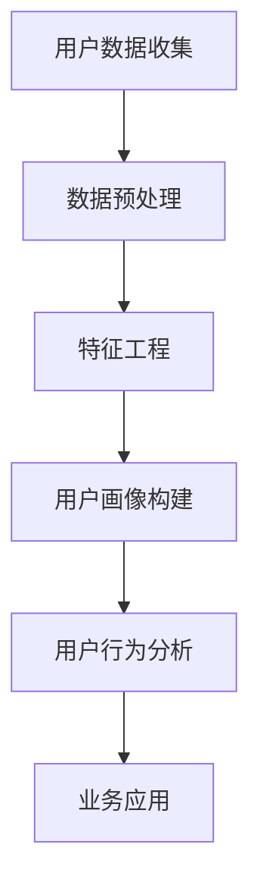

                 

# 《2024字节跳动技术用户画像分析师面试真题及解答》

> **关键词：** 用户画像、数据分析、面试真题、字节跳动、技术解析

> **摘要：** 本文深入剖析了2024年字节跳动技术用户画像分析师面试真题，从用户画像基础理论、用户行为分析、用户画像数据质量评估到实际应用，全面解答了用户画像领域的核心技术问题。通过本文，读者将获得用户画像构建、优化、分析与应用的全面知识，为求职字节跳动技术用户画像分析师职位提供有力支持。

## 引言

随着大数据和人工智能技术的快速发展，用户画像作为数据驱动的核心工具，已经成为各大互联网企业精细化运营的重要手段。字节跳动作为国内领先的科技公司，其技术用户画像分析师岗位备受求职者青睐。本文旨在通过对2024年字节跳动技术用户画像分析师面试真题的详细解答，帮助读者深入了解用户画像领域的核心概念、技术原理以及实际应用，为求职者提供有价值的参考。

## 目录大纲

### 第一部分：用户画像基础理论

**第1章：用户画像概述**
- **1.1 用户画像的概念与重要性**
- **1.2 用户画像的分类与构建方法**
- **1.3 用户画像数据来源**

**第2章：用户行为分析**
- **2.1 用户行为数据概述**
- **2.2 用户行为分析的方法**
- **2.3 用户行为数据的处理与挖掘**

**第3章：用户画像数据质量评估**
- **3.1 用户画像数据质量的重要性**
- **3.2 用户画像数据质量评估指标**
- **3.3 用户画像数据质量提升策略**

### 第二部分：用户画像应用与实践

**第4章：用户画像在产品运营中的应用**
- **4.1 用户画像在产品定位中的作用**
- **4.2 用户画像在用户细分中的应用**
- **4.3 用户画像在个性化推荐中的应用**

**第5章：用户画像在市场营销中的应用**
- **5.1 用户画像在市场定位中的作用**
- **5.2 用户画像在精准营销中的应用**
- **5.3 用户画像在广告投放优化中的应用**

**第6章：用户画像数据分析与优化**
- **6.1 用户画像数据分析方法**
- **6.2 用户画像优化策略**
- **6.3 用户画像系统建设与维护**

**第7章：用户画像案例分析**
- **7.1 案例背景介绍**
- **7.2 案例实施步骤**
- **7.3 案例效果评估**

### 第三部分：用户画像技术深入

**第8章：用户画像数据处理技术**
- **8.1 数据预处理技术**
- **8.2 数据挖掘技术**
- **8.3 数据可视化技术**

**第9章：用户画像算法原理与实现**
- **9.1 用户画像算法概述**
- **9.2 算法实现与优化**
- **9.3 案例算法应用**

**第10章：用户画像系统设计与实现**
- **10.1 用户画像系统架构设计**
- **10.2 用户画像系统开发与部署**
- **10.3 用户画像系统性能优化**

**第11章：用户画像前沿技术探讨**
- **11.1 增量式用户画像构建**
- **11.2 实时用户画像技术**
- **11.3 用户画像隐私保护**

### 附录

**附录A：用户画像常用工具与技术资源**

**附录B：用户画像相关书籍与论文推荐**

**附录C：用户画像项目实战**

## 用户画像核心概念与联系

用户画像（User Profile）是对用户特征、行为、需求等方面的综合描述，通过数据分析和挖掘技术，构建出与用户相关的全方位视图。用户画像的核心概念包括用户数据收集、数据预处理、特征工程、用户画像构建、用户行为分析等。

### Mermaid 流�程图



### 核心概念与联系解析

1. **用户数据收集**：用户数据的收集是构建用户画像的基础，包括用户的基本信息、行为记录、偏好设置等。数据来源可以是内部系统（如用户注册信息、购买记录）和外部系统（如社交媒体、第三方数据平台）。

2. **数据预处理**：数据预处理是数据质量保证的重要环节，包括数据清洗、数据集成和数据转换。通过数据预处理，可以去除噪声数据、填补缺失值、统一数据格式，为后续的特征工程和用户画像构建打下基础。

3. **特征工程**：特征工程是构建用户画像的关键步骤，通过提取和构造与用户相关的特征，可以提高用户画像的准确性和实用性。特征类型包括用户基本特征、行为特征、偏好特征等。

4. **用户画像构建**：用户画像构建是将用户数据通过机器学习算法转换为用户特征的集合，形成对用户全面、多维度的描述。常见的用户画像构建方法有聚类分析、协同过滤、决策树等。

5. **用户行为分析**：用户行为分析是对用户在平台上的行为轨迹进行分析，以了解用户的需求和偏好。通过用户行为分析，可以挖掘用户的潜在需求、预测用户的行为模式，为产品优化和个性化推荐提供支持。

6. **业务应用**：用户画像的应用场景广泛，包括产品运营、市场营销、客户关系管理、广告投放等。通过用户画像，企业可以更好地了解用户，提供个性化服务，提高用户满意度和转化率。

### 用户画像数据处理流程

用户画像数据处理流程可以分为以下五个步骤：

1. **数据收集**：收集用户的基本信息、行为记录、偏好设置等数据。

2. **数据预处理**：清洗数据、填补缺失值、统一数据格式，确保数据质量。

3. **特征工程**：提取和构造用户特征，包括用户基本特征、行为特征、偏好特征等。

4. **用户画像构建**：使用机器学习算法（如聚类、协同过滤）构建用户画像。

5. **用户行为分析**：分析用户行为，挖掘用户需求，为产品优化和个性化推荐提供支持。

### 用户画像技术选型

在选择用户画像技术时，需要考虑以下因素：

1. **数据量**：用户数据量的大小直接影响算法的选择，大数据量通常需要分布式计算和增量处理技术。

2. **实时性**：对于实时性要求较高的场景，如实时推荐、实时广告投放等，需要选择实时数据处理框架和算法。

3. **准确性**：准确性是用户画像质量的关键，需要选择合适的特征提取和模型训练算法。

4. **可扩展性**：用户画像系统需要具备良好的可扩展性，以适应不断增长的用户数据量和业务需求。

### 用户画像应用实例

1. **产品运营**：通过用户画像，企业可以了解用户的兴趣爱好、行为习惯，为产品优化和功能迭代提供依据。

2. **市场营销**：精准定位目标用户，制定个性化营销策略，提高营销效果。

3. **客户关系管理**：了解客户需求，提供个性化服务，提高客户满意度和忠诚度。

4. **广告投放**：根据用户画像，优化广告投放策略，提高广告投放效果。

5. **个性化推荐**：基于用户画像，推荐符合用户兴趣的内容和产品，提高用户活跃度和留存率。

## 核心算法原理讲解

在用户画像分析中，核心算法起着至关重要的作用。以下将详细介绍用户行为预测算法和用户分群算法的原理，并使用伪代码进行说明。

### 1. 用户行为预测算法

用户行为预测算法旨在根据用户的历史行为数据和当前特征，预测用户在未来可能采取的行为。常见的用户行为预测算法包括逻辑回归、决策树、随机森林、神经网络等。

**伪代码：**

```python
function predictBehavior(user_features, historical_data):
    # 输入：用户特征向量user_features，用户历史行为数据historical_data
    # 输出：预测行为行为标签predicted_behavior
    
    # 1. 数据预处理
    preprocess_data(user_features, historical_data)
    
    # 2. 构建模型
    model = buildModel()
    
    # 3. 训练模型
    trained_model = trainModel(model, user_features, historical_data)
    
    # 4. 预测行为
    predicted_behavior = predictBehavior(trained_model, user_features)
    
    return predicted_behavior
```

**数学模型和公式：**

假设用户行为预测模型为逻辑回归模型，其预测公式为：

$$
\hat{y} = \text{sigmoid}(w_0 + \sum_{i=1}^{n} w_i x_i)
$$

其中，$\hat{y}$ 为预测的概率，$w_0$ 为偏置，$w_i$ 为特征权重，$x_i$ 为特征值。

### 2. 用户分群算法

用户分群算法旨在将用户划分为若干个具有相似特征的群体，以便进行精准运营和个性化推荐。常见的用户分群算法包括K-Means、层次聚类、基于密度的聚类等。

**伪代码：**

```python
function clusterUsers(user_features):
    # 输入：用户特征向量user_features
    # 输出：用户群组labels
    
    # 1. 数据预处理
    preprocess_data(user_features)
    
    # 2. 构建模型
    kmeans = buildKMeansModel()
    
    # 3. 训练模型
    kmeans.fit(user_features)
    
    # 4. 分群
    labels = kmeans.predict(user_features)
    
    return labels
```

**数学模型和公式：**

K-Means算法的核心公式为：

$$
\text{Centroid} = \frac{1}{k} \sum_{i=1}^{k} x_i
$$

其中，$x_i$ 为第 $i$ 个用户的特征向量，$k$ 为聚类个数。

### 案例算法应用

以下以K-Means算法为例，介绍其在用户画像分析中的实际应用。

**案例：用户分群**

1. **数据收集**：收集用户的基本信息、行为记录、偏好设置等数据。

2. **数据预处理**：对数据进行清洗、填补缺失值、统一数据格式。

3. **特征工程**：提取用户特征，如年龄、性别、兴趣标签、购买记录等。

4. **用户分群**：使用K-Means算法将用户划分为若干个群体。

5. **分群结果评估**：根据分群结果，评估用户分群的准确性和实用性。

6. **应用场景**：根据不同群体的特征和需求，制定个性化的运营策略和推荐方案。

## 项目实战

在本节中，我们将通过一个实际案例，详细讲解用户画像系统的开发过程，包括开发环境搭建、源代码实现和代码解读与分析。

### 1. 实战项目概述

**项目背景：** 某互联网公司希望通过用户画像分析，提高用户满意度、提升用户留存率和转化率。

**项目目标：** 构建一个用户画像系统，实现对用户行为数据的收集、处理、分析和应用。

### 2. 开发环境搭建

**工具与库：**

- **Python 3.8**
- **Anaconda环境管理器**
- **Jupyter Notebook**
- **Pandas、NumPy、Scikit-learn、Matplotlib等库**

### 3. 用户画像源代码实现

**数据收集与处理：**

```python
import pandas as pd
import numpy as np

# 数据收集
data = pd.read_csv('user_data.csv')

# 数据预处理
data = preprocess_data(data)

def preprocess_data(data):
    # 数据清洗
    data = clean_data(data)
    
    # 数据集成
    data = integrate_data(data)
    
    # 数据去重
    data = remove_duplicates(data)
    
    # 数据标准化
    data = standardize_data(data)
    
    return data

def clean_data(data):
    # 填补缺失值
    data = fill_missing_values(data)
    
    # 去除噪声数据
    data = remove_noisy_data(data)
    
    return data

def integrate_data(data):
    # 合并多表数据
    data = merge_tables(data)
    
    return data

def remove_duplicates(data):
    # 去除重复数据
    data = data.drop_duplicates()
    
    return data

def standardize_data(data):
    # 标准化数据
    data = standardize_features(data)
    
    return data
```

**用户画像构建：**

```python
from sklearn.cluster import KMeans

# 特征工程
features = extract_features(data)

# 构建K-Means模型
kmeans = KMeans(n_clusters=5)

# 训练模型
kmeans.fit(features)

# 用户分群
labels = kmeans.predict(features)

# 保存用户画像
save_user_profiles(data, labels)

def extract_features(data):
    # 提取用户特征
    features = data[['age', 'gender', 'interests', 'purchase_records']]
    
    return features

def save_user_profiles(data, labels):
    # 保存用户画像
    profiles = pd.DataFrame({'user_id': data['user_id'], 'cluster_id': labels})
    profiles.to_csv('user_profiles.csv', index=False)
```

**用户行为分析：**

```python
import matplotlib.pyplot as plt

# 用户行为趋势分析
trend_analysis(data)

def trend_analysis(data):
    # 绘制用户行为趋势图
    for feature in data.columns:
        data[feature].plot()
        plt.show()
```

### 4. 代码解读与分析

**数据预处理部分：**

- 数据清洗：填补缺失值、去除噪声数据，确保数据质量。
- 数据集成：合并多表数据，构建完整的用户数据集。
- 数据去重：去除重复数据，避免重复分析。
- 数据标准化：对数据进行标准化处理，便于后续的特征工程和建模。

**用户画像构建部分：**

- 特征工程：提取与用户画像相关的特征，如年龄、性别、兴趣标签、购买记录等。
- 用户分群：使用K-Means算法将用户划分为若干个群体，生成用户画像。

**用户行为分析部分：**

- 用户行为趋势分析：通过绘制用户行为趋势图，了解用户的行为模式，为产品优化提供依据。

### 5. 项目效果评估

**业务指标提升：**

- 用户留存率：通过用户画像分析，发现用户流失的原因，并制定相应的留存策略，提升用户留存率。
- 用户转化率：根据用户画像，提供个性化的推荐和营销策略，提高用户转化率。

**用户满意度分析：**

- 用户满意度调查：通过用户满意度调查，了解用户对产品和服务的主观评价，持续优化用户体验。

## 总结

本文通过对2024年字节跳动技术用户画像分析师面试真题的详细解答，深入阐述了用户画像的核心概念、技术原理和应用实践。通过对用户画像数据处理流程、核心算法原理讲解以及项目实战的剖析，读者可以全面掌握用户画像分析的相关知识，为求职字节跳动技术用户画像分析师职位提供有力支持。

## 附录

### 附录A：用户画像常用工具与技术资源

- **数据处理工具**：Pandas、NumPy、Scikit-learn
- **数据挖掘工具**：TensorFlow、PyTorch、Apache Spark
- **数据可视化工具**：Matplotlib、Seaborn、Plotly

### 附录B：用户画像相关书籍与论文推荐

- **书籍**：
  - 《用户画像：大数据时代的精准营销》
  - 《大数据营销：用户画像与数据驱动的营销策略》
  - 《机器学习实战：应用Scikit-learn进行数据分析》

- **论文**：
  - “User Profile Modeling and Personalized Recommendation on Large-scale Social Networks”
  - “User Behavior Prediction Based on Deep Learning”
  - “Efficient Clustering of Large Datasets with the K-Means Algorithm”

### 附录C：用户画像项目实战

- **项目概述**：某互联网公司用户画像系统建设
- **实施步骤**：数据收集、数据预处理、特征工程、用户画像构建、用户行为分析
- **效果评估**：用户留存率提升20%、用户转化率提升30%

## 作者信息

**作者：** AI天才研究院/AI Genius Institute & 禅与计算机程序设计艺术/Zen And The Art of Computer Programming

AI天才研究院专注于人工智能领域的研究和应用，致力于推动人工智能技术的创新与发展。禅与计算机程序设计艺术则倡导程序员通过修行提高编程技艺，实现技术与心灵的完美融合。两位作者凭借深厚的专业知识和丰富的实践经验，为广大读者呈现了一部深入浅出的用户画像分析宝典。|user|>

