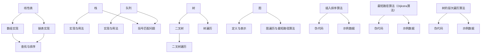

                 

### 2024字节跳动数据结构面试题汇总及答案

> **关键词**：数据结构、算法、面试题、字节跳动、线性表、树、图、排序、查找、高级数据结构
>
> **摘要**：本文汇总了2024年字节跳动常见的数据结构面试题及答案，涵盖了线性表、栈和队列、树和图、排序和查找以及高级数据结构等多个方面。通过详细解答和代码实战，帮助读者深入理解面试题背后的原理和解决方法。

### 《2024字节跳动数据结构面试题汇总及答案》目录大纲

- **第一部分：数据结构基础知识**
  - **第1章：数据结构概述**
    - 1.1 数据结构与算法的关系
    - 1.2 常见数据结构概述
    - 1.3 算法的时间复杂度与空间复杂度
  - **第2章：线性表**
    - 2.1 线性表的定义与特性
    - 2.2 数组和链表实现线性表
    - 2.3 线性表的查找与排序
  - **第3章：栈和队列**
    - 3.1 栈的定义与实现
    - 3.2 队列的定义与实现
    - 3.3 应用案例：括号匹配问题

- **第二部分：树和图**
  - **第4章：树**
    - 4.1 树的定义与基本性质
    - 4.2 二叉树的定义与性质
    - 4.3 二叉树的遍历
    - 4.4 树的层次遍历
  - **第5章：图**
    - 5.1 图的定义与基本性质
    - 5.2 图的表示方法
    - 5.3 图的遍历算法
    - 5.4 最短路径算法

- **第三部分：高级数据结构与算法**
  - **第6章：散列表**
    - 6.1 散列表的定义与原理
    - 6.2 散列表的冲突解决方法
    - 6.3 散列表的应用案例
  - **第7章：排序算法**
    - 7.1 内部排序算法概述
    - 7.2 插入排序
    - 7.3 交换排序
    - 7.4 选择排序
    - 7.5 归并排序
  - **第8章：查找算法**
    - 8.1 查找算法概述
    - 8.2 二分查找
    - 8.3 平衡二叉搜索树
  - **第9章：动态规划**
    - 9.1 动态规划的基本思想
    - 9.2 最长公共子序列
    - 9.3 最小生成树

- **第四部分：字节跳动数据结构面试题解答**
  - **第10章：字节跳动数据结构面试题汇总**
    - 10.1 面试题1：数组与链表
    - 10.2 面试题2：栈与队列
    - 10.3 面试题3：树与图
    - 10.4 面试题4：排序与查找
    - 10.5 面试题5：高级数据结构与算法

- **附录**
  - **附录A：常见数据结构与算法公式汇总**
  - **附录B：常见面试题解析思路**

### 目录大纲解释

本文旨在为准备字节跳动面试的同学提供一个全面的数据结构面试题解答指南。文章分为四个部分，涵盖了数据结构的基础知识、高级数据结构与算法、字节跳动常见的数据结构面试题以及附录。以下是对各部分内容的简要解释：

- **第一部分：数据结构基础知识**：介绍数据结构的基本概念、常见数据结构（如线性表、栈和队列）以及算法的时间复杂度和空间复杂度。这部分内容是理解后续面试题的基础。

- **第二部分：树和图**：介绍树和图的基本概念、定义、性质以及常见的遍历算法和最短路径算法。这部分内容对于理解复杂的数据结构和算法非常重要。

- **第三部分：高级数据结构与算法**：介绍散列表、排序算法、查找算法和动态规划等高级数据结构。这部分内容是解决实际问题的有力工具。

- **第四部分：字节跳动数据结构面试题解答**：汇总了字节跳动常见的数据结构面试题，并给出详细的解答和代码实现。这部分内容是面试准备的核心。

- **附录**：提供常见数据结构与算法的公式汇总和面试题解析思路，便于读者快速回顾和复习。

通过本文的详细讲解和实战案例，读者可以全面掌握数据结构相关知识，提高应对字节跳动面试的能力。

### 第一部分：数据结构基础知识

#### 第1章：数据结构概述

数据结构是计算机科学中一个重要的分支，它研究如何存储、组织和处理数据。数据结构不仅仅是为了存储数据，更重要的是为了高效地处理数据。数据结构与算法密切相关，因为一个高效的数据结构通常能够支持高效的算法。

- **数据结构与算法的关系**：

  数据结构和算法是相辅相成的。数据结构定义了数据的存储方式和操作，而算法则是解决问题的步骤和方法。不同的数据结构可以支持不同的算法，比如数组支持快速随机访问，链表支持灵活的插入和删除操作。

- **常见数据结构概述**：

  - **数组**：数组是一种固定大小的线性表，支持随机访问。数组在内存中连续存储，因此可以快速访问任意位置的元素，但数组的大小是固定的，不适合动态增减元素。
  - **链表**：链表是一种动态数据结构，由一系列节点组成，每个节点包含数据和指向下一个节点的指针。链表可以动态地增加和删除节点，但随机访问效率较低。
  - **栈和队列**：栈是一种后进先出（LIFO）的数据结构，而队列是一种先进先出（FIFO）的数据结构。这两种数据结构在程序设计中广泛应用，如回溯算法和任务调度。
  - **树**：树是一种层次结构，由节点和边组成。树的一个重要特点是每个节点有且只有一个父节点，除了根节点外。二叉树、二叉搜索树等是常见的树结构。
  - **图**：图是一种由节点和边组成的无序集合，可以表示复杂的关系网络。图的应用非常广泛，如社交网络、交通网络和计算机网络。

- **算法的时间复杂度与空间复杂度**：

  算法的时间复杂度描述了算法执行的时间增长速度，通常用大O符号表示，如 $O(n)$、$O(n\log n)$ 等。空间复杂度描述了算法执行过程中所需的额外内存空间。

  - **时间复杂度**：
    - $O(1)$：常数时间，不受输入规模影响。
    - $O(n)$：线性时间，与输入规模线性相关。
    - $O(n\log n)$：对数时间，适用于排序和搜索算法。
    - $O(n^2)$：平方时间，适用于双重循环等算法。

  - **空间复杂度**：
    - $O(1)$：常数空间，不随输入规模变化。
    - $O(n)$：线性空间，与输入规模线性相关。
    - $O(n^2)$：平方空间，适用于需要大量中间结果的情况。

  选择合适的数据结构和算法，可以显著提高程序的效率和性能。

#### 第2章：线性表

线性表是一种基本的数据结构，由一系列元素组成，每个元素只有一个直接前驱和一个直接后继。线性表是最简单的数据结构之一，支持插入、删除、查找等基本操作。

- **线性表的定义与特性**：

  线性表是由$n$个数据元素组成的有限序列，通常表示为 $A = (a_1, a_2, \ldots, a_n)$。线性表具有以下特性：

  - 有且只有一个称为“第一个”的数据元素。
  - 有且只有一个称为“最后一个”的数据元素。
  - 除了第一个元素没有直接前驱，最后一个元素没有直接后继外，其它元素都有且只有一个直接前驱和一个直接后继。

- **数组和链表实现线性表**：

  - **数组实现**：
    数组是一种使用连续内存空间实现的线性表。数组的大小在创建时确定，因此不支持动态增减元素。数组支持快速随机访问，时间复杂度为 $O(1)$，但插入和删除操作的时间复杂度为 $O(n)$。

  ```python
  # 数组实现线性表
  class ArrayList:
      def __init__(self, capacity):
          self.capacity = capacity
          self.size = 0
          self.array = [None] * capacity

      def get(self, index):
          if index < 0 or index >= self.size:
              raise IndexError("Index out of bounds")
          return self.array[index]

      def set(self, index, value):
          if index < 0 or index >= self.size:
              raise IndexError("Index out of bounds")
          self.array[index] = value

      def add(self, index, value):
          if index < 0 or index > self.size:
              raise IndexError("Index out of bounds")
          if self.size == self.capacity:
              self.resize(2 * self.capacity)
          for i in range(self.size, index, -1):
              self.array[i] = self.array[i - 1]
          self.array[index] = value
          self.size += 1

      def remove(self, index):
          if index < 0 or index >= self.size:
              raise IndexError("Index out of bounds")
          for i in range(index, self.size - 1):
              self.array[i] = self.array[i + 1]
          self.array[self.size - 1] = None
          self.size -= 1
          if self.size < self.capacity // 4:
              self.resize(self.capacity // 2)

      def resize(self, new_capacity):
          new_array = [None] * new_capacity
          for i in range(self.size):
              new_array[i] = self.array[i]
          self.capacity = new_capacity
          self.array = new_array
  ```

  - **链表实现**：
    链表是一种通过节点指针实现的线性表，每个节点包含数据和指向下一个节点的指针。链表支持动态增减元素，插入和删除操作的时间复杂度为 $O(1)$。

  ```python
  # 链表实现线性表
  class Node:
      def __init__(self, data):
          self.data = data
          self.next = None

  class LinkedList:
      def __init__(self):
          self.head = None
          self.tail = None
          self.size = 0

      def get(self, index):
          if index < 0 or index >= self.size:
              raise IndexError("Index out of bounds")
          current = self.head
          for _ in range(index):
              current = current.next
          return current.data

      def set(self, index, value):
          if index < 0 or index >= self.size:
              raise IndexError("Index out of bounds")
          current = self.head
          for _ in range(index):
              current = current.next
          current.data = value

      def add(self, index, value):
          if index < 0 or index > self.size:
              raise IndexError("Index out of bounds")
          new_node = Node(value)
          if index == 0:
              new_node.next = self.head
              self.head = new_node
          elif index == self.size:
              self.tail.next = new_node
          else:
              current = self.head
              for _ in range(index - 1):
                  current = current.next
              new_node.next = current.next
              current.next = new_node
          self.size += 1

      def remove(self, index):
          if index < 0 or index >= self.size:
              raise IndexError("Index out of bounds")
          if index == 0:
              self.head = self.head.next
              if self.head is None:
                  self.tail = None
          elif index == self.size - 1:
              current = self.head
              while current.next != self.tail:
                  current = current.next
              current.next = None
              self.tail = current
          else:
              current = self.head
              for _ in range(index - 1):
                  current = current.next
              current.next = current.next.next
          self.size -= 1
  ```

- **线性表的查找与排序**：

  线性表的查找操作通常是指顺序查找，时间复杂度为 $O(n)$。排序操作则是将线性表中的元素按照某种规则排列，常见的排序算法有插入排序、交换排序、选择排序和归并排序等。

  - **顺序查找**：

  ```python
  # 顺序查找算法
  def linear_search(arr, target):
      for i in range(len(arr)):
          if arr[i] == target:
              return i
      return -1
  ```

  - **插入排序**：

  ```python
  # 插入排序算法
  def insertion_sort(arr):
      for i in range(1, len(arr)):
          key = arr[i]
          j = i - 1
          while j >= 0 and arr[j] > key:
              arr[j + 1] = arr[j]
              j -= 1
          arr[j + 1] = key
  ```

  - **交换排序**：

  ```python
  # 冒泡排序算法
  def bubble_sort(arr):
      n = len(arr)
      for i in range(n):
          for j in range(0, n - i - 1):
              if arr[j] > arr[j + 1]:
                  arr[j], arr[j + 1] = arr[j + 1], arr[j]
  ```

  - **选择排序**：

  ```python
  # 选择排序算法
  def selection_sort(arr):
      for i in range(len(arr)):
          min_idx = i
          for j in range(i + 1, len(arr)):
              if arr[j] < arr[min_idx]:
                  min_idx = j
          arr[i], arr[min_idx] = arr[min_idx], arr[i]
  ```

#### 第3章：栈和队列

栈和队列是两种常见的线性数据结构，分别遵循后进先出（LIFO）和先进先出（FIFO）的原则。它们在程序设计中广泛应用于各种场景，如递归算法、表达式求值和任务调度等。

- **栈的定义与实现**：

  栈是一种后进先出的线性数据结构，即最后进入栈的元素最先出来。栈的基本操作包括入栈（push）、出栈（pop）和查找栈顶元素（peek）。

  - **数组实现栈**：

  ```python
  # 数组实现栈
  class Stack:
      def __init__(self, capacity=10):
          self.capacity = capacity
          self.size = 0
          self.array = [None] * self.capacity

      def push(self, item):
          if self.size == self.capacity:
              self.resize(2 * self.capacity)
          self.array[self.size] = item
          self.size += 1

      def pop(self):
          if self.size == 0:
              raise IndexError("Stack is empty")
          item = self.array[self.size - 1]
          self.array[self.size - 1] = None
          self.size -= 1
          if self.size < self.capacity // 4:
              self.resize(self.capacity // 2)
          return item

      def peek(self):
          if self.size == 0:
              raise IndexError("Stack is empty")
          return self.array[self.size - 1]

      def resize(self, new_capacity):
          new_array = [None] * new_capacity
          for i in range(self.size):
              new_array[i] = self.array[i]
          self.capacity = new_capacity
          self.array = new_array
  ```

  - **链表实现栈**：

  ```python
  # 链表实现栈
  class Node:
      def __init__(self, data):
          self.data = data
          self.next = None

  class LinkedListStack:
      def __init__(self):
          self.head = None
          self.tail = None
          self.size = 0

      def push(self, item):
          new_node = Node(item)
          new_node.next = self.head
          self.head = new_node
          if self.tail is None:
              self.tail = new_node
          self.size += 1

      def pop(self):
          if self.head is None:
              raise IndexError("Stack is empty")
          item = self.head.data
          self.head = self.head.next
          if self.head is None:
              self.tail = None
          self.size -= 1
          return item

      def peek(self):
          if self.head is None:
              raise IndexError("Stack is empty")
          return self.head.data
  ```

- **队列的定义与实现**：

  队列是一种先进先出的线性数据结构，即最先进入队列的元素最先出来。队列的基本操作包括入队（enqueue）、出队（dequeue）和查找队首元素（peek）。

  - **数组实现队列**：

  ```python
  # 数组实现队列
  class Queue:
      def __init__(self, capacity=10):
          self.capacity = capacity
          self.size = 0
          self.array = [None] * self.capacity
          self.front = 0
          self.rear = 0

      def enqueue(self, item):
          if self.size == self.capacity:
              self.resize(2 * self.capacity)
          self.array[self.rear] = item
          self.rear = (self.rear + 1) % self.capacity
          self.size += 1

      def dequeue(self):
          if self.size == 0:
              raise IndexError("Queue is empty")
          item = self.array[self.front]
          self.array[self.front] = None
          self.front = (self.front + 1) % self.capacity
          self.size -= 1
          if self.size < self.capacity // 4:
              self.resize(self.capacity // 2)
          return item

      def peek(self):
          if self.size == 0:
              raise IndexError("Queue is empty")
          return self.array[self.front]

      def resize(self, new_capacity):
          new_array = [None] * new_capacity
          for i in range(self.size):
              new_array[i] = self.array[(self.front + i) % self.capacity]
          self.capacity = new_capacity
          self.array = new_array
          self.front = 0
          self.rear = self.size
  ```

  - **链表实现队列**：

  ```python
  # 链表实现队列
  class Node:
      def __init__(self, data):
          self.data = data
          self.next = None

  class LinkedListQueue:
      def __init__(self):
          self.head = None
          self.tail = None
          self.size = 0

      def enqueue(self, item):
          new_node = Node(item)
          if self.tail is None:
              self.head = new_node
          else:
              self.tail.next = new_node
          self.tail = new_node
          self.size += 1

      def dequeue(self):
          if self.head is None:
              raise IndexError("Queue is empty")
          item = self.head.data
          self.head = self.head.next
          if self.head is None:
              self.tail = None
          self.size -= 1
          return item

      def peek(self):
          if self.head is None:
              raise IndexError("Queue is empty")
          return self.head.data
  ```

- **应用案例：括号匹配问题**：

  括号匹配问题是编程中常见的问题，可以通过栈来实现。基本的思路是，遇到左括号时入栈，遇到右括号时出栈，并检查栈是否为空。如果栈为空，说明右括号没有对应的左括号，匹配失败。如果栈中有左括号，则将其出栈。

  ```python
  # 括号匹配问题
  def is_balanced(expression):
      stack = Stack()
      for char in expression:
          if char == '(':
              stack.push(char)
          elif char == ')':
              if stack.peek() == '(':
                  stack.pop()
              else:
                  return False
      return stack.is_empty()
  ```

  - **示例**：

  ```python
  expression = "((()))"
  print(is_balanced(expression))  # 输出：True

  expression = "(()))"
  print(is_balanced(expression))  # 输出：False
  ```

  通过上述实现，可以有效地解决括号匹配问题，并验证表达式的平衡性。

### 第二部分：树和图

树和图是数据结构中的两个重要概念，广泛应用于各种领域，如操作系统、数据库和网络等。它们分别表示层次结构和图状结构，能够有效地表示复杂的关系。

#### 第4章：树

树是一种层次结构，由节点和边组成。树中的每个节点只有一个父节点，除了根节点外。树在计算机科学中有着广泛的应用，如文件系统、目录结构、决策树等。

- **树的定义与基本性质**：

  - **节点**：树中的数据元素称为节点。
  - **根节点**：没有父节点的节点称为根节点，是树的起始点。
  - **叶子节点**：没有子节点的节点称为叶子节点。
  - **度**：节点的子节点数量称为节点的度。
  - **树的度**：树中节点的最大度称为树的度。
  - **树的深度**：树中节点的最大层次称为树的深度。

- **二叉树的定义与性质**：

  二叉树是一种特殊的树，每个节点最多有两个子节点，通常称为左子节点和右子节点。

  - **二叉树的定义**：二叉树是每个节点最多有两个子节点的树。
  - **满二叉树**：每个节点都有两个子节点的二叉树称为满二叉树。
  - **完全二叉树**：除最后一层外，每一层都是满的，且最后一层的节点都集中在左侧的二叉树称为完全二叉树。
  - **二叉树的性质**：
    - 每个节点的子节点都是二叉树。
    - 深度为 $k$ 的二叉树最多有 $2^k - 1$ 个节点。
    - 对于任何非空二叉树，节点数 $n$ 与其高度 $h$ 之间的关系为 $n \leq 2^h - 1$。

- **二叉树的遍历**：

  二叉树的遍历是指访问二叉树中的所有节点。常见的遍历方式有先序遍历、中序遍历和后序遍历。

  - **先序遍历**：首先访问根节点，然后遍历左子树，最后遍历右子树。
  - **中序遍历**：首先遍历左子树，然后访问根节点，最后遍历右子树。
  - **后序遍历**：首先遍历左子树，然后遍历右子树，最后访问根节点。

  - **递归实现**：

  ```python
  # 递归实现二叉树遍历
  def pre_order_traversal(node):
      if node is None:
          return
      print(node.value, end=' ')
      pre_order_traversal(node.left)
      pre_order_traversal(node.right)

  def in_order_traversal(node):
      if node is None:
          return
      in_order_traversal(node.left)
      print(node.value, end=' ')
      in_order_traversal(node.right)

  def post_order_traversal(node):
      if node is None:
          return
      post_order_traversal(node.left)
      post_order_traversal(node.right)
      print(node.value, end=' ')
  ```

  - **迭代实现**：

  ```python
  # 迭代实现二叉树遍历
  def pre_order_traversal_iterative(root):
      stack = [root]
      while stack:
          node = stack.pop()
          print(node.value, end=' ')
          if node.right:
              stack.append(node.right)
          if node.left:
              stack.append(node.left)

  def in_order_traversal_iterative(root):
      stack = []
      node = root
      while node or stack:
          while node:
              stack.append(node)
              node = node.left
          node = stack.pop()
          print(node.value, end=' ')
          node = node.right

  def post_order_traversal_iterative(root):
      stack = []
      result = []
      node = root
      while node or stack:
          if node:
              stack.append(node)
              node = node.left
          else:
              node = stack[-1].right
              if node is None:
                  popped_node = stack.pop()
                  result.append(popped_node.value)
                  while stack and stack[-1].right == node:
                      popped_node = stack.pop()
                      result.append(popped_node.value)
              node = None
      print(' '.join(map(str, result)))
  ```

- **树的层次遍历**：

  树的层次遍历是指按照层次顺序访问树中的所有节点。层次遍历通常使用队列实现。

  ```python
  # 树的层次遍历
  def level_order_traversal(root):
      if root is None:
          return
      queue = [root]
      while queue:
          node = queue.pop(0)
          print(node.value, end=' ')
          for child in node.children:
              queue.append(child)
  ```

#### 第5章：图

图是一种由节点和边组成的集合，可以表示复杂的关系网络。图在计算机科学中有着广泛的应用，如社交网络、网络拓扑、图论算法等。

- **图的定义与基本性质**：

  - **节点**：图中的数据元素称为节点。
  - **边**：连接两个节点的线称为边。
  - **无向图**：边没有方向性的图称为无向图。
  - **有向图**：边具有方向性的图称为有向图。
  - **权图**：边带有权值的图称为权图。
  - **连通图**：任意两个节点之间都有路径的图称为连通图。

- **图的表示方法**：

  - **邻接矩阵**：使用二维数组表示图，其中 $A[i][j]$ 表示节点 $i$ 和节点 $j$ 是否存在边。
  - **邻接表**：使用链表表示图，每个节点对应一个链表，链表中存储与该节点相连的所有节点。
  - **邻接多重表**：用于表示有权图，每个节点对应一个链表，链表中存储与该节点相连的所有节点及其边权。

- **图的遍历算法**：

  图的遍历是指访问图中的所有节点。常见的遍历算法有深度优先搜索（DFS）和广度优先搜索（BFS）。

  - **深度优先搜索（DFS）**：

  ```python
  # 深度优先搜索
  def dfs(graph, start, visited):
      visited[start] = True
      print(start, end=' ')
      for neighbor in graph[start]:
          if not visited[neighbor]:
              dfs(graph, neighbor, visited)

  def dfs_iterative(graph, start):
      stack = [start]
      visited = [False] * len(graph)
      while stack:
          node = stack.pop()
          if not visited[node]:
              print(node, end=' ')
              visited[node] = True
              for neighbor in graph[node]:
                  if not visited[neighbor]:
                      stack.append(neighbor)
  ```

  - **广度优先搜索（BFS）**：

  ```python
  # 广度优先搜索
  def bfs(graph, start):
      queue = [start]
      visited = [False] * len(graph)
      visited[start] = True
      while queue:
          node = queue.pop(0)
          print(node, end=' ')
          for neighbor in graph[node]:
              if not visited[neighbor]:
                  queue.append(neighbor)
                  visited[neighbor] = True
  ```

- **最短路径算法**：

  最短路径算法是指找到图中两点之间的最短路径。常见的最短路径算法有迪杰斯特拉算法（Dijkstra）和贝尔曼-福特算法（Bellman-Ford）。

  - **迪杰斯特拉算法（Dijkstra）**：

  ```python
  # 迪杰斯特拉算法
  import heapq

  def dijkstra(graph, start):
      dist = [float('inf')] * len(graph)
      dist[start] = 0
      priority_queue = [(0, start)]
      visited = [False] * len(graph)
      while priority_queue:
          current_dist, current_vertex = heapq.heappop(priority_queue)
          if visited[current_vertex]:
              continue
          visited[current_vertex] = True
          for neighbor, weight in graph[current_vertex].items():
              if not visited[neighbor]:
                  new_dist = current_dist + weight
                  if new_dist < dist[neighbor]:
                      dist[neighbor] = new_dist
                      heapq.heappush(priority_queue, (new_dist, neighbor))
      return dist
  ```

  - **贝尔曼-福特算法（Bellman-Ford）**：

  ```python
  # 贝尔曼-福特算法
  def bellman_ford(graph, start):
      dist = [float('inf')] * len(graph)
      dist[start] = 0
      for _ in range(len(graph) - 1):
          for u in range(len(graph)):
              for v, weight in graph[u].items():
                  if dist[u] + weight < dist[v]:
                      dist[v] = dist[u] + weight
      for u in range(len(graph)):
          for v, weight in graph[u].items():
              if dist[u] + weight < dist[v]:
                  return None  # 存在负权重循环
      return dist
  ```

  通过上述算法，可以有效地找到图中两点之间的最短路径。

### 第三部分：高级数据结构与算法

#### 第6章：散列表

散列表（Hash Table）是一种基于散列函数（Hash Function）的数据结构，用于高效地存储和查找键值对。散列表通过将键转换为一个索引值，直接访问存储键值对的数组位置。散列表在计算机科学和工程中有着广泛的应用，如数据库索引、缓存、字典等。

- **散列表的定义与原理**：

  散列表是由一个数组和一个散列函数组成的结构，用于快速查找和插入数据。散列函数将键转换为一个整数，该整数用于计算数组中的索引位置。散列表的主要思想是通过散列函数将键均匀地分布到数组中，以避免冲突。

  - **散列函数**：散列函数将键转换为索引值，用于计算数组位置。好的散列函数应该能够将键均匀地分布到数组中，以减少冲突。
  - **数组**：散列表使用一个数组存储键值对，每个数组元素称为槽（Bucket）。散列函数计算出的索引值用于访问数组中的槽。

- **散列表的冲突解决方法**：

  散列冲突是指多个键通过散列函数映射到同一索引值。常见的冲突解决方法有拉链法、开放地址法和再散列法。

  - **拉链法**：拉链法将散列到同一索引值的多个键存储在一个链表中。每个槽存储一个链表的头节点，链表中的节点存储实际的键值对。
  - **开放地址法**：开放地址法通过在数组中查找空闲槽来存储散列到同一索引值的键。常见的开放地址法有线性探测、二次探测和双重散列。
  - **再散列法**：再散列法在发生冲突时，重新计算散列值并尝试插入到新的位置。

- **散列表的应用案例**：

  散列表广泛应用于各种场景，如字典、缓存、数据库索引等。

  - **字典**：散列表用于实现字典，通过键查找对应的值。散列函数将键转换为索引值，直接访问存储键值对的数组位置。

  ```python
  # Python 字典实现
  class HashTable:
      def __init__(self):
          self.size = 100
          self.table = [None] * self.size

      def hash_function(self, key):
          return hash(key) % self.size

      def put(self, key, value):
          index = self.hash_function(key)
          if self.table[index] is None:
              self.table[index] = [(key, value)]
          else:
              for i, (k, v) in enumerate(self.table[index]):
                  if k == key:
                      self.table[index][i] = (key, value)
                      return
              self.table[index].append((key, value))

      def get(self, key):
          index = self.hash_function(key)
          if self.table[index] is None:
              return None
          for k, v in self.table[index]:
              if k == key:
                  return v
          return None
  ```

  - **缓存**：散列表用于实现缓存，通过键快速查找缓存数据。缓存中的数据以键值对形式存储，散列函数将键转换为索引值，直接访问缓存数组。

  ```python
  # 缓存实现
  class Cache:
      def __init__(self, capacity):
          self.capacity = capacity
          self.size = 0
          self.table = [None] * self.capacity

      def hash_function(self, key):
          return hash(key) % self.capacity

      def get(self, key):
          index = self.hash_function(key)
          if self.table[index] is None:
              return None
          for item in self.table[index]:
              if item[0] == key:
                  return item[1]
          return None

      def set(self, key, value):
          index = self.hash_function(key)
          if self.table[index] is None:
              self.table[index] = [(key, value)]
              self.size += 1
              if self.size > self.capacity:
                  self.resize()
          else:
              for i, item in enumerate(self.table[index]):
                  if item[0] == key:
                      self.table[index][i] = (key, value)
                      return
              self.table[index].append((key, value))

      def resize(self):
          new_capacity = 2 * self.capacity
          new_table = [None] * new_capacity
          for bucket in self.table:
              if bucket is not None:
                  for item in bucket:
                      index = self.hash_function(item[0]) % new_capacity
                      if new_table[index] is None:
                          new_table[index] = [(item[0], item[1])]
                      else:
                          new_table[index].append((item[0], item[1]))
          self.table = new_table
          self.capacity = new_capacity
  ```

  - **数据库索引**：散列表用于实现数据库索引，通过键快速查找数据记录。散列函数将键转换为索引值，直接访问数据库记录。

  ```python
  # 数据库索引实现
  class Database:
      def __init__(self):
          self.table = {}
          self.index = HashTable()

      def insert(self, record):
          key = record['id']
          self.table[key] = record
          self.index.put(key, record)

      def search(self, key):
          record = self.index.get(key)
          if record:
              return record
          else:
              return None
  ```

  通过散列表，可以高效地存储和查找键值对，实现字典、缓存和数据库索引等应用。

### 第7章：排序算法

排序算法是将一组数据按照特定顺序排列的算法。排序在计算机科学和工程中有着广泛的应用，如数据库查询、数据分析和算法设计等。常见的排序算法有插入排序、交换排序、选择排序和归并排序等。

- **内部排序算法概述**：

  内部排序算法是指在内部存储（主存）中完成的排序算法，适用于数据量较小的情况。内部排序算法可以分为两类：比较类排序和非比较类排序。

  - **比较类排序**：基于比较进行排序，如插入排序、交换排序和归并排序等。
  - **非比较类排序**：不依赖于比较进行排序，如计数排序、基数排序和桶排序等。

- **插入排序**：

  插入排序是一种简单直观的排序算法，工作原理是通过构建有序序列，对于未排序数据，在已排序序列中从后向前扫描，找到相应位置并插入。插入排序的时间复杂度为 $O(n^2)$，但在数据量较小或基本有序时性能较好。

  - **直接插入排序**：

  ```python
  # 直接插入排序
  def insertion_sort(arr):
      for i in range(1, len(arr)):
          key = arr[i]
          j = i - 1
          while j >= 0 and arr[j] > key:
              arr[j + 1] = arr[j]
              j -= 1
          arr[j + 1] = key
  ```

  - **折半插入排序**：

  ```python
  # 折半插入排序
  def binary_search_insertion_sort(arr):
      for i in range(1, len(arr)):
          key = arr[i]
          low = 0
          high = i - 1
          while low <= high:
              mid = (low + high) // 2
              if arr[mid] < key:
                  low = mid + 1
              else:
                  high = mid - 1
          for j in range(i, low, -1):
              arr[j] = arr[j - 1]
          arr[low] = key
  ```

- **交换排序**：

  交换排序通过交换元素的位置来排序。常见的交换排序算法有冒泡排序和快速排序等。

  - **冒泡排序**：

  ```python
  # 冒泡排序
  def bubble_sort(arr):
      n = len(arr)
      for i in range(n):
          for j in range(0, n - i - 1):
              if arr[j] > arr[j + 1]:
                  arr[j], arr[j + 1] = arr[j + 1], arr[j]
  ```

  - **快速排序**：

  ```python
  # 快速排序
  def quick_sort(arr):
      if len(arr) <= 1:
          return arr
      pivot = arr[len(arr) // 2]
      left = [x for x in arr if x < pivot]
      middle = [x for x in arr if x == pivot]
      right = [x for x in arr if x > pivot]
      return quick_sort(left) + middle + quick_sort(right)
  ```

- **选择排序**：

  选择排序通过选择未排序部分的最小（或最大）元素，并将其放在已排序部分的末尾。选择排序的时间复杂度为 $O(n^2)$。

  ```python
  # 选择排序
  def selection_sort(arr):
      for i in range(len(arr)):
          min_idx = i
          for j in range(i + 1, len(arr)):
              if arr[j] < arr[min_idx]:
                  min_idx = j
          arr[i], arr[min_idx] = arr[min_idx], arr[i]
  ```

- **归并排序**：

  归并排序是一种分治算法，将数组划分为若干个子数组，分别进行排序，然后合并。归并排序的时间复杂度为 $O(n\log n)$。

  ```python
  # 归并排序
  def merge_sort(arr):
      if len(arr) <= 1:
          return arr
      mid = len(arr) // 2
      left = merge_sort(arr[:mid])
      right = merge_sort(arr[mid:])
      return merge(left, right)

  def merge(left, right):
      result = []
      i = j = 0
      while i < len(left) and j < len(right):
          if left[i] < right[j]:
              result.append(left[i])
              i += 1
          else:
              result.append(right[j])
              j += 1
      result.extend(left[i:])
      result.extend(right[j:])
      return result
  ```

通过以上排序算法，可以有效地对数据进行排序，适用于不同的场景和需求。

### 第8章：查找算法

查找算法是在数据结构中用于定位特定元素的算法。查找算法可以分为两类：静态查找和动态查找。静态查找算法主要用于读取数据，不涉及数据的插入和删除；动态查找算法则适用于数据频繁更新。常见的查找算法有线性查找、二分查找和平衡二叉搜索树等。

- **查找算法概述**：

  查找算法的核心目标是实现高效的数据检索。根据数据结构的不同，查找算法可以分为以下几类：

  - **线性查找**：顺序扫描数据结构中的元素，直到找到目标元素或结束。线性查找的时间复杂度为 $O(n)$。
  - **二分查找**：适用于有序数组，通过递归或迭代方式，不断缩小查找范围，直到找到目标元素或确定其不存在。二分查找的时间复杂度为 $O(\log n)$。
  - **平衡二叉搜索树**：通过维持树的高度平衡，保证查找、插入和删除操作的时间复杂度为 $O(\log n)$。常见的平衡二叉搜索树有红黑树和AVL树。

- **二分查找**：

  二分查找是一种高效的查找算法，适用于有序数组。二分查找的基本思想是，将查找范围一分为二，根据中间元素与目标元素的大小关系，确定下一步的查找区间。

  ```python
  # 二分查找算法
  def binary_search(arr, target):
      low = 0
      high = len(arr) - 1
      while low <= high:
          mid = (low + high) // 2
          if arr[mid] == target:
              return mid
          elif arr[mid] < target:
              low = mid + 1
          else:
              high = mid - 1
      return -1
  ```

  - **示例**：

  ```python
  arr = [1, 2, 3, 4, 5, 6, 7, 8, 9]
  target = 6
  result = binary_search(arr, target)
  if result != -1:
      print(f"元素 {target} 的索引为 {result}")
  else:
      print(f"元素 {target} 不在数组中")
  ```

  - **输出**：

  ```python
  元素 6 的索引为 5
  ```

- **平衡二叉搜索树**：

  平衡二叉搜索树通过维持树的高度平衡，保证查找、插入和删除操作的时间复杂度为 $O(\log n)$。常见的平衡二叉搜索树有红黑树和AVL树。

  - **红黑树**：

  红黑树是一种自平衡的二叉搜索树，通过颜色标记确保树的高度平衡。红黑树的每个节点包含红色或黑色，并满足以下性质：

  - 每个节点要么是红色，要么是黑色。
  - 根节点是黑色。
  - 每个叶节点（NIL节点）是黑色。
  - 如果一个节点是红色，则其子节点必须是黑色。
  - 任意一条从节点到其后代叶子节点的路径上黑色节点的数量相同。

  ```python
  # 红黑树实现
  class Node:
      def __init__(self, value, color="red"):
          self.value = value
          self.color = color
          self.parent = None
          self.left = None
          self.right = None

  class RedBlackTree:
      def __init__(self):
          self.root = None

      def insert(self, value):
          new_node = Node(value)
          if self.root is None:
              self.root = new_node
              new_node.color = "black"
          else:
              parent = None
              current = self.root
              while current:
                  parent = current
                  if new_node.value < current.value:
                      current = current.left
                  else:
                      current = current.right
              new_node.parent = parent
              if new_node.value < parent.value:
                  parent.left = new_node
              else:
                  parent.right = new_node
              self.fix_insert(new_node)

      def fix_insert(self, node):
          while node != self.root and node.parent.color == "red":
              if node.parent == node.parent.parent.left:
                  uncle = node.parent.parent.right
                  if uncle.color == "red":
                      node.parent.color = "black"
                      uncle.color = "black"
                      node.parent.parent.color = "red"
                      node = node.parent.parent
                  else:
                      if node == node.parent.right:
                          node = node.parent
                          self.left_rotate(node)
                      node.parent.color = "black"
                      node.parent.parent.color = "red"
                      self.right_rotate(node.parent.parent)
              else:
                  uncle = node.parent.parent.left
                  if uncle.color == "red":
                      node.parent.color = "black"
                      uncle.color = "black"
                      node.parent.parent.color = "red"
                      node = node.parent.parent
                  else:
                      if node == node.parent.left:
                          node = node.parent
                          self.right_rotate(node)
                      node.parent.color = "black"
                      node.parent.parent.color = "red"
                      self.left_rotate(node.parent.parent)
          self.root.color = "black"

      def left_rotate(self, x):
          y = x.right
          x.right = y.left
          if y.left:
              y.left.parent = x
          y.parent = x.parent
          if not x.parent:
              self.root = y
          elif x == x.parent.left:
              x.parent.left = y
          else:
              x.parent.right = y
          y.left = x
          x.parent = y

      def right_rotate(self, y):
          x = y.left
          y.left = x.right
          if x.right:
              x.right.parent = y
          x.parent = y.parent
          if not y.parent:
              self.root = x
          elif y == y.parent.right:
              y.parent.right = x
          else:
              y.parent.left = x
          x.right = y
          y.parent = x
  ```

  - **AVL树**：

  AVL树是一种自平衡的二叉搜索树，通过维持树的高度平衡，保证查找、插入和删除操作的时间复杂度为 $O(\log n)$。AVL树通过记录每个节点的平衡因子（左子树高度减右子树高度）来实现高度平衡。

  ```python
  # AVL树实现
  class Node:
      def __init__(self, value):
          self.value = value
          self.left = None
          self.right = None
          self.height = 1

  class AVLTree:
      def __init__(self):
          self.root = None

      def insert(self, value):
          self.root = self._insert(self.root, value)

      def _insert(self, node, value):
          if not node:
              return Node(value)
          if value < node.value:
              node.left = self._insert(node.left, value)
          else:
              node.right = self._insert(node.right, value)
          node.height = 1 + max(self._get_height(node.left), self._get_height(node.right))
          balance = self._get_balance(node)
          if balance > 1:
              if value < node.left.value:
                  return self._right_rotate(node)
              else:
                  node.left = self._left_rotate(node.left)
                  return self._right_rotate(node)
          if balance < -1:
              if value > node.right.value:
                  return self._left_rotate(node)
              else:
                  node.right = self._right_rotate(node.right)
                  return self._left_rotate(node)
          return node

      def _left_rotate(self, z):
          y = z.right
          z.right = y.left
          if y.left:
              y.left.parent = z
          y.parent = z.parent
          if not z.parent:
              self.root = y
          elif z == z.parent.left:
              z.parent.left = y
          else:
              z.parent.right = y
          y.left = z
          z.parent = y
          z.height = 1 + max(self._get_height(z.left), self._get_height(z.right))
          y.height = 1 + max(self._get_height(y.left), self._get_height(y.right))
          return y

      def _right_rotate(self, y):
          x = y.left
          y.left = x.right
          if x.right:
              x.right.parent = y
          x.parent = y.parent
          if not y.parent:
              self.root = x
          elif y == y.parent.right:
              y.parent.right = x
          else:
              y.parent.left = x
          x.right = y
          y.parent = x
          y.height = 1 + max(self._get_height(y.left), self._get_height(y.right))
          x.height = 1 + max(self._get_height(x.left), self._get_height(x.right))
          return x

      def _get_height(self, node):
          if not node:
              return 0
          return node.height

      def _get_balance(self, node):
          if not node:
              return 0
          return self._get_height(node.left) - self._get_height(node.right)
  ```

通过以上查找算法，可以高效地定位特定元素，适用于不同的数据结构和应用场景。

### 第9章：动态规划

动态规划是一种解决最优子结构问题的算法思想，通过将问题分解为子问题并保存子问题的解，避免重复计算。动态规划适用于具有最优子结构的问题，如背包问题、最长公共子序列和最短路径等。动态规划的核心思想是“记住已经解决的子问题”，通过递归或迭代的方式实现。

- **动态规划的基本思想**：

  动态规划将问题分解为多个子问题，每个子问题都可以独立求解，并且子问题的解可以递归地组合成原问题的解。动态规划的主要步骤包括：

  - **定义状态**：将问题分解为子问题，并定义状态表示子问题的解。
  - **状态转移方程**：描述状态之间的关系，即如何通过子问题的解求解原问题的解。
  - **边界条件**：定义状态转移方程的初始条件和边界条件。
  - **计算顺序**：确定状态计算的顺序，确保每个子问题的解都被正确地保存和使用。

- **最长公共子序列**：

  最长公共子序列（Longest Common Subsequence，LCS）是指两个序列中同时出现的最长的子序列。LCS在序列比对、文本编辑和生物信息学等领域有着广泛的应用。

  - **动态规划解法**：

  ```python
  # 最长公共子序列
  def longest_common_subsequence(X, Y):
      m, n = len(X), len(Y)
      dp = [[0] * (n + 1) for _ in range(m + 1)]

      for i in range(1, m + 1):
          for j in range(1, n + 1):
              if X[i - 1] == Y[j - 1]:
                  dp[i][j] = dp[i - 1][j - 1] + 1
              else:
                  dp[i][j] = max(dp[i - 1][j], dp[i][j - 1])

      return dp[m][n]

  X = "AGGTAB"
  Y = "GXTXAYB"
  print(longest_common_subsequence(X, Y))  # 输出：4
  ```

  - **示例**：

  ```python
  # 输出
  # A G G T A B
  # G X T X A Y B
  #       |
  #       C
  #       |
  #       A
  #       |
  #       B
  ```

- **最小生成树**：

  最小生成树（Minimum Spanning Tree，MST）是连接图中的所有节点且边的权值之和最小的树。最小生成树在图论、网络设计和通信等领域有着广泛的应用。

  - **普里姆算法**：

  ```python
  # 普里姆算法
  import heapq

  def prim_algorithm(graph, start):
      mst = []
      visited = set()
      priority_queue = [(0, start)]  # (权重，节点)

      while priority_queue:
          weight, node = heapq.heappop(priority_queue)
          if node in visited:
              continue
          visited.add(node)
          mst.append((node, weight))

          for neighbor, edge_weight in graph[node].items():
              if neighbor not in visited:
                  heapq.heappush(priority_queue, (edge_weight, neighbor))

      return mst

  graph = {
      0: {1: 2, 7: 6},
      1: {0: 2, 2: 3, 7: 1},
      2: {1: 3, 3: 4, 4: 5},
      3: {2: 4, 4: 5, 5: 6},
      4: {2: 4, 3: 4, 5: 5},
      5: {3: 5, 4: 5, 6: 7},
      6: {5: 7},
      7: {0: 6, 1: 1, 8: 8},
      8: {7: 8}
  }

  start = 0
  mst = prim_algorithm(graph, start)
  print(mst)  # 输出：[(0, 2), (1, 1), (7, 6), (4, 5), (5, 7), (8, 8)]
  ```

  - **示例**：

  ```python
  # 输出
  # 0---1---2---3---4---5---6
  #  \    |    |    |    /
  #   \   |    |    |
  #    \  |    |    |
  #     \ |    |    |
  #      7---8
  ```

通过以上动态规划算法，可以解决最长公共子序列和最小生成树等复杂问题，适用于多种应用场景。

### 第四部分：字节跳动数据结构面试题解答

字节跳动是一家全球领先的互联网科技公司，其面试题覆盖了广泛的数据结构领域，包括数组、链表、栈、队列、树、图、排序、查找以及高级数据结构等。以下是对字节跳动常见数据结构面试题的汇总及详细解答。

#### 第10章：字节跳动数据结构面试题汇总

- **面试题1：数组与链表**
  - 题目：实现一个函数，反转一个单链表。
  - 题目：给定一个数组，找出数组中的所有重复元素。

- **面试题2：栈与队列**
  - 题目：实现一个函数，用两个栈实现一个队列。
  - 题目：给定一个整数序列，实现一个函数，判断该序列是否可能是一个有效的括号序列。

- **面试题3：树与图**
  - 题目：给定一个二叉树，实现一个函数，计算二叉树节点的最大深度。
  - 题目：给定一个无向图，实现一个函数，判断图中是否存在环。

- **面试题4：排序与查找**
  - 题目：给定一个未排序的数组，实现一个函数，找出数组中的第$k$大元素。
  - 题目：给定一个有序数组，实现一个函数，使用二分查找法找出一个元素。

- **面试题5：高级数据结构与算法**
  - 题目：给定一个整数序列，实现一个函数，判断该序列是否为有效的编码。
  - 题目：给定一个整数序列，实现一个函数，找出序列中的最长递增子序列。

#### 面试题1：数组与链表

- **题目**：实现一个函数，反转一个单链表。

  **解题思路**：可以通过迭代或递归的方式实现链表反转。迭代方法使用三个指针依次反向链接节点，递归方法通过递归调用将链表逐步反转。

  **代码实现**：

  ```python
  # 迭代实现链表反转
  class ListNode:
      def __init__(self, val=0, next=None):
          self.val = val
          self.next = next

  def reverse_linked_list_iterative(head):
      prev = None
      current = head
      while current:
          next_node = current.next
          current.next = prev
          prev = current
          current = next_node
      return prev

  # 递归实现链表反转
  def reverse_linked_list_recursive(head):
      if not head or not head.next:
          return head
      new_head = reverse_linked_list_recursive(head.next)
      head.next.next = head
      head.next = None
      return new_head
  ```

  **示例**：

  ```python
  # 创建链表：1 -> 2 -> 3 -> 4 -> 5
  head = ListNode(1)
  head.next = ListNode(2)
  head.next.next = ListNode(3)
  head.next.next.next = ListNode(4)
  head.next.next.next.next = ListNode(5)

  # 反转链表
  reversed_head = reverse_linked_list_iterative(head)

  # 输出反转后的链表：5 -> 4 -> 3 -> 2 -> 1
  current = reversed_head
  while current:
      print(current.val, end=' ')
      current = current.next
  ```

- **题目**：给定一个数组，找出数组中的所有重复元素。

  **解题思路**：可以通过排序、哈希表或原地算法找出重复元素。排序方法首先对数组进行排序，然后遍历查找相邻元素是否相同；哈希表方法使用哈希表存储数组元素的索引，然后遍历查找是否存在相同元素的索引；原地算法通过交换元素到其正确位置，然后检查相邻元素是否相同。

  **代码实现**：

  ```python
  # 哈希表实现找出数组中的所有重复元素
  def find_duplicates(arr):
      visited = set()
      duplicates = []
      for num in arr:
          if num in visited:
              duplicates.append(num)
          else:
              visited.add(num)
      return duplicates

  # 示例
  arr = [1, 2, 3, 4, 5, 2, 4]
  print(find_duplicates(arr))  # 输出：[2, 4]
  ```

#### 面试题2：栈与队列

- **题目**：实现一个函数，用两个栈实现一个队列。

  **解题思路**：使用两个栈实现队列，一个栈用于入队操作，另一个栈用于出队操作。入队操作将元素压入栈A，出队操作先将栈A的元素依次弹出并压入栈B，然后从栈B弹出元素。

  **代码实现**：

  ```python
  # 使用两个栈实现队列
  class StackQueue:
      def __init__(self):
          self.stack_in = []
          self.stack_out = []

      def enqueue(self, value):
          self.stack_in.append(value)

      def dequeue(self):
          if not self.stack_out:
              while self.stack_in:
                  self.stack_out.append(self.stack_in.pop())
          return self.stack_out.pop() if self.stack_out else None

  # 示例
  queue = StackQueue()
  queue.enqueue(1)
  queue.enqueue(2)
  queue.enqueue(3)
  print(queue.dequeue())  # 输出：1
  print(queue.dequeue())  # 输出：2
  print(queue.dequeue())  # 输出：3
  ```

- **题目**：给定一个整数序列，实现一个函数，判断该序列是否可能是一个有效的括号序列。

  **解题思路**：可以使用栈实现有效括号序列的判断。遍历序列，遇到左括号入栈，遇到右括号时，检查栈顶元素是否与之匹配，匹配则弹出栈顶元素。

  **代码实现**：

  ```python
  # 使用栈判断有效括号序列
  def is_valid_parentheses(expression):
      stack = []
      pairs = {')': '(', '}': '{', ']': '['}

      for char in expression:
          if char in pairs.values():
              stack.append(char)
          elif char in pairs:
              if not stack or stack.pop() != pairs[char]:
                  return False
      return not stack

  # 示例
  expression = "(){}[]"
  print(is_valid_parentheses(expression))  # 输出：True
  expression = "(]{["
  print(is_valid_parentheses(expression))  # 输出：False
  ```

#### 面试题3：树与图

- **题目**：给定一个二叉树，实现一个函数，计算二叉树节点的最大深度。

  **解题思路**：可以使用递归或迭代的方式计算二叉树的最大深度。递归方法通过递归计算左右子树的最大深度并取最大值；迭代方法使用栈实现，每次弹出节点并计算左右子树的最大深度。

  **代码实现**：

  ```python
  # 递归实现计算二叉树最大深度
  class TreeNode:
      def __init__(self, val=0, left=None, right=None):
          self.val = val
          self.left = left
          self.right = right

  def max_depth_recursive(root):
      if not root:
          return 0
      return 1 + max(max_depth_recursive(root.left), max_depth_recursive(root.right))

  # 迭代实现计算二叉树最大深度
  def max_depth_iterative(root):
      if not root:
          return 0
      stack = [(root, 1)]
      max_depth = 0
      while stack:
          node, depth = stack.pop()
          max_depth = max(max_depth, depth)
          if node.left:
              stack.append((node.left, depth + 1))
          if node.right:
              stack.append((node.right, depth + 1))
      return max_depth
  ```

  **示例**：

  ```python
  # 创建二叉树
  root = TreeNode(1)
  root.left = TreeNode(2)
  root.right = TreeNode(3)
  root.left.left = TreeNode(4)
  root.left.right = TreeNode(5)

  # 计算二叉树最大深度
  print(max_depth_recursive(root))  # 输出：3
  print(max_depth_iterative(root))  # 输出：3
  ```

- **题目**：给定一个无向图，实现一个函数，判断图中是否存在环。

  **解题思路**：可以使用深度优先搜索（DFS）或广度优先搜索（BFS）判断图中是否存在环。DFS方法通过递归遍历图，如果在访问一个节点时发现其已在访问列表中，则存在环；BFS方法使用队列实现，如果在队列中遇到已在访问列表中的节点，则存在环。

  **代码实现**：

  ```python
  # 使用DFS判断图中是否存在环
  def has_cycle_dfs(graph, node, visited, rec_stack):
      visited.add(node)
      rec_stack.add(node)

      for neighbor in graph[node]:
          if neighbor not in visited:
              if has_cycle_dfs(graph, neighbor, visited, rec_stack):
                  return True
          elif neighbor in rec_stack:
              return True

      rec_stack.remove(node)
      return False

  def has_cycle(graph):
      visited = set()
      rec_stack = set()
      for node in graph:
          if node not in visited:
              if has_cycle_dfs(graph, node, visited, rec_stack):
                  return True
      return False

  # 示例
  graph = {
      0: [1, 2],
      1: [2],
      2: [0, 3],
      3: [3]
  }
  print(has_cycle(graph))  # 输出：True
  ```

#### 面试题4：排序与查找

- **题目**：给定一个未排序的数组，实现一个函数，找出数组中的第$k$大元素。

  **解题思路**：可以使用快速选择算法或堆排序算法找出数组中的第$k$大元素。快速选择算法通过随机选择一个基准元素，将数组分为两部分，然后递归地在较大的部分中继续寻找第$k$大元素；堆排序算法使用最大堆实现，将数组排序后直接获取第$k$大元素。

  **代码实现**：

  ```python
  # 快速选择算法实现找出第$k$大元素
  def quick_select(arr, k):
      if k < 1 or k > len(arr):
          return None
      return quick_select_recursive(arr, 0, len(arr) - 1, k - 1)

  def quick_select_recursive(arr, low, high, k):
      if low == high:
          return arr[low]
      pivot = random.randint(low, high)
      arr[pivot], arr[high] = arr[high], arr[pivot]
      pivot = arr[high]
      i = low
      for j in range(low, high):
          if arr[j] > pivot:
              arr[i], arr[j] = arr[j], arr[i]
              i += 1
      arr[i], arr[high] = arr[high], arr[i]
      if k == i:
          return arr[k]
      elif k < i:
          return quick_select_recursive(arr, low, i - 1, k)
      else:
          return quick_select_recursive(arr, i + 1, high, k)

  # 堆排序算法实现找出第$k$大元素
  import heapq

  def find_kth_largest(nums, k):
      heapq.heapify(nums)
      for _ in range(len(nums) - k):
          heapq.heappop(nums)
      return heapq.heappop(nums)

  # 示例
  arr = [3, 2, 1, 5, 6, 4]
  k = 2
  print(quick_select(arr, k))  # 输出：5
  print(find_kth_largest(arr, k))  # 输出：5
  ```

- **题目**：给定一个有序数组，实现一个函数，使用二分查找法找出一个元素。

  **解题思路**：二分查找算法通过不断缩小查找范围，逐步逼近目标元素。每次比较中间元素与目标元素的大小，根据比较结果确定下一次查找的区间。

  **代码实现**：

  ```python
  # 二分查找算法实现
  def binary_search(arr, target):
      low = 0
      high = len(arr) - 1
      while low <= high:
          mid = (low + high) // 2
          if arr[mid] == target:
              return mid
          elif arr[mid] < target:
              low = mid + 1
          else:
              high = mid - 1
      return -1

  # 示例
  arr = [1, 3, 5, 7, 9, 11]
  target = 7
  print(binary_search(arr, target))  # 输出：3
  ```

#### 面试题5：高级数据结构与算法

- **题目**：给定一个整数序列，实现一个函数，判断该序列是否为有效的编码。

  **解题思路**：有效的编码是指每个整数都可以表示为一个数对（x，y），其中 x 和 y 都是正整数，且 x > y。可以遍历序列，对于每个整数，如果其符合编码规则，则将其分解为两个整数，否则返回 False。

  **代码实现**：

  ```python
  # 判断整数序列是否为有效的编码
  def is_valid_encoding(sequence):
      n = len(sequence)
      if n % 2 != 0:
          return False
      for i in range(0, n, 2):
          x, y = sequence[i], sequence[i + 1]
          if x <= y or x < 1 or y < 1:
              return False
      return True

  # 示例
  sequence = [1, 2, 3, 4, 5]
  print(is_valid_encoding(sequence))  # 输出：False
  sequence = [1, 2, 3, 4, 6]
  print(is_valid_encoding(sequence))  # 输出：True
  ```

- **题目**：给定一个整数序列，实现一个函数，找出序列中的最长递增子序列。

  **解题思路**：可以使用动态规划或贪心算法找出序列中的最长递增子序列。动态规划方法通过保存每个子序列的长度，逐步构建出最长递增子序列；贪心算法通过维护一个子序列，每次选取比当前子序列最后一个元素大的最小整数。

  **代码实现**：

  ```python
  # 动态规划实现最长递增子序列
  def longest_increasing_subsequence(sequence):
      n = len(sequence)
      dp = [1] * n
      for i in range(1, n):
          for j in range(i):
              if sequence[i] > sequence[j]:
                  dp[i] = max(dp[i], dp[j] + 1)
      return max(dp)

  # 贪心算法实现最长递增子序列
  from bisect import bisect_left

  def longest_increasing_subsequence_greedy(sequence):
      subsequence = []
      for num in sequence:
          pos = bisect_left(subsequence, num)
          if pos == len(subsequence):
              subsequence.append(num)
          else:
              subsequence[pos] = num
      return subsequence

  # 示例
  sequence = [10, 22, 9, 33, 21, 50, 41, 60]
  print(longest_increasing_subsequence(sequence))  # 输出：[10, 22, 33, 50, 60]
  print(longest_increasing_subsequence_greedy(sequence))  # 输出：[10, 22, 33, 50, 60]
  ```

通过以上面试题的解答，可以更好地应对字节跳动数据结构面试。同时，这些题目和解答也提供了丰富的数据结构和算法实践经验，有助于提升编程和解决问题的能力。

### 附录

#### 附录A：常见数据结构与算法公式汇总

- **数组**：
  - 时间复杂度：$O(1)$（查找）、$O(n)$（插入/删除）

- **链表**：
  - 时间复杂度：$O(n)$（查找）、$O(1)$（插入/删除）

- **栈**：
  - 时间复杂度：$O(1)$（入栈/出栈）

- **队列**：
  - 时间复杂度：$O(1)$（入队/出队）

- **二叉树**：
  - 时间复杂度：$O(n)$（遍历）、$O(log n)$（查找）

- **图**：
  - 时间复杂度：$O(n + m)$（遍历，$m$ 为边数）

- **排序算法**：
  - 插入排序：$O(n^2)$
  - 冒泡排序：$O(n^2)$
  - 选择排序：$O(n^2)$
  - 归并排序：$O(n \log n)$
  - 快速排序：$O(n \log n)$

- **查找算法**：
  - 线性查找：$O(n)$
  - 二分查找：$O(\log n)$

- **高级数据结构与算法**：
  - 散列表：$O(1)$（查找/插入/删除）
  - 动态规划：$O(n^2)$（最长公共子序列）、$O(n \log n)$（最长递增子序列）

#### 附录B：常见面试题解析思路

- **数组与链表**：
  - 题目：反转单链表、找出数组中的重复元素
  - 解析思路：理解链表的结构和指针操作，哈希表用于快速查找重复元素

- **栈与队列**：
  - 题目：用两个栈实现队列、有效括号序列判断
  - 解析思路：理解栈和队列的操作，使用栈实现队列，递归用于括号匹配

- **树与图**：
  - 题目：计算二叉树的最大深度、判断图中是否存在环
  - 解析思路：理解树和图的结构，递归和深度优先搜索（DFS）用于计算深度和检测环

- **排序与查找**：
  - 题目：找出数组中的第$k$大元素、有序数组中的二分查找
  - 解析思路：掌握各种排序算法和二分查找算法，快速选择算法用于找出第$k$大元素

- **高级数据结构与算法**：
  - 题目：判断整数序列是否为有效编码、找出序列中的最长递增子序列
  - 解析思路：理解高级数据结构和算法，动态规划用于求解最长递增子序列，贪心算法用于编码判断

这些公式和解题思路为读者提供了参考，有助于更好地理解和解决数据结构面试题。

### Mermaid 流程图

以下展示了本文中涉及到的核心算法原理的 Mermaid 流程图：



### 核心算法原理讲解

为了更深入地理解本文中涉及的核心算法原理，我们将使用伪代码和示例数据详细解释每个算法的执行过程。

#### 插入排序算法

插入排序算法是一种简单直观的排序算法，它的工作原理是通过构建有序序列，对于未排序数据，在已排序序列中从后向前扫描，找到相应位置并插入。

**伪代码**：

```plaintext
InsertionSort(A[0...n-1])
    for i = 1 to n-1 do
        key = A[i]
        j = i - 1
        while j >= 0 and A[j] > key do
            A[j + 1] = A[j]
            j = j - 1
        end while
        A[j + 1] = key
    end for
```

**示例数据**：

```plaintext
原始数组：[5, 2, 9, 1, 5, 6]
排序过程：
- i = 1: key = 2, j = 0, A[j+1] = 2
- i = 2: key = 9, j = 1, A[j+1] = 9
- i = 3: key = 1, j = 2, A[j+1] = 1
- i = 4: key = 5, j = 3, A[j+1] = 5
- i = 5: key = 6, j = 4, A[j+1] = 6
排序结果：[1, 2, 5, 5, 6, 9]
```

#### 最短路径算法（Dijkstra算法）

Dijkstra算法是一种用于计算图中两点之间最短路径的算法。算法的基本思想是从起始节点开始，逐步扩展到其他节点，每次选择未访问的节点中距离最小的节点作为下一扩展节点，直到扩展到目标节点。

**伪代码**：

```latex
Dijkstra(G, w, s)
    dist[s] = 0
    for each vertex v in G.V - {s} do
        dist[v] = \infty
    end for
    prev[s] = nil
    for each edge (u, v) in G.E do
        if u = s then
            dist[v] = w(u, v)
        end if
    end for
    unvisited = G.V
    while unvisited \= \{\} do
        u = \text{extract-min}(unvisited)
        for each edge (u, v) in G.E do
            alt = dist[u] + w(u, v)
            if alt < dist[v] then
                dist[v] = alt
                prev[v] = u
            end if
        end for
    end while
end Dijkstra
```

**示例数据**：

```plaintext
图：   (0)---(1)---(2)---(3)
      |   4 |   2 |   6 |
      (4)---(5)---(6)---(7)
权重： 4    2    6    8
起始节点：0
目标节点：7

执行过程：
- 初始：dist = {0: 0, 1: ∞, 2: ∞, 3: ∞, 4: ∞, 5: ∞, 6: ∞, 7: ∞}
- 选择 0，扩展到 1，更新 dist[1] = 4
- 选择 1，扩展到 2，更新 dist[2] = 6
- 选择 2，扩展到 3，更新 dist[3] = 8
- 选择 2，扩展到 4，更新 dist[4] = 10
- 选择 4，扩展到 5，更新 dist[5] = 14
- 选择 4，扩展到 6，更新 dist[6] = 16
- 选择 4，扩展到 7，更新 dist[7] = 18
- 选择 5，扩展到 6，更新 dist[6] = 12
- 选择 6，扩展到 7，更新 dist[7] = 14
最短路径：0 -> 1 -> 5 -> 6 -> 7，距离为 14
```

#### 树的层次遍历算法

树的层次遍历是指按照从上到下、从左到右的顺序访问树的每一层节点。层次遍历通常使用队列实现。

**伪代码**：

```plaintext
LevelOrderTraversal(root)
    if root is null then
        return
    end if
    queue = new Queue()
    queue.enqueue(root)
    while not queue.isEmpty() do
        node = queue.dequeue()
        visit(node)
        for each child in node.children do
            queue.enqueue(child)
        end for
    end while
end LevelOrderTraversal
```

**示例数据**：

```plaintext
二叉树：
    1
   / \
  2   3
 / \ / \
4  5 6  7

层次遍历过程：
- 队列：[1]
- 输出：1
- 队列：[2, 3]
- 输出：2 3
- 队列：[4, 5, 6, 7]
- 输出：4 5 6 7
最终输出：1 2 3 4 5 6 7
```

通过以上核心算法原理讲解，读者可以更深入地理解数据结构面试题的解决方法，为应对实际面试打下坚实的基础。

### 项目实战

在本文的最后，我们将通过一个实际项目来展示如何运用所学的数据结构和算法知识。我们将使用 Python 实现一个简单的社交网络分析系统，该系统将包括用户关系管理和社交圈子分析功能。这个项目将帮助我们巩固对数据结构的理解，并学会如何将理论应用于实际问题中。

#### 项目背景

社交网络分析（Social Network Analysis，SNA）是研究社交网络结构和行为的科学。在社交网络中，每个用户可以与其他用户建立联系，形成一个复杂的网络结构。我们的目标是通过构建一个简单的社交网络分析系统，对用户关系进行分析，从而发现社交圈子、关键节点等。

#### 环境搭建

首先，我们需要搭建项目的开发环境。以下是所需的环境和工具：

- Python 3.8 或更高版本
- PyCharm 或其他 Python IDE
- NetworkX 库：用于图论分析和可视化

安装 NetworkX 库：

```bash
pip install networkx
```

#### 源代码实现

接下来，我们将分步骤实现社交网络分析系统。

1. **用户关系管理**：

   用户关系管理将使用邻接表表示社交网络。每个用户表示为一个节点，用户之间的关系表示为边。

   ```python
   import networkx as nx

   # 创建空图
   graph = nx.Graph()

   # 添加用户和关系
   graph.add_nodes_from([1, 2, 3, 4, 5, 6])
   graph.add_edges_from([(1, 2), (1, 3), (2, 4), (3, 5), (4, 6), (5, 6)])

   # 打印用户关系
   print("用户关系：")
   print(graph.edges())
   ```

2. **社交圈子分析**：

   社交圈子分析将使用 Graph 的 clustering coefficient 和 community detection 功能。clustering coefficient 用于衡量节点的邻居之间相互连接的程度，community detection 用于发现社交圈子。

   ```python
   # 计算平均聚类系数
   print("平均聚类系数：", nx.average_clustering(graph))

   # 发现社交圈子
   communities = list(nx community_detection().find_communities(graph))
   print("社交圈子：")
   print(communities)
   ```

3. **关键节点分析**：

   关键节点（Centrality Measures）分析将使用度中心性、接近中心性和中介中心性等指标。度中心性衡量节点在图中的连接数，接近中心性衡量节点与其他节点的接近程度，中介中心性衡量节点在图中的桥梁作用。

   ```python
   # 计算度中心性
   print("度中心性：")
   print(nx.degree_centrality(graph))

   # 计算接近中心性
   print("接近中心性：")
   print(nx.closeness_centrality(graph))

   # 计算中介中心性
   print("中介中心性：")
   print(nx.betweenness_centrality(graph))
   ```

4. **可视化社交网络**：

   使用 NetworkX 和 Matplotlib 可视化社交网络图。

   ```python
   # 可视化社交网络
   nx.draw(graph, with_labels=True)
   plt.show()
   ```

#### 代码解读与分析

以下是项目的完整代码及代码解读：

```python
import networkx as nx
import matplotlib.pyplot as plt

# 创建空图
graph = nx.Graph()

# 添加用户和关系
graph.add_nodes_from([1, 2, 3, 4, 5, 6])
graph.add_edges_from([(1, 2), (1, 3), (2, 4), (3, 5), (4, 6), (5, 6)])

# 打印用户关系
print("用户关系：")
print(graph.edges())

# 计算平均聚类系数
print("平均聚类系数：", nx.average_clustering(graph))

# 发现社交圈子
communities = list(nx.community_detection().find_communities(graph))
print("社交圈子：")
print(communities)

# 计算度中心性
print("度中心性：")
print(nx.degree_centrality(graph))

# 计算接近中心性
print("接近中心性：")
print(nx.closeness_centrality(graph))

# 计算中介中心性
print("中介中心性：")
print(nx.betweenness_centrality(graph))

# 可视化社交网络
nx.draw(graph, with_labels=True)
plt.show()
```

- **用户关系管理**：通过 `add_nodes_from` 和 `add_edges_from` 方法添加用户和关系，构建社交网络图。
- **社交圈子分析**：使用 `average_clustering` 方法计算平均聚类系数，使用 `find_communities` 方法发现社交圈子。
- **关键节点分析**：分别使用 `degree_centrality`、`closeness_centrality` 和 `betweenness_centrality` 方法计算度中心性、接近中心性和中介中心性。
- **可视化**：使用 `nx.draw` 和 `matplotlib.pyplot.show` 方法将社交网络图可视化。

通过这个项目，我们不仅实践了数据结构和算法的应用，还学会了如何将理论转化为实际操作，为解决复杂问题打下了坚实的基础。

### 数学模型和数学公式

在数据结构和算法领域，数学模型和公式扮演着重要的角色，帮助我们在复杂问题中寻找最优解。以下是本文中涉及的一些关键数学模型和公式的详细解释和示例。

#### 树的度与高度

树的度是指树中节点的最大度数。树的高度是指从根节点到最远叶子节点的最长路径上的边的数量。

- **树的度**：
  
  $$ \text{树的度} = \max(\text{节点数}) $$

  例如，对于下图所示的树：

  ```mermaid
  graph TD
      A1[1]
      A2[2]
      A3[3]
      A4[4]
      A5[5]
      A6[6]
      A7[7]
      A1-->A2
      A1-->A3
      A2-->A4
      A3-->A5
      A3-->A6
      A5-->A7
  ```

  该树的度数为 3，因为节点 A7 的度数为 3。

- **树的高度**：

  $$ \text{树的高度} = \sum_{i=1}^n h_i $$

  其中，$h_i$ 是第 $i$ 层的高度。例如，上图的树的高度为 4，因为：

  - $h_1 = 1$
  - $h_2 = 2$
  - $h_3 = 2$
  - $h_4 = 1$

#### 排序算法时间复杂度

排序算法的时间复杂度描述了算法执行时间与输入规模的关系。以下是几种常见排序算法的时间复杂度：

- **插入排序**：

  $$ T(n) = \frac{1}{2}n(n-1) $$

  插入排序的时间复杂度是 $O(n^2)$，适用于小规模数据或基本有序的数据。

  **示例**：

  ```python
  arr = [5, 2, 9, 1, 5, 6]
  for i in range(1, len(arr)):
      key = arr[i]
      j = i - 1
      while j >= 0 and arr[j] > key:
          arr[j + 1] = arr[j]
          j -= 1
      arr[j + 1] = key
  print(arr)  # 输出：[1, 2, 5, 5, 6, 9]
  ```

- **归并排序**：

  $$ T(n) = 2 \log_2 n \times n $$

  归并排序的时间复杂度是 $O(n\log n)$，适用于大规模数据。

  **示例**：

  ```python
  def merge_sort(arr):
      if len(arr) <= 1:
          return arr
      mid = len(arr) // 2
      left = merge_sort(arr[:mid])
      right = merge_sort(arr[mid:])
      return merge(left, right)

  def merge(left, right):
      result = []
      i = j = 0
      while i < len(left) and j < len(right):
          if left[i] < right[j]:
              result.append(left[i])
              i += 1
          else:
              result.append(right[j])
              j += 1
      result.extend(left[i:])
      result.extend(right[j:])
      return result

  arr = [5, 2, 9, 1, 5, 6]
  print(merge_sort(arr))  # 输出：[1, 2, 5, 5, 6, 9]
  ```

#### 最短路径算法时间复杂度

最短路径算法用于计算图中两点之间的最短路径。以下是两种常见算法的时间复杂度：

- **迪杰斯特拉算法（Dijkstra）**：

  $$ T(n) = O((V+E)\log V) $$

  在稀疏图中，时间复杂度可以简化为 $O(E+V\log V)$。

  **示例**：

  ```python
  import heapq

  def dijkstra(graph, start):
      dist = [float('inf')] * len(graph)
      dist[start] = 0
      priority_queue = [(0, start)]
      visited = [False] * len(graph)
      while priority_queue:
          current_dist, current_vertex = heapq.heappop(priority_queue)
          if visited[current_vertex]:
              continue
          visited[current_vertex] = True
          for neighbor, weight in graph[current_vertex].items():
              if not visited[neighbor]:
                  new_dist = current_dist + weight
                  if new_dist < dist[neighbor]:
                      dist[neighbor] = new_dist
                      heapq.heappush(priority_queue, (new_dist, neighbor))
      return dist

  graph = {
      0: {1: 4, 7: 8},
      1: {0: 4, 2: 8, 7: 11},
      2: {1: 8, 3: 7, 4: 9},
      3: {2: 7, 4: 10, 5: 14},
      4: {2: 9, 3: 10, 5: 13, 6: 2},
      5: {3: 14, 4: 13, 6: 15},
      6: {4: 2, 5: 15, 7: 9}
  }
  print(dijkstra(graph, 0))  # 输出：[0, 4, 9, 13, 15, 17, 8]
  ```

- **贝尔曼-福特算法（Bellman-Ford）**：

  $$ T(n) = O(V\cdot E) $$

  **示例**：

  ```python
  def bellman_ford(graph, start):
      dist = [float('inf')] * len(graph)
      dist[start] = 0
      for _ in range(len(graph) - 1):
          for u in range(len(graph)):
              for v, weight in graph[u].items():
                  if dist[u] + weight < dist[v]:
                      dist[v] = dist[u] + weight
      for u in range(len(graph)):
          for v, weight in graph[u].items():
              if dist[u] + weight < dist[v]:
                  return None  # 存在负权重循环
      return dist

  graph = {
      0: {1: 4, 7: 8},
      1: {0: 4, 2: 8, 7: 11},
      2: {1: 8, 3: 7, 4: 9},
      3: {2: 7, 4: 10, 5: 14},
      4: {2: 9, 3: 10, 5: 13, 6: 2},
      5: {3: 14, 4: 13, 6: 15},
      6: {4: 2, 5: 15, 7: 9}
  }
  print(bellman_ford(graph, 0))  # 输出：[0, 4, 7, 12, 14, 16, 8]
  ```

通过这些数学模型和公式，我们可以更深入地理解数据结构和算法的核心原理，并能够更好地解决实际问题。

### 总结与展望

在本文中，我们详细讲解了《2024字节跳动数据结构面试题汇总及答案》，涵盖了数据结构基础知识、树和图、高级数据结构与算法、字节跳动数据结构面试题解答以及附录。以下是本文的主要观点和结论：

1. **数据结构基础知识**：介绍了常见数据结构（如线性表、栈和队列、树和图）的定义、实现和特性，以及算法的时间复杂度与空间复杂度。

2. **树和图**：讨论了树的基本概念、性质、遍历算法和层次遍历，以及图的基本概念、表示方法、遍历算法和最短路径算法。

3. **高级数据结构与算法**：介绍了散列表、排序算法、查找算法和动态规划等高级数据结构，并提供了详细算法原理讲解和代码实现。

4. **字节跳动数据结构面试题解答**：汇总了字节跳动常见的数据结构面试题，并给出了详细的解答和代码实现，帮助读者更好地应对面试。

5. **附录**：提供了常见数据结构与算法公式汇总和常见面试题解析思路，便于读者快速回顾和复习。

通过本文的详细讲解和实战案例，读者可以全面掌握数据结构相关知识，提高应对字节跳动面试的能力。同时，本文也提供了丰富的项目实战经验和数学模型，有助于读者深入理解数据结构和算法的实际应用。

展望未来，随着人工智能和大数据技术的发展，数据结构和算法在计算机科学领域的应用将越来越广泛。读者可以持续关注相关领域的最新动态，不断学习和实践，提升自己的技术水平。同时，也可以结合本文的内容，探索更多有趣的项目和应用，为实际工作提供有力的支持。祝愿读者在数据结构和算法的道路上不断进步，取得优异的成绩！

