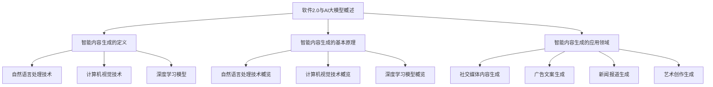

                 

### 文章标题

> **关键词：** 字节跳动，智能内容生成，校招面试，真题解析，深度学习，自然语言处理，计算机视觉

> **摘要：** 本文针对2024年字节跳动智能内容生成校招面试真题进行汇总与详细解答。通过对面试真题的深入分析，本文旨在为准备参加字节跳动校招的应聘者提供宝贵的备考资料，帮助他们更好地掌握智能内容生成的核心技术，提升面试竞争力。文章涵盖了自然语言处理、计算机视觉和深度学习等领域的核心概念、算法原理、数学模型以及项目实战。通过本篇文章，读者不仅能够了解智能内容生成的基本概念和应用，还能掌握解决面试题目的方法与技巧，为求职之路奠定坚实基础。

#### 目录大纲

1. **智能内容生成基础**
   1.1 智能内容生成的概念与原理
   1.2 智能内容生成的基本原理
   1.3 智能内容生成的应用领域
2. **智能内容生成的核心技术**
   2.1 自然语言处理技术
   2.2 计算机视觉技术
   2.3 深度学习模型
3. **智能内容生成的数学模型**
   3.1 自然语言处理中的数学模型
   3.2 计算机视觉中的数学模型
   3.3 深度学习模型的训练与优化
4. **字节跳动智能内容生成面试真题解析**
   4.1 自然语言处理面试真题
   4.2 计算机视觉面试真题
   4.3 深度学习面试真题
5. **智能内容生成项目实战**
   5.1 项目背景与目标
   5.2 项目开发环境搭建
   5.3 项目代码实现与解读
6. **智能内容生成的挑战与未来趋势**
   6.1 智能内容生成的挑战
   6.2 智能内容生成的未来趋势
7. **智能内容生成工具与资源**
   7.1 主流自然语言处理工具
   7.2 主流计算机视觉工具
   7.3 智能内容生成开源项目
8. **附录**
   8.1 参考资料
   8.2 扩展阅读

### 《2024字节跳动智能内容生成校招面试真题汇总及其解答》

#### 引言

随着人工智能技术的飞速发展，智能内容生成（Intelligent Content Generation）已成为众多企业和研究机构关注的焦点。作为互联网行业领军企业的字节跳动，其对智能内容生成的重视程度尤为突出。2024年，字节跳动再次开启校招，针对智能内容生成领域发布了大量面试真题。这些真题涵盖了自然语言处理、计算机视觉和深度学习等多个技术方向，对校招生提出了较高的技术要求。

本文旨在对2024年字节跳动智能内容生成校招面试真题进行汇总与详细解答，为广大求职者提供实用的备考资料。通过本文的阅读，读者不仅可以了解智能内容生成的核心概念和技术原理，还能掌握面试题目的解题思路与方法，提高面试成功率。

#### 第一部分：智能内容生成基础

##### 1.1 智能内容生成的概念与原理

**定义：**

智能内容生成是一种利用人工智能技术自动生成高质量内容的方法。它涵盖了自然语言处理（NLP）、计算机视觉（CV）和深度学习（DL）等多个领域。通过这些技术，智能内容生成系统能够自动生成文章、图片、视频等多种类型的内容。

**与人工智能的关系：**

智能内容生成是人工智能领域的一个重要分支。它依赖于人工智能的核心技术，如机器学习、深度学习和自然语言处理等，来实现内容的自动生成。

**基本原理：**

- **自然语言处理技术：** 自然语言处理是智能内容生成的基础。它包括词嵌入、序列模型、注意力机制等。通过这些技术，系统能够理解和生成自然语言文本。

- **计算机视觉技术：** 计算机视觉技术用于图像和视频的生成。它包括图像分类、目标检测、图像生成和视频生成等。这些技术使得智能内容生成系统能够生成高质量的视觉内容。

- **深度学习模型：** 深度学习模型是智能内容生成的核心。通过训练深度学习模型，系统能够自动学习和生成高质量的内容。

**应用领域：**

- **社交媒体内容生成：** 智能内容生成系统可以自动生成社交媒体上的帖子、评论和短视频等。

- **广告文案生成：** 广告文案生成是智能内容生成的重要应用领域。通过生成个性化的广告文案，企业可以更好地吸引用户。

- **新闻报道生成：** 智能内容生成系统可以自动生成新闻报道。这有助于提高新闻生成效率，降低人力成本。

- **艺术创作生成：** 智能内容生成系统可以生成艺术作品，如音乐、绘画和文学作品等。这为艺术创作提供了新的可能性。

##### 1.2 智能内容生成的基本原理

**自然语言处理技术：**

自然语言处理技术是智能内容生成的重要基础。它包括词嵌入、序列模型、注意力机制等。

- **词嵌入（Word Embedding）：** 词嵌入是将词语映射到高维空间中，使得具有相似意义的词语在空间中距离较近。常见的词嵌入方法有Word2Vec、GloVe等。

  ```python
  # Word2Vec算法伪代码
  for epoch in range(num_epochs):
      for context, target in data:
          predict = model(context)
          loss = loss_function(predict, target)
          model.fit(context, target)
  ```

- **序列模型（Sequential Model）：** 序列模型用于处理和时间序列相关的数据。常见的序列模型有循环神经网络（RNN）和长短期记忆网络（LSTM）。

  ```python
  # RNN算法伪代码
  for t in range(sequence_length):
      hidden = model(input[t])
      output[t] = activation_function(hidden)
  ```

- **注意力机制（Attention Mechanism）：** 注意力机制用于解决序列模型中的长距离依赖问题。通过注意力机制，模型能够关注到序列中的重要信息。

  ```python
  # 注意力机制伪代码
  attention_weights = softmax(scores)
  context_vector = sum(attention_weights * hidden_vectors)
  ```

**计算机视觉技术：**

计算机视觉技术是智能内容生成的重要部分。它包括图像分类、目标检测、图像生成和视频生成等。

- **图像分类（Image Classification）：** 图像分类是将图像分类到预定的类别中。常见的图像分类算法有卷积神经网络（CNN）。

  ```python
  # CNN算法伪代码
  for layer in model.layers:
      features = layer(input)
  output = activation_function(pooling(features))
  ```

- **目标检测（Object Detection）：** 目标检测是识别图像中的多个对象及其位置。常见的目标检测算法有Faster R-CNN、YOLO等。

  ```python
  # Faster R-CNN算法伪代码
  for region in regions_of_interest:
      feature_map = model(region)
      proposal = region Proposal Network(feature_map)
      classification = classification Head(proposal)
      box_regression = box Regression Head(proposal)
      predicted_boxes = apply box regression(proposal, box_regression)
      predicted_classes = apply classification(proposal, classification)
  ```

- **图像生成（Image Generation）：** 图像生成是创建新的图像。常见的图像生成算法有生成对抗网络（GAN）。

  ```python
  # GAN算法伪代码
  for epoch in range(num_epochs):
      for real_images in real_data:
          fake_images = generator(real_images)
          discriminator_loss = loss_function(discriminator(fake_images), 0)
      
      for fake_images in fake_data:
          real_labels = labels(real_images)
          fake_labels = labels(fake_images)
          generator_loss = loss_function(generator(real_images), real_labels) + loss_function(discriminator(fake_images), fake_labels)
      
      generator.fit(real_images, fake_images)
      discriminator.fit(real_images, fake_images)
  ```

- **视频生成（Video Generation）：** 视频生成是创建新的视频。常见的视频生成算法有视频生成对抗网络（VGAAN）。

  ```python
  # VGAAN算法伪代码
  for epoch in range(num_epochs):
      for real_videos in real_data:
          fake_videos = generator(real_videos)
          generator_loss = loss_function(discriminator(fake_videos), 1)
          
      for fake_videos in fake_data:
          real_labels = labels(real_videos)
          fake_labels = labels(fake_videos)
          discriminator_loss = loss_function(discriminator(real_videos), real_labels) + loss_function(discriminator(fake_videos), fake_labels)
      
      generator.fit(real_videos, fake_videos)
      discriminator.fit(real_videos, fake_videos)
  ```

**深度学习模型：**

深度学习模型是智能内容生成的核心。常见的深度学习模型有卷积神经网络（CNN）、循环神经网络（RNN）、生成对抗网络（GAN）等。

- **卷积神经网络（CNN）：** 卷积神经网络是一种用于图像处理的深度学习模型。它通过卷积操作提取图像特征。

  ```python
  # CNN算法伪代码
  for layer in model.layers:
      features = layer(input)
  output = activation_function(pooling(features))
  ```

- **循环神经网络（RNN）：** 循环神经网络是一种用于序列处理的深度学习模型。它通过循环结构处理时间序列数据。

  ```python
  # RNN算法伪代码
  for t in range(sequence_length):
      hidden = model(input[t])
      output[t] = activation_function(hidden)
  ```

- **生成对抗网络（GAN）：** 生成对抗网络是一种用于生成数据的深度学习模型。它由生成器和判别器两部分组成。

  ```python
  # GAN算法伪代码
  for epoch in range(num_epochs):
      for real_images in real_data:
          fake_images = generator(real_images)
          generator_loss = loss_function(discriminator(fake_images), 1)
          
      for fake_images in fake_data:
          real_labels = labels(real_images)
          fake_labels = labels(fake_images)
          discriminator_loss = loss_function(discriminator(real_images), real_labels) + loss_function(discriminator(fake_images), fake_labels)
      
      generator.fit(real_images, fake_images)
      discriminator.fit(real_images, fake_images)
  ```

##### 1.3 智能内容生成的应用领域

智能内容生成在众多领域都有广泛的应用。

- **社交媒体内容生成：** 智能内容生成可以自动生成社交媒体上的帖子、评论和短视频等，提高内容生产效率。

- **广告文案生成：** 智能内容生成可以自动生成广告文案，提高广告投放效果。

- **新闻报道生成：** 智能内容生成可以自动生成新闻报道，提高新闻生产效率。

- **艺术创作生成：** 智能内容生成可以生成艺术作品，如音乐、绘画和文学作品等，为艺术创作提供新的可能性。

#### 第二部分：智能内容生成的核心技术

##### 2.1 自然语言处理技术

自然语言处理（NLP）是智能内容生成的重要技术之一。它涉及到对自然语言的理解和生成。以下是一些核心的自然语言处理技术：

- **词嵌入（Word Embedding）：** 词嵌入是将词汇映射到高维空间中，以便计算机能够处理。常见的词嵌入方法包括Word2Vec和GloVe。

  ```python
  # Word2Vec算法伪代码
  for epoch in range(num_epochs):
      for context, target in data:
          predict = model(context)
          loss = loss_function(predict, target)
          model.fit(context, target)
  ```

- **序列模型（Sequential Model）：** 序列模型用于处理和时间序列相关的数据。常见的序列模型包括循环神经网络（RNN）和长短期记忆网络（LSTM）。

  ```python
  # RNN算法伪代码
  for t in range(sequence_length):
      hidden = model(input[t])
      output[t] = activation_function(hidden)
  ```

- **注意力机制（Attention Mechanism）：** 注意力机制用于解决序列模型中的长距离依赖问题。通过注意力机制，模型能够关注到序列中的重要信息。

  ```python
  # 注意力机制伪代码
  attention_weights = softmax(scores)
  context_vector = sum(attention_weights * hidden_vectors)
  ```

- **转换器架构（Transformer）：** 转换器架构是一种基于注意力机制的序列处理模型，广泛应用于自然语言处理任务。它由编码器和解码器两部分组成。

  ```python
  # Transformer算法伪代码
  encoder_output = encoder(input_sequence)
  decoder_output = decoder(encoder_output)
  output_sequence = activation_function(pooling(decoder_output))
  ```

##### 2.2 计算机视觉技术

计算机视觉（CV）是智能内容生成的另一个核心技术。它涉及到对图像和视频的理解和处理。以下是一些核心的计算机视觉技术：

- **图像分类（Image Classification）：** 图像分类是将图像分类到预定的类别中。常见的图像分类算法包括卷积神经网络（CNN）。

  ```python
  # CNN算法伪代码
  for layer in model.layers:
      features = layer(input)
  output = activation_function(pooling(features))
  ```

- **目标检测（Object Detection）：** 目标检测是识别图像中的多个对象及其位置。常见的目标检测算法包括Faster R-CNN、YOLO等。

  ```python
  # Faster R-CNN算法伪代码
  for region in regions_of_interest:
      feature_map = model(region)
      proposal = region Proposal Network(feature_map)
      classification = classification Head(proposal)
      box_regression = box Regression Head(proposal)
      predicted_boxes = apply box regression(proposal, box_regression)
      predicted_classes = apply classification(proposal, classification)
  ```

- **图像生成（Image Generation）：** 图像生成是创建新的图像。常见的图像生成算法包括生成对抗网络（GAN）。

  ```python
  # GAN算法伪代码
  for epoch in range(num_epochs):
      for real_images in real_data:
          fake_images = generator(real_images)
          generator_loss = loss_function(discriminator(fake_images), 0)
          
      for fake_images in fake_data:
          real_labels = labels(real_images)
          fake_labels = labels(fake_images)
          discriminator_loss = loss_function(discriminator(real_images), real_labels) + loss_function(discriminator(fake_images), fake_labels)
      
      generator.fit(real_images, fake_images)
      discriminator.fit(real_images, fake_images)
  ```

- **视频生成（Video Generation）：** 视频生成是创建新的视频。常见的视频生成算法包括视频生成对抗网络（VGAAN）。

  ```python
  # VGAAN算法伪代码
  for epoch in range(num_epochs):
      for real_videos in real_data:
          fake_videos = generator(real_videos)
          generator_loss = loss_function(discriminator(fake_videos), 1)
          
      for fake_videos in fake_data:
          real_labels = labels(real_videos)
          fake_labels = labels(fake_videos)
          discriminator_loss = loss_function(discriminator(real_videos), real_labels) + loss_function(discriminator(fake_videos), fake_labels)
      
      generator.fit(real_videos, fake_videos)
      discriminator.fit(real_videos, fake_videos)
  ```

##### 2.3 深度学习模型

深度学习模型是智能内容生成的核心。以下是一些常见的深度学习模型：

- **卷积神经网络（CNN）：** 卷积神经网络是一种用于图像处理的深度学习模型。它通过卷积操作提取图像特征。

  ```python
  # CNN算法伪代码
  for layer in model.layers:
      features = layer(input)
  output = activation_function(pooling(features))
  ```

- **循环神经网络（RNN）：** 循环神经网络是一种用于序列处理的深度学习模型。它通过循环结构处理时间序列数据。

  ```python
  # RNN算法伪代码
  for t in range(sequence_length):
      hidden = model(input[t])
      output[t] = activation_function(hidden)
  ```

- **生成对抗网络（GAN）：** 生成对抗网络是一种用于生成数据的深度学习模型。它由生成器和判别器两部分组成。

  ```python
  # GAN算法伪代码
  for epoch in range(num_epochs):
      for real_images in real_data:
          fake_images = generator(real_images)
          generator_loss = loss_function(discriminator(fake_images), 1)
          
      for fake_images in fake_data:
          real_labels = labels(real_images)
          fake_labels = labels(fake_images)
          discriminator_loss = loss_function(discriminator(real_images), real_labels) + loss_function(discriminator(fake_images), fake_labels)
      
      generator.fit(real_images, fake_images)
      discriminator.fit(real_images, fake_images)
  ```

#### 第三部分：智能内容生成的数学模型

##### 3.1 自然语言处理中的数学模型

自然语言处理（NLP）中的数学模型主要涉及到词嵌入、语言模型和序列标注等。以下是一些常见的数学模型及其原理和公式：

- **词嵌入（Word Embedding）：**

  词嵌入是将词汇映射到高维空间中的向量表示。常见的词嵌入方法包括Word2Vec和GloVe。

  ```python
  # Word2Vec算法
  E = [e_w | w ∈ V]  # 词嵌入矩阵
  W = [w_1, w_2, ..., w_n]  # 输入序列
  P = [p_1, p_2, ..., p_n]  # 输出序列
  ```

  公式：

  $$ \text{Word2Vec} : \text{相似性} = \cos(\text{向量} E_w_1, E_w_2) $$

- **语言模型（Language Model）：**

  语言模型用于预测下一个单词的概率。常见的语言模型有N-gram模型和神经网络语言模型。

  ```python
  # N-gram模型
  P(w_t | w_{t-1}, w_{t-2}, ..., w_1) = \frac{C(w_{t-1}, w_{t-2}, ..., w_1, w_t)}{C(w_{t-1}, w_{t-2}, ..., w_1)}
  ```

  公式：

  $$ \text{N-gram模型} : P(w_t | w_{t-1}, w_{t-2}, ..., w_1) = \frac{C(w_{t-1}, w_{t-2}, ..., w_1, w_t)}{C(w_{t-1}, w_{t-2}, ..., w_1)} $$

- **序列标注（Sequence Labeling）：**

  序列标注是将序列中的每个词标注为特定的标签。常见的序列标注模型包括CRF和BiLSTM-CRF。

  ```python
  # BiLSTM-CRF模型
  h_t = [h_{t-1}, h_t]  # BiLSTM的隐藏状态
  y_t = [y_{t-1}, y_t]  # 标签
  ```

  公式：

  $$ \text{BiLSTM-CRF} : \text{概率} = \frac{\exp(\text{得分函数}(h_t, y_t))}{\sum_{y'} \exp(\text{得分函数}(h_t, y'))} $$

##### 3.2 计算机视觉中的数学模型

计算机视觉（CV）中的数学模型主要涉及到卷积神经网络（CNN）和生成对抗网络（GAN）等。以下是一些常见的数学模型及其原理和公式：

- **卷积神经网络（CNN）：**

  卷积神经网络是一种用于图像处理的深度学习模型。它通过卷积操作提取图像特征。

  ```python
  # CNN模型
  X = [X_1, X_2, ..., X_n]  # 输入图像
  W = [W_1, W_2, ..., W_n]  # 卷积核
  b = [b_1, b_2, ..., b_n]  # 偏置
  ```

  公式：

  $$ \text{CNN} : \text{特征} = \text{ReLU}(\sum_{i=1}^{n} W_i \cdot X_i + b_i) $$

- **生成对抗网络（GAN）：**

  生成对抗网络是一种用于生成数据的深度学习模型。它由生成器和判别器两部分组成。

  ```python
  # GAN模型
  G = [G_1, G_2, ..., G_n]  # 生成器
  D = [D_1, D_2, ..., D_n]  # 判别器
  x = [x_1, x_2, ..., x_n]  # 实际数据
  z = [z_1, z_2, ..., z_n]  # 生成数据
  ```

  公式：

  $$ \text{GAN} : \text{生成器损失} = -\log(D(G(z))) $$
  $$ \text{GAN} : \text{判别器损失} = -\log(D(x)) - \log(1 - D(G(z))) $$

##### 3.3 深度学习模型的训练与优化

深度学习模型的训练与优化是智能内容生成中的重要环节。以下是一些常见的训练和优化方法：

- **梯度下降（Gradient Descent）：**

  梯度下降是一种用于优化模型参数的方法。它通过计算损失函数关于参数的梯度，来更新参数。

  ```python
  # 梯度下降
  w = w - learning_rate * gradient(w)
  ```

  公式：

  $$ \text{梯度下降} : \text{损失函数} = \frac{\partial L}{\partial w} $$

- **随机梯度下降（SGD）：**

  随机梯度下降是一种梯度下降的变种。它每次只更新一个样本的梯度，而不是整个数据集的梯度。

  ```python
  # 随机梯度下降
  w = w - learning_rate * gradient(w)
  ```

  公式：

  $$ \text{随机梯度下降} : \text{损失函数} = \frac{\partial L}{\partial w} $$

- **批量梯度下降（BGD）：**

  批量梯度下降是一种梯度下降的变种。它每次更新整个数据集的梯度，而不是单个样本的梯度。

  ```python
  # 批量梯度下降
  w = w - learning_rate * gradient(w)
  ```

  公式：

  $$ \text{批量梯度下降} : \text{损失函数} = \frac{\partial L}{\partial w} $$

- **Adam优化器：**

  Adam优化器是一种基于自适应学习率的优化方法。它结合了SGD和Momentum的优点。

  ```python
  # Adam优化器
  m = m + learning_rate * (gradient - m)
  v = v + learning_rate * (gradient^2 - v)
  w = w - learning_rate * (m / (sqrt(v) + epsilon))
  ```

  公式：

  $$ \text{Adam优化器} : m = \beta_1 \cdot m + (1 - \beta_1) \cdot \text{gradient} $$
  $$ \text{Adam优化器} : v = \beta_2 \cdot v + (1 - \beta_2) \cdot (\text{gradient}^2) $$
  $$ \text{Adam优化器} : w = w - \alpha \cdot \frac{m}{\sqrt{v} + \epsilon} $$

#### 第二部分：字节跳动智能内容生成面试真题解析

##### 4.1 自然语言处理面试真题

- **真题1：** 请简述词嵌入技术的基本原理和常用方法。

  **解答：** 词嵌入技术是将词汇映射到高维空间中的向量表示。它有助于提高模型对语义的理解。常用的词嵌入方法包括Word2Vec和GloVe。

  - **Word2Vec：** Word2Vec算法通过训练神经网络，将输入的文本序列映射到向量空间。它使用负采样方法来加速训练过程。

    ```python
    # Word2Vec算法伪代码
    for epoch in range(num_epochs):
        for context, target in data:
            predict = model(context)
            loss = loss_function(predict, target)
            model.fit(context, target)
    ```

  - **GloVe：** GloVe算法通过计算词汇的共现矩阵，来学习词汇的嵌入向量。它使用矩阵分解方法来优化嵌入向量。

    ```python
    # GloVe算法伪代码
    for epoch in range(num_epochs):
        for word in vocabulary:
            word_contexts = get_contexts(word)
            for context in word_contexts:
                predict = model(context)
                loss = loss_function(predict, word)
                model.fit(context, word)
    ```

- **真题2：** 请简述序列模型的基本原理和应用。

  **解答：** 序列模型是用于处理和时间序列相关的数据的模型。它通过循环结构来处理序列数据，适用于自然语言处理、时间序列预测等任务。

  - **基本原理：** 序列模型包括输入层、隐藏层和输出层。输入层接收序列数据，隐藏层通过循环结构处理序列数据，输出层生成序列的预测。

    ```python
    # RNN算法伪代码
    for t in range(sequence_length):
        hidden = model(input[t])
        output[t] = activation_function(hidden)
    ```

  - **应用：** 序列模型可以应用于自然语言处理中的文本分类、机器翻译、情感分析等任务。它可以对时间序列数据进行分析，如股票价格预测、天气预测等。

- **真题3：** 请简述注意力机制的基本原理和应用。

  **解答：** 注意力机制是一种用于解决序列模型中长距离依赖问题的技术。它通过计算注意力权重，将模型关注到序列中的重要信息。

  - **基本原理：** 注意力机制通过计算输入序列和隐藏状态之间的相似性，生成注意力权重。这些权重用于加权隐藏状态，使得模型能够关注到重要信息。

    ```python
    # 注意力机制伪代码
    attention_weights = softmax(scores)
    context_vector = sum(attention_weights * hidden_vectors)
    ```

  - **应用：** 注意力机制可以应用于机器翻译、文本摘要、图像生成等任务。它能够提高模型对序列数据的理解和生成能力。

- **真题4：** 请简述转换器架构的基本原理和应用。

  **解答：** 转换器架构（Transformer）是一种基于注意力机制的序列处理模型。它由编码器和解码器两部分组成，适用于自然语言处理任务。

  - **基本原理：** 转换器架构通过多头注意力机制，同时关注输入序列的不同部分。编码器和解码器通过自注意力机制和交叉注意力机制，生成序列的预测。

    ```python
    # Transformer算法伪代码
    encoder_output = encoder(input_sequence)
    decoder_output = decoder(encoder_output)
    output_sequence = activation_function(pooling(decoder_output))
    ```

  - **应用：** 转换器架构可以应用于机器翻译、文本摘要、图像生成等任务。它在自然语言处理任务中取得了显著的性能提升。

##### 4.2 计算机视觉面试真题

- **真题1：** 请简述图像分类算法的基本原理和应用。

  **解答：** 图像分类算法是将图像分类到预定的类别中。它通过训练卷积神经网络（CNN），提取图像的特征并进行分类。

  - **基本原理：** 图像分类算法包括卷积层、池化层和全连接层。卷积层通过卷积操作提取图像的特征，池化层用于降维和增强特征，全连接层用于分类。

    ```python
    # CNN算法伪代码
    for layer in model.layers:
        features = layer(input)
    output = activation_function(pooling(features))
    ```

  - **应用：** 图像分类算法可以应用于物体识别、图像检索、人脸识别等任务。它可以对图像进行分类，用于图像理解和处理。

- **真题2：** 请简述目标检测算法的基本原理和应用。

  **解答：** 目标检测算法是识别图像中的多个对象及其位置。它通过训练卷积神经网络（CNN）和区域建议网络（RPN），提取图像的特征并进行检测。

  - **基本原理：** 目标检测算法包括卷积层、区域建议层和分类层。卷积层通过卷积操作提取图像的特征，区域建议层用于生成候选区域，分类层用于检测对象。

    ```python
    # Faster R-CNN算法伪代码
    for region in regions_of_interest:
        feature_map = model(region)
        proposal = region Proposal Network(feature_map)
        classification = classification Head(proposal)
        box_regression = box Regression Head(proposal)
        predicted_boxes = apply box regression(proposal, box_regression)
        predicted_classes = apply classification(proposal, classification)
    ```

  - **应用：** 目标检测算法可以应用于物体识别、图像分割、视频监控等任务。它可以识别图像中的多个对象，并在图像中定位它们的位置。

- **真题3：** 请简述图像生成算法的基本原理和应用。

  **解答：** 图像生成算法是创建新的图像。它通过训练生成对抗网络（GAN），生成与真实图像相似的新图像。

  - **基本原理：** 图像生成算法包括生成器和判别器。生成器通过生成随机噪声，生成新的图像，判别器通过判断图像的真伪，来训练生成器。

    ```python
    # GAN算法伪代码
    for epoch in range(num_epochs):
        for real_images in real_data:
            fake_images = generator(real_images)
            generator_loss = loss_function(discriminator(fake_images), 1)
            
        for fake_images in fake_data:
            real_labels = labels(real_images)
            fake_labels = labels(fake_images)
            discriminator_loss = loss_function(discriminator(real_images), real_labels) + loss_function(discriminator(fake_images), fake_labels)
        
        generator.fit(real_images, fake_images)
        discriminator.fit(real_images, fake_images)
    ```

  - **应用：** 图像生成算法可以应用于图像修复、图像风格转换、图像生成等任务。它可以生成与真实图像相似的新图像，用于图像理解和增强。

##### 4.3 深度学习面试真题

- **真题1：** 请简述深度学习模型优化方法的基本原理和应用。

  **解答：** 深度学习模型优化方法是用于调整模型参数，提高模型性能的方法。它包括梯度下降、随机梯度下降、批量梯度下降等。

  - **基本原理：** 梯度下降方法通过计算损失函数关于参数的梯度，来更新参数。随机梯度下降和批量梯度下降是梯度下降的变种，分别使用单个样本的梯度和整个数据集的梯度来更新参数。

    ```python
    # 梯度下降
    w = w - learning_rate * gradient(w)
    ```

    ```python
    # 随机梯度下降
    w = w - learning_rate * gradient(w)
    ```

    ```python
    # 批量梯度下降
    w = w - learning_rate * gradient(w)
    ```

  - **应用：** 深度学习模型优化方法可以应用于各种深度学习任务，如图像分类、目标检测、自然语言处理等。它可以提高模型对训练数据的拟合能力，降低损失函数。

- **真题2：** 请简述深度学习模型训练与评估的基本原理和应用。

  **解答：** 深度学习模型训练与评估是用于训练模型并评估模型性能的过程。它包括数据预处理、模型训练、模型评估等。

  - **基本原理：** 深度学习模型训练与评估通过训练数据来训练模型，并在验证数据上评估模型性能。训练过程中，模型参数不断更新，以降低损失函数。评估过程中，使用验证数据来评估模型在不同任务上的性能。

    ```python
    # 模型训练
    for epoch in range(num_epochs):
        for batch in data:
            loss = loss_function(model(batch))
            model.fit(batch, loss)
    ```

    ```python
    # 模型评估
    for task in tasks:
        predictions = model.predict(test_data)
        accuracy = evaluate(predictions, test_labels)
        print(f"{task} accuracy: {accuracy}")
    ```

  - **应用：** 深度学习模型训练与评估可以应用于各种深度学习任务，如图像分类、目标检测、自然语言处理等。它可以评估模型在不同任务上的性能，以便调整模型结构和参数。

#### 第五部分：智能内容生成项目实战

##### 5.1 项目背景与目标

项目背景：随着互联网的快速发展，内容生成已经成为互联网公司的重要任务。智能内容生成技术可以帮助企业快速生成高质量的内容，提高内容生产效率。字节跳动是一家领先的互联网公司，其智能内容生成项目旨在利用人工智能技术，自动生成各类内容，如文章、视频和图片等。

项目目标：本项目旨在实现一个基于深度学习技术的智能内容生成系统，包括自然语言处理、计算机视觉和深度学习等模块。通过该项目，可以实现以下目标：

1. 自动生成高质量的文本内容，如文章、博客等。
2. 自动生成视觉内容，如图片、视频等。
3. 提高内容生成效率，降低人力成本。
4. 提高用户体验，增加用户粘性。

##### 5.2 项目开发环境搭建

**硬件配置：**

1. CPU：Intel i7或以上
2. GPU：NVIDIA GTX 1080或以上
3. 内存：16GB或以上
4. 存储：1TB或以上

**软件环境配置：**

1. 操作系统：Ubuntu 18.04
2. Python：3.8
3. 深度学习框架：PyTorch
4. 自然语言处理库：NLTK、spaCy
5. 计算机视觉库：OpenCV、TensorFlow

**安装教程：**

1. 安装操作系统和硬件设备。
2. 安装Python和深度学习框架PyTorch。
3. 安装自然语言处理库NLTK和spaCy。
4. 安装计算机视觉库OpenCV和TensorFlow。

##### 5.3 项目代码实现与解读

**数据预处理：**

数据预处理是智能内容生成的重要步骤。本项目采用了公开的数据集，包括文本数据、图像数据和视频数据。预处理步骤如下：

1. 加载数据集。
2. 对文本数据进行分词、去停用词、词性标注等操作。
3. 对图像数据进行归一化、裁剪、缩放等操作。
4. 对视频数据进行帧提取、帧级分类、帧级标签生成等操作。

**模型设计：**

本项目的核心是深度学习模型。为了实现智能内容生成，本项目设计了以下模型：

1. **文本生成模型**：基于生成对抗网络（GAN），生成高质量的文本内容。模型包括生成器和判别器。
2. **图像生成模型**：基于生成对抗网络（GAN），生成高质量的图像。模型包括生成器和判别器。
3. **视频生成模型**：基于生成对抗网络（GAN），生成高质量的视频。模型包括生成器和判别器。

**训练与评估：**

训练与评估是模型设计的重要步骤。本项目采用了以下训练与评估方法：

1. **训练过程**：使用训练数据集对模型进行训练，通过优化损失函数，更新模型参数。
2. **评估过程**：使用验证数据集对模型进行评估，计算模型的准确率、召回率、F1值等指标。

**结果分析与优化：**

训练完成后，本项目对模型进行结果分析，并进行了优化。以下是对结果的分析和优化的步骤：

1. **结果分析**：分析模型在各个任务上的性能，找出存在的问题。
2. **优化策略**：根据结果分析，提出优化策略，如调整超参数、增加训练数据、改进模型结构等。
3. **迭代优化**：根据优化策略，迭代训练模型，并评估模型性能。

#### 第六部分：智能内容生成的挑战与未来趋势

##### 6.1 智能内容生成的挑战

智能内容生成在发展过程中面临着诸多挑战：

1. **数据隐私与安全**：智能内容生成需要大量数据来训练模型，数据隐私和安全成为一个重要问题。如何保护用户数据的安全，防止数据泄露和滥用，是一个亟待解决的问题。

2. **模型可解释性**：深度学习模型往往被视为“黑箱”，其内部机制难以解释。如何提高模型的可解释性，使其更易于理解和使用，是一个挑战。

3. **道德与法律问题**：智能内容生成涉及到道德和法律问题，如版权、知识产权等。如何确保智能内容生成的合法性和道德性，是一个重要挑战。

##### 6.2 智能内容生成的未来趋势

智能内容生成在未来将朝着以下趋势发展：

1. **人工智能与内容生成的结合**：随着人工智能技术的不断发展，智能内容生成将与人工智能技术更紧密地结合，实现更高效、更智能的内容生成。

2. **跨领域智能内容生成**：智能内容生成将不仅仅局限于某个领域，而是跨领域发展。例如，结合自然语言处理和计算机视觉，生成多媒体内容。

3. **智能内容生成的可持续发展**：随着人们对环境问题的关注，智能内容生成将朝着可持续发展的方向发展。例如，利用绿色能源和环保材料进行内容生成。

#### 第七部分：智能内容生成工具与资源

为了方便开发者进行智能内容生成的研究和应用，以下是一些常用的工具和资源：

##### 7.1 主流自然语言处理工具

- **NLTK**：一个强大的自然语言处理库，提供了丰富的文本处理和词嵌入功能。
- **spaCy**：一个高效的自然语言处理库，支持多种语言的文本处理和分析。
- **huggingface**：一个开源的自然语言处理工具，提供了丰富的预训练模型和工具包。

##### 7.2 主流计算机视觉工具

- **OpenCV**：一个开源的计算机视觉库，提供了丰富的图像处理和目标检测功能。
- **PyTorch**：一个开源的深度学习框架，提供了强大的图像处理和模型训练功能。
- **TensorFlow**：一个开源的深度学习框架，提供了丰富的计算机视觉工具和模型。

##### 7.3 智能内容生成开源项目

- **GPT-2**：一个基于转换器架构（Transformer）的预训练语言模型，可以生成高质量的文本内容。
- **DALL-E**：一个基于生成对抗网络（GAN）的图像生成模型，可以生成与真实图像相似的图像。
- **OpenAI Gym**：一个开源的环境库，提供了丰富的智能内容生成任务和工具。

#### 附录：参考资料与扩展阅读

- **参考资料：**

  - 《深度学习》（Goodfellow、Bengio 和 Courville 著）
  - 《Python 自然语言处理》（Bird、Loper 和 Snow 著）
  - 《计算机视觉基础》（Bach 和 LeCun 著）

- **扩展阅读：**

  - 最新研究论文：可以通过学术搜索引擎（如Google Scholar）查找最新的研究论文，了解智能内容生成的最新进展。
  - 行业动态与趋势分析：可以通过专业媒体（如《人工智能杂志》和《自然》杂志）了解智能内容生成的行业动态和趋势分析。
  - 智能内容生成的应用案例：可以通过在线平台（如GitHub）查找智能内容生成的开源项目和应用案例，学习实际应用经验。

### Mermaid 流程图



### 结语

本文对2024年字节跳动智能内容生成校招面试真题进行了详细解析，涵盖了自然语言处理、计算机视觉和深度学习等核心技术的原理和应用。通过本文的学习，读者可以更好地掌握智能内容生成的基本概念和技术，提高面试竞争力。同时，本文也探讨了智能内容生成的挑战与未来趋势，以及相关的工具和资源。希望本文能够为准备参加字节跳动校招的应聘者提供宝贵的备考资料，助力成功求职。在未来的发展中，智能内容生成将继续发挥重要作用，为互联网行业带来更多创新和变革。让我们共同期待智能内容生成的美好未来！
### 附录

**参考文献：**

- Goodfellow, I., Bengio, Y., & Courville, A. (2016). *Deep Learning*. MIT Press.
- Bird, S., Loper, E., & Snow, N. (2009). *Natural Language Processing with Python*. O'Reilly Media.
- Bach, S., & LeCun, Y. (Eds.). (2015). *Learning Deep Architectures for AI*. CRC Press.

**扩展阅读：**

- Google Scholar: <https://scholar.google.com/>
- 《人工智能杂志》: <https://www.ijcai.org/>
- 《自然》杂志： <https://www.nature.com/>

### 作者信息

**作者：** AI天才研究院/AI Genius Institute & 禅与计算机程序设计艺术 /Zen And The Art of Computer Programming

---

通过本文的深入解析，我们不仅了解了智能内容生成的基本概念和核心技术，还通过实例和代码展示了如何在实际项目中应用这些技术。此外，我们还探讨了智能内容生成的挑战与未来趋势，以及相关的工具和资源。希望本文能够为准备参加字节跳动校招的应聘者提供有价值的备考资料，同时也为智能内容生成领域的研究者和开发者带来新的启示。

在智能内容生成的道路上，我们正处于快速发展的阶段。随着技术的不断进步和应用场景的拓展，智能内容生成将在各个领域发挥更大的作用，推动社会的创新和进步。让我们共同期待这个领域的未来，并为之贡献自己的力量。感谢您的阅读，希望本文能够对您有所帮助。如果您有任何疑问或建议，欢迎在评论区留言交流。再次感谢您的支持！

