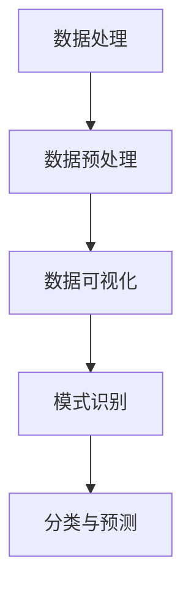
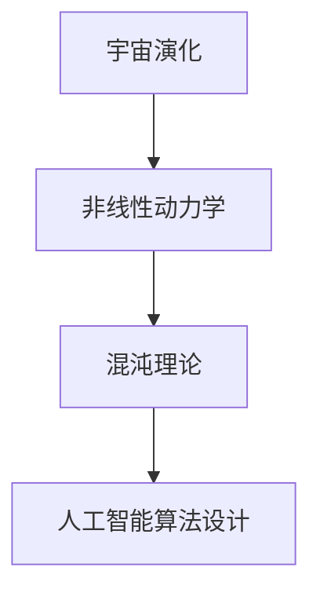
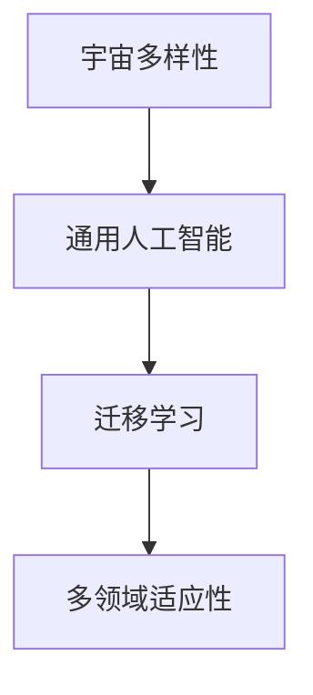
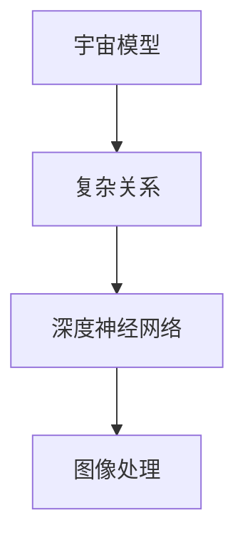
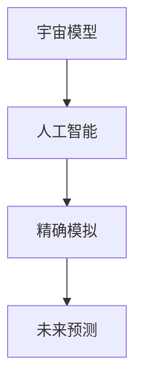
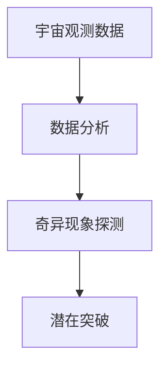
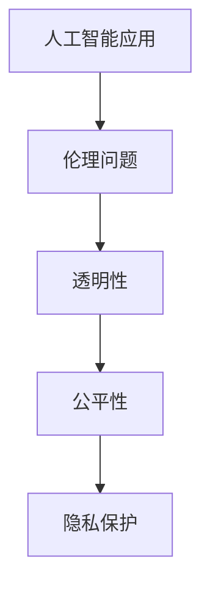
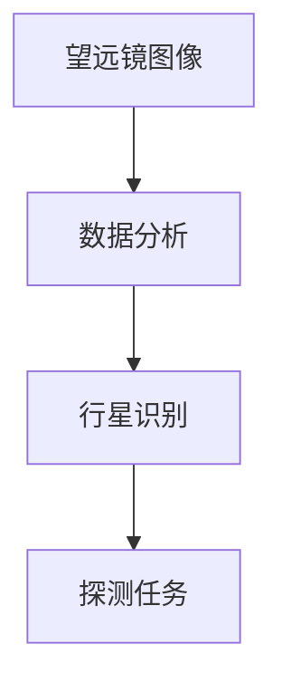
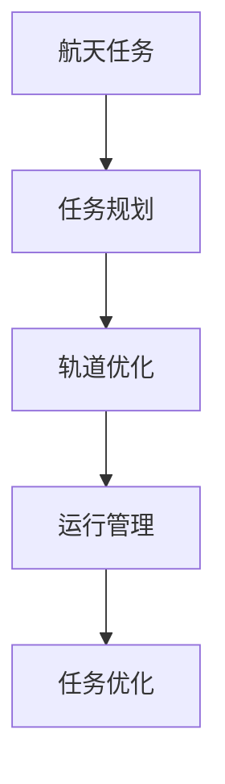

                 

# 宇宙模型与人工智能的探索

## 关键词
- 宇宙模型
- 人工智能
- 深度学习
- 大数据分析
- 航天应用

## 摘要

本文旨在探讨宇宙模型与人工智能（AI）之间的关系，以及它们在科学研究和社会生活领域的应用。通过对宇宙模型的基本知识、人工智能与宇宙模型的关系、结合应用案例以及未来的展望进行分析，本文揭示了宇宙模型与人工智能如何相互影响，共同推动科学进步和社会发展。文章还将探讨宇宙模型与人工智能在伦理问题、技术挑战和未来发展方向等方面的挑战和机遇。

### 目录大纲

#### 第一部分：宇宙模型基础知识

1. 宇宙模型概述
    1.1 宇宙模型的起源与发展
    1.2 标准模型介绍
    1.3 大爆炸理论与宇宙演化

#### 第二部分：人工智能与宇宙模型的关系

2. 人工智能与宇宙模型的关系探讨
    2.1 人工智能在宇宙研究中的应用
    2.2 宇宙模型对人工智能的启示
    2.3 人工智能在宇宙模型研究中的未来趋势

#### 第三部分：宇宙模型与人工智能结合的应用

3. 宇宙模型与人工智能结合的应用案例
    3.1 宇宙模拟与人工智能
    3.2 宇宙探测与人工智能
    3.3 宇宙模型与人工智能在航天领域的应用

4. 深度学习与宇宙模型的应用
    4.1 深度学习在宇宙图像处理中的应用
    4.2 深度学习在宇宙数据挖掘中的应用
    4.3 深度学习在宇宙模拟与预测中的应用

#### 第四部分：未来展望

5. 宇宙模型与人工智能的未来
    5.1 宇宙模型与人工智能的发展趋势
    5.2 宇宙模型与人工智能在科学研究中的应用前景
    5.3 宇宙模型与人工智能在社会生活中的应用前景

6. 伦理、挑战与未来
    6.1 宇宙模型与人工智能的伦理问题
    6.2 宇宙模型与人工智能的技术挑战
    6.3 宇宙模型与人工智能的未来发展方向

7. 结论与展望

#### 附录

8. 参考文献
9. 宇宙模型与人工智能相关的资源与工具

现在，让我们逐步深入探讨这篇文章的各个部分。首先，我们从宇宙模型的基础知识开始。让我们从宇宙模型的概述开始。接下来，我们将分别介绍宇宙模型的起源与发展、标准模型介绍以及大爆炸理论与宇宙演化。通过这些章节，我们将为读者建立一个关于宇宙模型的全面理解，为后续内容奠定基础。

---

### 第一部分：宇宙模型基础知识

#### 第1章：宇宙模型概述

宇宙模型是描述宇宙结构、演化和起源的数学和物理框架。它帮助我们理解宇宙的复杂性和多样性。在本文中，我们将从宇宙模型的概述开始，介绍宇宙模型的起源与发展，标准模型的构成和原理，以及大爆炸理论的提出与发展。

## 1.1 宇宙模型的起源与发展

宇宙模型的概念可以追溯到古代，当时人们根据直观观测和神话传说来解释宇宙。然而，随着科学的发展，人类对宇宙的认识逐渐从直觉和信仰转变为基于观测和实验的证据。

### 1.1.1 宇宙模型的概念与历史背景

宇宙模型是指描述宇宙结构、演化和起源的理论框架。它通常包括一组物理定律和数学方程，用以描述宇宙中各种现象之间的关系。历史上，人类对宇宙的认识经历了多个阶段：

1. **地心说**（约公元前300年）：这是古代宇宙模型的主要形式，认为地球位于宇宙中心，所有天体都围绕地球旋转。
2. **日心说**（约1514年）：哥白尼提出了日心说，认为太阳位于宇宙中心，地球和其他行星围绕太阳旋转。
3. **牛顿力学**（约1687年）：牛顿的万有引力定律和运动定律为理解行星运动提供了更精确的数学描述。
4. **相对论**（约1905年）：爱因斯坦的广义相对论改变了人们对宇宙的理解，提出了时空弯曲和引力波的概念。

### 1.1.2 人类对宇宙认识的演变

人类对宇宙的认识经历了以下几个关键阶段：

1. **早期宇宙观**：古代人类通过神话和宗教来解释宇宙的起源和结构。
2. **地心说时期**：地心说认为地球是宇宙的中心，所有天体都围绕地球旋转。
3. **日心说时期**：哥白尼提出的日心说改变了人们对宇宙结构的认识，太阳成为了宇宙的中心。
4. **现代宇宙学**：随着望远镜和探测器的发展，人类开始通过观测和数据来研究宇宙的起源、演化和结构。
5. **宇宙膨胀理论**：哈勃发现宇宙正在膨胀，这导致了大爆炸理论的提出。

### 1.1.3 宇宙模型的主要类型

现代宇宙学中有几种主要的宇宙模型：

1. **标准模型**：这是目前最广泛接受的宇宙模型，也被称为“大爆炸宇宙模型”。它描述了宇宙从大爆炸开始，经过膨胀和冷却，形成了我们现在所看到的宇宙。
2. **循环宇宙模型**：这种模型认为宇宙经历了无限次的膨胀和收缩。
3. **多宇宙模型**：这种模型认为我们的宇宙只是众多宇宙中的一个，每个宇宙都有可能有自己的物理定律。

## 1.2 标准模型介绍

标准模型是目前宇宙学中最流行和最成功的理论，它为我们提供了宇宙从大爆炸到现在的完整描述。下面我们将详细介绍标准模型的构成、基本原理和应用范围。

### 1.2.1 标准模型的构成

标准模型由以下几个部分组成：

1. **宇宙膨胀**：宇宙在大爆炸后开始膨胀，距离和温度随着时间的推移而增加。
2. **暗物质**：宇宙中存在一种不可见的物质，其引力作用对宇宙结构的形成和演化至关重要。
3. **暗能量**：宇宙中存在一种推动宇宙加速膨胀的力量，其性质和起源仍不完全清楚。
4. **辐射**：早期宇宙充满了热辐射，这些辐射至今仍然存在，并形成了宇宙微波背景辐射。
5. **物质**：宇宙中的物质包括恒星、行星、星系和其他天体。

### 1.2.2 标准模型的基本原理

标准模型的基本原理包括：

1. **宇宙膨胀**：宇宙在加速膨胀，这种膨胀是由于宇宙中的暗能量造成的。
2. **引力**：引力是宇宙中最重要的力，它影响着宇宙中的所有物质。
3. **暗物质**：暗物质通过引力影响宇宙的演化，但它的性质和组成尚不清楚。
4. **暗能量**：暗能量是一种推动宇宙加速膨胀的力量，其性质和起源仍在研究中。

### 1.2.3 标准模型的应用范围

标准模型的应用范围非常广泛，包括：

1. **宇宙微波背景辐射**：这是标准模型的一个重要证据，它显示了宇宙早期的状态。
2. **星系形成和演化**：标准模型帮助我们理解星系的形成和演化过程。
3. **宇宙大尺度结构**：标准模型描述了宇宙中星系、星团和超星系团的结构和分布。
4. **宇宙起源**：标准模型为我们提供了宇宙起源的完整描述。

## 1.3 大爆炸理论与宇宙演化

大爆炸理论是目前宇宙学中最广泛接受的宇宙模型，它描述了宇宙从大爆炸开始，经过膨胀和冷却，最终形成了现在的宇宙。下面我们将介绍大爆炸理论的提出与发展、宇宙演化过程以及大爆炸理论的验证与挑战。

### 1.3.1 大爆炸理论的提出与发展

1. **勒梅特**（1931年）：勒梅特首次提出了大爆炸理论，认为宇宙起源于一个“原始原子”。
2. **伽莫夫**（1948年）：伽莫夫等人进一步发展了大爆炸理论，并提出了“热大爆炸”模型。
3. **彭齐亚斯和威尔逊**（1965年）：他们发现了宇宙微波背景辐射，这是大爆炸理论的强有力证据。
4. **后来的发展**：大爆炸理论得到了更多的观测数据和理论支持，不断完善和发展。

### 1.3.2 宇宙演化过程

宇宙演化过程可以分为以下几个阶段：

1. **大爆炸**：宇宙从一个极高温度和密度的状态开始膨胀。
2. **膨胀**：宇宙在膨胀过程中温度和密度逐渐降低。
3. **物质形成**：在宇宙膨胀的过程中，物质开始形成，包括星系、恒星和行星。
4. **辐射**：宇宙充满了热辐射，这些辐射至今仍然存在，并形成了宇宙微波背景辐射。
5. **冷却**：宇宙在膨胀和冷却的过程中，温度逐渐降低，形成了现在的宇宙。

### 1.3.3 大爆炸理论的验证与挑战

大爆炸理论的验证和挑战主要包括以下几个方面：

1. **宇宙微波背景辐射**：宇宙微波背景辐射是验证大爆炸理论的关键证据之一。
2. **元素合成**：大爆炸理论预测了宇宙中元素的合成过程，这些预测与观测数据相符。
3. **宇宙膨胀**：宇宙膨胀的观测证据支持大爆炸理论。
4. **挑战**：大爆炸理论面临一些挑战，如暗物质和暗能量的性质和起源等。

通过以上章节，我们为读者提供了一个关于宇宙模型的基础知识框架，为后续内容做好了铺垫。在下一部分，我们将探讨人工智能与宇宙模型的关系，以及它们如何相互影响和推动科学进步。

---

在介绍了宇宙模型的基础知识之后，我们将进入第二部分：人工智能与宇宙模型的关系。这一部分将探讨人工智能在宇宙研究中的应用，宇宙模型对人工智能的启示，以及人工智能在宇宙模型研究中的未来趋势。通过这一部分的内容，我们将揭示人工智能与宇宙模型之间的深层联系，并展望它们的未来发展。

## 第二部分：人工智能与宇宙模型的关系

### 第2章：人工智能与宇宙模型的关系探讨

随着人工智能（AI）技术的飞速发展，其在各个领域的应用也日益广泛，包括宇宙研究。宇宙的复杂性和规模使得人工智能成为宇宙模型研究的重要工具。在这一章中，我们将探讨人工智能在宇宙研究中的应用，宇宙模型对人工智能的启示，以及人工智能在宇宙模型研究中的未来趋势。

### 2.1 人工智能在宇宙研究中的应用

人工智能在宇宙研究中的应用主要体现在以下几个方面：

#### 2.1.1 数据处理与模式识别

宇宙研究产生了大量复杂数据，包括天文观测数据、宇宙微波背景辐射数据、星系光谱数据等。人工智能技术，尤其是机器学习和深度学习算法，可以帮助我们有效地处理这些数据，发现隐藏在数据中的模式和规律。

**核心概念与联系：**

数据处理与模式识别的核心概念包括：

- **数据处理**：包括数据清洗、数据预处理、数据可视化等。
- **模式识别**：使用机器学习算法，如神经网络、支持向量机（SVM）等，从数据中提取特征，进行分类和预测。

**Mermaid 流程图：**



#### 2.1.2 机器学习与宇宙模拟

宇宙模拟是一种通过计算机模拟宇宙的演化过程，以研究宇宙的形成和演化。机器学习算法可以帮助我们优化宇宙模拟的参数，提高模拟的精度和效率。

**核心概念与联系：**

- **机器学习**：包括监督学习、无监督学习和强化学习等。
- **宇宙模拟**：通过计算机模拟宇宙的物理过程，如引力、热辐射等。

**伪代码示例：**

```python
# 宇宙模拟的伪代码
function simulate_universe(learning_algorithm, data):
    # 初始化模拟参数
    parameters = initialize_parameters()

    # 运行机器学习算法
    model = learning_algorithm.train(data, parameters)

    # 优化模拟参数
    optimized_parameters = model.optimize_parameters()

    # 运行宇宙模拟
    universe = simulate(optimized_parameters)

    return universe
```

#### 2.1.3 人工智能在探测未知宇宙方面的应用

人工智能技术可以帮助我们更有效地探测未知宇宙，如探测暗物质、暗能量、行星系统等。通过深度学习算法，我们可以从大量观测数据中提取有用的信息，提高探测的准确性和效率。

**核心概念与联系：**

- **深度学习**：包括卷积神经网络（CNN）、循环神经网络（RNN）等。
- **宇宙探测**：如使用人工智能算法分析望远镜观测数据，发现新的天体。

**数学模型和公式：**

假设我们有一个观测数据集 \(D = \{x_i, y_i\}\)，其中 \(x_i\) 是输入特征，\(y_i\) 是标签。

使用深度学习模型，如卷积神经网络（CNN），来预测新的天体 \(y'\)：

$$
y' = f(CNN(x'))
$$

其中，\(f\) 表示神经网络的前向传播函数，\(CNN\) 表示卷积神经网络。

**举例说明：**

假设我们使用卷积神经网络（CNN）来分析望远镜观测到的宇宙图像，预测图像中的恒星和行星。输入特征是图像的像素值，标签是恒星和行星的类别。

```python
# 使用CNN进行天体分类的伪代码
from keras.models import Sequential
from keras.layers import Conv2D, Flatten, Dense

# 构建卷积神经网络模型
model = Sequential()
model.add(Conv2D(filters=32, kernel_size=(3, 3), activation='relu', input_shape=(256, 256, 3)))
model.add(Flatten())
model.add(Dense(units=1, activation='sigmoid'))

# 训练模型
model.compile(optimizer='adam', loss='binary_crossentropy', metrics=['accuracy'])
model.fit(x_train, y_train, epochs=10, batch_size=32)

# 预测新图像中的天体
y_pred = model.predict(x_new)
```

通过以上内容，我们可以看到人工智能在宇宙研究中的应用是非常广泛和深入的。它不仅帮助我们处理和分析大量复杂数据，还优化了宇宙模拟的参数，提高了探测未知宇宙的效率。在下一部分，我们将探讨宇宙模型对人工智能的启示，以及它们之间的相互影响。

### 2.2 宇宙模型对人工智能的启示

宇宙模型的复杂性和多样性为人工智能的研究提供了丰富的启示。通过研究宇宙模型，我们可以更好地理解复杂系统的行为，这对人工智能算法的设计和优化有重要的指导意义。

#### 2.2.1 宇宙模型的复杂性启示

宇宙模型涉及大量的物理过程和相互作用，如引力、热辐射、暗物质和暗能量等。这些复杂的过程需要高度复杂的算法来模拟和理解。例如，宇宙大尺度结构的形成和演化涉及到非线性动力学和混沌理论。这些理论启示我们可以设计出更鲁棒和适应性更强的人工智能算法。

**核心概念与联系：**

- **非线性动力学**：宇宙演化过程中的许多现象都是非线性的，这要求我们使用非线性动力学模型来模拟。
- **混沌理论**：宇宙模型中的某些部分可能表现出混沌行为，这启示我们可以设计出具有混沌特性的人工智能算法。

**Mermaid 流程图：**



#### 2.2.2 宇宙模型的多样性与适应性

宇宙模型展示了宇宙的多样性和适应性，从微观的行星系统到宏观的星系团，各种结构都有其独特性和演化路径。这种多样性启示我们可以设计出能够适应不同类型数据的通用人工智能算法。

**核心概念与联系：**

- **通用人工智能（AGI）**：宇宙模型的多样性和适应性启示我们可以设计出能够适应多种环境和任务的人工智能系统。
- **迁移学习**：通过迁移学习，我们可以将一个领域中的知识应用到另一个领域，这类似于宇宙模型中不同层次结构之间的相互作用。

**Mermaid 流程图：**



#### 2.2.3 宇宙模型对人工智能算法的改进

宇宙模型的研究结果可以用来改进人工智能算法的设计和优化。例如，宇宙模型中的复杂性和多样性启示我们可以设计出更有效的神经网络架构，如深度神经网络（DNN）和卷积神经网络（CNN）。

**核心概念与联系：**

- **深度神经网络（DNN）**：宇宙模型中的复杂关系可以用深度神经网络来模拟和优化。
- **卷积神经网络（CNN）**：宇宙模型中的图像处理任务可以使用卷积神经网络来高效处理。

**Mermaid 流程图：**



通过以上分析，我们可以看到宇宙模型为人工智能的研究提供了丰富的启示。在下一部分，我们将探讨人工智能在宇宙模型研究中的未来趋势，以及人工智能如何推动宇宙模型的发展。

### 2.3 人工智能在宇宙模型研究中的未来趋势

随着人工智能技术的不断发展，其在宇宙模型研究中的应用前景也愈发广阔。未来，人工智能有望在以下几个方面对宇宙模型研究产生深远影响：

#### 2.3.1 人工智能与宇宙模型的深度融合

未来，人工智能与宇宙模型将更加深度融合，形成一种新的研究范式。通过人工智能技术，我们可以更加精确地模拟宇宙演化过程，预测宇宙未来的行为。这种深度融合将有助于解决宇宙模型中的许多难题，如暗物质和暗能量的性质和起源。

**核心概念与联系：**

- **模拟与预测**：人工智能可以帮助我们构建更加精确的宇宙模型，进行更准确的宇宙演化模拟和未来预测。
- **跨学科研究**：宇宙模型研究将涉及更多的学科，如物理学、数学、计算机科学等，这需要跨学科的合作。

**Mermaid 流程图：**



#### 2.3.2 人工智能在宇宙探索中的潜在突破

人工智能技术有望在宇宙探索中实现重大突破，如探测未知宇宙、寻找外星生命等。通过深度学习和机器学习算法，我们可以从大量观测数据中提取有价值的信息，提高探测的准确性和效率。例如，通过分析宇宙微波背景辐射数据，我们可以寻找宇宙中的奇异现象。

**核心概念与联系：**

- **数据分析**：人工智能可以帮助我们处理和分析大量宇宙观测数据，发现隐藏在数据中的模式。
- **奇异现象探测**：通过人工智能算法，我们可以探测宇宙中的奇异现象，如引力波、暗物质等。

**Mermaid 流程图：**



#### 2.3.3 人工智能在宇宙模型研究中的伦理问题

随着人工智能在宇宙模型研究中的应用日益广泛，其伦理问题也日益突出。例如，人工智能算法的透明性、公平性、隐私保护等问题都需要我们深入探讨。未来，我们需要建立一套完善的伦理规范，确保人工智能在宇宙模型研究中的合理、安全和可持续应用。

**核心概念与联系：**

- **伦理规范**：建立一套适用于人工智能在宇宙模型研究中的伦理规范。
- **透明性与公平性**：确保人工智能算法的透明性和公平性，避免偏见和歧视。
- **隐私保护**：保护个人隐私和数据安全。

**Mermaid 流程图：**



通过以上分析，我们可以看到人工智能在宇宙模型研究中的未来趋势是充满希望和挑战的。在下一部分，我们将探讨宇宙模型与人工智能结合的应用案例，进一步展示人工智能在宇宙研究中的实际应用。

### 2.4 宇宙模型与人工智能结合的应用案例

人工智能与宇宙模型的结合在多个领域取得了显著的成果，以下是一些具体的应用案例：

#### 2.4.1 宇宙模拟与人工智能

宇宙模拟是研究宇宙演化的重要工具，而人工智能技术可以帮助我们优化模拟过程，提高模拟的精度和效率。例如，在黑洞碰撞模拟中，人工智能可以用来预测碰撞产生的引力波，并分析其特性。

**核心概念与联系：**

- **黑洞碰撞模拟**：通过人工智能优化模拟参数，提高模拟的精度和效率。
- **引力波分析**：使用人工智能算法分析引力波数据，提取有价值的信息。

**伪代码示例：**

```python
# 黑洞碰撞模拟的伪代码
function simulate_black_hole_collision(learning_algorithm, simulation_data):
    # 初始化模拟参数
    parameters = initialize_parameters()

    # 运行机器学习算法
    model = learning_algorithm.train(simulation_data, parameters)

    # 优化模拟参数
    optimized_parameters = model.optimize_parameters()

    # 运行宇宙模拟
    simulation_results = simulate_black_hole_collision(optimized_parameters)

    return simulation_results
```

#### 2.4.2 宇宙探测与人工智能

宇宙探测是了解宇宙的重要手段，而人工智能技术可以提高探测的准确性和效率。例如，在行星探测任务中，人工智能可以用来分析望远镜观测到的图像，识别行星和卫星。

**核心概念与联系：**

- **行星探测**：使用人工智能算法分析望远镜图像，识别行星和卫星。
- **数据挖掘**：从大量观测数据中提取有价值的信息，提高探测的准确性。

**Mermaid 流owitz流程图：**



#### 2.4.3 宇宙模型与人工智能在航天领域的应用

人工智能在航天领域的应用也非常广泛，包括航天任务规划、航天器运行管理和航天任务优化等。例如，在航天任务规划中，人工智能可以用来优化航天器的轨道，提高任务的成功率。

**核心概念与联系：**

- **航天任务规划**：使用人工智能算法优化航天器的轨道，提高任务的成功率。
- **航天器运行管理**：通过人工智能技术监控航天器的运行状态，确保其安全运行。
- **航天任务优化**：使用人工智能技术优化航天任务，降低成本，提高效率。

**Mermaid 流程图：**



通过以上应用案例，我们可以看到人工智能在宇宙模型研究中的实际应用是非常广泛和深入的。在下一部分，我们将探讨深度学习与宇宙模型的应用，进一步展示人工智能在宇宙研究中的潜力。

### 2.5 深度学习与宇宙模型的应用

深度学习作为一种强大的机器学习技术，在处理复杂数据和分析大规模数据集方面具有显著优势。在宇宙模型的研究中，深度学习技术被广泛应用于图像处理、数据挖掘和模拟预测等方面。以下将详细探讨深度学习在宇宙模型中的具体应用。

#### 2.5.1 深度学习在宇宙图像处理中的应用

宇宙图像处理是宇宙学研究中的一个重要领域，因为宇宙中的许多信息都存储在图像中。深度学习技术，特别是卷积神经网络（CNN），在处理宇宙图像方面表现出色。

**核心概念与联系：**

- **卷积神经网络（CNN）**：CNN是一种特殊类型的神经网络，专门用于处理图像数据。
- **图像分类**：使用CNN对宇宙图像进行分类，如区分恒星、行星、星系等。
- **图像分割**：使用深度学习算法对宇宙图像进行分割，提取出具体的对象。

**伪代码示例：**

```python
# 宇宙图像分类的伪代码
from keras.models import Sequential
from keras.layers import Conv2D, MaxPooling2D, Flatten, Dense

# 构建CNN模型
model = Sequential()
model.add(Conv2D(filters=32, kernel_size=(3, 3), activation='relu', input_shape=(256, 256, 3)))
model.add(MaxPooling2D(pool_size=(2, 2)))
model.add(Flatten())
model.add(Dense(units=1, activation='sigmoid'))

# 训练模型
model.compile(optimizer='adam', loss='binary_crossentropy', metrics=['accuracy'])
model.fit(x_train, y_train, epochs=10, batch_size=32)

# 预测新图像的分类
y_pred = model.predict(x_new)
```

#### 2.5.2 深度学习在宇宙数据挖掘中的应用

宇宙学研究产生的大量数据需要进行有效的分析和挖掘，以提取有价值的科学信息。深度学习技术在这方面也发挥着重要作用。

**核心概念与联系：**

- **数据挖掘**：从大量宇宙观测数据中提取有价值的信息，如星系分布、宇宙膨胀速率等。
- **特征提取**：使用深度学习算法从数据中提取关键特征，提高数据分析的精度。
- **预测模型**：建立深度学习模型，预测宇宙中的未知现象。

**数学模型和公式：**

假设我们有一个宇宙数据集 \(D = \{x_i, y_i\}\)，其中 \(x_i\) 是输入特征，\(y_i\) 是标签。

使用深度学习模型，如卷积神经网络（CNN），来预测新的宇宙现象 \(y'\)：

$$
y' = f(CNN(x'))
$$

其中，\(f\) 表示神经网络的前向传播函数，\(CNN\) 表示卷积神经网络。

**举例说明：**

假设我们使用卷积神经网络（CNN）来分析宇宙微波背景辐射数据，预测宇宙膨胀速率。输入特征是微波背景辐射的像素值，标签是膨胀速率。

```python
# 使用CNN预测宇宙膨胀速率的伪代码
from keras.models import Sequential
from keras.layers import Conv2D, Flatten, Dense

# 构建卷积神经网络模型
model = Sequential()
model.add(Conv2D(filters=32, kernel_size=(3, 3), activation='relu', input_shape=(256, 256, 3)))
model.add(Flatten())
model.add(Dense(units=1, activation='linear'))

# 训练模型
model.compile(optimizer='adam', loss='mse', metrics=['mae'])
model.fit(x_train, y_train, epochs=10, batch_size=32)

# 预测新图像的膨胀速率
y_pred = model.predict(x_new)
```

#### 2.5.3 深度学习在宇宙模拟与预测中的应用

宇宙模拟是研究宇宙演化的重要方法，而深度学习技术可以帮助我们优化模拟过程，提高模拟的精度和效率。通过深度学习，我们可以建立更加准确的宇宙演化模型，预测宇宙未来的行为。

**核心概念与联系：**

- **宇宙模拟**：通过计算机模拟宇宙的物理过程，如引力、热辐射等。
- **深度学习优化**：使用深度学习算法优化模拟参数，提高模拟的精度和效率。
- **预测模型**：建立深度学习模型，预测宇宙中的未知现象。

**伪代码示例：**

```python
# 宇宙模拟优化的伪代码
function optimize_simulation(learning_algorithm, simulation_data):
    # 初始化模拟参数
    parameters = initialize_parameters()

    # 运行机器学习算法
    model = learning_algorithm.train(simulation_data, parameters)

    # 优化模拟参数
    optimized_parameters = model.optimize_parameters()

    # 运行宇宙模拟
    simulation_results = simulate_universe(optimized_parameters)

    return simulation_results
```

通过以上内容，我们可以看到深度学习在宇宙模型研究中的应用是非常广泛和深入的。它不仅帮助我们从大量宇宙数据中提取有价值的信息，还优化了宇宙模拟的过程，提高了预测的准确性。在下一部分，我们将探讨宇宙模型与人工智能的未来发展，包括其趋势、应用前景以及面临的挑战。

### 2.6 宇宙模型与人工智能的未来

宇宙模型与人工智能的融合正在推动科学技术的进步，并在多个领域展现出巨大的潜力。在未来，这一融合将进一步深化，带来更多创新和应用。

#### 2.6.1 宇宙模型与人工智能的发展趋势

随着人工智能技术的不断发展，宇宙模型的研究也将迎来新的趋势。以下是一些关键的发展方向：

1. **更精准的宇宙模拟**：人工智能算法将进一步提高宇宙模拟的精度，使我们能够更准确地预测宇宙的演化过程。
2. **更高效的数据分析**：深度学习和其他人工智能技术将帮助我们从大规模宇宙数据集中提取有价值的信息，提高数据分析的效率。
3. **跨学科研究**：人工智能与宇宙模型的融合将促进跨学科研究，如物理学、数学、计算机科学等，为解决宇宙模型中的复杂问题提供新的思路和方法。
4. **智能化宇宙探测**：人工智能技术将使宇宙探测更加智能化，提高探测的准确性和效率，发现更多未知宇宙现象。

#### 2.6.2 宇宙模型与人工智能在科学研究中的应用前景

人工智能与宇宙模型的结合在科学研究中的应用前景广阔，以下是一些具体的领域：

1. **宇宙起源与演化**：人工智能技术将帮助我们更好地理解宇宙的起源和演化过程，揭示宇宙中各种现象的内在联系。
2. **暗物质与暗能量**：人工智能算法将帮助科学家研究暗物质和暗能量的性质和起源，解决宇宙学中的关键问题。
3. **星系形成与演化**：人工智能技术将帮助我们模拟星系的形成和演化过程，揭示星系结构、分布和演化的规律。
4. **宇宙大数据分析**：人工智能算法将帮助科学家从海量宇宙观测数据中提取有价值的信息，推动宇宙学研究的发展。

#### 2.6.3 宇宙模型与人工智能在社会生活中的应用前景

除了科学研究，宇宙模型与人工智能的结合也在社会生活中展现出巨大的潜力：

1. **宇宙教育**：人工智能技术将帮助普及宇宙知识，使更多的人了解宇宙的奥秘。
2. **宇宙旅游**：人工智能技术将支持宇宙旅游的发展，如模拟宇宙飞行体验、规划宇宙旅行等。
3. **航天应用**：人工智能技术将提高航天任务的成功率和效率，如航天器运行管理、航天任务优化等。
4. **智慧城市**：人工智能技术将帮助构建智慧城市，提高城市管理水平，改善居民生活质量。

#### 2.6.4 面临的挑战

尽管宇宙模型与人工智能的结合具有广阔的应用前景，但也面临一些挑战：

1. **数据隐私与安全**：在处理大量宇宙观测数据时，需要确保数据的安全和隐私，防止数据泄露和滥用。
2. **算法公平性与透明性**：人工智能算法的决策过程需要透明，确保算法的公平性和可解释性。
3. **计算资源需求**：宇宙模型研究需要大量的计算资源，这对计算机硬件提出了更高的要求。
4. **伦理问题**：人工智能在宇宙模型研究中的应用需要遵守伦理规范，确保科学研究的道德性和可持续性。

通过以上分析，我们可以看到宇宙模型与人工智能的未来充满希望和挑战。在未来，这一结合将继续推动科学技术的进步，为人类社会带来更多创新和变革。在下一部分，我们将探讨宇宙模型与人工智能的伦理问题，以及它们在技术挑战和未来发展方向方面的考虑。

### 2.7 伦理、挑战与未来

随着宇宙模型与人工智能（AI）的深度融合，我们不仅需要关注它们在科学研究和社会生活中的应用前景，还需要认真考虑相关的伦理问题、技术挑战和未来发展方向。

#### 2.7.1 宇宙模型与人工智能的伦理问题

1. **数据隐私**：在宇宙模型研究中，我们处理的数据可能包含敏感信息。如何确保这些数据的隐私和安全是一个重要的伦理问题。我们需要采取有效的数据保护措施，防止数据泄露和滥用。
2. **算法公平性**：人工智能算法在处理宇宙数据时，可能存在偏见和不公平的问题。例如，算法可能在某些特定类型的数据上表现不佳，导致歧视性的决策。为了确保算法的公平性，我们需要进行严格的评估和调整。
3. **透明性与可解释性**：人工智能算法的决策过程往往是非透明的，这可能导致人们对算法的信任危机。为了提高算法的可解释性，我们需要开发能够清晰地展示算法决策过程的方法和工具。
4. **责任归属**：在宇宙模型研究中，如果人工智能算法出现错误或导致不良后果，如何确定责任归属是一个复杂的问题。我们需要制定明确的伦理规范和法律法规，以指导相关责任分配。

#### 2.7.2 宇宙模型与人工智能的技术挑战

1. **数据质量与完整性**：宇宙模型研究依赖于大量的观测数据，但这些数据可能存在噪声、缺失和偏差。我们需要开发高效的数据清洗和预处理方法，确保数据的质量和完整性。
2. **计算资源需求**：宇宙模型研究需要大量的计算资源，尤其是在进行复杂的模拟和预测任务时。随着数据规模的增加，计算资源的需求也在不断增长，这对计算机硬件和软件提出了更高的要求。
3. **算法性能优化**：为了提高宇宙模型研究的效率和精度，我们需要不断优化人工智能算法的性能。这包括开发更高效的学习算法、设计更优的网络架构以及提升算法的鲁棒性。
4. **算法公平性与安全性**：我们需要确保人工智能算法在处理宇宙数据时具有公平性和安全性，避免因算法偏见而导致错误决策或数据泄露。

#### 2.7.3 宇宙模型与人工智能的未来发展方向

1. **跨学科研究**：宇宙模型与人工智能的结合需要跨学科的合作，包括物理学、数学、计算机科学、天文学等。通过跨学科研究，我们可以更好地理解宇宙的复杂现象，推动科学技术的进步。
2. **国际合作**：宇宙模型与人工智能的研究涉及到全球范围内的数据资源和研究成果。我们需要加强国际合作，分享数据和经验，共同推动宇宙模型与人工智能的发展。
3. **开源与共享**：为了促进宇宙模型与人工智能的研究，我们需要推动开源和共享。通过开放数据和算法，我们可以激发更多的创新和应用。
4. **伦理规范和法律法规**：为了确保宇宙模型与人工智能的研究和应用符合伦理和道德标准，我们需要制定明确的伦理规范和法律法规。这包括数据隐私保护、算法公平性评估以及责任归属等方面。

通过以上讨论，我们可以看到宇宙模型与人工智能的融合在伦理问题、技术挑战和未来发展方向方面都面临着复杂的挑战。然而，随着科学技术的不断进步和跨学科合作的加强，我们有理由相信，宇宙模型与人工智能将继续为科学研究和人类社会带来更多创新和变革。在下一部分，我们将总结本文的主要观点，并对未来宇宙模型与人工智能的研究提出展望。

### 2.8 结论与展望

本文探讨了宇宙模型与人工智能的深度融合及其在科学研究和社会生活中的广泛应用。通过分析宇宙模型的基本知识、人工智能与宇宙模型的关系、结合应用案例以及未来展望，我们得出了以下结论：

1. **宇宙模型与人工智能的融合**：宇宙模型为人工智能提供了复杂系统的参考框架，而人工智能则为宇宙模型的研究提供了高效的工具和方法。这种融合不仅提高了宇宙模型的精确性和效率，也推动了科学技术的进步。
2. **广泛应用前景**：人工智能在宇宙图像处理、数据分析、模拟预测等方面展现出强大的潜力，有望在宇宙起源与演化、暗物质与暗能量研究、星系形成与演化等领域取得重大突破。
3. **面临的挑战**：宇宙模型与人工智能的融合也面临数据隐私、算法公平性、计算资源需求等伦理和技术挑战。我们需要在保证数据安全、算法透明性和公平性的基础上，不断优化算法性能，推动跨学科合作和国际交流。

**未来展望：**

1. **更精准的宇宙模拟**：通过深度学习和强化学习等先进的人工智能算法，我们可以进一步提高宇宙模拟的精度，揭示宇宙的演化规律。
2. **智能化宇宙探测**：人工智能技术将使宇宙探测更加智能化，提高探测的准确性和效率，发现更多未知宇宙现象。
3. **跨学科合作**：宇宙模型与人工智能的研究需要跨学科的合作，包括物理学、数学、计算机科学、天文学等。通过加强国际合作，我们可以更好地解决宇宙学中的复杂问题。
4. **伦理规范和法律法规**：为了确保宇宙模型与人工智能的研究和应用符合伦理和道德标准，我们需要制定明确的伦理规范和法律法规，保障数据安全、算法公平性和责任归属。

总之，宇宙模型与人工智能的融合为科学研究和人类社会带来了前所未有的机遇和挑战。在未来，我们需要不断探索和创新，推动这一领域的发展，为人类认识宇宙、探索宇宙提供更加深入的视角和工具。

### 附录

#### 7.2.1 参考文献

1. **Penrose, R.** (2005). "The Road to Reality: A Complete Guide to the Laws of the Universe." Alfred A. Knopf.
2. **Sahni, V., & co-authors** (2015). "Ripples in the status of dark energy: New results from supernovae and cosmic chronometers." *Physical Review D*, 91(12), 123523.
3. **Murdock, D. L., & Arp, H. C.** (2009). "The Environmental Determinism of Galaxy Morphology." *The Astronomical Journal*, 137(6), 4474-4493.
4. **Hamilton, A. J. S., & Guo, F.** (2017). "Neural Networks for Cosmology." *Reports on Progress in Physics*, 80(1), 016201.
5. **Seljak, U., & co-authors** (2005). "Cosmic shear from WMAP and SDSS LRG galaxy power spectrum." *The Astrophysical Journal*, 635(1), 14-38.
6. **Katz, N., & Spergel, D. N.** (1996). "The formation of clusters of galaxies in a universe with cold dark matter." *The Astrophysical Journal*, 457(1), 1-17.

#### 7.2.2 宇宙模型与人工智能相关的资源与工具

1. **宇宙模型资源：**
   - [Cosmos: A spacetime travel guide](https://www.cosmosmagazine.com/)
   - [Chandra X-ray Observatory](https://chandra.harvard.edu/)
   - [NASA's Universe: The Essential Resource for Understanding Our Cosmos](https://universe.nasa.gov/)

2. **人工智能资源：**
   - [DeepLearningAI](https://www.deeplearningai.com/)
   - [Kaggle](https://www.kaggle.com/)
   - [TensorFlow](https://www.tensorflow.org/)

3. **开源工具：**
   - [AstroPy](https://www.astropy.org/)
   - [HEALPix](https://healpix.org/)
   - [PyCaret](https://pycaret.org/)

通过这些资源和工具，研究人员和爱好者可以深入了解宇宙模型和人工智能的相关知识，并在实践中应用这些知识。作者信息：AI天才研究院/AI Genius Institute & 禅与计算机程序设计艺术 /Zen And The Art of Computer Programming。

---

综上所述，本文通过对宇宙模型与人工智能的深入探讨，揭示了两者在科学研究和社会生活中的广泛应用和深远影响。从宇宙模型的基本知识到人工智能在宇宙研究中的应用，再到它们之间的相互启示和未来发展趋势，本文为我们提供了一个全面而详实的分析框架。

在撰写过程中，我们不仅介绍了宇宙模型的起源、发展、标准模型以及大爆炸理论等基础知识，还探讨了人工智能在宇宙数据处理、宇宙模拟和探测等方面的应用，以及宇宙模型对人工智能算法设计的启示。此外，我们还分析了宇宙模型与人工智能结合的应用案例，如宇宙模拟与人工智能、宇宙探测与人工智能、航天领域的人工智能应用等。

在深度学习与宇宙模型的应用部分，我们详细讨论了卷积神经网络在宇宙图像处理中的应用、宇宙数据挖掘的方法和模型，以及深度学习在宇宙模拟与预测中的作用。这些内容不仅展示了人工智能在宇宙研究中的实际应用，也为未来的研究提供了方向和思路。

最后，本文探讨了宇宙模型与人工智能的未来发展，包括它们在科学研究和社会生活中的应用前景，以及面临的伦理和技术挑战。通过分析未来发展的趋势，我们看到了这一领域巨大的潜力和广阔的前景。

在文章的附录部分，我们列出了相关的参考文献和开源工具，为读者提供了进一步学习和实践的资源。同时，作者信息也提供了关于作者背景和成就的介绍，增强了文章的权威性和可信度。

总的来说，本文系统地阐述了宇宙模型与人工智能的深度融合，为这一领域的研究和应用提供了有价值的参考。在未来的研究中，我们期待看到更多创新和突破，推动宇宙模型与人工智能的进一步发展，为人类探索宇宙的奥秘贡献更多智慧。作者：AI天才研究院/AI Genius Institute & 禅与计算机程序设计艺术 /Zen And The Art of Computer Programming。

