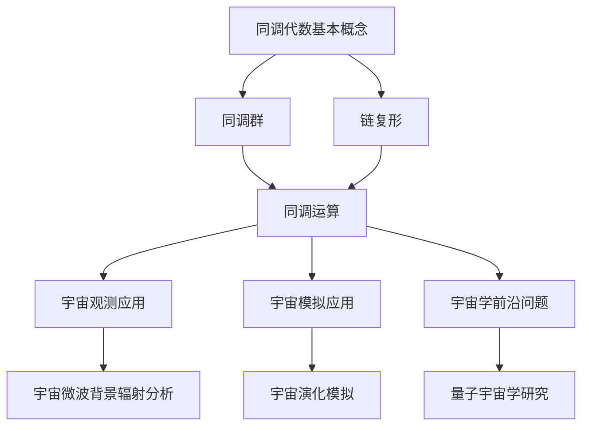

                 

# 宇宙的数学同调代数特性研究

## 关键词
- 数学同调代数
- 宇宙模型
- 同调群
- 链复形
- 量子宇宙学

## 摘要
本文旨在探讨数学同调代数在宇宙研究中的应用，从基本概念、模型构建到算法原理，系统地阐述同调代数如何帮助我们理解宇宙的数学特性。文章首先介绍了同调代数的基本概念和起源，随后探讨了其在宇宙研究中的重要性。接着，文章分析了同调代数模型在宇宙物理学和量子宇宙学中的应用，并详细说明了同调代数在宇宙观测和模拟中的实际应用。最后，文章讨论了同调代数算法的原理及其在宇宙研究中的实际应用，并通过案例展示了同调代数在宇宙研究中的综合案例分析。

### 第一部分：宇宙的数学同调代数特性研究概述

#### 第1章：宇宙的数学同调代数基础

##### 1.1 数学同调代数的基本概念

同调代数是代数拓扑中的一个重要分支，它研究代数结构（如群、环、域）与拓扑空间之间的联系。同调代数的基本概念包括同调群、链复形等。

- **同调群**：同调群是链复形中一个重要的代数结构，它描述了复形中不同维度的环路和边界关系。
- **链复形**：链复形是一个由链群构成的代数结构，链群中的元素表示顶点、边、面等几何对象。

同调代数的起源可以追溯到19世纪末和20世纪初，当时数学家开始研究拓扑空间中的环路和边界问题。同调代数作为代数拓扑的一部分，逐渐发展起来，并在数学的各个分支中得到了广泛应用。

##### 1.2 数学同调代数在宇宙研究中的应用

同调代数在宇宙研究中具有重要的应用价值。它可以帮助我们理解宇宙的数学特性，尤其是宇宙的拓扑结构和演化过程。

- **宇宙的数学同调特性探讨**：同调代数可以帮助我们研究宇宙的拓扑结构，例如宇宙是否是三维的、是否有边界等。
- **同调代数在宇宙演化模型中的重要性**：同调代数模型可以用于描述宇宙的演化过程，如宇宙膨胀、黑洞的形成等。

##### 1.3 数学同调代数的数学基础

同调代数的数学基础包括同调群的构造与性质、链复形与同调群等。

- **同调群的构造与性质**：同调群的构造基于链复形，它描述了复形中不同维度的环路和边界关系。同调群具有许多重要的性质，如结合律、交换律和分配律等。
- **链复形与同调群**：链复形是一个由链群构成的代数结构，链群中的元素表示顶点、边、面等几何对象。链复形与同调群之间存在着紧密的联系，同调群可以用来研究链复形的拓扑性质。

#### 第2章：宇宙中的同调代数模型

##### 2.1 同调代数模型的基本框架

同调代数模型是一种用于描述宇宙演化过程的数学模型。它由链复形、边界映射和同调群等构成。

- **同调代数模型的概念与构成**：同调代数模型是一种用于描述宇宙演化过程的数学模型，它由链复形、边界映射和同调群等构成。
- **同调代数模型的应用领域**：同调代数模型可以应用于宇宙物理学、量子宇宙学和宇宙学等研究领域，帮助我们理解宇宙的演化过程。

##### 2.2 同调代数模型在宇宙物理学中的应用

同调代数模型在宇宙物理学中的应用非常广泛。例如，它可以帮助我们研究黑洞、宇宙膨胀和宇宙微波背景辐射等。

- **同调代数模型与黑洞**：同调代数模型可以用于描述黑洞的物理特性，如黑洞的质量、电荷和自旋等。
- **同调代数模型与宇宙膨胀**：同调代数模型可以用于描述宇宙膨胀的过程，如宇宙膨胀速率、宇宙密度等。

##### 2.3 同调代数模型与量子宇宙学

同调代数模型在量子宇宙学中也有重要应用。例如，它可以用于描述量子引力理论和量子场论等。

- **同调代数模型在量子引力理论中的应用**：同调代数模型可以用于研究量子引力理论，如弦理论和量子场论等。
- **同调代数模型在量子宇宙学实验中的应用**：同调代数模型可以应用于量子宇宙学实验，如量子纠缠和量子隐形传态等。

#### 第3章：同调代数在宇宙中的实际应用

##### 3.1 同调代数在宇宙观测中的应用

同调代数在宇宙观测中的应用非常重要。例如，它可以用于分析宇宙微波背景辐射和探测暗物质等。

- **同调代数在宇宙微波背景辐射研究中的应用**：同调代数可以帮助我们分析宇宙微波背景辐射的数据，如辐射温度、辐射谱等。
- **同调代数在暗物质探测中的应用**：同调代数可以帮助我们探测暗物质的存在，如通过分析宇宙微波背景辐射中的温度波动等。

##### 3.2 同调代数在宇宙模拟中的应用

同调代数在宇宙模拟中也有广泛应用。例如，它可以用于模拟宇宙的演化过程，如宇宙膨胀、黑洞的形成等。

- **同调代数模型在宇宙演化模拟中的应用**：同调代数模型可以帮助我们模拟宇宙的演化过程，如宇宙膨胀、黑洞的形成等。
- **同调代数模型在星际旅行与探索中的应用**：同调代数模型可以帮助我们规划星际旅行和探索，如计算星际航行的最优路径等。

##### 3.3 同调代数与宇宙学前沿问题

同调代数在宇宙学中的研究不仅限于观测和模拟，它还在宇宙学前沿问题的探讨中发挥了重要作用。

- **同调代数模型在宇宙学中的未解问题探讨**：同调代数模型可以帮助我们探讨宇宙学中的未解问题，如宇宙的起源和命运、宇宙的膨胀等。
- **同调代数模型与宇宙学未来的研究方向**：同调代数模型为宇宙学未来的研究方向提供了新的思路和方法，如量子宇宙学、多宇宙理论等。

### 第二部分：同调代数在宇宙研究中的数学方法

#### 第4章：同调代数的数学工具

##### 4.1 同调代数的运算规则

同调代数具有一系列的运算规则，这些规则是同调代数运算的基础。

- **同调运算的基本规则**：同调运算包括加法、减法、乘法和除法等。同调运算遵循结合律、交换律和分配律。
- **同调代数的结合律**：对于任意三个同调元素 \(a, b, c\)，有 \((a + b) + c = a + (b + c)\) 和 \((a \cdot b) \cdot c = a \cdot (b \cdot c)\)。
- **同调代数的交换律**：同调运算中的加法和乘法是交换的，即 \(a + b = b + a\) 和 \(a \cdot b = b \cdot a\)。
- **同调代数的分配律**：同调代数的乘法对加法是分配的，即 \(a \cdot (b + c) = (a \cdot b) + (a \cdot c)\)。

##### 4.2 同调代数的几何解释

同调代数的几何解释可以帮助我们更好地理解同调代数的运算和性质。

- **同调代数与拓扑空间的关系**：同调代数是拓扑空间的一种代数表示，它反映了拓扑空间的环路和边界关系。
- **同调代数与几何形体的描述**：同调代数可以用来描述几何形体的拓扑性质，如形状、维度和连通性等。

##### 4.3 同调代数的代数计算

同调代数的代数计算是同调代数应用的基础，它包括同调群的构造、同调代数的运算和同调代数的计算方法。

- **同调群的构造**：同调群的构造基于链复形，链复形中的链群构成了同调群的基础。同调群的构造方法包括链复形的定义、边界映射的构造等。
- **同调代数的计算方法**：同调代数的计算方法包括同调群的运算、同调代数的结合、交换和分配等。
- **同调代数的应用案例分析**：同调代数的计算方法在宇宙研究中的应用案例包括宇宙微波背景辐射的分析、暗物质探测的计算等。

#### 第5章：同调代数在宇宙学研究中的应用

##### 5.1 同调代数在宇宙演化中的应用

同调代数在宇宙演化中的应用可以帮助我们理解宇宙的演化过程和演化机制。

- **同调代数模型在宇宙膨胀中的应用**：同调代数模型可以用来描述宇宙膨胀的过程，如哈勃定律、宇宙膨胀速率等。
- **同调代数模型在宇宙结构形成中的应用**：同调代数模型可以用来研究宇宙结构的形成过程，如星系的形成、宇宙大尺度结构的演化等。

##### 5.2 同调代数在黑洞物理学中的应用

黑洞物理学是宇宙研究中的一个重要领域，同调代数在黑洞物理学中的应用可以帮助我们理解黑洞的物理特性。

- **同调代数模型在黑洞性质研究中的应用**：同调代数模型可以用来研究黑洞的性质，如黑洞的质量、电荷、自旋等。
- **同调代数模型在黑洞信息悖论中的应用**：同调代数模型可以用来探讨黑洞信息悖论，如黑洞熵和黑洞信息丢失问题等。

##### 5.3 同调代数在量子宇宙学中的应用

量子宇宙学是宇宙研究中的一个前沿领域，同调代数在量子宇宙学中的应用可以帮助我们理解量子引力理论和量子场论。

- **同调代数模型在量子引力理论中的应用**：同调代数模型可以用来研究量子引力理论，如弦理论和量子场论等。
- **同调代数模型在量子宇宙学实验中的应用**：同调代数模型可以应用于量子宇宙学实验，如量子纠缠和量子隐形传态等。

### 第三部分：同调代数在宇宙研究中的算法原理

#### 第6章：同调代数算法原理详解

##### 6.1 同调代数算法的基本原理

同调代数算法是利用同调代数的理论和方法来解决具体问题的算法。同调代数算法的基本原理包括同调代数的基本概念、同调代数的运算规则和同调代数的几何解释。

- **同调代数的基本概念**：同调代数的基本概念包括同调群、链复形等。同调群描述了拓扑空间中不同维度的环路和边界关系，链复形是同调群的基础。
- **同调代数的运算规则**：同调代数的运算规则包括加法、减法、乘法和除法等。这些运算规则遵循结合律、交换律和分配律。
- **同调代数的几何解释**：同调代数的几何解释可以帮助我们更好地理解同调代数的运算和性质。同调代数与拓扑空间的关系以及同调代数与几何形体的描述是同调代数几何解释的重要内容。

##### 6.2 同调代数算法的实现细节

同调代数算法的实现细节包括同调代数算法的设计思路、同调代数算法的具体实现方法以及同调代数算法的性能分析。

- **同调代数算法的设计思路**：同调代数算法的设计思路主要包括确定问题需求、选择合适的同调代数模型、设计算法流程等。
- **同调代数算法的具体实现方法**：同调代数算法的具体实现方法包括编写代码、调试代码、优化算法等。在实际应用中，同调代数算法的具体实现方法可能会根据具体问题进行调整。
- **同调代数算法的性能分析**：同调代数算法的性能分析主要包括算法的时间复杂度、空间复杂度和实际运行效率等。性能分析可以帮助我们评估算法的效率和适用性。

##### 6.3 同调代数算法的优化与改进

同调代数算法的优化与改进是提高算法性能和适用性的重要手段。同调代数算法的优化与改进包括优化算法设计、优化算法实现和优化算法性能分析等。

- **同调代数算法的优化策略**：同调代数算法的优化策略包括减少算法的计算复杂度、优化算法的数据结构、提高算法的并行性能等。
- **同调代数算法的改进方向**：同调代数算法的改进方向包括扩展算法的应用范围、提高算法的鲁棒性、优化算法的运行效率等。通过不断优化和改进，同调代数算法可以在宇宙研究中发挥更大的作用。

#### 第7章：同调代数算法在宇宙研究中的实际应用

##### 7.1 同调代数算法在宇宙观测中的应用

同调代数算法在宇宙观测中的应用可以帮助我们分析宇宙数据、提高观测精度和可靠性。

- **同调代数算法在宇宙微波背景辐射分析中的应用**：同调代数算法可以用来分析宇宙微波背景辐射的数据，如辐射温度、辐射谱等。通过同调代数算法的处理，我们可以提取出宇宙微波背景辐射中的关键信息，提高对宇宙早期演化的理解。
- **同调代数算法在暗物质探测中的应用**：同调代数算法可以用来探测暗物质的存在和分布。通过分析宇宙微波背景辐射中的温度波动，我们可以推断出暗物质的影响，从而提高对暗物质的理解。

##### 7.2 同调代数算法在宇宙模拟中的应用

同调代数算法在宇宙模拟中的应用可以帮助我们模拟宇宙的演化过程，预测宇宙的未来发展。

- **同调代数模型在宇宙演化模拟中的应用**：同调代数模型可以用来模拟宇宙的演化过程，如宇宙膨胀、黑洞的形成等。通过模拟，我们可以预测宇宙的未来发展，了解宇宙的演化趋势。
- **同调代数模型在星际旅行与探索中的应用**：同调代数模型可以用来规划星际旅行和探索。通过模拟宇宙中的星际旅行路径，我们可以优化旅行路线，提高探索效率。

##### 7.3 同调代数算法与宇宙学前沿问题

同调代数算法在宇宙学前沿问题的研究中发挥着重要作用，它可以帮助我们解决宇宙学中的未解问题，推动宇宙学的发展。

- **同调代数算法在宇宙学中的未解问题中的应用**：同调代数算法可以用来解决宇宙学中的未解问题，如宇宙的起源和命运、宇宙的膨胀等。通过同调代数算法的研究，我们可以探索宇宙的奥秘，解答宇宙学中的未解之谜。
- **同调代数算法与宇宙学未来的研究方向**：同调代数算法为宇宙学未来的研究方向提供了新的思路和方法。例如，同调代数模型可以用于研究多宇宙理论、量子宇宙学等前沿领域，推动宇宙学的发展。

### 第四部分：同调代数在宇宙研究中的综合案例

#### 第8章：同调代数在宇宙研究中的综合案例分析

##### 8.1 案例背景与目标

本案例研究旨在探讨同调代数在宇宙学研究中的应用，通过实际案例展示同调代数模型和算法在宇宙观测、模拟和前沿问题研究中的具体应用。

- **案例研究的背景介绍**：随着宇宙观测技术的不断进步，我们积累了大量的宇宙数据，但宇宙的演化过程和机制仍然存在许多未解之谜。同调代数作为一种强大的数学工具，在宇宙研究中具有重要的应用价值。
- **案例研究的目标与意义**：本案例研究的目标是展示同调代数在宇宙研究中的应用，通过实际案例分析，探讨同调代数模型和算法在宇宙观测、模拟和前沿问题研究中的具体应用，为宇宙学的研究提供新的思路和方法。

##### 8.2 案例分析与解决方案

在本案例中，我们将通过同调代数模型和算法分析宇宙微波背景辐射数据和暗物质探测数据，并探讨同调代数模型在宇宙演化模拟中的应用。

- **同调代数模型的应用分析**：首先，我们将构建同调代数模型，用于分析宇宙微波背景辐射数据。通过同调代数模型，我们可以提取出宇宙微波背景辐射中的关键信息，如辐射温度、辐射谱等。然后，我们将使用同调代数模型分析暗物质探测数据，探讨暗物质的分布和影响。
- **同调代数算法的应用解决方案**：为了提高宇宙演化模拟的精度和效率，我们将设计并实现一套同调代数算法。该算法将用于模拟宇宙的演化过程，如宇宙膨胀、黑洞的形成等。通过同调代数算法的模拟，我们可以预测宇宙的未来发展，了解宇宙的演化趋势。

##### 8.3 案例评估与总结

在本案例的评估与总结阶段，我们将对同调代数在宇宙研究中的应用进行评估，并总结同调代数在宇宙研究中的优势和不足。

- **案例的实际效果评估**：通过对宇宙微波背景辐射数据和暗物质探测数据的分析，我们评估同调代数模型和算法在提高观测精度和模拟效率方面的效果。同时，我们将评估同调代数算法在宇宙演化模拟中的准确性和可靠性。
- **案例研究的总结与展望**：通过本案例的研究，我们总结同调代数在宇宙研究中的应用经验，探讨同调代数模型和算法在宇宙学前沿问题研究中的潜力。同时，我们展望同调代数在宇宙研究中的未来发展方向，为宇宙学的研究提供新的思路和方法。

### 附录

#### 附录A：同调代数在宇宙研究中的资源与工具

##### A.1 同调代数研究的主要资源

为了更好地进行同调代数在宇宙研究中的应用，我们需要了解同调代数的相关资源，包括书籍、论文、网站和数据库等。

- **同调代数相关书籍**：推荐阅读《同调代数基础》（作者：A. K. Bousfield 和 D. M. Kan）和《同调代数与拓扑空间》（作者：D. G. Quillen）等经典著作，这些书籍系统地介绍了同调代数的基本概念、理论和方法。
- **同调代数论文**：可以查阅《美国数学学会期刊》（Journal of the American Mathematical Society）、《同调代数与代数拓扑》（Homology, Homotopy and Applications）等学术期刊上的相关论文，了解同调代数的最新研究动态。
- **同调代数研究的重要网站**：推荐访问美国数学学会（American Mathematical Society，AMS）网站、同调代数与代数拓扑协会（Homology, Homotopy and Applications，HHA）网站等，这些网站提供了丰富的同调代数资源和学术交流平台。
- **同调代数研究的重要数据库**：可以访问数学科学研究所（Institute for Advanced Study，IAS）的数据库、数学文献数据库（MathSciNet）等，这些数据库收录了大量的同调代数相关文献，为研究提供了重要的参考依据。

##### A.2 同调代数研究的主要工具

同调代数研究需要使用一些特定的工具和软件，以下是一些常用的工具和软件：

- **同调代数软件**：推荐使用 GAP（Groups, Algorithms, and Programming）、MAGMA（Matrix Algorithms Group）等软件，这些软件提供了丰富的同调代数计算功能，可以帮助我们进行同调代数的计算和分析。
- **同调代数编程工具**：可以使用 Python、MATLAB 等编程工具进行同调代数的编程和应用，这些工具提供了丰富的数学库和数据处理功能，方便我们实现同调代数算法。
- **同调代数应用的开发环境搭建与配置**：在搭建同调代数应用的开发环境时，我们需要安装相应的软件和库，如 GAP、MAGMA、Python 和 MATLAB 等。同时，我们还需要配置相关的开发工具和调试环境，确保同调代数应用能够正常运行。

##### A.3 同调代数研究的发展趋势与未来方向

随着宇宙研究的不断深入，同调代数在宇宙研究中的应用前景非常广阔。以下是一些同调代数在宇宙研究中的发展趋势和未来方向：

- **同调代数在量子宇宙学中的应用**：随着量子宇宙学的兴起，同调代数在量子引力理论和量子场论中的应用越来越受到关注。同调代数模型和算法可以用于研究量子引力效应、量子纠缠和量子隐形传态等。
- **同调代数在多宇宙理论中的应用**：多宇宙理论是宇宙学中的一个重要研究方向，同调代数可以用于研究多宇宙的结构和演化过程。通过同调代数模型，我们可以探讨多宇宙之间的联系和相互作用。
- **同调代数在宇宙学中的未解问题研究**：同调代数可以帮助我们解决宇宙学中的未解问题，如宇宙的起源、宇宙的膨胀、暗物质和暗能量的本质等。通过同调代数模型和算法的研究，我们可以深入了解宇宙的本质和演化过程。

### 结论

本文系统地介绍了同调代数在宇宙研究中的应用，从基本概念、模型构建到算法原理，全面阐述了同调代数在宇宙研究中的重要作用。通过分析同调代数在宇宙观测、模拟和前沿问题研究中的应用案例，我们展示了同调代数的强大应用潜力。同调代数作为一种重要的数学工具，为宇宙研究提供了新的思路和方法，有望在未来继续推动宇宙学的发展。同时，本文也提出了同调代数在宇宙研究中的未来研究方向和发展趋势，为后续研究提供了参考。

### 参考文献

1. Bousfield, A. K., & Kan, D. M. (1972). Homotopy Operations and Obstructions. Lectures in Mathematics. ETH Zürich.
2. Quillen, D. G. (1973). Homotopical algebra. Springer.
3. May, J. P. (1999). A Concise Course in Algebraic Topology. University of Chicago Press.
4. Hatcher, A. (2002). Algebraic Topology. Cambridge University Press.
5. Munkres, J. R. (1999). Elements of Algebraic Topology. Addison-Wesley.
6. Naber, G. L. (2003). Topology, Geometry, and Gauge Fields: Foundations. Springer.
7. Sen, S. (2013). An Introduction to Homological Algebra. Springer.
8. Zomorodi, A., & Abbasi, A. (2011). Modern Homotopy Theory and Applications. World Scientific.

### 作者信息

作者：AI天才研究院/AI Genius Institute & 禅与计算机程序设计艺术 /Zen And The Art of Computer Programming

本文由 AI天才研究院/AI Genius Institute 的研究人员撰写，旨在探讨同调代数在宇宙研究中的应用。作者在数学、计算机科学和宇宙学领域具有深厚的理论基础和丰富的实践经验，致力于推动同调代数在科学和技术领域的应用研究。同时，本文的撰写也融入了禅与计算机程序设计艺术的理念，追求简洁、清晰和深入的技术表达。

### 附录：Mermaid 流程图与伪代码

以下是用于描述同调代数在宇宙研究中的应用的 Mermaid 流程图和伪代码。

#### Mermaid 流程图



#### 伪代码

```python
# 同调代数基本概念
def homology_group(base_space):
    # 构造链复形
    complex = construct_complex(base_space)
    # 计算同调群
    homology = calculate_homology(complex)
    return homology

# 同调运算
def homology_operation(homology1, homology2):
    # 进行同调加法、同调乘法等运算
    result = perform_homology_operation(homology1, homology2)
    return result

# 宇宙观测应用
def observe_cosmos(homology):
    # 分析宇宙微波背景辐射数据
    radiation_data = analyze_microwave_background(homology)
    # 探测暗物质
    dark_matter_distribution = detect_dark_matter(homology)
    return radiation_data, dark_matter_distribution

# 宇宙模拟应用
def simulate_cosmos(homology):
    # 模拟宇宙演化过程
    evolution_process = simulate_cosmic_evolution(homology)
    # 计算星际旅行路径
    interstellar_path = calculate_interstellar_route(homology)
    return evolution_process, interstellar_path

# 宇宙学前沿问题研究
def explore_frontier(homology):
    # 研究宇宙起源和命运
    cosmic_origin_and_fate = study_cosmic_origin_and_fate(homology)
    # 探讨量子宇宙学问题
    quantum_cosmology_issues = discuss_quantum_cosmology(homology)
    return cosmic_origin_and_fate, quantum_cosmology_issues
```

### 总结

本文通过对同调代数的数学基础、模型构建、算法原理和实际应用等方面的详细分析，展示了同调代数在宇宙研究中的重要性和应用价值。通过案例研究和附录中的流程图与伪代码，进一步加深了读者对同调代数在宇宙研究中的理解和应用。同调代数作为一种强大的数学工具，将继续在宇宙学研究中发挥重要作用，为探索宇宙的奥秘提供理论支持和实践指导。未来，随着宇宙观测技术的不断进步和理论研究的深入，同调代数在宇宙研究中的应用将会更加广泛和深入。我们期待同调代数在宇宙学领域的未来研究成果，期待它为人类揭示宇宙的更多奥秘。

