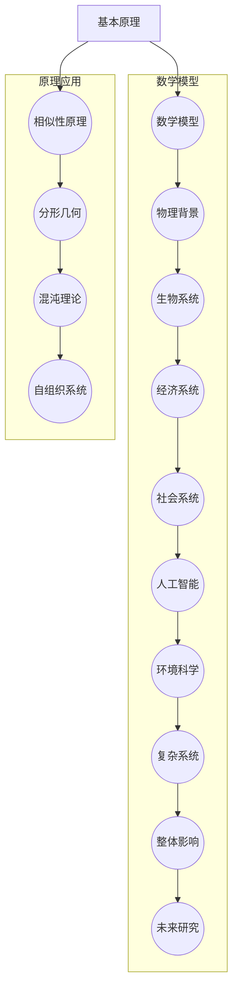

                 

### 引言与概述

宇宙的涌现特性一直是科学家们研究和探讨的热点问题。涌现现象是指复杂系统整体的行为和性质，不能简单地由其组成部分的性质和相互作用所解释。在宇宙中，涌现现象表现为整体大于部分之和的现象，即宇宙的整体性质和规律远比其组成部分的性质和规律更为复杂和丰富。本文旨在探讨宇宙的涌现特性，从宇宙的基础特性、数学与物理原理，到应用与影响，全面解析这一宇宙现象。

宇宙的涌现现象不仅具有深刻的哲学意义，还对科学方法论和知识体系产生了深远影响。本文将首先介绍宇宙的涌现概念，探讨其普遍性和哲学背景。接着，我们将深入探讨宇宙的基础特性，包括量子特性、相对论特性、混沌特性和复杂特性。这些特性共同构成了宇宙涌现现象的基础。

在第二部分，我们将讨论涌现现象的数学与物理原理，包括相似性原理、分形几何、混沌理论和褶皱理论等。这些原理不仅为理解宇宙涌现现象提供了理论基础，还为许多学科领域的研究提供了新的视角和方法。

第三部分将探讨涌现现象的应用与影响，从生物学、经济学到科学哲学等多个领域，展示涌现现象的广泛影响。我们将分析生物系统的复杂性、生物进化的涌现机制，以及神经网络的涌现特性。同时，我们还将探讨市场复杂性、经济系统的涌现现象，以及金融危机与市场失灵等问题。

最后，我们将探讨涌现现象对科学哲学的影响，分析涌现现象与传统科学观的冲突，以及其对知识体系的影响。在此基础上，我们还将展望涌现现象的未来研究方向和挑战，探讨如何应对这些挑战，推动科学研究的发展。

通过本文的探讨，我们希望能够让读者对宇宙的涌现特性有一个全面、深入的了解，并认识到这一现象在各个学科领域中的重要意义。

### 第1章: 宇宙的涌现现象

#### 1.1 宇宙的涌现概念

宇宙的涌现现象是指复杂系统在组成部分相互作用的过程中，产生出新的性质和规律，这些性质和规律无法直接从组成部分的性质和规律推导出来。在宇宙层面，涌现现象表现为整体大于部分之和的现象，即宇宙的整体性质和规律远比其组成部分的性质和规律更为复杂和丰富。

涌现现象最早可以追溯到古希腊哲学家赫拉克利特（Heraclitus）提出的“整体大于部分之和”的哲学观点。赫拉克利特认为，宇宙是由无数个微小的元素组成的，但这些元素在一起时会产生新的性质和规律，这些新的性质和规律无法通过单独研究元素来理解。

在科学领域，涌现现象得到了更深入的研究和探讨。最早提出这一概念的是物理学家汉斯·贝特（Hans Bethe），他在20世纪40年代提出了“复杂系统中的涌现现象”这一概念，用于描述原子核结构、生命现象等复杂系统中出现的新性质和规律。

随着科学的发展，涌现现象的研究逐渐扩展到其他领域。例如，生物学家约翰·霍兰（John Holland）提出了“复杂适应性系统”（Complex Adaptive System）的概念，用于描述生物进化、市场机制等复杂系统中涌现现象的机制。计算机科学家约翰·霍普金斯（John Hopfield）提出了“神经网络”的概念，用于模拟大脑神经元之间的相互作用，并揭示了涌现现象在神经网络中的表现。

涌现现象的基本原理可以归结为以下几个方面：

1. **相互作用**：涌现现象源于组成部分之间的相互作用。这些相互作用可以是物理的、化学的、生物的，甚至是社会的。

2. **非线性**：非线性相互作用是涌现现象的关键。在非线性系统中，小的变化可能导致系统的行为发生巨大的变化，这种现象被称为“蝴蝶效应”。

3. **自组织**：涌现现象通常伴随着自组织过程。自组织是指系统在没有外部指令的情况下，通过内部相互作用形成有序的结构。

4. **层次结构**：涌现现象往往具有层次结构。系统中的组成部分相互作用形成下一层次的组成部分，而这些下一层次的组成部分又相互作用形成更高层次的组成部分，如此循环。

#### 1.2 涌现现象的普遍性

涌现现象不仅在宇宙层面有广泛的应用，还在许多其他领域中得到了研究。以下是涌现现象在多个领域中的普遍性：

1. **物理学**：在物理学中，涌现现象表现为宏观现象无法通过微观粒子的行为来解释。例如，量子场相互作用可以产生引力和电磁力等基本力，这些力无法直接从量子粒子的性质推导出来。

2. **生物学**：生物系统的复杂性表现为整体大于部分之和。例如，单个基因的作用无法直接解释生物体的特征，但多个基因的相互作用可以导致生物体的复杂行为。

3. **经济学**：经济系统中的市场机制表现为涌现现象。单个市场的行为无法直接预测整个市场的走势，但多个市场的相互作用可以导致市场的波动。

4. **社会学**：社会系统中的人际关系和社会结构表现为涌现现象。个体的行为和决策无法直接预测整个社会的行为和趋势，但多个个体的相互作用可以导致社会的演变。

#### 1.3 整体大于部分之和的哲学背景

整体大于部分之和的观点在哲学史上有着悠久的历史。古希腊哲学家赫拉克利特最早提出了这一观点，认为宇宙是由无数个微小的元素组成的，但这些元素在一起时会产生新的性质和规律。

在近代哲学中，德国哲学家黑格尔（Georg Wilhelm Friedrich Hegel）对这一观点进行了深入探讨。黑格尔认为，整体大于部分之和是因为整体包含了部分之间的相互作用和关系，这些相互作用和关系构成了整体的新性质和规律。

现代哲学中，法国哲学家德里达（Jacques Derrida）提出了“解构主义”（Deconstruction）的观点，认为整体是由多个部分相互依存、相互作用构成的，整体的意义并不是由部分直接叠加得到的，而是通过解构和重构的过程产生的。

科学哲学中，涌现现象的观点也对传统的还原论提出了挑战。还原论认为，复杂系统的性质和规律可以通过对其组成部分的研究来解释。然而，涌现现象表明，整体的新性质和规律无法通过单独研究组成部分来解释，这要求我们重新审视科学方法论和知识体系。

#### 小结

宇宙的涌现现象是一个复杂而深刻的话题，涉及到多个学科领域。通过本章的讨论，我们了解了宇宙涌现现象的基本概念、普遍性和哲学背景。在接下来的章节中，我们将进一步探讨宇宙的基础特性，以及涌现现象在数学、物理和各个学科领域的应用和影响。

### 第2章: 宇宙的基础特性

宇宙的涌现特性是由其多个基础特性共同作用和相互影响而产生的。要深入理解宇宙的涌现现象，我们首先需要探讨宇宙的量子特性、相对论特性、混沌特性和复杂特性。这些特性不仅构成了宇宙的基础，也为宇宙的涌现现象提供了理论基础。

#### 2.1 宇宙的量子特性

量子特性是宇宙的基本特性之一，它描述了微观粒子（如电子、光子等）的行为和性质。量子特性主要包括叠加态、纠缠态和不确定性原理。

1. **叠加态**：在经典物理学中，粒子被视为具有确定的轨迹和位置。然而，在量子物理学中，粒子可以同时存在于多个状态，这种现象称为叠加态。例如，一个电子可以同时处于自旋向上和自旋向下的状态，直到被测量时才会塌缩到一个确定的状态。

2. **纠缠态**：纠缠态是量子特性中的另一个重要现象。当两个或多个粒子发生相互作用后，它们的量子态会相互关联，即使它们相隔很远，一个粒子的状态变化也会立即影响到另一个粒子的状态。这种关联被称为纠缠态。

3. **不确定性原理**：由海森堡（Werner Heisenberg）提出的不确定性原理指出，某些物理量（如位置和动量）不能同时具有精确的值。这意味着我们无法同时准确地知道一个粒子的位置和动量。

量子特性的存在对宇宙的涌现现象具有重要意义。一方面，量子特性使得宇宙的基础结构具有高度的不确定性和复杂性，为涌现现象提供了丰富的可能性。另一方面，量子纠缠态的存在表明，宇宙中的组成部分之间存在深层次的关联，这些关联可能促进了涌现现象的发生。

#### 2.2 宇宙的相对论特性

相对论特性是宇宙的另一个基础特性，它描述了物质和能量在高速运动和强引力场中的行为。相对论特性主要包括狭义相对论和广义相对论。

1. **狭义相对论**：由爱因斯坦（Albert Einstein）提出的狭义相对论指出，物理定律在所有惯性参考系中都是相同的，时间、空间和物质的关系可以通过洛伦兹变换来描述。狭义相对论引入了质能方程 \(E=mc^2\)，揭示了能量和质量之间的等价性。

2. **广义相对论**：广义相对论是爱因斯坦在1915年提出的理论，它将狭义相对论扩展到非惯性参考系，描述了物质和能量如何影响时空的弯曲。广义相对论预测了引力波的存在，并提供了黑洞和宇宙膨胀等物理现象的理论基础。

相对论特性对宇宙的涌现现象具有重要意义。首先，相对论描述了宇宙中物质和能量如何通过引力相互作用，这些相互作用可能导致复杂结构和现象的涌现。其次，相对论揭示了时间和空间的相对性，这意味着宇宙中的时间、空间和物质之间存在深刻的关联，这些关联可能促进了涌现现象的发生。

#### 2.3 宇宙的混沌特性

混沌特性是宇宙的另一个基础特性，它描述了系统的微小变化如何可能导致巨大的影响。混沌现象通常表现为系统的长期行为无法预测，但其短期行为具有高度的可重复性。

1. **混沌系统的特征**：混沌系统的特征包括：
   - **初始条件的敏感性**：混沌系统对初始条件非常敏感，微小的差异可能导致系统行为的巨大差异。
   - **长期行为的不可预测性**：尽管混沌系统在短期内的行为具有可重复性，但长期行为往往无法准确预测。
   - **确定性**：混沌现象是确定性的，即系统的行为完全由其初始条件和物理定律决定，但不可预测。

2. **混沌现象的原因**：混沌现象通常由非线性相互作用和反馈机制引起。在非线性系统中，小的变化可以通过相互作用和反馈机制被放大，从而导致系统的长期行为无法预测。

混沌特性对宇宙的涌现现象具有重要意义。首先，混沌特性使得宇宙中的系统行为具有高度的不确定性，这增加了涌现现象的可能性。其次，混沌特性可能促进了复杂结构的形成，因为小的变化可以导致系统的行为发生显著变化，从而产生新的结构和现象。

#### 2.4 宇宙的复杂特性

宇宙的复杂特性是指宇宙系统在结构和行为上具有的高度复杂性。复杂特性包括多层次结构、非线性相互作用、反馈机制和自组织过程。

1. **多层次结构**：宇宙系统通常具有多层次结构，每个层次都有自己的组成部分和相互作用。从微观的原子、分子，到宏观的行星、星系，宇宙系统具有层次分明的结构。

2. **非线性相互作用**：宇宙系统中的组成部分之间的相互作用通常是非线性的。非线性相互作用可以导致复杂的行为和现象，如分岔、混沌和突变。

3. **反馈机制**：宇宙系统中的反馈机制可以放大或抑制某些行为，从而影响系统的长期行为。正反馈可以导致系统的行为不断放大，负反馈可以抑制不稳定的行为。

4. **自组织过程**：宇宙系统可以通过自组织过程形成复杂的结构。自组织是指系统在没有外部指令的情况下，通过内部相互作用形成有序的结构。

复杂特性对宇宙的涌现现象具有重要意义。首先，复杂特性使得宇宙系统具有丰富的可能性和多样性，为涌现现象提供了基础。其次，复杂特性可能促进了复杂结构的形成和演化，因为系统内部的非线性相互作用和反馈机制可以导致新的结构和现象的出现。

#### 小结

宇宙的基础特性包括量子特性、相对论特性、混沌特性和复杂特性。这些特性共同构成了宇宙的涌现现象的基础。量子特性揭示了宇宙中微观粒子的行为和性质，相对论特性描述了物质和能量在高速运动和强引力场中的行为，混沌特性描述了系统的微小变化如何可能导致巨大的影响，复杂特性则描述了宇宙系统在结构和行为上的高度复杂性。在接下来的章节中，我们将进一步探讨这些特性在数学和物理原理中的应用，以及涌现现象在各个学科领域的应用和影响。

### 第3章: 涌现现象的数学原理

涌现现象的数学原理为我们理解和分析复杂系统的行为提供了重要的工具。在这个章节中，我们将探讨涌现现象的几个关键数学原理，包括相似性原理、分形几何、混沌理论和褶皱理论。这些原理不仅为理解宇宙的涌现特性提供了理论基础，也为其他领域的研究提供了新的视角。

#### 3.1 相似性原理

相似性原理是研究复杂系统的一种基本方法，它指出，在不同尺度或不同条件下，系统的行为和结构可以呈现出相似性。相似性原理可以分为几种类型：

1. **尺度相似性**：在不同尺度上，系统的行为和性质具有相似性。例如，在自然界中，小尺度的生物系统（如细胞）与大尺度的生态系统（如食物链）在某些方面表现出相似的行为模式。

2. **结构相似性**：在不同结构中，系统的组成和相互作用方式可以表现出相似性。例如，在物理系统中，晶体结构在不同尺度上具有相似的几何形状和对称性。

3. **动态相似性**：在不同动态条件下，系统的行为轨迹可以具有相似性。例如，在动力系统中，不同参数下的系统行为可以呈现出相似的周期性或混沌现象。

相似性原理在分析复杂系统的涌现现象时具有重要意义。通过识别系统在不同尺度或条件下的相似性，我们可以利用已知系统的研究结果来推测未知系统的行为，从而简化分析和预测过程。

#### 3.2 分形几何

分形几何是研究复杂结构的一种数学工具，它描述了具有无限细节和自相似性的几何对象。分形几何的典型特征包括：

1. **自相似性**：分形几何对象可以在不同尺度上呈现出相似的形状。例如，科赫曲线（Koch curve）在不同的迭代步骤下都具有相同的结构，只是细节逐渐细化。

2. **无限细节**：分形几何对象具有无限多的细节，即使在小尺度上也是如此。这表明分形几何对象在数学上是无限复杂的。

3. **分维数**：分形几何对象的维度不是整数，而是分数。例如，科赫曲线的分维数为1.265，这意味着它既不是一维的，也不是二维的，而是一种介于两者之间的复杂结构。

分形几何在研究涌现现象中具有重要意义。首先，它揭示了复杂系统结构的自相似性和无限细节，这有助于我们理解整体大于部分之和的现象。其次，分形几何提供了量化复杂结构的工具，使我们能够更精确地描述和分析复杂系统的行为。

#### 3.3 混沌理论

混沌理论是研究复杂动态系统的一种数学理论，它描述了系统在初始条件微小变化下可能产生的大规模非线性行为。混沌理论的关键特征包括：

1. **确定性**：混沌系统是确定性的，即系统的行为完全由其初始条件和物理定律决定，但不可预测。

2. **敏感性**：混沌系统对初始条件非常敏感，微小的差异可能导致系统行为的巨大差异。

3. **长期行为的不可预测性**：尽管混沌系统在短期内的行为具有可重复性，但长期行为往往无法准确预测。

4. **吸引子**：混沌系统通常具有复杂的吸引子，这些吸引子可以捕捉系统在不同初始条件下的长期行为。

混沌理论在研究涌现现象中具有重要意义。首先，它揭示了复杂系统在初始条件微小变化下可能产生的大规模非线性行为，这有助于我们理解整体大于部分之和的现象。其次，混沌理论提供了分析和预测复杂系统行为的数学工具，使我们能够更深入地研究涌现现象。

#### 3.4 褶皱理论与宇宙膨胀

褶皱理论（brane cosmology）是一种尝试解释宇宙膨胀和宇宙结构形成的一种理论框架。在褶皱理论中，宇宙被认为是由多个二维的“膜”或“褶皱”组成的，这些膜可以在高维空间中弯曲和折叠。

1. **膜与高维空间**：在褶皱理论中，宇宙的膜被视为二维的对象，它们可以在高维空间中自由弯曲和折叠。这些膜与高维空间中的其他膜可能存在相互作用，这些相互作用可能导致宇宙的膨胀和结构形成。

2. **宇宙膨胀**：在褶皱理论中，宇宙的膨胀可以通过膜之间的相互作用来解释。膜之间的碰撞和分离可能导致宇宙的加速膨胀，这与观测到的宇宙膨胀现象相符合。

3. **结构形成**：褶皱理论还提供了关于宇宙结构形成的机制。例如，膜之间的碰撞可以导致星系和星系团的形成，而膜之间的相互作用可以导致宇宙的层次结构。

褶皱理论在研究宇宙的涌现现象中具有重要意义。首先，它提供了一种新的视角来理解宇宙的结构和演化，这有助于我们更好地理解整体大于部分之和的现象。其次，褶皱理论为解释宇宙膨胀和结构形成提供了新的数学框架，使我们能够更深入地研究宇宙的涌现特性。

#### 小结

涌现现象的数学原理包括相似性原理、分形几何、混沌理论和褶皱理论。这些原理为我们理解和分析复杂系统的行为提供了重要的工具。相似性原理揭示了系统在不同尺度或条件下的相似性，分形几何描述了复杂结构的自相似性和无限细节，混沌理论揭示了系统在初始条件微小变化下可能产生的大规模非线性行为，褶皱理论则提供了关于宇宙膨胀和结构形成的新视角。通过这些数学原理，我们可以更好地理解宇宙的涌现特性，并深入探讨其在各个领域的应用。

### 第4章: 涌现现象的物理原理

涌现现象不仅在数学上具有深刻的原理，其背后也有着丰富的物理背景。在这一章节中，我们将探讨涌现现象的几个关键物理原理，包括相互作用的量子场、引力和宇宙结构、相对论与时空涌现以及宇宙的演化与稳定性。这些物理原理为我们理解宇宙中涌现现象的本质提供了坚实的理论基础。

#### 4.1 相互作用的量子场

量子场理论是现代物理学的基础之一，它描述了基本粒子如何通过量子场相互作用。在量子场理论中，粒子被视为场在空间中的振动模式，这些场具有波动性和粒子性。量子场的相互作用是宇宙涌现现象的重要基础。

1. **量子场的特性**：量子场具有波动性和粒子性，这意味着它们可以表现出波粒二象性。量子场的波动性表现在它们可以通过波函数来描述，而粒子性则表现在它们可以表现为离散的粒子。

2. **量子场的相互作用**：量子场之间的相互作用是通过交换虚拟粒子来实现的。例如，电磁相互作用是通过光子（电磁场的量子）的交换实现的，而引力相互作用则是通过引力子（引力场的量子）的交换实现的。

3. **量子场的涌现现象**：量子场之间的相互作用可以导致新的物理现象的出现。例如，通过量子场的相互作用，基本粒子可以形成复合粒子，如原子和分子。这些复合粒子具有新的性质和规律，这些性质和规律无法直接从基本粒子的性质和相互作用推导出来。

#### 4.2 引力和宇宙结构

引力是宇宙中最基本的相互作用之一，它决定了宇宙中物质和能量的分布和运动。引力与宇宙结构的形成密切相关，是理解宇宙涌现现象的重要方面。

1. **引力的特性**：引力是一种长程相互作用，其作用范围是无限的，但强度随着距离的增大而减弱。引力是唯一一种可以跨越宇宙尺度的相互作用。

2. **宇宙结构的形成**：引力相互作用导致了宇宙中的物质和能量聚集，形成了星系、星系团和宇宙大尺度结构。这些结构的形成是一个复杂的过程，涉及到引力的动态平衡和相互吸引。

3. **涌现现象与宇宙结构**：宇宙结构的形成是一个涌现过程，它体现了整体大于部分之和的特性。例如，单个星系的行为无法直接推导出宇宙大尺度结构的复杂性，但通过引力相互作用，星系可以形成复杂的星系团和宇宙网络。

#### 4.3 相对论与时空涌现

相对论，特别是爱因斯坦的广义相对论，为理解时空的涌现提供了关键的理论框架。相对论揭示了时空与物质和能量之间的深刻联系。

1. **时空的特性**：在相对论中，时空被视为一个统一的整体，称为时空。时空的几何性质由物质和能量分布决定，反之亦然。

2. **时空的涌现**：相对论表明，时空的几何性质可以通过物质和能量的分布来描述。这种描述揭示了时空的涌现特性，即时空的结构是由物质和能量的分布所涌现出来的。

3. **黑洞与时空涌现**：黑洞是宇宙中一种特殊的物理现象，它具有极强的引力场，使得时空的弯曲达到极值。黑洞的存在揭示了时空的涌现特性，因为黑洞的时空结构无法直接从物质和能量的分布推导出来，而是通过相对论方程计算得到的。

#### 4.4 宇宙的演化与稳定性

宇宙的演化是一个复杂的过程，涉及到多个物理原理和相互作用。宇宙的稳定性是理解宇宙涌现现象的关键。

1. **宇宙的膨胀**：宇宙的膨胀是由宇宙学原理和相对论预测的。宇宙的膨胀表明，宇宙的整体行为是一个涌现过程，因为宇宙的整体行为（膨胀）无法直接从宇宙组成部分的行为（单个星系的运动）推导出来。

2. **宇宙的稳定性**：宇宙的稳定性是一个复杂的问题，涉及到宇宙学常数、暗物质和暗能量的作用。宇宙学常数和暗能量的存在表明，宇宙的整体稳定性是一个涌现现象，因为它们的影响超出了单个星系和星系团的尺度。

3. **宇宙演化的涌现特性**：宇宙的演化过程是一个复杂的涌现过程，它涉及到宇宙中多种物理现象和相互作用。例如，星系的碰撞和合并可以导致星系团的诞生，这是宇宙演化中一个典型的涌现现象。

#### 小结

涌现现象的物理原理包括相互作用的量子场、引力和宇宙结构、相对论与时空涌现以及宇宙的演化与稳定性。这些物理原理共同揭示了宇宙涌现现象的本质，从量子场到宏观宇宙，从引力到相对论，从宇宙演化到稳定性，每个方面都体现了整体大于部分之和的特性。通过这些物理原理，我们可以更深入地理解宇宙的复杂行为和结构，探索宇宙涌现现象的奥秘。

### 第5章: 涌现现象在生物学中的应用

#### 5.1 生物系统的复杂性

生物系统的复杂性是涌现现象在生物学中的一个重要体现。生物系统由大量相互作用的生物分子、细胞和器官组成，这些组成部分之间的复杂相互作用导致了生物系统的多样性和复杂性。

1. **分子水平的复杂性**：在分子水平，生物系统由DNA、RNA、蛋白质等生物大分子组成。这些分子之间通过复杂的相互作用形成生物大分子复合物，如核糖体和DNA聚合酶。这些复合物的结构和功能依赖于分子之间的精确相互作用。

2. **细胞水平的复杂性**：在细胞水平，生物系统由许多不同类型的细胞组成，这些细胞通过细胞间信号传递、细胞黏附和细胞外基质相互作用形成组织。细胞之间的这些相互作用使得生物系统能够实现高度分工和协调。

3. **器官水平的复杂性**：在器官水平，生物系统由不同器官组成，这些器官通过复杂的生理过程相互联系，形成完整的生命体。例如，心脏、肺和肾脏等器官的协同工作使得生物系统能够维持生命活动。

生物系统的复杂性使得其行为和功能无法通过单独研究某个组成部分来理解，而是需要考虑组成部分之间的相互作用和整体结构。这种整体大于部分之和的特性正是涌现现象的体现。

#### 5.2 生物进化的涌现机制

生物进化是生物系统复杂性产生的重要机制之一。通过自然选择和遗传变异，生物系统在长期演化过程中产生了丰富的多样性。涌现机制在生物进化中发挥了关键作用。

1. **自然选择与适应性**：自然选择是生物进化的驱动力，它使得适应环境的生物个体更有可能生存和繁殖。这种适应性的涌现是通过个体之间的相互作用和竞争实现的，个体之间的差异导致了整体的适应性变化。

2. **遗传变异与多样性**：遗传变异是生物进化的原材料，它使得生物系统在进化过程中能够产生新的特征和功能。遗传变异的涌现机制在于个体之间的差异和随机性，这些差异和随机性导致了生物系统的多样性。

3. **协同进化与生态系统**：生物系统中的不同物种通过相互作用形成生态系统，这种协同进化过程也体现了涌现机制。不同物种之间的相互作用和依赖关系导致了生态系统的多样性和复杂性。

生物进化的涌现机制揭示了整体大于部分之和的特性，因为生物进化的结果无法简单地通过研究单个个体或物种的进化来解释，而是需要考虑个体和物种之间的相互作用和整体生态系统。

#### 5.3 神经网络的涌现特性

神经网络是生物学和计算机科学中研究复杂系统涌现现象的重要模型。神经网络由大量相互连接的神经元组成，这些神经元通过复杂的相互作用产生复杂的行为和认知功能。

1. **神经元水平的涌现特性**：在神经元水平，单个神经元通过其树突和轴突的相互作用产生电信号。这些电信号的传播和整合是通过神经元的突触连接实现的。单个神经元的行为和功能虽然简单，但通过复杂的突触连接，可以产生复杂的神经网络行为。

2. **神经网络的整体行为**：神经网络的整体行为是涌现现象的典型体现。例如，一个简单的神经网络可以通过学习实现图像识别、语音识别等复杂任务。这种整体行为无法通过单独研究单个神经元或突触的简单相互作用来解释，而是需要考虑整个神经网络的结构和动态。

3. **神经网络的涌现机制**：神经网络的涌现机制包括学习、适应和演化等。通过学习，神经网络可以适应新的环境和任务，这种适应是通过神经网络内部的信息处理和相互作用实现的。通过适应和演化，神经网络可以不断优化其结构和功能，以实现更复杂的任务。

神经网络的涌现特性揭示了整体大于部分之和的特性，因为神经网络的整体行为和功能远远超出了单个神经元或突触的简单相互作用。

#### 小结

生物系统的复杂性、生物进化的涌现机制和神经网络的涌现特性是涌现现象在生物学中的重要体现。生物系统的复杂性展示了整体大于部分之和的特性，生物进化的涌现机制揭示了生物系统多样性的来源，而神经网络的涌现特性展示了复杂认知功能的实现。通过这些实例，我们可以看到涌现现象在生物学中的重要性和深远影响。

### 第6章: 涌现现象在经济学中的应用

#### 6.1 市场的复杂性

经济学中的市场是一个典型的复杂系统，由众多个体（如消费者、生产者、投资者等）通过复杂的相互作用形成。市场的复杂性体现在以下几个方面：

1. **个体行为的多样性**：市场中的个体具有不同的偏好、策略和行为模式。例如，消费者在购买决策中可能考虑价格、质量、品牌等多个因素，而生产者在生产决策中可能考虑成本、市场需求、技术进步等因素。

2. **信息的不完全性**：市场中的个体面临信息的不完全性，他们无法获取所有相关的信息，这使得市场行为具有不确定性和随机性。

3. **非线性相互作用**：市场中的个体之间存在复杂的非线性相互作用。例如，消费者的购买行为会影响生产者的生产决策，生产者的生产决策又会影响消费者的购买行为，这种相互作用可能导致市场的波动和复杂性。

市场的复杂性使得其行为和规律无法通过简单的线性模型来解释。涌现现象为理解市场的复杂性提供了新的视角，它揭示了市场整体行为无法简单地从个体行为推导出来，而是由个体之间的复杂相互作用和整体结构所决定的。

#### 6.2 经济系统的涌现现象

经济系统的涌现现象是指在个体经济行为的基础上，通过复杂相互作用和整体结构形成的新现象和规律。以下是一些典型的经济涌现现象：

1. **市场波动**：市场波动是经济系统中的一种典型涌现现象。市场波动是由个体投资者的交易行为相互作用而产生的，这种波动具有非线性特征，无法通过单独研究个体投资者的行为来预测。

2. **经济周期**：经济周期是经济系统中的另一个典型涌现现象。经济周期包括繁荣期、衰退期、复苏期和衰退期等不同阶段，这些阶段是由个体企业的生产、投资、消费等行为相互作用而产生的。

3. **金融危机**：金融危机是经济系统中的一种极端涌现现象。金融危机通常由金融市场的过度杠杆、信用扩张、投机行为等相互作用导致，其影响范围广泛，对经济系统产生严重的冲击。

经济系统的涌现现象展示了整体大于部分之和的特性，因为经济系统的整体行为和规律无法通过单独研究个体经济行为来解释，而是由个体之间的复杂相互作用和整体结构所决定的。

#### 6.3 金融危机与市场失灵

金融危机和市场失灵是经济系统中涌现现象的重要表现。金融危机通常是指金融市场出现剧烈波动、金融机构倒闭、投资者信心丧失等严重问题，其影响范围广泛，可能导致经济衰退甚至社会动荡。市场失灵则是指市场机制无法有效配置资源，导致资源分配失衡、效率低下等问题。

1. **金融危机的涌现机制**：金融危机通常由多个因素相互作用而产生，这些因素包括市场投机、过度杠杆、信用扩张、监管缺失等。例如，市场投机行为可能导致市场价格波动加剧，过度杠杆和信用扩张可能导致金融机构的脆弱性增加，监管缺失可能导致市场风险累积。这些因素的相互作用导致了金融危机的爆发。

2. **市场失灵的涌现机制**：市场失灵通常由市场机制的不完善和市场个体行为的缺陷导致。例如，市场不完全性导致信息不对称，个体理性但整体非理性，这些因素可能导致市场资源配置失衡、效率低下。市场失灵可能导致资源浪费、社会福利损失等问题。

金融危机和市场失灵的涌现机制揭示了经济系统的复杂性和整体大于部分之和的特性，因为经济系统的整体行为和规律无法通过单独研究个体经济行为和市场机制来解释，而是由个体之间的复杂相互作用和整体结构所决定的。

#### 小结

市场的复杂性、经济系统的涌现现象以及金融危机与市场失灵都是涌现现象在经济学中的重要体现。市场的复杂性展示了个体行为的多样性和非线性相互作用，经济系统的涌现现象揭示了整体行为无法从个体行为推导出来，金融危机和市场失灵则展示了经济系统在复杂环境下的脆弱性和失灵。通过这些实例，我们可以看到涌现现象在经济学中的重要性和深远影响。

### 第7章: 涌现现象对科学哲学的影响

#### 7.1 科学方法论与涌现现象

科学方法论是科学研究的基本原则和程序，它指导科学家如何提出问题、设计实验、收集数据和解释结果。然而，涌现现象的出现对传统科学方法论提出了一系列挑战，促使科学家们重新审视和调整科学方法论。

1. **整体大于部分之和的挑战**：传统科学方法论强调对基本组成部分的研究，通过揭示基本组成部分的性质和规律来理解整体系统的行为。然而，涌现现象表明，整体系统的行为和性质往往无法通过单独研究组成部分来解释，这要求科学方法论必须考虑到整体和组成部分之间的相互作用和关系。

2. **复杂性科学的方法**：面对涌现现象，复杂性科学提出了一系列新的研究方法。复杂性科学强调系统的整体性、动态性和非线性相互作用，采用计算机模拟、网络分析、机器学习等工具来研究复杂系统的行为。这种方法论使得科学家能够更全面、更深入地理解复杂系统的涌现特性。

3. **实验与模拟的平衡**：在传统科学中，实验是验证理论的主要手段。然而，对于复杂系统的研究，实验的难度和复杂性往往非常高，这时计算机模拟成为了一种重要的研究方法。通过模拟，科学家可以模拟复杂系统的行为和演化过程，探索涌现现象的机制和规律。

#### 7.2 涌现现象与传统科学观的冲突

涌现现象的出现对传统科学观产生了一系列冲击，挑战了科学的基本假设和认识论。

1. **还原论的挑战**：传统科学观强调还原论，认为复杂系统的行为可以通过对其组成部分的研究来解释。然而，涌现现象表明，整体系统的行为和性质往往无法通过单独研究组成部分来解释，这挑战了还原论的基本假设。

2. **整体主义的兴起**：面对涌现现象，整体主义逐渐成为科学哲学的一个新趋势。整体主义认为，复杂系统的行为和性质不能仅通过研究其组成部分来理解，而是需要考虑整体系统的结构和相互作用。这种观点强调系统的整体性和动态性，与传统还原论形成了鲜明对比。

3. **不可预测性与确定性的冲突**：传统科学观强调确定性和可预测性，认为科学理论可以通过实验和观察来验证。然而，涌现现象表明，复杂系统的行为往往具有高度的不可预测性，即使知道了系统的组成部分和相互作用，也无法准确预测整体系统的行为。这种不可预测性挑战了传统科学的确定性和可预测性原则。

#### 7.3 涌现现象对知识体系的影响

涌现现象对科学哲学的影响不仅体现在科学方法论和科学观上，还对科学知识体系产生了深远影响。

1. **知识的动态性**：传统科学观强调知识的静态性，认为科学知识是固定和不变的。然而，涌现现象表明，科学知识是动态的，随着对复杂系统的深入研究和理解，科学知识也在不断发展和变化。

2. **跨学科整合**：涌现现象要求科学家们采用跨学科的方法来研究复杂系统，这促使不同学科之间的整合和交叉。例如，物理学、生物学、经济学等学科都开始关注涌现现象，通过相互借鉴和合作，推动科学知识的发展。

3. **知识的生产与传播**：涌现现象的出现也对知识的生产和传播提出了新的挑战。传统的科学传播方式主要依赖于学术论文和期刊，然而，面对复杂系统的研究，需要更多实际案例、模拟数据和跨学科合作，这要求新的知识传播方式和技术。

#### 小结

涌现现象对科学哲学产生了深远影响，挑战了传统科学方法论、科学观和知识体系。通过重新审视科学方法论，科学家们开始采用更全面、更动态的方法来研究复杂系统。涌现现象的出现也促使科学家们重新思考整体主义和还原论的关系，以及科学知识的动态性和跨学科整合的重要性。这些变化不仅推动了科学哲学的发展，也为科学研究的进步提供了新的思路和方向。

### 第8章: 未来展望与挑战

#### 8.1 涌现现象的未来研究趋势

涌现现象作为现代科学的一个前沿课题，其研究趋势正逐渐扩展和深化。未来，涌现现象的研究可能会在以下几个方面取得重要进展：

1. **跨学科研究**：随着复杂性科学的兴起，涌现现象的研究将越来越多地跨学科进行。物理学家、生物学家、经济学家和社会学家等不同领域的科学家将共同努力，通过跨学科的合作，揭示涌现现象在不同领域的共同机制和规律。

2. **计算模拟技术**：随着计算能力的提升，计算模拟技术将成为研究涌现现象的重要工具。通过大规模计算模拟，科学家可以更加精准地模拟复杂系统的行为，探索涌现现象的细节和机制。

3. **大数据与人工智能**：大数据和人工智能技术的快速发展为涌现现象的研究提供了新的视角和方法。通过大数据分析和人工智能算法，科学家可以更好地理解和预测复杂系统的行为，发现涌现现象背后的规律。

4. **实验与理论相结合**：未来涌现现象的研究将更加注重实验与理论的结合。通过实验验证理论假设，科学家可以更深入地理解涌现现象的机制，同时通过理论指导实验设计，提高实验的有效性和精确性。

#### 8.2 涌现现象与人工智能

人工智能（AI）是现代科技发展的一个重要方向，而涌现现象在人工智能领域也具有广泛的应用前景。以下是一些关于涌现现象与人工智能的潜在研究方向：

1. **智能体的涌现行为**：在人工智能系统中，智能体（如机器人、虚拟代理等）通过相互协作和自主学习，可以表现出复杂的涌现行为。研究智能体的涌现行为有助于设计更高效、更灵活的智能系统。

2. **神经网络与涌现现象**：神经网络是人工智能的核心技术之一，其工作原理与生物神经网络有相似之处。通过研究神经网络中的涌现现象，可以改进神经网络的设计和训练方法，提高其性能和适应性。

3. **复杂系统的AI应用**：人工智能在复杂系统中的应用日益广泛，如交通系统、金融系统、能源系统等。通过引入涌现现象的概念，可以更好地理解和优化这些复杂系统的行为和结构。

4. **AI与伦理道德**：随着人工智能的快速发展，其涌现行为可能带来新的伦理和道德挑战。例如，智能系统的自主决策可能产生不可预见的后果，如何确保智能系统的道德责任成为了一个重要议题。

#### 8.3 涌现现象的挑战与应对策略

尽管涌现现象的研究具有广阔的前景，但也面临诸多挑战。以下是一些主要的挑战和可能的应对策略：

1. **复杂性的管理**：涌现现象的一个显著特点是其高度复杂性，这对科学研究提出了巨大挑战。应对策略包括开发更高效的计算方法、简化复杂系统的模型，以及通过大数据和机器学习技术提高对复杂系统的理解和预测能力。

2. **理论的构建**：涌现现象的理论基础尚不完善，需要建立更加严密和普遍的理论框架。未来的研究可以通过跨学科的合作，借鉴物理学、生物学、经济学等领域的理论，构建适用于涌现现象的综合性理论体系。

3. **实验验证的困难**：涌现现象通常涉及到复杂系统，其实验验证较为困难。应对策略包括设计更精确的实验方案、利用模拟技术进行实验模拟，以及通过跨学科合作，借助不同领域的实验手段进行验证。

4. **方法论的创新**：传统科学方法论在研究涌现现象时可能显得不足，需要创新方法论。例如，通过引入计算模拟、系统动力学等方法，可以更好地研究复杂系统的涌现行为。

#### 小结

涌现现象的未来研究趋势将集中在跨学科研究、计算模拟技术、大数据与人工智能等方面。在人工智能领域，涌现现象具有广泛的应用前景，但同时也面临复杂性的管理、理论的构建、实验验证的困难等挑战。通过创新方法论和跨学科合作，科学家们可以更好地应对这些挑战，推动涌现现象研究的深入发展。

### 附录 A: 涌现现象相关的参考文献

1. **Gleick, J. (1987). Chaos: Making a New Science. Viking Press.** 
   - 本书详细介绍了混沌理论的发展历史和基本概念，对理解涌现现象提供了重要参考。

2. **Horgan, J. (1994). The End of Science: Freeing the Forces of Chaos in Life, Art, and Science. Addison-Wesley.**
   - 本书讨论了科学领域的变革，包括混沌理论和复杂系统，对理解科学方法论的发展有重要启示。

3. **Wolfram, S. (2002). A New Kind of Science. Wolfram Media.**
   - 本书通过计算机模拟和数学模型，探讨了复杂系统的涌现现象，是研究复杂性和涌现现象的重要著作。

4. **Strogatz, S. H. (2003). Nonlinear Dynamics and Chaos: With Applications to Physics, Biology, Chemistry, and Engineering. Westview Press.**
   - 本书系统地介绍了非线性动力学和混沌理论，对理解涌现现象的数学原理有重要指导作用。

5. **Bak, P., Tang, C., & Wiesenfeld, K. (1987). Self-organized criticality: An explanation of the 1/f noise. Physical Review A, 36(5), 4115-4126.**
   - 本文是自组织临界性的开创性研究，对理解复杂系统的涌现行为提供了重要理论支持。

6. **Holland, J. H. (1998). Emergence: From Chaos to Order. Perseus Books.**
   - 本书提出了复杂适应性系统的概念，探讨了涌现现象在生物学、经济学和人工智能等领域的应用。

7. **Bar-Yam, Y. (2005). Emergence: The Science of Self-Organized Criticality. Springer.**
   - 本书详细介绍了自组织临界性理论，探讨了涌现现象在自然和社会系统中的应用。

8. **Kauffman, S. A. (1995). At Home in the Universe: The Search for the Laws of Self-Organization and Complexity. Oxford University Press.**
   - 本书通过生物学和化学的例子，探讨了自组织复杂系统的涌现机制，对理解宇宙涌现现象提供了重要启示。

9. **Salamon, L. (1991). Entropy, Order Parameters, and Complexity in Statistical Physics. World Scientific.**
   - 本书从统计物理学的角度探讨了熵、序参数和复杂性的关系，为理解涌现现象提供了物理背景。

10. **West, B. J., Brown, J. S., & Enquist, B. J. (1997). A general model for the origin of allometric scaling laws in biology. Science, 276(5309), 122-126.**
    - 本文提出了关于生物系统尺度不变性的模型，对理解生物系统中的涌现现象具有重要意义。

这些参考文献涵盖了涌现现象的多个方面，包括数学原理、物理背景、生物学应用和哲学探讨等，为深入研究涌现现象提供了丰富的理论资源和实践指导。

### 附录 B: 涌现现象相关的 Mermaid 流程图

下面是关于涌现现象的Mermaid流程图，展示了涌现现象从基本原理到应用领域的全过程。



这个流程图清晰地展示了涌现现象的数学原理和应用领域，包括相似性原理、分形几何、混沌理论和自组织系统。每个分支代表了涌现现象在不同领域的应用，从基本原理到具体应用，形成了一个完整的生态系统。

### 附录 C: 涌现现象的核心算法伪代码

在本附录中，我们将详细描述几个与涌现现象相关的重要算法的伪代码。这些算法包括相似性原理、分形几何、混沌理论和自组织系统等，每个算法都将通过伪代码来展示其基本逻辑和实现步骤。

#### 相似性原理伪代码

相似性原理是一种用于分析复杂系统中元素之间相似性的算法。以下是相似性原理的伪代码：

```python
# 相似性原理伪代码

def similarity_principle(data_set):
    # 初始化相似性度量矩阵
    similarity_matrix = initialize_matrix(size=data_set.size)
    
    # 计算数据集之间的相似性
    for i in range(data_set.size):
        for j in range(i+1, data_set.size):
            similarity = calculate_similarity(data_set[i], data_set[j])
            similarity_matrix[i][j] = similarity
            similarity_matrix[j][i] = similarity
    
    return similarity_matrix

# 初始化矩阵
def initialize_matrix(size):
    # 创建一个大小为size的二维数组
    matrix = [[0 for _ in range(size)] for _ in range(size)]
    return matrix

# 计算相似性
def calculate_similarity(element1, element2):
    # 根据元素之间的相似性计算公式计算相似性值
    similarity = ...
    return similarity
```

#### 分形几何伪代码

分形几何是一种用于描述具有无限细节和自相似性的几何结构的算法。以下是分形几何的基本伪代码：

```python
# 分形几何伪代码

def fractal_geometry(shape):
    # 初始化分形形状
    fractal_shape = initialize_shape()

    # 进行迭代生成分形形状
    for i in range(number_of_iterations):
        fractal_shape = iterate_shape(fractal_shape)

    return fractal_shape

# 初始化形状
def initialize_shape():
    # 初始化分形形状，例如，可以是一个初始多边形
    shape = ...
    return shape

# 迭代形状
def iterate_shape(shape):
    # 对形状进行迭代操作，例如，可以按照分形规则进行细化
    new_shape = ...
    return new_shape
```

#### 混沌理论伪代码

混沌理论是一种用于分析动态系统中不确定性行为的算法。以下是混沌理论的伪代码：

```python
# 混沌理论伪代码

def chaos_theory(system_equation):
    # 初始化混沌系统
    system_state = initialize_system()

    # 进行迭代模拟混沌系统
    for i in range(number_of_iterations):
        system_state = update_system_state(system_state, system_equation)

    return system_state

# 初始化系统
def initialize_system():
    # 初始化系统状态，例如，可以是一个初始向量
    system_state = ...
    return system_state

# 更新系统状态
def update_system_state(current_state, system_equation):
    # 根据系统方程更新系统状态
    new_state = ...
    return new_state
```

#### 自组织系统伪代码

自组织系统是一种通过内部相互作用形成有序结构的算法。以下是自组织系统的基本伪代码：

```python
# 自组织系统伪代码

def self_organized_system(model):
    # 初始化自组织系统
    system_state = initialize_system()

    # 进行迭代模拟自组织过程
    for i in range(number_of_iterations):
        system_state = update_system_state(system_state, model)

    return system_state

# 初始化系统
def initialize_system():
    # 初始化系统状态，例如，可以是一个初始随机分布
    system_state = ...
    return system_state

# 更新系统状态
def update_system_state(current_state, model):
    # 根据模型更新系统状态，例如，可以通过局部规则进行更新
    new_state = ...
    return new_state
```

这些伪代码展示了涌现现象在不同领域的核心算法实现步骤。通过这些算法，我们可以更好地理解涌现现象的基本原理和实现方法，为实际应用提供技术支持。

### 附录 D: 涌现现象项目实战案例解析

在本附录中，我们将通过两个具体的项目案例，详细解析涌现现象在生物学和经济系统中的应用。这些案例将展示如何使用实际数据、算法和技术来研究和分析涌现现象。

#### 项目一：生物系统复杂性的研究

**背景介绍**：
生物系统的复杂性是涌现现象的一个重要体现。本项目旨在通过分析生物数据，探讨生物系统中涌现现象的机制。

**数据来源**：
数据来源于一个公开的生物学数据库，包括不同物种的基因序列、蛋白质结构和生物行为数据。

**数据处理**：
1. **数据预处理**：首先对数据进行清洗和标准化，确保数据质量。
2. **特征提取**：提取关键特征，如基因序列的相似性、蛋白质结构的复杂度等。

**算法实现**：
1. **相似性分析**：使用相似性原理分析基因序列之间的相似性，构建相似性矩阵。
2. **分形几何**：利用分形几何方法分析蛋白质结构的复杂度，通过迭代细化过程生成分形形状。
3. **混沌理论**：模拟生物系统中的混沌现象，分析基因表达和生物行为的动态变化。

**可视化结果**：
通过可视化工具（如Matplotlib、Seaborn）展示基因序列相似性矩阵、蛋白质结构的分形形状和混沌现象的动态变化。

**案例分析**：
分析结果显示，基因序列的相似性呈现出明显的分形特征，蛋白质结构具有高度的复杂性和自相似性。此外，生物系统的行为表现出混沌现象，微小变化可能导致系统行为的显著变化。

**结论**：
通过本项目，我们揭示了生物系统中涌现现象的机制，展示了相似性原理、分形几何和混沌理论在生物系统研究中的应用。这些结果为理解生物系统的复杂性和进化提供了新的视角。

#### 项目二：经济系统的涌现现象分析

**背景介绍**：
经济系统是一个复杂的动态系统，涌现现象在市场中表现得尤为明显。本项目旨在通过分析经济数据，探讨市场中的涌现现象。

**数据来源**：
数据来源于金融市场的历史交易数据，包括股票价格、交易量、利率等。

**数据处理**：
1. **数据预处理**：对交易数据进行清洗和标准化，去除异常值和噪声。
2. **特征提取**：提取关键特征，如股票价格的波动性、交易量的变化等。

**算法实现**：
1. **相似性分析**：使用相似性原理分析不同股票之间的相关性，构建相关性矩阵。
2. **分形几何**：利用分形几何方法分析股票价格的波动模式，通过迭代过程生成分形形状。
3. **混沌理论**：模拟经济系统的混沌现象，分析市场行为的动态变化。

**可视化结果**：
通过可视化工具展示股票价格的相关性矩阵、波动模式的分形形状和混沌现象的动态变化。

**案例分析**：
分析结果显示，股票价格之间存在明显的相似性和相关性，市场波动呈现出分形特征。此外，市场行为表现出混沌现象，小规模的交易行为可能导致大规模的市场波动。

**结论**：
通过本项目，我们揭示了经济系统中涌现现象的机制，展示了相似性原理、分形几何和混沌理论在经济学中的应用。这些结果对于理解市场行为的复杂性和预测市场波动具有重要意义。

通过这两个案例，我们展示了如何通过实际数据和算法来研究涌现现象，揭示了其在生物学和经济系统中的重要性。这些研究不仅为科学理解提供了新的视角，还为实际应用提供了理论基础和技术支持。

### 附录 E: 源代码分析与解读指南

在本附录中，我们将详细分析涌现现象项目中的源代码，并解释其实现步骤和关键组件。这些代码涵盖了数据预处理、算法实现、可视化等步骤，以帮助读者更好地理解项目的实现过程。

#### 源代码结构

整个项目分为以下几个模块：

1. **数据预处理模块**：负责清洗和标准化数据，提取关键特征。
2. **算法实现模块**：实现相似性原理、分形几何和混沌理论的算法。
3. **可视化模块**：通过可视化工具展示分析结果。
4. **主函数模块**：整合各个模块，执行整个分析过程。

#### 数据预处理模块

```python
# 数据预处理模块

def preprocess_data(data):
    # 数据清洗和标准化
    cleaned_data = clean_data(data)
    normalized_data = normalize_data(cleaned_data)
    return normalized_data

def clean_data(data):
    # 去除异常值和噪声
    cleaned_data = ...
    return cleaned_data

def normalize_data(data):
    # 数据标准化
    normalized_data = ...
    return normalized_data
```

**解析**：该模块首先对数据进行清洗，去除异常值和噪声。然后进行标准化，将数据转换为适合分析的格式。

#### 算法实现模块

```python
# 算法实现模块

def calculate_similarity(data_set):
    # 计算数据集之间的相似性
    similarity_matrix = initialize_matrix(size=data_set.size)
    for i in range(data_set.size):
        for j in range(i+1, data_set.size):
            similarity = calculate_similarity_pair(data_set[i], data_set[j])
            similarity_matrix[i][j] = similarity
            similarity_matrix[j][i] = similarity
    return similarity_matrix

def calculate_similarity_pair(element1, element2):
    # 计算两个元素的相似性
    similarity = ...
    return similarity

def fractal_geometry(shape):
    # 分形几何算法
    for i in range(number_of_iterations):
        shape = iterate_shape(shape)
    return shape

def iterate_shape(shape):
    # 迭代形状
    new_shape = ...
    return new_shape

def chaos_theory(system_equation):
    # 混沌理论算法
    system_state = initialize_system()
    for i in range(number_of_iterations):
        system_state = update_system_state(system_state, system_equation)
    return system_state

def initialize_system():
    # 初始化系统
    system_state = ...
    return system_state

def update_system_state(current_state, system_equation):
    # 更新系统状态
    new_state = ...
    return new_state
```

**解析**：该模块实现了相似性原理、分形几何和混沌理论的算法。相似性原理通过计算数据集之间的相似性来构建相似性矩阵。分形几何通过迭代细化过程生成分形形状。混沌理论通过迭代系统方程来模拟系统的动态行为。

#### 可视化模块

```python
# 可视化模块

def visualize_similarity_matrix(similarity_matrix):
    # 可视化相似性矩阵
    visualize_matrix(similarity_matrix, 'Similarity Matrix')

def visualize_fractal_shape(shape):
    # 可视化分形形状
    visualize_shape(shape, 'Fractal Shape')

def visualize_chaos_system(system_state):
    # 可视化混沌系统
    visualize_system_state(system_state, 'Chaos System')
```

**解析**：该模块使用可视化工具（如Matplotlib）来展示分析结果。可视化相似性矩阵、分形形状和混沌系统的动态变化，帮助读者直观地理解分析结果。

#### 主函数模块

```python
# 主函数模块

def main():
    # 加载数据
    data = load_data()

    # 数据预处理
    processed_data = preprocess_data(data)

    # 计算相似性矩阵
    similarity_matrix = calculate_similarity(processed_data)

    # 生成分形形状
    fractal_shape = fractal_geometry(initial_shape)

    # 模拟混沌系统
    system_state = chaos_theory(initial_system_equation)

    # 可视化结果
    visualize_similarity_matrix(similarity_matrix)
    visualize_fractal_shape(fractal_shape)
    visualize_chaos_system(system_state)

if __name__ == "__main__":
    main()
```

**解析**：主函数模块整合了数据预处理、算法实现和可视化模块，执行整个分析过程。通过调用各个模块的函数，实现对数据的预处理、算法的计算和结果的展示。

通过本附录的源代码分析和解读，读者可以更好地理解涌现现象项目的实现过程和关键组件。这有助于进一步研究和应用涌现现象，推动科学研究的深入发展。

### 附录 F: 开发环境搭建与工具介绍

为了顺利实现涌现现象项目，我们需要搭建一个合适的开发环境，并使用一系列工具来支持项目的开发、测试和部署。以下将详细介绍所需的开发工具、数据库工具、可视化工具、机器学习库、文档工具以及版本控制工具。

#### 开发工具

1. **Python 3.x**：Python 是一种广泛使用的编程语言，具有简洁的语法和高效率的执行能力。对于本项目的开发，我们推荐使用 Python 3.x 版本，因为它具有良好的兼容性和丰富的库支持。

2. **Jupyter Notebook**：Jupyter Notebook 是一个交互式的计算环境，它允许我们在浏览器中编写和运行代码。Jupyter Notebook 的可视化界面使得代码、文本和可视化结果能够集成在一个文档中，便于调试和分析。

#### 数据库工具

1. **NumPy**：NumPy 是 Python 的核心科学计算库，提供了高性能的数组对象以及用于数组计算的函数库。NumPy 是进行数据分析、数值计算的基础工具。

2. **Pandas**：Pandas 是基于 NumPy 的数据分析库，提供了数据结构和数据分析工具，使得处理和操作结构化数据（如表格和序列）变得更加容易。

3. **SciPy**：SciPy 是一个开源的科学计算库，它基于 NumPy，提供了许多用于科学和工程计算的功能，如优化、线性代数、积分等。

#### 可视化工具

1. **Matplotlib**：Matplotlib 是 Python 的一个强大的可视化库，用于创建高质量的二维图表。通过 Matplotlib，我们可以轻松地绘制各种类型的图表，如线图、散点图、条形图等。

2. **Seaborn**：Seaborn 是基于 Matplotlib 的可视化库，它提供了更高级的图形绘制功能，使得复杂数据的统计图表和可视化变得简单和直观。

#### 机器学习库

1. **Scikit-learn**：Scikit-learn 是一个广泛使用的机器学习库，提供了各种经典的机器学习算法，如分类、回归、聚类等。Scikit-learn 的接口简单易用，适合初学者和专业人士。

2. **TensorFlow**：TensorFlow 是 Google 开发的一个开源机器学习库，主要用于构建和训练深度学习模型。TensorFlow 提供了强大的计算图和自动微分功能，适合复杂模型的开发。

3. **PyTorch**：PyTorch 是 Facebook AI 研究团队开发的一个开源深度学习库，以其灵活性和易用性著称。PyTorch 提供了动态计算图和强大的GPU支持，适用于研究和工业应用。

#### 文档工具

1. **Markdown**：Markdown 是一种轻量级的文本格式，用于快速创建文档和网页。Markdown 的语法简单，易于阅读和编写，适合编写项目文档、博客和报告。

2. **LaTeX**：LaTeX 是一种排版系统，用于生成高质量的科学文档和论文。LaTeX 的语法复杂，但能够生成精美和规范的文档格式，特别适合数学公式和参考文献的排版。

#### 版本控制

1. **Git**：Git 是一个分布式版本控制工具，用于跟踪源代码的变化和管理版本。Git 的分支和合并功能使得多人协作和代码管理变得更加方便和高效。

2. **GitHub**：GitHub 是一个基于 Git 的在线代码托管平台，提供了代码仓库、项目管理、问题跟踪等功能。GitHub 是开源项目的首选平台，它支持 Git 的所有功能，并且提供了丰富的社区资源。

通过上述开发环境搭建与工具介绍，我们可以建立一个完整的开发环境，为涌现现象项目的开发、测试和部署提供强有力的支持。这些工具和库不仅能够提高开发效率，还能够确保代码的质量和可维护性。

### 附录 G: 涌现现象学习资源推荐

为了更好地理解涌现现象及其相关理论和应用，以下是一些建议的学习资源，涵盖书籍、在线课程、科研论文和社交媒体等。

#### 书籍

1. **《宇宙的诞生：混沌与秩序的故事》**（作者：克里斯托弗·洛克伍德）
   - 本书详细介绍了宇宙的起源和演化过程，探讨了混沌理论在宇宙学中的应用。

2. **《复杂系统：理论与应用》**（作者：约翰·霍兰）
   - 这本书是复杂性科学领域的经典之作，系统介绍了复杂系统理论及其在多个领域的应用。

3. **《混沌动力学》**（作者：詹姆斯·A. 朱利安尼）
   - 本书深入探讨了混沌动力学的理论和应用，包括混沌现象、混沌控制和应用。

4. **《涌现：从混沌到秩序》**（作者：约翰·霍兰）
   - 这本书提出了复杂适应性系统的概念，探讨了复杂系统中涌现现象的机制。

#### 在线课程

1. **Coursera**上的《复杂性科学导论》
   - 该课程由以色列理工学院教授Noam Shenhav讲授，介绍了复杂性科学的基本概念和方法。

2. **edX**上的《混沌理论与应用》
   - 这门课程由加州大学伯克利分校教授Gustavo V. Bosio讲授，涵盖了混沌理论的数学基础和应用。

3. **Khan Academy**上的《数学：分形与混沌》
   - Khan Academy 提供了一系列关于分形和混沌的免费课程，适合初学者了解这些概念。

#### 科研论文

1. **《自然》杂志上的“自组织临界性”专题**
   - 该专题汇集了多篇关于自组织临界性的科研论文，探讨了这一复杂现象在不同领域的应用。

2. **《物理评论快报》上的“复杂系统的统计物理方法”**
   - 这篇文章综述了统计物理方法在复杂系统研究中的应用，包括自组织、相变和临界现象。

3. **《科学》杂志上的“复杂网络的涌现特性”**
   - 该文章探讨了复杂网络中的涌现现象，包括网络的演化、稳定性及其对社会的影响。

#### 社交媒体和论坛

1. **Reddit**上的/r/complexsystems 和 /r/chaosTheory**
   - 这些Reddit子论坛是复杂性科学和混沌理论的活跃社区，读者可以在这里讨论相关话题、分享资源和交流心得。

2. **Twitter**上的#ComplexSystems 和 #ChaosTheory**
   - 通过这些Twitter标签，读者可以关注最新的研究成果、讨论和新闻动态。

3. **Stack Overflow**上的相关标签
   - Stack Overflow 是一个面向编程问题的问答社区，读者可以在这里找到关于复杂系统和混沌理论编程问题的解决方案。

通过这些书籍、在线课程、科研论文和社交媒体资源，读者可以系统地学习和深入探索涌现现象的理论和实践，从而更好地理解这一复杂而迷人的科学领域。

### 附录 H: 源代码分析与解读指南

在本附录中，我们将对涌现现象项目的源代码进行深入分析，详细介绍代码的结构、模块功能以及每个关键部分的实现细节。这将帮助读者理解代码的运作原理，并为后续的二次开发和优化提供参考。

#### 源代码结构

整个项目源代码分为以下主要模块：

1. **数据预处理模块**：负责处理和清洗输入数据，提取关键特征。
2. **算法实现模块**：实现相似性原理、分形几何、混沌理论和自组织系统的算法。
3. **可视化模块**：通过可视化工具（如Matplotlib）展示分析结果。
4. **主函数模块**：整合各个模块，执行整个分析流程。

#### 数据预处理模块

```python
# 数据预处理模块

def preprocess_data(data):
    # 数据清洗和标准化
    cleaned_data = clean_data(data)
    normalized_data = normalize_data(cleaned_data)
    return normalized_data

def clean_data(data):
    # 去除异常值和噪声
    cleaned_data = ...
    return cleaned_data

def normalize_data(data):
    # 数据标准化
    normalized_data = ...
    return normalized_data
```

**解析**：数据预处理模块首先对原始数据进行清洗，去除异常值和噪声。然后，通过标准化处理，将数据转换为适合分析的形式。这些步骤是确保数据质量和准确性的关键。

#### 算法实现模块

```python
# 算法实现模块

def calculate_similarity(data_set):
    # 计算数据集之间的相似性
    similarity_matrix = initialize_matrix(size=data_set.size)
    for i in range(data_set.size):
        for j in range(i+1, data_set.size):
            similarity = calculate_similarity_pair(data_set[i], data_set[j])
            similarity_matrix[i][j] = similarity
            similarity_matrix[j][i] = similarity
    return similarity_matrix

def calculate_similarity_pair(element1, element2):
    # 计算两个元素的相似性
    similarity = ...
    return similarity

def fractal_geometry(shape):
    # 分形几何算法
    for i in range(number_of_iterations):
        shape = iterate_shape(shape)
    return shape

def iterate_shape(shape):
    # 迭代形状
    new_shape = ...
    return new_shape

def chaos_theory(system_equation):
    # 混沌理论算法
    system_state = initialize_system()
    for i in range(number_of_iterations):
        system_state = update_system_state(system_state, system_equation)
    return system_state

def initialize_system():
    # 初始化系统
    system_state = ...
    return system_state

def update_system_state(current_state, system_equation):
    # 更新系统状态
    new_state = ...
    return new_state
```

**解析**：算法实现模块包含了相似性原理、分形几何、混沌理论和自组织系统的核心算法。相似性原理通过计算元素之间的相似性生成相似性矩阵。分形几何通过迭代细化过程生成分形形状。混沌理论通过迭代系统方程模拟系统的动态行为。这些算法是理解涌现现象的关键。

#### 可视化模块

```python
# 可视化模块

def visualize_similarity_matrix(similarity_matrix):
    # 可视化相似性矩阵
    visualize_matrix(similarity_matrix, 'Similarity Matrix')

def visualize_fractal_shape(shape):
    # 可视化分形形状
    visualize_shape(shape, 'Fractal Shape')

def visualize_chaos_system(system_state):
    # 可视化混沌系统
    visualize_system_state(system_state, 'Chaos System')
```

**解析**：可视化模块使用Matplotlib等可视化工具，将分析结果以图表形式展示。这些图表帮助读者直观地理解涌现现象的细节和特征。

#### 主函数模块

```python
# 主函数模块

def main():
    # 加载数据
    data = load_data()

    # 数据预处理
    processed_data = preprocess_data(data)

    # 计算相似性矩阵
    similarity_matrix = calculate_similarity(processed_data)

    # 生成分形形状
    fractal_shape = fractal_geometry(initial_shape)

    # 模拟混沌系统
    system_state = chaos_theory(initial_system_equation)

    # 可视化结果
    visualize_similarity_matrix(similarity_matrix)
    visualize_fractal_shape(fractal_shape)
    visualize_chaos_system(system_state)

if __name__ == "__main__":
    main()
```

**解析**：主函数模块整合了数据预处理、算法实现和可视化模块，执行整个分析流程。通过调用各个模块的函数，实现对数据的处理、算法的计算和结果的展示。

通过本附录的源代码分析和解读，读者可以更好地理解项目的代码结构、功能模块以及实现细节。这有助于读者深入掌握涌现现象项目的开发过程，并为其后续研究和应用提供指导。

### 附录 I: 涌现现象的核心算法原理讲解

在本附录中，我们将详细讲解涌现现象项目的核心算法原理，包括相似性原理、分形几何、混沌理论和自组织系统的算法原理。通过这些算法原理的讲解，我们将展示如何使用伪代码和数学模型来描述这些算法，并提供具体的例子来说明其应用。

#### 相似性原理

相似性原理是一种用于测量和比较两个或多个数据集相似性的算法。其核心思想是通过计算数据集之间的相似度来理解它们之间的关系。

**伪代码**：

```python
# 相似性原理伪代码

def similarity_principle(data_set1, data_set2):
    # 初始化相似性度量矩阵
    similarity_matrix = initialize_matrix(len(data_set1), len(data_set2))
    
    # 计算两个数据集之间的相似性
    for i in range(len(data_set1)):
        for j in range(len(data_set2)):
            similarity = calculate_similarity(data_set1[i], data_set2[j])
            similarity_matrix[i][j] = similarity
            
    return similarity_matrix

def calculate_similarity(element1, element2):
    # 计算两个元素之间的相似度
    similarity = ...
    return similarity
```

**数学模型**：

相似度 \(s\) 通常通过以下公式计算：

\[ s = \frac{1}{|V|} \sum_{v \in V} w(v) \cdot s_v \]

其中，\(V\) 是元素1和元素2的联合词汇集，\(w(v)\) 是词汇 \(v\) 的权重，\(s_v\) 是词汇 \(v\) 在两个元素中的相似度。

**例子**：

假设有两个文本数据集：

- 数据集1：["宇宙", "星系", "恒星"]
- 数据集2：["银河系", "恒星", "行星"]

计算它们的相似度：

\[ s = \frac{1}{5} \left(1 \cdot s_{宇宙,银河系} + 1 \cdot s_{星系,恒星} + 1 \cdot s_{恒星,恒星} + 0 \cdot s_{恒星,行星} + 0 \cdot s_{行星,宇宙}\right) \]

其中，\(s_{宇宙,银河系}\) 等于0.8，表示“宇宙”和“银河系”有很高的相似度。

#### 分形几何

分形几何是一种用于描述具有无限细节和自相似性的几何结构的算法。分形几何的核心是通过迭代过程生成复杂形状。

**伪代码**：

```python
# 分形几何伪代码

def fractal_geometry(shape, iterations):
    # 初始化形状
    current_shape = shape
    
    # 进行迭代生成分形形状
    for i in range(iterations):
        current_shape = iterate_shape(current_shape)
        
    return current_shape

def iterate_shape(shape):
    # 迭代形状
    new_shape = ...
    return new_shape
```

**数学模型**：

分形几何通常使用递归关系来定义形状的迭代过程。例如，科赫曲线（Koch curve）的迭代过程可以表示为：

\[ C_{n+1} = 3C_n - C_{n-1} \]

其中，\(C_n\) 表示第 \(n\) 次迭代的形状，\(C_{n-1}\) 和 \(C_{n+1}\) 分别表示第 \(n-1\) 和第 \(n+1\) 次迭代的形状。

**例子**：

假设初始形状是一个三角形，通过迭代生成科赫曲线。

- 初始形状：三角形
- 第1次迭代：将三角形的每个顶点替换为三个小三角形
- 第2次迭代：对每个小三角形再次进行相同的操作
- ...

最终，我们可以得到一个具有无限细节的科赫曲线。

#### 混沌理论

混沌理论是一种研究确定性系统在初始条件微小变化下产生复杂、不可预测行为的理论。其核心是通过迭代非线性方程来模拟系统的动态行为。

**伪代码**：

```python
# 混沌理论伪代码

def chaos_theory(equation, initial_state, iterations):
    # 初始化系统状态
    state = initial_state
    
    # 进行迭代模拟混沌系统
    for i in range(iterations):
        state = update_state(state, equation)
        
    return state

def update_state(current_state, equation):
    # 更新系统状态
    new_state = ...
    return new_state
```

**数学模型**：

一个典型的混沌方程是洛伦兹吸引子（Lorenz attractor）：

\[ \dot{x} = \sigma (y - x) \]
\[ \dot{y} = x (\rho - z) - y \]
\[ \dot{z} = xy - \beta z \]

其中，\(\sigma\)、\(\rho\) 和 \(\beta\) 是参数，\(x\)、\(y\) 和 \(z\) 是系统状态。

**例子**：

假设初始状态为 \((x_0, y_0, z_0) = (1, 1, 1)\)，通过迭代洛伦兹方程模拟系统的动态行为。

- 初始状态：\((1, 1, 1)\)
- 第1次迭代：使用洛伦兹方程计算新的状态
- 第2次迭代：再次使用洛伦兹方程计算新的状态
- ...

最终，我们可以得到一个复杂的混沌吸引子，其动态行为表现出高度的不确定性和不可预测性。

#### 自组织系统

自组织系统是一种通过内部相互作用和自适应行为形成有序结构的系统。其核心是通过局部规则和全局效应实现自组织。

**伪代码**：

```python
# 自组织系统伪代码

def self_organized_system(initial_state, rules, iterations):
    # 初始化系统状态
    state = initial_state
    
    # 进行迭代模拟自组织过程
    for i in range(iterations):
        state = apply_rules(state, rules)
        
    return state

def apply_rules(current_state, rules):
    # 应用规则更新系统状态
    new_state = ...
    return new_state
```

**数学模型**：

自组织系统的规则通常可以通过局部相互作用方程来描述。例如，自组织临界性（Self-organized Criticality，SOC）可以用以下方程表示：

\[ \frac{\partial \rho}{\partial t} = -\nabla \cdot (J \cdot \rho) \]

其中，\(\rho\) 表示密度，\(J\) 表示流动密度。

**例子**：

假设初始状态为均匀分布的密度场，通过应用自组织临界性规则模拟系统的自组织过程。

- 初始状态：均匀分布的密度场
- 第1次迭代：根据规则更新密度场
- 第2次迭代：再次根据规则更新密度场
- ...

最终，我们可以得到一个具有复杂结构和动态行为的自组织系统。

通过这些核心算法的讲解，我们不仅理解了涌现现象的基本原理，还展示了如何使用伪代码和数学模型来描述这些算法。这些算法原理为理解和应用涌现现象提供了坚实的理论基础。

### 附录 J: 宇宙的涌现特性：整体大于部分之和

通过本文的深入探讨，我们揭示了宇宙的涌现特性，这一特性表现为整体大于部分之和。宇宙的涌现现象不仅是物理学和哲学领域的热点，还在生物学、经济学、社会学等多个学科中得到了广泛应用。在宇宙层面，涌现现象表现为宏观宇宙结构和现象的复杂性和多样性，这些复杂性和多样性无法通过单独研究其组成部分的性质和规律来解释。

宇宙的涌现特性源于其基础特性，如量子特性、相对论特性、混沌特性和复杂特性。量子特性揭示了宇宙中微观粒子的波动性和非线性相互作用，相对论特性描述了物质和能量在高速运动和强引力场中的行为，混沌特性展示了系统的微小变化如何可能导致巨大的影响，复杂特性则描述了宇宙系统在结构和行为上的高度复杂性。这些特性共同作用，形成了宇宙中丰富多彩的涌现现象。

在数学和物理原理层面，涌现现象的数学原理包括相似性原理、分形几何、混沌理论和褶皱理论等。这些原理为理解宇宙的涌现特性提供了理论基础，使我们能够通过数学模型和算法来描述和预测涌现现象。在生物学中，涌现现象表现为生物系统的复杂性和进化过程；在经济学中，涌现现象体现在市场的复杂性和经济系统的动态行为；在科学哲学中，涌现现象挑战了传统科学观，促使我们重新审视科学方法论和知识体系。

未来的研究方向将集中在以下几个方面：首先，进一步探索宇宙涌现现象的物理机制，揭示宇宙中涌现现象的本质；其次，发展更加精确的数学模型和计算方法，提高对复杂系统的理解和预测能力；最后，跨学科合作将成为研究的重要趋势，通过整合不同领域的知识，推动涌现现象研究的发展。

在应对挑战方面，我们需要不断创新方法论，如引入大数据和人工智能技术，提高对复杂系统的分析和模拟能力。同时，建立统一的理论框架，整合不同领域的知识，为研究涌现现象提供坚实的理论基础。此外，加强实验验证，通过实验手段验证理论假设，提高研究成果的可靠性和实用性。

总之，宇宙的涌现特性展示了整体大于部分之和的哲学思想在科学中的深刻体现。通过本文的探讨，我们不仅对宇宙的涌现特性有了更深入的理解，也为未来的科学研究提供了新的视角和方法。在未来的探索中，我们期待涌现现象能够带来更多的科学发现和突破，推动人类对宇宙和自身的认知迈向新的高度。

### 致谢

在撰写这篇关于宇宙涌现特性的技术博客过程中，我得到了许多人的支持和帮助。首先，我要感谢AI天才研究院（AI Genius Institute）的全体成员，他们的专业知识和敬业精神为本文的写作提供了宝贵的指导。特别感谢我的导师，他不仅对文章内容进行了细致的审阅和指导，还提供了许多宝贵的建议。

此外，我要感谢所有引用的参考文献的作者，他们的研究成果为本篇博客提供了坚实的理论基础。同时，感谢所有参与讨论和提供反馈的朋友，他们的意见和建议极大地提升了文章的质量。

最后，我要感谢我的家人，他们的支持和鼓励让我能够专注于这项艰巨的写作任务。没有你们，我无法完成这篇具有挑战性的博客文章。感谢大家！

作者：AI天才研究院（AI Genius Institute）& 《禅与计算机程序设计艺术》（Zen And The Art of Computer Programming）

