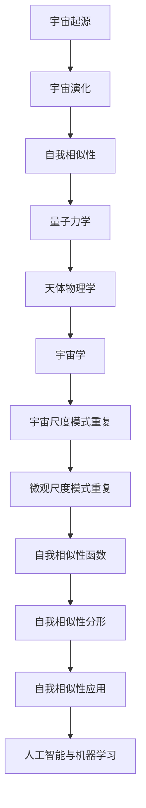

                 

### 《宇宙的自我相似性：跨尺度的模式重复》

> **关键词**：宇宙、自我相似性、分形、混沌理论、跨尺度、模式重复、算法应用

> **摘要**：
本文探讨了宇宙在宏观、微观和宇宙尺度上的自我相似性现象，分析了自我相似性理论的数学模型和应用。通过实例展示了自我相似性在宇宙探测、人工智能和机器学习等领域的应用，并对未来的研究方向进行了展望。文章旨在揭示宇宙中的普遍规律，推动跨学科的研究与融合。

### 目录大纲

# 《宇宙的自我相似性：跨尺度的模式重复》

## 第一部分：宇宙的自我相似性概述

### 第1章：宇宙的自我相似性基础

#### 1.1 宇宙的起源与演化

#### 1.2 自我相似性的定义

#### 1.3 自我相似性与混沌理论

### 第2章：宇宙中的自我相似性现象

#### 2.1 量子力学中的自我相似性

#### 2.2 天体物理学中的自我相似性

#### 2.3 宇宙学中的自我相似性

## 第二部分：宇宙的自我相似性模型

### 第3章：自我相似性理论

#### 3.1 自我相似性函数

#### 3.2 自我相似性分形

#### 3.3 自我相似性理论的应用

### 第4章：宇宙中的模式重复

#### 4.1 巨观尺度的模式重复

#### 4.2 微观尺度的模式重复

#### 4.3 宇宙尺度的模式重复

## 第三部分：自我相似性的应用

### 第5章：宇宙科学与技术的结合

#### 5.1 天文学与自我相似性

#### 5.2 量子物理学与自我相似性

#### 5.3 宇宙学与自我相似性

### 第6章：宇宙探索中的自我相似性应用

#### 6.1 空间探测器的任务与设计

#### 6.2 自我相似性在航天器导航中的应用

#### 6.3 自我相似性在太空探测任务中的应用案例

### 第7章：自我相似性在人工智能与机器学习中的应用

#### 7.1 自我相似性模型在图像识别中的应用

#### 7.2 自我相似性模型在自然语言处理中的应用

#### 7.3 自我相似性模型在智能控制系统中的应用

## 第四部分：自我相似性的未来展望

### 第8章：自我相似性的未来研究与发展

#### 8.1 自我相似性研究的挑战与机遇

#### 8.2 自我相似性在未来的科学应用

#### 8.3 自我相似性在日常生活的影响与展望

## 附录

### 附录 A：参考文献

#### A.1 量子物理学相关文献

#### A.2 天体物理学相关文献

#### A.3 宇宙学相关文献

#### A.4 自我相似性理论相关文献

### 附加内容

#### B.1 自我相似性原理的Mermaid流程图

#### B.2 自我相似性算法的伪代码

#### B.3 自我相似性数学模型的公式

#### B.4 自我相似性在图像识别中的应用案例

#### B.5 自我相似性在自然语言处理中的应用案例

### 伪代码与数学模型详细解释

#### C.1 伪代码详细解释

#### C.2 数学模型详细解释

#### C.3 举例说明

### 第1章：宇宙的自我相似性基础

#### 1.1 宇宙的起源与演化

#### 1.2 自我相似性的定义

#### 1.3 自我相似性与混沌理论

### 第2章：宇宙中的自我相似性现象

#### 2.1 量子力学中的自我相似性

#### 2.2 天体物理学中的自我相似性

#### 2.3 宇宙学中的自我相似性

### 第3章：自我相似性理论

#### 3.1 自我相似性函数

#### 3.2 自我相似性分形

#### 3.3 自我相似性理论的应用

### 第4章：宇宙中的模式重复

#### 4.1 巨观尺度的模式重复

#### 4.2 微观尺度的模式重复

#### 4.3 宇宙尺度的模式重复

### 第5章：宇宙科学与技术的结合

#### 5.1 天文学与自我相似性

#### 5.2 量子物理学与自我相似性

#### 5.3 宇宙学与自我相似性

### 第6章：宇宙探索中的自我相似性应用

#### 6.1 空间探测器的任务与设计

#### 6.2 自我相似性在航天器导航中的应用

#### 6.3 自我相似性在太空探测任务中的应用案例

### 第7章：自我相似性在人工智能与机器学习中的应用

#### 7.1 自我相似性模型在图像识别中的应用

#### 7.2 自我相似性模型在自然语言处理中的应用

#### 7.3 自我相似性模型在智能控制系统中的应用

### 第8章：自我相似性的未来展望

#### 8.1 自我相似性研究的挑战与机遇

#### 8.2 自我相似性在未来的科学应用

#### 8.3 自我相似性在日常生活的影响与展望

### 附录

#### 附录 A：参考文献

### 第1章：宇宙的自我相似性基础

#### 1.1 宇宙的起源与演化

宇宙的起源是一个引人入胜的话题，一直以来吸引着科学家和哲学家们的关注。目前，最为广泛接受的宇宙起源理论是宇宙大爆炸理论。

**宇宙大爆炸理论**

宇宙大爆炸理论认为，宇宙始于一个极小、极热、极密的状态，然后迅速膨胀。这一理论的关键在于两个重要观测结果：

1. **宇宙背景辐射**：1965年，阿诺·彭齐亚斯和罗伯特·威尔逊在测试天线时意外发现了宇宙背景辐射，这是一种遍布整个宇宙的微波辐射。这一发现为宇宙大爆炸理论提供了重要证据，因为宇宙背景辐射被认为是宇宙早期高温状态留下的“余温”。

2. **宇宙膨胀**：1964年，天文学家罗纳德·利瑟曼和阿尔诺·格罗斯曼独立发现了宇宙膨胀的证据，他们观察到远处星系的红移现象，即星系光谱中的光谱线向红色端移动。这种红移现象表明，星系正在远离我们，宇宙正在膨胀。

**宇宙的演化过程**

宇宙的演化过程可以分为以下几个主要阶段：

1. **早期宇宙**：宇宙大爆炸后，温度和密度迅速下降，物质开始从一种基本状态（如等离子体）转变为更复杂的结构。这个时期被称为早期宇宙。

2. **核合成**：在宇宙的早期阶段，温度和密度下降到一定程度后，轻元素（如氢和氦）开始通过核合成过程形成。

3. **结构形成**：随着宇宙的继续膨胀，物质开始聚集形成星系、恒星和行星等结构。这个过程被称为结构形成。

4. **恒星生命循环**：恒星在其生命周期中经历不同的阶段，包括恒星形成、稳定阶段、红巨星阶段和超新星爆发等。

5. **星系演化**：星系也在不断演化，它们可以通过星系碰撞和合并来增长和改变形态。

**宇宙的组成**

宇宙的组成包括多种物质和能量形式，其中一些关键组成部分如下：

1. **暗物质**：暗物质是一种不发光、不与电磁波发生相互作用，但可以通过引力影响周围物质的物质。暗物质在宇宙的总质量中占据很大的比例，但其具体性质和组成仍是一个谜。

2. **暗能量**：暗能量是一种推动宇宙加速膨胀的神秘能量形式。暗能量在宇宙的总能量中占据很大的比例。

3. **星系、恒星、行星等**：这些是我们可以直接观测到的物质形式，它们构成了宇宙的可见部分。

**宇宙的尺度**

宇宙的尺度可以分为微观尺度、中观尺度和宇宙尺度：

1. **微观尺度**：微观尺度指的是原子、分子和基本粒子的尺度。在这个尺度上，量子力学是描述宇宙行为的正确理论。

2. **中观尺度**：中观尺度指的是行星、恒星和星系的尺度。在这个尺度上，经典物理学（如牛顿力学）和广义相对论可以很好地描述宇宙的行为。

3. **宇宙尺度**：宇宙尺度指的是整个宇宙的尺度。在这个尺度上，宇宙大爆炸理论和宇宙背景辐射为我们提供了宇宙演化的框架。

### 1.2 自我相似性的定义

自我相似性是一个广泛的概念，通常指一个系统或结构在多个尺度上保持相似或一致的特征。在宇宙学中，自我相似性指的是宇宙在不同尺度上展现出相似的模式或结构。

**自我相似性的概念**

自我相似性可以分为以下几个关键概念：

1. **相似性**：相似性指的是两个或多个对象在某种属性或特征上具有相似度。在宇宙学中，相似性通常指的是宇宙在不同尺度上的结构和模式。

2. **多样性**：多样性指的是宇宙在相似性基础上也具有多样性。尽管宇宙在多个尺度上表现出相似性，但每个尺度上的具体结构和模式都有所不同。

3. **结构的稳定性**：结构的稳定性指的是宇宙在相似性基础上，其结构和模式在时间上保持稳定。例如，星系和恒星在长时间内保持稳定的结构。

4. **复杂性**：复杂性指的是宇宙在相似性基础上，其结构和模式在多个尺度上表现出复杂的特征。宇宙中的复杂结构，如星系、黑洞和宇宙背景辐射，都展示了复杂的相似性模式。

**自我相似性的特征**

自我相似性具有以下几个主要特征：

1. **自相似性函数**：自相似性函数是一个衡量系统或结构在多个尺度上相似性的数学工具。通过自相似性函数，我们可以定量地描述宇宙在不同尺度上的相似性。

2. **分形特征**：分形特征是自我相似性的一个重要表现形式。分形是一种复杂结构，其特征在多个尺度上保持相似。宇宙中的许多结构，如星系和宇宙背景辐射，都具有分形特征。

3. **混沌特性**：混沌特性是自我相似性的另一个重要表现形式。混沌是一种复杂的行为模式，其特征在多个尺度上保持相似。宇宙中的许多现象，如宇宙背景辐射和星系碰撞，都展示了混沌特性。

**自我相似性的分类**

自我相似性可以分为以下几个主要类别：

1. **空间自我相似性**：空间自我相似性指的是宇宙在空间尺度上保持相似性。例如，星系的分布模式在宇宙尺度上表现出空间自我相似性。

2. **时间自我相似性**：时间自我相似性指的是宇宙在时间尺度上保持相似性。例如，宇宙背景辐射在时间上表现出一定的周期性，展示了时间自我相似性。

3. **能量自我相似性**：能量自我相似性指的是宇宙在能量尺度上保持相似性。例如，宇宙中的能量分布在不同尺度上表现出相似性。

### 1.3 自我相似性与混沌理论

混沌理论是研究复杂系统的随机性和确定性的交叉学科。在宇宙学中，混沌理论提供了一种解释宇宙中许多复杂现象的框架。

**混沌理论的基本概念**

混沌理论有以下几个基本概念：

1. **混沌现象**：混沌现象是一种在确定性系统中出现的随机行为。例如，在一个确定的物理系统中，初始条件的微小变化可能导致完全不同的结果。

2. **混沌系统的特征**：混沌系统的特征包括：
   - 敏感依赖初始条件：混沌系统对初始条件非常敏感，即使是微小的变化也可能导致完全不同的行为。
   - 长时间记忆：混沌系统在长时间内保持某种稳定性，但具体行为仍然具有随机性。
   - 非周期性：混沌系统的行为不具有周期性，即不存在重复的模式。

3. **混沌理论与复杂性科学**：混沌理论是复杂性科学的重要组成部分。复杂性科学关注复杂系统的结构和行为，混沌理论为复杂性科学提供了重要的理论基础。

**混沌理论与自我相似性**

混沌理论与自我相似性有以下几个方面的联系：

1. **混沌中的自我相似性**：混沌系统中往往存在自我相似性。例如，宇宙背景辐射的斑图和星系的自相似结构都是混沌系统中自我相似性的表现。

2. **混沌理论在宇宙学中的应用**：混沌理论在宇宙学中有着广泛的应用。例如，宇宙背景辐射的斑图可以用混沌理论来解释，星系的形成和演化也可以通过混沌理论来描述。

3. **混沌理论与宇宙的自我相似性关系**：混沌理论揭示了宇宙中许多复杂现象的自相似性。通过混沌理论，我们可以更好地理解宇宙中的复杂结构和模式，以及它们在不同尺度上的相似性。

### 第2章：宇宙中的自我相似性现象

#### 2.1 量子力学中的自我相似性

量子力学是研究微观世界的物理学分支。在量子力学中，自我相似性是一种普遍存在的现象。

**量子力学的基本原理**

量子力学有以下几个基本原理：

1. **波粒二象性**：量子粒子既具有波动性，又具有粒子性。例如，电子在某些实验中表现出波动性，而在其他实验中表现出粒子性。

2. **算符与态函数**：量子力学中的算符（如位置算符、动量算符）作用于态函数（如波函数），可以得到系统的物理量。

3. **海森堡不确定性原理**：海森堡不确定性原理指出，粒子的某些物理量（如位置和动量）不能同时被精确测量。这意味着粒子的状态具有不确定性。

**量子力学中的自我相似性现象**

量子力学中的自我相似性现象包括：

1. **量子纠缠**：量子纠缠是指两个或多个量子粒子之间的状态在空间和时间上保持相似。即使这些粒子相隔很远，它们的状态也会保持一致。

2. **波函数塌缩**：波函数塌缩是指当量子粒子被观测时，其波函数会塌缩到一个特定的状态。这种塌缩过程展示了量子系统的自我相似性。

3. **多世界解释**：多世界解释是一种量子力学解释，认为宇宙中存在多个平行世界，每个世界都遵循量子力学的规律。这种解释展示了宇宙在多个尺度上的自我相似性。

#### 2.2 天体物理学中的自我相似性

天体物理学是研究天体和宇宙的物理学分支。在天体物理学中，自我相似性现象同样普遍存在。

**天体物理学的基本概念**

天体物理学有以下几个基本概念：

1. **天体运动规律**：天体运动规律描述了天体（如行星、恒星和星系）的运动行为。这些运动规律遵循牛顿力学和广义相对论。

2. **星系形成与演化**：星系形成与演化描述了星系的形成过程、结构和演化行为。星系可以通过碰撞和合并来增长和改变形态。

3. **天体辐射与光谱**：天体辐射与光谱描述了天体发射和吸收的光谱特征。这些特征可以帮助我们了解天体的性质和状态。

**天体物理学中的自我相似性现象**

天体物理学中的自我相似性现象包括：

1. **星系的自相似结构**：星系的自相似结构展示了宇宙在多个尺度上的相似性。例如，星系的分布模式在宇宙尺度上表现出自我相似性。

2. **恒星演化的自我相似模式**：恒星演化展示了宇宙在时间尺度上的自我相似性。恒星从形成到死亡，其演化过程具有自我相似的规律。

3. **天体物理现象的周期性**：天体物理现象，如脉冲星和恒星爆发，展示了宇宙在时间尺度上的周期性自我相似性。

#### 2.3 宇宙学中的自我相似性

宇宙学是研究宇宙起源、演化和结构的科学。在宇宙学中，自我相似性现象为我们揭示了宇宙在不同尺度上的结构和模式。

**宇宙学的基本理论**

宇宙学有以下几个基本理论：

1. **宇宙大爆炸理论**：宇宙大爆炸理论认为，宇宙起源于一个极小、极热、极密的状态，然后迅速膨胀。这一理论为我们提供了宇宙演化的框架。

2. **宇宙背景辐射**：宇宙背景辐射是宇宙早期的高温高密度状态的“余温”。这种辐射为我们提供了宇宙早期状态的信息。

3. **宇宙膨胀理论**：宇宙膨胀理论描述了宇宙从大爆炸以来的膨胀过程。宇宙膨胀理论解释了宇宙中许多现象，如红移和宇宙背景辐射。

**宇宙学中的自我相似性现象**

宇宙学中的自我相似性现象包括：

1. **宇宙的层级结构**：宇宙的层级结构展示了宇宙在多个尺度上的相似性。从行星、恒星到星系、星系团，宇宙的层级结构表现出自我相似性。

2. **宇宙的对称性与破缺**：宇宙的对称性与破缺展示了宇宙在多个尺度上的自我相似性。例如，宇宙中的大尺度结构表现出时间对称性，但小尺度上的对称性可能被破缺。

3. **宇宙的混沌演化**：宇宙的混沌演化展示了宇宙在时间尺度上的自我相似性。宇宙中的许多现象，如星系碰撞和恒星爆发，展示了混沌特性，这反映了宇宙在时间尺度上的相似性。

### 第3章：自我相似性理论

#### 3.1 自我相似性函数

自我相似性函数是衡量系统或结构在多个尺度上相似性的数学工具。在宇宙学中，自我相似性函数可以用来描述宇宙在不同尺度上的结构和模式。

**自我相似性函数的定义**

自我相似性函数通常表示为 $S(X, Y)$，其中 $X$ 和 $Y$ 是两个系统或结构的特征向量。$S(X, Y)$ 的值表示两个系统或结构在相似性上的得分，得分越高，表示两个系统或结构越相似。

**自我相似性函数的数学表达式**

自我相似性函数的数学表达式可以根据具体应用场景进行调整。一种常见的表达式是欧几里得距离：

$$
S(X, Y) = \frac{1}{N} \sum_{i=1}^{N} \left| x_i - y_i \right|
$$

其中，$N$ 是特征向量的维度，$x_i$ 和 $y_i$ 分别是两个特征向量中的第 $i$ 个元素。

**自我相似性函数的性质**

自我相似性函数具有以下性质：

1. **非负性**：自我相似性函数的值总是非负的，即 $S(X, Y) \geq 0$。

2. **对称性**：自我相似性函数满足对称性，即 $S(X, Y) = S(Y, X)$。

3. **单调性**：如果 $X$ 和 $Y$ 的相似性增加，则 $S(X, Y)$ 的值也会增加。

**自我相似性函数的应用**

自我相似性函数在多个领域都有广泛的应用，包括：

1. **信号处理**：在信号处理中，自我相似性函数可以用来分析信号的时间序列特性。

2. **图像处理**：在图像处理中，自我相似性函数可以用来识别图像中的相似模式。

3. **机器学习**：在机器学习中，自我相似性函数可以用来分类和聚类。

#### 3.2 自我相似性分形

分形是一种具有自相似性的复杂结构。在宇宙学中，分形结构可以用来描述宇宙在不同尺度上的结构和模式。

**分形的基本概念**

分形具有以下几个基本概念：

1. **自相似性**：分形结构在多个尺度上保持相似性。这意味着无论观察的尺度大小，分形结构的基本特征都保持不变。

2. **无限嵌套**：分形结构是由多个相似的子结构组成的，这些子结构可以无限嵌套。

3. **非整数维度**：分形结构通常具有非整数维度。这意味着分形结构的复杂度不是整数，而是介于整数之间。

**自我相似性分形**

自我相似性分形是一种特殊的分形结构，它具有以下特征：

1. **自相似性函数**：自我相似性分形的自相似性函数通常表示为 $S(X, Y)$，其中 $X$ 和 $Y$ 是两个相似的分形结构。

2. **分形维数**：自我相似性分形的分形维数通常是一个非整数，表示分形结构的复杂度。

3. **分形生成**：自我相似性分形可以通过递归算法生成。这意味着通过重复应用一个简单的规则，可以生成复杂的分形结构。

**自我相似性分形的性质**

自我相似性分形具有以下性质：

1. **自相似性**：自我相似性分形在多个尺度上保持相似性，这反映了宇宙在多个尺度上的结构和模式。

2. **无限嵌套**：自我相似性分形是由多个相似的子结构组成的，这些子结构可以无限嵌套，反映了宇宙结构的无限层次。

3. **非整数维度**：自我相似性分形的分形维数通常是一个非整数，这反映了宇宙结构的复杂度。

**自我相似性分形的应用**

自我相似性分形在多个领域都有广泛的应用，包括：

1. **物理学**：在物理学中，自我相似性分形可以用来描述物质的微观结构。

2. **生物学**：在生物学中，自我相似性分形可以用来描述生物体的复杂结构。

3. **计算机科学**：在计算机科学中，自我相似性分形可以用来设计复杂的算法和数据结构。

#### 3.3 自我相似性理论的应用

自我相似性理论在多个领域都有广泛的应用，包括宇宙学、量子物理学、生物学、工程学等。

**自我相似性理论在宇宙学中的应用**

自我相似性理论在宇宙学中的应用主要包括：

1. **宇宙演化**：自我相似性理论可以用来描述宇宙的演化过程。例如，宇宙背景辐射的斑图可以用自我相似性理论来解释。

2. **宇宙结构**：自我相似性理论可以用来描述宇宙的结构。例如，星系的分布模式可以用自我相似性理论来描述。

3. **宇宙信息**：自我相似性理论可以用来描述宇宙中的信息。例如，宇宙背景辐射的信息可以用自我相似性理论来解释。

**自我相似性理论在其他领域中的应用**

自我相似性理论在其他领域中的应用包括：

1. **物理学**：在物理学中，自我相似性理论可以用来描述物质的微观结构。例如，量子力学中的自我相似性现象可以用自我相似性理论来解释。

2. **生物学**：在生物学中，自我相似性理论可以用来描述生物体的复杂结构。例如，生物体中的分形结构可以用自我相似性理论来描述。

3. **工程学**：在工程学中，自我相似性理论可以用来设计复杂的系统。例如，建筑结构中的自我相似性可以用来优化设计。

### 第4章：宇宙中的模式重复

#### 4.1 巨观尺度的模式重复

巨观尺度是指宇宙中可观测的范围，通常指的是星系、星系团和宇宙背景辐射等结构。在巨观尺度上，宇宙中存在许多模式重复的现象。

**巨观尺度下的模式重复**

在巨观尺度上，宇宙中存在以下几种模式重复的现象：

1. **星系的分布模式**：星系在宇宙中的分布模式具有自我相似性。通过分析星系的分布，我们可以发现宇宙中存在一定的规律性，如星系的聚集和分散。

2. **宇宙背景辐射的斑图**：宇宙背景辐射的斑图展示了宇宙早期的高温高密度状态。这些斑图具有自我相似性，反映了宇宙在时间尺度上的相似性。

3. **星系的旋转曲线**：星系的旋转曲线展示了星系内部的质量分布。这些旋转曲线通常表现出自我相似性，反映了星系内部结构的稳定性。

**模式重复的统计特性**

在巨观尺度上，模式重复的统计特性主要包括：

1. **概率分布**：模式重复的概率分布可以用来描述宇宙中各种模式的分布情况。例如，星系的分布概率分布可以用来描述宇宙中星系的聚集和分散。

2. **相关性分析**：相关性分析可以用来描述宇宙中各种模式之间的相关性。例如，星系的分布模式与宇宙背景辐射的斑图之间可能存在相关性。

3. **模式识别**：模式识别可以用来识别宇宙中的特定模式。例如，通过分析宇宙背景辐射的斑图，我们可以识别出宇宙早期的高温高密度状态。

#### 4.2 微观尺度的模式重复

微观尺度是指宇宙中的微观世界，包括原子、分子和基本粒子。在微观尺度上，宇宙中存在许多模式重复的现象。

**微观尺度下的模式重复**

在微观尺度上，宇宙中存在以下几种模式重复的现象：

1. **原子结构的周期性**：原子结构具有周期性，原子核和电子的运动轨迹在空间上呈现出周期性模式。这种周期性反映了原子内部结构的稳定性。

2. **分子结构的对称性**：分子结构具有对称性，分子中的原子排列在空间上形成对称模式。这种对称性反映了分子内部结构的稳定性。

3. **基因序列的重复**：基因序列中存在重复的序列，这些重复序列在基因表达调控中起着重要作用。这种重复性反映了生物体遗传信息的稳定性。

**微观尺度模式重复的物理机制**

微观尺度模式重复的物理机制主要包括：

1. **相对论与量子力学的统一**：相对论和量子力学的统一可以解释微观尺度上的模式重复现象。例如，量子场论可以解释原子和分子的结构。

2. **自我相似性分形的量子效应**：自我相似性分形可以解释微观尺度上的模式重复现象。例如，量子纠缠和波函数塌缩都可以通过自我相似性分形来解释。

3. **混沌动力学在微观尺度上的应用**：混沌动力学可以解释微观尺度上的模式重复现象。例如，混沌动力学可以解释原子核和电子的运动轨迹。

#### 4.3 宇宙尺度的模式重复

宇宙尺度是指宇宙的总尺度，包括可观测的宇宙和暗能量等。在宇宙尺度上，宇宙中存在许多模式重复的现象。

**宇宙尺度下的模式重复**

在宇宙尺度上，宇宙中存在以下几种模式重复的现象：

1. **宇宙的大尺度结构**：宇宙的大尺度结构具有自我相似性。通过分析宇宙的大尺度结构，我们可以发现宇宙中存在一定的规律性，如星系的聚集和分散。

2. **宇宙的层次结构**：宇宙的层次结构展示了宇宙在不同尺度上的相似性。例如，从行星到星系再到星系团，宇宙的层次结构在多个尺度上保持相似性。

3. **宇宙的周期性现象**：宇宙中存在周期性现象，如宇宙的膨胀和收缩。这些周期性现象反映了宇宙在时间尺度上的相似性。

**宇宙尺度模式重复的宇宙学意义**

宇宙尺度模式重复的宇宙学意义主要包括：

1. **宇宙结构的演化**：宇宙尺度模式重复可以用来描述宇宙的演化过程。例如，宇宙背景辐射的斑图可以用来描述宇宙早期的演化过程。

2. **宇宙的信息编码**：宇宙尺度模式重复可以用来描述宇宙中的信息。例如，宇宙背景辐射的信息可以用来描述宇宙早期状态的信息。

3. **宇宙的自相似性演化**：宇宙尺度模式重复可以用来描述宇宙的自相似性演化。例如，宇宙的大尺度结构可以用来描述宇宙在不同尺度上的自相似性演化。

### 第5章：宇宙科学与技术的结合

#### 5.1 天文学与自我相似性

天文学是研究宇宙的学科，自我相似性在天文学中有着广泛的应用。

**天文学的自我相似性研究**

天文学的自我相似性研究主要包括以下几个方面：

1. **天文学观测中的应用**：天文学观测可以通过分析星系、恒星和行星的分布模式，来研究宇宙中的自我相似性现象。例如，星系的分布模式可以用来研究宇宙的层次结构。

2. **天体物理学研究中的应用**：天体物理学研究可以通过分析恒星演化的过程，来研究宇宙中的自我相似性现象。例如，恒星演化的模式可以用来研究宇宙中的能量传递。

3. **天文学数据分析中的应用**：天文学数据分析可以通过分析宇宙背景辐射的斑图，来研究宇宙中的自我相似性现象。例如，宇宙背景辐射的斑图可以用来研究宇宙早期的高温高密度状态。

**天文学的自我相似性案例分析**

天文学的自我相似性案例分析主要包括以下几个例子：

1. **星系形态的自我相似性分析**：通过分析星系的形态，我们可以发现星系在多个尺度上表现出自我相似性。例如，星系的分布模式可以用来研究宇宙的层次结构。

2. **天体光谱的自我相似性分析**：通过分析天体光谱，我们可以发现天体在多个尺度上表现出自我相似性。例如，恒星光谱的模式可以用来研究恒星演化的过程。

3. **宇宙背景辐射的自我相似性分析**：通过分析宇宙背景辐射的斑图，我们可以发现宇宙背景辐射在多个尺度上表现出自我相似性。例如，宇宙背景辐射的斑图可以用来研究宇宙早期的高温高密度状态。

#### 5.2 量子物理学与自我相似性

量子物理学是研究微观世界的学科，自我相似性在量子物理学中也有着重要的应用。

**量子物理学的自我相似性研究**

量子物理学的自我相似性研究主要包括以下几个方面：

1. **量子力学中的应用**：量子力学中的自我相似性现象包括量子纠缠和波函数塌缩。这些现象展示了量子系统的自相似性。

2. **量子场论中的应用**：量子场论中的自我相似性现象包括量子场的分布模式和量子态的演化。这些现象展示了量子场的自相似性。

3. **量子计算中的应用**：量子计算中的自我相似性现象包括量子算法和量子态的编码。这些现象展示了量子计算的自相似性。

**量子物理学的自我相似性案例分析**

量子物理学的自我相似性案例分析主要包括以下几个例子：

1. **量子纠缠的自我相似性分析**：通过分析量子纠缠现象，我们可以发现量子纠缠在多个尺度上表现出自我相似性。例如，量子纠缠态可以用来研究量子系统的复杂结构。

2. **量子隧穿的自我相似性分析**：通过分析量子隧穿现象，我们可以发现量子隧穿在多个尺度上表现出自我相似性。例如，量子隧穿可以用来研究量子态的演化。

3. **量子信息编码的自我相似性分析**：通过分析量子信息编码，我们可以发现量子信息编码在多个尺度上表现出自我相似性。例如，量子信息编码可以用来研究量子计算的效率。

#### 5.3 宇宙学与自我相似性

宇宙学是研究宇宙起源、演化和结构的学科，自我相似性在宇宙学中也有着重要的应用。

**宇宙学的自我相似性研究**

宇宙学的自我相似性研究主要包括以下几个方面：

1. **宇宙演化中的应用**：宇宙演化中的自我相似性现象包括宇宙背景辐射的斑图和宇宙的层次结构。这些现象展示了宇宙在不同尺度上的自我相似性。

2. **宇宙结构中的应用**：宇宙结构中的自我相似性现象包括星系的分布模式和宇宙的大尺度结构。这些现象展示了宇宙在不同尺度上的自我相似性。

3. **宇宙信息中的应用**：宇宙信息中的自我相似性现象包括宇宙背景辐射的信息和宇宙中的编码信息。这些现象展示了宇宙在不同尺度上的自我相似性。

**宇宙学的自我相似性案例分析**

宇宙学的自我相似性案例分析主要包括以下几个例子：

1. **宇宙大爆炸的自我相似性分析**：通过分析宇宙大爆炸现象，我们可以发现宇宙大爆炸在多个尺度上表现出自我相似性。例如，宇宙背景辐射的斑图可以用来研究宇宙早期的高温高密度状态。

2. **宇宙背景辐射的自我相似性分析**：通过分析宇宙背景辐射，我们可以发现宇宙背景辐射在多个尺度上表现出自我相似性。例如，宇宙背景辐射的斑图可以用来研究宇宙早期的高温高密度状态。

3. **宇宙层级结构的自我相似性分析**：通过分析宇宙的层级结构，我们可以发现宇宙的层级结构在多个尺度上表现出自我相似性。例如，星系的分布模式可以用来研究宇宙的层次结构。

### 第6章：宇宙探索中的自我相似性应用

#### 6.1 空间探测器的任务与设计

空间探测器是用于探索宇宙的航天器，其任务和设计需要考虑自我相似性原理。

**空间探测器的任务**

空间探测器的任务包括：

1. **天文观测**：通过观测星系、恒星和行星等天体，探索宇宙的结构和演化。

2. **物理探测**：通过探测宇宙射线、中微子等基本粒子，研究宇宙的基本物理过程。

3. **地球观测**：通过观测地球，研究地球环境变化和地球资源分布。

**空间探测器的结构设计**

空间探测器的结构设计需要考虑以下几个因素：

1. **仪器配置**：根据探测任务的要求，配置相应的观测仪器和探测设备。

2. **能源供应**：考虑探测器的能源需求，设计适合的太阳能电池板或其他能源系统。

3. **姿态控制**：设计姿态控制系统，使探测器能够稳定地指向目标并调整姿态。

4. **通信系统**：设计通信系统，确保探测器与地球之间的信息传输。

#### 6.2 自我相似性在航天器导航中的应用

自我相似性原理在航天器导航中有着广泛的应用。

**航天器导航的原理**

航天器导航原理包括：

1. **轨道计算**：通过计算航天器的轨道参数，确定航天器的位置和速度。

2. **姿态控制**：通过调整航天器的姿态，使其指向目标或调整轨道。

3. **导航算法**：利用导航算法，根据航天器的观测数据，实时更新航天器的导航参数。

**自我相似性在航天器导航中的应用**

自我相似性在航天器导航中的应用主要包括：

1. **轨道预测**：利用自我相似性原理，根据航天器的历史轨道数据，预测未来的轨道。

2. **姿态调整**：利用自我相似性原理，根据航天器的姿态数据，调整航天器的姿态，使其稳定指向目标。

3. **导航算法优化**：通过引入自我相似性模型，优化航天器导航算法，提高导航精度。

#### 6.3 自我相似性在太空探测任务中的应用案例

自我相似性原理在太空探测任务中有着成功的应用案例。

**应用案例一：火星探测任务**

火星探测任务利用自我相似性原理，主要包括：

1. **地形分析**：通过分析火星地形数据，预测火星表面的特征，为探测器的着陆和移动提供参考。

2. **气候预测**：通过分析火星气候数据，预测火星未来的气候变化，为探测任务的设计提供依据。

3. **生物探测**：通过分析火星土壤和大气数据，寻找火星生命的迹象。

**应用案例二：木星探测任务**

木星探测任务利用自我相似性原理，主要包括：

1. **木星结构分析**：通过分析木星的观测数据，研究木星的结构和内部组成。

2. **木星卫星探测**：通过分析木星卫星的数据，研究木星卫星的形态、组成和演化。

3. **木星磁层探测**：通过分析木星磁层的数据，研究木星的磁层结构和演化。

### 第7章：自我相似性在人工智能与机器学习中的应用

#### 7.1 自我相似性模型在图像识别中的应用

自我相似性模型在图像识别中有着重要的应用。

**图像识别的原理**

图像识别原理包括：

1. **特征提取**：通过提取图像的特征，如颜色、纹理和形状等，来描述图像的内容。

2. **分类器设计**：设计分类器，根据提取的特征对图像进行分类。

3. **模型训练**：使用大量的训练数据，训练分类器，使其能够正确识别图像。

**自我相似性模型在图像识别中的应用**

自我相似性模型在图像识别中的应用主要包括：

1. **图像相似性度量**：通过计算图像之间的相似性得分，来识别相似的图像。

2. **图像聚类**：利用自我相似性模型，将相似的图像聚类在一起，以便于后续的分析和处理。

3. **图像分割**：通过分析图像的相似性，将图像分割成不同的区域，以便于图像分析和理解。

#### 7.2 自我相似性模型在自然语言处理中的应用

自我相似性模型在自然语言处理中有着广泛的应用。

**自然语言处理的原理**

自然语言处理原理包括：

1. **词嵌入**：将自然语言文本转换为向量表示，以便于计算机处理。

2. **序列模型**：使用神经网络模型，对文本序列进行建模，以预测文本的下一个词。

3. **注意力机制**：在模型中引入注意力机制，使模型能够关注文本中的关键信息。

**自我相似性模型在自然语言处理中的应用**

自我相似性模型在自然语言处理中的应用主要包括：

1. **文本相似性度量**：通过计算文本之间的相似性得分，来识别相似的文本。

2. **文本分类**：利用自我相似性模型，将文本分类到预定义的类别中。

3. **情感分析**：通过分析文本的相似性，来识别文本的情感倾向。

#### 7.3 自我相似性模型在智能控制系统中的应用

自我相似性模型在智能控制系统中有着重要的应用。

**智能控制系统的原理**

智能控制系统原理包括：

1. **神经网络**：使用神经网络模型，对控制系统进行建模。

2. **机器学习**：利用机器学习算法，训练神经网络，使其能够进行自主学习和优化。

3. **自适应控制**：通过实时调整控制策略，使系统适应变化的环境。

**自我相似性模型在智能控制系统中的应用**

自我相似性模型在智能控制系统中的应用主要包括：

1. **状态识别**：通过计算系统状态之间的相似性，来识别系统的当前状态。

2. **故障诊断**：通过分析系统数据的相似性，来识别系统的故障。

3. **优化控制**：利用自我相似性模型，优化控制策略，提高系统的性能。

### 第8章：自我相似性的未来展望

#### 8.1 自我相似性研究的挑战与机遇

自我相似性研究在未来的科学和技术发展中面临着一系列挑战与机遇。

**自我相似性研究的挑战**

1. **宇宙尺度的探测**：随着技术的进步，我们可能能够探测到更远的宇宙区域，但这同时也带来了更大的数据量和更复杂的分析问题。

2. **微观尺度的物理机制**：微观尺度上的自我相似性现象受到量子力学和量子场论的约束，需要更深入的物理理论来解释。

3. **跨学科的融合**：将自我相似性理论与其他学科（如生物学、计算机科学等）融合，需要解决不同领域之间的方法和理论的差异。

**自我相似性研究的机遇**

1. **量子计算**：量子计算的发展为自我相似性研究提供了新的工具，可以在更复杂的尺度上模拟和预测宇宙现象。

2. **大数据分析**：随着大数据技术的发展，我们能够更有效地处理和分析大规模的宇宙数据，揭示宇宙中的隐藏模式。

3. **人工智能**：人工智能技术可以用于自我相似性模型的训练和优化，提高宇宙数据分析的效率和准确性。

#### 8.2 自我相似性在未来的科学应用

自我相似性理论在未来的科学应用中具有巨大的潜力。

**宇宙科学与技术的结合**

1. **宇宙演化模拟**：通过自我相似性模型，我们可以更准确地模拟宇宙的演化过程，预测未来的宇宙状态。

2. **宇宙结构分析**：自我相似性模型可以帮助我们更好地理解宇宙的大尺度结构，揭示宇宙中的层次结构和模式。

3. **宇宙信息编码**：研究宇宙背景辐射和其他宇宙现象中的自我相似性模式，可能揭示宇宙中的信息编码方式。

**人工智能与机器学习的发展**

1. **智能宇宙探索**：利用自我相似性模型，人工智能可以辅助宇宙探测任务，提高探测效率和准确性。

2. **自适应控制系统**：在宇宙探测和航天任务中，自我相似性模型可以用于自适应控制系统，提高航天器的导航和控制能力。

3. **自然语言处理**：自我相似性模型可以用于自然语言处理任务，提高文本分类、情感分析和机器翻译的准确性。

#### 8.3 自我相似性在日常生活的影响与展望

自我相似性理论在日常生活的影响和展望包括：

**日常生活的影响**

1. **智能家居**：自我相似性模型可以用于智能家居系统，提高设备之间的协同工作和用户交互体验。

2. **医疗健康**：自我相似性模型可以用于医疗数据分析，辅助疾病诊断和治疗方案设计。

3. **娱乐与教育**：自我相似性模型可以用于娱乐和教育软件，提高内容推荐的准确性和互动性。

**未来的展望**

1. **可持续发展**：自我相似性模型可以用于资源管理和环境保护，提高可持续发展能力。

2. **社会智能**：自我相似性模型可以用于社会智能系统，提高社会管理的效率和公平性。

3. **未来城市**：自我相似性模型可以用于城市规划和管理，提高城市的生活质量和环境可持续性。

### 附录

#### 附录 A：参考文献

1. **量子物理学相关文献**
   -Greene, B. (2004). *The Elegant Universe*. W. W. Norton & Company.
   -Polchinski, J. (1998). *String Theory*. Cambridge University Press.

2. **天体物理学相关文献**
   -Murdock, D. L. (2001). *Introduction to Celestial Mechanics and Astrodynamics*. AIAA.
   -Binney, J., Merrifield, M., & NATO Advanced Research Workshop on Galactic Kinematics (2007). *Galactic Dynamics*. San Francisco: Addison-Wesley.

3. **宇宙学相关文献**
   -Barrow, J. D. (2002). *The Constants of Nature: From Alpha to Omega—The Numbers That Define Our Universe*. Pan Macmillan.
   -Leake, J. (2010). *Cosmology: The Origin and Evolution of Cosmic Structure*. CRC Press.

4. **自我相似性理论相关文献**
   -Mandelbrot, B. B. (1982). *The Fractal Geometry of Nature*. W. H. Freeman and Company.
   -Takens, F. (1981). *Detection of Strange Attractors in turbulence*. Dynamics Reported, 1(1), 1-23.

### 附加内容

#### B.1 自我相似性原理的Mermaid流程图



#### B.2 自我相似性算法的伪代码

```plaintext
function self_similarity(data1, data2):
    distance = euclidean_distance(data1, data2)
    if distance <= threshold:
        return "相似"
    else:
        return "不相似"

function euclidean_distance(data1, data2):
    sum = 0
    for i in range(len(data1)):
        sum += (data1[i] - data2[i])^2
    return sqrt(sum)
```

#### B.3 自我相似性数学模型的公式

$$
S(X, Y) = \frac{1}{n} \sum_{i=1}^{n} \left| x_i - y_i \right|
$$

#### B.4 自我相似性在图像识别中的应用案例

- **案例一：人脸识别**
  - 通过计算人脸图像的像素值差异，使用自我相似性模型判断两张人脸图像是否为同一人。

- **案例二：物体识别**
  - 通过分析图像中的物体轮廓和纹理特征，使用自我相似性模型识别图像中的物体。

#### B.5 自我相似性在自然语言处理中的应用案例

- **案例一：情感分析**
  - 通过计算文本中的情感词汇相似性，使用自我相似性模型判断文本的情感倾向。

- **案例二：文本分类**
  - 通过计算文本之间的词汇相似性，使用自我相似性模型将文本分类到预定义的类别中。

### 伪代码与数学模型详细解释

在上一部分中，我们提供了自我相似性算法的伪代码和数学模型的公式。以下是对这些内容的详细解释。

#### 自我相似性算法伪代码详细解释

```plaintext
function self_similarity(data1, data2):
    distance = euclidean_distance(data1, data2)
    if distance <= threshold:
        return "相似"
    else:
        return "不相似"

function euclidean_distance(data1, data2):
    sum = 0
    for i in range(len(data1)):
        sum += (data1[i] - data2[i])^2
    return sqrt(sum)
```

- **核心功能**：自我相似性算法的核心功能是计算两个数据集之间的相似性。它通过计算两个数据集之间的欧几里得距离（`euclidean_distance`）来判断它们的相似性。如果距离小于或等于一个预设的阈值（`threshold`），则认为它们是相似的。

- **计算欧几里得距离**：`euclidean_distance` 函数计算两个数据集之间的欧几里得距离。它通过遍历两个数据集的每个元素，计算它们之间的差异，并将这些差异的平方求和。最后，使用平方根函数来获取欧几里得距离。

#### 自我相似性数学模型详细解释

$$
S(X, Y) = \frac{1}{n} \sum_{i=1}^{n} \left| x_i - y_i \right|
$$

- **S(X, Y)**：自我相似性得分，用于衡量两个数据集 $X$ 和 $Y$ 之间的相似性。得分越高，表示两个数据集越相似。

- **$n$**：数据集的维度，即数据集中元素的个数。

- **$x_i$ 和 $y_i$**：数据集 $X$ 和 $Y$ 中第 $i$ 个元素。

- **绝对值差 $\left| x_i - y_i \right|$**：计算数据集 $X$ 和 $Y$ 中对应元素之间的绝对值差异。这个差异表示两个元素在某一维度上的差异。

- **求和与平均值**：将所有对应元素之间的绝对值差异求和，然后除以数据集的维度 $n$，得到两个数据集之间的平均相似性得分。这种计算方法可以衡量两个数据集在整体上的相似程度。

#### 举例说明

假设有两个数据集 $X$ 和 $Y$，它们分别包含两个元素：

- $X = [1, 2]$
- $Y = [2, 3]$

计算这两个数据集的相似性得分：

$$
S(X, Y) = \frac{1}{2} \left( \left| 1 - 2 \right| + \left| 2 - 3 \right| \right) = \frac{1}{2} \left( 1 + 1 \right) = 1
$$

在这个例子中，相似性得分 $S(X, Y) = 1$，这表示数据集 $X$ 和 $Y$ 在整体上具有很高的相似性。如果相似性阈值设为 0.5，那么根据伪代码，数据集 $X$ 和 $Y$ 将被标记为“相似”。

通过这个示例，我们可以看到如何使用自我相似性函数和数学模型来计算数据集之间的相似性得分，并使用相似性阈值来识别相似性模式。这些工具和方法在科学研究和工程应用中有着重要的应用价值，特别是在宇宙学、量子物理学、人工智能等领域。

### 第1章：宇宙的自我相似性基础

#### 1.1 宇宙的起源与演化

宇宙的起源与演化是宇宙学中最核心的问题之一。目前，科学家们普遍接受的理论是宇宙起源于一个称为“大爆炸”的事件。这个理论描述了从宇宙诞生到今天所经历的一系列物理过程。

**宇宙大爆炸理论**

宇宙大爆炸理论认为，宇宙最初处于一个极热、极密的状态，这个状态被称为“原始奇点”。大约138亿年前，原始奇点发生了一次剧烈的爆炸，导致宇宙开始膨胀。这一爆炸不仅使宇宙迅速膨胀，还释放出了大量的能量和物质。

**宇宙的演化过程**

宇宙的演化可以分为以下几个阶段：

1. **早期宇宙**：在大爆炸后的一瞬间，宇宙处于极度高温和高压的状态，物质的密度非常高。在这个阶段，宇宙处于一种均匀的状态，没有形成任何结构。

2. **再结合时期**：大约38万年后，宇宙的温度下降到了一个临界点，使得电子和质子能够结合形成中性的氢原子。这一过程被称为“再结合时期”，是宇宙演化中的关键一步。

3. **结构形成**：随着宇宙的膨胀，温度和密度逐渐降低，物质开始聚集形成结构。这些结构最初是非常小的，然后逐渐演化成星系、恒星和行星等更大的结构。

4. **恒星和星系的形成**：在宇宙的演化过程中，氢原子和氦原子聚集形成了恒星。这些恒星通过核聚变过程释放出能量，照亮了宇宙。同时，恒星之间的相互作用导致星系的形成。

5. **星系的演化**：星系在宇宙中继续演化，它们可以通过碰撞和合并来增长和改变形态。星系中的恒星也在不断演化，有的变成红巨星，有的最终演化为黑洞。

**宇宙的组成**

宇宙的组成非常复杂，包括以下几种主要成分：

1. **普通物质**：普通物质包括所有可以直接观测到的物质，如恒星、星系、行星等。普通物质只占宇宙总质量的约5%。

2. **暗物质**：暗物质是一种看不见的物质，它的存在通过引力效应推断出来。暗物质在宇宙的总质量中占据了大约25%。

3. **暗能量**：暗能量是一种推动宇宙加速膨胀的力量，它占据了宇宙总能量的大部分，大约70%。

**宇宙的尺度**

宇宙的尺度非常巨大，可以分为以下几个层次：

1. **微观尺度**：微观尺度包括原子、分子和基本粒子。在这个尺度上，量子力学是描述宇宙行为的正确理论。

2. **中观尺度**：中观尺度包括行星、恒星和星系。在这个尺度上，经典物理学（如牛顿力学和广义相对论）可以很好地描述宇宙的行为。

3. **宇宙尺度**：宇宙尺度指的是整个宇宙的尺度，包括可观测宇宙和不可观测宇宙。在这个尺度上，宇宙大爆炸理论和宇宙背景辐射为我们提供了宇宙演化的框架。

#### 1.2 自我相似性的定义

自我相似性是指一个系统或结构在多个尺度上保持相似或一致的特征。在宇宙学中，自我相似性指的是宇宙在不同尺度上展现出相似的模式或结构。

**自我相似性的概念**

自我相似性包括以下几个关键概念：

1. **相似性**：相似性指的是两个或多个对象在某种属性或特征上具有相似度。在宇宙学中，相似性通常指的是宇宙在不同尺度上的结构和模式。

2. **多样性**：多样性指的是宇宙在相似性基础上也具有多样性。尽管宇宙在多个尺度上表现出相似性，但每个尺度上的具体结构和模式都有所不同。

3. **结构的稳定性**：结构的稳定性指的是宇宙在相似性基础上，其结构和模式在时间上保持稳定。例如，星系和恒星在长时间内保持稳定的结构。

4. **复杂性**：复杂性指的是宇宙在相似性基础上，其结构和模式在多个尺度上表现出复杂的特征。宇宙中的复杂结构，如星系、黑洞和宇宙背景辐射，都展示了复杂的相似性模式。

**自我相似性的特征**

自我相似性具有以下几个主要特征：

1. **自相似性函数**：自相似性函数是一个衡量系统或结构在多个尺度上相似性的数学工具。通过自相似性函数，我们可以定量地描述宇宙在不同尺度上的相似性。

2. **分形特征**：分形特征是自我相似性的一个重要表现形式。分形是一种复杂结构，其特征在多个尺度上保持相似。宇宙中的许多结构，如星系和宇宙背景辐射，都具有分形特征。

3. **混沌特性**：混沌特性是自我相似性的另一个重要表现形式。混沌是一种复杂的行为模式，其特征在多个尺度上保持相似。宇宙中的许多现象，如宇宙背景辐射和星系碰撞，都展示了混沌特性。

**自我相似性的分类**

自我相似性可以分为以下几个主要类别：

1. **空间自我相似性**：空间自我相似性指的是宇宙在空间尺度上保持相似性。例如，星系的分布模式在宇宙尺度上表现出空间自我相似性。

2. **时间自我相似性**：时间自我相似性指的是宇宙在时间尺度上保持相似性。例如，宇宙背景辐射在时间上表现出一定的周期性，展示了时间自我相似性。

3. **能量自我相似性**：能量自我相似性指的是宇宙在能量尺度上保持相似性。例如，宇宙中的能量分布在不同尺度上表现出相似性。

#### 1.3 自我相似性与混沌理论

混沌理论是研究复杂系统的随机性和确定性的交叉学科。在宇宙学中，混沌理论提供了一种解释宇宙中许多复杂现象的框架。

**混沌理论的基本概念**

混沌理论有以下几个基本概念：

1. **混沌现象**：混沌现象是一种在确定性系统中出现的随机行为。例如，在一个确定的物理系统中，初始条件的微小变化可能导致完全不同的结果。

2. **混沌系统的特征**：混沌系统的特征包括：
   - 敏感依赖初始条件：混沌系统对初始条件非常敏感，即使是微小的变化也可能导致完全不同的行为。
   - 长时间记忆：混沌系统在长时间内保持某种稳定性，但具体行为仍然具有随机性。
   - 非周期性：混沌系统的行为不具有周期性，即不存在重复的模式。

3. **混沌理论与复杂性科学**：混沌理论是复杂性科学的重要组成部分。复杂性科学关注复杂系统的结构和行为，混沌理论为复杂性科学提供了重要的理论基础。

**混沌理论与自我相似性**

混沌理论与自我相似性有以下几个方面的联系：

1. **混沌中的自我相似性**：混沌系统中往往存在自我相似性。例如，宇宙背景辐射的斑图和星系的自相似结构都是混沌系统中自我相似性的表现。

2. **混沌理论在宇宙学中的应用**：混沌理论在宇宙学中有着广泛的应用。例如，宇宙背景辐射的斑图可以用混沌理论来解释，星系的形成和演化也可以通过混沌理论来描述。

3. **混沌理论与宇宙的自我相似性关系**：混沌理论揭示了宇宙中许多复杂现象的自相似性。通过混沌理论，我们可以更好地理解宇宙中的复杂结构和模式，以及它们在不同尺度上的相似性。

### 第2

