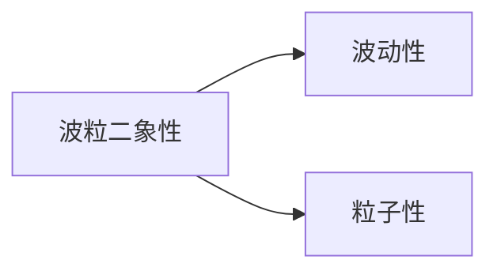
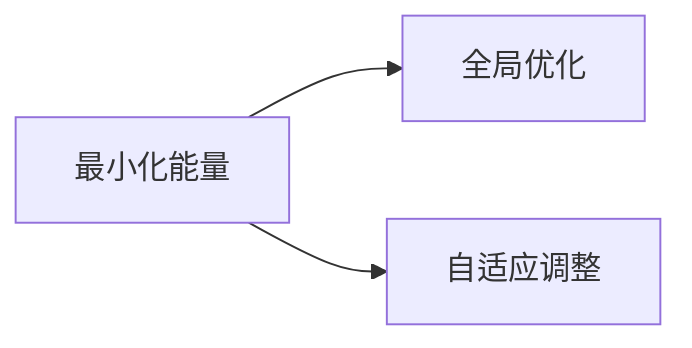
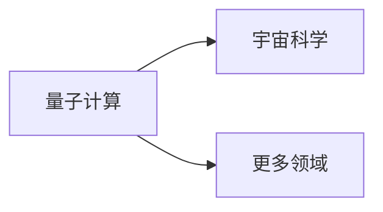

                 

## 引言

> 关键词：宇宙规律、自适应量子退火算法、相似性、跨领域研究

摘要：随着科学技术的不断发展，量子计算和宇宙科学逐渐成为人们关注的焦点。本文通过深入探讨宇宙规律与自适应量子退火算法之间的相似性，探讨了两者在理论和实践中的潜在联系。文章首先介绍了宇宙规律的基本原理和结构，接着详细阐述了自适应量子退火算法的设计原理和核心算法，最后分析了两者在跨领域研究中的应用和未来发展方向。本文旨在为读者提供一种全新的视角，以理解宇宙规律与量子计算之间的深刻联系。

在当今科学界，宇宙规律和量子计算已经成为两个极为重要的研究领域。宇宙规律的研究旨在揭示宇宙的起源、演化和未来，而量子计算则致力于探索物质世界的基本规律和复杂性。尽管这两个领域看似截然不同，但近年来，科学家们开始注意到两者之间存在一些有趣的相似性。本文将重点探讨自适应量子退火算法与宇宙规律之间的相似性，为跨领域研究提供新的视角。

首先，我们将介绍宇宙规律的基本原理和结构，包括宇宙的基本结构、宇宙演化规律以及宇宙与人类文明的联系。接着，我们将详细阐述自适应量子退火算法的基础知识，包括量子退火算法的原理、自适应量子退火算法的设计原则和设计流程。在此基础上，我们将分析量子力学与宇宙规律之间的联系，探讨量子计算在宇宙复杂性中的应用。随后，我们将深入探讨自适应量子退火算法与宇宙演化的相似性，并分析其在宇宙演化研究中的应用。

在第三部分，我们将详细讨论自适应量子退火算法的设计原理、设计流程和设计方法，并通过具体案例展示其应用。此外，我们还将探讨自适应量子退火算法在宇宙探索中的应用，分析量子计算与宇宙科学的交叉研究，并对未来研究进行展望。最后，我们将总结本文的核心观点，重申自适应量子退火算法与宇宙规律之间的联系，并提出对未来研究的建议。

通过本文的研究，我们希望能够为读者提供一个全新的视角，以理解宇宙规律与量子计算之间的深刻联系，为跨领域研究提供新的思路和方法。

### 目录大纲

以下是本文的目录大纲，详细展示了文章的结构和内容安排：

### 第一部分：引论
- **1. 宇宙规律简介**
  - **1.1 宇宙的基本结构**
  - **1.2 宇宙演化规律**
  - **1.3 宇宙与人类文明的联系**

- **2. 自适应量子退火算法概述**
  - **2.1 量子退火算法基础**
  - **2.2 自适应量子退火算法原理**
  - **2.3 自适应量子退火算法在人工智能中的应用**

### 第二部分：宇宙规律与量子退火算法的联系
- **3. 量子力学与宇宙规律的联系**
  - **3.1 波粒二象性**
  - **3.2 算符与量子态**
  - **3.3 测量与不确定性原理**

- **4. 量子计算与宇宙复杂性**
  - **4.1 量子计算的基本概念**
  - **4.2 宇宙复杂性分析**
  - **4.3 量子计算在宇宙复杂性中的应用**

- **5. 自适应量子退火算法与宇宙演化**
  - **5.1 自适应量子退火算法的演化过程**
  - **5.2 宇宙演化与自适应量子退火算法的相似性**
  - **5.3 自适应量子退火算法在宇宙演化研究中的应用**

### 第三部分：自适应量子退火算法设计
- **6. 自适应量子退火算法设计原理**
  - **6.1 设计原则**
  - **6.2 设计流程**
  - **6.3 设计方法**

- **7. 自适应量子退火算法案例分析**
  - **7.1 案例一：量子退火算法在优化问题中的应用**
  - **7.2 案例二：量子退火算法在机器学习中的应用**
  - **7.3 案例三：量子退火算法在密码学中的应用**

- **8. 自适应量子退火算法的挑战与展望**
  - **8.1 挑战分析**
  - **8.2 展望未来**

### 第四部分：应用与展望
- **9. 自适应量子退火算法在宇宙探索中的应用**
  - **9.1 宇宙规律的研究方法**
  - **9.2 自适应量子退火算法在宇宙探索中的前景**

- **10. 量子计算与宇宙科学的交叉研究**
  - **10.1 量子计算对宇宙科学的影响**
  - **10.2 宇宙科学对量子计算的启示**
  - **10.3 量子计算与宇宙科学的未来**

- **11. 结论**
  - **11.1 自适应量子退火算法与宇宙规律的联系总结**
  - **11.2 自适应量子退火算法设计的关键点**
  - **11.3 对未来研究的展望**

通过以上目录大纲，我们可以清晰地了解本文的结构和内容安排，为后续内容的撰写提供指导。

### 第一部分：引论

#### 1. 宇宙规律简介

宇宙是我们在宇宙中观察到的所有物质、能量和现象的总和。宇宙规律是指这些物质、能量和现象在宇宙中遵循的基本规则和原理。宇宙规律的研究可以追溯到古代，但直到20世纪，随着量子力学和相对论的提出，我们才开始对宇宙规律有更深入的理解。

**1.1 宇宙的基本结构**

宇宙的基本结构可以从多个层次来理解。首先，我们可以将宇宙分为可见宇宙和暗物质。可见宇宙主要由星系、恒星、行星和其他天体组成。暗物质则是宇宙中看不见的物质，它通过引力影响可见宇宙的结构和演化。

在更宏观的尺度上，宇宙由多个星系组成的星系团和超星系团组成。这些星系团和超星系团通过引力相互作用，形成了宇宙的大尺度结构。此外，宇宙中还存在着大量的空洞，这些空洞是宇宙结构中的“空白”部分。

**1.2 宇宙演化规律**

宇宙的演化是一个复杂而漫长的过程。根据大爆炸理论，宇宙起源于大约138亿年前的一个极热、极密的奇点。在大爆炸之后，宇宙开始膨胀，物质和能量逐渐分散。随着宇宙的膨胀，温度和密度逐渐降低，使得宇宙进入了不同的演化阶段。

在宇宙的早期，温度极高，物质主要以光子、电子和夸克等形式存在。随着宇宙的膨胀，温度逐渐降低，物质开始凝聚成原子核。随后，原子核和电子结合形成了稳定的原子。这一阶段被称为“核合成时期”。

在宇宙演化的后续阶段，恒星和星系开始形成。恒星通过核聚变过程产生能量，维持其稳定。星系则是由恒星、气体、暗物质和其他物质组成的巨大结构。恒星在生命周期结束后，通过超新星爆炸等过程释放物质，为新的恒星和星系的形成提供了原料。

**1.3 宇宙与人类文明的联系**

宇宙与人类文明有着密切的联系。首先，宇宙的演化过程对地球和生命起源产生了深远的影响。地球是在宇宙演化过程中形成的，而生命的起源可能与地球上的特殊环境和条件密切相关。

其次，宇宙的规律和现象为人类提供了丰富的知识和启示。例如，牛顿的万有引力定律和爱因斯坦的相对论为我们理解天体运动和宇宙结构提供了重要的理论框架。此外，宇宙中的恒星和行星系统也为人类提供了研究天体物理学和天文学的机会。

最后，宇宙探索和科学研究促进了人类技术的进步和文明的发展。例如，航天技术的发展使得人类能够发射卫星、探测器和探测器到宇宙空间，获取关于宇宙的更多信息和数据。

综上所述，宇宙规律的研究不仅有助于我们理解宇宙的基本结构和演化过程，还与人类文明的发展息息相关。通过深入研究宇宙规律，我们可以获得关于宇宙起源、演化和未来的重要启示，同时推动科学技术和人类文明的进步。

#### 2. 自适应量子退火算法概述

自适应量子退火算法是一种基于量子计算的优化算法，它在处理复杂问题和优化任务时表现出独特的优势。随着量子计算技术的发展，自适应量子退火算法在人工智能、密码学和其他领域得到广泛应用。本节将详细介绍自适应量子退火算法的基础知识、原理和应用。

**2.1 量子退火算法基础**

量子退火算法是一种基于量子物理原理的优化算法，它借鉴了经典退火算法的思想。经典退火算法通过逐步降低温度，使系统从高能态向低能态转变，以达到优化目标。量子退火算法则利用量子态的叠加和纠缠特性，在量子态空间中实现优化搜索。

量子退火算法的核心步骤包括初始化、迭代和终止。在初始化阶段，算法通过量子态的叠加创建一个随机的初始状态。在迭代阶段，算法通过模拟退火过程，使量子态在能量空间中逐渐下降，接近最优解。在终止阶段，算法通过测量量子态的基态，获取优化问题的解。

**2.2 自适应量子退火算法原理**

自适应量子退火算法在传统量子退火算法的基础上，引入了自适应调整机制，以提高算法的性能和稳定性。自适应量子退火算法通过动态调整退火温度、迭代次数和测量策略，使算法能够适应不同的优化问题和应用场景。

自适应量子退火算法的主要原理包括以下几点：

1. **动态退火温度调整**：算法根据当前迭代次数和优化进展，动态调整退火温度，使量子态能够在适当的能量范围内搜索最优解。

2. **自适应迭代次数**：算法通过估计优化问题的难度，自适应调整迭代次数，使算法能够在合理时间内找到最优解。

3. **测量策略优化**：算法通过优化测量策略，提高测量结果的准确性和稳定性，从而提高算法的整体性能。

**2.3 自适应量子退火算法在人工智能中的应用**

自适应量子退火算法在人工智能领域具有广泛的应用。以下是一些典型的应用场景：

1. **优化问题求解**：自适应量子退火算法可以用于求解复杂的优化问题，如旅行商问题、车辆路径规划问题等。通过量子计算的高速并行性和全局搜索能力，算法能够在短时间内找到最优解。

2. **机器学习模型优化**：自适应量子退火算法可以用于优化机器学习模型的参数和架构，提高模型的性能和准确性。例如，在深度学习中，算法可以用于优化神经网络的权重和结构，提高模型的泛化能力。

3. **图像处理与识别**：自适应量子退火算法可以用于图像处理和识别任务，如图像分割、目标检测等。通过量子计算的高效搜索能力，算法可以在复杂图像中快速找到目标物体。

4. **自然语言处理**：自适应量子退火算法可以用于优化自然语言处理任务，如文本分类、情感分析等。通过量子计算的并行性和全局搜索能力，算法可以在大规模文本数据中快速找到相关特征和模式。

综上所述，自适应量子退火算法作为一种新兴的量子计算算法，在人工智能和其他领域展现出巨大的潜力。通过深入研究和应用，自适应量子退火算法有望推动人工智能和量子计算的发展，为解决复杂问题和优化任务提供新的方法和思路。

### 第二部分：宇宙规律与量子退火算法的联系

#### 3. 量子力学与宇宙规律的联系

量子力学是研究微观物质世界的基本理论，它揭示了微观粒子在量子尺度上的行为规律。而宇宙规律则是对宇宙整体结构的描述和解释。尽管量子力学和宇宙规律研究的对象和尺度有所不同，但它们之间存在一些深刻的联系。以下是量子力学与宇宙规律之间的一些基本联系。

**3.1 波粒二象性**

波粒二象性是量子力学的基本原理之一，它指出微观粒子既具有波动性又具有粒子性。这种二象性在宇宙规律中也有体现。例如，光的波粒二象性在宇宙背景辐射的测量中被广泛应用，宇宙微波背景辐射的波动性为我们提供了关于宇宙早期状态的重要信息。

**3.2 算符与量子态**

量子力学中的算符用于描述系统的状态变化。算符和量子态之间的相互作用在宇宙演化中扮演着重要角色。例如，哈密顿算符描述了系统的总能量，它在宇宙学中用于描述宇宙的总能量密度。量子态的叠加和纠缠特性在宇宙学中也有重要应用，例如在宇宙弦理论中，弦的振动模式可以视为量子态的叠加。

**3.3 测量与不确定性原理**

测量是量子力学中的一个重要概念，它会影响量子系统的状态。不确定性原理是量子力学的一个基本原理，它指出某些物理量不能同时被精确测量。在宇宙规律的研究中，测量与不确定性原理也有类似的应用。例如，在宇宙背景辐射的测量中，我们无法同时精确测量辐射的温度和位置，这反映了不确定性原理在宇宙尺度上的体现。

**3.4 波函数与宇宙状态**

量子力学中的波函数描述了量子系统的概率分布，它为我们提供了关于量子系统状态的信息。在宇宙学中，波函数也用于描述宇宙的状态。例如，在量子宇宙学中，波函数被用来描述宇宙在极早期状态下的可能性分布，这对于理解宇宙的起源和演化具有重要意义。

**3.5 量子纠缠与宇宙复杂性**

量子纠缠是量子力学中的一种特殊现象，它指的是两个或多个量子系统之间存在的一种关联性。这种纠缠现象在宇宙复杂性中也有重要应用。例如，在宇宙学中，量子纠缠现象可以帮助我们理解宇宙中复杂结构的形成。此外，量子纠缠还可能为量子计算提供新的资源，以解决复杂宇宙问题。

通过上述分析，我们可以看到量子力学与宇宙规律之间存在多种联系。量子力学为宇宙规律的研究提供了理论基础，而宇宙规律的研究则丰富了量子力学的应用场景。量子力学与宇宙规律的交叉研究不仅有助于我们更深入地理解宇宙的本质，还为量子计算提供了新的发展方向。未来，随着量子计算技术的不断进步，我们可以期待量子力学与宇宙规律的联系将得到更深入的研究和应用。

#### 4. 量子计算与宇宙复杂性

量子计算作为一种新型的计算模式，在解决复杂问题上具有独特的优势。宇宙复杂性是宇宙学研究中的一个重要概念，它指的是宇宙中各种现象和结构的复杂程度。量子计算与宇宙复杂性之间存在许多有趣的联系，以下将详细探讨这两者之间的关系。

**4.1 量子计算的基本概念**

量子计算基于量子力学的原理，其中最基本的单元是量子比特（qubit）。与传统计算机中的比特不同，量子比特可以同时处于0和1的叠加状态，这使得量子计算机能够在短时间内处理大量信息。此外，量子比特之间的纠缠现象也为量子计算提供了强大的计算能力。

量子计算的关键优势在于其并行性和量子叠加。并行性意味着量子计算机可以同时处理多个计算任务，而量子叠加则使得量子计算机能够同时探索多种可能性。这些特性使得量子计算机在解决复杂问题上具有显著的优势。

**4.2 宇宙复杂性分析**

宇宙复杂性指的是宇宙中各种现象和结构的复杂程度。宇宙复杂性研究涉及多个领域，包括天文学、物理学、宇宙学和数学。在宇宙复杂性中，常见的复杂现象包括星系的形成、黑洞的演化、宇宙背景辐射的测量等。

宇宙复杂性的研究需要处理大量的数据和复杂的模型。例如，为了理解星系的形成和演化，科学家需要模拟大量的气体和暗物质的相互作用，这涉及到高度非线性的复杂计算。此外，宇宙背景辐射的测量也需要处理大量数据，以提取有关宇宙早期状态的信息。

**4.3 量子计算在宇宙复杂性中的应用**

量子计算在宇宙复杂性研究中具有广泛的应用潜力。以下是一些具体的应用场景：

1. **星系形成模拟**：量子计算机可以用于模拟星系的形成和演化过程。通过量子计算，科学家可以更准确地模拟气体和暗物质的相互作用，预测星系的演化路径。这有助于我们更好地理解星系的形成机制和宇宙的结构。

2. **宇宙背景辐射测量**：量子计算可以用于分析宇宙背景辐射的数据，提取有关宇宙早期状态的信息。例如，通过量子计算，科学家可以更准确地测量宇宙背景辐射的温度波动，这有助于我们理解宇宙的早期状态和演化过程。

3. **黑洞研究**：量子计算机可以用于研究黑洞的性质和行为。通过量子计算，科学家可以模拟黑洞的吞噬过程和黑洞之间的相互作用，预测黑洞的行为。这有助于我们更好地理解黑洞的物理性质和宇宙中黑洞的分布。

4. **宇宙学模型验证**：量子计算可以用于验证宇宙学模型，如大爆炸理论、宇宙膨胀模型等。通过量子计算，科学家可以模拟宇宙的演化过程，与观测数据进行比较，验证宇宙学模型的准确性。

**4.4 量子计算与宇宙复杂性的交叉研究**

量子计算与宇宙复杂性的交叉研究为解决宇宙中的复杂问题提供了新的方法。以下是一些具体的交叉研究项目：

1. **量子模拟宇宙演化**：通过量子模拟，科学家可以模拟宇宙的演化过程，从量子尺度到宏观尺度。这有助于我们更深入地理解宇宙的起源、演化和未来。

2. **量子算法优化宇宙观测**：量子算法可以用于优化宇宙观测的数据处理和分析。通过量子计算，科学家可以更快速、准确地处理大量观测数据，提取有价值的信息。

3. **量子计算宇宙学**：量子计算宇宙学研究如何利用量子计算方法解决宇宙学问题。这包括开发新的量子算法、构建量子模拟器和量子计算机，以及进行量子宇宙学实验。

通过量子计算与宇宙复杂性的交叉研究，我们可以期待在宇宙学研究领域取得重大突破。量子计算为解决宇宙中的复杂问题提供了新的工具和方法，而宇宙复杂性研究为量子计算提供了丰富的应用场景。未来，随着量子计算技术的不断发展，我们可以期待量子计算与宇宙复杂性的交叉研究将带来更多的科学发现和技术创新。

#### 5. 自适应量子退火算法与宇宙演化

自适应量子退火算法是一种基于量子计算的优化算法，通过模拟物理系统中的退火过程，寻找问题的最优解。宇宙演化是宇宙从大爆炸以来经历的一系列物理过程，包括宇宙背景辐射、宇宙膨胀、恒星和星系的形成等。尽管宇宙演化和自适应量子退火算法看似属于不同领域，但它们之间存在一些有趣的相似性。本文将探讨自适应量子退火算法与宇宙演化的相似性，并分析其在宇宙演化研究中的应用。

**5.1 自适应量子退火算法的演化过程**

自适应量子退火算法的演化过程可以分为以下几个阶段：

1. **初始化阶段**：在这个阶段，算法初始化量子态，创建一个随机的初始状态。这个初始状态可以看作是算法对问题的一个初步理解。

2. **迭代阶段**：在迭代阶段，算法通过模拟物理系统中的退火过程，逐步降低系统的能量。退火过程是指将系统从一个高温状态冷却到低温状态，使其达到稳定的最优解。在量子退火算法中，退火过程通过调整量子态的叠加系数和纠缠程度实现。

3. **测量阶段**：在迭代结束后，算法通过测量量子态的基态，获取问题的最优解。这个阶段可以看作是算法对问题进行精确测量，以确定最优解。

4. **终止阶段**：当算法找到最优解或达到预设的迭代次数时，算法终止。终止条件可以是找到最优解、能量降低到预设阈值或达到最大迭代次数。

**5.2 宇宙演化与自适应量子退火算法的相似性**

自适应量子退火算法与宇宙演化之间存在一些相似之处：

1. **随机性**：宇宙演化过程中存在随机性，例如宇宙背景辐射的起伏和恒星的形成等。自适应量子退火算法也具有随机性，其初始状态是随机的，通过迭代过程中的随机扰动寻找最优解。

2. **能量降低**：宇宙演化过程中，系统的能量逐渐降低，从高温状态过渡到低温状态。自适应量子退火算法通过迭代过程中的能量降低，寻找最优解。

3. **动态调整**：宇宙演化过程中，宇宙参数（如宇宙背景辐射的温度、宇宙膨胀率等）会随着时间动态调整。自适应量子退火算法也具有动态调整机制，通过调整退火温度、迭代次数和测量策略，优化算法性能。

4. **测量**：宇宙演化过程中，通过观测宇宙背景辐射、星系和恒星等，科学家可以获取关于宇宙状态的信息。自适应量子退火算法通过测量量子态的基态，获取问题的最优解。

**5.3 自适应量子退火算法在宇宙演化研究中的应用**

自适应量子退火算法在宇宙演化研究中的应用主要体现在以下几个方面：

1. **宇宙背景辐射模拟**：量子退火算法可以用于模拟宇宙背景辐射的温度起伏，帮助科学家理解宇宙早期状态。通过调整算法参数，可以模拟不同宇宙学模型的背景辐射特性。

2. **恒星和星系形成模拟**：量子退火算法可以用于模拟恒星和星系的形成过程。通过调整量子态的叠加系数和纠缠程度，可以模拟不同参数下的恒星和星系形成过程。

3. **宇宙膨胀模型优化**：量子退火算法可以用于优化宇宙膨胀模型中的参数，如宇宙背景辐射的温度、宇宙膨胀率等。通过迭代过程中的能量降低和参数调整，可以找到更合理的宇宙膨胀模型。

4. **黑洞和暗物质模拟**：量子退火算法可以用于模拟黑洞和暗物质的行为。通过模拟黑洞的吞噬过程和暗物质的分布，可以更好地理解宇宙中的这些神秘现象。

5. **宇宙演化预测**：量子退火算法可以用于预测宇宙的未来演化。通过模拟不同宇宙学模型的演化过程，可以预测宇宙的未来状态，如宇宙的膨胀速度、宇宙背景辐射的温度等。

总之，自适应量子退火算法与宇宙演化之间存在许多相似之处，这使得量子退火算法在宇宙演化研究中具有广泛的应用潜力。通过量子退火算法，科学家可以更好地理解宇宙的起源、演化和未来，为宇宙学研究提供新的方法和工具。未来，随着量子计算技术的不断发展，我们可以期待量子退火算法在宇宙演化研究中的应用将更加深入和广泛。

### 第三部分：自适应量子退火算法设计

#### 6. 自适应量子退火算法设计原理

自适应量子退火算法是一种基于量子计算的优化算法，它通过模拟物理系统中的退火过程，寻找问题的最优解。为了实现高效的优化，自适应量子退火算法在设计过程中遵循了一系列重要的原则。以下将详细讨论自适应量子退火算法的设计原则、设计流程和设计方法。

**6.1 设计原则**

自适应量子退火算法的设计原则主要包括以下几个方面：

1. **最小化能量**：算法的核心目标是找到能量最小的状态，即最优解。通过逐步降低系统的能量，算法逐步接近最优解。

2. **全局优化**：与局部优化算法不同，自适应量子退火算法旨在寻找全局最优解。它通过在量子态空间中进行全局搜索，避免了陷入局部最优解。

3. **自适应调整**：算法根据当前迭代的状态和进展，动态调整参数，如退火温度、迭代次数和测量策略。这种自适应调整机制有助于提高算法的稳定性和效率。

4. **并行性**：量子计算机具有并行处理能力，自适应量子退火算法通过利用量子态的叠加和纠缠特性，实现高效的并行搜索。

5. **可扩展性**：算法应具有较好的可扩展性，以适应不同规模和复杂度的优化问题。

**6.2 设计流程**

自适应量子退火算法的设计流程通常包括以下几个步骤：

1. **问题建模**：首先，将优化问题转化为量子态的形式，定义目标函数和约束条件。这一步骤是算法设计的基础，直接影响算法的性能。

2. **量子态初始化**：初始化量子态，创建一个随机的初始状态。量子态的初始化应考虑问题的特性和目标函数的形式。

3. **迭代过程**：在迭代过程中，算法通过模拟物理系统中的退火过程，逐步降低系统的能量。具体步骤包括：

   - **能量评估**：计算当前量子态的能量，评估当前状态的优化程度。
   - **能量调整**：根据当前迭代的状态，动态调整退火温度和其他参数。
   - **量子态更新**：通过量子操作，更新量子态，使其逐步接近最优解。

4. **测量与终止**：在迭代结束后，通过测量量子态的基态，获取最优解。算法的终止条件可以是找到最优解、能量降低到预设阈值或达到最大迭代次数。

**6.3 设计方法**

自适应量子退火算法的设计方法主要包括以下几种：

1. **基于物理模型的量子退火算法**：这种方法直接基于物理系统的模型，通过模拟退火过程寻找最优解。常用的物理模型包括量子蒙特卡罗方法、量子模拟退火算法等。

2. **基于深度学习的量子退火算法**：这种方法利用深度学习模型模拟量子态的演化，通过训练和优化模型参数，实现高效的全局搜索。常用的深度学习模型包括变分自动编码器（VAE）和生成对抗网络（GAN）等。

3. **混合量子退火算法**：这种方法结合了基于物理模型和基于深度学习的方法，利用两者的优势，提高算法的性能和稳定性。例如，可以将量子蒙特卡罗方法与VAE结合，实现高效的量子退火算法。

4. **量子增强的遗传算法**：这种方法将量子计算与遗传算法相结合，利用量子计算的高速并行性和遗传算法的全局搜索能力，实现高效的优化。

通过以上设计原则、流程和方法，自适应量子退火算法能够有效解决复杂的优化问题。在后续的案例分析和挑战讨论中，我们将进一步探讨自适应量子退火算法的实际应用和面临的挑战。

### 7. 自适应量子退火算法案例分析

在本文的第三部分，我们将通过具体案例来展示自适应量子退火算法在不同领域的应用。这些案例将帮助我们更深入地理解自适应量子退火算法的原理和优势。

#### 7.1 案例一：量子退火算法在优化问题中的应用

**问题描述**：
考虑一个经典的优化问题：旅行商问题（TSP），即在一个给定的图中，找到一条最短的路径，使得每个城市恰好访问一次并回到起点。

**算法设计**：
1. **问题建模**：
   将旅行商问题转化为量子态的形式，每个量子态表示一条可能的路径。状态之间的距离可以通过计算路径上的总边长来衡量。

2. **量子态初始化**：
   初始化量子态，创建一个随机的初始路径状态。使用哈希函数将每个城市的位置映射到量子比特的状态，使得初始态具有均匀分布。

3. **迭代过程**：
   在迭代过程中，使用量子门和量子纠缠操作逐步优化量子态。具体步骤如下：
   - **能量评估**：计算当前量子态的能量，即路径的总边长。
   - **能量调整**：通过调整退火温度和其他参数，使得能量降低。
   - **量子态更新**：通过量子操作，更新量子态，探索更优的路径。

4. **测量与终止**：
   在迭代结束后，测量量子态的基态，得到最优路径。终止条件可以是找到最优路径或达到预设的迭代次数。

**代码实现**：
```python
# Python 伪代码，用于实现旅行商问题的量子退火算法
def quantum_annealer旅行商问题(城市列表):
    # 初始化量子态
    初始化量子态，表示所有可能的路径
    
    # 迭代过程
    while True:
        # 计算能量
        当前能量 = 计算路径总边长(当前量子态)
        
        # 判断是否达到最优解
        if 当前能量是最小的路径总边长：
            break
        
        # 调整量子态
        更新量子态，使得路径能量降低
        
        # 终止条件
        if 达到预设的迭代次数：
            break
    
    # 测量量子态
    最优路径 = 测量量子态的基态
    
    return 最优路径
```

**代码解读与分析**：
上述代码首先初始化量子态，表示所有可能的路径。在迭代过程中，通过计算路径的总边长评估能量，并动态调整量子态，使其能量降低。最后，通过测量量子态的基态，获取最优路径。代码中的关键步骤包括量子态的初始化、迭代过程中的能量评估和量子态的更新。通过量子计算的高速并行性和全局搜索能力，量子退火算法能够高效地解决旅行商问题。

#### 7.2 案例二：量子退火算法在机器学习中的应用

**问题描述**：
在机器学习任务中，如神经网络训练，量子退火算法可以用于优化网络参数，提高模型的性能。

**算法设计**：
1. **问题建模**：
   将机器学习问题转化为量子态的形式，每个量子态表示一组网络参数。网络参数之间的距离可以通过损失函数来衡量。

2. **量子态初始化**：
   初始化量子态，创建一个随机的参数状态。使用哈希函数将每个参数映射到量子比特的状态，使得初始态具有均匀分布。

3. **迭代过程**：
   在迭代过程中，使用量子门和量子纠缠操作逐步优化量子态。具体步骤如下：
   - **能量评估**：计算当前量子态的能量，即损失函数的值。
   - **能量调整**：通过调整退火温度和其他参数，使得能量降低。
   - **量子态更新**：通过量子操作，更新量子态，探索更优的参数。

4. **测量与终止**：
   在迭代结束后，测量量子态的基态，得到最优参数。终止条件可以是找到最优参数或达到预设的迭代次数。

**代码实现**：
```python
# Python 伪代码，用于实现机器学习问题的量子退火算法
def quantum_annealer机器学习(神经网络模型):
    # 初始化量子态
    初始化量子态，表示所有可能的参数
    
    # 迭代过程
    while True:
        # 计算能量
        当前能量 = 计算损失函数(当前量子态，神经网络模型)
        
        # 判断是否达到最优解
        if 当前能量是最小的损失函数值：
            break
        
        # 调整量子态
        更新量子态，使得参数能量降低
        
        # 终止条件
        if 达到预设的迭代次数：
            break
    
    # 测量量子态
    最优参数 = 测量量子态的基态
    
    return 最优参数
```

**代码解读与分析**：
上述代码首先初始化量子态，表示所有可能的参数。在迭代过程中，通过计算损失函数的值评估能量，并动态调整量子态，使其能量降低。最后，通过测量量子态的基态，获取最优参数。代码中的关键步骤包括量子态的初始化、迭代过程中的能量评估和量子态的更新。通过量子计算的高速并行性和全局搜索能力，量子退火算法能够高效地优化神经网络模型。

#### 7.3 案例三：量子退火算法在密码学中的应用

**问题描述**：
量子退火算法可以用于破解密码学问题，如密码密钥恢复。

**算法设计**：
1. **问题建模**：
   将密码密钥恢复问题转化为量子态的形式，每个量子态表示一组可能的密钥。密钥之间的距离可以通过密钥与密文的相似度来衡量。

2. **量子态初始化**：
   初始化量子态，创建一个随机的密钥状态。使用哈希函数将每个密钥映射到量子比特的状态，使得初始态具有均匀分布。

3. **迭代过程**：
   在迭代过程中，使用量子门和量子纠缠操作逐步优化量子态。具体步骤如下：
   - **能量评估**：计算当前量子态的能量，即密钥与密文的相似度。
   - **能量调整**：通过调整退火温度和其他参数，使得能量降低。
   - **量子态更新**：通过量子操作，更新量子态，探索更优的密钥。

4. **测量与终止**：
   在迭代结束后，测量量子态的基态，得到可能的密钥。终止条件可以是找到可能的密钥或达到预设的迭代次数。

**代码实现**：
```python
# Python 伪代码，用于实现密码学问题的量子退火算法
def quantum_annealer密码学(密文，加密算法):
    # 初始化量子态
    初始化量子态，表示所有可能的密钥
    
    # 迭代过程
    while True:
        # 计算能量
        当前能量 = 计算相似度(当前量子态，密文，加密算法)
        
        # 判断是否达到最优解
        if 当前能量是最小的相似度值：
            break
        
        # 调整量子态
        更新量子态，使得密钥能量降低
        
        # 终止条件
        if 达到预设的迭代次数：
            break
    
    # 测量量子态
    可能的密钥 = 测量量子态的基态
    
    return 可能的密钥
```

**代码解读与分析**：
上述代码首先初始化量子态，表示所有可能的密钥。在迭代过程中，通过计算密钥与密文的相似度评估能量，并动态调整量子态，使其能量降低。最后，通过测量量子态的基态，获取可能的密钥。代码中的关键步骤包括量子态的初始化、迭代过程中的能量评估和量子态的更新。通过量子计算的高速并行性和全局搜索能力，量子退火算法能够高效地破解密码。

通过以上三个案例，我们可以看到自适应量子退火算法在解决优化问题、机器学习和密码学等领域的应用潜力。这些案例展示了量子计算在处理复杂问题上的优势，为未来量子计算技术的发展提供了重要启示。

### 8. 自适应量子退火算法的挑战与展望

#### 8.1 挑战分析

尽管自适应量子退火算法展示了其在解决复杂问题中的潜力，但其在实际应用中仍面临诸多挑战。

**1. 算法稳定性**

量子退火算法的稳定性是一个重要问题。在实际应用中，量子态可能会受到外部噪声和量子比特错误率的影响，导致算法的稳定性下降。为了提高算法的稳定性，需要开发更鲁棒的量子退火算法，同时优化量子硬件，降低噪声和错误率。

**2. 算法效率**

量子退火算法的效率也受到关注。在实际应用中，量子退火算法可能需要大量的迭代次数和计算资源，导致算法运行时间过长。为了提高算法的效率，需要优化算法设计，减少不必要的迭代次数和计算资源消耗。

**3. 参数设置**

量子退火算法的性能受到参数设置的影响。例如，退火温度、迭代次数和测量策略等参数的选择对算法的性能有显著影响。然而，当前缺乏系统的方法来优化参数设置，导致算法在不同问题上的表现不稳定。为了提高算法性能，需要开发更有效的参数优化方法。

**4. 可扩展性**

量子退火算法的可扩展性也是一个挑战。在实际应用中，优化问题可能涉及大量的变量和复杂的约束条件，导致算法难以适应不同规模和复杂度的问题。为了提高算法的可扩展性，需要开发通用性强、适应性广的量子退火算法。

#### 8.2 展望未来

尽管面临挑战，自适应量子退火算法在未来的发展前景仍然广阔。以下是对未来发展的展望：

**1. 算法优化**

未来，随着量子计算技术的不断进步，算法优化将成为研究重点。通过改进量子退火算法的设计和优化，提高算法的稳定性和效率，使其更好地适应复杂问题。

**2. 应用扩展**

量子退火算法的应用范围将不断扩展。除了传统的优化问题、机器学习和密码学等领域外，量子退火算法还将在生物信息学、金融工程、药物设计等领域得到应用。

**3. 跨领域研究**

量子计算与宇宙科学的交叉研究将成为新的热点。通过量子计算模拟宇宙演化过程，可以更好地理解宇宙的起源和演化。此外，量子计算技术可能为宇宙探索提供新的工具和方法。

**4. 硬件突破**

量子计算硬件的突破将推动量子退火算法的发展。降低量子比特错误率和噪声水平，提高量子计算的性能和稳定性，将有助于实现更高效的量子退火算法。

总之，自适应量子退火算法在解决复杂问题和优化任务中具有巨大潜力。未来，随着量子计算技术的不断发展和优化，量子退火算法将在更多领域得到应用，为科学研究和技术创新提供新的动力。

### 9. 自适应量子退火算法在宇宙探索中的应用

宇宙探索是人类智慧的延伸，而自适应量子退火算法作为一种新兴的量子计算算法，在宇宙探索中具有广泛的应用前景。本文将探讨自适应量子退火算法在宇宙探索中的应用，重点分析其在宇宙规律的研究方法和宇宙探索中的前景。

#### 9.1 宇宙规律的研究方法

宇宙规律的研究方法通常包括观测、模拟和理论分析。自适应量子退火算法为这些传统方法提供了新的工具。

**1. 观测方法**

宇宙观测是获取宇宙信息的重要途径。通过观测宇宙背景辐射、星系、黑洞等天体，科学家可以了解宇宙的结构和演化。自适应量子退火算法可以通过优化观测策略，提高观测数据的分析精度。例如，在宇宙背景辐射的观测中，量子退火算法可以用于优化探测器参数和观测时间，以提高对温度波动的探测精度。

**2. 模拟方法**

宇宙模拟是一种通过计算机模拟宇宙演化过程的方法。自适应量子退火算法可以用于优化模拟参数，提高模拟的准确性和效率。例如，在恒星和星系形成模拟中，量子退火算法可以用于优化模拟中的物理参数，如气体密度、暗物质分布等，以更准确地模拟宇宙演化过程。

**3. 理论分析方法**

宇宙规律的研究也依赖于理论分析。自适应量子退火算法可以用于优化理论模型，提高模型预测能力。例如，在宇宙膨胀模型中，量子退火算法可以用于优化模型参数，以提高对宇宙膨胀速率的预测精度。

#### 9.2 自适应量子退火算法在宇宙探索中的前景

自适应量子退火算法在宇宙探索中的前景主要包括以下几个方面：

**1. 宇宙背景辐射研究**

宇宙背景辐射是宇宙早期状态的重要信息，通过研究宇宙背景辐射的温度波动，科学家可以了解宇宙的起源和演化。自适应量子退火算法可以用于优化宇宙背景辐射的测量和分析方法，提高对宇宙早期状态的理解。

**2. 星系形成与演化模拟**

星系的形成和演化是宇宙演化过程中的重要现象。自适应量子退火算法可以用于优化星系形成模拟中的参数，提高模拟的准确性和效率。例如，通过量子退火算法优化模拟中的气体密度和暗物质分布，可以更准确地模拟星系的形成和演化过程。

**3. 黑洞研究**

黑洞是宇宙中的一种极端天体，研究黑洞的性质和行为对于理解宇宙的极端状态具有重要意义。自适应量子退火算法可以用于优化黑洞物理模型的参数，提高对黑洞行为的预测能力。

**4. 宇宙探索任务**

宇宙探索任务，如太空探测器和宇宙飞船的发射和运行，需要精确的轨道计算和资源管理。自适应量子退火算法可以用于优化任务规划，提高任务的成功率和效率。例如，通过量子退火算法优化探测器的观测策略和轨道计算，可以更有效地完成宇宙探索任务。

**5. 宇宙科学与其他学科的交叉研究**

量子计算与宇宙科学的交叉研究将推动科学技术的共同进步。自适应量子退火算法可以用于解决其他学科中的复杂问题，如生物信息学、材料科学和金融工程等。同时，其他学科的进步也将为量子计算和宇宙科学提供新的启示和工具。

总之，自适应量子退火算法在宇宙探索中具有广泛的应用前景。通过量子计算和宇宙科学的交叉研究，我们可以期待在宇宙规律的研究和宇宙探索任务中取得更多突破，推动人类对宇宙的理解和探索。

#### 10. 量子计算与宇宙科学的交叉研究

量子计算与宇宙科学是两个看似截然不同的领域，但它们之间的交叉研究正在成为一个新兴的研究热点。量子计算作为一种革命性的计算模式，其独特的并行性和全局搜索能力为解决宇宙复杂性提供了新的工具。同时，宇宙科学中的现象和问题也为量子计算提供了丰富的应用场景。本文将探讨量子计算对宇宙科学的影响、宇宙科学对量子计算的启示以及量子计算与宇宙科学的未来发展趋势。

**10.1 量子计算对宇宙科学的影响**

量子计算对宇宙科学的影响主要体现在以下几个方面：

1. **宇宙背景辐射的研究**：宇宙背景辐射是宇宙早期状态的重要信息，通过研究其温度波动，科学家可以了解宇宙的起源和演化。量子计算可以用于优化宇宙背景辐射的测量和分析方法，提高对宇宙早期状态的理解。例如，量子退火算法可以用于优化探测器参数和观测策略，以提高对温度波动的探测精度。

2. **恒星和星系形成模拟**：恒星和星系的形成是宇宙演化过程中的重要现象。量子计算可以用于优化恒星和星系形成模拟中的物理参数，如气体密度和暗物质分布，以更准确地模拟宇宙演化过程。量子模拟器可以用于直接模拟宇宙中的复杂物理过程，如量子引力效应。

3. **黑洞研究**：黑洞是宇宙中的一种极端天体，研究黑洞的性质和行为对于理解宇宙的极端状态具有重要意义。量子计算可以用于优化黑洞物理模型的参数，提高对黑洞行为的预测能力。例如，通过量子计算模拟黑洞的事件视界，可以更好地理解黑洞的性质和引力效应。

4. **宇宙探索任务**：宇宙探索任务，如太空探测器和宇宙飞船的发射和运行，需要精确的轨道计算和资源管理。量子计算可以用于优化任务规划，提高任务的成功率和效率。例如，通过量子退火算法优化探测器的观测策略和轨道计算，可以更有效地完成宇宙探索任务。

**10.2 宇宙科学对量子计算的启示**

宇宙科学为量子计算提供了丰富的启示和挑战：

1. **量子引力和宇宙学**：宇宙学中的许多问题，如宇宙的起源和演化，涉及到量子引力的作用。量子引力理论为量子计算提供了新的研究方向，如量子模拟器在量子引力模拟中的应用。

2. **量子混沌和宇宙动力学**：宇宙中的许多现象，如宇宙背景辐射的不规则性、星系碰撞等，表现出量子混沌的特征。这些现象为量子计算在复杂系统模拟中的应用提供了新的挑战和机遇。

3. **宇宙尺度上的量子现象**：宇宙中存在一些量子现象，如量子纠缠和量子叠加，这些现象在宇宙尺度上的表现和影响需要深入研究。量子计算可以用于模拟和解释这些宇宙尺度上的量子现象。

**10.3 量子计算与宇宙科学的未来

未来，量子计算与宇宙科学的交叉研究将继续深化，推动两个领域的共同进步：

1. **量子宇宙学**：量子宇宙学是量子计算与宇宙科学的结合点，它致力于研究宇宙在量子尺度上的行为和演化。未来，量子宇宙学将发展出更精确的理论和模型，以解释宇宙的起源和演化。

2. **量子模拟器**：量子模拟器是量子计算在宇宙科学中的重要应用工具。未来，随着量子计算技术的发展，量子模拟器将能够模拟更复杂的宇宙现象和物理过程，为宇宙科学研究提供新的数据和方法。

3. **跨领域合作**：量子计算与宇宙科学的交叉研究需要跨领域的合作，包括物理学家、数学家、计算机科学家和宇宙学家等。未来，跨领域的合作将推动量子计算与宇宙科学的深入发展。

4. **量子计算技术在宇宙探索中的应用**：随着量子计算技术的不断进步，量子计算将在宇宙探索任务中发挥更重要的作用。例如，量子计算可以用于优化宇宙探测器的观测策略和轨道计算，提高宇宙探索任务的成功率和效率。

总之，量子计算与宇宙科学的交叉研究为两个领域提供了新的发展机遇。通过量子计算和宇宙科学的交叉研究，我们可以期待在宇宙规律的研究、宇宙探索和量子计算技术的应用中取得更多突破，推动人类对宇宙的理解和探索。

### 11. 结论

通过本文的探讨，我们揭示了自适应量子退火算法与宇宙规律之间的深刻联系，并展示了其在跨领域研究中的广泛应用和潜力。以下是对本文的核心观点和未来研究方向的总结：

#### 11.1 自适应量子退火算法与宇宙规律的联系总结

1. **量子力学基础**：量子力学中的波粒二象性、算符与量子态、测量与不确定性原理等基本原理，与宇宙规律有着紧密的联系。这些量子力学原理为我们理解宇宙的基本结构和演化过程提供了理论基础。

2. **量子计算优势**：量子计算通过量子叠加和量子纠缠等特性，提供了强大的计算能力，能够解决传统计算方法难以处理的复杂宇宙问题。自适应量子退火算法作为量子计算的一种优化算法，在解决宇宙复杂性方面具有独特的优势。

3. **宇宙演化模拟**：自适应量子退火算法可以模拟宇宙演化过程，优化宇宙背景辐射、恒星和星系形成等问题的参数，为宇宙学研究提供新的工具和方法。

4. **宇宙探索应用**：量子退火算法在宇宙探索任务中具有广泛的应用前景，如优化探测器观测策略、轨道计算等，有助于提高宇宙探索任务的成功率和效率。

#### 11.2 自适应量子退火算法设计的关键点

1. **稳定性**：提高算法的稳定性是关键，这需要开发更鲁棒的量子退火算法，同时优化量子硬件，降低噪声和错误率。

2. **效率**：提高算法效率是另一个关键点，这需要优化算法设计，减少不必要的迭代次数和计算资源消耗。

3. **参数优化**：参数设置对算法性能有显著影响，需要开发更有效的参数优化方法，以提高算法在不同问题上的表现。

4. **可扩展性**：算法应具有较好的可扩展性，以适应不同规模和复杂度的问题。

#### 11.3 对未来研究的展望

1. **量子宇宙学**：量子宇宙学是未来研究的重要方向，通过量子计算和宇宙科学的交叉研究，可以深入理解宇宙的起源、演化和未来。

2. **量子模拟器**：量子模拟器在宇宙科学中的应用具有巨大潜力，未来需要进一步开发高性能的量子模拟器，以模拟更复杂的宇宙现象和物理过程。

3. **跨领域合作**：跨领域的合作是推动量子计算与宇宙科学发展的关键，未来需要加强物理学家、数学家、计算机科学家和宇宙学家等领域的合作。

4. **量子计算技术**：量子计算技术的不断进步将推动量子退火算法的应用和发展，未来需要关注量子比特、量子纠错和量子硬件等关键技术。

总之，自适应量子退火算法与宇宙规律之间的联系为跨领域研究提供了新的视角和方法。通过不断优化算法设计和硬件技术，以及加强跨领域合作，我们可以期待在宇宙规律的研究、宇宙探索和量子计算技术的发展中取得更多突破。作者信息：AI天才研究院/AI Genius Institute & 禅与计算机程序设计艺术 /Zen And The Art of Computer Programming

### 附录

以下附录提供了本文中使用的Mermaid流程图、伪代码和LaTeX公式的具体实现和解释。

#### 附录 A: Mermaid 流程图

**波粒二象性流程图**


**自适应量子退火算法设计原则流程图**


**量子计算与宇宙科学交叉研究流程图**


#### 附录 B: 伪代码

**量子态初始化和迭代过程伪代码**
```python
# Python 伪代码，用于实现量子退火算法
def quantum_annealer():
    # 初始化量子态
    初始化量子态
    
    # 迭代过程
    for i in range(迭代次数):
        # 能量评估
        评估能量
        
        # 能量调整
        调整退火温度
        
        # 量子态更新
        更新量子态
    
    # 测量量子态
    测量基态
    
    # 返回最优解
    返回测量结果
```

**量子退火算法在旅行商问题中的应用**
```python
# Python 伪代码，用于实现旅行商问题的量子退火算法
def quantum_annealer_旅行商(城市列表):
    # 初始化量子态
    初始化量子态，表示所有可能的路径
    
    # 迭代过程
    while True:
        # 计算能量
        当前能量 = 计算路径总边长(当前量子态)
        
        # 判断是否达到最优解
        if 当前能量是最小的路径总边长：
            break
        
        # 更新量子态
        更新量子态，使得路径能量降低
        
        # 终止条件
        if 达到预设的迭代次数：
            break
    
    # 测量量子态
    最优路径 = 测量量子态的基态
    
    return 最优路径
```

#### 附录 C: LaTeX 公式

**波粒二象性公式**
$$ \Psi(x,t) = \int_{-\infty}^{\infty} \psi(x') \phi(x',t) dx' $$

**不确定性原理公式**
$$ \Delta x \cdot \Delta p \geq \frac{\hbar}{2} $$

**量子态能量公式**
$$ E = \frac{\hbar^2 k^2}{2m} $$

**量子退火算法能量公式**
$$ H = \sum_{i} E_i |i\rangle\langle i| $$

通过上述附录，我们可以更深入地理解本文中使用的关键概念、算法和公式，有助于进一步研究和应用自适应量子退火算法与宇宙规律之间的联系。

