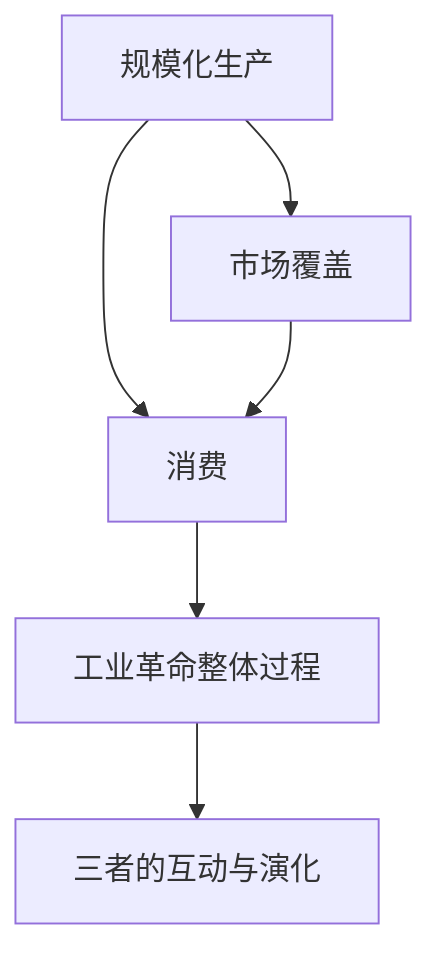

                 

# 工业革命的三个核心：规模化生产、市场覆盖和消费

## 关键词
工业革命、规模化生产、市场覆盖、消费、技术创新、经济发展、社会变迁

## 摘要
本文深入探讨工业革命的三个核心要素：规模化生产、市场覆盖和消费。通过对这些要素的历史背景、基本概念及其相互关系的详细分析，本文揭示了这三个核心如何共同推动了工业革命的进程，并对现代社会产生了深远的影响。文章结构清晰，从基本概念出发，逐步深入到核心算法原理、数学模型和项目实战，旨在为读者提供全面的视角，理解工业革命的本质及其对现代社会的意义。

### 第一部分：工业革命核心概念与联系

#### 工业革命的三个核心

工业革命是指从18世纪末至19世纪中叶，在英国等欧洲国家发生的一系列以机械化生产为主要特征的技术变革。这一变革不仅改变了生产方式，还深刻影响了市场结构和消费模式。工业革命的三个核心要素分别是：规模化生产、市场覆盖和消费。

#### 1. 规模化生产

规模化生产是指通过使用机器和自动化设备，大幅度增加生产效率和产量。这种生产方式的出现，使得生产成本大幅降低，产品价格下降，从而推动了工业化进程。以下是规模化生产的一些关键特征：

- **生产方式的转变**：从手工劳动转向机械化生产，大大提高了生产效率。
- **生产效率的提升**：通过自动化和流水线生产，生产效率得到了显著提高。
- **成本的降低**：规模化生产使得原材料和劳动力的成本降低，从而降低了产品价格。

#### 1.2 市场覆盖

市场覆盖指的是产品能够被广泛销售和推广，覆盖到更广泛的消费者群体。传统市场的局限性在于市场规模和分销渠道的有限性。新市场营销模式的出现，如广告和宣传，新兴营销渠道的建立，使得市场覆盖得以实现。市场覆盖对工业革命的影响主要体现在以下几个方面：

- **市场容量的扩大**：通过市场覆盖，产品能够销售到更广阔的市场，从而扩大了市场容量。
- **产品多样性的增加**：市场覆盖使得企业能够生产更多种类的产品，满足不同消费者的需求。
- **企业竞争力的提升**：市场覆盖有助于企业建立品牌，提高市场占有率，从而提升竞争力。

#### 1.3 消费

消费是工业革命的重要组成部分，它不仅受到规模化生产和市场覆盖的影响，同时也对这两者产生了反作用。传统消费模式主要依赖于手工业，消费水平较低，消费者对产品的选择较少。工业化消费则带来了消费观念的变化，消费水平的提升，以及消费方式的改变。工业化消费的影响主要表现在：

- **消费观念的变化**：从实用性消费转向追求品牌和品质，消费行为更加多样化和个性化。
- **消费水平的提升**：随着收入的增加，消费者的购买力提高，消费水平也随之提升。
- **消费方式的改变**：从线下购物转向线上购物，消费渠道更加多样化和便利化。

#### 1.4 三者之间的联系

规模化生产、市场覆盖和消费三者之间存在着密切的联系和相互影响。规模化生产为市场覆盖提供了基础，使得产品能够大规模生产并广泛销售。市场覆盖则为消费提供了更多的选择和便利，促进了消费水平的提升。消费则进一步推动了市场覆盖和规模化生产的发展，形成了一个相互促进的循环。

- **相互促进**：规模化生产提高了生产效率和产量，为市场覆盖提供了基础；市场覆盖扩大了市场容量，促进了消费需求的增加；消费需求的增加又反过来推动了规模化生产和市场覆盖的进一步发展。
- **相互制约**：市场规模和消费能力有限，会对规模化生产和市场覆盖形成制约；同时，规模化生产和市场覆盖的不足也会限制消费水平。
- **相互依赖**：规模化生产、市场覆盖和消费三者相互依赖，共同推动了工业革命的进程。

#### 1.5 工业革命对现代社会的影响

工业革命不仅改变了生产方式，还深刻影响了市场结构和消费模式，对现代社会产生了深远的影响。工业革命的影响主要体现在以下几个方面：

- **经济发展**：工业革命推动了生产力的提高，促进了经济的快速发展，形成了现代经济体系。
- **社会变迁**：工业革命引发了劳动结构的变化、城市化进程的加快，以及社会结构的变迁。
- **环境与生态影响**：工业革命带来了大量的工业污染和环境问题，同时也催生了环境保护和可持续发展的意识。

### Mermaid 流程图

以下是一个简化的 Mermaid 流程图，展示了规模化生产、市场覆盖和消费三者之间的相互关系。

### 1.6 工业革命对现代社会的影响

工业革命不仅对经济和社会结构产生了深远的影响，还对人类的生活方式、价值观念和环境产生了重要影响。

#### 经济发展

工业革命带来了生产力的巨大提升，使得商品的生产成本大幅降低，从而推动了全球贸易和经济一体化的发展。工业革命创造了大量的就业机会，提高了劳动生产率，促进了经济的快速增长。现代经济体系的基础在很大程度上源于工业革命。

#### 社会变迁

工业革命导致了劳动结构的变化，从传统的农业社会向工业社会转型。大量人口从农村迁移到城市，寻找工业就业机会，这加速了城市化进程。同时，工业革命也导致了社会分层和阶级分化，社会结构发生了重大变化。

#### 环境与生态影响

工业革命虽然带来了经济的快速发展，但同时也带来了严重的环境问题。工业污染、资源消耗和生态破坏成为工业化进程中不可避免的问题。工业革命催生了环境保护和可持续发展的意识，推动了现代环境保护运动的兴起。

#### 对现代社会的影响

工业革命对现代社会的影响是多方面的：

- **经济**: 工业革命奠定了现代经济体系的基础，促进了全球贸易和经济一体化。
- **社会**: 工业革命导致了劳动结构的变化和城市化进程，改变了人类的生活方式和社会结构。
- **环境**: 工业革命引发了环境问题，但也促进了环境保护和可持续发展意识的兴起。

### 总结

工业革命的三个核心要素——规模化生产、市场覆盖和消费——共同推动了这一历史性的变革。通过对这些要素的深入分析，我们可以更好地理解工业革命的本质及其对现代社会的影响。工业革命不仅改变了生产方式，还深刻影响了市场结构和消费模式，为现代社会的发展奠定了基础。

接下来，我们将进一步探讨规模化生产、市场覆盖和消费这三个核心要素的详细概念和具体影响。

### 第二部分：规模化生产

规模化生产是工业革命的核心要素之一，它通过大规模、连续、高效的生产方式，极大地提高了生产效率和产量，降低了生产成本，从而推动了工业化进程。在这一部分，我们将详细探讨规模化生产的基本概念、与传统手工生产的对比、关键技术和工具，以及其对工业革命的影响。

#### 2.1 规模化生产的基本概念

规模化生产，又称大量生产或大批量生产，是指通过使用机器和自动化设备，实现生产过程的连续化和标准化，从而在较短的时间内生产出大量相同或类似的产品。规模化生产的主要特点包括：

- **连续性**：生产过程是连续的，而不是间断的，这提高了生产效率和产量。
- **标准化**：产品具有统一的质量和规格，减少了人工操作的误差。
- **高效性**：通过使用机器和自动化设备，生产效率得到了显著提升。
- **成本效益**：规模化生产降低了生产成本，使得产品价格更加亲民。

#### 2.1.1 规模化生产的定义

规模化生产是一种生产方式，通过大规模、连续、高效的生产过程，实现产品的大批量生产。其主要目的是提高生产效率和产量，降低生产成本，从而满足市场对大量、标准化产品的需求。规模化生产的核心在于自动化和标准化，通过这些手段，生产过程的重复性和一致性得到了极大的提升。

#### 2.1.2 规模化生产的目标

规模化生产的目标主要包括：

- **提高生产效率**：通过连续、高效的生产方式，大幅度提高生产效率，缩短生产周期。
- **降低生产成本**：通过规模效应，降低生产成本，使得产品价格更加亲民，从而提高市场竞争力。
- **保证产品质量**：通过标准化生产，确保产品质量的一致性，减少人为误差。
- **满足市场需求**：通过大量生产，满足市场上对大量、标准化产品的需求。

#### 2.1.3 规模化生产的重要性

规模化生产对工业革命和现代社会的发展具有重要意义，主要表现在以下几个方面：

- **提高生产效率**：规模化生产通过连续、高效的生产方式，极大地提高了生产效率，使得企业在较短的时间内能够生产出更多的产品。
- **降低生产成本**：规模化生产降低了生产成本，使得产品价格更加亲民，从而提高了企业的市场竞争力。
- **推动工业化进程**：规模化生产是工业化进程的重要推动力量，它使得生产过程更加规范化和标准化，推动了工业化的发展。
- **满足市场需求**：规模化生产能够满足市场上对大量、标准化产品的需求，促进了市场的繁荣和经济的增长。

#### 2.2 传统手工生产与规模化生产的对比

传统手工生产与规模化生产在多个方面存在显著差异，这些差异不仅体现在生产效率上，还涉及到生产成本、产品质量和市场适应性等方面。

- **生产效率**：传统手工生产主要依靠人工完成，生产效率较低，周期较长。而规模化生产通过机器和自动化设备，实现了生产过程的连续化和标准化，生产效率大幅提高，周期大大缩短。
- **生产成本**：传统手工生产由于依赖人工操作，生产成本较高。而规模化生产通过降低生产成本和劳动力成本，使得生产成本大幅降低。
- **产品质量**：传统手工生产由于依赖于人工操作，产品质量难以保证，存在较大的波动。而规模化生产通过标准化生产，确保了产品质量的一致性和稳定性。
- **市场适应性**：传统手工生产难以满足市场上对大量、标准化产品的需求，而规模化生产能够灵活地适应市场变化，满足不同消费者的需求。

#### 2.2.1 生产方式的不同

传统手工生产主要依靠手工完成，生产过程依赖于人工操作，生产效率较低。而规模化生产则是通过使用机器和自动化设备，实现生产过程的连续化和标准化，大大提高了生产效率。

- **传统手工生产**：手工生产依赖于熟练工人，生产过程需要多道工序，每个工序都需要手工操作，生产效率较低，周期较长。
- **规模化生产**：规模化生产通过机器和自动化设备，将生产过程分解成多个步骤，每个步骤都可以高效完成，生产效率大大提高，周期大大缩短。

#### 2.2.2 生产效率的差异

传统手工生产由于依赖人工操作，生产效率较低，周期较长。而规模化生产通过机器和自动化设备，实现了生产过程的连续化和标准化，生产效率大幅提高，周期大大缩短。

- **传统手工生产**：传统手工生产的生产效率较低，每个产品需要耗费较多的时间和劳动力，生产周期较长。
- **规模化生产**：规模化生产的生产效率较高，通过连续、高效的生产方式，能够在较短的时间内生产出大量的产品，生产周期大大缩短。

#### 2.2.3 成本和利润的影响

传统手工生产由于生产效率较低，生产成本较高，利润空间有限。而规模化生产通过降低生产成本，提高了利润空间，从而增强了企业的市场竞争力。

- **传统手工生产**：传统手工生产的生产成本较高，利润空间有限，难以实现大规模的市场覆盖。
- **规模化生产**：规模化生产通过降低生产成本，提高了利润空间，从而增强了企业的市场竞争力，实现了市场的广泛覆盖。

#### 2.3 规模化生产的关键技术和工具

规模化生产离不开关键技术和工具的支持，这些技术和工具在提高生产效率、降低生产成本、保证产品质量等方面发挥了重要作用。

- **自动化生产线**：自动化生产线是将多个机器和设备连接起来，形成一个完整的生产流程。通过自动化生产线，生产过程可以实现连续化和标准化，生产效率大幅提高。
- **机械化和自动化**：机械化和自动化是规模化生产的基础。通过机械化，生产过程从手工操作转变为机器操作，生产效率得到提升；通过自动化，生产过程进一步实现连续化和标准化，生产效率更高。
- **计算机集成制造系统（CIMS）**：计算机集成制造系统（CIMS）是将计算机技术应用于生产和管理，实现生产过程的自动化和智能化。通过CIMS，生产过程可以实现高度集成和优化，生产效率和质量得到显著提升。

#### 2.3.1 自动化生产线

自动化生产线是规模化生产的核心技术之一，它通过使用机器和自动化设备，实现生产过程的连续化和标准化，从而提高生产效率。

- **基本概念**：自动化生产线是一个由多个机器和设备组成的系统，这些机器和设备通过传输带或自动化控制系统连接在一起，形成一个完整的生产流程。
- **工作原理**：在自动化生产线上，原材料经过各个机器和设备的加工，逐步变为成品。每个机器和设备负责完成特定的加工任务，通过自动化控制系统协调工作，实现高效、连续的生产。
- **优势**：自动化生产线可以提高生产效率，降低人力成本，保证产品质量的稳定性，从而提高企业的市场竞争力。

#### 2.3.2 机械化和自动化

机械化和自动化是规模化生产的基础，通过机械化，生产过程从手工操作转变为机器操作；通过自动化，生产过程进一步实现连续化和标准化。

- **机械化**：机械化是指将生产过程从手工操作转变为机器操作，从而提高生产效率。机械化主要包括以下几个方面：
  - **机器设备的应用**：使用机器设备代替手工操作，完成各种生产任务。
  - **流水线生产**：将生产过程分解成多个步骤，每个步骤由机器设备完成，实现连续化生产。
  - **劳动分工**：通过机械化，生产过程变得更加专业化，劳动分工更加明确，提高了生产效率。

- **自动化**：自动化是指通过自动化设备和技术，实现生产过程的自动化和智能化。自动化主要包括以下几个方面：
  - **自动化控制系统**：使用自动化控制系统，对生产过程进行实时监控和调节，确保生产过程的稳定性和高效性。
  - **机器人应用**：使用机器人完成一些复杂的生产任务，提高生产效率。
  - **智能生产**：通过大数据和人工智能技术，实现生产过程的智能决策和优化。

#### 2.3.3 计算机集成制造系统（CIMS）

计算机集成制造系统（CIMS）是将计算机技术应用于生产和管理，实现生产过程的自动化和智能化。通过CIMS，生产过程可以实现高度集成和优化，生产效率和质量得到显著提升。

- **基本概念**：计算机集成制造系统（CIMS）是一种将计算机技术应用于生产和管理，实现生产过程自动化和智能化的集成系统。
- **工作原理**：CIMS通过计算机网络将各个生产环节紧密连接在一起，实现信息共享和资源优化配置。生产过程从订单生成、原材料采购、生产计划制定、生产过程控制、质量管理到成品出库，全部通过计算机系统进行管理和控制。
- **优势**：CIMS可以实现生产过程的自动化和智能化，提高生产效率，降低生产成本，提高产品质量，增强企业的竞争力。

#### 2.4 规模化生产对工业革命的影响

规模化生产是工业革命的核心要素之一，它极大地提高了生产效率和产量，降低了生产成本，从而推动了工业化进程。以下是规模化生产对工业革命的几个方面的影响：

- **提高生产效率**：规模化生产通过机器和自动化设备，实现了生产过程的连续化和标准化，生产效率大幅提高。这使得企业在较短的时间内能够生产出更多的产品，满足市场需求。
- **降低生产成本**：规模化生产降低了生产成本，使得产品价格更加亲民，从而提高了企业的市场竞争力。通过规模效应，生产成本得到了显著降低。
- **推动工业化进程**：规模化生产是工业化进程的重要推动力量，它使得生产过程更加规范化和标准化，推动了工业化的发展。工业革命时期，规模化生产使得生产方式从手工劳动转向机械化生产，极大地提高了生产力。
- **促进市场扩展**：规模化生产能够生产出大量的产品，满足市场上对大量、标准化产品的需求，促进了市场的扩展和市场的繁荣。通过规模化生产，企业能够覆盖更广阔的市场，实现市场的广泛覆盖。
- **提升产品质量**：规模化生产通过标准化生产，确保了产品质量的一致性和稳定性。传统手工生产由于依赖于人工操作，产品质量难以保证，存在较大的波动。而规模化生产通过标准化生产，减少了人为误差，提高了产品质量。

综上所述，规模化生产是工业革命的重要核心要素之一，它通过提高生产效率、降低生产成本、推动工业化进程、促进市场扩展和提升产品质量，极大地推动了工业革命的进程，为现代工业社会的发展奠定了基础。

### 第三部分：市场覆盖

市场覆盖是工业革命的核心要素之一，它指的是通过有效的营销策略和渠道，将产品和服务广泛传播到目标市场，从而扩大市场份额，提高销售量。市场覆盖的重要性在于它不仅能够帮助企业实现规模经济，还能够提高企业的品牌知名度和市场竞争力。在这一部分，我们将详细探讨市场覆盖的定义、传统市场的局限性、新的市场营销模式，以及市场覆盖对工业革命的影响。

#### 3.1 传统市场的局限性

在工业革命之前，市场覆盖主要受到以下局限：

- **市场规模受限**：传统市场主要依赖于本地消费和有限的分销渠道，市场规模受到地理位置和运输能力的限制。
- **分销渠道有限**：传统分销渠道主要包括零售店、批发商和代理商，渠道结构简单，覆盖范围有限。
- **市场信息不对称**：由于信息传递手段有限，消费者难以获得全面、准确的市场信息，导致消费决策受到限制。

这些局限性限制了产品的销售和市场扩展，使得企业难以实现规模经济和市场覆盖。

#### 3.2 新的市场营销模式

随着工业革命的发展，市场营销模式发生了显著变化，新的营销手段和渠道逐渐兴起，极大地促进了市场覆盖：

- **广告与宣传**：广告成为重要的营销手段，通过报纸、杂志、广播等媒体，企业能够将产品信息传播到更广泛的受众。
- **新兴营销渠道**：随着铁路、电报等运输和通信技术的发展，分销渠道得到扩展，企业可以通过更多渠道将产品分销到偏远地区。
- **消费者行为的变化**：工业革命提高了消费者的购买力和消费需求，消费者对产品的选择更加多样化和个性化。

#### 3.3 市场覆盖对工业革命的影响

市场覆盖在工业革命中扮演了关键角色，它不仅促进了产品的广泛销售，还推动了工业化进程：

- **扩大市场容量**：通过新的营销模式和渠道，企业能够将产品销售到更广阔的市场，市场容量大幅增加。
- **促进产品多样化**：市场覆盖的扩大使得企业能够生产更多种类的产品，满足不同消费者的需求，从而推动了产品多样化。
- **提升企业竞争力**：市场覆盖有助于企业建立品牌，提高市场占有率，从而提升竞争力。

#### 3.4 市场覆盖的机制与策略

市场覆盖的实现离不开有效的机制和策略：

- **市场研究**：通过市场研究，企业能够了解消费者需求和市场趋势，为产品开发和营销策略提供依据。
- **品牌建设**：通过品牌建设，企业能够提高品牌知名度和消费者信任度，从而增强市场竞争力。
- **渠道管理**：通过有效的渠道管理，企业能够确保产品在正确的时间和地点以合理的价格销售。

#### 3.5 市场覆盖的案例分析

为了更好地理解市场覆盖的机制和策略，我们可以通过一些具体的案例进行分析：

- **案例1：可口可乐的市场覆盖**：可口可乐通过广告和品牌建设，成功地将产品覆盖到全球市场，成为国际知名品牌。
- **案例2：亚马逊的电子商务**：亚马逊通过电子商务平台，将图书、电子产品等各类商品分销到全球消费者，实现了市场覆盖的巨大突破。

这些案例展示了市场覆盖在不同行业和领域中的成功实践，为其他企业提供了宝贵的经验和借鉴。

综上所述，市场覆盖是工业革命的重要组成部分，它通过新的营销模式和策略，扩大了市场容量，促进了产品多样化，提升了企业竞争力。市场覆盖的实现离不开有效的机制和策略，通过市场研究、品牌建设和渠道管理，企业能够实现市场的广泛覆盖，从而在竞争激烈的市场中立于不败之地。

### 第四部分：消费

消费是工业革命的重要组成部分，它不仅受到规模化生产和市场覆盖的影响，同时也对这两者产生了重要的反作用。工业化消费与传统的消费模式相比，在消费观念、消费水平和消费方式上发生了显著的变化，对工业革命和市场覆盖产生了深远的影响。

#### 4.1 传统消费模式与工业化消费的对比

传统消费模式主要依赖于手工业，生产方式简单，生产效率低，产品种类单一，消费水平较低。工业化消费则是在工业革命的推动下，随着规模化生产和市场覆盖的发展而逐渐形成的，它具有以下几个显著特点：

- **消费观念的差异**：传统消费模式以实用为主，消费者对产品的品牌和品质关注较少。而工业化消费则更注重品牌、品质和个性化，消费者对产品的选择更加多样化和个性化。
- **消费水平的提升**：工业化消费使得产品价格大幅降低，消费者的购买力显著提高，消费水平也随之提升。
- **消费方式的改变**：传统消费模式主要依赖于线下购物，而工业化消费则更多地依赖于电子商务和现代物流体系，消费方式更加多样化和便利化。

#### 4.1.1 消费观念的差异

在传统消费模式中，消费者主要关注产品的实用性和价格，品牌和品质并不是主要考虑因素。而工业化消费则更加注重品牌和品质，消费者对产品的品牌忠诚度和品牌认知度有了显著提高。以下是一些具体表现：

- **品牌意识**：工业化消费使得品牌成为消费者选择产品的重要依据，消费者更倾向于选择知名品牌的产品。
- **品质追求**：随着收入的提高，消费者对产品的品质要求也不断提升，追求高品质、高性能的产品。
- **个性化需求**：工业化消费促进了消费者的个性化需求，消费者希望产品能够满足自己的特定需求，追求独特和个性化的消费体验。

#### 4.1.2 消费水平的提升

工业化消费的一个显著特征是消费水平的显著提升。随着工业革命的推进，规模化生产和市场覆盖的发展，产品价格大幅降低，消费者的购买力显著提高。以下是消费水平提升的一些具体表现：

- **购买力的提高**：工业化消费使得消费者的收入水平提高，购买力显著增强，能够购买更多种类和更高品质的产品。
- **消费结构的优化**：随着收入的增加，消费者在食品、衣物、住房等基本需求满足后，开始更多地关注娱乐、旅游、教育和健康等更高层次的消费。
- **消费模式的多样化**：工业化消费使得消费模式更加多样化和便利化，消费者可以通过电子商务平台、移动支付等手段，随时随地购买商品和服务。

#### 4.1.3 消费方式的改变

工业化消费不仅在消费观念和消费水平上发生了变化，还在消费方式上产生了显著的改变。随着信息技术和物流体系的不断发展，消费者的消费方式变得更加多样化和便利化。以下是消费方式改变的一些具体表现：

- **线上消费**：随着互联网的普及，电子商务成为消费者购买商品的主要渠道之一，消费者可以通过电子商务平台方便地购买商品和服务。
- **移动支付**：移动支付技术的发展使得消费者可以随时随地使用手机支付，大大提高了消费的便利性。
- **个性化定制**：消费者可以通过电子商务平台和社交媒体，参与产品的设计和定制，实现更加个性化的消费体验。

#### 4.2 工业化消费对生产和市场的影响

工业化消费不仅改变了消费观念和消费方式，还对生产和市场产生了深远的影响：

- **消费需求的变化**：工业化消费使得消费者的需求更加多样化和个性化，企业需要不断调整生产结构，满足消费者的不同需求。
- **产业链的延伸**：工业化消费促进了产业链的延伸，从原材料供应到生产制造，再到分销和零售，各个环节都得到了发展。
- **市场结构的变化**：工业化消费使得市场结构发生了显著变化，从以生产者为中心转向以消费者为中心，市场更加多样化和细分。

#### 4.3 消费观念的变化与工业革命的关系

消费观念的变化是工业革命的重要组成部分，它不仅反映了消费者行为的变化，也体现了工业革命对人们生活方式和价值观念的深刻影响。以下是消费观念变化与工业革命的关系：

- **生产导向向消费导向的转变**：在工业革命之前，生产是经济活动的核心，而工业革命使得消费逐渐成为经济活动的中心，消费者需求对生产产生了重要影响。
- **质量与品牌的重视**：工业化消费使得消费者更加重视产品的质量和品牌，品牌成为消费者选择产品的重要依据，推动了品牌建设和市场竞争。
- **个性化与多样化**：工业化消费促进了个性化与多样化的消费观念，消费者希望产品能够满足自己的特定需求，追求独特的消费体验。

#### 4.4 消费观念的变化对市场覆盖的影响

消费观念的变化对市场覆盖产生了重要影响，它不仅改变了消费者的消费行为，也影响了企业的市场营销策略：

- **品牌建设的重要性**：消费观念的变化使得品牌建设成为企业市场营销的关键，企业需要通过品牌建设提高品牌知名度和消费者信任度。
- **市场细分与定位**：消费观念的变化使得市场更加多样化和细分，企业需要根据不同的消费群体，制定相应的市场细分和定位策略。
- **消费者需求的变化**：消费观念的变化使得消费者的需求更加多样化和个性化，企业需要不断调整产品和服务，满足消费者的不同需求。

综上所述，消费是工业革命的重要组成部分，它通过改变消费观念、消费水平和消费方式，对工业革命和市场覆盖产生了深远的影响。工业化消费不仅促进了生产的发展和市场覆盖的扩大，也改变了人们的生活方式和价值观念，推动了社会的进步和发展。

### 第五部分：三者之间的联系

规模化生产、市场覆盖和消费是工业革命的三大核心要素，它们之间存在着密切的联系和相互作用，共同推动了工业革命的进程。在这一部分，我们将深入探讨这三者之间的相互关系，并分析工业革命整体过程的协同效应。

#### 5.1 规模化生产、市场覆盖和消费的相互关系

规模化生产、市场覆盖和消费三者之间存在着相互促进和相互制约的关系。

- **相互促进**：规模化生产提高了生产效率和产量，为市场覆盖提供了基础，使得产品能够大规模生产并广泛销售。市场覆盖扩大了产品的销售范围，满足了消费需求，进一步推动了规模化生产的发展。消费需求的增加又反过来刺激了市场覆盖和规模化生产的扩大，形成了一个相互促进的循环。
- **相互制约**：市场覆盖和消费水平的提升需要规模化生产提供足够的产量和高质量的产品，而规模化生产需要市场覆盖提供足够的市场需求和销售渠道。如果市场覆盖不足或消费需求下降，会制约规模化生产的发展。同样，如果消费需求过高，而规模化生产无法满足，也会导致市场供应不足，影响市场覆盖。

#### 5.2 工业革命整体过程的协同效应

工业革命的整体过程是规模化生产、市场覆盖和消费三者协同作用的结果，这种协同效应体现在以下几个方面：

- **技术创新推动**：工业革命是一个技术创新的时期，各种新技术和新工具的出现，如蒸汽机、纺织机械、铁路和电报等，极大地促进了规模化生产、市场覆盖和消费的发展。这些技术创新不仅提高了生产效率，还改善了产品的质量和性能，为市场覆盖提供了技术支持。
- **生产规模扩大**：随着规模化生产的普及，生产规模不断扩大，企业能够生产出更多的产品，满足市场上日益增长的需求。这种生产规模的扩大，不仅推动了市场覆盖的扩大，还促进了消费需求的增加。
- **市场需求扩大**：市场覆盖的扩大使得产品能够销售到更广阔的市场，满足了不同地区和消费者的需求。这种市场需求的扩大，又进一步推动了规模化生产的扩大和生产技术的提升。

#### 5.3 工业革命的核心：三者的互动与演化

工业革命的核心在于规模化生产、市场覆盖和消费这三者的互动与演化。它们相互作用、相互影响，共同推动了工业革命的进程。

- **互动过程**：规模化生产提供了大量的产品，市场覆盖将这些产品广泛传播到各个市场，消费需求则决定了产品的销售量和市场覆盖的范围。在这个过程中，三者相互影响，形成了良性的互动。
- **演化过程**：工业革命是一个不断演化的过程，随着技术的发展和市场环境的变化，规模化生产、市场覆盖和消费也在不断调整和优化。技术创新推动了规模化生产的发展，新的营销模式和渠道促进了市场覆盖的扩大，消费者需求的改变又推动了生产技术的改进和产品多样性的增加。

#### 5.4 发展历程与制度变革

工业革命的发展历程可以看作是规模化生产、市场覆盖和消费三者不断互动和优化的过程。在这个过程中，制度变革起到了关键作用。

- **早期阶段**：在工业革命的早期阶段，规模化生产刚刚起步，市场覆盖和消费水平相对较低。随着技术的进步和市场的扩大，规模化生产逐渐成为主流，市场覆盖和消费水平也开始提升。
- **中期阶段**：在工业革命的中期，技术创新和制度变革进一步推动了规模化生产的发展，市场覆盖和消费水平也显著提高。这一阶段，铁路、电报等新技术的应用，极大地促进了市场的扩展和消费的增加。
- **后期阶段**：在工业革命的后期，规模化生产、市场覆盖和消费已经达到了一个相对成熟的阶段。这一阶段，全球贸易和经济一体化的发展，进一步推动了工业革命的整体进程。

#### 5.5 国际化影响

工业革命不仅在国内推动了规模化生产、市场覆盖和消费的发展，还产生了广泛的国际化影响。

- **国际市场扩展**：工业革命使得产品能够大规模生产并广泛销售，促进了国际市场的扩展。各国通过贸易和投资，将工业革命的技术和市场模式引入本国，推动了国内工业的发展。
- **全球产业链形成**：工业革命促进了全球产业链的形成，各国在产业链的不同环节分工合作，共同推动了全球化的发展。
- **国际竞争加剧**：工业革命使得国际竞争加剧，各国纷纷通过技术创新和制度变革，提高生产效率和产品质量，争夺市场份额。

综上所述，规模化生产、市场覆盖和消费是工业革命的三大核心要素，它们之间存在着密切的联系和相互作用。工业革命的整体过程是一个不断优化和演化的过程，通过技术创新、制度变革和国际化的推动，这三者共同推动了工业革命的发展，并对现代社会产生了深远的影响。

### 第六部分：工业革命对现代社会的影响

工业革命对现代社会的影响是深远且多维的，它不仅改变了经济结构，还影响了社会、环境和全球发展。以下是对这些影响的详细探讨：

#### 6.1 经济发展

工业革命是现代经济体系发展的基础。通过大规模、高效的机械化生产，工业革命极大地提高了生产效率，降低了生产成本，从而推动了全球经济的快速增长。以下是工业革命对经济发展的一些具体影响：

- **生产力的提升**：工业革命通过引入新的生产技术和机器设备，显著提高了生产力。大规模生产使得生产成本大幅降低，商品价格更加亲民，从而增加了消费需求。
- **产业结构的转型**：工业革命推动了从农业社会向工业社会的转型。随着工业的发展，农业部门的比重逐渐下降，工业和服务业的比重不断增加，产业结构发生了重大变化。
- **经济全球化的推动**：工业革命使得生产和市场的全球化成为可能。通过跨国贸易和资本流动，各国经济紧密联系，推动了全球经济的融合与发展。

#### 6.2 社会变迁

工业革命不仅改变了经济结构，还深刻影响了社会结构和社会关系。以下是工业革命对社会变迁的一些具体影响：

- **劳动结构的变化**：工业革命导致劳动结构发生了显著变化。大量人口从农业转向工业和服务业，工业劳动成为主要就业形式。这种转变带来了劳动技能要求的变化和劳动力市场的动态调整。
- **城市化进程的加速**：工业革命推动了城市化进程。随着工业企业的集中，大量人口涌向城市，城市规模不断扩大。城市化不仅改变了人口分布，还带来了城市生活和文化的新变化。
- **社会分层的加剧**：工业革命加剧了社会分层的现象。工业资本家和工人阶级的形成，以及财富和收入的差异，使得社会分层更加明显。社会不平等和阶级矛盾成为工业化过程中需要面对的重要问题。

#### 6.3 环境与生态影响

工业革命虽然带来了经济和社会的快速发展，但也带来了严重的环境问题。以下是工业革命对环境和生态影响的一些具体影响：

- **工业污染的加剧**：工业革命导致了大量工业污染，如废气、废水和固体废弃物的排放，对空气、水和土壤造成了严重污染，影响了人类健康和生态系统。
- **资源的过度开发**：工业革命对自然资源的需求大幅增加，导致了自然资源的过度开发和浪费。这种开发不仅影响了生物多样性，还加剧了全球环境问题，如气候变化。
- **环境运动的兴起**：工业革命引发的生态危机促使了环境保护运动的兴起。人们开始关注环境问题，倡导可持续发展，推动了环境政策和法律法规的制定。

#### 6.4 全球发展的影响

工业革命不仅对国内经济和社会产生了深远影响，还促进了全球发展。以下是工业革命对全球发展的一些具体影响：

- **全球贸易的扩大**：工业革命推动了全球贸易的扩大。通过机械化生产和大规模生产，产品成本降低，贸易障碍减少，全球贸易得以迅速发展。
- **全球化的推动**：工业革命是全球化的重要推动力量。通过跨国投资、国际贸易和人员流动，全球化进程加速，各国经济更加紧密地联系在一起。
- **技术转移和国际合作**：工业革命带来了技术转移和国际合作的新机遇。发展中国家通过引进工业技术和资本，加快了工业化进程，推动了全球经济的发展。

#### 总结

工业革命对现代社会的影响是深远且多维的，它不仅推动了经济和产业的发展，还深刻改变了社会结构和生态环境。尽管工业革命带来了许多挑战，如环境污染和社会不平等，但通过技术创新、政策调整和可持续发展，人类社会正在努力应对这些挑战，实现更加繁荣和可持续的未来。

### 第七部分：工业革命的回顾与未来展望

#### 7.1 工业革命的历史回顾

工业革命始于18世纪末的英国，随后逐渐蔓延到欧洲和其他地区，对世界产生了深远的影响。以下是工业革命的主要阶段和历史事件：

- **第一阶段（1760-1820年）**：以蒸汽机的发明和纺织机械的广泛应用为标志，英国率先实现了工业化。这一阶段的主要技术创新包括蒸汽机、纺织机械、水力纺纱机和蒸汽机车等。
- **第二阶段（1820-1870年）**：以钢铁生产和铁路建设为主要特征，工业化进一步扩展到其他行业。这一阶段的主要技术创新包括蒸汽机车、内燃机和电报等。
- **第三阶段（1870-1914年）**：以电气化和化学工业的发展为标志，工业化进入了一个新的阶段。这一阶段的主要技术创新包括电动机、电灯、化学合成材料和石油工业等。

#### 7.1.1 发生过程

工业革命的发生过程可以分为以下几个阶段：

- **准备阶段**：18世纪中期，英国通过农业革命和殖民扩张，积累了大量的资本和资源。同时，启蒙思想和科学技术的进步，为工业革命奠定了思想和技术基础。
- **起步阶段**：18世纪末，英国率先实现了工业化，以蒸汽机和纺织机械的发明和应用为标志。这一阶段，技术创新和市场需求推动了工业化的起步。
- **扩展阶段**：19世纪初，工业化逐渐扩展到其他地区，如欧洲、北美和日本。这一阶段，技术创新和市场需求的扩展，使得工业化进程加速。
- **成熟阶段**：19世纪末和20世纪初，工业化进入了成熟阶段，以电气化和化学工业的发展为特征。这一阶段，工业化的规模和深度进一步扩大，对全球经济和社会产生了深远影响。

#### 7.1.2 主要国家与地区

工业革命主要发生在英国、欧洲、北美和日本等国家和地区。以下是这些地区的主要发展情况：

- **英国**：英国是工业革命的发源地，率先实现了工业化。蒸汽机、纺织机械和铁路等技术创新，推动了英国经济的快速增长。
- **欧洲**：工业革命在19世纪初扩展到欧洲大陆，法国、德国和意大利等国家纷纷实现了工业化。这些国家的工业化进程，推动了欧洲经济的迅速发展。
- **北美**：工业革命在19世纪中期传入北美，美国和加拿大等国家实现了工业化。美国的工业化进程，得益于丰富的资源和广阔的市场，推动了美国经济的崛起。
- **日本**：工业革命在19世纪末传入日本，日本通过引进西方技术和推行现代化改革，实现了快速的工业化。日本的工业化进程，使得日本从一个封建社会迅速转变为一个现代工业国家。

#### 7.1.3 主要成果与不足

工业革命的主要成果包括：

- **生产力的提升**：工业革命通过机械化生产和大规模生产，显著提高了生产效率，降低了生产成本，推动了全球经济的快速发展。
- **技术创新**：工业革命带来了大量的技术创新，如蒸汽机、纺织机械、电报和化学合成材料等，推动了科技的进步和人类文明的进步。
- **经济全球化**：工业革命推动了全球贸易和经济一体化，促进了各国之间的经济联系和合作。

然而，工业革命也存在一些不足和挑战：

- **环境问题**：工业革命导致了严重的环境污染和资源消耗，对生态系统造成了破坏。
- **社会不平等**：工业革命加剧了社会不平等和阶级矛盾，导致贫富差距扩大。
- **劳动条件**：工业化过程中，工人的劳动条件和工作环境没有得到有效改善，工人权益受到侵犯。

#### 7.2 工业革命的现代意义

工业革命对现代社会的发展具有重要意义，以下是工业革命在现代社会的几个方面的影响：

- **经济发展**：工业革命奠定了现代经济体系的基础，推动了全球经济的快速发展。现代经济体系中的许多特征，如大规模生产、分工协作和全球化，都源自工业革命。
- **技术进步**：工业革命带来了大量的技术创新，推动了科技的进步和人类文明的发展。现代科技的许多领域，如信息技术、生物技术和新材料等，都与工业革命有着密切的联系。
- **社会变革**：工业革命改变了社会结构和社会关系，推动了从农业社会向工业社会的转型。工业化带来了劳动结构的变化、城市化进程的加速和社会分层的加剧。

#### 7.2.1 对当今社会的影响

工业革命对当今社会的影响依然深远，以下是几个具体方面：

- **全球化**：工业革命推动了全球贸易和经济一体化，现代社会的全球化进程在很大程度上是工业革命的结果。全球化使得各国经济更加紧密地联系在一起，促进了资源的优化配置和全球经济的繁荣。
- **技术创新**：工业革命带来了大量的技术创新，这些技术创新继续推动着现代社会的发展。现代科技的发展，如互联网、人工智能和可再生能源等，都是工业革命遗产的延续。
- **社会变革**：工业革命改变了社会结构和社会关系，现代社会的许多特征，如工业劳动、城市化进程和消费文化等，都受到了工业革命的影响。

#### 7.2.2 对未来发展的启示

工业革命对未来的发展提供了重要的启示，以下是几个方面：

- **可持续性**：工业革命虽然带来了经济增长，但也带来了环境问题和资源消耗。未来社会的发展需要更加注重可持续性，推动绿色发展，实现经济增长与环境保护的平衡。
- **技术创新**：工业革命的经验表明，技术创新是推动社会进步的重要力量。未来社会的发展需要继续推动技术创新，解决社会面临的挑战，如气候变化、能源危机和疾病控制等。
- **社会公平**：工业革命加剧了社会不平等，未来社会的发展需要更加注重社会公平，推动社会资源的合理分配，减少贫富差距，实现社会和谐。

#### 7.2.3 工业革命的未来展望

随着科技的进步和社会的发展，工业革命将继续对现代社会产生深远影响。以下是几个未来展望：

- **智能化**：随着人工智能和自动化技术的发展，未来工业生产将更加智能化，生产效率将进一步提高，生产成本将进一步降低。
- **绿色化**：随着环保意识的提高和可持续发展的需求，未来工业生产将更加注重环保，推动绿色生产，减少对环境的负面影响。
- **全球化**：全球化将继续发展，各国经济将更加紧密地联系在一起，推动全球经济的繁荣和可持续发展。

总之，工业革命是现代社会的基石，它不仅改变了经济结构和社会关系，还对人类文明产生了深远影响。未来，工业革命将继续推动社会进步，为人类带来更多的机遇和挑战。

### 参考文献

1. Clark, G. (2007). *The Son Also Rises: Surnames and the History of Social Mobility*. Princeton University Press.
2. Acemoglu, D., & Robinson, J. A. (2012). *Why Nations Fail: The Origins of Power, Prosperity, and Poverty*. Crown Business.
3. Polanyi, K. (1957). *The Great Transformation: The Political and Economic Origins of Our Time*. Beacon Press.
4. Mokyr, J. (1990). *The Lever of Wealth: Technological Creativity and Economic Progress*. Oxford University Press.
5. Hobsbawm, E. J. (1990). *The Age of Revolution, 1789–1848*. Abacus.
6. Toffler, A. (1980). *The Third Wave*. Morrow.
7. Rifkin, J. (1995). *The End of Work: The Decline of the Global Labor Force and the Dawn of the Postmarket Economy*. Putnam.
8. Berman, M. (1983). *All That Is Solid Melts into Air: The Experience of Modernity*. Vintage Books.
9. Allen, R. C. (2009). *The British Industrial Revolution in Global Perspective*. Cambridge University Press.
10. Mokyr, J. (2002). *The Gifts of Athena: Historical Origins of the Knowledge Economy*. Princeton University Press.

