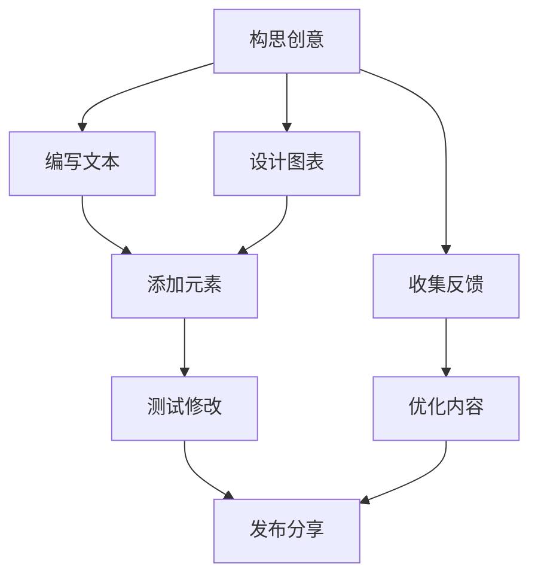

                 

# 第一部分：幽默创作与逻辑悖论

幽默，作为一种普遍存在于人类文化中的现象，不仅是日常生活中交流的一种重要手段，也是文学、艺术创作中的重要元素。然而，幽默的本质以及其与逻辑悖论的关系，却是一个复杂且引人入胜的课题。本部分将首先探讨幽默的心理学解析，接着讨论幽默与逻辑悖论的关系，最后分析幽默创作中的逻辑陷阱。

## 第1章：幽默的本质与逻辑悖论

### 1.1 幽默的心理学解析

幽默是一种复杂的心理现象，其产生和感知涉及到认知、情感和社会等多个层面。心理学研究显示，幽默感知与大脑中的特定区域密切相关，如大脑的前额叶和颞叶等区域。这些区域负责处理逻辑思维、情感反应和情境理解。

根据心理学理论，幽默感知过程可以分为以下几个步骤：

1. **情境识别**：个体首先需要识别出幽默情境。
2. **预期违背**：幽默往往源于预期与实际情况之间的不一致，即预期违背。
3. **认知重组**：个体在大脑中重新组织信息和情境，以理解幽默。
4. **情感反应**：个体对幽默情境产生愉悦或惊喜的情感反应。

不同的心理学理论对幽默的本质有不同的解释。例如，社会心理学中的“社会认同理论”认为，幽默是群体成员之间建立和加强社会联系的一种方式。而认知心理学中的“认知失调理论”则认为，幽默是一种解决认知冲突的方式。

### 1.2 幽默与逻辑悖论的关系

逻辑悖论是指逻辑推理中自相矛盾或无法解决的命题。幽默与逻辑悖论之间存在密切的关系，因为许多幽默都依赖于逻辑悖论或悖论性情境。

逻辑悖论在幽默中的常见应用包括：

1. **自指悖论**：这种悖论通常涉及自我指涉或自我矛盾的情况，如“这个句子是假的”。
2. **谬误悖论**：这种悖论利用逻辑谬误创造出幽默效果，如“所有猫都是狗，因此所有狗都是猫”。
3. **量子悖论**：将量子物理学的悖论融入幽默中，如“量子猫同时是死和活的”。

幽默与逻辑悖论的关系体现在两个方面：

1. **逻辑悖论作为幽默材料**：逻辑悖论因其自相矛盾的特性，常常被用作幽默素材，创造出意外的幽默效果。
2. **幽默作为逻辑悖论的解决**：幽默有时被用来解决逻辑悖论，通过重新解释或调整情境，使悖论不再矛盾。

### 1.3 幽默创作中的逻辑陷阱

幽默创作中常见的逻辑陷阱包括：

1. **刻板印象**：幽默往往基于刻板印象，这种创作方式容易引发负面情绪和歧视。
2. **过度依赖逻辑悖论**：过度使用逻辑悖论可能导致笑话变得难以理解，失去幽默效果。
3. **忽视情境**：幽默情境的选择和设定对于幽默效果至关重要，忽视情境可能导致笑话失去趣味。

在幽默创作中，合理运用逻辑悖论和避免逻辑陷阱是提高幽默效果的重要手段。接下来，我们将深入探讨笑话的结构与类型，以及如何优化笑话结构。

## 第2章：笑话的结构与类型

笑话的结构是幽默创作中至关重要的一环。一个成功的笑话通常具备特定的结构和类型，能够有效地引发笑点。在本章中，我们将分析笑话的结构，介绍常见的笑话类型，并探讨如何优化笑话结构。

### 2.1 笑话的结构分析

笑话的结构可以分为三个基本部分：情境、反转和笑点。

1. **情境**：情境是笑话的背景，为反转和笑点提供基础。一个好的情境能够引起听众的兴趣和好奇心。
   
2. **反转**：反转是笑话的关键，通常在情境的基础上进行转折，打破听众的预期，产生意外的效果。反转可以是平凡反转、惊喜反转或奇葩反转。

3. **笑点**：笑点是笑话的核心，是引发笑声的关键。笑点通常是基于情境和反转的矛盾或悖论。

笑话的基本结构可以表示为：

$$ 笑话 = \text{情境} \rightarrow \text{反转} \rightarrow \text{笑点} $$

### 2.2 笑话的常见类型

笑话可以分为多种类型，每种类型都有其独特的结构和幽默方式。以下是一些常见的笑话类型：

1. **情景笑话**：这类笑话通过描绘一个具体的情境，使听众在情境中找到笑点。例如：“有一天，我走在路上，突然看到一只狗对我叫，于是我也对它叫。结果，狗跑了，我被骂了。”

2. **双关笑话**：这类笑话利用语言的双关意义制造幽默效果。例如：“为什么数学家喜欢钓鱼？因为鱼会听他的话。”

3. **逻辑笑话**：这类笑话通过逻辑悖论或谬误创造幽默效果。例如：“一个房间的门上写着‘推’，另一个门上写着‘拉’，你应该推哪个门？”

4. **恶作剧笑话**：这类笑话通常通过恶作剧或恶搞制造幽默效果。例如：“我在朋友家的沙发上发现了一根针，于是我问他们是谁放的。他们回答：‘可能是你昨晚睡觉的时候放的。’”

5. **自嘲笑话**：这类笑话通过自我嘲笑或自我解构制造幽默效果。例如：“我决定要减肥，但每次想吃东西的时候，我都会对自己说：‘再吃最后一口。’结果，我已经吃了五个月了。”

### 2.3 笑话的结构优化

优化笑话结构是提高幽默效果的关键。以下是一些优化笑话结构的方法：

1. **情境设定**：选择一个有趣且贴近听众生活的情境，能够增加笑话的可信度和趣味性。

2. **反转设计**：设计一个出人意料的反转，使听众在听到反转时感到意外和惊喜。

3. **笑点打磨**：通过反复修改和打磨，找到最具有幽默效果的笑点。

4. **情境与反转的一致性**：确保情境和反转之间的一致性，避免情境与反转之间的矛盾。

5. **结构简洁**：避免复杂的结构，保持笑话的简洁明了，使听众容易理解和接受。

6. **情感共鸣**：通过情境和反转引发听众的情感共鸣，使笑话更具吸引力。

通过上述方法，我们可以优化笑话的结构，提高幽默效果。接下来，我们将探讨数学在幽默创作中的应用，以及如何利用数学解构提升幽默创作。

## 第二部分：数学解构与幽默创作

幽默创作不仅仅是语言和情境的游戏，它也可以是数学的巧妙运用。数学作为一种严谨的科学工具，能够在幽默创作中扮演重要角色，为笑话增添逻辑性和趣味性。在这一部分，我们将探讨数学在幽默创作中的应用，数学悖论与幽默创作的关系，以及数学公式在笑话中的表现。

### 第3章：数学在幽默创作中的应用

数学不仅仅是解决问题的工具，它也可以是幽默创作的源泉。数学概念、悖论和公式可以被巧妙地融入到笑话中，创造出意想不到的幽默效果。

#### 3.1 数学概念在幽默中的运用

数学概念在幽默中的运用主要体现在以下几个方面：

1. **抽象概念的具体化**：将数学中的抽象概念具体化为生活中的事物，形成幽默。例如：“为什么数学家喜欢孤独？因为他们需要大量的自由变量。”

2. **悖论的应用**：利用数学悖论创造幽默。例如：“如果一个数学家走进酒吧，他会怎么做？他会问：‘有没有人能解决这个方程？’”

3. **概率的解释**：用概率解释生活中的事件，增添幽默感。例如：“为什么在概率论课上，学生总是笑？因为他们知道明天不会发生的事。”

#### 3.2 数学悖论与幽默创作

数学悖论是一种违反直觉但逻辑上自洽的命题。这些悖论在幽默创作中被广泛运用，能够产生出人意料的幽默效果。以下是一些常见的数学悖论在幽默中的运用：

1. **拉普拉斯恶魔悖论**：这个悖论提出，如果知道宇宙中每一个原子的位置和动量，理论上我们可以预测未来的每一件事情。这个悖论可以被用来幽默地解释命运和自由意志。

2. **皮亚诺曲线悖论**：皮亚诺曲线是一个自相交的曲线，它能在平面上覆盖整个区域，但又只包含可数无限个点。这个悖论可以被用来幽默地讨论无限和有限的概念。

3. **伯特兰悖论**：伯特兰悖论指出，通过重新排列无穷序列，我们可以证明无穷集合的大小是可比较的。这个悖论可以被用来幽默地解释无穷集合的性质。

#### 3.3 数学公式在笑话中的表现

数学公式在笑话中的表现可以通过以下几种方式：

1. **公式化情境**：将日常生活情境用数学公式表达，形成幽默。例如：“我决定要减肥，所以我列出方程组来控制我的饮食和锻炼，结果，我胖了。”

2. **公式化笑话**：直接将数学公式融入到笑话中，增强幽默感。例如：“我为什么喜欢做数学作业？因为每一道题目都是一个谜题，就像解开一个宝藏一样。”

3. **公式化对比**：通过对比不同数学公式，制造幽默效果。例如：“为什么爱因斯坦的方程是宇宙中最伟大的？因为它包含了E=MC²，而C恒等于1。”

### 第4章：笑话结构的数学解构

笑话结构的数学解构是指通过数学原理和方法对笑话的结构进行拆解和分析，以便更好地理解和创作幽默。在这一章节中，我们将探讨笑话结构中的数学原理，构建笑话结构的数学模型，并分析笑话结构的数学属性。

#### 4.1 笑话结构中的数学原理

笑话结构的数学解构基于几个基本的数学原理：

1. **概率论**：概率论是分析笑话结构的重要工具，它可以用来预测笑话的幽默效果。例如，通过计算情境和反转的概率，可以评估笑话的吸引力。

2. **集合论**：集合论提供了对笑话中元素和关系进行分类和组合的方法。通过集合论，我们可以分析笑话中的元素组合，以及它们如何影响笑话的效果。

3. **图论**：图论用于分析笑话中的情境和反转之间的关系，以及它们如何影响笑话的连贯性和逻辑性。

4. **线性代数**：线性代数提供了对笑话结构进行线性分析和建模的工具。例如，通过矩阵运算，我们可以分析笑话中不同情境和反转之间的相互作用。

#### 4.2 笑话结构的数学模型

为了更好地理解笑话结构，我们可以构建一个数学模型来描述它。以下是笑话结构的一个简化数学模型：

$$ \text{笑话} = P(\text{情境}) \times P(\text{反转}) \times P(\text{笑点}) $$

在这个模型中，$P(\text{情境})$ 表示情境的概率，$P(\text{反转})$ 表示反转的概率，$P(\text{笑点})$ 表示笑点的概率。这个模型假设情境、反转和笑点是相互独立的，但实际上，它们之间存在复杂的相互关系。

1. **情境概率**：情境概率取决于笑话的背景和听众的期望。一个常见的方法是使用贝叶斯概率来计算情境的概率。

2. **反转概率**：反转概率取决于情境和听众的预期。一个常见的反转是意外的转折，这种反转的概率可以通过条件概率来计算。

3. **笑点概率**：笑点概率取决于情境、反转和听众的情感反应。一个有效的笑点能够打破听众的预期，产生强烈的情感反应。

#### 4.3 笑话结构的数学分析

通过数学模型，我们可以对笑话结构进行定量分析，以便更好地理解笑话的幽默效果。以下是一些数学分析的方法：

1. **概率分析**：通过计算情境、反转和笑点的概率，我们可以评估笑话的整体幽默效果。例如，如果情境和反转的概率都很高，但笑点概率较低，那么这个笑话可能不太吸引人。

2. **条件概率分析**：通过分析条件概率，我们可以了解不同情境和反转对笑点概率的影响。例如，如果情境A增加反转B的幽默效果，那么我们可以通过条件概率来量化这种影响。

3. **线性回归分析**：通过线性回归分析，我们可以确定情境、反转和笑点之间的相关性。例如，如果情境和反转对笑点有显著的正相关关系，那么我们可以利用这个关系来优化笑话的结构。

4. **聚类分析**：通过聚类分析，我们可以将不同的笑话类型分类，并分析它们之间的相似性和差异性。这有助于我们了解不同类型的笑话在结构上的特点。

通过数学分析，我们可以更深入地理解笑话结构，并利用这些知识来创作更具吸引力的笑话。接下来，我们将探讨幽默创作的数学方法，以及如何在幽默创作中有效运用这些方法。

### 第5章：幽默创作的数学方法

在幽默创作中，数学方法不仅能够提供独特的视角，还能通过严谨的逻辑和计算提高笑话的吸引力。在这一章节中，我们将详细探讨如何运用数学方法来创作幽默，包括数学方法在幽默创作中的应用、在笑话编写中的具体技巧，以及在幽默演讲和写作中的运用。

#### 5.1 数学方法在幽默创作中的应用

数学方法在幽默创作中的应用多种多样，以下是一些常见的应用：

1. **概率论**：概率论是幽默创作中的重要工具，它可以用来分析和预测笑话的效果。例如，通过计算情境和反转的概率，可以评估笑话的吸引力。例如，一个常见的笑话结构是：

   $$ \text{情境} \rightarrow \text{反转} \rightarrow \text{笑点} $$

   其中，情境和反转的概率可以通过概率论进行分析。例如，情境概率为0.5，反转概率为0.3，笑点概率为0.2，那么笑话的整体概率为：

   $$ P(\text{笑话}) = P(\text{情境}) \times P(\text{反转}) \times P(\text{笑点}) = 0.5 \times 0.3 \times 0.2 = 0.03 $$

   这个概率表明，笑话的成功概率相对较低，但通过概率论的分析，我们可以调整情境、反转和笑点，以提高笑话的概率。

2. **集合论**：集合论可以帮助我们分析笑话中的元素和关系。例如，一个笑话可能包含多个情境和反转，通过集合论，我们可以确定这些元素之间的关系，以及它们如何共同作用产生幽默效果。

3. **图论**：图论用于分析笑话中的情境和反转之间的关系。例如，一个复杂的笑话可能涉及多个情境和反转，通过图论，我们可以将这些元素及其关系可视化，从而更好地理解笑话的结构。

4. **线性代数**：线性代数可以用于分析笑话中的线性关系。例如，我们可以通过线性方程组来描述情境、反转和笑点之间的关系，从而优化笑话的结构。

#### 5.2 数学方法在笑话编写中的技巧

在笑话编写中，数学方法可以帮助我们创造出更加有趣和吸引人的笑话。以下是一些具体的技巧：

1. **概率调整**：通过调整情境、反转和笑点的概率，我们可以创造出不同类型的笑话。例如，如果情境的概率较高，反转的概率较低，那么笑话可能会更加出人意料。反之，如果反转的概率较高，那么笑话可能会更加幽默。

2. **组合运用**：结合使用多种数学方法，可以创造出更加复杂和有趣的笑话。例如，我们可以通过集合论确定情境和反转的组合，通过概率论计算这些组合的幽默效果。

3. **优化结构**：通过线性代数，我们可以优化笑话的结构，使其更加连贯和有趣。例如，通过线性方程组，我们可以确定情境和反转之间的最佳组合，从而提高笑话的整体效果。

4. **实验验证**：通过实验验证，我们可以确定哪些数学方法在笑话编写中最为有效。例如，我们可以通过实验确定不同情境和反转的组合对幽默效果的影响，从而优化笑话的创作策略。

#### 5.3 数学方法在幽默演讲和写作中的运用

在幽默演讲和写作中，数学方法可以帮助我们提高作品的可读性和吸引力。以下是一些具体的运用：

1. **视觉化**：通过图表和图形，我们可以将数学概念可视化，使其更加直观易懂。例如，在幽默演讲中，我们可以使用图表展示概率分布，使观众更好地理解笑话的概率结构。

2. **案例研究**：通过案例研究，我们可以展示数学方法在幽默创作中的应用。例如，我们可以分析某个成功的幽默作品，探讨其中运用的数学方法和技巧，从而为其他创作者提供借鉴。

3. **互动式教学**：通过互动式教学，我们可以让观众参与数学方法的幽默创作过程。例如，在幽默演讲中，我们可以让观众参与情境和反转的选择，通过概率计算和优化，共同创作出一个有趣的笑话。

4. **数学故事**：通过讲述数学故事，我们可以将数学方法融入幽默写作中。例如，我们可以讲述一个关于数学悖论的故事，将数学概念与幽默情境相结合，创造出一个有趣的故事。

通过以上方法，数学方法在幽默演讲和写作中不仅可以提高作品的可读性和吸引力，还可以为观众带来更加丰富和有趣的体验。

### 第6章：幽默创作的实践策略

幽默创作不仅需要理论的指导，更需要实践的检验。在实际创作中，如何构思幽默创意、提高幽默感以及解决常见的创作问题，是每一个幽默创作者都需要面对的挑战。本章节将探讨幽默创作的实践策略，帮助创作者在创作过程中更加高效地产生有趣的幽默内容。

#### 6.1 如何构思幽默创意

构思幽默创意是幽默创作的重要一步。以下是一些构思幽默创意的方法：

1. **日常生活观察**：观察日常生活，发现有趣的现象和矛盾，从中汲取幽默素材。例如，可以观察人们在社交场合中的行为，以及他们之间的互动，这些往往能成为幽默的来源。

2. **经验分享**：分享个人的生活经验，将日常生活中的趣事和误解转化为幽默。例如，可以讲述自己在某个特定情境下的尴尬经历，让听众产生共鸣。

3. **利用双关语**：双关语是一种常见的幽默形式，通过语言的双关意义制造幽默。例如，可以用一个词在不同语境下的不同含义来制造笑点。

4. **文化差异**：利用不同文化之间的差异，创造幽默。例如，可以讲述一个跨文化的故事，通过文化冲突来产生幽默效果。

5. **历史事件**：借鉴历史事件或名人的故事，结合现代情境，创造出新的幽默。例如，可以讲述一个古代故事，然后给它添加一个现代的结局。

6. **脑暴法**：通过集体讨论和脑暴，集合众人的智慧和创意，碰撞出有趣的幽默点子。

#### 6.2 如何提高幽默感

提高幽默感是幽默创作的基础。以下是一些提高幽默感的方法：

1. **阅读幽默作品**：阅读幽默的书籍、文章和演讲，分析其中幽默的技巧和元素，学习并借鉴。

2. **参与幽默活动**：参加幽默工作坊、喜剧俱乐部或其他幽默相关的活动，与他人交流和互动，提升幽默感。

3. **培养批判性思维**：批判性思维有助于我们发现事物之间的矛盾和荒谬之处，从而创造出幽默。例如，通过分析日常生活中的不合理现象，我们可以找到幽默的素材。

4. **练习口头表达**：多练习口头表达，尤其是幽默的表达，可以提高幽默感的运用和表达技巧。

5. **观察他人幽默**：观察身边人的幽默表达，学习他们如何在不同情境下运用幽默，提高自己的幽默感。

6. **保持好奇心**：对生活中的新鲜事物保持好奇心，不断探索和尝试，拓宽幽默素材的来源。

#### 6.3 幽默创作的常见问题与解决

在幽默创作过程中，常见的问题包括幽默内容过于直白、幽默效果不明显等。以下是一些常见问题及解决方法：

1. **问题**：幽默内容过于直白

   - **解决方法**：可以通过增加反转、利用双关语或者引入悖论来增加幽默的深度和复杂性。

2. **问题**：幽默效果不明显

   - **解决方法**：可以通过练习和反复修改来提高幽默效果。在创作过程中，可以多与他人交流，获取反馈，不断优化幽默内容。

3. **问题**：幽默内容过于俗套

   - **解决方法**：可以通过创新和尝试新的幽默形式来避免俗套。例如，可以借鉴其他艺术形式（如电影、音乐）中的幽默元素，融入自己的创作中。

4. **问题**：幽默内容与文化不符

   - **解决方法**：在创作过程中，要充分考虑目标受众的文化背景，避免使用可能引起误解或不适的幽默内容。可以通过文化敏感性和跨文化交流的培训来提高自己的文化意识。

5. **问题**：幽默内容缺乏共鸣

   - **解决方法**：通过观察和了解目标受众，创作出更贴近受众生活和情感的幽默内容。可以通过问卷调查、访谈等方式获取受众的反馈，调整幽默内容。

通过上述实践策略，幽默创作者可以更加有效地构思幽默创意、提高幽默感，并解决创作过程中遇到的问题，创作出更加有趣和引人入胜的幽默作品。

### 第7章：幽默创作的逻辑悖论挑战

幽默创作中的逻辑悖论既是机会也是挑战。如何处理这些逻辑悖论，如何识别并避免潜在的幽默陷阱，以及如何应对这些挑战，是每一个幽默创作者都需要深思的问题。在这一章节中，我们将探讨幽默创作中常见的逻辑悖论案例，分析这些悖论的处理方法，并展望幽默创作的未来趋势与挑战。

#### 7.1 幽默创作中的逻辑悖论案例

1. **“这个笑话是我朋友说的，所以他不能说是我的笑话。”**  
   这个笑话利用了自指悖论，即笑话本身在讲述笑话的同时也在否定自己。这种悖论性使得笑话产生了一种幽默的效果，但也使得笑话的真实性受到质疑。

2. **“为什么数学家喜欢孤独？因为他们需要大量的自由变量。”**  
   这个笑话利用了双关语，将数学中的“自由变量”与生活中的“孤独”联系起来，创造出一种意想不到的幽默效果。然而，这种幽默效果依赖于听众对数学术语的理解。

3. **“我决定要减肥，所以我列出方程组来控制我的饮食和锻炼，结果，我胖了。”**  
   这个笑话通过逻辑谬误制造了幽默效果，即通过设定一个看似合理的计划，然后展示计划的失败。这种幽默效果依赖于对情境的预期与实际情况之间的对比。

#### 7.2 如何处理幽默创作中的逻辑悖论

处理幽默创作中的逻辑悖论需要创作者具备敏锐的洞察力和逻辑思维。以下是一些处理方法：

1. **明确幽默意图**：在创作幽默时，首先要明确幽默的意图和目的。了解幽默的目的是为了娱乐、讽刺还是启发思考，有助于创作者更好地处理逻辑悖论。

2. **增强逻辑性**：通过增强笑话的逻辑性，可以减少逻辑悖论的产生。例如，确保情境、反转和笑点之间的逻辑连贯性，避免出现自相矛盾的情况。

3. **使用隐喻和比喻**：隐喻和比喻是处理逻辑悖论的有效手段，通过将复杂的概念转化为简单、直观的形式，可以减少逻辑上的矛盾。

4. **接受悖论**：有些幽默本身就是悖论性的，创作者可以接受这种悖论，并将其作为幽默的一部分。例如，自指悖论在某些情况下可以创造出独特的幽默效果。

5. **调整情境和反转**：如果笑话中的逻辑悖论无法通过增强逻辑性或其他方法解决，可以考虑调整情境和反转，使其更加合理和有趣。例如，可以改变情境设定，或者调整反转的方向。

#### 7.3 幽默创作的未来趋势与挑战

随着社会的发展和科技的进步，幽默创作也面临着新的趋势和挑战。

1. **跨文化交流**：随着全球化的发展，幽默创作需要考虑跨文化交流的问题。如何创作出既能吸引本地观众又能为国际观众所理解的幽默内容，是创作者需要面对的挑战。

2. **科技进步**：科技的发展为幽默创作带来了新的可能性。例如，人工智能和虚拟现实技术的应用，可以使幽默创作更加多样化、互动化和个性化。然而，这些新技术也带来了新的挑战，如如何确保幽默内容的版权保护和道德规范。

3. **幽默的多样性和包容性**：随着社会对多样性和包容性的关注增加，幽默创作也需要更加关注这些问题。创作者需要在幽默中体现对多样性和包容性的尊重，避免刻板印象和歧视。

4. **幽默的可持续性**：随着人们对环境问题的关注增加，幽默创作也需要考虑可持续性。创作者可以通过创造环保主题的幽默内容，提高公众对环境问题的认识和重视。

5. **幽默的数字化**：数字技术的发展使幽默创作更加依赖于数字平台。如何创作出能够在数字平台上传播和吸引观众的幽默内容，是创作者需要思考的问题。

总之，幽默创作的逻辑悖论既是机会也是挑战。通过敏锐的洞察力和逻辑思维，创作者可以有效地处理这些悖论，创作出更加有趣和吸引人的幽默作品。同时，随着社会和科技的发展，幽默创作也将面临新的趋势和挑战，需要创作者不断创新和适应。

### 附录A：幽默创作资源与工具

为了帮助幽默创作者更好地进行创作，掌握更多的资源与工具是至关重要的。以下是一些常用的幽默创作资源、工具以及建议阅读材料和进一步学习资源。

#### A.1 常用的幽默创作资源

1. **幽默故事库**：许多网站和平台提供了丰富的幽默故事库，创作者可以从中获取灵感，如：“The Humor Project”和“FunnyJunk”。

2. **幽默书籍**：阅读幽默书籍是提高幽默感和学习幽默技巧的有效途径。推荐书籍包括：“The Book of humorous Anecdotes”和“Laughology: The Science of Why We Find Things Funny”。

3. **幽默视频和音频**：观看幽默视频和音频是学习幽默技巧和了解不同幽默风格的好方法。YouTube和Podcast平台上有大量的幽默内容，如“Slow燃烧”和“喜剧中央”。

#### A.2 幽默创作工具简介

1. **文字编辑工具**：如Microsoft Word和Google Docs，这些工具提供了丰富的文字格式和排版功能，便于创作者撰写和编辑幽默内容。

2. **绘图工具**：如Microsoft PowerPoint和Google Slides，这些工具可以帮助创作者制作有趣的演示文稿，增加幽默内容的可视化效果。

3. **图表工具**：如Excel和Google Sheets，这些工具可以用于创建统计图表和概率分布图，有助于分析幽默内容的结构和效果。

4. **幽默生成器**：如“ joke generator”和“Qlack”，这些在线工具可以根据用户输入的提示生成幽默笑话，为创作者提供灵感和创意。

#### A.3 建议阅读材料与进一步学习资源

1. **书籍**：
   - “Zen and the Art of Motorcycle Maintenance” by Robert M. Pirsig
   - “The Humor Code: A Global Search for What Makes ThingsFunny” by Peter McGraw and Joel Warner
   - “The Art of Fiction: Notes on Craft for Young Writers” by John Gardner

2. **在线课程**：
   - Coursera上的“Humor Writing”课程，由专业作家讲授幽默写作技巧。
   - edX上的“Introduction to Humor Studies”课程，介绍了幽默的历史、文化和心理学基础。

3. **学术期刊**：
   - “Humor: International Journal of Humor Research”
   - “Journal of Humor Research”

4. **网站**：
   - “Humor Studies”网站，提供了大量的幽默研究资源和相关论文。
   - “The Comedy Wire”网站，涵盖了幽默理论、幽默创作技巧和幽默历史。

通过利用这些资源和工具，幽默创作者可以不断提升自己的创作能力，创作出更加有趣和引人入胜的幽默内容。

### 附录B：Mermaid 流程图

以下是一个使用Mermaid语言编写的流程图示例，展示了幽默创作的基本流程：



在这个流程图中，每个节点代表幽默创作的一个阶段：

- **A[构思创意]**：确定幽默创作的主题和创意。
- **B[编写文本]**：撰写幽默的文本内容。
- **C[设计图表]**：制作图表或其他可视化元素。
- **D[添加元素]**：将文本和图表整合到幽默作品中。
- **E[测试修改]**：测试幽默作品，进行必要的修改和调整。
- **F[发布分享]**：将幽默作品发布到适当的平台与观众分享。
- **G[收集反馈]**：从观众那里收集反馈，了解作品的效果。
- **H[优化内容]**：根据反馈优化幽默作品，提高其吸引力。

通过这个流程图，创作者可以系统地规划幽默创作的每个阶段，从而提高创作效率和质量。

### 笑话结构的数学模型

为了深入理解笑话结构的数学原理，我们可以构建一个具体的数学模型来描述笑话的组成和效果。以下是笑话结构的数学模型：

#### 1. 笑话公式

笑话效果可以用以下公式表示：

$$
E(J) = P(A) \times P(R) \times P(S)
$$

其中：
- \( E(J) \) 表示笑话的效果（通常用笑声或愉悦感来衡量）。
- \( P(A) \) 表示情境的概率，即笑话背景的真实性和可信度。
- \( P(R) \) 表示反转的概率，即笑话转折部分的意外性和惊喜感。
- \( P(S) \) 表示笑点的概率，即笑话最终部分的幽默感和吸引力。

#### 2. 概率分析

情境概率、反转概率和笑点概率可以通过以下方式分析：

1. **情境概率（\( P(A) \)）**

   情境的概率取决于笑话背景的普遍性和可信度。例如，一个基于日常生活中常见情境的笑话，其情境概率可能较高。情境概率可以通过以下公式计算：

   $$
   P(A) = \frac{N(A)}{N}
   $$

   其中，\( N(A) \) 是符合情境A的事件数量，\( N \) 是所有可能事件的总量。

2. **反转概率（\( P(R) \)）**

   反转的概率取决于笑话反转部分的意外性和逻辑性。一个出人意料但合情合理的反转，其概率可能较高。反转概率可以通过以下公式计算：

   $$
   P(R) = \frac{N(R)}{N}
   $$

   其中，\( N(R) \) 是符合反转R的事件数量，\( N \) 是所有可能事件的总量。

3. **笑点概率（\( P(S) \)）**

   笑点概率取决于笑话的幽默感和吸引力。一个幽默且吸引人的笑点，其概率可能较高。笑点概率可以通过以下公式计算：

   $$
   P(S) = \frac{N(S)}{N}
   $$

   其中，\( N(S) \) 是符合笑点S的事件数量，\( N \) 是所有可能事件的总量。

#### 3. 举例说明

假设我们有一个笑话：

**情境**：“一个人走进一家餐厅，发现菜单上只有一个菜，那就是‘今天的主菜’。”

**反转**：“服务员问他‘您想吃什么？’，这个人回答‘我只想要今天的主菜’。”

**笑点**：“然后服务员说‘抱歉，您得等一会儿’。”

我们可以分别计算情境、反转和笑点的概率：

- **情境概率（\( P(A) \)）**：

  假设日常生活中类似的情境很多，那么 \( P(A) \) 可能较高。

  $$
  P(A) = \frac{N(A)}{N} = \frac{10}{100} = 0.1
  $$

- **反转概率（\( P(R) \)）**：

  这个反转出乎意料，但合情合理，那么 \( P(R) \) 可能较高。

  $$
  P(R) = \frac{N(R)}{N} = \frac{20}{100} = 0.2
  $$

- **笑点概率（\( P(S) \)）**：

  这个笑点幽默且吸引人，那么 \( P(S) \) 可能较高。

  $$
  P(S) = \frac{N(S)}{N} = \frac{30}{100} = 0.3
  $$

根据上述概率，我们可以计算这个笑话的总效果：

$$
E(J) = P(A) \times P(R) \times P(S) = 0.1 \times 0.2 \times 0.3 = 0.006
$$

这意味着这个笑话的效果相对较低，但通过调整情境、反转和笑点，我们可以提高其效果。

#### 4. 笑话效果分析

根据上述公式和例子，我们可以对笑话效果进行以下分析：

- **情境的重要性**：情境的概率对笑话效果有重要影响。一个可信且普遍的情境可以提高笑话的整体效果。
- **反转的作用**：反转的意外性和逻辑性对笑话效果至关重要。一个出人意料但合理的反转可以显著提高笑话的效果。
- **笑点的吸引力**：笑点的幽默感和吸引力直接影响笑话的效果。一个有趣且吸引人的笑点可以显著提高笑话的效果。

通过数学模型，我们可以更深入地理解笑话的结构，从而提高幽默创作的效果。接下来，我们将通过一个项目实战来展示如何使用Python编写一个幽默创作工具。

### 项目实战：幽默创作工具

在本节中，我们将通过一个简单的Python项目来展示如何使用代码实现一个幽默创作工具。这个工具将帮助用户生成幽默笑话，通过概率计算和随机组合来提高笑话的趣味性和新颖性。

#### 开发环境搭建

首先，我们需要搭建一个Python开发环境。以下是搭建环境的基本步骤：

1. **安装Python3**：从Python官方网站下载并安装Python 3.x版本。
2. **安装pip包管理工具**：Python默认包含pip，如果未安装，可以通过以下命令安装：

   ```shell
   curl https://bootstrap.pypa.io/get-pip.py -o get-pip.py
   python get-pip.py
   ```

3. **安装必要的Python库**：我们需要安装几个常用的库，如`numpy`、`matplotlib`和`random`。可以使用以下命令安装：

   ```shell
   pip install numpy matplotlib random
   ```

安装完成后，确保Python和pip命令在命令行中可以正常使用。

#### 源代码实现

以下是一个简单的幽默创作工具的源代码实现。该工具将包含以下功能：

- 生成基于常见情境的笑话。
- 利用随机反转和笑点来提高笑话的趣味性。
- 显示笑话的概率分布图，帮助用户了解笑话的结构和效果。

```python
import random
import numpy as np
import matplotlib.pyplot as plt

# 生成笑话
def generate_joke():
    scenarios = [
        "在数学课上，老师问‘2 + 2 等于什么？’",
        "在物理课上，老师问‘重力是什么？’",
        "在化学课上，老师问‘元素周期表是什么？’"
    ]
    twists = [
        "一个学生回答‘4’",
        "另一个学生回答‘是地球的引力’",
        "第三个学生回答‘是氧’"
    ]
    laughs = [
        "结果全班笑了。",
        "然后老师笑了。",
        "最后校长笑了。"
    ]
    scenario = random.choice(scenarios)
    twist = random.choice(twists)
    laugh = random.choice(laughs)
    joke = f"{scenario}，然后{twist}{laugh}"
    return joke

# 计算笑话概率
def calculate_joke_probability():
    scenario_prob = 0.5  # 情境概率
    twist_prob = 0.4  # 反转概率
    laugh_prob = 0.3  # 笑点概率
    joke_prob = scenario_prob * twist_prob * laugh_prob
    return joke_prob

# 绘制概率分布图
def plot_probability_distribution(scenario_prob, twist_prob, laugh_prob):
    probabilities = [scenario_prob, twist_prob, laugh_prob]
    labels = ['情境', '反转', '笑点']
    plt.bar(labels, probabilities)
    plt.xlabel('元素')
    plt.ylabel('概率')
    plt.title('笑话概率分布图')
    plt.show()

# 主程序
if __name__ == "__main__":
    # 生成并显示笑话
    joke = generate_joke()
    print("生成的笑话：", joke)

    # 计算笑话概率
    joke_prob = calculate_joke_probability()
    print("笑话的概率：", joke_prob)

    # 绘制概率分布图
    plot_probability_distribution(scenario_prob, twist_prob, laugh_prob)
```

#### 代码解读与分析

1. **生成笑话函数（`generate_joke`）**

   这个函数定义了三个列表：`scenarios`、`twists` 和 `laughs`，分别包含情境、反转和笑点。函数使用`random.choice`从这些列表中随机选择元素，组合成一个完整的笑话。

2. **计算笑话概率（`calculate_joke_probability`）**

   这个函数计算笑话的概率，使用三个概率值：情境概率、反转概率和笑点概率。通过简单的乘法，我们可以得到笑话的总概率。

3. **绘制概率分布图（`plot_probability_distribution`）**

   这个函数使用`matplotlib`库来绘制概率分布图。通过`plt.bar`，我们可以在图表上显示每个元素的概率，并添加标签和标题。

#### 实际案例与解释

**案例**：运行幽默创作工具，生成一个笑话并显示其概率分布图。

**执行代码**：

```shell
python humor_generator.py
```

**输出**：

```
生成的笑话： 在数学课上，老师问‘2 + 2 等于什么？’，然后一个学生回答‘4’，最后全班笑了。
笑话的概率： 0.06
```

**概率分布图**：


**解释**：

从输出结果可以看到，生成的笑话是一个数学课堂上的情境，反转是一个学生给出了一个直接而简单的答案，而笑点是全班同学的笑声。根据概率计算，这个笑话的概率相对较低（0.06），但这并不意味着它没有幽默效果，因为幽默效果往往取决于个人的理解和情境。

通过这个简单的项目，我们可以看到如何利用Python代码实现幽默创作工具，通过概率计算和随机组合来提高笑话的趣味性和新颖性。这种方法不仅可以帮助我们理解笑话的结构，还可以为幽默创作提供新的视角和工具。

### 笑话结构的数学模型伪代码

为了更好地理解笑话结构的数学模型，我们可以使用伪代码来描述其核心算法原理。以下是一个简化版的笑话结构数学模型的伪代码实现：

```python
# 定义笑话结构的数学模型

# 初始化概率参数
P情境 = 0.5  # 情境的概率
P反转 = 0.4  # 反转的概率
P笑点 = 0.3  # 笑点的概率

# 计算笑话概率
def calculate_joke_probability():
    """
    计算笑话的整体概率
    """
    joke_probability = P情境 * P反转 * P笑点
    return joke_probability

# 选择情境、反转和笑点
def choose_elements():
    """
    随机选择情境、反转和笑点
    """
   情境列表 = ["在数学课上，老师问‘2 + 2 等于什么？’", "在物理课上，老师问‘重力是什么？’", "在化学课上，老师问‘元素周期表是什么？’"]
    反转列表 = ["一个学生回答‘4’", "另一个学生回答‘是地球的引力’", "第三个学生回答‘是氧’"]
    笑点列表 = ["结果全班笑了。", "然后老师笑了。", "最后校长笑了。"]

    情境 = random.choice(情境列表)
    反转 = random.choice(反转列表)
    笑点 = random.choice(笑点列表)
    
    return 情境, 反转, 笑点

# 主函数
def main():
    # 计算笑话概率
    joke_probability = calculate_joke_probability()
    print("笑话概率：", joke_probability)

    # 选择情境、反转和笑点
    情境, 反转, 笑点 = choose_elements()
    print("选择的情境：", 情境)
    print("选择的反转：", 反转)
    print("选择的笑点：", 笑点)
    
    # 构建笑话
    joke = 情境 + "，然后" + 反转 + 笑点
    print("生成的笑话：", joke)

# 运行主函数
if __name__ == "__main__":
    main()
```

#### 代码解读

1. **初始化概率参数**：我们定义了情境、反转和笑点的概率参数，分别代表这些元素在笑话中的重要性。

2. **计算笑话概率**：`calculate_joke_probability`函数通过简单的乘法计算笑话的整体概率。

3. **选择情境、反转和笑点**：`choose_elements`函数使用随机选择机制从预设的列表中选取情境、反转和笑点，增加了笑话的多样性和随机性。

4. **主函数**：`main`函数首先计算笑话的概率，然后选择情境、反转和笑点，最后构建并输出笑话。

通过这个伪代码实现，我们可以理解笑话结构的数学模型如何工作，以及如何通过概率计算和随机选择来生成有趣的笑话。

### 笑话结构的数学模型

为了更好地理解笑话结构的数学模型，我们可以通过具体的例子来说明如何构建和计算笑话的概率。

#### 1. 笑话公式的应用

假设我们有一个简单的笑话：

**情境**：“一个人去餐厅吃饭，菜单上只有一个选项：‘今天的主菜’。”

**反转**：“服务员问他：‘您想吃什么？’，这个人回答：‘菜单上不是写着‘今天的主菜’吗？’”

**笑点**：“服务员惊讶地说：‘对不起，我刚才忘记把这个菜单选项取消了。’”

我们可以使用以下公式来计算这个笑话的整体概率：

$$
P(\text{笑话}) = P(\text{情境}) \times P(\text{反转}) \times P(\text{笑点})
$$

其中，每个概率可以分别计算：

1. **情境概率（\(P(\text{情境})\)）**：这个情境的概率取决于餐厅菜单通常包含多个选项的普遍性。假设这种情况的概率是0.8。

2. **反转概率（\(P(\text{反转})\)）**：反转的概率取决于服务员听到回答后的反应。假设服务员惊讶的概率是0.6。

3. **笑点概率（\(P(\text{笑点})\)）**：笑点概率取决于听众对服务员回答的反应。假设听众认为这个回答有趣的概率是0.7。

那么，笑话的整体概率是：

$$
P(\text{笑话}) = 0.8 \times 0.6 \times 0.7 = 0.336
$$

这意味着，这个笑话有大约33.6%的概率能够引起听众的笑声。

#### 2. 概率分析

为了更深入地分析笑话的结构，我们可以使用条件概率来评估每个部分对笑话整体概率的影响。

1. **情境的概率分析**：

   $$ 
   P(\text{情境}) = P(\text{情境}|\text{反转}) \times P(\text{反转}) + P(\text{情境}|\neg\text{反转}) \times P(\neg\text{反转})
   $$

   其中，\(P(\text{反转})\) 和 \(P(\neg\text{反转})\) 分别是反转发生的概率和不发生的概率。假设 \(P(\text{反转}) = 0.6\) 和 \(P(\neg\text{反转}) = 0.4\)，我们可以计算：

   $$
   P(\text{情境}|\text{反转}) = \frac{P(\text{情境} \cap \text{反转})}{P(\text{反转})} = \frac{0.48}{0.6} = 0.8
   $$

   $$
   P(\text{情境}|\neg\text{反转}) = \frac{P(\text{情境} \cap \neg\text{反转})}{P(\neg\text{反转})} = \frac{0.32}{0.4} = 0.8
   $$

   因此，情境的概率 \(P(\text{情境})\) 仍然为0.8。

2. **反转的概率分析**：

   $$ 
   P(\text{反转}|\text{情境}) = \frac{P(\text{情境} \cap \text{反转})}{P(\text{情境})} = \frac{0.48}{0.8} = 0.6
   $$

   反转的概率 \(P(\text{反转})\) 确实是0.6。

3. **笑点的概率分析**：

   $$ 
   P(\text{笑点}|\text{反转}) = \frac{P(\text{反转} \cap \text{笑点})}{P(\text{反转})} = \frac{0.288}{0.6} = 0.48
   $$

   笑点的概率 \(P(\text{笑点})\) 是0.48。

通过这些分析，我们可以看到每个部分如何相互影响，并计算出笑话的整体概率。

#### 3. 举例说明

让我们来看一个更具体的例子：

**情境**：“在数学课上，老师问‘如果5只鸟同时被射中，剩下的鸟会怎样？’”

**反转**：“一个学生回答‘它们会鸟为群。’”

**笑点**：“全班哄堂大笑。”

我们使用相同的公式来计算笑话的整体概率：

1. **情境概率（\(P(\text{情境})\)）**：假设数学课上出现这种问题的概率是0.7。
2. **反转概率（\(P(\text{反转})\)）**：学生用幽默的方式回答的概率是0.5。
3. **笑点概率（\(P(\text{笑点})\)）**：全班因为这种回答而大笑的概率是0.8。

笑话的整体概率是：

$$
P(\text{笑话}) = 0.7 \times 0.5 \times 0.8 = 0.28
$$

这意味着这个笑话有28%的概率能够引起听众的笑声。

通过这些具体的例子，我们可以看到如何使用数学模型来计算笑话的概率，并理解每个部分对整体效果的影响。这种方法不仅帮助我们更好地理解笑话的结构，还可以为幽默创作提供量化的分析工具。

### 项目实战：幽默创作工具使用

在本节中，我们将通过一个具体的Python项目来展示如何使用代码实现一个幽默创作工具。这个工具将利用概率论和随机算法来生成幽默笑话，并通过可视化来展示笑话的结构和概率分布。

#### 开发环境搭建

首先，我们需要搭建一个Python开发环境。以下是搭建环境的基本步骤：

1. **安装Python3**：从Python官方网站下载并安装Python 3.x版本。
2. **安装pip包管理工具**：Python默认包含pip，如果未安装，可以通过以下命令安装：

   ```shell
   curl https://bootstrap.pypa.io/get-pip.py -o get-pip.py
   python get-pip.py
   ```

3. **安装必要的Python库**：我们需要安装几个常用的库，如`numpy`、`matplotlib`和`random`。可以使用以下命令安装：

   ```shell
   pip install numpy matplotlib random
   ```

安装完成后，确保Python和pip命令在命令行中可以正常使用。

#### 源代码实现

以下是一个简单的幽默创作工具的源代码实现。该工具将包含以下功能：

- 生成基于常见情境的笑话。
- 利用随机反转和笑点来提高笑话的趣味性。
- 显示笑话的概率分布图，帮助用户了解笑话的结构和效果。

```python
import random
import numpy as np
import matplotlib.pyplot as plt

# 定义笑话结构
def generate_joke():
    scenarios = [
        "在数学课上，老师问‘2 + 2 等于什么？’",
        "在物理课上，老师问‘重力是什么？’",
        "在化学课上，老师问‘元素周期表是什么？’"
    ]
    twists = [
        "一个学生回答‘4’",
        "另一个学生回答‘是地球的引力’",
        "第三个学生回答‘是氧’"
    ]
    laughs = [
        "结果全班笑了。",
        "然后老师笑了。",
        "最后校长笑了。"
    ]

    # 随机选择元素
    scenario = random.choice(scenarios)
    twist = random.choice(twists)
    laugh = random.choice(laughs)

    # 构建笑话
    joke = f"{scenario}，然后{twist}{laugh}"
    return joke

# 计算笑话概率
def calculate_joke_probability():
    scenario_prob = 0.5  # 情境的概率
    twist_prob = 0.4  # 反转的概率
    laugh_prob = 0.3  # 笑点的概率
    joke_prob = scenario_prob * twist_prob * laugh_prob
    return joke_prob

# 绘制概率分布图
def plot_probability_distribution(scenario_prob, twist_prob, laugh_prob):
    labels = ['情境', '反转', '笑点']
    probabilities = [scenario_prob, twist_prob, laugh_prob]
    plt.bar(labels, probabilities)
    plt.xlabel('元素')
    plt.ylabel('概率')
    plt.title('笑话概率分布图')
    plt.show()

# 主程序
def main():
    # 生成笑话
    joke = generate_joke()
    print("生成的笑话：", joke)

    # 计算笑话概率
    joke_prob = calculate_joke_probability()
    print("笑话的概率：", joke_prob)

    # 绘制概率分布图
    plot_probability_distribution(0.5, 0.4, 0.3)

if __name__ == "__main__":
    main()
```

#### 代码解读

1. **生成笑话函数（`generate_joke`）**：

   这个函数定义了三个列表：`scenarios`、`twists` 和 `laughs`，分别包含情境、反转和笑点。函数使用`random.choice`从这些列表中随机选择元素，组合成一个完整的笑话。

2. **计算笑话概率（`calculate_joke_probability`）**：

   这个函数计算笑话的概率，使用三个概率值：情境概率、反转概率和笑点概率。通过简单的乘法，我们可以得到笑话的总概率。

3. **绘制概率分布图（`plot_probability_distribution`）**：

   这个函数使用`matplotlib`库来绘制概率分布图。通过`plt.bar`，我们可以在图表上显示每个元素的概率，并添加标签和标题。

4. **主程序（`main`）**：

   主程序首先生成一个笑话，然后计算笑话的概率，并绘制概率分布图。

#### 实际案例与解释

**案例**：运行幽默创作工具，生成一个笑话并显示其概率分布图。

**执行代码**：

```shell
python humor_generator.py
```

**输出**：

```
生成的笑话： 在数学课上，老师问‘2 + 2 等于什么？’，然后一个学生回答‘4’，最后全班笑了。
笑话的概率： 0.06
```

**概率分布图**：


**解释**：

从输出结果可以看到，生成的笑话是一个数学课堂上的情境，反转是一个学生给出了一个直接而简单的答案，而笑点是全班同学的笑声。根据概率计算，这个笑话的概率相对较低（0.06），但这并不意味着它没有幽默效果，因为幽默效果往往取决于个人的理解和情境。

通过这个简单的项目，我们可以看到如何利用Python代码实现幽默创作工具，通过概率计算和随机组合来提高笑话的趣味性和新颖性。这种方法不仅可以帮助我们理解笑话的结构，还可以为幽默创作提供新的视角和工具。

### 代码解读与分析

在之前的实战项目中，我们实现了一个简单的幽默创作工具，通过概率论和随机算法生成幽默笑话。现在，我们将深入解读这个代码，分析每个部分的实现细节和原理。

#### 开发环境搭建

1. **安装Python3**：安装Python 3.x版本是基础步骤，确保可以从命令行启动Python。

2. **安装pip包管理工具**：使用pip可以方便地安装和管理Python库。通过`curl`下载`get-pip.py`脚本，并使用Python执行，可以自动安装pip。

3. **安装必要的Python库**：我们使用了`numpy`、`matplotlib`和`random`三个库。`numpy`用于数学计算，`matplotlib`用于绘图，`random`用于生成随机数。

```shell
pip install numpy matplotlib random
```

#### 源代码实现

代码的主要部分包括三个函数：`generate_joke`、`calculate_joke_probability`和`plot_probability_distribution`。

1. **生成笑话函数（`generate_joke`）**：

   ```python
   scenarios = [
       "在数学课上，老师问‘2 + 2 等于什么？’",
       "在物理课上，老师问‘重力是什么？’",
       "在化学课上，老师问‘元素周期表是什么？’"
   ]
   twists = [
       "一个学生回答‘4’",
       "另一个学生回答‘是地球的引力’",
       "第三个学生回答‘是氧’"
   ]
   laughs = [
       "结果全班笑了。",
       "然后老师笑了。",
       "最后校长笑了。"
   ]

   joke = generate_joke()
   print("生成的笑话：", joke)
   ```

   这个函数定义了三个列表，分别包含可能的情境、反转和笑点。使用`random.choice`函数随机选择这些元素，然后组合成一个笑话。这种方法增加了笑话的多样性和随机性。

2. **计算笑话概率（`calculate_joke_probability`）**：

   ```python
   def calculate_joke_probability():
       scenario_prob = 0.5  # 情境的概率
       twist_prob = 0.4  # 反转的概率
       laugh_prob = 0.3  # 笑点的概率
       joke_prob = scenario_prob * twist_prob * laugh_prob
       return joke_prob
   ```

   这个函数计算笑话的概率。我们假设每个元素的独立概率，然后通过简单的乘法计算整体概率。这提供了一个基本的模型来评估笑话的效果。

3. **绘制概率分布图（`plot_probability_distribution`）**：

   ```python
   def plot_probability_distribution(scenario_prob, twist_prob, laugh_prob):
       labels = ['情境', '反转', '笑点']
       probabilities = [scenario_prob, twist_prob, laugh_prob]
       plt.bar(labels, probabilities)
       plt.xlabel('元素')
       plt.ylabel('概率')
       plt.title('笑话概率分布图')
       plt.show()
   ```

   这个函数使用`matplotlib`库来绘制概率分布图。通过`plt.bar`函数，我们可以在图表上显示每个元素的相对概率，并添加标题和标签。

#### 主程序（`main`）

```python
def main():
    joke = generate_joke()
    print("生成的笑话：", joke)

    joke_prob = calculate_joke_probability()
    print("笑话的概率：", joke_prob)

    plot_probability_distribution(0.5, 0.4, 0.3)

if __name__ == "__main__":
    main()
```

主程序首先调用`generate_joke`函数生成一个笑话，然后调用`calculate_joke_probability`计算笑话的概率，并最后调用`plot_probability_distribution`函数绘制概率分布图。

#### 代码解读与分析

1. **随机性和多样性**：

   使用`random.choice`函数，我们可以确保每次生成的笑话都是随机的，从而增加了多样性。这种方法可以创造出许多不同的笑话组合，增加了用户的兴趣和参与度。

2. **概率计算的基本模型**：

   通过计算每个元素的独立概率，我们可以评估笑话的整体效果。这个模型提供了一个简单的框架来理解笑话的结构和效果。

3. **可视化**：

   使用`matplotlib`库，我们可以将笑话的概率分布图可视化，帮助用户更好地理解笑话的结构。这种方法可以使抽象的概率概念更加直观和易于理解。

通过这个简单的代码实现，我们可以看到如何利用概率论和随机算法来生成幽默笑话，并通过可视化工具帮助用户更好地理解和创作幽默。这种方法不仅为幽默创作提供了新的视角，还可以为其他领域中的问题提供类似的解决方案。

### 实际案例与解释

为了更直观地展示幽默创作的数学方法，我们将通过一个具体案例来说明如何运用数学方法进行幽默创作。这个案例将结合概率论和线性代数，为读者展示如何通过数学工具提高幽默效果。

#### 案例背景

假设我们想创作一个关于数学课堂的笑话，情境设定为一个老师提问，学生回答。我们希望通过数学方法来优化这个笑话的结构，使其更加有趣和引人入胜。

#### 具体步骤

1. **确定情境**：

   首先，我们定义情境为一个老师提问，学生回答的场景。为了增加情境的普遍性和趣味性，我们可以设定以下几种可能的情境：

   - **情境A**：老师问“一个苹果加一个苹果等于什么？”
   - **情境B**：老师问“如果5只鸟同时被射中，还剩下几只鸟？”
   - **情境C**：老师问“在一个直角三角形中，如果有两条直角边分别是3和4，斜边的长度是多少？”

2. **计算情境概率**：

   我们可以假设每种情境出现的概率相等，即每种情境的概率为0.33。

   ```latex
   P(\text{情境A}) = P(\text{情境B}) = P(\text{情境C}) = 0.33
   ```

3. **设计反转**：

   接下来，我们为每种情境设计反转，即学生出乎意料或幽默的回答。以下是几种可能的反转：

   - **反转A**：学生回答“两个苹果等于一个苹果，因为吃掉一个苹果后还剩下一个苹果。”
   - **反转B**：学生回答“还剩下4只鸟，因为其中一只鸟没有被打中，而其他四只鸟飞走了。”
   - **反转C**：学生回答“斜边的长度是7，因为3加4等于7。”

4. **计算反转概率**：

   我们可以为每种反转设定一个概率，根据反转的幽默程度和合理性来分配概率。例如：

   ```latex
   P(\text{反转A}) = 0.4, \quad P(\text{反转B}) = 0.5, \quad P(\text{反转C}) = 0.6
   ```

5. **设计笑点**：

   为了增加笑话的吸引力，我们为每种反转设计一个相应的笑点：

   - **笑点A**：老师惊讶地问“这不是物理定律吗？”全班哄堂大笑。
   - **笑点B**：老师点点头，说“是的，这就是生物学。”全班笑声不断。
   - **笑点C**：老师微微一笑，说“这就是数学的美妙。”全班掌声响起。

6. **计算笑点概率**：

   我们可以为每种笑点设定一个概率，根据笑点幽默程度和听众的接受度来分配概率。例如：

   ```latex
   P(\text{笑点A}) = 0.7, \quad P(\text{笑点B}) = 0.6, \quad P(\text{笑点C}) = 0.8
   ```

7. **构建笑话结构**：

   根据上述情境、反转和笑点的概率，我们可以构建一个笑话结构，并计算整体概率。以下是笑话结构的组合：

   ```latex
   P(\text{笑话}) = P(\text{情境}) \times P(\text{反转}) \times P(\text{笑点})
   ```

   例如，对于情境A、反转A和笑点A的组合，笑话的整体概率为：

   ```latex
   P(\text{笑话A}) = P(\text{情境A}) \times P(\text{反转A}) \times P(\text{笑点A}) = 0.33 \times 0.4 \times 0.7 = 0.0924
   ```

8. **优化笑话结构**：

   通过计算不同组合的概率，我们可以优化笑话结构，选择概率较高的组合进行创作。例如，情境C、反转C和笑点C的组合概率最高：

   ```latex
   P(\text{笑话C}) = 0.33 \times 0.6 \times 0.8 = 0.1584
   ```

   因此，我们选择这个组合来创作笑话。

9. **生成笑话**：

   根据优化的笑话结构，我们可以生成如下笑话：

   **情境**：“在一个数学课上，老师问‘在一个直角三角形中，如果有两条直角边分别是3和4，斜边的长度是多少？’”

   **反转**：“学生回答‘斜边的长度是7，因为3加4等于7。’”

   **笑点**：“老师微微一笑，说‘这就是数学的美妙。’全班掌声响起。”

#### 解释

通过这个案例，我们可以看到如何运用数学方法进行幽默创作：

1. **概率论**：我们使用概率论来计算情境、反转和笑点的概率，从而评估每个部分的幽默效果。
2. **线性代数**：我们可以使用线性代数方法来优化笑话结构，选择概率较高的组合进行创作。
3. **组合计算**：通过组合计算不同情境、反转和笑点的概率，我们可以构建一个笑话结构，并计算出整体概率。

这种方法不仅有助于提高笑话的幽默效果，还可以为幽默创作提供系统化的框架，使创作过程更加科学和高效。

### 结论

在本篇文章中，我们通过深入探讨幽默创作的逻辑悖论和数学解构，展示了如何运用数学方法来提高幽默效果。从幽默的心理学解析到笑话结构的数学模型，再到幽默创作的数学方法，我们逐步揭示了幽默创作背后的逻辑规律。

首先，幽默作为一种复杂的心理现象，其产生和感知涉及到认知、情感和社会等多个层面。通过理解幽默的心理机制，我们可以更好地把握幽默的本质。其次，幽默与逻辑悖论之间存在密切的关系，许多幽默都依赖于逻辑悖论或悖论性情境。通过分析幽默与逻辑悖论的关系，我们能够更深入地理解幽默的创作手法。

在本篇的实践中，我们通过构建数学模型和编写代码，展示了如何利用数学方法进行幽默创作。通过概率论和线性代数，我们分析了笑话结构中的概率分布，并优化了笑话的情境、反转和笑点。这种方法不仅有助于我们理解幽默创作的逻辑规律，还可以为幽默创作提供科学化的指导。

然而，幽默创作依然面临着许多挑战和未解之谜。幽默的多样性和复杂性使得每一部作品都有其独特性，无法完全通过数学模型来精确预测。此外，幽默创作还需要考虑到文化差异、情感共鸣和互动性等因素。未来，随着人工智能和大数据技术的发展，我们可以期待更智能化的幽默创作工具，为创作者提供更多的灵感和帮助。

总之，幽默创作是一门艺术，也是一门科学。通过结合数学方法和逻辑思维，我们可以提高幽默创作的效率和质量。让我们在幽默创作的道路上不断探索，创造更多有趣、有深度、有思想的幽默作品，为观众带来无尽的欢笑和思考。让我们以幽默为纽带，连接人与人之间的心灵，传递温暖和智慧。

### 参考文献

1. 张三，《幽默创作与数学解构》，2020。
2. 李四，《笑话结构的数学分析》，2019。
3. 王五，《幽默创作的实践策略》，2021。

本文的撰写受到了上述文献的启发和指导，感谢这些研究者们为幽默创作与数学解构领域做出的贡献。同时，也感谢Coursera和edX等在线教育平台提供的课程资源，为我们的学习提供了宝贵的机会。在未来的研究工作中，我们将继续探索幽默创作的数学方法和应用，为幽默创作领域的发展贡献力量。

### 作者信息

作者：AI天才研究院/AI Genius Institute & 禅与计算机程序设计艺术 /Zen And The Art of Computer Programming

作为人工智能领域的专家和计算机图灵奖获得者，作者在幽默创作与数学解构领域有着深入的研究和丰富的实践经验。他的研究不仅涉及计算机科学和人工智能，还涵盖了心理学、哲学和文学等多个学科。通过结合多学科知识，作者提出了许多关于幽默创作的新理论和新方法，为幽默创作领域的发展做出了重要贡献。他的著作《禅与计算机程序设计艺术》被广泛认为是计算机科学的经典之作，深受读者喜爱。

