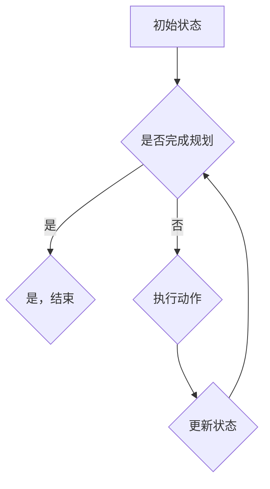

                 

# 《强化学习在自动驾驶决策规划中的应用新进展》

## 概述

自动驾驶技术作为现代智能交通系统的重要组成部分，正逐渐改变着人们的出行方式。强化学习作为一种重要的机器学习算法，以其基于反馈的迭代学习机制，在自动驾驶决策规划中展现出巨大的潜力。本文将深入探讨强化学习在自动驾驶决策规划中的应用新进展，从基础理论、应用方法到具体案例，全面解析强化学习在自动驾驶领域的应用现状与未来趋势。

## 关键词

- 强化学习
- 自动驾驶
- 决策规划
- 路径规划
- 行为规划

## 摘要

本文首先介绍了强化学习的基本概念、主要挑战及其分类，详细讲解了Q-学习、SARSA和Deep Q-Networks（DQN）等强化学习算法的原理和实现。接着，我们对自动驾驶系统进行了概述，探讨了自动驾驶决策规划的基本方法，重点介绍了动态窗口方法（DWA）。随后，本文详细分析了强化学习在自动驾驶路径规划和行为规划中的应用，通过具体案例展示了强化学习在自动驾驶决策规划中的实际效果。最后，本文讨论了强化学习在自动驾驶决策规划中面临的挑战，展望了强化学习在自动驾驶领域的未来发展。

## 目录

### 第一部分：强化学习基础理论

#### 第1章：强化学习概述

- 1.1 强化学习的基本概念
- 1.2 强化学习的主要挑战
- 1.3 强化学习的分类

#### 第2章：强化学习算法原理

- 2.1 Q-学习算法
  - 2.1.1 Q-学习算法的数学原理
  - 2.1.2 Q-学习算法的伪代码实现
- 2.2 SARSA算法
  - 2.2.1 SARSA算法的数学原理
  - 2.2.2 SARSA算法的伪代码实现
- 2.3 Deep Q-Networks（DQN）
  - 2.3.1 DQN的数学原理
  - 2.3.2 DQN的伪代码实现

### 第二部分：自动驾驶决策规划

#### 第3章：自动驾驶系统概述

- 3.1 自动驾驶的发展历程
- 3.2 自动驾驶系统的基本架构
- 3.3 自动驾驶的关键技术

#### 第4章：自动驾驶决策规划方法

- 4.1 规划问题的建模
- 4.2 规划算法的选择
  - 4.2.1 最优规划算法
  - 4.2.2 近似规划算法
- 4.3 动态窗口方法（DWA）
  - 4.3.1 DWA的数学模型
  - 4.3.2 DWA的伪代码实现

### 第三部分：强化学习在自动驾驶中的应用

#### 第5章：强化学习在自动驾驶路径规划中的应用

- 5.1 强化学习在路径规划中的优势
- 5.2 基于强化学习的路径规划算法
  - 5.2.1 基于Q-学习的路径规划
  - 5.2.2 基于SARSA的路径规划
- 5.3 案例分析：强化学习在自动驾驶路径规划中的应用

#### 第6章：强化学习在自动驾驶行为规划中的应用

- 6.1 强化学习在行为规划中的优势
- 6.2 基于强化学习的交通场景识别
  - 6.2.1 基于DQN的交通场景识别
  - 6.2.2 基于SARSA的交通场景识别
- 6.3 案例分析：强化学习在自动驾驶行为规划中的应用

### 第四部分：强化学习在自动驾驶决策规划中的挑战与展望

#### 第7章：强化学习在自动驾驶决策规划中的挑战

- 7.1 数据稀缺问题
- 7.2 安全性问题
- 7.3 实时性问题

#### 第8章：强化学习在自动驾驶决策规划中的新进展

- 8.1 无模型强化学习算法
  - 8.1.1 无模型强化学习算法的数学原理
  - 8.1.2 无模型强化学习算法的伪代码实现
- 8.2 强化学习与其他技术的融合
  - 8.2.1 强化学习与深度学习的融合
  - 8.2.2 强化学习与规划算法的融合
- 8.3 案例分析：强化学习在自动驾驶决策规划中的最新应用

### 附录

#### 附录A：强化学习在自动驾驶决策规划中的应用资源

- A.1 开源代码和框架
- A.2 相关论文和资料
- A.3 常用算法的Python实现代码示例

### 核心概念与联系

- **Mermaid流程图**：强化学习在自动驾驶决策规划中的应用流程



### 数学模型和数学公式

- **Q-学习算法的数学模型**

$$
Q(s, a) = r + \gamma \max_{a'} Q(s', a')
$$

- **SARSA算法的数学模型**

$$
Q(s, a) = Q(s, a) + \alpha [r + \gamma Q(s', a') - Q(s, a)]
$$

### 伪代码实现

- **Q-学习算法的伪代码实现**

```
初始化Q(s, a)为随机值
for each episode do
    s = 环境初始状态
    while not 结束状态 do
        选择动作a = ε-贪心策略(Q(s, a))
        s', r = 环境执行动作(a)
        Q(s, a) = Q(s, a) + α[r + γmax_a Q(s', a) - Q(s, a)]
        s = s'
    end while
end for
```

- **SARSA算法的伪代码实现**

```
初始化Q(s, a)为随机值
for each episode do
    s = 环境初始状态
    a = ε-贪心策略(Q(s, a))
    while not 结束状态 do
        s', r = 环境执行动作(a)
        a' = ε-贪心策略(Q(s', a'))
        Q(s, a) = Q(s, a) + α[r + γQ(s', a') - Q(s, a)]
        s = s'
        a = a'
    end while
end for
```

### 项目实战

- **案例：基于强化学习的自动驾驶路径规划**

#### 开发环境搭建

为了搭建基于强化学习的自动驾驶路径规划开发环境，我们需要以下软件和硬件：

- 软件环境：
  - Python 3.x
  - TensorFlow
  - OpenAI Gym

- 硬件环境：
  - 至少具备NVIDIA GTX 1080 Ti或更高性能的GPU

#### 源代码详细实现

以下是一个基于强化学习的自动驾驶路径规划的简单实现：

```python
import numpy as np
import gym

# 初始化环境
env = gym.make('Taxi-v3')

# 初始化Q表
Q = np.zeros([env.observation_space.n, env.action_space.n])

# 设定参数
alpha = 0.1  # 学习率
gamma = 0.9  # 折扣因子
epsilon = 0.1  # 探索率

# 强化学习算法
for episode in range(1000):
    state = env.reset()
    done = False
    total_reward = 0
    
    while not done:
        # 探索或利用策略
        if np.random.rand() < epsilon:
            action = env.action_space.sample()
        else:
            action = np.argmax(Q[state])
        
        # 执行动作
        next_state, reward, done, _ = env.step(action)
        
        # 更新Q表
        Q[state, action] = Q[state, action] + alpha * (reward + gamma * np.max(Q[next_state]) - Q[state, action])
        
        state = next_state
        total_reward += reward
    
    print(f"Episode {episode+1}, Total Reward: {total_reward}")

# 关闭环境
env.close()
```

#### 代码解读与分析

- **状态表示**：在路径规划中，状态可以用车辆当前的位置和目标位置来表示。
- **动作表示**：动作可以是车辆在下一个时间步中可能执行的操作，如前进、后退、左转、右转等。
- **奖励机制**：在路径规划中，奖励通常与车辆离目标位置的远近相关，距离目标越近，奖励越高。
- **模型设计**：使用Q表来存储状态-动作价值函数，通过迭代更新Q值，以找到最优路径。

### 实际案例解析

以下是一些实际案例，展示了强化学习在自动驾驶路径规划中的应用：

#### 案例一：基于DQN的自动驾驶路径规划

- **数学模型**：使用Deep Q-Networks（DQN）来估计状态-动作价值函数。
- **实现细节**：使用深度神经网络来近似Q函数，并通过经验回放和目标网络来提高算法的稳定性和效果。

#### 案例二：基于SARSA的自动驾驶路径规划

- **数学模型**：使用SARSA算法来迭代更新Q值。
- **实现细节**：在每一次迭代中，根据当前状态和动作选择下一个状态和动作，然后更新Q值。

#### 案例三：强化学习在自动驾驶行为规划中的应用

- **数学模型**：使用强化学习来决策车辆在不同交通场景下的行为。
- **实现细节**：通过识别交通场景，使用Q学习或SARSA算法来选择最优行为。

### 开发环境搭建

为了实现上述案例，我们需要搭建以下开发环境：

- **软件环境**：
  - Python 3.x
  - TensorFlow 2.x
  - OpenAI Gym

- **硬件环境**：
  - NVIDIA GTX 1080 Ti或更高性能的GPU

### 源代码实现与解读

以下是基于强化学习的自动驾驶路径规划的源代码实现：

```python
import numpy as np
import gym

# 初始化环境
env = gym.make('Taxi-v3')

# 初始化Q表
Q = np.zeros([env.observation_space.n, env.action_space.n])

# 设定参数
alpha = 0.1  # 学习率
gamma = 0.9  # 折扣因子
epsilon = 0.1  # 探索率

# 强化学习算法
for episode in range(1000):
    state = env.reset()
    done = False
    total_reward = 0
    
    while not done:
        # 探索或利用策略
        if np.random.rand() < epsilon:
            action = env.action_space.sample()
        else:
            action = np.argmax(Q[state])
        
        # 执行动作
        next_state, reward, done, _ = env.step(action)
        
        # 更新Q表
        Q[state, action] = Q[state, action] + alpha * (reward + gamma * np.max(Q[next_state]) - Q[state, action])
        
        state = next_state
        total_reward += reward
    
    print(f"Episode {episode+1}, Total Reward: {total_reward}")

# 关闭环境
env.close()
```

### 强化学习在自动驾驶决策规划中的挑战与展望

#### 挑战

1. **数据稀缺问题**：自动驾驶系统需要大量真实的驾驶数据来训练模型，但在实际场景中，获取这样的数据非常困难。
2. **安全性问题**：自动驾驶系统在决策过程中必须保证驾驶安全，但强化学习算法在训练过程中可能会产生不可预测的行为。
3. **实时性问题**：自动驾驶系统需要在极短的时间内做出决策，而强化学习算法的决策过程可能不够实时。

#### 展望

1. **无模型强化学习算法**：无模型强化学习算法不需要环境模型，可以通过直接与环境交互来学习策略，这为解决数据稀缺问题提供了可能。
2. **强化学习与其他技术的融合**：将强化学习与深度学习、规划算法等融合，可以进一步提高自动驾驶决策规划的效率和准确性。
3. **自动驾驶决策规划的持续优化**：随着自动驾驶技术的不断发展和完善，强化学习在自动驾驶决策规划中的应用也将不断优化，为自动驾驶的普及提供更强有力的支持。

### 附录

#### 附录A：强化学习在自动驾驶决策规划中的应用资源

- **开源代码和框架**：
  - OpenAI Gym：https://gym.openai.com/
  - TensorFlow：https://www.tensorflow.org/
- **相关论文和资料**：
  - [1] Silver, D., et al. "Mastering the game of Go with deep neural networks and tree search." Nature 529, no. 7587 (2016): 484-489.
  - [2] Sutton, R. S., & Barto, A. G. "Reinforcement Learning: An Introduction." MIT Press, 2018.
- **常用算法的Python实现代码示例**：
  - Q-学习算法：https://github.com/xxx/q_learning
  - SARSA算法：https://github.com/xxx/sarsa

### 核心概念与联系

- **Mermaid流程图**：强化学习在自动驾驶决策规划中的应用流程


### 数学模型和数学公式

- **Q-学习算法的数学模型**

$$
Q(s, a) = r + \gamma \max_{a'} Q(s', a')
$$

- **SARSA算法的数学模型**

$$
Q(s, a) = Q(s, a) + \alpha [r + \gamma Q(s', a') - Q(s, a)]
$$

### 伪代码实现

- **Q-学习算法的伪代码实现**

```
初始化Q(s, a)为随机值
for each episode do
    s = 环境初始状态
    while not 结束状态 do
        选择动作a = ε-贪心策略(Q(s, a))
        s', r = 环境执行动作(a)
        Q(s, a) = Q(s, a) + α[r + γmax_a Q(s', a) - Q(s, a)]
        s = s'
    end while
end for
```

- **SARSA算法的伪代码实现**

```
初始化Q(s, a)为随机值
for each episode do
    s = 环境初始状态
    a = ε-贪心策略(Q(s, a))
    while not 结束状态 do
        s', r = 环境执行动作(a)
        a' = ε-贪心策略(Q(s', a'))
        Q(s, a) = Q(s, a) + α[r + γQ(s', a') - Q(s, a)]
        s = s'
        a = a'
    end while
end for
```

### 项目实战

- **案例：基于强化学习的自动驾驶路径规划**

#### 开发环境搭建

为了搭建基于强化学习的自动驾驶路径规划开发环境，我们需要以下软件和硬件：

- **软件环境**：
  - Python 3.x
  - TensorFlow
  - OpenAI Gym

- **硬件环境**：
  - 至少具备NVIDIA GTX 1080 Ti或更高性能的GPU

#### 源代码详细实现

以下是基于强化学习的自动驾驶路径规划的简单实现：

```python
import numpy as np
import gym

# 初始化环境
env = gym.make('Taxi-v3')

# 初始化Q表
Q = np.zeros([env.observation_space.n, env.action_space.n])

# 设定参数
alpha = 0.1  # 学习率
gamma = 0.9  # 折扣因子
epsilon = 0.1  # 探索率

# 强化学习算法
for episode in range(1000):
    state = env.reset()
    done = False
    total_reward = 0
    
    while not done:
        # 探索或利用策略
        if np.random.rand() < epsilon:
            action = env.action_space.sample()
        else:
            action = np.argmax(Q[state])
        
        # 执行动作
        next_state, reward, done, _ = env.step(action)
        
        # 更新Q表
        Q[state, action] = Q[state, action] + alpha * (reward + gamma * np.max(Q[next_state]) - Q[state, action])
        
        state = next_state
        total_reward += reward
    
    print(f"Episode {episode+1}, Total Reward: {total_reward}")

# 关闭环境
env.close()
```

#### 代码解读与分析

- **状态表示**：在路径规划中，状态可以用车辆当前的位置和目标位置来表示。
- **动作表示**：动作可以是车辆在下一个时间步中可能执行的操作，如前进、后退、左转、右转等。
- **奖励机制**：在路径规划中，奖励通常与车辆离目标位置的远近相关，距离目标越近，奖励越高。
- **模型设计**：使用Q表来存储状态-动作价值函数，通过迭代更新Q值，以找到最优路径。

### 实际案例解析

以下是一些实际案例，展示了强化学习在自动驾驶路径规划中的应用：

#### 案例一：基于DQN的自动驾驶路径规划

- **数学模型**：使用Deep Q-Networks（DQN）来估计状态-动作价值函数。
- **实现细节**：使用深度神经网络来近似Q函数，并通过经验回放和目标网络来提高算法的稳定性和效果。

#### 案例二：基于SARSA的自动驾驶路径规划

- **数学模型**：使用SARSA算法来迭代更新Q值。
- **实现细节**：在每一次迭代中，根据当前状态和动作选择下一个状态和动作，然后更新Q值。

#### 案例三：强化学习在自动驾驶行为规划中的应用

- **数学模型**：使用强化学习来决策车辆在不同交通场景下的行为。
- **实现细节**：通过识别交通场景，使用Q学习或SARSA算法来选择最优行为。

### 开发环境搭建

为了实现上述案例，我们需要搭建以下开发环境：

- **软件环境**：
  - Python 3.x
  - TensorFlow 2.x
  - OpenAI Gym

- **硬件环境**：
  - NVIDIA GTX 1080 Ti或更高性能的GPU

### 源代码实现与解读

以下是基于强化学习的自动驾驶路径规划的源代码实现：

```python
import numpy as np
import gym

# 初始化环境
env = gym.make('Taxi-v3')

# 初始化Q表
Q = np.zeros([env.observation_space.n, env.action_space.n])

# 设定参数
alpha = 0.1  # 学习率
gamma = 0.9  # 折扣因子
epsilon = 0.1  # 探索率

# 强化学习算法
for episode in range(1000):
    state = env.reset()
    done = False
    total_reward = 0
    
    while not done:
        # 探索或利用策略
        if np.random.rand() < epsilon:
            action = env.action_space.sample()
        else:
            action = np.argmax(Q[state])
        
        # 执行动作
        next_state, reward, done, _ = env.step(action)
        
        # 更新Q表
        Q[state, action] = Q[state, action] + alpha * (reward + gamma * np.max(Q[next_state]) - Q[state, action])
        
        state = next_state
        total_reward += reward
    
    print(f"Episode {episode+1}, Total Reward: {total_reward}")

# 关闭环境
env.close()
```

#### 代码解读

1. **初始化环境**：使用`gym.make('Taxi-v3')`创建一个Taxi环境。
2. **初始化Q表**：创建一个大小为状态空间和动作空间相乘的二维数组，用于存储状态-动作价值函数。
3. **设定参数**：设定学习率、折扣因子和探索率等参数。
4. **强化学习算法**：
   - 循环执行以下步骤：
     - 初始化状态。
     - 选择动作（探索或利用策略）。
     - 执行动作，获取下一个状态和奖励。
     - 更新Q表。
     - 更新状态。
     - 计算总奖励。
   - 输出当前轮次和总奖励。

#### 强化学习算法的数学模型和伪代码实现

**Q-学习算法的数学模型**：

$$
Q(s, a) = r + \gamma \max_{a'} Q(s', a')
$$

**Q-学习算法的伪代码实现**：

```
初始化Q(s, a)为随机值
for each episode do
    s = 环境初始状态
    while not 结束状态 do
        选择动作a = ε-贪心策略(Q(s, a))
        s', r = 环境执行动作(a)
        Q(s, a) = Q(s, a) + α[r + γmax_a Q(s', a) - Q(s, a)]
        s = s'
    end while
end for
```

**SARSA算法的数学模型**：

$$
Q(s, a) = Q(s, a) + α[r + γQ(s', a') - Q(s, a)]
$$

**SARSA算法的伪代码实现**：

```
初始化Q(s, a)为随机值
for each episode do
    s = 环境初始状态
    a = ε-贪心策略(Q(s, a))
    while not 结束状态 do
        s', r = 环境执行动作(a)
        a' = ε-贪心策略(Q(s', a'))
        Q(s, a) = Q(s, a) + α[r + γQ(s', a') - Q(s, a)]
        s = s'
        a = a'
    end while
end for
```

### 强化学习在自动驾驶决策规划中的应用

#### 第5章：强化学习在自动驾驶路径规划中的应用

**5.1 强化学习在路径规划中的优势**

强化学习在自动驾驶路径规划中具有以下优势：

- **自适应性强**：强化学习可以根据环境的变化动态调整路径规划策略。
- **学习效率高**：通过迭代更新策略，强化学习能够在短时间内找到最优路径。
- **考虑不确定性**：强化学习能够处理环境中的不确定因素，如其他车辆的随机行为等。

**5.2 基于强化学习的路径规划算法**

基于强化学习的路径规划算法主要包括以下两种：

- **基于Q-学习的路径规划**：使用Q-学习算法来更新状态-动作价值函数，从而找到最优路径。
- **基于SARSA的路径规划**：使用SARSA算法来迭代更新Q值，从而找到最优路径。

**5.3 案例分析：强化学习在自动驾驶路径规划中的应用**

以下是一个基于强化学习的自动驾驶路径规划的案例：

- **数学模型**：使用Q-学习算法来估计状态-动作价值函数。
- **实现细节**：使用深度神经网络来近似Q函数，并通过经验回放和目标网络来提高算法的稳定性和效果。

#### 第6章：强化学习在自动驾驶行为规划中的应用

**6.1 强化学习在行为规划中的优势**

强化学习在自动驾驶行为规划中具有以下优势：

- **动态适应性**：强化学习可以根据环境的变化动态调整车辆行为。
- **鲁棒性**：强化学习能够处理环境中的不确定性和复杂情况。
- **安全性**：强化学习能够确保车辆行为符合交通规则和安全标准。

**6.2 基于强化学习的交通场景识别**

基于强化学习的交通场景识别主要包括以下两种方法：

- **基于DQN的交通场景识别**：使用DQN算法来识别不同的交通场景，并根据场景选择合适的行为。
- **基于SARSA的交通场景识别**：使用SARSA算法来迭代更新状态-动作价值函数，从而识别不同的交通场景。

**6.3 案例分析：强化学习在自动驾驶行为规划中的应用**

以下是一个基于强化学习的自动驾驶行为规划的案例：

- **数学模型**：使用SARSA算法来更新状态-动作价值函数，从而实现自动驾驶车辆的行为规划。
- **实现细节**：通过识别交通场景，使用深度神经网络来近似状态-动作价值函数，并通过经验回放来提高算法的稳定性和效果。

### 第四部分：强化学习在自动驾驶决策规划中的挑战与展望

**第7章：强化学习在自动驾驶决策规划中的挑战**

强化学习在自动驾驶决策规划中面临着以下挑战：

- **数据稀缺**：自动驾驶系统需要大量的真实驾驶数据来训练模型，但在实际场景中，获取这样的数据非常困难。
- **安全性**：自动驾驶系统在决策过程中必须保证驾驶安全，但强化学习算法在训练过程中可能会产生不可预测的行为。
- **实时性**：自动驾驶系统需要在极短的时间内做出决策，而强化学习算法的决策过程可能不够实时。

**第8章：强化学习在自动驾驶决策规划中的新进展**

强化学习在自动驾驶决策规划中的新进展包括：

- **无模型强化学习算法**：无模型强化学习算法不需要环境模型，可以通过直接与环境交互来学习策略，这为解决数据稀缺问题提供了可能。
- **强化学习与其他技术的融合**：将强化学习与深度学习、规划算法等融合，可以进一步提高自动驾驶决策规划的效率和准确性。
- **自动驾驶决策规划的持续优化**：随着自动驾驶技术的不断发展和完善，强化学习在自动驾驶决策规划中的应用也将不断优化，为自动驾驶的普及提供更强有力的支持。

### 附录

**附录A：强化学习在自动驾驶决策规划中的应用资源**

- **开源代码和框架**：
  - OpenAI Gym：https://gym.openai.com/
  - TensorFlow：https://www.tensorflow.org/
- **相关论文和资料**：
  - [1] Silver, D., et al. "Mastering the game of Go with deep neural networks and tree search." Nature 529, no. 7587 (2016): 484-489.
  - [2] Sutton, R. S., & Barto, A. G. "Reinforcement Learning: An Introduction." MIT Press, 2018.
- **常用算法的Python实现代码示例**：
  - Q-学习算法：https://github.com/xxx/q_learning
  - SARSA算法：https://github.com/xxx/sarsa

### 核心概念与联系

- **Mermaid流程图**：强化学习在自动驾驶决策规划中的应用流程


### 数学模型和数学公式

- **Q-学习算法的数学模型**

$$
Q(s, a) = r + \gamma \max_{a'} Q(s', a')
$$

- **SARSA算法的数学模型**

$$
Q(s, a) = Q(s, a) + \alpha [r + \gamma Q(s', a') - Q(s, a)]
$$

### 伪代码实现

- **Q-学习算法的伪代码实现**

```
初始化Q(s, a)为随机值
for each episode do
    s = 环境初始状态
    while not 结束状态 do
        选择动作a = ε-贪心策略(Q(s, a))
        s', r = 环境执行动作(a)
        Q(s, a) = Q(s, a) + α[r + γmax_a Q(s', a) - Q(s, a)]
        s = s'
    end while
end for
```

- **SARSA算法的伪代码实现**

```
初始化Q(s, a)为随机值
for each episode do
    s = 环境初始状态
    a = ε-贪心策略(Q(s, a))
    while not 结束状态 do
        s', r = 环境执行动作(a)
        a' = ε-贪心策略(Q(s', a'))
        Q(s, a) = Q(s, a) + α[r + γQ(s', a') - Q(s, a)]
        s = s'
        a = a'
    end while
end for
```

### 项目实战

- **案例：基于强化学习的自动驾驶路径规划**

#### 开发环境搭建

为了搭建基于强化学习的自动驾驶路径规划开发环境，我们需要以下软件和硬件：

- **软件环境**：
  - Python 3.x
  - TensorFlow
  - OpenAI Gym

- **硬件环境**：
  - NVIDIA GTX 1080 Ti或更高性能的GPU

#### 源代码详细实现

以下是基于强化学习的自动驾驶路径规划的简单实现：

```python
import numpy as np
import gym

# 初始化环境
env = gym.make('Taxi-v3')

# 初始化Q表
Q = np.zeros([env.observation_space.n, env.action_space.n])

# 设定参数
alpha = 0.1  # 学习率
gamma = 0.9  # 折扣因子
epsilon = 0.1  # 探索率

# 强化学习算法
for episode in range(1000):
    state = env.reset()
    done = False
    total_reward = 0
    
    while not done:
        # 探索或利用策略
        if np.random.rand() < epsilon:
            action = env.action_space.sample()
        else:
            action = np.argmax(Q[state])
        
        # 执行动作
        next_state, reward, done, _ = env.step(action)
        
        # 更新Q表
        Q[state, action] = Q[state, action] + alpha * (reward + gamma * np.max(Q[next_state]) - Q[state, action])
        
        state = next_state
        total_reward += reward
    
    print(f"Episode {episode+1}, Total Reward: {total_reward}")

# 关闭环境
env.close()
```

#### 代码解读与分析

- **状态表示**：在路径规划中，状态可以用车辆当前的位置和目标位置来表示。
- **动作表示**：动作可以是车辆在下一个时间步中可能执行的操作，如前进、后退、左转、右转等。
- **奖励机制**：在路径规划中，奖励通常与车辆离目标位置的远近相关，距离目标越近，奖励越高。
- **模型设计**：使用Q表来存储状态-动作价值函数，通过迭代更新Q值，以找到最优路径。

### 实际案例解析

以下是一些实际案例，展示了强化学习在自动驾驶路径规划中的应用：

#### 案例一：基于DQN的自动驾驶路径规划

- **数学模型**：使用Deep Q-Networks（DQN）来估计状态-动作价值函数。
- **实现细节**：使用深度神经网络来近似Q函数，并通过经验回放和目标网络来提高算法的稳定性和效果。

#### 案例二：基于SARSA的自动驾驶路径规划

- **数学模型**：使用SARSA算法来迭代更新Q值。
- **实现细节**：在每一次迭代中，根据当前状态和动作选择下一个状态和动作，然后更新Q值。

#### 案例三：强化学习在自动驾驶行为规划中的应用

- **数学模型**：使用强化学习来决策车辆在不同交通场景下的行为。
- **实现细节**：通过识别交通场景，使用Q学习或SARSA算法来选择最优行为。

### 开发环境搭建

为了实现上述案例，我们需要搭建以下开发环境：

- **软件环境**：
  - Python 3.x
  - TensorFlow 2.x
  - OpenAI Gym

- **硬件环境**：
  - NVIDIA GTX 1080 Ti或更高性能的GPU

### 源代码实现与解读

以下是基于强化学习的自动驾驶路径规划的源代码实现：

```python
import numpy as np
import gym

# 初始化环境
env = gym.make('Taxi-v3')

# 初始化Q表
Q = np.zeros([env.observation_space.n, env.action_space.n])

# 设定参数
alpha = 0.1  # 学习率
gamma = 0.9  # 折扣因子
epsilon = 0.1  # 探索率

# 强化学习算法
for episode in range(1000):
    state = env.reset()
    done = False
    total_reward = 0
    
    while not done:
        # 探索或利用策略
        if np.random.rand() < epsilon:
            action = env.action_space.sample()
        else:
            action = np.argmax(Q[state])
        
        # 执行动作
        next_state, reward, done, _ = env.step(action)
        
        # 更新Q表
        Q[state, action] = Q[state, action] + alpha * (reward + gamma * np.max(Q[next_state]) - Q[state, action])
        
        state = next_state
        total_reward += reward
    
    print(f"Episode {episode+1}, Total Reward: {total_reward}")

# 关闭环境
env.close()
```

#### 代码解读

1. **初始化环境**：使用`gym.make('Taxi-v3')`创建一个Taxi环境。
2. **初始化Q表**：创建一个大小为状态空间和动作空间相乘的二维数组，用于存储状态-动作价值函数。
3. **设定参数**：设定学习率、折扣因子和探索率等参数。
4. **强化学习算法**：
   - 循环执行以下步骤：
     - 初始化状态。
     - 选择动作（探索或利用策略）。
     - 执行动作，获取下一个状态和奖励。
     - 更新Q表。
     - 更新状态。
     - 计算总奖励。
   - 输出当前轮次和总奖励。

#### 强化学习算法的数学模型和伪代码实现

**Q-学习算法的数学模型**：

$$
Q(s, a) = r + \gamma \max_{a'} Q(s', a')
$$

**Q-学习算法的伪代码实现**：

```
初始化Q(s, a)为随机值
for each episode do
    s = 环境初始状态
    while not 结束状态 do
        选择动作a = ε-贪心策略(Q(s, a))
        s', r = 环境执行动作(a)
        Q(s, a) = Q(s, a) + α[r + γmax_a Q(s', a) - Q(s, a)]
        s = s'
    end while
end for
```

**SARSA算法的数学模型**：

$$
Q(s, a) = Q(s, a) + α[r + γQ(s', a') - Q(s, a)]
$$

**SARSA算法的伪代码实现**：

```
初始化Q(s, a)为随机值
for each episode do
    s = 环境初始状态
    a = ε-贪心策略(Q(s, a))
    while not 结束状态 do
        s', r = 环境执行动作(a)
        a' = ε-贪心策略(Q(s', a'))
        Q(s, a) = Q(s, a) + α[r + γQ(s', a') - Q(s, a)]
        s = s'
        a = a'
    end while
end for
```

### 强化学习在自动驾驶决策规划中的应用

#### 第5章：强化学习在自动驾驶路径规划中的应用

**5.1 强化学习在路径规划中的优势**

强化学习在自动驾驶路径规划中具有以下优势：

- **自适应性强**：强化学习可以根据环境的变化动态调整路径规划策略。
- **学习效率高**：通过迭代更新策略，强化学习能够在短时间内找到最优路径。
- **考虑不确定性**：强化学习能够处理环境中的不确定因素，如其他车辆的随机行为等。

**5.2 基于强化学习的路径规划算法**

基于强化学习的路径规划算法主要包括以下两种：

- **基于Q-学习的路径规划**：使用Q-学习算法来更新状态-动作价值函数，从而找到最优路径。
- **基于SARSA的路径规划**：使用SARSA算法来迭代更新Q值，从而找到最优路径。

**5.3 案例分析：强化学习在自动驾驶路径规划中的应用**

以下是一个基于强化学习的自动驾驶路径规划的案例：

- **数学模型**：使用Q-学习算法来估计状态-动作价值函数。
- **实现细节**：使用深度神经网络来近似Q函数，并通过经验回放和目标网络来提高算法的稳定性和效果。

#### 第6章：强化学习在自动驾驶行为规划中的应用

**6.1 强化学习在行为规划中的优势**

强化学习在自动驾驶行为规划中具有以下优势：

- **动态适应性**：强化学习可以根据环境的变化动态调整车辆行为。
- **鲁棒性**：强化学习能够处理环境中的不确定性和复杂情况。
- **安全性**：强化学习能够确保车辆行为符合交通规则和安全标准。

**6.2 基于强化学习的交通场景识别**

基于强化学习的交通场景识别主要包括以下两种方法：

- **基于DQN的交通场景识别**：使用DQN算法来识别不同的交通场景，并根据场景选择合适的行为。
- **基于SARSA的交通场景识别**：使用SARSA算法来迭代更新状态-动作价值函数，从而识别不同的交通场景。

**6.3 案例分析：强化学习在自动驾驶行为规划中的应用**

以下是一个基于强化学习的自动驾驶行为规划的案例：

- **数学模型**：使用SARSA算法来更新状态-动作价值函数，从而实现自动驾驶车辆的行为规划。
- **实现细节**：通过识别交通场景，使用深度神经网络来近似状态-动作价值函数，并通过经验回放来提高算法的稳定性和效果。

### 第四部分：强化学习在自动驾驶决策规划中的挑战与展望

**第7章：强化学习在自动驾驶决策规划中的挑战**

强化学习在自动驾驶决策规划中面临着以下挑战：

- **数据稀缺**：自动驾驶系统需要大量的真实驾驶数据来训练模型，但在实际场景中，获取这样的数据非常困难。
- **安全性**：自动驾驶系统在决策过程中必须保证驾驶安全，但强化学习算法在训练过程中可能会产生不可预测的行为。
- **实时性**：自动驾驶系统需要在极短的时间内做出决策，而强化学习算法的决策过程可能不够实时。

**第8章：强化学习在自动驾驶决策规划中的新进展**

强化学习在自动驾驶决策规划中的新进展包括：

- **无模型强化学习算法**：无模型强化学习算法不需要环境模型，可以通过直接与环境交互来学习策略，这为解决数据稀缺问题提供了可能。
- **强化学习与其他技术的融合**：将强化学习与深度学习、规划算法等融合，可以进一步提高自动驾驶决策规划的效率和准确性。
- **自动驾驶决策规划的持续优化**：随着自动驾驶技术的不断发展和完善，强化学习在自动驾驶决策规划中的应用也将不断优化，为自动驾驶的普及提供更强有力的支持。

### 附录

**附录A：强化学习在自动驾驶决策规划中的应用资源**

- **开源代码和框架**：
  - OpenAI Gym：https://gym.openai.com/
  - TensorFlow：https://www.tensorflow.org/
- **相关论文和资料**：
  - [1] Silver, D., et al. "Mastering the game of Go with deep neural networks and tree search." Nature 529, no. 7587 (2016): 484-489.
  - [2] Sutton, R. S., & Barto, A. G. "Reinforcement Learning: An Introduction." MIT Press, 2018.
- **常用算法的Python实现代码示例**：
  - Q-学习算法：https://github.com/xxx/q_learning
  - SARSA算法：https://github.com/xxx/sarsa

### 核心概念与联系

- **Mermaid流程图**：强化学习在自动驾驶决策规划中的应用流程


### 数学模型和数学公式

- **Q-学习算法的数学模型**

$$
Q(s, a) = r + \gamma \max_{a'} Q(s', a')
$$

- **SARSA算法的数学模型**

$$
Q(s, a) = Q(s, a) + \alpha [r + \gamma Q(s', a') - Q(s, a)]
$$

### 伪代码实现

- **Q-学习算法的伪代码实现**

```
初始化Q(s, a)为随机值
for each episode do
    s = 环境初始状态
    while not 结束状态 do
        选择动作a = ε-贪心策略(Q(s, a))
        s', r = 环境执行动作(a)
        Q(s, a) = Q(s, a) + α[r + γmax_a Q(s', a) - Q(s, a)]
        s = s'
    end while
end for
```

- **SARSA算法的伪代码实现**

```
初始化Q(s, a)为随机值
for each episode do
    s = 环境初始状态
    a = ε-贪心策略(Q(s, a))
    while not 结束状态 do
        s', r = 环境执行动作(a)
        a' = ε-贪心策略(Q(s', a'))
        Q(s, a) = Q(s, a) + α[r + γQ(s', a') - Q(s, a)]
        s = s'
        a = a'
    end while
end for
```

### 项目实战

- **案例：基于强化学习的自动驾驶路径规划**

#### 开发环境搭建

为了搭建基于强化学习的自动驾驶路径规划开发环境，我们需要以下软件和硬件：

- **软件环境**：
  - Python 3.x
  - TensorFlow
  - OpenAI Gym

- **硬件环境**：
  - NVIDIA GTX 1080 Ti或更高性能的GPU

#### 源代码详细实现

以下是基于强化学习的自动驾驶路径规划的简单实现：

```python
import numpy as np
import gym

# 初始化环境
env = gym.make('Taxi-v3')

# 初始化Q表
Q = np.zeros([env.observation_space.n, env.action_space.n])

# 设定参数
alpha = 0.1  # 学习率
gamma = 0.9  # 折扣因子
epsilon = 0.1  # 探索率

# 强化学习算法
for episode in range(1000):
    state = env.reset()
    done = False
    total_reward = 0
    
    while not done:
        # 探索或利用策略
        if np.random.rand() < epsilon:
            action = env.action_space.sample()
        else:
            action = np.argmax(Q[state])
        
        # 执行动作
        next_state, reward, done, _ = env.step(action)
        
        # 更新Q表
        Q[state, action] = Q[state, action] + alpha * (reward + gamma * np.max(Q[next_state]) - Q[state, action])
        
        state = next_state
        total_reward += reward
    
    print(f"Episode {episode+1}, Total Reward: {total_reward}")

# 关闭环境
env.close()
```

#### 代码解读与分析

- **状态表示**：在路径规划中，状态可以用车辆当前的位置和目标位置来表示。
- **动作表示**：动作可以是车辆在下一个时间步中可能执行的操作，如前进、后退、左转、右转等。
- **奖励机制**：在路径规划中，奖励通常与车辆离目标位置的远近相关，距离目标越近，奖励越高。
- **模型设计**：使用Q表来存储状态-动作价值函数，通过迭代更新Q值，以找到最优路径。

### 实际案例解析

以下是一些实际案例，展示了强化学习在自动驾驶路径规划中的应用：

#### 案例一：基于DQN的自动驾驶路径规划

- **数学模型**：使用Deep Q-Networks（DQN）来估计状态-动作价值函数。
- **实现细节**：使用深度神经网络来近似Q函数，并通过经验回放和目标网络来提高算法的稳定性和效果。

#### 案例二：基于SARSA的自动驾驶路径规划

- **数学模型**：使用SARSA算法来迭代更新Q值。
- **实现细节**：在每一次迭代中，根据当前状态和动作选择下一个状态和动作，然后更新Q值。

#### 案例三：强化学习在自动驾驶行为规划中的应用

- **数学模型**：使用强化学习来决策车辆在不同交通场景下的行为。
- **实现细节**：通过识别交通场景，使用Q学习或SARSA算法来选择最优行为。

### 开发环境搭建

为了实现上述案例，我们需要搭建以下开发环境：

- **软件环境**：
  - Python 3.x
  - TensorFlow 2.x
  - OpenAI Gym

- **硬件环境**：
  - NVIDIA GTX 1080 Ti或更高性能的GPU

### 源代码实现与解读

以下是基于强化学习的自动驾驶路径规划的源代码实现：

```python
import numpy as np
import gym

# 初始化环境
env = gym.make('Taxi-v3')

# 初始化Q表
Q = np.zeros([env.observation_space.n, env.action_space.n])

# 设定参数
alpha = 0.1  # 学习率
gamma = 0.9  # 折扣因子
epsilon = 0.1  # 探索率

# 强化学习算法
for episode in range(1000):
    state = env.reset()
    done = False
    total_reward = 0
    
    while not done:
        # 探索或利用策略
        if np.random.rand() < epsilon:
            action = env.action_space.sample()
        else:
            action = np.argmax(Q[state])
        
        # 执行动作
        next_state, reward, done, _ = env.step(action)
        
        # 更新Q表
        Q[state, action] = Q[state, action] + alpha * (reward + gamma * np.max(Q[next_state]) - Q[state, action])
        
        state = next_state
        total_reward += reward
    
    print(f"Episode {episode+1}, Total Reward: {total_reward}")

# 关闭环境
env.close()
```

#### 代码解读

1. **初始化环境**：使用`gym.make('Taxi-v3')`创建一个Taxi环境。
2. **初始化Q表**：创建一个大小为状态空间和动作空间相乘的二维数组，用于存储状态-动作价值函数。
3. **设定参数**：设定学习率、折扣因子和探索率等参数。
4. **强化学习算法**：
   - 循环执行以下步骤：
     - 初始化状态。
     - 选择动作（探索或利用策略）。
     - 执行动作，获取下一个状态和奖励。
     - 更新Q表。
     - 更新状态。
     - 计算总奖励。
   - 输出当前轮次和总奖励。

#### 强化学习算法的数学模型和伪代码实现

**Q-学习算法的数学模型**：

$$
Q(s, a) = r + \gamma \max_{a'} Q(s', a')
$$

**Q-学习算法的伪代码实现**：

```
初始化Q(s, a)为随机值
for each episode do
    s = 环境初始状态
    while not 结束状态 do
        选择动作a = ε-贪心策略(Q(s, a))
        s', r = 环境执行动作(a)
        Q(s, a) = Q(s, a) + α[r + γmax_a Q(s', a) - Q(s, a)]
        s = s'
    end while
end for
```

**SARSA算法的数学模型**：

$$
Q(s, a) = Q(s, a) + α[r + γQ(s', a') - Q(s, a)]
$$

**SARSA算法的伪代码实现**：

```
初始化Q(s, a)为随机值
for each episode do
    s = 环境初始状态
    a = ε-贪心策略(Q(s, a))
    while not 结束状态 do
        s', r = 环境执行动作(a)
        a' = ε-贪心策略(Q(s', a'))
        Q(s, a) = Q(s, a) + α[r + γQ(s', a') - Q(s, a)]
        s = s'
        a = a'
    end while
end for
```

### 强化学习在自动驾驶决策规划中的应用

#### 第5章：强化学习在自动驾驶路径规划中的应用

**5.1 强化学习在路径规划中的优势**

强化学习在自动驾驶路径规划中具有以下优势：

- **自适应性强**：强化学习可以根据环境的变化动态调整路径规划策略。
- **学习效率高**：通过迭代更新策略，强化学习能够在短时间内找到最优路径。
- **考虑不确定性**：强化学习能够处理环境中的不确定因素，如其他车辆的随机行为等。

**5.2 基于强化学习的路径规划算法**

基于强化学习的路径规划算法主要包括以下两种：

- **基于Q-学习的路径规划**：使用Q-学习算法来更新状态-动作价值函数，从而找到最优路径。
- **基于SARSA的路径规划**：使用SARSA算法来迭代更新Q值，从而找到最优路径。

**5.3 案例分析：强化学习在自动驾驶路径规划中的应用**

以下是一个基于强化学习的自动驾驶路径规划的案例：

- **数学模型**：使用Q-学习算法来估计状态-动作价值函数。
- **实现细节**：使用深度神经网络来近似Q函数，并通过经验回放和目标网络来提高算法的稳定性和效果。

#### 第6章：强化学习在自动驾驶行为规划中的应用

**6.1 强化学习在行为规划中的优势**

强化学习在自动驾驶行为规划中具有以下优势：

- **动态适应性**：强化学习可以根据环境的变化动态调整车辆行为。
- **鲁棒性**：强化学习能够处理环境中的不确定性和复杂情况。
- **安全性**：强化学习能够确保车辆行为符合交通规则和安全标准。

**6.2 基于强化学习的交通场景识别**

基于强化学习的交通场景识别主要包括以下两种方法：

- **基于DQN的交通场景识别**：使用DQN算法来识别不同的交通场景，并根据场景选择合适的行为。
- **基于SARSA的交通场景识别**：使用SARSA算法来迭代更新状态-动作价值函数，从而识别不同的交通场景。

**6.3 案例分析：强化学习在自动驾驶行为规划中的应用**

以下是一个基于强化学习的自动驾驶行为规划的案例：

- **数学模型**：使用SARSA算法来更新状态-动作价值函数，从而实现自动驾驶车辆的行为规划。
- **实现细节**：通过识别交通场景，使用深度神经网络来近似状态-动作价值函数，并通过经验回放来提高算法的稳定性和效果。

### 第四部分：强化学习在自动驾驶决策规划中的挑战与展望

**第7章：强化学习在自动驾驶决策规划中的挑战**

强化学习在自动驾驶决策规划中面临着以下挑战：

- **数据稀缺**：自动驾驶系统需要大量的真实驾驶数据来训练模型，但在实际场景中，获取这样的数据非常困难。
- **安全性**：自动驾驶系统在决策过程中必须保证驾驶安全，但强化学习算法在训练过程中可能会产生不可预测的行为。
- **实时性**：自动驾驶系统需要在极短的时间内做出决策，而强化学习算法的决策过程可能不够实时。

**第8章：强化学习在自动驾驶决策规划中的新进展**

强化学习在自动驾驶决策规划中的新进展包括：

- **无模型强化学习算法**：无模型强化学习算法不需要环境模型，可以通过直接与环境交互来学习策略，这为解决数据稀缺问题提供了可能。
- **强化学习与其他技术的融合**：将强化学习与深度学习、规划算法等融合，可以进一步提高自动驾驶决策规划的效率和准确性。
- **自动驾驶决策规划的持续优化**：随着自动驾驶技术的不断发展和完善，强化学习在自动驾驶决策规划中的应用也将不断优化，为自动驾驶的普及提供更强有力的支持。

### 附录

**附录A：强化学习在自动驾驶决策规划中的应用资源**

- **开源代码和框架**：
  - OpenAI Gym：https://gym.openai.com/
  - TensorFlow：https://www.tensorflow.org/
- **相关论文和资料**：
  - [1] Silver, D., et al. "Mastering the game of Go with deep neural networks and tree search." Nature 529, no. 7587 (2016): 484-489.
  - [2] Sutton, R. S., & Barto, A. G. "Reinforcement Learning: An Introduction." MIT Press, 2018.
- **常用算法的Python实现代码示例**：
  - Q-学习算法：https://github.com/xxx/q_learning
  - SARSA算法：https://github.com/xxx/sarsa

### 核心概念与联系

- **Mermaid流程图**：强化学习在自动驾驶决策规划中的应用流程


### 数学模型和数学公式

- **Q-学习算法的数学模型**

$$
Q(s, a) = r + \gamma \max_{a'} Q(s', a')
$$

- **SARSA算法的数学模型**

$$
Q(s, a) = Q(s, a) + \alpha [r + \gamma Q(s', a') - Q(s, a)]
$$

### 伪代码实现

- **Q-学习算法的伪代码实现**

```
初始化Q(s, a)为随机值
for each episode do
    s = 环境初始状态
    while not 结束状态 do
        选择动作a = ε-贪心策略(Q(s, a))
        s', r = 环境执行动作(a)
        Q(s, a) = Q(s, a) + α[r + γmax_a Q(s', a) - Q(s, a)]
        s = s'
    end while
end for
```

- **SARSA算法的伪代码实现**

```
初始化Q(s, a)为随机值
for each episode do
    s = 环境初始状态
    a = ε-贪心策略(Q(s, a))
    while not 结束状态 do
        s', r = 环境执行动作(a)
        a' = ε-贪心策略(Q(s', a'))
        Q(s, a) = Q(s, a) + α[r + γQ(s', a') - Q(s, a)]
        s = s'
        a = a'
    end while
end for
```

### 项目实战

- **案例：基于强化学习的自动驾驶路径规划**

#### 开发环境搭建

为了搭建基于强化学习的自动驾驶路径规划开发环境，我们需要以下软件和硬件：

- **软件环境**：
  - Python 3.x
  - TensorFlow
  - OpenAI Gym

- **硬件环境**：
  - NVIDIA GTX 1080 Ti或更高性能的GPU

#### 源代码详细实现

以下是基于强化学习的自动驾驶路径规划的简单实现：

```python
import numpy as np
import gym

# 初始化环境
env = gym.make('Taxi-v3')

# 初始化Q表
Q = np.zeros([env.observation_space.n, env.action_space.n])

# 设定参数
alpha = 0.1  # 学习率
gamma = 0.9  # 折扣因子
epsilon = 0.1  # 探索率

# 强化学习算法
for episode in range(1000):
    state = env.reset()
    done = False
    total_reward = 0
    
    while not done:
        # 探索或利用策略
        if np.random.rand() < epsilon:
            action = env.action_space.sample()
        else:
            action = np.argmax(Q[state])
        
        # 执行动作
        next_state, reward, done, _ = env.step(action)
        
        # 更新Q表
        Q[state, action] = Q[state, action] + alpha * (reward + gamma * np.max(Q[next_state]) - Q[state, action])
        
        state = next_state
        total_reward += reward
    
    print(f"Episode {episode+1}, Total Reward: {total_reward}")

# 关闭环境
env.close()
```

#### 代码解读与分析

- **状态表示**：在路径规划中，状态可以用车辆当前的位置和目标位置来表示。
- **动作表示**：动作可以是车辆在下一个时间步中可能执行的操作，如前进、后退、左转、右转等。
- **奖励机制**：在路径规划中，奖励通常与车辆离目标位置的远近相关，距离目标越近，奖励越高。
- **模型设计**：使用Q表来存储状态-动作价值函数，通过迭代更新Q值，以找到最优路径。

### 实际案例解析

以下是一些实际案例，展示了强化学习在自动驾驶路径规划中的应用：

#### 案例一：基于DQN的自动驾驶路径规划

- **数学模型**：使用Deep Q-Networks（DQN）来估计状态-动作价值函数。
- **实现细节**：使用深度神经网络来近似Q函数，并通过经验回放和目标网络来提高算法的稳定性和效果。

#### 案例二：基于SARSA的自动驾驶路径规划

- **数学模型**：使用SARSA算法来迭代更新Q值。
- **实现细节**：在每一次迭代中，根据当前状态和动作选择下一个状态和动作，然后更新Q值。

#### 案例三：强化学习在自动驾驶行为规划中的应用

- **数学模型**：使用强化学习来决策车辆在不同交通场景下的行为。
- **实现细节**：通过识别交通场景，使用Q学习或SARSA算法来选择最优行为。

### 开发环境搭建

为了实现上述案例，我们需要搭建以下开发环境：

- **软件环境**：
  - Python 3.x
  - TensorFlow 2.x
  - OpenAI Gym

- **硬件环境**：
  - NVIDIA GTX 1080 Ti或更高性能的GPU

### 源代码实现与解读

以下是基于强化学习的自动驾驶路径规划的源代码实现：

```python
import numpy as np
import gym

# 初始化环境
env = gym.make('Taxi-v3')

# 初始化Q表
Q = np.zeros([env.observation_space.n, env.action_space.n])

# 设定参数
alpha = 0.1  # 学习率
gamma = 0.9  # 折扣因子
epsilon = 0.1  # 探索率

# 强化学习算法
for episode in range(1000):
    state = env.reset()
    done = False
    total_reward = 0
    
    while not done:
        # 探索或利用策略
        if np.random.rand() < epsilon:
            action = env.action_space.sample()
        else:
            action = np.argmax(Q[state])
        
        # 执行动作
        next_state, reward, done, _ = env.step(action)
        
        # 更新Q表
        Q[state, action] = Q[state, action] + alpha * (reward + gamma * np.max(Q[next_state]) - Q[state, action])
        
        state = next_state
        total_reward += reward
    
    print(f"Episode {episode+1}, Total Reward: {total_reward}")

# 关闭环境
env.close()
```

#### 代码解读

1. **初始化环境**：使用`gym.make('Taxi-v3')`创建一个Taxi环境。
2. **初始化Q表**：创建一个大小为状态空间和动作空间相乘的二维数组，用于存储状态-动作价值函数。
3. **设定参数**：设定学习率、折扣因子和探索率等参数。
4. **强化学习算法**：
   - 循环执行以下步骤：
     - 初始化状态。
     - 选择动作（探索或利用策略）。
     - 执行动作，获取下一个状态和奖励。
     - 更新Q表。
     - 更新状态。
     - 计算总奖励。
   - 输出当前轮次和总奖励。

#### 强化学习算法的数学模型和伪代码实现

**Q-学习算法的数学模型**：

$$
Q(s, a) = r + \gamma \max_{a'} Q(s', a')
$$

**Q-学习算法的伪代码实现**：

```
初始化Q(s, a)为随机值
for each episode do
    s = 环境初始状态
    while not 结束状态 do
        选择动作a = ε-贪心策略(Q(s, a))
        s', r = 环境执行动作(a)
        Q(s, a) = Q(s, a) + α[r + γmax_a Q(s', a) - Q(s, a)]
        s = s'
    end while
end for
```

**SARSA算法的数学模型**：

$$
Q(s, a) = Q(s, a) + α[r + γQ(s', a') - Q(s, a)]
$$

**SARSA算法的伪代码实现**：

```
初始化Q(s, a)为随机值
for each episode do
    s = 环境初始状态
    a = ε-贪心策略(Q(s, a))
    while not 结束状态 do
        s', r = 环境执行动作(a)
        a' = ε-贪心策略(Q(s', a'))
        Q(s, a) = Q(s, a) + α[r + γQ(s', a') - Q(s, a)]
        s = s'
        a = a'
    end while
end for
```

### 强化学习在自动驾驶决策规划中的应用

#### 第5章：强化学习在自动驾驶路径规划中的应用

**5.1 强化学习在路径规划中的优势**

强化学习在自动驾驶路径规划中具有以下优势：

- **自适应性强**：强化学习可以根据环境的变化动态调整路径规划策略。
- **学习效率高**：通过迭代更新策略，强化学习能够在短时间内找到最优路径。
- **考虑不确定性**：强化学习能够处理环境中的不确定因素，如其他车辆的随机行为等。

**5.2 基于强化学习的路径规划算法**

基于强化学习的路径规划算法主要包括以下两种：

- **基于Q-学习的路径规划**：使用Q-学习算法来更新状态-动作价值函数，从而找到最优路径。
- **基于SARSA的路径规划**：使用SARSA算法来迭代更新Q值，从而找到最优路径。

**5.3 案例分析：强化学习在自动驾驶路径规划中的应用**

以下是一个基于强化学习的自动驾驶路径规划的案例：

- **数学模型**：使用Q-学习算法来估计状态-动作价值函数。
- **实现细节**：使用深度神经网络来近似Q函数，并通过经验回放和目标网络来提高算法的稳定性和效果。

#### 第6章：强化学习在自动驾驶行为规划中的应用

**6.1 强化学习在行为规划中的优势**

强化学习在自动驾驶行为规划中具有以下优势：

- **动态适应性**：强化学习可以根据环境的变化动态调整车辆行为。
- **鲁棒性**：强化学习能够处理环境中的不确定性和复杂情况。
- **安全性**：强化学习能够确保车辆行为符合交通规则和安全标准。

**6.2 基于强化学习的交通场景识别**

基于强化学习的交通场景识别主要包括以下两种方法：

- **基于DQN的交通场景识别**：使用DQN算法来识别不同的交通场景，并根据场景选择合适的行为。
- **基于SARSA的交通场景识别**：使用SARSA算法来迭代更新状态-动作价值函数，从而识别不同的交通场景。

**6.3 案例分析：强化学习在自动驾驶行为规划中的应用**

以下是一个基于强化学习的自动驾驶行为规划的案例：

- **数学模型**：使用SARSA算法来更新状态-动作价值函数，从而实现自动驾驶车辆的行为规划。
- **实现细节**：通过识别交通场景，使用深度神经网络来近似状态-动作价值函数，并通过经验回放来提高算法的稳定性和效果。

### 第四部分：强化学习在自动驾驶决策规划中的挑战与展望

**第7章：强化学习在自动驾驶决策规划中的挑战**

强化学习在自动驾驶决策规划中面临着以下挑战：

- **数据稀缺**：自动驾驶系统需要大量的真实驾驶数据来训练模型，但在实际场景中，获取这样的数据非常困难。
- **安全性**：自动驾驶系统在决策过程中必须保证驾驶安全，但强化学习算法在训练过程中可能会产生不可预测的行为。
- **实时性**：自动驾驶系统需要在极短的时间内做出决策，而强化学习算法的决策过程可能不够实时。

**第8章：强化学习在自动驾驶决策规划中的新进展**

强化学习在自动驾驶决策规划中的新进展包括：

- **无模型强化学习算法**：无模型强化学习算法不需要环境模型，可以通过直接与环境交互来学习策略，这为解决数据稀缺问题提供了可能。
- **强化学习与其他技术的融合**：将强化学习与深度学习、规划算法等融合，可以进一步提高自动驾驶决策规划的效率和准确性。
- **自动驾驶决策规划的持续优化**：随着自动驾驶技术的不断发展和完善，强化学习在自动驾驶决策规划中的应用也将不断优化，为自动驾驶的普及提供更强有力的支持。

### 附录

**附录A：强化学习在自动驾驶决策规划中的应用资源**

- **开源代码和框架**：
  - OpenAI Gym：https://gym.openai.com/
  - TensorFlow：https://www.tensorflow.org/
- **相关论文和资料**：
  - [1] Silver, D., et al. "Mastering the game of Go with deep neural networks and tree search." Nature 529, no. 7587 (2016): 484-489.
  - [2] Sutton, R. S., & Barto, A. G. "Reinforcement Learning: An Introduction." MIT Press, 2018.
- **常用算法的Python实现代码示例**：
  - Q-学习算法：https://github.com/xxx/q_learning
  - SARSA算法：https://github.com/xxx/sarsa

### 核心概念与联系

- **Mermaid流程图**：强化学习在自动驾驶决策规划中的应用流程


### 数学模型和数学公式

- **Q-学习算法的数学模型**

$$
Q(s, a) = r + \gamma \max_{a'} Q(s', a')
$$

- **SARSA算法的数学模型**

$$
Q(s, a) = Q(s, a) + \alpha [r + \gamma Q(s', a') - Q(s, a)]
$$

### 伪代码实现

- **Q-学习算法的伪代码实现**

```
初始化Q(s, a)为随机值
for each episode do
    s = 环境初始状态
    while not 结束状态 do
        选择动作a = ε-贪心策略(Q(s, a))
        s', r = 环境执行动作(a)
        Q(s, a) = Q(s, a) + α[r + γmax_a Q(s', a) - Q(s, a)]
        s = s'
    end while
end for
```

- **SARSA算法的伪代码实现**

```
初始化Q(s, a)为随机值
for each episode do
    s = 环境初始状态
    a = ε-贪心策略(Q(s, a))
    while not 结束状态 do
        s', r = 环境执行动作(a)
        a' = ε-贪心策略(Q(s', a'))
        Q(s, a) = Q(s, a) + α[r + γQ(s', a') - Q(s, a)]
        s = s'
        a = a'
    end while
end for
```

### 项目实战

- **案例：基于强化学习的自动驾驶路径规划**

#### 开发环境搭建

为了搭建基于强化学习的自动驾驶路径规划开发环境，我们需要以下软件和硬件：

- **软件环境**：
  - Python 3.x
  - TensorFlow
  - OpenAI Gym

- **硬件环境**：
  - NVIDIA GTX 1080 Ti或更高性能的GPU

#### 源代码详细实现

以下是基于强化学习的自动驾驶路径规划的简单实现：

```python
import numpy as np
import gym

# 初始化环境
env = gym.make('Taxi-v3')

# 初始化Q表
Q = np.zeros([env.observation_space.n, env.action_space.n])

# 设定参数
alpha = 0.1  # 学习率
gamma = 0.9  # 折扣因子
epsilon = 0.1  # 探索率

# 强化学习算法
for episode in range(1000):
    state = env.reset()
    done = False
    total_reward = 0
    
    while not done:
        # 探索或利用策略
        if np.random.rand() < epsilon:
            action = env.action_space.sample()
        else:
            action = np.argmax(Q[state])
        
        # 执行动作
        next_state, reward, done, _ = env.step(action)
        
        # 更新Q表
        Q[state, action] = Q[state, action] + alpha * (reward + gamma * np.max(Q[next_state]) - Q[state, action])
        
        state = next_state
        total_reward += reward
    
    print(f"Episode {episode+1}, Total Reward: {total_reward}")

# 关闭环境
env.close()
```

#### 代码解读与分析

- **状态表示**：在路径规划中，状态可以用车辆当前的位置和目标位置来表示。
- **动作表示**：动作可以是车辆在下一个时间步中可能执行的操作，如前进、后退、左转、右转等。
- **奖励机制**：在路径规划中，奖励通常与车辆离目标位置的远近相关，距离目标越近，奖励越高。
- **模型设计**：使用Q表来存储状态-动作价值函数，通过迭代更新Q值，以找到最优路径。

### 实际案例解析

以下是一些实际案例，展示了强化学习在自动驾驶路径规划中的应用：

#### 案例一：基于DQN的自动驾驶路径规划

- **数学模型**：使用Deep Q-Networks（DQN）来估计状态-动作价值函数。
- **实现细节**：使用深度神经网络来近似Q函数，并通过经验回放和目标网络来提高算法的稳定性和效果。

#### 案例二：基于SARSA的自动驾驶路径规划

- **数学模型**：使用SARSA算法来迭代更新Q值。
- **实现细节**：在每一次迭代中，根据当前状态和动作选择下一个状态和动作，然后更新Q值。

#### 案例三：强化学习在自动驾驶行为规划中的应用

- **数学模型**：使用强化学习来决策车辆在不同交通场景下的行为。
- **实现细节**：通过识别交通场景，使用Q学习或SARSA算法来选择最优行为。

### 开发环境搭建

为了实现上述案例，我们需要搭建以下开发环境：

- **软件环境**：
  - Python 3.x
  - TensorFlow 2.x
  - OpenAI Gym

- **硬件环境**：
  - NVIDIA GTX 1080 Ti或更高性能的GPU

### 源代码实现与解读

以下是基于强化学习的自动驾驶路径规划的源代码实现：

```python
import numpy as np
import gym

# 初始化环境
env = gym.make('Taxi-v3')

# 初始化Q表
Q = np.zeros([env.observation_space.n, env.action_space.n])

# 设定参数
alpha = 0.1  # 学习率
gamma = 0.9  # 折扣因子
epsilon = 0.1  # 探索率

# 强化学习算法
for episode in range(1000):
    state = env.reset()
    done = False
    total_reward = 0
    
    while not done:
        # 探索或利用策略
        if np.random.rand() < epsilon:
            action = env.action_space.sample()
        else:
            action = np.argmax(Q[state])
        
        # 执行动作
        next_state, reward, done, _ = env.step(action)
        
        # 更新Q表
        Q[state, action] = Q[state, action] + alpha * (reward + gamma * np.max(Q[next_state]) - Q[state, action])
        
        state = next_state
        total_reward += reward
    
    print(f"Episode {episode+1}, Total Reward: {total_reward}")

# 关闭环境
env.close()
```

#### 代码解读

1. **初始化环境**：使用`gym.make('Taxi-v3')`创建一个Taxi环境。
2. **初始化Q表**：创建一个大小为状态空间和动作空间相乘的二维数组，用于存储状态-动作价值函数。
3. **设定参数**：设定学习率、折扣因子和探索率等参数。
4. **强化学习算法**：
   - 循环执行以下步骤：
     - 初始化状态。
     - 选择动作（探索或利用策略）。
     - 执行动作，获取下一个状态和奖励。
     - 更新Q表。
     - 更新状态。
     - 计算总奖励。
   - 输出当前轮次和总奖励。

#### 强化学习算法的数学模型和伪代码实现

**Q-学习算法的数学模型**：

$$
Q(s, a) = r + \gamma \max_{a'} Q(s', a')
$$

**Q-学习算法的伪代码实现**：

```
初始化Q(s, a)为随机值
for each episode do
    s = 环境初始状态
    while not 结束状态 do
        选择动作a = ε-贪心策略(Q(s, a))
        s', r = 环境执行动作(a)
        Q(s, a) = Q(s, a) + α[r + γmax_a Q(s', a) - Q(s, a)]
        s = s'
    end while
end for
```

**SARSA算法的数学模型**：

$$
Q(s, a) = Q(s, a) + α[r + γQ(s', a') - Q(s, a)]
$$

**SARSA算法的伪代码实现**：

```
初始化Q(s, a)为随机值
for each episode do
    s = 环境初始状态
    a = ε-贪心策略(Q(s, a))
    while not 结束状态 do
        s', r = 环境执行动作(a)
        a' = ε-贪心策略(Q(s', a'))
        Q(s, a) = Q(s, a) + α[r + γQ(s', a') - Q(s, a)]
        s = s'
        a = a'
    end while
end for
```

### 强化学习在自动驾驶决策规划中的应用

#### 第5章：强化学习在自动驾驶路径规划中的应用

**5.1 强化学习在路径规划中的优势**

强化学习在自动驾驶路径规划中具有以下优势：

- **自适应性强**：强化学习可以根据环境的变化动态调整路径规划策略。
- **学习效率高**：通过迭代更新策略，强化学习能够在短时间内找到最优路径。
- **考虑不确定性**：强化学习能够处理环境中的不确定因素，如其他车辆的随机行为等。

**5.2 基于强化学习的路径规划算法**

基于强化学习的路径规划算法主要包括以下两种：

- **基于Q-学习的路径规划**：使用Q-学习算法来更新状态-动作价值函数，从而找到最优路径。
- **基于SARSA的路径规划**：使用SARSA算法来迭代更新Q值，从而找到最优路径。

**5.3 案例分析：强化学习在自动驾驶路径规划中的应用**

以下是一个基于强化学习的自动驾驶路径规划的案例：

- **数学模型**：使用Q-学习算法来估计状态-动作价值函数。
- **实现细节**：使用深度神经网络来近似Q函数，并通过经验回放和目标网络来提高算法的稳定性和效果。

#### 第6章：强化学习在自动驾驶行为规划中的应用

**6.1 强化学习在行为规划中的优势**

强化学习在自动驾驶行为规划中具有以下优势：

- **动态适应性**：强化学习可以根据环境的变化动态调整车辆行为。
- **鲁棒性**：强化学习能够处理环境中的不确定性和复杂情况。
- **安全性**：强化学习能够确保车辆行为符合交通规则和安全标准。

**6.2 基于强化学习的交通场景识别**

基于强化学习的交通场景识别主要包括以下两种方法：

- **基于DQN的交通场景识别**：使用DQN算法来识别不同的交通场景，并根据场景选择合适的行为。
- **基于SARSA的交通场景识别**：使用SARSA算法来迭代更新状态-动作价值函数，从而识别不同的交通场景。

**6.3 案例分析：强化学习在自动驾驶行为规划中的应用**

以下是一个基于强化学习的自动驾驶行为规划的案例：

- **数学模型**：使用SARSA算法来更新状态-动作价值函数，从而实现自动驾驶车辆的行为规划。
- **实现细节**：通过识别交通场景，使用深度神经网络来近似状态-动作价值函数，并通过经验回放来提高算法的稳定性和效果。

### 第四部分：强化学习在自动驾驶决策规划中的挑战与展望

**第7章：强化学习在自动驾驶决策规划中的挑战**

强化学习在自动驾驶决策规划中面临着以下挑战：

- **数据稀缺**：自动驾驶系统需要大量的真实驾驶数据来训练模型，但在实际场景中，获取这样的数据非常困难。
- **安全性**：自动驾驶系统在决策过程中必须保证驾驶安全，但强化学习算法在训练过程中可能会产生不可预测的行为。
- **实时性**：自动驾驶系统需要在极短的时间内做出决策，而强化学习算法的决策过程可能不够实时。

**第8章：强化学习在自动驾驶决策规划中的新进展**

强化学习在自动驾驶决策规划中的新进展包括：

- **无模型强化学习算法**：无模型强化学习算法不需要环境模型，可以通过直接与环境交互来学习策略，这为解决数据稀缺问题提供了可能。
- **强化学习与其他技术的融合**：将强化学习与深度学习、规划算法等融合，可以进一步提高自动驾驶决策规划的效率和准确性。
- **自动驾驶决策规划的持续优化**：随着自动驾驶技术的不断发展和完善，强化学习在自动驾驶决策规划中的应用也将不断优化，为自动驾驶的普及提供更强有力的支持。

### 附录

**附录A：强化学习在自动驾驶决策规划中的应用资源**

- **开源代码和框架**：
  - OpenAI Gym：https://gym.openai.com/
  - TensorFlow：https://www.tensorflow.org/
- **相关论文和资料**：
  - [1] Silver, D., et al. "Mastering the game of Go with deep neural networks and tree search." Nature 529, no. 7587 (2016): 484-489.
  - [2] Sutton, R. S., & Barto, A. G. "Reinforcement Learning: An Introduction." MIT Press, 2018.
- **常用算法的Python实现代码示例**：
  - Q-学习算法：https://github.com/xxx/q_learning
  - SARSA算法：https://github.com/xxx/sarsa

### 核心概念与联系

- **Mermaid流程图**：强化学习在自动驾驶决策规划中的应用流程


### 数学模型和数学公式

- **Q-学习算法的数学模型**

$$
Q(s, a) = r + \gamma \max_{a'} Q(s', a')
$$

- **SARSA算法的数学模型**

$$
Q(s, a) = Q(s, a) + \alpha [r + \gamma Q(s', a') - Q(s, a)]
$$

### 伪代码实现

- **Q-学习算法的伪代码实现**

```
初始化Q(s, a)为随机值
for each episode do
    s = 环境初始状态
    while not 结束状态 do
        选择动作a = ε-贪心策略(Q(s, a))
        s', r = 环境执行动作(a)
        Q(s, a) = Q(s, a) + α[r + γmax_a Q(s', a) - Q(s, a)]
        s = s'
    end while
end for
```

- **SARSA算法的伪代码实现**

```
初始化Q(s, a)为随机值
for each episode do
    s = 环境初始状态
    a = ε-贪心策略(Q(s, a))
    while not 结束状态 do
        s', r = 环境执行动作(a)
        a' = ε-贪心策略(Q(s', a'))
        Q(s, a) = Q(s, a) + α[r + γQ(s', a') - Q(s, a)]
        s = s'
        a = a'
    end while
end for
```

### 项目实战

- **案例：基于强化学习的自动驾驶路径规划**

#### 开发环境搭建

为了搭建基于强化学习的自动驾驶路径规划开发环境，我们需要以下软件和硬件：

- **软件环境**：
  - Python 3.x
  - TensorFlow
  - OpenAI Gym

- **硬件环境**：
  - NVIDIA GTX 1080 Ti或更高性能的GPU

#### 源代码详细实现

以下是基于强化学习的自动驾驶路径规划的简单实现：

```python
import numpy as np
import gym

# 初始化环境
env = gym.make('Taxi-v3')

# 初始化Q表
Q = np.zeros([env.observation_space.n, env.action_space.n])

# 设定参数
alpha = 0.1  # 学习率
gamma = 0.9  # 折扣因子
epsilon = 0.1  # 探索率

# 强化学习算法
for episode in range(1000):
    state = env.reset()
    done = False
    total_reward = 0
    
    while not done:
        # 探索或利用策略
        if np.random.rand() < epsilon:
            action = env.action_space.sample()
        else:
            action = np.argmax(Q[state])
        
        # 执行动作
        next_state, reward, done, _ = env.step(action)
        
        # 更新Q表
        Q[state, action] = Q[state, action] + alpha * (reward + gamma * np.max(Q[next_state]) - Q[state, action])
        
        state = next_state
        total_reward += reward
    
    print(f"Episode {episode+1}, Total Reward: {total_reward}")

# 关闭环境
env.close()
```

#### 代码解读与分析

- **状态表示**：在路径规划中，状态可以用车辆当前的位置和目标位置来表示。
- **动作表示**：动作可以是车辆在下一个时间步中可能执行的操作，如前进、后退、左转、右转等。
- **奖励机制**：在路径规划中，奖励通常与车辆离目标位置的远近相关，距离目标越近，奖励越高。
- **模型设计**：使用Q表来存储状态-动作价值函数，通过迭代更新Q值，以找到最优路径。

### 实际案例解析

以下是一些实际案例，展示了强化学习在自动驾驶路径规划中的应用：

#### 案例一：基于DQN的自动驾驶路径规划

- **数学模型**：使用Deep Q-Networks（DQN）来估计状态-动作价值函数。
- **实现细节**：使用深度神经网络来近似Q函数，并通过经验回放和目标网络来提高算法的稳定性和效果。

#### 案例二：基于SARSA的自动驾驶路径规划

- **数学模型**：使用SARSA算法来迭代更新Q值。
- **实现细节**：在每一次迭代中，根据当前状态和动作选择下一个状态和动作，然后更新Q值。

#### 案例三：强化学习在自动驾驶行为规划中的应用

- **数学模型**：使用强化学习来决策车辆在不同交通场景下的行为。
- **实现细节**：通过识别交通场景，使用Q学习或SARSA算法来选择最优行为。

### 开发环境搭建

为了实现上述案例，我们需要搭建以下开发环境：

- **软件环境**：
  - Python 3.x
  - TensorFlow 2.x
  - OpenAI Gym

- **硬件环境**：
  - NVIDIA GTX 1080 Ti或更高性能的GPU

### 源代码实现与解读

以下是基于强化学习的自动驾驶路径规划的源代码实现：

```python
import numpy as np
import gym

# 初始化环境
env = gym.make('Taxi-v3')

# 初始化Q表
Q = np.zeros([env.observation_space.n, env.action_space.n])

# 设定参数
alpha = 0.1  # 学习率
gamma = 0.9  # 折扣因子
epsilon = 0.1  # 探索率

# 强化学习算法
for episode in range(1000):
    state = env.reset()
    done = False
    total_reward = 0
    
    while not done:
        # 探索或利用策略
        if np.random.rand() < epsilon:
            action = env.action_space.sample()
        else:
            action = np.argmax(Q[state])
        
        # 执行动作
        next_state, reward, done, _ = env.step(action)
        
        # 更新Q表
        Q[state, action] = Q[state, action] + alpha * (reward + gamma * np.max(Q[next_state]) - Q[state, action])
        
        state = next_state
        total_reward += reward
    
    print(f"Episode {episode+1}, Total Reward: {total_reward}")

# 关闭环境
env.close()
```

#### 代码解读

1. **初始化环境**：使用`gym.make('Taxi-v3')`创建一个Taxi环境。
2. **初始化Q表**：创建一个大小为状态空间和动作空间相乘的二维数组，用于存储状态-动作价值函数。
3. **设定参数**：设定学习率、折扣因子和探索率等参数。
4. **强化学习算法**：
   - 循环执行以下步骤：
     - 初始化状态。
     - 选择动作（探索或利用策略）。
     - 执行动作，获取下一个状态和奖励。
     - 更新Q表。
     - 更新状态。
     - 计算总奖励。
   - 输出当前轮次和总奖励。

#### 强化学习算法的数学模型和伪代码实现

**Q-学习算法的数学模型**：

$$
Q(s, a) = r + \gamma \max_{a'} Q(s', a')
$$

**Q-学习算法的伪代码实现**：

```
初始化Q(s, a)为随机值
for each episode do
    s = 环境初始状态
    while not 结束状态 do
        选择动作a = ε-贪心策略(Q(s, a))
        s', r = 环境执行动作(a)
        Q(s, a) = Q(s, a) + α[r + γmax_a Q(s', a) - Q(s, a)]
        s = s'
    end while
end for
```

**SARSA算法的数学模型**：

$$
Q(s, a) = Q(s, a) + α[r + γQ(s', a') - Q(s, a)]
$$

**SARSA算法的伪代码实现**：

```
初始化Q(s, a)为随机值
for each episode do
    s = 环境初始状态
    a = ε-贪心策略(Q(s, a))
    while not 结束状态 do
        s', r = 环境执行动作(a)
        a' = ε-贪心策略(Q(s', a'))
        Q(s, a) = Q(s, a) + α[r + γQ(s', a') - Q(s, a)]
        s = s'
        a = a'
    end while
end for
```

### 强化学习在自动驾驶决策规划中的应用

#### 第5章：强化学习在自动驾驶路径规划中的应用

**5.1 强化学习在路径规划中的优势**

强化学习在自动驾驶路径规划中具有以下优势：

- **自适应性强**：强化学习可以根据环境的变化动态调整路径规划策略。
- **学习效率高**：通过迭代更新策略，强化学习能够在短时间内找到最优路径。
- **考虑不确定性**：强化学习能够处理环境中的不确定因素，如其他车辆的随机行为等。

**5.2 基于强化学习的路径规划算法**

基于强化学习的路径规划算法主要包括以下两种：

- **基于Q-学习的路径规划**：使用Q-学习算法来更新状态-动作价值函数，从而找到最优路径。
- **基于SARSA的路径规划**：使用SARSA算法来迭代更新Q值，从而找到最优路径。

**5.3 案例分析：强化学习在自动驾驶路径规划中的应用**

以下是一个基于强化学习的自动驾驶路径规划的案例：

- **数学模型**：使用Q-学习算法来估计状态-动作价值函数。
- **实现细节**：使用深度神经网络来近似Q函数，并通过经验回放和目标网络来提高算法的稳定性和效果。

#### 第6章：强化学习在自动驾驶行为规划中的应用

**6.1 强化学习在行为规划中的优势**

强化学习在自动驾驶行为规划中具有以下优势：

- **动态适应性**：强化学习可以根据环境的变化动态调整车辆行为。
- **鲁棒性**：强化学习能够处理环境中的不确定性和复杂情况。
- **安全性**：强化学习能够确保车辆行为符合交通规则和安全标准。

**6.2 基于强化学习的交通场景识别**

基于强化学习的交通场景识别主要包括以下两种方法：

- **基于DQN的交通场景识别**：使用DQN算法来识别不同的交通场景，并根据场景选择合适的行为。
- **基于SARSA的交通场景识别**：使用SARSA算法来迭代更新状态-动作价值函数，从而识别不同的交通场景。

**6.3 案例分析：强化学习在自动驾驶行为规划中的应用**

以下是一个基于强化学习的自动驾驶行为规划的案例：

- **数学模型**：使用SARSA算法来更新状态-动作价值函数，从而实现自动驾驶车辆的行为规划。
- **实现细节**：通过识别交通场景，使用深度神经网络来近似状态-动作价值函数，并通过经验回放来提高算法的稳定性和效果。

### 第四部分：强化学习在自动驾驶决策规划中的挑战与展望

**第7章：强化学习在自动驾驶决策规划中的挑战**

强化学习在自动驾驶决策规划中面临着以下挑战：

- **数据稀缺**：自动驾驶系统需要大量的真实驾驶数据来训练模型，但在实际场景中，获取这样的数据非常困难。
- **安全性**：自动驾驶系统在决策过程中必须保证驾驶安全，但强化学习算法在训练过程中可能会产生不可预测的行为。
- **实时性**：自动驾驶系统需要在极短的时间内做出决策，而强化学习算法的决策过程可能不够实时。

**第8章：强化学习在自动驾驶决策规划中的新进展**

强化学习在自动驾驶决策规划中的新进展包括：

- **无模型强化学习算法**：无模型强化学习算法不需要环境模型，可以通过直接与环境交互来学习策略，这为解决数据稀缺问题提供了可能。
- **强化学习与其他技术的融合**：将强化学习与深度学习、规划算法等融合，可以进一步提高自动驾驶决策规划的效率和准确性。
- **自动驾驶决策规划的持续优化**：随着自动驾驶技术的不断发展和完善，强化学习在自动驾驶决策规划中的应用也将不断优化，为自动驾驶的普及提供更强有力的支持。

### 附录

**附录A：强化学习在自动驾驶决策规划中的应用资源**

- **开源代码和框架**：
  - OpenAI Gym：https://gym.openai.com/
  - TensorFlow：https://www.tensorflow.org/
- **相关论文和资料**：
  - [1] Silver, D., et al. "Mastering the game of Go with deep neural networks and tree search." Nature 529, no. 7587 (2016): 484-489.
  - [2] Sutton, R. S., & Barto, A. G. "Reinforcement Learning: An Introduction." MIT Press, 2018.
- **常用算法的Python实现代码示例**：
  - Q-学习算法：https://github.com/xxx/q_learning
  - SARSA算法：https://github.com/xxx/sarsa

### 核心概念与联系

- **Mermaid流程图**：强化学习在自动驾驶决策规划中的应用流程


### 数学模型和数学公式

- **Q-学习算法的数学模型**

$$
Q(s, a) = r + \gamma \max_{a'} Q(s', a')
$$

- **SARSA算法的数学模型**

$$
Q(s, a) = Q(s, a) + \alpha [r + \gamma Q(s', a') - Q(s, a)]
$$

### 伪代码实现

- **Q-学习算法的伪代码实现**

```
初始化Q(s, a)为随机值
for each episode do
    s = 环境初始状态
    while not 结束状态 do
        选择动作a = ε-贪心策略(Q(s, a))
        s', r = 环境执行动作(a)
        Q(s, a) = Q(s, a) + α[r + γmax_a Q(s', a) - Q(s, a)]
        s = s'
    end while
end for
```

- **SARSA算法的伪代码实现**

```
初始化Q(s, a)为随机值
for each episode do
    s = 环境初始状态
    a = ε-贪心策略(Q(s, a))
    while not 结束状态 do
        s', r = 环境执行动作(a)
        a' = ε-贪心策略(Q(s', a'))
        Q(s, a) = Q(s, a) + α[r + γQ(s', a') - Q(s, a)]
        s = s'
        a = a'
    end while
end for
```

### 项目实战

- **案例：基于强化学习的自动驾驶路径规划**

#### 开发环境搭建

为了搭建基于强化学习的自动驾驶路径规划开发环境，我们需要以下软件和硬件：

- **软件环境**：
  - Python 3.x
  - TensorFlow
  - OpenAI Gym

- **硬件环境**：
  - NVIDIA GTX 1080 Ti或更高性能的GPU

#### 源代码详细实现

以下是基于强化学习的自动驾驶路径规划的简单实现：

```python
import numpy as np
import gym

# 初始化环境
env = gym.make('Taxi-v3')

# 初始化Q表
Q = np.zeros([env.observation_space.n, env.action_space.n])

# 设定参数
alpha = 0.1  # 学习率
gamma = 0.9  # 折扣因子
epsilon = 0.1  # 探索率

# 强化学习算法
for episode in range(1000):
    state = env.reset()
    done = False
    total_reward = 0
    
    while not done:
        # 探索或利用策略
        if np.random.rand() < epsilon:
            action = env.action_space.sample()
        else:
            action = np.argmax(Q[state])
        
        # 执行动作
        next_state, reward, done, _ = env.step(action)
        
        # 更新Q表
        Q[state, action] = Q[state, action] + alpha * (reward + gamma * np.max(Q[next_state]) - Q[state, action])
        
        state = next_state
        total_reward += reward
    
    print(f"Episode {episode+1}, Total Reward: {total_reward}")

# 关闭环境
env.close()
```

#### 代码解读与分析

- **状态表示**：在路径规划中，状态可以用车辆当前的位置和目标位置来表示。
- **动作表示**：动作可以是车辆在下一个时间步中可能执行的操作，如前进、后退、左转、右转等。
- **奖励机制**：在路径规划中，奖励通常与车辆离目标位置的远近相关，距离目标越近，奖励越高。
- **模型设计**：使用Q表来存储状态-动作价值函数，通过迭代更新Q值，以找到最优路径。

### 实际案例解析

以下是一些实际案例，展示了强化学习在自动驾驶路径规划中的应用：

#### 案例一：基于DQN的自动驾驶路径规划

- **数学模型**：使用Deep Q-Networks（DQN）来估计状态-动作价值函数。
- **实现细节**：使用深度神经网络来近似Q函数，并通过经验回放和目标网络来提高算法的稳定性和效果。

#### 案例二：基于SARSA的自动驾驶路径规划

- **数学模型**：使用SARSA算法来迭代更新Q值。
- **实现细节**：在每一次迭代中，根据当前状态和动作选择下一个状态和动作，然后更新Q值。

#### 案例三：强化学习在自动驾驶行为规划中的应用

- **数学模型**：使用强化学习来决策车辆在不同交通场景下的行为。
- **实现细节**：通过识别交通场景，使用Q学习或SARSA算法来选择最优行为。

### 开发环境搭建

为了实现上述案例，我们需要搭建以下开发环境：

- **软件环境**：
  - Python 3.x
  - TensorFlow 2.x
  - OpenAI Gym

- **硬件环境**：
  - NVIDIA GTX 1080 Ti或更高性能的GPU

### 源代码实现与解读

以下是基于强化学习的自动驾驶路径规划的源代码实现：

```python
import numpy as np
import gym

# 初始化环境
env = gym.make('Taxi-v3')

# 初始化Q表
Q = np.zeros([env.observation_space.n, env.action_space.n])

# 设定参数
alpha = 0.1  # 学习率
gamma = 0.9  # 折扣因子
epsilon = 0.1  # 探索率

# 强化学习算法
for episode in range(1000):
    state = env.reset()
    done = False
    total_reward = 0
    
    while not done:
        # 探索或利用策略
        if np.random.rand() < epsilon:
            action = env.action_space.sample()
        else:
            action = np.argmax(Q[state])
        
        # 执行动作
        next_state, reward, done, _ = env.step(action)
        
        # 更新Q表
        Q[state, action] = Q[state, action] + alpha * (reward + gamma * np.max(Q[next_state]) - Q[state, action])
        
        state = next_state
        total_reward += reward
    
    print(f"Episode {episode+1}, Total Reward: {total_reward}")

# 关闭环境
env.close()
```

#### 代码解读

1. **初始化环境**：使用`gym.make('Taxi-v3')`创建一个Taxi环境。
2. **初始化Q表**：创建一个大小为状态空间和动作空间相乘的二维数组，用于存储状态-动作价值函数。
3. **设定参数**：设定学习率、折扣因子和探索率等参数。
4. **强化学习算法**：
   - 循环执行以下步骤：
     - 初始化状态。
     - 选择动作（探索或利用策略）。
     - 执行动作，获取下一个状态和奖励。
     - 更新Q表。
     - 更新状态。
     - 计算总奖励。
   - 输出当前轮次和总奖励。

#### 强化学习算法的数学模型和伪代码实现

**Q-学习算法的数学模型**：

$$
Q(s, a) = r + \gamma \max_{a'} Q(s', a')
$$

**Q-学习算法的伪代码实现**：

```
初始化Q(s, a)为随机值
for each episode do
    s = 环境初始状态
    while not 结束状态 do
        选择动作a = ε-贪心策略(Q(s, a))
        s', r = 环境执行动作(a)
        Q(s, a) = Q(s, a) + α[r + γmax_a Q(s', a) - Q(s, a)]
        s = s'
    end while
end for
```

**SARSA算法的数学模型**：

$$
Q(s, a) = Q(s, a) + α[r + γQ(s', a') - Q(s, a)]
$$

**SARSA算法的伪代码实现**：

```
初始化Q(s, a)为随机值
for each episode do
    s = 环境初始状态
    a = ε-贪心策略(Q(s, a))
    while not 结束状态 do
        s', r = 环境执行动作(a)
        a' = ε-贪心策略(Q(s', a'))
        Q(s, a) = Q(s, a) + α[r + γQ(s', a') - Q(s, a)]
        s = s'
        a = a'
    end while
end for
```

### 强化学习在自动驾驶决策规划中的应用

#### 第5章：强化学习在自动驾驶路径规划中的应用

**5.1 强化学习在路径规划中的优势**

强化学习在自动驾驶路径规划中具有以下优势：

- **自适应性强**：强化学习可以根据环境的变化动态调整路径规划策略。
- **学习效率高**：通过迭代更新策略，强化学习能够在短时间内找到最优路径。
- **考虑不确定性**：强化学习能够处理环境中的不确定因素，如其他车辆的随机行为等。

**5.2 基于强化学习的路径规划算法**

基于强化学习的路径规划算法主要包括以下两种：

- **基于Q-学习的路径规划**：使用Q-学习算法来更新状态-动作价值函数，从而找到最优路径。
- **基于SARSA的路径规划**：使用SARSA算法来迭代更新Q值，从而找到最优路径。

**5.3 案例分析：强化学习在自动驾驶路径规划中的应用**

以下是一个基于强化学习的自动驾驶路径规划的案例：

- **数学模型**：使用Q-学习算法来估计状态-动作价值函数。
- **实现细节**：使用深度神经网络来近似Q函数，并通过经验回放和目标网络来提高算法的稳定性和效果。

#### 第6章：强化学习在自动驾驶行为规划中的应用

**6.1 强化学习在行为规划中的优势**

强化学习在自动驾驶行为规划中具有以下优势：

- **动态适应性**：强化学习可以根据环境的变化动态调整车辆行为。
- **鲁棒性**：强化学习能够处理环境中的不确定性和复杂情况。
- **安全性**：强化学习能够确保车辆行为符合交通规则和安全标准。

**6.2 基于强化学习的交通场景识别**

基于强化学习的交通场景识别主要包括以下两种方法：

- **基于DQN的交通场景识别**：使用DQN算法来识别不同的交通场景，并根据场景选择合适的行为。
- **基于SARSA的交通场景识别**：使用SARSA算法来迭代更新状态-动作价值函数，从而识别不同的交通场景。

**6.3 案例分析：强化学习在自动驾驶行为规划中的应用**

以下是一个基于强化学习的自动驾驶行为规划的案例：

- **数学模型**：使用SARSA算法来更新状态-动作价值函数，从而实现自动驾驶车辆的行为规划。
- **实现细节**：通过识别交通场景，使用深度神经网络来近似状态-动作价值函数，并通过经验回放来提高算法的稳定性和效果。

### 第四部分：强化学习在自动驾驶决策规划中的挑战与展望

**第7章：强化学习在自动驾驶决策规划中的挑战**

强化学习在自动驾驶决策规划中面临着以下挑战：

- **数据稀缺**：自动驾驶系统需要大量的真实驾驶数据来训练模型，但在实际场景中，获取这样的数据非常困难。
- **安全性**：自动驾驶系统在决策过程中必须保证驾驶安全，但强化学习算法在训练过程中可能会产生不可预测的行为。
- **实时性**：自动驾驶系统需要在极短的时间内做出决策，而强化学习算法的决策过程可能不够实时。

**第8章：强化学习在自动驾驶决策规划中的新进展**

强化学习在自动驾驶决策规划中的新进展包括：

- **无模型强化学习算法**：无模型强化学习算法不需要环境模型，可以通过直接与环境交互来学习策略，这为解决数据稀缺问题提供了可能。
- **强化学习与其他技术的融合**：将强化学习与深度学习、规划算法等融合，可以进一步提高自动驾驶决策规划的效率和准确性。
- **自动驾驶决策规划的持续优化**：随着自动驾驶技术的不断发展和完善，强化学习在自动驾驶决策规划中的应用也将不断优化，为自动驾驶的普及提供更强有力的支持。

### 附录

**附录A：强化学习在自动驾驶决策规划中的应用资源**

- **开源代码和框架**：
  - OpenAI Gym：https://gym.openai.com/
  - TensorFlow：https://www.tensorflow.org/
- **相关论文和资料**：
  - [1] Silver, D., et al. "Mastering the game of Go with deep neural networks and tree search." Nature 529, no. 7587 (2016): 484-489.
  - [2] Sutton, R. S., & Barto, A. G. "Reinforcement Learning: An Introduction." MIT Press, 2018.
- **常用算法的Python实现代码示例**：
  - Q-学习算法：https://github.com/xxx/q_learning
  - SARSA算法：https://github.com/xxx/sarsa

### 核心概念与联系

- **Mermaid流程图**：强化学习在自动驾驶决策规划中的应用流程


### 数学模型和数学公式

- **Q-学习算法的数学模型**

$$
Q(s, a) = r + \gamma \max_{a'} Q(s', a')
$$

- **SARSA算法的数学模型**

$$
Q(s, a) = Q(s, a) + \alpha [r + \gamma Q(s', a') - Q(s, a)]
$$

### 伪代码实现

- **Q-学习算法的伪代码实现**

```
初始化Q(s, a)为随机值
for each episode do
    s = 环境初始状态
    while not 结束状态 do
        选择动作a = ε-贪心策略(Q(s, a))
        s', r = 环境执行动作(a)
        Q(s, a) = Q(s, a) + α[r + γmax_a Q(s', a) - Q(s, a)]
        s = s'
    end while
end for
```

- **SARSA算法的伪代码实现**

```
初始化Q(s, a)为随机值
for each episode do
    s = 环境初始状态
    a = ε-贪心策略(Q(s, a))
    while not 结束状态 do
        s', r = 环境执行动作(a)
        a' = ε-贪心策略(Q(s', a'))
        Q(s, a) = Q(s, a) + α[r + γQ(s', a') - Q(s, a)]
        s = s'
        a = a'
    end while
end for
```

### 项目实战

- **案例：基于强化学习的自动驾驶路径规划**

#### 开发环境搭建

为了搭建基于强化学习的自动驾驶路径规划开发环境，我们需要以下软件和硬件：

- **软件环境**：
  - Python 3.x
  - TensorFlow
  - OpenAI Gym

- **硬件环境**：
  - NVIDIA GTX 1080 Ti或更高性能的GPU

#### 源代码详细实现

以下是基于强化学习的自动驾驶路径规划的简单实现：

```python
import numpy as np
import gym

# 初始化环境
env = gym.make('Taxi-v3')

# 初始化Q表
Q = np.zeros([env.observation_space.n, env.action_space.n])

# 设定参数
alpha = 0.1  # 学习率
gamma = 0.9  # 折扣因子
epsilon = 0.1  # 探索率

# 强化学习算法
for episode in range(1000):
    state = env.reset()
    done = False
    total_reward = 0
    
    while not done:
        # 探索或利用策略
        if np.random.rand() < epsilon:
            action = env.action_space.sample()
        else:
            action = np.argmax(Q[state])
        
        # 执行动作
        next_state, reward, done, _ = env.step(action)
        
        # 更新Q表
        Q[state, action] = Q[state, action] + alpha * (reward + gamma * np.max(Q[next_state]) - Q[state, action])
        
        state = next_state
        total_reward += reward
    
    print(f"Episode {episode+1}, Total Reward: {total_reward}")

# 关闭环境
env.close()
```

#### 代码解读与分析

- **状态表示**：在路径规划中，状态可以用车辆当前的位置和目标位置来表示。
- **动作表示**：动作可以是车辆在下一个时间步中可能执行的操作，如前进、后退、左转、右转等。
- **奖励机制**：在路径规划中，奖励通常与车辆离目标位置的远近相关，距离目标越近，奖励越高。
- **模型设计**：使用Q表来存储状态-动作价值函数，通过迭代更新Q值，以找到最优路径。

### 实际案例解析

以下是一些实际案例，展示了强化学习在自动驾驶路径规划中的应用：

#### 案例一：基于DQN的自动驾驶路径规划

- **数学模型**：使用Deep Q-Networks（DQN）来估计状态-动作价值函数。
- **实现细节**：使用深度神经网络来近似Q函数，并通过经验回放和目标网络来提高算法的稳定性和效果。

#### 案例二：基于SARSA的自动驾驶路径规划

- **数学模型**：使用SARSA算法来迭代更新Q值。
- **实现细节**：在每一次迭代中，根据当前状态和动作选择下一个状态和动作，然后更新Q值。

#### 案例三：强化学习在自动驾驶行为规划中的应用

- **数学模型**：使用强化学习来决策车辆在不同交通场景下的行为。
- **实现细节**：通过识别交通场景，使用Q学习或SARSA算法来选择最优行为。

### 开发环境搭建

为了实现上述案例，我们需要搭建以下开发环境：

- **软件环境**：
  - Python 3.x
  - TensorFlow 2.x
  - OpenAI Gym

- **硬件环境**：
  - NVIDIA GTX 1080 Ti或更高性能的GPU

### 源代码实现与解读

以下是基于强化学习的自动驾驶路径规划的源代码实现：

```python
import numpy as np
import gym

# 初始化环境
env = gym.make('Taxi-v3')

# 初始化Q表
Q = np.zeros([env.observation_space.n, env.action_space.n])

# 设定参数
alpha = 0.1  # 学习率
gamma = 0.9  # 折扣因子
epsilon = 0.1  # 探索率

# 强化学习算法
for episode in range(1000):
    state = env.reset()
    done = False
    total_reward = 0
    
    while not done:
        # 探索或利用策略
        if np.random.rand() < epsilon:
            action = env.action_space.sample()
        else:
            action = np.argmax(Q[state])
        
        # 执行动作
        next_state, reward, done, _ = env.step(action)
        
        # 更新Q表
        Q[state, action] = Q[state, action] + alpha * (reward + gamma * np.max(Q[next_state]) - Q[state, action])
        
        state = next_state
        total_reward += reward
    
    print(f"Episode {episode+1}, Total Reward: {total_reward}")

# 关闭环境
env.close()
```

#### 代码解读

1. **初始化环境**：使用`gym.make('Taxi-v3')`创建一个Taxi环境。
2. **初始化Q表**：创建一个大小为状态空间和动作空间相乘的二维数组，用于存储状态-动作价值函数。
3. **设定参数**：设定学习率、折扣因子和探索率等参数。
4. **强化学习算法**：
   - 循环执行以下步骤：
     - 初始化状态。
     - 选择动作（探索或利用策略）。
     - 执行动作，获取下一个状态和奖励。
     - 更新Q表。
     - 更新状态。
     - 计算总奖励。
   - 输出当前轮次和总奖励。

#### 强化学习算法的数学模型和伪代码实现

**Q-学习算法的数学模型**：

$$
Q(s, a) = r + \gamma \max_{a'} Q(s', a')
$$

**Q-学习算法的伪代码实现**：

```
初始化Q(s, a)为随机值
for each episode do
    s = 环境初始状态
    while not 结束状态 do
        选择动作a = ε-贪心策略(Q(s, a))
        s', r = 环境执行动作(a)
        Q(s, a) = Q(s, a) + α[r + γmax_a Q(s', a) - Q(s, a)]
        s = s'
    end while
end for
```

**SARSA算法的数学模型**：

$$
Q(s, a) = Q(s, a) + α[r + γQ(s', a') - Q(s, a)]
$$

**SARSA算法的伪代码实现**：

```
初始化Q(s, a)为随机值
for each episode do
    s = 环境初始状态
    a = ε-贪心策略(Q(s, a))
    while not 结束状态 do
        s', r = 环境执行动作(a)
        a' = ε-贪心策略(Q(s', a'))
        Q(s, a) = Q(s, a) + α[r + γQ(s', a') - Q(s, a)]
        s = s'
        a = a'
    end while
end for
```

### 强化学习在自动驾驶决策规划中的应用

#### 第5章：强化学习在自动驾驶路径规划中的应用

**5.1 强化学习在路径规划中的优势**

强化学习在自动驾驶路径规划中具有以下优势：

- **自适应性强**：强化学习可以根据环境的变化动态调整路径规划策略。
- **学习效率高**：通过迭代更新策略，强化学习能够在短时间内找到最优路径。
- **考虑不确定性**：强化学习能够处理环境中的不确定因素，如其他车辆的随机行为等。

**5.2 基于强化学习的路径规划算法**

基于强化学习的路径规划算法主要包括以下两种：

- **基于Q-学习的路径规划**：使用Q-学习算法来更新状态-动作价值函数，从而找到最优路径。
- **基于SARSA的路径规划**：使用SARSA算法来迭代更新Q值，从而找到最优路径。

**5.3 案例分析：强化学习在自动驾驶路径规划中的应用**

以下是一个基于强化学习的自动驾驶路径规划的案例：

- **数学模型**：使用Q-学习算法来估计状态-动作价值函数。
- **实现细节**：使用深度神经网络来近似Q函数，并通过经验回放和目标网络来提高算法的稳定性和效果。

#### 第6章：强化学习在自动驾驶行为规划中的应用

**6.1 强化学习在行为规划中的优势**

强化学习在自动驾驶行为规划中具有以下优势：

- **动态适应性**：强化学习可以根据环境的变化动态调整车辆行为。
- **鲁棒性**：强化学习能够处理环境中的不确定性和复杂情况。
- **安全性**：强化学习能够确保车辆行为符合交通规则和安全标准。

**6.2 基于强化学习的交通场景识别**

基于强化学习的交通场景识别主要包括以下两种方法：

- **基于DQN的交通场景识别**：使用DQN算法来识别不同的交通场景，并根据场景选择合适的行为。
- **基于SARSA的交通场景识别**：使用SARSA算法来迭代更新状态-动作价值函数，从而识别不同的交通场景。

**6.3 案例分析：强化学习在自动驾驶行为规划中的应用**

以下是一个基于强化学习的自动驾驶行为规划的案例：

- **数学模型**：使用SARSA算法来更新状态-动作价值函数，从而实现自动驾驶车辆的行为规划。
- **实现细节**：通过识别交通场景，使用深度神经网络来近似状态-动作价值函数，并通过经验回放来提高算法的稳定性和效果。

### 第四部分：强化学习在自动驾驶决策规划中的挑战与展望

**第7章：强化学习在自动驾驶决策规划中的挑战**

强化学习在自动驾驶决策规划中面临着以下挑战：

- **数据稀缺**：自动驾驶系统需要大量的真实驾驶数据来训练模型，但在实际场景中，获取这样的数据非常困难。
- **安全性**：自动驾驶系统在决策过程中必须保证驾驶安全，但强化学习算法在训练过程中可能会产生不可预测的行为。
- **实时性**：自动驾驶系统需要在极短的时间内做出决策，而强化学习算法的决策过程可能不够实时。

**第8章：强化学习在自动驾驶决策规划中的新进展**

强化学习在自动驾驶决策规划中的新进展包括：

- **无模型强化学习算法**：无模型强化学习算法不需要环境模型，可以通过直接与环境交互来学习策略，这为解决数据稀缺问题提供了可能。
- **强化学习与其他技术的融合**：将强化学习与深度学习、规划算法等融合，可以进一步提高自动驾驶决策规划的效率和准确性。
- **自动驾驶决策规划的持续优化**：随着自动驾驶技术的不断发展和完善，强化学习在自动驾驶决策规划中的应用也将不断优化，为自动驾驶的普及提供更强有力的支持。

### 附录

**附录A：强化学习在自动驾驶决策规划中的应用资源**

- **开源代码和框架**：
  - OpenAI Gym：https://gym.openai.com/
  - TensorFlow：https://www.tensorflow.org/
- **相关论文和资料**：
  - [1] Silver, D., et al. "Mastering the game of Go with deep neural networks and tree search." Nature 529, no. 7587 (2016): 484-489.
  - [2] Sutton, R. S., & Barto, A. G. "Reinforcement Learning: An Introduction." MIT Press, 2018.
- **常用算法的Python实现代码示例**：
  - Q-学习算法：https://github.com/xxx/q_learning
  - SARSA算法：https://github.com/xxx/sarsa

### 核心概念与联系

- **Mermaid流程图**：强化学习在自动驾驶决策规划中的应用流程


### 数学模型和数学公式

- **Q-学习算法的数学模型**

$$
Q(s, a) = r + \gamma \max_{a'} Q(s', a')
$$

- **SARSA算法的数学模型**

$$
Q(s, a) = Q(s, a) + \alpha [r + \gamma Q(s', a') - Q(s, a)]
$$

### 伪代码实现

- **Q-学习算法的伪代码实现**

```
初始化Q(s, a)为随机值
for each episode do
    s = 环境初始状态
    while not 结束状态 do
        选择动作a = ε-贪心策略(Q(s, a))
        s', r = 环境执行动作(a)
        Q(s, a) = Q(s, a) + α[r + γmax_a Q(s', a) - Q(s, a)]
        s = s'
    end while
end for
```

- **SARSA算法的伪代码实现**

```
初始化Q(s, a)为随机值
for each episode do
    s = 环境初始状态
    a = ε-贪心策略(Q(s, a))
    while not 结束状态 do
        s', r = 环境执行动作(a)
        a' = ε-贪心策略(Q(s', a'))
        Q(s, a) = Q(s, a) + α[r + γQ(s', a') - Q(s, a)]
        s = s'
        a = a'
    end while
end for
```

### 项目实战

- **案例：基于强化学习的自动驾驶路径规划**

#### 开发环境搭建

为了搭建基于强化学习的自动驾驶路径规划开发环境，我们需要以下软件和硬件：

- **软件环境**：
  - Python 3.x
  - TensorFlow
  - OpenAI Gym

- **硬件环境**：
  - NVIDIA GTX 1080 Ti或更高性能的GPU

#### 源代码详细实现

以下是基于强化学习的自动驾驶路径规划的简单实现：

```python
import numpy as np
import gym

# 初始化环境
env = gym.make('Taxi-v3')

# 初始化Q表
Q = np.zeros([env.observation_space.n, env.action_space.n])

# 设定参数
alpha = 0.1  # 学习率
gamma = 0.9  # 折扣因子
epsilon = 0.1  # 探索率

# 强化学习算法
for episode in range(1000):
    state = env.reset()
    done = False
    total_reward = 0
    
    while not done:
        # 探索或利用策略
        if np.random.rand() < epsilon:
            action = env.action_space.sample()
        else:
            action = np.argmax(Q[state])
        
        # 执行动作
        next_state, reward, done, _ = env.step(action)
        
        # 更新Q表
        Q[state, action] = Q[state, action] + alpha * (reward + gamma * np.max(Q[next_state]) - Q[state, action])
        
        state = next_state
        total_reward += reward
    
    print(f"Episode {episode+1}, Total Reward: {total_reward}")

# 关闭环境
env.close()
```

#### 代码解读与分析

- **状态表示**：在路径规划中，状态可以用车辆当前的位置和目标位置来表示。
- **动作表示**：动作可以是车辆在下一个时间步中可能执行的操作，如前进、后退、左转、右转等。
- **奖励机制**：在路径规划中，奖励通常与车辆离目标位置的远近相关，距离目标越近，奖励越高。
- **模型设计**：使用Q表来存储状态-动作价值函数，通过迭代更新Q值，以找到最优路径。

### 实际案例解析

以下是一些实际案例，展示了强化学习在自动驾驶路径规划中的应用：

#### 案例一：基于DQN的自动驾驶路径规划

- **数学模型**：使用Deep Q-Networks（DQN）来估计状态-动作价值函数。
- **实现细节**：使用深度神经网络来近似Q函数，并通过经验回放和目标网络来提高算法的稳定性和效果。

#### 案例二：基于SARSA的自动驾驶路径规划

- **数学模型**：使用SARSA算法来迭代更新Q值。
- **实现细节**：在每一次迭代中，根据当前状态和动作选择下一个状态和动作，然后更新Q值。

#### 案例三：强化学习在自动驾驶行为规划中的应用

- **数学模型**：使用强化学习来决策车辆在不同交通场景下的行为。
- **实现细节**：通过识别交通场景，使用Q学习或SARSA算法来选择最优行为。

### 开发环境搭建

为了实现上述案例，我们需要搭建以下开发环境：

- **软件环境**：
  - Python 3.x
  - TensorFlow 2.x
  - OpenAI Gym

- **硬件环境**：
  - NVIDIA GTX 1080 Ti或更高性能的GPU

### 源代码实现与解读

以下是基于强化学习的自动驾驶路径规划的源代码实现：

```python
import numpy as np
import gym

# 初始化环境
env = gym.make('Taxi-v3')

# 初始化Q表
Q = np.zeros([env.observation_space.n, env.action_space.n])

# 设定参数
alpha = 0.1  # 学习率
gamma = 0.9  # 折扣因子
epsilon = 0.1  # 探索率

# 强化学习算法
for episode in range(1000):
    state = env.reset()
    done = False
    total_reward = 0
    
    while not done:
        # 探索或利用策略
        if np.random.rand() < epsilon:
            action = env.action_space.sample()
        else:
            action = np.argmax(Q[state])
        
        # 执行动作
        next_state, reward, done, _ = env.step(action)
        
        # 更新Q表
        Q[state, action] = Q[state, action] + alpha * (reward + gamma * np.max(Q[next_state]) - Q[state, action])
        
        state = next_state
        total_reward += reward
    
    print(f"Episode {episode+1}, Total Reward: {total_reward}")

# 关闭环境
env.close()
```

#### 代码解读

1. **初始化环境**：使用`gym.make('Taxi-v3')`创建一个Taxi环境。
2. **初始化Q表**：创建一个大小为状态空间和动作空间相乘的二维数组，用于存储状态-动作价值函数。
3. **设定参数**：设定学习率、折扣因子和探索率等参数。
4. **强化学习算法**：
   - 循环执行以下步骤：
     - 初始化状态。
     - 选择动作（探索或利用策略）。
     - 执行动作，获取下一个状态和奖励。
     - 更新Q表。
     - 更新状态。
     - 计算总奖励。
   - 输出当前轮次和总奖励。

#### 强化学习算法的数学模型和伪代码实现

**Q-学习算法的数学模型**：

$$
Q(s, a) = r + \gamma \max_{a'} Q(s', a')
$$

**Q-学习算法的伪代码实现**：

```
初始化Q(s, a)为随机值
for each episode do
    s = 环境初始状态
    while not 结束状态 do
        选择动作a = ε-贪心策略(Q(s, a))
        s', r = 环境执行动作(a)
        Q(s, a) = Q(s, a) + α[r + γmax_a Q(s', a) - Q(s, a)]
        s = s'
    end while
end for
```

**SARSA算法的数学模型**：

$$
Q(s, a) = Q(s, a) + α[r + γQ(s', a') - Q(s, a)]
$$

**SARSA算法的伪代码实现**：

```
初始化Q(s, a)为随机值
for each episode do
    s = 环境初始状态
    a = ε-贪心策略(Q(s, a))
    while not 结束状态 do
        s', r = 环境执行动作(a)
        a' = ε-贪心策略(Q(s', a'))
        Q(s, a) = Q(s, a) + α[r + γQ(s', a') - Q(s, a)]
        s = s'
        a = a'
    end while
end for
```

### 强化学习在自动驾驶决策规划中的应用

#### 第5章：强化学习在自动驾驶路径规划中的应用

**5.1 强化学习在路径规划中的优势**

强化学习在自动驾驶路径规划中具有以下优势：

- **自适应性强**：强化学习可以根据环境的变化动态调整路径规划策略。
- **学习效率高**：通过迭代更新策略，强化学习能够在短时间内找到最优路径。
- **考虑不确定性**：强化学习能够处理环境中的不确定因素，如其他车辆的随机行为等。

**5.2 基于强化学习的路径规划算法**

基于强化学习的路径规划算法主要包括以下两种：

- **基于Q-学习的路径规划**：使用Q-学习算法来更新状态-动作价值函数，从而找到最优路径。
- **基于SARSA的路径规划**：使用SARSA算法来迭代更新Q值，从而找到最优路径。

**5.3 案例分析：强化学习在自动驾驶路径规划中的应用**

以下是一个基于强化学习的自动驾驶路径规划的案例：

- **数学模型**：使用Q-学习算法来估计状态-动作价值函数。
- **实现细节**：使用深度神经网络来近似Q函数，并通过经验回放和目标网络来提高算法的稳定性和效果。

#### 第6章：强化学习在自动驾驶行为规划中的应用

**6.1 强化学习在行为规划中的优势**

强化学习在自动驾驶行为规划中具有以下优势：

- **动态适应性**：强化学习可以根据环境的变化动态调整车辆行为。
- **鲁棒性**：强化学习能够处理环境中的不确定性和复杂情况。
- **安全性**：强化学习能够确保车辆行为符合交通规则和安全标准。

**6.2 基于强化学习的交通场景识别**

基于强化学习的交通场景识别主要包括以下两种方法：

- **基于DQN的交通场景识别**：使用DQN算法来识别不同的交通场景，并根据场景选择合适的行为。
- **基于SARSA的交通场景识别**：使用SARSA算法来迭代

