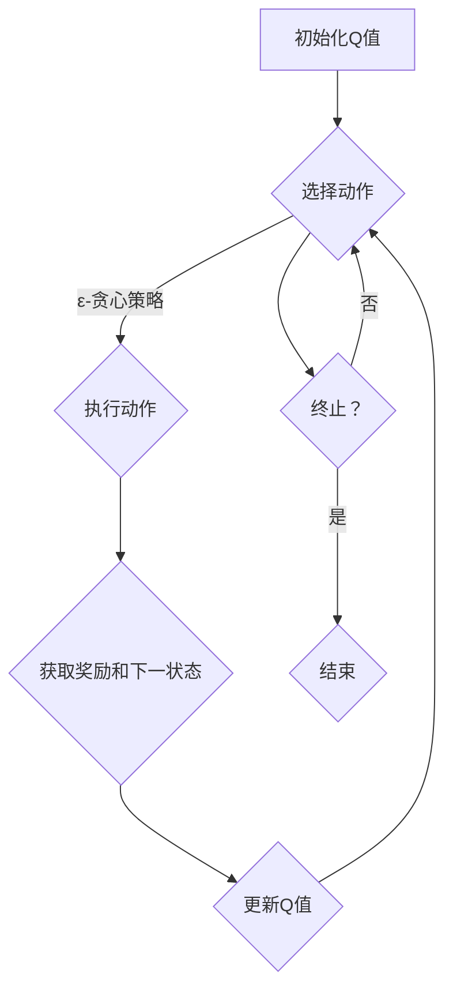
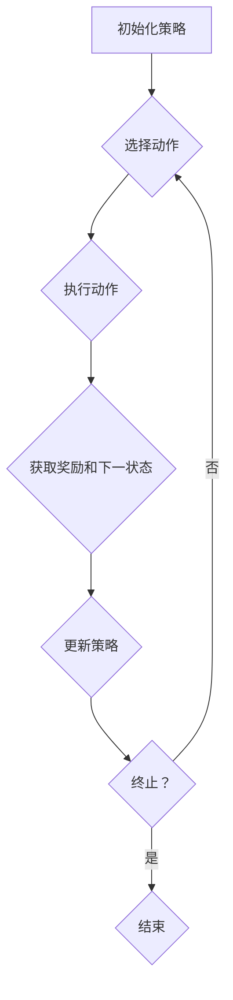
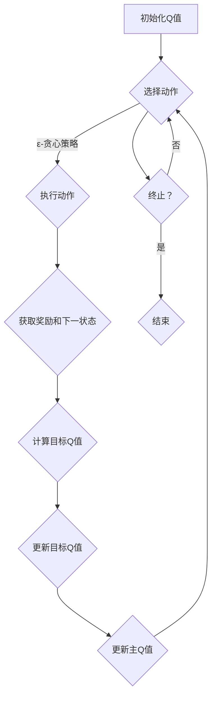
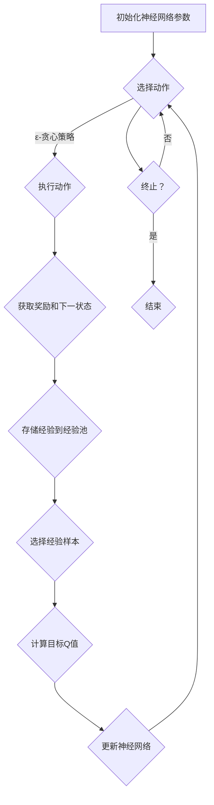

                 

### 《强化学习：策略迭代与价值迭代》

> **关键词**：强化学习，策略迭代，价值迭代，Q-学习，SARSA，深度Q网络（DQN），双重Q网络（DDQN），集成策略网络（A3C），应用案例。

> **摘要**：本文将深入探讨强化学习中的策略迭代与价值迭代两大核心算法。通过对策略迭代与价值迭代的原理、算法实现、性能分析及实际应用案例的详细讲解，帮助读者全面理解这两种算法在强化学习中的重要性。同时，本文还将介绍深度强化学习中的相关算法，以及强化学习在不同领域的实际应用。

#### 目录

1. **强化学习基础理论**
   - **第1章：强化学习概述**
     - 1.1 强化学习的基本概念
     - 1.2 强化学习与监督学习、无监督学习的区别
     - 1.3 强化学习的主要问题与挑战
   - **第2章：强化学习的数学基础**
     - 2.1 离散时间马尔可夫决策过程（MDP）
     - 2.2 连续时间马尔可夫决策过程
     - 2.3 动机和奖励函数
   - **第3章：强化学习中的策略**
     - 3.1 贪心策略与最佳响应策略
     - 3.2 策略评估与策略改进
     - 3.3 动态规划与价值函数

2. **策略迭代算法**
   - **第4章：策略迭代的基本原理**
     - 4.1 策略迭代算法的概念
     - 4.2 策略迭代算法的迭代步骤
     - 4.3 策略迭代算法的性能分析
   - **第5章：Q-学习算法**
     - 5.1 Q-学习算法的基本原理
     - 5.2 Q-学习算法的伪代码实现
     - 5.3 Q-学习算法的性能分析
   - **第6章：SARSA算法**
     - 6.1 SARSA算法的基本原理
     - 6.2 SARSA算法的伪代码实现
     - 6.3 SARSA算法的性能分析

3. **价值迭代算法**
   - **第7章：价值迭代的基本原理**
     - 7.1 价值迭代算法的概念
     - 7.2 价值迭代算法的迭代步骤
     - 7.3 价值迭代算法的性能分析
   - **第8章：优势值迭代算法**
     - 8.1 优势值迭代算法的基本原理
     - 8.2 优势值迭代算法的伪代码实现
     - 8.3 优势值迭代算法的性能分析
   - **第9章：深度强化学习中的价值迭代算法**
     - 9.1 深度Q网络（DQN）算法
     - 9.2 双重Q网络（DDQN）算法
     - 9.3 集成策略网络（A3C）算法

4. **强化学习应用案例**
   - **第10章：强化学习在游戏中的应用**
     - 10.1 游戏强化学习的挑战
     - 10.2 Atari游戏案例解析
     - 10.3 Proximal Policy Optimization算法在游戏中的应用
   - **第11章：强化学习在机器人控制中的应用**
     - 11.1 机器人控制中的强化学习挑战
     - 11.2 强化学习在无人机路径规划中的应用
     - 11.3 强化学习在工业机器人控制中的应用
   - **第12章：强化学习在推荐系统中的应用**
     - 12.1 推荐系统中的强化学习挑战
     - 12.2 强化学习在个性化推荐中的应用
     - 12.3 强化学习在广告投放中的应用

5. **附录**
   - **附录A：强化学习资源与工具**
   - **附录B：强化学习算法 Mermaid 流程图**

---

接下来，我们将分别对强化学习中的策略迭代与价值迭代进行详细讲解，帮助读者深入理解这两种算法的基本概念、实现原理及性能分析。通过本篇文章的深入探讨，相信读者将能够全面掌握强化学习中的核心算法，并为今后的研究和应用奠定坚实的基础。

---

## 第一部分：强化学习基础理论

### 第1章：强化学习概述

#### 1.1 强化学习的基本概念

强化学习（Reinforcement Learning，简称RL）是机器学习的一个重要分支，主要研究如何通过智能体（agent）在与环境（environment）的交互过程中，学习到一种最优策略（policy），以实现某一目标（objective）。与监督学习和无监督学习不同，强化学习的主要特点是试错（trial-and-error）和延迟奖励（delayed reward）。

在强化学习中，智能体通过接收环境的状态（state）信息，选择一个动作（action），执行后获得环境的反馈，包括新的状态信息和奖励（reward）。通过不断的试错和反馈，智能体逐渐优化其策略，以期达到预定的目标。强化学习的核心任务是寻找一种策略，使智能体在长期运行中获得的累积奖励最大化。

强化学习的基本组成包括以下几个方面：

- **智能体（Agent）**：执行动作并接收环境反馈的主体。
- **环境（Environment）**：智能体所处的环境，可以看作是一个状态转换模型和奖励函数的集合。
- **状态（State）**：智能体在某一时刻所处的状况，可以用一个状态向量表示。
- **动作（Action）**：智能体可以执行的操作，通常用一个动作空间表示。
- **策略（Policy）**：智能体在给定状态下选择动作的规则，可以用一个概率分布来表示。
- **价值函数（Value Function）**：评估策略优劣的函数，用于指导智能体的决策。
- **奖励（Reward）**：智能体执行某一动作后从环境中获得的即时反馈。

#### 1.2 强化学习与监督学习、无监督学习的区别

强化学习与监督学习（Supervised Learning）和无监督学习（Unsupervised Learning）在目标、数据集和训练方法上存在显著差异。

- **监督学习**：监督学习是一种有监督的机器学习方法，目标是通过已知的输入和输出数据集训练模型，然后在新数据上预测输出。监督学习的特点在于其输入和输出是已知的，并且模型可以通过优化损失函数（如均方误差、交叉熵等）来调整参数，以达到最小化预测误差的目的。常见的监督学习算法包括线性回归、决策树、支持向量机（SVM）、神经网络等。

- **无监督学习**：无监督学习是一种无监督的机器学习方法，目标是从未标记的数据中发现隐藏的结构或模式。无监督学习不需要已知的输入和输出数据，而是通过模型内部的数据表示来揭示数据之间的相似性和差异性。常见的无监督学习算法包括聚类（如K-Means、层次聚类）、降维（如主成分分析、t-SNE）和生成模型（如自编码器、生成对抗网络（GAN））。

- **强化学习**：强化学习是一种通过试错和反馈来学习的无监督学习方式，其目标是找到一种最优策略，使智能体在长期运行中获得的累积奖励最大化。强化学习与监督学习和无监督学习的主要区别在于其训练目标和数据形式。在强化学习中，智能体需要通过与环境的交互来获取状态和奖励信息，并通过策略迭代来调整其行为，从而实现优化目标。

#### 1.3 强化学习的主要问题与挑战

强化学习虽然具有广泛的应用前景，但同时也面临着许多问题和挑战。以下是一些主要的问题和挑战：

- **探索与利用的权衡**：在强化学习中，智能体需要在探索（exploration，即尝试新的动作）和利用（exploitation，即利用已有知识进行决策）之间做出权衡。探索过多可能导致学习效率低下，而利用过多则可能错过最佳策略。如何平衡探索与利用是强化学习中的一个重要问题。

- **稀疏奖励问题**：在某些任务中，智能体可能需要经历大量的尝试才能获得一次奖励，这种情况下，奖励显得非常稀疏。稀疏奖励问题可能导致智能体无法在有限的时间内找到最佳策略，从而影响学习效果。

- **持续学习问题**：在动态环境中，环境可能会发生变化，智能体需要不断更新其策略。然而，由于历史经验数据的有限性，智能体很难适应所有可能的环境变化，这可能导致持续学习问题。

- **模型选择与参数调优**：强化学习算法的性能在很大程度上取决于模型选择和参数设置。然而，如何选择合适的模型和参数，以及如何进行调优，仍然是一个具有挑战性的问题。

- **可解释性**：强化学习模型通常具有高度的复杂性，这使得其决策过程往往难以解释。在某些应用场景中，如医疗和金融领域，可解释性是非常重要的，因此如何提高强化学习模型的可解释性是一个重要的研究方向。

### 小结

本章对强化学习的基本概念、强化学习与监督学习、无监督学习的区别以及强化学习的主要问题与挑战进行了详细阐述。通过本章的学习，读者可以全面了解强化学习的基本原理和特点，为后续章节的学习打下基础。在接下来的章节中，我们将进一步探讨强化学习的数学基础和策略迭代与价值迭代算法，帮助读者深入理解强化学习的核心理论和应用。

---

## 第2章：强化学习的数学基础

#### 2.1 离散时间马尔可夫决策过程（MDP）

强化学习的一个重要数学工具是马尔可夫决策过程（Markov Decision Process，MDP）。MDP是一种数学模型，用于描述智能体在不确定环境中做出决策的过程。在MDP中，智能体需要在一系列状态中选择动作，以实现长期的目标。

一个MDP可以形式化地定义为五元组 \( (S, A, P, R, \gamma) \)，其中：

- \( S \) 是状态空间，表示所有可能的状态集合。
- \( A \) 是动作空间，表示所有可能的动作集合。
- \( P \) 是状态转移概率矩阵，定义了在给定当前状态和执行特定动作后，智能体转移到下一个状态的概率分布。
- \( R \) 是奖励函数，表示在给定状态和执行特定动作后，智能体获得的即时奖励。
- \( \gamma \) 是折扣因子，表示对未来奖励的折现程度，通常取值在 \( (0, 1) \) 之间。

具体来说，MDP可以通过以下公式表示：

\[ P(s'|s, a) = P(s'|s, a) \]

其中，\( P(s'|s, a) \) 表示在状态 \( s \) 下执行动作 \( a \) 后，智能体转移到状态 \( s' \) 的概率。奖励函数 \( R(s, a) \) 可以表示为：

\[ R(s, a) = R(s, a) \]

其中，\( R(s, a) \) 表示在状态 \( s \) 下执行动作 \( a \) 后，智能体获得的即时奖励。

#### 2.2 连续时间马尔可夫决策过程

除了离散时间马尔可夫决策过程（MDP），连续时间马尔可夫决策过程（Continuous Time Markov Decision Process，CTMDP）也是强化学习中的一种重要模型。与MDP类似，CTMDP描述了智能体在连续时间环境中的决策过程。然而，与MDP不同，CTMDP中的状态和动作可以是连续的，这使得模型更加灵活。

一个CTMDP可以形式化地定义为五元组 \( (S, A, P, R, \gamma) \)，其中：

- \( S \) 是状态空间，表示所有可能的状态集合。
- \( A \) 是动作空间，表示所有可能的动作集合。
- \( P \) 是状态转移概率密度函数，定义了在给定当前状态和执行特定动作后，智能体转移到下一个状态的概率密度函数。
- \( R \) 是奖励函数，表示在给定状态和执行特定动作后，智能体获得的即时奖励。
- \( \gamma \) 是折扣因子，表示对未来奖励的折现程度。

在CTMDP中，状态转移概率密度函数 \( P(s'|s, a) \) 可以表示为：

\[ P(s'|s, a) = P(s'|s, a) \]

其中，\( P(s'|s, a) \) 表示在状态 \( s \) 下执行动作 \( a \) 后，智能体转移到状态 \( s' \) 的概率密度函数。奖励函数 \( R(s, a) \) 可以表示为：

\[ R(s, a) = R(s, a) \]

其中，\( R(s, a) \) 表示在状态 \( s \) 下执行动作 \( a \) 后，智能体获得的即时奖励。

#### 2.3 动机和奖励函数

在强化学习中，动机和奖励函数是两个重要的概念，用于引导智能体的行为和评估策略的优劣。

- **动机（Motivation）**：动机是指智能体在决策过程中追求的目标或期望。在强化学习中，动机通常是通过奖励函数来体现的。奖励函数定义为在给定状态和动作下，智能体获得的即时奖励。奖励函数的设计对于强化学习的效果至关重要。

- **奖励函数（Reward Function）**：奖励函数是一个实值函数，用于衡量智能体在执行特定动作后所获得的即时收益。奖励函数可以是正的、负的或零，表示智能体的行为是好是坏。一个良好的奖励函数应具有以下特点：

  - **一致性（Consistency）**：在相同的状态和动作下，奖励函数应保持一致，以确保智能体的学习过程不会受到奖励的不确定性干扰。
  - **及时性（Timeliness）**：奖励函数应能够及时反映智能体的行为结果，以便智能体能够快速调整其策略。
  - **适度性（Appropriateness）**：奖励函数的幅度应适中，以确保智能体不会因为追求高奖励而忽略长期目标。

在强化学习中，奖励函数通常与动机紧密相关。例如，在游戏场景中，动机可能是赢得比赛，奖励函数可以是赢得比赛的分数。在机器人控制场景中，动机可能是达到目标位置，奖励函数可以是到达目标位置的精度。

通过设计合适的奖励函数，智能体可以在与环境的交互过程中逐渐学习到最优策略，从而实现长期目标。然而，设计一个良好的奖励函数并不容易，需要根据具体应用场景和目标进行仔细考虑和调整。

### 小结

本章介绍了强化学习中的两个重要数学基础：离散时间马尔可夫决策过程（MDP）和连续时间马尔可夫决策过程（CTMDP）。通过理解MDP和CTMDP的基本概念和数学模型，读者可以更好地把握强化学习中的决策过程和策略优化方法。此外，本章还讨论了动机和奖励函数的概念及其在强化学习中的应用，为后续章节的学习奠定了基础。在接下来的章节中，我们将进一步探讨强化学习中的策略和价值函数，帮助读者深入理解强化学习的核心理论和算法。

---

## 第3章：强化学习中的策略

#### 3.1 贪心策略与最佳响应策略

在强化学习中，策略（Policy）是智能体在给定状态下选择动作的规则。根据策略的形式，可以将策略分为贪心策略（Greedy Policy）和最佳响应策略（Best Response Policy）。这两种策略是强化学习中非常重要的概念，对于智能体的决策过程有着重要的影响。

**贪心策略（Greedy Policy）**

贪心策略是一种常用的策略，其核心思想是智能体在给定状态下选择当前最优动作。具体来说，贪心策略通过评估每个动作在当前状态下的价值，选择具有最大价值的动作执行。贪心策略可以形式化地表示为：

\[ \pi(s) = \arg\max_{a} Q(s, a) \]

其中，\( Q(s, a) \) 表示在状态 \( s \) 下执行动作 \( a \) 的即时回报。这个公式表明，贪心策略选择动作 \( a \)，使得 \( Q(s, a) \) 在所有可能动作中取最大值。

贪心策略的优点是简单直观，易于实现。然而，贪心策略也存在一些局限性。首先，贪心策略在初始阶段可能无法探索到最优策略，因为它仅根据当前状态选择动作，忽略了未来的奖励。其次，贪心策略在面临不确定性环境时，可能会陷入局部最优，无法达到全局最优解。

**最佳响应策略（Best Response Policy）**

最佳响应策略是另一种重要的策略，其核心思想是智能体在给定状态下选择当前最优动作，以应对对手的行为。在博弈论中，最佳响应策略也被称为纳什均衡（Nash Equilibrium）。在强化学习中，最佳响应策略通常用于多智能体系统，其中每个智能体都试图最大化自己的收益。

最佳响应策略可以形式化地表示为：

\[ \pi(s) = \arg\max_{a} \sum_{s'} P(s'|s, a) R(s', a) \]

其中，\( P(s'|s, a) \) 表示在状态 \( s \) 下执行动作 \( a \) 后，智能体转移到状态 \( s' \) 的概率，\( R(s', a) \) 表示在状态 \( s' \) 下执行动作 \( a \) 后，智能体获得的即时奖励。

最佳响应策略的优点在于，它能够在多智能体系统中找到一种均衡策略，使得每个智能体都无法通过单方面改变策略来提高自己的收益。然而，最佳响应策略的计算复杂度较高，特别是在状态和动作空间较大时，计算量会显著增加。

**贪心策略与最佳响应策略的比较**

贪心策略和最佳响应策略在强化学习中都发挥着重要作用，但它们也存在一些差异。首先，贪心策略侧重于当前状态下的最优动作，而最佳响应策略则侧重于整个系统的最优策略。其次，贪心策略易于实现，但可能面临局部最优问题，而最佳响应策略计算复杂度较高，但能够找到全局最优解。

在实际应用中，根据具体问题和需求，可以选择不同的策略。对于单智能体系统，贪心策略是一种常用的选择，因为它简单直观且易于实现。对于多智能体系统，最佳响应策略可能是更好的选择，因为它能够找到系统的全局最优解。

### 3.2 策略评估与策略改进

在强化学习中，策略评估（Policy Evaluation）和策略改进（Policy Improvement）是两个重要的步骤，用于优化智能体的策略。策略评估旨在评估当前策略的价值，而策略改进则基于策略评估的结果，选择一个新的策略。

**策略评估**

策略评估的目的是计算在给定策略下，智能体在长期运行中获得的期望回报。策略评估可以通过价值函数（Value Function）来实现。价值函数是一种评估策略优劣的函数，用于指导智能体的决策。

在强化学习中，常见的价值函数包括状态价值函数（State Value Function）和动作价值函数（Action Value Function）。状态价值函数表示在给定状态和策略下，智能体获得的期望回报。动作价值函数表示在给定状态和策略下，执行特定动作获得的期望回报。

状态价值函数可以表示为：

\[ V^{\pi}(s) = \sum_{s'} P(s'|s, \pi(s)) R(s', \pi(s)) + \gamma \sum_{s'} P(s'|s, \pi(s)) V^{\pi}(s') \]

其中，\( P(s'|s, \pi(s)) \) 表示在状态 \( s \) 下，按照策略 \( \pi \) 执行动作后转移到状态 \( s' \) 的概率，\( R(s', \pi(s)) \) 表示在状态 \( s' \) 下，按照策略 \( \pi \) 执行动作后获得的即时奖励，\( \gamma \) 是折扣因子。

动作价值函数可以表示为：

\[ Q^{\pi}(s, a) = \sum_{s'} P(s'|s, a) R(s', a) + \gamma \sum_{s'} P(s'|s, a) V^{\pi}(s') \]

其中，\( P(s'|s, a) \) 表示在状态 \( s \) 下，执行动作 \( a \) 后转移到状态 \( s' \) 的概率，\( R(s', a) \) 表示在状态 \( s' \) 下，执行动作 \( a \) 后获得的即时奖励。

**策略改进**

策略改进的目的是选择一个新的策略，使得智能体在长期运行中获得的期望回报最大化。策略改进可以通过策略迭代（Policy Iteration）或值迭代（Value Iteration）来实现。

策略迭代的基本思想是，先使用当前策略进行策略评估，然后根据评估结果选择一个新的策略，并重复上述过程，直到策略收敛。具体步骤如下：

1. 初始化策略 \( \pi \)。
2. 使用策略 \( \pi \) 计算当前的价值函数 \( V^{\pi} \)。
3. 使用新的价值函数 \( V^{\pi} \) 计算新的策略 \( \pi' \)。
4. 重复步骤2和步骤3，直到策略收敛。

值迭代的基本思想是，直接计算最优策略的价值函数，然后根据价值函数选择最优策略。具体步骤如下：

1. 初始化价值函数 \( V \)。
2. 对价值函数 \( V \) 进行更新，直到收敛。
3. 根据最优价值函数选择最优策略。

**策略评估与策略改进的比较**

策略评估和策略改进都是强化学习中重要的步骤，但它们也有一定的差异。策略评估主要关注当前策略的评估，而策略改进则关注如何选择一个新的策略。策略评估可以通过价值函数来实现，而策略改进可以通过策略迭代或值迭代来实现。

在实际应用中，根据具体问题和需求，可以选择不同的策略评估和策略改进方法。对于简单的环境，策略评估和策略改进可以快速收敛，而对于复杂的环境，可能需要更长时间才能收敛。

### 小结

本章介绍了强化学习中的两种重要策略：贪心策略和最佳响应策略，以及策略评估和策略改进的方法。通过理解这些策略和方法，读者可以更好地掌握强化学习中的决策过程和策略优化方法。在接下来的章节中，我们将进一步探讨强化学习中的价值函数和算法，帮助读者深入理解强化学习的核心理论和应用。

---

## 第二部分：策略迭代算法

### 第4章：策略迭代的基本原理

#### 4.1 策略迭代算法的概念

策略迭代（Policy Iteration）算法是强化学习中一种重要的策略优化方法。策略迭代算法的核心思想是通过迭代更新策略，逐步优化智能体的行为，从而实现最佳策略的寻找。策略迭代算法可以分为两个主要步骤：策略评估（Policy Evaluation）和策略改进（Policy Improvement）。

策略评估（Policy Evaluation）的目的是计算当前策略的价值函数，即评估策略在给定状态下能够带来的期望回报。通过策略评估，我们可以了解当前策略的优劣，为策略改进提供依据。

策略改进（Policy Improvement）的目的是根据策略评估的结果，选择一个新的策略，使得智能体在长期运行中获得的期望回报最大化。策略改进通常通过更新策略的概率分布来实现。

策略迭代算法的基本过程可以概括为以下步骤：

1. **初始化策略**：选择一个初始策略，通常采用均匀分布策略。
2. **策略评估**：使用当前策略计算状态价值函数，直到收敛。
3. **策略改进**：根据状态价值函数更新策略，选择具有更高期望回报的动作。
4. **重复步骤2和步骤3**，直到策略收敛或达到预设的迭代次数。

策略迭代算法的关键在于策略评估和策略改进的迭代过程，通过不断的评估和改进，逐步优化智能体的策略，实现最佳策略的寻找。

#### 4.2 策略迭代算法的迭代步骤

策略迭代算法的迭代步骤可以分为以下几个主要阶段：

**阶段1：初始化策略**

初始化策略是策略迭代算法的第一步，选择一个初始策略。通常，我们可以采用均匀分布策略，即每个动作的概率相等。初始化策略的目的是为后续的迭代过程提供一个起点。

**阶段2：策略评估**

策略评估的目的是计算当前策略下的状态价值函数。状态价值函数表示在给定策略下，智能体在某一状态下能够获得的期望回报。策略评估可以通过迭代更新价值函数来实现。

具体来说，策略评估的步骤如下：

1. 初始化价值函数 \( V \)，通常设置为较小的值。
2. 对价值函数 \( V \) 进行更新，直到收敛。

价值函数的更新公式可以表示为：

\[ V_{t+1}(s) = \sum_{a} \pi(a|s) \sum_{s'} p(s'|s, a) [r(s', a) + \gamma V_t(s')] \]

其中，\( V_t(s) \) 表示第 \( t \) 次迭代的值函数，\( \pi(a|s) \) 表示在状态 \( s \) 下，按照策略 \( \pi \) 执行动作 \( a \) 的概率，\( p(s'|s, a) \) 表示在状态 \( s \) 下，执行动作 \( a \) 后转移到状态 \( s' \) 的概率，\( r(s', a) \) 表示在状态 \( s' \) 下，执行动作 \( a \) 后获得的即时奖励，\( \gamma \) 是折扣因子。

**阶段3：策略改进**

策略改进的目的是根据策略评估的结果，选择一个新的策略，使得智能体在长期运行中获得的期望回报最大化。策略改进可以通过更新策略的概率分布来实现。

具体来说，策略改进的步骤如下：

1. 根据当前的价值函数 \( V \) 计算每个动作的价值函数 \( Q \)。
2. 选择具有最大价值函数的动作作为新的策略。

新的策略可以表示为：

\[ \pi'(s) = \arg\max_a Q(s, a) \]

其中，\( Q(s, a) \) 表示在状态 \( s \) 下，执行动作 \( a \) 的价值函数。

**阶段4：重复策略评估和策略改进**

策略迭代算法的核心在于重复执行策略评估和策略改进的过程，逐步优化智能体的策略。重复执行策略评估和策略改进的步骤，直到策略收敛或达到预设的迭代次数。

**策略收敛性**

策略迭代算法的一个重要特性是其收敛性。当策略迭代算法达到一定次数后，策略将逐渐趋于稳定，即新策略与当前策略的差距逐渐减小。策略迭代算法的收敛性可以通过以下条件保证：

1. 状态转移概率矩阵 \( P \) 是稳定的。
2. 奖励函数 \( R \) 是有限的。
3. 折扣因子 \( \gamma \) 满足 \( 0 < \gamma < 1 \)。

当上述条件满足时，策略迭代算法可以收敛到最优策略。

#### 4.3 策略迭代算法的性能分析

策略迭代算法的性能分析主要涉及收敛速度和计算复杂度。以下是对策略迭代算法性能的分析：

**收敛速度**

策略迭代算法的收敛速度取决于状态空间和动作空间的大小。在状态空间和动作空间较大时，策略迭代算法可能需要较多的迭代次数才能收敛。然而，策略迭代算法的收敛速度通常是线性的，即随着迭代次数的增加，策略的改进速度逐渐减小。

**计算复杂度**

策略迭代算法的计算复杂度主要与状态空间和动作空间的大小有关。具体来说，计算复杂度可以表示为：

\[ O((|S| + |A|) \times \text{迭代次数}) \]

其中，\(|S|\) 表示状态空间的大小，\(|A|\) 表示动作空间的大小，迭代次数是策略迭代算法达到收敛所需的次数。

在状态空间和动作空间较大时，策略迭代算法的计算复杂度可能较高。然而，通过采用有效的策略评估和策略改进方法，可以降低计算复杂度，提高算法的运行效率。

**策略迭代算法的应用**

策略迭代算法在强化学习中有着广泛的应用。以下是一些常见的应用场景：

1. **游戏**：策略迭代算法可以用于游戏中的智能体决策，如棋类游戏、格斗游戏等。通过策略迭代算法，智能体可以学习到最优策略，提高游戏水平。
2. **机器人控制**：策略迭代算法可以用于机器人路径规划和运动控制。通过策略迭代算法，机器人可以学习到最优运动策略，实现自主导航和避障。
3. **推荐系统**：策略迭代算法可以用于推荐系统中的用户行为预测和推荐策略优化。通过策略迭代算法，推荐系统可以学习到最优推荐策略，提高用户满意度。

**小结**

策略迭代算法是强化学习中一种重要的策略优化方法，通过迭代更新策略，逐步优化智能体的行为，实现最佳策略的寻找。本章详细介绍了策略迭代算法的基本原理、迭代步骤以及性能分析。通过本章的学习，读者可以深入理解策略迭代算法的原理和应用，为后续章节的学习打下基础。在接下来的章节中，我们将进一步探讨强化学习中的其他重要算法，帮助读者全面掌握强化学习的核心理论和应用。

---

## 第5章：Q-学习算法

Q-学习算法（Q-Learning）是强化学习中的一个核心算法，其基本思想是通过学习状态-动作价值函数 \( Q(s, a) \)，在给定状态下选择最优动作。Q-学习算法是一种无模型（model-free）的算法，不依赖于环境的模型，通过试错和经验积累来学习最优策略。

### 5.1 Q-学习算法的基本原理

Q-学习算法的基本原理可以概括为以下几个步骤：

1. **初始化**：初始化状态-动作价值函数 \( Q(s, a) \)，通常设为较小的值。初始化策略 \( \pi(s) \)，通常为随机策略。

2. **选择动作**：在给定状态 \( s \) 下，根据当前策略 \( \pi(s) \) 选择动作 \( a \)。

3. **执行动作**：执行选择的动作 \( a \)，智能体得到新的状态 \( s' \) 和即时奖励 \( r(s, a) \)。

4. **更新价值函数**：根据新的状态 \( s' \) 和即时奖励 \( r(s, a) \)，更新状态-动作价值函数 \( Q(s, a) \)。

5. **重复步骤2-4**，直到策略收敛或达到预设的迭代次数。

Q-学习算法的核心更新公式为：

\[ Q(s, a) \leftarrow Q(s, a) + \alpha [r(s, a) + \gamma \max_{a'} Q(s', a') - Q(s, a)] \]

其中，\( \alpha \) 是学习率（learning rate），用于调节新旧经验的权重，\( \gamma \) 是折扣因子（discount factor），用于平衡当前奖励和未来奖励的关系，\( r(s, a) \) 是即时奖励，\( Q(s', a') \) 是在新的状态 \( s' \) 下执行最优动作 \( a' \) 的价值函数。

### 5.2 Q-学习算法的伪代码实现

以下是一个简单的Q-学习算法的伪代码实现：

```python
# 初始化
Q(s, a) = 0
# 设置学习率和折扣因子
alpha = 0.1
gamma = 0.9
# 迭代次数
num_episodes = 1000

for episode in range(num_episodes):
    # 初始化状态
    s = env.reset()
    done = False
    
    while not done:
        # 选择动作
        a = argmax_a(Q(s, a))
        # 执行动作
        s', r, done, _ = env.step(a)
        # 更新价值函数
        Q(s, a) = Q(s, a) + alpha * (r + gamma * max(Q(s', a')) - Q(s, a))
        # 更新状态
        s = s'
```

在伪代码中，`argmax_a(Q(s, a))` 表示选择具有最大价值函数的动作，`env.reset()` 和 `env.step(a)` 分别表示重置环境和执行动作。

### 5.3 Q-学习算法的性能分析

Q-学习算法的性能分析主要涉及收敛速度和稳定性。以下是对Q-学习算法性能的分析：

**收敛速度**

Q-学习算法的收敛速度取决于学习率和折扣因子。当学习率 \( \alpha \) 和折扣因子 \( \gamma \) 选择合适时，Q-学习算法可以较快地收敛到最优策略。然而，过高的学习率可能导致算法的不稳定，而过低的学习率可能导致收敛速度较慢。

**稳定性**

Q-学习算法的稳定性受到环境变化的影响。在稳定的环境下，Q-学习算法可以稳定地学习到最优策略。然而，在非稳定的环境下，Q-学习算法可能需要较长时间才能收敛，甚至可能无法收敛。

**Q-学习算法的改进**

为了提高Q-学习算法的性能，可以采用以下几种改进方法：

1. **双Q学习（Double Q-Learning）**：双Q学习算法通过使用两个独立的价值函数 \( Q_1(s, a) \) 和 \( Q_2(s, a) \) 来避免值函数偏差。双Q学习算法的核心思想是在更新 \( Q_1 \) 时使用 \( Q_2 \) 的估计，反之亦然。

2. **经验回放（Experience Replay）**：经验回放算法通过将智能体经历的状态-动作对存储在一个经验池中，然后随机地从经验池中抽取样本进行学习。经验回放算法可以减少样本的相关性，提高学习效果。

3. **优先级采样（Prioritized Sampling）**：优先级采样算法通过根据样本的误差大小对样本进行排序，优先学习误差较大的样本。优先级采样算法可以加速学习过程，提高学习效果。

**Q-学习算法的应用**

Q-学习算法在强化学习中有着广泛的应用。以下是一些常见的应用场景：

1. **游戏**：Q-学习算法可以用于游戏中的智能体决策，如棋类游戏、格斗游戏等。通过Q-学习算法，智能体可以学习到最优策略，提高游戏水平。

2. **机器人控制**：Q-学习算法可以用于机器人路径规划和运动控制。通过Q-学习算法，机器人可以学习到最优运动策略，实现自主导航和避障。

3. **推荐系统**：Q-学习算法可以用于推荐系统中的用户行为预测和推荐策略优化。通过Q-学习算法，推荐系统可以学习到最优推荐策略，提高用户满意度。

**小结**

Q-学习算法是强化学习中的一个重要算法，通过学习状态-动作价值函数，实现最优策略的寻找。本章详细介绍了Q-学习算法的基本原理、伪代码实现以及性能分析。通过本章的学习，读者可以深入理解Q-学习算法的原理和应用，为后续章节的学习打下基础。在接下来的章节中，我们将进一步探讨强化学习中的其他重要算法，帮助读者全面掌握强化学习的核心理论和应用。

---

## 第6章：SARSA算法

SARSA算法（State-Action-Reward-State-Action，简称SARSA）是强化学习中的另一种重要算法，它属于策略算法（Policy-Based Learning），通过迭代更新策略以实现最优策略。SARSA算法的核心思想是在每一步都根据当前状态和采取的动作来更新策略，这使得算法能够在训练过程中逐步调整行为，从而提高智能体的表现。

### 6.1 SARSA算法的基本原理

SARSA算法的基本原理可以概括为以下几个步骤：

1. **初始化**：初始化策略 \( \pi \) 和状态-动作价值函数 \( Q(s, a) \)，通常设为较小的值。

2. **选择动作**：在给定状态 \( s \) 下，根据当前策略 \( \pi \) 选择动作 \( a \)。

3. **执行动作**：执行选择的动作 \( a \)，智能体得到新的状态 \( s' \) 和即时奖励 \( r(s, a) \)。

4. **更新策略**：根据新的状态 \( s' \) 和即时奖励 \( r(s, a) \)，更新策略 \( \pi \)。

5. **重复步骤2-4**，直到策略收敛或达到预设的迭代次数。

SARSA算法的核心更新公式为：

\[ \pi(s, a) \leftarrow \pi(s, a) + \alpha [r(s, a) + \gamma \max_{a'} Q(s', a') - \pi(s, a)] \]

其中，\( \alpha \) 是学习率（learning rate），用于调节新旧经验的权重，\( \gamma \) 是折扣因子（discount factor），用于平衡当前奖励和未来奖励的关系，\( r(s, a) \) 是即时奖励，\( Q(s', a') \) 是在新的状态 \( s' \) 下执行最优动作 \( a' \) 的价值函数。

### 6.2 SARSA算法的伪代码实现

以下是一个简单的SARSA算法的伪代码实现：

```python
# 初始化
Q(s, a) = 0
# 设置学习率和折扣因子
alpha = 0.1
gamma = 0.9
# 迭代次数
num_episodes = 1000

for episode in range(num_episodes):
    # 初始化状态
    s = env.reset()
    done = False
    
    while not done:
        # 选择动作
        a = argmax_a(Q(s, a))
        # 执行动作
        s', r, done, _ = env.step(a)
        # 更新策略
        Q(s, a) = Q(s, a) + alpha * (r + gamma * max(Q(s', a')) - Q(s, a))
        # 更新状态
        s = s'
```

在伪代码中，`argmax_a(Q(s, a))` 表示选择具有最大价值函数的动作，`env.reset()` 和 `env.step(a)` 分别表示重置环境和执行动作。

### 6.3 SARSA算法的性能分析

SARSA算法的性能分析主要涉及收敛速度和稳定性。以下是对SARSA算法性能的分析：

**收敛速度**

SARSA算法的收敛速度取决于学习率和折扣因子。当学习率 \( \alpha \) 和折扣因子 \( \gamma \) 选择合适时，SARSA算法可以较快地收敛到最优策略。然而，过高的学习率可能导致算法的不稳定，而过低的学习率可能导致收敛速度较慢。

**稳定性**

SARSA算法的稳定性受到环境变化的影响。在稳定的环境下，SARSA算法可以稳定地学习到最优策略。然而，在非稳定的环境下，SARSA算法可能需要较长时间才能收敛，甚至可能无法收敛。

**SARSA算法的改进**

为了提高SARSA算法的性能，可以采用以下几种改进方法：

1. **SARSA(lambda)算法**：SARSA(lambda)算法引入了探索系数 \( \lambda \)（exploration parameter），用于调节探索和利用的平衡。通过使用经验回放（Experience Replay），SARSA(lambda)算法可以更好地处理连续状态和动作空间，提高学习效果。

2. **使用近似方法**：对于高维状态和动作空间，直接计算 \( Q(s, a) \) 可能会非常复杂。可以使用近似方法，如神经网络，来逼近状态-动作价值函数 \( Q(s, a) \)。

3. **双重SARSA算法**：双重SARSA算法通过使用两个独立的策略 \( \pi_1 \) 和 \( \pi_2 \)，来避免策略偏差。双重SARSA算法的核心思想是在更新一个策略时，使用另一个策略的估计。

**SARSA算法的应用**

SARSA算法在强化学习中有着广泛的应用。以下是一些常见的应用场景：

1. **游戏**：SARSA算法可以用于游戏中的智能体决策，如棋类游戏、格斗游戏等。通过SARSA算法，智能体可以学习到最优策略，提高游戏水平。

2. **机器人控制**：SARSA算法可以用于机器人路径规划和运动控制。通过SARSA算法，机器人可以学习到最优运动策略，实现自主导航和避障。

3. **推荐系统**：SARSA算法可以用于推荐系统中的用户行为预测和推荐策略优化。通过SARSA算法，推荐系统可以学习到最优推荐策略，提高用户满意度。

**小结**

SARSA算法是强化学习中的一个重要算法，通过迭代更新策略，实现最优策略的寻找。本章详细介绍了SARSA算法的基本原理、伪代码实现以及性能分析。通过本章的学习，读者可以深入理解SARSA算法的原理和应用，为后续章节的学习打下基础。在接下来的章节中，我们将进一步探讨强化学习中的其他重要算法，帮助读者全面掌握强化学习的核心理论和应用。

---

## 第三部分：价值迭代算法

### 第7章：价值迭代的基本原理

#### 7.1 价值迭代算法的概念

价值迭代（Value Iteration）算法是强化学习中的一个核心算法，它通过迭代更新价值函数（Value Function）来逐步优化智能体的策略。价值迭代算法的基本思想是，在给定策略下，计算每个状态的价值函数，然后根据价值函数更新策略，从而逐步逼近最优策略。

价值函数分为状态价值函数（State Value Function，\( V(s) \)）和动作价值函数（Action Value Function，\( Q(s, a) \)）。状态价值函数表示在给定状态下，执行任意动作所能获得的期望回报；动作价值函数表示在给定状态下，执行特定动作所能获得的期望回报。

价值迭代算法的核心思想可以概括为以下几个步骤：

1. **初始化价值函数**：初始化价值函数 \( V(s) \) 或 \( Q(s, a) \)，通常设为较小的值。
2. **迭代更新价值函数**：使用更新公式对价值函数进行迭代更新，直到收敛。
3. **策略评估**：根据更新后的价值函数，评估当前策略的性能。
4. **策略改进**：根据策略评估的结果，选择新的策略。

价值迭代算法的更新公式为：

对于状态价值函数：

\[ V_{t+1}(s) = \sum_{a} \pi(a|s) \sum_{s'} p(s'|s, a) [r(s', a) + \gamma V_t(s')] \]

对于动作价值函数：

\[ Q_{t+1}(s, a) = \sum_{s'} p(s'|s, a) [r(s', a) + \gamma \max_{a'} Q_t(s', a')] \]

其中，\( V_t(s) \) 和 \( Q_t(s, a) \) 分别表示第 \( t \) 次迭代的值函数，\( \pi(a|s) \) 表示在状态 \( s \) 下，按照策略 \( \pi \) 执行动作 \( a \) 的概率，\( p(s'|s, a) \) 表示在状态 \( s \) 下，执行动作 \( a \) 后转移到状态 \( s' \) 的概率，\( r(s', a) \) 表示在状态 \( s' \) 下，执行动作 \( a \) 后获得的即时奖励，\( \gamma \) 是折扣因子。

#### 7.2 价值迭代算法的迭代步骤

价值迭代算法的迭代步骤可以分为以下几个主要阶段：

**阶段1：初始化价值函数**

初始化价值函数 \( V(s) \) 或 \( Q(s, a) \)，通常设为较小的值。初始化策略 \( \pi \)，通常为均匀分布策略。

**阶段2：迭代更新价值函数**

使用更新公式对价值函数进行迭代更新，直到收敛。迭代更新公式如上所述。

**阶段3：策略评估**

根据更新后的价值函数，评估当前策略 \( \pi \) 的性能。策略评估的目的是计算在当前策略下，每个状态的价值函数。

**阶段4：策略改进**

根据策略评估的结果，选择新的策略 \( \pi' \)。通常，新的策略是基于当前状态价值函数 \( V \) 或 \( Q \) 选择动作的概率分布。

**阶段5：重复阶段2-4**

重复迭代更新价值函数、策略评估和策略改进的过程，直到策略收敛或达到预设的迭代次数。

#### 7.3 价值迭代算法的性能分析

价值迭代算法的性能分析主要涉及收敛速度和计算复杂度。以下是对价值迭代算法性能的分析：

**收敛速度**

价值迭代算法的收敛速度取决于学习率和折扣因子。当学习率 \( \alpha \) 和折扣因子 \( \gamma \) 选择合适时，价值迭代算法可以较快地收敛到最优策略。然而，过高的学习率可能导致算法的不稳定，而过低的学习率可能导致收敛速度较慢。

**计算复杂度**

价值迭代算法的计算复杂度主要与状态空间和动作空间的大小有关。具体来说，计算复杂度可以表示为：

\[ O(|S| \times |A| \times \text{迭代次数}) \]

其中，\(|S|\) 表示状态空间的大小，\(|A|\) 表示动作空间的大小，迭代次数是价值迭代算法达到收敛所需的次数。

在状态空间和动作空间较大时，价值迭代算法的计算复杂度可能较高。然而，通过采用有效的策略评估和策略改进方法，可以降低计算复杂度，提高算法的运行效率。

**价值迭代算法的应用**

价值迭代算法在强化学习中有着广泛的应用。以下是一些常见的应用场景：

1. **游戏**：价值迭代算法可以用于游戏中的智能体决策，如棋类游戏、格斗游戏等。通过价值迭代算法，智能体可以学习到最优策略，提高游戏水平。

2. **机器人控制**：价值迭代算法可以用于机器人路径规划和运动控制。通过价值迭代算法，机器人可以学习到最优运动策略，实现自主导航和避障。

3. **推荐系统**：价值迭代算法可以用于推荐系统中的用户行为预测和推荐策略优化。通过价值迭代算法，推荐系统可以学习到最优推荐策略，提高用户满意度。

**小结**

价值迭代算法是强化学习中的一个重要算法，通过迭代更新价值函数，逐步优化智能体的策略。本章详细介绍了价值迭代算法的基本原理、迭代步骤以及性能分析。通过本章的学习，读者可以深入理解价值迭代算法的原理和应用，为后续章节的学习打下基础。在接下来的章节中，我们将进一步探讨强化学习中的其他重要算法，帮助读者全面掌握强化学习的核心理论和应用。

---

## 第8章：优势值迭代算法

#### 8.1 优势值迭代算法的基本原理

优势值迭代算法（ Advantage Value Iteration）是强化学习中的一个重要算法，它通过学习优势值函数（Advantage Function）来优化智能体的策略。优势值迭代算法的基本思想是，在给定状态和动作下，计算每个动作的优势值，并根据优势值更新策略，从而逐步逼近最优策略。

优势值函数（\( A(s, a) \)）表示在给定状态 \( s \) 下，执行动作 \( a \) 相对于执行其他动作的额外回报。优势值函数的定义如下：

\[ A(s, a) = Q(s, a) - V(s) \]

其中，\( Q(s, a) \) 是动作价值函数，表示在状态 \( s \) 下，执行动作 \( a \) 的期望回报；\( V(s) \) 是状态价值函数，表示在状态 \( s \) 下，执行任意动作的期望回报。

优势值迭代算法的核心思想是通过优势值函数来选择最优动作。在每次迭代中，算法会更新优势值函数，并根据优势值函数更新策略。具体来说，优势值迭代算法可以分为以下几个步骤：

1. **初始化优势值函数**：初始化优势值函数 \( A(s, a) \)，通常设为较小的值。

2. **迭代更新优势值函数**：使用更新公式对优势值函数进行迭代更新，直到收敛。更新公式如下：

\[ A_{t+1}(s, a) = r_t + \gamma \sum_{s'} p(s'|s, a) A_t(s', a) \]

其中，\( r_t \) 是在状态 \( s \) 下执行动作 \( a \) 后获得的即时奖励，\( \gamma \) 是折扣因子，\( p(s'|s, a) \) 是在状态 \( s \) 下执行动作 \( a \) 后转移到状态 \( s' \) 的概率。

3. **更新策略**：根据优势值函数 \( A(s, a) \)，更新策略 \( \pi(s) \)。更新公式如下：

\[ \pi_{t+1}(s, a) = \frac{1}{Z(s)} \sum_{a'} \exp(\lambda A_t(s, a')) \]

其中，\( Z(s) \) 是归一化常数，用于确保策略的概率分布总和为1，\( \lambda \) 是温度参数（temperature parameter），用于调节探索和利用的平衡。

4. **重复步骤2-3**，直到优势值函数和策略收敛或达到预设的迭代次数。

#### 8.2 优势值迭代算法的伪代码实现

以下是一个简单的优势值迭代算法的伪代码实现：

```python
# 初始化
A(s, a) = 0
# 设置学习率和折扣因子
alpha = 0.1
gamma = 0.9
# 迭代次数
num_iterations = 1000

for iteration in range(num_iterations):
    # 初始化优势值函数
    A_t = initialize_advantage_value_function()
    # 迭代更新优势值函数
    for s in states:
        for a in actions:
            r = env.step(a)
            A_t[s, a] = r + gamma * sum(p[s', a] * A_t[s', a] for s', a in actions)
    # 更新策略
    pi = update_policy(A_t)
```

在伪代码中，`initialize_advantage_value_function()` 表示初始化优势值函数，`env.step(a)` 表示执行动作 \( a \)，`update_policy(A_t)` 表示根据优势值函数更新策略。

#### 8.3 优势值迭代算法的性能分析

优势值迭代算法的性能分析主要涉及收敛速度和稳定性。以下是对优势值迭代算法性能的分析：

**收敛速度**

优势值迭代算法的收敛速度取决于学习率 \( \alpha \) 和折扣因子 \( \gamma \)。当 \( \alpha \) 和 \( \gamma \) 选择合适时，优势值迭代算法可以较快地收敛到最优策略。然而，过高的学习率可能导致算法的不稳定，而过低的折扣因子可能导致收敛速度较慢。

**稳定性**

优势值迭代算法的稳定性受到环境变化的影响。在稳定的环境下，优势值迭代算法可以稳定地学习到最优策略。然而，在非稳定的环境下，优势值迭代算法可能需要较长时间才能收敛，甚至可能无法收敛。

**优势值迭代算法的改进**

为了提高优势值迭代算法的性能，可以采用以下几种改进方法：

1. **带温度的优势值迭代算法**：在优势值迭代算法中引入温度参数 \( \lambda \)，可以调节探索和利用的平衡。较大的 \( \lambda \) 导致更多的探索，较小的 \( \lambda \) 导致更多的利用。

2. **重要性采样**：使用重要性采样（Importance Sampling）可以改善优势值迭代算法的性能，特别是在处理高维状态和动作空间时。

3. **扩展优势值迭代算法**：扩展优势值迭代算法（Extended Advantage Iteration）通过引入额外的优势值更新公式，可以提高算法的收敛速度。

**优势值迭代算法的应用**

优势值迭代算法在强化学习中有着广泛的应用。以下是一些常见的应用场景：

1. **游戏**：优势值迭代算法可以用于游戏中的智能体决策，如棋类游戏、格斗游戏等。通过优势值迭代算法，智能体可以学习到最优策略，提高游戏水平。

2. **机器人控制**：优势值迭代算法可以用于机器人路径规划和运动控制。通过优势值迭代算法，机器人可以学习到最优运动策略，实现自主导航和避障。

3. **推荐系统**：优势值迭代算法可以用于推荐系统中的用户行为预测和推荐策略优化。通过优势值迭代算法，推荐系统可以学习到最优推荐策略，提高用户满意度。

**小结**

优势值迭代算法是强化学习中的一个重要算法，通过学习优势值函数，优化智能体的策略。本章详细介绍了优势值迭代算法的基本原理、伪代码实现以及性能分析。通过本章的学习，读者可以深入理解优势值迭代算法的原理和应用，为后续章节的学习打下基础。在接下来的章节中，我们将进一步探讨强化学习中的其他重要算法，帮助读者全面掌握强化学习的核心理论和应用。

---

## 第9章：深度强化学习中的价值迭代算法

深度强化学习（Deep Reinforcement Learning，DRL）是强化学习的一个分支，它结合了深度学习和强化学习的优势，通过深度神经网络来近似状态-动作价值函数或策略。这一章节将探讨深度强化学习中的价值迭代算法，特别是深度Q网络（Deep Q-Network，DQN）、双重Q网络（Double Q-Network，DDQN）和集成策略网络（Asynchronous Advantage Actor-Critic，A3C）等算法。

### 9.1 深度Q网络（DQN）算法

深度Q网络（DQN）是深度强化学习中的一个经典算法，它通过深度神经网络来近似动作价值函数 \( Q(s, a) \)。DQN算法的主要思想是将状态和动作作为输入，通过深度神经网络输出每个动作的价值，然后根据这些价值选择动作。

#### DQN算法的基本原理

DQN算法的基本原理可以概括为以下几个步骤：

1. **初始化**：初始化深度神经网络参数、经验回放池、目标Q网络和主Q网络。经验回放池用于存储经历的状态-动作对，以避免序列相关性。

2. **经验回放**：在每次动作后，将当前状态、动作、奖励和下一个状态存储到经验回放池中。

3. **选择动作**：在给定状态 \( s \) 下，根据ε-贪心策略选择动作。ε-贪心策略是随机选择动作和选择具有最大价值函数的动作的平衡。

4. **更新Q网络**：使用经验回放池中的样本，通过反向传播算法更新主Q网络的参数。更新公式如下：

\[ Q(s, a) \leftarrow Q(s, a) + \alpha [r + \gamma \max_{a'} Q(s', a') - Q(s, a)] \]

其中，\( \alpha \) 是学习率，\( r \) 是即时奖励，\( \gamma \) 是折扣因子。

5. **目标Q网络**：为了减少梯度消失和梯度爆炸的问题，DQN算法中引入了目标Q网络。目标Q网络是主Q网络的软目标，它的参数在每次迭代中更新为主Q网络参数的移动平均。

6. **重复步骤2-5**，直到策略收敛或达到预设的迭代次数。

#### DQN算法的性能分析

DQN算法在许多领域取得了显著的成果，如Atari游戏和机器人控制等。DQN算法的性能分析主要涉及收敛速度和稳定性：

- **收敛速度**：DQN算法的收敛速度取决于学习率、折扣因子和经验回放池的大小。合理的选择这些参数可以加快算法的收敛速度。
- **稳定性**：DQN算法在处理连续状态和动作空间时可能面临梯度消失和梯度爆炸的问题。通过使用经验回放池和目标Q网络，可以部分缓解这些问题。

### 9.2 双重Q网络（DDQN）算法

双重Q网络（DDQN）算法是DQN算法的一个改进，它通过双重的目标Q网络来减少目标Q值估计的偏差。DDQN算法的核心思想是在更新Q值时，使用两个不同的Q网络来估计目标Q值，从而减少单一Q网络可能带来的偏差。

#### DDQN算法的基本原理

DDQN算法的基本原理与DQN算法相似，但引入了双重Q网络的机制。具体步骤如下：

1. **初始化**：初始化深度神经网络参数、经验回放池、目标Q网络和主Q网络。
2. **经验回放**：在每次动作后，将当前状态、动作、奖励和下一个状态存储到经验回放池中。
3. **选择动作**：在给定状态 \( s \) 下，根据ε-贪心策略选择动作。
4. **更新主Q网络**：使用经验回放池中的样本，通过反向传播算法更新主Q网络的参数。
5. **更新目标Q网络**：使用不同的目标Q网络来估计目标Q值，更新目标Q网络的参数。更新公式如下：

\[ Q'(s', a') \leftarrow r + \gamma \min_{a''} Q(s', a'') \]

其中，\( Q'(s', a') \) 是目标Q网络输出的目标Q值，\( Q(s', a'') \) 是主Q网络输出的Q值。

6. **重复步骤3-5**，直到策略收敛或达到预设的迭代次数。

#### DDQN算法的性能分析

DDQN算法通过双重Q网络来减少目标Q值估计的偏差，从而提高了算法的稳定性和收敛速度。与DQN算法相比，DDQN算法在处理稀疏奖励问题和极端情况时表现更佳。

### 9.3 集成策略网络（A3C）算法

集成策略网络（A3C）算法是一种基于异步并行和策略梯度的深度强化学习算法。A3C算法通过多个并行智能体在多个环境中同时进行训练，从而加速学习过程。

#### A3C算法的基本原理

A3C算法的基本原理可以概括为以下几个步骤：

1. **初始化**：初始化多个并行智能体和主策略网络。
2. **并行训练**：每个智能体在各自的环境中执行动作，同时记录状态、动作、奖励和下一个状态。
3. **经验回放**：将所有智能体的经验存储在经验池中。
4. **梯度计算**：从经验池中随机抽取经验样本，计算梯度。
5. **参数更新**：使用梯度更新主策略网络的参数。
6. **重复步骤2-5**，直到策略收敛或达到预设的迭代次数。

#### A3C算法的性能分析

A3C算法通过并行训练和策略梯度的结合，可以显著提高学习速度和性能。A3C算法在处理连续状态和动作空间时具有较好的稳定性，并且在复杂环境中能够快速收敛。

### 小结

深度强化学习中的价值迭代算法，如DQN、DDQN和A3C，通过结合深度学习和强化学习的优势，为解决复杂任务提供了有效的解决方案。本章详细介绍了这些算法的基本原理、性能分析和应用场景。通过本章的学习，读者可以深入理解深度强化学习中的价值迭代算法，为实际应用和研究打下基础。在接下来的章节中，我们将进一步探讨强化学习在不同领域的实际应用。

---

## 第四部分：强化学习应用案例

强化学习（Reinforcement Learning，简称RL）是一种通过试错和反馈进行学习的方法，广泛应用于游戏、机器人控制、推荐系统等多个领域。在这一部分，我们将探讨强化学习在游戏、机器人控制和推荐系统中的实际应用，通过具体的案例来展示强化学习的应用效果和挑战。

### 第10章：强化学习在游戏中的应用

强化学习在游戏中的应用取得了显著的成果，特别是在Atari游戏和棋类游戏中。以下是一些典型的应用案例：

#### 10.1 Atari游戏案例解析

Atari游戏是一个经典的游戏平台，其游戏场景具有高度的不确定性和复杂性。DeepMind团队使用深度Q网络（DQN）算法对一系列Atari游戏进行了训练，包括《太空侵略者》（Space Invaders）、《海龟乐园》（Ms. Pac-Man）等。

**训练过程**：

1. **初始化**：使用预训练的卷积神经网络（CNN）作为Q网络的输入层，对游戏画面进行特征提取。
2. **经验回放**：在每次动作后，将当前状态、动作、奖励和下一个状态存储到经验回放池中，以避免序列相关性。
3. **选择动作**：在给定状态 \( s \) 下，使用ε-贪心策略选择动作。
4. **更新Q网络**：使用经验回放池中的样本，通过反向传播算法更新Q网络。
5. **重复步骤2-4**，直到策略收敛。

**应用效果**：

通过DQN算法的训练，智能体在Atari游戏中表现出色，能够快速学会游戏的策略，并取得较高的分数。DQN算法的成功展示了深度强化学习在处理复杂、高维状态空间时的强大能力。

**挑战**：

在Atari游戏中应用强化学习面临以下挑战：

- **稀疏奖励问题**：许多Atari游戏具有稀疏奖励，智能体需要经历大量的尝试才能获得一次奖励，这可能导致学习效率低下。
- **探索与利用的权衡**：在训练过程中，如何平衡探索和利用是一个关键问题，过度探索可能导致学习速度变慢，而过度利用则可能错过最佳策略。

#### 10.2 Proximal Policy Optimization算法在游戏中的应用

Proximal Policy Optimization（PPO）算法是一种基于策略梯度的强化学习算法，它在处理连续动作空间和复杂环境时表现出良好的性能。PPO算法通过优化策略梯度和参数更新，实现了较高的稳定性和收敛速度。

**训练过程**：

1. **初始化**：使用预训练的卷积神经网络（CNN）作为策略网络的输入层，对游戏画面进行特征提取。
2. **经验回放**：在每次动作后，将当前状态、动作、奖励和下一个状态存储到经验回放池中。
3. **策略更新**：使用经验回放池中的样本，通过策略梯度更新策略网络。
4. **参数更新**：通过Proximal Gradient Method（PGM）更新策略网络和值网络。
5. **重复步骤2-4**，直到策略收敛。

**应用效果**：

使用PPO算法训练的智能体在多个Atari游戏中表现出色，能够快速学会游戏的策略，并取得较高的分数。PPO算法在处理连续动作空间和复杂环境时具有较好的稳定性和收敛速度。

**挑战**：

在Atari游戏中应用PPO算法面临以下挑战：

- **计算资源消耗**：PPO算法需要进行多次策略更新和参数更新，这可能导致计算资源消耗较大。
- **超参数选择**：PPO算法的超参数（如学习率、折扣因子等）选择对算法性能有重要影响，需要通过实验进行优化。

### 第11章：强化学习在机器人控制中的应用

强化学习在机器人控制中的应用非常广泛，特别是在路径规划和运动控制领域。以下是一些典型的应用案例：

#### 11.1 无人机路径规划

无人机路径规划是强化学习在机器人控制中的一个重要应用。通过强化学习算法，无人机可以自动学会在复杂环境中规划最优路径。

**训练过程**：

1. **初始化**：使用卷积神经网络（CNN）和循环神经网络（RNN）作为智能体的神经网络结构，对无人机传感器数据和环境状态进行特征提取。
2. **经验回放**：在每次飞行后，将当前状态、动作、奖励和下一个状态存储到经验回放池中。
3. **策略更新**：使用经验回放池中的样本，通过策略梯度更新策略网络。
4. **参数更新**：通过Proximal Gradient Method（PGM）更新策略网络和值网络。
5. **重复步骤2-4**，直到策略收敛。

**应用效果**：

通过强化学习算法训练的无人机在复杂环境中表现出良好的路径规划能力，能够快速规划出最优路径，并避免障碍物。强化学习算法在无人机路径规划中展示了强大的自适应能力和灵活性。

**挑战**：

在无人机路径规划中应用强化学习面临以下挑战：

- **环境动态性**：无人机在飞行过程中可能遇到环境变化，如风速、障碍物等，这要求算法具备较强的动态适应性。
- **安全性**：无人机在飞行过程中需要确保安全，避免发生碰撞和坠落。

#### 11.2 工业机器人控制

工业机器人控制是另一个强化学习在机器人控制中的重要应用领域。通过强化学习算法，工业机器人可以学会在复杂生产环境中进行自主操作，提高生产效率和质量。

**训练过程**：

1. **初始化**：使用卷积神经网络（CNN）和循环神经网络（RNN）作为智能体的神经网络结构，对机器人传感器数据和环境状态进行特征提取。
2. **经验回放**：在每次操作后，将当前状态、动作、奖励和下一个状态存储到经验回放池中。
3. **策略更新**：使用经验回放池中的样本，通过策略梯度更新策略网络。
4. **参数更新**：通过Proximal Gradient Method（PGM）更新策略网络和值网络。
5. **重复步骤2-4**，直到策略收敛。

**应用效果**：

通过强化学习算法训练的工业机器人能够在复杂生产环境中进行自主操作，提高生产效率和质量。强化学习算法在工业机器人控制中展示了良好的灵活性和适应性。

**挑战**：

在工业机器人控制中应用强化学习面临以下挑战：

- **数据收集**：工业机器人的操作数据量庞大，收集和处理这些数据是一个挑战。
- **实时性**：工业机器人需要实时响应环境变化，这要求算法具备较高的实时性能。

### 第12章：强化学习在推荐系统中的应用

强化学习在推荐系统中的应用逐渐受到关注，它通过优化推荐策略，提高用户满意度。以下是一些典型的应用案例：

#### 12.1 个性化推荐

个性化推荐是强化学习在推荐系统中的一个重要应用。通过强化学习算法，推荐系统可以动态调整推荐策略，提高用户的点击率和转化率。

**训练过程**：

1. **初始化**：使用卷积神经网络（CNN）和循环神经网络（RNN）作为智能体的神经网络结构，对用户行为数据进行特征提取。
2. **经验回放**：在每次推荐后，将当前状态（用户行为）、动作（推荐内容）、奖励（用户点击或转化）和下一个状态（用户新的行为）存储到经验回放池中。
3. **策略更新**：使用经验回放池中的样本，通过策略梯度更新策略网络。
4. **参数更新**：通过Proximal Gradient Method（PGM）更新策略网络和值网络。
5. **重复步骤2-4**，直到策略收敛。

**应用效果**：

通过强化学习算法训练的推荐系统能够根据用户行为动态调整推荐策略，提高用户的点击率和转化率。强化学习算法在个性化推荐中展示了良好的自适应性和灵活性。

**挑战**：

在个性化推荐中应用强化学习面临以下挑战：

- **数据稀疏性**：用户行为数据往往稀疏，这可能导致学习效果不佳。
- **实时性**：推荐系统需要实时响应用户行为变化，这要求算法具备较高的实时性能。

#### 12.2 广告投放

广告投放是另一个强化学习在推荐系统中的重要应用。通过强化学习算法，广告系统可以优化广告投放策略，提高广告的点击率和转化率。

**训练过程**：

1. **初始化**：使用卷积神经网络（CNN）和循环神经网络（RNN）作为智能体的神经网络结构，对用户行为数据进行特征提取。
2. **经验回放**：在每次广告投放后，将当前状态（用户行为）、动作（广告内容）、奖励（用户点击或转化）和下一个状态（用户新的行为）存储到经验回放池中。
3. **策略更新**：使用经验回放池中的样本，通过策略梯度更新策略网络。
4. **参数更新**：通过Proximal Gradient Method（PGM）更新策略网络和值网络。
5. **重复步骤2-4**，直到策略收敛。

**应用效果**：

通过强化学习算法训练的广告系统能够根据用户行为动态调整广告投放策略，提高广告的点击率和转化率。强化学习算法在广告投放中展示了良好的自适应性和灵活性。

**挑战**：

在广告投放中应用强化学习面临以下挑战：

- **数据多样性**：广告投放涉及多种类型的数据，如何有效整合和处理这些数据是一个挑战。
- **公平性**：广告系统需要确保广告投放的公平性，避免对特定用户群体进行过度曝光。

### 小结

强化学习在游戏、机器人控制和推荐系统等多个领域具有广泛的应用。通过具体的案例，我们可以看到强化学习在解决复杂任务和优化策略方面的优势。然而，应用强化学习也面临一些挑战，如稀疏奖励、动态环境、数据稀疏性等。通过不断的研究和改进，强化学习将在更多领域展现其强大的潜力。

---

## 附录A：强化学习资源与工具

### A.1 强化学习开源框架

以下是一些常用的强化学习开源框架：

- **OpenAI Gym**：提供了一系列标准化的强化学习环境和基准测试。
- **TensorFlow**：由Google开发，是一个广泛使用的深度学习框架，支持强化学习算法的实现。
- **PyTorch**：由Facebook开发，是一个流行的深度学习框架，也适用于强化学习。
- ** Stable Baselines**：提供了一系列预训练的强化学习算法，如DQN、PPO等，便于研究者进行复现和实验。

### A.2 强化学习相关论文与书籍推荐

以下是一些强化学习领域的经典论文和书籍：

- **《Reinforcement Learning: An Introduction》（Richard S. Sutton和Barto, Andrew G.）**：这是一本全面的强化学习入门书籍，涵盖了强化学习的理论基础和算法实现。
- **《Deep Reinforcement Learning》（Sutton, Richard S. and Barto, Andrew G.）**：这本书详细介绍了深度强化学习的基本原理和应用。
- **《Algorithms for Reinforcement Learning》（Azar, Yaser and Saligrama, Venkatesh）**：这本书提供了一系列强化学习算法的详细分析。

### A.3 强化学习社区与论坛

以下是一些强化学习相关的社区和论坛：

- **Reddit Reinforcement Learning**：一个讨论强化学习算法、应用和研究的社区。
- ** reinforcement-learning**：一个GitHub仓库，提供了大量的强化学习算法代码和教程。
- **ARL**：美国陆军研究实验室的强化学习研究团队，定期发布研究论文和进展。

### A.4 强化学习相关期刊和会议

以下是一些强化学习领域的重要期刊和会议：

- **Journal of Machine Learning Research (JMLR)**：是机器学习领域最权威的期刊之一，定期发表强化学习相关论文。
- **International Conference on Machine Learning (ICML)**：是机器学习领域的顶级国际会议，每年都会举办强化学习相关的工作坊和研讨会。
- **NeurIPS**：是人工智能领域的顶级国际会议，每年都会设有强化学习相关的专题和研讨会。

通过这些资源和工具，研究人员和开发者可以深入了解强化学习的理论和方法，探索实际应用场景，推动强化学习领域的发展。

---

## 附录B：强化学习算法 Mermaid 流程图

为了更好地理解和分析强化学习算法，我们将使用Mermaid语法绘制几个核心算法的流程图，包括Q-学习算法、SARSA算法、双重Q网络（DDQN）算法以及深度Q网络（DQN）算法。

### B.1 Q-学习算法流程图



### B.2 SARSA算法流程图



### B.3 双重Q网络（DDQN）算法流程图



### B.4 深度Q网络（DQN）算法流程图



这些Mermaid流程图为强化学习算法的步骤提供了直观的表示，有助于理解和分析算法的实现细节和运行流程。通过这些流程图，读者可以更清晰地把握算法的核心思想和操作过程。

