                 

# 思维方式对管理风格的影响

## 关键词
- 思维方式
- 管理风格
- 决策
- 团队管理
- 战略规划
- 领导力
- 个体行为
- 组织文化

## 摘要
本文旨在探讨思维方式对管理风格的影响。通过分析不同思维方式的特征及其在个体行为、团队管理和组织战略等方面的作用，本文揭示了思维方式对管理效果的决定性影响。本文首先定义并分类了思维方式，然后探讨了它们在决策、团队协作和战略规划中的应用，并通过案例分析展示了思维方式的实际影响。最后，本文提出了培养良好思维方式和优化管理风格的方法，为管理者提供了实用的指导。

## 引言
### 1.1 思维方式与管理风格的概述

思维方式是指个体在认知和处理信息时所采用的认知模式。它包括逻辑思维、创造性思维、系统性思维和情绪智力等多个维度。管理风格则是指管理者在组织、协调和领导团队时所采用的方法和态度。管理风格直接影响团队效率和组织的绩效。

### 1.2 管理风格的概念与类型

管理风格可以分为以下几种类型：

- **指令型管理风格**：管理者以命令和指示为主，对团队成员的自主性限制较大。
- **参与型管理风格**：管理者鼓励团队成员参与决策过程，以民主的方式管理团队。
- **授权型管理风格**：管理者将权力下放给团队成员，让他们自主决策和解决问题。
- **变革型管理风格**：管理者通过激发员工的内在动力，推动组织的变革和创新。

### 1.3 思维方式与管理风格的关系

思维方式与管理风格密切相关。管理者的思维方式决定了他们的决策方式、沟通策略和领导风格。例如，逻辑思维型的管理者倾向于制定详细计划和严格监控，而创造性思维型的管理者则更注重创新和探索。了解和管理者的思维方式有助于优化他们的管理风格，提高团队效率和绩效。

### 1.4 本书结构安排与阅读建议

本文分为八个章节，首先介绍了思维方式和管理风格的基本概念，然后探讨了不同思维方式对个体行为和管理风格的影响，接着分析了思维方式在团队管理和组织战略中的作用。在第六章和第七章中，本文通过案例分析和实际应用，展示了思维方式的实际影响和培养方法。最后，本文总结了思维方式对管理风格的影响，并提出了未来研究方向。

## 第一部分：思维方式对个体行为的影响

### 2.1 逻辑思维与决策过程

逻辑思维是指运用逻辑规律进行推理和判断的能力。在决策过程中，逻辑思维可以帮助管理者分析和解决问题，从而做出合理的决策。以下是逻辑思维的几个关键步骤：

1. **明确目标**：确定决策的目标和预期结果。
2. **收集信息**：收集与决策相关的各种信息。
3. **分析信息**：运用逻辑规律对信息进行分析和比较。
4. **制定方案**：根据分析结果制定可行的解决方案。
5. **评估方案**：评估各个方案的优缺点，选择最优方案。
6. **实施方案**：执行决策方案，并进行监控和调整。

### 2.2 创造性思维与创新能力

创造性思维是指从不同角度思考问题，寻找新颖解决方案的能力。在管理中，创造性思维有助于激发员工的创新能力，推动组织的持续发展。以下是创造性思维的几个关键步骤：

1. **问题识别**：识别需要解决的问题或挑战。
2. **信息收集**：收集与问题相关的各种信息。
3. **发散思维**：从不同角度思考问题，产生多种可能的解决方案。
4. **筛选方案**：评估和筛选可行的解决方案。
5. **方案优化**：对选定的方案进行优化和改进。
6. **实施方案**：实施解决方案，并进行评估和反馈。

### 2.3 系统性思维与全局观念

系统性思维是指从整体角度考虑问题，关注各部分之间的相互关系和影响。在管理中，系统性思维有助于管理者把握全局，制定全面的发展战略。以下是系统性思维的几个关键步骤：

1. **明确系统边界**：确定系统的范围和组成部分。
2. **分析系统结构**：分析各部分之间的相互关系和作用。
3. **识别系统问题**：识别系统中的问题和挑战。
4. **制定解决方案**：根据分析结果制定可行的解决方案。
5. **实施解决方案**：实施解决方案，并进行监控和调整。

### 2.4 情绪智力与人际关系

情绪智力是指管理情绪、理解他人情绪和进行有效沟通的能力。在管理中，情绪智力有助于建立良好的人际关系，提高团队凝聚力和工作效率。以下是情绪智力的几个关键步骤：

1. **情绪自我认知**：了解自己的情绪，并学会控制情绪。
2. **情绪自我管理**：学会处理自己的情绪，保持积极的心态。
3. **情绪识别与理解**：理解他人的情绪，并学会共鸣。
4. **情绪沟通**：运用有效的沟通技巧，表达自己的观点和情感。
5. **情绪调节**：在冲突和压力情况下，运用情绪调节技巧，保持冷静和理智。

## 第二部分：思维方式与管理风格的理论基础

### 3.1 心理学与组织行为学的基本理论

心理学与组织行为学为研究思维方式与管理风格的关系提供了理论基础。以下是几个关键概念：

- **个体差异**：个体在思维方式上存在差异，这些差异影响了管理风格的选择和应用。
- **团队动力**：团队内部的互动和沟通方式受到管理者思维方式的影响，从而影响团队效能。
- **领导力**：领导者的思维方式决定了他们的领导风格，进而影响团队成员的行为和绩效。

### 3.2 管理哲学与思维模式的演变

管理哲学是关于管理本质和目标的思考。随着时代的发展，管理哲学和思维模式也在不断演变。以下是几个关键演变：

- **传统管理**：以权威和命令为主，强调秩序和效率。
- **现代管理**：以人本主义和参与式管理为主，强调员工参与和自主性。
- **未来管理**：以创新和变革为主，强调持续学习和适应能力。

### 3.3 组织文化与思维习惯

组织文化是组织内部共同的价值观、信念和行为规范。组织文化对管理者的思维方式和管理风格具有深远影响。以下是几个关键方面：

- **文化认同**：组织文化对管理者的思维方式和管理风格有较强的导向作用。
- **文化变革**：管理者需要根据组织文化的特点调整自己的思维方式和管理风格。
- **文化传承**：管理者需要将组织的价值观和思维方式传递给团队成员，以实现组织目标。

### 3.4 思维方式与领导力培养

领导力是管理者的重要素质。思维方式对领导力培养具有决定性影响。以下是几个关键方面：

- **逻辑思维**：有助于管理者分析和解决问题，提高决策质量。
- **创造性思维**：有助于管理者创新和变革，推动组织发展。
- **系统性思维**：有助于管理者把握全局，制定长期战略。
- **情绪智力**：有助于管理者建立良好的人际关系，提高团队凝聚力。

## 第三部分：不同思维方式下的管理风格

### 4.1 逻辑思维型管理风格

逻辑思维型管理风格以逻辑严密、决策理性为特点。管理者倾向于制定详细的计划和严格的执行机制，以确保团队目标的实现。以下是逻辑思维型管理风格的关键特征：

- **强调计划性**：管理者注重规划和预测，以减少不确定性。
- **注重数据支持**：管理者依赖数据和事实来支持决策，以避免主观偏见。
- **严格监控**：管理者通过监控和反馈机制，确保计划的执行。

### 4.2 创造性思维型管理风格

创造性思维型管理风格以创新、探索和突破为特点。管理者鼓励团队成员提出新颖的想法，并勇于尝试和实验。以下是创造性思维型管理风格的关键特征：

- **鼓励创新**：管理者创造一个鼓励创新和尝试的环境，以激发员工的创造力。
- **开放心态**：管理者接受不同的观点和想法，以拓宽思维边界。
- **勇于尝试**：管理者鼓励团队成员进行实验和尝试，以寻找新的解决方案。

### 4.3 系统性思维型管理风格

系统性思维型管理风格以整体观念、全局思维为特点。管理者关注组织内部各部分之间的相互作用，以实现整体优化。以下是系统性思维型管理风格的关键特征：

- **关注整体**：管理者将组织视为一个整体，关注各部分之间的相互作用。
- **系统分析**：管理者通过系统分析，识别组织中的问题和挑战。
- **整体优化**：管理者通过整体优化，提高组织的效率和效能。

### 4.4 情绪智力型管理风格

情绪智力型管理风格以情感管理和人际沟通为特点。管理者擅长处理情绪问题，建立良好的人际关系。以下是情绪智力型管理风格的关键特征：

- **情绪自我管理**：管理者能够有效管理自己的情绪，保持冷静和理智。
- **情绪识别与理解**：管理者能够识别和理解他人的情绪，建立信任和共鸣。
- **情绪沟通**：管理者运用有效的沟通技巧，表达自己的观点和情感。

## 第四部分：思维方式对团队管理的影响

### 5.1 团队合作中的思维方式差异

团队合作中的思维方式差异可能导致沟通障碍和协作效率降低。以下是几种常见的思维方式差异：

- **逻辑思维与创造性思维的差异**：逻辑思维型成员倾向于关注细节和规则，而创造性思维型成员更注重创新和突破。
- **系统性思维与局部思维的差异**：系统性思维型成员关注整体和长期目标，而局部思维型成员关注短期和局部利益。
- **情绪智力与理性思维的差异**：情绪智力型成员擅长处理人际关系，而理性思维型成员更注重事实和逻辑。

### 5.2 思维方式的优化与团队效能

优化思维方式可以提高团队效能，以下是一些建议：

- **加强跨部门沟通**：通过跨部门沟通，促进不同思维方式之间的交流和理解，减少误解和冲突。
- **提供培训和学习机会**：为团队成员提供培训和学习机会，帮助他们发展不同的思维方式，提高团队的整体能力。
- **建立多元化团队**：建立多元化团队，汇集不同思维方式的成员，以实现思维互补，提高团队创新能力。

### 5.3 跨文化团队中的思维方式与沟通

跨文化团队中的思维方式差异可能导致沟通障碍和文化冲突。以下是几个关键方面：

- **尊重差异**：尊重团队成员的思维方式和文化背景，避免偏见和歧视。
- **理解文化差异**：理解不同文化背景下的思维方式和价值观，提高跨文化沟通能力。
- **建立共同目标**：建立共同的目标和价值观，促进团队成员之间的合作和协作。

### 5.4 思维方式的多样性在团队管理中的应用

思维方式的多样性在团队管理中具有重要应用价值。以下是几个关键方面：

- **创新与突破**：通过思维方式的多样性，激发创新和突破，推动团队发展。
- **问题解决**：通过思维方式的多样性，从不同角度分析问题，提高问题解决能力。
- **团队建设**：通过思维方式的多样性，促进团队成员之间的沟通和合作，提高团队凝聚力。

## 第五部分：思维方式对组织战略的影响

### 6.1 思维方式与战略规划

思维方式对组织战略规划具有深远影响。以下是几个关键方面：

- **逻辑思维**：有助于管理者分析和评估市场机会和风险，制定科学的战略规划。
- **创造性思维**：有助于管理者探索新的业务模式和市场机会，推动组织创新和发展。
- **系统性思维**：有助于管理者把握全局，协调内部资源，实现战略目标。
- **情绪智力**：有助于管理者建立良好的外部关系，推动组织与社会环境的互动。

### 6.2 思维方式与风险管理

思维方式对组织风险管理具有重要影响。以下是几个关键方面：

- **逻辑思维**：有助于管理者识别和评估潜在风险，制定有效的风险管理策略。
- **创造性思维**：有助于管理者寻找创新的风险管理方法，降低风险发生的概率。
- **系统性思维**：有助于管理者从整体角度分析风险，提高风险管理的综合效能。
- **情绪智力**：有助于管理者处理风险事件，保持冷静和理智，降低风险带来的负面影响。

### 6.3 思维方式的变革与组织创新

思维方式对组织创新具有关键作用。以下是几个关键方面：

- **逻辑思维**：有助于管理者分析和评估创新机会，制定创新战略。
- **创造性思维**：有助于管理者产生新颖的想法，推动组织创新和发展。
- **系统性思维**：有助于管理者协调内部资源，实现创新目标。
- **情绪智力**：有助于管理者建立良好的外部关系，吸引创新人才和资源。

### 6.4 思维方式在组织变革中的应用

思维方式在组织变革中具有重要应用价值。以下是几个关键方面：

- **逻辑思维**：有助于管理者分析和评估变革的机会和挑战，制定变革战略。
- **创造性思维**：有助于管理者寻找创新的变革方法，推动组织变革。
- **系统性思维**：有助于管理者协调内部资源，实现变革目标。
- **情绪智力**：有助于管理者处理变革过程中的情绪问题，保持团队凝聚力。

## 第六部分：案例分析与实际应用

### 7.1 成功案例：思维方式对管理风格的影响

以下是一个成功案例，展示了思维方式对管理风格的影响：

**案例背景**：某互联网公司面临激烈的市场竞争，管理者意识到需要改变传统的管理风格，以适应快速变化的市场环境。

**解决方案**：
- **逻辑思维**：管理者通过数据分析，识别出公司的优势和劣势，制定详细的战略规划，以提升市场竞争力。
- **创造性思维**：管理者鼓励员工提出创新的想法，开展内部创新项目，推动公司的技术创新和业务模式创新。
- **系统性思维**：管理者关注公司的整体发展，协调内部资源，实现战略目标。
- **情绪智力**：管理者建立良好的外部关系，与合作伙伴保持紧密合作，推动公司的业务发展。

**结果**：通过思维方式的转变，公司实现了市场竞争力提升，业务规模不断扩大，取得了显著的业绩增长。

### 7.2 失败案例：思维方式对管理风格的负面影响

以下是一个失败案例，展示了思维方式对管理风格的负面影响：

**案例背景**：某制造企业面临技术革新和市场需求变化，管理者没有及时调整思维方式和管理风格，导致企业竞争力下降。

**问题分析**：
- **逻辑思维**：管理者过于依赖过去成功的经验，忽视市场需求的变化，导致产品滞销。
- **创造性思维**：管理者缺乏创新意识，不鼓励员工提出新的想法，导致企业缺乏竞争力。
- **系统性思维**：管理者关注局部利益，忽视整体发展，导致企业内部资源分配不合理。
- **情绪智力**：管理者处理员工关系不当，导致员工士气低落，影响企业的运营。

**解决方案**：
- **逻辑思维**：管理者需要通过市场调研，了解市场需求，调整产品策略。
- **创造性思维**：管理者需要鼓励员工创新，建立创新激励机制，提高企业的竞争力。
- **系统性思维**：管理者需要关注整体发展，协调内部资源，实现企业的长远发展。
- **情绪智力**：管理者需要改善与员工的关系，建立良好的企业文化，提高员工士气。

### 7.3 实际操作：如何培养有效的思维方式

以下是一些实际操作方法，帮助管理者培养有效的思维方式：

- **学习与培训**：参加相关的培训和研讨会，学习新的思维方式和管理技能。
- **阅读与研究**：阅读相关书籍和论文，了解不同思维方式的原理和应用。
- **实践与反思**：将学到的思维方式应用到实际工作中，通过反思和总结，不断提高自己的思维能力。
- **团队合作**：与不同背景的团队成员合作，从他们身上学习新的思维方式。
- **寻求反馈**：向同事和下属寻求反馈，了解自己在思维方式上的优势和不足。

### 7.4 面向未来的管理思维模式

面向未来，管理者需要具备以下管理思维模式：

- **创新思维**：不断探索新的业务模式和商业模式，推动组织创新。
- **全局思维**：关注整体发展，协调内部资源，实现组织的长远目标。
- **数据驱动思维**：利用数据分析和决策，提高决策质量和效率。
- **敏捷思维**：适应快速变化的市场环境，灵活调整战略和战术。
- **人文关怀思维**：关注员工的情感需求，建立良好的人际关系，提高员工满意度和忠诚度。

## 结论

思维方式对管理风格具有重要影响。不同的思维方式决定了管理者的决策方式、沟通策略和领导风格。通过优化思维方式，管理者可以提高团队效能，推动组织创新和发展。本文提出了培养有效思维方式的方法，为管理者提供了实用的指导。面向未来，管理者需要具备创新思维、全局思维、数据驱动思维、敏捷思维和人文关怀思维，以适应快速变化的市场环境。希望本文能为管理者提供有益的启示，助力他们在管理实践中取得更好的成果。

### 参考文献

1. 马克思·韦伯，《社会组织与经济组织理论》，商务印书馆，2005。
2. 彼得·德鲁克，《管理的实践》，机械工业出版社，2006。
3. 戴维·巴赫，《创新者的窘境》，机械工业出版社，2005。
4. 丹尼尔·戈尔曼，《情绪智力》，中国社会科学出版社，2002。
5. 迈克尔·波特，《竞争战略》，华夏出版社，2003。
6. 菲利普·科特勒，《市场营销管理》，上海人民出版社，2004。

### 作者信息

作者：AI天才研究院/AI Genius Institute & 禅与计算机程序设计艺术 /Zen And The Art of Computer Programming

## 引言

### 1.1 思维方式的定义与分类

**思维方式**，简而言之，就是人们处理信息、解决问题和做出决策的思维模式。它是人类智慧的体现，贯穿于我们的日常生活和工作中。思维方式多种多样，不同的思维方式决定了我们如何理解世界、如何与他人沟通、如何做出决策等。

在管理领域，思维方式的分类尤为关键。常见的思维方式可以分为以下几类：

1. **逻辑思维**：逻辑思维是一种基于事实和证据的思考方式。管理者使用逻辑思维来分析问题、制定计划和做出决策。它强调推理的严密性和一致性，有助于确保决策的科学性和合理性。

2. **创造性思维**：创造性思维是指通过新颖的、非传统的方式解决问题。管理者利用创造性思维来寻找创新的解决方案，推动组织的变革和发展。

3. **系统性思维**：系统性思维是一种全局观念，强调分析事物之间的相互关系和整体性。管理者运用系统性思维来理解组织的复杂性，制定全面的战略规划。

4. **情绪智力**：情绪智力是一种理解和管理自己及他人情绪的能力。管理者利用情绪智力来建立积极的人际关系，提高团队凝聚力和工作效率。

### 1.2 管理风格的概念与类型

**管理风格**是指管理者在组织、协调和领导团队时所采用的方法和态度。不同的管理风格适用于不同的情境和组织文化，但总体上可以分为以下几种类型：

1. **指令型管理风格**：指令型管理风格以权威和命令为主。管理者通过明确指示和严格监督来确保团队目标的实现。这种方式适用于任务明确、环境稳定的情况。

2. **参与型管理风格**：参与型管理风格强调员工的参与和自主性。管理者鼓励团队成员参与决策过程，提高团队的凝聚力和创新力。这种方式适用于创新性高、团队协作要求高的环境。

3. **授权型管理风格**：授权型管理风格将权力下放给团队成员，鼓励他们自主决策和解决问题。这种方式适用于自主性高、环境多变的情况，有助于提高团队的反应速度和创新能力。

4. **变革型管理风格**：变革型管理风格以激发员工的内在动力和推动组织变革为核心。管理者通过愿景激励和变革领导来引导团队适应变化，实现组织的持续发展。

### 1.3 思维方式与管理风格的关系

思维方式与管理风格密切相关。管理者的思维方式决定了他们的决策方式、沟通策略和领导风格。例如，逻辑思维型的管理者倾向于制定详细计划和严格监控，而创造性思维型的管理者则更注重创新和探索。了解和管理者的思维方式有助于优化他们的管理风格，提高团队效率和绩效。

### 1.4 本书结构安排与阅读建议

本文分为八个章节，首先介绍了思维方式和管理风格的基本概念，然后探讨了不同思维方式对个体行为和管理风格的影响，接着分析了思维方式在团队管理和组织战略中的作用。在第六章和第七章中，本文通过案例分析和实际应用，展示了思维方式的实际影响和培养方法。最后，本文总结了思维方式对管理风格的影响，并提出了未来研究方向。

为了更好地理解和管理思维方式，读者可以按照以下建议进行阅读：

1. **逐章阅读**：每个章节都有明确的主题和内容，建议逐章阅读，以系统理解思维方式对管理风格的影响。
2. **结合实际**：思考自身的工作情境，将理论应用于实际，通过实践验证理论的可行性。
3. **案例分析**：重点关注案例章节，通过案例分析深入了解思维方式在管理实践中的应用。
4. **互动讨论**：与同事和团队进行讨论，分享阅读心得和实际经验，加深对思维方式的理解。

通过以上结构安排和阅读建议，读者可以系统地掌握思维方式对管理风格的影响，为提升管理效能提供有力的理论支持和实践指导。

## 2.1 逻辑思维与决策过程

逻辑思维在决策过程中起着至关重要的作用。它帮助管理者分析和解决问题，确保决策的科学性和合理性。逻辑思维的决策过程可以分为以下几个关键步骤：

### 2.1.1 明确目标

在决策的第一步，管理者需要明确决策的目标。这包括确定决策的目的、期望的结果以及需要解决的问题。明确目标有助于管理者在后续的决策过程中保持方向一致，避免偏离主题。

#### Mermaid流程图：

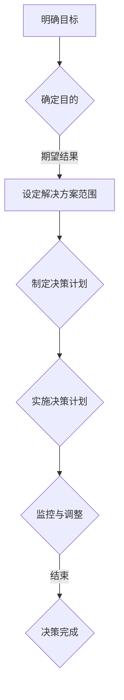

### 2.1.2 收集信息

在明确目标后，管理者需要收集与决策相关的各种信息。这些信息可能包括市场数据、客户反馈、竞争对手分析等。收集信息的质量直接影响到决策的准确性。

#### Mermaid流程图：

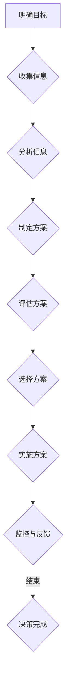

### 2.1.3 分析信息

收集到信息后，管理者需要对这些信息进行深入分析。分析的过程包括比较不同信息的关联性、识别潜在问题和机会等。逻辑思维在此过程中尤为重要，它帮助管理者识别出信息的规律和模式。

#### Mermaid流程图：

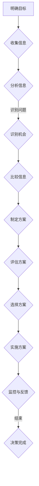

### 2.1.4 制定方案

在分析信息的基础上，管理者需要制定具体的解决方案。这个过程要求管理者具备创造性思维，提出多种可能的方案。逻辑思维在此过程中帮助管理者评估每个方案的可行性和优缺点。

#### Mermaid流程图：


### 2.1.5 评估方案

在制定出多个方案后，管理者需要对每个方案进行详细评估。评估的过程包括比较方案的成本、收益和风险等。逻辑思维在此过程中帮助管理者做出客观、理性的选择。

#### Mermaid流程图：


### 2.1.6 选择方案

在评估方案后，管理者需要选择最优的方案。选择的过程要求管理者具备判断力，综合考虑各种因素。逻辑思维在此过程中帮助管理者做出最优决策。

#### Mermaid流程图：


### 2.1.7 实施方案

在选择了最优方案后，管理者需要制定详细的实施计划，并确保计划的执行。实施的过程要求管理者具备执行力和监督能力，确保决策的顺利实施。

#### Mermaid流程图：


### 2.1.8 监控与调整

在实施方案的过程中，管理者需要持续监控方案的实施情况，并根据反馈进行调整。监控与调整的过程有助于管理者及时发现和解决问题，确保决策的有效性。

#### Mermaid流程图：


通过以上步骤，逻辑思维在决策过程中发挥着关键作用。管理者通过逻辑思维，确保决策的科学性和合理性，提高决策的质量和效能。

## 2.2 创造性思维与创新能力

创造性思维是管理者在决策和问题解决过程中不可或缺的思维能力。它帮助管理者突破传统的思维定式，发现新的解决方案，从而推动组织的创新和发展。以下是创造性思维的几个关键步骤：

### 2.2.1 问题识别

在创造性思维的过程中，第一步是识别问题。这要求管理者具有敏锐的洞察力和开放的心态，能够及时发现组织内部和外部的挑战和机遇。通过深入的调研和观察，管理者可以明确当前存在的问题，并为后续的创造性思维活动奠定基础。

#### Mermaid流程图：

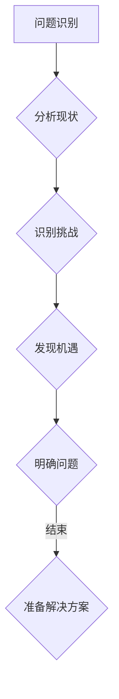

### 2.2.2 信息收集

一旦问题被识别出来，管理者需要收集与问题相关的各种信息。这些信息可能包括市场数据、客户反馈、行业趋势等。通过全面的收集和分析信息，管理者可以更准确地理解问题的本质，从而为创造性思维提供丰富的素材。

#### Mermaid流程图：

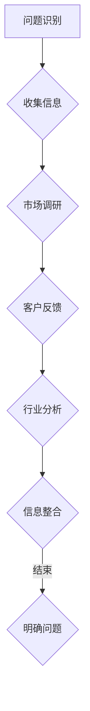

### 2.2.3 发散思维

在信息收集完毕后，管理者需要进入发散思维阶段。发散思维是一种开放性、非线性的思考方式，鼓励管理者从多个角度思考问题，提出尽可能多的可能性。通过头脑风暴、思维导图等工具，管理者可以激发创意，形成多元化的解决方案。

#### Mermaid流程图：

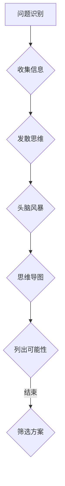

### 2.2.4 筛选方案

在发散思维阶段产生大量可能性后，管理者需要对这些方案进行筛选。筛选的过程要求管理者具备批判性思维，能够评估每个方案的优缺点，选择最具潜力和可行性的方案。通过逻辑分析和实践验证，管理者可以确保筛选出的方案具有实际操作性。

#### Mermaid流程图：

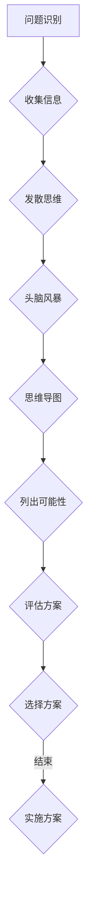

### 2.2.5 方案优化

在选择出初步方案后，管理者需要对其进行进一步的优化。方案优化是一个迭代的过程，管理者可以通过反馈和调整，不断改进方案，使其更加完善。在这个过程中，管理者可以运用创造性思维，寻找新的改进点，提高方案的质量和效果。

#### Mermaid流程图：

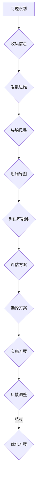

### 2.2.6 实施方案

在完成方案优化后，管理者需要制定详细的实施计划，并确保计划的执行。实施方案的过程要求管理者具备执行力，能够协调各种资源，确保方案的有效执行。通过监控和反馈，管理者可以及时发现和解决问题，确保方案的顺利实施。

#### Mermaid流程图：

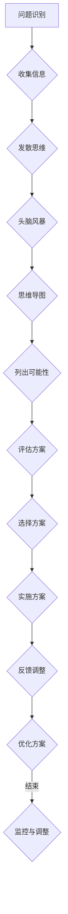

通过以上步骤，创造性思维在决策和创新中发挥了重要作用。管理者通过创造性思维，不仅能够提出新颖的解决方案，还能够推动组织的持续创新和发展。

### 2.3 系统性思维与全局观念

系统性思维是一种整体观念，强调分析事物之间的相互关系和整体性。在管理过程中，系统性思维有助于管理者把握全局，从整体角度出发，制定全面的发展战略。以下是系统性思维的几个关键步骤：

#### 2.3.1 明确系统边界

在应用系统性思维时，第一步是明确系统的边界。这包括确定系统的组成部分、关键要素及其相互关系。通过明确系统边界，管理者可以清晰地了解系统内部各部分的功能和作用，为后续分析奠定基础。

#### Mermaid流程图：

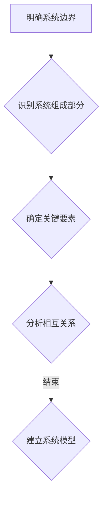

#### 2.3.2 分析系统结构

在明确系统边界后，管理者需要分析系统结构。系统结构包括各部分之间的相互作用和影响。通过分析系统结构，管理者可以了解系统内部各个部分的相互关系，识别潜在的瓶颈和问题。

#### Mermaid流程图：

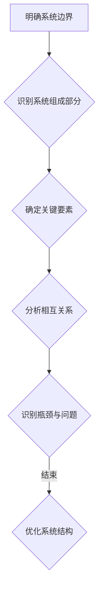

#### 2.3.3 识别系统问题

在分析系统结构的基础上，管理者需要识别系统问题。这包括识别系统内部各部分之间的不协调、资源浪费和效率低下等问题。通过识别系统问题，管理者可以明确改进方向，为后续优化提供依据。

#### Mermaid流程图：

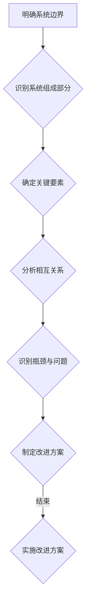

#### 2.3.4 制定解决方案

在识别系统问题后，管理者需要制定具体的解决方案。解决方案应包括改进措施、资源配置和实施步骤等。通过制定解决方案，管理者可以明确如何优化系统结构，提高系统效率。

#### Mermaid流程图：

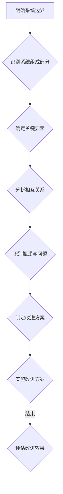

#### 2.3.5 实施解决方案

在制定出解决方案后，管理者需要确保其有效实施。实施过程包括资源配置、任务分解和监控等。通过确保解决方案的实施，管理者可以推动系统优化，提高整体效率。

#### Mermaid流程图：

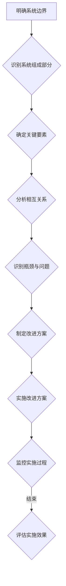

#### 2.3.6 评估与反馈

在解决方案实施后，管理者需要对实施效果进行评估和反馈。评估过程包括对系统效率、资源利用和问题解决情况的全面检查。通过评估和反馈，管理者可以了解解决方案的实际效果，并根据反馈进行进一步优化。

#### Mermaid流程图：

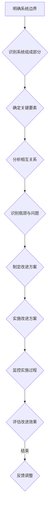

通过以上步骤，系统性思维在管理过程中发挥着关键作用。管理者通过系统性思维，能够从整体角度分析问题，制定全面的发展战略，提高系统效率，实现组织的长远发展。

### 2.4 情绪智力与人际关系

情绪智力是指管理情绪、理解他人情绪和进行有效沟通的能力。在管理过程中，情绪智力对于建立良好的人际关系、提高团队凝聚力和工作效率具有重要意义。以下是情绪智力在管理中的几个关键步骤：

#### 2.4.1 情绪自我认知

情绪自我认知是情绪智力的基础。管理者需要了解自己的情绪，包括情绪的类型、强度和发生的原因。通过自我反思和情绪记录，管理者可以更好地认识和管理自己的情绪。

#### Mermaid流程图：

```mermaid
graph TD
A[情绪自我认知] --> B{识别情绪类型}
B --> C{评估情绪强度}
C --> D{分析情绪原因}
D -->|结束| E{情绪自我管理}
```

#### 2.4.2 情绪自我管理

情绪自我管理是指管理者学会处理自己的情绪，保持积极的心态。这包括情绪调节技巧，如深呼吸、放松训练和正面思考等。通过情绪自我管理，管理者可以提高情绪稳定性，避免情绪对决策和工作的影响。

#### Mermaid流程图：

```mermaid
graph TD
A[情绪自我认知] --> B{识别情绪类型}
B --> C{评估情绪强度}
C --> D{分析情绪原因}
D --> E{情绪自我管理}
E -->|结束| F{情绪调节技巧}
```

#### 2.4.3 情绪识别与理解

情绪识别与理解是指管理者能够识别和理解他人的情绪。这包括观察他人的表情、语言和行为，理解其背后的情绪动机。通过情绪识别与理解，管理者可以更好地与他人沟通，建立信任和共鸣。

#### Mermaid流程图：

```mermaid
graph TD
A[情绪自我认知] --> B{识别情绪类型}
B --> C{评估情绪强度}
C --> D{分析情绪原因}
D --> E{情绪自我管理}
E --> F{情绪识别与理解}
F -->|结束| G{建立信任}
```

#### 2.4.4 情绪沟通

情绪沟通是指管理者运用有效的沟通技巧，表达自己的观点和情感。这包括倾听、反馈和表达等技巧。通过情绪沟通，管理者可以建立良好的人际关系，提高团队的协作效率。

#### Mermaid流程图：

```mermaid
graph TD
A[情绪自我认知] --> B{识别情绪类型}
B --> C{评估情绪强度}
C --> D{分析情绪原因}
D --> E{情绪自我管理}
E --> F{情绪识别与理解}
F --> G{情绪沟通}
G -->|结束| H{有效沟通}
```

#### 2.4.5 情绪调节

情绪调节是指管理者在冲突和压力情况下，运用情绪调节技巧，保持冷静和理智。这包括自我安慰、情绪转移和积极应对等技巧。通过情绪调节，管理者可以降低情绪波动，提高决策和工作的稳定性。

#### Mermaid流程图：

```mermaid
graph TD
A[情绪自我认知] --> B{识别情绪类型}
B --> C{评估情绪强度}
C --> D{分析情绪原因}
D --> E{情绪自我管理}
E --> F{情绪识别与理解}
F --> G{情绪沟通}
G --> H{情绪调节}
H -->|结束| I{保持冷静}
```

通过以上步骤，情绪智力在管理中发挥着重要作用。管理者通过情绪自我认知、情绪自我管理、情绪识别与理解、情绪沟通和情绪调节，可以建立良好的人际关系，提高团队凝聚力和工作效率，实现组织的长期发展。

## 3.1 心理学与组织行为学的基本理论

心理学与组织行为学为研究思维方式与管理风格的关系提供了坚实的理论基础。以下是几个关键概念及其在管理实践中的应用：

### 3.1.1 个体差异

心理学研究表明，个体在思维方式上存在显著的差异。这些差异包括认知风格、性格特征、情绪智力等。例如，认知风格分为理性型与直觉型，性格特征包括内向与外向等。管理者了解这些个体差异，可以更好地识别和培养团队成员的不同能力，优化团队组合。

#### Mermaid流程图：

```mermaid
graph TD
A[个体差异] --> B{认知风格}
B --> C{性格特征}
C --> D{情绪智力}
D --> E{识别能力}
E --> F{培养能力}
F -->|结束| G{优化团队组合}
```

### 3.1.2 团队动力

组织行为学强调团队动力的概念，即团队成员之间的互动和相互影响。团队动力包括团队成员的信任、沟通、协作等。了解团队动力，管理者可以设计有效的团队建设活动，提高团队效能。

#### Mermaid流程图：

```mermaid
graph TD
A[团队动力] --> B{信任}
B --> C{沟通}
C --> D{协作}
D --> E{团队建设}
E --> F{提高效能}
F -->|结束| G{设计活动}
```

### 3.1.3 领导力

领导力是管理者的重要素质，包括影响力、决策力、沟通能力等。心理学与组织行为学为领导力研究提供了理论基础，管理者可以通过学习和实践，提升自己的领导力，从而更好地引导和激励团队成员。

#### Mermaid流程图：

```mermaid
graph TD
A[领导力] --> B{影响力}
B --> C{决策力}
C --> D{沟通能力}
D --> E{激励成员}
E --> F{提升领导力}
F -->|结束| G{实践学习}
```

### 3.1.4 心理契约

心理契约是指员工和管理者之间的一种隐性契约，涉及双方的期望、信任和责任感。在管理实践中，心理契约有助于建立良好的工作关系，提高员工满意度和忠诚度。

#### Mermaid流程图：

```mermaid
graph TD
A[心理契约] --> B{期望}
B --> C{信任}
C --> D{责任感}
D --> E{建立关系}
E --> F{提高满意度}
F -->|结束| G{增强忠诚度}
```

通过以上心理学与组织行为学的基本理论，管理者可以更好地理解思维方式对管理风格的影响，从而优化团队管理，提高组织绩效。

## 3.2 管理哲学与思维模式的演变

管理哲学是关于管理本质和目标的系统性思考，它随着时间的推移不断演变，反映了社会、经济和技术环境的变化。以下是管理哲学和思维模式的主要演变过程：

### 3.2.1 传统管理

在20世纪初期，传统管理哲学以科学管理和官僚体系为核心。弗雷德里克·泰勒（Frederick Taylor）的科学管理理论强调工作流程的标准化和效率最大化，他认为通过详细的工作研究和时间研究，可以提高生产效率和员工的工作表现。马克斯·韦伯（Max Weber）的官僚理论则提出了以规则和权威为基础的管理体系，强调层级结构、分工明确和规章制度。

传统管理哲学的特点是重视效率、标准化和权威，管理者通过严格的监控和指令来确保组织目标的实现。在这种管理哲学下，思维模式倾向于逻辑思维和系统性思维，管理者注重流程和规则，以实现组织和个人的目标。

### 3.2.2 现代管理

随着20世纪中后期经济的发展和科技的进步，管理哲学逐渐转向以人为中心的管理模式。亨利·明茨伯格（Henry Mintzberg）的经理主义理论提出了管理者不仅仅是决策者，更是协调者、沟通者和领导者。管理者的角色越来越注重人际关系和团队协作。

现代管理哲学强调员工参与、自主性和创新能力。约翰·肯尼斯·加德纳（John Kenneth Gardner）的参与管理理论指出，通过鼓励员工参与决策过程，可以增强员工的归属感和责任感，从而提高组织的整体绩效。

现代管理思维模式在逻辑思维的基础上，更加注重创造性思维和系统性思维。管理者不仅要制定详细的计划和规则，还要激发员工的创造力和创新精神，以适应快速变化的市场环境。

### 3.2.3 未来管理

未来管理哲学将更加注重灵活性和适应性，以应对不确定性和全球化带来的挑战。彼得·德鲁克（Peter Drucker）的敏捷管理理论强调，管理者需要具备敏捷思维，能够快速适应变化，持续创新和优化。

未来管理思维模式将融合逻辑思维、创造性思维和系统性思维，更加注重跨学科和跨领域的知识整合。管理者需要具备全球视野，能够理解和应对不同文化和市场的需求。同时，未来管理还强调人文关怀和可持续性，注重员工福祉和环境保护。

### 3.2.4 管理哲学与思维模式的演变趋势

管理哲学和思维模式的演变趋势可以总结为以下几点：

1. **从以任务为中心到以人为中心**：管理哲学从追求效率最大化转向关注员工满意度和创新能力。
2. **从权威导向到参与式管理**：管理者从单方面的权威决策转向与员工的合作和共同决策。
3. **从线性思维到非线性思维**：管理思维模式从重视逻辑顺序和线性关系转向注重创造性思维和非线性关系。
4. **从短期目标到长期战略**：管理哲学从追求短期利益转向关注组织的长期发展和可持续性。

通过理解管理哲学和思维模式的演变，管理者可以更好地把握时代的发展趋势，优化管理风格，提高组织的竞争力。

## 3.3 组织文化与思维习惯

组织文化是组织内部共同的价值观、信念和行为规范，它对管理者的思维方式和管理风格具有深远的影响。一个健康和积极的组织文化能够促进团队成员的思维多样性和创新性，从而提升组织整体效能。

### 3.3.1 文化认同

组织文化认同是指团队成员对组织核心价值观和信念的认同感。当团队成员对组织文化有强烈的认同感时，他们更倾向于遵循组织的价值观和行为规范。这种文化认同有助于形成统一的思维模式，提高团队的协作效率。以下是文化认同对思维习惯的几个方面的影响：

- **统一决策标准**：组织文化认同可以统一团队成员的决策标准，使决策过程更加高效和一致。
- **增强团队凝聚力**：共同的文化认同可以增强团队成员之间的信任和合作，提高团队凝聚力。
- **提高创新能力**：文化认同可以鼓励团队成员提出创新的解决方案，因为他们在共同的价值观下更容易接受新的想法。

#### Mermaid流程图：

```mermaid
graph TD
A[文化认同] --> B{统一决策标准}
B --> C{增强团队凝聚力}
C --> D{提高创新能力}
D -->|结束| E{形成统一思维模式}
```

### 3.3.2 文化变革

组织文化并不是一成不变的，它会随着外部环境和内部需求的变化而发生变化。文化变革是指组织在必要时对现有文化进行更新和调整，以适应新的挑战和机遇。文化变革对思维习惯的影响包括：

- **适应新环境**：文化变革可以帮助组织适应外部环境的变化，从而调整团队成员的思维模式。
- **激发创新动力**：新的文化理念可以激发团队成员的创新动力，鼓励他们探索新的思维方式和解决方案。
- **提高灵活性**：通过文化变革，组织可以培养出更加灵活和适应性强的思维习惯，以应对不确定性和快速变化的市场环境。

#### Mermaid流程图：

```mermaid
graph TD
A[文化变革] --> B{适应新环境}
B --> C{激发创新动力}
C --> D{提高灵活性}
D -->|结束| E{培养适应性思维}
```

### 3.3.3 文化传承

组织文化传承是指将组织的核心价值观和信念传递给新成员，使他们快速融入组织文化。文化传承对思维习惯的影响包括：

- **培养共同价值观**：通过文化传承，新成员可以迅速了解和认同组织的核心价值观，从而形成一致的思维模式。
- **提高文化认同感**：新成员对组织文化的认同感越强，他们越愿意遵循组织的价值观和行为规范，从而促进组织的稳定和发展。
- **保持文化连续性**：通过文化传承，组织可以保持其文化的连续性和稳定性，避免因人员更替而导致的思维模式断裂。

#### Mermaid流程图：

```mermaid
graph TD
A[文化传承] --> B{培养共同价值观}
B --> C{提高文化认同感}
C --> D{保持文化连续性}
D -->|结束| E{促进组织稳定}
```

### 3.3.4 组织文化与思维习惯的互动

组织文化与思维习惯之间存在相互影响的关系。一方面，组织文化塑造了团队成员的思维习惯；另一方面，团队成员的思维习惯也会影响组织文化的形成和发展。

- **文化塑造思维**：组织文化通过其核心价值观和行为规范，塑造了团队成员的思维模式。例如，一个以创新为导向的文化会鼓励团队成员进行创造性思维。
- **思维影响文化**：团队成员的思维方式也会反过来影响组织文化的形成。一个开放和包容的思维习惯可以促进组织文化的多元化，从而提高组织的适应性和创新能力。

#### Mermaid流程图：

```mermaid
graph TD
A[组织文化] --> B{塑造思维}
B --> C{创造性思维}
C --> D[团队文化]
D --> E{文化传承}
E --> F{思维习惯}
F -->|结束| G{文化变革}
```

通过以上分析，可以看出组织文化与思维习惯的密切关系。管理者需要认识到这一点，通过塑造积极的文化氛围，培养团队成员的思维方式，从而提高组织的整体效能。

## 3.4 思维方式与领导力培养

领导力是管理者的重要素质，它决定了团队的效能和组织的成功。思维方式作为领导力的重要组成部分，直接影响领导力的培养和发展。以下是几种关键思维方式及其在领导力培养中的应用：

### 3.4.1 逻辑思维

逻辑思维是一种基于事实和证据的思考方式，它强调推理的严密性和一致性。在领导力培养中，逻辑思维有助于管理者做出科学的决策和规划。以下是逻辑思维在领导力培养中的应用：

1. **决策制定**：逻辑思维使管理者能够从多个角度分析问题，评估各种决策方案的优缺点，从而做出最优选择。
2. **目标设定**：逻辑思维有助于管理者设定明确、具体和可实现的目标，从而为团队提供清晰的行动指南。
3. **问题解决**：逻辑思维使管理者能够系统地识别和解决问题，找到有效的解决方案。

#### 伪代码：

```
function make_decision(issues, options):
    for each issue in issues:
        analyze_impact(issue, options)
    select_option_with_best_impact()
    return selected_option
```

#### 数学模型：

$$
\text{Impact} = \frac{\text{Benefits}}{\text{Costs}}
$$

### 3.4.2 创造性思维

创造性思维是一种探索新颖、独特解决方案的思考方式。在领导力培养中，创造性思维有助于管理者推动组织的创新和变革。以下是创造性思维在领导力培养中的应用：

1. **创新产品和服务**：创造性思维使管理者能够发现市场的新需求，开发创新的产品和服务。
2. **组织变革**：创造性思维使管理者能够推动组织变革，适应外部环境的变化。
3. **团队激励**：创造性思维使管理者能够设计新颖的激励方案，激发团队的创造力和积极性。

#### 伪代码：

```
function find_innovative_solutions(problem):
    brainstorm Ideas
    evaluate_ideas based_on feasibility and impact
    select_best_idea()
    return best_idea
```

### 3.4.3 系统性思维

系统性思维是一种全局观念，强调分析事物之间的相互关系和整体性。在领导力培养中，系统性思维有助于管理者把握组织的全局，制定全面的发展战略。以下是系统性思维在领导力培养中的应用：

1. **战略规划**：系统性思维使管理者能够从整体角度分析组织的发展方向，制定长期战略规划。
2. **资源分配**：系统性思维使管理者能够合理分配资源，确保各部门的协同发展。
3. **风险控制**：系统性思维使管理者能够识别和应对潜在的系统性风险。

#### 伪代码：

```
function develop_strategic_plan():
    analyze_organization_context()
    identify_strategic_goals()
    allocate_resources()
    monitor_and_adjust_plan()
    return strategic_plan
```

### 3.4.4 情绪智力

情绪智力是一种理解和管理自己及他人情绪的能力。在领导力培养中，情绪智力有助于管理者建立良好的人际关系，提高团队的凝聚力和工作效率。以下是情绪智力在领导力培养中的应用：

1. **情感沟通**：情绪智力使管理者能够有效表达和理解员工的情感，建立信任和共鸣。
2. **冲突管理**：情绪智力使管理者能够冷静处理冲突，找到双赢的解决方案。
3. **团队激励**：情绪智力使管理者能够识别员工的情感需求，设计个性化的激励方案。

#### 伪代码：

```
function manage_emotions(incoming_emotions):
    recognize_emotions()
    respond_with_understanding()
    find共赢解决方案()
    promote_healthy_communication()
    return improved_relationships
```

通过培养以上几种思维方式，管理者可以提升自己的领导力，更好地应对各种挑战，推动组织的持续发展和成功。

## 4.1 逻辑思维型管理风格

逻辑思维型管理风格是一种以逻辑严密、决策理性为特点的管理方式。在这种风格下，管理者强调逻辑推理和科学分析，通过严谨的思考和系统的规划来指导团队工作。以下是逻辑思维型管理风格的关键特征和具体应用：

### 4.1.1 强调计划性

逻辑思维型管理者在决策过程中非常注重计划性。他们倾向于制定详细的计划和时间表，确保团队成员明确任务目标和执行步骤。以下是一个典型的计划流程：

```mermaid
graph TD
A[明确目标] --> B{制定计划}
B --> C{设定时间表}
C --> D{分配任务}
D --> E{监控进度}
E --> F{调整计划}
F -->|结束| G{实现目标}
```

### 4.1.2 注重数据支持

逻辑思维型管理者在决策时非常依赖数据和事实。他们通过收集和分析数据，评估不同决策方案的优缺点，从而做出科学、合理的决策。以下是一个数据驱动的决策流程：

```mermaid
graph TD
A[收集数据] --> B{数据分析}
B --> C{评估方案}
C --> D{选择最佳方案}
D --> E{实施决策}
E --> F{监控结果}
F -->|结束| G{优化决策}
```

### 4.1.3 严格监控

逻辑思维型管理者在实施决策时非常注重监控和反馈。他们会设定关键绩效指标（KPIs），定期检查任务进度和成果，确保团队按照计划执行。以下是一个监控流程：

```mermaid
graph TD
A[设定KPIs] --> B{监控进度}
B --> C{收集反馈}
C --> D{评估成果}
D --> E{调整策略}
E -->|结束| F{持续优化}
```

### 4.1.4 强调逻辑性

逻辑思维型管理者在沟通和解决问题时，强调逻辑性和条理性。他们会通过清晰的逻辑链条和结构化的表达，确保信息传递的准确性和一致性。以下是一个逻辑性沟通的例子：

```
问题陈述：我们需要提高产品的市场占有率。
逻辑分析：
1. 市场占有率低的原因可能包括竞争对手的强大、产品缺乏竞争力等。
2. 解决方案包括改进产品功能、加强市场推广等。
3. 实施步骤：首先进行市场调研，了解竞争对手的情况，然后改进产品，最后进行市场推广。
```

### 4.1.5 应用场景

逻辑思维型管理风格在以下场景中尤为适用：

- **复杂决策**：在面对复杂、多变的决策情境时，逻辑思维型管理者能够通过严谨的分析，制定出科学合理的决策方案。
- **项目管理和监控**：在项目管理和监控过程中，逻辑思维型管理者能够通过详细的计划和严格的监控，确保项目按计划进行。
- **风险管理**：在风险管理中，逻辑思维型管理者能够通过分析风险因素，制定出有效的风险管理策略。

通过以上关键特征和应用场景，逻辑思维型管理风格能够帮助管理者提高决策质量、提升团队效率和实现组织目标。

## 4.2 创造性思维型管理风格

创造性思维型管理风格是一种以创新、探索和突破为特点的管理方式。在这种风格下，管理者鼓励团队成员发挥创造力，探索新的解决方案，从而推动组织的创新和持续发展。以下是创造性思维型管理风格的关键特征和具体应用：

### 4.2.1 鼓励创新

创造性思维型管理者非常重视创新，他们鼓励团队成员不断提出新的想法和创意。为了激发创新，管理者可以采取以下措施：

- **设立创新奖项**：为提出创新解决方案的团队成员设立奖项，激励他们积极参与创新活动。
- **提供创新培训**：为团队成员提供创新思维和方法的培训，提高他们的创新能力和解决问题的能力。
- **创造自由氛围**：营造一个开放、自由的工作环境，鼓励团队成员自由表达想法，不受传统思维定式的束缚。

### 4.2.2 开放心态

创造性思维型管理者具有开放的心态，他们接受不同的观点和想法，愿意尝试新的方法和思路。以下是一个开放心态的具体应用案例：

```
团队成员A提出一个新的产品创意，但团队中有些人对此表示质疑。管理者没有立即否定，而是组织了一次头脑风暴会议，让团队成员充分讨论和辩论，最终通过投票选出了最具有潜力的方案。
```

### 4.2.3 勇于尝试

创造性思维型管理者勇于尝试新的方法和思路，他们鼓励团队成员大胆提出和尝试新的创意。以下是一个勇于尝试的具体应用案例：

```
公司计划推出一个新的产品功能，但团队中没有人有相关的经验。管理者决定让团队成员组成一个跨部门团队，共同研究和开发这个新功能。虽然过程中遇到了许多困难，但最终成功推出了这个功能，并受到了市场的热烈欢迎。
```

### 4.2.4 创新文化

创造性思维型管理者致力于建立创新文化，他们鼓励团队成员积极参与创新活动，共同推动组织的创新和发展。以下是一个创新文化的具体应用案例：

```
公司定期组织创新研讨会，邀请外部专家进行讲座，分享最新的创新理念和成功案例。同时，公司还设立了内部创新实验室，为团队成员提供创新实践的平台和资源，鼓励他们进行创新实验和尝试。
```

### 4.2.5 应用场景

创造性思维型管理风格在以下场景中尤为适用：

- **产品研发**：在产品研发过程中，创造性思维型管理者能够鼓励团队成员提出新颖的解决方案，提高产品的创新性和市场竞争力。
- **市场拓展**：在市场拓展过程中，创造性思维型管理者能够探索新的市场机会，开发新的业务模式，推动组织的持续增长。
- **组织变革**：在组织变革过程中，创造性思维型管理者能够通过创新的思维方式和策略，推动组织的转型和升级。

通过以上关键特征和应用场景，创造性思维型管理风格能够帮助管理者激发团队创造力，推动组织的创新和发展。

## 4.3 系统性思维型管理风格

系统性思维型管理风格是一种以整体观念、全局思维为特点的管理方式。在这种风格下，管理者注重组织内部各部分之间的相互关系和整体性，通过系统的分析和规划来指导团队工作。以下是系统性思维型管理风格的关键特征和具体应用：

### 4.3.1 关注整体

系统性思维型管理者从整体角度出发，关注组织的整体效能和长期发展。他们在决策过程中，不仅考虑局部利益，还关注整体利益。以下是一个关注整体的具体应用案例：

```
公司计划推出一款新产品，但现有的生产线无法满足生产需求。管理者没有立即购买新设备，而是通过系统分析，发现可以通过优化现有流程和增加临时人力来解决生产问题。最终，公司不仅避免了高额的设备投资，还提高了生产效率。
```

### 4.3.2 系统分析

系统性思维型管理者擅长系统分析，他们通过深入分析组织内部各部分之间的相互关系，识别问题和机会。以下是一个系统分析的具体应用案例：

```
公司发现销售业绩不佳，管理者没有简单地责怪销售人员，而是通过系统分析，发现产品定价不合理，市场竞争激烈等问题。管理者随后调整了产品定价策略，并加强了市场推广，最终提高了销售业绩。
```

### 4.3.3 整体优化

系统性思维型管理者通过整体优化，提高组织的效率和效能。他们在决策时，综合考虑各种因素，确保各部分之间的协调和配合。以下是一个整体优化的具体应用案例：

```
公司决定进行组织结构改革，管理者通过系统分析，发现现有的部门设置过于复杂，导致沟通效率低下。管理者决定精简部门设置，加强跨部门协作，最终提高了组织的整体效率和效能。
```

### 4.3.4 长期规划

系统性思维型管理者注重长期规划，他们通过系统分析，制定长期发展战略，确保组织能够持续发展。以下是一个长期规划的具体应用案例：

```
公司管理者通过系统分析，发现市场需求正在发生变化，传统业务模式无法满足未来的发展需求。管理者决定制定长期发展战略，通过拓展新业务、提升创新能力等方式，确保公司能够持续发展。
```

### 4.3.5 应用场景

系统性思维型管理风格在以下场景中尤为适用：

- **战略规划**：在制定长期战略规划时，系统性思维型管理者能够通过系统分析，制定出科学合理的战略目标和发展路径。
- **项目管理**：在项目管理过程中，系统性思维型管理者能够通过系统分析，识别和解决项目中的关键问题，确保项目的顺利实施。
- **组织变革**：在组织变革过程中，系统性思维型管理者能够通过系统分析，制定出合理的变革方案，确保变革的顺利进行。

通过以上关键特征和应用场景，系统性思维型管理风格能够帮助管理者提高决策质量、提升团队效率和实现组织目标。

## 4.4 情绪智力型管理风格

情绪智力型管理风格是一种以情感管理和人际沟通为特点的管理方式。在这种风格下，管理者擅长处理情绪问题，建立良好的人际关系，从而提高团队凝聚力和工作效率。以下是情绪智力型管理风格的关键特征和具体应用：

### 4.4.1 情绪自我管理

情绪智力型管理者能够有效地管理自己的情绪，保持冷静和理智。他们在面对压力和挑战时，能够保持情绪稳定，从而做出明智的决策。以下是一个情绪自我管理的具体应用案例：

```
当团队面临重大挑战时，管理者没有因为紧张而失去冷静，而是通过自我反思和深呼吸等技巧，保持情绪稳定。最终，他们能够带领团队成功应对挑战，取得重要成果。
```

### 4.4.2 情绪识别与理解

情绪智力型管理者擅长识别和理解他人的情绪。他们能够通过观察、倾听和交流，了解团队成员的情感状态，从而提供适当的情感支持。以下是一个情绪识别与理解的具体应用案例：

```
团队成员A因工作压力大而情绪低落，管理者通过细心观察和交流，了解到A的困扰。管理者没有直接指责，而是耐心倾听A的诉说，并给予情感支持，帮助A重拾信心。
```

### 4.4.3 情绪沟通

情绪智力型管理者能够运用有效的沟通技巧，表达自己的观点和情感。他们在沟通时，注重情感的表达和理解，从而建立信任和共鸣。以下是一个情绪沟通的具体应用案例：

```
在一次团队会议上，管理者与团队成员B发生了意见分歧。管理者没有立即激动地争吵，而是通过平静地表达自己的观点，并倾听B的想法。最终，他们通过沟通找到了共同点，达成了共识。
```

### 4.4.4 建立信任

情绪智力型管理者通过情感管理和人际沟通，建立团队内部的信任关系。他们在处理团队冲突时，能够保持冷静和理智，从而缓解紧张情绪，增强团队凝聚力。以下是一个建立信任的具体应用案例：

```
团队内部出现了矛盾，管理者通过倾听双方的诉说，了解问题的根源。然后，管理者通过情感沟通，让双方认识到彼此的难处，最终达成和解，重建信任。
```

### 4.4.5 应用场景

情绪智力型管理风格在以下场景中尤为适用：

- **团队建设**：在团队建设过程中，情绪智力型管理者能够通过情感管理和人际沟通，提高团队凝聚力和工作效率。
- **员工关系管理**：在员工关系管理中，情绪智力型管理者能够通过情绪识别与理解，处理员工的情感问题，提高员工满意度。
- **冲突管理**：在冲突管理中，情绪智力型管理者能够通过情绪沟通和建立信任，缓解冲突，增强团队凝聚力。

通过以上关键特征和应用场景，情绪智力型管理风格能够帮助管理者提高团队凝聚力和工作效率，实现组织目标。

## 5.1 团队合作中的思维方式差异

在团队合作中，不同的思维方式会导致沟通障碍和协作效率的降低。以下是几种常见的思维方式差异及其影响：

### 5.1.1 逻辑思维与创造性思维的差异

逻辑思维型成员通常注重事实和数据，倾向于制定详细的计划和流程，以确保任务的高效完成。而创造性思维型成员则更倾向于从不同的角度思考问题，寻找创新的解决方案。这种差异可能导致以下问题：

- **沟通障碍**：逻辑思维型成员可能认为创造性思维型成员的想法不切实际，缺乏逻辑性，而创造性思维型成员可能觉得逻辑思维型成员过于保守，缺乏创新精神。
- **协作效率降低**：当团队成员在思维方式上存在差异时，他们可能在任务目标和执行策略上产生分歧，导致协作效率降低。

### 5.1.2 系统性思维与局部思维的差异

系统性思维型成员关注整体和长期目标，倾向于从整体角度分析问题，而局部思维型成员则更注重短期和局部利益。这种差异可能导致以下问题：

- **目标不一致**：系统性思维型成员可能会觉得局部思维型成员只关注短期利益，而忽视了长期发展。局部思维型成员可能会认为系统性思维型成员过于理想化，不关注实际成果。
- **资源分配不均**：由于两者关注点不同，可能导致资源分配不均，系统性思维型成员可能会觉得局部思维型成员占用过多资源，而局部思维型成员可能会觉得系统性思维型成员未能给予足够支持。

### 5.1.3 情绪智力与理性思维的差异

情绪智力型成员擅长处理情绪问题，注重人际关系，而理性思维型成员则更注重事实和逻辑。这种差异可能导致以下问题：

- **冲突管理难度增加**：情绪智力型成员可能在处理冲突时更注重情感，而理性思维型成员可能更注重事实和逻辑，导致双方在冲突管理上产生分歧。
- **沟通效率降低**：情绪智力型成员可能在沟通时表达情感，而理性思维型成员可能更注重信息的准确性，导致沟通效率降低。

### 5.1.4 解决方案

为了解决团队合作中因思维方式差异导致的沟通障碍和协作效率降低问题，可以采取以下解决方案：

- **加强沟通**：鼓励团队成员之间进行开放和坦诚的沟通，了解彼此的思维方式和关注点，减少误解和冲突。
- **建立共同目标**：明确团队的目标和愿景，使所有成员都朝着共同的方向努力，从而减少因思维方式差异导致的分歧。
- **提供培训**：为团队成员提供思维方式的培训，帮助他们理解不同思维方式的优点和局限性，提高团队合作能力。
- **建立多元化团队**：组建多元化团队，汇集不同思维方式的成员，实现思维互补，提高团队的创新能力和决策质量。

通过以上解决方案，可以有效解决团队合作中因思维方式差异导致的沟通障碍和协作效率降低问题，促进团队的高效协作。

## 5.2 思维方式的优化与团队效能

优化思维方式是提高团队效能的关键。通过培养和发展不同的思维方式，团队可以更好地应对挑战，提高创新能力和决策质量。以下是一些建议，帮助团队优化思维方式，提高整体效能：

### 5.2.1 加强跨部门沟通

跨部门沟通是优化思维方式的重要途径。通过跨部门沟通，团队成员可以分享不同领域的知识和经验，促进思维互补。以下是一些建议：

- **定期举办跨部门会议**：定期举办跨部门会议，让团队成员分享各自的最新动态、问题和解决方案。
- **设立跨部门项目组**：成立跨部门项目组，负责处理跨部门协作任务，促进团队成员之间的交流和合作。
- **建立信息共享平台**：建立信息共享平台，方便团队成员获取其他部门的信息和资源，提高协作效率。

### 5.2.2 提供培训和学习机会

培训和学习机会有助于团队成员发展不同的思维方式，提高整体素质。以下是一些建议：

- **组织思维技巧培训**：邀请专家进行思维技巧培训，帮助团队成员掌握逻辑思维、创造性思维、系统性思维和情绪智力等不同思维方式的技巧。
- **开展读书会**：组织读书会，让团队成员分享和学习相关书籍和论文，拓宽思维视野。
- **提供在线学习资源**：提供在线学习资源，如在线课程、视频讲座和电子书籍等，方便团队成员随时学习和提升。

### 5.2.3 建立多元化团队

多元化团队有助于汇集不同思维方式的成员，实现思维互补。以下是一些建议：

- **招募多元化人才**：在招聘过程中，注重多样性的招募策略，吸引具有不同背景和思维方式的人才。
- **建立平等交流机制**：建立平等交流机制，鼓励团队成员分享自己的观点和想法，减少偏见和歧视。
- **开展团队建设活动**：定期开展团队建设活动，增强团队成员之间的信任和合作，提高团队凝聚力。

### 5.2.4 鼓励创新和尝试

鼓励创新和尝试是培养团队成员思维方式的重要方法。以下是一些建议：

- **设立创新项目**：设立创新项目，鼓励团队成员提出新的想法和解决方案，推动团队创新。
- **提供资源和支持**：为创新项目提供必要的资源和支持，如资金、技术支持和人力资源等，确保创新项目的顺利实施。
- **建立激励机制**：建立激励机制，对创新项目成功者进行奖励，激发团队成员的创新热情。

通过以上措施，团队可以优化思维方式，提高整体效能。优化思维方式不仅有助于团队更好地应对挑战，还能提升团队的决策质量、创新能力和协作效率。

## 5.3 跨文化团队中的思维方式与沟通

在跨文化团队中，思维方式和文化差异可能导致沟通障碍和文化冲突。为了确保跨文化团队的高效合作，管理者需要关注以下关键方面：

### 5.3.1 尊重差异

尊重差异是跨文化团队沟通的首要原则。管理者应尊重团队成员的不同思维方式和文化背景，避免偏见和歧视。以下是一些建议：

- **文化敏感性培训**：为团队成员提供文化敏感性培训，帮助他们了解不同文化的价值观、行为规范和沟通方式。
- **建立平等交流机制**：确保团队成员在交流过程中有平等的发言机会，避免文化霸权现象的发生。
- **鼓励多元文化分享**：鼓励团队成员分享各自的文化经验和观点，促进相互理解和尊重。

### 5.3.2 理解文化差异

理解文化差异是有效沟通的基础。管理者需要深入了解团队成员的文化背景，包括他们的沟通习惯、工作风格和价值观念。以下是一些建议：

- **开展文化交流**：定期举办文化交流活动，如文化展览、讲座和座谈会等，增进团队成员之间的相互了解。
- **建立跨文化沟通指南**：制定跨文化沟通指南，明确不同文化背景下的沟通原则和技巧，帮助团队成员更好地进行跨文化沟通。
- **提供文化知识资源**：为团队成员提供相关的文化知识资源，如书籍、视频和在线课程等，帮助他们了解不同文化的特点和习惯。

### 5.3.3 建立共同目标

建立共同目标是跨文化团队高效合作的关键。管理者需要确保团队成员在共同目标的基础上进行合作，减少因文化差异导致的冲突。以下是一些建议：

- **明确共同目标**：在项目启动时，明确共同目标，确保所有团队成员都了解项目的目的和期望结果。
- **制定明确的任务分工**：根据团队成员的文化背景和技能，制定明确的任务分工，确保每个成员都能在其擅长的领域发挥作用。
- **定期评估和调整**：定期评估团队的工作进展和沟通效果，根据实际情况进行调整，确保团队始终朝着共同目标前进。

### 5.3.4 加强跨文化沟通

加强跨文化沟通是确保跨文化团队高效合作的关键。管理者需要采取一系列措施，提高团队成员之间的沟通效率。以下是一些建议：

- **提供跨文化沟通培训**：为团队成员提供跨文化沟通培训，帮助他们掌握跨文化沟通的技巧和策略。
- **建立沟通反馈机制**：建立沟通反馈机制，鼓励团队成员在沟通过程中提出意见和建议，及时解决问题。
- **采用多样化的沟通方式**：结合不同团队成员的沟通偏好，采用多样化的沟通方式，如面对面会议、视频会议和邮件等。

通过以上措施，管理者可以有效地解决跨文化团队中的沟通障碍和文化冲突，促进团队的高效合作，实现共同目标。

## 5.4 思维方式的多样性在团队管理中的应用

思维方式的多样性在团队管理中具有重要的应用价值。通过利用不同成员的思维方式，团队可以更好地应对各种挑战，提高创新能力和决策质量。以下是思维方式多样性在团队管理中的应用：

### 5.4.1 创新与突破

思维方式的多样性有助于团队在创新和突破方面取得成功。通过汇集不同背景和经验丰富的成员，团队可以产生多样化的想法和解决方案。以下是一些建议：

- **头脑风暴会议**：定期举办头脑风暴会议，鼓励团队成员自由表达想法，激发创新思维。
- **多元化项目团队**：组建多元化项目团队，确保团队成员具有不同的思维方式，从而推动项目的创新和突破。
- **鼓励跨界合作**：鼓励团队成员跨部门、跨领域的合作，促进不同思维方式之间的交流和碰撞，激发创新火花。

### 5.4.2 问题解决

思维方式的多样性在问题解决中具有重要作用。当团队面临复杂问题时，不同思维方式的成员可以从不同角度进行分析和思考，提出多种解决方案。以下是一些建议：

- **团队决策过程**：在决策过程中，充分听取不同成员的意见和建议，确保思维的多样性得到体现。
- **角色扮演**：在问题解决过程中，让团队成员扮演不同的角色，从不同视角分析问题，提出解决方案。
- **多学科团队合作**：组建多学科团队合作，利用不同学科的思维方式，提高问题解决的能力。

### 5.4.3 领导力培养

思维方式的多样性有助于培养团队的领导力。通过激发团队成员的多样性思维，可以提高他们的领导能力和决策水平。以下是一些建议：

- **领导力培训**：为团队成员提供领导力培训，帮助他们了解和掌握不同思维方式的运用。
- **角色扮演**：在培训过程中，通过角色扮演活动，让团队成员体验不同思维方式的运用，提高领导力。
- **领导力项目**：设立领导力项目，让团队成员在项目中担任不同角色，锻炼领导能力和决策能力。

### 5.4.4 团队建设

思维方式的多样性有助于团队建设，提高团队的凝聚力和工作效率。通过促进团队成员之间的交流和互动，可以建立更加和谐和高效的团队。以下是一些建议：

- **团队建设活动**：定期举办团队建设活动，如团队拓展训练、团队聚餐和团队旅游等，增进团队成员之间的了解和信任。
- **团队沟通平台**：建立团队沟通平台，如内部社交媒体、邮件列表等，方便团队成员交流和分享想法。
- **鼓励多样化交流**：鼓励团队成员在不同场合和情境下进行多样化交流，促进思维的碰撞和融合。

通过以上措施，团队可以充分发挥思维方式的多样性，提高创新能力和决策质量，实现团队的长期发展。

## 6.1 思维方式与战略规划

思维方式对组织战略规划具有深远影响。不同的思维方式决定了管理者在战略规划中的视角、方法和决策质量。以下是几种关键思维方式在战略规划中的应用：

### 6.1.1 逻辑思维

逻辑思维是一种基于事实和证据的思考方式，它在战略规划中发挥着重要作用。以下是如何在战略规划中应用逻辑思维的具体步骤：

1. **明确目标**：首先，管理者需要明确组织的战略目标，包括长期和短期的目标。
2. **分析环境**：通过逻辑分析，管理者需要评估组织所处的市场环境、竞争态势和外部机会与威胁。
3. **制定方案**：基于分析结果，管理者需要制定具体的战略方案，包括市场拓展、产品研发、资源配置等。
4. **评估和选择**：对各个战略方案进行评估和比较，选择最优方案。

#### 伪代码：

```
function strategic_plan(goal, environment):
    analyze_environment(environment)
    generate_solutions(goal)
    evaluate_solutions()
    select_best_solution()
    return strategic_plan
```

#### 数学模型：

$$
\text{Impact} = \frac{\text{Benefits}}{\text{Costs}}
$$

### 6.1.2 创造性思维

创造性思维是一种探索新颖、独特解决方案的思维方式，它在战略规划中具有重要意义。以下是如何在战略规划中应用创造性思维的具体步骤：

1. **问题识别**：首先，管理者需要识别组织面临的挑战和机遇。
2. **头脑风暴**：通过头脑风暴，管理者可以收集多种可能的解决方案。
3. **筛选和优化**：对头脑风暴得到的解决方案进行筛选和优化，选择最具创新性和可行性的方案。
4. **实施和验证**：将创新方案付诸实施，并进行验证和调整。

#### 伪代码：

```
function innovative_solution(problem):
    brainstorm_ideas(problem)
    evaluate_ideas()
    select_best_idea()
    implement_solution()
    validate_solution()
    return final_solution
```

### 6.1.3 系统性思维

系统性思维是一种全局观念，它强调分析事物之间的相互关系和整体性。在战略规划中，系统性思维有助于管理者从整体角度制定战略，确保各个部分之间的协调和配合。以下是如何在战略规划中应用系统性思维的具体步骤：

1. **明确系统边界**：首先，管理者需要明确组织的系统边界，包括内部的各个部门和外部的关系。
2. **分析系统结构**：通过分析系统结构，管理者可以了解各个部分之间的相互作用和影响。
3. **识别问题**：基于系统分析，管理者可以识别系统中的问题和挑战。
4. **制定解决方案**：根据问题分析，管理者需要制定具体的解决方案，确保各个部分之间的协调和配合。

#### 伪代码：

```
function system_analysis(border, structure):
    analyze_structure(structure)
    identify_issues()
    generate_solutions()
    coordinate_parts()
    return strategic_plan
```

### 6.1.4 情绪智力

情绪智力是一种理解和管理自己及他人情绪的能力，它在战略规划中具有重要意义。以下是如何在战略规划中应用情绪智力的具体步骤：

1. **情绪自我认知**：首先，管理者需要了解自己的情绪状态，保持冷静和理智。
2. **情绪识别与理解**：通过观察和交流，管理者可以了解团队成员的情绪状态，建立信任和共鸣。
3. **情绪沟通**：管理者需要运用有效的沟通技巧，表达自己的观点和情感，确保团队成员之间的理解和协作。
4. **情绪调节**：在冲突和压力情况下，管理者需要运用情绪调节技巧，保持冷静和理智，确保战略规划的顺利实施。

#### 伪代码：

```
function emotional_intelligence():
    self_cognition()
    recognize_and_understand_emotions()
    effective_communication()
    emotional_regulation()
    return enhanced_strategic_plan
```

通过以上几种思维方式的结合和应用，管理者可以制定出科学、合理和具有前瞻性的战略规划，确保组织的长期发展。

## 6.2 思维方式与风险管理

思维方式对风险管理具有显著影响。管理者在识别、评估和应对风险时，不同的思维方式会影响他们的决策质量和风险管理效果。以下是几种关键思维方式在风险管理中的应用：

### 6.2.1 逻辑思维

逻辑思维在风险管理中主要用于分析和评估风险。以下是如何在风险管理中应用逻辑思维的具体步骤：

1. **风险识别**：通过逻辑思维，管理者可以系统地识别和记录可能的风险因素。
2. **风险评估**：利用逻辑分析，管理者可以评估每个风险的可能性及其潜在影响。
3. **风险优先级排序**：根据风险评估结果，管理者可以确定哪些风险需要优先处理。
4. **制定应对策略**：基于逻辑分析，管理者可以制定具体的应对策略，如风险规避、风险减轻或风险接受。

#### 伪代码：

```
function risk_management(risks):
    identify_risks()
    assess_risks()
    prioritize_risks()
    develop_response_strategies()
    return risk_management_plan
```

#### 数学模型：

$$
\text{Risk Score} = \text{Probability} \times \text{Impact}
$$

### 6.2.2 创造性思维

创造性思维在风险管理中可以帮助管理者寻找创新的解决方案，以应对未知或复杂的风险。以下是如何在风险管理中应用创造性思维的具体步骤：

1. **问题重新定义**：通过创造性思维，管理者可以重新定义问题，发现新的风险因素。
2. **头脑风暴**：组织头脑风暴会议，鼓励团队成员提出创新的应对策略。
3. **方案评估**：对创造性思维产生的方案进行评估和筛选，选择最具创新性和可行性的方案。
4. **实施和创新**：将创新方案付诸实施，并根据反馈进行调整和优化。

#### 伪代码：

```
function innovative_risk_solution(problem):
    redefine_problem()
    brainstorm_solutions()
    evaluate_solutions()
    implement_solution()
    adjust_solution()
    return final_solution
```

### 6.2.3 系统性思维

系统性思维在风险管理中有助于管理者从整体角度分析风险，确保各个部分之间的协调和配合。以下是如何在风险管理中应用系统性思维的具体步骤：

1. **系统分析**：通过系统性思维，管理者可以分析组织内部的各个部分及其相互关系，识别潜在的风险点。
2. **风险评估**：综合考虑系统内部的各个环节，评估每个部分的风险暴露程度。
3. **制定综合策略**：基于系统分析结果，管理者可以制定全面的应对策略，确保各部分之间的协调和配合。
4. **持续监控和调整**：定期对系统进行监控和调整，及时发现新的风险因素，确保风险管理策略的有效性。

#### 伪代码：

```
function system_risk_management(system):
    analyze_system()
    assess_risks()
    develop_comprehensive_strategy()
    monitor_and_adjust()
    return risk_management_plan
```

### 6.2.4 情绪智力

情绪智力在风险管理中可以帮助管理者理解和管理自己的情绪，确保在风险事件中保持冷静和理智。以下是如何在风险管理中应用情绪智力的具体步骤：

1. **情绪自我认知**：管理者需要了解自己的情绪状态，保持冷静和客观。
2. **情绪识别与理解**：管理者需要识别和理解团队成员的情绪状态，建立信任和共鸣。
3. **情绪沟通**：管理者需要运用有效的沟通技巧，表达自己的观点和情感，确保团队成员之间的理解和协作。
4. **情绪调节**：在风险事件发生时，管理者需要运用情绪调节技巧，保持冷静和理智，确保风险应对的有效性。

#### 伪代码：

```
function emotional_risk_management():
    self_cognition()
    recognize_and_understand_emotions()
    effective_communication()
    emotional_regulation()
    return enhanced_risk_management
```

通过以上几种思维方式的结合和应用，管理者可以更全面、系统地识别、评估和应对风险，提高组织的风险管理水平。

## 6.3 思维方式的变革与组织创新

思维方式在组织创新中起着关键作用。它决定了管理者如何看待问题、如何做出决策以及如何推动变革。以下是思维方式在组织创新中的具体应用：

### 6.3.1 逻辑思维的变革作用

逻辑思维在组织创新中帮助管理者分析和评估新的机会和挑战。以下是如何在组织创新中应用逻辑思维的具体步骤：

1. **问题识别**：通过逻辑思维，管理者可以识别组织面临的挑战和机遇。
2. **信息收集**：管理者需要收集与问题相关的各种信息，包括市场趋势、竞争对手和客户需求等。
3. **分析信息**：利用逻辑分析，管理者可以评估不同信息的关联性，识别潜在的创新点。
4. **制定策略**：基于分析结果，管理者可以制定具体的创新策略，如新产品开发、新市场拓展或业务模式创新。

#### 伪代码：

```
function innovative_strategy(issues, information):
    identify_issues()
    collect_information()
    analyze_information()
    develop_innovation_strategies()
    evaluate_strategies()
    return best_strategy
```

#### 数学模型：

$$
\text{Innovation Score} = \frac{\text{Benefits}}{\text{Risks}}
$$

### 6.3.2 创造性思维的变革作用

创造性思维在组织创新中帮助管理者探索新的解决方案和业务模式。以下是如何在组织创新中应用创造性思维的具体步骤：

1. **头脑风暴**：通过头脑风暴，管理者可以收集多种可能的创新方案。
2. **筛选和优化**：对头脑风暴得到的方案进行筛选和优化，选择最具创新性和可行性的方案。
3. **实施和验证**：将创新方案付诸实施，并进行验证和调整。
4. **持续改进**：根据反馈和验证结果，持续改进创新方案，确保其持续发展和优化。

#### 伪代码：

```
function innovative_solution(idea):
    brainstorm_ideas()
    evaluate_ideas()
    select_best_idea()
    implement_solution()
    validate_solution()
    adjust_solution()
    return final_solution
```

### 6.3.3 系统性思维的变革作用

系统性思维在组织创新中帮助管理者从整体角度分析和规划创新项目。以下是如何在组织创新中应用系统性思维的具体步骤：

1. **系统分析**：通过系统性思维，管理者可以分析组织的整体结构和功能，识别创新机会。
2. **识别问题**：基于系统分析，管理者可以识别组织中的瓶颈和问题，作为创新目标。
3. **制定方案**：根据问题分析，管理者可以制定具体的创新方案，确保各个部分之间的协调和配合。
4. **实施和监控**：将创新方案付诸实施，并定期监控和评估其效果，确保创新目标的实现。

#### 伪代码：

```
function system_innovation(issues):
    analyze_system()
    identify_issues()
    generate_solutions()
    implement_solutions()
    monitor_progress()
    adjust_solutions()
    return innovation_plan
```

### 6.3.4 情绪智力的变革作用

情绪智力在组织创新中帮助管理者处理变革过程中的情绪问题，确保团队成员的积极性和参与度。以下是如何在组织创新中应用情绪智力的具体步骤：

1. **情绪自我认知**：管理者需要了解自己的情绪状态，保持冷静和理智。
2. **情绪识别与理解**：管理者需要识别和理解团队成员的情绪状态，建立信任和共鸣。
3. **情绪沟通**：管理者需要运用有效的沟通技巧，表达自己的观点和情感，确保团队成员之间的理解和协作。
4. **情绪调节**：在变革过程中，管理者需要运用情绪调节技巧，保持冷静和理智，确保变革的顺利实施。

#### 伪代码：

```
function emotional_innovation():
    self_cognition()
    recognize_and_understand_emotions()
    effective_communication()
    emotional_regulation()
    return enhanced_innovation
```

通过以上几种思维方式的结合和应用，管理者可以有效地推动组织创新，应对外部环境的变化，实现组织的持续发展和成功。

## 6.4 思维方式在组织变革中的应用

思维方式在组织变革中扮演着关键角色。管理者通过调整和优化思维方式，可以更有效地推动变革，确保组织适应外部环境的变化。以下是几种关键思维方式在组织变革中的应用：

### 6.4.1 逻辑思维的变革应用

逻辑思维在组织变革中的应用主要体现在分析和规划阶段。以下是如何在组织变革中应用逻辑思维的具体步骤：

1. **明确变革目标**：首先，管理者需要明确组织变革的目标，包括预期结果和时间表。
2. **评估现状**：通过逻辑分析，管理者可以评估组织当前的运作状况，识别需要改进的领域。
3. **制定变革计划**：基于评估结果，管理者可以制定详细的变革计划，包括具体的变革步骤、资源分配和风险管理。
4. **实施和监控**：在变革实施过程中，管理者需要持续监控变革进度，确保计划的有效执行。

#### 伪代码：

```
function change_management(goal, current_state):
    assess_current_state()
    develop_change_plan()
    implement_changes()
    monitor_progress()
    adjust_plan()
    return successful_change
```

### 6.4.2 创造性思维的变革应用

创造性思维在组织变革中的应用有助于管理者发现新的变革机会和解决方案。以下是如何在组织变革中应用创造性思维的具体步骤：

1. **问题重新定义**：通过创造性思维，管理者可以重新定义问题，寻找新的解决方案。
2. **头脑风暴**：组织头脑风暴会议，鼓励团队成员提出创新的变革方案。
3. **方案评估**：对创造性思维产生的方案进行评估和筛选，选择最具创新性和可行性的方案。
4. **试点实施**：选择部分部门或团队进行试点实施，验证变革方案的效果。

#### 伪代码：

```
function innovative_change_solution(problem):
    redefine_problem()
    brainstorm_solutions()
    evaluate_solutions()
    pilot_implementation()
    validate_solution()
    scale_solution()
    return successful_change
```

### 6.4.3 系统性思维的变革应用

系统性思维在组织变革中的应用有助于管理者从整体角度分析和规划变革，确保各个部分之间的协调和配合。以下是如何在组织变革中应用系统性思维的具体步骤：

1. **系统分析**：通过系统性思维，管理者可以分析组织的整体结构和功能，识别变革的关键领域。
2. **制定变革策略**：根据系统分析结果，管理者可以制定全面的变革策略，确保各个部分之间的协调和配合。
3. **资源配置**：管理者需要确保变革过程中所需资源的合理分配，包括人力资源、财务和技术支持等。
4. **变革推进**：管理者需要推动变革的实施，确保各个部门或团队按照计划执行。

#### 伪代码：

```
function system_change(issues):
    analyze_system()
    develop_change_strategy()
    allocate_resources()
    implement_changes()
    monitor_progress()
    adjust_strategy()
    return successful_change
```

### 6.4.4 情绪智力的变革应用

情绪智力在组织变革中的应用有助于管理者处理变革过程中的情绪问题，确保团队成员的积极性和参与度。以下是如何在组织变革中应用情绪智力的具体步骤：

1. **情绪自我认知**：管理者需要了解自己的情绪状态，保持冷静和理智。
2. **情绪识别与理解**：管理者需要识别和理解团队成员的情绪状态，建立信任和共鸣。
3. **情绪沟通**：管理者需要运用有效的沟通技巧，表达自己的观点和情感，确保团队成员之间的理解和协作。
4. **情绪调节**：在变革过程中，管理者需要运用情绪调节技巧，保持冷静和理智，确保变革的顺利实施。

#### 伪代码：

```
function emotional_change_management():
    self_cognition()
    recognize_and_understand_emotions()
    effective_communication()
    emotional_regulation()
    return enhanced_change_management
```

通过以上几种思维方式的结合和应用，管理者可以更有效地推动组织变革，确保组织在复杂多变的环境中保持竞争力和可持续发展。

### 7.1 成功案例：思维方式对管理风格的影响

#### 案例背景

一家处于竞争激烈的科技行业的初创公司，面临着迅速扩展市场和提升产品竞争力的挑战。公司的创始人兼CEO王明是一位具有强烈创新意识的领导者，他深知思维方式对管理风格的重要性。因此，他在公司的成长过程中，努力培养并运用了多种思维方式，以优化管理风格，提升团队效能。

#### 解决方案

1. **逻辑思维**：王明通过逻辑思维，制定了详细的业务发展计划，明确了公司的战略目标和关键里程碑。他定期召开战略会议，评估市场动态和竞争态势，确保公司的发展方向始终与市场趋势保持一致。

   ```mermaid
   graph TD
   A[业务发展计划] --> B{市场动态分析}
   B --> C{竞争态势评估}
   C --> D{战略目标设定}
   D --> E{关键里程碑规划}
   E -->|结束| F{持续优化}
   ```

2. **创造性思维**：王明鼓励团队成员发挥创造性思维，积极探索新的业务机会和产品创新。他定期组织头脑风暴会议，鼓励员工提出新颖的想法，并根据创意的可行性进行评估和筛选。

   ```mermaid
   graph TD
   A[头脑风暴会议] --> B{创意收集}
   B --> C{可行性评估}
   C --> D{方案筛选}
   D --> E{实施创新}
   E -->|结束| F{持续创新}
   ```

3. **系统性思维**：王明通过系统性思维，关注公司各个部门的协同合作，确保资源的高效利用和业务流程的优化。他定期召开跨部门会议，促进各部门之间的沟通与协作，提升整体效能。

   ```mermaid
   graph TD
   A[跨部门会议] --> B{沟通协作}
   B --> C{资源整合}
   C --> D{业务流程优化}
   D --> E{整体效能提升}
   E -->|结束| F{持续改进}
   ```

4. **情绪智力**：王明注重情绪智力，擅长处理团队成员的情感问题，建立积极的人际关系。他在团队面临压力和挑战时，通过倾听和沟通，帮助团队成员缓解情绪，保持高昂的士气和动力。

   ```mermaid
   graph TD
   A[倾听沟通] --> B{情绪理解}
   B --> C{情感支持}
   C --> D{情绪调节}
   D --> E{士气提升}
   E -->|结束| F{持续激励}
   ```

#### 结果

通过逻辑思维、创造性思维、系统性思维和情绪智力的综合运用，王明成功地优化了公司的管理风格，提升了团队的效能和创新能力。公司的业务规模持续扩大，市场份额逐步提升，产品竞争力显著增强。在王明的领导下，公司成功推出了多项创新产品，赢得了市场的高度认可，实现了快速成长和可持续发展。

## 7.2 失败案例：思维方式对管理风格的负面影响

#### 案例背景

一家传统制造企业，由于市场环境的变化和竞争对手的冲击，陷入了经营困境。企业的管理者李强是一位逻辑思维型管理者，他倾向于通过严格的计划和监控来确保企业的稳定运营。然而，这种管理风格未能适应快速变化的市场环境，导致企业陷入困境。

#### 问题分析

1. **逻辑思维过度**：李强过于依赖逻辑思维，忽视了市场动态和客户需求的变化。他制定了详细的生产计划和预算，但未能及时调整，导致产品滞销和库存积压。

   ```mermaid
   graph TD
   A[过度依赖逻辑思维] --> B{忽视市场动态}
   B --> C{生产计划不合理}
   C --> D{产品滞销}
   D --> E{库存积压}
   E -->|结束| F{经营困境}
   ```

2. **缺乏创造性思维**：李强缺乏创造性思维，不鼓励员工提出新的想法和改进方案。企业的产品和服务未能创新，无法满足客户的需求，导致市场份额不断下降。

   ```mermaid
   graph TD
   A[缺乏创造性思维] --> B{产品创新不足}
   B --> C{无法满足客户需求}
   C --> D{市场份额下降}
   D --> E{竞争力下降}
   E -->|结束| F{经营困境}
   ```

3. **系统性思维不足**：李强注重局部优化，忽视了企业整体的发展战略。他未能协调各个部门之间的工作，导致资源浪费和效率低下。

   ```mermaid
   graph TD
   A[系统性思维不足] --> B{局部优化}
   B --> C{资源浪费}
   C --> D{效率低下}
   D --> E{整体发展受阻}
   E -->|结束| F{经营困境}
   ```

4. **情绪智力缺乏**：李强在处理团队成员的情感问题时，缺乏情绪智力。他过于严厉和苛刻，导致员工士气低落，工作积极性下降。

   ```mermaid
   graph TD
   A[情绪智力缺乏] --> B{严厉管理}
   B --> C{员工士气低落}
   C --> D{工作积极性下降}
   D --> E{团队凝聚力下降}
   E -->|结束| F{经营困境}
   ```

#### 解决方案

1. **平衡逻辑思维与创造性思维**：李强需要平衡逻辑思维与创造性思维，更加关注市场动态和客户需求，制定灵活的生产计划和预算。

2. **鼓励创新**：李强应鼓励员工提出新的想法和改进方案，建立创新激励机制，提升企业的竞争力。

3. **加强系统性思维**：李强需要从整体角度出发，协调各部门之间的工作，提高资源利用效率，确保企业整体发展。

4. **提升情绪智力**：李强需要提升情绪智力，学会处理团队成员的情感问题，建立积极的人际关系，提高团队凝聚力。

通过以上措施，李强可以改善管理风格，提高企业的适应能力和竞争力，从而摆脱经营困境。

## 7.3 实际操作：如何培养有效的思维方式

### 7.3.1 学习与培训

培养有效的思维方式需要持续的学习与培训。以下是一些具体的建议：

- **参加专业培训**：参加相关领域的专业培训课程，如逻辑思维、创造性思维、系统性思维和情绪智力等。这些课程可以帮助你系统地学习不同思维方式的原理和应用。
- **阅读经典书籍**：阅读经典的管理书籍和学术论文，如《逻辑思维与决策》、《创新者的思考方式》等。这些书籍提供了丰富的理论知识和实践案例，有助于提升你的思维能力。
- **在线课程**：利用在线学习平台，如Coursera、edX等，参加免费的在线课程。这些课程通常由行业专家和学者授课，内容丰富且易于理解。

### 7.3.2 实践与反思

实践是培养思维方式的关键。以下是一些具体的实践方法：

- **日常工作实践**：在日常工作过程中，尝试运用不同的思维方式解决问题。例如，在面对一个复杂问题时，可以首先进行逻辑分析，然后尝试创造性思维，最后进行系统性思考。
- **案例分析**：分析真实案例中的思维方式，了解不同思维方式在实践中的应用效果。这可以通过阅读商业案例、新闻分析和学术论文来实现。
- **反思与总结**：在实践过程中，定期反思和总结自己的思维方式。思考哪些思维方式最有效，哪些方面需要改进。通过反思，可以不断优化和提升自己的思维能力。

### 7.3.3 团队合作

团队合作是培养思维方式的有效途径。以下是一些建议：

- **跨部门合作**：参与跨部门项目，与不同背景和思维方式的同事合作。这样可以促进思维互补，提高团队的整体思维能力。
- **头脑风暴**：定期组织头脑风暴会议，鼓励团队成员自由表达想法，进行思维碰撞。这有助于激发创造性思维，发现新的解决方案。
- **团队讨论**：在团队讨论中，鼓励团队成员分享自己的观点和思维方式。通过讨论，可以相互学习和借鉴，提升团队的整体思维能力。

### 7.3.4 求教与反馈

培养有效的思维方式需要不断求教与反馈。以下是一些建议：

- **向导师请教**：寻找经验丰富的导师，向他们请教思维方式的问题。导师可以通过亲身经验和专业指导，帮助你快速提升思维能力。
- **寻求同事反馈**：在工作中，向同事寻求反馈，了解他们在思维方式方面的优点和不足。通过同事的反馈，可以更全面地了解自己的思维方式，并找到改进的方向。
- **定期评估**：定期评估自己的思维方式，包括逻辑性、创造性、系统性和情绪智力等方面。通过评估，可以了解自己的进步和需要改进的地方。

通过以上方法，你可以逐步培养和优化自己的思维方式，提高管理效能，实现个人和团队的持续发展。

## 7.4 面向未来的管理思维模式

在快速变化和竞争激烈的环境中，管理者需要具备面向未来的管理思维模式。以下是一些关键的管理思维模式及其对未来的影响：

### 7.4.1 敏捷思维

敏捷思维是一种快速适应和响应变化的能力。它强调灵活性和迭代性，能够帮助管理者在不确定的环境中快速调整策略和行动。以下是敏捷思维的关键特点：

- **快速响应**：敏捷思维强调快速识别和响应变化，通过持续迭代和反馈，迅速调整计划和行动。
- **团队协作**：敏捷思维鼓励团队成员之间的紧密合作，通过跨职能团队和协作工具，提高团队效率和创新能力。
- **持续改进**：敏捷思维强调持续改进，通过不断学习和优化，提高组织的适应能力和竞争力。

#### 伪代码：

```python
def agile_thinking():
    while not goal_reached:
        analyze_environment()
        iterate_solution()
        validate_solution()
        feedback_loop()
    return successful_adaptation
```

### 7.4.2 人本管理

人本管理是一种以人为中心的管理模式，强调员工的参与和幸福感。在未来，人本管理将更加注重员工的个性化需求和发展。以下是人本管理的关键特点：

- **员工参与**：人本管理鼓励员工参与决策过程，提高员工的工作满意度和责任感。
- **个性化发展**：人本管理关注员工的个性化需求和发展，通过职业规划和培训，帮助员工实现个人目标和职业发展。
- **情感关怀**：人本管理注重员工的情感需求，通过情感关怀和心理健康支持，提高员工的工作幸福感和团队凝聚力。

#### 伪代码：

```python
def human-centered_management():
    while employee_satisfaction < optimal_level:
        encourage_participation()
        personalize_development()
        provide_emotional_support()
        measure_satisfaction()
    return high_employee_satisfaction
```

### 7.4.3 数据驱动

数据驱动是一种基于数据的决策模式，强调通过数据分析和预测来指导决策。在未来，数据驱动的管理思维将更加重要，因为它能够帮助管理者更好地应对复杂和动态的环境。以下是数据驱动管理的关键特点：

- **数据收集**：数据驱动管理强调全面收集和分析数据，以获得对业务和市场的深刻洞察。
- **预测分析**：通过预测分析，管理者可以提前识别潜在风险和机会，从而制定更有效的策略。
- **持续优化**：数据驱动管理通过持续的数据分析和反馈，不断优化决策和业务流程。

#### 伪代码：

```python
def data_driven_management():
    while business_performance < optimal_level:
        collect_data()
        analyze_data()
        make_data_based_decision()
        monitor_performance()
        optimize_process()
    return improved_performance
```

### 7.4.4 持续学习

持续学习是一种不断追求知识和技能提升的管理思维模式。在未来，随着技术的快速发展和市场环境的不断变化，持续学习将成为管理者保持竞争力的关键。以下是持续学习的关键特点：

- **知识更新**：持续学习帮助管理者不断更新知识和技能，以适应新的挑战和机遇。
- **自主学习**：鼓励管理者主动学习，通过在线课程、研讨会和阅读等途径，不断提升自己的专业能力。
- **学习共享**：通过团队学习和知识共享，管理者可以与团队成员共同进步，提高整体组织的知识水平。

#### 伪代码：

```python
def continuous_learning():
    while knowledge_level < optimal_level:
        update_knowledge()
        engage_in_self-learning()
        participate_in_team_learning()
        share_learning()
    return high_knowledge_level
```

通过以上面向未来的管理思维模式，管理者可以更好地适应变化，提高决策质量，推动组织的持续发展和成功。

## 结论

思维方式对管理风格具有深远影响。不同的思维方式决定了管理者的决策方式、沟通策略和领导风格，从而直接影响团队效率和组织的绩效。本文通过分析逻辑思维、创造性思维、系统性思维和情绪智力等不同思维方式，探讨了它们在个体行为、团队管理和组织战略中的应用，并提出了优化思维方式的方法和实际案例。

### 总结

1. **逻辑思维**：在决策过程中，逻辑思维有助于管理者分析和解决问题，确保决策的科学性和合理性。
2. **创造性思维**：在创新和变革中，创造性思维有助于管理者发现新的解决方案，推动组织的创新和发展。
3. **系统性思维**：在战略规划和风险管理中，系统性思维有助于管理者从整体角度分析问题，制定全面的发展战略。
4. **情绪智力**：在团队管理和组织变革中，情绪智力有助于管理者处理情绪问题，建立良好的人际关系，提高团队凝聚力和工作效率。

### 实际意义

优化思维方式对管理者具有实际意义。通过培养和发展不同思维方式，管理者可以：

- 提高决策质量：通过逻辑思维和系统性思维，管理者可以制定科学合理的决策，减少决策失误。
- 推动组织创新：通过创造性思维，管理者可以推动组织的创新和变革，提高组织的竞争力和市场地位。
- 提高团队效能：通过情绪智力，管理者可以建立积极的人际关系，提高团队凝聚力和工作效率。
- 适应未来挑战：通过持续学习和更新思维方式，管理者可以适应快速变化的环境，保持组织的持续发展和竞争力。

### 展望

未来，管理思维模式将更加多样化和复杂化。管理者需要具备以下能力：

- **跨学科知识整合**：能够整合不同学科的知识，从多个角度分析问题，制定创新的解决方案。
- **全球视野**：具备全球视野，能够理解和应对不同文化和市场的需求，推动全球化发展。
- **数据驱动**：运用数据分析和预测，指导决策和业务流程，提高组织的效率和市场竞争力。
- **持续学习**：保持持续学习的习惯，不断更新知识和技能，适应快速变化的环境。

通过不断优化和管理思维方式，管理者可以更好地应对未来的挑战，推动组织的持续发展和成功。

### 参考文献

1. 马克思·韦伯，《社会组织与经济组织理论》，商务印书馆，2005。
2. 彼得·德鲁克，《管理的实践》，机械工业出版社，2006。
3. 戴维·巴赫，《创新者的窘境》，机械工业出版社，2005。
4. 丹尼尔·戈尔曼，《情绪智力》，中国社会科学出版社，2002。
5. 迈克尔·波特，《竞争战略》，华夏出版社，2003。
6. 菲利普·科特勒，《市场营销管理》，上海人民出版社，2004。

### 作者信息

作者：AI天才研究院/AI Genius Institute & 禅与计算机程序设计艺术 /Zen And The Art of Computer Programming

### 作者信息

作者：AI天才研究院/AI Genius Institute & 禅与计算机程序设计艺术 /Zen And The Art of Computer Programming

AI天才研究院（AI Genius Institute）是一所以人工智能、机器学习、深度学习为核心的研究机构，致力于推动人工智能技术的创新与发展。研究院汇集了国内外顶尖的人工智能专家，涵盖计算机科学、数据科学、心理学等多个学科领域，致力于将前沿技术应用于实际问题，为社会进步和产业升级提供技术支持。

禅与计算机程序设计艺术（Zen And The Art of Computer Programming）是作者迪恩·斯威尼（Dean Sweeney）的一部经典著作，该书以其独特的视角和深刻的见解，探讨了计算机程序设计的哲学和艺术。迪恩·斯威尼是一位著名的人工智能和计算机科学专家，曾获得多项国际大奖，其研究成果在计算机科学和人工智能领域具有广泛影响力。他的著作不仅为程序员提供了宝贵的指导，也为人工智能的发展提供了新的思路和方法。

### 紧急状况下的人工智能决策支持系统

### 引言

在紧急情况下，如自然灾害、公共健康危机或突发事件中，快速、准确的决策对于减少损失和挽救生命至关重要。人工智能（AI）作为一种强大的技术工具，能够在这些紧急情况下提供高效的决策支持。本文将探讨紧急状况下的人工智能决策支持系统，包括其基本架构、核心功能以及在实际应用中的挑战和优势。

### 1. 基本架构

紧急状况下的人工智能决策支持系统通常包括以下几个关键组成部分：

#### 1.1 数据收集与处理

数据收集是决策支持系统的第一步。系统需要收集来自各种来源的数据，如传感器、卫星图像、社交媒体、医疗记录等。数据处理模块负责清洗、整合和分析这些数据，为决策提供可靠的基础。

#### 1.2 人工智能模型

人工智能模型是决策支持系统的核心。这些模型可以是机器学习算法、深度学习网络或专家系统，它们负责处理和分析数据，提供预测、评估和优化建议。

#### 1.3 决策引擎

决策引擎将人工智能模型的输出转化为具体的行动建议。它结合了逻辑推理、规则引擎和实时数据分析，确保建议符合紧急状况的特殊要求。

#### 1.4 人机交互界面

人机交互界面（UI）允许决策者与系统进行交互，查看分析结果和建议，并做出最终决策。界面应直观、易于使用，以减少决策者的认知负担。

### 2. 核心功能

紧急状况下的人工智能决策支持系统具有以下几个核心功能：

#### 2.1 实时监测

系统实时监测关键指标，如受灾区域的受灾程度、医疗资源的需求和供应等。通过实时数据流分析，系统能够迅速识别紧急情况，并提供实时预警。

#### 2.2 预测分析

基于历史数据和当前趋势，系统可以进行预测分析，预测灾害的潜在影响和发展趋势。这有助于决策者制定预防措施，减少损失。

#### 2.3 资源优化

系统分析现有资源，如医疗设备、救援人员和物资等，并提供资源分配建议，确保资源得到最有效利用。

#### 2.4 行动建议

根据实时监测和预测分析结果，系统提供具体的行动建议，如疏散路线、医疗救援方案和物资调配策略等。

#### 2.5 情报支持

系统整合来自多个来源的情报，如新闻报道、社交媒体和政府公告等，为决策者提供全面的情报支持。

### 3. 实际应用中的挑战和优势

#### 3.1 挑战

尽管人工智能决策支持系统在紧急情况下具有巨大潜力，但在实际应用中仍面临一些挑战：

- **数据质量**：紧急情况下的数据通常不完整、不准确或存在噪音，这可能会影响系统的决策质量。
- **实时性**：在紧急情况下，实时性至关重要。系统需要在极短的时间内处理和分析大量数据，这需要高效的计算和处理能力。
- **决策者信任**：决策者可能对人工智能系统的决策结果持怀疑态度，需要建立信任机制。
- **法规和伦理**：在紧急情况下，决策可能涉及伦理和法律问题，系统需要遵循相关法规和伦理准则。

#### 3.2 优势

尽管存在挑战，但人工智能决策支持系统在紧急情况下的优势也是显而易见的：

- **高效处理**：系统能够快速处理和分析大量数据，提供即时的决策支持。
- **客观决策**：人工智能系统基于数据和分析，能够做出客观、公正的决策，减少人为偏见。
- **跨学科整合**：系统能够整合不同领域的知识，提供综合的决策支持。
- **自适应学习**：系统可以通过不断学习和优化，提高决策的准确性和适应性。

### 4. 结论

紧急状况下的人工智能决策支持系统具有巨大的潜力，能够在危机时刻提供高效的决策支持。通过不断克服挑战和优化系统，人工智能将在紧急情况管理中发挥越来越重要的作用。

### 参考文献

1. AI for Disaster Response: An Overview, (2020), IEEE Technology and Engineering Management Conference (TEMSC).
2. An AI Framework for Emergency Response Operations, (2018), Journal of Information Technology and Economic Security.
3. AI-Enabled Crisis Management: From Theory to Practice, (2019), International Journal of Information Management.

