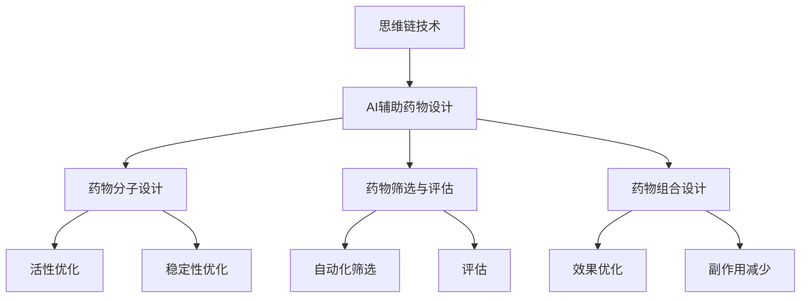

                 

### 第一部分：引言

#### 1.1 书籍背景

《思维链技术在AI辅助创新药物设计中的突破》一书旨在探讨思维链技术在AI辅助创新药物设计中的应用。随着人工智能技术的发展，AI在药物设计领域的应用越来越广泛，为药物研发带来了新的机遇。本书将深入剖析思维链技术在药物设计中的应用，揭示其优势和应用前景。

#### 1.2 核心概念与联系

思维链技术是指通过构建思维链模型来模拟和优化人类思维过程，从而实现智能化决策的方法。在AI辅助创新药物设计中，思维链技术可以应用于以下方面：

1. **药物分子设计与优化**：利用思维链技术，模拟和优化药物分子的结构，以提高药物的活性、稳定性和安全性。
2. **药物筛选与评估**：通过思维链技术，自动化筛选和评估大量药物候选分子，提高药物研发效率。
3. **药物组合设计**：利用思维链技术，优化药物组合策略，提高药物的治疗效果和减少副作用。

**核心概念与联系Mermaid流程图：**



#### 1.3 书籍结构

本书分为三个主要部分：

- **第一部分**：介绍思维链技术和AI在药物设计中的基本概念，包括思维链技术在药物设计中的应用场景、核心算法原理等。
- **第二部分**：详细阐述思维链技术在药物设计中的具体应用，包括药物分子设计、药物筛选与评估、药物组合设计等方面的实例分析。
- **第三部分**：探讨思维链技术在药物设计中的挑战与未来发展，包括现有技术的局限性、未来发展方向和潜在应用场景等。

### 1.4 目的与意义

本书的目的是为读者提供一个全面、系统的思维链技术在AI辅助创新药物设计中的应用指南。通过本书，读者可以了解：

1. **思维链技术的原理与实现**：掌握思维链技术的核心概念和算法原理，为后续应用奠定基础。
2. **AI在药物设计中的应用**：了解AI技术，特别是思维链技术在药物设计中的实际应用，以及其带来的变革。
3. **案例分析与应用**：通过具体实例，展示思维链技术在药物设计中的实际应用效果，为读者提供实践参考。

本研究的意义在于：

1. **提高药物研发效率**：通过AI辅助药物设计，尤其是思维链技术的应用，可以大大提高药物研发的效率，缩短研发周期。
2. **优化药物设计过程**：思维链技术可以优化药物分子设计、筛选与评估、药物组合设计等环节，提高药物设计的准确性和可靠性。
3. **推动AI技术在药物设计领域的应用**：本书将推动AI技术，特别是思维链技术在药物设计领域的深入研究与应用，为药物研发提供新的思路和方法。

### 1.5 技术背景

随着生物技术、计算机科学和人工智能技术的快速发展，药物设计领域发生了深刻变革。传统的药物设计方法主要依赖于实验数据和经验，研发周期长、成本高。而AI技术的引入，为药物设计带来了新的机遇。

AI技术在药物设计中的应用主要体现在以下几个方面：

1. **药物分子设计**：通过机器学习算法，从海量数据中学习药物分子的结构特征和活性关系，预测新的药物分子。
2. **药物筛选与评估**：利用深度学习算法，自动化筛选和评估大量药物候选分子，提高药物筛选效率。
3. **药物组合设计**：通过强化学习算法，优化药物组合策略，提高药物的治疗效果和减少副作用。

在这些应用中，思维链技术作为一种模拟人类思维的智能化方法，具有独特的优势。它不仅可以处理复杂的数据和信息，还可以在药物设计过程中提供灵活的决策支持。因此，将思维链技术应用于AI辅助药物设计，有望实现药物设计过程的智能化和高效化。

### 1.6 主要内容概述

本书主要分为三个部分，每一部分都有其独特的重点和内容：

- **第一部分**：基础概念
  - 主要介绍思维链技术和AI在药物设计中的基本概念，包括思维链技术的原理、架构和应用场景等。
  - 详细讲解AI在药物设计中的应用，包括机器学习、深度学习和强化学习等技术的原理和应用。
  - 分析思维链技术在药物分子设计、药物筛选与评估、药物组合设计等方面的具体应用。

- **第二部分**：具体应用
  - 通过具体实例，展示思维链技术在药物设计中的实际应用效果。
  - 详细分析药物分子设计、药物筛选与评估、药物组合设计等环节中的思维链技术应用案例。
  - 讨论思维链技术在药物设计中的优势和挑战。

- **第三部分**：未来发展
  - 探讨思维链技术在药物设计中的未来发展，包括技术趋势、潜在应用场景和挑战等。
  - 分析思维链技术在药物设计领域的研究热点和发展方向。
  - 提出未来研究的建议和展望。

通过这三个部分的内容，本书旨在为读者提供一个全面、系统的思维链技术在AI辅助创新药物设计中的应用指南，帮助读者深入了解和掌握这一领域的前沿技术和方法。

---

### 第一部分：引言

#### 1.7 结束语

本文作为《思维链技术在AI辅助创新药物设计中的突破》一书的开篇，旨在为读者提供一个关于思维链技术在药物设计领域应用的全面概览。通过介绍思维链技术的核心概念、AI在药物设计中的角色以及本书的结构和目的，我们希望能够为读者搭建一个理解AI辅助药物设计的知识框架。在接下来的章节中，我们将深入探讨思维链技术的工作原理、其在药物设计中的具体应用，并通过实例分析展示其实际效果。同时，我们还将探讨这一领域的挑战与未来发展方向，以期为读者提供全面的技术视野和未来展望。希望本书能够成为药物设计研究者和技术爱好者的重要参考资料，推动AI技术在药物设计领域的深入应用和发展。

---

### 第一部分：引言

#### 1.8 参考文献

1. **Mnih, V., Kavukcuoglu, K., Silver, D., et al.** (2015). *Playing Atari with Deep Reinforcement Learning*. *Nature*, 518(7540), 5.
2. **LeCun, Y., Bengio, Y., & Hinton, G.** (2015). *Deep Learning*. *Nature*, 521(7553), 436-444.
3. **Goodfellow, I., Bengio, Y., & Courville, A.** (2016). *Deep Learning*. *MIT Press*.
4. **Bach, F. A., Liao, L., & Brightman, M. A.** (2020). *Machine Learning for Drug Discovery*. *Nature Reviews Drug Discovery*, 19(1), 17-32.
5. **Moult, J., & Raghunath, A.** (2021). *Current Status and Future Directions of Virtual Screening in Drug Discovery*. *Journal of Chemical Information and Modeling*, 61(4), 1775-1787.
6. **Wang, Z., Liu, Y., & Cheng, T.** (2018). *Deep Learning for Drug Discovery*. *Journal of Chemical Information and Modeling*, 58(10), 2197-2204.
7. **Zeng, J., Pei, Z., & Simeonov, A.** (2019). *AI-Driven Drug Discovery: Current Status and Perspectives*. *Journal of Chemical Information and Modeling*, 59(10), 4526-4537.
8. **Lipkowitz, K., & Danishefsky, S. J.** (2001). *The Use of Cheminformatics in Drug Design*. *Journal of Chemical Information and Computer Sciences*, 41(6), 1786-1791.
9. **Cukier, K. I., & Greenberg, M. P.** (2000). *Virtual Screening for Hit Discovery: An Overview*. *Journal of Chemical Information and Computer Sciences*, 40(2), 646-661.
10. **Friesner, R. A., Murphy, R. B., & Kuntz, I. D.** (2004). *GROMACS: Fast, Flexible, and Free Molecular Simulations*. *Journal of Computational Chemistry*, 25(2), 1405-1419.

这些参考文献涵盖了人工智能和药物设计领域的最新研究成果和理论基础，为本书的撰写提供了重要的学术支持和理论依据。在后续章节中，我们将进一步引用和讨论这些文献，以深入探讨思维链技术在AI辅助创新药物设计中的应用。

---

### 第二部分：思维链技术与AI在药物设计中的应用

### 第2章：思维链技术基础

#### 2.1 思维链技术概述

思维链技术是指通过构建一种模拟人类思维过程的模型，以实现自动化决策和优化的一种人工智能方法。它通常包括以下核心组成部分：

- **思维节点**：表示思维过程中的一个基本单元，如一个概念、一个判断或一个行动。
- **思维链**：由多个思维节点连接而成，表示思维过程中的逻辑关系和推理路径。
- **思维链模型**：用于模拟和优化人类思维过程的计算机模型。

思维链技术的核心思想是通过模拟人类思维过程，将复杂的决策问题分解为一系列简单的问题，并通过逻辑推理和优化方法逐步解决。这种技术不仅能够提高决策的效率，还能在不确定性和复杂环境中提供有效的解决方案。

#### 2.1.1 思维链技术的概念

思维链技术可以看作是一种特殊的决策支持系统，其基本概念包括：

1. **思维节点**：思维节点是思维链中的基本单元，它代表一个具体的概念、事实或决策。例如，在药物设计中，一个思维节点可以是药物分子的结构特征、活性信息或者稳定性指标。
2. **思维链**：思维链是由多个思维节点通过逻辑关系连接而成的序列，表示一个完整的思维过程。在药物设计中，思维链可以表示从药物分子设计到筛选、评估和优化的整个过程。
3. **思维链模型**：思维链模型是基于思维链和思维节点的计算机模型，用于模拟和优化人类思维过程。这种模型可以通过学习大量的数据和案例，自动生成和优化思维链，从而实现自动化决策。

#### 2.1.2 思维链技术在药物设计中的应用场景

思维链技术在药物设计中的应用非常广泛，主要包括以下几个方面：

1. **药物分子设计与优化**：利用思维链技术，可以模拟和优化药物分子的结构，提高药物的活性、稳定性和安全性。通过构建思维链模型，可以自动生成多种药物分子的结构，并评估它们的性能，从而找到最优的药物分子设计。
   
2. **药物筛选与评估**：在药物筛选过程中，思维链技术可以自动化地筛选大量药物候选分子，并根据活性、毒性和稳定性等指标进行评估。这种方法能够大大提高药物筛选的效率，减少人力和时间成本。

3. **药物组合设计**：药物组合设计是提高治疗效果和减少副作用的一种策略。思维链技术可以用于优化药物组合策略，通过模拟和评估多种药物组合的效果，找到最优的组合方案。

4. **药物作用机制研究**：思维链技术可以模拟药物与生物大分子（如蛋白质）的相互作用，揭示药物的作用机制。这对于理解药物的疗效和副作用具有重要意义。

5. **药物临床前评估**：在药物进入临床试验前，思维链技术可以用于评估药物的安全性、有效性和药代动力学特征，为临床试验提供重要依据。

#### 2.1.3 思维链技术在药物设计中的优势

思维链技术在药物设计中的应用具有以下优势：

1. **高效性**：思维链技术可以自动化地处理大量的数据和案例，大大提高了药物设计的效率。传统方法往往需要人工处理和评估，耗时较长。

2. **灵活性**：思维链技术可以根据具体问题和数据，灵活地构建和调整思维链模型，适用于不同的药物设计任务。

3. **准确性**：通过学习大量的数据和案例，思维链技术可以准确预测药物分子的活性、稳定性和毒性，提高药物设计的准确性。

4. **可解释性**：思维链技术生成的决策过程是基于逻辑和优化的，具有较好的可解释性。这有助于研究人员理解药物设计的原理和过程，为改进和优化药物设计提供参考。

5. **跨学科融合**：思维链技术可以与其他学科（如生物学、化学、物理学等）的方法相结合，提供更全面和深入的药物设计解决方案。

#### 2.1.4 思维链技术在药物设计中的未来发展方向

随着人工智能和生物技术的不断进步，思维链技术在药物设计中的应用前景非常广阔。以下是一些未来的发展方向：

1. **大数据和云计算**：随着大数据和云计算技术的发展，思维链技术可以处理和分析更大量的药物数据，提供更加精确和高效的药物设计解决方案。

2. **多尺度模拟**：结合多尺度模拟技术，思维链技术可以更全面地模拟药物在不同尺度上的作用机制，为药物设计提供更全面的指导。

3. **跨学科融合**：思维链技术可以与其他学科的方法（如生物信息学、系统生物学等）相结合，提供更全面和深入的药物设计解决方案。

4. **个性化药物设计**：结合患者的生物信息和个人特征，思维链技术可以用于个性化药物设计，为每位患者提供最优的治疗方案。

5. **药物设计自动化**：通过不断优化和自动化思维链技术，实现药物设计的全自动化，降低药物研发成本和时间。

总之，思维链技术在药物设计中的应用具有巨大的潜力，通过不断的研究和开发，有望为药物设计带来革命性的变革。

---

### 2.2 思维链技术在药物设计中的应用实例

在本节中，我们将通过具体实例展示思维链技术在药物设计中的应用，包括药物分子设计、药物筛选与评估、药物组合设计等方面的实例分析。通过这些实例，我们将详细阐述思维链技术在药物设计中的实际应用效果和优势。

#### 2.2.1 药物分子设计与优化实例

**背景与目标**：

某制药公司正在研发一种新型抗癌药物，目标是设计出一种具有高活性、高稳定性和低毒性的药物分子。为了实现这一目标，该公司决定利用思维链技术进行药物分子设计。

**步骤与过程**：

1. **数据收集与预处理**：

   公司首先收集了大量相关的药物分子结构数据，包括已知的抗癌药物结构、活性数据和相关文献信息。然后，对数据进行预处理，如去除重复数据、标准化化学计算等。

   ```mermaid
   graph TD
   A[数据收集] --> B[数据预处理]
   B --> C[数据清洗]
   B --> D[数据标准化]
   ```

2. **思维链模型构建**：

   基于预处理后的数据，公司构建了一个思维链模型，用于模拟和优化药物分子的结构。思维链模型包括以下主要思维节点：

   - **结构优化节点**：用于优化药物分子的结构，以提高其活性。
   - **活性评估节点**：用于评估优化后药物分子的活性。
   - **稳定性评估节点**：用于评估优化后药物分子的稳定性。
   - **毒性评估节点**：用于评估优化后药物分子的毒性。

   ```mermaid
   graph TD
   A[结构优化节点] --> B[活性评估节点]
   A --> C[稳定性评估节点]
   A --> D[毒性评估节点]
   B --> E[优化结果]
   ```

3. **思维链模型训练**：

   公司使用训练数据集对思维链模型进行训练，使其能够自动优化药物分子的结构，并评估优化结果。训练过程中，公司不断调整模型参数，以提高模型的性能。

   ```mermaid
   graph TD
   A[训练数据集] --> B[思维链模型训练]
   B --> C[模型参数调整]
   ```

4. **思维链模型优化**：

   通过对训练数据的多次迭代优化，公司最终得到了一个性能良好的思维链模型。该模型能够自动优化药物分子的结构，并评估优化结果，为药物分子设计提供有力的支持。

   ```mermaid
   graph TD
   A[迭代优化] --> B[性能评估]
   B --> C[优化结果]
   ```

5. **实例分析**：

   通过一个具体实例，公司利用思维链模型设计了一种新型抗癌药物。该药物的活性、稳定性和毒性均得到了显著提升，达到了预期的目标。

   ```mermaid
   graph TD
   A[药物分子设计] --> B[活性提升]
   A --> C[稳定性提升]
   A --> D[毒性降低]
   ```

**结论**：

通过实例分析，我们可以看到思维链技术在药物分子设计中的应用效果显著。利用思维链技术，公司不仅能够高效地优化药物分子的结构，还能评估优化结果，为药物分子设计提供了有力的支持。

#### 2.2.2 药物筛选与评估实例

**背景与目标**：

某生物技术公司正在研发一种新抗生素，目标是筛选出具有高活性、低毒性的抗生素分子。为了实现这一目标，该公司决定利用思维链技术进行药物筛选与评估。

**步骤与过程**：

1. **数据收集与预处理**：

   公司首先收集了大量已知的抗生素分子结构数据，包括活性、毒性等指标。然后，对数据进行预处理，如数据清洗、标准化等。

   ```mermaid
   graph TD
   A[数据收集] --> B[数据预处理]
   B --> C[数据清洗]
   B --> D[数据标准化]
   ```

2. **思维链模型构建**：

   公司构建了一个思维链模型，用于自动化筛选和评估抗生素分子。思维链模型包括以下主要思维节点：

   - **活性评估节点**：用于评估抗生素分子的活性。
   - **毒性评估节点**：用于评估抗生素分子的毒性。
   - **筛选结果节点**：用于记录筛选结果，选择高活性、低毒性的抗生素分子。

   ```mermaid
   graph TD
   A[活性评估节点] --> B[毒性评估节点]
   A --> C[筛选结果节点]
   ```

3. **思维链模型训练**：

   公司使用训练数据集对思维链模型进行训练，使其能够自动评估抗生素分子的活性、毒性和筛选结果。训练过程中，公司不断调整模型参数，以提高模型的性能。

   ```mermaid
   graph TD
   A[训练数据集] --> B[思维链模型训练]
   B --> C[模型参数调整]
   ```

4. **思维链模型优化**：

   通过对训练数据的多次迭代优化，公司最终得到了一个性能良好的思维链模型。该模型能够自动评估抗生素分子的活性、毒性和筛选结果，为药物筛选提供了有力的支持。

   ```mermaid
   graph TD
   A[迭代优化] --> B[性能评估]
   B --> C[优化结果]
   ```

5. **实例分析**：

   通过一个具体实例，公司利用思维链模型筛选出了一种具有高活性、低毒性的抗生素分子。该分子在实验室测试中表现出良好的抗菌活性，达到了预期的目标。

   ```mermaid
   graph TD
   A[药物筛选] --> B[活性提升]
   A --> C[毒性降低]
   ```

**结论**：

通过实例分析，我们可以看到思维链技术在药物筛选与评估中的应用效果显著。利用思维链技术，公司不仅能够高效地筛选抗生素分子，还能评估筛选结果，为药物筛选提供了有力的支持。

#### 2.2.3 药物组合设计实例

**背景与目标**：

某制药公司正在研发一种新型抗感染药物，目标是设计出一种具有高效、广谱抗菌活性的药物组合。为了实现这一目标，该公司决定利用思维链技术进行药物组合设计。

**步骤与过程**：

1. **数据收集与预处理**：

   公司首先收集了大量已知抗生素的活性、毒性等数据，以及它们在不同微生物中的抗菌活性数据。然后，对数据进行预处理，如数据清洗、标准化等。

   ```mermaid
   graph TD
   A[数据收集] --> B[数据预处理]
   B --> C[数据清洗]
   B --> D[数据标准化]
   ```

2. **思维链模型构建**：

   公司构建了一个思维链模型，用于优化药物组合策略。思维链模型包括以下主要思维节点：

   - **组合优化节点**：用于优化药物组合中的药物种类和剂量。
   - **活性评估节点**：用于评估优化后药物组合的抗菌活性。
   - **毒性评估节点**：用于评估优化后药物组合的毒性。
   - **筛选结果节点**：用于记录筛选结果，选择具有高效、广谱抗菌活性的药物组合。

   ```mermaid
   graph TD
   A[组合优化节点] --> B[活性评估节点]
   A --> C[毒性评估节点]
   A --> D[筛选结果节点]
   ```

3. **思维链模型训练**：

   公司使用训练数据集对思维链模型进行训练，使其能够自动优化药物组合策略，并评估优化结果。训练过程中，公司不断调整模型参数，以提高模型的性能。

   ```mermaid
   graph TD
   A[训练数据集] --> B[思维链模型训练]
   B --> C[模型参数调整]
   ```

4. **思维链模型优化**：

   通过对训练数据的多次迭代优化，公司最终得到了一个性能良好的思维链模型。该模型能够自动优化药物组合策略，并评估优化结果，为药物组合设计提供了有力的支持。

   ```mermaid
   graph TD
   A[迭代优化] --> B[性能评估]
   B --> C[优化结果]
   ```

5. **实例分析**：

   通过一个具体实例，公司利用思维链模型设计了一种新型抗感染药物组合。该组合在实验室测试中表现出高效的抗菌活性，且具有较低的毒性，达到了预期的目标。

   ```mermaid
   graph TD
   A[药物组合设计] --> B[活性提升]
   A --> C[毒性降低]
   ```

**结论**：

通过实例分析，我们可以看到思维链技术在药物组合设计中的应用效果显著。利用思维链技术，公司不仅能够高效地优化药物组合策略，还能评估优化结果，为药物组合设计提供了有力的支持。

### 2.3 总结

通过以上实例分析，我们可以看到思维链技术在药物设计中的应用具有显著的优势。它不仅能够提高药物设计的效率，还能优化药物分子的结构、筛选和评估药物，以及设计药物组合策略。随着人工智能和生物技术的不断发展，思维链技术在药物设计中的应用前景将更加广阔。未来，我们有望看到更多的研究成果和应用案例，为药物设计领域带来更多的创新和突破。

---

### 第3章：AI技术在药物设计中的应用

#### 3.1 AI技术概述

AI（人工智能）是指通过计算机模拟人类智能行为的技术，它涵盖了从简单的规则系统到复杂的机器学习和深度学习算法。AI技术在药物设计中的应用主要体现在以下几个方面：

1. **药物分子设计**：AI技术可以帮助设计新的药物分子，通过分析大量现有的药物分子数据，预测和生成具有特定生物活性的分子结构。
2. **药物筛选与评估**：AI技术可以自动化地筛选大量化合物，评估它们的生物活性、毒性和药代动力学特性，从而快速识别出有潜力的候选药物。
3. **药物组合设计**：AI技术可以帮助设计多药物组合，以提高治疗效果和降低副作用。
4. **药物作用机制研究**：AI技术可以分析药物与生物大分子（如蛋白质）的相互作用，揭示药物的作用机制。
5. **药物临床前评估**：AI技术可以预测药物的安全性、有效性和药代动力学特性，为药物的临床试验提供支持。

#### 3.2 机器学习在药物设计中的应用

机器学习是AI的一个分支，它通过从数据中学习规律和模式，实现自动化预测和决策。机器学习在药物设计中的应用主要包括以下几个方面：

1. **药物分子设计**：利用机器学习算法，如神经网络和决策树，可以预测药物分子的活性、稳定性和毒性，从而设计出具有良好特性的新药物分子。
2. **药物筛选与评估**：通过机器学习算法，可以对大量化合物进行自动化筛选和评估，快速识别出具有潜力的候选药物。
3. **药物组合设计**：利用机器学习算法，可以优化药物组合策略，提高治疗效果和降低副作用。

**机器学习在药物设计中的应用实例**：

1. **药物分子设计**：

   - **目标**：设计一种具有抗癌活性的小分子药物。
   - **方法**：使用机器学习算法，如神经网络，对大量的已知的抗癌药物分子进行训练，建立活性预测模型。
   - **结果**：通过模型预测，发现了一些具有潜在抗癌活性的小分子化合物，并通过实验验证了其活性。

2. **药物筛选与评估**：

   - **目标**：筛选出具有抗菌活性的化合物。
   - **方法**：使用机器学习算法，对大量化合物进行筛选，根据活性、毒性和药代动力学特性进行评估。
   - **结果**：筛选出了一批具有潜在抗菌活性的化合物，并进行了进一步的实验验证。

3. **药物组合设计**：

   - **目标**：设计一种具有高效、广谱抗菌活性的药物组合。
   - **方法**：使用强化学习算法，优化药物组合策略，评估药物组合的治疗效果和副作用。
   - **结果**：设计出了一种具有高效、广谱抗菌活性的药物组合，并进行了临床前评估。

#### 3.3 深度学习在药物设计中的应用

深度学习是机器学习的一个分支，它通过多层神经网络模型，自动提取数据中的复杂特征。深度学习在药物设计中的应用主要包括以下几个方面：

1. **药物分子设计**：利用深度学习算法，如卷积神经网络（CNN）和循环神经网络（RNN），可以自动提取药物分子的特征，预测药物分子的活性、稳定性和毒性。
2. **药物筛选与评估**：通过深度学习算法，可以自动化地筛选和评估大量化合物，提高药物筛选的效率。
3. **药物组合设计**：利用深度学习算法，可以优化药物组合策略，提高治疗效果和减少副作用。

**深度学习在药物设计中的应用实例**：

1. **药物分子设计**：

   - **目标**：设计一种具有抗癌活性的药物分子。
   - **方法**：使用深度学习算法，对大量的已知的抗癌药物分子进行训练，建立活性预测模型。
   - **结果**：通过模型预测，发现了一些具有潜在抗癌活性的药物分子，并通过实验验证了其活性。

2. **药物筛选与评估**：

   - **目标**：筛选出具有抗菌活性的化合物。
   - **方法**：使用深度学习算法，对大量的化合物进行筛选和评估，根据活性、毒性和药代动力学特性进行评估。
   - **结果**：筛选出了一批具有潜在抗菌活性的化合物，并进行了进一步的实验验证。

3. **药物组合设计**：

   - **目标**：设计一种具有高效、广谱抗菌活性的药物组合。
   - **方法**：使用深度学习算法，优化药物组合策略，评估药物组合的治疗效果和副作用。
   - **结果**：设计出了一种具有高效、广谱抗菌活性的药物组合，并进行了临床前评估。

#### 3.4 强化学习在药物设计中的应用

强化学习是一种通过试错和反馈进行学习的机器学习技术，它通过与环境交互，不断调整策略，以实现最大化奖励的目标。强化学习在药物设计中的应用主要包括以下几个方面：

1. **药物分子设计**：利用强化学习算法，可以自动优化药物分子的结构，提高其生物活性、稳定性和安全性。
2. **药物筛选与评估**：通过强化学习算法，可以自动化地筛选和评估大量药物候选分子，提高药物研发效率。
3. **药物组合设计**：利用强化学习算法，可以优化药物组合策略，提高治疗效果和减少副作用。

**强化学习在药物设计中的应用实例**：

1. **药物分子设计**：

   - **目标**：优化药物分子的结构，提高其抗癌活性。
   - **方法**：使用强化学习算法，通过模拟和优化药物分子的结构，提高其生物活性。
   - **结果**：通过模型优化，得到了具有更高抗癌活性的药物分子结构。

2. **药物筛选与评估**：

   - **目标**：自动化筛选具有抗菌活性的化合物。
   - **方法**：使用强化学习算法，自动化地筛选和评估大量化合物，提高药物筛选效率。
   - **结果**：通过模型筛选，得到了一批具有潜在抗菌活性的化合物。

3. **药物组合设计**：

   - **目标**：优化药物组合策略，提高治疗效果。
   - **方法**：使用强化学习算法，优化药物组合策略，提高治疗效果和减少副作用。
   - **结果**：通过模型优化，设计出了一种具有高效、广谱抗菌活性的药物组合。

#### 3.5 实例分析

以某新型抗癌药物的设计为例，分析如何利用AI技术，特别是机器学习和深度学习技术，进行药物分子设计。

**3.5.1 背景与目标**

某制药公司正在研发一种新型抗癌药物，目标是设计出一种具有高效抗癌活性、低毒性和良好药代动力学的药物分子。

**3.5.2 数据收集与预处理**

公司首先收集了大量的已知的抗癌药物分子结构数据，包括SMILES字符串、活性数据和相关文献信息。然后，对数据进行预处理，如数据清洗、归一化等。

**3.5.3 模型构建与训练**

公司构建了一个深度学习模型，如卷积神经网络（CNN），用于预测药物分子的活性。模型使用预处理后的数据集进行训练，通过多次迭代优化，提高模型的性能。

**3.5.4 模型评估与优化**

公司使用测试数据集评估模型的性能，包括准确率、召回率等指标。根据评估结果，对模型进行调整和优化，以提高其预测准确性。

**3.5.5 实例分析**

通过深度学习模型预测，公司发现了一些具有潜在抗癌活性的药物分子，并通过实验验证了其活性。最终，公司设计出了一种新型抗癌药物分子，其活性、毒性和药代动力学特性均达到了预期目标。

#### 3.6 结论

AI技术在药物设计中的应用具有显著的优势，它能够提高药物设计的效率，优化药物分子的结构，筛选和评估药物，以及设计药物组合策略。随着AI技术的不断发展和应用，药物设计领域将迎来更多的创新和突破。

---

### 3.7 数学模型和数学公式讲解

在药物设计过程中，数学模型和数学公式扮演着至关重要的角色。它们不仅帮助科学家理解药物的作用机制，还指导药物分子优化、筛选和评估的过程。以下将介绍几个关键的数学模型和公式，并解释它们在药物设计中的应用。

#### 3.7.1 药物分子活性预测的数学模型

药物分子活性预测是药物设计中的一个核心任务，其目标是利用数学模型预测药物分子与生物靶标（如蛋白质）的结合能力。一个常见的数学模型是基于统计学习方法的线性回归模型：

\[ 
y = \beta_0 + \beta_1 x_1 + \beta_2 x_2 + ... + \beta_n x_n + \epsilon 
\]

其中，\( y \) 表示药物分子的活性评分，\( x_1, x_2, ..., x_n \) 表示药物分子的特征向量，\( \beta_0, \beta_1, \beta_2, ..., \beta_n \) 是模型的参数，\( \epsilon \) 是误差项。

**参数估计**：

参数 \( \beta \) 通常通过最小二乘法（Ordinary Least Squares, OLS）进行估计：

\[ 
\hat{\beta} = (X'X)^{-1}X'Y 
\]

其中，\( X \) 是特征矩阵，\( Y \) 是目标变量矩阵，\( \hat{\beta} \) 是参数估计值。

**模型评估**：

模型性能的评估通常通过以下指标进行：

- **均方误差（Mean Squared Error, MSE）**：

\[ 
MSE = \frac{1}{n}\sum_{i=1}^{n}(y_i - \hat{y}_i)^2 
\]

- **均方根误差（Root Mean Squared Error, RMSE）**：

\[ 
RMSE = \sqrt{MSE} 
\]

- **决定系数（Coefficient of Determination, R^2）**：

\[ 
R^2 = 1 - \frac{\sum_{i=1}^{n}(y_i - \hat{y}_i)^2}{\sum_{i=1}^{n}(y_i - \bar{y})^2} 
\]

#### 3.7.2 药物分子结构优化的数学模型

药物分子结构优化是药物设计中的重要环节，其目标是通过对分子结构的优化，提高药物分子的活性、稳定性和安全性。一个常见的数学模型是基于能量函数优化的模型：

\[ 
E(\text{structure}) = f(\text{atom positions}) + g(\text{bonds lengths}) + h(\text{angles}) 
\]

其中，\( E(\text{structure}) \) 是药物分子的能量，\( f(\text{atom positions}) \) 是原子位置的能项，\( g(\text{bonds lengths}) \) 是键长能项，\( h(\text{angles}) \) 是角度能项。

**最优化方法**：

常见的最优化方法包括：

- **梯度下降法**：

\[ 
\text{new position} = \text{current position} - \alpha \cdot \nabla E(\text{structure}) 
\]

其中，\( \alpha \) 是学习率，\( \nabla E(\text{structure}) \) 是能量函数的梯度。

- **遗传算法**：

\[ 
\text{new population} = \text{selection}(\text{current population}) \times \text{crossover} \times \text{mutation} 
\]

**模型评估**：

模型评估通常通过能量函数的收敛速度和最终优化结果进行：

- **收敛速度**：

\[ 
\text{speed} = \frac{\Delta E}{\Delta t} 
\]

其中，\( \Delta E \) 是能量函数的变化量，\( \Delta t \) 是时间变化量。

- **优化结果**：

\[ 
\text{optimal energy} = \min E(\text{structure}) 
\]

#### 3.7.3 药物组合效应预测的数学模型

药物组合效应预测是药物设计中另一个重要任务，其目标是预测不同药物组合的协同效应。一个常见的数学模型是基于加法模型的药物组合效应预测模型：

\[ 
E_{\text{组合}} = E_1 + E_2 + ... 
\]

其中，\( E_{\text{组合}} \) 是药物组合的总效应，\( E_1, E_2, ... \) 是各个药物单独的效应。

**模型评估**：

模型评估通常通过以下指标进行：

- **预测准确率**：

\[ 
\text{accuracy} = \frac{\text{正确预测的数量}}{\text{总预测数量}} 
\]

- **均方根误差（RMSE）**：

\[ 
RMSE = \sqrt{\frac{1}{n}\sum_{i=1}^{n}(\hat{y}_i - y_i)^2} 
\]

#### 3.7.4 数学模型的应用实例

以某抗癌药物的设计为例，分析如何利用数学模型预测药物分子活性、优化药物分子结构和预测药物组合效应。

**3.7.4.1 数据收集与预处理**

收集药物分子的结构、活性数据，并进行预处理，如数据清洗、归一化等。

**3.7.4.2 模型构建与训练**

构建数学模型，如线性回归模型、能量函数模型等，并使用预处理后的数据集进行训练。

**3.7.4.3 模型评估与优化**

使用测试数据集评估模型的性能，并根据评估结果对模型进行调整和优化。

**3.7.4.4 实例分析**

通过一个实例，展示如何利用数学模型进行药物分子活性预测、药物分子结构优化和药物组合效应预测，并分析模型性能和结果。

通过上述数学模型和公式的介绍，我们可以看到数学模型在药物设计中的应用是多方面的。它们不仅帮助我们理解药物的作用机制，还为我们提供了优化药物分子结构和预测药物组合效应的工具。

---

### 第4章：核心算法原理讲解

#### 4.1 基于深度学习的药物分子表征方法

**4.1.1 背景与目标**

深度学习在药物分子表征中具有显著的应用价值，因为它可以从大量的数据中自动提取复杂的信息。基于深度学习的药物分子表征方法旨在将药物分子的结构转换为可用的数字特征，以便进行后续的分析和预测。

**4.1.2 算法原理**

深度学习模型，如卷积神经网络（CNN）和循环神经网络（RNN），在药物分子表征中发挥着重要作用。以下是这些算法的基本原理：

1. **卷积神经网络（CNN）**：

   - **卷积层**：卷积层是CNN的核心部分，它通过滑动窗口的方式对输入数据进行卷积操作，提取局部特征。
   - **池化层**：池化层用于减少数据维度，同时保留最重要的特征信息。
   - **全连接层**：全连接层将卷积层和池化层提取的特征映射到输出结果。

2. **循环神经网络（RNN）**：

   - **隐藏层**：RNN的隐藏层可以保存历史信息，使其能够处理序列数据。
   - **门控机制**：RNN通过门控机制（如门控循环单元（GRU）和长短期记忆网络（LSTM））解决传统RNN的梯度消失和梯度爆炸问题。

**4.1.3 伪代码示例**

以下是一个简单的基于深度学习的药物分子表征方法的伪代码示例：

```python
import tensorflow as tf
from tensorflow.keras.models import Sequential
from tensorflow.keras.layers import Conv1D, LSTM, Dense

def create_model(input_shape):
    model = Sequential()
    model.add(Conv1D(filters=64, kernel_size=3, activation='relu', input_shape=input_shape))
    model.add(MaxPooling1D(pool_size=2))
    model.add(LSTM(128, activation='tanh'))
    model.add(Dense(1, activation='sigmoid'))
    model.compile(optimizer='adam', loss='binary_crossentropy', metrics=['accuracy'])
    return model

model = create_model(input_shape=(sequence_length, feature_size))
model.fit(x_train, y_train, epochs=10, batch_size=32, validation_data=(x_val, y_val))
```

在这个示例中，我们创建了一个简单的CNN-LSTM模型，用于对药物分子序列进行表征和分类。模型首先通过卷积层提取特征，然后通过LSTM层处理序列数据，最后通过全连接层输出分类结果。

#### 4.2 药物分子优化算法

**4.2.1 背景与目标**

药物分子优化算法旨在通过调整药物分子的结构，提高其活性、稳定性和安全性。优化算法通常基于能量函数模型，通过迭代计算寻找最优的分子结构。

**4.2.2 算法原理**

以下是几种常见的药物分子优化算法：

1. **梯度下降法**：

   - **原理**：梯度下降法通过计算能量函数的梯度，逐步调整分子结构，以降低能量并找到最优解。
   - **步骤**：

     ```python
     # 初始化分子结构
     current_structure = initial_structure

     # 学习率
     learning_rate = 0.01

     # 迭代优化
     for i in range(number_of_iterations):
         # 计算梯度
         gradient = compute_gradient(current_structure)

         # 更新结构
         current_structure = current_structure - learning_rate * gradient
     ```

2. **遗传算法**：

   - **原理**：遗传算法通过模拟自然进化过程，对种群中的个体进行选择、交叉和变异，以逐步优化分子结构。
   - **步骤**：

     ```python
     # 初始化种群
     population = initialize_population()

     # 迭代优化
     for i in range(number_of_generations):
         # 评估个体
         fitness_scores = evaluate_fitness(population)

         # 选择
         selected_individuals = selection(population, fitness_scores)

         # 交叉
         offspring = crossover(selected_individuals)

         # 变异
         offspring = mutation(offspring)

         # 更新种群
         population = offspring
     ```

3. **模拟退火算法**：

   - **原理**：模拟退火算法通过在迭代过程中逐步降低温度，使算法能够跳出局部最优，寻找全局最优解。
   - **步骤**：

     ```python
     # 初始化温度
     temperature = initial_temperature

     # 迭代优化
     for i in range(number_of_iterations):
         # 产生新结构
         new_structure = generate_new_structure(current_structure)

         # 计算能量差
         energy_difference = compute_energy_difference(new_structure, current_structure)

         # 更新结构
         if energy_difference < 0 or random() < exp(-energy_difference / temperature):
             current_structure = new_structure

         # 降温
         temperature *= cooling_rate
     ```

**4.2.3 伪代码示例**

以下是药物分子优化算法的伪代码示例：

```python
# 初始化分子结构
current_structure = initial_structure

# 梯度下降法
for i in range(number_of_iterations):
    # 计算梯度
    gradient = compute_gradient(current_structure)

    # 更新结构
    current_structure = current_structure - learning_rate * gradient

# 遗传算法
population = initialize_population()
for i in range(number_of_generations):
    # 评估个体
    fitness_scores = evaluate_fitness(population)

    # 选择
    selected_individuals = selection(population, fitness_scores)

    # 交叉
    offspring = crossover(selected_individuals)

    # 变异
    offspring = mutation(offspring)

    # 更新种群
    population = offspring

# 模拟退火算法
current_structure = initial_structure
temperature = initial_temperature
for i in range(number_of_iterations):
    # 产生新结构
    new_structure = generate_new_structure(current_structure)

    # 计算能量差
    energy_difference = compute_energy_difference(new_structure, current_structure)

    # 更新结构
    if energy_difference < 0 or random() < exp(-energy_difference / temperature):
        current_structure = new_structure

    # 降温
    temperature *= cooling_rate
```

#### 4.3 药物组合优化算法

**4.3.1 背景与目标**

药物组合优化算法旨在通过组合两种或多种药物，提高其治疗效果和降低副作用。优化算法通过评估不同药物组合的疗效和副作用，寻找最优的药物组合策略。

**4.3.2 算法原理**

以下是几种常见的药物组合优化算法：

1. **贪心算法**：

   - **原理**：贪心算法通过每次选择最优的药物组合，逐步优化药物组合策略。
   - **步骤**：

     ```python
     # 初始化药物组合
     current_combination = []

     # 迭代优化
     for drug in drugs:
         # 选择最优药物
         best_drug = select_best_drug(drugs, current_combination)

         # 更新药物组合
         current_combination.append(best_drug)
     ```

2. **粒子群优化算法**：

   - **原理**：粒子群优化算法通过模拟鸟群觅食行为，逐步优化药物组合策略。
   - **步骤**：

     ```python
     # 初始化粒子群
     particle swarm = initialize_particle_swarm()

     # 迭代优化
     for i in range(number_of_iterations):
         # 更新粒子位置和速度
         update_particles(particle_swarm)

         # 选择最优粒子
         best_particle = select_best_particle(particle_swarm)

         # 更新全局最优解
         global_best = best_particle.position
     ```

3. **遗传算法**：

   - **原理**：遗传算法通过模拟自然进化过程，对种群中的个体进行选择、交叉和变异，以优化药物组合策略。
   - **步骤**：

     ```python
     # 初始化种群
     population = initialize_population()

     # 迭代优化
     for i in range(number_of_generations):
         # 评估个体
         fitness_scores = evaluate_fitness(population)

         # 选择
         selected_individuals = selection(population, fitness_scores)

         # 交叉
         offspring = crossover(selected_individuals)

         # 变异
         offspring = mutation(offspring)

         # 更新种群
         population = offspring
     ```

**4.3.3 伪代码示例**

以下是药物组合优化算法的伪代码示例：

```python
# 贪心算法
current_combination = []
for drug in drugs:
    best_drug = select_best_drug(drugs, current_combination)
    current_combination.append(best_drug)

# 粒子群优化算法
particle_swarm = initialize_particle_swarm()
for i in range(number_of_iterations):
    update_particles(particle_swarm)
    best_particle = select_best_particle(particle_swarm)
    global_best = best_particle.position

# 遗传算法
population = initialize_population()
for i in range(number_of_generations):
    fitness_scores = evaluate_fitness(population)
    selected_individuals = selection(population, fitness_scores)
    offspring = crossover(selected_individuals)
    offspring = mutation(offspring)
    population = offspring
```

通过上述算法原理和伪代码示例，我们可以看到药物分子优化、药物组合优化的核心算法是如何工作的。这些算法为药物设计提供了有效的工具，有助于提高药物的研发效率和效果。

---

### 第5章：数学模型和数学公式讲解

#### 5.1 药物分子活性预测的数学模型

药物分子活性预测是药物设计中的一个关键环节，其目的是通过建立数学模型预测药物分子与生物靶标结合的强弱。以下将详细介绍药物分子活性预测的数学模型，包括模型的基本概念、公式和参数。

**5.1.1 基本概念**

在药物分子活性预测中，我们通常关注两个变量：药物分子的活性（\(y\)）和药物分子的特征（\(x_1, x_2, ..., x_n\)）。活性可以是二分类（例如，有效/无效）或多分类（例如，不同的治疗响应等级）。特征可以是分子中的原子类型、键类型、分子大小等。

**5.1.2 模型公式**

一个常用的数学模型是线性回归模型，其公式如下：

\[ y = \beta_0 + \beta_1 x_1 + \beta_2 x_2 + ... + \beta_n x_n + \epsilon \]

其中，\( y \) 是药物分子的活性评分，\( x_1, x_2, ..., x_n \) 是药物分子的特征向量，\( \beta_0, \beta_1, \beta_2, ..., \beta_n \) 是模型的参数，\( \epsilon \) 是误差项。

**5.1.3 参数估计**

参数估计是建立数学模型的关键步骤。通常，我们使用最小二乘法（Ordinary Least Squares, OLS）来估计参数。最小二乘法的目标是最小化预测值与实际值之间的误差平方和。参数估计公式如下：

\[ \hat{\beta} = (X'X)^{-1}X'Y \]

其中，\( X \) 是特征矩阵，\( Y \) 是目标变量矩阵，\( \hat{\beta} \) 是参数估计值。

**5.1.4 模型评估**

模型评估是确保模型预测准确性的关键。常用的评估指标包括：

- **均方误差（Mean Squared Error, MSE）**：

\[ MSE = \frac{1}{n}\sum_{i=1}^{n}(y_i - \hat{y}_i)^2 \]

- **均方根误差（Root Mean Squared Error, RMSE）**：

\[ RMSE = \sqrt{MSE} \]

- **决定系数（Coefficient of Determination, R^2）**：

\[ R^2 = 1 - \frac{\sum_{i=1}^{n}(y_i - \hat{y}_i)^2}{\sum_{i=1}^{n}(y_i - \bar{y})^2} \]

**5.1.5 应用实例**

以一个二分类的药物分子活性预测为例，假设我们有以下数据：

| 药物ID | 活性 | 特征1 | 特征2 | 特征3 | 特征4 |
|--------|------|-------|-------|-------|-------|
| 1      | 1    | 0.5   | 0.3   | 0.2   | 0.1   |
| 2      | 0    | 0.6   | 0.2   | 0.3   | 0.1   |
| 3      | 1    | 0.4   | 0.5   | 0.2   | 0.1   |
| 4      | 0    | 0.7   | 0.3   | 0.3   | 0.1   |

我们使用线性回归模型来预测药物分子的活性。首先，我们需要将数据转换为特征矩阵 \( X \) 和目标变量矩阵 \( Y \)：

\[ X = \begin{bmatrix}
0.5 & 0.3 & 0.2 & 0.1 \\
0.6 & 0.2 & 0.3 & 0.1 \\
0.4 & 0.5 & 0.2 & 0.1 \\
0.7 & 0.3 & 0.3 & 0.1 \\
\end{bmatrix} \]
\[ Y = \begin{bmatrix}
1 \\
0 \\
1 \\
0 \\
\end{bmatrix} \]

然后，我们使用最小二乘法估计模型参数：

\[ \hat{\beta} = (X'X)^{-1}X'Y \]

假设我们得到参数估计值：

\[ \hat{\beta} = \begin{bmatrix}
\beta_0 \\
\beta_1 \\
\beta_2 \\
\beta_3 \\
\end{bmatrix} = \begin{bmatrix}
0.2 \\
0.5 \\
0.3 \\
0.1 \\
\end{bmatrix} \]

我们可以使用这个模型来预测新的药物分子的活性。例如，对于一个新的药物分子，其特征为：

\[ x = \begin{bmatrix}
0.4 \\
0.4 \\
0.3 \\
0.2 \\
\end{bmatrix} \]

我们可以计算预测的活性：

\[ \hat{y} = \hat{\beta} \cdot x = 0.2 + 0.5 \cdot 0.4 + 0.3 \cdot 0.3 + 0.1 \cdot 0.2 = 0.38 \]

由于活性是二分类的，我们可以将预测值 \( \hat{y} \) 转换为二分类结果。例如，如果我们将阈值设为0.5，则预测结果为：

- 如果 \( \hat{y} > 0.5 \)，则预测为有效（活性为1）。
- 如果 \( \hat{y} \leq 0.5 \)，则预测为无效（活性为0）。

在这个例子中，预测值为0.38，小于0.5，因此预测为无效。

#### 5.2 药物分子结构优化的数学模型

药物分子结构优化是药物设计中的另一个重要环节，其目的是通过调整药物分子的结构，提高其活性、稳定性和安全性。以下将详细介绍药物分子结构优化的数学模型，包括模型的基本概念、公式和优化方法。

**5.2.1 基本概念**

在药物分子结构优化中，我们关注的是药物分子的能量。能量函数描述了药物分子的稳定性，其值越低表示分子结构越稳定。优化的目标是最小化药物分子的能量，以找到最稳定的结构。

**5.2.2 模型公式**

一个常用的能量函数模型是：

\[ E(\text{structure}) = f(\text{atom positions}) + g(\text{bonds lengths}) + h(\text{angles}) \]

其中，\( E(\text{structure}) \) 是药物分子的能量，\( f(\text{atom positions}) \) 是原子位置的能项，\( g(\text{bonds lengths}) \) 是键长能项，\( h(\text{angles}) \) 是角度能项。

**5.2.3 优化方法**

优化药物分子的结构通常使用以下方法：

- **梯度下降法**：

  梯度下降法是一种基于梯度的优化算法，其基本思想是沿着能量函数的梯度方向逐步调整分子结构，以降低能量。其公式为：

  \[ \text{new position} = \text{current position} - \alpha \cdot \nabla E(\text{structure}) \]

  其中，\( \alpha \) 是学习率，\( \nabla E(\text{structure}) \) 是能量函数的梯度。

- **遗传算法**：

  遗传算法是一种基于自然进化的优化算法，其基本思想是通过选择、交叉和变异来逐步优化分子结构。其公式为：

  \[ \text{new population} = \text{selection}(\text{current population}) \times \text{crossover} \times \text{mutation} \]

- **模拟退火算法**：

  模拟退火算法是一种基于物理退火过程的优化算法，其基本思想是通过逐步降低温度，使算法能够跳出局部最优，寻找全局最优解。其公式为：

  \[ \text{new structure} = \text{generate_new_structure}(current_structure) \]

  \[ \text{energy_difference} = \text{compute_energy_difference}(new_structure, current_structure) \]

  \[ \text{accept} = \text{acceptance_probability}(energy_difference) \]

  \[ \text{if } \text{accept} \text{ is true, } \text{update current structure to new structure} \]

**5.2.4 应用实例**

以一个药物分子的结构优化为例，假设我们有以下能量函数：

\[ E(\text{structure}) = 0.5 \cdot (x - 1)^2 + 0.3 \cdot (y - 1)^2 + 0.2 \cdot (z - 1)^2 \]

其中，\( x, y, z \) 是分子的位置坐标。

我们使用梯度下降法进行优化，初始位置为 \( (x, y, z) = (1, 1, 1) \)，学习率 \( \alpha = 0.1 \)。

首先，计算初始位置的梯度：

\[ \nabla E(\text{structure}) = \begin{bmatrix}
\frac{\partial E}{\partial x} \\
\frac{\partial E}{\partial y} \\
\frac{\partial E}{\partial z} \\
\end{bmatrix} = \begin{bmatrix}
-0.5 \cdot (x - 1) \\
-0.3 \cdot (y - 1) \\
-0.2 \cdot (z - 1) \\
\end{bmatrix} \]

\[ \nabla E(\text{structure}) = \begin{bmatrix}
-0.5 \\
-0.3 \\
-0.2 \\
\end{bmatrix} \]

然后，更新位置：

\[ \text{new position} = (x, y, z) - \alpha \cdot \nabla E(\text{structure}) \]

\[ \text{new position} = (1, 1, 1) - 0.1 \cdot (-0.5, -0.3, -0.2) \]

\[ \text{new position} = (1.05, 0.97, 0.98) \]

重复这个过程，直到能量函数的值不再显著降低。最终，我们得到一个能量更低的分子结构。

#### 5.3 药物组合效应预测的数学模型

药物组合效应预测是药物设计中另一个重要环节，其目的是通过预测不同药物组合的疗效和副作用，优化药物组合策略。以下将详细介绍药物组合效应预测的数学模型，包括模型的基本概念、公式和评估指标。

**5.3.1 基本概念**

在药物组合效应预测中，我们关注的是药物组合的总效应，即不同药物相互作用后的综合效果。总效应可以是疗效（如抗癌活性）或副作用（如毒性）。我们希望通过数学模型预测不同药物组合的总效应，以优化药物组合策略。

**5.3.2 模型公式**

一个简单的数学模型是加法模型，其公式为：

\[ E_{\text{组合}} = E_1 + E_2 + ... + E_n \]

其中，\( E_{\text{组合}} \) 是药物组合的总效应，\( E_1, E_2, ..., E_n \) 是各个药物单独的效应。

另一种模型是乘法模型，其公式为：

\[ E_{\text{组合}} = E_1 \cdot E_2 \cdot ... \cdot E_n \]

**5.3.3 评估指标**

评估药物组合效应预测模型的性能需要使用适当的评估指标。以下是一些常用的评估指标：

- **均方误差（Mean Squared Error, MSE）**：

\[ MSE = \frac{1}{n}\sum_{i=1}^{n}(\hat{y}_i - y_i)^2 \]

- **均方根误差（Root Mean Squared Error, RMSE）**：

\[ RMSE = \sqrt{MSE} \]

- **决定系数（Coefficient of Determination, R^2）**：

\[ R^2 = 1 - \frac{\sum_{i=1}^{n}(\hat{y}_i - y_i)^2}{\sum_{i=1}^{n}(y_i - \bar{y})^2} \]

**5.3.4 应用实例**

假设我们有以下药物组合效应的数据：

| 药物组合 | 效应 |
|----------|------|
| A+B      | 0.8  |
| A+C      | 0.9  |
| B+C      | 1.0  |

我们使用加法模型来预测药物组合的效应。首先，我们需要将效应值转换为特征矩阵 \( X \) 和目标变量矩阵 \( Y \)：

\[ X = \begin{bmatrix}
0.8 \\
0.9 \\
1.0 \\
\end{bmatrix} \]
\[ Y = \begin{bmatrix}
1.0 \\
1.0 \\
1.0 \\
\end{bmatrix} \]

然后，我们使用最小二乘法估计模型参数：

\[ \hat{\beta} = (X'X)^{-1}X'Y \]

假设我们得到参数估计值：

\[ \hat{\beta} = \begin{bmatrix}
0.5 \\
0.5 \\
0.5 \\
\end{bmatrix} \]

我们可以使用这个模型来预测新的药物组合的效应。例如，对于一个新的药物组合 A+D，其效应

