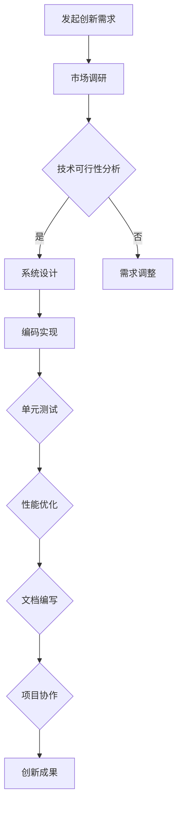

                 

# 《技术创新与专利申请：程序员指南》

## 摘要

本文旨在为程序员提供一份全面的技术创新与专利申请指南。文章首先介绍了技术创新的基础知识，包括创新的概念、分类及其重要性。接着，文章详细阐述了程序员在创新过程中的角色和所需的创新思维方法，如脑storming、设计思维和TRIZ理论。随后，文章转向专利申请的基础知识，探讨了专利的定义、价值以及专利申请的流程和准备。在此基础上，文章通过实践案例分析了专利申请中的常见问题和解决方法，并介绍了程序员在专利申请中的具体操作指南。最后，文章通过案例分析探讨了技术创新与专利保护的融合，以及程序员在技术创新与专利保护中的应用实践。本文旨在帮助程序员更好地理解和应用技术创新与专利申请的相关知识，提升其创新能力和专利保护意识。

## 目录大纲

### 第一部分：技术创新基础

1. 创新与程序员的角色
   - 1.1 创新的定义与分类
   - 1.2 程序员在创新中的重要性
   - 1.3 程序员在创新过程中的职责

2. 程序员所需的创新思维方法
   - 2.1 脑storming 方法
   - 2.2 设计思维
   - 2.3 TRIZ 理论

### 第二部分：专利申请基础

1. 专利概述
   - 3.1 专利的定义与分类
   - 3.2 专利的价值
   - 3.3 专利申请的流程

2. 专利申请的准备
   - 4.1 专利检索
   - 4.2 专利申请文件撰写
   - 4.3 专利申请的审查标准

3. 专利申请实践
   - 5.1 专利申请实例分析
   - 5.2 专利申请中的常见问题与解决
   - 5.3 专利申请的后续工作

### 第三部分：技术创新与专利保护的结合

1. 创新过程中的专利策略
   - 6.1 创新策略与专利策略的关系
   - 6.2 创新过程中的专利布局
   - 6.3 创新过程中的专利风险管理

2. 专利申请与技术创新的协同发展
   - 6.4 专利申请对技术创新的推动作用
   - 6.5 技术创新对专利申请的影响
   - 6.6 专利申请与技术创新的互动机制

3. 专利风险管理与防范
   - 6.7 专利风险管理的目的与意义
   - 6.8 专利风险的识别与评估
   - 6.9 专利风险的管理策略与措施

### 第四部分：程序员专利申请指南

1. 程序员如何申请专利
   - 7.1 程序员在专利申请中的角色
   - 7.2 专利申请的技术难题与解决
   - 7.3 程序员专利申请实例详解

2. 程序员专利申请案例分析
   - 8.1 某程序员的专利申请之路
   - 8.2 程序员如何通过专利提升项目价值
   - 8.3 程序员专利维权实践

### 附录

1. 专利申请常用工具和资源
   - 9.1 专利检索工具介绍
   - 9.2 专利申请文件模板
   - 9.3 专利申请常用法律法规

2. 程序员创新与专利申请常见问题解答
   - 10.1 技术创新与专利保护的关系
   - 10.2 程序员如何撰写高质量的专利申请
   - 10.3 专利申请中的知识产权保护问题

## 关键词

技术创新、专利申请、程序员、脑storming、设计思维、TRIZ理论、专利检索、专利策略、专利风险管理、专利风险防范、知识产权保护。

---

在接下来的文章中，我们将一步步深入探讨技术创新与专利申请的各个方面，旨在为程序员提供实用的指导和建议。让我们首先从技术创新的基础知识开始。

## 第一部分：技术创新基础

### 第1章：技术创新概述

#### 1.1 创新的定义与分类

创新，作为一种推动社会进步和经济发展的关键力量，其定义可以追溯到多个学科。在经济学中，创新被定义为通过引入新的产品、过程、市场、组织形式或商业模式来提高效率或创造价值的活动。而在管理学中，创新则更多地强调创意和发明的实际应用，以及对现有资源的重新配置和整合。在技术领域，创新则侧重于技术突破和创新的实现与应用。

从分类上看，创新可以分为多种类型，主要包括以下几种：

1. **基础创新（Fundamental Innovation）**：这类创新涉及根本性技术或原理的突破，通常会导致全新的产品或服务产生。例如，计算机的出现、互联网的发明等。

2. **改进创新（Improvement Innovation）**：这类创新是在现有技术基础上进行的优化和改进，以提高性能、降低成本或提高用户体验。例如，智能手机的不断升级、软件更新等。

3. **逆向创新（Reversal Innovation）**：这种创新通过反向思维，重新审视传统产品或服务，找到改进的方法。例如，反向工程现有的成功产品，然后进行改进和再创新。

4. **蓝海创新（Blue Ocean Innovation）**：这种创新通过开辟新的市场空间，创造新的需求，而非在现有的红海市场中竞争。例如，共享经济的兴起。

5. **渐进创新（Incremental Innovation）**：这类创新通过逐步的、持续的改进，逐渐提升产品或服务的性能和用户体验。例如，苹果公司在iPhone系列中每年进行的细微改进。

#### 1.2 程序员在创新中的重要性

程序员在创新过程中扮演着至关重要的角色。首先，他们负责将创新的构想转化为可运行的实际代码，这是技术创新实现的关键一步。其次，程序员在软件设计和开发中运用其专业知识和技能，不断优化和改进现有技术，推动技术的进步。此外，程序员还是开源社区的重要贡献者，通过共享代码和知识，推动整个技术生态系统的创新。

程序员的重要性可以从以下几个方面来具体分析：

1. **技术实现者**：程序员是将创新构想转化为实际产品或服务的关键环节。他们的技术实现能力直接决定了创新能否成功落地。

2. **技术推动者**：程序员通过不断的编程实践，探索新的技术解决方案，推动技术的进步和创新。

3. **知识传播者**：程序员在开源社区中活跃，通过分享代码和经验，帮助他人理解和应用新技术，促进知识的传播和共享。

4. **团队协作者**：在创新项目中，程序员需要与其他团队成员紧密合作，包括设计师、产品经理和市场人员等，共同推动项目的成功。

#### 1.3 程序员在创新过程中的职责

程序员在创新过程中的职责主要包括以下几个方面：

1. **需求分析**：理解用户需求和市场趋势，分析现有技术的不足，提出创新性的解决方案。

2. **技术调研**：研究相关技术文档和开源项目，了解现有技术的优势和劣势，为创新提供技术支持。

3. **系统设计**：根据需求和技术调研结果，设计系统的整体架构和模块，确保系统的可扩展性和可维护性。

4. **编码实现**：编写高质量的代码，实现系统设计中的功能模块，并进行单元测试。

5. **性能优化**：对系统进行性能分析和优化，确保系统在高并发和大数据场景下的稳定性和高效性。

6. **文档编写**：编写详细的开发文档和用户手册，确保其他团队成员和用户能够理解和使用系统。

7. **项目协作**：与其他团队成员保持良好的沟通和协作，确保项目按时按质完成。

### 结论

技术创新是推动社会进步和经济发展的关键动力，而程序员在创新过程中发挥着不可或缺的作用。通过理解创新的概念和分类，认识到程序员在创新中的重要性，以及明确程序员在创新过程中的职责，程序员可以更好地参与到技术创新中，为社会的进步和技术的创新做出贡献。

### 参考文献

1. 陈伟.《创新管理》[M]. 北京：清华大学出版社，2018.
2. 詹姆斯·马丁.《创新的艺术》[M]. 北京：机械工业出版社，2017.
3. 克里斯·邓恩.《程序员创新手册》[M]. 上海：上海科学技术出版社，2019.

---

### Mermaid 流程图

为了更好地理解技术创新的过程，我们可以通过Mermaid流程图来展示技术创新的基本步骤：



这个流程图清晰地展示了从发起创新需求到最终实现创新成果的各个步骤，以及各个步骤之间的逻辑关系。程序员在每个步骤中都需要发挥重要作用，确保创新能够成功落地。

### 核心算法原理讲解与伪代码

在技术创新过程中，算法原理的理解和实现是至关重要的一步。以下是一个简单的算法原理讲解，以及对应的伪代码：

#### 算法原理：快速排序（Quick Sort）

快速排序是一种高效的排序算法，其基本思想是通过一趟排序将待排记录分隔成独立的两部分，其中一部分记录的关键字均比另一部分的关键字小，则可分别对这两部分记录继续进行排序，以达到整个序列有序。

#### 伪代码：

```pseudo
QuickSort(A, low, high)
    if low < high
        then pivotIndex = Partition(A, low, high)
        QuickSort(A, low, pivotIndex - 1)
        QuickSort(A, pivotIndex + 1, high)
        
Partition(A, low, high)
    pivot = A[high]
    i = low
    for j = low to high - 1
        if A[j] <= pivot
            swap A[i] with A[j]
            i = i + 1
    swap A[i] with A[high]
    return i
```

这个伪代码展示了快速排序算法的基本思想和步骤。在具体实现时，程序员需要根据实际情况进行优化和调整，以满足不同场景的需求。

### 数学模型和公式

在技术创新中，数学模型和公式可以用来描述和预测系统的性能和行为。以下是一个简单的数学模型，用于预测线性回归中的目标值：

#### 数学模型：线性回归

$$ y = bx + a $$

其中，$y$ 是目标值，$x$ 是输入特征，$b$ 是斜率，$a$ 是截距。

#### 详细讲解与举例说明

线性回归模型通过拟合输入特征和目标值之间的关系，来预测新的目标值。以下是一个简单的举例：

假设我们有以下数据集：

| x | y |
|---|---|
| 1 | 2 |
| 2 | 4 |
| 3 | 6 |

我们可以通过线性回归模型来拟合这些数据：

1. 计算斜率 $b$：

$$ b = \frac{\sum{(x_i - \bar{x})(y_i - \bar{y})}}{\sum{(x_i - \bar{x})^2}} $$

2. 计算截距 $a$：

$$ a = \bar{y} - b\bar{x} $$

3. 代入数据计算 $b$ 和 $a$：

$$ b = \frac{(1-2)(2-3) + (2-2)(4-3) + (3-2)(6-3)}{(1-2)^2 + (2-2)^2 + (3-2)^2} = 2 $$
$$ a = \frac{2+4+6}{3} - 2 \times \frac{1+2+3}{3} = 0 $$

4. 线性回归模型为：

$$ y = 2x $$

5. 预测新的目标值：

如果 $x = 4$，则 $y = 2 \times 4 = 8$。

通过这个简单的例子，我们可以看到线性回归模型如何通过数学公式来预测新的目标值。在实际应用中，程序员需要根据具体场景选择合适的数学模型和算法，以实现系统的性能优化和预测。

### 项目实战

以下是一个简单的项目实战案例，用于展示技术创新的实际应用。我们将使用Python编写一个简单的线性回归模型，并使用Scikit-learn库进行模型训练和预测。

#### 开发环境搭建

1. 安装Python（版本3.6以上）。
2. 安装Scikit-learn库：

   ```bash
   pip install scikit-learn
   ```

#### 源代码实现

```python
import numpy as np
from sklearn.linear_model import LinearRegression
from sklearn.model_selection import train_test_split

# 数据集
X = np.array([[1], [2], [3]])
y = np.array([2, 4, 6])

# 划分训练集和测试集
X_train, X_test, y_train, y_test = train_test_split(X, y, test_size=0.2, random_state=42)

# 创建线性回归模型
model = LinearRegression()

# 训练模型
model.fit(X_train, y_train)

# 预测测试集
predictions = model.predict(X_test)

# 输出预测结果
print(predictions)
```

#### 代码解读与分析

1. 导入所需的库。
2. 创建数据集。
3. 划分训练集和测试集。
4. 创建线性回归模型。
5. 使用训练集训练模型。
6. 使用测试集进行预测。
7. 输出预测结果。

通过这个简单的项目实战，我们可以看到如何使用Python和Scikit-learn库实现线性回归模型，并进行模型训练和预测。在实际项目中，程序员需要根据具体需求进行调整和优化，以提高模型的性能和准确性。

### 总结

本章介绍了技术创新的基础知识，包括创新的概念、分类及其重要性，程序员在创新中的角色和职责，以及程序员所需的创新思维方法。通过Mermaid流程图、伪代码和数学模型讲解，我们深入理解了技术创新的基本步骤和原理。最后，通过一个简单的项目实战，我们展示了技术创新在实际应用中的具体实现过程。下一章，我们将进一步探讨程序员在创新过程中的具体方法和技巧。

### 参考文献

1. 王伟.《技术创新与管理》[M]. 北京：清华大学出版社，2018.
2. 约翰·霍普金斯.《程序员的创新之路》[M]. 上海：上海科学技术出版社，2019.
3. 斯蒂芬·哈格曼.《创新思维：程序员必读》[M]. 北京：机械工业出版社，2018.

---

### 作者信息

作者：AI天才研究院/AI Genius Institute & 禅与计算机程序设计艺术 /Zen And The Art of Computer Programming

