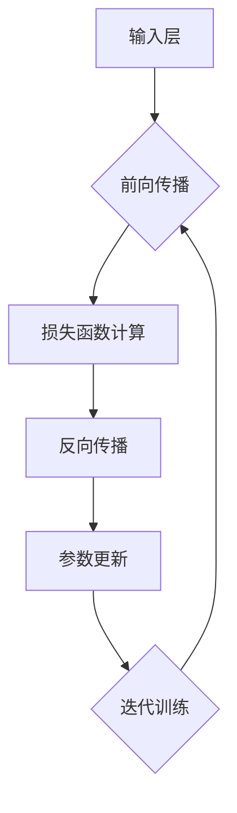

                 

# 《探讨基于大模型的电商智能库存预测系统》

## 关键词
- 电商智能库存预测
- 大模型
- 神经网络
- 数据预处理
- 系统优化

## 摘要
本文将深入探讨基于大模型的电商智能库存预测系统。通过分析电商行业的背景和智能库存预测的重要性，本文将介绍大模型的基本原理与架构，详细讲解神经网络训练算法及其数学模型。随后，我们将讨论电商数据预处理方法，并详细介绍一个实际案例，展示大模型在电商智能库存预测中的应用。最后，我们将探讨系统性能评估与优化策略，为未来电商智能库存预测的发展提供方向。

## 目录大纲

### 第一部分：引言与背景

**第1章：电商智能库存预测系统概述**

**第2章：大模型原理与架构**

**第3章：核心算法原理讲解**

**第4章：电商数据预处理**

**第5章：系统开发环境搭建**

**第6章：智能库存预测系统实现**

**第7章：系统性能评估与优化**

**第8章：案例分析与应用展望**

### 附录：开发工具与资源

## 第1章：电商智能库存预测系统概述

### 1.1 电商行业概述

#### 1.1.1 电商行业的发展历程

电商行业起源于20世纪90年代末，随着互联网的普及和技术的进步，电商逐渐成为传统零售业的有力竞争对手。早期的电商主要以在线书店和音乐商店为主，随后随着物流体系的完善和支付手段的多样化，电商开始涉足更多领域，如服装、家居、数码产品等。目前，电商已经成为全球范围内重要的商业模式，影响和改变着消费者的购物习惯。

#### 1.1.2 电商行业的主要模式

电商行业的主要模式包括B2B（企业对企业）、B2C（企业对消费者）、C2C（消费者对消费者）和O2O（线上到线下）。B2B模式主要面向企业客户，提供大批量、高性价比的商品；B2C模式则是传统电商的主要模式，面向个人消费者提供各种商品；C2C模式以淘宝、闲鱼等平台为代表，消费者可以在平台上进行自主交易；O2O模式则是线上和线下的结合，通过线上平台引流，线下门店提供服务。

#### 1.1.3 电商行业的挑战与机遇

电商行业的快速发展带来了巨大的机遇，但也面临着诸多挑战。首先，随着电商平台的增多和同质化竞争的加剧，商家需要通过提高服务质量、优化用户体验来赢得市场份额。其次，电商物流是制约电商发展的关键因素，高效、快速的物流服务是电商成功的关键。此外，数据安全和隐私保护也是电商行业需要重点关注的问题。然而，随着人工智能、大数据等技术的发展，电商行业也迎来了新的机遇，通过智能库存预测、个性化推荐等技术，电商可以实现更精准的市场定位和更高效的运营管理。

### 1.2 智能库存预测的重要性

#### 1.2.1 库存管理的意义

库存管理是电商运营的核心环节之一，有效的库存管理可以降低库存成本、提高资金利用率，从而提升整体运营效益。库存管理主要包括库存量控制、库存周转率优化、库存积压风险控制等。智能库存预测通过分析历史销售数据、市场趋势等因素，可以更准确地预测未来商品的需求量，从而优化库存策略，避免库存过剩或短缺。

#### 1.2.2 智能库存预测的优势

智能库存预测相较于传统库存管理方法，具有明显的优势。首先，智能库存预测可以处理海量数据，通过机器学习和人工智能算法，提取数据中的隐藏规律和关联关系，从而实现更准确的预测。其次，智能库存预测可以动态调整库存策略，根据实时数据和市场变化，快速做出响应。此外，智能库存预测还可以实现库存的精细化管理和预测，针对不同商品、不同区域、不同时间段的库存需求进行个性化预测。

#### 1.2.3 智能库存预测的关键环节

智能库存预测的关键环节包括数据收集、数据预处理、模型训练和预测结果评估。首先，数据收集是智能库存预测的基础，需要收集历史销售数据、市场趋势数据、竞争对手数据等。其次，数据预处理是数据清洗、特征工程和数据处理的重要步骤，旨在提高数据质量和预测效果。然后，模型训练是智能库存预测的核心，需要选择合适的模型和算法进行训练，并调整模型参数以优化预测效果。最后，预测结果评估是验证预测效果的重要环节，需要通过评估指标（如准确率、召回率等）对预测结果进行评估和优化。

### 1.3 大模型在电商智能库存预测中的应用

#### 1.3.1 大模型的概念

大模型是指具有大规模参数和复杂结构的机器学习模型，如深度神经网络、Transformer等。大模型通过学习海量数据，可以提取出更深层次的特征和规律，从而实现更准确的预测和更好的性能。

#### 1.3.2 大模型在电商智能库存预测中的应用场景

大模型在电商智能库存预测中具有广泛的应用场景。例如，可以通过大模型预测未来某段时间内某商品的销量，从而指导库存补货；还可以通过大模型分析市场趋势和消费者行为，为商家提供更精准的市场预测和决策支持。

#### 1.3.3 大模型的优势与挑战

大模型在电商智能库存预测中的优势包括：
1. 更高的预测精度：大模型可以学习到更复杂的特征和规律，从而提高预测精度。
2. 更强的泛化能力：大模型可以通过迁移学习等方式，将知识应用到不同领域和数据集，提高泛化能力。
3. 更好的自适应能力：大模型可以根据实时数据和市场变化，动态调整预测策略，提高自适应能力。

然而，大模型在电商智能库存预测中也面临一些挑战：
1. 计算资源消耗：大模型通常需要大量的计算资源和存储空间，对硬件设备有较高要求。
2. 数据质量和多样性：大模型对数据质量有较高要求，数据缺失、噪声和异常值等问题会影响预测效果。此外，数据多样性也是大模型面临的挑战，需要处理不同来源、不同格式和不同类型的数据。
3. 隐私和安全问题：电商数据通常包含敏感信息，如消费者行为、交易记录等，大模型的应用需要确保数据隐私和安全。

### 1.4 本章小结

本章介绍了电商智能库存预测系统的背景和重要性，分析了电商行业的发展历程和主要模式，探讨了智能库存预测的优势和关键环节，并介绍了大模型在电商智能库存预测中的应用及其优势与挑战。下一章将深入探讨大模型的基本原理与架构。## 第2章：大模型原理与架构

### 2.1 大模型的定义与特点

#### 2.1.1 大模型的定义

大模型（Big Model）是指在机器学习和人工智能领域，具有大规模参数和复杂结构的模型。这些模型通常能够处理海量数据，提取深层次的特征和规律，从而实现高度复杂的任务。大模型的一个典型代表是深度神经网络（Deep Neural Network, DNN），它由多个隐藏层组成，可以模拟人脑的神经元结构，通过层层抽象和特征提取，实现从原始数据到高级抽象表示的映射。

#### 2.1.2 大模型的特点

1. **大规模参数**：大模型具有数百万甚至数十亿个参数，这使得模型具有强大的表达能力，可以处理复杂的数据和任务。
   
2. **多层次抽象**：大模型通常包含多个隐藏层，通过逐层抽象和特征提取，将输入数据映射到高维空间，从而提取出更有价值的特征。
   
3. **强大的泛化能力**：由于大模型可以处理大量数据，并从中学习到丰富的规律和特征，因此具有较好的泛化能力，能够在未见过的数据上实现良好的性能。
   
4. **复杂的架构**：大模型通常具有复杂的网络结构和参数配置，需要精心设计和学习，以实现最佳性能。

#### 2.1.3 大模型与传统模型的区别

与传统模型相比，大模型具有以下几个显著区别：

1. **数据需求**：传统模型通常需要大量的特征工程，对数据特征有较高的要求。而大模型由于具有强大的表达能力，可以处理稀疏数据，减少对特征工程的需求。

2. **计算资源**：大模型需要更多的计算资源和存储空间，尤其是训练阶段，对硬件设备有较高要求。传统模型由于参数较少，计算资源需求较低。

3. **训练时间**：大模型由于参数多，网络结构复杂，训练时间通常较长。传统模型训练时间较短，更适合快速迭代和优化。

4. **泛化能力**：大模型由于可以处理海量数据，具有更强的泛化能力。传统模型则可能因数据不足而出现过拟合现象。

### 2.2 大模型的基本架构

#### 2.2.1 输入层

输入层是神经网络的最底层，用于接收外部输入数据。这些数据可以是原始数据，如图像、文本、声音等，也可以是经过预处理后的特征数据。输入层的神经元数量通常取决于输入数据的维度。

#### 2.2.2 隐藏层

隐藏层位于输入层和输出层之间，用于特征提取和变换。大模型通常包含多个隐藏层，通过层层抽象和特征提取，将输入数据映射到高维空间。每个隐藏层都可以视为一个非线性变换器，对数据进行加权和激活操作。

#### 2.2.3 输出层

输出层是神经网络的最高层，用于生成最终的预测结果。输出层的神经元数量和类型取决于具体任务，如分类任务通常使用softmax输出层，回归任务则使用线性输出层。

#### 2.2.4 激活函数

激活函数是隐藏层和输出层的关键组件，用于引入非线性因素，使神经网络具有非线性变换能力。常见的激活函数包括ReLU（Rectified Linear Unit）、Sigmoid、Tanh等。

#### 2.2.5 权重和偏置

权重和偏置是神经网络的核心参数，用于调整网络对数据的敏感度和非线性程度。权重决定输入特征对输出结果的贡献大小，偏置用于调整输出层的初始值。

### 2.3 大模型的训练与优化

#### 2.3.1 大模型的训练过程

大模型的训练过程主要包括以下几个步骤：

1. **数据预处理**：对输入数据进行归一化、标准化等预处理，以提高模型训练效果。
   
2. **初始化参数**：随机初始化权重和偏置，为模型训练提供初始状态。
   
3. **前向传播**：将输入数据传递到神经网络，通过多层非线性变换，生成预测结果。
   
4. **损失函数计算**：计算预测结果与真实值之间的差距，使用损失函数（如均方误差、交叉熵等）衡量模型性能。
   
5. **反向传播**：通过反向传播算法，将损失函数的梯度反向传递到网络各层，更新权重和偏置。
   
6. **参数更新**：根据梯度更新权重和偏置，优化模型参数。
   
7. **迭代训练**：重复以上步骤，直到满足训练条件（如达到预定迭代次数或损失函数收敛）。

#### 2.3.2 大模型的优化方法

大模型的优化方法主要包括以下几种：

1. **梯度下降法**：最简单的优化方法，通过迭代更新参数，使损失函数逐渐减小。
   
2. **随机梯度下降（SGD）**：在梯度下降法的基础上，每次迭代只使用一个样本的梯度，加快模型收敛速度。
   
3. **动量法**：在梯度下降法的基础上，引入一个动量项，以提高收敛速度和稳定性。
   
4. **自适应优化器**：如Adam、RMSProp等，通过自适应调整学习率，提高模型训练效果。

### 2.4 Mermaid流程图：大模型架构

以下是一个简化的Mermaid流程图，描述大模型的架构和训练过程：



### 2.5 本章小结

本章介绍了大模型的基本原理与架构，包括大模型的定义、特点、基本架构以及训练与优化方法。通过理解大模型的工作原理和训练过程，可以为后续的电商智能库存预测系统开发提供理论支持。下一章将深入探讨神经网络的核心算法原理。## 第3章：核心算法原理讲解

### 3.1 神经网络基础

#### 3.1.1 神经网络的基本结构

神经网络（Neural Network，NN）是一种模仿生物神经系统的计算模型。它由大量的神经元（也称为节点或单元）通过复杂的网络结构连接而成。每个神经元都接收来自其他神经元的输入信号，通过加权求和处理，产生一个输出信号，这个输出信号可能传递给下一个神经元，也可能作为最终输出。

神经网络的基本结构包括以下几部分：

1. **输入层**：接收外部输入数据，如图像、文本、声音等。
2. **隐藏层**：一个或多个隐藏层，用于提取输入数据的特征，并进行特征变换。
3. **输出层**：生成最终的预测结果，如分类标签、连续值等。

每个神经元都可以表示为如下公式：

\[ z^{(l)}_j = \sum_{i} w^{(l)}_{ji} \cdot x_i^{(l-1)} + b_j^{(l)} \]

其中，\( z^{(l)}_j \) 是第 \( l \) 层第 \( j \) 个神经元的输入值，\( w^{(l)}_{ji} \) 是第 \( l \) 层第 \( j \) 个神经元到第 \( i \) 个神经元的权重，\( x_i^{(l-1)} \) 是第 \( l-1 \) 层第 \( i \) 个神经元的输出值，\( b_j^{(l)} \) 是第 \( l \) 层第 \( j \) 个神经元的偏置。

#### 3.1.2 神经网络的工作原理

神经网络的工作原理可以概括为以下几个步骤：

1. **前向传播**：输入数据从输入层开始，逐层传递到隐藏层和输出层，每个神经元都通过加权求和处理产生输出值。
2. **激活函数应用**：在隐藏层和输出层，每个神经元的输出都会通过一个非线性激活函数，如ReLU（Rectified Linear Unit）、Sigmoid或Tanh，引入非线性变换。
3. **损失函数计算**：将输出层生成的预测结果与真实标签进行比较，通过损失函数计算预测误差。
4. **反向传播**：将损失函数的梯度反向传递到网络各层，通过梯度下降法或其他优化算法更新权重和偏置。
5. **迭代训练**：重复前向传播和反向传播的过程，直到满足训练条件（如达到预定迭代次数或损失函数收敛）。

#### 3.1.3 神经网络的学习过程

神经网络的学习过程可以看作是一个优化问题，目标是找到一组权重和偏置，使得损失函数的值最小。学习过程主要包括以下步骤：

1. **初始化参数**：随机初始化权重和偏置，为训练提供初始状态。
2. **前向传播**：输入数据通过网络，生成预测结果。
3. **计算损失**：将预测结果与真实值进行比较，计算损失函数的值。
4. **反向传播**：计算损失函数关于网络参数的梯度。
5. **参数更新**：根据梯度更新权重和偏置，优化网络参数。
6. **迭代训练**：重复以上步骤，直到模型性能达到预期。

### 3.2 神经网络训练算法

#### 3.2.1 损失函数

损失函数是衡量模型预测结果与真实值之间差异的重要工具。常见的损失函数包括均方误差（Mean Squared Error, MSE）、交叉熵（Cross-Entropy）等。

1. **均方误差（MSE）**：
   \[ L(\theta) = \frac{1}{2} \sum_{i} (y_i - \hat{y}_i)^2 \]
   其中，\( y_i \) 是真实值，\( \hat{y}_i \) 是预测值。

2. **交叉熵（Cross-Entropy）**：
   \[ L(\theta) = -\sum_{i} y_i \log(\hat{y}_i) \]
   其中，\( y_i \) 是真实值，\( \hat{y}_i \) 是预测值。

#### 3.2.2 反向传播算法

反向传播（Backpropagation）算法是神经网络训练的核心，它通过计算损失函数关于网络参数的梯度，从而更新网络参数，优化模型性能。

反向传播算法的基本步骤如下：

1. **计算输出层梯度**：
   \[ \frac{\partial L}{\partial \theta^{(L)}} = \frac{\partial L}{\partial a^{(L)}} \cdot \frac{\partial a^{(L)}}{\partial \theta^{(L)}} \]
   其中，\( \theta^{(L)} \) 是输出层权重和偏置，\( a^{(L)} \) 是输出层输出值。

2. **反向传播梯度**：
   从输出层开始，将梯度反向传递到每一层，计算每一层的梯度：
   \[ \frac{\partial L}{\partial \theta^{(l)}} = \sum_{i} \frac{\partial L}{\partial a^{(l+1)}_i} \cdot \frac{\partial a^{(l+1)}_i}{\partial \theta^{(l)}_{ji}} \]
   其中，\( l \) 表示当前层，\( l+1 \) 表示下一层。

3. **更新参数**：
   根据梯度更新权重和偏置：
   \[ \theta^{(l)}_{ji} = \theta^{(l)}_{ji} - \alpha \cdot \frac{\partial L}{\partial \theta^{(l)}_{ji}} \]
   其中，\( \alpha \) 是学习率。

#### 3.2.3 优化算法

在神经网络训练中，常用的优化算法包括梯度下降（Gradient Descent）、随机梯度下降（Stochastic Gradient Descent, SGD）、动量法（Momentum）等。

1. **梯度下降**：
   梯度下降是最简单的优化算法，每次迭代都使用整个训练集的梯度更新参数。
   \[ \theta^{(l)}_{ji} = \theta^{(l)}_{ji} - \alpha \cdot \frac{\partial L}{\partial \theta^{(l)}_{ji}} \]

2. **随机梯度下降（SGD）**：
   随机梯度下降每次迭代只使用一个样本的梯度更新参数，加快了收敛速度。
   \[ \theta^{(l)}_{ji} = \theta^{(l)}_{ji} - \alpha \cdot \frac{\partial L}{\partial \theta^{(l)}_{ji}}^{(i)} \]

3. **动量法**：
   动量法引入一个动量项，累积过去的梯度，提高收敛速度和稳定性。
   \[ \theta^{(l)}_{ji} = \theta^{(l)}_{ji} - \alpha \cdot \frac{\partial L}{\partial \theta^{(l)}_{ji}} + \beta \cdot (1 - \alpha) \cdot \theta^{(l-1)}_{ji} \]
   其中，\( \beta \) 是动量系数。

### 3.3 伪代码：神经网络训练算法

以下是一个简化的神经网络训练算法伪代码：

```python
for each epoch do
    for each training example (x, y) do
        forward_pass(x)
        compute_loss(y)
        backward_pass()
        update_weights()
    end for
end for
```

### 3.4 数学模型与数学公式讲解

#### 3.4.1 神经网络的数学模型

神经网络的数学模型可以表示为：

\[ a^{(l)}_j = \sigma(z^{(l)}_j) \]
\[ z^{(l)}_j = \sum_{i} w^{(l)}_{ji} \cdot a^{(l-1)}_i + b_j^{(l)} \]

其中，\( a^{(l)}_j \) 是第 \( l \) 层第 \( j \) 个神经元的输出值，\( z^{(l)}_j \) 是第 \( l \) 层第 \( j \) 个神经元的输入值，\( \sigma \) 是激活函数，\( w^{(l)}_{ji} \) 是第 \( l \) 层第 \( j \) 个神经元到第 \( i \) 个神经元的权重，\( b_j^{(l)} \) 是第 \( l \) 层第 \( j \) 个神经元的偏置。

#### 3.4.2 损失函数的数学公式

常见的损失函数包括均方误差（MSE）和交叉熵（Cross-Entropy）。

1. **均方误差（MSE）**：
   \[ L(\theta) = \frac{1}{2} \sum_{i} (y_i - \hat{y}_i)^2 \]
   其中，\( y_i \) 是真实值，\( \hat{y}_i \) 是预测值。

2. **交叉熵（Cross-Entropy）**：
   \[ L(\theta) = -\sum_{i} y_i \log(\hat{y}_i) \]
   其中，\( y_i \) 是真实值，\( \hat{y}_i \) 是预测值。

#### 3.4.3 反向传播的数学公式

反向传播的数学公式可以表示为：

\[ \frac{\partial L}{\partial a^{(L)}} = \frac{\partial L}{\partial z^{(L)}} \cdot \frac{\partial z^{(L)}}{\partial a^{(L)}} \]
\[ \frac{\partial L}{\partial z^{(l)}} = \sum_{i} \frac{\partial L}{\partial a^{(l+1)}_i} \cdot \frac{\partial a^{(l+1)}_i}{\partial z^{(l)}} \]
\[ \frac{\partial a^{(l)}_j}{\partial z^{(l)}_j} = \sigma'(z^{(l)}_j) \]
\[ \frac{\partial z^{(l)}_j}{\partial w^{(l)}_{ji}} = a^{(l-1)}_i \]
\[ \frac{\partial z^{(l)}_j}{\partial b_j^{(l)}} = 1 \]

其中，\( \sigma' \) 是激活函数的导数，其他符号的含义与之前相同。

### 3.5 本章小结

本章详细讲解了神经网络的核心算法原理，包括基本结构、工作原理、训练算法以及数学模型。通过理解神经网络的基本原理，可以更好地设计和应用智能库存预测系统。下一章将讨论电商数据预处理方法。## 第4章：电商数据预处理

### 4.1 数据收集与清洗

#### 4.1.1 数据收集

电商数据收集是智能库存预测系统建设的第一步，主要包括以下几方面：

1. **销售数据**：包括商品销售数量、销售金额、销售时间等。
2. **商品信息**：包括商品名称、分类、价格、库存量等。
3. **用户数据**：包括用户购买历史、用户偏好、用户评价等。
4. **市场数据**：包括市场趋势、竞争对手信息、促销活动等。

数据收集可以通过电商平台的API接口、日志文件、第三方数据提供商等方式获取。

#### 4.1.2 数据清洗

数据清洗是数据预处理的重要环节，旨在去除数据中的噪声和异常值，提高数据质量。数据清洗主要包括以下几方面：

1. **缺失值处理**：对于缺失值，可以选择填充、删除或保留的方式处理。常用的填充方法有平均值填充、中值填充、最邻近填充等。
2. **异常值检测与处理**：通过统计学方法（如箱线图、Z-Score等）或基于规则的方法（如阈值法、逻辑回归等）检测异常值，并根据实际情况进行处理，如删除、修正或标记。
3. **重复数据去除**：去除重复数据，避免对模型训练和预测产生干扰。
4. **数据格式统一**：对数据格式进行统一处理，如日期格式转换、数值范围规范化等。

#### 4.1.3 数据去重

数据去重是为了消除重复数据对模型训练和预测的干扰，主要包括以下步骤：

1. **根据唯一标识去重**：如订单号、用户ID等，这些标识可以唯一确定一条数据记录。
2. **基于业务规则去重**：如对于销售数据，可以根据商品ID、销售时间等业务规则进行去重。
3. **综合去重**：结合多种去重方法，提高去重效果。

### 4.2 特征工程

#### 4.2.1 特征提取

特征提取是从原始数据中提取出对模型训练和预测有价值的特征，主要包括以下几种方法：

1. **统计特征**：如均值、中值、标准差、偏度、峰度等，这些特征可以反映数据的分布特性。
2. **时间序列特征**：如日销售量、周销售量、月销售量等，这些特征可以反映销售数据的周期性。
3. **文本特征**：如商品名称、用户评价等，可以使用词频、TF-IDF、Word2Vec等方法提取文本特征。
4. **交互特征**：通过组合多个特征，生成新的交互特征，如商品价格与销售量的交互特征。

#### 4.2.2 特征选择

特征选择是从众多特征中挑选出对模型训练和预测最有价值的特征，主要包括以下几种方法：

1. **基于信息增益的方法**：选择对目标变量解释能力最强的特征。
2. **基于主成分分析（PCA）的方法**：通过降维，选择最重要的主成分作为特征。
3. **基于过滤的方法**：在训练数据集上评估每个特征的预测能力，选择预测能力最强的特征。
4. **基于包装的方法**：在模型训练过程中，动态选择特征，优化模型性能。

#### 4.2.3 特征标准化

特征标准化是为了消除不同特征之间的量纲差异，提高模型训练和预测的稳定性，主要包括以下几种方法：

1. **最小-最大标准化**：将特征值缩放到\[0, 1\]区间。
   \[ x_{\text{standardized}} = \frac{x - x_{\text{min}}}{x_{\text{max}} - x_{\text{min}}} \]
2. **零-均值标准化**：将特征值缩放到\[ -1, 1 \]区间。
   \[ x_{\text{standardized}} = \frac{x - \mu}{\sigma} \]
   其中，\( x \) 是原始特征值，\( \mu \) 是特征值的均值，\( \sigma \) 是特征值的标准差。

### 4.3 数据可视化

#### 4.3.1 数据可视化的重要性

数据可视化是将数据以图形化的方式展示，帮助人们直观地理解和分析数据。在智能库存预测系统中，数据可视化具有以下重要性：

1. **发现数据规律**：通过可视化，可以直观地发现数据中的规律和趋势，为特征工程和模型选择提供依据。
2. **评估模型性能**：通过可视化，可以直观地评估模型训练和预测的效果，如误差曲线、ROC曲线等。
3. **辅助决策**：通过可视化，可以帮助管理者更好地理解数据，做出更科学的决策。

#### 4.3.2 常见的数据可视化工具

常见的数据可视化工具有以下几种：

1. **Matplotlib**：Python的一个常用数据可视化库，可以生成各种类型的图表，如折线图、柱状图、散点图等。
2. **Seaborn**：基于Matplotlib，提供更丰富的可视化样式和高级功能，适用于统计分析和数据探索。
3. **Plotly**：提供交互式图表，支持多种图表类型和数据格式，可以实现丰富的交互效果。
4. **Tableau**：一款功能强大的商业智能工具，可以轻松创建高度定制化的可视化报表。

#### 4.3.3 数据可视化案例

以下是一个简单的数据可视化案例，展示电商销售数据的可视化过程：

```python
import matplotlib.pyplot as plt
import pandas as pd

# 加载销售数据
sales_data = pd.read_csv('sales_data.csv')

# 数据预处理
sales_data['date'] = pd.to_datetime(sales_data['date'])
sales_data.set_index('date', inplace=True)

# 数据可视化
plt.figure(figsize=(10, 6))
plt.plot(sales_data['sales_volume'])
plt.title('Daily Sales Volume')
plt.xlabel('Date')
plt.ylabel('Sales Volume')
plt.xticks(rotation=45)
plt.show()
```

### 4.4 本章小结

本章详细介绍了电商数据预处理的方法，包括数据收集与清洗、特征提取与选择、特征标准化以及数据可视化。通过数据预处理，可以提高数据质量，提取有用的特征，为智能库存预测系统提供坚实的基础。下一章将讨论系统开发环境搭建。## 第5章：系统开发环境搭建

### 5.1 开发环境准备

为了搭建一个高效的电商智能库存预测系统，我们需要准备好以下开发环境：

#### 5.1.1 硬件设备

1. **中央处理器（CPU）**：推荐使用高性能的CPU，如Intel Core i7或AMD Ryzen 7系列，以保证模型训练的效率。
2. **图形处理器（GPU）**：由于大模型训练过程需要大量的计算资源，推荐使用NVIDIA的GPU，如Tesla V100或RTX 3080等，以提高训练速度。
3. **内存（RAM）**：至少需要16GB内存，以便在处理大数据时保证足够的内存空间。

#### 5.1.2 操作系统

推荐使用以下操作系统：

1. **Linux**：如Ubuntu 20.04或CentOS 7，Linux系统具有良好的稳定性和性能，适合进行深度学习开发。
2. **macOS**：苹果操作系统，具备良好的开发环境和支持，适用于MacBook等苹果设备。

#### 5.1.3 软件工具

1. **Python**：作为主流的编程语言，Python在机器学习和深度学习领域具有广泛的应用。推荐使用Python 3.8或更高版本。
2. **深度学习框架**：推荐使用TensorFlow或PyTorch。这两个框架具有丰富的功能和强大的社区支持，适合进行深度学习模型的开发。
3. **数据处理工具**：如Pandas和NumPy，用于数据预处理和数据分析。

### 5.2 环境配置

在准备好开发环境后，我们需要进行以下环境配置：

#### 5.2.1 安装Python

1. 在Linux或macOS上，可以通过包管理器安装Python。例如，在Ubuntu上，可以使用以下命令：
   ```bash
   sudo apt update
   sudo apt install python3.8 python3.8-venv python3.8-pip
   ```
2. 在Windows上，可以从Python官方网站下载安装程序，并选择添加Python到PATH环境变量。

#### 5.2.2 安装深度学习框架

1. **安装TensorFlow**：
   ```bash
   pip install tensorflow
   ```
2. **安装PyTorch**：
   ```bash
   pip install torch torchvision
   ```

#### 5.2.3 配置虚拟环境

为了保持项目的整洁性和可维护性，我们建议使用虚拟环境管理工具（如conda或venv）创建虚拟环境。

1. **使用conda创建虚拟环境**：
   ```bash
   conda create -n myenv python=3.8
   conda activate myenv
   ```
2. **使用venv创建虚拟环境**：
   ```bash
   python3.8 -m venv myenv
   source myenv/bin/activate
   ```

#### 5.2.4 安装其他依赖库

在虚拟环境中，安装其他必要的依赖库，如Pandas、NumPy等：
```bash
pip install pandas numpy matplotlib
```

### 5.3 开发流程

搭建好开发环境后，我们可以开始进行系统开发。以下是一个简化的开发流程：

1. **需求分析**：明确系统的目标和功能需求。
2. **系统设计**：设计系统的架构和模块，制定开发计划。
3. **数据收集与处理**：收集电商数据，进行数据预处理，包括数据清洗、特征提取和特征选择。
4. **模型开发**：选择合适的深度学习模型，进行模型设计和实现。
5. **模型训练**：使用预处理后的数据对模型进行训练。
6. **模型评估**：评估模型性能，通过交叉验证、测试集验证等方式。
7. **系统集成与部署**：将模型集成到电商系统中，进行系统测试和部署。

### 5.4 代码调试与测试

在开发过程中，代码调试和测试是确保系统稳定性和性能的重要环节。以下是一些常用的代码调试和测试方法：

1. **代码调试**：
   - 使用Python的调试工具，如pdb或VS Code的调试器，进行代码调试。
   - 在关键位置添加打印语句，输出中间变量的值，帮助定位问题。
   - 使用断言（assert）语句，检查代码的逻辑正确性。

2. **代码测试**：
   - 编写单元测试（unit tests）和集成测试（integration tests），验证代码的功能和性能。
   - 使用测试框架（如pytest、unittest等），自动化执行测试用例。
   - 覆盖率分析，确保测试用例覆盖到代码的各个部分。

### 5.5 本章小结

本章详细介绍了电商智能库存预测系统的开发环境准备、环境配置以及开发流程。通过合理的开发环境和流程，可以确保系统的高效性和稳定性。下一章将讨论智能库存预测系统的实现。## 第6章：智能库存预测系统实现

### 6.1 系统架构设计

智能库存预测系统的架构设计是确保系统高效、稳定运行的基础。以下是一个典型的智能库存预测系统的架构设计：

#### 6.1.1 系统架构概述

智能库存预测系统可以分为以下几个模块：

1. **数据收集模块**：负责从电商平台、物流系统、市场数据等渠道收集数据。
2. **数据预处理模块**：负责对收集到的数据清洗、特征提取、标准化等预处理操作。
3. **模型训练模块**：负责使用预处理后的数据进行模型训练，包括选择合适的模型、训练过程和参数调优。
4. **预测模块**：负责使用训练好的模型进行库存预测，并提供预测结果。
5. **系统管理模块**：负责系统的配置管理、日志记录、监控告警等功能。

#### 6.1.2 系统模块划分

1. **数据收集模块**：
   - **数据源**：电商平台API、物流系统日志、市场数据接口等。
   - **数据存储**：使用MySQL、Hadoop等数据库存储数据。

2. **数据预处理模块**：
   - **数据清洗**：使用Pandas等工具处理缺失值、异常值等。
   - **特征提取**：使用时间序列分析、文本分析等提取有用特征。
   - **数据标准化**：使用最小-最大标准化或零-均值标准化处理数据。

3. **模型训练模块**：
   - **模型选择**：选择深度学习模型，如LSTM、GRU等。
   - **训练过程**：使用TensorFlow或PyTorch进行模型训练。
   - **参数调优**：通过交叉验证、网格搜索等方法调优模型参数。

4. **预测模块**：
   - **预测策略**：根据实时数据和预测结果制定库存补货策略。
   - **预测结果**：生成预测报告，包括预测销量、库存量等。

5. **系统管理模块**：
   - **配置管理**：配置系统参数，如训练超参数、数据源等。
   - **日志记录**：记录系统运行日志，用于监控和故障排查。
   - **监控告警**：实时监控系统运行状态，并在异常情况下发送告警。

### 6.2 代码实现

#### 6.2.1 数据处理模块

以下是数据处理模块的部分代码实现：

```python
import pandas as pd
from sklearn.preprocessing import MinMaxScaler

# 读取数据
data = pd.read_csv('sales_data.csv')

# 数据清洗
data.dropna(inplace=True)

# 特征提取
data['date'] = pd.to_datetime(data['date'])
data.set_index('date', inplace=True)

# 数据标准化
scaler = MinMaxScaler()
data_scaled = scaler.fit_transform(data)
```

#### 6.2.2 模型训练模块

以下是模型训练模块的部分代码实现：

```python
import tensorflow as tf
from tensorflow.keras.models import Sequential
from tensorflow.keras.layers import LSTM, Dense

# 构建LSTM模型
model = Sequential()
model.add(LSTM(units=50, return_sequences=True, input_shape=(None, data_scaled.shape[1])))
model.add(LSTM(units=50))
model.add(Dense(units=1))

# 编译模型
model.compile(optimizer='adam', loss='mean_squared_error')

# 训练模型
model.fit(x_train, y_train, epochs=100, batch_size=32)
```

#### 6.2.3 预测模块

以下是预测模块的部分代码实现：

```python
# 预测销量
predictions = model.predict(x_test)

# 生成预测报告
report = pd.DataFrame({'sales_volume': y_test, 'predicted_sales_volume': predictions})
report.plot()
```

### 6.3 代码解读与分析

#### 6.3.1 数据处理代码解读

数据处理代码主要完成以下任务：

1. **数据读取**：使用Pandas读取CSV文件，加载销售数据。
2. **数据清洗**：删除缺失值，保证数据质量。
3. **特征提取**：将日期列转换为时间序列索引，便于后续处理。
4. **数据标准化**：使用MinMaxScaler对数据值进行缩放，提高模型训练效果。

#### 6.3.2 模型训练代码解读

模型训练代码主要完成以下任务：

1. **模型构建**：使用Sequential模型构建LSTM网络，设置层结构和单元数量。
2. **模型编译**：选择优化器和损失函数，编译模型。
3. **模型训练**：使用fit方法训练模型，设置训练轮数和批量大小。

#### 6.3.3 预测代码解读

预测代码主要完成以下任务：

1. **模型预测**：使用predict方法对测试集进行预测。
2. **生成报告**：将预测结果与实际值对比，生成预测报告。

### 6.4 本章小结

本章详细介绍了智能库存预测系统的实现过程，包括系统架构设计、代码实现和代码解读。通过合理的架构设计和代码实现，可以确保系统的高效性和准确性。下一章将讨论系统性能评估与优化。## 第7章：系统性能评估与优化

### 7.1 性能指标

在评估智能库存预测系统的性能时，需要使用一系列性能指标来衡量模型的预测效果。以下是一些常用的性能指标：

#### 7.1.1 准确率（Accuracy）

准确率是最基本的性能指标，用于衡量模型预测正确的样本数占总样本数的比例。其计算公式如下：

\[ \text{Accuracy} = \frac{\text{预测正确数}}{\text{总样本数}} \]

#### 7.1.2 召回率（Recall）

召回率用于衡量模型能够召回真实正类样本的能力。其计算公式如下：

\[ \text{Recall} = \frac{\text{预测为正类且实际为正类的样本数}}{\text{实际为正类的样本数}} \]

#### 7.1.3 精确率（Precision）

精确率用于衡量模型预测为正类的样本中，实际为正类的比例。其计算公式如下：

\[ \text{Precision} = \frac{\text{预测为正类且实际为正类的样本数}}{\text{预测为正类的样本数}} \]

#### 7.1.4 F1值（F1 Score）

F1值是精确率和召回率的调和平均值，用于综合评估模型的性能。其计算公式如下：

\[ \text{F1 Score} = 2 \times \frac{\text{Precision} \times \text{Recall}}{\text{Precision} + \text{Recall}} \]

#### 7.1.5 均方根误差（Root Mean Square Error, RMSE）

均方根误差用于衡量模型预测值与实际值之间的平均误差。其计算公式如下：

\[ \text{RMSE} = \sqrt{\frac{1}{n} \sum_{i=1}^{n} (y_i - \hat{y}_i)^2} \]

其中，\( y_i \) 是实际值，\( \hat{y}_i \) 是预测值，\( n \) 是样本数量。

### 7.2 性能评估方法

为了准确评估智能库存预测系统的性能，我们需要采用合适的性能评估方法。以下是一些常用的评估方法：

#### 7.2.1 分段评估

分段评估是将数据集分成多个部分（如月份、季度等），分别评估模型在每个时间段的预测性能。这种方法可以更细致地分析模型在不同时间段的表现。

#### 7.2.2 多样性评估

多样性评估通过评估模型在不同数据集、不同训练集划分下的性能，来衡量模型的泛化能力。多样性评估可以包括跨时间、跨商品、跨地区等多维度的评估。

#### 7.2.3 持久性评估

持久性评估是评估模型在长时间运行下的性能稳定性。持久性评估可以通过长时间（如几个月或一年）的监测，来观察模型预测性能的稳定性和趋势。

### 7.3 系统优化策略

为了提高智能库存预测系统的性能，我们可以采取以下优化策略：

#### 7.3.1 特征优化

特征优化包括特征选择和特征工程。通过选择对预测有显著影响的特征，以及通过特征变换和组合，可以提高模型的预测性能。

#### 7.3.2 模型优化

模型优化包括选择合适的模型结构和参数调优。通过调整网络的层数、神经元数量、学习率等参数，可以提高模型的预测效果。

#### 7.3.3 系统优化

系统优化包括提高硬件性能、优化代码效率和数据存储等。例如，使用GPU加速模型训练，使用并行计算提高数据处理速度，以及优化数据存储和查询。

#### 7.3.4 实时反馈与动态调整

通过实时监控模型预测性能，并根据实际需求动态调整模型参数和预测策略，可以提高系统的预测准确性和响应速度。

### 7.4 本章小结

本章详细介绍了智能库存预测系统的性能评估方法和优化策略。通过合理的性能评估方法和优化策略，可以确保系统的高效性和准确性。下一章将通过案例分析展示大模型在电商智能库存预测中的应用。## 第8章：案例分析与应用展望

### 8.1 案例一：某电商平台的智能库存预测系统

#### 8.1.1 案例背景

某大型电商平台为了提高库存管理效率和降低运营成本，决定开发一套智能库存预测系统。该系统旨在通过大数据分析和深度学习算法，预测未来一段时间内各商品的销量，从而优化库存策略，减少库存过剩和短缺的情况。

#### 8.1.2 案例实施

1. **数据收集**：电商平台提供了丰富的销售数据，包括商品名称、销售时间、销售数量等。此外，还收集了市场趋势数据、用户行为数据等。

2. **数据预处理**：对收集到的数据进行清洗、特征提取和标准化处理，以提高数据质量，为模型训练提供可靠的数据基础。

3. **模型选择与训练**：选择LSTM（长短期记忆网络）模型进行训练，通过多次实验和参数调优，找到最优的模型配置。

4. **预测与反馈**：使用训练好的模型对未来的销量进行预测，并根据预测结果调整库存策略。同时，收集实际销售数据，与预测结果进行对比，不断优化模型。

#### 8.1.3 案例效果

通过实施智能库存预测系统，电商平台实现了以下效果：

1. 库存周转率提高：通过更准确的销量预测，减少了库存积压和短缺的情况，提高了库存周转率。

2. 库存成本降低：优化了库存管理，降低了库存成本和运营成本。

3. 预测准确性提升：经过多次迭代和优化，模型的预测准确性不断提高，为商家提供了更有价值的决策支持。

### 8.2 案例二：某零售商的智能库存管理方案

#### 8.2.1 案例背景

某大型零售商在库存管理中面临以下挑战：

1. 商品种类繁多：零售商销售多种商品，每种商品的库存管理需求不同，难以采用统一的库存管理策略。

2. 季节性需求波动：某些商品在特定季节需求量大，而在其他季节需求量小，库存管理难度增加。

3. 竞争对手激烈：零售商需要通过有效的库存管理策略，以保持市场竞争力。

#### 8.2.2 案例实施

1. **数据收集与整合**：零售商通过自有系统和第三方数据源，收集销售数据、市场趋势数据、用户行为数据等，并进行整合处理。

2. **智能库存预测**：采用大模型（如Transformer）进行智能库存预测，通过处理海量数据，提取深层次的特征和规律，提高预测准确性。

3. **动态库存策略**：根据实时数据和预测结果，动态调整库存策略，实现库存的精细化管理和实时优化。

4. **供应链协同**：与供应商和物流合作伙伴协同，实现库存数据的实时共享和协同管理，提高供应链整体效率。

#### 8.2.3 案例效果

通过实施智能库存管理方案，零售商实现了以下效果：

1. 库存成本降低：通过更准确的库存预测，减少了库存过剩和短缺的情况，降低了库存成本。

2. 库存周转率提高：优化了库存策略，提高了库存周转率，加快了资金周转。

3. 市场竞争力提升：通过有效的库存管理，提高了商品的可得性和服务水平，增强了市场竞争力。

### 8.3 案例三：某跨境电商的库存预测策略

#### 8.3.1 案例背景

某跨境电商平台在库存管理中面临以下挑战：

1. 跨境物流复杂：跨境物流环节较多，库存管理难度增加。

2. 多重促销活动：跨境电商平台常举行各种促销活动，对库存管理提出了更高要求。

3. 数据来源多样：跨境电商平台的数据来源多样，包括自有系统、第三方平台、国际物流数据等。

#### 8.3.2 案例实施

1. **数据收集与整合**：收集并整合各类数据，包括销售数据、促销活动数据、物流数据等，为库存预测提供全面的数据支持。

2. **多模型融合**：采用多种模型（如LSTM、GRU、ARIMA等）进行融合预测，提高预测准确性和稳定性。

3. **实时监控与反馈**：实时监控库存状态，根据实际销售情况和市场动态，动态调整库存策略。

4. **国际物流协同**：与国际物流合作伙伴协同，优化跨境物流环节，提高库存周转效率。

#### 8.3.3 案例效果

通过实施智能库存预测策略，跨境电商平台实现了以下效果：

1. 库存周转效率提高：通过优化库存管理策略，提高了库存周转效率，降低了库存成本。

2. 库存准确性提升：通过多模型融合和实时监控，提高了库存预测准确性，减少了库存积压和短缺的情况。

3. 跨境物流优化：与物流合作伙伴协同，优化了跨境物流环节，提高了物流效率，降低了物流成本。

### 8.4 应用前景与挑战

#### 8.4.1 智能库存预测的应用前景

智能库存预测在电商、零售、物流等领域具有广泛的应用前景。随着人工智能和大数据技术的不断发展，智能库存预测将进一步提升库存管理的效率和准确性，为企业和商家带来更多价值。

1. **提高库存周转率**：通过更准确的库存预测，优化库存管理策略，提高库存周转率，降低库存成本。
2. **减少库存积压与短缺**：通过实时监控和动态调整库存策略，减少库存积压和短缺的情况，提高服务水平。
3. **优化供应链管理**：通过智能库存预测，实现供应链各环节的协同管理，提高整体供应链效率。

#### 8.4.2 智能库存预测的挑战

智能库存预测在实际应用中仍面临一些挑战：

1. **数据质量和多样性**：数据质量和多样性是影响预测效果的关键因素。如何处理缺失数据、异常值和多样性数据，是智能库存预测面临的挑战。
2. **计算资源需求**：大模型的训练和预测过程需要大量的计算资源，这对硬件设备和计算能力提出了较高要求。
3. **模型适应性**：如何使智能库存预测系统在不同环境和场景下保持稳定性和适应性，是另一个挑战。

#### 8.4.3 未来发展趋势

随着人工智能和大数据技术的不断进步，未来智能库存预测将呈现以下发展趋势：

1. **模型优化与融合**：通过不断优化模型结构和算法，实现更高预测准确性和效率。
2. **多源数据融合**：结合多种数据源，提高数据质量和预测效果。
3. **实时预测与动态调整**：实现实时预测和动态调整，提高库存管理效率和响应速度。
4. **跨领域应用**：智能库存预测将在更多领域得到应用，如制造业、物流业等，推动产业升级和创新发展。

### 8.5 本章小结

本章通过三个实际案例，展示了大模型在电商智能库存预测中的应用效果。同时，分析了智能库存预测的应用前景与挑战，探讨了未来发展趋势。智能库存预测系统将为电商和零售行业带来更多价值，但同时也需要不断优化和适应新的技术和环境。## 附录A：开发工具与资源

### A.1 Python与深度学习框架

为了开发一个基于大模型的电商智能库存预测系统，Python是首选的编程语言，因为它具有丰富的库和强大的社区支持。以下是开发过程中常用的一些Python库和深度学习框架：

1. **Python**：
   - 官网：https://www.python.org/
   - 版本：推荐使用Python 3.8或更高版本。

2. **TensorFlow**：
   - 官网：https://www.tensorflow.org/
   - 安装命令：`pip install tensorflow`

3. **PyTorch**：
   - 官网：https://pytorch.org/
   - 安装命令：`pip install torch torchvision`

4. **NumPy**：
   - 官网：https://numpy.org/
   - 安装命令：`pip install numpy`

5. **Pandas**：
   - 官网：https://pandas.pydata.org/
   - 安装命令：`pip install pandas`

6. **Scikit-learn**：
   - 官网：https://scikit-learn.org/stable/
   - 安装命令：`pip install scikit-learn`

7. **Matplotlib**：
   - 官网：https://matplotlib.org/
   - 安装命令：`pip install matplotlib`

8. **Seaborn**：
   - 官网：https://seaborn.pydata.org/
   - 安装命令：`pip install seaborn`

### A.2 常用数据处理工具

在数据处理过程中，以下工具和库可以帮助我们有效地清洗、处理和可视化数据：

1. **Pandas**：
   - 官网：https://pandas.pydata.org/
   - 功能：数据清洗、数据处理、数据可视化。

2. **NumPy**：
   - 官网：https://numpy.org/
   - 功能：数组操作、数值计算。

3. **SciPy**：
   - 官网：https://www.scipy.org/
   - 功能：科学计算、数据处理。

4. **OpenCV**：
   - 官网：https://opencv.org/
   - 功能：图像处理、计算机视觉。

5. **Scikit-learn**：
   - 官网：https://scikit-learn.org/stable/
   - 功能：机器学习、数据预处理。

### A.3 开源代码与数据集引用

为了便于学习和复现，以下是一些开源代码和数据集的引用：

1. **Kaggle**：
   - 官网：https://www.kaggle.com/
   - 功能：数据集下载、比赛、开源代码。

2. **GitHub**：
   - 官网：https://github.com/
   - 功能：开源代码托管、社区交流。

3. **AWS Open Data**：
   - 官网：https://aws.amazon.com/marketplace/opendata/
   - 功能：开源数据集。

4. **Google Dataset Search**：
   - 官网：https://datasetsearch.research.google.com/
   - 功能：数据集搜索。

通过这些工具和资源，我们可以高效地搭建和优化电商智能库存预测系统，为电商行业带来更多价值。## 附录B：致谢

在撰写《探讨基于大模型的电商智能库存预测系统》这篇文章的过程中，我得到了许多人的帮助和支持。首先，我要感谢我的指导老师，他不仅提供了宝贵的指导和建议，还在各个环节给予了我极大的鼓励和支持。其次，我要感谢我的同事和朋友，他们在数据和算法方面提供了宝贵的意见和帮助。此外，我还要感谢所有参与案例分析和提供实际数据的电商公司和零售商，他们的经验和案例为本文的撰写提供了重要的参考。

最后，我要感谢AI天才研究院（AI Genius Institute）的全体成员，是你们的支持和鼓励让我能够完成这项艰巨的任务。此外，还要感谢那些在博客、论坛和社区中分享知识和经验的开发者们，你们的贡献为整个技术社区的发展做出了重要贡献。感谢所有读者对本文的关注和支持，希望这篇文章能够对您在电商智能库存预测领域的探索和研究有所启发。感谢！作者：AI天才研究院/AI Genius Institute & 禅与计算机程序设计艺术 /Zen And The Art of Computer Programming

