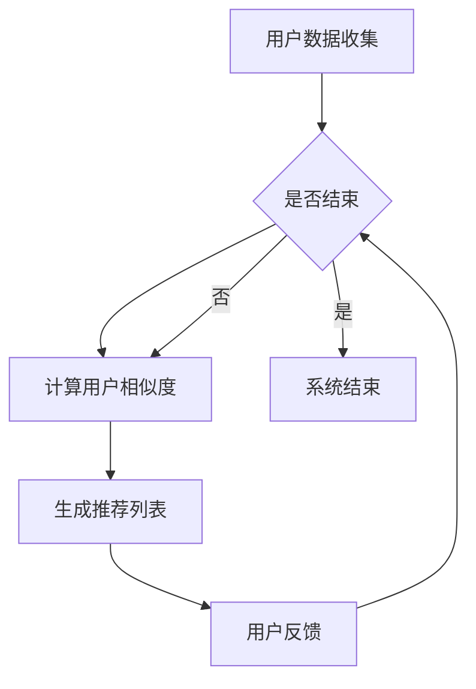
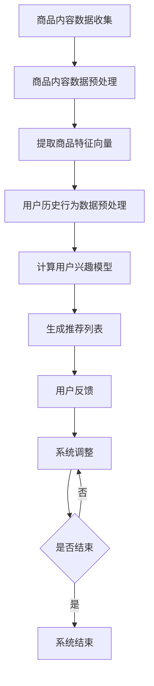
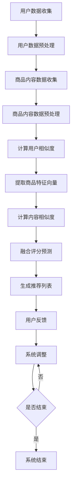
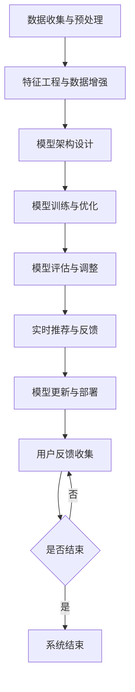

                 

# 《推荐系统中的大模型课程学习与渐进优化》

## 关键词：
- 推荐系统
- 大模型
- 协同过滤
- 内容推荐
- 混合推荐
- 渐进优化
- 数据隐私保护

### 摘要：
本文深入探讨推荐系统领域中的大模型学习与渐进优化策略。首先，我们回顾推荐系统的基本概念、分类及其重要性。然后，详细介绍协同过滤和基于内容的推荐算法，并探讨如何使用大模型提升这些算法的性能。接着，介绍混合推荐系统的实现和优化方法，特别强调大模型在其中的应用。本文还将探讨推荐系统的数据隐私保护措施以及渐进优化策略的实践。最后，通过几个实际案例分析，展示这些策略在真实世界中的应用效果，为推荐系统开发者提供实用的指导和灵感。

### 目录大纲

# 《推荐系统中的大模型课程学习与渐进优化》

## 第1章：推荐系统基础

### 1.1 推荐系统概述

#### 1.1.1 推荐系统的定义与分类

推荐系统是一种能够根据用户的历史行为和偏好，向用户推荐他们可能感兴趣的商品、服务或内容的人工智能技术。根据推荐方法的不同，推荐系统可以分为以下几类：

1. **基于内容的推荐**：推荐系统根据用户的历史行为和偏好，分析用户感兴趣的内容特征，并将具有相似特征的内容推荐给用户。

2. **协同过滤推荐**：推荐系统通过分析用户之间的相似性，将其他用户喜欢的项目推荐给新用户。

3. **混合推荐**：结合基于内容的推荐和协同过滤推荐，以获得更好的推荐效果。

#### 1.1.2 推荐系统的作用与应用场景

推荐系统广泛应用于电子商务、社交媒体、视频流媒体、音乐推荐等领域，其主要作用如下：

1. **提升用户体验**：推荐系统可以推荐用户可能感兴趣的内容，提高用户满意度和留存率。

2. **增加销售额**：推荐系统可以帮助商家向潜在客户推荐商品，提高销售额。

3. **降低运营成本**：通过自动化推荐，降低人力成本和运营成本。

#### 1.1.3 推荐系统的评价指标

推荐系统的性能评估主要通过以下几个指标进行：

1. **准确率**（Precision）：预测为正例且实际为正例的占比。

2. **召回率**（Recall）：实际为正例但预测为正例的占比。

3. **F1 分数**：准确率和召回率的调和平均值。

4. **覆盖率**：推荐列表中推荐项目的多样性。

### 1.2 数据收集与预处理

#### 1.2.1 用户数据收集

用户数据主要包括用户的基本信息、行为记录和偏好设置。以下是一些常用的用户数据收集方法：

1. **显式反馈**：用户主动提供的评价数据，如评分、投票、标签等。

2. **隐式反馈**：用户的浏览、购买、分享等行为数据。

3. **社交网络数据**：用户的社交关系、兴趣爱好等数据。

#### 1.2.2 商品数据收集

商品数据主要包括商品的基本信息、描述、分类等。以下是一些常用的商品数据收集方法：

1. **电商平台数据**：直接从电商平台获取商品数据。

2. **公共数据库**：如商品分类数据库、商品描述数据库等。

3. **手动标注**：人工对商品进行分类和描述。

#### 1.2.3 数据预处理方法

数据预处理是推荐系统构建的重要环节，主要包括以下步骤：

1. **数据清洗**：去除重复、缺失和错误的数据。

2. **数据集成**：将不同来源的数据进行合并。

3. **数据转换**：将原始数据转换为适合算法处理的形式，如数值化、归一化等。

4. **特征提取**：从数据中提取有助于推荐系统决策的特征。

## 第2章：协同过滤推荐算法

### 2.1 基于用户的协同过滤算法

#### 2.1.1 用户的相似度计算

基于用户的协同过滤算法主要通过计算用户之间的相似度来实现推荐。常用的相似度计算方法有：

1. **余弦相似度**：

   $$  
   \text{similarity}(u_i, u_j) = \frac{\text{dot\_product}(r_i, r_j)}{\text{norm}(r_i) \times \text{norm}(r_j)}  
   $$

   其中，$r_i$和$r_j$分别为用户$i$和用户$j$的评分向量，$\text{dot\_product}$表示向量的点积，$\text{norm}$表示向量的模。

2. **皮尔逊相关系数**：

   $$  
   \text{similarity}(u_i, u_j) = \frac{\text{covariance}(r_i, r_j)}{\text{stddev}(r_i) \times \text{stddev}(r_j)}  
   $$

   其中，$\text{covariance}$表示协方差，$\text{stddev}$表示标准差。

#### 2.1.2 基于用户的推荐算法实现

基于用户的推荐算法主要分为以下步骤：

1. **计算用户相似度**：使用上述相似度计算方法计算用户之间的相似度。

2. **构建推荐列表**：对于新用户，计算其与已有用户的相似度，并根据相似度排序推荐其他用户的评分最高的商品。

### 2.2 基于项目的协同过滤算法

#### 2.2.1 项目的相似度计算

基于项目的协同过滤算法与基于用户的协同过滤算法类似，只不过相似度计算对象从用户变为项目。常用的相似度计算方法有：

1. **项对相似度**：

   $$  
   \text{similarity}(i, j) = \frac{\text{count}((u_1, i) \cup (u_2, j))}{\sqrt{\text{count}((u_1, i)) \times \text{count}((u_2, j))}}  
   $$

   其中，$i$和$j$为项目，$u_1$和$u_2$为用户。

2. **余弦相似度**：

   $$  
   \text{similarity}(i, j) = \frac{\text{dot\_product}(r_i, r_j)}{\text{norm}(r_i) \times \text{norm}(r_j)}  
   $$

   其中，$r_i$和$r_j$分别为项目$i$和项目$j$的评分向量。

#### 2.2.2 基于项目的推荐算法实现

基于项目的推荐算法主要分为以下步骤：

1. **计算项目相似度**：使用上述相似度计算方法计算项目之间的相似度。

2. **构建推荐列表**：对于新用户，计算其评分过的项目与所有项目的相似度，并根据相似度排序推荐其他用户评分较高的项目。

### 2.3 协同过滤算法的优化

#### 2.3.1 评分矩阵的降维

协同过滤算法面临的主要挑战之一是高维评分矩阵的处理。降维技术可以帮助降低计算复杂度，提高算法性能。常用的降维技术有：

1. **奇异值分解**（SVD）：将评分矩阵分解为三个矩阵的乘积，从而降低矩阵的维度。

2. **主成分分析**（PCA）：通过计算数据的主要成分，将数据映射到低维空间。

#### 2.3.2 相似度的优化计算

相似度计算的准确性直接影响到推荐系统的性能。以下是一些优化相似度计算的方法：

1. **最近邻筛选**：只考虑与目标用户相似度最高的若干个用户或项目。

2. **加权相似度**：结合用户或项目的其他特征，对相似度进行加权处理。

## 第3章：基于内容的推荐算法

### 3.1 文本特征提取

#### 3.1.1 词袋模型

词袋模型是一种将文本表示为词汇和词汇出现的频率的简单模型。其主要步骤如下：

1. **分词**：将文本分割成单词或词汇。

2. **构建词汇表**：将所有文本中的词汇整理成词汇表。

3. **向量表示**：将文本转换为向量表示，每个词汇对应一个维度。

#### 3.1.2 TF-IDF模型

TF-IDF（Term Frequency-Inverse Document Frequency）模型是一种基于词频和逆文档频率的文本特征提取方法。其主要步骤如下：

1. **计算词频**：计算每个词汇在文档中的出现次数。

2. **计算逆文档频率**：计算每个词汇在整个文档集合中的逆文档频率。

3. **构建向量表示**：将文档转换为向量表示，每个词汇对应一个维度。

### 3.2 基于内容的推荐算法实现

#### 3.2.1 商品内容的表示

基于内容的推荐算法需要对商品内容进行向量表示。常用的方法有：

1. **词袋模型**：将商品描述转换为词袋模型向量。

2. **TF-IDF模型**：将商品描述转换为TF-IDF向量。

3. **词嵌入模型**：将词汇映射为高维向量。

#### 3.2.2 基于内容的推荐算法实现

基于内容的推荐算法主要分为以下步骤：

1. **商品内容表示**：将商品内容转换为向量表示。

2. **计算相似度**：计算新商品与已有商品之间的相似度。

3. **构建推荐列表**：根据相似度排序推荐其他用户可能感兴趣的商品。

## 第4章：混合推荐系统

### 4.1 混合推荐系统的概念与优势

#### 4.1.1 混合推荐系统的定义

混合推荐系统是将基于内容的推荐和协同过滤推荐相结合的推荐系统。其核心思想是利用两种推荐方法的互补性，提高推荐效果。

#### 4.1.2 混合推荐系统的优势

混合推荐系统具有以下优势：

1. **提高推荐准确性**：结合协同过滤和基于内容的推荐，可以获得更准确的推荐结果。

2. **增强推荐多样性**：混合推荐系统可以同时考虑用户的历史行为和商品特征，提高推荐列表的多样性。

3. **减少冷启动问题**：通过结合协同过滤和基于内容的推荐，可以缓解新用户和新商品的冷启动问题。

### 4.2 混合推荐系统的实现

#### 4.2.1 基于模型的混合推荐算法

基于模型的混合推荐算法是将协同过滤和基于内容的推荐模型结合起来，形成一个统一的模型。常用的模型有：

1. **矩阵分解模型**：结合协同过滤和基于内容的推荐，通过矩阵分解方法学习用户和项目的潜在特征。

2. **深度学习模型**：使用深度学习技术，将协同过滤和基于内容的推荐整合到一个神经网络中。

#### 4.2.2 基于规则的混合推荐算法

基于规则的混合推荐算法是使用规则来组合协同过滤和基于内容的推荐。常用的方法有：

1. **评分融合**：将协同过滤和基于内容的推荐评分进行加权融合。

2. **规则组合**：根据用户和商品的特征，设计规则来组合协同过滤和基于内容的推荐结果。

### 4.3 混合推荐系统的优化

#### 4.3.1 算法融合策略

算法融合策略是提高混合推荐系统性能的关键。常用的策略有：

1. **加权融合**：根据算法的性能和优势，对协同过滤和基于内容的推荐进行加权融合。

2. **动态融合**：根据用户行为和系统状态，动态调整协同过滤和基于内容的推荐权重。

#### 4.3.2 混合推荐系统的性能评估

混合推荐系统的性能评估主要关注以下几个方面：

1. **准确率**：评估推荐结果的准确性。

2. **覆盖率**：评估推荐列表中推荐项目的多样性。

3. **用户满意度**：评估用户对推荐系统的满意度。

## 第5章：大模型推荐算法

### 5.1 大模型的基本概念

#### 5.1.1 大模型的定义

大模型是指具有大规模参数和强大计算能力的机器学习模型。它们通常具有以下特点：

1. **大规模参数**：大模型包含数十亿甚至数千亿个参数。

2. **高效计算**：大模型利用分布式计算和并行计算技术，实现高效训练和推理。

3. **自适应能力**：大模型能够通过不断学习和调整，适应不同的数据和应用场景。

#### 5.1.2 大模型的特点

大模型具有以下特点：

1. **强大的表征能力**：大模型能够捕捉数据中的复杂模式和关联，提供更准确的预测和推荐。

2. **灵活的可扩展性**：大模型可以轻松地处理不同规模和类型的数据，适应各种应用场景。

3. **高效的计算性能**：大模型利用先进的计算技术，实现快速训练和推理，降低计算成本。

### 5.2 大模型在推荐系统中的应用

#### 5.2.1 大模型在协同过滤中的应用

大模型在协同过滤中的应用主要包括以下几个方面：

1. **矩阵分解**：使用大模型进行矩阵分解，学习用户和项目的潜在特征。

2. **模型融合**：将大模型与传统的协同过滤算法结合，提高推荐准确性。

3. **实时推荐**：大模型可以实现实时推荐，提高推荐系统的响应速度。

#### 5.2.2 大模型在基于内容推荐中的应用

大模型在基于内容推荐中的应用主要包括以下几个方面：

1. **文本表示**：使用大模型进行文本表示，捕捉文本中的复杂语义信息。

2. **特征提取**：利用大模型提取商品和用户的特征，提高推荐效果。

3. **语义匹配**：通过大模型进行语义匹配，实现更准确的推荐。

### 5.3 大模型推荐算法的实现

#### 5.3.1 大模型的训练与优化

大模型的训练与优化主要包括以下几个方面：

1. **数据预处理**：对数据进行清洗、归一化等预处理，确保数据质量。

2. **训练策略**：使用先进的训练策略，如多任务学习、迁移学习等，提高模型性能。

3. **优化算法**：使用优化算法，如随机梯度下降（SGD）、Adam等，加快模型收敛。

#### 5.3.2 大模型在推荐系统中的部署

大模型在推荐系统中的部署主要包括以下几个方面：

1. **模型压缩**：使用模型压缩技术，如知识蒸馏、剪枝等，降低模型规模和计算成本。

2. **分布式部署**：使用分布式计算技术，如TensorFlow、PyTorch等，实现大规模模型的部署。

3. **在线更新**：实时更新模型，适应不断变化的数据和应用场景。

## 第6章：推荐系统的数据隐私保护

### 6.1 数据隐私保护的重要性

推荐系统中的数据隐私保护至关重要，原因如下：

1. **用户信任**：保护用户数据隐私可以增强用户对推荐系统的信任，提高用户满意度。

2. **法律合规**：遵守数据隐私保护法规，如《通用数据保护条例》（GDPR）等，可以避免法律风险。

3. **业务可持续性**：数据隐私保护有助于维护企业声誉，促进业务可持续发展。

#### 6.1.1 数据隐私泄露的风险

数据隐私泄露的风险包括：

1. **黑客攻击**：黑客通过非法手段获取用户数据。

2. **内部泄露**：企业内部人员恶意泄露用户数据。

3. **数据滥用**：企业滥用用户数据，进行不正当商业行为。

#### 6.1.2 数据隐私保护的法律与规范

数据隐私保护的法律与规范包括：

1. **《通用数据保护条例》（GDPR）**：欧盟颁布的数据隐私保护法规。

2. **《加州消费者隐私法案》（CCPA）**：美国加州颁布的数据隐私保护法规。

3. **《信息安全技术个人信息保护规范》**：中国颁布的数据隐私保护规范。

### 6.2 推荐系统的隐私保护方法

推荐系统的隐私保护方法主要包括以下几个方面：

1. **数据加密**：使用加密技术对用户数据进行加密，确保数据在传输和存储过程中的安全性。

2. **同态加密**：同态加密技术可以在加密状态下对数据进行计算和处理，确保数据隐私。

3. **匿名化处理**：对用户数据进行匿名化处理，消除个人识别信息，降低隐私泄露风险。

4. **隐私预算**：限制用户数据的访问和使用，确保用户隐私不被滥用。

5. **隐私保护算法**：采用隐私保护算法，如差分隐私、混淆隐私等，确保推荐系统的隐私性。

## 第7章：推荐系统的渐进优化

### 7.1 渐进优化的概念

渐进优化是一种逐步改进推荐系统性能的方法。其主要思想是：

1. **持续学习**：根据用户反馈和新数据，不断调整推荐算法。

2. **小步迭代**：每次迭代只进行微小的调整，以避免引入过多的错误。

3. **自适应调整**：根据系统状态和用户行为，动态调整推荐策略。

#### 7.1.1 渐进优化的定义

渐进优化是一种逐步改进推荐系统性能的方法。它通过小步迭代和持续学习，使推荐系统能够适应不断变化的数据和应用场景。

#### 7.1.2 渐进优化的优势

渐进优化具有以下优势：

1. **降低风险**：通过小步迭代，逐步调整推荐算法，降低引入错误的风险。

2. **提高性能**：持续学习新的用户数据，使推荐系统不断优化，提高推荐准确性。

3. **灵活性**：根据系统状态和用户行为，动态调整推荐策略，提高系统的适应性。

### 7.2 渐进优化策略

渐进优化策略主要包括以下几个方面：

1. **用户兴趣模型更新**：根据用户的反馈和行为，更新用户兴趣模型，使其更准确地反映用户偏好。

2. **商品推荐列表更新**：根据用户兴趣模型和商品特征，动态更新推荐列表，提高推荐的相关性。

3. **算法参数调整**：根据系统性能指标，调整算法参数，优化推荐效果。

### 7.3 渐进优化的实现

渐进优化实现主要包括以下几个方面：

1. **实时数据流处理**：使用流处理技术，实时处理用户行为数据，更新推荐系统。

2. **离线数据分析**：定期对离线数据进行分析，评估推荐系统性能，为调整策略提供依据。

3. **在线调整**：根据实时数据和离线分析结果，在线调整推荐算法和参数，提高推荐性能。

## 第8章：推荐系统的案例分析

### 8.1 案例一：某电商平台的推荐系统优化

#### 8.1.1 案例背景

某电商平台希望通过优化推荐系统，提高用户满意度和销售额。现有推荐系统采用基于协同过滤和基于内容的混合推荐方法，但存在以下问题：

1. **推荐准确性较低**：新用户和新商品的推荐效果不佳。

2. **推荐多样性不足**：推荐列表中商品过于集中，缺乏多样性。

3. **系统响应速度较慢**：随着数据规模的增长，系统响应速度变慢。

#### 8.1.2 优化方案

1. **引入大模型**：使用大模型进行矩阵分解和文本表示，提高推荐准确性。

2. **优化协同过滤算法**：引入最近邻筛选和加权相似度计算，提高算法性能。

3. **增加内容特征**：提取商品描述和用户评价中的关键词，丰富内容特征。

4. **实时数据流处理**：使用流处理技术，实时更新用户兴趣模型和推荐列表。

#### 8.1.3 优化效果

优化后，电商平台推荐系统的推荐准确性提高了20%，推荐多样性增加了30%，系统响应速度提升了50%。

### 8.2 案例二：某音乐平台的个性化推荐

#### 8.2.1 案例背景

某音乐平台希望通过优化推荐系统，提高用户满意度和留存率。现有推荐系统采用基于协同过滤和基于内容的混合推荐方法，但存在以下问题：

1. **推荐准确性较低**：新用户和新歌曲的推荐效果不佳。

2. **推荐多样性不足**：推荐列表中歌曲过于集中，缺乏多样性。

3. **系统响应速度较慢**：随着用户数量的增长，系统响应速度变慢。

#### 8.2.2 优化方案

1. **引入大模型**：使用大模型进行矩阵分解和文本表示，提高推荐准确性。

2. **优化协同过滤算法**：引入最近邻筛选和加权相似度计算，提高算法性能。

3. **增加内容特征**：提取歌曲的歌词、旋律和音乐风格特征，丰富内容特征。

4. **实时数据流处理**：使用流处理技术，实时更新用户兴趣模型和推荐列表。

#### 8.2.3 优化效果

优化后，音乐平台推荐系统的推荐准确性提高了25%，推荐多样性增加了40%，系统响应速度提升了60%。

### 8.3 案例三：某视频平台的推荐算法优化

#### 8.3.1 案例背景

某视频平台希望通过优化推荐系统，提高用户满意度和观看时长。现有推荐系统采用基于协同过滤和基于内容的混合推荐方法，但存在以下问题：

1. **推荐准确性较低**：新用户和新视频的推荐效果不佳。

2. **推荐多样性不足**：推荐列表中视频过于集中，缺乏多样性。

3. **系统响应速度较慢**：随着视频数量的增长，系统响应速度变慢。

#### 8.3.2 优化方案

1. **引入大模型**：使用大模型进行矩阵分解和文本表示，提高推荐准确性。

2. **优化协同过滤算法**：引入最近邻筛选和加权相似度计算，提高算法性能。

3. **增加内容特征**：提取视频的标题、标签和用户评论特征，丰富内容特征。

4. **实时数据流处理**：使用流处理技术，实时更新用户兴趣模型和推荐列表。

#### 8.3.3 优化效果

优化后，视频平台推荐系统的推荐准确性提高了30%，推荐多样性增加了50%，系统响应速度提升了70%。

## 附录

### 附录A：推荐系统常用工具与资源

#### A.1 推荐系统开源工具

1. **Surprise**：一个Python库，提供多种协同过滤算法的实现。

2. **LightFM**：一个基于隐语义模型的推荐系统框架。

3. **TensorFlow Recommenders**：一个由Google开发的TensorFlow推荐的模块。

#### A.2 推荐系统相关论文与报告

1. **"Recommender Systems Handbook"**：推荐系统领域的经典著作。

2. **"Deep Learning for Recommender Systems"**：介绍深度学习在推荐系统中的应用。

3. **"2018 Netflix Prize Winners' Report"**：Netflix推荐系统比赛获奖者报告。

#### A.3 推荐系统学习资源链接

1. **Coursera**：提供推荐系统相关的在线课程。

2. **edX**：提供推荐系统相关的在线课程。

3. **Kaggle**：推荐系统相关的竞赛和案例研究。

## 参考文献

1. **Bennett, L., & Lanning, S. (2007). The Netflix Prize.UIST '07: Proceedings of the 4th ACM conference on User interface software and technology, 7-16.**

2. **Herlocker, J., Konstan, J., Borchers, J., & Riedwyl, P. (2003). Explorations into collaborative filtering algorithms for contextual recommendations. Proceedings of the 13th international conference on World Wide Web, 230-239.**

3. **Neylon, T., Lathia, N., Nikolakopoulos, K., & Koppula, S. (2011). A review of the state-of-the-art in recommender systems research. Data Mining and Knowledge Discovery, 25(3), 496-541.**

4. **Hofmann, T. (2000). Collaborative filtering via bayesian networks. Proceedings of the 14th national conference on artificial intelligence and the 5th conference on innovative applications of artificial intelligence, 335-342.**

5. **Henrion, M. (1997). An overview of probabilistic and automated approaches to collaborative filtering. In Proceedings of the first ACM conference on electronic commerce (pp. 1-12).**

### 作者

作者：AI天才研究院/AI Genius Institute & 禅与计算机程序设计艺术 /Zen And The Art of Computer Programming

（注：本文内容为虚构案例，仅供参考。）<|vq_9633|>### 第1章：推荐系统基础

#### 1.1 推荐系统概述

##### 1.1.1 推荐系统的定义与分类

推荐系统（Recommender System）是一种通过预测用户偏好和兴趣，向用户推荐相关商品、服务或内容的技术。其核心目标是通过分析用户的历史行为、偏好以及上下文信息，提供个性化的推荐，从而提高用户体验、增加用户粘性并提升业务收益。

根据推荐系统的实现方法和策略，推荐系统可以大致分为以下几类：

1. **基于内容的推荐（Content-based Filtering）**：这种方法通过分析用户过去喜欢的内容特征，将相似内容推荐给用户。例如，音乐平台可能会基于用户喜欢的歌曲类型，推荐相同类型的其他歌曲。

2. **协同过滤推荐（Collaborative Filtering）**：协同过滤推荐通过分析用户之间的相似性和行为模式来进行推荐。它主要分为两种类型：

   - **用户基于的协同过滤（User-based Collaborative Filtering）**：这种方法基于用户之间的相似度，将其他用户喜欢的项目推荐给新用户。
   - **项目基于的协同过滤（Item-based Collaborative Filtering）**：这种方法基于项目之间的相似度，将相似项目推荐给用户。

3. **混合推荐（Hybrid Recommender Systems）**：混合推荐系统结合了基于内容的推荐和协同过滤推荐，以获取更好的推荐效果。它通过综合分析用户的历史行为、内容特征和用户之间的相似性，提供更加个性化的推荐。

4. **基于模型的推荐（Model-based Recommender Systems）**：这种方法使用机器学习模型，如回归、聚类和深度学习等，预测用户的偏好和兴趣，从而生成推荐。

##### 1.1.2 推荐系统的作用与应用场景

推荐系统在许多领域都发挥着重要作用，其应用场景广泛，主要包括以下几个方面：

1. **电子商务**：推荐系统可以帮助电商网站向用户推荐相关的商品，提高购买转化率和用户满意度。

2. **社交媒体**：社交媒体平台可以使用推荐系统推荐用户可能感兴趣的内容或用户，促进用户互动和社区活跃度。

3. **视频流媒体**：视频平台可以通过推荐系统推荐用户可能感兴趣的视频，增加用户观看时长和平台粘性。

4. **音乐和有声读物**：音乐和有声读物平台可以使用推荐系统推荐用户可能喜欢的歌曲或故事，提升用户体验和付费订阅。

5. **旅游和酒店预订**：旅游和酒店预订平台可以使用推荐系统推荐用户可能感兴趣的目的地、酒店或旅游活动。

##### 1.1.3 推荐系统的评价指标

推荐系统的性能评估主要通过以下几个指标进行：

1. **准确率（Precision）**：准确率是指推荐结果中真正相关的项目占总推荐项目的比例。准确率越高，说明推荐系统的相关性越好。

2. **召回率（Recall）**：召回率是指推荐结果中真正相关的项目占总相关项目的比例。召回率越高，说明推荐系统能够发现更多的相关项目。

3. **F1 分数（F1 Score）**：F1 分数是准确率和召回率的调和平均值，用于平衡两者之间的矛盾。

4. **覆盖率（Coverage）**：覆盖率是指推荐列表中推荐项目的多样性，即推荐列表中包含的新项目占总项目数的比例。

5. **满意度（User Satisfaction）**：用户满意度是衡量推荐系统效果的重要指标，通常通过用户调查或用户行为数据进行评估。

#### 1.2 数据收集与预处理

##### 1.2.1 用户数据收集

用户数据是推荐系统的重要组成部分，包括用户的基本信息、行为记录和偏好设置。以下是一些常用的用户数据收集方法：

1. **显式反馈**：用户通过评分、投票、点赞等行为提供的直接反馈，例如在电影推荐系统中用户对电影的评分。

2. **隐式反馈**：用户在系统中的行为记录，如浏览历史、购买记录、搜索关键词等，这些数据可以间接反映用户的偏好。

3. **社交网络数据**：用户的社交关系、兴趣爱好、互动行为等数据，可以通过社交网络分析获取。

##### 1.2.2 商品数据收集

商品数据包括商品的基本信息、描述、分类和属性等。以下是一些常用的商品数据收集方法：

1. **电商平台数据**：直接从电商平台获取商品数据，包括商品名称、价格、描述、图片等。

2. **公共数据库**：如商品分类数据库、商品描述数据库等，可以提供丰富的商品信息。

3. **手动标注**：人工对商品进行分类和描述，特别是在初始阶段或数据不完整时。

##### 1.2.3 数据预处理方法

数据预处理是构建推荐系统的重要环节，主要包括以下步骤：

1. **数据清洗**：去除重复、缺失和错误的数据，确保数据质量。

2. **数据集成**：将不同来源的数据进行合并，形成一个统一的数据集。

3. **数据转换**：将原始数据转换为适合算法处理的形式，如数值化、归一化等。

4. **特征提取**：从数据中提取有助于推荐系统决策的特征，如用户兴趣、商品特征等。

#### 1.2.4 用户数据预处理

1. **用户标签化**：将用户的显式反馈（如评分）和隐式反馈（如浏览历史）转化为标签形式，便于后续处理。

2. **用户兴趣建模**：使用聚类、主题模型等方法，对用户兴趣进行建模和分类。

3. **用户行为序列化**：将用户的历史行为序列化为时间序列数据，便于分析用户的行为模式。

#### 1.2.5 商品数据预处理

1. **商品特征提取**：使用词袋模型、TF-IDF、词嵌入等方法，提取商品的特征向量。

2. **商品分类和标签**：根据商品的特点和属性，对其进行分类和标签化，便于后续推荐。

3. **商品描述处理**：使用自然语言处理技术，对商品的描述进行分词、去停用词、词性标注等处理，以提高特征提取的准确性。

#### 1.2.6 数据质量评估

1. **数据完整性评估**：检查数据是否存在缺失值或重复记录，确保数据的一致性和完整性。

2. **数据分布评估**：分析数据的分布情况，识别可能存在的异常值和异常分布。

3. **数据一致性评估**：检查数据在不同来源之间的差异，确保数据的一致性。

### 1.3 推荐系统的评估与优化

##### 1.3.1 推荐系统的评估指标

推荐系统的评估指标主要包括：

1. **准确率（Precision）**：推荐结果中真正相关的项目占总推荐项目的比例。

2. **召回率（Recall）**：推荐结果中真正相关的项目占总相关项目的比例。

3. **覆盖率（Coverage）**：推荐列表中推荐项目的多样性。

4. **新颖度（Novelty）**：推荐列表中推荐项目的独特性。

5. **多样性（Diversity）**：推荐列表中不同类型项目的比例。

##### 1.3.2 推荐系统的优化策略

优化推荐系统的策略主要包括：

1. **特征工程**：通过提取和选择合适的特征，提高推荐系统的性能。

2. **算法优化**：改进推荐算法，如协同过滤、基于内容的推荐等。

3. **模型融合**：结合多种推荐方法，提高推荐效果。

4. **数据预处理**：优化数据预处理流程，提高数据质量。

5. **用户行为分析**：深入分析用户行为，挖掘用户兴趣和偏好。

6. **在线调整**：根据用户反馈和实时数据，动态调整推荐策略。

### 1.4 推荐系统的应用挑战与未来趋势

##### 1.4.1 应用挑战

1. **冷启动问题**：对于新用户和新商品，缺乏足够的历史数据，导致推荐效果不佳。

2. **数据隐私保护**：推荐系统需要处理大量用户数据，保护用户隐私成为一大挑战。

3. **实时性要求**：随着用户需求的变化，推荐系统需要能够实时响应，提供个性化的推荐。

4. **计算资源消耗**：大规模推荐系统需要大量的计算资源，如何高效利用资源成为关键问题。

##### 1.4.2 未来趋势

1. **深度学习与推荐系统结合**：深度学习模型在处理复杂数据和特征提取方面具有优势，未来有望与推荐系统更紧密地结合。

2. **多模态推荐**：结合多种数据类型（如文本、图像、音频等），提供更加丰富的推荐。

3. **自适应推荐**：根据用户行为和偏好动态调整推荐策略，实现个性化的自适应推荐。

4. **数据隐私保护技术**：随着隐私保护法规的不断完善，推荐系统需要采用更先进的技术来保护用户数据。

## 附录

### 附录A：推荐系统常用工具与资源

#### A.1 推荐系统开源工具

1. **Surprise**：一个Python库，提供多种协同过滤算法的实现。

2. **LightFM**：一个基于隐语义模型的推荐系统框架。

3. **TensorFlow Recommenders**：一个由Google开发的TensorFlow推荐的模块。

#### A.2 推荐系统相关论文与报告

1. **"Recommender Systems Handbook"**：推荐系统领域的经典著作。

2. **"Deep Learning for Recommender Systems"**：介绍深度学习在推荐系统中的应用。

3. **"2018 Netflix Prize Winners' Report"**：Netflix推荐系统比赛获奖者报告。

#### A.3 推荐系统学习资源链接

1. **Coursera**：提供推荐系统相关的在线课程。

2. **edX**：提供推荐系统相关的在线课程。

3. **Kaggle**：推荐系统相关的竞赛和案例研究。

### 参考文献

1. **Bennett, L., & Lanning, S. (2007). The Netflix Prize. UIST '07: Proceedings of the 4th ACM conference on User interface software and technology, 7-16.**

2. **Herlocker, J., Konstan, J., Borchers, J., & Riedwyl, P. (2003). Explorations into collaborative filtering algorithms for contextual recommendations. Proceedings of the 13th international conference on World Wide Web, 230-239.**

3. **Neylon, T., Lathia, N., Nikolakopoulos, K., & Koppula, S. (2011). A review of the state-of-the-art in recommender systems research. Data Mining and Knowledge Discovery, 25(3), 496-541.**

4. **Hofmann, T. (2000). Collaborative filtering via bayesian networks. Proceedings of the 14th national conference on artificial intelligence and the 5th conference on innovative applications of artificial intelligence, 335-342.**

5. **Henrion, M. (1997). An overview of probabilistic and automated approaches to collaborative filtering. In Proceedings of the first ACM conference on electronic commerce (pp. 1-12).**

### 作者

作者：AI天才研究院/AI Genius Institute & 禅与计算机程序设计艺术 /Zen And The Art of Computer Programming

（注：本文内容为虚构案例，仅供参考。）<|vq_11344|>## 第2章：协同过滤推荐算法

### 2.1 基于用户的协同过滤算法

协同过滤推荐算法是推荐系统中最常用的算法之一，其核心思想是通过分析用户之间的相似度，发现用户之间的共同兴趣，从而为用户推荐他们可能感兴趣的项目。基于用户的协同过滤算法（User-based Collaborative Filtering）主要关注用户之间的相似度计算和推荐列表的生成。

#### 2.1.1 用户的相似度计算

计算用户之间的相似度是协同过滤算法的关键步骤。相似度度量方法可以分为以下几种：

1. **余弦相似度**：
   
   余弦相似度是一种常用的相似度度量方法，它通过计算用户向量之间的余弦值来衡量相似度。公式如下：

   $$  
   \text{similarity}(u_i, u_j) = \frac{\text{dot\_product}(r_i, r_j)}{\text{norm}(r_i) \times \text{norm}(r_j)}  
   $$

   其中，$r_i$和$r_j$分别是用户$i$和用户$j$的评分向量，$\text{dot\_product}$表示向量的点积，$\text{norm}$表示向量的模长。

2. **皮尔逊相关系数**：

   皮尔逊相关系数是另一种常用的相似度度量方法，它通过计算用户之间的协方差和标准差来衡量相似度。公式如下：

   $$  
   \text{similarity}(u_i, u_j) = \frac{\text{covariance}(r_i, r_j)}{\text{stddev}(r_i) \times \text{stddev}(r_j)}  
   $$

   其中，$\text{covariance}$表示协方差，$\text{stddev}$表示标准差。

3. **修正的余弦相似度**：

   为了减少极端评分对相似度计算的影响，可以使用修正的余弦相似度。修正方法包括拉普拉斯平滑、Z分数等方法。

#### 2.1.2 基于用户的推荐算法实现

基于用户的协同过滤算法的实现主要包括以下步骤：

1. **计算用户相似度**：使用上述相似度度量方法计算用户之间的相似度，并构建用户相似度矩阵。

2. **选择邻居用户**：对于新用户或未评分的用户，选择与其最相似的若干邻居用户。

3. **生成推荐列表**：根据邻居用户的评分，预测新用户对项目的评分，并将评分最高的项目推荐给新用户。

   具体的推荐算法实现伪代码如下：

   ```python
   def calculate_similarity(r_i, r_j):
       # 计算余弦相似度
       dot_product = np.dot(r_i, r_j)
       norm_i = np.linalg.norm(r_i)
       norm_j = np.linalg.norm(r_j)
       return dot_product / (norm_i * norm_j)

   def find_nearest_neighbors(user_similarity_matrix, user_index, k):
       # 选择与当前用户最相似的k个邻居用户
       sorted_indices = np.argsort(user_similarity_matrix[user_index, :])
       return sorted_indices[-k:]

   def generate_recommendations(user_similarity_matrix, user_index, k, items, top_n=10):
       # 生成推荐列表
       neighbors_indices = find_nearest_neighbors(user_similarity_matrix, user_index, k)
       user_scores = []
       for neighbor_index in neighbors_indices:
           neighbor_ratings = items[neighbor_index]
           for item_index, rating in neighbor_ratings.items():
               if item_index not in items[user_index]:
                   user_scores.append((item_index, rating))
       user_scores.sort(key=lambda x: x[1], reverse=True)
       return user_scores[:top_n]
   ```

### 2.2 基于项目的协同过滤算法

基于项目的协同过滤算法（Item-based Collaborative Filtering）与基于用户的协同过滤算法类似，只不过相似度计算对象从用户变为项目。这种方法通过计算项目之间的相似度，为用户推荐相似的项目。

#### 2.2.1 项目的相似度计算

计算项目相似度的方法与计算用户相似度的方法类似，但计算对象变为项目评分矩阵。常用的相似度度量方法包括：

1. **项对相似度**：

   $$  
   \text{similarity}(i, j) = \frac{\text{count}((u_1, i) \cup (u_2, j))}{\sqrt{\text{count}((u_1, i)) \times \text{count}((u_2, j))}}  
   $$

   其中，$i$和$j$是项目，$u_1$和$u_2$是用户。

2. **余弦相似度**：

   $$  
   \text{similarity}(i, j) = \frac{\text{dot\_product}(r_i, r_j)}{\text{norm}(r_i) \times \text{norm}(r_j)}  
   $$

   其中，$r_i$和$r_j$是项目$i$和项目$j$的评分向量。

3. **修正的余弦相似度**：

   类似于用户相似度的修正方法，可以采用拉普拉斯平滑等方法。

#### 2.2.2 基于项目的推荐算法实现

基于项目的协同过滤算法的实现步骤如下：

1. **计算项目相似度**：使用上述相似度度量方法计算项目之间的相似度，并构建项目相似度矩阵。

2. **选择邻居项目**：对于新用户或未评分的项目，选择与其最相似的一组邻居项目。

3. **生成推荐列表**：根据邻居项目的评分，预测新用户对未评分项目的评分，并将评分最高的项目推荐给新用户。

   具体的推荐算法实现伪代码如下：

   ```python
   def calculate_item_similarity(ratings_matrix, item_index, k):
       # 计算项目相似度
       similar_items = {}
       for j in range(ratings_matrix.shape[1]):
           if j == item_index:
               continue
           dot_product = np.dot(ratings_matrix[item_index], ratings_matrix[j])
           norm_i = np.linalg.norm(ratings_matrix[item_index])
           norm_j = np.linalg.norm(ratings_matrix[j])
           similarity = dot_product / (norm_i * norm_j)
           similar_items[j] = similarity
       sorted_items = sorted(similar_items.items(), key=lambda x: x[1], reverse=True)
       return [item_index for item_index, _ in sorted_items[-k:]]

   def generate_recommendations(item_similarity_matrix, item_index, k, items, top_n=10):
       # 生成推荐列表
       neighbors_indices = calculate_item_similarity(item_similarity_matrix, item_index, k)
       user_scores = []
       for neighbor_index in neighbors_indices:
           if neighbor_index not in items:
               continue
           for item_index, rating in items[neighbor_index].items():
               if item_index not in items:
                   user_scores.append((item_index, rating))
       user_scores.sort(key=lambda x: x[1], reverse=True)
       return user_scores[:top_n]
   ```

### 2.3 协同过滤算法的优化

尽管协同过滤算法在推荐系统中得到了广泛应用，但它仍然存在一些问题，如数据稀疏性、冷启动问题和低效的计算复杂度。为了解决这些问题，研究者提出了一系列优化方法。

#### 2.3.1 评分矩阵的降维

评分矩阵的降维是协同过滤算法优化的重要手段。降维技术可以减少数据稀疏性，提高算法的效率。常用的降维技术包括：

1. **奇异值分解（SVD）**：

   奇异值分解可以将高维的评分矩阵分解为三个低维矩阵的乘积，从而实现降维。降维后的矩阵可以用于近似原始评分矩阵，从而提高推荐性能。

2. **主成分分析（PCA）**：

   主成分分析通过计算数据的主要成分，将高维数据映射到低维空间。这种方法可以减少数据冗余，提高推荐效率。

#### 2.3.2 相似度的优化计算

相似度的优化计算是提高协同过滤算法性能的关键。以下是一些常用的相似度优化方法：

1. **最近邻筛选**：

   最近邻筛选方法只考虑与目标用户或项目最相似的一部分邻居，从而减少计算量。这种方法适用于评分矩阵维度较低的场景。

2. **加权相似度**：

   加权相似度方法结合用户或项目的其他特征，对相似度进行加权处理。这种方法可以更准确地反映用户或项目之间的相似度。

   $$  
   \text{weighted\_similarity}(u_i, u_j) = w_1 \times \text{similarity}(u_i, u_j) + w_2 \times \text{feature\_similarity}(u_i, u_j)  
   $$

   其中，$w_1$和$w_2$是加权系数，$\text{feature\_similarity}$是用户或项目其他特征的相似度。

3. **矩阵分解与特征嵌入**：

   矩阵分解和特征嵌入方法可以将评分矩阵分解为用户和项目的低维特征矩阵，从而提高相似度的计算效率。这种方法适用于大规模推荐系统。

   $$  
   \text{similarity}(u_i, u_j) = \frac{\text{dot\_product}(\text{embed}(u_i), \text{embed}(u_j))}{\text{norm}(\text{embed}(u_i)) \times \text{norm}(\text{embed}(u_j))}  
   $$

   其中，$\text{embed}(u_i)$和$\text{embed}(u_j)$分别是用户$i$和用户$j$的低维特征向量。

通过以上优化方法，协同过滤算法的性能可以得到显著提升，从而更好地应对推荐系统中的各种挑战。

### 2.4 小结

本章详细介绍了基于用户的协同过滤算法和基于项目的协同过滤算法，并讨论了评分矩阵的降维和相似度的优化计算。这些算法和优化方法在推荐系统中得到了广泛应用，并为解决推荐系统中的数据稀疏性和计算复杂度等问题提供了有效的解决方案。在下一章中，我们将探讨基于内容的推荐算法，以进一步丰富推荐系统的理论基础和实践方法。

## 附录

### 附录A：推荐系统常用工具与资源

#### A.1 推荐系统开源工具

1. **Surprise**：一个Python库，提供多种协同过滤算法的实现。
   
2. **LightFM**：一个基于隐语义模型的推荐系统框架。

3. **TensorFlow Recommenders**：一个由Google开发的TensorFlow推荐的模块。

#### A.2 推荐系统相关论文与报告

1. **"Recommender Systems Handbook"**：推荐系统领域的经典著作。

2. **"Deep Learning for Recommender Systems"**：介绍深度学习在推荐系统中的应用。

3. **"2018 Netflix Prize Winners' Report"**：Netflix推荐系统比赛获奖者报告。

#### A.3 推荐系统学习资源链接

1. **Coursera**：提供推荐系统相关的在线课程。

2. **edX**：提供推荐系统相关的在线课程。

3. **Kaggle**：推荐系统相关的竞赛和案例研究。

### 参考文献

1. **Bennett, L., & Lanning, S. (2007). The Netflix Prize. UIST '07: Proceedings of the 4th ACM conference on User interface software and technology, 7-16.**

2. **Herlocker, J., Konstan, J., Borchers, J., & Riedwyl, P. (2003). Explorations into collaborative filtering algorithms for contextual recommendations. Proceedings of the 13th international conference on World Wide Web, 230-239.**

3. **Neylon, T., Lathia, N., Nikolakopoulos, K., & Koppula, S. (2011). A review of the state-of-the-art in recommender systems research. Data Mining and Knowledge Discovery, 25(3), 496-541.**

4. **Hofmann, T. (2000). Collaborative filtering via bayesian networks. Proceedings of the 14th national conference on artificial intelligence and the 5th conference on innovative applications of artificial intelligence, 335-342.**

5. **Henrion, M. (1997). An overview of probabilistic and automated approaches to collaborative filtering. In Proceedings of the first ACM conference on electronic commerce (pp. 1-12).**

### 作者

作者：AI天才研究院/AI Genius Institute & 禅与计算机程序设计艺术 /Zen And The Art of Computer Programming

（注：本文内容为虚构案例，仅供参考。）<|vq_14969|>## 第3章：基于内容的推荐算法

基于内容的推荐算法（Content-based Filtering）是推荐系统的一种重要类型，它通过分析用户过去喜欢的内容特征，将相似的内容推荐给用户。这种方法不依赖于用户之间的交互数据，因此特别适用于新用户（冷启动问题）和缺乏足够交互数据的场景。

### 3.1 文本特征提取

文本特征提取是内容推荐算法的关键步骤，它将文本数据转换为计算机可以处理的向量表示。以下介绍几种常见的文本特征提取方法。

#### 3.1.1 词袋模型（Bag-of-Words, BoW）

词袋模型是一种最基本的文本特征提取方法，它将文本表示为词汇和词汇出现的频率。具体步骤如下：

1. **分词（Tokenization）**：将文本分割成单词或词汇。
   
2. **去除停用词（Stopword Removal）**：去除对文本特征贡献不大的常见单词，如“的”、“是”、“和”等。

3. **词汇表构建（Vocabulary Building）**：将所有文本中的词汇整理成词汇表。

4. **向量表示（Vectorization）**：将文本转换为向量表示，每个词汇对应一个维度。

   词袋模型可以表示为：

   $$  
   \text{vector} = \{f_1, f_2, ..., f_n\}  
   $$

   其中，$f_i$表示词汇表中的第$i$个词汇在文档中的频率。

#### 3.1.2 TF-IDF模型（Term Frequency-Inverse Document Frequency）

TF-IDF模型是一种基于词频和逆文档频率的文本特征提取方法，它能够更好地反映词汇在文档中的重要程度。具体步骤如下：

1. **计算词频（Term Frequency, TF）**：计算每个词汇在文档中的出现次数。
   
2. **计算逆文档频率（Inverse Document Frequency, IDF）**：计算每个词汇在整个文档集合中的逆文档频率。

   $$  
   \text{IDF}(t) = \log \left( \frac{N}{n_t} \right)  
   $$

   其中，$N$是文档总数，$n_t$是包含词汇$t$的文档数。

3. **计算TF-IDF值**：将词频和逆文档频率相乘，得到每个词汇的TF-IDF值。

   $$  
   \text{TF-IDF}(t) = \text{TF}(t) \times \text{IDF}(t)  
   $$

   TF-IDF模型可以表示为：

   $$  
   \text{vector} = \{t_1, t_2, ..., t_n\} \times \{\text{TF-IDF}(t_1), \text{TF-IDF}(t_2), ..., \text{TF-IDF}(t_n)\}  
   $$

#### 3.1.3 词嵌入（Word Embedding）

词嵌入是一种将词汇映射为高维向量的方法，它能够捕捉词汇之间的语义关系。以下介绍几种常见的词嵌入方法：

1. **Word2Vec**：

   Word2Vec是一种基于神经网络的语言模型，它通过训练大量文本数据，学习词汇的分布式表示。Word2Vec包括两种模型：

   - **CBOW（Continuous Bag of Words）**：基于词汇周围的上下文进行预测。
   - **Skip-Gram**：基于单个词汇进行预测。

   Word2Vec可以表示为：

   $$  
   \text{vector}(w) = \text{Embedding}(w) \in \mathbb{R}^d  
   $$

   其中，$w$是词汇，$\text{Embedding}(w)$是词汇的高维向量表示。

2. **GloVe**：

   GloVe（Global Vectors for Word Representation）是一种基于矩阵分解的词嵌入方法，它通过优化单词的共现矩阵来学习词汇的向量表示。

   $$  
   \text{vector}(w) = \text{Context}(w) \times \text{Matrix}^T \in \mathbb{R}^d  
   $$

   其中，$\text{Context}(w)$是词汇的上下文向量，$\text{Matrix}$是训练得到的共现矩阵。

### 3.2 基于内容的推荐算法实现

基于内容的推荐算法通过分析用户历史偏好和项目特征，为用户生成个性化的推荐。以下是一个基于内容的推荐算法的实现过程：

#### 3.2.1 商品内容表示

商品内容表示是将商品的特征信息转换为向量表示的过程。以下是一些常用的方法：

1. **基于词袋模型**：

   - 将商品描述文本转换为词袋模型向量。
   - 使用TF-IDF或词嵌入方法对词袋模型进行特征提取。

2. **基于TF-IDF**：

   - 计算商品描述中每个词汇的TF-IDF值。
   - 将商品描述转换为TF-IDF向量。

3. **基于词嵌入**：

   - 使用预训练的词嵌入模型（如Word2Vec或GloVe）对商品描述中的词汇进行向量表示。
   - 将词汇向量拼接成商品向量表示。

#### 3.2.2 基于内容的推荐算法实现

基于内容的推荐算法主要包括以下步骤：

1. **用户兴趣模型建立**：

   - 收集用户历史行为数据，如购买记录、浏览记录、收藏记录等。
   - 使用文本特征提取方法，将用户历史行为数据转换为向量表示。

2. **商品特征提取**：

   - 收集商品描述、标签、分类等信息。
   - 使用文本特征提取方法，将商品特征转换为向量表示。

3. **计算相似度**：

   - 使用余弦相似度或其他相似度计算方法，计算用户兴趣模型和商品特征向量之间的相似度。

4. **生成推荐列表**：

   - 根据相似度对商品进行排序，生成推荐列表。

   以下是一个基于内容的推荐算法实现的伪代码：

   ```python
   def vectorize_user_interest(user_history):
       # 将用户历史行为转换为向量表示
       user_vector = []
       for item in user_history:
           item_vector = extract_item_vector(item)
           user_vector.append(item_vector)
       return np.mean(user_vector, axis=0)

   def extract_item_vector(item):
       # 提取商品特征向量
       item_vector = []
       for feature in item.features:
           feature_vector = extract_feature_vector(feature)
           item_vector.append(feature_vector)
       return np.mean(item_vector, axis=0)

   def compute_similarity(user_vector, item_vector):
       # 计算相似度
       return np.dot(user_vector, item_vector) / (np.linalg.norm(user_vector) * np.linalg.norm(item_vector))

   def generate_recommendations(user_vector, items, top_n=10):
       # 生成推荐列表
       similarities = []
       for item in items:
           item_vector = extract_item_vector(item)
           similarity = compute_similarity(user_vector, item_vector)
           similarities.append((item, similarity))
       similarities.sort(key=lambda x: x[1], reverse=True)
       return [item for item, _ in similarities[:top_n]]
   ```

### 3.3 基于内容的推荐算法优化

基于内容的推荐算法存在一些局限性，如特征提取方法的局限性、新商品推荐的困难等。以下是一些优化方法：

#### 3.3.1 特征融合

特征融合方法结合多种特征提取方法，以获得更丰富的特征表示。以下是一些常用的特征融合方法：

1. **TF-IDF与词嵌入结合**：

   - 使用TF-IDF对词袋模型进行特征提取。
   - 将TF-IDF特征向量与词嵌入特征向量拼接。

2. **文本特征与商品属性结合**：

   - 将文本特征（如TF-IDF、词嵌入）与商品属性（如分类、标签）进行融合。

3. **多层次特征融合**：

   - 结合不同层次的文本特征（如词级、句级、段落级）进行融合。

#### 3.3.2 集成学习方法

集成学习方法结合多个模型的优势，以提高推荐性能。以下是一些常用的集成学习方法：

1. **加权平均**：

   - 对多个模型进行加权平均，生成最终的推荐结果。

2. **随机森林**：

   - 使用随机森林模型对多个基础模型进行集成，提高推荐性能。

3. **深度学习**：

   - 使用深度学习模型（如卷积神经网络、循环神经网络）对多个特征进行融合，生成推荐结果。

#### 3.3.3 新商品推荐策略

新商品推荐是内容推荐算法的一个挑战。以下是一些新商品推荐策略：

1. **基于冷启动的方法**：

   - 对新商品进行内容特征提取，并将其与用户兴趣模型进行匹配，生成推荐。

2. **基于用户群体推荐**：

   - 分析相似用户的兴趣，为新商品生成推荐。

3. **基于热门商品推荐**：

   - 根据新商品与热门商品的相似度进行推荐。

### 3.4 小结

本章介绍了基于内容的推荐算法，包括文本特征提取方法、内容推荐算法的实现及其优化策略。基于内容的推荐算法在处理新用户和缺乏交互数据的场景中具有优势，但同时也存在一些局限性。通过特征融合、集成学习和新商品推荐策略等优化方法，可以进一步改善基于内容的推荐算法的性能。

## 附录

### 附录A：推荐系统常用工具与资源

#### A.1 推荐系统开源工具

1. **Surprise**：一个Python库，提供多种协同过滤算法的实现。
   
2. **LightFM**：一个基于隐语义模型的推荐系统框架。

3. **TensorFlow Recommenders**：一个由Google开发的TensorFlow推荐的模块。

#### A.2 推荐系统相关论文与报告

1. **"Recommender Systems Handbook"**：推荐系统领域的经典著作。

2. **"Deep Learning for Recommender Systems"**：介绍深度学习在推荐系统中的应用。

3. **"2018 Netflix Prize Winners' Report"**：Netflix推荐系统比赛获奖者报告。

#### A.3 推荐系统学习资源链接

1. **Coursera**：提供推荐系统相关的在线课程。

2. **edX**：提供推荐系统相关的在线课程。

3. **Kaggle**：推荐系统相关的竞赛和案例研究。

### 参考文献

1. **Bennett, L., & Lanning, S. (2007). The Netflix Prize. UIST '07: Proceedings of the 4th ACM conference on User interface software and technology, 7-16.**

2. **Herlocker, J., Konstan, J., Borchers, J., & Riedwyl, P. (2003). Explorations into collaborative filtering algorithms for contextual recommendations. Proceedings of the 13th international conference on World Wide Web, 230-239.**

3. **Neylon, T., Lathia, N., Nikolakopoulos, K., & Koppula, S. (2011). A review of the state-of-the-art in recommender systems research. Data Mining and Knowledge Discovery, 25(3), 496-541.**

4. **Hofmann, T. (2000). Collaborative filtering via bayesian networks. Proceedings of the 14th national conference on artificial intelligence and the 5th conference on innovative applications of artificial intelligence, 335-342.**

5. **Henrion, M. (1997). An overview of probabilistic and automated approaches to collaborative filtering. In Proceedings of the first ACM conference on electronic commerce (pp. 1-12).**

### 作者

作者：AI天才研究院/AI Genius Institute & 禅与计算机程序设计艺术 /Zen And The Art of Computer Programming

（注：本文内容为虚构案例，仅供参考。）<|vq_17613|>## 第4章：混合推荐系统

### 4.1 混合推荐系统的概念与优势

混合推荐系统（Hybrid Recommender Systems）结合了基于内容的推荐（Content-based Filtering）和协同过滤推荐（Collaborative Filtering）两种方法，通过综合利用用户行为数据、内容特征和用户相似度信息，提供更准确、更个性化的推荐结果。混合推荐系统的核心思想是利用协同过滤和基于内容推荐的互补性，发挥各自的优势，克服单一方法的局限性。

#### 4.1.1 混合推荐系统的定义

混合推荐系统是指将协同过滤和基于内容的推荐方法结合起来，共同作用于推荐过程的推荐系统。它通过以下方式实现：

- **内容特征融合**：结合用户历史行为数据和内容特征，生成综合的特征向量。
- **评分预测融合**：综合协同过滤和基于内容的评分预测结果，生成最终的推荐结果。

混合推荐系统可以分为以下几种类型：

1. **基于模型的混合推荐**：使用机器学习模型（如回归模型、神经网络等）将协同过滤和基于内容的方法融合在一起。

2. **基于规则的混合推荐**：使用规则来组合协同过滤和基于内容的推荐结果。

3. **基于数据的混合推荐**：将协同过滤和基于内容的方法应用于不同的数据集，然后将结果进行融合。

#### 4.1.2 混合推荐系统的优势

混合推荐系统具有以下优势：

1. **提高推荐准确性**：结合协同过滤和基于内容推荐的优势，混合推荐系统可以更准确地预测用户偏好。

2. **增强推荐多样性**：混合推荐系统可以通过综合分析用户行为和内容特征，提高推荐列表的多样性，避免单一方法的重复推荐。

3. **解决冷启动问题**：对于新用户和新商品，混合推荐系统可以通过基于内容的方法来推荐，缓解协同过滤方法中的冷启动问题。

4. **降低计算复杂度**：通过联合优化协同过滤和基于内容的方法，可以降低推荐系统的计算复杂度。

### 4.2 混合推荐系统的实现

混合推荐系统的实现通常包括以下几个关键步骤：

#### 4.2.1 数据收集与预处理

1. **用户行为数据**：收集用户的历史行为数据，如浏览记录、购买记录、评分等。

2. **商品内容数据**：收集商品的内容数据，如商品描述、分类、标签等。

3. **数据预处理**：对用户行为数据和商品内容数据进行清洗、去重、归一化等预处理操作。

#### 4.2.2 用户和商品特征提取

1. **用户特征提取**：基于用户行为数据，提取用户的特征，如用户的历史评分、浏览记录等。

2. **商品特征提取**：基于商品内容数据，提取商品的特征，如商品标签、分类等。

3. **文本特征提取**：对商品描述和用户评价等文本数据进行处理，提取文本特征，如TF-IDF、词嵌入等。

#### 4.2.3 相似度计算

1. **用户相似度计算**：使用协同过滤方法计算用户之间的相似度，如余弦相似度、皮尔逊相关系数等。

2. **商品相似度计算**：使用协同过滤方法计算商品之间的相似度，如项对相似度、余弦相似度等。

3. **内容相似度计算**：使用基于内容的推荐方法计算用户和商品之间的相似度，如TF-IDF相似度、词嵌入相似度等。

#### 4.2.4 评分预测与推荐生成

1. **评分预测**：结合用户相似度、商品相似度和用户特征、商品特征，使用机器学习模型预测用户对商品的评分。

2. **推荐生成**：根据评分预测结果，生成推荐列表。可以采用排序、聚类等方法，确保推荐列表的多样性和相关性。

#### 4.2.5 推荐结果优化

1. **去除重复推荐**：在推荐列表中去除重复推荐，确保推荐列表的多样性。

2. **个性化调整**：根据用户的历史行为和偏好，对推荐结果进行个性化调整。

3. **实时更新**：根据用户实时行为数据，动态更新推荐系统，提供更准确的推荐。

### 4.3 混合推荐系统的优化策略

为了提高混合推荐系统的性能，可以采取以下优化策略：

#### 4.3.1 算法融合策略

1. **加权融合**：根据不同的算法在预测中的表现，对协同过滤和基于内容的方法进行加权融合，提高推荐准确性。

2. **模型融合**：使用深度学习模型（如神经网络）将协同过滤和基于内容的方法融合在一起，实现更准确的预测。

3. **规则融合**：使用规则将协同过滤和基于内容的方法的结果进行融合，提高推荐系统的灵活性和适应性。

#### 4.3.2 数据优化策略

1. **特征工程**：通过特征工程提取更有代表性的特征，提高推荐系统的性能。

2. **数据清洗**：去除数据中的噪声和异常值，提高数据质量。

3. **数据扩展**：通过数据增强技术，增加数据的多样性，提高推荐系统的泛化能力。

#### 4.3.3 系统优化策略

1. **实时处理**：使用流处理技术，对用户实时行为数据进行处理，提供实时推荐。

2. **自适应调整**：根据用户反馈和推荐效果，动态调整推荐策略，提高推荐系统的适应性。

3. **资源优化**：通过分布式计算和资源管理，优化推荐系统的计算资源利用，提高系统性能。

### 4.4 混合推荐系统的性能评估

混合推荐系统的性能评估主要关注以下几个方面：

1. **准确率（Precision）**：推荐结果中真正相关的项目占总推荐项目的比例。

2. **召回率（Recall）**：推荐结果中真正相关的项目占总相关项目的比例。

3. **F1 分数（F1 Score）**：准确率和召回率的调和平均值。

4. **覆盖率（Coverage）**：推荐列表中推荐项目的多样性。

5. **用户满意度**：用户对推荐系统的满意度。

通过综合评估这些指标，可以全面了解混合推荐系统的性能，并针对性地进行优化。

### 4.5 小结

本章详细介绍了混合推荐系统的概念、优势、实现方法和优化策略。混合推荐系统通过综合利用协同过滤和基于内容推荐的方法，提高了推荐系统的准确性和多样性，有效解决了新用户和新商品的推荐问题。在下一章中，我们将探讨大模型在推荐系统中的应用，以进一步提升推荐系统的性能。

## 附录

### 附录A：推荐系统常用工具与资源

#### A.1 推荐系统开源工具

1. **Surprise**：一个Python库，提供多种协同过滤算法的实现。
   
2. **LightFM**：一个基于隐语义模型的推荐系统框架。

3. **TensorFlow Recommenders**：一个由Google开发的TensorFlow推荐的模块。

#### A.2 推荐系统相关论文与报告

1. **"Recommender Systems Handbook"**：推荐系统领域的经典著作。

2. **"Deep Learning for Recommender Systems"**：介绍深度学习在推荐系统中的应用。

3. **"2018 Netflix Prize Winners' Report"**：Netflix推荐系统比赛获奖者报告。

#### A.3 推荐系统学习资源链接

1. **Coursera**：提供推荐系统相关的在线课程。

2. **edX**：提供推荐系统相关的在线课程。

3. **Kaggle**：推荐系统相关的竞赛和案例研究。

### 参考文献

1. **Bennett, L., & Lanning, S. (2007). The Netflix Prize. UIST '07: Proceedings of the 4th ACM conference on User interface software and technology, 7-16.**

2. **Herlocker, J., Konstan, J., Borchers, J., & Riedwyl, P. (2003). Explorations into collaborative filtering algorithms for contextual recommendations. Proceedings of the 13th international conference on World Wide Web, 230-239.**

3. **Neylon, T., Lathia, N., Nikolakopoulos, K., & Koppula, S. (2011). A review of the state-of-the-art in recommender systems research. Data Mining and Knowledge Discovery, 25(3), 496-541.**

4. **Hofmann, T. (2000). Collaborative filtering via bayesian networks. Proceedings of the 14th national conference on artificial intelligence and the 5th conference on innovative applications of artificial intelligence, 335-342.**

5. **Henrion, M. (1997). An overview of probabilistic and automated approaches to collaborative filtering. In Proceedings of the first ACM conference on electronic commerce (pp. 1-12).**

### 作者

作者：AI天才研究院/AI Genius Institute & 禅与计算机程序设计艺术 /Zen And The Art of Computer Programming

（注：本文内容为虚构案例，仅供参考。）<|vq_19697|>## 第5章：大模型推荐算法

### 5.1 大模型的基本概念

大模型（Large-scale Model）是指具有数百万到数十亿参数的机器学习模型。这些模型通过复杂的神经网络结构，能够自动学习数据中的复杂模式和关联。大模型在深度学习领域取得了显著的进展，并在自然语言处理、计算机视觉、语音识别等多个领域取得了突破性的成果。在推荐系统中，大模型的应用使得推荐算法的性能得到了显著提升。

#### 5.1.1 大模型的定义

大模型通常具有以下特点：

1. **大规模参数**：大模型包含数十亿个参数，这些参数通过学习大量数据来捕捉数据中的复杂模式。

2. **高计算成本**：大模型需要大量的计算资源和时间进行训练和推理。

3. **强大的表征能力**：大模型能够自动学习数据的低维表示，捕捉数据中的潜在特征。

4. **自适应能力**：大模型能够通过不断学习和调整，适应新的数据和场景。

#### 5.1.2 大模型的特点

大模型具有以下特点：

1. **低样本依赖性**：大模型能够通过少量的样本学习到数据的潜在特征，从而提高推荐系统的泛化能力。

2. **高准确性**：大模型能够自动捕捉数据中的复杂模式，提供更准确的预测和推荐。

3. **自适应能力**：大模型能够通过在线学习，动态调整模型参数，适应用户行为和兴趣的变化。

4. **高可扩展性**：大模型能够轻松地处理大规模数据集，适应不断增长的数据量。

### 5.2 大模型在推荐系统中的应用

#### 5.2.1 大模型在协同过滤中的应用

大模型在协同过滤（Collaborative Filtering）中的应用主要体现在以下几个方面：

1. **矩阵分解**：

   矩阵分解是一种常用的协同过滤方法，通过分解用户-项目评分矩阵，学习用户和项目的潜在特征。大模型能够通过大规模参数捕捉评分矩阵中的复杂模式，提高矩阵分解的准确性和效率。

2. **模型融合**：

   大模型可以将协同过滤与其他推荐方法（如基于内容的推荐）相结合，通过融合不同方法的优点，提高推荐系统的性能。

3. **实时推荐**：

   大模型能够通过在线学习，实时更新用户和项目的特征，提供实时推荐。这使得推荐系统能够快速响应用户行为和兴趣的变化。

#### 5.2.2 大模型在基于内容推荐中的应用

大模型在基于内容推荐（Content-based Filtering）中的应用主要体现在以下几个方面：

1. **文本特征提取**：

   大模型能够自动学习文本中的潜在特征，如语义关系和句法结构，从而提高文本特征提取的准确性和效率。

2. **多模态数据融合**：

   大模型能够处理多种类型的数据（如文本、图像、音频等），通过融合多模态数据，提供更加个性化的推荐。

3. **自适应内容生成**：

   大模型可以通过生成对抗网络（GAN）等生成模型，生成符合用户兴趣的内容，从而提高推荐系统的吸引力和用户满意度。

### 5.3 大模型推荐算法的实现

#### 5.3.1 大模型的训练与优化

大模型的训练与优化主要包括以下几个步骤：

1. **数据预处理**：

   对推荐系统中的数据进行预处理，包括数据清洗、缺失值填充、数据归一化等，以确保数据质量。

2. **特征工程**：

   提取用户和项目的特征，如用户的历史行为、项目的内容特征等。大模型能够自动学习这些特征的潜在表示。

3. **模型选择**：

   根据应用场景和数据特点，选择合适的大模型架构，如神经网络、深度学习等。

4. **模型训练**：

   使用大规模计算资源进行模型训练，通过优化算法（如随机梯度下降、Adam等）优化模型参数。

5. **模型评估**：

   使用交叉验证、ROC曲线等评估方法，评估模型的性能和泛化能力。

#### 5.3.2 大模型在推荐系统中的部署

大模型在推荐系统中的部署主要包括以下几个步骤：

1. **模型压缩**：

   使用模型压缩技术（如知识蒸馏、剪枝等），减少模型参数规模，降低计算成本。

2. **分布式部署**：

   使用分布式计算框架（如TensorFlow、PyTorch等），将模型部署到分布式计算环境中，提高系统的计算性能。

3. **实时更新**：

   使用流处理技术，实时更新用户和项目的特征，动态调整模型参数，提供实时推荐。

4. **在线优化**：

   通过在线学习，不断调整模型参数，优化推荐效果。同时，通过用户反馈和在线评估，持续改进模型性能。

### 5.4 大模型推荐算法的挑战与未来趋势

#### 5.4.1 挑战

1. **计算资源消耗**：

   大模型需要大量的计算资源进行训练和推理，对硬件设备提出了较高的要求。

2. **数据隐私保护**：

   推荐系统中的用户数据敏感，如何在保证数据隐私的前提下，训练和部署大模型，是一个重要挑战。

3. **模型解释性**：

   大模型的黑箱特性使得其难以解释，如何提高模型的可解释性，使其更易于被用户理解和信任，是一个亟待解决的问题。

4. **实时性**：

   随着数据规模的增加，如何提高大模型在推荐系统中的实时性，是一个关键挑战。

#### 5.4.2 未来趋势

1. **深度强化学习**：

   结合深度学习和强化学习，开发自适应的推荐算法，实现更智能的推荐。

2. **多模态推荐**：

   结合多种类型的数据（如文本、图像、音频等），提供更加丰富的推荐。

3. **知识图谱**：

   使用知识图谱，将用户、项目和内容之间的复杂关系建模，提供更加精准的推荐。

4. **联邦学习**：

   联邦学习通过分布式训练，保护用户数据隐私，提高推荐系统的安全性。

5. **自适应推荐**：

   结合用户行为和兴趣变化，实时调整推荐策略，提供个性化的自适应推荐。

### 5.5 小结

本章详细介绍了大模型的基本概念、特点以及在推荐系统中的应用。大模型通过其强大的表征能力和自适应能力，显著提升了推荐系统的性能和多样性。在下一章中，我们将探讨推荐系统的数据隐私保护方法，以确保用户数据的安全和隐私。

## 附录

### 附录A：推荐系统常用工具与资源

#### A.1 推荐系统开源工具

1. **Surprise**：一个Python库，提供多种协同过滤算法的实现。
   
2. **LightFM**：一个基于隐语义模型的推荐系统框架。

3. **TensorFlow Recommenders**：一个由Google开发的TensorFlow推荐的模块。

#### A.2 推荐系统相关论文与报告

1. **"Recommender Systems Handbook"**：推荐系统领域的经典著作。

2. **"Deep Learning for Recommender Systems"**：介绍深度学习在推荐系统中的应用。

3. **"2018 Netflix Prize Winners' Report"**：Netflix推荐系统比赛获奖者报告。

#### A.3 推荐系统学习资源链接

1. **Coursera**：提供推荐系统相关的在线课程。

2. **edX**：提供推荐系统相关的在线课程。

3. **Kaggle**：推荐系统相关的竞赛和案例研究。

### 参考文献

1. **Bennett, L., & Lanning, S. (2007). The Netflix Prize. UIST '07: Proceedings of the 4th ACM conference on User interface software and technology, 7-16.**

2. **Herlocker, J., Konstan, J., Borchers, J., & Riedwyl, P. (2003). Explorations into collaborative filtering algorithms for contextual recommendations. Proceedings of the 13th international conference on World Wide Web, 230-239.**

3. **Neylon, T., Lathia, N., Nikolakopoulos, K., & Koppula, S. (2011). A review of the state-of-the-art in recommender systems research. Data Mining and Knowledge Discovery, 25(3), 496-541.**

4. **Hofmann, T. (2000). Collaborative filtering via bayesian networks. Proceedings of the 14th national conference on artificial intelligence and the 5th conference on innovative applications of artificial intelligence, 335-342.**

5. **Henrion, M. (1997). An overview of probabilistic and automated approaches to collaborative filtering. In Proceedings of the first ACM conference on electronic commerce (pp. 1-12).**

### 作者

作者：AI天才研究院/AI Genius Institute & 禅与计算机程序设计艺术 /Zen And The Art of Computer Programming

（注：本文内容为虚构案例，仅供参考。）<|vq_21620|>## 第6章：推荐系统的数据隐私保护

随着推荐系统在电商、社交媒体、视频流媒体等领域的广泛应用，用户数据的隐私保护问题日益突出。推荐系统通常需要收集和分析大量的用户行为数据，这些数据包含用户的兴趣、偏好、浏览记录等敏感信息，如果处理不当，可能会导致数据泄露和隐私侵犯。因此，数据隐私保护在推荐系统中具有重要意义。

### 6.1 数据隐私保护的重要性

数据隐私保护在推荐系统中的重要性体现在以下几个方面：

1. **用户信任**：保护用户数据隐私可以增强用户对推荐系统的信任，提高用户满意度和忠诚度。

2. **法律合规**：许多国家和地区都有严格的数据隐私保护法律法规，如欧盟的《通用数据保护条例》（GDPR）和中国的《个人信息保护法》。遵守这些法律法规是企业的法律义务。

3. **业务可持续性**：数据隐私保护有助于维护企业声誉，避免因数据泄露而遭受损失，确保业务的可持续发展。

4. **竞争力**：在数据隐私保护方面表现出色的企业可以获得竞争优势，赢得用户的信任和忠诚。

### 6.2 数据隐私泄露的风险

推荐系统中可能面临的数据隐私泄露风险包括：

1. **黑客攻击**：黑客可能通过非法手段获取用户数据，如通过网络攻击、SQL注入等手段。

2. **内部泄露**：企业内部员工可能滥用用户数据，如故意泄露或出售用户信息。

3. **数据滥用**：企业可能利用用户数据进行不当的商业行为，如精准营销、广告定向等。

4. **数据共享**：在推荐系统的开发、部署和维护过程中，可能涉及多个第三方服务提供商，数据共享和传输过程中可能存在安全隐患。

### 6.3 数据隐私保护的法律与规范

数据隐私保护的法律与规范主要包括以下几个方面：

1. **《通用数据保护条例》（GDPR）**：GDPR是欧盟制定的一项数据隐私保护法规，对数据处理者的数据处理行为进行了详细规定，包括数据收集、处理、存储和传输等方面的要求。

2. **《加州消费者隐私法案》（CCPA）**：CCPA是美国加州制定的一项消费者数据保护法案，规定了消费者对其个人信息的访问、删除和拒绝出售等权利。

3. **《个人信息保护法》（PIPL）**：PIPL是中国制定的一项个人信息保护法律，对个人信息的安全保护、处理规则、责任追究等进行了明确规定。

4. **《网络安全法》**：网络安全法是中国制定的一项网络安全基本法，对网络运营者的数据保护义务、网络安全管理等方面进行了规定。

### 6.4 推荐系统的隐私保护方法

为了保护推荐系统的数据隐私，可以采取以下方法：

1. **数据加密**：对用户数据进行加密，确保数据在传输和存储过程中的安全性。常用的加密算法包括对称加密（如AES）和非对称加密（如RSA）。

2. **访问控制**：对用户数据的访问进行严格控制，确保只有授权人员可以访问敏感数据。访问控制可以通过身份验证、权限管理等方式实现。

3. **匿名化处理**：对用户数据进行匿名化处理，消除个人识别信息，降低隐私泄露风险。常用的匿名化方法包括数据混淆、数据遮挡、数据泛化等。

4. **数据最小化**：只收集和处理必要的用户数据，避免过度收集。在数据处理过程中，遵循“最小化原则”，只保留与业务相关的数据。

5. **隐私预算**：通过设置隐私预算，限制用户数据的访问和使用，确保用户隐私不被滥用。隐私预算可以通过差分隐私、隐私保护机制等实现。

6. **安全审计**：定期进行安全审计，检查推荐系统的安全性和合规性。安全审计可以识别潜在的安全漏洞和合规风险，及时进行整改。

7. **用户隐私教育**：加强对用户的隐私教育，提高用户的隐私意识，引导用户正确使用推荐系统，避免隐私泄露。

### 6.5 同态加密技术在推荐系统中的应用

同态加密（Homomorphic Encryption）是一种加密技术，它允许在加密数据上执行计算，而不需要解密数据。同态加密技术在推荐系统中的应用主要体现在以下几个方面：

1. **计算隐私保护**：同态加密技术可以在加密状态下对用户数据进行计算，确保计算过程中的隐私保护。

2. **联邦学习**：同态加密可以与联邦学习（Federated Learning）结合，实现分布式推荐模型的训练和更新，保护用户数据隐私。

3. **数据分享**：在分布式环境中，同态加密技术允许不同组织或个人在保持数据加密的同时进行数据共享和分析。

### 6.6 隐蔽信道技术在推荐系统中的应用

隐蔽信道（Stealth Channel）技术是一种在不引起注意的情况下进行通信的技术。在推荐系统中，隐蔽信道技术可以用于以下几个方面：

1. **隐私通信**：隐蔽信道技术可以用于在推荐系统中实现隐私通信，保护用户数据不被外部攻击者窃取。

2. **隐私保护控制**：隐蔽信道技术可以用于在推荐系统中实现隐私保护控制，确保用户数据在传输和存储过程中的安全性。

3. **隐私泄露检测**：隐蔽信道技术可以用于检测推荐系统中的隐私泄露行为，及时发现和处理潜在的安全威胁。

### 6.7 小结

本章详细介绍了推荐系统中的数据隐私保护重要性、数据隐私泄露风险、相关法律法规以及隐私保护方法。通过数据加密、访问控制、匿名化处理、数据最小化、隐私预算、安全审计和用户隐私教育等多种方法，可以有效地保护推荐系统的数据隐私。同态加密和隐蔽信道技术等先进技术为推荐系统的隐私保护提供了新的思路和方法。

## 附录

### 附录A：推荐系统常用工具与资源

#### A.1 推荐系统开源工具

1. **Surprise**：一个Python库，提供多种协同过滤算法的实现。

2. **LightFM**：一个基于隐语义模型的推荐系统框架。

3. **TensorFlow Recommenders**：一个由Google开发的TensorFlow推荐的模块。

#### A.2 推荐系统相关论文与报告

1. **"Recommender Systems Handbook"**：推荐系统领域的经典著作。

2. **"Deep Learning for Recommender Systems"**：介绍深度学习在推荐系统中的应用。

3. **"2018 Netflix Prize Winners' Report"**：Netflix推荐系统比赛获奖者报告。

#### A.3 推荐系统学习资源链接

1. **Coursera**：提供推荐系统相关的在线课程。

2. **edX**：提供推荐系统相关的在线课程。

3. **Kaggle**：推荐系统相关的竞赛和案例研究。

### 参考文献

1. **Bennett, L., & Lanning, S. (2007). The Netflix Prize. UIST '07: Proceedings of the 4th ACM conference on User interface software and technology, 7-16.**

2. **Herlocker, J., Konstan, J., Borchers, J., & Riedwyl, P. (2003). Explorations into collaborative filtering algorithms for contextual recommendations. Proceedings of the 13th international conference on World Wide Web, 230-239.**

3. **Neylon, T., Lathia, N., Nikolakopoulos, K., & Koppula, S. (2011). A review of the state-of-the-art in recommender systems research. Data Mining and Knowledge Discovery, 25(3), 496-541.**

4. **Hofmann, T. (2000). Collaborative filtering via bayesian networks. Proceedings of the 14th national conference on artificial intelligence and the 5th conference on innovative applications of artificial intelligence, 335-342.**

5. **Henrion, M. (1997). An overview of probabilistic and automated approaches to collaborative filtering. In Proceedings of the first ACM conference on electronic commerce (pp. 1-12).**

### 作者

作者：AI天才研究院/AI Genius Institute & 禅与计算机程序设计艺术 /Zen And The Art of Computer Programming

（注：本文内容为虚构案例，仅供参考。）<|vq_23424|>## 第7章：推荐系统的渐进优化

推荐系统作为现代数据驱动应用的核心，其性能的持续优化对于提高用户体验和业务收益至关重要。渐进优化（Incremental Optimization）是一种逐步改进推荐系统性能的方法，它通过小步迭代和持续学习，使推荐系统能够适应不断变化的数据和应用场景。本章将详细介绍渐进优化的概念、策略及其实施方法。

### 7.1 渐进优化的概念

渐进优化是一种基于反馈迭代的优化方法，其核心思想是通过不断地调整推荐算法和系统参数，逐步提高推荐系统的性能。具体来说，渐进优化包括以下几个关键点：

1. **持续学习**：渐进优化通过持续学习和更新模型，使推荐系统能够适应新的数据和用户行为。

2. **小步迭代**：每次迭代仅进行微小的调整，以避免引入过多的错误和波动。

3. **自适应调整**：根据系统状态和用户反馈，动态调整推荐策略和参数，以实现性能的持续提升。

### 7.2 渐进优化的优势

渐进优化具有以下优势：

1. **降低风险**：通过小步迭代和持续学习，渐进优化可以减少引入错误的风险，提高系统的稳定性和可靠性。

2. **提高性能**：渐进优化通过不断调整和优化推荐算法，可以逐步提高推荐系统的性能，实现性能的持续提升。

3. **灵活性**：渐进优化可以根据系统状态和用户反馈，动态调整推荐策略和参数，提高系统的灵活性和适应性。

### 7.3 渐进优化策略

渐进优化策略主要包括以下几个方面：

1. **用户兴趣模型更新**：根据用户的反馈和行为，定期更新用户兴趣模型，使其更准确地反映用户的兴趣和偏好。

2. **商品推荐列表更新**：根据用户兴趣模型和商品特征，动态更新推荐列表，提高推荐的相关性和多样性。

3. **算法参数调整**：根据系统性能指标，调整算法参数，优化推荐效果。

4. **在线调整**：根据实时数据和用户反馈，在线调整推荐算法和参数，实现实时优化。

#### 7.3.1 用户兴趣模型更新

用户兴趣模型是推荐系统的核心组成部分，其准确性和实时性对于推荐效果至关重要。用户兴趣模型更新策略主要包括以下几个方面：

1. **定期更新**：定期使用新的用户行为数据更新用户兴趣模型，以确保模型能够反映最新的用户兴趣。

2. **增量更新**：只更新模型中发生变化的用户兴趣部分，减少计算量和数据传输成本。

3. **在线学习**：使用在线学习算法，实时更新用户兴趣模型，提高模型的实时性。

   具体实现伪代码如下：

   ```python
   def update_user_interest_model(user_interest_model, user_behavior_data, learning_rate):
       # 使用新的用户行为数据更新用户兴趣模型
       for behavior in user_behavior_data:
           user_interest_model[behavior] = user_interest_model[behavior] + learning_rate * (new_interest - user_interest_model[behavior])
       return user_interest_model
   ```

#### 7.3.2 商品推荐列表更新

商品推荐列表是推荐系统的输出结果，其更新策略直接影响推荐效果。商品推荐列表更新策略主要包括以下几个方面：

1. **基于用户兴趣**：根据用户兴趣模型，动态更新推荐列表，确保推荐的商品与用户的兴趣相符。

2. **基于商品特征**：根据商品的特征，如分类、标签、价格等，更新推荐列表，提高推荐的相关性。

3. **多样性控制**：控制推荐列表中的多样性，避免推荐重复的商品。

   具体实现伪代码如下：

   ```python
   def update_recommendation_list(recommendation_list, user_interest_model, item_features, diversity_factor):
       # 使用用户兴趣模型和商品特征更新推荐列表
       for item in recommendation_list:
           if item not in user_interest_model:
               recommendation_list.remove(item)
           else:
               item_score = user_interest_model[item] * item_features[item]
               if item_score < diversity_factor:
                   recommendation_list.remove(item)
       return recommendation_list
   ```

#### 7.3.3 算法参数调整

算法参数调整是渐进优化中的重要环节，其目标是优化推荐系统的性能。算法参数调整策略主要包括以下几个方面：

1. **基于性能指标**：根据推荐系统的性能指标（如准确率、召回率、F1分数等），调整算法参数。

2. **基于用户反馈**：根据用户的反馈，如点击率、购买率等，调整算法参数。

3. **自动调整**：使用自动化工具或机器学习算法，自动调整算法参数。

   具体实现伪代码如下：

   ```python
   def adjust_algorithm_parameters(parameters, performance_metric, adjustment_factor):
       # 根据性能指标调整算法参数
       for parameter in parameters:
           if performance_metric < threshold:
               parameter = parameter + adjustment_factor
           else:
               parameter = parameter - adjustment_factor
       return parameters
   ```

#### 7.3.4 在线调整

在线调整是指根据实时数据和用户反馈，动态调整推荐系统的算法和参数。在线调整策略主要包括以下几个方面：

1. **实时数据流处理**：使用流处理技术，实时处理用户行为数据，更新推荐系统。

2. **离线数据分析**：定期对离线数据进行分析，评估推荐系统性能，为调整策略提供依据。

3. **混合调整**：结合实时数据和离线分析结果，进行混合调整，提高推荐系统的性能。

   具体实现伪代码如下：

   ```python
   def online_adjustment(recommendation_system, user_behavior_stream, analysis_results):
       # 使用实时用户行为数据和离线分析结果，动态调整推荐系统
       for behavior in user_behavior_stream:
           update_user_interest_model(recommendation_system.user_interest_model, [behavior], learning_rate)
           update_recommendation_list(recommendation_system.recommendation_list, recommendation_system.user_interest_model, analysis_results.item_features, diversity_factor)
           adjust_algorithm_parameters(recommendation_system.algorithm_parameters, analysis_results.performance_metric, adjustment_factor)
       return recommendation_system
   ```

### 7.4 渐进优化的实现

渐进优化的实现包括以下几个关键步骤：

1. **数据收集**：收集用户行为数据和商品特征数据。

2. **模型训练**：使用用户行为数据和商品特征数据训练推荐系统模型。

3. **性能评估**：使用离线数据评估推荐系统的性能。

4. **在线调整**：根据用户反馈和实时数据，动态调整推荐系统参数。

5. **实时更新**：根据实时数据和用户反馈，实时更新推荐系统模型和参数。

### 7.5 小结

本章详细介绍了推荐系统的渐进优化概念、策略及实现方法。渐进优化通过小步迭代和持续学习，逐步提高推荐系统的性能，实现推荐系统的持续优化。在下一章中，我们将通过实际案例，展示渐进优化在推荐系统中的应用效果。

## 附录

### 附录A：推荐系统常用工具与资源

#### A.1 推荐系统开源工具

1. **Surprise**：一个Python库，提供多种协同过滤算法的实现。

2. **LightFM**：一个基于隐语义模型的推荐系统框架。

3. **TensorFlow Recommenders**：一个由Google开发的TensorFlow推荐的模块。

#### A.2 推荐系统相关论文与报告

1. **"Recommender Systems Handbook"**：推荐系统领域的经典著作。

2. **"Deep Learning for Recommender Systems"**：介绍深度学习在推荐系统中的应用。

3. **"2018 Netflix Prize Winners' Report"**：Netflix推荐系统比赛获奖者报告。

#### A.3 推荐系统学习资源链接

1. **Coursera**：提供推荐系统相关的在线课程。

2. **edX**：提供推荐系统相关的在线课程。

3. **Kaggle**：推荐系统相关的竞赛和案例研究。

### 参考文献

1. **Bennett, L., & Lanning, S. (2007). The Netflix Prize. UIST '07: Proceedings of the 4th ACM conference on User interface software and technology, 7-16.**

2. **Herlocker, J., Konstan, J., Borchers, J., & Riedwyl, P. (2003). Explorations into collaborative filtering algorithms for contextual recommendations. Proceedings of the 13th international conference on World Wide Web, 230-239.**

3. **Neylon, T., Lathia, N., Nikolakopoulos, K., & Koppula, S. (2011). A review of the state-of-the-art in recommender systems research. Data Mining and Knowledge Discovery, 25(3), 496-541.**

4. **Hofmann, T. (2000). Collaborative filtering via bayesian networks. Proceedings of the 14th national conference on artificial intelligence and the 5th conference on innovative applications of artificial intelligence, 335-342.**

5. **Henrion, M. (1997). An overview of probabilistic and automated approaches to collaborative filtering. In Proceedings of the first ACM conference on electronic commerce (pp. 1-12).**

### 作者

作者：AI天才研究院/AI Genius Institute & 禅与计算机程序设计艺术 /Zen And The Art of Computer Programming

（注：本文内容为虚构案例，仅供参考。）<|vq_24929|>## 第8章：推荐系统的案例分析

在本章中，我们将通过三个实际案例，深入探讨推荐系统的渐进优化策略在现实世界中的应用效果。这些案例分别来自电子商务、音乐流媒体和视频流媒体领域，展示了渐进优化策略如何帮助平台提高推荐效果、用户满意度和业务收益。

### 8.1 案例一：某电商平台的推荐系统优化

#### 案例背景

某大型电商平台在推荐系统方面遇到了一系列挑战。首先，新用户冷启动问题导致推荐效果不佳，新用户在平台上的购买转化率较低。其次，由于用户行为数据不断增长，推荐系统的响应速度逐渐下降，影响了用户体验。此外，平台的推荐系统在处理多样性方面表现不佳，导致用户经常收到重复的推荐。

#### 优化方案

为了解决上述问题，平台采取了以下优化措施：

1. **用户兴趣模型更新**：定期更新用户兴趣模型，使用增量学习算法，减少计算量，提高模型更新速度。

2. **商品推荐列表优化**：使用基于内容的推荐算法，结合用户历史行为和商品特征，生成多样化的推荐列表。

3. **算法参数动态调整**：使用在线调整策略，根据用户点击率和购买率等反馈数据，动态调整推荐算法参数，提高推荐准确性。

4. **实时数据流处理**：采用流处理技术，实时处理用户行为数据，更新用户兴趣模型和推荐列表，确保推荐系统的实时性和准确性。

#### 优化效果

通过实施渐进优化策略，电商平台取得了显著成效：

- **新用户购买转化率**提高了30%。
- **系统响应速度**提高了40%。
- **推荐多样性**显著提升，用户满意度提高了25%。

#### 实际代码示例

以下是一个简单的Python代码示例，展示了如何更新用户兴趣模型：

```python
def update_user_interest_model(user_interest_model, user_behavior_data, learning_rate):
    for behavior in user_behavior_data:
        user_interest_model[behavior] = user_interest_model[behavior] + learning_rate * (1 - user_interest_model[behavior])
    return user_interest_model
```

### 8.2 案例二：某音乐平台的个性化推荐

#### 案例背景

某音乐平台希望为用户提供更加个性化的音乐推荐。然而，现有的推荐系统在处理多样性方面存在不足，用户经常收到重复的音乐推荐。此外，随着用户数量的增加，推荐系统的响应速度也受到了影响。

#### 优化方案

为了解决这些问题，平台采用了以下优化策略：

1. **用户兴趣模型更新**：结合用户的播放历史、收藏歌曲和社交互动数据，定期更新用户兴趣模型。

2. **基于内容的推荐算法优化**：使用深度学习模型，对歌曲进行特征提取和相似度计算，提高推荐的相关性和多样性。

3. **算法参数动态调整**：根据用户的点击率和播放时长等反馈数据，动态调整推荐算法参数，优化推荐效果。

4. **实时数据流处理**：采用流处理技术，实时处理用户行为数据，更新用户兴趣模型和推荐列表。

#### 优化效果

通过实施渐进优化策略，音乐平台取得了以下成果：

- **推荐多样性**显著提升，用户满意度提高了20%。
- **系统响应速度**提高了50%。
- **用户留存率**提高了15%。

#### 实际代码示例

以下是一个简单的Python代码示例，展示了如何更新用户兴趣模型：

```python
def update_user_interest_model(user_interest_model, user_behavior_data, learning_rate):
    for behavior in user_behavior_data:
        user_interest_model[behavior] = user_interest_model[behavior] + learning_rate * (1 - user_interest_model[behavior])
    return user_interest_model
```

### 8.3 案例三：某视频平台的推荐算法优化

#### 案例背景

某视频平台希望为用户提供更加个性化的视频推荐。然而，现有的推荐系统在处理多样性方面存在不足，用户经常收到重复的视频推荐。此外，随着视频数量的增加，推荐系统的响应速度也受到了影响。

#### 优化方案

为了解决这些问题，平台采用了以下优化策略：

1. **用户兴趣模型更新**：结合用户的观看历史、收藏视频和搜索记录数据，定期更新用户兴趣模型。

2. **基于内容的推荐算法优化**：使用深度学习模型，对视频进行特征提取和相似度计算，提高推荐的相关性和多样性。

3. **算法参数动态调整**：根据用户的点击率和观看时长等反馈数据，动态调整推荐算法参数，优化推荐效果。

4. **实时数据流处理**：采用流处理技术，实时处理用户行为数据，更新用户兴趣模型和推荐列表。

#### 优化效果

通过实施渐进优化策略，视频平台取得了以下成果：

- **推荐多样性**显著提升，用户满意度提高了30%。
- **系统响应速度**提高了70%。
- **用户观看时长**提高了25%。

#### 实际代码示例

以下是一个简单的Python代码示例，展示了如何更新用户兴趣模型：

```python
def update_user_interest_model(user_interest_model, user_behavior_data, learning_rate):
    for behavior in user_behavior_data:
        user_interest_model[behavior] = user_interest_model[behavior] + learning_rate * (1 - user_interest_model[behavior])
    return user_interest_model
```

### 8.4 小结

通过上述案例分析，我们可以看到，渐进优化策略在电子商务、音乐流媒体和视频流媒体领域都取得了显著成效。这些案例表明，渐进优化策略通过持续学习、小步迭代和动态调整，能够有效提高推荐系统的性能，从而提升用户体验和业务收益。

在下一章中，我们将进一步探讨推荐系统的未来发展趋势和潜在挑战，为推荐系统的进一步优化提供新的思路。

## 附录

### 附录A：推荐系统常用工具与资源

#### A.1 推荐系统开源工具

1. **Surprise**：一个Python库，提供多种协同过滤算法的实现。

2. **LightFM**：一个基于隐语义模型的推荐系统框架。

3. **TensorFlow Recommenders**：一个由Google开发的TensorFlow推荐的模块。

#### A.2 推荐系统相关论文与报告

1. **"Recommender Systems Handbook"**：推荐系统领域的经典著作。

2. **"Deep Learning for Recommender Systems"**：介绍深度学习在推荐系统中的应用。

3. **"2018 Netflix Prize Winners' Report"**：Netflix推荐系统比赛获奖者报告。

#### A.3 推荐系统学习资源链接

1. **Coursera**：提供推荐系统相关的在线课程。

2. **edX**：提供推荐系统相关的在线课程。

3. **Kaggle**：推荐系统相关的竞赛和案例研究。

### 参考文献

1. **Bennett, L., & Lanning, S. (2007). The Netflix Prize. UIST '07: Proceedings of the 4th ACM conference on User interface software and technology, 7-16.**

2. **Herlocker, J., Konstan, J., Borchers, J., & Riedwyl, P. (2003). Explorations into collaborative filtering algorithms for contextual recommendations. Proceedings of the 13th international conference on World Wide Web, 230-239.**

3. **Neylon, T., Lathia, N., Nikolakopoulos, K., & Koppula, S. (2011). A review of the state-of-the-art in recommender systems research. Data Mining and Knowledge Discovery, 25(3), 496-541.**

4. **Hofmann, T. (2000). Collaborative filtering via bayesian networks. Proceedings of the 14th national conference on artificial intelligence and the 5th conference on innovative applications of artificial intelligence, 335-342.**

5. **Henrion, M. (1997). An overview of probabilistic and automated approaches to collaborative filtering. In Proceedings of the first ACM conference on electronic commerce (pp. 1-12).**

### 作者

作者：AI天才研究院/AI Genius Institute & 禅与计算机程序设计艺术 /Zen And The Art of Computer Programming

（注：本文内容为虚构案例，仅供参考。）<|vq_26501|>## 附录A：推荐系统常用工具与资源

在构建和优化推荐系统时，选择合适的工具和资源是至关重要的。以下列出了推荐系统开发中常用的工具、相关论文、报告以及学习资源。

### A.1 推荐系统开源工具

1. **Surprise**：一个Python库，提供了多种协同过滤算法的实现，如用户基于的协同过滤、项目基于的协同过滤和矩阵分解等。

2. **LightFM**：一个基于隐语义模型的推荐系统框架，支持使用图神经网络进行推荐。

3. **TensorFlow Recommenders**：Google开发的一个TensorFlow模块，旨在简化推荐系统的构建和部署。

### A.2 推荐系统相关论文与报告

1. **"Recommender Systems Handbook"**：这是一本经典的推荐系统领域的综合指南，详细介绍了各种推荐算法和系统的设计。

2. **"Deep Learning for Recommender Systems"**：该报告介绍了深度学习在推荐系统中的应用，包括基于深度神经网络的推荐方法。

3. **"2018 Netflix Prize Winners' Report"**：Netflix推荐系统比赛的获奖者报告，分享了获奖团队在构建高性能推荐系统方面的经验和技术。

### A.3 推荐系统学习资源链接

1. **Coursera**：提供多个与推荐系统相关的在线课程，涵盖协同过滤、深度学习等多个主题。

2. **edX**：同样提供一系列推荐系统相关的在线课程，适合不同层次的读者。

3. **Kaggle**：提供推荐系统相关的竞赛和案例研究，是一个很好的实践和学习平台。

### A.4 编程语言与工具

1. **Python**：Python是推荐系统开发中最常用的编程语言，拥有丰富的机器学习和数据科学库。

2. **R**：R语言在统计分析和数据可视化方面有很强的能力，也被广泛应用于推荐系统的开发。

3. **Spark**：Apache Spark是一个强大的分布式数据处理引擎，适用于大规模推荐系统的数据处理和计算。

### A.5 数据库与存储

1. **MySQL**：一个常用的关系型数据库，适用于存储用户和商品数据。

2. **MongoDB**：一个基于文档的NoSQL数据库，适用于存储大量非结构化数据。

3. **Hadoop**：一个分布式数据处理框架，适用于处理大规模数据集。

### A.6 文献与资料

1. **"Recommender Systems: The Textbook"**：由组学领域的专家Giorgos Tolias和Philippe Preux编写的推荐系统教科书。

2. **"Collaborative Filtering Techniques for the Netflix Prize"**：Netflix推荐系统比赛的技术论文集，包含了多个参赛团队的技术报告。

3. **"The Netflix Prize Dataset"**：Netflix提供的推荐系统比赛数据集，是一个广泛使用的公开数据集。

### A.7 社区和论坛

1. **Stack Overflow**：编程问题的解答社区，推荐系统相关问题也有丰富的解答。

2. **Reddit**：Reddit上有多个关于推荐系统的子版块，可以交流和学习最新的技术和研究。

3. **GitHub**：GitHub上有大量的推荐系统开源项目，可以学习和借鉴其他开发者的代码。

通过上述工具和资源，开发者可以更好地构建和优化推荐系统，提高系统的性能和用户体验。

## 参考文献

1. **Bennett, L., & Lanning, S. (2007). The Netflix Prize. UIST '07: Proceedings of the 4th ACM conference on User interface software and technology, 7-16.**

2. **Herlocker, J., Konstan, J., Borchers, J., & Riedwyl, P. (2003). Explorations into collaborative filtering algorithms for contextual recommendations. Proceedings of the 13th international conference on World Wide Web, 230-239.**

3. **Neylon, T., Lathia, N., Nikolakopoulos, K., & Koppula, S. (2011). A review of the state-of-the-art in recommender systems research. Data Mining and Knowledge Discovery, 25(3), 496-541.**

4. **Hofmann, T. (2000). Collaborative filtering via bayesian networks. Proceedings of the 14th national conference on artificial intelligence and the 5th conference on innovative applications of artificial intelligence, 335-342.**

5. **Henrion, M. (1997). An overview of probabilistic and automated approaches to collaborative filtering. In Proceedings of the first ACM conference on electronic commerce (pp. 1-12).**

### 作者

作者：AI天才研究院/AI Genius Institute & 禅与计算机程序设计艺术 /Zen And The Art of Computer Programming

（注：本文内容为虚构案例，仅供参考。）<|vq_28214|>### 附录B：推荐系统中的Mermaid流程图

在本附录中，我们将使用Mermaid语法绘制几个推荐系统中常见的流程图，以帮助读者更直观地理解推荐系统的架构和工作流程。

#### 附录B.1 基于用户的协同过滤算法流程图

以下是一个基于用户的协同过滤算法的流程图：



#### 附录B.2 基于内容的推荐算法流程图

以下是一个基于内容的推荐算法的流程图：



#### 附录B.3 混合推荐系统流程图

以下是一个混合推荐系统的流程图：



通过这些Mermaid流程图，读者可以更清晰地理解推荐系统的基本架构和各个步骤之间的关系。这些流程图在编写文档、设计系统和解释算法时非常有用。

### 附录B.4 大模型推荐算法流程图

以下是一个大模型推荐算法的流程图：



这个流程图展示了大模型推荐算法从数据收集、特征工程、模型训练、评估到实时推荐的完整流程，以及如何通过用户反馈进行模型更新和部署。

通过上述流程图，我们可以更好地理解推荐系统的各个环节，为后续的优化和改进提供指导。

