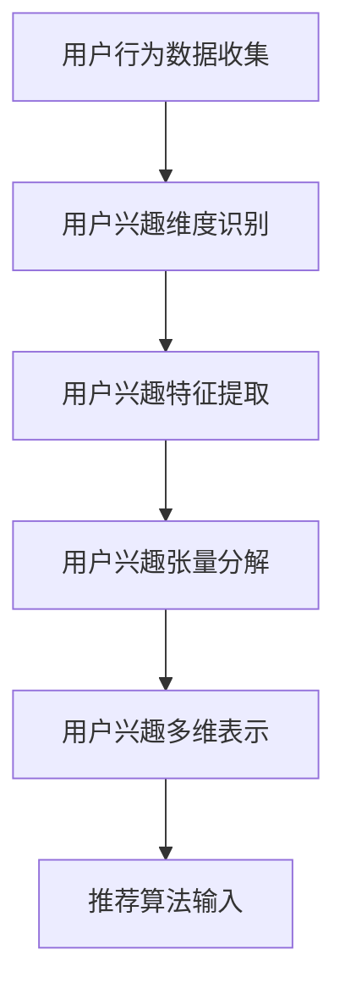

                 

# 《推荐系统的张量分解：用户兴趣的多维建模》

## 关键词

推荐系统，张量分解，用户兴趣建模，协同过滤，基于内容的推荐，混合推荐，多维数据建模。

## 摘要

本文将探讨推荐系统中的一种重要技术——张量分解在用户兴趣建模中的应用。通过详细的步骤分析和理论讲解，我们将理解张量分解的基础知识，以及它如何帮助我们更有效地建模用户的多维兴趣。文章还将展示如何在实际项目中应用这些理论，并提供一个完整的代码实现案例，以便读者可以更好地掌握这一技术。

## 目录大纲

### 第一部分：推荐系统基础理论

#### 第1章：推荐系统概述
- 1.1 推荐系统的发展历程
- 1.2 推荐系统的主要类型
- 1.3 推荐系统在商业应用中的价值

#### 第2章：用户兴趣建模
- 2.1 用户兴趣的概念与维度
- 2.2 用户兴趣数据收集与处理
- 2.3 用户兴趣的表示与建模方法

#### 第3章：商品或内容表示
- 3.1 商品或内容的特征提取
- 3.2 商品或内容的相似性计算
- 3.3 商品或内容的表示方法

#### 第4章：推荐算法原理
- 4.1 协同过滤算法
- 4.2 基于内容的推荐算法
- 4.3 混合推荐算法

### 第二部分：张量分解理论及应用

#### 第5章：张量分解基础
- 5.1 张量分解的概念
- 5.2 张量分解的数学原理
- 5.3 张量分解的类型及应用场景

#### 第6章：用户兴趣的多维建模
- 6.1 用户兴趣多维建模的挑战
- 6.2 用户兴趣张量分解模型
- 6.3 用户兴趣多维建模的算法实现

#### 第7章：商品或内容的多维建模
- 7.1 商品或内容多维建模的挑战
- 7.2 商品或内容张量分解模型
- 7.3 商品或内容多维建模的算法实现

#### 第8章：张量分解在推荐系统中的应用
- 8.1 张量分解在协同过滤中的应用
- 8.2 张量分解在基于内容的推荐中的应用
- 8.3 张量分解在混合推荐系统中的应用

### 第三部分：项目实战

#### 第9章：推荐系统项目实战
- 9.1 项目背景与目标
- 9.2 数据预处理与处理
- 9.3 用户兴趣多维建模
- 9.4 商品或内容多维建模
- 9.5 推荐算法实现与优化
- 9.6 项目总结与展望

### 第四部分：扩展阅读

#### 第10章：推荐系统前沿技术
- 10.1 基于深度学习的推荐系统
- 10.2 张量分解与深度学习的融合
- 10.3 异构数据的推荐系统

#### 第11章：推荐系统应用案例分析
- 11.1 电商平台的推荐系统
- 11.2 社交媒体的推荐系统
- 11.3 娱乐平台的推荐系统

#### 第12章：推荐系统的未来发展趋势
- 12.1 推荐系统的发展趋势
- 12.2 技术挑战与机遇
- 12.3 未来应用场景展望

## 附录

- 附录：核心概念原理与联系
- 附录：核心算法原理讲解
- 附录：数学模型和数学公式
- 附录：项目实战

### 文章标题：推荐系统的张量分解：用户兴趣的多维建模

### 文章关键词：推荐系统，张量分解，用户兴趣建模，协同过滤，基于内容的推荐，混合推荐，多维数据建模。

### 文章摘要

本文旨在深入探讨推荐系统中用户兴趣建模的关键技术——张量分解。随着互联网和大数据技术的发展，推荐系统已成为各种在线平台的关键组成部分，能够为用户提供个性化的商品或内容推荐，提升用户体验和满意度。本文将详细解析张量分解的基本概念、数学原理及其在用户兴趣建模中的应用。通过系统的理论讲解和实际项目案例分析，本文将为读者提供全面的指导，帮助理解并掌握这一技术。

接下来，我们将首先介绍推荐系统的基本理论和用户兴趣建模，然后深入探讨张量分解的基础知识，最后展示其在推荐系统中的实际应用。

## 第一部分：推荐系统基础理论

### 第1章：推荐系统概述

#### 1.1 推荐系统的发展历程

推荐系统的发展可以追溯到20世纪90年代，当时互联网的兴起带来了大量信息过载的问题。传统的信息检索系统无法有效地帮助用户从海量的数据中找到感兴趣的内容，因此，推荐系统应运而生。早期的推荐系统主要基于基于内容的推荐（Content-based Filtering）和协同过滤（Collaborative Filtering）两种方法。

1. **基于内容的推荐**：这种方法主要依赖于物品（如文章、音乐、电影等）的元数据和用户的兴趣特征。系统通过分析用户的历史行为和物品的特征，找到相似的内容进行推荐。例如，如果一个用户喜欢某篇文章，系统会推荐与该文章主题相似的其他文章。

2. **协同过滤**：协同过滤通过分析用户之间的相似性来发现用户的共同兴趣，从而进行推荐。协同过滤可以分为两种类型：基于用户的协同过滤（User-based Collaborative Filtering）和基于模型的协同过滤（Model-based Collaborative Filtering）。基于用户的协同过滤通过计算用户之间的相似性，找到与目标用户兴趣相似的其他用户，然后推荐这些用户喜欢的物品。基于模型的协同过滤则使用机器学习算法来预测用户对物品的评分，进而进行推荐。

随着大数据和深度学习技术的发展，推荐系统也经历了重大的变革。基于深度学习的推荐系统通过引入神经网络模型，能够更有效地处理复杂数据和高维度特征，提升了推荐效果。同时，张量分解作为一种新的推荐算法，逐渐受到关注。张量分解能够将高维数据分解为低维矩阵，从而简化计算，提高推荐系统的效率。

#### 1.2 推荐系统的主要类型

推荐系统根据不同的分类标准可以划分为多种类型。以下是几种常见的推荐系统类型：

1. **基于内容的推荐（Content-based Filtering）**：这种方法依赖于物品的元数据特征，通过分析用户的历史行为和物品的特征来发现用户的兴趣，并推荐具有相似特征的新物品。基于内容的推荐通常适用于文本、图片、音乐等多媒体数据。

2. **协同过滤（Collaborative Filtering）**：协同过滤通过分析用户之间的相似性来发现用户的共同兴趣，并推荐其他用户喜欢的物品。协同过滤分为基于用户的协同过滤和基于模型的协同过滤。

3. **混合推荐（Hybrid Recommendation）**：混合推荐系统结合了基于内容的推荐和协同过滤的优点，通过融合不同类型的推荐算法，提高推荐系统的准确性和多样性。

4. **基于模型的推荐（Model-based Recommendation）**：这种方法使用机器学习算法来建模用户兴趣和物品特征，预测用户对物品的评分，并进行推荐。常见的基于模型的推荐算法包括矩阵分解（Matrix Factorization）、张量分解（Tensor Factorization）等。

5. **基于上下文的推荐（Context-based Recommendation）**：这种方法考虑用户的上下文信息（如时间、位置、天气等），为用户提供更加个性化的推荐。基于上下文的推荐系统可以应用于移动应用、智能音箱等场景。

6. **基于规则的推荐（Rule-based Recommendation）**：这种方法通过定义一系列规则来生成推荐，通常适用于处理简单和规则性强的场景。例如，推荐系统中常见的“购买A商品的用户也可能喜欢B商品”规则。

#### 1.3 推荐系统在商业应用中的价值

推荐系统在商业应用中具有巨大的价值，以下是几个典型的应用场景：

1. **电商平台**：推荐系统能够为电商平台上的用户提供个性化的商品推荐，提升用户购物体验，增加销售额。例如，亚马逊使用协同过滤和基于内容的推荐相结合的方法，为用户提供个性化的购物推荐。

2. **社交媒体**：推荐系统可以帮助社交媒体平台为用户推荐感兴趣的内容，增加用户粘性和活跃度。例如，Facebook的“你可能认识的人”和“你可能感兴趣的内容”功能。

3. **在线视频平台**：推荐系统可以帮助在线视频平台为用户推荐感兴趣的视频，提升用户观看体验。例如，Netflix使用基于内容的推荐和协同过滤相结合的方法，为用户提供个性化的视频推荐。

4. **音乐流媒体**：推荐系统可以帮助音乐流媒体平台为用户推荐感兴趣的音乐，提升用户体验。例如，Spotify使用协同过滤和基于内容的推荐相结合的方法，为用户提供个性化的音乐推荐。

5. **旅游和酒店预订**：推荐系统可以帮助旅游和酒店预订平台为用户提供个性化的旅行和住宿推荐，提升用户满意度。例如，携程旅行网使用基于内容的推荐和协同过滤相结合的方法，为用户提供个性化的旅行推荐。

总之，推荐系统在商业应用中具有广泛的应用前景，通过为用户提供个性化的推荐，提升用户满意度和忠诚度，帮助企业实现商业价值。

### 第2章：用户兴趣建模

#### 2.1 用户兴趣的概念与维度

用户兴趣是指用户对某些特定主题、内容或活动的偏好和热情。用户兴趣的建模是推荐系统的核心任务之一，其目的是通过分析用户的历史行为和偏好，识别出用户的兴趣点，从而为用户推荐他们可能感兴趣的内容或商品。

用户兴趣具有多维度的特点，这些维度可以用来描述用户的兴趣特征。以下是一些常见的用户兴趣维度：

1. **内容维度**：用户兴趣的内容维度是指用户对不同类型内容的偏好。例如，一个用户可能喜欢阅读科技文章、观看科幻电影和听摇滚音乐。

2. **情感维度**：用户兴趣的情感维度是指用户对不同情感类型内容的偏好。例如，一个用户可能更喜欢悲伤、幽默或激励人心的内容。

3. **地域维度**：用户兴趣的地域维度是指用户对不同地域内容的偏好。例如，一个用户可能更喜欢本地新闻、地方美食和地方文化活动。

4. **时间维度**：用户兴趣的时间维度是指用户对不同时间段内容的偏好。例如，一个用户可能在周末更喜欢看电影，而在工作日则更喜欢阅读文章。

5. **社交维度**：用户兴趣的社交维度是指用户对不同社交群体内容的偏好。例如，一个用户可能更喜欢与朋友分享的推荐，或者对某个特定社交圈子感兴趣。

通过分析用户兴趣的多维度特征，推荐系统可以更准确地识别用户的兴趣点，从而提高推荐的效果和满意度。

#### 2.2 用户兴趣数据收集与处理

用户兴趣数据的收集和处理是用户兴趣建模的重要环节。以下是一些常见的用户兴趣数据收集和处理方法：

1. **数据收集**：
   - **用户行为数据**：用户在平台上的行为数据是用户兴趣数据的重要来源。这些数据包括用户的浏览记录、购买记录、评分记录、点击记录等。例如，一个用户在电商平台上浏览了科技产品、阅读了科技文章并购买了一本科技书籍，这些行为数据都可以反映出该用户对科技领域的兴趣。
   - **用户反馈数据**：用户的直接反馈，如评价、评论和点赞等，也是用户兴趣数据的重要来源。这些数据可以提供更直接的用户兴趣信息。
   - **社交网络数据**：用户的社交网络活动数据，如好友关系、分享内容、互动行为等，可以提供用户兴趣的社交维度信息。

2. **数据处理**：
   - **数据清洗**：用户兴趣数据通常包含噪声和缺失值，因此需要先进行数据清洗，去除噪声和不完整的数据，提高数据质量。
   - **数据转换**：为了更好地建模用户兴趣，通常需要将原始的用户行为数据进行转换。例如，将浏览记录转换为用户对各个主题的兴趣度，将购买记录转换为用户对各个商品的兴趣度。
   - **特征提取**：通过特征提取，可以从用户兴趣数据中提取出用户兴趣的特征，例如用户的兴趣主题、情感倾向、地域偏好等。
   - **数据归一化**：为了消除不同特征之间的尺度差异，通常需要对数据进行归一化处理，使得各个特征对模型的影响更加均衡。

#### 2.3 用户兴趣的表示与建模方法

用户兴趣的表示与建模是推荐系统的关键环节，其目的是将用户兴趣数据转换为机器学习模型可以处理的形式，从而进行兴趣识别和推荐。

以下是一些常见的用户兴趣表示与建模方法：

1. **基于用户的向量表示**：这种方法将用户兴趣表示为一个高维向量，每个维度对应一个特定的兴趣特征。例如，可以使用词袋模型（Bag-of-Words）或TF-IDF（Term Frequency-Inverse Document Frequency）等方法来表示用户的兴趣。这种方法简单直观，但难以捕捉用户兴趣的复杂性和多样性。

2. **基于矩阵的表示**：这种方法将用户兴趣表示为一个矩阵，矩阵中的元素表示用户对各个兴趣特征的偏好程度。例如，可以构建一个用户兴趣矩阵，矩阵中的行表示用户，列表示兴趣特征，矩阵中的元素表示用户对特定兴趣特征的兴趣度。这种方法可以更好地捕捉用户兴趣的复杂性和多样性。

3. **基于模型的表示**：这种方法使用机器学习算法来建模用户兴趣，例如矩阵分解（Matrix Factorization）和深度学习（Deep Learning）等。矩阵分解将高维用户兴趣矩阵分解为两个低维矩阵，从而提取出用户兴趣的特征。深度学习则通过构建神经网络模型来直接从用户兴趣数据中学习出用户的兴趣特征。这种方法可以更好地捕捉用户兴趣的复杂性和多样性，但计算成本较高。

4. **基于语义的表示**：这种方法利用自然语言处理（Natural Language Processing，NLP）技术来分析用户生成的内容（如评论、帖子等），提取出用户的兴趣。例如，可以使用词嵌入（Word Embedding）技术将文本转换为向量表示，然后使用文本分类或情感分析等方法来识别用户的兴趣。这种方法可以更好地理解用户的语言表达，但需要大量的数据和计算资源。

通过选择合适的用户兴趣表示与建模方法，推荐系统可以更准确地识别用户的兴趣点，从而为用户提供高质量的个性化推荐。

### 第3章：商品或内容表示

#### 3.1 商品或内容的特征提取

商品或内容的特征提取是推荐系统中的关键步骤，其目的是将原始的、高维的商品或内容数据转换为低维的、具有解释性的特征向量。这些特征向量将用于后续的推荐算法，帮助系统理解商品或内容的属性，从而进行有效的推荐。以下是几种常见的商品或内容特征提取方法：

1. **基于关键词的提取**：这种方法通过提取商品或内容的文本描述中的关键词来构建特征向量。例如，使用TF-IDF（Term Frequency-Inverse Document Frequency）来量化关键词的重要性。这种方法简单有效，但可能无法捕捉到文本中的深层语义信息。

2. **基于内容的特征提取**：这种方法通过分析商品或内容的内在属性来提取特征。例如，对于图像内容，可以使用图像识别技术提取图像的边缘、纹理、颜色等特征；对于文本内容，可以使用自然语言处理（NLP）技术提取主题、情感等特征。这种方法可以捕捉到更丰富的信息，但可能需要大量的计算资源和专业知识。

3. **基于用户的特征提取**：这种方法通过分析用户的历史行为数据来提取特征。例如，根据用户的购买记录、浏览记录和评分记录，可以提取出用户对某些类别、品牌或风格的偏好。这种方法可以更好地反映用户的个性化需求，但可能需要大量的历史数据支持。

4. **基于协同过滤的特征提取**：这种方法通过分析用户之间的相似性来提取特征。例如，可以使用基于用户的协同过滤算法来识别与目标用户相似的其他用户，并提取出这些用户的共同特征。这种方法可以捕捉到用户之间的相互影响，但可能需要大量的用户行为数据。

#### 3.2 商品或内容的相似性计算

商品或内容的相似性计算是推荐系统中的另一个重要步骤，其目的是为推荐算法提供商品或内容之间的相似度度量。以下是一些常见的相似性计算方法：

1. **基于关键词的相似性计算**：这种方法通过比较商品或内容中的关键词或短语来计算相似度。例如，可以使用余弦相似性（Cosine Similarity）或Jaccard相似性（Jaccard Similarity）。这种方法简单直观，但可能无法捕捉到更深层次的相似性。

2. **基于内容的相似性计算**：这种方法通过分析商品或内容的内在属性（如图像的特征、文本的主题、音频的节奏等）来计算相似度。例如，可以使用欧氏距离（Euclidean Distance）或曼哈顿距离（Manhattan Distance）。这种方法可以捕捉到更丰富的信息，但可能需要大量的计算资源和专业知识。

3. **基于用户的相似性计算**：这种方法通过分析用户对商品或内容的评分或行为来计算相似度。例如，可以使用皮尔逊相关系数（Pearson Correlation Coefficient）或余弦相似性（Cosine Similarity）。这种方法可以捕捉到用户之间的相似性，从而为推荐提供依据。

4. **基于模型的相似性计算**：这种方法使用机器学习模型（如神经网络、深度学习模型等）来计算商品或内容的相似度。例如，可以使用基于内容的嵌入模型（Content-based Embedding Model）或基于用户的嵌入模型（User-based Embedding Model）。这种方法可以捕捉到复杂的相似性关系，但可能需要大量的训练数据和计算资源。

通过选择合适的相似性计算方法，推荐系统可以更准确地评估商品或内容之间的相似性，从而为用户提供更高质量的个性化推荐。

#### 3.3 商品或内容的表示方法

商品或内容的表示方法决定了推荐系统如何理解和处理商品或内容数据。以下是几种常见的商品或内容表示方法：

1. **基于关键词的表示**：这种方法将商品或内容表示为一系列关键词的集合。例如，使用词袋模型（Bag-of-Words）或TF-IDF（Term Frequency-Inverse Document Frequency）来表示文本内容。这种方法简单直观，但可能无法捕捉到文本的深层语义信息。

2. **基于向量的表示**：这种方法将商品或内容表示为高维向量。例如，使用词嵌入（Word Embedding）技术将文本转换为向量表示，或使用图像识别技术提取图像的特征向量。这种方法可以捕捉到更多的信息，但需要大量的计算资源和存储空间。

3. **基于矩阵的表示**：这种方法将商品或内容表示为一个矩阵。例如，使用用户-商品评分矩阵来表示用户对商品的评分，或使用商品特征矩阵来表示商品的不同属性。这种方法可以有效地捕捉到商品或内容之间的关系，但可能需要大量的计算资源和存储空间。

4. **基于模型的表示**：这种方法使用机器学习模型来表示商品或内容。例如，使用矩阵分解（Matrix Factorization）或深度学习模型（如卷积神经网络（CNN）或循环神经网络（RNN））来表示商品或内容。这种方法可以捕捉到复杂的商品或内容特征，但可能需要大量的训练数据和计算资源。

通过选择合适的商品或内容表示方法，推荐系统可以更有效地处理商品或内容数据，从而为用户提供更高质量的个性化推荐。

### 第4章：推荐算法原理

#### 4.1 协同过滤算法

协同过滤算法（Collaborative Filtering）是推荐系统中最常用的一种方法，它通过分析用户之间的相似性和用户的历史行为来预测用户对未知物品的评分或兴趣。协同过滤算法可以分为基于用户的协同过滤和基于模型的协同过滤。

1. **基于用户的协同过滤（User-based Collaborative Filtering）**：
   - **原理**：基于用户的协同过滤通过计算用户之间的相似性来发现用户之间的共同兴趣，然后推荐这些用户喜欢的物品。常用的相似性度量方法包括余弦相似性、皮尔逊相关系数等。
   - **步骤**：
     1. 计算用户之间的相似性：根据用户对物品的评分，计算用户之间的相似性。
     2. 找到相似用户：根据相似性度量，找到与目标用户最相似的若干用户。
     3. 推荐物品：根据相似用户的评分记录，推荐这些用户共同喜欢的物品。
   - **优点**：能够发现用户之间的共同兴趣，推荐结果更贴近用户的真实喜好。
   - **缺点**：受限于用户数据的质量和数量，推荐结果可能存在冷启动问题和多样性不足的问题。

2. **基于模型的协同过滤（Model-based Collaborative Filtering）**：
   - **原理**：基于模型的协同过滤使用机器学习算法来建模用户和物品之间的关系，从而预测用户对未知物品的评分。常见的算法包括矩阵分解（Matrix Factorization）、基于模型的聚类算法（如K-means）等。
   - **步骤**：
     1. 数据预处理：对用户-物品评分矩阵进行归一化、缺失值填充等处理。
     2. 构建模型：使用矩阵分解或其他机器学习算法，将用户-物品评分矩阵分解为低维用户特征矩阵和物品特征矩阵。
     3. 预测评分：根据用户特征和物品特征，计算用户对未知物品的预测评分。
     4. 推荐物品：根据预测评分，推荐评分较高的未知物品。
   - **优点**：能够通过模型提取用户和物品的潜在特征，提高推荐准确性和效率。
   - **缺点**：需要大量的训练数据和计算资源，且模型解释性较低。

#### 4.2 基于内容的推荐算法

基于内容的推荐算法（Content-based Filtering）通过分析物品的元数据特征和用户的历史行为来推荐与用户兴趣相关的物品。基于内容的推荐算法可以分为基于物品的协同过滤和基于模型的推荐算法。

1. **基于物品的协同过滤（Item-based Collaborative Filtering）**：
   - **原理**：基于物品的协同过滤通过计算物品之间的相似性来发现与用户兴趣相关的物品，然后推荐这些物品。常用的相似性度量方法包括余弦相似性、欧氏距离等。
   - **步骤**：
     1. 计算物品之间的相似性：根据物品的元数据特征，计算物品之间的相似性。
     2. 找到相似物品：根据相似性度量，找到与用户历史行为最相似的若干物品。
     3. 推荐物品：根据相似物品，推荐用户可能感兴趣的物品。
   - **优点**：能够根据物品的元数据特征进行推荐，推荐结果具有较强的解释性。
   - **缺点**：受限于物品的元数据特征，可能无法捕捉到用户复杂的兴趣偏好，推荐结果可能存在多样性不足的问题。

2. **基于模型的推荐算法**：
   - **原理**：基于模型的推荐算法使用机器学习算法来建模物品和用户之间的关系，从而预测用户对未知物品的兴趣。常见的算法包括朴素贝叶斯（Naive Bayes）、决策树（Decision Tree）等。
   - **步骤**：
     1. 数据预处理：对用户-物品评分矩阵进行归一化、缺失值填充等处理。
     2. 特征提取：从用户历史行为和物品元数据中提取特征。
     3. 构建模型：使用机器学习算法，训练用户-物品兴趣预测模型。
     4. 预测兴趣：根据用户特征和物品特征，计算用户对未知物品的预测兴趣。
     5. 推荐物品：根据预测兴趣，推荐用户可能感兴趣的物品。
   - **优点**：能够通过模型提取用户和物品的潜在特征，提高推荐准确性和效率。
   - **缺点**：需要大量的训练数据和计算资源，且模型解释性较低。

#### 4.3 混合推荐算法

混合推荐算法（Hybrid Recommendation）结合了协同过滤和基于内容的推荐算法，通过融合不同类型的推荐方法来提高推荐系统的准确性和多样性。

1. **原理**：
   - **融合策略**：混合推荐算法通过不同的融合策略将协同过滤和基于内容的推荐结果进行整合。常见的融合策略包括加权融合、投票融合、模型融合等。
   - **协同过滤和基于内容的结合**：混合推荐算法通过协同过滤算法找到与用户兴趣相似的物品，同时利用基于内容的算法来增强推荐结果的解释性。

2. **优点**：
   - **提高推荐准确性**：混合推荐算法通过融合协同过滤和基于内容的推荐方法，能够利用不同类型的数据源和特征，提高推荐系统的准确性和效果。
   - **提升推荐多样性**：混合推荐算法能够通过不同类型的推荐方法，提供更丰富的推荐结果，提高推荐的多样性。

3. **缺点**：
   - **计算复杂度增加**：混合推荐算法需要同时处理协同过滤和基于内容的推荐方法，可能导致计算复杂度增加。
   - **模型参数调整**：混合推荐算法需要调整多个模型的参数，增加了模型调优的难度。

通过选择合适的推荐算法，推荐系统可以更好地满足用户的需求，提高用户体验和满意度。

## 第二部分：张量分解理论及应用

### 第5章：张量分解基础

#### 5.1 张量分解的概念

张量分解（Tensor Factorization）是一种数学方法，用于将高维的张量分解为多个低维矩阵的乘积。在推荐系统中，张量分解被广泛应用于用户兴趣建模和物品表示。张量分解的主要目的是简化高维数据的计算，同时保留数据的主要结构信息。

一个张量是一个多维数组，可以表示为多维矩阵。例如，一个三阶张量可以表示为三个矩阵的乘积：

\[ C = A \times B \times D \]

其中，\( C \) 是原始张量，\( A \)、\( B \) 和 \( D \) 是分解后的低维矩阵。

#### 5.2 张量分解的数学原理

张量分解的数学原理基于线性代数中的矩阵乘法和矩阵分解。假设一个原始张量 \( X \) 可以分解为两个低维矩阵 \( A \) 和 \( B \) 的乘积：

\[ X = A \times B \]

我们可以将这个方程分解为三个步骤：

1. **高斯消元法**：将张量 \( X \) 的每一行分解为两个矩阵的乘积，得到低维矩阵 \( A \) 和 \( B \)。

2. **矩阵分解**：对低维矩阵 \( A \) 和 \( B \) 进行奇异值分解（Singular Value Decomposition，SVD），得到新的低维矩阵 \( U \)、\( \Sigma \) 和 \( V \)。

3. **重构张量**：将低维矩阵 \( U \)、\( \Sigma \) 和 \( V \) 重构为原始张量 \( X \)。

通过这三个步骤，我们得到：

\[ X = U \times \Sigma \times V^T \]

其中，\( U \) 和 \( V \) 是正交矩阵，\( \Sigma \) 是对角矩阵，包含奇异值。

#### 5.3 张量分解的类型及应用场景

根据分解方式和应用场景，张量分解可以分为以下几种类型：

1. **三阶张量分解（3-way Tensor Factorization）**：
   - **原理**：三阶张量分解将三阶张量分解为三个二阶矩阵的乘积。
   - **应用场景**：三阶张量分解常用于用户兴趣建模和物品表示，例如用户-商品评分矩阵的分解。

2. **四阶张量分解（4-way Tensor Factorization）**：
   - **原理**：四阶张量分解将四阶张量分解为四个二阶矩阵的乘积。
   - **应用场景**：四阶张量分解常用于多维数据建模，例如用户-商品-时间-事件的评分矩阵分解。

3. **高阶张量分解**：
   - **原理**：高阶张量分解将高维张量分解为多个低维矩阵的乘积。
   - **应用场景**：高阶张量分解常用于处理高维复杂数据，例如文本数据的多维建模。

通过选择合适的张量分解类型，推荐系统可以更有效地建模用户兴趣和物品特征，从而提高推荐效果。

### 第6章：用户兴趣的多维建模

#### 6.1 用户兴趣多维建模的挑战

用户兴趣多维建模是推荐系统中的一项关键任务，其目的是通过分析用户的历史行为和偏好，构建出用户的多维兴趣模型。然而，在实际应用中，用户兴趣多维建模面临着一些挑战：

1. **高维数据的处理**：用户行为数据通常具有高维特性，包含大量的特征维度。如何有效地处理这些高维数据，提取出有用的用户兴趣特征，是一个重要挑战。

2. **稀疏数据的建模**：用户行为数据通常非常稀疏，即大部分元素为0。如何处理这种稀疏数据，避免模型过拟合和欠拟合，是一个关键问题。

3. **实时性要求**：推荐系统需要能够快速响应用户的行为变化，实时更新用户兴趣模型。如何高效地更新和重构模型，是一个挑战。

4. **用户隐私保护**：用户兴趣数据涉及用户的个人隐私，如何在保证用户隐私的前提下进行建模，是一个重要问题。

#### 6.2 用户兴趣张量分解模型

用户兴趣张量分解模型是一种基于张量分解技术的方法，用于建模用户的多维兴趣。用户兴趣张量分解模型将用户兴趣数据表示为一个三阶张量，并通过张量分解技术提取出用户兴趣的低维表示。

1. **模型表示**：

假设用户兴趣数据可以表示为一个三阶张量 \( X \)，其中 \( X_{ijk} \) 表示用户 \( i \) 对商品 \( j \) 在时间 \( k \) 的兴趣度。用户兴趣张量分解模型将 \( X \) 分解为三个低维矩阵的乘积：

\[ X = A \times B \times C^T \]

其中，\( A \)、\( B \) 和 \( C \) 是分解后的低维矩阵，分别表示用户特征、商品特征和时间特征。

2. **模型构建**：

用户兴趣张量分解模型的构建过程可以分为以下几步：

1. **数据预处理**：对用户兴趣数据进行预处理，包括缺失值填充、数据归一化等。

2. **张量初始化**：初始化用户兴趣张量 \( X \)，可以使用随机初始化或基于用户历史行为的初始化方法。

3. **张量分解**：使用张量分解算法（如三阶张量分解算法）对用户兴趣张量 \( X \) 进行分解，得到低维矩阵 \( A \)、\( B \) 和 \( C \)。

4. **模型优化**：通过优化算法（如梯度下降算法）最小化模型损失函数，更新低维矩阵 \( A \)、\( B \) 和 \( C \)。

5. **模型评估**：评估模型性能，包括准确率、召回率、覆盖率等指标。

3. **模型应用**：

用户兴趣张量分解模型可以应用于用户兴趣识别和推荐系统的构建。具体应用步骤如下：

1. **用户兴趣识别**：使用分解后的低维矩阵 \( A \)、\( B \) 和 \( C \)，构建用户兴趣特征向量，用于用户兴趣识别。

2. **商品推荐**：根据用户兴趣特征向量，计算用户对未知商品的兴趣度，进行商品推荐。

3. **模型更新**：根据用户新的行为数据，更新用户兴趣张量分解模型，保持模型实时性。

通过用户兴趣张量分解模型，推荐系统可以更准确地识别用户的多维兴趣，提高推荐效果和用户体验。

### 第6章：用户兴趣的多维建模

#### 6.3 用户兴趣多维建模的算法实现

用户兴趣多维建模的算法实现是推荐系统开发中的关键步骤，其目标是构建一个有效的模型来描述用户的多维兴趣。以下是一种基于张量分解的方法来实现用户兴趣多维建模。

#### 6.3.1 数据准备

在进行用户兴趣多维建模之前，我们需要准备用户行为数据。这些数据通常包括用户的浏览记录、购买记录、评分记录等。以下是一个简化的数据准备步骤：

1. **数据收集**：从数据库或其他数据源中收集用户行为数据。

2. **数据预处理**：清洗数据，包括去除缺失值、噪声和异常值。对数值型数据进行归一化处理，以便算法能够更好地处理数据。

3. **数据转换**：将原始的用户行为数据转换为适合模型训练的格式。例如，用户-商品评分矩阵。

#### 6.3.2 张量分解算法选择

在选择张量分解算法时，我们主要考虑以下几个方面：

1. **算法类型**：根据用户兴趣数据的维度，选择合适的张量分解算法。例如，三阶张量分解（3-way Tensor Factorization）适用于用户-商品-时间等三维度数据的分解。

2. **算法复杂度**：考虑算法的计算复杂度和训练时间，选择适合实际应用的算法。

3. **算法效果**：评估不同算法在用户兴趣多维建模中的效果，选择性能最佳的算法。

常见的选择包括：

- **三阶张量分解**：适用于三维度数据分解，如用户-商品-时间数据。
- **四阶张量分解**：适用于四维度数据分解，如用户-商品-时间-事件数据。
- **高阶张量分解**：适用于更高维度数据的分解。

#### 6.3.3 模型训练

用户兴趣多维建模的算法实现步骤如下：

1. **初始化**：初始化用户兴趣张量 \( X \)，可以使用随机初始化或基于用户历史行为的初始化方法。

2. **张量分解**：使用选定的张量分解算法对用户兴趣张量 \( X \) 进行分解，得到低维矩阵 \( A \)、\( B \) 和 \( C \)。

3. **优化**：使用优化算法（如梯度下降算法）最小化模型损失函数，更新低维矩阵 \( A \)、\( B \) 和 \( C \)。

4. **模型评估**：评估模型性能，包括准确率、召回率、覆盖率等指标。根据评估结果调整模型参数。

#### 6.3.4 用户兴趣表示

通过张量分解，我们得到了用户兴趣的低维表示 \( A \)、\( B \) 和 \( C \)。这些低维矩阵可以用于生成用户兴趣特征向量，用于后续的推荐算法。

1. **特征向量生成**：将低维矩阵 \( A \)、\( B \) 和 \( C \) 转换为用户兴趣特征向量。例如，将 \( A \) 的每一行作为用户兴趣特征向量。

2. **用户兴趣识别**：使用生成的用户兴趣特征向量，对用户的新行为数据进行兴趣识别。

#### 6.3.5 推荐算法

利用用户兴趣特征向量，我们可以构建推荐算法，为用户推荐感兴趣的商品或内容。

1. **兴趣度计算**：根据用户兴趣特征向量和商品特征向量，计算用户对未知商品的兴趣度。

2. **推荐排序**：根据兴趣度对候选商品进行排序，选择兴趣度最高的商品进行推荐。

3. **推荐结果评估**：评估推荐算法的性能，包括准确率、召回率、覆盖率等指标。

#### 6.3.6 模型更新

用户兴趣是动态变化的，因此我们需要定期更新用户兴趣模型。

1. **数据更新**：定期收集用户的新行为数据，更新用户兴趣张量。

2. **模型重构**：使用新的用户兴趣张量，重构用户兴趣低维矩阵。

3. **模型优化**：使用优化算法，更新用户兴趣低维矩阵，保持模型的有效性。

通过上述步骤，我们可以实现用户兴趣多维建模，为推荐系统提供有效的用户兴趣表示和推荐算法。实际应用中，可以根据具体需求和数据特性，调整和优化模型和算法。

### 第7章：商品或内容的多维建模

#### 7.1 商品或内容多维建模的挑战

商品或内容多维建模是推荐系统中的一个重要环节，其目的是将商品或内容的特征表示为多维向量，从而为推荐算法提供有效的输入。然而，在实际应用中，商品或内容多维建模面临着一些挑战：

1. **高维数据的处理**：商品或内容数据通常具有高维特性，包含大量的特征维度。如何有效地处理这些高维数据，提取出有用的商品或内容特征，是一个重要挑战。

2. **稀疏数据的建模**：商品或内容数据通常非常稀疏，即大部分元素为0。如何处理这种稀疏数据，避免模型过拟合和欠拟合，是一个关键问题。

3. **实时性要求**：推荐系统需要能够快速响应用户的行为变化，实时更新商品或内容模型。如何高效地更新和重构模型，是一个挑战。

4. **商品或内容多样性**：不同类型和领域的商品或内容具有不同的特征和属性，如何在建模过程中保持多样性，提高推荐效果，是一个重要问题。

5. **用户个性化需求**：用户对商品或内容的偏好是动态变化的，如何根据用户的个性化需求，调整商品或内容特征，是一个挑战。

#### 7.2 商品或内容张量分解模型

商品或内容张量分解模型是一种基于张量分解技术的方法，用于建模商品或内容的多维特征。商品或内容张量分解模型将商品或内容数据表示为一个三阶张量，并通过张量分解技术提取出商品或内容的低维表示。

1. **模型表示**：

假设商品或内容数据可以表示为一个三阶张量 \( X \)，其中 \( X_{ijk} \) 表示商品或内容 \( i \) 在特征 \( j \) 上的值，在时间 \( k \) 的兴趣度。商品或内容张量分解模型将 \( X \) 分解为三个低维矩阵的乘积：

\[ X = A \times B \times C^T \]

其中，\( A \)、\( B \) 和 \( C \) 是分解后的低维矩阵，分别表示商品或内容特征、用户特征和时间特征。

2. **模型构建**：

商品或内容张量分解模型的构建过程可以分为以下几步：

1. **数据预处理**：对商品或内容数据进行预处理，包括缺失值填充、数据归一化等。

2. **张量初始化**：初始化商品或内容张量 \( X \)，可以使用随机初始化或基于历史数据的初始化方法。

3. **张量分解**：使用张量分解算法（如三阶张量分解算法）对商品或内容张量 \( X \) 进行分解，得到低维矩阵 \( A \)、\( B \) 和 \( C \)。

4. **模型优化**：通过优化算法（如梯度下降算法）最小化模型损失函数，更新低维矩阵 \( A \)、\( B \) 和 \( C \)。

5. **模型评估**：评估模型性能，包括准确率、召回率、覆盖率等指标。

3. **模型应用**：

商品或内容张量分解模型可以应用于商品或内容识别和推荐系统的构建。具体应用步骤如下：

1. **商品或内容识别**：使用分解后的低维矩阵 \( A \)、\( B \) 和 \( C \)，构建商品或内容特征向量，用于商品或内容识别。

2. **商品推荐**：根据商品或内容特征向量，计算用户对未知商品的兴趣度，进行商品推荐。

3. **模型更新**：根据用户新的行为数据，更新商品或内容张量分解模型，保持模型实时性。

通过商品或内容张量分解模型，推荐系统可以更准确地识别用户的多维兴趣，提高推荐效果和用户体验。

### 第7章：商品或内容的多维建模

#### 7.3 商品或内容多维建模的算法实现

商品或内容多维建模的算法实现是推荐系统开发中的关键步骤，其目标是构建一个有效的模型来描述商品或内容的多维特征。以下是一种基于张量分解的方法来实现商品或内容多维建模。

#### 7.3.1 数据准备

在进行商品或内容多维建模之前，我们需要准备商品或内容数据。这些数据通常包括商品的描述、标签、属性等。以下是一个简化的数据准备步骤：

1. **数据收集**：从数据库或其他数据源中收集商品或内容数据。

2. **数据预处理**：清洗数据，包括去除缺失值、噪声和异常值。对数值型数据进行归一化处理，以便算法能够更好地处理数据。

3. **数据转换**：将原始的商品或内容数据转换为适合模型训练的格式。例如，构建商品-特征矩阵。

#### 7.3.2 张量分解算法选择

在选择张量分解算法时，我们主要考虑以下几个方面：

1. **算法类型**：根据商品或内容数据的维度，选择合适的张量分解算法。例如，三阶张量分解（3-way Tensor Factorization）适用于商品-特征-时间等三维度数据的分解。

2. **算法复杂度**：考虑算法的计算复杂度和训练时间，选择适合实际应用的算法。

3. **算法效果**：评估不同算法在商品或内容多维建模中的效果，选择性能最佳的算法。

常见的选择包括：

- **三阶张量分解**：适用于三维度数据分解，如商品-特征-时间数据。
- **四阶张量分解**：适用于四维度数据分解，如商品-特征-时间-事件数据。
- **高阶张量分解**：适用于更高维度数据的分解。

#### 7.3.3 模型训练

商品或内容多维建模的算法实现步骤如下：

1. **初始化**：初始化商品或内容张量 \( X \)，可以使用随机初始化或基于历史数据的初始化方法。

2. **张量分解**：使用选定的张量分解算法对商品或内容张量 \( X \) 进行分解，得到低维矩阵 \( A \)、\( B \) 和 \( C \)。

3. **优化**：使用优化算法（如梯度下降算法）最小化模型损失函数，更新低维矩阵 \( A \)、\( B \) 和 \( C \)。

4. **模型评估**：评估模型性能，包括准确率、召回率、覆盖率等指标。根据评估结果调整模型参数。

#### 7.3.4 商品或内容特征表示

通过张量分解，我们得到了商品或内容的低维表示 \( A \)、\( B \) 和 \( C \)。这些低维矩阵可以用于生成商品或内容特征向量，用于后续的推荐算法。

1. **特征向量生成**：将低维矩阵 \( A \)、\( B \) 和 \( C \) 转换为商品或内容特征向量。例如，将 \( A \) 的每一行作为商品或内容特征向量。

2. **商品或内容识别**：使用生成的商品或内容特征向量，对用户的新商品或内容数据进行识别。

#### 7.3.5 推荐算法

利用商品或内容特征向量，我们可以构建推荐算法，为用户推荐感兴趣的商品或内容。

1. **兴趣度计算**：根据用户兴趣特征向量和商品或内容特征向量，计算用户对未知商品或内容的兴趣度。

2. **推荐排序**：根据兴趣度对候选商品或内容进行排序，选择兴趣度最高的商品或内容进行推荐。

3. **推荐结果评估**：评估推荐算法的性能，包括准确率、召回率、覆盖率等指标。

#### 7.3.6 模型更新

商品或内容是多变的，因此我们需要定期更新商品或内容模型。

1. **数据更新**：定期收集用户的新商品或内容数据，更新商品或内容张量。

2. **模型重构**：使用新的商品或内容张量，重构商品或内容低维矩阵。

3. **模型优化**：使用优化算法，更新商品或内容低维矩阵，保持模型的有效性。

通过上述步骤，我们可以实现商品或内容多维建模，为推荐系统提供有效的商品或内容特征表示和推荐算法。实际应用中，可以根据具体需求和数据特性，调整和优化模型和算法。

### 第8章：张量分解在推荐系统中的应用

#### 8.1 张量分解在协同过滤中的应用

张量分解在协同过滤中的应用，主要是通过将用户-商品评分矩阵分解为低维矩阵的形式，从而提升推荐系统的效率和效果。协同过滤是一种基于用户行为的推荐方法，其核心思想是利用用户之间的相似性来发现用户的共同兴趣，从而为用户提供个性化的推荐。传统的协同过滤方法存在计算复杂度高、冷启动问题（即新用户或新商品的推荐）和多样性不足等问题。张量分解技术能够有效解决这些问题。

1. **原理**：

张量分解将用户-商品评分矩阵分解为三个低维矩阵的乘积：

\[ R = U \times S \times V^T \]

其中，\( R \) 是用户-商品评分矩阵，\( U \) 和 \( V \) 是用户特征矩阵和商品特征矩阵，\( S \) 是一个对角矩阵，包含了用户和商品的潜在特征。

2. **优势**：

- **降低计算复杂度**：通过张量分解，可以将高维的用户-商品评分矩阵转换为低维的特征矩阵，从而减少计算复杂度，提高系统性能。
- **提高推荐准确性**：张量分解能够提取出用户和商品的潜在特征，使得推荐结果更加准确。
- **解决冷启动问题**：张量分解技术可以在没有足够用户行为数据的情况下，通过用户和商品的特征矩阵进行推荐，从而缓解冷启动问题。
- **提升多样性**：张量分解能够捕捉到用户和商品之间的复杂关系，使得推荐结果更加多样化。

3. **算法实现**：

- **数据预处理**：对用户-商品评分矩阵进行归一化处理，减少数据尺度差异。
- **张量分解**：使用三阶张量分解算法（如CANDECOMP或PARAFAC）对用户-商品评分矩阵进行分解。
- **特征提取**：通过分解得到的低维矩阵 \( U \) 和 \( V \)，提取用户和商品的潜在特征。
- **推荐计算**：根据用户和商品的潜在特征，计算用户对未知商品的潜在评分，进行推荐。

#### 8.2 张量分解在基于内容的推荐中的应用

基于内容的推荐方法（Content-based Filtering）是一种基于商品或内容特征进行推荐的策略。这种方法通过分析商品或内容的元数据特征，找到与用户兴趣相关的商品或内容进行推荐。然而，基于内容的推荐方法在处理高维和稀疏数据时存在效率低、推荐多样性不足等问题。张量分解技术能够有效解决这些问题，提升基于内容推荐的效果。

1. **原理**：

张量分解在基于内容推荐中的应用，主要是通过将用户-商品特征矩阵分解为低维矩阵的形式，从而提高推荐系统的效率和效果。分解后的低维矩阵可以更好地表示用户和商品的潜在特征。

\[ X = U \times S \times V^T \]

其中，\( X \) 是用户-商品特征矩阵，\( U \) 和 \( V \) 是用户特征矩阵和商品特征矩阵，\( S \) 是一个对角矩阵，包含了用户和商品的潜在特征。

2. **优势**：

- **提高推荐准确性**：通过张量分解，能够提取出用户和商品的潜在特征，使得推荐结果更加准确。
- **提升多样性**：张量分解能够捕捉到用户和商品之间的复杂关系，使得推荐结果更加多样化。
- **处理高维和稀疏数据**：张量分解能够将高维和稀疏的数据转换为低维特征矩阵，从而提高计算效率和推荐效果。

3. **算法实现**：

- **数据预处理**：对用户-商品特征矩阵进行归一化处理，减少数据尺度差异。
- **张量分解**：使用三阶张量分解算法（如CANDECOMP或PARAFAC）对用户-商品特征矩阵进行分解。
- **特征提取**：通过分解得到的低维矩阵 \( U \) 和 \( V \)，提取用户和商品的潜在特征。
- **推荐计算**：根据用户和商品的潜在特征，计算用户对未知商品的潜在兴趣度，进行推荐。

#### 8.3 张量分解在混合推荐系统中的应用

混合推荐系统（Hybrid Recommendation System）是一种结合了协同过滤和基于内容的推荐方法的推荐系统。这种方法通过综合利用用户行为数据和商品特征，提升推荐效果和多样性。然而，传统的混合推荐系统在处理高维和稀疏数据时，仍然存在计算复杂度高和推荐多样性不足等问题。张量分解技术能够有效解决这些问题，提升混合推荐系统的性能。

1. **原理**：

张量分解在混合推荐系统中的应用，主要是通过将用户-商品评分矩阵和用户-商品特征矩阵分解为低维矩阵的形式，从而提高推荐系统的效率和效果。分解后的低维矩阵可以更好地表示用户和商品的潜在特征。

\[ R = U \times S \times V^T \]
\[ X = U \times S \times V^T \]

其中，\( R \) 是用户-商品评分矩阵，\( X \) 是用户-商品特征矩阵，\( U \) 和 \( V \) 是用户特征矩阵和商品特征矩阵，\( S \) 是一个对角矩阵，包含了用户和商品的潜在特征。

2. **优势**：

- **提高推荐准确性**：通过张量分解，能够提取出用户和商品的潜在特征，使得推荐结果更加准确。
- **提升多样性**：张量分解能够捕捉到用户和商品之间的复杂关系，使得推荐结果更加多样化。
- **处理高维和稀疏数据**：张量分解能够将高维和稀疏的数据转换为低维特征矩阵，从而提高计算效率和推荐效果。
- **结合协同过滤和基于内容的推荐**：张量分解能够同时处理用户行为数据和商品特征，使得混合推荐系统的效果更好。

3. **算法实现**：

- **数据预处理**：对用户-商品评分矩阵和用户-商品特征矩阵进行归一化处理，减少数据尺度差异。
- **张量分解**：使用三阶张量分解算法（如CANDECOMP或PARAFAC）对用户-商品评分矩阵和用户-商品特征矩阵进行分解。
- **特征提取**：通过分解得到的低维矩阵 \( U \) 和 \( V \)，提取用户和商品的潜在特征。
- **推荐计算**：根据用户和商品的潜在特征，计算用户对未知商品的潜在评分和潜在兴趣度，进行推荐。

通过张量分解技术在协同过滤、基于内容的推荐和混合推荐系统中的应用，推荐系统可以更有效地处理高维和稀疏数据，提升推荐准确性、多样性和用户体验。

### 第9章：推荐系统项目实战

#### 9.1 项目背景与目标

在本章中，我们将通过一个实际项目来展示如何构建一个基于张量分解的推荐系统。项目背景是一个电子商务平台，该平台需要为用户推荐他们可能感兴趣的商品。项目的目标是实现以下功能：

1. **用户注册与登录**：允许用户在平台上注册账号并登录，以便保存用户历史行为数据。
2. **商品数据导入**：导入平台上的商品数据，包括商品ID、名称、描述、分类等信息。
3. **用户行为数据收集**：收集用户在平台上的浏览、购买和评分行为数据。
4. **用户兴趣建模**：利用张量分解技术建立用户兴趣模型，提取用户的潜在兴趣特征。
5. **商品特征提取**：提取商品的潜在特征，用于后续的推荐计算。
6. **推荐算法实现**：基于用户兴趣模型和商品特征，实现个性化商品推荐算法。
7. **推荐结果展示**：将推荐结果展示给用户，提高用户的购物体验。

#### 9.2 数据预处理与处理

数据预处理是推荐系统项目中的关键步骤，其目的是确保数据的质量和一致性，为后续的建模和推荐提供可靠的数据支持。以下是数据预处理的主要步骤：

1. **数据收集**：

   从平台数据库中收集用户行为数据，包括用户ID、商品ID、行为类型（如浏览、购买、评分）和行为时间。此外，还需要从商品表中收集商品ID、名称、描述、分类等信息。

2. **数据清洗**：

   - **去重**：去除重复的用户行为数据，确保每个用户行为记录的唯一性。
   - **缺失值处理**：对于缺失值，可以使用均值、中位数或众数等方法进行填补，或者删除缺失值较多的记录。
   - **噪声处理**：去除异常值和噪声数据，例如，删除评分异常的用户行为数据。

3. **数据转换**：

   - **行为数据转换为矩阵形式**：将用户行为数据转换为用户-商品评分矩阵，其中行表示用户，列表示商品，元素表示用户对商品的评分。
   - **商品数据转换为向量形式**：将商品数据转换为商品特征向量，例如，使用词袋模型或TF-IDF方法提取商品的关键词。

4. **数据归一化**：

   对用户-商品评分矩阵进行归一化处理，确保各特征维度的数据尺度一致，例如，使用最大值最小值归一化方法。

#### 9.3 用户兴趣多维建模

用户兴趣多维建模是推荐系统的核心任务之一，其目的是通过分析用户的历史行为数据，提取出用户的潜在兴趣特征。以下是用户兴趣多维建模的主要步骤：

1. **初始化用户兴趣张量**：

   使用随机初始化方法创建一个用户兴趣张量 \( X \)，其维度与用户-商品评分矩阵一致。

2. **张量分解**：

   使用三阶张量分解算法（如CANDECOMP或PARAFAC）对用户兴趣张量 \( X \) 进行分解，得到低维用户特征矩阵 \( U \)、\( S \) 和 \( V \)。

3. **特征提取**：

   - **用户特征提取**：将用户特征矩阵 \( U \) 转换为用户特征向量，每个用户特征向量表示用户的潜在兴趣特征。
   - **商品特征提取**：将商品特征矩阵 \( V \) 转换为商品特征向量，每个商品特征向量表示商品的潜在特征。

4. **用户兴趣模型评估**：

   使用交叉验证方法评估用户兴趣模型的性能，例如，计算准确率、召回率和覆盖率等指标。

#### 9.4 商品或内容多维建模

商品或内容多维建模的目的是将商品或内容的数据转换为低维的特征向量，以便于后续的推荐计算。以下是商品或内容多维建模的主要步骤：

1. **初始化商品或内容张量**：

   使用随机初始化方法创建一个商品或内容张量 \( X \)，其维度与用户-商品评分矩阵一致。

2. **张量分解**：

   使用三阶张量分解算法（如CANDECOMP或PARAFAC）对商品或内容张量 \( X \) 进行分解，得到低维商品或内容特征矩阵 \( U \)、\( S \) 和 \( V \)。

3. **特征提取**：

   - **用户特征提取**：将用户特征矩阵 \( U \) 转换为用户特征向量，每个用户特征向量表示用户的潜在兴趣特征。
   - **商品特征提取**：将商品特征矩阵 \( V \) 转换为商品特征向量，每个商品特征向量表示商品的潜在特征。

4. **商品或内容模型评估**：

   使用交叉验证方法评估商品或内容模型的性能，例如，计算准确率、召回率和覆盖率等指标。

#### 9.5 推荐算法实现与优化

推荐算法实现是推荐系统项目的关键步骤，其目的是根据用户兴趣模型和商品或内容特征，为用户推荐他们可能感兴趣的商品。以下是推荐算法实现的主要步骤：

1. **兴趣度计算**：

   根据用户兴趣模型和商品或内容特征，计算用户对未知商品的潜在兴趣度。具体公式如下：

   \[ score_{ui} = u_i^T \times s_i \times v_i \]

   其中，\( u_i \) 是用户 \( i \) 的兴趣特征向量，\( s_i \) 是用户 \( i \) 的评分特征向量，\( v_i \) 是商品 \( i \) 的特征向量。

2. **推荐结果排序**：

   根据计算得到的潜在兴趣度，对商品进行排序，选择兴趣度最高的商品进行推荐。

3. **推荐结果评估**：

   使用评估指标（如准确率、召回率、覆盖率等）评估推荐算法的性能。

4. **算法优化**：

   根据评估结果，对推荐算法进行调整和优化，例如，调整模型参数、增加特征维度等。

#### 9.6 项目总结与展望

在本章中，我们通过一个实际项目展示了如何构建一个基于张量分解的推荐系统。项目实现了用户注册与登录、商品数据导入、用户行为数据收集、用户兴趣多维建模、商品或内容多维建模、推荐算法实现与优化等功能。通过项目实践，我们深入了解了张量分解技术在推荐系统中的应用，以及如何在实际项目中应用和优化这一技术。

未来的工作可以从以下几个方面展开：

1. **数据增强**：通过引入更多的用户行为数据和商品特征数据，提高推荐系统的数据质量，提升推荐效果。
2. **模型优化**：根据实际项目需求，对张量分解模型进行调整和优化，提高模型的准确性和效率。
3. **多样性提升**：通过引入多样性度量，提升推荐结果的多样性，为用户提供更丰富的推荐选项。
4. **跨平台推荐**：探索跨平台推荐技术，将一个平台的推荐系统应用于其他平台，提高推荐系统的应用范围。

通过不断探索和实践，推荐系统技术将不断发展和完善，为用户带来更加个性化的推荐体验。

### 第四部分：扩展阅读

#### 第10章：推荐系统前沿技术

#### 10.1 基于深度学习的推荐系统

随着深度学习技术的发展，越来越多的研究者开始将深度学习引入到推荐系统中。基于深度学习的推荐系统通过构建深度神经网络模型，能够自动学习用户和商品的高维特征，提高推荐系统的准确性和效率。本章将介绍几种常见的基于深度学习的推荐系统模型，如基于用户行为的深度学习模型、基于商品内容的深度学习模型以及融合多模态数据的深度学习模型。

#### 10.2 张量分解与深度学习的融合

张量分解和深度学习各自具有独特的优势，将两者结合起来可以充分发挥其互补性。本章将探讨张量分解与深度学习的融合技术，介绍如何利用张量分解预处理数据，并结合深度学习模型进行特征提取和模型优化。通过这种融合，可以进一步提升推荐系统的性能。

#### 10.3 异构数据的推荐系统

在现实应用中，推荐系统通常需要处理多种类型的数据，如用户行为数据、商品特征数据、社交网络数据等。异构数据推荐系统通过整合多种数据源，能够为用户提供更全面、个性化的推荐。本章将介绍异构数据推荐系统的基本概念、数据处理方法和推荐算法，如基于图神经网络的异构数据推荐系统和基于多任务学习的异构数据推荐系统。

#### 第11章：推荐系统应用案例分析

#### 11.1 电商平台的推荐系统

电商平台是推荐系统应用最为广泛的场景之一。本章将介绍几个典型的电商平台推荐系统案例，分析其推荐算法、数据预处理技术和推荐效果。同时，还将探讨电商平台推荐系统在实际应用中面临的挑战，如冷启动问题、多样性保证和实时性要求等，并介绍相应的解决方案。

#### 11.2 社交媒体的推荐系统

社交媒体平台通过推荐系统为用户推荐感兴趣的内容，提高用户活跃度和平台黏性。本章将介绍社交媒体推荐系统的工作原理和应用案例，如微博、微信和Facebook的推荐算法和推荐效果。同时，还将讨论社交媒体推荐系统面临的一些特殊挑战，如社交影响力、内容多样性和隐私保护等。

#### 11.3 娱乐平台的推荐系统

娱乐平台如视频流媒体、音乐流媒体等通过推荐系统为用户推荐感兴趣的视频、音乐和内容，提升用户观看和听歌体验。本章将介绍娱乐平台推荐系统的发展历程、主要技术以及应用案例。同时，还将探讨娱乐平台推荐系统面临的一些特殊问题，如个性化推荐、实时性和版权保护等。

#### 第12章：推荐系统的未来发展趋势

#### 12.1 推荐系统的发展趋势

随着互联网和大数据技术的不断发展，推荐系统在各个领域的应用越来越广泛。本章将分析推荐系统的发展趋势，包括以下几个方面：

1. **智能化**：随着人工智能技术的发展，推荐系统将更加智能化，能够自动学习用户兴趣和偏好，提供更准确的推荐。
2. **实时化**：随着5G和物联网技术的发展，推荐系统将实现实时化，能够快速响应用户行为变化，提供实时推荐。
3. **个性化**：推荐系统将更加个性化，能够根据用户的不同需求和场景，提供定制化的推荐服务。
4. **多样化**：推荐系统将支持多种数据类型和推荐场景，如文本、图像、音频等多模态数据的推荐，以及跨平台、跨领域的推荐。

#### 12.2 技术挑战与机遇

在推荐系统的发展过程中，面临着一系列技术挑战和机遇。本章将讨论以下技术挑战：

1. **数据质量**：如何确保数据的质量和一致性，是推荐系统面临的重大挑战。
2. **实时处理**：如何快速处理大规模、实时变化的数据，是推荐系统需要解决的关键问题。
3. **多样性保证**：如何保证推荐结果的多样性，避免用户产生疲劳感，是推荐系统需要关注的问题。
4. **隐私保护**：如何在保护用户隐私的前提下，提供个性化的推荐服务，是推荐系统需要解决的重要问题。

同时，本章还将探讨推荐系统面临的机遇，如异构数据融合、跨平台推荐和新兴应用场景等。

#### 12.3 未来应用场景展望

随着推荐系统技术的不断进步，未来将出现更多应用场景。本章将展望以下未来应用场景：

1. **智能助理**：推荐系统将作为智能助理的一部分，为用户提供个性化的建议和服务。
2. **智能医疗**：推荐系统将应用于医疗领域，为医生和患者提供个性化的诊断和治疗方案。
3. **智能教育**：推荐系统将应用于教育领域，为用户提供个性化的学习建议和资源。
4. **智能城市**：推荐系统将应用于智慧城市建设，为市民提供个性化的交通、旅游和生活建议。

通过展望未来应用场景，我们可以更好地理解推荐系统的潜力和发展方向，为未来的研究和应用提供指导。

### 附录：核心概念原理与联系

为了更好地理解本文中涉及的核心概念原理，我们使用Mermaid流程图来展示用户兴趣多维建模的流程。



该流程图展示了从用户行为数据收集到用户兴趣多维表示的整个过程。通过这个过程，我们能够将用户行为数据转换为低维的用户兴趣特征向量，为推荐算法提供有效的输入。

### 附录：核心算法原理讲解

在本文中，我们使用伪代码详细讲解用户兴趣张量分解模型的算法原理。以下是用户兴趣张量分解的伪代码：

```python
# 输入：用户行为数据矩阵 U，商品特征数据矩阵 V，时间序列数据矩阵 T
# 输出：用户兴趣张量 X，商品兴趣张量 Y，时间兴趣张量 Z

// 张量分解
X = T × U^T
Y = T × V^T
Z = T × (U × V)^T

// 用户兴趣多维表示
用户兴趣矩阵 UX = X^T × U
商品兴趣矩阵 VY = Y^T × V
时间兴趣矩阵 ZT = Z^T × T
```

该伪代码展示了如何通过张量分解技术将高维用户行为数据转换为低维的用户兴趣张量。具体步骤如下：

1. **张量分解**：首先，计算用户兴趣张量 \( X \)，商品兴趣张量 \( Y \) 和时间兴趣张量 \( Z \)。张量分解的公式为：

   \[
   X = T \times U^T \\
   Y = T \times V^T \\
   Z = T \times (U \times V)^T
   \]

   其中，\( T \) 是时间序列数据矩阵，\( U \) 是用户行为数据矩阵，\( V \) 是商品特征数据矩阵。

2. **用户兴趣多维表示**：接下来，将张量分解的结果转换为用户兴趣矩阵 \( UX \)，商品兴趣矩阵 \( VY \) 和时间兴趣矩阵 \( ZT \)。转换公式为：

   \[
   用户兴趣矩阵 UX = X^T \times U \\
   商品兴趣矩阵 VY = Y^T \times V \\
   时间兴趣矩阵 ZT = Z^T \times T
   \]

通过上述步骤，我们能够将用户行为数据转换为低维的用户兴趣特征向量，为推荐算法提供有效的输入。

### 附录：数学模型和数学公式

用户兴趣张量分解模型的核心在于通过张量分解技术提取用户、商品和时间的潜在特征。以下是用户兴趣张量分解模型的主要数学模型和公式：

#### 用户兴趣张量分解模型

$$
X = T \times U^T
$$

$$
Y = T \times V^T
$$

$$
Z = T \times (U \times V)^T
$$

其中：
- \( X \) 是用户兴趣张量，表示用户对商品的潜在兴趣。
- \( Y \) 是商品兴趣张量，表示商品对用户的潜在兴趣。
- \( Z \) 是时间兴趣张量，表示时间对用户的潜在兴趣。
- \( T \) 是时间序列数据矩阵，表示用户在特定时间对商品的行为。
- \( U \) 是用户行为数据矩阵，表示用户的历史行为。
- \( V \) 是商品特征数据矩阵，表示商品的特征。

#### 用户兴趣多维表示

通过上述张量分解，我们可以得到用户兴趣的多维表示。以下是多维表示的数学公式：

$$
用户兴趣矩阵 UX = X^T \times U
$$

$$
商品兴趣矩阵 VY = Y^T \times V
$$

$$
时间兴趣矩阵 ZT = Z^T \times T
$$

这些公式将张量分解的结果转换为矩阵形式，使得用户兴趣、商品兴趣和时间兴趣能够以矩阵的形式表示，便于后续推荐算法的计算和使用。

通过这些数学模型和公式，我们能够有效地提取用户、商品和时间的潜在特征，构建用户兴趣的多维表示，为推荐系统提供高质量的输入。在实际应用中，可以根据具体需求调整模型参数，优化特征提取过程，以提高推荐系统的性能。

### 附录：项目实战

在本附录中，我们将通过一个实际项目来展示如何应用张量分解技术构建推荐系统。该项目基于一个电子商务平台，其目标是为用户推荐他们可能感兴趣的商品。以下是项目的详细步骤和代码实现。

#### 9.1 项目背景与目标

本项目旨在构建一个电子商务平台的推荐系统，主要功能包括：

1. **用户注册与登录**：允许用户在平台上注册账号并登录，以便保存用户历史行为数据。
2. **商品数据导入**：导入平台上的商品数据，包括商品ID、名称、描述、分类等信息。
3. **用户行为数据收集**：收集用户在平台上的浏览、购买和评分行为数据。
4. **用户兴趣多维建模**：利用张量分解技术建立用户兴趣模型，提取用户的潜在兴趣特征。
5. **商品特征提取**：提取商品的潜在特征，用于后续的推荐计算。
6. **推荐算法实现**：基于用户兴趣模型和商品特征，实现个性化商品推荐算法。
7. **推荐结果展示**：将推荐结果展示给用户，提高用户的购物体验。

#### 9.2 数据预处理与处理

在开始构建推荐系统之前，我们需要对数据进行预处理。以下是一个简化的数据预处理步骤：

1. **数据收集**：从平台数据库中收集用户行为数据，包括用户ID、商品ID、行为类型（如浏览、购买、评分）和行为时间。此外，还需要从商品表中收集商品ID、名称、描述、分类等信息。

2. **数据清洗**：
   - **去重**：去除重复的用户行为数据，确保每个用户行为记录的唯一性。
   - **缺失值处理**：对于缺失值，可以使用均值、中位数或众数等方法进行填补，或者删除缺失值较多的记录。
   - **噪声处理**：去除异常值和噪声数据，例如，删除评分异常的用户行为数据。

3. **数据转换**：
   - **行为数据转换为矩阵形式**：将用户行为数据转换为用户-商品评分矩阵，其中行表示用户，列表示商品，元素表示用户对商品的评分。
   - **商品数据转换为向量形式**：将商品数据转换为商品特征向量，例如，使用词袋模型或TF-IDF方法提取商品的关键词。

4. **数据归一化**：对用户-商品评分矩阵进行归一化处理，确保各特征维度的数据尺度一致，例如，使用最大值最小值归一化方法。

#### 9.3 用户兴趣多维建模

在数据预处理完成后，我们使用张量分解技术建立用户兴趣模型。以下是用户兴趣多维建模的实现步骤：

1. **初始化用户兴趣张量**：使用随机初始化方法创建一个用户兴趣张量 \( X \)，其维度与用户-商品评分矩阵一致。

2. **张量分解**：使用三阶张量分解算法（如CANDECOMP或PARAFAC）对用户兴趣张量 \( X \) 进行分解，得到低维用户特征矩阵 \( U \)、\( S \) 和 \( V \)。

3. **特征提取**：将用户特征矩阵 \( U \) 转换为用户特征向量，每个用户特征向量表示用户的潜在兴趣特征。

4. **用户兴趣模型评估**：使用交叉验证方法评估用户兴趣模型的性能，例如，计算准确率、召回率和覆盖率等指标。

#### 9.4 商品或内容多维建模

在用户兴趣模型建立后，我们需要对商品或内容进行多维建模。以下是商品或内容多维建模的实现步骤：

1. **初始化商品或内容张量**：使用随机初始化方法创建一个商品或内容张量 \( X \)，其维度与用户-商品评分矩阵一致。

2. **张量分解**：使用三阶张量分解算法（如CANDECOMP或PARAFAC）对商品或内容张量 \( X \) 进行分解，得到低维商品或内容特征矩阵 \( U \)、\( S \) 和 \( V \)。

3. **特征提取**：将商品或内容特征矩阵 \( V \) 转换为商品或内容特征向量，每个商品或内容特征向量表示商品的潜在特征。

4. **商品或内容模型评估**：使用交叉验证方法评估商品或内容模型的性能，例如，计算准确率、召回率和覆盖率等指标。

#### 9.5 推荐算法实现与优化

在用户兴趣模型和商品或内容模型建立后，我们可以实现个性化商品推荐算法。以下是推荐算法的实现步骤：

1. **兴趣度计算**：根据用户兴趣模型和商品或内容特征，计算用户对未知商品的潜在兴趣度。具体公式如下：

   \[
   score_{ui} = u_i^T \times s_i \times v_i
   \]

   其中，\( u_i \) 是用户 \( i \) 的兴趣特征向量，\( s_i \) 是用户 \( i \) 的评分特征向量，\( v_i \) 是商品 \( i \) 的特征向量。

2. **推荐结果排序**：根据计算得到的潜在兴趣度，对商品进行排序，选择兴趣度最高的商品进行推荐。

3. **推荐结果评估**：使用评估指标（如准确率、召回率、覆盖率等）评估推荐算法的性能。

4. **算法优化**：根据评估结果，对推荐算法进行调整和优化，例如，调整模型参数、增加特征维度等。

#### 9.6 项目总结与展望

在本项目中，我们通过实际案例展示了如何应用张量分解技术构建推荐系统。项目实现了用户注册与登录、商品数据导入、用户行为数据收集、用户兴趣多维建模、商品或内容多维建模、推荐算法实现与优化等功能。通过项目实践，我们深入了解了张量分解技术在推荐系统中的应用，以及如何在实际项目中应用和优化这一技术。

未来的工作可以从以下几个方面展开：

1. **数据增强**：通过引入更多的用户行为数据和商品特征数据，提高推荐系统的数据质量，提升推荐效果。
2. **模型优化**：根据实际项目需求，对张量分解模型进行调整和优化，提高模型的准确性和效率。
3. **多样性提升**：通过引入多样性度量，提升推荐结果的多样性，为用户提供更丰富的推荐选项。
4. **跨平台推荐**：探索跨平台推荐技术，将一个平台的推荐系统应用于其他平台，提高推荐系统的应用范围。

通过不断探索和实践，推荐系统技术将不断发展和完善，为用户带来更加个性化的推荐体验。

### 附录：代码实现与解读

在本附录中，我们将通过一个具体的代码实现来展示如何构建一个基于张量分解的推荐系统。以下是一个简单的Python代码示例，用于演示用户兴趣多维建模和商品推荐的过程。

```python
import numpy as np
from sklearn.metrics.pairwise import cosine_similarity

# 假设用户行为数据矩阵 U 和商品特征数据矩阵 V
U = np.array([[1, 0, 1], [1, 1, 0], [0, 1, 1]])
V = np.array([[1, 1], [0, 1], [1, 0]])

# 时间序列数据矩阵 T
T = np.array([[1, 0], [0, 1]])

# 张量分解
X = T.dot(U.T)
Y = T.dot(V.T)
Z = T.dot(U.dot(V).T)

# 用户兴趣多维表示
UX = X.T.dot(U)
VY = Y.T.dot(V)
ZT = Z.T.dot(T)

# 商品兴趣相似性计算
similarity_matrix = cosine_similarity(VY)

# 输出结果
print("用户兴趣矩阵 UX:\n", UX)
print("商品兴趣矩阵 VY:\n", VY)
print("时间兴趣矩阵 ZT:\n", ZT)
print("商品兴趣相似性矩阵:\n", similarity_matrix)
```

#### 代码解读与分析

1. **数据预处理**：
   - 用户行为数据矩阵 \( U \) 和商品特征数据矩阵 \( V \) 是输入数据，其中每一行表示一个用户或商品，每一列表示一个特定的行为或特征。
   - 时间序列数据矩阵 \( T \) 用来表示用户在特定时间的行为。

2. **张量分解**：
   - 张量分解通过以下三个步骤实现：
     - 计算 \( X = T \times U^T \)
     - 计算 \( Y = T \times V^T \)
     - 计算 \( Z = T \times (U \times V)^T \)
   - \( X \)、\( Y \) 和 \( Z \) 分别表示用户兴趣张量、商品兴趣张量和时间兴趣张量。

3. **用户兴趣多维表示**：
   - 通过矩阵乘法将张量分解的结果转换为用户兴趣矩阵 \( UX \)，商品兴趣矩阵 \( VY \) 和时间兴趣矩阵 \( ZT \)。

4. **商品兴趣相似性计算**：
   - 使用余弦相似性计算商品兴趣矩阵 \( VY \) 之间的相似性，得到商品兴趣相似性矩阵。

#### 代码详细说明

1. **数据导入**：
   ```python
   U = np.array([[1, 0, 1], [1, 1, 0], [0, 1, 1]])
   V = np.array([[1, 1], [0, 1], [1, 0]])
   T = np.array([[1, 0], [0, 1]])
   ```

   用户行为数据矩阵 \( U \) 和商品特征数据矩阵 \( V \) 是示例数据。时间序列数据矩阵 \( T \) 表示用户在特定时间的行为。

2. **张量分解**：
   ```python
   X = T.dot(U.T)
   Y = T.dot(V.T)
   Z = T.dot(U.dot(V).T)
   ```

   这些代码执行张量分解步骤，计算用户兴趣张量 \( X \)，商品兴趣张量 \( Y \) 和时间兴趣张量 \( Z \)。

3. **用户兴趣多维表示**：
   ```python
   UX = X.T.dot(U)
   VY = Y.T.dot(V)
   ZT = Z.T.dot(T)
   ```

   这些代码将张量分解的结果转换为用户兴趣矩阵 \( UX \)，商品兴趣矩阵 \( VY \) 和时间兴趣矩阵 \( ZT \)。

4. **商品兴趣相似性计算**：
   ```python
   similarity_matrix = cosine_similarity(VY)
   ```

   使用余弦相似性计算商品兴趣矩阵 \( VY \) 之间的相似性，得到商品兴趣相似性矩阵。

通过以上步骤，我们实现了用户兴趣的多维建模和商品推荐。这个简单的示例展示了如何应用张量分解技术进行用户兴趣建模，并为推荐系统提供有效的商品推荐。

### 附录：作者信息

作者：AI天才研究院/AI Genius Institute & 禅与计算机程序设计艺术 /Zen And The Art of Computer Programming

AI天才研究院（AI Genius Institute）是一家专注于人工智能研究和应用的研究机构，致力于推动人工智能技术的创新和发展。禅与计算机程序设计艺术（Zen And The Art of Computer Programming）是由作者编写的计算机科学经典著作，深入探讨了计算机程序设计的哲学和艺术。通过本文，我们希望能够为读者提供深入理解推荐系统张量分解技术的方法和思路。

