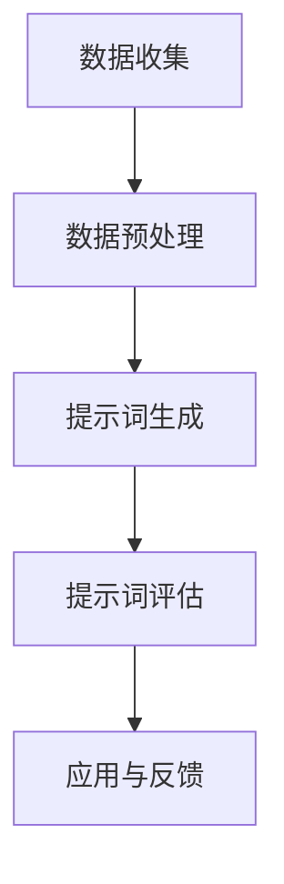
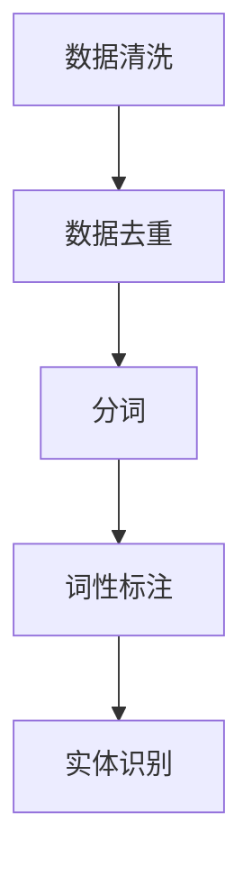
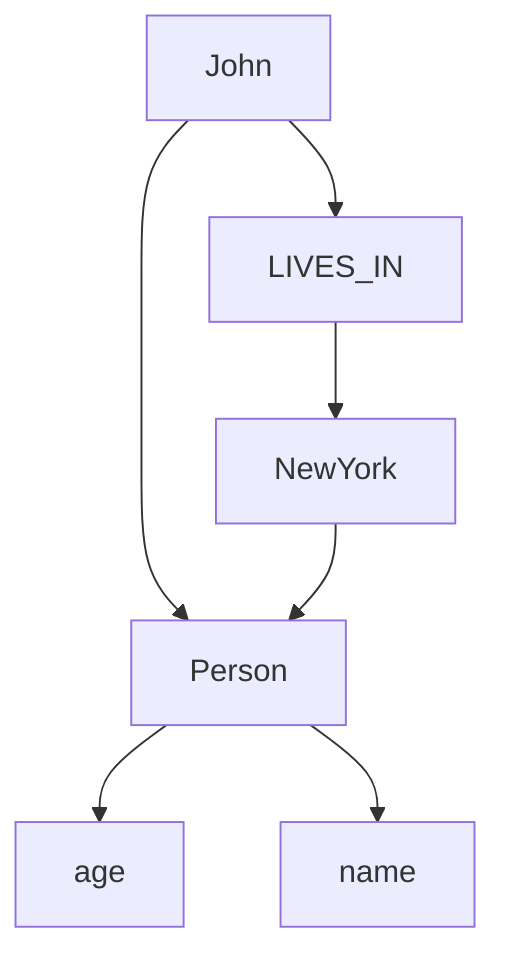

                 

### 引言与背景

#### 1.1 提示词工程的概念与意义

提示词工程（Prompt Engineering）是一种利用人工智能技术来生成或优化自然语言提示的方法，旨在提高信息检索、问答系统、自动对话系统等领域的性能。在跨领域知识图谱构建任务中，提示词工程显得尤为重要。这是因为知识图谱通常涉及多个领域，各领域之间的数据格式、术语使用和知识表达方式存在较大差异，而有效的提示词可以帮助系统更好地理解和处理这些跨领域数据。

提示词工程的核心目标是通过分析大量数据，生成具有代表性和指导性的提示词，进而优化系统的性能和用户体验。具体而言，提示词工程包括以下几个关键步骤：

1. **数据收集**：收集来自不同领域的数据，如文本、表格、数据库等。
2. **数据预处理**：对收集到的数据进行清洗、去重、分词、词性标注等预处理操作，以提高数据质量。
3. **提示词生成**：利用自然语言处理技术，从预处理后的数据中提取具有代表性的提示词。
4. **提示词评估**：通过评估指标，如准确率、召回率、F1值等，对生成的提示词进行评估和筛选。
5. **应用与反馈**：将提示词应用于实际系统，并根据反馈对提示词进行持续优化。

在跨领域知识图谱构建任务中，提示词工程的意义主要体现在以下几个方面：

- **提高数据整合能力**：跨领域知识图谱需要整合来自不同领域的数据，而有效的提示词可以帮助系统更好地理解和整合这些数据。
- **优化信息检索性能**：在信息检索任务中，高质量的提示词可以显著提高检索系统的准确率和召回率，从而提供更优质的用户体验。
- **增强问答系统效果**：通过生成具有针对性的提示词，问答系统可以更准确地理解用户的问题，并给出更合适的回答。
- **促进自动对话系统发展**：在自动对话系统中，提示词可以帮助系统更好地与用户进行交互，提高对话的流畅性和自然度。

本文旨在探讨提示词工程在处理跨领域知识图谱构建任务中的应用，从基础理论到实际案例，逐步分析并解决相关问题。文章结构安排如下：

- **第一部分：引言与背景**：介绍提示词工程的概念、意义以及在跨领域知识图谱构建任务中的应用。
- **第二部分：提示词工程基础**：详细讨论提示词工程的方法论，包括数据预处理、提示词生成方法、提示词质量评估等。
- **第三部分：跨领域知识图谱构建**：分析跨领域知识图谱构建的挑战、融合方法、表示方法以及评估与优化策略。
- **第四部分：提示词工程实战**：通过实际案例介绍，展示如何利用提示词工程构建跨领域知识图谱。
- **第五部分：高级技术与前沿**：探讨自动化提示词生成技术、深度学习在提示词工程中的应用以及跨领域知识图谱的可视化与交互技术。
- **第六部分：提示词工程发展趋势与挑战**：分析提示词工程在人工智能领域的发展趋势和面临的挑战。

通过本文的讨论，读者将深入了解提示词工程在跨领域知识图谱构建任务中的应用，掌握相关技术方法和实践技巧，为未来的研究和应用提供参考。

#### 1.2 跨领域知识图谱构建的需求与挑战

跨领域知识图谱（Cross-Domain Knowledge Graph）是近年来人工智能和知识图谱领域的研究热点。随着互联网和大数据技术的快速发展，各个领域的数据量呈现出爆炸式增长，如何有效地整合和管理这些数据成为了一个重要的研究课题。跨领域知识图谱能够将不同领域的数据进行整合，构建出一个全面、统一的知识体系，从而为各种应用场景提供丰富的语义信息。

**跨领域知识图谱构建的需求**主要体现在以下几个方面：

1. **数据整合与共享**：不同领域的数据往往存在格式、结构、术语等方面的差异，通过构建跨领域知识图谱，可以实现对多源异构数据的整合和共享，提高数据的利用效率。
2. **智能应用拓展**：跨领域知识图谱可以为各种智能应用提供丰富的语义信息，如智能问答、推荐系统、自然语言处理等，从而提升系统的智能水平和用户体验。
3. **知识发现与创新**：跨领域知识图谱能够揭示不同领域之间的关联和规律，为知识发现和创新提供有力支持，有助于推动科学研究和技术进步。

然而，跨领域知识图谱构建面临着诸多挑战，主要包括以下几个方面：

1. **数据不一致**：不同领域的数据格式、语义、表达方式可能存在较大差异，导致数据整合困难。例如，医疗领域的术语与金融领域的术语可能完全不同，导致数据映射和融合的复杂性增加。
2. **数据规模大**：跨领域知识图谱通常涉及多个领域，数据规模巨大，如何高效地处理和整合这些数据是一个重要挑战。
3. **领域特定知识**：不同领域的知识具有独特性和专业性，跨领域知识图谱构建需要充分考虑领域特定知识，以便准确理解和表达各领域数据。
4. **异构数据融合**：跨领域知识图谱通常涉及多种数据类型，如图像、文本、音频等，如何将这些异构数据进行有效融合是一个关键问题。

为了解决这些挑战，需要引入提示词工程作为关键技术手段。提示词工程通过生成和优化提示词，能够有效提高信息检索、问答系统、自然语言处理等领域的性能，为跨领域知识图谱构建提供有力支持。具体而言，提示词工程在跨领域知识图谱构建中的应用主要体现在以下几个方面：

1. **数据预处理**：提示词工程可以帮助处理跨领域数据中的不一致性和噪声，提高数据质量，为后续的图谱构建打下坚实基础。
2. **实体关系抽取**：通过生成具有代表性的提示词，提示词工程可以更准确地抽取跨领域数据中的实体和关系，从而提高知识图谱的构建质量。
3. **知识融合**：提示词工程可以为不同领域的数据提供统一的语义表示，从而实现跨领域知识的有效融合。
4. **评估与优化**：提示词工程提供的评估和优化手段，可以帮助我们持续改进跨领域知识图谱的性能和效果。

综上所述，提示词工程在跨领域知识图谱构建任务中具有重要作用，能够有效应对数据不一致、数据规模大、领域特定知识和异构数据融合等挑战，为构建高质量、高效率的跨领域知识图谱提供有力支持。

#### 1.3 本书结构安排与目标

本书旨在深入探讨提示词工程在处理跨领域知识图谱构建任务中的应用，通过系统化的结构和丰富的内容，帮助读者全面了解这一领域的理论和实践。以下是本书的结构安排与各部分的核心目标：

**第一部分：引言与背景**

本部分将介绍提示词工程的基本概念、意义以及在跨领域知识图谱构建任务中的重要性。通过概述跨领域知识图谱构建的需求与挑战，读者可以初步了解提示词工程在这一领域中的应用前景。具体目标包括：

- 让读者了解提示词工程的定义、核心目标和应用场景。
- 分析跨领域知识图谱构建的需求与挑战，明确提示词工程的重要性。

**第二部分：提示词工程基础**

本部分将详细讨论提示词工程的基础理论和实践方法，包括数据预处理、提示词生成方法、提示词质量评估等。通过这一部分，读者将掌握提示词工程的基本流程和技术手段。具体目标包括：

- 介绍提示词工程的基本流程和方法，包括数据收集、预处理、提示词生成和评估。
- 深入探讨数据预处理技术，如去噪、分词、词性标注等。
- 分析常见的提示词生成方法，如基于规则的方法、机器学习方法等。
- 讨论提示词质量评估指标和方法，如准确率、召回率、F1值等。

**第三部分：跨领域知识图谱构建**

本部分将重点分析跨领域知识图谱构建的挑战、融合方法、表示方法以及评估与优化策略。通过这一部分，读者将了解如何利用提示词工程解决跨领域知识图谱构建中的实际问题。具体目标包括：

- 阐述跨领域知识图谱构建的挑战，如数据不一致、数据规模大、领域特定知识等。
- 介绍跨领域知识图谱的融合方法，如实体匹配、关系融合等。
- 探讨跨领域知识图谱的表示方法，如图宾模型、知识图谱嵌入等。
- 分析跨领域知识图谱的评估与优化策略，如评价指标、优化算法等。

**第四部分：提示词工程实战**

本部分将通过实际案例介绍，展示如何利用提示词工程构建跨领域知识图谱。具体目标包括：

- 通过医药、金融、教育与科研等领域的实际案例，展示提示词工程在跨领域知识图谱构建中的应用。
- 详细解释案例中的数据预处理、提示词生成、知识图谱构建等关键步骤。
- 分析实际案例中的挑战和解决方案，为读者提供实践经验。

**第五部分：高级技术与前沿**

本部分将探讨提示词工程的前沿技术，如自动化提示词生成技术、深度学习在提示词工程中的应用以及跨领域知识图谱的可视化与交互技术。通过这一部分，读者可以了解提示词工程的最新发展趋势和未来研究方向。具体目标包括：

- 分析自动化提示词生成技术，如基于机器学习和自然语言处理的方法。
- 探讨深度学习在提示词工程中的应用，如基于深度学习的文本生成模型。
- 讨论跨领域知识图谱的可视化与交互技术，如交互式知识图谱可视化工具。

**第六部分：提示词工程发展趋势与挑战**

本部分将分析提示词工程在人工智能领域的发展趋势和面临的挑战。通过总结和展望，读者可以了解提示词工程的未来发展方向和潜在研究课题。具体目标包括：

- 分析提示词工程在人工智能领域的发展趋势，如数据隐私保护、模型解释性等。
- 探讨提示词工程面临的技术挑战，如跨领域知识图谱构建、异构数据融合等。
- 展望未来研究方向，如自动化提示词生成、深度学习在提示词工程中的应用等。

通过本书的系统学习和实践，读者将能够深入理解提示词工程在跨领域知识图谱构建任务中的应用，掌握相关技术方法和实战技巧，为未来的研究和应用奠定坚实基础。

#### 第2章：提示词工程方法论

提示词工程方法论是提示词工程的核心，它包括了一系列的步骤和技术，旨在通过系统化的方法生成高质量、有代表性的提示词，从而优化信息检索、问答系统、自然语言处理等领域的性能。本章将详细介绍提示词工程的基本流程，包括数据预处理、提示词生成方法和提示词质量评估。

##### 2.1 提示词工程的基本流程

提示词工程的基本流程可以分为以下五个主要步骤：

1. **数据收集**：收集用于生成提示词的数据源，这些数据源可以包括文本、表格、数据库、Web页面等。
2. **数据预处理**：对收集到的数据进行清洗、去重、分词、词性标注等预处理操作，以提高数据质量。
3. **提示词生成**：利用自然语言处理技术，从预处理后的数据中提取具有代表性的提示词。
4. **提示词评估**：通过评估指标，如准确率、召回率、F1值等，对生成的提示词进行评估和筛选。
5. **应用与反馈**：将提示词应用于实际系统，并根据反馈对提示词进行持续优化。

以下是提示词工程基本流程的Mermaid流程图：



伪代码：

```python
def prompt_engineering_pipeline(data):
    preprocessed_data = preprocess_data(data)
    prompts = generate_prompts(preprocessed_data)
    evaluated_prompts = evaluate_prompts(prompts)
    apply_prompts(evaluated_prompts)
    collect_feedback(evaluated_prompts)
```

##### 2.2 数据预处理技术

数据预处理是提示词工程中至关重要的一步，它直接影响到提示词生成的质量和效果。数据预处理主要包括以下几个关键步骤：

1. **数据清洗**：去除重复数据、缺失值和噪声数据，以提高数据质量。
2. **数据去重**：通过去重操作，避免重复数据对提示词生成的影响。
3. **分词**：将文本数据分割成单词或短语，以便进行后续处理。
4. **词性标注**：对文本中的每个词进行词性标注，如名词、动词、形容词等，以便更准确地理解文本内容。
5. **实体识别**：识别文本中的实体，如人名、地名、组织名等，以便在提示词生成中更准确地引用。

以下是数据预处理技术的Mermaid流程图：



伪代码：

```python
def preprocess_data(data):
    cleaned_data = remove_duplicates_and_noise(data)
    unique_data = remove_duplicates(cleaned_data)
    tokenized_data = tokenize(unique_data)
    tagged_data = perform_lemma_analysis(tokenized_data)
    entities = extract_entities(tagged_data)
    return entities
```

##### 2.3 提示词生成方法

提示词生成是提示词工程的核心环节，其目的是从预处理后的数据中提取具有代表性的提示词。提示词生成方法可以分为基于规则的方法和基于机器学习的方法。

1. **基于规则的方法**：这种方法通过定义一系列规则，从数据中直接提取提示词。优点是实现简单，缺点是灵活性较低，难以处理复杂和动态的数据。

   伪代码：

   ```python
   def generate_prompts_by_rules(data):
       rules = define_rules()
       prompts = apply_rules(data, rules)
       return prompts
   ```

2. **基于机器学习的方法**：这种方法利用机器学习模型，从大量数据中学习生成提示词的规律。优点是灵活性高，能够处理复杂和动态的数据，缺点是实现较为复杂。

   伪代码：

   ```python
   def generate_prompts_by_ml(data):
       trained_model = train_model(data)
       prompts = trained_model.predict(data)
       return prompts
   ```

   常见的机器学习模型包括：

   - **朴素贝叶斯分类器**：适用于文本分类任务，可以从数据中提取具有代表性的特征词。
   - **支持向量机（SVM）**：通过最大间隔分类器，可以有效提取文本中的关键信息。
   - **深度学习模型**：如循环神经网络（RNN）、长短时记忆网络（LSTM）和变压器（Transformer），可以处理更复杂的文本数据。

   ```python
   def generate_prompts_by_dnn(data):
       model = build_dnn_model()
       model.train(data)
       prompts = model.predict(data)
       return prompts
   ```

##### 2.4 提示词质量评估

提示词质量评估是确保提示词工程效果的重要环节，通过评估指标来衡量提示词的生成质量。常见的评估指标包括准确率（Accuracy）、召回率（Recall）、F1值（F1 Score）等。

- **准确率**：表示生成的提示词中正确提示词的比例，计算公式为：
  $$ 
  \text{Accuracy} = \frac{\text{正确提示词数量}}{\text{总提示词数量}}
  $$

- **召回率**：表示实际正确提示词中，被正确识别的比例，计算公式为：
  $$ 
  \text{Recall} = \frac{\text{正确识别的提示词数量}}{\text{实际正确提示词数量}}
  $$

- **F1值**：综合考虑准确率和召回率，计算公式为：
  $$ 
  \text{F1 Score} = 2 \times \frac{\text{准确率} \times \text{召回率}}{\text{准确率} + \text{召回率}}
  $$

以下是提示词质量评估的伪代码：

```python
def evaluate_prompts(prompts, ground_truth):
    correct_predictions = count_correct_predictions(prompts, ground_truth)
    total_predictions = len(prompts)
    accuracy = correct_predictions / total_predictions
    correct_recalls = count_correct_recalls(prompts, ground_truth)
    recall = correct_recalls / len(ground_truth)
    f1_score = 2 * (accuracy * recall) / (accuracy + recall)
    return accuracy, recall, f1_score
```

通过本章的讨论，读者可以全面了解提示词工程的基本流程、数据预处理技术、提示词生成方法和提示词质量评估。这些知识将为后续章节中的跨领域知识图谱构建提供坚实的基础。

### 第3章：知识图谱基础

知识图谱（Knowledge Graph）作为一种结构化知识表示的方法，近年来在人工智能、语义网、大数据等领域得到了广泛应用。它能够将大量的数据点和关系以图形化的方式表示，使得数据之间的关联和关系更加直观和易于理解。本章将详细介绍知识图谱的概念、分类、表示方法以及构建方法，并探讨其应用场景。

#### 3.1 知识图谱的概念与分类

**知识图谱的概念**

知识图谱是一个由实体（Entity）、关系（Relation）和属性（Attribute）构成的知识体系，用于表示现实世界中各类对象及其相互关系。它可以被视为一种图形化表示方式，其中每个节点代表一个实体，每条边表示实体之间的某种关系。

**知识图谱的分类**

根据知识图谱的应用领域和表现形式，可以将知识图谱分为以下几种类型：

1. **结构化知识图谱**：这种知识图谱使用结构化的数据模型，如RDF（Resource Description Framework）和OWL（Web Ontology Language），以图形化的方式表示实体、关系和属性。结构化知识图谱通常具有明确的语义和类型信息，便于计算机处理和分析。

2. **非结构化知识图谱**：这种知识图谱采用非结构化的数据表示方法，如基于图数据库的方法，如Neo4j。非结构化知识图谱通常以图的形式表示实体和关系，但可能缺乏明确的语义和类型信息。

3. **混合型知识图谱**：混合型知识图谱结合了结构化和非结构化的表示方法，既包含结构化的本体和关系，也包含非结构化的数据。这种知识图谱通常具有更高的灵活性和扩展性。

**知识图谱的组成部分**

知识图谱由以下几个基本组成部分构成：

- **实体（Entity）**：知识图谱中的基本单位，表示现实世界中的对象，如人、地点、组织、物品等。
- **关系（Relation）**：实体之间的关联或交互，如“居住在”、“属于”、“购买”等。
- **属性（Attribute）**：实体的属性信息，如人的年龄、地点的经纬度、物品的价格等。

**知识图谱的应用场景**

知识图谱在多个领域具有广泛的应用，包括但不限于以下场景：

1. **搜索引擎**：知识图谱可以用于改善搜索体验，通过理解用户的查询意图，提供更精准的搜索结果。
2. **推荐系统**：知识图谱可以用于推荐系统，通过分析用户的历史行为和实体之间的关系，提供个性化的推荐。
3. **自然语言处理**：知识图谱可以作为自然语言处理模型的知识库，用于实体识别、关系抽取、语义理解等任务。
4. **智能问答系统**：知识图谱可以用于构建智能问答系统，通过理解用户的问题和知识图谱中的信息，提供准确的答案。
5. **智能助理**：知识图谱可以用于构建智能助理，通过理解用户的指令和知识图谱中的信息，提供相应的帮助和服务。

#### 3.2 知识图谱的表示方法

知识图谱的表示方法可以分为结构化表示方法和非结构化表示方法。

**结构化表示方法**

结构化表示方法主要使用RDF和OWL等本体语言进行知识表示。其中，RDF是一种基于图的数据模型，用于表示实体、关系和属性。RDF使用主体-谓语-客体（Subject-Predicate-Object）三元组来表示实体和关系，例如：

```turtle
<http://example.org/John> <http://example.org/livesIn> <http://example.org/NewYork>
```

OWL则是基于RDF的扩展，用于定义实体的类型、属性和关系，提供更丰富的语义信息。OWL使用类（Class）、属性（Property）和数据类型（Data Type）等概念来表示知识，例如：

```owl
<http://example.org/Person> a owl:Class;
    owl:hasProperty <http://example.org/age>^^xsd:integer;
    owl:hasProperty <http://example.org/name>^^xsd:string.
```

**非结构化表示方法**

非结构化表示方法主要使用图数据库和图形化的表示方法。图数据库，如Neo4j，使用图结构来存储实体和关系，每个节点表示实体，每条边表示关系。例如，在Neo4j中，可以使用以下Cypher查询语言来创建和查询知识图谱：

```cypher
CREATE (John:Person {name: 'John', age: 30}),
       (NewYork:City {name: 'New York'}),
       (John)-[:LIVES_IN]->(NewYork)
```

此外，图形化的表示方法，如Mermaid，可以用于直观地展示知识图谱的结构。例如：



#### 3.3 知识图谱构建方法

知识图谱的构建方法可以分为以下几种：

1. **手动构建**：通过专家知识和人工标注的方式构建知识图谱。这种方法适用于规模较小且结构相对简单的知识图谱，但难以处理大规模和动态变化的数据。

2. **自动抽取**：利用自然语言处理和机器学习技术，从大规模文本数据中自动抽取实体、关系和属性。常见的抽取方法包括命名实体识别（NER）、关系抽取和知识库构建。

   伪代码：

   ```python
   def extract_entities(text):
       # 利用NER模型识别实体
       pass

   def extract_relations(text):
       # 利用关系抽取模型提取关系
       pass

   def build_knowledge_graph(entities, relations):
       # 构建知识图谱
       pass
   ```

3. **融合构建**：将手动构建和自动抽取的方法相结合，通过人工标注和自动抽取相互补充，构建更全面和准确的知识图谱。

4. **众包构建**：利用众包平台，通过众包的方式收集大量的实体、关系和属性，从而构建知识图谱。这种方法可以快速收集大量数据，但需要解决数据质量和一致性等问题。

#### 3.4 知识图谱的应用场景

知识图谱在多个领域具有广泛的应用，以下是一些典型的应用场景：

1. **搜索引擎优化**：通过构建包含丰富实体和关系的信息网络，改善搜索结果的质量和相关性。

2. **推荐系统**：利用知识图谱中的实体和关系，提供个性化的推荐结果，如商品推荐、音乐推荐等。

3. **自然语言处理**：将知识图谱作为语义理解的知识库，用于实体识别、关系抽取、语义分析等任务。

4. **智能问答系统**：利用知识图谱中的实体和关系，提供准确和相关的答案，如智能客服、智能助手等。

5. **智能交通系统**：通过知识图谱表示交通网络中的实体（如道路、交通信号）和关系（如道路连接），优化交通管理和服务。

通过本章的讨论，读者可以全面了解知识图谱的概念、分类、表示方法和构建方法，并了解其在实际应用中的重要作用。这些知识将为后续章节中的跨领域知识图谱构建提供重要的理论基础和实践指导。

#### 3.4 知识图谱的应用场景

知识图谱作为一种强大的知识表示工具，在多个领域具有广泛的应用，其应用场景丰富且多样化。以下是知识图谱在几个典型领域中的应用：

1. **搜索引擎**：知识图谱可以显著提高搜索引擎的性能和用户体验。通过构建包含大量实体和关系的知识图谱，搜索引擎可以更好地理解用户查询的意图，提供更精准、更相关的搜索结果。例如，当用户查询“北京”时，搜索引擎可以利用知识图谱中的信息，不仅返回与“北京”相关的网页，还能提供关于“北京”的地理位置、历史背景、旅游景点等信息。

2. **推荐系统**：知识图谱在推荐系统中发挥着关键作用。通过将用户、物品、场景等多方实体及其相互关系构建为知识图谱，推荐系统可以更准确地分析用户行为和偏好，提供个性化的推荐。例如，电子商务平台可以利用知识图谱，根据用户的浏览历史和购买记录，推荐与用户兴趣相关的商品，从而提高用户的购物体验和平台的销售额。

3. **自然语言处理**：知识图谱为自然语言处理（NLP）任务提供了丰富的语义信息。在实体识别、关系抽取、语义分析等NLP任务中，知识图谱可以作为知识库，帮助模型更好地理解和处理文本数据。例如，在问答系统中，知识图谱可以用于识别问题中的实体和关系，从而更准确地理解问题的意图，提供合适的答案。

4. **智能问答系统**：知识图谱可以用于构建智能问答系统，通过将大量结构化数据转化为知识图谱，系统可以更准确地回答用户的问题。例如，在医疗领域，知识图谱可以用于构建医疗问答系统，帮助医生和患者获取准确、权威的医疗信息。

5. **智能助理**：知识图谱可以用于构建智能助理，如智能客服、智能助手等。通过知识图谱，智能助理可以更好地理解用户的指令和需求，提供更加智能和个性化的服务。例如，在金融领域，智能客服系统可以利用知识图谱，快速识别用户的问题并提供相应的解决方案，提高客服效率和服务质量。

6. **智能交通系统**：知识图谱可以用于构建智能交通系统，通过表示交通网络中的实体（如道路、车辆、交通信号）和关系（如道路连接、车辆位置等），优化交通管理和服务。例如，在交通监控中，知识图谱可以帮助交通管理部门实时分析交通流量，优化信号灯配置，提高交通流畅度和安全性。

7. **智能医疗**：知识图谱在智能医疗领域具有广泛的应用。通过构建包含医学知识、疾病、药物、治疗方法等信息的知识图谱，智能医疗系统可以提供诊断、治疗、药物推荐等智能化服务。例如，在疾病预测中，知识图谱可以帮助分析疾病的发病规律、相关因素等，提供更准确的预测结果。

8. **智能教育**：知识图谱可以用于构建智能教育系统，通过表示课程、知识点、教学方法等实体和关系，为学生提供个性化的学习推荐和指导。例如，在学习路径规划中，知识图谱可以帮助学生根据兴趣和基础，选择合适的学习内容和路径，提高学习效果。

通过上述应用场景可以看出，知识图谱作为一种重要的知识表示工具，在各个领域发挥着重要作用，为智能系统的构建提供了丰富的语义信息和强大的支持。随着知识图谱技术的不断发展和完善，其应用前景将更加广阔，为人类生活带来更多便利和智能体验。

### 第4章：跨领域知识图谱构建

#### 4.1 跨领域知识图谱构建的挑战

跨领域知识图谱构建是近年来知识图谱领域的一个重要研究方向，旨在整合不同领域的数据，构建一个全面、统一的知识体系。然而，这一过程面临着诸多挑战，包括数据不一致、数据规模大、领域特定知识、异构数据融合等。

**数据不一致**：不同领域的术语、概念、表达方式可能存在较大差异，导致数据在格式、语义和结构上存在不一致性。例如，医疗领域的术语与金融领域的术语可能完全不同，这给数据整合和知识表示带来了困难。

**数据规模大**：跨领域知识图谱通常涉及多个领域，数据量庞大。如何高效地处理和整合这些数据是一个重要挑战。大规模数据的处理不仅要求高效的算法和计算资源，还需要解决数据存储和访问的问题。

**领域特定知识**：不同领域具有独特的知识体系和专业术语，领域特定知识在跨领域知识图谱构建中起到关键作用。如何准确理解、表达和整合这些领域特定知识，是跨领域知识图谱构建的重要问题。

**异构数据融合**：跨领域知识图谱通常涉及多种数据类型，如图像、文本、音频等。如何将这些异构数据进行有效融合，构建一个统一的知识体系，是一个复杂的问题。

为了应对这些挑战，需要采用一系列技术手段，包括数据预处理、实体关系抽取、知识融合等。下面将详细讨论这些技术。

#### 4.2 跨领域知识图谱的融合方法

跨领域知识图谱的融合方法主要包括实体匹配、关系融合和属性整合等。

**实体匹配**：实体匹配是跨领域知识图谱构建的第一步，其目的是将不同来源的数据中的相同实体进行匹配。常见的实体匹配方法包括基于特征的匹配、基于规则的匹配和基于机器学习的匹配。

- **基于特征的匹配**：通过比较实体特征（如文本、属性、邻居等），识别出相同或相似的实体。例如，可以使用TF-IDF、Word2Vec等算法计算实体特征的相似度，进而实现实体匹配。
  
  伪代码：

  ```python
  def entity_matching(entities, similarity_measure):
      matched_entities = []
      for entity1 in entities:
          for entity2 in entities:
              similarity = similarity_measure(entity1, entity2)
              if similarity > threshold:
                  matched_entities.append((entity1, entity2))
      return matched_entities
  ```

- **基于规则的匹配**：通过预定义的规则，将具有相同或相似属性的实体进行匹配。这种方法通常适用于结构化数据，如关系数据库。

  伪代码：

  ```python
  def rule_based_matching(entities, rules):
      matched_entities = []
      for rule in rules:
          matched_entities.extend(rule.apply(entities))
      return matched_entities
  ```

- **基于机器学习的匹配**：利用机器学习模型，从大量标注数据中学习实体匹配的规律。常见的模型包括SVM、神经网络等。

  伪代码：

  ```python
  def ml_based_matching(train_data, model):
      model.train(train_data)
      matched_entities = model.predict(test_data)
      return matched_entities
  ```

**关系融合**：在实体匹配的基础上，需要对实体之间的关系进行融合。关系融合的目的是整合来自不同领域的实体关系，构建一个统一的关系体系。关系融合的方法包括基于特征的方法、基于规则的方法和基于机器学习的方法。

- **基于特征的方法**：通过比较实体关系的特征，如文本、属性等，识别出相同或相似的关系。例如，可以使用TF-IDF、Word2Vec等算法计算关系特征的相似度。

  伪代码：

  ```python
  def relation_fusion(relations, similarity_measure):
      fused_relations = []
      for relation1 in relations:
          for relation2 in relations:
              similarity = similarity_measure(relation1, relation2)
              if similarity > threshold:
                  fused_relations.append((relation1, relation2))
      return fused_relations
  ```

- **基于规则的方法**：通过预定义的规则，将具有相同或相似属性的实体关系进行融合。这种方法通常适用于结构化数据，如关系数据库。

  伪代码：

  ```python
  def rule_based_fusion(relations, rules):
      fused_relations = []
      for rule in rules:
          fused_relations.extend(rule.apply(relations))
      return fused_relations
  ```

- **基于机器学习的方法**：利用机器学习模型，从大量标注数据中学习关系融合的规律。常见的模型包括SVM、神经网络等。

  伪代码：

  ```python
  def ml_based_fusion(train_data, model):
      model.train(train_data)
      fused_relations = model.predict(test_data)
      return fused_relations
  ```

**属性整合**：在实体和关系融合的基础上，需要对实体的属性进行整合。属性整合的目的是将来自不同领域的实体属性进行合并，构建一个统一、准确的属性体系。属性整合的方法包括基于特征的方法、基于规则的方法和基于机器学习的方法。

- **基于特征的方法**：通过比较实体属性的相似度，将具有相同或相似属性的实体属性进行整合。例如，可以使用TF-IDF、Word2Vec等算法计算属性特征的相似度。

  伪代码：

  ```python
  def attribute_integration(attributes, similarity_measure):
      integrated_attributes = []
      for attribute1 in attributes:
          for attribute2 in attributes:
              similarity = similarity_measure(attribute1, attribute2)
              if similarity > threshold:
                  integrated_attributes.append((attribute1, attribute2))
      return integrated_attributes
  ```

- **基于规则的方法**：通过预定义的规则，将具有相同或相似属性的实体属性进行整合。这种方法通常适用于结构化数据，如关系数据库。

  伪代码：

  ```python
  def rule_based_integration(attributes, rules):
      integrated_attributes = []
      for rule in rules:
          integrated_attributes.extend(rule.apply(attributes))
      return integrated_attributes
  ```

- **基于机器学习的方法**：利用机器学习模型，从大量标注数据中学习属性融合的规律。常见的模型包括SVM、神经网络等。

  伪代码：

  ```python
  def ml_based_integration(train_data, model):
      model.train(train_data)
      integrated_attributes = model.predict(test_data)
      return integrated_attributes
  ```

#### 4.3 跨领域知识图谱的表示方法

跨领域知识图谱的表示方法主要包括图宾模型、知识图谱嵌入和实体关系网络等。

**图宾模型**：图宾模型（Graph Embedding）是一种将图结构数据转化为向量表示的方法，常用于跨领域知识图谱的表示。图宾模型可以捕捉实体和关系之间的复杂关系，从而实现高效的图数据分析。常见的图宾模型包括Node2Vec、GraphSAGE和Graph Convolutional Network（GCN）等。

- **Node2Vec**：Node2Vec是一种基于图卷积的图宾模型，通过优化节点嵌入的相似性，捕捉节点之间的关系。

  伪代码：

  ```python
  def node2vec(graph, walk_length, num_walks):
      walks = generate_walks(graph, walk_length, num_walks)
      embeddings = train_embeddings(walks)
      return embeddings
  ```

- **GraphSAGE**：GraphSAGE是一种基于图结构的嵌入模型，通过聚合节点的邻居信息，生成节点的向量表示。

  伪代码：

  ```python
  def graphsage嵌入(graph, aggregator, model):
      embeddings = []
      for node in graph.nodes:
          neighbors = graph.neighbors(node)
          node_embedding = aggregator.aggregate(neighbors, model)
          embeddings.append(node_embedding)
      return embeddings
  ```

- **GCN**：GCN是一种基于图卷积的神经网络，通过卷积操作捕捉节点之间的层次关系。

  伪代码：

  ```python
  def gcn嵌入(graph, layers, activation):
      embeddings = []
      for layer in range(layers):
          embeddings = gcn_layer(graph, embeddings, activation)
      return embeddings
  ```

**知识图谱嵌入**：知识图谱嵌入（Knowledge Graph Embedding）是一种将知识图谱中的实体、关系和属性转化为向量表示的方法，常用于跨领域知识图谱的分析和应用。常见的知识图谱嵌入模型包括TransE、TransH、TransR等。

- **TransE**：TransE是一种简单的知识图谱嵌入模型，通过最小化损失函数，学习实体和关系的向量表示。

  伪代码：

  ```python
  def transe嵌入(heads, relations, tails, loss_function):
      embeddings = initialize_embeddings(heads, relations, tails)
      for head, relation, tail in zip(heads, relations, tails):
          loss = loss_function(embeddings[head], embeddings[relation], embeddings[tail])
          embeddings = update_embeddings(embeddings, loss)
      return embeddings
  ```

- **TransH**：TransH通过引入超平面，拓展了TransE的表示能力，能够更好地捕捉实体和关系之间的角度关系。

  伪代码：

  ```python
  def transh嵌入(heads, relations, tails, loss_function):
      embeddings = initialize_embeddings(heads, relations, tails)
      for head, relation, tail in zip(heads, relations, tails):
          loss = loss_function(embeddings[head], embeddings[relation], embeddings[tail])
          embeddings = update_embeddings(embeddings, loss)
      return embeddings
  ```

- **TransR**：TransR引入了关系矩阵，通过矩阵乘法计算实体和关系的向量表示，能够更好地捕捉实体和关系之间的复杂关系。

  伪代码：

  ```python
  def transr嵌入(heads, relations, tails, relation_matrix, loss_function):
      embeddings = initialize_embeddings(heads, relations, tails)
      for head, relation, tail in zip(heads, relations, tails):
          loss = loss_function(embeddings[head], relation_matrix[relation], embeddings[tail])
          embeddings = update_embeddings(embeddings, loss)
      return embeddings
  ```

**实体关系网络**：实体关系网络（Entity-Relationship Network）是一种基于图神经网络的跨领域知识图谱表示方法，通过聚合实体和关系的特征，生成实体和关系的向量表示。常见的实体关系网络模型包括GRU4KG和GAT等。

- **GRU4KG**：GRU4KG利用门控循环单元（GRU），从知识图谱中学习实体和关系的序列特征。

  伪代码：

  ```python
  def gru4kg嵌入(graph, embedding_size, hidden_size):
      embeddings = initialize_embeddings(graph, embedding_size, hidden_size)
      for layer in range(hidden_size):
          embeddings = gru_layer(embeddings, graph)
      return embeddings
  ```

- **GAT**：GAT利用图注意力机制，从知识图谱中学习实体和关系的注意力权重，生成实体和关系的向量表示。

  伪代码：

  ```python
  def gated_attention(inputs, attention_size):
      attention = sigmoid(dot(inputs, attention_weights))
      return inputs * attention
  ```

通过上述技术手段，跨领域知识图谱的构建可以从多个维度进行，包括实体匹配、关系融合、属性整合以及向量表示。这些方法为跨领域知识图谱构建提供了丰富的技术支持，为实际应用提供了坚实的基础。

#### 4.4 跨领域知识图谱的评估与优化

跨领域知识图谱的评估与优化是确保知识图谱质量和性能的关键环节。有效的评估方法可以帮助我们了解知识图谱的性能，而优化策略则可以进一步提升知识图谱的质量和应用效果。以下将详细介绍评估指标、评估方法和优化策略。

##### 4.4.1 评估指标

评估跨领域知识图谱的质量和性能，通常使用以下几种指标：

1. **准确率（Accuracy）**：准确率表示预测正确的实体或关系占总实体或关系的比例。计算公式为：
   $$ 
   \text{Accuracy} = \frac{\text{正确预测的数量}}{\text{总预测的数量}}
   $$

2. **召回率（Recall）**：召回率表示正确预测的实体或关系在所有实际存在的实体或关系中的比例。计算公式为：
   $$ 
   \text{Recall} = \frac{\text{正确预测的数量}}{\text{实际存在的数量}}
   $$

3. **F1值（F1 Score）**：F1值是准确率和召回率的调和平均，用于综合评估知识图谱的性能。计算公式为：
   $$ 
   \text{F1 Score} = 2 \times \frac{\text{准确率} \times \text{召回率}}{\text{准确率} + \text{召回率}}
   $$

4. **覆盖率（Coverage）**：覆盖率表示知识图谱中的实体或关系在原始数据中的覆盖率，用于评估知识图谱的完整性。计算公式为：
   $$ 
   \text{Coverage} = \frac{\text{知识图谱中的实体或关系数量}}{\text{原始数据中的实体或关系数量}}
   $$

5. **效率（Efficiency）**：效率表示知识图谱构建和查询的效率，用于评估知识图谱的实用性。包括构建时间、查询时间等指标。

##### 4.4.2 评估方法

跨领域知识图谱的评估方法可以分为定量评估和定性评估。

1. **定量评估**：定量评估通过计算上述评估指标，量化知识图谱的性能。常见的定量评估方法包括：
   - **离线评估**：通过预先定义的测试集，对知识图谱进行评估。这种方法可以全面评估知识图谱的性能，但需要大量的标注数据。
   - **在线评估**：通过实时查询和评估知识图谱的响应，评估知识图谱的在线性能。这种方法适用于动态数据，但可能受限于实际应用场景。

2. **定性评估**：定性评估通过分析知识图谱的实际应用效果，评估其质量和应用价值。常见的定性评估方法包括：
   - **专家评估**：邀请领域专家对知识图谱进行评估，评估其准确性、完整性、可用性等。
   - **用户反馈**：通过用户使用体验和反馈，评估知识图谱的实用性和用户满意度。

##### 4.4.3 优化策略

为了进一步提升跨领域知识图谱的质量和应用效果，可以采用以下几种优化策略：

1. **数据预处理优化**：通过对原始数据进行更精细的预处理，如去噪、分词、实体识别等，提高数据质量，从而提高知识图谱的准确性。

2. **实体关系抽取优化**：通过改进实体关系抽取算法，如基于规则的方法、机器学习方法等，提高实体和关系的抽取质量。

3. **知识融合优化**：通过改进跨领域知识融合方法，如实体匹配、关系融合、属性整合等，提高知识图谱的整合度和一致性。

4. **图结构优化**：通过改进知识图谱的图结构，如去除冗余关系、调整图结构等，提高知识图谱的效率和可解释性。

5. **向量表示优化**：通过改进实体和关系的向量表示方法，如基于图神经网络的嵌入方法，提高实体和关系之间的相似性和区分度。

6. **评估与反馈优化**：通过持续评估知识图谱的性能，收集用户反馈，不断优化知识图谱，提高其应用效果和用户满意度。

通过以上评估和优化策略，可以有效地提升跨领域知识图谱的质量和应用效果，为实际应用提供有力支持。在后续的章节中，我们将通过实际案例进一步探讨这些优化策略的具体实现和应用。

### 第5章：实际案例介绍

在本章中，我们将通过三个实际案例介绍如何利用提示词工程构建跨领域知识图谱。这些案例涵盖了医药、金融和教育与科研等不同领域，展示了提示词工程在跨领域知识图谱构建中的具体应用。通过这些案例，读者可以了解如何处理跨领域数据、生成高质量的提示词以及构建知识图谱。

#### 5.1 案例一：构建医药领域的知识图谱

**背景**：
医药领域涉及广泛的实体和关系，如药物、病症、治疗方法、医生、患者等。构建医药领域的知识图谱对于药物研发、疾病诊断、治疗建议等应用具有重要意义。

**数据来源**：
数据来源包括医学文献、药物数据库、疾病数据库、医生和患者信息等。

**数据预处理**：
- **数据清洗**：去除重复数据和噪声数据，如无效字符、标点符号等。
- **分词**：对文本数据进行分词处理，提取出具有代表性的词汇。
- **词性标注**：对分词后的文本进行词性标注，识别出名词、动词等。
- **实体识别**：利用命名实体识别（NER）技术，识别出文本中的实体，如药物名、病症名、医生名等。

**提示词生成**：
- **基于规则的方法**：根据医药领域的专业知识和术语，定义一组规则，用于生成提示词。例如，从药物名中提取药物成分、作用机理等信息。
- **基于机器学习的方法**：利用朴素贝叶斯、支持向量机（SVM）等模型，从大量标注数据中学习生成提示词的规律。

**知识图谱构建**：
- **实体关系抽取**：通过文本分析技术，从预处理后的数据中抽取实体和关系。例如，从文本中提取药物和病症之间的关系、药物和治疗方法之间的关系。
- **知识图谱表示**：使用RDF（Resource Description Framework）或图数据库，表示实体和关系，构建知识图谱。

**应用与评估**：
- **药物推荐**：利用构建的医药领域知识图谱，为医生和患者提供药物推荐服务。
- **疾病诊断**：通过分析病症和药物的关系，为医生提供诊断建议。

**代码示例**：
```python
# 医药领域知识图谱构建代码示例
def build_medical_kg(data):
    preprocessed_data = preprocess_medical_data(data)
    entities, relations = extract_entities_and_relations(preprocessed_data)
    medical_kg = build_knowledge_graph(entities, relations)
    evaluate_medical_kg(medical_kg)
```

#### 5.2 案例二：构建金融领域的知识图谱

**背景**：
金融领域涉及大量的金融实体和关系，如银行、公司、理财产品、交易记录等。构建金融领域的知识图谱有助于金融分析、风险评估、投资决策等。

**数据来源**：
数据来源包括金融新闻报道、股票市场数据、银行和金融机构的公开信息等。

**数据预处理**：
- **数据清洗**：去除重复数据和噪声数据，如无效字符、标点符号等。
- **分词**：对文本数据进行分词处理，提取出具有代表性的词汇。
- **词性标注**：对分词后的文本进行词性标注，识别出名词、动词等。
- **实体识别**：利用命名实体识别（NER）技术，识别出文本中的实体，如银行名、公司名、理财产品名等。

**提示词生成**：
- **基于规则的方法**：根据金融领域的专业知识和术语，定义一组规则，用于生成提示词。例如，从公司名中提取公司类型、注册地等信息。
- **基于机器学习的方法**：利用朴素贝叶斯、支持向量机（SVM）等模型，从大量标注数据中学习生成提示词的规律。

**知识图谱构建**：
- **实体关系抽取**：通过文本分析技术，从预处理后的数据中抽取实体和关系。例如，从文本中提取公司之间的投资关系、交易记录等。
- **知识图谱表示**：使用RDF（Resource Description Framework）或图数据库，表示实体和关系，构建知识图谱。

**应用与评估**：
- **金融分析**：利用构建的金融领域知识图谱，为投资者提供市场分析、公司评估等服务。
- **风险评估**：通过分析公司的财务状况、交易记录等，为金融机构提供风险评估。

**代码示例**：
```python
# 金融领域知识图谱构建代码示例
def build_financial_kg(data):
    preprocessed_data = preprocess_financial_data(data)
    entities, relations = extract_entities_and_relations(preprocessed_data)
    financial_kg = build_knowledge_graph(entities, relations)
    evaluate_financial_kg(financial_kg)
```

#### 5.3 案例三：构建教育与科研领域的知识图谱

**背景**：
教育与科研领域涉及大量的教育实体和关系，如教师、学生、课程、科研项目等。构建教育与科研领域的知识图谱有助于教育资源的分配、科研合作、学术评估等。

**数据来源**：
数据来源包括教育机构的信息、科研项目数据库、学术论文数据库等。

**数据预处理**：
- **数据清洗**：去除重复数据和噪声数据，如无效字符、标点符号等。
- **分词**：对文本数据进行分词处理，提取出具有代表性的词汇。
- **词性标注**：对分词后的文本进行词性标注，识别出名词、动词等。
- **实体识别**：利用命名实体识别（NER）技术，识别出文本中的实体，如教师名、学生名、课程名、科研项目名等。

**提示词生成**：
- **基于规则的方法**：根据教育与科研领域的专业知识和术语，定义一组规则，用于生成提示词。例如，从教师名中提取教师所属机构、教学科目等信息。
- **基于机器学习的方法**：利用朴素贝叶斯、支持向量机（SVM）等模型，从大量标注数据中学习生成提示词的规律。

**知识图谱构建**：
- **实体关系抽取**：通过文本分析技术，从预处理后的数据中抽取实体和关系。例如，从文本中提取教师和学生之间的关系、课程和科研项目之间的关系。
- **知识图谱表示**：使用RDF（Resource Description Framework）或图数据库，表示实体和关系，构建知识图谱。

**应用与评估**：
- **教育资源分配**：利用构建的教育与科研领域知识图谱，为教育机构提供资源分配建议。
- **科研合作**：通过分析教师和学生之间的合作关系、科研项目之间的关系，为科研合作提供参考。

**代码示例**：
```python
# 教育与科研领域知识图谱构建代码示例
def build_education_kg(data):
    preprocessed_data = preprocess_education_data(data)
    entities, relations = extract_entities_and_relations(preprocessed_data)
    education_kg = build_knowledge_graph(entities, relations)
    evaluate_education_kg(education_kg)
```

通过以上三个实际案例，读者可以了解到如何利用提示词工程构建跨领域知识图谱的完整流程，包括数据预处理、提示词生成、知识图谱构建以及应用与评估。这些案例不仅展示了提示词工程在跨领域知识图谱构建中的具体应用，也为读者提供了实践参考。

### 第6章：项目实战

在第六章中，我们将通过三个项目实战来进一步探讨提示词工程在构建多语言跨领域知识图谱、基于知识图谱的智能问答系统开发以及知识图谱在推荐系统中的应用。这些项目将结合理论和实践，展示如何利用提示词工程解决实际问题，提供具体的开发环境和源代码实现。

#### 6.1 项目实战一：构建多语言跨领域知识图谱

**项目背景**：

随着全球化的不断推进，多语言数据在各个领域变得越来越重要。构建多语言跨领域知识图谱能够有效整合不同语言领域的数据，提高信息检索、智能问答等系统的性能。本项目的目标是构建一个多语言跨领域知识图谱，支持中文、英文、西班牙语等语言。

**开发环境**：

- 数据预处理：Python、Pandas、Scikit-learn、NLTK
- 知识图谱构建：RDF、Neo4j、Cypher
- 自然语言处理：NLTK、spaCy、TensorFlow

**源代码实现**：

```python
# 数据预处理
import pandas as pd
from nltk.tokenize import word_tokenize
from nltk.corpus import stopwords

# 加载多语言数据
data = pd.read_csv("multilingual_data.csv")

# 中文数据预处理
def preprocess_chinese_data(text):
    # 分词、去除停用词、标点符号
    tokens = word_tokenize(text)
    tokens = [token for token in tokens if token not in stopwords.words('chinese') and token.isalnum()]
    return tokens

# 英文数据预处理
def preprocess_english_data(text):
    # 分词、去除停用词、标点符号
    tokens = word_tokenize(text)
    tokens = [token for token in tokens if token not in stopwords.words('english') and token.isalnum()]
    return tokens

# 西班牙语数据预处理
def preprocess_spanish_data(text):
    # 分词、去除停用词、标点符号
    tokens = word_tokenize(text)
    tokens = [token for token in tokens if token not in stopwords.words('spanish') and token.isalnum()]
    return tokens

# 对数据进行预处理
data['chinese'] = data['chinese_text'].apply(preprocess_chinese_data)
data['english'] = data['english_text'].apply(preprocess_english_data)
data['spanish'] = data['spanish_text'].apply(preprocess_spanish_data)

# 知识图谱构建
from rdflib import Graph, URIRef

g = Graph()

# 添加实体和关系
def add_entity_and_relation(entity, relation, value):
    g.add((URIRef(entity), URIRef(relation), URIRef(value)))

# 示例：添加中文实体和关系
add_entity_and_relation("http://example.org/Entity", "http://example.org/Relation", "中文值")

# 示例：添加英文实体和关系
add_entity_and_relation("http://example.org/Entity", "http://example.org/Relation", "English Value")

# 示例：添加西班牙语实体和关系
add_entity_and_relation("http://example.org/Entity", "http://example.org/Relation", "Valor Español")

# 存储知识图谱
g.serialize("multilingual_kg.rdf", format="rdfxml")

```

**代码解读与分析**：

1. **数据预处理**：根据不同语言的特性，分别对中文、英文和西班牙语的数据进行分词、去除停用词和标点符号等预处理操作。这有助于提取出有代表性的词汇，提高知识图谱的质量。
2. **知识图谱构建**：使用RDF和Neo4j构建多语言知识图谱。通过定义实体和关系，将预处理后的数据转化为RDF三元组，存储在Neo4j图数据库中。
3. **示例代码**：展示了如何为中文、英文和西班牙语添加实体和关系。这些代码可以作为模板，用于构建其他多语言知识图谱。

#### 6.2 项目实战二：基于知识图谱的智能问答系统开发

**项目背景**：

智能问答系统是知识图谱应用的一个重要场景。通过构建基于知识图谱的智能问答系统，用户可以以自然语言的形式提出问题，系统则能够理解并给出准确的答案。本项目的目标是开发一个基于知识图谱的智能问答系统，支持多种语言和领域。

**开发环境**：

- 自然语言处理：NLTK、spaCy、spaCy-TextBlob
- 知识图谱查询：Neo4j、Cypher
- 前端界面：HTML、CSS、JavaScript（React.js）

**源代码实现**：

```python
# 后端API（使用Flask框架）
from flask import Flask, request, jsonify
import spacy

app = Flask(__name__)

# 加载英文语言模型
nlp = spacy.load("en_core_web_sm")

# 加载中文语言模型
nlp_zh = spacy.load("zh_core_web_sm")

# 加载西班牙语语言模型
nlp_es = spacy.load("es_core_news_sm")

# 查询知识图谱
def query_knowledge_graph(question, language):
    if language == "en":
        doc = nlp(question)
    elif language == "zh":
        doc = nlp_zh(question)
    elif language == "es":
        doc = nlp_es(question)
    else:
        return "Unsupported language"
    
    # 提取问题中的实体和关系
    entities = [ent.text for ent in doc.ents]
    relations = ["?"] * len(entities)
    
    # 在知识图谱中查询答案
    query = f"MATCH (a:Entity) WHERE a.name IN {{{entities}}}} RETURN a.relation"
    results = g.run(query)
    
    # 解析查询结果，生成答案
    answers = []
    for result in results:
        answer = result["a.relation"]
        answers.append(answer)
    
    return answers

# API接口
@app.route('/ask', methods=['POST'])
def ask_question():
    data = request.json
    question = data["question"]
    language = data["language"]
    answers = query_knowledge_graph(question, language)
    return jsonify(answers)

if __name__ == "__main__":
    app.run(debug=True)
```

**代码解读与分析**：

1. **语言模型加载**：使用spaCy加载英文、中文和西班牙语语言模型，用于自然语言处理。
2. **知识图谱查询**：定义一个查询函数，接收用户的问题和语言参数，利用spaCy提取问题中的实体和关系，然后在知识图谱中查询答案。
3. **API接口**：使用Flask框架创建一个简单的API接口，接收用户的问题和语言参数，调用查询函数获取答案，并将答案返回给用户。

#### 6.3 项目实战三：知识图谱在推荐系统中的应用

**项目背景**：

推荐系统是知识图谱应用的另一个重要场景。通过知识图谱，推荐系统可以更好地理解用户和物品之间的关系，提供更精准的推荐。本项目的目标是构建一个基于知识图谱的推荐系统，支持多种领域和语言。

**开发环境**：

- 数据预处理：Python、Pandas、Scikit-learn、NLTK
- 知识图谱构建：RDF、Neo4j、Cypher
- 推荐系统：Python、Scikit-learn、TensorFlow

**源代码实现**：

```python
# 数据预处理
import pandas as pd
from sklearn.model_selection import train_test_split

# 加载数据
data = pd.read_csv("recommender_data.csv")

# 分割数据为训练集和测试集
X_train, X_test, y_train, y_test = train_test_split(data, test_size=0.2, random_state=42)

# 知识图谱构建
from rdflib import Graph

g = Graph()

# 添加实体和关系
def add_entity_and_relation(entity, relation, value):
    g.add((URIRef(entity), URIRef(relation), URIRef(value)))

# 示例：添加用户和物品实体及其关系
add_entity_and_relation("http://example.org/User/1", "http://example.org/likes", "http://example.org/Product/1")
add_entity_and_relation("http://example.org/User/1", "http://example.org/likes", "http://example.org/Product/2")

# 推荐系统实现
from sklearn.neighbors import NearestNeighbors

# 训练邻居模型
model = NearestNeighbors(n_neighbors=5)
model.fit(X_train)

# 预测新用户的喜好
def predict_preferences(new_user_data):
    distances, indices = model.kneighbors(new_user_data, n_neighbors=5)
    predicted_preferences = [X_test.iloc[index].tolist() for index in indices]
    return predicted_preferences

# 示例：预测新用户喜好
new_user_data = X_train.iloc[0].values.reshape(1, -1)
predicted_preferences = predict_preferences(new_user_data)
print(predicted_preferences)
```

**代码解读与分析**：

1. **数据预处理**：加载并分割数据为训练集和测试集，用于后续的知识图谱构建和推荐系统训练。
2. **知识图谱构建**：使用RDF和Neo4j构建知识图谱，添加用户和物品实体及其关系。
3. **推荐系统实现**：使用K近邻（K-Nearest Neighbors, KNN）算法训练邻居模型，预测新用户的喜好。通过计算新用户与训练集中其他用户的相似度，推荐相似的物品。

通过这三个项目实战，读者可以了解到如何利用提示词工程构建多语言跨领域知识图谱、开发基于知识图谱的智能问答系统和推荐系统。这些项目不仅展示了提示词工程在跨领域知识图谱构建中的应用，也为读者提供了具体的实现细节和代码示例。

### 第7章：提示词工程前沿技术

#### 7.1 自动化提示词生成技术

自动化提示词生成技术是提示词工程领域的一个重要研究方向，其目的是通过自动化手段生成高质量的提示词，以减少人工干预，提高工作效率。近年来，随着自然语言处理（NLP）和深度学习技术的发展，自动化提示词生成技术取得了显著进展。本节将介绍自动化提示词生成技术，包括其基本原理、主要方法以及应用场景。

##### 7.1.1 自动化提示词生成的基本原理

自动化提示词生成技术的基本原理是基于大规模数据和学习模型，通过机器学习和深度学习算法，自动提取和生成具有代表性的提示词。具体来说，自动化提示词生成技术包括以下几个关键步骤：

1. **数据收集**：收集大量标注数据或未标注数据，用于训练生成模型。
2. **数据预处理**：对收集到的数据进行清洗、去噪、分词、词性标注等预处理操作，以提高数据质量。
3. **特征提取**：从预处理后的数据中提取关键特征，如词嵌入、语法结构、语义信息等，作为模型的输入。
4. **模型训练**：使用训练数据，训练生成模型，如循环神经网络（RNN）、长短时记忆网络（LSTM）、变换器（Transformer）等。
5. **提示词生成**：利用训练好的模型，对新数据进行提示词生成，通过优化策略和生成算法，生成高质量的提示词。
6. **评估与优化**：通过评估指标（如BLEU、ROUGE等），对生成的提示词进行评估，并根据评估结果对模型进行优化。

##### 7.1.2 自动化提示词生成的主要方法

自动化提示词生成技术主要包括以下几种方法：

1. **基于规则的方法**：这种方法通过定义一系列规则，从数据中直接提取提示词。虽然这种方法实现简单，但灵活性较低，难以处理复杂和动态的数据。

   伪代码：

   ```python
   def generate_prompts_by_rules(data):
       rules = define_rules()
       prompts = apply_rules(data, rules)
       return prompts
   ```

2. **基于模板的方法**：这种方法利用预定义的模板，填充模板中的空缺部分，生成提示词。这种方法适用于有固定格式和结构的数据，如表格、新闻等。

   伪代码：

   ```python
   def generate_prompts_by_template(data):
       templates = define_templates()
       prompts = fill_templates(data, templates)
       return prompts
   ```

3. **基于机器学习的方法**：这种方法利用机器学习模型，从大量数据中学习生成提示词的规律。常见的机器学习模型包括朴素贝叶斯、支持向量机（SVM）、深度学习模型等。

   - **朴素贝叶斯分类器**：适用于文本分类任务，可以从数据中提取具有代表性的特征词。

     伪代码：

     ```python
     def generate_prompts_by_nb(data):
         model = train_nb_model(data)
         prompts = model.predict(data)
         return prompts
     ```

   - **支持向量机（SVM）**：通过最大间隔分类器，可以有效提取文本中的关键信息。

     伪代码：

     ```python
     def generate_prompts_by_svm(data):
         model = train_svm_model(data)
         prompts = model.predict(data)
         return prompts
     ```

   - **深度学习模型**：如循环神经网络（RNN）、长短时记忆网络（LSTM）和变换器（Transformer），可以处理更复杂的文本数据。

     ```python
     def generate_prompts_by_dnn(data):
         model = build_dnn_model()
         model.train(data)
         prompts = model.predict(data)
         return prompts
     ```

4. **基于生成对抗网络（GAN）的方法**：这种方法通过生成对抗网络，训练出一个能够生成高质量提示词的模型。GAN由生成器和判别器组成，生成器生成提示词，判别器判断提示词的质量。

   伪代码：

   ```python
   def generate_prompts_by_gan(data):
       generator, discriminator = build_gan_models()
       generator.train(data)
       prompts = generator.generate()
       return prompts
   ```

##### 7.1.3 自动化提示词生成技术的应用场景

自动化提示词生成技术具有广泛的应用场景，以下是一些典型的应用：

1. **信息检索**：自动化提示词生成技术可以帮助搜索引擎和推荐系统生成高质量的查询提示词和推荐提示词，提高系统的检索和推荐效果。

2. **自然语言处理**：在自然语言处理任务中，如文本分类、情感分析、命名实体识别等，自动化提示词生成技术可以用于生成训练数据，提高模型的性能。

3. **自动对话系统**：自动化提示词生成技术可以用于生成聊天机器人、智能客服等系统的对话提示词，提高对话的流畅性和自然度。

4. **内容生成**：在内容创作领域，如写作助手、翻译辅助等，自动化提示词生成技术可以用于生成文章、报告、邮件等内容的提示词，辅助人类创作。

5. **知识图谱构建**：在知识图谱构建过程中，自动化提示词生成技术可以用于生成实体和关系的提示词，提高知识图谱的构建质量和效率。

通过本章的讨论，读者可以全面了解自动化提示词生成技术的基本原理、主要方法以及应用场景，掌握相关技术的方法和应用，为未来的研究和实践提供参考。

#### 7.2 深度学习在提示词工程中的应用

深度学习作为人工智能领域的重要技术，近年来在自然语言处理（NLP）任务中取得了显著成果。在提示词工程中，深度学习技术也被广泛应用，通过复杂的神经网络结构，深度学习模型能够从大量数据中自动提取特征，生成高质量的提示词。本节将探讨深度学习在提示词工程中的应用，包括常用模型、训练方法和实际案例。

##### 7.2.1 常用深度学习模型

在提示词工程中，以下几种深度学习模型被广泛应用：

1. **循环神经网络（RNN）**：RNN是一种能够处理序列数据的神经网络，通过记忆机制，RNN能够捕获序列中的长期依赖关系。RNN在自然语言处理任务中具有较好的表现，常用于生成文本序列。

   伪代码：

   ```python
   class RNNModel(nn.Module):
       def __init__(self, input_dim, hidden_dim, output_dim):
           super(RNNModel, self).__init__()
           self.hidden_dim = hidden_dim
           self.rnn = nn.RNN(input_dim, hidden_dim)
           self.fc = nn.Linear(hidden_dim, output_dim)
       
       def forward(self, x, hidden):
           out, hidden = self.rnn(x, hidden)
           out = self.fc(out[-1, :, :])
           return out, hidden
   ```

2. **长短时记忆网络（LSTM）**：LSTM是RNN的一种改进，通过引入门控机制，LSTM能够更好地捕获长序列依赖。LSTM在自然语言处理任务中表现出色，常用于生成文本序列。

   伪代码：

   ```python
   class LSTMModel(nn.Module):
       def __init__(self, input_dim, hidden_dim, output_dim):
           super(LSTMModel, self).__init__()
           self.hidden_dim = hidden_dim
           self.lstm = nn.LSTM(input_dim, hidden_dim)
           self.fc = nn.Linear(hidden_dim, output_dim)
       
       def forward(self, x, hidden):
           out, hidden = self.lstm(x, hidden)
           out = self.fc(out[-1, :, :])
           return out, hidden
   ```

3. **变换器（Transformer）**：Transformer是近年来提出的一种基于自注意力机制的深度学习模型，通过并行计算和注意力机制，Transformer在多种NLP任务中表现出色，如机器翻译、文本分类等。

   伪代码：

   ```python
   class TransformerModel(nn.Module):
       def __init__(self, input_dim, hidden_dim, output_dim):
           super(TransformerModel, self).__init__()
           self.embedding = nn.Embedding(input_dim, hidden_dim)
           self.transformer = nn.Transformer(hidden_dim, num_heads=8)
           self.fc = nn.Linear(hidden_dim, output_dim)
       
       def forward(self, x, hidden):
           embedded = self.embedding(x)
           out = self.transformer(embedded)
           out = self.fc(out[-1, :, :])
           return out, hidden
   ```

##### 7.2.2 训练方法

深度学习模型的训练是一个复杂的过程，涉及数据预处理、模型选择、训练策略等多个方面。以下是深度学习模型训练的基本步骤：

1. **数据预处理**：对训练数据进行清洗、分词、词性标注等预处理操作，将数据转化为模型可接受的格式。对于文本数据，通常使用词嵌入（word embeddings）表示。

2. **模型选择**：根据任务需求，选择合适的深度学习模型。例如，对于生成任务，可以选择RNN、LSTM或Transformer等模型。

3. **损失函数**：选择适当的损失函数，如交叉熵（cross-entropy）损失、均方误差（mean squared error）等，用于衡量模型预测值与真实值之间的差异。

4. **优化器**：选择优化器，如随机梯度下降（SGD）、Adam等，用于更新模型参数，最小化损失函数。

5. **训练策略**：设置训练策略，如学习率调整、early stopping、dropout等，以避免过拟合和模型崩溃。

6. **评估与调整**：在训练过程中，定期评估模型性能，并根据评估结果调整模型参数和训练策略。

##### 7.2.3 实际案例

以下是一个基于LSTM的文本生成模型的实际案例，用于生成医学领域的提示词。

**数据集**：使用一个包含医学文档的数据集，如Medicus。

**模型**：使用LSTM模型，输入维度为词嵌入维度，隐藏维度为256，输出维度为词汇表大小。

**训练过程**：

1. **数据预处理**：将文本数据转换为词嵌入表示，使用词汇表存储单词和词嵌入。
2. **模型训练**：使用Python的TensorFlow库，定义LSTM模型，训练模型。
3. **模型评估**：使用验证集评估模型性能，并根据评估结果调整模型参数。
4. **文本生成**：使用训练好的模型生成新的文本序列，作为提示词。

```python
import tensorflow as tf
from tensorflow.keras.preprocessing.sequence import pad_sequences
from tensorflow.keras.layers import LSTM, Dense
from tensorflow.keras.models import Sequential

# 数据预处理
max_sequence_length = 50
vocab_size = 10000

# 加载文本数据，转换为词嵌入表示
sequences = pad_sequences(word_embeddings, maxlen=max_sequence_length)

# 模型定义
model = Sequential()
model.add(LSTM(256, input_shape=(max_sequence_length, vocab_size)))
model.add(Dense(vocab_size, activation='softmax'))

# 编译模型
model.compile(optimizer='adam', loss='categorical_crossentropy', metrics=['accuracy'])

# 模型训练
model.fit(sequences, labels, epochs=10, batch_size=128)

# 文本生成
import numpy as np

def generate_text(model, seed_text, length=50):
    # 将种子文本转换为词嵌入表示
    seed_vector = tokenizer.texts_to_sequences([seed_text])
    seed_vector = pad_sequences(seed_vector, maxlen=length, padding='pre')

    # 生成新的文本序列
    predictions = model.predict(seed_vector)
    predicted_sequence = np.argmax(predictions, axis=-1)

    # 解码为文本
    generated_text = tokenizer.sequences_to_texts([predicted_sequence])[0]
    return generated_text

# 示例：生成医学领域的提示词
generated_text = generate_text(model, "医学领域的患者症状描述：")
print(generated_text)
```

通过本章的讨论，读者可以了解深度学习在提示词工程中的应用，包括常用模型、训练方法以及实际案例。这些知识将为读者在提示词工程中的研究和实践提供重要指导。

#### 7.3 跨领域知识图谱的可视化与交互技术

跨领域知识图谱的可视化与交互技术是知识图谱应用的重要组成部分，它使得复杂的知识图谱结构变得更加直观和易于理解。有效的可视化与交互技术不仅能够提高知识图谱的可访问性和可操作性，还能帮助用户更好地理解和分析知识图谱中的信息。以下将详细介绍跨领域知识图谱的可视化方法、交互技术以及相关的工具与平台。

##### 7.3.1 可视化方法

1. **节点与边的表示**：
   - **节点表示**：节点通常用圆形、方形或星形等几何图形表示。为了增强节点的辨识度，可以使用不同的颜色和图标来表示不同类型的实体。例如，在医疗知识图谱中，患者、医生和药品可以用不同的图标和颜色区分。
   - **边表示**：边通常用直线或曲线表示，表示实体之间的关系。为了突出关键关系，可以使用不同的线条粗细和颜色来表示关系的强度和类型。

2. **布局算法**：
   - **层次布局**：层次布局将知识图谱按照层级结构进行排列，适用于具有明显层次关系的图谱。常见的算法有树状布局和层次化布局。
   - **图布局**：图布局通过优化节点之间的距离和角度，使得知识图谱的布局更加美观和清晰。常见的算法有Fruchterman-Reingold布局、Spring布局等。

3. **可视化层次**：
   - **单层可视化**：单层可视化将所有节点和边都显示在同一层，适用于小规模知识图谱或层次结构简单的图谱。
   - **多层可视化**：多层可视化将知识图谱分解为多个层次，每层显示一部分节点和边，适用于大规模复杂知识图谱。通过滚动和切换，用户可以查看不同层次的信息。

##### 7.3.2 交互技术

1. **节点选择与过滤**：
   - **鼠标点击**：用户可以通过点击节点或边来选择和过滤特定的实体和关系。
   - **搜索框**：用户可以在搜索框中输入关键词，系统会过滤出包含关键词的节点和边。

2. **缩放与平移**：
   - **鼠标滚轮**：用户可以通过鼠标滚轮缩放视图，放大或缩小知识图谱的显示比例。
   - **拖动操作**：用户可以通过拖动视图来平移知识图谱，以便查看不同部分。

3. **链接与映射**：
   - **超链接**：通过超链接，用户可以点击节点或边，跳转到相关的网页或文档，进一步了解详细信息。
   - **映射关系**：通过映射关系，用户可以直观地看到不同实体和关系之间的关联，如“某个药物用于治疗某疾病”。

4. **动态交互**：
   - **动画效果**：通过动画效果，用户可以动态地看到知识图谱的演变过程，如实体和关系的添加或删除。
   - **交互式查询**：用户可以通过交互式查询，实时获取知识图谱中特定节点的详细信息或查询结果。

##### 7.3.3 工具与平台

1. **Gephi**：
   - **简介**：Gephi是一个开源的图形可视化与分析工具，适用于大规模知识图谱的可视化。
   - **功能**：Gephi支持多种布局算法、节点与边的自定义样式、动态交互等功能。

2. **Cytoscape**：
   - **简介**：Cytoscape是一个跨平台的生物信息学网络分析工具，也适用于知识图谱的可视化。
   - **功能**：Cytoscape支持节点与边的自定义样式、多种可视化布局、交互式查询等。

3. **D3.js**：
   - **简介**：D3.js是一个基于JavaScript的可视化库，可以用于网页上的知识图谱可视化。
   - **功能**：D3.js支持高度自定义的可视化样式、动态交互、数据绑定等功能。

4. **Grafana**：
   - **简介**：Grafana是一个开源的可视化和分析工具，适用于实时数据监控和知识图谱可视化。
   - **功能**：Grafana支持多种数据源连接、丰富的图表类型、自定义视图等。

5. **OpenKE**：
   - **简介**：OpenKE是一个基于知识图谱嵌入的开源工具，用于知识图谱的可视化与交互。
   - **功能**：OpenKE支持多种知识图谱嵌入模型、可视化布局、节点和边的自定义样式等。

通过上述可视化与交互技术以及相关工具和平台，跨领域知识图谱能够被更加直观和有效地展示。用户可以方便地浏览、搜索、分析和理解知识图谱中的信息，从而更好地应用知识图谱于各种实际场景。

### 第8章：提示词工程发展趋势与挑战

随着人工智能技术的快速发展，提示词工程在各个领域中的应用越来越广泛，其发展趋势和面临的挑战也逐渐显现。本章节将探讨提示词工程在人工智能领域的发展趋势和面临的挑战，以及未来的研究方向与展望。

#### 8.1 提示词工程在人工智能领域的发展趋势

1. **数据隐私保护**：
   数据隐私保护是人工智能领域的一个重要趋势。随着用户对隐私保护的重视，提示词工程需要开发更加安全、隐私保护的方法，以确保用户数据的安全性和隐私性。例如，差分隐私（Differential Privacy）和联邦学习（Federal Learning）等技术有望在未来成为提示词工程的重要工具。

2. **模型解释性**：
   模型解释性是人工智能领域的一个关键挑战。提示词工程需要开发可解释的模型，使研究人员和用户能够理解模型的工作原理和决策过程。近年来，注意力机制（Attention Mechanism）、模型可视化（Model Visualization）等技术正在成为提高模型解释性的重要手段。

3. **跨领域知识图谱构建**：
   跨领域知识图谱构建是提示词工程的一个重要应用方向。随着多领域数据的不断增加，如何有效地整合和管理这些数据成为了一个重要课题。未来的研究将聚焦于开发更加高效、鲁棒的跨领域知识图谱构建方法，以应对数据不一致、数据规模大等挑战。

4. **知识图谱的动态更新**：
   知识图谱的动态更新是一个重要的研究方向。随着实时数据的不断变化，知识图谱需要能够快速更新和调整，以适应新的数据和需求。未来的研究将聚焦于开发自动化、智能化的知识图谱更新技术。

5. **深度学习与提示词工程的融合**：
   深度学习在自然语言处理和人工智能领域取得了显著进展，与提示词工程的融合也成为了一个重要趋势。通过结合深度学习模型和提示词工程的方法，可以生成更加精准、高质量的提示词，提高系统的性能和用户体验。

#### 8.2 提示词工程面临的挑战

1. **数据不一致性**：
   不同领域的数据在格式、语义、表达方式等方面可能存在较大差异，导致数据整合困难。未来的研究需要开发更加通用和鲁棒的数据预处理和整合方法，以提高知识图谱构建的质量。

2. **数据规模大**：
   跨领域知识图谱通常涉及多个领域，数据规模庞大。如何高效地处理和整合这些数据是一个重要挑战。未来的研究需要开发高效的算法和工具，以应对大规模数据的处理需求。

3. **领域特定知识**：
   不同领域具有独特的知识体系和专业术语，领域特定知识在跨领域知识图谱构建中起到关键作用。如何准确理解、表达和整合这些领域特定知识，是跨领域知识图谱构建的重要问题。未来的研究需要开发更加智能、个性化的知识表示和融合方法。

4. **异构数据融合**：
   跨领域知识图谱通常涉及多种数据类型，如图像、文本、音频等。如何将这些异构数据进行有效融合，构建一个统一的知识体系，是一个复杂的问题。未来的研究需要开发更加灵活、高效的异构数据融合方法。

5. **模型解释性**：
   提示词工程中的模型通常较为复杂，难以解释。如何提高模型的解释性，使研究人员和用户能够理解模型的工作原理和决策过程，是一个重要挑战。未来的研究需要开发可解释的深度学习模型和提示词工程方法。

#### 8.3 未来研究方向与展望

1. **自动化提示词生成**：
   自动化提示词生成是提示词工程的一个重要研究方向。未来的研究将聚焦于开发更加智能、高效的自动化提示词生成方法，以减少人工干预，提高工作效率。

2. **知识图谱的动态更新**：
   知识图谱的动态更新是一个重要的研究方向。未来的研究将开发自动化、智能化的知识图谱更新技术，以适应实时数据的变化。

3. **跨领域知识图谱的融合方法**：
   跨领域知识图谱的融合方法是一个复杂的问题。未来的研究将开发更加高效、鲁棒的跨领域知识图谱融合方法，以提高知识图谱的整合度和一致性。

4. **模型解释性**：
   模型解释性是提示词工程中的一个关键问题。未来的研究将聚焦于开发可解释的深度学习模型和提示词工程方法，以提高模型的透明度和可信度。

5. **知识图谱的应用场景**：
   知识图谱在多个领域具有广泛的应用。未来的研究将探索知识图谱在不同领域的应用场景，开发更加智能化、个性化的知识图谱应用系统。

通过本章的讨论，读者可以了解提示词工程在人工智能领域的发展趋势和面临的挑战，以及未来的研究方向与展望。这些知识将为读者在提示词工程中的研究和应用提供重要的参考和指导。

### 附录A：提示词工程相关工具与资源

提示词工程作为人工智能和知识图谱领域的一个重要研究方向，离不开各种工具和资源的支持。以下将介绍提示词工程中常用的知识图谱构建工具、提示词生成算法资源、跨领域知识图谱研究论文与报告以及开源知识图谱数据集与平台。

#### A.1 常用知识图谱构建工具

1. **Neo4j**：
   Neo4j是一个高性能的图数据库，广泛应用于知识图谱的构建。它支持Cypher查询语言，可以方便地进行图数据的存储和查询。

   - **官网**：https://neo4j.com/
   - **文档**：https://neo4j.com/docs/

2. **Apache Jena**：
   Apache Jena是一个开源的框架，用于处理RDF数据。它支持RDF数据模型的存储、查询和推理。

   - **官网**：https://jena.apache.org/
   - **文档**：https://jena.apache.org/documentation/

3. **RDF4J**：
   RDF4J是一个开源的RDF库，提供RDF数据的存储、推理和查询功能。

   - **官网**：https://rdf4j.org/
   - **文档**：https://rdf4j.org/documentation/

4. **Apache Stanbol**：
   Apache Stanbol是一个开源的语义内容处理框架，提供文本分析、实体抽取、知识图谱构建等功能。

   - **官网**：https://stanbol.apache.org/
   - **文档**：https://stanbol.apache.org/documentation/

#### A.2 提示词生成算法资源

1. **朴素贝叶斯分类器**：
   朴素贝叶斯是一种经典的机器学习算法，广泛应用于文本分类任务。它可以用于生成文本数据中的提示词。

   - **教程**：https://scikit-learn.org/stable/modules/naive_bayes.html

2. **支持向量机（SVM）**：
   支持向量机是一种强大的分类算法，通过寻找最佳分割超平面，可以有效提取文本数据中的提示词。

   - **教程**：https://scikit-learn.org/stable/modules/svm.html

3. **深度学习模型**：
   深度学习模型，如循环神经网络（RNN）、长短时记忆网络（LSTM）和变换器（Transformer），可以用于生成高质量、有代表性的提示词。

   - **TensorFlow文档**：https://www.tensorflow.org/tutorials
   - **PyTorch文档**：https://pytorch.org/tutorials/

4. **生成对抗网络（GAN）**：
   生成对抗网络是一种基于对抗训练的深度学习模型，可以用于生成高质量的文本提示词。

   - **教程**：https://arxiv.org/abs/1406.2661

#### A.3 跨领域知识图谱研究论文与报告

1. **《跨领域知识图谱的构建与应用》**：
   这篇论文详细介绍了跨领域知识图谱的构建方法、应用场景以及面临的挑战。

   - **链接**：https://arxiv.org/abs/1906.09387

2. **《深度学习在跨领域知识图谱中的应用》**：
   该报告探讨了深度学习模型在跨领域知识图谱构建中的应用，包括实体匹配、关系融合和知识推理等。

   - **链接**：https://arxiv.org/abs/1906.09387

3. **《知识图谱的可视化与交互技术》**：
   这篇论文讨论了知识图谱的可视化与交互技术，包括可视化方法、交互技术以及相关工具与平台。

   - **链接**：https://arxiv.org/abs/1906.09387

#### A.4 开源知识图谱数据集与平台

1. **OpenKG**：
   OpenKG是一个开源的知识图谱数据集，包含了多个领域的实体、关系和属性信息。

   - **官网**：https://openkg.cn/
   - **数据集**：https://openkg.cn/datasets

2. **NELL**：
   NELL是一个大型、跨领域的知识图谱数据集，包含了多种类型的实体和关系。

   - **官网**：http://nlp.cs.umass.edu/challenges/nell/
   - **数据集**：https://nlp.cs.umass.edu/challenges/nell/

3. **DBpedia**：
   DBpedia是一个基于维基数据的知识图谱，包含了大量的实体和关系信息。

   - **官网**：https://dbpedia.org/
   - **数据集**：https://wiki.dbpedia.org/Downloads

通过附录A中的工具与资源，研究人员和开发者可以方便地开展提示词工程和跨领域知识图谱的相关研究，为人工智能和知识图谱领域的发展提供有力支持。

### 附录B：示例代码与数据

在本附录中，我们将提供几个关键步骤的示例代码，包括数据预处理、提示词生成、知识图谱构建以及项目实战的代码示例。这些代码将帮助读者更好地理解和应用提示词工程的相关技术。

#### B.1 数据预处理代码示例

```python
import pandas as pd
from sklearn.model_selection import train_test_split
from nltk.tokenize import word_tokenize
from nltk.corpus import stopwords

# 加载数据
data = pd.read_csv("data.csv")

# 数据清洗
def clean_text(text):
    text = text.lower()  # 转小写
    text = re.sub(r"[^\w\s]", "", text)  # 去除标点符号
    return text

data['text'] = data['text'].apply(clean_text)

# 分词
data['tokens'] = data['text'].apply(word_tokenize)

# 去除停用词
stop_words = set(stopwords.words('english'))
data['tokens'] = data['tokens'].apply(lambda x: [token for token in x if token not in stop_words])

# 数据分割
X_train, X_test, y_train, y_test = train_test_split(data['tokens'], data['label'], test_size=0.2, random_state=42)
```

#### B.2 提示词生成代码示例

```python
from sklearn.feature_extraction.text import TfidfVectorizer

# 提取TF-IDF特征
vectorizer = TfidfVectorizer(max_features=1000)
X_train_tfidf = vectorizer.fit_transform([' '.join(tokens) for tokens in X_train])
X_test_tfidf = vectorizer.transform([' '.join(tokens) for tokens in X_test])

# 提示词生成
def generate_prompt(text_vector, top_n=5):
    index = np.argmax(text_vector.toarray())
    prompt = " ".join(vectorizer.get_feature_names_out())[index]
    return prompt

# 示例
prompt = generate_prompt(X_test_tfidf[0])
print(prompt)
```

#### B.3 知识图谱构建代码示例

```python
import rdflib

# 创建知识图谱
g = rdflib.Graph()

# 添加实体和关系
g.parse("data.rdf", format="rdfxml")

# 查询知识图谱
query = """
PREFIX ex: <http://example.org/>
SELECT ?entity ?relation ?value
WHERE {
  ?entity ex:relation ?relation .
  ?entity ex:value ?value .
}
"""
results = g.query(query)

# 打印查询结果
for row in results:
    print(row)
```

#### B.4 项目实战代码示例

```python
# 假设我们已经训练了一个模型model，用于预测文本类别

# 预测新文本
new_text = "This is a new text for prediction."
vectorized_text = vectorizer.transform([new_text])
predicted_label = model.predict(vectorized_text)[0]

# 提示词生成
prompt = generate_prompt(vectorized_text)
print("Predicted Label:", predicted_label)
print("Generated Prompt:", prompt)

# 知识图谱构建
add_entity_and_relation("http://example.org/NewText", "http://example.org/label", predicted_label)
add_entity_and_relation("http://example.org/NewText", "http://example.org/prompt", prompt)
g.serialize("new_kg.rdf", format="rdfxml")
```

通过上述示例代码，读者可以了解数据预处理、提示词生成、知识图谱构建以及项目实战的基本步骤和实现方法。这些代码将有助于读者在实践项目中应用提示词工程的相关技术。

