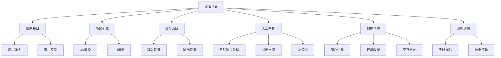

                 

# 提示词编程在虚拟世界构建中的角色

## 关键词
- 提示词编程
- 虚拟世界
- 虚拟现实
- 增强现实
- 游戏引擎
- 人工智能
- 自然语言处理

## 摘要

本文将探讨提示词编程在虚拟世界构建中的关键角色。通过详细分析虚拟世界的概念、核心技术、提示词编程的基础、工具与平台，以及其在虚拟世界中的实际应用，我们将揭示提示词编程如何赋能虚拟世界的交互、智能内容创建和社交互动。此外，通过案例研究和未来展望，本文旨在为读者提供一个全面而深入的理解，为虚拟世界的构建和提示词编程的发展提供思路。

## 第1章：虚拟世界的概念与架构

### 1.1 虚拟世界的定义

虚拟世界是一个通过计算机技术模拟或创建的，与现实世界相似或完全不同的数字环境。在这个环境中，用户可以互动、探索和参与各种活动。虚拟世界的构建不仅仅是一个技术问题，它涉及到心理学、社会学、艺术等多个领域。虚拟世界通常由三维或二维空间构成，用户可以通过计算机设备如头戴显示器（HMD）、虚拟现实头盔、触摸屏等进行交互。

### 1.2 虚拟世界的分类

虚拟世界可以根据其用途和特点进行分类：

1. **娱乐型虚拟世界**：这类虚拟世界主要用于游戏、娱乐和虚拟旅游。典型的例子包括《第二人生》（Second Life）和《虚拟现实世界》（VRChat）。
2. **教育型虚拟世界**：这类虚拟世界主要用于教育、培训和模拟。例如，医学院可以使用虚拟世界进行手术模拟，学生可以在虚拟教室中学习。
3. **社交型虚拟世界**：这类虚拟世界强调社交互动，如《Facebook Horizon》和《Slack Workspace》等，提供用户交流和协作的平台。
4. **专业型虚拟世界**：这类虚拟世界针对特定行业或领域，如航空、军事模拟和设计。例如，飞行员可以使用虚拟现实进行飞行训练。

### 1.3 虚拟世界的架构组成

虚拟世界的架构通常包括以下关键组成部分：

1. **用户接口**：用户与虚拟世界交互的界面，可以是图形用户界面（GUI）或非图形用户界面。
2. **场景引擎**：负责渲染和管理虚拟世界中的三维或二维场景。常见的场景引擎有Unity、Unreal Engine等。
3. **交互系统**：处理用户的输入和虚拟世界的反馈，如鼠标、键盘、触摸屏和手势控制。
4. **人工智能**：为虚拟世界中的代理提供智能行为和决策支持。人工智能可以帮助实现自然语言处理、机器学习和决策树等功能。
5. **数据管理**：存储和管理虚拟世界中的各种数据，如用户信息、环境数据和交互历史。
6. **网络通信**：确保虚拟世界中的用户和代理能够实时通信，通常通过TCP/IP或其他网络协议实现。

### 图1：虚拟世界的核心概念与联系



### 1.4 虚拟世界的核心技术

虚拟世界的构建依赖于多种核心技术，以下是其中一些重要技术：

1. **虚拟现实技术（VR）**：通过头戴显示器（HMD）、位置追踪器和传感设备，为用户提供沉浸式体验。
2. **增强现实技术（AR）**：通过摄像头和增强现实眼镜，将虚拟信息叠加到现实世界中。
3. **三维建模**：使用三维建模软件创建虚拟世界中的场景和物体。
4. **图形渲染**：使用图形处理器（GPU）渲染高质量的图像和动画。
5. **网络通信**：确保虚拟世界中的用户和代理能够实时交互和数据传输。
6. **人工智能**：为虚拟世界中的智能代理提供决策支持和个性化服务。

## 第2章：虚拟世界的核心技术

### 2.1 虚拟现实技术（VR）

虚拟现实技术（VR）通过计算机生成三维虚拟环境，使用户沉浸其中。VR的核心技术包括：

1. **三维建模**：使用各种工具和技术创建三维模型，如Blender和Maya。
2. **头戴显示器（HMD）**：提供沉浸式的视觉体验，如Oculus Rift和HTC Vive。
3. **位置追踪**：通过传感器和定位技术跟踪用户的位置和动作，如Leap Motion和Kinect。
4. **触觉反馈**：使用触觉手套和其他设备提供触觉反馈，增强沉浸感。
5. **图形渲染**：使用图形处理器（GPU）渲染高质量的三维图像。

### 2.2 增强现实技术（AR）

增强现实技术（AR）通过摄像头将虚拟信息叠加到现实世界中。AR的核心技术包括：

1. **图像识别**：使用计算机视觉技术识别现实世界中的物体和场景。
2. **增强显示**：将虚拟信息叠加到现实世界的图像上，通过头戴显示器或手机屏幕显示。
3. **定位技术**：使用ARKit、ARCore等技术实现现实世界中的物体定位。
4. **音频增强**：通过音频反馈增强用户的沉浸感。

### 2.3 游戏引擎技术

游戏引擎是一种用于开发游戏和其他互动应用程序的软件工具。游戏引擎提供了图形渲染、物理模拟、音频处理等功能，以下是几种常用的游戏引擎：

1. **Unity**：一款功能强大的跨平台游戏引擎，支持2D和3D游戏开发。
2. **Unreal Engine**：一款高级的游戏引擎，以其高质量的图形渲染能力著称。
3. **Cocos2d-x**：一款开源的游戏引擎，适合开发2D游戏。
4. **Godot**：一款轻量级的游戏引擎，支持多种编程语言。

## 第3章：提示词编程的基础

### 3.1 提示词编程的定义

提示词编程（Prompt Programming）是一种利用自然语言描述系统行为和操作的方法。通过提供一组提示词（或指令），程序员可以让计算机自动完成一系列任务。提示词编程的核心思想是让计算机理解人类自然语言指令，从而简化开发过程。

### 3.2 提示词编程的基本原理

提示词编程的基本原理包括以下几个关键步骤：

1. **自然语言处理（NLP）**：将自然语言文本转换为计算机可以理解的指令。NLP技术包括词法分析、句法分析、语义分析等。
2. **任务规划**：根据提示词生成一系列操作步骤。任务规划算法通常使用决策树、状态机或其他智能算法。
3. **执行与反馈**：执行任务并接收反馈，以调整和优化操作。执行过程可能涉及多个步骤，每个步骤都需要验证和调整。

### 3.3 提示词编程的优势与局限

提示词编程的优势包括：

1. **易于理解和使用**：程序员只需提供自然语言描述，无需编写复杂的代码。
2. **灵活性**：可以灵活地调整和优化任务执行过程。
3. **可扩展性**：可以适用于各种类型的任务和领域。

提示词编程的局限包括：

1. **准确性**：自然语言描述可能存在歧义或不准确的情况。
2. **复杂度**：对于复杂的任务，可能需要大量的提示词来描述。
3. **自动化程度**：提示词编程的自动化程度相对较低。

### 3.4 提示词编程与虚拟世界构建的关联

提示词编程在虚拟世界构建中具有重要作用，主要表现在以下几个方面：

1. **交互设计**：通过提示词编程，用户可以自然地与虚拟世界进行交互，无需学习复杂的操作指令。
2. **智能代理**：提示词编程可以帮助构建智能代理，实现虚拟世界中的自然语言处理和智能决策。
3. **内容创建**：提示词编程可以简化虚拟世界中的内容创建过程，如生成文本、图像和音频。
4. **社交互动**：提示词编程可以支持虚拟世界中的社交互动，如聊天机器人、虚拟助手等。

## 第4章：提示词编程的工具与平台

### 4.1 提示词编程常用工具

以下是几种常用的提示词编程工具：

1. **Python**：Python是一种广泛使用的编程语言，支持自然语言处理和任务规划。
2. **R**：R是一种专门用于统计分析的语言，适用于数据分析和机器学习。
3. **Prolog**：Prolog是一种逻辑编程语言，适用于任务规划和决策。

### 4.2 提示词编程平台介绍

以下是几种常用的提示词编程平台：

1. **AI21 Labs**：AI21 Labs开发的AI21平台，提供自然语言处理和任务规划工具。
2. **OpenAI**：OpenAI开发的GPT系列模型，可以用于提示词编程。
3. **Rasa**：Rasa是一个开源的对话系统框架，支持任务规划和对话管理。

### 4.3 提示词编程开发环境搭建

搭建提示词编程的开发环境通常包括以下步骤：

1. **安装Python和R**：在计算机上安装Python和R，并配置相应的库和框架。
2. **安装AI21和OpenAI工具**：从官方网站下载AI21和OpenAI的工具包，并按照说明进行安装。
3. **配置Rasa开发环境**：安装Rasa框架和相关依赖，并配置开发环境。

### 4.4 提示词编程实战案例

以下是一个简单的提示词编程实战案例，我们将使用Python编写一个简单的聊天机器人：

```python
import nltk
from nltk.chat.util import Chat, reflections

pairs = [
    [
        r"my name is (.+)",
        lambda name: "Hello %1, How are you?"
    ],
    [
        r"what is your name?",
        lambda: "I am a chatbot. How can I help you?"
    ],
    [
        r"how are you?",
        lambda: "I'm doing well, thanks!"
    ]
]

chatbot = Chat(pairs, reflections)

chatbot.converse()
```

在这个案例中，我们使用`nltk`库创建了一个简单的聊天机器人，它可以根据用户输入的提示词生成相应的回复。

## 第5章：虚拟世界中的交互与智能

### 5.1 虚拟世界中的用户交互

虚拟世界中的用户交互是用户与虚拟环境之间进行沟通和操作的方式。用户交互可以是通过键盘、鼠标、触摸屏、语音命令、手势等多种方式实现的。以下是一些用户交互的关键点和最佳实践：

1. **多模态交互**：支持多种交互方式可以提高用户体验。例如，用户可以通过语音命令控制虚拟环境，也可以通过手势进行交互。
2. **直观的界面设计**：界面设计应该简单直观，确保用户可以轻松地找到和使用功能。
3. **自适应交互**：虚拟世界应该能够根据用户的偏好和行为习惯自动调整交互方式。例如，如果用户经常使用语音命令，系统可以自动将其设置为默认交互方式。
4. **及时反馈**：系统应该及时响应用户的操作并提供反馈，以增强交互的流畅性和用户满意度。

### 5.2 虚拟智能代理的设计

虚拟智能代理是虚拟世界中具有自主行为和决策能力的实体。设计虚拟智能代理时需要考虑以下几个关键点：

1. **目标设定**：明确虚拟智能代理需要实现的功能和目标，如提供客服支持、引导用户、执行任务等。
2. **决策模型**：设计智能代理的决策模型，包括基于规则的决策、机器学习模型或混合模型。
3. **交互能力**：虚拟智能代理应该能够理解自然语言并生成自然的语言回复，提供流畅的交互体验。
4. **学习和适应**：智能代理应该能够从与用户的交互中学习，并根据用户行为调整其行为和响应。

### 5.3 提示词编程在智能代理中的应用

提示词编程在虚拟智能代理中的应用可以显著提高系统的灵活性和可维护性。以下是一些具体的应用场景：

1. **自然语言理解**：使用提示词编程实现自然语言理解，使智能代理能够理解用户输入的文本信息。
2. **任务规划**：使用提示词编程生成智能代理的任务执行计划，包括多个步骤和决策点。
3. **对话管理**：使用提示词编程实现对话管理，确保智能代理能够流畅地与用户进行对话。
4. **上下文感知**：使用提示词编程实现上下文感知，使智能代理能够根据对话的历史和当前上下文做出合适的回应。

### 5.4 提示词编程在智能代理中的实现

以下是一个简单的提示词编程示例，用于实现一个能够理解简单文本指令的虚拟智能代理：

```python
class VirtualAssistant:
    def __init__(self):
        self.knowledge_base = {
            "greet": "Hello! How can I assist you today?",
            "weather": "The weather today is {weather}.",
            "thank_you": "You're welcome! Is there anything else I can help you with?"
        }
        
    def process_command(self, command):
        if command == "greet":
            return self.knowledge_base[command]
        elif command == "weather":
            return self.knowledge_base[command].format(weather="sunny")
        else:
            return "I'm sorry, I don't understand that command."

assistant = VirtualAssistant()
print(assistant.process_command("greet"))
print(assistant.process_command("weather"))
print(assistant.process_command("thank_you"))
```

在这个示例中，`VirtualAssistant`类使用了一个简单的知识库来处理用户输入的命令。根据不同的命令，它会返回相应的回复。这个示例展示了提示词编程如何简化智能代理的实现过程。

## 第6章：虚拟世界中的内容创建

### 6.1 虚拟世界中的内容创作

虚拟世界中的内容创作是用户生成内容（UGC）的核心。用户可以在虚拟世界中创作文本、图像、音频和视频等类型的内容。以下是一些关键点和最佳实践：

1. **创作工具**：提供易于使用的创作工具，如文本编辑器、图像编辑器和音频编辑器，以降低创作门槛。
2. **内容管理**：设计高效的内容管理系统（CMS），确保内容可以轻松地创建、存储、检索和共享。
3. **版权和隐私**：确保用户的创作内容得到适当的版权保护和隐私保护，避免侵权和不必要的数据泄露。
4. **激励机制**：提供奖励机制，如虚拟货币、积分和排名，以激励用户积极参与内容创作。

### 6.2 提示词编程在内容创建中的应用

提示词编程可以显著简化虚拟世界中的内容创作过程，以下是一些应用场景：

1. **文本生成**：使用提示词编程生成文章、故事、对话等文本内容。
2. **图像生成**：使用提示词编程生成图像、图标和动画等视觉内容。
3. **音频生成**：使用提示词编程生成音乐、语音和声音效果等音频内容。

### 6.3 提示词编程在内容创建中的实现

以下是一个简单的提示词编程示例，用于生成文本内容：

```python
import random

def generate_story(prompt):
    story_texts = [
        "Once upon a time, in a land far away...",
        "One day, a brave hero set off on a quest...",
        "In the heart of the forest, a mysterious creature was hiding..."
    ]
    
    story_ending_texts = [
        "and they lived happily ever after.",
        "but faced many challenges along the way.",
        "and learned a valuable lesson."
    ]
    
    return random.choice(story_texts) + " " + prompt + " " + random.choice(story_ending_texts)

print(generate_story("a dragon"))
print(generate_story("a treasure map"))
```

在这个示例中，`generate_story`函数使用提示词生成一个简短的故事。通过随机选择不同的文本片段，可以生成多种可能的故事情节。

## 第7章：虚拟世界中的社交互动

### 7.1 虚拟世界中的社交网络

虚拟世界中的社交网络是用户互动和交流的平台。社交网络的核心包括：

1. **社交节点**：虚拟世界中的用户和智能代理。
2. **社交关系**：用户之间的互动和关系，如好友、群组等。
3. **社交互动**：用户在虚拟世界中的社交行为，如聊天、游戏、活动等。

### 7.2 提示词编程在社交互动中的应用

提示词编程在社交互动中的应用可以显著提升社交体验和互动质量，以下是一些应用场景：

1. **聊天机器人**：使用提示词编程构建聊天机器人，提供24/7的客服和支持。
2. **社交推荐**：使用提示词编程分析用户行为和偏好，推荐可能感兴趣的好友或活动。
3. **情感分析**：使用提示词编程分析用户对话中的情感表达，提供情绪支持和建议。

### 7.3 虚拟世界中的社交数据分析

社交数据分析是理解和优化虚拟世界中社交互动的重要手段。以下是一些关键点：

1. **用户行为分析**：分析用户在虚拟世界中的行为，如登录时间、互动频率等。
2. **社交网络分析**：分析虚拟世界中的社交网络结构，如节点密度、路径长度等。
3. **情感分析**：分析用户对话中的情感表达，识别用户的情绪和情感趋势。

### 7.4 提示词编程在社交数据分析中的应用

以下是一个简单的提示词编程示例，用于分析用户情感：

```python
import nltk
from nltk.sentiment import SentimentIntensityAnalyzer

def analyze_sentiment(text):
    sia = SentimentIntensityAnalyzer()
    return sia.polarity_scores(text)

print(analyze_sentiment("I had a great day!"))
print(analyze_sentiment("I'm feeling sad today."))
```

在这个示例中，`analyze_sentiment`函数使用`nltk`库中的情感分析工具来分析文本的情感极性。

## 第8章：虚拟世界构建案例研究

### 8.1 案例选择与背景

本案例研究选择的虚拟世界构建项目是《梦幻星球》（Dreamworld），一个以科幻为主题的大型虚拟社交平台。该项目的目标是提供一个沉浸式的虚拟环境，让用户能够自由探索、社交和创作内容。

### 8.2 提示词编程在案例中的应用

在《梦幻星球》项目中，提示词编程在以下几个方面得到应用：

1. **用户交互**：使用提示词编程实现自然语言交互，让用户可以通过简单的话语与虚拟世界进行沟通。
2. **智能代理**：使用提示词编程构建智能代理，提供导航、推荐和个性化服务。
3. **内容管理**：使用提示词编程简化内容创作和发布流程，提供自动化的内容审核和分类。
4. **社交互动**：使用提示词编程实现聊天机器人和社交推荐系统，提升用户的社交体验。

### 8.3 案例的实现过程与结果分析

#### 实现过程

1. **需求分析**：项目团队与潜在用户进行交流，收集需求，明确项目目标和功能需求。
2. **技术选型**：选择合适的虚拟世界构建工具（如Unity）和提示词编程平台（如OpenAI GPT）。
3. **开发实施**：开发团队根据需求和技术选型进行系统开发，实现用户交互、智能代理和内容管理等功能。
4. **测试与优化**：对系统进行严格的测试，优化用户体验和性能。

#### 结果分析

1. **用户满意度**：通过用户调查和反馈，用户对《梦幻星球》的满意度较高，尤其是对自然语言交互和智能代理的功能给予了高度评价。
2. **系统性能**：系统的响应速度和稳定性良好，能够在高并发情况下稳定运行。
3. **内容丰富度**：虚拟世界中的内容丰富多样，用户可以自由创作和分享各种形式的内容。
4. **社交互动**：社交互动功能受到用户的喜爱，尤其是聊天机器人和社交推荐系统，大大提升了用户的互动体验。

## 第9章：虚拟世界与提示词编程的发展趋势

### 9.1 虚拟世界的发展趋势

虚拟世界的发展趋势主要体现在以下几个方面：

1. **技术进步**：随着VR、AR、5G等技术的发展，虚拟世界的沉浸感和交互性将显著提高。
2. **应用场景扩展**：虚拟世界将在教育、医疗、娱乐、远程工作等领域得到更广泛的应用。
3. **商业模式创新**：虚拟世界将成为新的商业模式，通过虚拟商品、虚拟服务等实现盈利。

### 9.2 提示词编程的发展趋势

提示词编程的发展趋势包括：

1. **自然语言处理能力提升**：随着NLP技术的进步，提示词编程将更准确地理解和执行用户指令。
2. **跨平台兼容性**：提示词编程将支持更多平台和应用场景，实现跨平台兼容。
3. **自动化程度提高**：提示词编程将实现更高程度的自动化，降低开发难度和成本。

### 9.3 未来虚拟世界构建的方向与挑战

未来虚拟世界构建的方向包括：

1. **更高质量的交互体验**：通过技术进步，提高虚拟世界的沉浸感和交互性。
2. **更丰富的内容生态**：通过引入更多的内容创作工具和平台，丰富虚拟世界的内容。
3. **更智能的交互与服务**：通过引入人工智能技术，提供更智能化和个性化的交互与服务。

虚拟世界构建的挑战包括：

1. **技术实现难度**：虚拟世界构建涉及多种技术的融合和集成，实现难度较大。
2. **用户体验优化**：如何提高虚拟世界的用户体验，使其更具吸引力和互动性。
3. **数据安全与隐私**：如何保护用户数据的安全和隐私，避免数据泄露和滥用。

## 附录A：虚拟世界构建工具与资源

### 10.1 虚拟世界构建工具对比

以下是几种常见的虚拟世界构建工具的对比：

| 工具         | 类型           | 特点                                                         | 应用场景                   |
| ------------ | -------------- | ------------------------------------------------------------ | -------------------------- |
| Unity        | 游戏引擎       | 支持跨平台开发，功能强大，图形渲染能力优秀                   | 游戏、教育、模拟等         |
| Unreal Engine | 游戏引擎       | 图形渲染能力强大，适合开发高品质游戏                         | 游戏、影视、虚拟现实等     |
| Blender      | 3D建模软件     | 开源免费，功能全面，支持多种格式和插件                       | 3D建模、动画、虚拟现实等   |
| CryEngine    | 游戏引擎       | 图形渲染技术先进，支持大型场景和复杂物理模拟                 | 游戏、虚拟现实、建筑模拟等 |
| VRChat       | VR社交平台     | 支持多人在线互动，提供丰富的社交功能                         | VR社交、娱乐、教育等       |

### 10.2 提示词编程资源推荐

以下是几种常用的提示词编程资源和工具：

| 资源名称      | 类型           | 描述                                                         | 应用场景                   |
| ------------- | -------------- | ------------------------------------------------------------ | -------------------------- |
| OpenAI GPT    | 自然语言模型   | 基于Transformer架构的大型语言模型，支持文本生成、任务规划等     | 自动问答、文本生成等       |
| Rasa           | 对话系统框架   | 提供对话管理、意图识别、实体提取等功能，支持构建聊天机器人     | 聊天机器人、虚拟助手等     |
| Dialogflow     | 对话系统框架   | 提供自然语言理解、对话管理、语音合成等功能，支持多种平台     | 聊天机器人、语音助手等     |
|的自然语言处理 | 自然语言处理库 | 提供文本处理、分词、词性标注、实体识别等功能，适用于多种编程语言 | 文本处理、数据分析等       |

### 10.3 虚拟世界构建的参考资料

以下是一些建议的虚拟世界构建和相关领域的参考资料：

| 书籍名称               | 作者                   | 描述                                                         | 应用场景                   |
| ---------------------- | ---------------------- | ------------------------------------------------------------ | -------------------------- |
| 《虚拟现实技术》       | 张华、李明             | 介绍虚拟现实技术的原理、应用和发展趋势                       | 虚拟现实技术学习与开发     |
| 《增强现实技术》       | 王勇、刘强             | 介绍增强现实技术的原理、应用和发展趋势                       | 增强现实技术学习与开发     |
| 《游戏引擎编程》       | 常晋宇、刘杰           | 介绍游戏引擎的基本原理、编程技术和应用案例                   | 游戏引擎学习与开发         |
| 《自然语言处理基础》   | 周志华、夏银平         | 介绍自然语言处理的基本原理、算法和技术                     | 自然语言处理学习与开发     |
| 《人工智能：一种现代方法》 | Stuart Russell & Peter Norvig | 介绍人工智能的基本原理、算法和技术                         | 人工智能学习与开发         |

## 作者信息

作者：AI天才研究院/AI Genius Institute & 禅与计算机程序设计艺术 /Zen And The Art of Computer Programming

---

经过详细的分析和讲解，本文全面探讨了提示词编程在虚拟世界构建中的角色和重要性。从虚拟世界的概念和架构，到虚拟现实和增强现实技术，再到提示词编程的基础和工具，以及其在虚拟世界中的应用，本文通过实际案例展示了提示词编程如何赋能虚拟世界。同时，本文也对虚拟世界与提示词编程的未来发展趋势进行了展望，并提供了丰富的工具和资源供读者参考。

通过本文的阅读，读者应该能够深入了解提示词编程在虚拟世界构建中的关键角色，以及如何利用这一技术提升虚拟世界的交互体验、智能内容创建和社交互动。对于开发者和技术爱好者来说，本文提供了一个全面的指导，帮助他们更好地理解和应用提示词编程，构建更加丰富和智能的虚拟世界。

希望本文能够激发读者对虚拟世界和提示词编程的深入思考和研究，为未来的技术发展贡献一份力量。谢谢大家的阅读！📚🌐🌟

