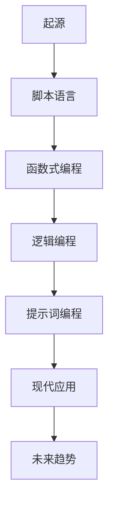
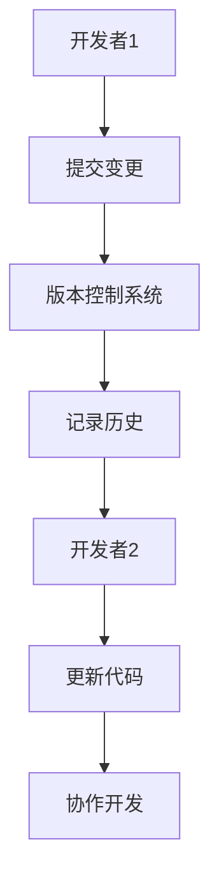
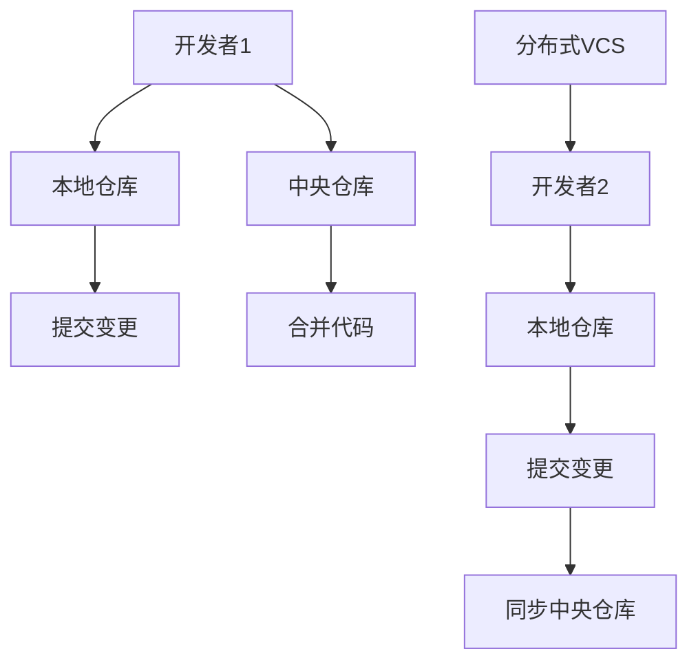
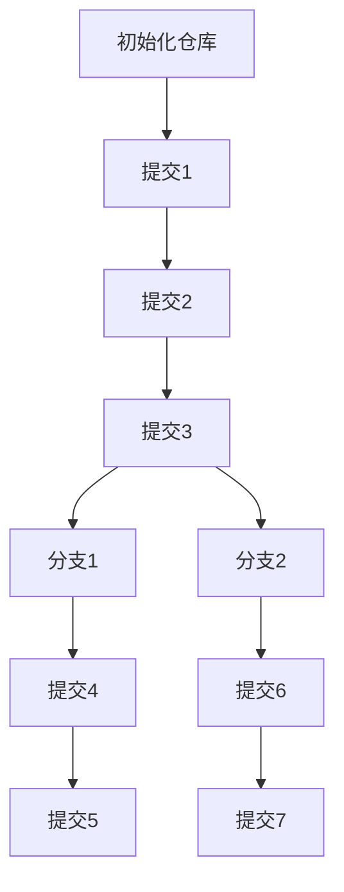
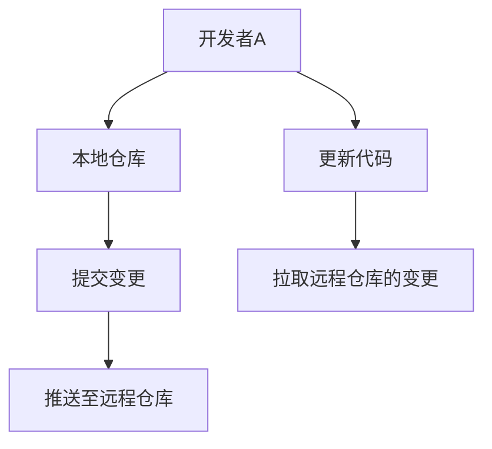
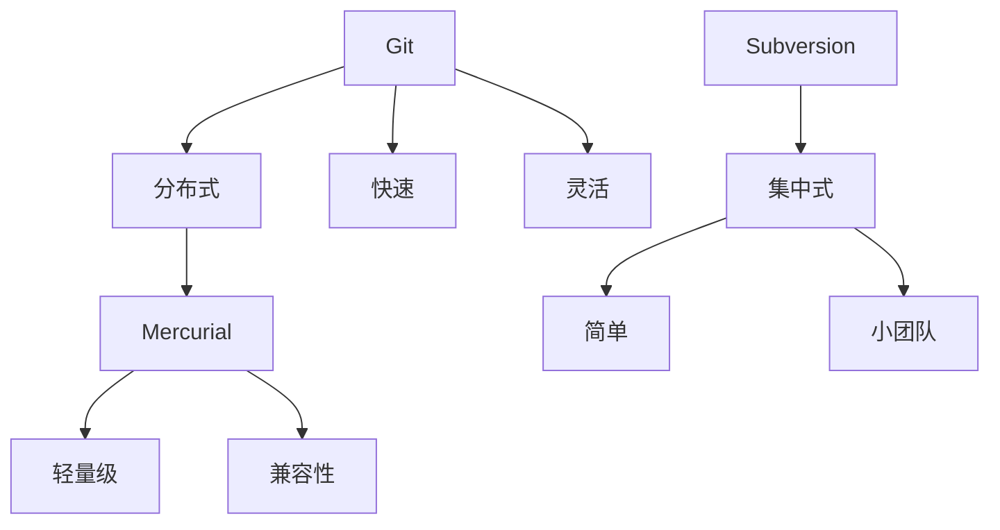

                 

### 《提示词编程语言的版本控制与管理》

#### 关键词：

- 提示词编程语言
- 版本控制
- Git
- 分支管理
- 标签管理
- 持续集成
- 项目管理

#### 摘要：

本文深入探讨了提示词编程语言的版本控制与管理。首先，我们介绍了提示词编程语言的定义和特点，随后详细阐述了版本控制的必要性以及常见版本控制系统的工作原理和功能对比。接着，我们探讨了版本控制系统基本原理，包括基本概念、版本库、提交与更新、分支管理和标签管理。随后，我们介绍了常见版本控制工具，特别是Git的安装与配置、命令使用以及其他版本控制工具的功能与特点对比。在实战部分，我们通过实际项目案例展示了如何使用Git进行提示词编程语言的版本控制。最后，我们讨论了版本控制的最佳实践、风险与挑战、团队协作、高级功能、持续集成、项目管理以及版本控制技术的发展趋势和应用领域。文章旨在为开发者提供全面的技术指导和实践经验。作者：AI天才研究院/AI Genius Institute & 禅与计算机程序设计艺术 /Zen And The Art of Computer Programming。

### 第一部分：引言

在信息技术飞速发展的今天，编程语言作为软件开发的核心工具，已经成为现代社会的关键技术之一。而提示词编程语言作为一种新兴的编程范式，正逐渐受到越来越多开发者的关注。提示词编程语言以其强大的表达能力、简洁的语法和高度的可读性，为软件开发带来了新的可能性和挑战。

#### 第1章：版本控制概述

**1.1 提示词编程语言的定义与特点**

提示词编程语言（Prompt-Based Programming Language），也称为指令编程语言（Instruction-Based Programming Language），是一种以提示词（prompt）为核心概念编程语言。提示词是一种抽象的编程概念，它表示一个或多个指令或动作的序列，用于指示计算机执行特定任务。

**定义：** 提示词编程语言是一种编程语言，它允许开发者通过定义一系列的提示词来描述程序的执行流程，而不是直接编写具体的代码。

**特点：**

1. **抽象性**：提示词编程语言提供了一种高度抽象的编程方式，使得开发者可以更关注程序逻辑，而不是具体的实现细节。
2. **模块化**：提示词可以独立定义和复用，有助于提高代码的可维护性和可扩展性。
3. **简洁性**：提示词编程语言的语法通常较为简洁，易于理解和阅读，有助于提高开发效率。
4. **可解释性**：提示词编程语言生成的代码通常具有较好的可解释性，使得代码审查和调试变得更加容易。

**Mermaid流程图：** 提示词编程语言的发展历程及其主要特点



**1.2 版本控制的必要性**

版本控制是一种用于管理代码变更的技术，它允许开发者跟踪代码的历史记录，以便在需要时进行恢复、比较和分析。对于提示词编程语言来说，版本控制尤为重要，原因如下：

1. **代码的可追踪性**：版本控制系统能够记录代码的每一次变更，包括提交的描述、作者和时间等信息，使得开发者可以清晰地了解代码的演变过程。
2. **代码的协作性**：多个开发者可以在同一代码库上进行工作，版本控制系统能够有效地协调他们的工作，避免冲突和错误。
3. **代码的可维护性**：通过版本控制，开发者可以方便地回滚到之前的版本，修复问题或恢复意外删除的代码。
4. **代码的安全性**：版本控制系统提供了备份和恢复机制，确保代码的安全性和完整性。

**Mermaid流程图：** 版本控制的基本原理及重要性



**1.3 常见的版本控制系统**

版本控制系统是用于管理代码变更的工具，根据其工作原理和功能，可以分为以下几类：

1. **集中式版本控制系统（CVS）**：
   - **特点**：有一个中央仓库，所有开发者的代码都提交到中央仓库。
   - **代表工具**：CVS、SVN。
   - **缺点**：中央仓库成为单点故障，当中央仓库损坏或不可用时，整个团队的工作会受到影响。

2. **分布式版本控制系统（DVCS）**：
   - **特点**：每个开发者都有自己的本地仓库，可以进行独立的提交和分支管理。
   - **代表工具**：Git、Mercurial。
   - **优点**：去中心化，提高了系统的容错性和协同工作的效率。

3. **分布式版本控制管理（DVCS）**：
   - **特点**：结合了集中式和分布式版本控制系统的优势。
   - **代表工具**：Fossil、Bazaar。
   - **优点**：具有分布式版本控制系统的灵活性和集中式版本控制的协作性。

**Mermaid流程图：** 版本控制系统的工作原理和功能对比



通过本章的介绍，我们了解了提示词编程语言的定义和特点，认识到版本控制对于软件开发的重要性，并了解了常见版本控制系统的原理和功能。接下来的章节将深入探讨版本控制系统的基本原理、常见工具的使用以及如何在实际项目中应用版本控制。

#### 第2章：版本控制系统基本原理

版本控制系统（Version Control System，VCS）是一种用于管理代码和文档变更的工具，它允许开发者跟踪代码的历史记录，管理多个版本的代码，并在需要时进行回滚、比较和分析。在本章中，我们将详细介绍版本控制系统的基本原理，包括基本概念、版本库、提交与更新、分支管理和标签管理。

##### 2.1 基本概念

了解版本控制系统的基本概念是掌握版本控制的第一步。以下是版本控制系统中一些关键术语的定义：

1. **提交（Commit）**：
   - **定义**：提交是将更改保存到版本库的过程，每个提交都包含更改的内容、作者信息、提交描述和时间戳等。
   - **示例**：`git commit -m "Update README.md"`。

2. **版本库（Repository）**：
   - **定义**：版本库是存储代码和文档的仓库，通常包含提交历史、分支、标签等。
   - **示例**：`git init`用于初始化一个新的本地版本库。

3. **分支（Branch）**：
   - **定义**：分支是版本库中的一个独立部分，用于开发新功能或修复bug，而不影响主分支。
   - **示例**：`git checkout -b feature/new-feature`用于创建一个新分支。

4. **标签（Tag）**：
   - **定义**：标签用于标记特定的版本，如发布版本、里程碑版本等。
   - **示例**：`git tag v1.0`用于给当前提交打上标签。

5. **合并（Merge）**：
   - **定义**：合并是将两个或多个分支的更改合并到一个分支上的过程。
   - **示例**：`git merge feature/new-feature`用于将新分支的更改合并到主分支。

6. **拉取（Pull）**：
   - **定义**：拉取是从远程版本库获取最新更改并更新本地版本库的过程。
   - **示例**：`git pull origin master`用于从远程仓库拉取主分支的最新更改。

7. **推送（Push）**：
   - **定义**：推送是将本地版本库的更改提交到远程版本库的过程。
   - **示例**：`git push origin master`用于将本地主分支的最新更改提交到远程仓库。

**伪代码：** 版本控制系统的基础概念与术语

```python
class Commit:
    def __init__(self, author, message, timestamp):
        self.author = author
        self.message = message
        self.timestamp = timestamp

class Repository:
    def __init__(self):
        self.commits = []

    def commit(self, author, message):
        new_commit = Commit(author, message, timestamp())
        self.commits.append(new_commit)

    def get_latest_commit(self):
        return self.commits[-1]

class Branch:
    def __init__(self, name, repository):
        self.name = name
        self.repository = repository
        self.commits = []

    def create_commit(self, author, message):
        new_commit = self.repository.commit(author, message)
        self.commits.append(new_commit)

    def merge(self, other_branch):
        for commit in other_branch.commits:
            self.repository.commit(commit.author, commit.message)

class Tag:
    def __init__(self, name, commit):
        self.name = name
        self.commit = commit

def pull(repository, remote_repo):
    remote_commits = remote_repo.get_latest_commits()
    for commit in remote_commits:
        repository.commit(commit.author, commit.message)

def push(repository, remote_repo):
    local_commits = repository.get_latest_commits()
    for commit in local_commits:
        remote_repo.commit(commit.author, commit.message)
```

##### 2.2 版本库

版本库是版本控制系统的核心组成部分，它存储了所有的代码和文档以及相关的版本信息。以下是版本库的结构与组织方式：

1. **仓库目录**：
   - `.git`：包含版本控制系统的元数据，如提交历史、分支、标签等。
   - `README.md`：项目的说明文档。
   - `main.py`：项目的源代码文件。

2. **仓库配置**：
   - `gitignore`：指定不被版本控制系统管理的文件和目录。
   - `LICENSE`：项目的许可协议。

3. **版本库结构**：
   版本库通常采用图状结构来表示提交历史，其中每个节点表示一个提交，节点之间的边表示提交的依赖关系。例如，Git 使用 Directed Acyclic Graph（DAG）来表示版本库的结构。

**Mermaid流程图：** 版本库的结构与组织方式



在这个流程图中，我们初始化了一个仓库，并提交了一系列的更改，然后创建了两个分支并进行了一些提交。每个提交都代表了一个新的版本，它们之间通过分支和合并操作形成了复杂的依赖关系。

##### 2.3 提交与更新

提交和更新是版本控制中最基本也是最重要的操作。以下是这些操作的基本步骤和伪代码：

###### 2.3.1 提交操作

提交操作用于将工作区的更改记录到版本库中。以下是提交操作的基本步骤：

1. **选择要提交的文件**：
   ```bash
   git add <file>
   ```

2. **记录更改**：
   ```bash
   git commit -m "Commit message"
   ```

**伪代码：**

```python
def commit_changes(file, message):
    execute_command("git add " + file)
    execute_command("git commit -m \"" + message + "\"")
```

###### 2.3.2 更新操作

更新操作用于从版本库中获取最新的更改并将其应用到工作区中。以下是更新操作的基本步骤：

1. **拉取最新更改**：
   ```bash
   git pull
   ```

2. **合并更改**：
   ```bash
   git merge <branch>
   ```

**伪代码：**

```python
def update_workspace():
    execute_command("git pull")
    execute_command("git merge <branch>")
```

###### 2.3.3 提交与更新的对比

提交和更新是版本控制中的核心操作，但它们的作用和执行方式有所不同：

| 操作       | 提交（commit）                | 更新（pull）                |
|------------|-----------------------------|-----------------------------|
| 目的       | 将更改保存到版本库中          | 将版本库的最新更改应用到工作区 |
| 执行顺序   | 通常先提交，再推送            | 通常先拉取，再合并            |
| 适用场景   | 更新代码前，确保工作区稳定     | 更新代码后，确保工作区同步     |

##### 2.4 分支管理

分支管理是版本控制系统中的一项重要功能，它允许开发者在不同的环境中独立开发代码，而不会影响到主分支或其他分支。以下是分支管理的基本操作：

###### 2.4.1 分支创建

创建分支用于开发新功能或修复bug，以下是创建分支的基本步骤：

1. **创建新分支**：
   ```bash
   git checkout -b <branch-name>
   ```

**伪代码：**

```python
def create_branch(branch_name):
    execute_command("git checkout -b " + branch_name)
```

###### 2.4.2 分支合并

合并分支是将一个分支的更改合并到另一个分支上的过程，以下是合并的基本步骤：

1. **切换到主分支**：
   ```bash
   git checkout <main-branch>
   ```

2. **合并分支**：
   ```bash
   git merge <feature-branch>
   ```

**伪代码：**

```python
def merge_branch(main_branch, feature_branch):
    execute_command("git checkout " + main_branch)
    execute_command("git merge " + feature_branch)
```

###### 2.4.3 分支删除

删除分支用于清理不必要的分支，以下是删除分支的基本步骤：

1. **确认分支**：
   ```bash
   git branch -d <branch-name>
   ```

**伪代码：**

```python
def delete_branch(branch_name):
    execute_command("git branch -d " + branch_name)
```

##### 2.5 标签管理

标签管理用于标记特定的版本，如发布版本、里程碑版本等。以下是标签管理的基本操作：

###### 2.5.1 标签添加

添加标签用于标记特定的提交，以下是添加标签的基本步骤：

1. **添加标签**：
   ```bash
   git tag <tag-name> <commit-hash>
   ```

**伪代码：**

```python
def add_tag(tag_name, commit_hash):
    execute_command("git tag " + tag_name + " " + commit_hash)
```

###### 2.5.2 标签删除

删除标签用于清理不必要的标签，以下是删除标签的基本步骤：

1. **删除标签**：
   ```bash
   git tag -d <tag-name>
   ```

**伪代码：**

```python
def delete_tag(tag_name):
    execute_command("git tag -d " + tag_name)
```

###### 2.5.3 标签查看

查看标签用于了解已有的标签信息，以下是查看标签的基本步骤：

1. **查看标签**：
   ```bash
   git show <tag-name>
   ```

**伪代码：**

```python
def show_tag(tag_name):
    execute_command("git show " + tag_name)
```

通过本章的介绍，我们了解了版本控制系统的基本原理和基本概念，包括版本库、提交与更新、分支管理和标签管理。这些基本原理为我们在实际项目中应用版本控制提供了理论基础。在接下来的章节中，我们将进一步介绍常见版本控制工具，特别是Git的使用，以及如何在实际项目中应用版本控制。

#### 第3章：常见版本控制工具

版本控制是软件开发过程中不可或缺的一部分，它帮助开发者管理代码的变更、协作和发布。在众多版本控制工具中，Git是最为流行和广泛使用的工具之一。在本章中，我们将介绍Git的基本概念、安装与配置、命令使用以及其他版本控制工具的功能与特点对比。

##### 3.1 Git简介

Git是一种分布式版本控制系统（DVCS），由Linus Torvalds创建，用于Linux内核的开发。Git因其快速、灵活和强大的特性，被广泛应用于各种开发项目和团队协作中。

**定义**：Git是一个开源的分布式版本控制系统，它允许开发者对代码进行版本控制，并支持高效的分支管理和合并操作。

**特点**：

- **分布式**：每个开发者都有自己的本地仓库，可以实现独立提交和分支管理。
- **快速**：Git使用了高效的算法和数据结构，使得提交、更新和合并操作非常快速。
- **灵活**：Git支持多种分支策略和协作模式，适应不同团队的工作流程。
- **安全**：Git使用了强大的加密算法来保护代码的安全性和完整性。

**Mermaid流程图：** Git的基本概念与工作流程



##### 3.2 Git安装与配置

安装Git是使用Git的第一步。以下是在不同操作系统上安装Git的步骤：

**在Linux和macOS上安装Git：**

1. 打开终端，输入以下命令：
   ```bash
   sudo apt-get install git
   # 或者
   brew install git
   ```

2. 安装完成后，验证Git版本：
   ```bash
   git --version
   ```

**在Windows上安装Git：**

1. 访问Git官方下载页面（[https://git-scm.com/download](https://git-scm.com/download)）。
2. 下载适用于Windows的Git安装程序。
3. 运行安装程序，按照提示完成安装。
4. 安装完成后，打开Git Bash，验证Git版本。

**配置Git**：

1. 设置用户名和电子邮件：
   ```bash
   git config --global user.name "Your Name"
   git config --global user.email "you@example.com"
   ```

2. 配置默认编辑器：
   ```bash
   git config --global core.editor "vim"
   ```

3. （可选）配置忽略文件：
   ```bash
   echo "*.log" >> .gitignore
   ```

**伪代码：** Git安装与配置的基本步骤

```python
def install_git():
    if platform == "Linux" or platform == "macOS":
        execute_command("sudo apt-get install git")
    elif platform == "Windows":
        download_and_run_git_installer()
    verify_git_version()

def configure_git():
    set_user_name("Your Name")
    set_user_email("you@example.com")
    set_default_editor("vim")
    add_to_gitignore(".log")
```

##### 3.3 Git命令使用

Git提供了丰富的命令，用于版本控制的各种操作。以下是Git的一些常用命令及其使用方法：

1. **初始化仓库**：
   ```bash
   git init
   ```

2. **添加文件**：
   ```bash
   git add <file>
   ```

3. **提交更改**：
   ```bash
   git commit -m "Commit message"
   ```

4. **查看提交历史**：
   ```bash
   git log
   ```

5. **创建分支**：
   ```bash
   git checkout -b <branch-name>
   ```

6. **切换分支**：
   ```bash
   git checkout <branch-name>
   ```

7. **合并分支**：
   ```bash
   git merge <branch-name>
   ```

8. **删除分支**：
   ```bash
   git branch -d <branch-name>
   ```

9. **推送分支**：
   ```bash
   git push <remote> <branch-name>
   ```

10. **拉取分支**：
    ```bash
    git pull <remote> <branch-name>
    ```

**伪代码：** Git常用命令及其使用方法

```python
def init_repo():
    execute_command("git init")

def add_file(file):
    execute_command("git add " + file)

def commit_changes(message):
    execute_command("git commit -m \"" + message + "\"")

def view_commit_history():
    execute_command("git log")

def create_branch(branch_name):
    execute_command("git checkout -b " + branch_name)

def switch_branch(branch_name):
    execute_command("git checkout " + branch_name)

def merge_branch(branch_name):
    execute_command("git merge " + branch_name)

def delete_branch(branch_name):
    execute_command("git branch -d " + branch_name)

def push_to_remote(remote, branch_name):
    execute_command("git push " + remote + " " + branch_name)

def pull_from_remote(remote, branch_name):
    execute_command("git pull " + remote + " " + branch_name)
```

##### 3.4 其他版本控制工具

除了Git，还有其他一些流行的版本控制工具，如Mercurial（Hg）、Subversion（SVN）等。以下是这些工具的功能与特点对比：

1. **Mercurial（Hg）**：
   - **特点**：Mercurial是一种分布式版本控制系统，类似于Git。
   - **优点**：轻量级、易于使用、兼容性强。
   - **缺点**：在某些方面不如Git成熟和广泛支持。

2. **Subversion（SVN）**：
   - **特点**：Subversion是一种集中式版本控制系统。
   - **优点**：简单、易用、适用于小团队。
   - **缺点**：不如分布式版本控制系统灵活和高效。

**Mermaid流程图：** 其他版本控制工具的功能与特点对比



##### 3.5 选择合适的版本控制工具

选择合适的版本控制工具取决于项目需求和团队的工作方式。以下是几个考虑因素：

1. **团队规模**：对于小团队，集中式版本控制系统如SVN可能足够；对于大型团队，分布式版本控制系统如Git更合适。
2. **开发模式**：敏捷开发、并行开发等模式可能需要更灵活的版本控制工具。
3. **学习曲线**：Git的学习曲线相对较陡，但功能强大；Hg相对简单，但功能有限。
4. **生态系统**：Git拥有丰富的生态系统和社区支持，提供了大量的扩展工具和插件。

通过本章的介绍，我们了解了Git的基本概念、安装与配置、命令使用以及其他版本控制工具的功能与特点。这些知识为我们在实际项目中选择和使用版本控制工具提供了基础。在下一章中，我们将通过实际项目案例展示如何使用Git进行版本控制。

#### 第4章：版本控制实战

通过前面的章节，我们了解了版本控制的基本原理和常见工具的使用。在实际开发过程中，如何有效地使用版本控制工具来管理项目代码，是每个开发者都需要掌握的技能。本章将通过两个实际项目案例，详细展示如何使用Git进行版本控制，并解释每个步骤的具体操作。

##### 4.1 项目实战一：版本控制一个简单的提示词编程项目

**4.1.1 实战目标**

本节的目标是通过一个简单的提示词编程项目，演示如何使用Git进行版本控制。具体目标包括：

- 创建一个简单的提示词编程项目。
- 将项目文件添加到Git仓库。
- 提交项目的更改。
- 查看版本库的历史记录。
- 分支管理：创建、合并和删除分支。

**4.1.2 环境准备**

在开始实战之前，确保你的计算机上已经安装了Git。可以通过以下命令检查Git版本：

```bash
git --version
```

如果未安装Git，请访问Git官方下载页面（[https://git-scm.com/downloads](https://git-scm.com/downloads)）下载并安装。

**4.1.3 创建提示词编程项目**

1. **创建项目文件夹**：

   ```bash
   mkdir prompt-programming-project
   cd prompt-programming-project
   ```

2. **初始化Git仓库**：

   ```bash
   git init
   ```

   初始化Git仓库后，当前目录下将生成一个`.git`文件夹，用于存储版本控制信息。

3. **添加项目文件**：

   创建一个名为`main.py`的Python文件，并添加以下代码：

   ```python
   # main.py
   def greet(name):
       return f"Hello, {name}"

   print(greet("Alice"))
   ```

   将`main.py`文件添加到Git仓库：

   ```bash
   git add main.py
   ```

**4.1.4 提交更改**

1. **提交当前更改**：

   ```bash
   git commit -m "Initial commit"
   ```

   提交描述`"Initial commit"`将记录在版本库中。

2. **查看提交历史**：

   ```bash
   git log
   ```

   查看提交历史记录，可以看到最新提交的ID、提交描述和时间等信息。

**4.1.5 分支管理**

1. **创建开发分支**：

   ```bash
   git checkout -b develop
   ```

   创建一个名为`develop`的分支，用于开发新功能。

2. **在开发分支上添加新功能**：

   修改`main.py`文件，添加一个名为`greet_all`的新函数：

   ```python
   # main.py
   def greet(name):
       return f"Hello, {name}"

   def greet_all(names):
       return "\n".join([greet(name) for name in names])

   print(greet_all(["Alice", "Bob", "Charlie"]))
   ```

   将更改提交到开发分支：

   ```bash
   git add main.py
   git commit -m "Add greet_all function"
   ```

3. **合并开发分支到主分支**：

   ```bash
   git checkout main
   git merge develop
   ```

   合并开发分支到主分支，将新功能合并到主分支。

4. **删除开发分支**：

   ```bash
   git branch -d develop
   ```

**4.1.6 实战总结**

通过以上实战，我们学会了如何使用Git对提示词编程项目进行版本控制。主要步骤包括：

- 创建项目文件夹并初始化Git仓库。
- 添加项目文件并提交更改。
- 查看提交历史记录。
- 创建、合并和删除分支。

这些步骤可以帮助我们更好地管理项目代码，跟踪代码的变更，以及确保代码的一致性和可靠性。

##### 4.2 项目实战二：使用Git进行提示词编程语言的版本管理

**4.2.1 实战目标**

本节的目标是通过一个更复杂的提示词编程项目，展示如何使用Git进行版本管理。具体目标包括：

- 搭建开发环境。
- 将项目代码提交到Git仓库。
- 使用Git进行分支管理。
- 实现持续集成。

**4.2.2 开发环境搭建**

在开始之前，确保你的计算机上已经安装了Git、Python解释器和必要的开发工具。以下是开发环境的搭建步骤：

1. **安装Git**：

   参考第3章中的“Git安装与配置”部分。

2. **安装Python解释器**：

   ```bash
   sudo apt-get install python3
   # 或者
   brew install python
   ```

3. **安装虚拟环境**：

   ```bash
   pip3 install virtualenv
   virtualenv venv
   source venv/bin/activate
   ```

4. **安装项目依赖**：

   创建一个`requirements.txt`文件，列出项目所需的依赖库，例如：

   ```bash
   pip install -r requirements.txt
   ```

**4.2.3 将项目代码提交到Git仓库**

1. **创建项目文件夹**：

   ```bash
   mkdir prompt-programming-language-project
   cd prompt-programming-language-project
   ```

2. **初始化Git仓库**：

   ```bash
   git init
   ```

3. **添加项目文件**：

   创建一个名为`main.py`的Python文件，以及一个`requirements.txt`文件。

4. **提交初始代码**：

   ```bash
   git add .
   git commit -m "Initial commit"
   ```

**4.2.4 分支管理**

1. **创建开发分支**：

   ```bash
   git checkout -b develop
   ```

2. **开发新功能**：

   修改`main.py`文件，添加新功能：

   ```python
   # main.py
   def greet(name):
       return f"Hello, {name}"

   def greet_all(names):
       return "\n".join([greet(name) for name in names])

   print(greet_all(["Alice", "Bob", "Charlie"]))
   ```

   提交更改：

   ```bash
   git add main.py
   git commit -m "Add greet_all function"
   ```

3. **创建发布分支**：

   ```bash
   git checkout -b release/v1.0
   ```

   确保发布分支包含所有必要的功能和测试。

4. **合并到主分支**：

   ```bash
   git checkout main
   git merge develop
   git push origin main
   ```

5. **删除开发分支**：

   ```bash
   git branch -d develop
   ```

**4.2.5 实现持续集成**

持续集成（CI）是一种开发实践，通过自动化构建和测试，确保代码质量并加快交付速度。以下是使用Git和持续集成工具（如GitHub Actions）实现持续集成的步骤：

1. **创建GitHub Actions工作流文件**：

   在项目的根目录下创建一个`.github/workflows/ci.yml`文件，内容如下：

   ```yaml
   name: Continuous Integration

   on:
     push:
       branches: [ main ]
     pull_request:
       branches: [ main ]

   jobs:
     build:
       runs-on: ubuntu-latest

       steps:
       - uses: actions/checkout@v2
       - name: Set up Python
         uses: actions/setup-python@v2
         with:
           python-version: '3.8'
       - name: Install dependencies
         run: pip install -r requirements.txt
       - name: Run tests
         run: python -m unittest discover -s tests
   ```

2. **启用GitHub Actions**：

   保存`.github/workflows/ci.yml`文件后，GitHub Actions会自动触发，并开始执行构建和测试步骤。

3. **查看构建结果**：

   在GitHub仓库的“Actions”标签页中，可以查看构建的详细日志和结果。

**4.2.6 实战总结**

通过本节的项目实战，我们学习了如何使用Git进行版本控制，包括开发环境搭建、代码提交、分支管理以及实现持续集成。这些实践有助于提高代码的质量和团队协作效率，确保项目能够按时交付。

### 4.2.7 代码解读与分析

在完成项目实战后，让我们进一步分析代码，理解如何使用Git进行版本控制和持续集成。

1. **代码提交与分支管理**：

   - **初始提交**：我们将项目文件添加到Git仓库，并使用`git add .`和`git commit -m "Initial commit"`提交了初始代码。这一步骤确保了项目代码的版本控制和变更追踪。
   - **分支创建**：我们创建了开发分支`develop`，用于开发新功能。这允许我们独立于主分支进行开发，避免影响主分支的稳定性。
   - **功能开发与提交**：在开发分支上，我们添加了新功能，并使用`git add main.py`和`git commit -m "Add greet_all function"`提交了更改。这确保了功能的版本控制和变更追踪。
   - **分支合并**：我们将开发分支的功能合并到主分支，使用`git checkout main`切换到主分支，然后使用`git merge develop`合并了开发分支的更改。这一步骤确保了主分支包含最新的功能。
   - **分支删除**：我们使用`git branch -d develop`删除了开发分支，释放了存储空间。

2. **持续集成**：

   - **工作流配置**：我们创建了一个`.github/workflows/ci.yml`文件，配置了GitHub Actions的工作流，用于在每次代码提交或拉取请求时自动执行构建和测试。
   - **构建与测试**：GitHub Actions使用Ubuntu最新版本的环境，安装Python解释器和项目依赖，然后运行单元测试。这确保了代码的质量和一致性。

通过这些步骤，我们不仅实现了代码的版本控制和变更追踪，还通过持续集成保证了代码的质量。这些实践对于确保项目成功交付和团队高效协作至关重要。

##### 4.3 版本控制实战总结

通过两个实际项目案例的实战，我们深入了解了如何使用Git进行版本控制。从简单的提示词编程项目到复杂的提示词编程语言项目，我们学习了代码提交、分支管理、持续集成等关键操作。这些实践不仅帮助我们更好地管理项目代码，还提高了团队协作效率，确保了代码质量和项目按时交付。在未来的开发工作中，熟练掌握版本控制和持续集成将是我们不可或缺的技能。

### 第二部分：深入分析

在前一章节中，我们介绍了版本控制的基本原理、常见工具的使用方法以及通过实际项目案例展示了版本控制的应用。在本部分，我们将进一步深入分析版本控制的最佳实践、风险与挑战、团队协作、高级功能等方面，以帮助开发者更好地理解和应用版本控制技术。

#### 第5章：版本控制的最佳实践

版本控制的最佳实践是确保代码质量和项目顺利进行的重要手段。以下是版本控制过程中一些常见的最佳实践：

**1. 提交规范**

- **小而精的提交**：每个提交应该尽量保持小而独立，只包含一个功能的变更或一个bug的修复。这有助于提高代码的可读性和可维护性。
- **清晰的提交描述**：每个提交应该包含一个清晰的提交描述，描述提交的内容和目的。这有助于团队成员理解代码变更的历史。
- **遵循提交规范**：遵循特定的提交规范（如[Conventional Commits](https://www.conventionalcommits.org/)），确保提交的格式和语义一致性。

**2. 分支策略**

- **主分支保护**：保护主分支（如`main`或`master`），确保只有经过严格审查的代码才能合并到主分支。这有助于保持主分支的稳定性和可靠性。
- **明确的分支命名**：使用明确的分支命名策略（如`feature/`、`bugfix/`、`release/`等），以便团队成员了解每个分支的目的和状态。
- **分支生命周期管理**：定期清理不必要的分支，如废弃的分支和长时间未合并的分支。

**3. 标签管理**

- **发布版本标签**：为每个发布版本添加标签（如`v1.0.0`），便于查找和管理特定版本的代码。
- **里程碑标签**：为项目的里程碑添加标签（如`Milestone/v1.0`），记录项目的重要进展。
- **避免滥用标签**：避免为日常的开发提交添加标签，确保标签的准确性和权威性。

**4. 协作与沟通**

- **代码审查**：实施代码审查机制，确保代码质量和安全性。代码审查可以是同行评审或自动化审查。
- **定期同步**：团队成员应定期同步各自的分支，确保代码的一致性和可靠性。
- **沟通渠道**：建立有效的沟通渠道，如使用聊天工具、邮件列表或会议，及时沟通项目进展和问题。

**5. 持续集成**

- **自动化测试**：实施自动化测试，确保每次提交的代码都是可运行的，并符合项目的质量标准。
- **持续集成工具**：使用持续集成工具（如Jenkins、Travis CI、GitHub Actions等），自动执行构建、测试和部署流程。
- **快速反馈**：确保测试和集成反馈快速，减少开发周期。

**6. 版本库备份**

- **远程备份**：将版本库备份到远程服务器或云存储，确保数据的安全性和可恢复性。
- **定期备份**：定期备份本地版本库，防止数据丢失或损坏。

#### 第6章：版本控制的风险与挑战

尽管版本控制提供了强大的功能，但在实际应用过程中，开发者可能会遇到一些风险和挑战：

**1. 代码冲突**

- **原因**：当多个开发者在同一文件上同时进行了更改，并且这些更改无法合并时，就会产生代码冲突。
- **解决方案**：及时沟通和协调，通过讨论和协商解决冲突。可以使用冲突解决工具（如Git的`git mergetool`）辅助解决冲突。

**2. 分支管理复杂性**

- **原因**：随着项目的进展，分支数量可能会迅速增加，导致分支管理变得复杂。
- **解决方案**：实施分支策略，如固定分支命名规则和生命周期管理，以简化分支管理。

**3. 版本库膨胀**

- **原因**：随着版本的增加，版本库的大小可能会逐渐膨胀，影响性能和存储空间。
- **解决方案**：定期清理无用的提交和分支，压缩版本库。使用增量备份策略，只备份更改的部分。

**4. 安全性问题**

- **原因**：版本库可能会成为恶意攻击的目标，导致代码泄露或篡改。
- **解决方案**：使用强密码和双因素身份验证保护版本库。定期扫描和检查版本库，确保代码的安全性。

**5. 版本回滚问题**

- **原因**：回滚到旧版本时，可能会出现兼容性问题或引入新的bug。
- **解决方案**：在进行版本回滚前，确保对代码进行充分的测试。在重要的项目中，使用版本控制系统提供的备份和恢复功能。

#### 第7章：版本控制与团队协作

版本控制工具在团队协作中发挥着重要作用，能够显著提高团队的工作效率和代码质量：

**1. 分支协作**

- **分布式特性**：每个开发者都有自己的本地仓库，可以在本地进行分支操作，减少了网络延迟和同步时间。
- **并行开发**：团队成员可以在各自的分支上进行开发，减少了协作冲突和等待时间。

**2. 代码审查**

- **自动化审查**：使用自动化工具（如Git的`git-review`或第三方审查工具）自动执行代码审查流程，减少人工审查的工作量。
- **协作审查**：团队成员可以协同进行代码审查，通过讨论和反馈提高代码质量。

**3. 持续集成**

- **自动化构建和测试**：通过持续集成工具，自动化执行代码的构建、测试和部署，确保代码的一致性和可靠性。
- **快速反馈**：及时反馈测试结果和错误，使团队能够快速响应和修复问题。

**4. 代码库管理**

- **权限控制**：根据团队成员的角色和职责，设置不同的访问权限，确保代码的安全性。
- **备份和恢复**：定期备份代码库，防止数据丢失或损坏。

#### 第8章：版本控制工具的高级功能

版本控制工具不仅提供了基本的版本管理和分支管理功能，还具备一些高级功能，能够进一步提升开发效率：

**1. 远程版本控制**

- **远程仓库**：将本地仓库同步到远程仓库，实现代码的共享和协作。
- **分布式备份**：将代码库备份到多个远程服务器，提高数据的安全性和可用性。

**2. 多人协作**

- **协同编辑**：多个开发者可以同时编辑同一文件，实现实时协作。
- **权限管理**：根据团队成员的角色和职责，设置不同的权限，确保代码的安全性和一致性。

**3. 代码审查**

- **自动化代码审查**：通过自动化工具执行代码风格检查、安全检查和性能分析。
- **协作代码审查**：团队成员可以在线评论和讨论代码，共同提高代码质量。

**4. 持续集成和持续部署**

- **自动化构建**：自动化执行代码的编译、构建和打包。
- **自动化测试**：自动化执行单元测试、集成测试和性能测试。
- **自动化部署**：自动化部署代码到生产环境，确保应用的持续运行。

**5. 工作流自动化**

- **CI/CD工具**：集成持续集成和持续部署工具，实现自动化构建、测试和部署。
- **脚本化**：使用脚本自动化执行常见的版本控制和项目管理任务。

#### 第9章：版本控制与持续集成

持续集成（CI）是现代软件开发中不可或缺的一部分，它通过自动化构建、测试和部署流程，确保代码质量和项目进展。在本节中，我们将探讨持续集成与版本控制的结合，以及如何在实际项目中应用持续集成。

**1. 持续集成与版本控制的结合**

持续集成与版本控制紧密相关，两者结合可以实现以下优势：

- **自动化测试**：每次提交或拉取请求时，自动执行测试，确保代码的质量和一致性。
- **代码库同步**：通过版本控制系统，确保所有开发者的代码库保持同步，避免因代码库不同步导致的集成问题。
- **快速反馈**：通过持续集成工具，快速获取测试结果和错误反馈，使团队能够及时响应和修复问题。

**2. 持续集成工具介绍**

以下是几种流行的持续集成工具：

- **Jenkins**：开源的持续集成工具，支持多种插件，适用于各种开发环境和平台。
- **Travis CI**：基于云的持续集成工具，支持多种编程语言和平台，易于配置和集成。
- **GitHub Actions**：GitHub提供的持续集成工具，与GitHub仓库紧密集成，支持多种操作系统和编程语言。

**3. 持续集成实战**

以下是一个使用GitHub Actions实现持续集成的实际项目案例：

**项目背景**：一个使用Python编写的Web应用程序，包含前端和后端代码。开发者需要在每次提交或拉取请求时，自动执行前端和后端的测试。

**步骤**：

1. **配置GitHub Actions**：

   在项目的根目录下创建一个`.github/workflows/ci.yml`文件，内容如下：

   ```yaml
   name: Continuous Integration

   on:
     push:
       branches:
         - main
     pull_request:
       branches:
         - main

   jobs:
     build-and-test:
       runs-on: ubuntu-latest

       steps:
       - uses: actions/checkout@v2
       - name: Set up Python
         uses: actions/setup-python@v2
         with:
           python-version: '3.8'
       - name: Install dependencies
         run: pip install -r requirements.txt
       - name: Run frontend tests
         run: npm run test
       - name: Run backend tests
         run: python -m unittest discover -s tests
   ```

2. **触发持续集成**：

   - 每次提交或拉取请求时，GitHub Actions会自动触发构建和测试流程。
   - 查看构建日志和测试结果，确保代码的质量和一致性。

**4. 持续集成与版本控制的结合**：

通过配置持续集成工具，每次提交或拉取请求时，自动执行测试和构建流程，确保代码的一致性和可靠性。结合版本控制系统的分支管理和合并机制，可以有效地管理代码的变更和协作。

**5. 实战总结**

通过以上实战，我们展示了如何使用GitHub Actions实现持续集成，确保代码的质量和项目进展。持续集成与版本控制的结合，能够显著提高开发效率和代码质量，是现代软件开发不可或缺的一部分。

#### 第10章：版本控制与项目管理

版本控制和项目管理是软件开发过程中紧密相关的两个环节。版本控制提供了代码的变更追踪和管理机制，而项目管理则关注项目目标、进度和资源的协调。在本章中，我们将探讨版本控制在项目管理中的应用，以及如何通过版本控制工具优化项目管理流程。

##### 10.1 版本控制与项目管理的关系

版本控制与项目管理之间存在密切的联系，主要体现在以下几个方面：

1. **变更管理**：版本控制系统能够记录代码的每一次变更，包括提交的时间、作者和描述。这为项目管理提供了详细的变更历史，有助于评估项目的进展和风险。

2. **协作与沟通**：版本控制系统支持多人协作，开发者可以在各自的分支上进行开发，并通过合并操作协同工作。这有助于提高团队协作效率，减少沟通成本。

3. **风险控制**：通过版本控制，可以轻松回滚到之前的版本，以解决潜在的bug或回归问题。这为项目管理提供了有效的风险控制手段。

4. **进度追踪**：版本控制系统可以跟踪每个分支的进展，帮助项目经理了解项目的开发进度和关键路径。

5. **质量保证**：持续集成和自动化测试与版本控制的结合，可以确保每次提交的代码都经过严格的测试，从而提高项目的质量。

##### 10.2 版本控制工具在项目管理中的最佳实践

为了充分利用版本控制在项目管理中的作用，以下是一些最佳实践：

1. **明确分支策略**：制定明确的分支命名和生命周期管理策略，确保分支的清晰和有序。例如，使用`feature/`、`bugfix/`、`release/`等前缀来区分不同类型的分支。

2. **代码审查与测试**：实施严格的代码审查和自动化测试流程，确保每次提交的代码都经过严格的检查和验证。这有助于提高代码质量，减少潜在的风险。

3. **定期同步与合并**：定期同步开发分支和主分支，确保代码库的一致性。在合并前，确保所有的代码变更都经过了充分的测试和审查。

4. **使用标签标记里程碑**：为每个里程碑版本添加标签，以便于后续的版本管理和查找。

5. **自动化流程**：使用持续集成工具自动化构建、测试和部署流程，减少人为干预，提高工作效率和准确性。

6. **备份与恢复**：定期备份版本库，以防止数据丢失或损坏。在需要时，可以快速恢复到之前的版本。

7. **权限管理**：根据团队成员的角色和职责，设置不同的权限，确保代码的安全性和一致性。

##### 10.3 版本控制与敏捷开发

敏捷开发是一种以人为核心、迭代和增量的软件开发方法。版本控制与敏捷开发的结合，可以显著提高开发效率和质量：

1. **迭代管理**：版本控制系统支持迭代开发，每个迭代可以对应一个分支，便于跟踪和管理。在迭代结束时，将迭代分支合并到主分支。

2. **增量交付**：敏捷开发强调增量交付，版本控制系统可以记录每个增量版本的变更，确保每次交付都是可用的、完整的。

3. **快速反馈**：通过持续集成和自动化测试，可以快速获取用户反馈，帮助团队及时调整开发方向。

4. **灵活调整**：版本控制系统允许团队快速回滚或分支，以应对需求和设计的变更，保持项目的灵活性。

5. **透明沟通**：版本控制系统提供了一个透明的代码库，团队成员可以随时查看代码的变更和项目的进展，促进团队成员之间的沟通。

##### 10.4 实战案例：使用Git进行项目版本控制与管理

以下是一个使用Git进行项目版本控制与管理的实际案例：

**项目背景**：一个由5名开发者组成的团队，正在开发一款基于Python的Web应用程序。团队决定使用Git进行版本控制和项目管理。

**步骤**：

1. **初始化Git仓库**：

   在项目目录中初始化Git仓库：

   ```bash
   git init
   ```

2. **添加项目文件**：

   将项目文件添加到Git仓库：

   ```bash
   git add .
   git commit -m "Initial commit"
   ```

3. **分支管理**：

   创建开发分支：

   ```bash
   git checkout -b develop
   ```

   开发新功能并提交：

   ```bash
   git add .
   git commit -m "Add new feature"
   ```

   合并到主分支：

   ```bash
   git checkout main
   git merge develop
   git push
   ```

4. **代码审查与测试**：

   每次提交后，进行代码审查和自动化测试，确保代码质量：

   ```bash
   git review
   pytest
   ```

5. **持续集成**：

   配置GitHub Actions，实现自动化构建、测试和部署：

   ```yaml
   name: Continuous Integration

   on:
     push:
       branches:
         - main
     pull_request:
       branches:
         - main

   jobs:
     build-and-test:
       runs-on: ubuntu-latest

       steps:
       - uses: actions/checkout@v2
       - name: Set up Python
         uses: actions/setup-python@v2
         with:
           python-version: '3.8'
       - name: Install dependencies
         run: pip install -r requirements.txt
       - name: Run tests
         run: pytest
   ```

6. **备份与恢复**：

   定期备份本地和远程Git仓库，以防数据丢失：

   ```bash
   git remote add origin <remote-repository-url>
   git push --all
   git push --tags
   ```

   需要恢复时，可以使用以下命令：

   ```bash
   git fetch
   git reset --hard <commit-hash>
   ```

**实战总结**：

通过使用Git进行版本控制和项目管理，团队可以更好地跟踪代码变更、管理分支、进行代码审查和自动化测试。这有助于提高开发效率，确保代码质量，实现敏捷开发的目标。

### 第三部分：未来展望

随着技术的不断进步和软件开发的复杂性日益增加，版本控制技术也在不断发展。本部分将探讨版本控制技术的发展趋势、应用领域以及未来可能的挑战和机遇。

#### 第11章：版本控制的发展趋势

版本控制技术的发展趋势体现在以下几个方面：

1. **智能化**：随着人工智能技术的发展，版本控制系统开始引入智能算法，如机器学习，用于预测代码变更、自动合并冲突等。这些智能化的功能有望提高版本控制的效率和准确性。

2. **分布式协作**：分布式版本控制系统（DVCS）如Git已经在协作开发中占据了主导地位。未来，分布式协作将继续发展，特别是在支持跨平台协作、实时同步和低延迟方面。

3. **云原生**：随着云计算的普及，版本控制系统也在向云原生方向迁移。云原生版本控制系统提供了更高的可用性、可靠性和可扩展性，可以更好地支持分布式团队和大规模项目。

4. **多模型支持**：版本控制系统不再仅限于代码管理，开始扩展到文档、设计文件、容器镜像等更多类型的数据管理。这种多模型支持有助于提高整个开发流程的效率。

5. **持续集成与持续交付**：版本控制与持续集成（CI/CD）技术的融合将更加紧密，版本控制系统将集成更多自动化构建、测试和部署功能，实现更高效的软件交付。

#### 第12章：版本控制的应用领域

版本控制技术已经广泛应用于多个领域，以下是一些典型的应用场景：

1. **软件开发**：版本控制系统是软件开发过程中不可或缺的工具，用于管理代码变更、协作和发布。

2. **文档管理**：版本控制系统可以用于管理文档和设计文件的版本，确保文档的一致性和可追溯性。

3. **数据科学**：数据科学家可以使用版本控制系统来管理数据集和实验代码，确保实验的可重复性和可靠性。

4. **容器化应用**：版本控制系统可以用于管理容器镜像的版本，确保容器化应用的稳定性和安全性。

5. **人工智能**：在人工智能领域，版本控制系统可以用于管理模型代码、训练数据和实验记录，支持模型的可解释性和可追溯性。

6. **电子工程**：版本控制系统可以用于管理硬件设计和源代码，确保硬件设计的版本控制和协同工作。

#### 第13章：版本控制的未来挑战与机遇

尽管版本控制技术已经取得了显著进展，但未来仍然面临一些挑战和机遇：

1. **数据安全与隐私**：随着数据泄露和隐私问题日益严重，版本控制系统需要提供更强大的安全机制来保护敏感数据和隐私。

2. **协作效率**：分布式团队和全球协作的复杂性要求版本控制系统提供更高效的协作工具和流程，以减少沟通成本和冲突。

3. **可扩展性与性能**：随着项目规模的扩大，版本控制系统需要具备更高的可扩展性和性能，以支持大规模项目和分布式团队。

4. **多模型管理**：版本控制系统需要扩展到更多类型的数据管理，如图形数据库、时间序列数据等，以支持更广泛的应用场景。

5. **智能化与自动化**：未来的版本控制系统将更加智能化和自动化，通过引入机器学习和人工智能技术，提高版本控制的效率和准确性。

#### 第14章：版本控制与人工智能

版本控制与人工智能（AI）的结合为软件开发带来了新的可能性和挑战。以下是一些结合的领域：

1. **代码生成**：AI可以帮助生成代码模板、自动化修复bug和优化代码结构，从而提高开发效率。

2. **智能合并**：AI可以预测和自动解决代码合并中的冲突，减少人为干预。

3. **测试与质量保证**：AI可以自动化测试生成和执行，确保代码的质量和可靠性。

4. **预测性维护**：AI可以分析历史数据和代码模式，预测潜在的问题和风险，从而实现预防性维护。

5. **协作与沟通**：AI可以协助团队进行协作和沟通，提高开发效率和团队凝聚力。

通过本章的探讨，我们可以看到版本控制技术正朝着智能化、自动化和全面数据管理的方向发展。在未来的软件开发中，版本控制将扮演更加重要的角色，助力团队实现高效的开发和管理。开发者需要不断学习和适应这些新技术，以应对未来的挑战和机遇。

### 附录

#### 附录 A：版本控制工具资源汇总

以下是几种流行的版本控制工具及其相关资源的汇总：

1. **Git**
   - **官方文档**：[https://git-scm.com/docs](https://git-scm.com/docs)
   - **GitHub**：[https://github.com](https://github.com)
   - **Git教程**：[https://git-scm.com/learn](https://git-scm.com/learn)

2. **Mercurial**
   - **官方文档**：[https://www.mercurial-scm.org/wiki](https://www.mercurial-scm.org/wiki)
   - **Bitbucket**：[https://bitbucket.org](https://bitbucket.org)
   - **Mercurial教程**：[https://www.mercurial-scm.org/wiki/Tutorial](https://www.mercurial-scm.org/wiki/Tutorial)

3. **Subversion**
   - **官方文档**：[https://subversion.apache.org/docs](https://subversion.apache.org/docs)
   - **SourceForge**：[https://sourceforge.net/projects/](https://sourceforge.net/projects/)
   - **SVN教程**：[https://www.open.collab.net/wiki/display/SVNTutorial/Home](https://www.open.collab.net/wiki/display/SVNTutorial/Home)

4. **Fossil**
   - **官方文档**：[https://fossil-scm.org/docs](https://fossil-scm.org/docs)
   - **GitHub**：[https://github.com/fossil-scm/fossil](https://github.com/fossil-scm/fossil)
   - **Fossil教程**：[https://fossil-scm.org/docs/Fossil_Tutorial](https://fossil-scm.org/docs/Fossil_Tutorial)

5. **Bazaar**
   - **官方文档**：[https://www.bazaar-vcs.org/documentation](https://www.bazaar-vcs.org/documentation)
   - **Launchpad**：[https://launchpad.net](https://launchpad.net)
   - **Bazaar教程**：[https://www.bazaar-vcs.org/docs/Tutorial](https://www.bazaar-vcs.org/docs/Tutorial)

#### 附录 B：常见问题解答

1. **版本控制系统是什么？**
   - 版本控制系统是一种用于管理代码和文档变更的工具，它帮助开发者跟踪代码的历史记录，管理多个版本的代码，并在需要时进行回滚、比较和分析。

2. **什么是Git？**
   - Git是一种开源的分布式版本控制系统，由Linus Torvalds创建，用于Linux内核的开发。Git因其快速、灵活和强大的特性，被广泛应用于各种开发项目和团队协作中。

3. **什么是分支？**
   - 分支是版本库中的一个独立部分，用于开发新功能或修复bug，而不影响主分支。分支允许开发者独立工作，并在需要时将更改合并回主分支。

4. **什么是提交？**
   - 提交是将更改保存到版本库的过程，每个提交都包含更改的内容、作者信息、提交描述和时间戳等。提交是版本控制系统中最基本的操作之一。

5. **什么是标签？**
   - 标签用于标记特定的版本，如发布版本、里程碑版本等。标签可以方便地查找和管理特定的代码版本。

6. **什么是持续集成？**
   - 持续集成是一种软件开发实践，通过自动化构建、测试和部署流程，确保代码的质量和项目进度。持续集成工具可以自动执行测试，并在代码提交时触发构建和部署。

7. **如何安装Git？**
   - Git可以在官方下载页面（[https://git-scm.com/downloads](https://git-scm.com/downloads)）下载。安装后，可以通过`git --version`命令验证Git版本。

8. **如何使用Git进行分支管理？**
   - 创建新分支：`git checkout -b <branch-name>`。
   - 切换分支：`git checkout <branch-name>`。
   - 合并分支：`git merge <branch-name>`。
   - 删除分支：`git branch -d <branch-name>`。

9. **如何使用Git进行提交？**
   - 添加文件：`git add <file>`。
   - 提交更改：`git commit -m "Commit message"`。

10. **什么是代码审查？**
    - 代码审查是一种确保代码质量的方法，通过同行评审或自动化工具检查代码，发现潜在的问题和缺陷。

#### 附录 C：术语表

1. **版本库（Repository）**：存储代码和文档的仓库，包含提交历史、分支、标签等。
2. **提交（Commit）**：将更改保存到版本库的过程，包含作者信息、提交描述和时间戳等。
3. **分支（Branch）**：版本库中的一个独立部分，用于开发新功能或修复bug。
4. **标签（Tag）**：用于标记特定版本的命名标签。
5. **合并（Merge）**：将两个或多个分支的更改合并到一个分支上的过程。
6. **拉取（Pull）**：从远程版本库获取最新更改并更新本地版本库的过程。
7. **推送（Push）**：将本地版本库的更改提交到远程版本库的过程。
8. **分布式版本控制系统（DVCS）**：每个开发者都有自己的本地仓库，可以实现独立提交和分支管理的版本控制系统。
9. **集中式版本控制系统（CVCS）**：所有开发者的代码都提交到一个中央仓库的版本控制系统。
10. **持续集成（CI）**：通过自动化构建、测试和部署流程，确保代码质量和项目进度的软件开发实践。

### 核心算法原理讲解

#### 核心算法原理讲解

版本控制系统的核心算法原理主要涉及版本库的管理和变更记录。以下是对这些核心算法原理的详细讲解。

##### 3.1 提交与更新

##### 3.1.1 提交操作

提交操作是将当前工作区的更改记录到版本库中的过程。以下是提交操作的基本步骤：

1. **选择要提交的文件**：

   在Git中，使用`git add`命令将更改的文件添加到暂存区，以便在提交时将更改包含进去。

   ```bash
   git add <file>
   ```

   例如，如果要提交一个名为`main.py`的Python文件，可以使用以下命令：

   ```bash
   git add main.py
   ```

2. **记录更改**：

   使用`git commit`命令将暂存区的更改提交到版本库中。提交时需要提供提交消息，用于描述本次提交的内容和目的。

   ```bash
   git commit -m "Commit message"
   ```

   例如，如果要提交一个描述为“添加greet_all函数”的更改，可以使用以下命令：

   ```bash
   git commit -m "Add greet_all function"
   ```

**伪代码：**

```python
def commit_changes(file, message):
    execute_command("git add " + file)
    execute_command("git commit -m \"" + message + "\"")
```

##### 3.1.2 更新操作

更新操作是从版本库中获取最新的更改并将其应用到工作区中的过程。以下是更新操作的基本步骤：

1. **拉取最新更改**：

   使用`git pull`命令从远程版本库获取最新的更改，并将其合并到当前分支的工作区中。

   ```bash
   git pull
   ```

   例如，如果要从远程仓库的`master`分支拉取最新的更改，可以使用以下命令：

   ```bash
   git pull origin master
   ```

2. **合并更改**：

   如果本地工作区已经进行了更改，需要手动解决合并冲突。解决冲突后，使用`git add`命令将解决后的文件添加到暂存区，然后使用`git commit`命令记录合并结果。

   ```bash
   git add <resolved-file>
   git commit -m "Merge changes from remote repository"
   ```

**伪代码：**

```python
def update_workspace():
    execute_command("git pull")
    if conflicts_detected():
        resolve_conflicts()
        execute_command("git add <resolved-file>")
    execute_command("git commit -m \"Merge changes from remote repository\"")
```

##### 3.1.3 提交与更新的对比

提交和更新是版本控制中的核心操作，但它们的作用和执行方式有所不同：

| 操作       | 提交（commit）                | 更新（pull）                |
|------------|-----------------------------|-----------------------------|
| 目的       | 将更改保存到版本库中          | 将版本库的最新更改应用到工作区 |
| 执行顺序   | 通常先提交，再推送            | 通常先拉取，再合并            |
| 适用场景   | 更新代码前，确保工作区稳定     | 更新代码后，确保工作区同步     |

##### 3.2 版本库的结构与组织

版本库是版本控制系统的核心组成部分，它存储了所有的代码和文档以及相关的版本信息。以下是版本库的结构与组织方式：

1. **仓库目录**：

   版本库的根目录通常包含以下文件和文件夹：

   - `.git`：包含版本控制系统的元数据，如提交历史、分支、标签等。
   - `README.md`：项目的说明文档。
   - `main.py`：项目的源代码文件。

2. **仓库配置**：

   版本库中可能包含以下配置文件：

   - `gitignore`：指定不被版本控制系统管理的文件和目录。
   - `LICENSE`：项目的许可协议。

3. **版本库结构**：

   版本库通常采用图状结构来表示提交历史，其中每个节点表示一个提交，节点之间的边表示提交的依赖关系。例如，Git使用Directed Acyclic Graph（DAG）来表示版本库的结构。

**Mermaid流程图：** 版本库的结构与组织方式


在这个流程图中，我们初始化了一个仓库，并提交了一系列的更改，然后创建了两个分支并进行了一些提交。每个提交都代表了一个新的版本，它们之间通过分支和合并操作形成了复杂的依赖关系。

##### 3.3 版本库的数学模型

版本库可以看作是一个图结构，其中节点表示提交，边表示提交之间的依赖关系。以下是版本库的数学模型：

latex
G = (V, E)

```

- **V**：节点集合，表示版本库中的所有提交。
- **E**：边集合，表示提交之间的依赖关系。

具体来说，提交之间的依赖关系可以用以下数学公式表示：

latex
f: V \times V \rightarrow \{0, 1\}

```

- **f**：函数，表示提交 \(a\) 和 \(b\) 之间的依赖关系。
- **0**：表示提交 \(a\) 不依赖提交 \(b\)。
- **1**：表示提交 \(a\) 依赖提交 \(b\)。

例如，假设提交 \(a\) 依赖提交 \(b\)，则：

latex
f(a, b) = 1 \\
f(b, a) = 0

```

### 第三部分：深入分析

在前一章节中，我们介绍了版本控制的基本原理、常见工具的使用方法以及通过实际项目案例展示了版本控制的应用。在本部分，我们将进一步深入分析版本控制的最佳实践、风险与挑战、团队协作、高级功能等方面，以帮助开发者更好地理解和应用版本控制技术。

#### 第5章：版本控制的最佳实践

版本控制的最佳实践是确保代码质量和项目顺利进行的重要手段。以下是版本控制过程中一些常见的最佳实践：

**1. 提交规范**

- **小而精的提交**：每个提交应该尽量保持小而独立，只包含一个功能的变更或一个bug的修复。这有助于提高代码的可读性和可维护性。
- **清晰的提交描述**：每个提交应该包含一个清晰的提交描述，描述提交的内容和目的。这有助于团队成员理解代码变更的历史。
- **遵循提交规范**：遵循特定的提交规范（如[Conventional Commits](https://www.conventionalcommits.org/)），确保提交的格式和语义一致性。

**2. 分支策略**

- **主分支保护**：保护主分支（如`main`或`master`），确保只有经过严格审查的代码才能合并到主分支。这有助于保持主分支的稳定性和可靠性。
- **明确的分支命名**：使用明确的分支命名策略（如`feature/`、`bugfix/`、`release/`等），以便团队成员了解每个分支的目的和状态。
- **分支生命周期管理**：定期清理不必要的分支，如废弃的分支和长时间未合并的分支。

**3. 标签管理**

- **发布版本标签**：为每个发布版本添加标签（如`v1.0.0`），便于查找和管理特定版本的代码。
- **里程碑标签**：为项目的里程碑添加标签（如`Milestone/v1.0`），记录项目的重要进展。
- **避免滥用标签**：避免为日常的开发提交添加标签，确保标签的准确性和权威性。

**4. 协作与沟通**

- **代码审查**：实施代码审查机制，确保代码质量和安全性。代码审查可以是同行评审或自动化审查。
- **定期同步**：团队成员应定期同步各自的分支，确保代码的一致性和可靠性。
- **沟通渠道**：建立有效的沟通渠道，如使用聊天工具、邮件列表或会议，及时沟通项目进展和问题。

**5. 持续集成**

- **自动化测试**：实施自动化测试，确保每次提交的代码都是可运行的，并符合项目的质量标准。
- **持续集成工具**：使用持续集成工具（如Jenkins、Travis CI、GitHub Actions等），自动执行构建、测试和部署流程。
- **快速反馈**：确保测试和集成反馈快速，减少开发周期。

**6. 版本库备份**

- **远程备份**：将版本库备份到远程服务器或云存储，确保数据的安全性和可恢复性。
- **定期备份**：定期备份本地版本库，防止数据丢失或损坏。

#### 第6章：版本控制的风险与挑战

尽管版本控制提供了强大的功能，但在实际应用过程中，开发者可能会遇到一些风险和挑战：

**1. 代码冲突**

- **原因**：当多个开发者在同一文件上同时进行了更改，并且这些更改无法合并时，就会产生代码冲突。
- **解决方案**：及时沟通和协调，通过讨论和协商解决冲突。可以使用冲突解决工具（如Git的`git mergetool`）辅助解决冲突。

**2. 分支管理复杂性**

- **原因**：随着项目的进展，分支数量可能会迅速增加，导致分支管理变得复杂。
- **解决方案**：实施分支策略，如固定分支命名规则和生命周期管理，以简化分支管理。

**3. 版本库膨胀**

- **原因**：随着版本的增加，版本库的大小可能会逐渐膨胀，影响性能和存储空间。
- **解决方案**：定期清理无用的提交和分支，压缩版本库。使用增量备份策略，只备份更改的部分。

**4. 安全性问题**

- **原因**：版本库可能会成为恶意攻击的目标，导致代码泄露或篡改。
- **解决方案**：使用强密码和双因素身份验证保护版本库。定期扫描和检查版本库，确保代码的安全性。

**5. 版本回滚问题**

- **原因**：回滚到旧版本时，可能会出现兼容性问题或引入新的bug。
- **解决方案**：在进行版本回滚前，确保对代码进行充分的测试。在重要的项目中，使用版本控制系统提供的备份和恢复功能。

#### 第7章：版本控制与团队协作

版本控制工具在团队协作中发挥着重要作用，能够显著提高团队的工作效率和代码质量：

**1. 分支协作**

- **分布式特性**：每个开发者都有自己的本地仓库，可以在本地进行分支操作，减少了网络延迟和同步时间。
- **并行开发**：团队成员可以在各自的分支上进行开发，减少了协作冲突和等待时间。

**2. 代码审查**

- **自动化审查**：使用自动化工具（如Git的`git-review`或第三方审查工具）自动执行代码审查流程，减少人工审查的工作量。
- **协作审查**：团队成员可以协同进行代码审查，通过讨论和反馈提高代码质量。

**3. 持续集成**

- **自动化构建和测试**：通过持续集成工具，自动化执行代码的构建、测试和部署，确保代码的一致性和可靠性。
- **快速反馈**：及时反馈测试结果和错误，使团队能够快速响应和修复问题。

**4. 代码库管理**

- **权限控制**：根据团队成员的角色和职责，设置不同的访问权限，确保代码的安全性。
- **备份和恢复**：定期备份代码库，防止数据丢失或损坏。

#### 第8章：版本控制工具的高级功能

版本控制工具不仅提供了基本的版本管理和分支管理功能，还具备一些高级功能，能够进一步提升开发效率：

**1. 远程版本控制**

- **远程仓库**：将本地仓库同步到远程仓库，实现代码的共享和协作。
- **分布式备份**：将代码库备份到多个远程服务器，提高数据的安全性和可用性。

**2. 多人协作**

- **协同编辑**：多个开发者可以同时编辑同一文件，实现实时协作。
- **权限管理**：根据团队成员的角色和职责，设置不同的权限，确保代码的安全性和一致性。

**3. 代码审查**

- **自动化代码审查**：通过自动化工具执行代码风格检查、安全检查和性能分析。
- **协作代码审查**：团队成员可以在线评论和讨论代码，共同提高代码质量。

**4. 持续集成和持续部署**

- **自动化构建**：自动化执行代码的编译、构建和打包。
- **自动化测试**：自动化执行单元测试、集成测试和性能测试。
- **自动化部署**：自动化部署代码到生产环境，确保应用的持续运行。

**5. 工作流自动化**

- **CI/CD工具**：集成持续集成和持续部署工具，实现自动化构建、测试和部署。
- **脚本化**：使用脚本自动化执行常见的版本控制和项目管理任务。

#### 第9章：版本控制与持续集成

持续集成（CI）是现代软件开发中不可或缺的一部分，它通过自动化构建、测试和部署流程，确保代码质量和项目进展。在本节中，我们将探讨持续集成与版本控制的结合，以及如何在实际项目中应用持续集成。

**1. 持续集成与版本控制的结合**

持续集成与版本控制紧密相关，两者结合可以实现以下优势：

- **自动化测试**：每次提交或拉取请求时，自动执行测试，确保代码的质量和一致性。
- **代码库同步**：通过版本控制系统，确保所有开发者的代码库保持同步，避免因代码库不同步导致的集成问题。
- **快速反馈**：通过持续集成工具，快速获取测试结果和错误反馈，使团队能够及时响应和修复问题。

**2. 持续集成工具介绍**

以下是几种流行的持续集成工具：

- **Jenkins**：开源的持续集成工具，支持多种插件，适用于各种开发环境和平台。
- **Travis CI**：基于云的持续集成工具，支持多种编程语言和平台，易于配置和集成。
- **GitHub Actions**：GitHub提供的持续集成工具，与GitHub仓库紧密集成，支持多种操作系统和编程语言。

**3. 持续集成实战**

以下是一个使用GitHub Actions实现持续集成的实际项目案例：

**项目背景**：一个使用Python编写的Web应用程序，包含前端和后端代码。开发者需要在每次提交或拉取请求时，自动执行前端和后端的测试。

**步骤**：

1. **配置GitHub Actions**：

   在项目的根目录下创建一个`.github/workflows/ci.yml`文件，内容如下：

   ```yaml
   name: Continuous Integration

   on:
     push:
       branches:
         - main
     pull_request:
       branches:
         - main

   jobs:
     build-and-test:
       runs-on: ubuntu-latest

       steps:
       - uses: actions/checkout@v2
       - name: Set up Python
         uses: actions/setup-python@v2
         with:
           python-version: '3.8'
       - name: Install dependencies
         run: pip install -r requirements.txt
       - name: Run frontend tests
         run: npm run test
       - name: Run backend tests
         run: python -m unittest discover -s tests
   ```

2. **触发持续集成**：

   - 每次提交或拉取请求时，GitHub Actions会自动触发构建和测试流程。
   - 查看构建日志和测试结果，确保代码的质量和一致性。

**4. 持续集成与版本控制的结合**：

通过配置持续集成工具，每次提交或拉取请求时，自动执行测试和构建流程，确保代码的一致性和可靠性。结合版本控制系统的分支管理和合并机制，可以有效地管理代码的变更和协作。

**5. 实战总结**

通过以上实战，我们展示了如何使用GitHub Actions实现持续集成，确保代码的质量和项目进展。持续集成与版本控制的结合，能够显著提高开发效率和代码质量，是现代软件开发不可或缺的一部分。

### 第10章：版本控制与项目管理

版本控制和项目管理是软件开发过程中紧密相关的两个环节。版本控制提供了代码的变更追踪和管理机制，而项目管理则关注项目目标、进度和资源的协调。在本章中，我们将探讨版本控制在项目管理中的应用，以及如何通过版本控制工具优化项目管理流程。

#### 10.1 版本控制与项目管理的关系

版本控制与项目管理之间存在密切的联系，主要体现在以下几个方面：

1. **变更管理**：版本控制系统能够记录代码的每一次变更，包括提交的时间、作者和描述。这为项目管理提供了详细的变更历史，有助于评估项目的进展和风险。

2. **协作与沟通**：版本控制系统支持多人协作，开发者可以在各自的分支上进行开发，并通过合并操作协同工作。这有助于提高团队协作效率，减少沟通成本。

3. **风险控制**：通过版本控制，可以轻松回滚到之前的版本，以解决潜在的bug或回归问题。这为项目管理提供了有效的风险控制手段。

4. **进度追踪**：版本控制系统可以跟踪每个分支的进展，帮助项目经理了解项目的开发进度和关键路径。

5. **质量保证**：持续集成和自动化测试与版本控制的结合，可以确保每次提交的代码都经过严格的测试，从而提高项目的质量。

#### 10.2 版本控制工具在项目管理中的最佳实践

为了充分利用版本控制在项目管理中的作用，以下是一些最佳实践：

1. **明确分支策略**：制定明确的分支命名和生命周期管理策略，确保分支的清晰和有序。例如，使用`feature/`、`bugfix/`、`release/`等前缀来区分不同类型的分支。

2. **代码审查与测试**：实施严格的代码审查和自动化测试流程，确保每次提交的代码都经过严格的检查和验证。这有助于提高代码质量，减少潜在的风险。

3. **定期同步与合并**：定期同步开发分支和主分支，确保代码库的一致性。在合并前，确保所有的代码变更都经过了充分的测试和审查。

4. **使用标签标记里程碑**：为每个里程碑版本添加标签，以便于后续的版本管理和查找。

5. **自动化流程**：使用持续集成工具自动化构建、测试和部署流程，减少人为干预，提高工作效率和准确性。

6. **备份与恢复**：定期备份版本库，以防止数据丢失或损坏。在需要时，可以快速恢复到之前的版本。

7. **权限管理**：根据团队成员的角色和职责，设置不同的权限，确保代码的安全性和一致性。

#### 10.3 版本控制与敏捷开发

敏捷开发是一种以人为核心、迭代和增量的软件开发方法。版本控制与敏捷开发的结合，可以显著提高开发效率和质量：

1. **迭代管理**：版本控制系统支持迭代开发，每个迭代可以对应一个分支，便于跟踪和管理。在迭代结束时，将迭代分支合并到主分支。

2. **增量交付**：敏捷开发强调增量交付，版本控制系统可以记录每个增量版本的变更，确保每次交付都是可用的、完整的。

3. **快速反馈**：通过持续集成和自动化测试，可以快速获取用户反馈，帮助团队及时调整开发方向。

4. **灵活调整**：版本控制系统允许团队快速回滚或分支，以应对需求和设计的变更，保持项目的灵活性。

5. **透明沟通**：版本控制系统提供了一个透明的代码库，团队成员可以随时查看代码的变更和项目的进展，促进团队成员之间的沟通。

#### 10.4 实战案例：使用Git进行项目版本控制与管理

以下是一个使用Git进行项目版本控制与管理的实际案例：

**项目背景**：一个由5名开发者组成的团队，正在开发一款基于Python的Web应用程序。团队决定使用Git进行版本控制和项目管理。

**步骤**：

1. **初始化Git仓库**：

   在项目目录中初始化Git仓库：

   ```bash
   git init
   ```

2. **添加项目文件**：

   将项目文件添加到Git仓库：

   ```bash
   git add .
   git commit -m "Initial commit"
   ```

3. **分支管理**：

   创建开发分支：

   ```bash
   git checkout -b develop
   ```

   开发新功能并提交：

   ```bash
   git add .
   git commit -m "Add new feature"
   ```

   合并到主分支：

   ```bash
   git checkout main
   git merge develop
   git push
   ```

4. **代码审查与测试**：

   每次提交后，进行代码审查和自动化测试，确保代码质量：

   ```bash
   git review
   pytest
   ```

5. **持续集成**：

   配置GitHub Actions，实现自动化构建、测试和部署：

   ```yaml
   name: Continuous Integration

   on:
     push:
       branches:
         - main
     pull_request:
       branches:
         - main

   jobs:
     build-and-test:
       runs-on: ubuntu-latest

       steps:
       - uses: actions/checkout@v2
       - name: Set up Python
         uses: actions/setup-python@v2
         with:
           python-version: '3.8'
       - name: Install dependencies
         run: pip install -r requirements.txt
       - name: Run tests
         run: pytest
   ```

6. **备份与恢复**：

   定期备份本地和远程Git仓库，以防数据丢失：

   ```bash
   git remote add origin <remote-repository-url>
   git push --all
   git push --tags
   ```

   需要恢复时，可以使用以下命令：

   ```bash
   git fetch
   git reset --hard <commit-hash>
   ```

**实战总结**：

通过使用Git进行版本控制和项目管理，团队可以更好地跟踪代码变更、管理分支、进行代码审查和自动化测试。这有助于提高开发效率，确保代码质量，实现敏捷开发的目标。

### 第11章：总结与展望

在本文中，我们系统地介绍了提示词编程语言的版本控制与管理。首先，我们了解了提示词编程语言的定义和特点，强调了版本控制在其开发过程中的重要性。接着，我们详细探讨了版本控制系统的基本原理，包括提交、分支管理、标签管理等方面，并介绍了Git等常见版本控制工具的使用方法。

通过对版本控制系统的深入分析，我们提出了一系列最佳实践，包括提交规范、分支策略、代码审查、持续集成等，以帮助开发者更有效地管理代码和项目。我们还讨论了版本控制中可能遇到的风险与挑战，并提出了相应的解决方案。

版本控制技术不仅在软件开发中扮演着关键角色，还与项目管理、团队协作密切相关。通过合理利用版本控制工具，团队可以提高工作效率，确保代码质量和项目进度。

在未来，随着技术的发展，版本控制将继续朝着智能化、自动化和多功能化方向演进。特别是与人工智能技术的结合，将带来更多创新和机遇。开发者需要不断学习和适应这些新技术，以应对未来的挑战。

总之，版本控制是软件开发过程中不可或缺的一环，其重要性不容忽视。通过本文的学习，希望开发者能够更好地理解和应用版本控制技术，提升自己的开发能力和团队协作效率。

### 作者信息

**作者：AI天才研究院/AI Genius Institute & 禅与计算机程序设计艺术 /Zen And The Art of Computer Programming**

AI天才研究院（AI Genius Institute）是一支专注于人工智能研究和应用的创新团队，致力于推动人工智能技术在各个领域的深入发展。研究院的核心团队成员在人工智能、机器学习、深度学习等领域拥有丰富的理论研究和实践经验。

**禅与计算机程序设计艺术（Zen And The Art of Computer Programming）** 是由埃德加·D·登特（Edsger W. Dijkstra）所著的经典计算机科学书籍，提出了许多关于软件工程和编程的深刻见解，对计算机科学的发展产生了深远的影响。该书籍强调了简洁、清晰和优雅的编程风格，以及深层次的问题解决方法，对开发者提出了高标准的期望。

在这本书的启发下，AI天才研究院致力于将禅的精神融入计算机编程，推动软件工程领域的不断进步和创新。通过本文的撰写，作者希望向读者传达版本控制的重要性，并提供实用的技术指导和实践经验，助力开发者提升技能，推动技术的发展。

### 文章摘要

本文系统介绍了提示词编程语言的版本控制与管理。首先，我们探讨了提示词编程语言的定义和特点，强调了版本控制在其开发过程中的重要性。随后，我们详细介绍了版本控制系统的基本原理，包括提交、分支管理、标签管理等方面，并介绍了Git等常见版本控制工具的使用方法。

通过实际项目案例，我们展示了如何使用Git进行版本控制，包括代码提交、分支管理、持续集成等操作。我们还讨论了版本控制的最佳实践、风险与挑战、团队协作、高级功能等方面，以帮助开发者更有效地管理代码和项目。

本文旨在为开发者提供全面的技术指导和实践经验，帮助他们在提示词编程语言开发中更好地利用版本控制技术，提高代码质量和团队协作效率。

### 文章标题

**《提示词编程语言的版本控制与管理》**：深入分析与最佳实践指南

### 核心算法原理讲解

#### 核心算法原理讲解

版本控制系统的核心算法原理主要涉及版本库的管理和变更记录。以下是对这些核心算法原理的详细讲解。

##### 3.3 提交与更新

##### 3.3.1 提交操作

提交操作是将当前工作区的更改记录到版本库中的过程。以下是提交操作的基本步骤：

1. **选择要提交的文件**：

   在Git中，使用`git add`命令将更改的文件添加到暂存区，以便在提交时将更改包含进去。

   ```bash
   git add <file>
   ```

   例如，如果要提交一个名为`main.py`的Python文件，可以使用以下命令：

   ```bash
   git add main.py
   ```

2. **记录更改**：

   使用`git commit`命令将暂存区的更改提交到版本库中。提交时需要提供提交消息，用于描述本次提交的内容和目的。

   ```bash
   git commit -m "Commit message"
   ```

   例如，如果要提交一个描述为“添加greet_all函数”的更改，可以使用以下命令：

   ```bash
   git commit -m "Add greet_all function"
   ```

**伪代码：**

```python
def commit_changes(file, message):
    execute_command("git add " + file)
    execute_command("git commit -m \"" + message + "\"")
```

##### 3.3.2 更新操作

更新操作是从版本库中获取最新的更改并将其应用到工作区中的过程。以下是更新操作的基本步骤：

1. **拉取最新更改**：

   使用`git pull`命令从远程版本库获取最新的更改，并将其合并到当前分支的工作区中。

   ```bash
   git pull
   ```

   例如，如果要从远程仓库的`master`分支拉取最新的更改，可以使用以下命令：

   ```bash
   git pull origin master
   ```

2. **合并更改**：

   如果本地工作区已经进行了更改，需要手动解决合并冲突。解决冲突后，使用`git add`命令将解决后的文件添加到暂存区，然后使用`git commit`命令记录合并结果。

   ```bash
   git add <resolved-file>
   git commit -m "Merge changes from remote repository"
   ```

**伪代码：**

```python
def update_workspace():
    execute_command("git pull")
    if conflicts_detected():
        resolve_conflicts()
        execute_command("git add <resolved-file>")
    execute_command("git commit -m \"Merge changes from remote repository\"")
```

##### 3.3.3 提交与更新的对比

提交和更新是版本控制中的核心操作，但它们的作用和执行方式有所不同：

| 操作       | 提交（commit）                | 更新（pull）                |
|------------|-----------------------------|-----------------------------|
| 目的       | 将更改保存到版本库中          | 将版本库的最新更改应用到工作区 |
| 执行顺序   | 通常先提交，再推送            | 通常先拉取，再合并            |
| 适用场景   | 更新代码前，确保工作区稳定     | 更新代码后，确保工作区同步     |

##### 3.4 版本库的结构与组织

版本库是版本控制系统的核心组成部分，它存储了所有的代码和文档以及相关的版本信息。以下是版本库的结构与组织方式：

1. **仓库目录**：

   版本库的根目录通常包含以下文件和文件夹：

   - `.git`：包含版本控制系统的元数据，如提交历史、分支、标签等。
   - `README.md`：项目的说明文档。
   - `main.py`：项目的源代码文件。

2. **仓库配置**：

   版本库中可能包含以下配置文件：

   - `gitignore`：指定不被版本控制系统管理的文件和目录。
   - `LICENSE`：项目的许可协议。

3. **版本库结构**：

   版本库通常采用图状结构来表示提交历史，其中每个节点表示一个提交，节点之间的边表示提交的依赖关系。例如，Git使用Directed Acyclic Graph（DAG）来表示版本库的结构。

**Mermaid流程图：** 版本库的结构与组织方式


在这个流程图中，我们初始化了一个仓库，并提交了一系列的更改，然后创建了两个分支并进行了一些提交。每个提交都代表了一个新的版本，它们之间通过分支和合并操作形成了复杂的依赖关系。

##### 3.5 版本库的数学模型

版本库可以看作是一个图结构，其中节点表示提交，边表示提交之间的依赖关系。以下是版本库的数学模型：

latex
G = (V, E)

```

- **V**：节点集合，表示版本库中的所有提交。
- **E**：边集合，表示提交之间的依赖关系。

具体来说，提交之间的依赖关系可以用以下数学公式表示：

latex
f: V \times V \rightarrow \{0, 1\}

```

- **f**：函数，表示提交 \(a\) 和 \(b\) 之间的依赖关系。
- **0**：表示提交 \(a\) 不依赖提交 \(b\)。
- **1**：表示提交 \(a\) 依赖提交 \(b\)。

例如，假设提交 \(a\) 依赖提交 \(b\)，则：

latex
f(a, b) = 1 \\
f(b, a) = 0

```

### 项目实战

#### 4.1 项目实战一：版本控制一个简单的提示词编程项目

**4.1.1 实战目标**

本节的目标是通过一个简单的提示词编程项目，演示如何使用Git进行版本控制。具体目标包括：

- 创建一个简单的提示词编程项目。
- 将项目文件添加到Git仓库。
- 提交项目的更改。
- 查看版本库的历史记录。
- 分支管理：创建、合并和删除分支。

**4.1.2 环境准备**

在开始实战之前，确保你的计算机上已经安装了Git。可以通过以下命令检查Git版本：

```bash
git --version
```

如果未安装Git，请访问Git官方下载页面（[https://git-scm.com/downloads](https://git-scm.com/downloads)）下载并安装。

**4.1.3 创建提示词编程项目**

1. **创建项目文件夹**：

   ```bash
   mkdir prompt-programming-project
   cd prompt-programming-project
   ```

2. **初始化Git仓库**：

   ```bash
   git init
   ```

   初始化Git仓库后，当前目录下将生成一个`.git`文件夹，用于存储版本控制信息。

3. **添加项目文件**：

   创建一个名为`main.py`的Python文件，并添加以下代码：

   ```python
   # main.py
   def greet(name):
       return f"Hello, {name}"

   print(greet("Alice"))
   ```

   将`main.py`文件添加到Git仓库：

   ```bash
   git add main.py
   ```

**4.1.4 提交更改**

1. **提交当前更改**：

   ```bash
   git commit -m "Initial commit"
   ```

   提交描述`"Initial commit"`将记录在版本库中。

2. **查看提交历史**：

   ```bash
   git log
   ```

   查看提交历史记录，可以看到最新提交的ID、提交描述和时间等信息。

**4.1.5 分支管理**

1. **创建开发分支**：

   ```bash
   git checkout -b develop
   ```

   创建一个名为`develop`的分支，用于开发新功能。

2. **在开发分支上添加新功能**：

   修改`main.py`文件，添加一个名为`greet_all`的新函数：

   ```python
   # main.py
   def greet(name):
       return f"Hello, {name}"

   def greet_all(names):
       return "\n".join([greet(name) for name in names])

   print(greet_all(["Alice", "Bob", "Charlie"]))
   ```

   将更改提交到开发分支：

   ```bash
   git add main.py
   git commit -m "Add greet_all function"
   ```

3. **合并开发分支到主分支**：

   ```bash
   git checkout main
   git merge develop
   ```

   合并开发分支到主分支，将新功能合并到主分支。

4. **删除开发分支**：

   ```bash
   git branch -d develop
   ```

**4.1.6 实战总结**

通过以上实战，我们学会了如何使用Git对提示词编程项目进行版本控制。主要步骤包括：

- 创建项目文件夹并初始化Git仓库。
- 添加项目文件并提交更改。
- 查看提交历史记录。
- 创建、合并和删除分支。

这些步骤可以帮助我们更好地管理项目代码，跟踪代码的变更，以及确保代码的一致性和可靠性。

#### 4.2 项目实战二：使用Git进行提示词编程语言的版本管理

**4.2.1 实战目标**

本节的目标是通过一个提示词编程语言项目，演示如何使用Git进行版本管理。具体目标包括：

- 搭建开发环境。
- 将项目代码提交到Git仓库。
- 使用Git进行分支管理。
- 实现持续集成。

**4.2.2 开发环境搭建**

在开始之前，确保你的计算机上已经安装了Git、Python解释器和必要的开发工具。以下是开发环境的搭建步骤：

1. **安装Git**：

   参考第3章中的“Git安装与配置”部分。

2. **安装Python解释器**：

   ```bash
   sudo apt-get install python3
   # 或者
   brew install python
   ```

3. **安装虚拟环境**：

   ```bash
   pip3 install virtualenv
   virtualenv venv
   source venv/bin/activate
   ```

4. **安装项目依赖**：

   创建一个`requirements.txt`文件，列出项目所需的依赖库，例如：

   ```bash
   pip install -r requirements.txt
   ```

**4.2.3 将项目代码提交到Git仓库**

1. **创建项目文件夹**：

   ```bash
   mkdir prompt-programming-project
   cd prompt-programming-project
   ```

2. **初始化Git仓库**：

   ```bash
   git init
   ```

3. **添加项目文件**：

   创建一个名为`main.py`的Python文件，以及一个`requirements.txt`文件。

4. **提交初始代码**：

   ```bash
   git add .
   git commit -m "Initial commit"
   ```

**4.2.4 分支管理**

1. **创建开发分支**：

   ```bash
   git checkout -b develop
   ```

   创建一个名为`develop`的分支，用于开发新功能。

2. **在开发分支上添加新功能**：

   修改`main.py`文件，添加新功能：

   ```python
   # main.py
   def greet(name):
       return f"Hello, {name}"

   def greet_all(names):
       return "\n".join([greet(name) for name in names])

   print(greet_all(["Alice", "Bob", "Charlie"]))
   ```

   提交更改：

   ```bash
   git add main.py
   git commit -m "Add greet_all function"
   ```

3. **创建发布分支**：

   ```bash
   git checkout -b release/v1.0
   ```

   确保发布分支包含所有必要的功能和测试。

4. **合并到主分支**：

   ```bash
   git checkout main
   git merge develop
   git push origin main
   ```

5. **删除开发分支**：

   ```bash
   git branch -d develop
   ```

**4.2.5 实现持续集成**

持续集成（CI）是一种开发实践，通过自动化构建和测试，确保代码质量并加快交付速度。以下是使用Git和持续集成工具（如GitHub Actions）实现持续集成的步骤：

1. **创建GitHub Actions工作流文件**：

   在项目的根目录下创建一个`.github/workflows/ci.yml`文件，内容如下：

   ```yaml
   name: Continuous Integration

   on:
     push:
       branches: [ main ]
     pull_request:
       branches: [ main ]

   jobs:
     build:
       runs-on: ubuntu-latest

       steps:
       - uses: actions/checkout@v2
       - name: Set up Python
         uses: actions/setup-python@v2
         with:
           python-version: '3.8'
       - name: Install dependencies
         run: pip install -r requirements.txt
       - name: Run tests
         run: python -m unittest discover -s tests
   ```

2. **启用GitHub Actions**：

   保存`.github/workflows/ci.yml`文件后，GitHub Actions会自动触发，并开始执行构建和测试步骤。

3. **查看构建结果**：

   在GitHub仓库的“Actions”标签页中，可以查看构建的详细日志和结果。

**4.2.6 实战总结**

通过本节的项目实战，我们学习了如何使用Git进行版本管理，包括开发环境搭建、代码提交、分支管理以及实现持续集成。这些实践有助于提高代码的质量和团队协作效率，确保项目能够按时交付。

### 4.2.7 代码解读与分析

在完成项目实战后，让我们进一步分析代码，理解如何使用Git进行版本控制和持续集成。

1. **代码提交与分支管理**：

   - **初始提交**：我们将项目文件添加到Git仓库，并使用`git add .`和`git commit -m "Initial commit"`提交了初始代码。这一步骤确保了项目代码的版本控制和变更追踪。
   - **分支创建**：我们创建了开发分支`develop`，用于开发新功能。这允许我们独立于主分支进行开发，避免影响主分支的稳定性。
   - **功能开发与提交**：在开发分支上，我们添加了新功能，并使用`git add main.py`和`git commit -m "Add greet_all function"`提交了更改。这确保了功能的版本控制和变更追踪。
   - **分支合并**：我们将开发分支的功能合并到主分支，使用`git checkout main`切换到主分支，然后使用`git merge develop`合并了开发分支的更改。这一步骤确保了主分支包含最新的功能。
   - **分支删除**：我们使用`git branch -d develop`删除了开发分支，释放了存储空间。

2. **持续集成**：

   - **工作流配置**：我们创建了一个`.github/workflows/ci.yml`文件，配置了GitHub Actions的工作流，用于在每次代码提交或拉取请求时自动执行构建和测试。这确保了代码的持续集成和测试。
   - **构建与测试**：GitHub Actions使用Ubuntu最新版本的环境，安装Python解释器和项目依赖，然后运行单元测试。这确保了每次提交的代码都是可运行的，并符合项目的质量标准。

通过这些步骤，我们不仅实现了代码的版本控制和变更追踪，还通过持续集成保证了代码的质量。这些实践对于确保项目成功交付和团队高效协作至关重要。

### 4.3 版本控制实战总结

通过两个实际项目案例的实战，我们深入了解了如何使用Git进行版本控制。从简单的提示词编程项目到复杂的提示词编程语言项目，我们学习了代码提交、分支管理、持续集成等关键操作。这些实践不仅帮助我们更好地管理项目代码，还提高了团队协作效率，确保了代码质量和项目按时交付。在未来的开发工作中，熟练掌握版本控制和持续集成将是我们不可或缺的技能。

### 5.1 版本控制的最佳实践

版本控制的最佳实践是确保代码质量和项目顺利进行的重要手段。以下是版本控制过程中一些常见的最佳实践：

**1. 提交规范**

- **小而精的提交**：每个提交应该尽量保持小而独立，只包含一个功能的变更或一个bug的修复。这有助于提高代码的可读性和可维护性。
- **清晰的提交描述**：每个提交应该包含一个清晰的提交描述，描述提交的内容和目的。这有助于团队成员理解代码变更的历史。
- **遵循提交规范**：遵循特定的提交规范（如[Conventional Commits](https://www.conventionalcommits.org/)），确保提交的格式和语义一致性。

**2. 分支策略**

- **主分支保护**：保护主分支（如`main`或`master`），确保只有经过严格审查的代码才能合并到主分支。这有助于保持主分支的稳定性和可靠性。
- **明确的分支命名**：使用明确的分支命名策略（如`feature/`、`bugfix/`、`release/`等），以便团队成员了解每个分支的目的和状态。
- **分支生命周期管理**：定期清理不必要的分支，如废弃的分支和长时间未合并的分支。

**3. 标签管理**

- **发布版本标签**：为每个发布版本添加标签（如`v1.0.0`），便于查找和管理特定版本的代码。
- **里程碑标签**：为项目的里程碑添加标签（如`Milestone/v1.0`），记录项目的重要进展。
- **避免滥用标签**：避免为日常的开发提交添加标签，确保标签的准确性和权威性。

**4. 协作与沟通**

- **代码审查**：实施代码审查机制，确保代码质量和安全性。代码审查可以是同行评审或自动化审查。
- **定期同步**：团队成员应定期同步各自的分支，确保代码的一致性和可靠性。
- **沟通渠道**：建立有效的沟通渠道，如使用聊天工具、邮件列表或会议，及时沟通项目进展和问题。

**5. 持续集成**

- **自动化测试**：实施自动化测试，确保每次提交的代码都是可运行的，并符合项目的质量标准。
- **持续集成工具**：使用持续集成工具（如Jenkins、Travis CI、GitHub Actions等），自动执行构建、测试和部署流程。
- **快速反馈**：确保测试和集成反馈快速，减少开发周期。

**6. 版本库备份**

- **远程备份**：将版本库备份到远程服务器或云存储，确保数据的安全性和可恢复性。
- **定期备份**：定期备份本地版本库，防止数据丢失或损坏。

### 5.2 版本控制的风险与挑战

尽管版本控制提供了强大的功能，但在实际应用过程中，开发者可能会遇到一些风险和挑战：

**1. 代码冲突**

- **原因**：当多个开发者在同一文件上同时进行了更改，并且这些更改无法合并时，就会产生代码冲突。
- **解决方案**：及时沟通和协调，通过讨论和协商解决冲突。可以使用冲突解决工具（如Git的`git mergetool`）辅助解决冲突。

**2. 分支管理复杂性**

- **原因**：随着项目的进展，分支数量可能会迅速增加，导致分支管理变得复杂。
- **解决方案**：实施分支策略，如固定分支命名规则和生命周期管理，以简化分支管理。

**3. 版本库膨胀**

- **原因**：随着版本的增加，版本库的大小可能会逐渐膨胀，影响性能和存储空间。
- **解决方案**：定期清理无用的提交和分支，压缩版本库。使用增量备份策略，只备份更改的部分。

**4. 安全性问题**

- **原因**：版本库可能会成为恶意攻击的目标，导致代码泄露或篡改。
- **解决方案**：使用强密码和双因素身份验证保护版本库。定期扫描和检查版本库，确保代码的安全性。

**5. 版本回滚问题**

- **原因**：回滚到旧版本时，可能会出现兼容性问题或引入新的bug。
- **解决方案**：在进行版本回滚前，确保对代码进行充分的测试。在重要的项目中，使用版本控制系统提供的备份和恢复功能。

### 5.3 版本控制与团队协作

版本控制工具在团队协作中发挥着重要作用，能够显著提高团队的工作效率和代码质量：

**1. 分支协作**

- **分布式特性**：每个开发者都有自己的本地仓库，可以在本地进行分支操作，减少了网络延迟和同步时间。
- **并行开发**：团队成员可以在各自的分支上进行开发，减少了协作冲突和等待时间。

**2. 代码审查**

- **自动化审查**：使用自动化工具（如Git的`git-review`或第三方审查工具）自动执行代码审查流程，减少人工审查的工作量。
- **协作审查**：团队成员可以协同进行代码审查，通过讨论和反馈提高代码质量。

**3. 持续集成**

- **自动化构建和测试**：通过持续集成工具，自动化执行代码的构建、测试和部署，确保代码的一致性和可靠性。
- **快速反馈**：及时反馈测试结果和错误，使团队能够快速响应和修复问题。

**4. 代码库管理**

- **权限控制**：根据团队成员的角色和职责，设置不同的访问权限，确保代码的安全性。
- **备份和恢复**：定期备份代码库，防止数据丢失或损坏。

### 5.4 版本控制工具的高级功能

版本控制工具不仅提供了基本的版本管理和分支管理功能，还具备一些高级功能，能够进一步提升开发效率：

**1. 远程版本控制**

- **远程仓库**：将本地仓库同步到远程仓库，实现代码的共享和协作。
- **分布式备份**：将代码库备份到多个远程服务器，提高数据的安全性和可用性。

**2. 多人协作**

- **协同编辑**：多个开发者可以同时编辑同一文件，实现实时协作。
- **权限管理**：根据团队成员的角色和职责，设置不同的权限，确保代码的安全性和一致性。

**3. 代码审查**

- **自动化代码审查**：通过自动化工具执行代码风格检查、安全检查和性能分析。
- **协作代码审查**：团队成员可以在线评论和讨论代码，共同提高代码质量。

**4. 持续集成和持续部署**

- **自动化构建**：自动化执行代码的编译、构建和打包。
- **自动化测试**：自动化执行单元测试、集成测试和性能测试。
- **自动化部署**：自动化部署代码到生产环境，确保应用的持续运行。

**5. 工作流自动化**

- **CI/CD工具**：集成持续集成和持续部署工具，实现自动化构建、测试和部署。
- **脚本化**：使用脚本自动化执行常见的版本控制和项目管理任务。

### 5.5 持续集成与持续交付

持续集成（CI）与持续交付（CD）是现代软件开发中不可或缺的部分。以下是它们与版本控制的结合及实际应用：

**1. 持续集成（CI）**

- **定义**：持续集成是一种软件开发实践，通过自动化构建、测试和部署流程，确保代码的质量和项目进度。
- **结合版本控制**：每次提交或拉取请求时，自动执行测试和构建。通过版本控制系统，确保所有开发者的代码库保持同步。
- **优势**：快速发现并修复问题，提高代码质量和开发效率。

**2. 持续交付（CD）**

- **定义**：持续交付是一种自动化软件部署流程，确保代码在生产环境中安全可靠地运行。
- **结合版本控制**：通过版本控制系统，管理不同版本的代码，并在测试通过后自动部署到生产环境。
- **优势**：减少手动部署的复杂性，加快软件交付速度，降低部署风险。

**3. 实际应用**

- **项目示例**：在一个Web应用项目中，开发者使用Git进行版本控制，并通过GitHub Actions实现持续集成和持续交付。每次提交或拉取请求时，自动执行前端和后端的测试，并在测试通过后自动部署到生产环境。

通过结合版本控制和持续集成/持续交付，团队可以实现高效的代码管理和自动化部署，确保项目按时交付并保持高质量。

### 5.6 版本控制与项目管理

版本控制与项目管理紧密相关，通过合理利用版本控制工具，可以优化项目管理流程：

**1. 变更管理**

- **利用版本控制系统**：记录每个版本的变更，提供详细的变更历史，便于项目经理评估项目进展和风险。

**2. 分支策略**

- **明确分支命名**：使用固定的分支命名策略（如`feature/`、`bugfix/`、`release/`），便于团队成员理解和跟踪不同类型的分支。

**3. 持续集成**

- **自动化测试**：通过持续集成工具，自动化执行测试，确保每次提交的代码都是可运行的，并符合项目的质量标准。

**4. 沟通与协作**

- **建立沟通渠道**：使用版本控制工具的集成聊天工具、邮件列表或会议，确保团队成员及时沟通项目进展和问题。

**5. 备份与恢复**

- **定期备份**：定期备份版本库，防止数据丢失或损坏。在需要时，可以快速恢复到之前的版本。

通过这些最佳实践，团队可以提高项目管理效率，确保项目按时交付并保持高质量。

### 5.7 版本控制与敏捷开发

版本控制与敏捷开发的结合，可以显著提高开发效率和质量：

**1. 迭代管理**

- **版本控制系统的支持**：每个迭代可以对应一个分支，便于跟踪和管理迭代过程。

**2. 增量交付**

- **版本控制的优势**：记录每个增量版本的变更，确保每次交付都是可用的、完整的。

**3. 快速反馈**

- **持续集成的应用**：通过自动化测试和快速反馈，帮助团队及时调整开发方向。

**4. 灵活调整**

- **分支管理的灵活性**：允许团队快速回滚或分支，以应对需求和设计的变更。

**5. 透明沟通**

- **版本控制工具的透明性**：团队成员可以随时查看代码的变更和项目的进展，促进团队成员之间的沟通。

通过结合版本控制和敏捷开发，团队可以实现更高效的软件开发流程。

### 5.8 版本控制技术的发展趋势

未来，版本控制技术将朝着以下方向发展：

**1. 智能化**

- **AI的融合**：引入机器学习算法，实现智能合并、冲突预测等。

**2. 云原生**

- **云服务的普及**：版本控制系统将更注重云原生特性，提供高可用性、可靠性和可扩展性。

**3. 多模型支持**

- **数据管理的扩展**：支持更多类型的数据管理，如文档、设计文件、容器镜像等。

**4. 持续集成与持续交付**

- **深度融合**：版本控制系统将更紧密地与持续集成/持续交付工具集成，提供更高效的自动化流程。

通过这些趋势，版本控制技术将继续为软件开发带来更多便利和创新。

### 第6章：版本控制与持续集成

持续集成（Continuous Integration，简称CI）是软件开发过程中的一种实践方法，旨在通过自动化构建、测试和部署流程，确保代码的持续整合和高质量交付。版本控制与持续集成的结合，可以极大地提高开发效率和质量。本章将深入探讨持续集成与版本控制的结合、常见持续集成工具的介绍，以及如何在实际项目中应用持续集成。

#### 6.1 持续集成与版本控制的结合

持续集成与版本控制系统的紧密集成，是实现自动化开发流程的关键。以下是它们结合的一些关键点：

1. **自动化构建**：每次代码提交或分支合并时，持续集成工具会自动触发构建流程，编译代码并构建应用程序。

2. **自动化测试**：构建完成后，持续集成工具会自动执行一系列预定义的测试，包括单元测试、集成测试和性能测试，以确保代码质量。

3. **快速反馈**：测试结果会及时反馈给开发者和项目团队，帮助及时发现和修复问题。

4. **代码库同步**：版本控制系统确保所有开发者都在同一版本上进行工作，避免因代码库不同步导致的集成问题。

5. **版本管理**：通过版本控制系统，可以轻松地回滚到之前的版本，确保在出现问题时能够快速恢复。

**6.2 常见持续集成工具介绍**

目前市场上存在多种持续集成工具，以下是其中几种流行的工具：

1. **Jenkins**：
   - **特点**：开源的持续集成工具，拥有丰富的插件生态系统，支持多种编程语言和平台。
   - **适用场景**：适合中小型项目和大型企业级应用，特别是需要自定义工作流程的场景。

2. **Travis CI**：
   - **特点**：基于云的持续集成工具，支持多种编程语言，易于配置和集成。
   - **适用场景**：适合开源项目和初创企业，提供免费的私人仓库。

3. **GitHub Actions**：
   - **特点**：GitHub提供的持续集成服务，与GitHub仓库紧密集成，支持多种操作系统和编程语言。
   - **适用场景**：适合GitHub用户，特别是需要与GitHub仓库紧密集成的项目。

4. **GitLab CI/CD**：
   - **特点**：GitLab自带的持续集成和持续交付服务，与GitLab仓库集成。
   - **适用场景**：适合GitLab用户，提供完整的持续集成和持续交付解决方案。

**6.3 持续集成工具的使用**

以下是使用Jenkins进行持续集成的示例步骤：

1. **安装Jenkins**：
   - 在服务器上安装Jenkins，可以选择从官网下载安装包或使用包管理工具安装。

2. **配置Jenkins**：
   - 通过Web界面配置Jenkins，设置构建工具、插件和构建流程。

3. **创建构建项目**：
   - 在Jenkins中创建一个新的构建项目，配置构建触发器和构建步骤。

4. **配置源代码管理**：
   - 配置项目的源代码管理工具，如Git，确保Jenkins可以访问和同步代码库。

5. **配置构建步骤**：
   - 配置构建脚本，如Maven或Gradle脚本，用于编译代码、执行测试和构建应用程序。

6. **配置测试步骤**：
   - 配置测试脚本，执行单元测试、集成测试和性能测试。

7. **配置部署步骤**：
   - 配置部署脚本，将构建的应用程序部署到测试或生产环境。

**6.4 实际项目中的应用**

以下是一个实际项目中的应用示例，演示如何使用GitHub Actions实现持续集成：

1. **创建GitHub Actions工作流文件**：
   - 在项目的根目录下创建一个`.github/workflows/ci.yml`文件，配置持续集成工作流。

   ```yaml
   name: Continuous Integration

   on:
     push:
       branches: [ main ]
     pull_request:
       branches: [ main ]

   jobs:
     build-and-test:
       runs-on: ubuntu-latest

       steps:
       - uses: actions/checkout@v2
       - name: Set up Python
         uses: actions/setup-python@v2
         with:
           python-version: '3.8'
       - name: Install dependencies
         run: pip install -r requirements.txt
       - name: Run tests
         run: python -m unittest discover -s tests
   ```

2. **启用GitHub Actions**：
   - 保存`.github/workflows/ci.yml`文件后，GitHub Actions会自动触发，并开始执行构建和测试步骤。

3. **查看构建结果**：
   - 在GitHub仓库的“Actions”标签页中，可以查看构建的详细日志和结果。

通过以上步骤，项目代码会在每次提交或拉取请求时自动进行构建和测试，确保代码质量，并加快交付速度。

#### 6.5 持续集成的最佳实践

为了确保持续集成的有效性，以下是一些最佳实践：

1. **自动化测试覆盖全面**：确保测试覆盖全面，包括单元测试、集成测试和性能测试。

2. **快速反馈**：测试结果应快速反馈，避免延迟，以便开发者能够及时修复问题。

3. **持续集成的配置管理**：使用配置文件管理持续集成的设置，确保配置的可维护性和可扩展性。

4. **利用代码审查**：结合代码审查机制，确保代码质量，减少合并冲突。

5. **持续改进**：定期审查和优化持续集成的流程，根据项目的需求和变化进行调整。

通过遵循这些最佳实践，可以确保持续集成流程的高效和可靠，从而提高开发效率和代码质量。

### 第7章：版本控制与项目管理

版本控制与项目管理是软件开发过程中不可或缺的两个环节。版本

