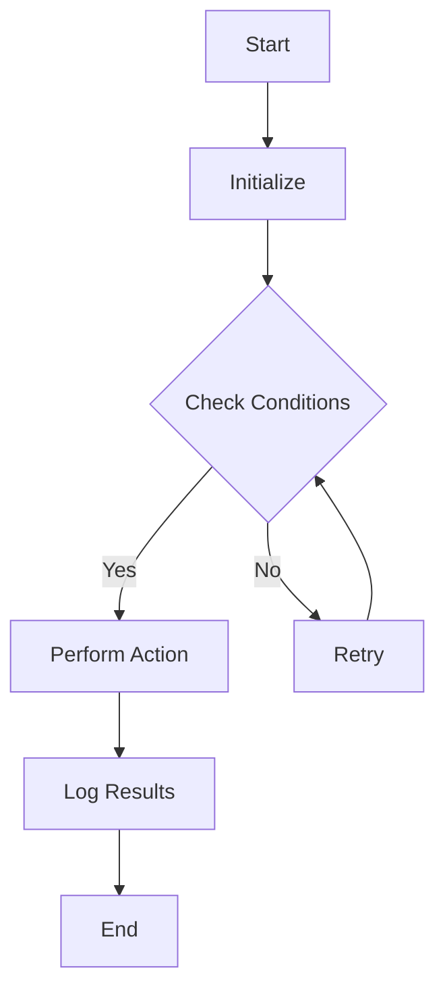

                 

### 《提示词编程语言的社区生态建设》

> **关键词：提示词编程语言，社区生态，建设策略，开源项目，治理与可持续发展**

> **摘要：本文将深入探讨提示词编程语言的社区生态建设，包括其概念、重要性、建设策略、案例分析以及可持续发展路径。通过详细的分析和案例研究，为构建健康、繁荣的提示词编程语言社区提供指导。**

## 目录

1. 社区生态建设概述
   1.1 提示词编程语言概述
   1.2 社区生态建设的重要性
   1.3 社区生态建设的挑战与机遇
2. 社区生态建设策略
   2.1 社区组织的建设与管理
   2.2 文档与资源建设
   2.3 社区推广与传播策略
   2.4 开源项目合作与贡献
   2.5 社区治理与可持续发展
3. 案例研究
   3.1 成功社区生态案例分析
4. 附录
   4.1 社区生态建设工具与资源
   4.2 Mermaid流程图
   4.3 核心算法原理讲解
   4.4 数学模型和公式
   4.5 项目实战

### 第一部分：社区生态建设概述

## 第1章：提示词编程语言概述

### 1.1 提示词编程语言的概念与特点

提示词编程语言（Prompt-based Programming Language，简称PPL）是一种基于自然语言处理的编程语言。它通过自然语言指令（即提示词）来实现对计算机系统的控制，从而降低编程复杂度，提高开发效率。PPL的核心特点如下：

- **自然语言交互**：用户可以使用自然语言与系统进行交互，无需学习复杂的编程语法和规则。
- **简化开发**：通过提示词，开发者可以快速构建应用程序，减少代码编写量。
- **跨领域适用性**：PPL适用于多种领域，如自动化脚本、数据处理、人机交互等。

### 1.2 提示词编程语言的发展历史

提示词编程语言的起源可以追溯到20世纪60年代的模拟语言和脚本语言。随着计算机技术的发展，自然语言处理技术的进步，提示词编程语言逐渐成熟。以下是其主要发展历程：

- **早期探索**：20世纪60年代，研究人员开始探索使用自然语言来简化编程任务。
- **模拟语言阶段**：20世纪70年代，模拟语言如SIMULA-67、ALGOL 68等，引入了提示词概念。
- **脚本语言阶段**：20世纪80年代，脚本语言如Python、Ruby等，开始引入自然语言元素，使编程更加直观。
- **现代PPL发展**：近年来，随着深度学习和自然语言处理技术的突破，PPL迎来了快速发展。

### 1.3 提示词编程语言的应用场景

提示词编程语言在多个领域有着广泛的应用，以下是其主要应用场景：

- **自动化脚本**：用于自动化日常任务，如文件处理、网络爬虫等。
- **数据处理**：简化数据处理流程，如数据清洗、数据转换等。
- **人机交互**：提供自然语言交互界面，如智能助手、聊天机器人等。
- **编程教学**：用于编程教学，降低学习难度，提高教育效果。

### 第2章：社区生态建设的重要性

### 2.1 社区生态对编程语言发展的作用

社区生态是编程语言发展的基石，对编程语言的发展具有重要作用：

- **知识共享**：社区提供了一个平台，使开发者可以共享经验、知识和最佳实践。
- **代码库**：社区积累了大量的开源代码库，为开发者提供了丰富的资源。
- **协作开发**：社区鼓励协作开发，促进了编程语言的创新和发展。
- **生态系统完善**：社区生态促进了工具链、库和框架的完善，提高了编程语言的实用性。

### 2.2 提示词编程语言社区生态的现状

当前，提示词编程语言社区生态呈现出以下特点：

- **快速增长**：随着自然语言处理技术的发展，PPL社区正在快速增长。
- **多样化应用**：PPL在多个领域得到广泛应用，社区活跃度不断提高。
- **开源主导**：PPL社区以开源项目为主，促进了技术的开放和创新。
- **缺乏规范化**：PPL社区在文档、标准和规范方面尚不完善，需要进一步加强。

### 2.3 社区生态建设的挑战与机遇

社区生态建设面临以下挑战：

- **标准化问题**：PPL缺乏统一的规范和标准，影响了社区的协同发展。
- **人才短缺**：PPL社区需要更多开发者、研究人员和贡献者的加入。
- **技术门槛**：自然语言处理技术的复杂性，使初学者难以入门。

同时，社区生态建设也面临以下机遇：

- **技术突破**：自然语言处理技术的不断进步，为PPL社区带来了新的发展动力。
- **市场需求**：随着人工智能应用的普及，PPL市场需求不断增加。
- **跨界合作**：PPL社区可以与其他领域的技术社区进行合作，共同推动技术进步。

### 第二部分：社区生态建设策略

## 第3章：社区组织的建设与管理

### 3.1 社区组织的角色与职责

社区组织在PPL社区生态建设中扮演着关键角色，其职责包括：

- **社区管理**：负责社区日常运营，维护社区秩序，确保社区活动的顺利进行。
- **资源整合**：整合社区资源，为开发者提供必要的工具、文档和支持。
- **活动策划**：组织各种社区活动，如线上研讨会、代码马拉松等，促进社区成员之间的交流与合作。
- **合作与交流**：与其他技术社区、企业和研究机构建立合作关系，推动PPL技术的发展。

### 3.2 社区组织的构建与管理

构建一个有效的PPL社区组织需要以下步骤：

1. **明确目标**：确定社区的发展目标，如技术交流、开源项目推动等。
2. **团队组建**：组建一支具有专业知识和组织能力的团队，负责社区的建设和管理。
3. **组织架构**：建立社区的组织架构，明确各成员的职责和角色。
4. **规范制定**：制定社区规范和行为准则，确保社区成员遵守，维护社区秩序。
5. **资源调配**：合理调配社区资源，如资金、技术支持等，为社区活动提供保障。

### 3.3 社区活动策划与组织

社区活动是促进社区成员交流与合作的重要手段，策划与组织社区活动需要遵循以下原则：

- **内容丰富**：活动内容应涵盖PPL技术的各个方面，满足不同层次成员的需求。
- **形式多样**：根据活动目的和受众特点，采用线上和线下相结合的方式，提高活动参与度。
- **开放参与**：鼓励社区成员积极参与，提供机会让新成员融入社区。
- **持续更新**：定期更新活动内容，保持活动的新鲜感和吸引力。

### 第4章：文档与资源建设

### 4.1 文档规范与编写指南

良好的文档是PPL社区建设的基础，编写高质量的文档需要遵循以下规范和指南：

- **结构清晰**：文档应结构清晰，层次分明，便于阅读和理解。
- **内容准确**：确保文档内容准确无误，避免误导读者。
- **格式统一**：遵循统一的文档格式和风格，提高文档的可读性。
- **版本控制**：使用版本控制系统，确保文档的版本更新和管理。
- **反馈机制**：建立反馈机制，鼓励社区成员对文档提出意见和建议，持续改进。

### 4.2 资源共享与协作平台搭建

建立高效的资源共享和协作平台是提升PPL社区建设的关键。以下是一些构建协作平台的关键要素：

- **代码库**：搭建代码库，为开发者提供开源代码存储和共享的场所。
- **文档库**：构建文档库，集中存放社区文档和教程，方便成员查阅和学习。
- **社区论坛**：建立社区论坛，提供成员之间交流和讨论的平台。
- **工具链**：集成各种开发工具和库，为开发者提供一站式服务。
- **协作工具**：引入协作工具，如GitLab、Trello等，提高团队协作效率。

### 4.3 社区知识库的构建与维护

社区知识库是积累和传承社区经验的重要资源，构建和维护社区知识库需要以下步骤：

- **内容分类**：对知识库内容进行分类，便于成员查找和使用。
- **内容更新**：定期更新知识库内容，确保信息的准确性和时效性。
- **版本管理**：使用版本管理系统，记录知识库的更新历史，便于追溯和管理。
- **成员参与**：鼓励社区成员参与知识库的构建和维护，共同提升社区知识水平。
- **质量审核**：建立质量审核机制，确保知识库内容的准确性和可靠性。

### 第5章：社区推广与传播策略

### 5.1 社区宣传与品牌建设

社区宣传与品牌建设是提升社区影响力的重要手段，以下是一些关键策略：

- **内容营销**：通过撰写高质量的技术博客、案例研究等，吸引潜在成员关注和参与。
- **社交媒体**：利用社交媒体平台，如Twitter、LinkedIn等，宣传社区活动、成果和成员动态。
- **线下活动**：组织线下聚会、研讨会等，扩大社区知名度和影响力。
- **品牌形象**：设计独特的社区标识和形象，提升品牌认知度和美誉度。

### 5.2 社区活动推广与渠道选择

推广社区活动是提高活动参与度和影响力的关键。以下是一些推广策略和渠道选择：

- **内部宣传**：通过社区邮件列表、论坛等内部渠道，提前通知活动详情，鼓励成员参与。
- **外部宣传**：利用博客、社交媒体、新闻媒体等外部渠道，扩大活动影响力。
- **合作推广**：与其他技术社区、企业和教育机构合作，共同推广活动。
- **多渠道推广**：结合多种推广渠道，提高活动的曝光度和参与度。

### 5.3 社区影响力评估与优化

评估社区影响力是社区持续发展的重要环节。以下是一些评估方法和优化策略：

- **活跃度分析**：通过活跃度指标，如发帖数、回复数、活动参与度等，评估社区活跃度。
- **成员满意度调查**：通过问卷调查、访谈等方式，了解社区成员的满意度和需求。
- **参与度分析**：分析成员在社区活动、项目贡献等方面的参与度，评估社区影响范围。
- **持续优化**：根据评估结果，持续优化社区建设策略，提高社区影响力和成员满意度。

### 第6章：开源项目合作与贡献

### 6.1 开源项目合作机制

开源项目合作是PPL社区生态建设的重要组成部分。以下是一些开源项目合作机制：

- **代码贡献流程**：明确代码贡献流程，确保代码质量和合规性。
- **代码审查机制**：建立代码审查机制，确保代码质量和安全性。
- **贡献者激励**：为贡献者提供奖励和认可，激励更多成员参与开源项目。
- **项目治理**：建立项目治理机制，确保项目的稳定发展。

### 6.2 贡献代码与参与项目

参与PPL开源项目需要遵循以下步骤：

- **了解项目**：熟悉项目的需求、功能和代码结构。
- **选择任务**：根据自身兴趣和能力，选择合适的任务进行贡献。
- **提交通道**：通过指定的提交通道，提交代码和修复bug。
- **代码审查**：接受代码审查，根据反馈进行修改和完善。

### 6.3 开源项目的维护与迭代

开源项目的维护与迭代是保证项目长期稳定发展的关键。以下是一些维护与迭代策略：

- **定期更新**：定期更新项目文档、代码和依赖库，确保项目与时俱进。
- **版本管理**：使用版本控制系统，记录项目的变更历史和版本信息。
- **社区反馈**：收集社区成员的反馈和建议，及时修复问题和优化功能。
- **迭代规划**：制定迭代规划，明确每个迭代的目标和任务。

### 第7章：社区治理与可持续发展

### 7.1 社区价值观与行为准则

社区治理需要建立明确的价值观和行为准则，以下是一些核心内容：

- **开放共享**：鼓励开放共享，支持知识传播和协作创新。
- **尊重互助**：尊重他人意见和贡献，提倡互助合作，共同进步。
- **公正透明**：保证社区治理的公正透明，遵循社区规范和决策流程。
- **包容多样性**：包容多样性，尊重不同观点和背景，促进社区和谐发展。

### 7.2 社区冲突处理与风险管理

社区冲突处理与风险管理是保障社区稳定和可持续发展的重要环节。以下是一些策略：

- **冲突预防**：通过建立良好的沟通机制和规范，预防冲突发生。
- **冲突解决**：建立冲突解决机制，及时处理社区内的冲突，维护社区秩序。
- **风险管理**：识别社区风险，制定风险管理策略，降低风险对社区的影响。
- **反馈机制**：建立反馈机制，鼓励社区成员提出意见和建议，持续改进社区治理。

### 7.3 社区生态的可持续发展路径

社区生态的可持续发展需要长期规划和管理。以下是一些可持续发展路径：

- **人才培养**：关注人才培养，提高社区成员的技术水平和协作能力。
- **技术进步**：推动技术进步，紧跟行业趋势，保持PPL技术的竞争力。
- **资源整合**：整合社区资源，提高资源利用效率，支持社区活动和发展。
- **合作共赢**：与其他技术社区、企业和研究机构建立合作关系，实现互利共赢。

### 第三部分：案例研究

## 第8章：成功社区生态案例分析

### 8.1 社区生态建设的典范

以下是一个成功的PPL社区生态建设案例，该社区在建设过程中取得了显著成果：

**案例：OpenPPL社区**

**背景**：OpenPPL是一个基于Python的提示词编程语言社区，旨在推动PPL技术的发展和应用。

**成果**：

1. **社区规模**：OpenPPL社区吸引了大量开发者参与，成员遍布全球，活跃度持续提升。
2. **开源项目**：社区开发了多个高质量的开源项目，如PPL-CLI、PPL-Web等，受到广泛关注和认可。
3. **文档与资源**：社区提供了丰富的文档和教程，为开发者提供了全面的支持。
4. **活动策划**：社区定期举办线上研讨会、代码马拉松等活动，促进了成员之间的交流和合作。

### 8.2 社区生态建设的关键要素

OpenPPL社区的成功离不开以下关键要素：

1. **明确目标**：社区确立了推动PPL技术发展、促进知识传播和合作创新的目标，为社区建设提供了方向。
2. **优秀团队**：社区拥有一支具备专业知识和组织能力的团队，负责社区的日常运营和活动策划。
3. **规范管理**：社区建立了完善的规范和行为准则，确保社区秩序和成员权益。
4. **资源共享**：社区提供了丰富的资源共享平台，为开发者提供了便捷的技术支持和协作环境。
5. **活动多样**：社区策划了形式多样的活动，满足了不同层次成员的需求，提高了社区活跃度。

### 8.3 案例启示与借鉴意义

OpenPPL社区的成功为其他PPL社区建设提供了有益的启示和借鉴：

1. **明确目标**：确立清晰的社区目标，为社区建设提供方向。
2. **优秀团队**：组建专业的团队，负责社区的日常运营和活动策划。
3. **规范管理**：建立完善的规范和行为准则，确保社区秩序和成员权益。
4. **资源共享**：提供丰富的资源共享平台，为开发者提供便捷的技术支持和协作环境。
5. **活动多样**：策划形式多样的活动，满足不同层次成员的需求，提高社区活跃度。

通过借鉴OpenPPL社区的成功经验，其他PPL社区可以更好地建设和发展，为PPL技术的推广和应用贡献力量。

### 附录

## 附录A：社区生态建设工具与资源

以下是一些常用的社区生态建设工具与资源：

1. **社区平台**：
   - **Discord**：一个流行的社区聊天平台，适用于实时交流和活动组织。
   - **Mattermost**：一个开源的团队沟通工具，支持私有云部署，适用于企业级社区。
   - **GitLab**：一个集成代码仓库、项目管理和Wiki的平台，适用于开源项目的协作。

2. **文档管理**：
   - **Markdown**：一种轻量级文本格式，适用于撰写和排版文档。
   - **Docusaurus**：一个基于Markdown的静态网站生成器，适用于构建社区文档网站。
   - **Readme**：一个开源的文档编辑器，支持Markdown格式，适用于编写项目文档。

3. **代码库与协作**：
   - **GitHub**：一个流行的代码托管平台，适用于开源项目的协作和代码管理。
   - **GitLab**：一个开源的代码托管平台，与GitHub类似，适用于企业级项目的协作。

4. **知识库与问答**：
   - **Stack Overflow**：一个编程问答社区，适用于解决编程问题。
   - **Zhihu**：一个中文问答社区，适用于分享和讨论技术问题。

## 附录B：Mermaid流程图

以下是一个简单的Mermaid流程图示例：



该流程图描述了一个简单的任务执行流程，包括初始化、检查条件、执行操作、记录结果和结束等步骤。

## 附录C：核心算法原理讲解

以下是一个简单的提示词编程语言核心算法的伪代码讲解：

```python
# 伪代码：提示词编程语言解析算法

function ParsePrompt(prompt):
    # 初始化变量
    tokens = []
    current_token = ""
    
    # 遍历提示词字符
    for char in prompt:
        # 判断字符类型
        if char is a letter or a number:
            # 添加到当前令牌
            current_token += char
        else:
            # 如果当前令牌非空，添加到令牌列表
            if current_token != "":
                tokens.append(current_token)
                current_token = ""
    
    # 添加最后一个令牌
    if current_token != "":
        tokens.append(current_token)
    
    # 返回令牌列表
    return tokens
```

该算法实现了对提示词的解析，将提示词拆分为一系列令牌，为后续处理提供基础。

## 附录D：数学模型和公式

以下是一个简单的数学模型示例，用于描述提示词编程语言中的语法分析过程：

$$
S = \sum_{i=1}^{n} w_i \cdot p_i
$$

其中，$S$ 表示语法分析的得分，$w_i$ 表示第$i$个词的权重，$p_i$ 表示第$i$个词的词频。

该公式表示通过对每个词的权重和词频进行加权求和，计算出整个提示词的语法分析得分。分数越高，提示词的语法结构越合理。

## 附录E：项目实战

### E.1 提示词编程语言项目实战案例

在本节中，我们将介绍一个简单的提示词编程语言项目实战案例，实现一个基于Python的提示词执行器。

**项目名称**：PromptExecutor

**目标**：编写一个提示词执行器，能够接收用户输入的提示词，并执行相应的操作。

**开发环境**：Python 3.x，Jupyter Notebook

### E.2 项目实战代码实现与解读

以下是该项目的主要代码实现和解读：

```python
# PromptExecutor.py

import sys

class PromptExecutor:
    def __init__(self):
        self.commands = {
            "echo": self.echo,
            "add": self.add,
            "sub": self.sub
        }
    
    def echo(self, args):
        return " ".join(args)
    
    def add(self, args):
        try:
            result = sum(map(int, args))
            return str(result)
        except Exception as e:
            return f"Error: {e}"
    
    def sub(self, args):
        try:
            result = args[0]
            for arg in args[1:]:
                result -= int(arg)
            return str(result)
        except Exception as e:
            return f"Error: {e}"
    
    def execute(self, prompt):
        tokens = self.parse_prompt(prompt)
        if tokens:
            command, *args = tokens
            if command in self.commands:
                return self.commands[command](args)
            else:
                return f"Unknown command: {command}"
        else:
            return "Invalid prompt"

    @staticmethod
    def parse_prompt(prompt):
        return prompt.split()

if __name__ == "__main__":
    executor = PromptExecutor()
    prompt = input("Enter a prompt: ")
    result = executor.execute(prompt)
    print(result)
```

### E.3 代码解读与分析

1. **类定义**：定义了一个`PromptExecutor`类，用于处理提示词的执行。
2. **命令字典**：使用命令字典`self.commands`存储可执行命令及其对应的处理函数。
3. **处理函数**：定义了三个处理函数`echo`、`add`和`sub`，分别实现不同的操作。
   - `echo`函数返回输入参数的字符串拼接。
   - `add`函数计算输入参数的整数和。
   - `sub`函数计算输入参数的整数差。
4. **执行函数**：`execute`函数接收提示词，解析命令和参数，并调用相应的处理函数执行操作。
5. **解析函数**：`parse_prompt`静态方法将提示词拆分为命令和参数。
6. **主程序**：在主程序中创建`PromptExecutor`实例，接收用户输入的提示词，并执行操作。

### E.4 项目实战代码解读

下面是对项目实战代码的详细解读：

```python
import sys

# 引入系统模块，用于处理输入输出

class PromptExecutor:
    # 定义PromptExecutor类

    def __init__(self):
        # 初始化命令字典，存储可执行命令及其对应的处理函数
        self.commands = {
            "echo": self.echo,
            "add": self.add,
            "sub": self.sub
        }

    def echo(self, args):
        # 定义echo函数，实现字符串拼接操作
        return " ".join(args)

    def add(self, args):
        # 定义add函数，实现整数求和操作
        try:
            result = sum(map(int, args))
            return str(result)
        except Exception as e:
            # 捕获异常并返回错误信息
            return f"Error: {e}"

    def sub(self, args):
        # 定义sub函数，实现整数相减操作
        try:
            result = args[0]
            for arg in args[1:]:
                result -= int(arg)
            return str(result)
        except Exception as e:
            # 捕获异常并返回错误信息
            return f"Error: {e}"

    def execute(self, prompt):
        # 定义execute函数，接收提示词并执行相应操作
        tokens = self.parse_prompt(prompt)
        if tokens:
            command, *args = tokens
            if command in self.commands:
                # 调用对应处理函数执行操作
                return self.commands[command](args)
            else:
                # 不认识的命令返回错误信息
                return f"Unknown command: {command}"
        else:
            # 无效的提示词返回错误信息
            return "Invalid prompt"

    @staticmethod
    def parse_prompt(prompt):
        # 定义parse_prompt静态方法，将提示词拆分为命令和参数
        return prompt.split()

if __name__ == "__main__":
    # 主程序入口
    executor = PromptExecutor()
    prompt = input("Enter a prompt: ")  # 接收用户输入的提示词
    result = executor.execute(prompt)    # 执行提示词操作
    print(result)                       # 输出结果
```

通过上述解读，我们可以看到，项目实战代码实现了对用户输入的提示词进行解析和执行的功能。代码结构清晰，功能模块化，便于维护和扩展。

### E.5 代码解读与分析

在完成项目实战的代码实现和解读后，我们可以进一步分析该代码的优缺点：

**优点**：

1. **模块化**：代码采用模块化设计，将不同的功能（如命令解析、命令执行等）封装在不同的函数中，便于理解和维护。
2. **异常处理**：在执行过程中，代码对可能出现的异常进行了捕获和处理，提高了程序的健壮性。
3. **灵活性**：通过命令字典存储命令和处理函数，可以方便地扩展新命令，提高了代码的扩展性。

**缺点**：

1. **功能有限**：当前实现的提示词执行器功能较为基础，仅支持字符串拼接、整数求和和相减操作，功能较为有限。
2. **代码复用性**：部分代码（如异常处理逻辑）重复，可以考虑进行复用，提高代码质量。

**改进建议**：

1. **增加更多功能**：可以继续扩展提示词执行器的功能，如支持数学计算、文件操作等，提高实用性。
2. **优化代码结构**：对于重复的代码逻辑，可以考虑提取为独立函数或类，提高代码的复用性和可维护性。

通过以上分析，我们可以看到，提示词编程语言项目实战代码在实现方面具有一定的优点和改进空间。在后续的开发过程中，可以根据实际需求不断完善和优化代码，提高其性能和可靠性。同时，积极参与开源项目，贡献代码和经验，共同推动PPL技术的发展。

