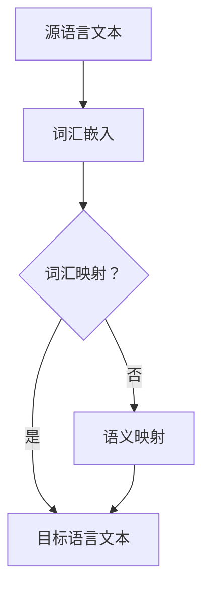

                 

# 提示词语言的跨语言互操作性设计

## 概述

随着全球化的深入发展，多语言环境下的信息技术应用日益普及。在跨语言通信、数据处理和信息共享中，跨语言互操作性成为一项关键技术。跨语言互操作性使得不同语言系统之间能够有效地交换和操作信息，从而促进跨文化交流、提高国际业务效率。在众多跨语言技术中，提示词语言（Natural Language Interface, NLI）的跨语言互操作性尤为关键。本文将围绕提示词语言的跨语言互操作性进行探讨，旨在为相关领域的研究者和开发者提供有价值的参考。

### 核心关键词

- 提示词语言
- 跨语言互操作性
- 跨语言翻译
- 自然语言处理
- 语义映射

## 目录大纲

### 第一部分：介绍与概述

#### 第1章：跨语言互操作性的重要性

##### 1.1 跨语言互操作性的定义

##### 1.2 跨语言互操作性的挑战

##### 1.3 提示词语言在跨语言互操作性中的作用

#### 第2章：提示词语言的基础知识

##### 2.1 提示词语言的定义与分类

##### 2.2 提示词语言的功能与特点

##### 2.3 常见的提示词语言介绍

### 第二部分：跨语言互操作性原理

#### 第3章：跨语言互操作性原理

##### 3.1 跨语言互操作性的基础

##### 3.2 跨语言互操作性模型

##### 3.3 跨语言互操作性的挑战与解决方案

#### 第4章：提示词语言的跨语言互操作性

##### 4.1 提示词语言的跨语言互操作需求

##### 4.2 跨语言提示词语言的构建

##### 4.3 跨语言提示词语言的应用场景

#### 第5章：跨语言提示词语言的实现技术

##### 5.1 词汇映射技术

##### 5.2 语义映射技术

##### 5.3 提示词语言的跨语言生成技术

### 第三部分：跨语言互操作性的应用

#### 第6章：跨语言互操作性的应用案例

##### 6.1 翻译应用

##### 6.2 多语言搜索引擎

##### 6.3 多语言对话系统

#### 第7章：跨语言互操作性的未来趋势

##### 7.1 跨语言互操作性的发展趋势

##### 7.2 提示词语言跨语言互操作性的未来挑战

##### 7.3 跨语言互操作性的未来发展建议

### 附录

##### 附录A：常用跨语言工具与资源

##### 附录B：术语表

##### 附录C：Mermaid流程图

##### 附录D：核心算法伪代码

##### 附录E：数学公式

##### 附录F：项目实战

## 第一部分：介绍与概述

### 第1章：跨语言互操作性的重要性

#### 1.1 跨语言互操作性的定义

跨语言互操作性（Cross-Language Interoperability）是指在不同语言系统之间交换和操作信息的能力。这种能力使得信息可以在不同语言环境下流动，从而实现跨语言的通信、数据处理和信息共享。跨语言互操作性不仅限于计算机程序之间的交互，还包括人机交互、跨平台应用开发等多个方面。

#### 1.2 跨语言互操作性的挑战

跨语言互操作性面临以下几大挑战：

1. **语言差异**：不同语言在语法、词汇和语义表达上存在显著差异，这给跨语言信息处理带来了困难。
2. **系统兼容性**：不同语言系统之间的协议、接口和数据格式往往不一致，增加了互操作的复杂性。
3. **性能和效率**：跨语言操作可能引入额外的处理开销，导致性能降低，需要优化算法和架构。

#### 1.3 提示词语言在跨语言互操作性中的作用

提示词语言是一种专门为跨语言互操作性设计的语言，它在跨语言通信中起到桥梁作用。提示词语言能够将一种语言的信息转换为另一种语言的信息，从而实现不同语言系统之间的有效交互。以下为提示词语言在跨语言互操作性中的作用：

1. **翻译**：提示词语言可以用于自动翻译，将一种语言的信息转换为另一种语言，便于跨语言交流。
2. **语义理解**：提示词语言能够理解和解析不同语言中的语义和上下文，保持信息传递的准确性。
3. **语言生成**：提示词语言能够自动生成跨语言文本，提高信息处理的效率和自动化程度。

### 第2章：提示词语言的基础知识

#### 2.1 提示词语言的定义与分类

提示词语言（Natural Language Interface, NLI）是一种面向人类用户的自然语言交互界面。它允许用户通过自然语言（如英语、中文等）与计算机系统进行交互，无需学习复杂的命令或界面操作。提示词语言可以分为以下几类：

1. **基于词汇映射的提示词语言**：这种语言通过将源语言的词汇映射到目标语言的词汇来实现跨语言交互。
2. **基于语义映射的提示词语言**：这种语言通过保留源语言的语义，将其映射到目标语言的语义来实现跨语言交互。
3. **基于生成的提示词语言**：这种语言通过自动生成目标语言文本来实现跨语言交互。

#### 2.2 提示词语言的功能与特点

提示词语言具备以下功能和特点：

1. **交互性**：提示词语言支持用户与系统之间的双向交互，用户可以通过自然语言提问，系统则可以通过自然语言回答。
2. **灵活性和可扩展性**：提示词语言可以适应多种语言和领域，具有较好的灵活性和可扩展性。
3. **高效性**：提示词语言通过自动处理和生成文本，提高了信息处理的效率。

#### 2.3 常见的提示词语言介绍

以下是几种常见的提示词语言：

1. **XML（可扩展标记语言）**：XML是一种用于跨语言数据交换的标记语言，它通过标签和属性描述数据结构，支持多种语言的数据传输。
2. **JSON（JavaScript对象表示法）**：JSON是一种轻量级的数据交换格式，易于阅读和编写，广泛用于跨语言的数据传输和存储。
3. **Web服务描述语言（WSDL）**：WSDL用于描述Web服务的接口和功能，支持不同语言和平台之间的交互。

### 第二部分：跨语言互操作性原理

#### 第3章：跨语言互操作性原理

#### 3.1 跨语言互操作性的基础

跨语言互操作性的基础包括以下几个方面：

1. **标准化的协议和接口**：定义统一的协议和接口，使不同语言系统之间能够相互理解和操作信息。
2. **数据格式和编码**：采用统一的数据格式和编码方式，便于不同语言系统之间的数据交换。
3. **互操作性框架**：提供通用的互操作性框架和工具，简化跨语言开发的复杂性。

#### 3.2 跨语言互操作性模型

跨语言互操作性模型通常包括以下几个层次：

1. **数据层**：实现不同语言系统之间的数据交换，如通过XML、JSON等格式进行数据编码和解码。
2. **功能层**：定义不同语言系统之间的功能接口和交互方式，确保系统能够正确理解和执行请求。
3. **语义层**：处理跨语言语义理解和映射，确保信息的准确传递。

#### 3.3 跨语言互操作性的挑战与解决方案

跨语言互操作性的挑战主要包括：

1. **语言差异**：不同语言的语法、词汇和语义差异导致信息传递的准确性问题。
   - **解决方案**：采用词汇映射和语义映射技术，将源语言信息转换为目标语言信息。

2. **系统兼容性**：不同语言系统的协议和接口不一致，导致互操作的复杂性。
   - **解决方案**：使用统一的协议和接口标准，如Web服务描述语言（WSDL）和简单对象访问协议（SOAP）。

3. **性能和效率**：跨语言操作可能引入额外的处理开销，影响系统性能。
   - **解决方案**：优化算法和架构，提高跨语言处理的效率和性能。

### 第4章：提示词语言的跨语言互操作性

#### 4.1 提示词语言的跨语言互操作需求

提示词语言的跨语言互操作需求主要包括以下几个方面：

1. **多语言支持**：提示词语言需要支持多种语言，以满足不同地区的用户需求。
2. **准确性**：跨语言互操作需要保持语义和上下文的准确性，确保信息传递的准确性。
3. **效率**：跨语言互操作需要高效处理，以减少系统延迟和资源消耗。

#### 4.2 跨语言提示词语言的构建

构建跨语言提示词语言需要考虑以下几个关键步骤：

1. **语言资源收集**：收集多语言词汇表、语法规则和语义资源，为跨语言映射提供基础。
2. **词汇映射策略**：设计词汇映射算法，将源语言词汇映射到目标语言词汇。
3. **语义映射策略**：设计语义映射算法，将源语言语义映射到目标语言语义。
4. **语言生成模型**：构建基于生成式的跨语言文本生成模型，实现自动化文本生成。

#### 4.3 跨语言提示词语言的应用场景

跨语言提示词语言在以下应用场景中具有重要价值：

1. **翻译应用**：跨语言提示词语言可用于自动翻译，支持多语言文本的交互和共享。
2. **多语言搜索引擎**：跨语言提示词语言可用于多语言搜索，提供跨语言的检索和结果展示。
3. **多语言对话系统**：跨语言提示词语言可用于多语言对话系统，支持跨语言的用户交互和响应。

### 第5章：跨语言提示词语言的实现技术

#### 5.1 词汇映射技术

词汇映射技术是将源语言词汇转换为目标语言词汇的过程。以下为几种常见的词汇映射技术：

1. **基于规则的方法**：通过编写规则将源语言词汇映射到目标语言词汇。
2. **基于统计的方法**：通过统计源语言和目标语言之间的共现关系进行词汇映射。
3. **基于机器学习的方法**：利用机器学习模型，如神经网络，进行词汇映射。

#### 5.2 语义映射技术

语义映射技术是将源语言语义映射到目标语言语义的过程。以下为几种常见的语义映射技术：

1. **基于规则的方法**：通过编写规则将源语言语义映射到目标语言语义。
2. **基于语义网络的方法**：利用语义网络模型，如WordNet，进行语义映射。
3. **基于机器学习的方法**：利用机器学习模型，如转换器模型（Translator Model），进行语义映射。

#### 5.3 提示词语言的跨语言生成技术

跨语言生成技术是自动生成跨语言文本的过程。以下为几种常见的跨语言生成技术：

1. **序列到序列模型（Seq2Seq）**：通过将源语言序列映射到目标语言序列生成跨语言文本。
2. **变换器模型（Transformer）**：利用自注意力机制进行跨语言文本生成。
3. **生成对抗网络（GAN）**：通过生成器和判别器进行跨语言文本生成。

### 第三部分：跨语言互操作性的应用

#### 第6章：跨语言互操作性的应用案例

#### 6.1 翻译应用

跨语言翻译是跨语言互操作性的一个重要应用领域。以下为几个典型的跨语言翻译应用案例：

1. **Google Translate**：Google Translate 是一款免费的在线翻译工具，支持多种语言之间的文本翻译。
2. **DeepL**：DeepL 是一款高质量的机器翻译工具，其翻译结果在语义和语法上具有较高的准确性。
3. **百度翻译**：百度翻译是一款支持多种语言翻译的在线翻译工具，提供文本翻译、语音翻译和图片翻译等多种功能。

#### 6.2 多语言搜索引擎

多语言搜索引擎支持用户使用不同语言进行搜索，并返回相关结果。以下为几个典型的多语言搜索引擎案例：

1. **Bing**：Bing 是微软的搜索引擎，支持多种语言搜索，并提供多语言搜索结果。
2. **百度**：百度是中国最大的搜索引擎，提供中英文搜索服务，同时支持其他语言的搜索结果。
3. **Google Search**：Google Search 是全球最大的搜索引擎，支持多种语言搜索，并提供多语言搜索结果。

#### 6.3 多语言对话系统

多语言对话系统支持用户使用不同语言与系统进行交互，并返回相应的回答。以下为几个典型的多语言对话系统案例：

1. **Microsoft Bot Framework**：Microsoft Bot Framework 提供多语言对话开发工具，支持用户使用多种语言与机器人进行交互。
2. **Rasa**：Rasa 是一款开源的自然语言处理框架，支持多语言对话开发，并提供预构建的多语言对话模型。
3. **Dialogflow**：Dialogflow 是 Google 开发的一款自然语言处理平台，支持多语言对话开发，并提供预构建的多语言对话管理器。

### 第7章：跨语言互操作性的未来趋势

#### 7.1 跨语言互操作性的发展趋势

随着全球化的深入发展，跨语言互操作性将继续保持快速增长。以下为几个关键的发展趋势：

1. **多语言支持**：跨语言互操作性将更加注重多语言支持，满足不同地区的用户需求。
2. **智能化**：跨语言互操作性将更加智能化，利用人工智能技术提升信息处理和翻译的准确性。
3. **平台化**：跨语言互操作性将逐渐平台化，提供通用的互操作性解决方案和工具。

#### 7.2 提示词语言跨语言互操作性的未来挑战

提示词语言跨语言互操作性在未来将面临以下挑战：

1. **语言复杂性**：随着语言的不断发展和变化，跨语言互操作性需要应对新的语言复杂性问题。
2. **性能优化**：跨语言互操作性需要进一步优化算法和架构，提高信息处理效率和性能。
3. **隐私保护**：在跨语言信息交换过程中，需要确保用户的隐私得到保护。

#### 7.3 跨语言互操作性的未来发展建议

为推动跨语言互操作性的未来发展，以下是一些建议：

1. **标准化**：加强跨语言互操作性的标准化工作，制定统一的协议和接口标准。
2. **技术创新**：持续推动人工智能、机器学习和自然语言处理等技术的发展，提升跨语言互操作性的性能和智能化水平。
3. **跨学科合作**：加强不同学科之间的合作，共同研究跨语言互操作性的理论和应用。

### 附录

#### 附录A：常用跨语言工具与资源

- **跨语言翻译工具**：Google Translate、DeepL、百度翻译
- **多语言搜索引擎**：Bing、百度、Google Search
- **跨语言对话系统框架**：Microsoft Bot Framework、Rasa、Dialogflow

#### 附录B：术语表

- **跨语言互操作性**：Cross-Language Interoperability
- **提示词语言**：Natural Language Interface (NLI)
- **词汇映射**：Word Mapping
- **语义映射**：Semantic Mapping
- **语言模型**：Language Model

#### 附录C：Mermaid流程图



#### 附录D：核心算法伪代码

```python
# 词汇映射伪代码
def word_mapping(source_word, target_vocab):
    source_embedding = embedding_model(source_word)
    target_embedding = target_vocab.get_closest_embedding(source_embedding)
    return target_vocab.get_word_by_embedding(target_embedding)

# 语义映射伪代码
def semantic_mapping(source_sentence, target_vocab):
    source_embeddings = [embedding_model(word) for word in source_sentence]
    target_embeddings = target_vocab.map_embeddings(source_embeddings)
    return [target_vocab.get_word_by_embedding(embedding) for embedding in target_embeddings]

# 语言生成伪代码
def generate(target_embedding, model, max_length=50):
    generated_sentence = []
    current_embedding = target_embedding
    for _ in range(max_length):
        next_word_embedding = model.get_next_word_embedding(current_embedding)
        current_embedding = next_word_embedding
        generated_sentence.append(model.get_word_by_embedding(current_embedding))
    return ' '.join(generated_sentence)
```

#### 附录E：数学公式

- **语言模型概率**：\( P(w_t | w_{<t}) = \text{Language Model} \)
- **PageRank算法**：\( PR(w) = (1 - d) + d \left( \sum_{c \in C} \frac{PR(c)}{L(c)} \right) \)
- **词频-逆文档频率**：\( tf_idf(w, d) = (\text{tf}(w, d)) \times (\text{idf}(w, D)) \)
- **余弦相似度**：\( \text{similarity}(v_1, v_2) = \frac{v_1 \cdot v_2}{\lVert v_1 \rVert \lVert v_2 \rVert} \)
- **马尔可夫模型**：\( P(s_t | s_{<t}) = \text{Markov Model} \)
- **隐马尔可夫模型**：\( P(o_t | s_t) = \text{Hidden Markov Model} \)

#### 附录F：项目实战

##### F.1 翻译应用

- **开发环境**：Python，TensorFlow或PyTorch
- **数据集**：多语言平行语料库，如WMT
- **实现细节**：词汇映射、语义映射和生成式模型的实现与训练
- **性能评估**：翻译准确性、速度和效率

##### F.2 多语言搜索引擎

- **开发环境**：Python，Elasticsearch或其他搜索引擎框架
- **数据集**：多语言网页数据集，如Common Crawl
- **实现细节**：搜索引擎的核心算法和接口实现
- **性能评估**：搜索精度、响应时间和可扩展性

##### F.3 多语言对话系统

- **开发环境**：Python，TensorFlow或PyTorch
- **数据集**：多语言对话数据集，如DailyDialogue
- **实现细节**：对话系统核心算法和接口实现
- **性能评估**：对话质量、用户满意度和可扩展性

## 作者信息

作者：AI天才研究院/AI Genius Institute & 禅与计算机程序设计艺术 /Zen And The Art of Computer Programming

---

以上是《提示词语言的跨语言互操作性设计》全文。文章详细介绍了跨语言互操作性的重要性、提示词语言的基础知识、跨语言互操作性的原理、实现技术和应用案例，并对未来的发展趋势提出了建议。希望这篇文章能为读者在跨语言互操作性领域的研究和实践中提供有价值的参考。

