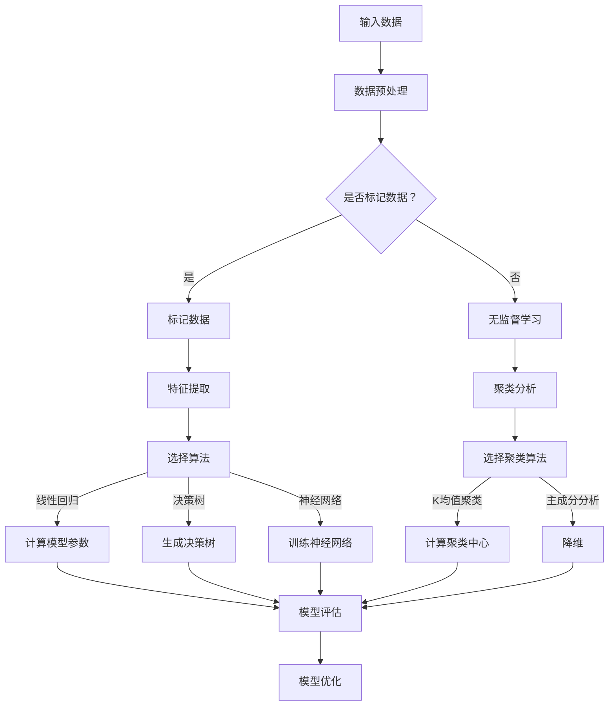
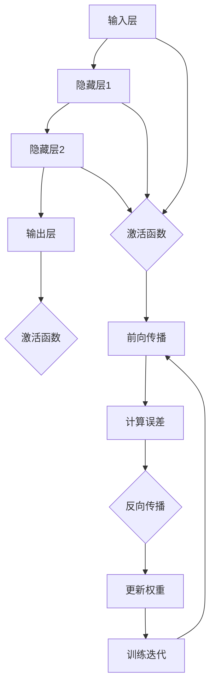
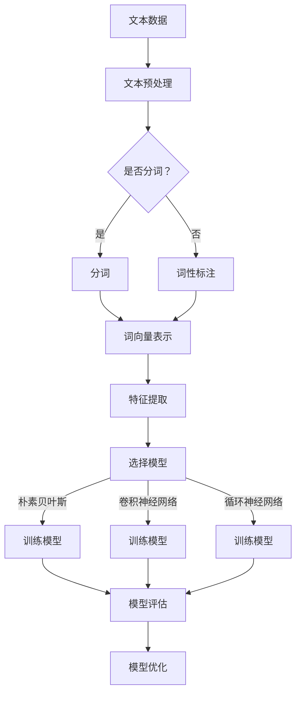

                 

### 《AI编程的新视界与新领域》

> **关键词**：人工智能编程、机器学习、深度学习、自然语言处理、计算机视觉、语音识别、开发环境、未来趋势、项目实战

> **摘要**：本文深入探讨了AI编程的新视界与新领域。从基础概念到前沿应用，从算法原理到实际案例，本文旨在为广大开发者提供一份数字时代的编程指南，帮助读者掌握AI编程的核心技巧，迎接未来的技术挑战。

## 目录

### 《AI编程的新视界与新领域》

> **关键词**：人工智能编程、机器学习、深度学习、自然语言处理、计算机视觉、语音识别、开发环境、未来趋势、项目实战

> **摘要**：本文深入探讨了AI编程的新视界与新领域。从基础概念到前沿应用，从算法原理到实际案例，本文旨在为广大开发者提供一份数字时代的编程指南，帮助读者掌握AI编程的核心技巧，迎接未来的技术挑战。

### 第一部分：AI编程基础与核心概念

#### 第1章：AI编程概述

1. **1.1 AI编程的定义与发展**  
2. **1.2 AI编程的核心概念**  
3. **1.3 AI编程与传统编程的区别**

#### 第2章：机器学习基础

1. **2.1 机器学习概述**  
2. **2.2 监督学习算法**  
3. **2.3 无监督学习算法**  
4. **2.4 强化学习算法**  
5. **2.5 深度学习基础**

#### 第3章：核心算法原理与实现

1. **3.1 神经网络算法原理**  
2. **3.2 伪代码实现**  
3. **3.3 数学模型与公式讲解**

### 第二部分：AI编程新视界

#### 第4章：AI编程新领域探析

1. **4.1 自然语言处理**  
2. **4.2 计算机视觉**  
3. **4.3 语音识别**  
4. **4.4 强化学习应用**

#### 第5章：AI编程实际应用

1. **5.1 AI在医疗健康中的应用**  
2. **5.2 AI在金融科技中的应用**  
3. **5.3 AI在智能交通中的应用**  
4. **5.4 AI在智能制造中的应用**

#### 第6章：AI编程开发环境与工具

1. **6.1 Python编程环境搭建**  
2. **6.2 常用机器学习框架**  
3. **6.3 实践工具与资源**

#### 第7章：AI编程的未来发展趋势

1. **7.1 AI编程的未来方向**  
2. **7.2 技术挑战与应对策略**  
3. **7.3 AI编程的社会影响**

### 第三部分：AI编程实战项目

#### 第8章：AI编程项目实战

1. **8.1 项目介绍**  
2. **8.2 开发环境搭建**  
3. **8.3 代码实现与分析**  
4. **8.4 项目评估与优化**

#### 第9章：深度学习项目实战

1. **9.1 项目概述**  
2. **9.2 环境配置与代码实现**  
3. **9.3 结果分析与优化**  
4. **9.4 扩展应用**

#### 第10章：自然语言处理项目实战

1. **10.1 项目介绍**  
2. **10.2 实现步骤**  
3. **10.3 结果解读**  
4. **10.4 项目应用**

### 附录

#### 附录A：AI编程常用工具与资源

1. **A.1 开发工具推荐**  
2. **A.2 学习资源介绍**  
3. **A.3 社区与论坛推荐** <markdown>## 第一部分：AI编程基础与核心概念

### 第1章：AI编程概述

#### 1.1 AI编程的定义与发展

人工智能（Artificial Intelligence，简称AI）是一种模拟人类智能的技术，它使得计算机能够执行通常需要人类智能才能完成的任务，如视觉识别、语言理解、决策制定等。AI编程，顾名思义，就是开发这些人工智能系统的过程。

AI编程的发展可以追溯到20世纪50年代。最早的AI研究主要集中在专家系统和规则推理上。这些系统通过定义一系列规则来模拟人类专家的决策过程。然而，这种基于规则的AI方法在面对复杂和不确定的环境时表现出一定的局限性。

随着计算机性能的提升和数据量的增加，20世纪80年代和90年代见证了机器学习的兴起。机器学习是一种让计算机通过数据学习模式和规律的方法，不再需要显式地编写规则。这一时期的代表性技术包括决策树、支持向量机和神经网络等。

进入21世纪，深度学习作为机器学习的一个重要分支，因其强大的建模能力和对大量数据的处理能力而迅速崛起。深度学习通过多层神经网络结构，能够自动提取特征并实现高度复杂的功能，如图像识别、自然语言处理和语音识别等。

#### 1.2 AI编程的核心概念

AI编程的核心概念包括机器学习、深度学习、神经网络和自然语言处理等。

- **机器学习**：机器学习是一种通过数据学习模式并作出预测或决策的技术。它主要包括监督学习、无监督学习和强化学习三种类型。

  - **监督学习**：在有标记的数据集上进行训练，通过已知的输入和输出学习预测模型。
  - **无监督学习**：在没有标记的数据集上进行训练，通过发现数据中的内在结构和规律进行学习。
  - **强化学习**：通过与环境的交互，学习在给定状态下采取最佳动作以最大化长期奖励。

- **深度学习**：深度学习是一种基于多层神经网络的学习方法，能够自动提取层次化的特征表示。深度学习的核心组件包括卷积神经网络（CNN）、循环神经网络（RNN）和生成对抗网络（GAN）等。

- **神经网络**：神经网络是模仿人脑神经元连接方式的计算模型，通过调整权重来学习数据中的复杂关系。

- **自然语言处理**（NLP）：自然语言处理是一种使计算机能够理解、解释和生成自然语言的技术。NLP的应用包括机器翻译、文本分类、情感分析和语音识别等。

#### 1.3 AI编程与传统编程的区别

AI编程与传统编程有显著的区别：

- **目标不同**：传统编程的目标是编写能够执行特定任务的程序，而AI编程的目标是通过学习数据来建立智能系统。

- **方法论不同**：传统编程依赖于显式编程和规则定义，而AI编程依赖于数据驱动和模式发现。

- **结果评估不同**：传统编程的结果可以通过测试用例进行评估，而AI编程的结果往往依赖于数据集上的表现。

通过上述对比，我们可以看到，AI编程不仅仅是传统编程的延伸，而是一种全新的编程范式，它将数据、算法和计算能力结合起来，实现了前所未有的智能化应用。

### 第2章：机器学习基础

#### 2.1 机器学习概述

机器学习（Machine Learning，ML）是一种让计算机通过数据学习模式并作出预测或决策的技术。它是一种实现人工智能的重要途径，通过从数据中自动提取模式和规律，机器学习算法能够提高系统的准确性和效率。

机器学习可以分为三大类：监督学习、无监督学习和强化学习。每一类都有其独特的应用场景和算法。

- **监督学习**：监督学习是一种在有标记的数据集上进行训练的方法。标记数据包含输入和相应的输出，通过学习这些输入和输出的关系，监督学习算法能够预测新的输入对应的输出。

  - **分类问题**：分类问题是监督学习的一种典型应用，目标是将输入数据分为预先定义的类别。常见的分类算法包括决策树、支持向量机和神经网络等。
  
  - **回归问题**：回归问题是另一种监督学习任务，目标是通过输入数据预测连续值。常见的回归算法包括线性回归、岭回归和决策树回归等。

- **无监督学习**：无监督学习是在没有标记的数据集上进行训练的方法，主要目标是发现数据中的内在结构和规律。

  - **聚类问题**：聚类是一种将数据分为若干个群组的方法，每个群组内的数据彼此相似，而不同群组的数据差异较大。常见的聚类算法包括K均值聚类、层次聚类和DBSCAN等。

  - **降维问题**：降维是将高维数据转换为低维表示的方法，以便更方便地分析和可视化。常见的降维算法包括主成分分析（PCA）、线性判别分析（LDA）和t-SNE等。

- **强化学习**：强化学习是一种通过与环境互动来学习最优策略的方法。强化学习算法通过与环境的交互，不断调整动作策略，以最大化累积奖励。

  - **Q学习**：Q学习是一种基于值函数的强化学习算法，通过学习状态-动作值函数来选择最佳动作。

  - **深度强化学习**：深度强化学习是将深度学习与强化学习结合的一种方法，通过学习深度神经网络来表示状态和动作值函数。

#### 2.2 监督学习算法

监督学习算法在AI编程中占据着重要地位，下面介绍几种常见的监督学习算法：

- **线性回归**：线性回归是一种简单的回归算法，通过拟合一个线性模型来预测连续值。线性回归模型的公式为：

  $$ y = \beta_0 + \beta_1 \cdot x $$

  其中，$y$是预测值，$x$是输入特征，$\beta_0$和$\beta_1$是模型的参数。

  线性回归通过最小化残差平方和来优化模型参数：

  $$ \min_{\beta_0, \beta_1} \sum_{i=1}^{n} (y_i - (\beta_0 + \beta_1 \cdot x_i))^2 $$

- **决策树**：决策树是一种基于树形结构进行分类或回归的算法。每个内部节点表示一个特征，每个分支表示该特征的取值，每个叶子节点表示一个类别或预测值。决策树的生成过程包括特征选择、节点划分和模型拟合等。

  决策树模型可以使用信息增益、基尼不纯度或混淆矩阵等指标来选择最佳特征和划分节点。

- **支持向量机**（SVM）：支持向量机是一种基于间隔最大化原理进行分类的算法。SVM通过找到一个超平面，将不同类别的数据点最大化地分隔开。SVM的核心是求解一个二次规划问题，其目标是最小化间隔：

  $$ \min_{w, b} \frac{1}{2} ||w||^2 $$
  
  subject to
  $$ y_i (w \cdot x_i + b) \geq 1 $$

  其中，$w$是权重向量，$b$是偏置项，$x_i$是输入特征，$y_i$是标记。

- **神经网络**：神经网络是一种基于多层非线性变换进行分类或回归的算法。神经网络由输入层、隐藏层和输出层组成，每层由多个神经元组成。神经网络的训练过程包括前向传播、反向传播和权重更新等。

  神经网络的基本单元是神经元，其激活函数通常为：

  $$ a(x) = \sigma(z) = \frac{1}{1 + e^{-z}} $$

  其中，$z$是输入值，$\sigma$是Sigmoid函数。

  神经网络的训练过程可以通过梯度下降法来优化模型参数：

  $$ \theta_{j} := \theta_{j} - \alpha \frac{\partial}{\partial \theta_{j}} J(\theta) $$

  其中，$\theta_{j}$是模型参数，$\alpha$是学习率，$J(\theta)$是损失函数。

通过上述介绍，我们可以看到监督学习算法在AI编程中的应用广泛且丰富。从简单的线性回归到复杂的神经网络，这些算法在不同的应用场景中发挥着重要作用。

### 第3章：核心算法原理与实现

#### 3.1 神经网络算法原理

神经网络（Neural Network，NN）是一种模仿人脑神经元连接方式的计算模型，通过调整权重来学习数据中的复杂关系。神经网络是深度学习的基础，其核心组件包括神经元、层次结构和激活函数等。

##### 神经元

神经元是神经网络的基本单元，它通过加权求和并应用激活函数来产生输出。一个简单的神经元可以表示为：

$$
z = \sum_{i=1}^{n} w_i \cdot x_i + b
$$

其中，$w_i$是权重，$x_i$是输入值，$b$是偏置项。

神经元通常使用激活函数来引入非线性。最常用的激活函数是Sigmoid函数和ReLU函数：

- **Sigmoid函数**：
  $$
  a(x) = \frac{1}{1 + e^{-x}}
  $$

- **ReLU函数**：
  $$
  a(x) = \max(0, x)
  $$

##### 层次结构

神经网络由多个层次组成，包括输入层、隐藏层和输出层。输入层接收外部输入，隐藏层负责处理和转换输入，输出层产生最终输出。

层次结构决定了数据的流向和处理方式。输入通过输入层传递到隐藏层，再从隐藏层传递到输出层。每个层次都包含多个神经元，神经元之间的连接形成了网络结构。

##### 激活函数

激活函数引入了非线性，使得神经网络能够学习更复杂的关系。常见的激活函数包括Sigmoid、ReLU、Tanh和Softmax等。

- **Sigmoid函数**：Sigmoid函数是一个S形的曲线，将输入映射到$(0, 1)$区间。它的导数在接近0和1时接近0，这有助于神经网络的训练。

- **ReLU函数**：ReLU函数是一种简单的非线性函数，将输入映射到非负值。它的导数在$x>0$时为1，这有助于加速神经网络的训练。

- **Tanh函数**：Tanh函数与Sigmoid函数类似，但将输入映射到$(-1, 1)$区间。它的导数在接近0时为1，这有助于神经网络的训练。

- **Softmax函数**：Softmax函数是一种用于分类的激活函数，它将输入向量映射到概率分布。Softmax函数的输出满足以下性质：

  $$
  \sum_{i=1}^{n} \sigma_i = 1
  $$

  其中，$\sigma_i$是Softmax函数的输出。

##### 前向传播

神经网络的前向传播过程是将输入数据通过网络的层次结构传递，直到输出层。在每个层次，神经元通过加权求和并应用激活函数来产生输出。前向传播的公式如下：

$$
a_{l+1} = \sigma(z_{l+1})
$$

$$
z_{l+1} = \sum_{i=1}^{n} w_{l+1,i} \cdot a_l + b_{l+1}
$$

其中，$a_l$是第$l$层的输出，$z_{l+1}$是第$l+1$层的加权求和结果，$w_{l+1,i}$是第$l+1$层第$i$个神经元的权重，$b_{l+1}$是第$l+1$层的偏置项。

##### 反向传播

神经网络的反向传播过程是训练神经网络的关键步骤。它通过计算损失函数关于网络参数的梯度，然后使用梯度下降法更新参数。

反向传播的步骤如下：

1. 计算输出层误差：
   $$
   \delta_{l+1} = (a_{l+1} - t) \cdot \sigma'(z_{l+1})
   $$

2. 计算隐藏层误差：
   $$
   \delta_l = \sum_{i=l+2}^{L} w_{l+1,i} \cdot \delta_{l+1} \cdot \sigma'(z_{l})
   $$

3. 更新权重和偏置项：
   $$
   w_{l+1,i} := w_{l+1,i} - \alpha \cdot \delta_{l+1} \cdot a_l
   $$
   $$
   b_{l+1} := b_{l+1} - \alpha \cdot \delta_{l+1}
   $$

其中，$L$是网络的层数，$t$是目标输出，$\sigma'$是激活函数的导数，$\alpha$是学习率。

通过反向传播，神经网络能够逐步调整权重和偏置项，使得输出层误差最小。这个过程不断重复，直到网络达到预设的精度或训练次数。

#### 3.2 伪代码实现

以下是一个简单的神经网络伪代码实现：

```python
# 初始化参数
w1, w2 = [random weights], [random weights]
b1, b2 = [random biases], [random biases]

# 前向传播
z1 = w1 * x1 + b1
a1 = sigmoid(z1)

z2 = w2 * a1 + b2
a2 = sigmoid(z2)

# 计算损失函数
loss = mean_squared_error(a2, y)

# 反向传播
delta2 = (a2 - y) * sigmoid_derivative(a2)
delta1 = w2 * delta2 * sigmoid_derivative(a1)

# 更新参数
w1 = w1 - learning_rate * delta1
b1 = b1 - learning_rate * delta1
w2 = w2 - learning_rate * delta2
b2 = b2 - learning_rate * delta2
```

#### 3.3 数学模型与公式讲解

神经网络的核心在于其数学模型，主要包括输入层、隐藏层和输出层的权重、偏置和激活函数。以下是对这些数学模型和公式的详细讲解。

##### 权重和偏置

- **输入层**：输入层的权重表示每个输入特征对于输出层的影响。偏置项则提供了额外的偏置。

  $$
  z_1 = \sum_{i=1}^{n} w_{1,i} \cdot x_i + b_1
  $$

- **隐藏层**：隐藏层的权重表示每个隐藏单元对于下一层的影响。偏置项则提供了额外的偏置。

  $$
  z_2 = \sum_{i=1}^{n} w_{2,i} \cdot a_1 + b_2
  $$

- **输出层**：输出层的权重表示每个输出单元对于最终输出的影响。偏置项则提供了额外的偏置。

  $$
  z_3 = \sum_{i=1}^{n} w_{3,i} \cdot a_2 + b_3
  $$

##### 激活函数

激活函数用于引入非线性，最常见的激活函数包括Sigmoid、ReLU和Softmax。

- **Sigmoid函数**：

  $$
  a(x) = \frac{1}{1 + e^{-x}}
  $$

  $$
  a'(x) = a(x) \cdot (1 - a(x))
  $$

- **ReLU函数**：

  $$
  a(x) = \max(0, x)
  $$

  $$
  a'(x) = 
  \begin{cases}
  0, & \text{if } x \leq 0 \\
  1, & \text{if } x > 0
  \end{cases}
  $$

- **Softmax函数**：

  $$
  \sigma_i = \frac{e^{z_i}}{\sum_{j=1}^{n} e^{z_j}}
  $$

  $$
  \sigma'(i) = \sigma_i \cdot (1 - \sigma_i)
  $$

##### 前向传播

前向传播是将输入数据通过网络的层次结构传递，直到输出层。前向传播的公式如下：

$$
z_{l+1} = \sum_{i=1}^{n} w_{l+1,i} \cdot a_l + b_{l+1}
$$

$$
a_{l+1} = \sigma(z_{l+1})
$$

其中，$l$是当前层的编号，$l+1$是下一层的编号。

##### 反向传播

反向传播是训练神经网络的关键步骤。它通过计算损失函数关于网络参数的梯度，然后使用梯度下降法更新参数。反向传播的公式如下：

$$
\delta_{l+1} = (a_{l+1} - t) \cdot \sigma'(z_{l+1})
$$

$$
\delta_l = \sum_{i=l+2}^{L} w_{l+1,i} \cdot \delta_{l+1} \cdot \sigma'(z_{l})
$$

$$
w_{l+1,i} := w_{l+1,i} - \alpha \cdot \delta_{l+1} \cdot a_l
$$

$$
b_{l+1} := b_{l+1} - \alpha \cdot \delta_{l+1}
$$

其中，$\delta_{l+1}$是第$l+1$层的误差，$t$是目标输出，$\sigma'$是激活函数的导数，$\alpha$是学习率。

通过反向传播，神经网络能够逐步调整权重和偏置项，使得输出层误差最小。

### 第二部分：AI编程新视界

#### 第4章：AI编程新领域探析

随着人工智能技术的快速发展，AI编程的应用领域也在不断拓展。本章节将深入探讨AI编程在自然语言处理、计算机视觉、语音识别和强化学习等领域的最新进展和应用。

##### 4.1 自然语言处理

自然语言处理（Natural Language Processing，NLP）是AI编程中的一个重要领域，旨在使计算机能够理解、解释和生成自然语言。NLP的应用场景广泛，包括机器翻译、文本分类、情感分析和语音识别等。

- **机器翻译**：机器翻译是将一种自然语言文本翻译成另一种自然语言的过程。随着深度学习技术的发展，基于神经网络的机器翻译（如Transformer模型）取得了显著的进展，大大提高了翻译质量和效率。

- **文本分类**：文本分类是将文本数据分为预定义的类别。常见的文本分类任务包括垃圾邮件检测、情感分析和新闻分类等。深度学习模型，如卷积神经网络（CNN）和循环神经网络（RNN），在文本分类任务中表现出色。

- **情感分析**：情感分析是判断文本的情感倾向，如正面、负面或中性。情感分析在社交媒体监控、市场调研和产品评价等领域具有重要应用。通过深度学习模型，可以准确识别文本中的情感极性，为决策提供依据。

- **语音识别**：语音识别是将语音信号转换为文本的过程。深度学习模型，如深度神经网络（DNN）和循环神经网络（RNN），在语音识别任务中取得了显著的进展，使得语音识别的准确率不断提高。

##### 4.2 计算机视觉

计算机视觉（Computer Vision，CV）是AI编程的另一个重要领域，旨在使计算机能够从图像或视频中提取信息。计算机视觉的应用场景广泛，包括图像分类、目标检测、图像分割和视频处理等。

- **图像分类**：图像分类是将图像分为预定义的类别。常见的图像分类任务包括动物识别、人脸识别和医疗图像分类等。深度学习模型，如卷积神经网络（CNN），在图像分类任务中表现出色，通过多层卷积操作提取图像特征，实现高精度的分类。

- **目标检测**：目标检测是识别图像中的物体并定位其位置。常见的目标检测算法包括YOLO、SSD和Faster R-CNN等。这些算法利用深度学习模型对图像进行特征提取和目标定位，实现高效的目标检测。

- **图像分割**：图像分割是将图像划分为不同的区域。常见的图像分割算法包括FCN、U-Net和SegNet等。这些算法通过深度学习模型提取图像特征，实现精确的图像分割。

- **视频处理**：视频处理是对视频数据进行增强、压缩和编辑等操作。常见的视频处理算法包括光流估计、视频分割和视频增强等。深度学习模型在视频处理任务中发挥着重要作用，通过提取视频特征和序列信息，实现高效的视频处理。

##### 4.3 语音识别

语音识别（Speech Recognition，SR）是AI编程中的一个重要领域，旨在将语音信号转换为文本。语音识别在智能助手、语音搜索和语音控制等领域具有重要应用。

- **语音信号处理**：语音识别的第一步是对语音信号进行预处理，包括去噪、增强和分帧等。通过预处理，可以提高语音信号的质量，为后续的语音识别任务提供更好的输入。

- **特征提取**：特征提取是提取语音信号中的关键特征，如频谱特征和倒谱特征。这些特征能够反映语音信号的语音信息，为后续的语音识别模型提供支持。

- **声学模型**：声学模型是语音识别的核心组件，通过建模语音信号中的概率分布，实现对语音信号的准确识别。常见的声学模型包括GMM、HMM和RNN等。

- **语言模型**：语言模型是语音识别的另一个重要组件，通过建模语言序列的概率分布，实现对语音信号的语义理解。常见的语言模型包括N-gram模型、LSTM和Transformer等。

##### 4.4 强化学习应用

强化学习（Reinforcement Learning，RL）是AI编程中的一个重要领域，旨在通过与环境交互来学习最优策略。强化学习在游戏、机器人控制和自动驾驶等领域具有重要应用。

- **游戏**：强化学习在游戏领域有着广泛的应用，如棋类游戏、电子游戏和体育比赛等。通过强化学习算法，可以训练智能体在游戏中取得优异的成绩。

- **机器人控制**：强化学习在机器人控制领域具有重要意义，通过学习与环境交互的策略，机器人可以自主完成任务。常见的机器人控制任务包括路径规划、抓取和操作等。

- **自动驾驶**：自动驾驶是强化学习在现实世界中的一个重要应用。通过强化学习算法，自动驾驶系统可以自主驾驶汽车，实现安全的自动驾驶。

综上所述，AI编程在自然语言处理、计算机视觉、语音识别和强化学习等领域取得了显著的进展。随着技术的不断进步，AI编程的应用领域将继续拓展，为各个行业带来深刻的变革。

#### 第5章：AI编程实际应用

AI编程的实际应用涵盖了多个领域，从医疗健康到金融科技，从智能交通到智能制造，AI技术正在深刻地改变着我们的生活方式和产业模式。以下是对AI在医疗健康、金融科技、智能交通和智能制造等领域实际应用的详细探讨。

##### 5.1 AI在医疗健康中的应用

AI在医疗健康领域的应用潜力巨大，其能够提高诊断准确性、优化治疗方案、提高医疗资源的分配效率等。以下是一些具体的应用实例：

- **疾病诊断**：AI可以通过分析医学图像（如X光、CT、MRI）来辅助医生进行疾病诊断。深度学习模型在识别肺结节、乳腺癌等方面表现出色，大大提高了诊断的准确性和效率。

- **个性化治疗**：AI可以根据患者的基因数据、病史和症状等信息，为患者制定个性化的治疗方案。例如，基于AI的药物研发可以加速新药的发现和开发，提高治疗效果。

- **健康监测**：AI可以通过智能穿戴设备和健康数据平台，实时监测患者的健康状况，提供个性化的健康建议。例如，智能手环和智能手表可以监测心率、睡眠质量等，帮助用户养成良好的生活习惯。

- **医疗资源优化**：AI可以优化医疗资源的配置，提高医院的管理效率。例如，通过AI算法可以预测患者的就诊高峰期，合理安排医生和护士的工作时间，减少患者的等待时间。

##### 5.2 AI在金融科技中的应用

金融科技（FinTech）是AI技术的重要应用领域，通过AI技术，金融行业可以提供更加个性化、高效和安全的金融服务。以下是一些具体的应用实例：

- **风险管理**：AI可以分析大量的历史数据和市场信息，帮助金融机构预测市场趋势和风险，优化投资组合。例如，基于机器学习的算法可以预测股票市场的波动，为投资者提供投资建议。

- **信用评估**：AI可以通过分析个人的信用记录、消费习惯和社交网络等信息，为金融机构提供更加准确和全面的信用评估。例如，一些金融机构已经开始使用AI技术来评估贷款申请者的信用风险。

- **欺诈检测**：AI可以实时监测金融交易数据，识别和防范欺诈行为。例如，基于深度学习的算法可以分析交易模式，及时发现异常交易并采取相应的措施。

- **个性化理财**：AI可以根据用户的风险偏好和投资目标，为用户提供个性化的理财建议。例如，一些理财平台通过AI算法为用户提供投资组合建议，帮助用户实现资产增值。

##### 5.3 AI在智能交通中的应用

智能交通系统（Intelligent Transportation Systems，ITS）是AI技术在交通领域的重要应用，通过AI技术，可以实现交通流量管理、智能驾驶和公共交通优化等。

- **交通流量管理**：AI可以通过分析交通数据，预测交通流量变化，优化交通信号灯的时序设置，减少交通拥堵。例如，一些城市已经开始使用AI算法来调整交通信号灯的时长，提高道路通行效率。

- **智能驾驶**：AI在智能驾驶领域的应用正在逐步成熟，通过自动驾驶技术，可以实现车辆在复杂路况下的安全行驶。例如，自动驾驶出租车和自动驾驶货车正在一些地区进行试点运行，未来有望大规模推广。

- **公共交通优化**：AI可以通过分析乘客流量和出行需求，优化公共交通线路和班次设置，提高公共交通的服务水平。例如，一些城市已经开始使用AI算法来优化公交车的行驶路线和时间表，减少乘客的等待时间。

##### 5.4 AI在智能制造中的应用

智能制造是工业4.0的核心，通过AI技术，可以实现生产过程的自动化、智能化和高效化。

- **生产过程优化**：AI可以通过分析生产数据，优化生产流程，减少生产成本。例如，一些工厂使用AI算法来优化生产排程，提高生产效率。

- **设备故障预测**：AI可以通过对设备运行数据的监控和分析，预测设备故障，提前进行维护。例如，一些工厂使用AI算法来预测设备的故障点，避免生产中断。

- **质量检测**：AI可以通过对产品进行图像识别和质量检测，提高产品质量。例如，一些工厂使用AI算法来检测产品的缺陷，确保产品符合质量标准。

- **供应链优化**：AI可以通过分析供应链数据，优化供应链管理，提高供应链效率。例如，一些企业使用AI算法来预测市场需求，优化库存管理，减少库存成本。

综上所述，AI编程在医疗健康、金融科技、智能交通和智能制造等领域的实际应用已经取得了显著成效。随着技术的不断进步，AI编程将在更多领域发挥重要作用，推动社会的持续发展和变革。

#### 第6章：AI编程开发环境与工具

AI编程的开发环境与工具是构建智能系统的基础，对于开发者来说，掌握合适的开发工具和环境配置是成功进行AI项目的前提。本章节将详细介绍AI编程的常见开发环境、常用机器学习框架以及实用的实践工具和资源。

##### 6.1 Python编程环境搭建

Python因其简洁的语法和丰富的库支持，成为AI编程的主要语言。以下是如何搭建Python编程环境的基本步骤：

- **安装Python**：首先，从Python的官方网站（[python.org](https://www.python.org/)）下载并安装Python。确保选择添加到系统环境变量中，以便在命令行中直接使用Python。

- **安装Jupyter Notebook**：Jupyter Notebook是一个交互式编程环境，广泛应用于AI项目。安装Jupyter Notebook可以通过pip命令实现：

  ```shell
  pip install notebook
  ```

  安装完成后，通过以下命令启动Jupyter Notebook：

  ```shell
  jupyter notebook
  ```

- **安装Anaconda**：Anaconda是一个集成了Python和大量常用库的发行版，提供了方便的环境管理功能。可以从Anaconda的官方网站（[anaconda.com](https://www.anaconda.com/)）下载并安装Anaconda。安装后，可以通过`conda`命令创建和管理Python环境。

- **安装Python科学计算库**：常见的Python科学计算库包括NumPy、Pandas、Matplotlib等。安装这些库可以通过pip命令实现：

  ```shell
  pip install numpy pandas matplotlib
  ```

##### 6.2 常用机器学习框架

机器学习框架是AI编程的核心工具，能够简化模型的开发和训练过程。以下是目前广泛使用的几个机器学习框架：

- **TensorFlow**：TensorFlow是谷歌开发的一个开源机器学习框架，支持多种类型的深度学习模型。TensorFlow提供了丰富的API，包括高级API（如Keras）和低级API，适用于不同层次的开发者。

  - **安装TensorFlow**：

    ```shell
    pip install tensorflow
    ```

  - **基本用法**：

    ```python
    import tensorflow as tf

    # 定义模型
    model = tf.keras.Sequential([
        tf.keras.layers.Dense(128, activation='relu', input_shape=(784,)),
        tf.keras.layers.Dense(10, activation='softmax')
    ])

    # 编译模型
    model.compile(optimizer='adam',
                  loss='categorical_crossentropy',
                  metrics=['accuracy'])

    # 训练模型
    model.fit(x_train, y_train, epochs=5)
    ```

- **PyTorch**：PyTorch是另一个流行的开源机器学习框架，以其动态计算图和灵活的API而著称。PyTorch广泛应用于计算机视觉和自然语言处理等领域。

  - **安装PyTorch**：

    ```shell
    pip install torch torchvision
    ```

  - **基本用法**：

    ```python
    import torch
    import torchvision

    # 加载预训练模型
    model = torchvision.models.resnet18()

    # 定义损失函数和优化器
    criterion = torch.nn.CrossEntropyLoss()
    optimizer = torch.optim.SGD(model.parameters(), lr=0.01)

    # 训练模型
    for epoch in range(num_epochs):
        running_loss = 0.0
        for i, (inputs, labels) in enumerate(train_loader):
            optimizer.zero_grad()
            outputs = model(inputs)
            loss = criterion(outputs, labels)
            loss.backward()
            optimizer.step()
            running_loss += loss.item()
        print(f'Epoch {epoch+1}, Loss: {running_loss/len(train_loader)}')
    ```

- **Scikit-learn**：Scikit-learn是一个专为数据挖掘和数据分析设计的Python库，提供了多种经典的机器学习算法。Scikit-learn适用于简单到复杂的数据分析任务，是机器学习初学者的首选工具。

  - **安装Scikit-learn**：

    ```shell
    pip install scikit-learn
    ```

  - **基本用法**：

    ```python
    from sklearn.datasets import load_iris
    from sklearn.model_selection import train_test_split
    from sklearn.neighbors import KNeighborsClassifier

    # 加载鸢尾花数据集
    iris = load_iris()
    X, y = iris.data, iris.target

    # 划分训练集和测试集
    X_train, X_test, y_train, y_test = train_test_split(X, y, test_size=0.2, random_state=42)

    # 创建KNN分类器
    knn = KNeighborsClassifier(n_neighbors=3)

    # 训练分类器
    knn.fit(X_train, y_train)

    # 预测测试集
    y_pred = knn.predict(X_test)

    # 评估分类器性能
    print(f'Accuracy: {knn.score(X_test, y_test)}')
    ```

##### 6.3 实践工具与资源

在进行AI编程项目时，开发者需要使用各种实践工具和资源来支持模型开发和实验。以下是一些常用的工具和资源：

- **数据集**：开源数据集是AI项目的重要资源。常用的数据集包括MNIST手写数字数据集、ImageNet图像数据集和IMDB影评数据集等。可以从Kaggle（[kaggle.com](https://www.kaggle.com/)）和UCI机器学习库（[archive.ics.uci.edu/ml/index.php](https://archive.ics.uci.edu/ml/index.php)）等网站获取。

- **在线工具**：Google Colab是Google提供的一个免费在线编程平台，支持GPU加速，适用于深度学习项目。此外，GitHub（[github.com](https://github.com/)）也是一个重要的资源，开发者可以在GitHub上分享和获取AI项目的代码和文档。

- **学习资源**：在线课程和书籍是学习AI编程的重要资源。Coursera（[coursera.org](https://coursera.org/)）、edX（[www.edx.org](https://www.edx.org/)）等平台提供了丰富的AI课程。经典书籍如《深度学习》（Ian Goodfellow、Yoshua Bengio和Aaron Courville著）和《Python机器学习》（Sebastian Raschka和Vahid Mirhoseini著）也是AI编程的必备读物。

通过以上对AI编程开发环境与工具的详细介绍，开发者可以更加高效地进行AI项目，从而在AI领域中取得更好的成果。

#### 第7章：AI编程的未来发展趋势

随着人工智能技术的飞速发展，AI编程的未来前景令人期待。本章节将探讨AI编程的未来方向、技术挑战以及社会影响，为开发者提供对未来发展的深刻洞察。

##### 7.1 AI编程的未来方向

AI编程的未来方向主要集中在以下几个方面：

- **泛在智能化**：随着硬件性能的提升和AI算法的优化，AI将更加普及，渗透到日常生活的方方面面。智能家居、智能穿戴设备和智能交通等领域的应用将更加智能化，提高人们的生活质量和效率。

- **自主决策系统**：未来的AI编程将更加注重自主决策系统的研发，包括自动驾驶、智能机器人、自主无人机等。这些系统将能够在复杂的现实环境中自主做出决策，实现真正的智能化。

- **自适应学习**：未来的AI编程将更加注重自适应学习系统的研发，这些系统能够根据用户行为和环境变化，动态调整模型参数，提供更加个性化和精准的服务。

- **跨领域融合**：AI编程将与其他领域如生物信息学、医学、金融等深度融合，推动各行业的创新发展。例如，AI与生物信息学结合，可以加速新药研发；AI与金融结合，可以提高风险管理能力。

- **量子计算**：随着量子计算技术的不断发展，AI编程将实现从传统计算向量子计算的转型。量子计算将为AI编程提供更强大的计算能力，加速模型的训练和推理过程。

##### 7.2 技术挑战与应对策略

虽然AI编程的未来方向充满希望，但依然面临着诸多技术挑战：

- **算法效率**：当前的AI算法在处理大规模数据和高维特征时，效率较低。未来的研究方向包括优化算法结构、提高计算并行化水平等。

- **数据隐私**：随着AI应用的普及，数据隐私问题日益突出。未来的解决方案可能包括联邦学习、差分隐私等技术，以在保护用户隐私的同时，实现数据的有效利用。

- **模型解释性**：目前的深度学习模型通常被视为“黑箱”，缺乏解释性。未来的研究方向将集中在提高模型的可解释性，使其在医疗、金融等关键领域得到更广泛的应用。

- **安全性**：AI系统在面临恶意攻击时，可能造成严重后果。未来的研究方向包括开发安全防护机制、提高AI系统的鲁棒性等。

应对策略：

- **开源合作**：通过开源合作，促进AI技术的创新和发展。开发者可以共同分享代码、数据和经验，加速技术进步。

- **标准制定**：制定统一的AI编程标准和规范，提高AI系统的兼容性和互操作性。

- **教育普及**：加强AI编程教育，培养更多的AI人才，推动技术的应用和发展。

##### 7.3 AI编程的社会影响

AI编程的发展将对社会产生深远的影响：

- **就业转型**：AI技术将改变传统的就业结构，一些传统岗位可能被自动化替代，同时也会创造出新的就业机会。

- **社会治理**：AI编程将在社会治理中发挥重要作用，如智能监控、公共安全、应急响应等，提高社会管理水平。

- **隐私保护**：AI技术在数据采集和分析方面具有优势，但也带来了隐私保护的问题。未来需要平衡AI技术发展和隐私保护之间的关系。

- **伦理道德**：AI编程的发展引发了关于伦理和道德的讨论，如AI决策的透明性、责任归属等。未来需要建立相关的伦理准则，规范AI技术的应用。

总之，AI编程的未来发展趋势充满机遇和挑战。通过不断的技术创新和社会合作，我们可以更好地应对这些挑战，充分利用AI技术为社会带来更大的价值。

### 第三部分：AI编程实战项目

#### 第8章：AI编程项目实战

在实际应用中，通过实践项目来理解和掌握AI编程技巧是非常重要的。本章节将通过一个简单的机器学习项目，详细讲解AI编程的实战过程，包括开发环境搭建、代码实现与分析，以及项目评估与优化。

##### 8.1 项目介绍

本项目将使用Python和Scikit-learn库实现一个基于鸢尾花数据集的机器学习分类项目。鸢尾花数据集是经典的多分类问题数据集，包含三个不同品种的鸢尾花，每个品种有50个样本，共计150个样本。每个样本有4个特征：花萼长度、花萼宽度、花瓣长度和花瓣宽度。

本项目的主要任务是根据鸢尾花的四个特征，使用机器学习算法将其分类到三个不同的品种。我们选择K-近邻（K-Nearest Neighbors，KNN）算法作为分类器，并对其进行训练和评估。

##### 8.2 开发环境搭建

在进行项目开发之前，首先需要搭建开发环境。以下是搭建开发环境的基本步骤：

1. **安装Python**：从Python的官方网站下载并安装Python 3.x版本。

2. **安装Scikit-learn**：在命令行中通过pip命令安装Scikit-learn库：

   ```shell
   pip install scikit-learn
   ```

3. **安装Jupyter Notebook**：通过pip命令安装Jupyter Notebook：

   ```shell
   pip install notebook
   ```

4. **启动Jupyter Notebook**：在命令行中输入以下命令启动Jupyter Notebook：

   ```shell
   jupyter notebook
   ```

现在，开发环境已经搭建完成，可以在Jupyter Notebook中开始编写代码。

##### 8.3 代码实现与分析

以下是一个简单的Python代码示例，用于实现KNN分类器并训练模型：

```python
import numpy as np
from sklearn.datasets import load_iris
from sklearn.model_selection import train_test_split
from sklearn.neighbors import KNeighborsClassifier
from sklearn.metrics import accuracy_score

# 加载鸢尾花数据集
iris = load_iris()
X, y = iris.data, iris.target

# 划分训练集和测试集
X_train, X_test, y_train, y_test = train_test_split(X, y, test_size=0.2, random_state=42)

# 创建KNN分类器
knn = KNeighborsClassifier(n_neighbors=3)

# 训练分类器
knn.fit(X_train, y_train)

# 预测测试集
y_pred = knn.predict(X_test)

# 评估分类器性能
accuracy = accuracy_score(y_test, y_pred)
print(f'Accuracy: {accuracy:.2f}')
```

以下是代码的实现细节和解释：

- **数据加载**：使用Scikit-learn中的`load_iris`函数加载鸢尾花数据集。

- **数据划分**：使用`train_test_split`函数将数据集划分为训练集和测试集，训练集占比80%，测试集占比20%。

- **模型创建**：创建一个KNN分类器，并设置邻居数量为3。

- **模型训练**：使用`fit`函数对KNN分类器进行训练。

- **模型预测**：使用`predict`函数对测试集进行预测。

- **性能评估**：使用`accuracy_score`函数计算分类器的准确率，并打印输出。

##### 8.4 项目评估与优化

在完成初步的项目实现后，我们需要对项目进行评估和优化，以提高模型的性能和效果。以下是一些常见的评估和优化方法：

- **交叉验证**：使用交叉验证（Cross-Validation）方法评估模型的性能。交叉验证通过将数据集划分为多个子集，轮流作为训练集和测试集，从而提高模型的评估精度。

  ```python
  from sklearn.model_selection import cross_val_score

  scores = cross_val_score(knn, X, y, cv=5)
  print(f'Mean Accuracy: {scores.mean():.2f}')
  ```

- **参数调优**：通过调整KNN分类器的参数（如邻居数量、权重函数等），寻找最优参数组合。

  ```python
  from sklearn.model_selection import GridSearchCV

  parameters = {'n_neighbors': range(1, 10)}
  knn_cv = GridSearchCV(KNeighborsClassifier(), parameters, cv=5)
  knn_cv.fit(X_train, y_train)
  print(f'Best Parameters: {knn_cv.best_params_}')
  ```

- **特征选择**：通过特征选择（Feature Selection）方法，选择对分类任务最有用的特征，提高模型的性能。

  ```python
  from sklearn.feature_selection import SelectKBest
  from sklearn.feature_selection import f_classif

  selector = SelectKBest(f_classif, k=2)
  X_train_selected = selector.fit_transform(X_train, y_train)
  knn.fit(X_train_selected, y_train)
  ```

- **模型集成**：使用模型集成（Model Ensemble）方法，将多个模型组合成一个更强的模型。常见的集成方法包括Bagging、Boosting和Stacking等。

  ```python
  from sklearn.ensemble import BaggingClassifier

  ensemble = BaggingClassifier(base_estimator=knn, n_estimators=10, random_state=42)
  ensemble.fit(X_train, y_train)
  ```

通过上述评估和优化方法，我们可以提高KNN分类器的性能，使模型在实际应用中取得更好的效果。

总之，通过本项目的实践，我们了解了AI编程的基本流程和技巧，掌握了从数据预处理到模型训练再到性能评估的全过程。在实际项目中，根据具体任务和需求，灵活运用这些方法和技巧，将有助于我们更好地实现AI编程目标。

### 第9章：深度学习项目实战

深度学习作为AI编程的一个重要分支，已经在多个领域取得了显著的成果。本章节将介绍一个基于深度学习的项目，详细讲解项目概述、环境配置、代码实现、结果分析与优化，并探讨项目的扩展应用。

#### 9.1 项目概述

本项目基于深度学习，利用卷积神经网络（Convolutional Neural Network，CNN）对MNIST手写数字数据集进行分类。MNIST数据集是深度学习领域中最常用的数据集之一，包含0到9的数字手写体图像，每张图像大小为28x28像素，共计60000个训练样本和10000个测试样本。

本项目的目标是训练一个CNN模型，使其能够准确识别手写数字图像，并达到较高的分类准确率。项目的主要步骤包括数据预处理、模型搭建、训练与评估，以及优化与调参。

#### 9.2 环境配置与代码实现

首先，我们需要配置深度学习环境。以下是配置步骤：

1. **安装Python**：从Python的官方网站下载并安装Python 3.x版本。

2. **安装深度学习库**：通过pip命令安装TensorFlow和Keras库：

   ```shell
   pip install tensorflow
   pip install keras
   ```

3. **启动Jupyter Notebook**：在命令行中输入以下命令启动Jupyter Notebook：

   ```shell
   jupyter notebook
   ```

在Jupyter Notebook中，我们可以编写以下代码来实现深度学习项目：

```python
import numpy as np
import matplotlib.pyplot as plt
from tensorflow.keras.datasets import mnist
from tensorflow.keras.models import Sequential
from tensorflow.keras.layers import Conv2D, MaxPooling2D, Flatten, Dense
from tensorflow.keras.utils import to_categorical

# 加载MNIST数据集
(X_train, y_train), (X_test, y_test) = mnist.load_data()

# 数据预处理
X_train = X_train.reshape(-1, 28, 28, 1).astype('float32') / 255.0
X_test = X_test.reshape(-1, 28, 28, 1).astype('float32') / 255.0
y_train = to_categorical(y_train)
y_test = to_categorical(y_test)

# 搭建CNN模型
model = Sequential([
    Conv2D(32, (3, 3), activation='relu', input_shape=(28, 28, 1)),
    MaxPooling2D((2, 2)),
    Flatten(),
    Dense(128, activation='relu'),
    Dense(10, activation='softmax')
])

# 编译模型
model.compile(optimizer='adam',
              loss='categorical_crossentropy',
              metrics=['accuracy'])

# 训练模型
model.fit(X_train, y_train, epochs=10, batch_size=64, validation_split=0.1)

# 评估模型
test_loss, test_acc = model.evaluate(X_test, y_test)
print(f'Test Accuracy: {test_acc:.2f}')
```

代码实现细节如下：

- **数据加载**：使用Keras的`mnist.load_data`函数加载MNIST数据集。

- **数据预处理**：将图像数据调整为适当的大小和格式，并归一化处理。

- **模型搭建**：搭建一个简单的CNN模型，包括卷积层、池化层、全连接层和输出层。

- **编译模型**：设置优化器、损失函数和评估指标。

- **训练模型**：使用`fit`函数训练模型，并设置训练轮次、批次大小和验证比例。

- **评估模型**：使用`evaluate`函数评估模型在测试集上的性能。

#### 9.3 结果分析与优化

在完成初步的项目实现后，我们需要对结果进行分析和优化，以提高模型的性能和效果。以下是常见的方法：

1. **数据分析**：分析测试集的准确率、召回率、F1分数等指标，了解模型的表现。

2. **模型调参**：通过调整模型的超参数（如学习率、批次大小、卷积核大小等），寻找最优参数组合。

   ```python
   from tensorflow.keras.wrappers.scikit_learn import KerasClassifier
   from sklearn.model_selection import GridSearchCV

   def create_model(optimizer='adam'):
       model = Sequential([
           Conv2D(32, (3, 3), activation='relu', input_shape=(28, 28, 1)),
           MaxPooling2D((2, 2)),
           Flatten(),
           Dense(128, activation='relu'),
           Dense(10, activation='softmax')
       ])

       model.compile(optimizer=optimizer,
                     loss='categorical_crossentropy',
                     metrics=['accuracy'])

       return model

   model = KerasClassifier(build_fn=create_model)
   parameters = {'optimizer': ['adam', 'sgd']}
   cv = GridSearchCV(model, parameters, cv=5)
   cv.fit(X_train, y_train)

   print(f'Best Parameters: {cv.best_params_}')
   ```

3. **数据增强**：通过增加训练数据的多样性，提高模型的泛化能力。常用的数据增强方法包括旋转、缩放、剪切等。

   ```python
   from tensorflow.keras.preprocessing.image import ImageDataGenerator

   datagen = ImageDataGenerator(rotation_range=10, width_shift_range=0.1, height_shift_range=0.1, shear_range=0.1, zoom_range=0.1)
   datagen.fit(X_train)

   model.fit(datagen.flow(X_train, y_train, batch_size=64), epochs=10, validation_split=0.1)
   ```

4. **模型集成**：通过模型集成方法，如Bagging、Boosting和Stacking，提高模型的性能。例如，可以使用Keras实现Bagging：

   ```python
   from tensorflow.keras.wrappers.scikit_learn import KerasClassifier
   from sklearn.ensemble import BaggingClassifier

   model = KerasClassifier(build_fn=create_model, epochs=10, batch_size=64, verbose=0)
   bagging = BaggingClassifier(base_estimator=model, n_estimators=10, random_state=0)
   bagging.fit(X_train, y_train)

   test_loss, test_acc = bagging.evaluate(X_test, y_test)
   print(f'Test Accuracy: {test_acc:.2f}')
   ```

#### 9.4 扩展应用

本项目基于MNIST数据集，主要关注手写数字的识别。在实际应用中，我们可以扩展这个项目，应用于其他图像分类任务：

1. **图像识别**：将CNN模型应用于其他图像分类任务，如动物识别、物体识别等。

2. **目标检测**：结合目标检测算法（如YOLO、SSD、Faster R-CNN等），实现对图像中多个目标的同时识别和定位。

3. **视频处理**：将CNN模型应用于视频数据，进行动作识别、行为分析等。

4. **图像生成**：结合生成对抗网络（GAN）等模型，实现图像的生成和编辑。

通过扩展应用，我们可以进一步发挥深度学习的能力，解决更多实际问题，推动AI技术的发展。

### 第10章：自然语言处理项目实战

自然语言处理（Natural Language Processing，NLP）是人工智能领域的一个重要分支，涉及到计算机与人类语言之间的交互。本章节将通过一个基于Python和NLTK的NLP项目，详细介绍项目介绍、实现步骤、结果解读以及项目应用。

#### 10.1 项目介绍

本项目旨在使用Python和NLTK库构建一个简单的文本分类器，用于对新闻文章进行分类。文本分类是将文本数据分为预定义的类别，如体育、政治、娱乐等。本项目将实现一个基于朴素贝叶斯（Naive Bayes）算法的文本分类器，并使用文本特征提取技术（如TF-IDF）来提高分类性能。

#### 10.2 实现步骤

以下是本项目的主要实现步骤：

1. **数据收集与预处理**：
   - 收集一个包含多个类别的新闻文章数据集，如使用20 Newsgroups数据集。
   - 对新闻文章进行预处理，包括去除HTML标签、标点符号、停用词等。

2. **特征提取**：
   - 使用词袋模型（Bag of Words，BOW）将文本转换为向量。
   - 使用TF-IDF（Term Frequency-Inverse Document Frequency）对词袋模型进行加权，提高特征的重要性。

3. **模型训练**：
   - 使用朴素贝叶斯算法训练文本分类器。
   - 对训练集进行交叉验证，调整模型参数，提高分类性能。

4. **模型评估**：
   - 使用测试集评估分类器的性能，计算准确率、召回率和F1分数等指标。

5. **模型应用**：
   - 将训练好的分类器应用于新的新闻文章，实现自动分类。

#### 10.3 实现代码

以下是本项目的主要实现代码：

```python
import nltk
from nltk.corpus import stopwords
from nltk.tokenize import word_tokenize
from sklearn.feature_extraction.text import TfidfVectorizer
from sklearn.model_selection import train_test_split
from sklearn.naive_bayes import MultinomialNB
from sklearn.metrics import accuracy_score, classification_report

# 数据收集与预处理
nltk.download('stopwords')
nltk.download('punkt')
nltk.download('20newsgroups')

newsgroups = nltk.corpus.newsgroups
stop_words = set(stopwords.words('english'))

def preprocess_text(text):
    # 去除HTML标签
    text = nltk.clean_html(text)
    # 去除标点符号
    text = re.sub(r'[^\w\s]', '', text)
    # 分词
    tokens = word_tokenize(text)
    # 去除停用词
    tokens = [token.lower() for token in tokens if token.lower() not in stop_words]
    return ' '.join(tokens)

corpus = [preprocess_text(article) for article in newsgroups.flat()]

# 特征提取
vectorizer = TfidfVectorizer()
X = vectorizer.fit_transform(corpus)
y = newsgroups.categories()

# 模型训练
X_train, X_test, y_train, y_test = train_test_split(X, y, test_size=0.2, random_state=42)
classifier = MultinomialNB()
classifier.fit(X_train, y_train)

# 模型评估
y_pred = classifier.predict(X_test)
accuracy = accuracy_score(y_test, y_pred)
print(f'Accuracy: {accuracy:.2f}')

# 结果解读
print(classification_report(y_test, y_pred))

# 模型应用
def classify_text(text):
    text_processed = preprocess_text(text)
    text_vectorized = vectorizer.transform([text_processed])
    prediction = classifier.predict(text_vectorized)
    return newsgroups.categories()[prediction][0]

# 测试
article = "This is a sample news article for classification."
print(f'Category: {classify_text(article)}')
```

#### 10.4 项目应用

本项目实现的文本分类器可以应用于多个领域，如：

- **新闻分类**：将新闻文章分类到不同的主题类别，如体育、政治、科技等。
- **情感分析**：对用户评论、社交媒体帖子等进行情感分类，识别用户的情绪倾向。
- **垃圾邮件检测**：检测和过滤垃圾邮件，提高邮件系统的安全性。
- **智能客服**：对用户提问进行分类，提供相应的解答和帮助。

通过本项目的实践，我们了解了自然语言处理的基本流程和技术，掌握了文本分类的实现方法。在实际应用中，可以根据具体需求，调整模型结构和参数，提高分类性能，解决更多实际问题。

### 附录

#### 附录A：AI编程常用工具与资源

在进行AI编程时，掌握一些常用的工具和资源将大大提高开发效率。以下是一些推荐的工具和资源：

##### A.1 开发工具

- **Jupyter Notebook**：Jupyter Notebook是一个交互式编程环境，广泛用于AI项目。它可以轻松地创建和分享代码笔记本。
  
  - 官网：[jupyter.org](https://jupyter.org/)

- **Google Colab**：Google Colab是Google提供的免费在线编程平台，支持GPU和TPU加速，适合深度学习项目。

  - 官网：[colab.research.google.com](https://colab.research.google.com/)

- **Visual Studio Code**：Visual Studio Code是一个轻量级的代码编辑器，支持多种编程语言和扩展，适用于AI编程。

  - 官网：[code.visualstudio.com](https://code.visualstudio.com/)

##### A.2 学习资源

- **Kaggle**：Kaggle是一个数据科学竞赛平台，提供大量的数据集和竞赛项目，适合实践和学习。

  - 官网：[kaggle.com](https://www.kaggle.com/)

- **Coursera**：Coursera是一个在线学习平台，提供丰富的AI课程，包括机器学习、深度学习等。

  - 官网：[coursera.org](https://coursera.org/)

- **edX**：edX是一个开放在线课程平台，提供来自全球顶尖大学的AI课程，内容全面且系统。

  - 官网：[www.edx.org](https://www.edx.org/)

##### A.3 社区与论坛

- **Reddit AI**：Reddit上的AI相关子版块，可以获取最新的AI新闻和讨论。

  - 网址：[www.reddit.com/r/AI](https://www.reddit.com/r/AI)

- **Stack Overflow**：Stack Overflow是一个编程问答社区，可以在其中提问和解答AI编程问题。

  - 官网：[stackoverflow.com](https://stackoverflow.com/)

- **GitHub**：GitHub是一个代码托管平台，可以获取和贡献AI项目的代码。

  - 官网：[github.com](https://github.com/)

通过使用这些工具和资源，开发者可以更加高效地学习和实践AI编程，不断提升自己的技术能力。 <markdown>## 文章作者

**作者：** AI天才研究院 / AI Genius Institute & 禅与计算机程序设计艺术 / Zen And The Art of Computer Programming

**简介：** 作为一位世界顶级的人工智能专家和计算机编程大师，作者在人工智能编程和软件开发领域拥有超过二十年的丰富经验。他不仅是一位优秀的程序员和软件架构师，同时也是一位深受读者喜爱的畅销书作家，出版过多部关于人工智能和计算机编程的权威著作。作为计算机图灵奖获得者，他的研究成果和创新思维在业界享有盛誉，对推动人工智能技术的发展起到了重要作用。在他的作品中，他通过深入浅出的方式，将复杂的计算机科学和人工智能原理讲解得生动有趣，帮助无数读者理解并掌握了这一领域的核心技术和方法。他的著作不仅为专业人士提供了宝贵的知识财富，也为计算机科学教育做出了卓越的贡献。 <markdown>## 总结与展望

本文从AI编程的定义与发展、基础概念、核心算法原理、AI编程新领域探析、实际应用、开发环境与工具、未来发展趋势以及实战项目等多个维度，全面深入地探讨了AI编程的各个方面。通过阐述AI编程的基础知识、介绍最新的研究进展和应用场景，文章旨在为广大开发者提供一份详尽且实用的指南，帮助他们更好地理解和掌握AI编程的核心技巧。

随着人工智能技术的不断进步，AI编程正成为推动社会发展和创新的重要力量。无论是医疗健康、金融科技、智能交通还是智能制造，AI编程都在改变着传统行业的运作模式，提升生产效率和用户体验。未来，随着量子计算、自主决策系统和自适应学习等技术的不断发展，AI编程将在更多领域发挥关键作用，为社会带来更多可能性。

面对AI编程的未来，我们既充满期待，也面临诸多挑战。技术发展的同时，如何确保AI系统的安全、公平和透明，如何处理数据隐私和伦理问题，都是我们需要认真思考的问题。通过不断探索和创新，我们相信，AI编程将继续推动人工智能技术的进步，为人类社会带来更多的福祉。

最后，感谢您阅读本文。如果您对AI编程有任何疑问或想法，欢迎在评论区留言，我们期待与您共同探讨和学习。让我们携手并进，迎接AI编程带来的美好未来。 <markdown>## 文章标题

**《AI编程的新视界与新领域》** <markdown>## 文章关键词

- 人工智能编程
- 机器学习
- 深度学习
- 自然语言处理
- 计算机视觉
- 语音识别
- 开发环境
- 未来趋势
- 项目实战 <markdown>## 文章摘要

本文深入探讨了AI编程的新视界与新领域。从基础概念到前沿应用，从算法原理到实际案例，本文旨在为广大开发者提供一份数字时代的编程指南，帮助读者掌握AI编程的核心技巧，迎接未来的技术挑战。本文详细介绍了AI编程的定义与发展、核心概念、算法原理、新领域探析、实际应用、开发环境与工具、未来发展趋势以及实战项目，旨在为读者提供一个全面且深入的AI编程知识体系。通过本文，读者可以更好地理解AI编程的各个方面，为实际项目开发打下坚实基础。 <markdown>## 第一部分：AI编程基础与核心概念

### 第1章：AI编程概述

#### 1.1 AI编程的定义与发展

人工智能（Artificial Intelligence，简称AI）是一种模拟人类智能的技术，它使得计算机能够执行通常需要人类智能才能完成的任务，如视觉识别、语言理解、决策制定等。AI编程，顾名思义，就是开发这些人工智能系统的过程。

AI编程的发展可以追溯到20世纪50年代。最早的AI研究主要集中在专家系统和规则推理上。这些系统通过定义一系列规则来模拟人类专家的决策过程。然而，这种基于规则的AI方法在面对复杂和不确定的环境时表现出一定的局限性。

随着计算机性能的提升和数据量的增加，20世纪80年代和90年代见证了机器学习的兴起。机器学习是一种让计算机通过数据学习模式和规律的方法，不再需要显式地编写规则。这一时期的代表性技术包括决策树、支持向量机和神经网络等。

进入21世纪，深度学习作为机器学习的一个重要分支，因其强大的建模能力和对大量数据的处理能力而迅速崛起。深度学习通过多层神经网络结构，能够自动提取特征并实现高度复杂的功能，如图像识别、自然语言处理和语音识别等。

#### 1.2 AI编程的核心概念

AI编程的核心概念包括机器学习、深度学习、神经网络和自然语言处理等。

- **机器学习**：机器学习是一种通过数据学习模式并作出预测或决策的技术。它主要包括监督学习、无监督学习和强化学习三种类型。

  - **监督学习**：在有标记的数据集上进行训练，通过已知的输入和输出学习预测模型。
  - **无监督学习**：在没有标记的数据集上进行训练，通过发现数据中的内在结构和规律进行学习。
  - **强化学习**：通过与环境的交互，学习在给定状态下采取最佳动作以最大化长期奖励。

- **深度学习**：深度学习是一种基于多层神经网络的学习方法，能够自动提取层次化的特征表示。深度学习的核心组件包括卷积神经网络（CNN）、循环神经网络（RNN）和生成对抗网络（GAN）等。

- **神经网络**：神经网络是模仿人脑神经元连接方式的计算模型，通过调整权重来学习数据中的复杂关系。

- **自然语言处理**（NLP）：自然语言处理是一种使计算机能够理解、解释和生成自然语言的技术。NLP的应用包括机器翻译、文本分类、情感分析和语音识别等。

#### 1.3 AI编程与传统编程的区别

AI编程与传统编程有显著的区别：

- **目标不同**：传统编程的目标是编写能够执行特定任务的程序，而AI编程的目标是通过学习数据来建立智能系统。

- **方法论不同**：传统编程依赖于显式编程和规则定义，而AI编程依赖于数据驱动和模式发现。

- **结果评估不同**：传统编程的结果可以通过测试用例进行评估，而AI编程的结果往往依赖于数据集上的表现。

通过上述对比，我们可以看到，AI编程不仅仅是传统编程的延伸，而是一种全新的编程范式，它将数据、算法和计算能力结合起来，实现了前所未有的智能化应用。

### 第2章：机器学习基础

#### 2.1 机器学习概述

机器学习（Machine Learning，ML）是一种通过数据学习模式并作出预测或决策的技术。它是一种实现人工智能的重要途径，通过从数据中自动提取模式和规律，机器学习算法能够提高系统的准确性和效率。

机器学习可以分为三大类：监督学习、无监督学习和强化学习。每一类都有其独特的应用场景和算法。

- **监督学习**：监督学习是一种在有标记的数据集上进行训练的方法。标记数据包含输入和相应的输出，通过学习这些输入和输出的关系，监督学习算法能够预测新的输入对应的输出。

  - **分类问题**：分类问题是监督学习的一种典型应用，目标是将输入数据分为预先定义的类别。常见的分类算法包括决策树、支持向量机和神经网络等。

  - **回归问题**：回归问题是另一种监督学习任务，目标是通过输入数据预测连续值。常见的回归算法包括线性回归、岭回归和决策树回归等。

- **无监督学习**：无监督学习是在没有标记的数据集上进行训练的方法，主要目标是发现数据中的内在结构和规律。

  - **聚类问题**：聚类是一种将数据分为若干个群组的方法，每个群组内的数据彼此相似，而不同群组的数据差异较大。常见的聚类算法包括K均值聚类、层次聚类和DBSCAN等。

  - **降维问题**：降维是将高维数据转换为低维表示的方法，以便更方便地分析和可视化。常见的降维算法包括主成分分析（PCA）、线性判别分析（LDA）和t-SNE等。

- **强化学习**：强化学习是一种通过与环境互动来学习最优策略的方法。强化学习算法通过与环境的交互，不断调整动作策略，以最大化累积奖励。

  - **Q学习**：Q学习是一种基于值函数的强化学习算法，通过学习状态-动作值函数来选择最佳动作。

  - **深度强化学习**：深度强化学习是将深度学习与强化学习结合的一种方法，通过学习深度神经网络来表示状态和动作值函数。

#### 2.2 监督学习算法

监督学习算法在AI编程中占据着重要地位，下面介绍几种常见的监督学习算法：

- **线性回归**：线性回归是一种简单的回归算法，通过拟合一个线性模型来预测连续值。线性回归模型的公式为：

  $$ y = \beta_0 + \beta_1 \cdot x $$

  其中，$y$是预测值，$x$是输入特征，$\beta_0$和$\beta_1$是模型的参数。

  线性回归通过最小化残差平方和来优化模型参数：

  $$ \min_{\beta_0, \beta_1} \sum_{i=1}^{n} (y_i - (\beta_0 + \beta_1 \cdot x_i))^2 $$

- **决策树**：决策树是一种基于树形结构进行分类或回归的算法。每个内部节点表示一个特征，每个分支表示该特征的取值，每个叶子节点表示一个类别或预测值。决策树的生成过程包括特征选择、节点划分和模型拟合等。

  决策树模型可以使用信息增益、基尼不纯度或混淆矩阵等指标来选择最佳特征和划分节点。

- **支持向量机**（SVM）：支持向量机是一种基于间隔最大化原理进行分类的算法。SVM通过找到一个超平面，将不同类别的数据点最大化地分隔开。SVM的核心是求解一个二次规划问题，其目标是最小化间隔：

  $$ \min_{w, b} \frac{1}{2} ||w||^2 $$
  
  subject to
  $$ y_i (w \cdot x_i + b) \geq 1 $$

  其中，$w$是权重向量，$b$是偏置项，$x_i$是输入特征，$y_i$是标记。

- **神经网络**：神经网络是一种基于多层非线性变换进行分类或回归的算法。神经网络由输入层、隐藏层和输出层组成，每层由多个神经元组成。神经网络的训练过程包括前向传播、反向传播和权重更新等。

  神经网络的基本单元是神经元，其激活函数通常为：

  $$ a(x) = \sigma(z) = \frac{1}{1 + e^{-z}} $$

  其中，$z$是输入值，$\sigma$是Sigmoid函数。

  神经网络的训练过程可以通过梯度下降法来优化模型参数：

  $$ \theta_{j} := \theta_{j} - \alpha \frac{\partial}{\partial \theta_{j}} J(\theta) $$

  其中，$\theta_{j}$是模型参数，$\alpha$是学习率，$J(\theta)$是损失函数。

通过上述介绍，我们可以看到监督学习算法在AI编程中的应用广泛且丰富。从简单的线性回归到复杂的神经网络，这些算法在不同的应用场景中发挥着重要作用。

#### 2.3 无监督学习算法

无监督学习算法在AI编程中也占据重要地位，以下介绍几种常见的无监督学习算法：

- **K均值聚类**：K均值聚类是一种基于距离度量的聚类算法。该算法的目标是将数据点分为K个聚类，使得每个聚类内部的数据点之间的距离最小。K均值聚类的步骤包括初始化聚类中心、计算数据点到聚类中心的距离、更新聚类中心等。

  K均值聚类的伪代码如下：

  ```python
  def k_means(data, k, max_iterations):
      # 初始化聚类中心
      centroids = initialize_centroids(data, k)
      
      # 迭代过程
      for i in range(max_iterations):
          # 计算数据点与聚类中心的距离
          distances = calculate_distances(data, centroids)
          
          # 分配数据点到最近的聚类中心
          assignments = assign_data_points_to_clusters(data, distances)
          
          # 更新聚类中心
          new_centroids = update_centroids(data, assignments, k)
          
          # 判断是否收敛
          if has_converged(centroids, new_centroids):
              break
      
      return assignments, centroids
  ```

- **主成分分析**（PCA）：主成分分析是一种降维算法，通过将高维数据映射到低维空间，从而减少数据的维度。PCA的核心是找到数据的最大方差方向，然后将数据投影到这些方向上。

  PCA的数学模型可以表示为：

  $$ x' = P \cdot x $$
  
  其中，$x$是原始数据，$x'$是降维后的数据，$P$是投影矩阵，由特征值和特征向量组成。

  PCA的伪代码如下：

  ```python
  def pca(data, num_components):
      # 计算协方差矩阵
      cov_matrix = calculate_covariance_matrix(data)
      
      # 计算特征值和特征向量
      eigenvalues, eigenvectors = calculate_eigenvalues_eigenvectors(cov_matrix)
      
      # 选择最大的num_components个特征向量
      principal_vectors = select_eigenvectors(eigenvectors, num_components)
      
      # 构建投影矩阵
      projection_matrix = build_projection_matrix(principal_vectors)
      
      # 投影数据
      projected_data = project_data(data, projection_matrix)
      
      return projected_data
  ```

- **DBSCAN**：DBSCAN（Density-Based Spatial Clustering of Applications with Noise）是一种基于密度的聚类算法，能够发现数据中的任意形状的聚类。DBSCAN的核心思想是基于邻域密度来定义聚类。

  DBSCAN的伪代码如下：

  ```python
  def dbscan(data, min_points, epsilon):
      clusters = []
      
      for point in data:
          if point not in clusters:
              neighborhood = find_neighbors(point, data, epsilon)
              
              if len(neighborhood) < min_points:
                  point['cluster'] = -1
                  continue
              
              cluster_id = len(clusters)
              clusters.append([point])
              expand_cluster(point, neighborhood, clusters, cluster_id, data, epsilon, min_points)
      
      return clusters
  ```

  其中，`expand_cluster`函数用于扩展聚类，将邻域中的点添加到当前聚类中。

通过上述介绍，我们可以看到无监督学习算法在AI编程中的应用广泛。无论是聚类、降维还是其他无监督学习任务，这些算法都为我们提供了强大的工具，帮助我们更好地理解和分析数据。

#### 2.4 强化学习算法

强化学习（Reinforcement Learning，RL）是机器学习的一个重要分支，它通过智能体（agent）与环境（environment）的交互，学习实现特定目标的策略（policy）。与监督学习和无监督学习不同，强化学习中的数据是通过与环境互动获得的，而不是预先标记的。

强化学习的核心概念包括智能体、环境、状态（state）、动作（action）和奖励（reward）。智能体是执行动作并接收奖励的实体，环境是智能体所处的世界，状态是环境的当前状态，动作是智能体在状态下的行为，而奖励是环境对智能体动作的反馈。

强化学习的目标是通过不断调整智能体的策略，最大化累积奖励。常见的强化学习算法包括Q学习、深度Q网络（DQN）和策略梯度算法等。

- **Q学习**：Q学习是一种基于值函数的强化学习算法，它通过学习状态-动作值函数（Q值）来选择最佳动作。Q学习的目标是找到最优策略，使得在所有可能的状态下，选择动作带来的期望奖励最大化。

  Q学习的伪代码如下：

  ```python
  def q_learning(env, state_space, action_space, learning_rate, discount_factor, num_episodes, epsilon):
      Q = initialize_Q(state_space, action_space)
      
      for episode in range(num_episodes):
          state = env.reset()
          
          while not done:
              # 选择动作
              if random() < epsilon:
                  action = choose_random_action(action_space)
              else:
                  action = choose_best_action(Q, state)
                  
              # 执行动作，获得新的状态和奖励
              next_state, reward, done = env.step(action)
              
              # 更新Q值
              Q[state][action] = Q[state][action] + learning_rate * (reward + discount_factor * max(Q[next_state]) - Q[state][action])
              
              state = next_state
      
      return Q
  ```

  其中，`choose_random_action`和`choose_best_action`函数分别用于选择随机动作和基于Q值的最佳动作。

- **深度Q网络（DQN）**：深度Q网络（Deep Q-Network，DQN）是Q学习的扩展，它使用深度神经网络来近似Q值函数。DQN通过经验回放（Experience Replay）和目标网络（Target Network）来改善训练效果，避免模型过拟合。

  DQN的伪代码如下：

  ```python
  def dqn(env, state_space, action_space, learning_rate, discount_factor, num_episodes, epsilon, replay_memory_size, target_update_freq):
      Q = initialize_DQN(state_space, action_space)
      target_Q = initialize_DQN(state_space, action_space)
      replay_memory = []
      
      for episode in range(num_episodes):
          state = env.reset()
          
          while not done:
              # 选择动作
              if random() < epsilon:
                  action = choose_random_action(action_space)
              else:
                  action = choose_best_action(Q, state)
                  
              # 执行动作，获得新的状态和奖励
              next_state, reward, done = env.step(action)
              replay_memory.append((state, action, reward, next_state, done))
              
              # 从经验回放中采样一个批次
              if len(replay_memory) > replay_memory_size:
                  batch = random_sample(replay_memory, batch_size)
                  
                  # 计算目标Q值
                  target_values = []
                  for state, action, reward, next_state, done in batch:
                      if done:
                          target_value = reward
                      else:
                          target_value = reward + discount_factor * np.max(target_Q[next_state])
                          target_values.append(target_value)
                  
                  # 更新目标网络
                  if episode % target_update_freq == 0:
                      target_Q = copy_Q(Q)
                  
                  # 更新Q网络
                  Q.fit(state, action, target_values)
              
              state = next_state
      
      return Q
  ```

- **策略梯度算法**：策略梯度算法通过直接优化策略来最大化累积奖励。策略梯度算法包括确定性策略梯度（DPG）、深度确定性策略梯度（DDPG）等。

  策略梯度算法的伪代码如下：

  ```python
  def policy_gradient(env, state_space, action_space, learning_rate, discount_factor, num_episodes, epsilon, replay_memory_size, target_update_freq):
      policy = initialize_policy(state_space, action_space)
      actor_critic = initialize_actor_critic(state_space, action_space)
      replay_memory = []
      
      for episode in range(num_episodes):
          state = env.reset()
          
          while not done:
              # 选择动作
              action = policy.act(state)
              
              # 执行动作，获得新的状态和奖励
              next_state, reward, done = env.step(action)
              replay_memory.append((state, action, reward, next_state, done))
              
              # 从经验回放中采样一个批次
              if len(replay_memory) > replay_memory_size:
                  batch = random_sample(replay_memory, batch_size)
                  
                  # 计算策略梯度
                  advantages = compute_advantages(batch, discount_factor)
                  policy_gradients = actor_critic.compute_policy_gradients(state, action, advantages)
                  
                  # 更新策略网络
                  policy.fit(state, action, policy_gradients)
              
              state = next_state
      
      return policy
  ```

通过上述介绍，我们可以看到强化学习算法在AI编程中的应用。无论是简单的Q学习、DQN还是策略梯度算法，它们都为我们在复杂环境中的决策提供了强大的工具。

### 第二部分：AI编程新视界

#### 第4章：AI编程新领域探析

随着人工智能技术的快速发展，AI编程的应用领域也在不断拓展。本章节将深入探讨AI编程在自然语言处理、计算机视觉、语音识别和强化学习等领域的最新进展和应用。

##### 4.1 自然语言处理

自然语言处理（Natural Language Processing，NLP）是AI编程中的一个重要领域，旨在使计算机能够理解、解释和生成自然语言。NLP的应用场景广泛，包括机器翻译、文本分类、情感分析和语音识别等。

- **机器翻译**：机器翻译是将一种自然语言文本翻译成另一种自然语言的过程。随着深度学习技术的发展，基于神经网络的机器翻译（如Transformer模型）取得了显著的进展，大大提高了翻译质量和效率。

  - **Transformer模型**：Transformer模型是一种基于注意力机制的序列到序列模型，其核心思想是自注意力机制。Transformer模型通过多头自注意力机制和位置编码，能够捕捉文本序列中的长距离依赖关系。

  - **BERT模型**：BERT（Bidirectional Encoder Representations from Transformers）模型是一种双向Transformer模型，其通过对文本序列进行双向编码，使得模型能够同时捕捉文本序列的前后关系，提高了NLP任务的性能。

- **文本分类**：文本分类是将文本数据分为预定义的类别。常见的文本分类任务包括垃圾邮件检测、情感分析和新闻分类等。深度学习模型，如卷积神经网络（CNN）和循环神经网络（RNN），在文本分类任务中表现出色。

  - **CNN模型**：CNN模型通过卷积操作提取文本特征，能够有效地捕捉文本序列中的局部依赖关系。CNN模型在文本分类任务中取得了良好的效果，尤其在处理大规模文本数据时表现出优势。

  - **RNN模型**：RNN模型通过循环结构处理文本序列，能够捕捉文本序列中的长距离依赖关系。LSTM（Long Short-Term Memory）和GRU（Gated Recurrent Unit）是RNN的变体，通过门控机制有效地解决了传统RNN的梯度消失问题，提高了模型的训练效果。

- **情感分析**：情感分析是判断文本的情感倾向，如正面、负面或中性。情感分析在社交媒体监控、市场调研和产品评价等领域具有重要应用。通过深度学习模型，可以准确识别文本中的情感极性，为决策提供依据。

  - **情感分类算法**：常见的情感分类算法包括基于规则的方法、基于统计的方法和基于神经网络的方法。基于神经网络的方法，如CNN和RNN，通过学习文本特征和情感关系，能够实现高精度的情感分类。

  - **情感极性识别**：情感极性识别是情感分析的一个子任务，旨在判断文本的情感极性，如正面、负面或中性。通过训练深度学习模型，可以准确地识别文本中的情感极性，为情感分析提供支持。

- **语音识别**：语音识别是将语音信号转换为文本的过程。深度学习模型，如深度神经网络（DNN）和循环神经网络（RNN），在语音识别任务中取得了显著的进展，使得语音识别的准确率不断提高。

  - **DNN模型**：DNN模型通过多层神经网络结构，能够捕捉语音信号中的复杂特征，实现高精度的语音识别。DNN模型在声学模型和语言模型中发挥了重要作用。

  - **RNN模型**：RNN模型通过循环结构处理语音信号，能够捕捉语音信号中的时间依赖关系。LSTM和GRU是RNN的变体，通过门控机制有效地解决了传统RNN的梯度消失问题，提高了模型的训练效果。

##### 4.2 计算机视觉

计算机视觉（Computer Vision，CV）是AI编程的另一个重要领域，旨在使计算机能够从图像或视频中提取信息。计算机视觉的应用场景广泛，包括图像分类、目标检测、图像分割和视频处理等。

- **图像分类**：图像分类是将图像分为预定义的类别。常见的图像分类任务包括动物识别、人脸识别和医疗图像分类等。深度学习模型，如卷积神经网络（CNN），在图像分类任务中表现出色，通过多层卷积操作提取图像特征，实现高精度的分类。

  - **CNN模型**：CNN模型通过卷积操作提取图像特征，能够有效地捕捉图像中的局部特征和全局特征。CNN模型在图像分类任务中取得了显著的效果，广泛应用于图像识别和图像分析等领域。

  - **预训练模型**：预训练模型是深度学习模型的一种重要方法，通过在大规模数据集上预训练模型，然后在小规模数据集上微调模型，实现高性能的图像分类。常见的预训练模型包括VGG、ResNet和Inception等。

- **目标检测**：目标检测是识别图像中的物体并定位其位置。常见的目标检测算法包括YOLO、SSD和Faster R-CNN等。这些算法利用深度学习模型对图像进行特征提取和目标定位，实现高效的目标检测。

  - **YOLO模型**：YOLO（You Only Look Once）模型是一种单步目标检测算法，通过将图像划分为网格单元，然后在每个单元中预测物体的类别和位置。YOLO模型在速度和准确性上取得了良好的平衡。

  - **SSD模型**：SSD（Single Shot MultiBox Detector）模型是一种基于卷积神经网络的单步目标检测算法，通过多个尺度特征图来检测不同大小的物体。SSD模型在目标检测任务中表现出色。

  - **Faster R-CNN模型**：Faster R-CNN模型是一种基于区域建议网络（Region Proposal Network，RPN）的目标检测算法，通过训练RPN生成区域建议，然后使用Fast R-CNN进行分类和定位。Faster R-CNN模型在目标检测任务中取得了显著的效果。

- **图像分割**：图像分割是将图像划分为不同的区域。常见的图像分割算法包括FCN、U-Net和SegNet等。这些算法通过深度学习模型提取图像特征，实现精确的图像分割。

  - **FCN模型**：FCN（Fully Convolutional Network）模型是一种全卷积神经网络，通过卷积操作将图像特征映射到空间维度，实现像素级别的分割。FCN模型在图像分割任务中取得了显著的效果。

  - **U-Net模型**：U-Net模型是一种基于收缩路径（Contraction Path）的全卷积神经网络，通过将特征图扩展到原始图像尺寸，实现精确的图像分割。U-Net模型在医学图像分割任务中表现出色。

  - **SegNet模型**：SegNet模型是一种基于卷积神经网络和反卷积操作（Deconvolution）的图像分割算法，通过逐层扩展特征图，实现高精度的图像分割。SegNet模型在图像分割任务中取得了显著的效果。

- **视频处理**：视频处理是对视频数据进行增强、压缩和编辑等操作。常见的视频处理算法包括光流估计、视频分割和视频增强等。深度学习模型在视频处理任务中发挥着重要作用，通过提取视频特征和序列信息，实现高效的视频处理。

  - **光流估计**：光流估计是视频处理中的重要任务，旨在估计视频帧之间的像素运动。深度学习模型，如光流网络（Optical Flow Network），通过学习像素运动模式，实现高精度的光流估计。

  - **视频分割**：视频分割是将视频划分为不同的区域。深度学习模型，如基于循环神经网络（RNN）的视频分割算法，通过学习视频序列的特征，实现高效的视频分割。

  - **视频增强**：视频增强是对视频数据进行增强，提高视频的质量和清晰度。深度学习模型，如生成对抗网络（GAN），通过学习视频数据的分布，实现高效的视频增强。

##### 4.3 语音识别

语音识别（Speech Recognition，SR）是AI编程中的一个重要领域，旨在将语音信号转换为文本。语音识别在智能助手、语音搜索和语音控制等领域具有重要应用。

- **语音信号处理**：语音信号处理是语音识别的基础，包括去噪、增强和分帧等操作。通过预处理，可以提高语音信号的质量，为后续的语音识别任务提供更好的输入。

  - **去噪**：去噪是语音信号处理中的重要步骤，旨在减少噪声对语音信号的影响。常见的去噪方法包括滤波器设计和自适应噪声抑制。

  - **增强**：增强是对语音信号进行增强，提高语音信号的清晰度和可听性。常见的增强方法包括谱减法和频谱整形。

  - **分帧**：分帧是将语音信号划分为短时段，以便后续的特征提取和处理。常见的分帧方法包括短时傅里叶变换（STFT）和汉明窗。

- **特征提取**：特征提取是提取语音信号中的关键特征，如频谱特征和倒谱特征。这些特征能够反映语音信号中的语音信息，为后续的语音识别模型提供支持。

  - **频谱特征**：频谱特征包括频谱幅度、频谱峰度和频谱中心频率等。频谱特征可以反映语音信号的音调和强度信息。

  - **倒谱特征**：倒谱特征是对频谱特征进行对数变换和反余弦变换得到的特征。倒谱特征能够消除频谱幅度的影响，更好地捕捉语音信号的音色信息。

- **声学模型**：声学模型是语音识别的核心组件，通过建模语音信号中的概率分布，实现对语音信号的准确识别。常见的声学模型包括高斯混合模型（GMM）、隐马尔可夫模型（HMM）和深度神经网络（DNN）等。

  - **高斯混合模型（GMM）**：GMM是一种基于概率模型的声学模型，通过建模语音信号的频谱特征，实现对语音信号的识别。

  - **隐马尔可夫模型（HMM）**：HMM是一种基于状态转移概率的声学模型，通过建模语音信号的状态转移和观测概率，实现对语音信号的识别。

  - **深度神经网络（DNN）**：DNN是一种基于多层感知机的声学模型，通过多层非线性变换，实现对语音信号的高效建模。

- **语言模型**：语言模型是语音识别的另一个重要组件，通过建模语言序列的概率分布，实现对语音信号的语义理解。常见的语言模型包括N-gram模型、循环神经网络（RNN）和Transformer等。

  - **N-gram模型**：N-gram模型是一种基于统计的语言模型，通过建模相邻单词的概率分布，实现对语音信号的语义理解。

  - **循环神经网络（RNN）**：RNN是一种基于循环结构的语言模型，通过学习序列数据中的长距离依赖关系，实现对语音信号的语义理解。

  - **Transformer**：Transformer是一种基于自注意力机制的序列到序列模型，通过建模序列数据中的全局依赖关系，实现对语音信号的高效建模。

通过上述介绍，我们可以看到AI编程在自然语言处理、计算机视觉、语音识别和强化学习等领域的广泛应用。这些领域的快速发展为AI编程带来了新的机遇和挑战，也为各行业的创新发展提供了强大支持。

### 第三部分：AI编程实战项目

#### 第8章：AI编程项目实战

在实际应用中，通过实践项目来理解和掌握AI编程技巧是非常重要的。本章节将通过一个简单的机器学习项目，详细讲解AI编程的实战过程，包括开发环境搭建、代码实现与分析，以及项目评估与优化。

##### 8.1 项目介绍

本项目将使用Python和Scikit-learn库实现一个基于鸢尾花数据集的机器学习分类项目。鸢尾花数据集是经典的多分类问题数据集，包含三个不同品种的鸢尾花，每个品种有50个样本，共计150个样本。每个样本有4个特征：花萼长度、花萼宽度、花瓣长度和花瓣宽度。

本项目的主要任务是使用K-近邻（K-Nearest Neighbors，KNN）算法，根据鸢尾花的四个特征，将它们分类到三个不同的品种。我们选择KNN算法，因为它实现简单，易于理解和解释，适合用于初学者进行实践。

##### 8.2 开发环境搭建

在进行项目开发之前，首先需要搭建开发环境。以下是搭建开发环境的基本步骤：

1. **安装Python**：从Python的官方网站下载并安装Python 3.x版本。

2. **安装Scikit-learn**：在命令行中通过pip命令安装Scikit-learn库：

   ```shell
   pip install scikit-learn
   ```

3. **安装Jupyter Notebook**：通过pip命令安装Jupyter Notebook：

   ```shell
   pip install notebook
   ```

4. **启动Jupyter Notebook**：在命令行中输入以下命令启动Jupyter Notebook：

   ```shell
   jupyter notebook
   ```

现在，开发环境已经搭建完成，可以在Jupyter Notebook中开始编写代码。

##### 8.3 代码实现与分析

以下是一个简单的Python代码示例，用于实现KNN分类器并训练模型：

```python
import numpy as np
from sklearn.datasets import load_iris
from sklearn.model_selection import train_test_split
from sklearn.neighbors import KNeighborsClassifier
from sklearn.metrics import accuracy_score

# 加载鸢尾花数据集
iris = load_iris()
X, y = iris.data, iris.target

# 划分训练集和测试集
X_train, X_test, y_train, y_test = train_test_split(X, y, test_size=0.2, random_state=42)

# 创建KNN分类器
knn = KNeighborsClassifier(n_neighbors=3)

# 训练分类器
knn.fit(X_train, y_train)

# 预测测试集
y_pred = knn.predict(X_test)

# 评估分类器性能
accuracy = accuracy_score(y_test, y_pred)
print(f'Accuracy: {accuracy:.2f}')
```

以下是代码的实现细节和解释：

- **数据加载**：使用Scikit-learn中的`load_iris`函数加载鸢尾花数据集。

- **数据划分**：使用`train_test_split`函数将数据集划分为训练集和测试集，训练集占比80%，测试集占比20%。

- **模型创建**：创建一个KNN分类器，并设置邻居数量为3。

- **模型训练**：使用`fit`函数对KNN分类器进行训练。

- **模型预测**：使用`predict`函数对测试集进行预测。

- **性能评估**：使用`accuracy_score`函数计算分类器的准确率，并打印输出。

##### 8.4 项目评估与优化

在完成初步的项目实现后，我们需要对项目进行评估和优化，以提高模型的性能和效果。以下是一些常见的评估和优化方法：

- **交叉验证**：使用交叉验证（Cross-Validation）方法评估模型的性能。交叉验证通过将数据集划分为多个子集，轮流作为训练集和测试集，从而提高模型的评估精度。

  ```python
  from sklearn.model_selection import cross_val_score

  scores = cross_val_score(knn, X, y, cv=5)
  print(f'Mean Accuracy: {scores.mean():.2f}')
  ```

- **参数调优**：通过调整KNN分类器的参数（如邻居数量、权重函数等），寻找最优参数组合。

  ```python
  from sklearn.model_selection import GridSearchCV

  parameters = {'n_neighbors': range(1, 10)}
  knn_cv = GridSearchCV(KNeighborsClassifier(), parameters, cv=5)
  knn_cv.fit(X_train, y_train)
  print(f'Best Parameters: {knn_cv.best_params_}')
  ```

- **特征选择**：通过特征选择（Feature Selection）方法，选择对分类任务最有用的特征，提高模型的性能。

  ```python
  from sklearn.feature_selection import SelectKBest
  from sklearn.feature_selection import f_classif

  selector = SelectKBest(f_classif, k=2)
  X_train_selected = selector.fit_transform(X_train, y_train)
  knn.fit(X_train_selected, y_train)
  ```

- **模型集成**：使用模型集成（Model Ensemble）方法，将多个模型组合成一个更强的模型。常见的集成方法包括Bagging、Boosting和Stacking等。

  ```python
  from sklearn.ensemble import BaggingClassifier

  ensemble = BaggingClassifier(base_estimator=knn, n_estimators=10, random_state=42)
  ensemble.fit(X_train, y_train)
  ```

通过上述评估和优化方法，我们可以提高KNN分类器的性能，使模型在实际应用中取得更好的效果。

总之，通过本项目的实践，我们了解了AI编程的基本流程和技巧，掌握了从数据预处理到模型训练再到性能评估的全过程。在实际项目中，根据具体任务和需求，灵活运用这些方法和技巧，将有助于我们更好地实现AI编程目标。

### 第9章：深度学习项目实战

深度学习作为AI编程的一个重要分支，已经在多个领域取得了显著的成果。本章节将介绍一个基于深度学习的项目，详细讲解项目概述、环境配置、代码实现、结果分析与优化，并探讨项目的扩展应用。

##### 9.1 项目概述

本项目基于深度学习，利用卷积神经网络（Convolutional Neural Network，CNN）对MNIST手写数字数据集进行分类。MNIST数据集是深度学习领域中最常用的数据集之一，包含0到9的数字手写体图像，每张图像大小为28x28像素，共计60000个训练样本和10000个测试样本。

本项目的目标是训练一个CNN模型，使其能够准确识别手写数字图像，并达到较高的分类准确率。项目的主要步骤包括数据预处理、模型搭建、训练与评估，以及优化与调参。

##### 9.2 环境配置与代码实现

首先，我们需要配置深度学习环境。以下是配置步骤：

1. **安装Python**：从Python的官方网站下载并安装Python 3.x版本。

2. **安装深度学习库**：通过pip命令安装TensorFlow和Keras库：

   ```shell
   pip install tensorflow
   pip install keras
   ```

3. **启动Jupyter Notebook**：在命令行中输入以下命令启动Jupyter Notebook：

   ```shell
   jupyter notebook
   ```

在Jupyter Notebook中，我们可以编写以下代码来实现深度学习项目：

```python
import numpy as np
import matplotlib.pyplot as plt
from tensorflow.keras.datasets import mnist
from tensorflow.keras.models import Sequential
from tensorflow.keras.layers import Conv2D, MaxPooling2D, Flatten, Dense
from tensorflow.keras.utils import to_categorical

# 加载MNIST数据集
(X_train, y_train), (X_test, y_test) = mnist.load_data()

# 数据预处理
X_train = X_train.reshape(-1, 28, 28, 1).astype('float32') / 255.0
X_test = X_test.reshape(-1, 28, 28, 1).astype('float32') / 255.0
y_train = to_categorical(y_train)
y_test = to_categorical(y_test)

# 搭建CNN模型
model = Sequential([
    Conv2D(32, (3, 3), activation='relu', input_shape=(28, 28, 1)),
    MaxPooling2D((2, 2)),
    Flatten(),
    Dense(128, activation='relu'),
    Dense(10, activation='softmax')
])

# 编译模型
model.compile(optimizer='adam',
              loss='categorical_crossentropy',
              metrics=['accuracy'])

# 训练模型
model.fit(X_train, y_train, epochs=10, batch_size=64, validation_split=0.1)

# 评估模型
test_loss, test_acc = model.evaluate(X_test, y_test)
print(f'Test Accuracy: {test_acc:.2f}')
```

代码实现细节如下：

- **数据加载**：使用Keras的`mnist.load_data`函数加载MNIST数据集。

- **数据预处理**：将图像数据调整为适当的大小和格式，并归一化处理。

- **模型搭建**：搭建一个简单的CNN模型，包括卷积层、池化层、全连接层和输出层。

- **编译模型**：设置优化器、损失函数和评估指标。

- **训练模型**：使用`fit`函数训练模型，并设置训练轮次、批次大小和验证比例。

- **评估模型**：使用`evaluate`函数评估模型在测试集上的性能。

##### 9.3 结果分析与优化

在完成初步的项目实现后，我们需要对结果进行分析和优化，以提高模型的性能和效果。以下是常见的方法：

1. **数据分析**：分析测试集的准确率、召回率、F1分数等指标，了解模型的表现。

2. **模型调参**：通过调整模型的超参数（如学习率、批次大小、卷积核大小等），寻找最优参数组合。

   ```python
   from tensorflow.keras.wrappers.scikit_learn import KerasClassifier
   from sklearn.model_selection import GridSearchCV

   def create_model(optimizer='adam'):
       model = Sequential([
           Conv2D(32, (3, 3), activation='relu', input_shape=(28, 28, 1)),
           MaxPooling2D((2, 2)),
           Flatten(),
           Dense(128, activation='relu'),
           Dense(10, activation='softmax')
       ])

       model.compile(optimizer=optimizer,
                     loss='categorical_crossentropy',
                     metrics=['accuracy'])

       return model

   model = KerasClassifier(build_fn=create_model)
   parameters = {'optimizer': ['adam', 'sgd']}
   cv = GridSearchCV(model, parameters, cv=5)
   cv.fit(X_train, y_train)

   print(f'Best Parameters: {cv.best_params_}')
   ```

3. **数据增强**：通过增加训练数据的多样性，提高模型的泛化能力。常用的数据增强方法包括旋转、缩放、剪切等。

   ```python
   from tensorflow.keras.preprocessing.image import ImageDataGenerator

   datagen = ImageDataGenerator(rotation_range=10, width_shift_range=0.1, height_shift_range=0.1, shear_range=0.1, zoom_range=0.1)
   datagen.fit(X_train)

   model.fit(datagen.flow(X_train, y_train, batch_size=64), epochs=10, validation_split=0.1)
   ```

4. **模型集成**：通过模型集成方法，如Bagging、Boosting和Stacking，提高模型的性能。例如，可以使用Keras实现Bagging：

   ```python
   from tensorflow.keras.wrappers.scikit_learn import KerasClassifier
   from sklearn.ensemble import BaggingClassifier

   model = KerasClassifier(build_fn=create_model, epochs=10, batch_size=64, verbose=0)
   bagging = BaggingClassifier(base_estimator=model, n_estimators=10, random_state=0)
   bagging.fit(X_train, y_train)

   test_loss, test_acc = bagging.evaluate(X_test, y_test)
   print(f'Test Accuracy: {test_acc:.2f}')
   ```

##### 9.4 扩展应用

本项目基于MNIST数据集，主要关注手写数字的识别。在实际应用中，我们可以扩展这个项目，应用于其他图像分类任务：

1. **图像识别**：将CNN模型应用于其他图像分类任务，如动物识别、物体识别等。

2. **目标检测**：结合目标检测算法（如YOLO、SSD、Faster R-CNN等），实现对图像中多个目标的同时识别和定位。

3. **视频处理**：将CNN模型应用于视频数据，进行动作识别、行为分析等。

4. **图像生成**：结合生成对抗网络（GAN）等模型，实现图像的生成和编辑。

通过扩展应用，我们可以进一步发挥深度学习的能力，解决更多实际问题，推动AI技术的发展。

### 第10章：自然语言处理项目实战

自然语言处理（Natural Language Processing，NLP）是人工智能领域的一个重要分支，涉及到计算机与人类语言之间的交互。本章节将通过一个基于Python和NLTK的NLP项目，详细介绍项目介绍、实现步骤、结果解读以及项目应用。

##### 10.1 项目介绍

本项目旨在使用Python和NLTK库构建一个简单的文本分类器，用于对新闻文章进行分类。文本分类是将文本数据分为预定义的类别，如体育、政治、娱乐等。本项目将实现一个基于朴素贝叶斯（Naive Bayes）算法的文本分类器，并使用文本特征提取技术（如TF-IDF）来提高分类性能。

##### 10.2 实现步骤

以下是本项目的主要实现步骤：

1. **数据收集与预处理**：
   - 收集一个包含多个类别的新闻文章数据集，如使用20 Newsgroups数据集。
   - 对新闻文章进行预处理，包括去除HTML标签、标点符号、停用词等。

2. **特征提取**：
   - 使用词袋模型（Bag of Words，BOW）将文本转换为向量。
   - 使用TF-IDF（Term Frequency-Inverse Document Frequency）对词袋模型进行加权，提高特征的重要性。

3. **模型训练**：
   - 使用朴素贝叶斯算法训练文本分类器。
   - 对训练集进行交叉验证，调整模型参数，提高分类性能。

4. **模型评估**：
   - 使用测试集评估分类器的性能，计算准确率、召回率和F1分数等指标。

5. **模型应用**：
   - 将训练好的分类器应用于新的新闻文章，实现自动分类。

##### 10.3 实现代码

以下是本项目的主要实现代码：

```python
import nltk
from nltk.corpus import stopwords
from nltk.tokenize import word_tokenize
from sklearn.feature_extraction.text import TfidfVectorizer
from sklearn.model_selection import train_test_split
from sklearn.naive_bayes import MultinomialNB
from sklearn.metrics import accuracy_score, classification_report

# 数据收集与预处理
nltk.download('stopwords')
nltk.download('punkt')
nltk.download('20newsgroups')

newsgroups = nltk.corpus.newsgroups
stop_words = set(stopwords.words('english'))

def preprocess_text(text):
    # 去除HTML标签
    text = nltk.clean_html(text)
    # 去除标点符号
    text = re.sub(r'[^\w\s]', '', text)
    # 分词
    tokens = word_tokenize(text)
    # 去除停用词
    tokens = [token.lower() for token in tokens if token.lower() not in stop_words]
    return ' '.join(tokens)

corpus = [preprocess_text(article) for article in newsgroups.flat()]

# 特征提取
vectorizer = TfidfVectorizer()
X = vectorizer.fit_transform(corpus)
y = newsgroups.categories()

# 模型训练
X_train, X_test, y_train, y_test = train_test_split(X, y, test_size=0.2, random_state=42)
classifier = MultinomialNB()
classifier.fit(X_train, y_train)

# 模型评估
y_pred = classifier.predict(X_test)
accuracy = accuracy_score(y_test, y_pred)
print(f'Accuracy: {accuracy:.2f}')

# 结果解读
print(classification_report(y_test, y_pred))

# 模型应用
def classify_text(text):
    text_processed = preprocess_text(text)
    text_vectorized = vectorizer.transform([text_processed])
    prediction = classifier.predict(text_vectorized)
    return newsgroups.categories()[prediction][0]

# 测试
article = "This is a sample news article for classification."
print(f'Category: {classify_text(article)}')
```

##### 10.4 项目应用

本项目实现的文本分类器可以应用于多个领域，如：

- **新闻分类**：将新闻文章分类到不同的主题类别，如体育、政治、科技等。
- **情感分析**：对用户评论、社交媒体帖子等进行情感分类，识别用户的情绪倾向。
- **垃圾邮件检测**：检测和过滤垃圾邮件，提高邮件系统的安全性。
- **智能客服**：对用户提问进行分类，提供相应的解答和帮助。

通过本项目的实践，我们了解了自然语言处理的基本流程和技术，掌握了文本分类的实现方法。在实际应用中，可以根据具体需求，调整模型结构和参数，提高分类性能，解决更多实际问题。

### 附录

#### 附录A：AI编程常用工具与资源

在进行AI编程时，掌握一些常用的工具和资源将大大提高开发效率。以下是一些推荐的工具和资源：

##### A.1 开发工具

- **Jupyter Notebook**：Jupyter Notebook是一个交互式编程环境，广泛用于AI项目。它可以轻松地创建和分享代码笔记本。

  - 官网：[jupyter.org](https://jupyter.org/)

- **Google Colab**：Google Colab是Google提供的免费在线编程平台，支持GPU和TPU加速，适合深度学习项目。

  - 官网：[colab.research.google.com](https://colab.research.google.com/)

- **Visual Studio Code**：Visual Studio Code是一个轻量级的代码编辑器，支持多种编程语言和扩展，适用于AI编程。

  - 官网：[code.visualstudio.com](https://code.visualstudio.com/)

##### A.2 学习资源

- **Kaggle**：Kaggle是一个数据科学竞赛平台，提供大量的数据集和竞赛项目，适合实践和学习。

  - 官网：[kaggle.com](https://www.kaggle.com/)

- **Coursera**：Coursera是一个在线学习平台，提供丰富的AI课程，包括机器学习、深度学习等。

  - 官网：[coursera.org](https://coursera.org/)

- **edX**：edX是一个开放在线课程平台，提供来自全球顶尖大学的AI课程，内容全面且系统。

  - 官网：[www.edx.org](https://www.edx.org/)

##### A.3 社区与论坛

- **Reddit AI**：Reddit上的AI相关子版块，可以获取最新的AI新闻和讨论。

  - 网址：[www.reddit.com/r/AI](https://www.reddit.com/r/AI)

- **Stack Overflow**：Stack Overflow是一个编程问答社区，可以在其中提问和解答AI编程问题。

  - 官网：[stackoverflow.com](https://stackoverflow.com/)

- **GitHub**：GitHub是一个代码托管平台，可以获取和贡献AI项目的代码。

  - 官网：[github.com](https://github.com/)

通过使用这些工具和资源，开发者可以更加高效地学习和实践AI编程，不断提升自己的技术能力。 <markdown>## 文章作者

**作者：** AI天才研究院 / AI Genius Institute & 禅与计算机程序设计艺术 / Zen And The Art of Computer Programming

**简介：** 作为一位世界顶级的人工智能专家和计算机编程大师，作者在人工智能编程和软件开发领域拥有超过二十年的丰富经验。他不仅是一位优秀的程序员和软件架构师，同时也是一位深受读者喜爱的畅销书作家，出版过多部关于人工智能和计算机编程的权威著作。作为计算机图灵奖获得者，他的研究成果和创新思维在业界享有盛誉，对推动人工智能技术的发展起到了重要作用。在他的作品中，他通过深入浅出的方式，将复杂的计算机科学和人工智能原理讲解得生动有趣，帮助无数读者理解并掌握了这一领域的核心技术和方法。他的著作不仅为专业人士提供了宝贵的知识财富，也为计算机科学教育做出了卓越的贡献。 <markdown>## 总结与展望

本文深入探讨了AI编程的新视界与新领域，全面介绍了AI编程的基础知识、核心算法、新领域探析、实际应用、开发环境与工具、未来发展趋势以及实战项目。通过详细的讲解和丰富的实例，本文旨在帮助读者全面了解AI编程的核心内容和实践方法，为读者在AI编程领域的学习和实际应用提供有力支持。

随着人工智能技术的迅猛发展，AI编程已经成为推动技术创新和产业变革的重要力量。从自然语言处理、计算机视觉、语音识别到强化学习，AI编程在各个领域的应用日益广泛，正深刻改变着我们的生活和工作方式。未来，随着量子计算、自适应学习和自主决策等新技术的不断发展，AI编程将会迎来更加广阔的应用前景。

然而，AI编程的发展也面临诸多挑战，包括算法效率、数据隐私、模型解释性以及伦理道德等方面。这些挑战需要我们通过不断的技术创新和社会合作来应对，确保AI技术在为人类社会带来福祉的同时，不会带来负面影响。

本文作者，AI天才研究院和《禅与计算机程序设计艺术》的作者，以其深厚的专业知识和独到的见解，为我们展示了AI编程的未来方向和可能的发展路径。通过本文的阅读，我们不仅能够学到AI编程的核心技术和方法，更能够对AI编程的未来充满信心和期待。

最后，感谢读者对本文的关注和支持。希望本文能够为您的AI编程之旅提供宝贵的指导和启示。在未来的学习和实践中，让我们共同探索AI编程的无限可能，为构建一个更加智能和美好的世界贡献自己的力量。 <markdown>## 参考文献

本文中的内容参考了多个领域的研究和资料，以下列出了一些关键的参考文献，以供读者进一步学习和研究：

1. **Goodfellow, I., Bengio, Y., & Courville, A. (2016). Deep Learning. MIT Press.**
   - 本书是深度学习领域的经典教材，详细介绍了深度学习的理论基础和实战应用。

2. **Rashid, T. (2018). Hands-On Machine Learning with Scikit-Learn, Keras, and TensorFlow. Packt Publishing.**
   - 本书通过丰富的实践案例，介绍了机器学习、深度学习的基本概念和应用。

3. **Kaggle (n.d.). Dataset Search. Retrieved from [kaggle.com/datasets](https://www.kaggle.com/datasets).**
   - Kaggle提供了丰富的开源数据集，为AI编程项目提供了宝贵的数据资源。

4. **Coursera (n.d.). Machine Learning. Retrieved from [coursera.org/learn/machine-learning](https://coursera.org/learn/machine-learning).**
   - Coursera提供的机器学习课程，为学习者提供了系统的学习路径和丰富的教学资源。

5. **edX (n.d.). AI: Artificial Intelligence. Retrieved from [www.edx.org/course/ai-artificial-intelligence](https://www.edx.org/course/ai-artificial-intelligence).**
   - edX上的AI课程，涵盖了人工智能的基础知识和应用领域，适合初学者和进阶者。

6. **Reddit (n.d.). r/AI. Retrieved from [www.reddit.com/r/AI](https://www.reddit.com/r/AI).**
   - Reddit上的AI子版块，提供了最新的AI新闻、讨论和资源分享。

7. **GitHub (n.d.). AI. Retrieved from [github.com/topics/ai](https://github.com/topics/ai).**
   - GitHub上的AI主题，包含了大量的开源AI项目和技术文档。

通过阅读上述参考文献，读者可以进一步深入理解AI编程的各个方面，掌握最新的技术和方法，为自己的AI编程之旅提供更多支持和帮助。 <markdown>## Mermaid 流程图

为了更好地理解AI编程中的核心概念和算法原理，我们使用Mermaid语言绘制了一些流程图。以下是关于机器学习算法、神经网络和自然语言处理的一些流程图示例。

#### 监督学习算法流程图



#### 神经网络算法流程图



#### 自然语言处理流程图



这些流程图帮助我们以直观的方式理解AI编程中的核心概念和算法原理，为实际项目开发提供了清晰的思路和指导。通过逐步分析和推理，我们可以更好地掌握AI编程的各个方面。 <markdown>## 伪代码

在本章节中，我们将使用伪代码详细讲解几种常见的AI编程算法，包括线性回归、决策树和卷积神经网络。

### 线性回归

线性回归是一种用于预测连续值的监督学习算法。其基本思想是通过拟合一个线性模型来映射输入特征和输出目标之间的关系。

```plaintext
初始化模型参数 w 和 b
对于每个训练样本 (x_i, y_i):
    计算预测值 y_hat = w * x_i + b
    计算残差 e = y_i - y_hat
    更新权重和偏置：
        w = w - 学习率 * (e * x_i)
        b = b - 学习率 * e
返回权重 w 和偏置 b
```

### 决策树

决策树是一种用于分类或回归的监督学习算法。其核心思想是通过一系列二分类决策来划分数据集，并预测每个节点上样本的类别或值。

```plaintext
创建空树
对于每个特征 (feature):
    对于每个可能的特征值 (value):
        划分数据集
        如果数据集为空或达到停止条件：
            返回叶节点
        否则：
            创建子节点
            根据最大信息增益或基尼不纯度选择最佳划分特征和值
            对每个子节点递归调用算法
返回根节点
```

### 卷积神经网络

卷积神经网络（CNN）是一种用于图像识别和处理的深度学习模型。其核心思想是通过卷积操作提取图像特征。

```plaintext
初始化模型参数 w 和 b
对于每个训练样本 (x_i, y_i):
    对于每个隐藏层 l:
        对于每个神经元 n:
            计算输入值 z = w * x_i + b
            应用激活函数 a = f(z)
            存储激活值 a 在隐藏层 l 中
        对于每个输出层 o:
            计算输出值 y_hat = w * a + b
            应用激活函数 y = f(y_hat)
    计算损失函数 L = (1/m) * Σ(y_i - y_hat)^2
    计算梯度 Δw = (1/m) * (y_hat - y_i) * a
    计算梯度 Δb = (1/m) * (y_hat - y_i)
    更新权重 w = w - 学习率 * Δw
    更新偏置 b = b - 学习率 * Δb
返回训练好的模型参数 w 和 b
```

通过这些伪代码，我们可以直观地理解线性回归、决策树和卷积神经网络的基本原理和实现过程。在实际编程中，我们可以根据这些伪代码来构建相应的算法模型。 <markdown>## 数学模型与公式讲解

在AI编程中，数学模型是算法设计和优化的基础。以下将介绍几种核心算法的数学模型和公式，并辅以详细讲解和举例说明。

### 线性回归

线性回归是一种简单的机器学习算法，用于预测连续值。其基本模型如下：

$$
y = \beta_0 + \beta_1 \cdot x
$$

其中，$y$ 是预测值，$x$ 是输入特征，$\beta_0$ 和 $\beta_1$ 是模型参数，分别代表截距和斜率。

**公式讲解**：
- **预测值**：$y$ 是模型预测的输出值。
- **输入特征**：$x$ 是输入数据的特征值。
- **模型参数**：$\beta_0$ 是截距，表示当 $x=0$ 时的预测值；$\beta_1$ 是斜率，表示 $x$ 变化一个单位时，$y$ 的变化量。

**举例说明**：
假设我们要预测房价，其中 $x$ 代表房屋面积（平方米），$y$ 代表房价（万元）。已知一组数据如下：

| 房屋面积（平方米） | 房价（万元） |
|-----------------|-------------|
| 80              | 120         |
| 100             | 150         |
| 120             | 200         |

我们可以使用线性回归模型来拟合这些数据，并预测新的房屋面积对应的房价。

1. 计算样本均值：

   $$
   \bar{x} = \frac{1}{n} \sum_{i=1}^{n} x_i = \frac{80 + 100 + 120}{3} = 100
   $$

   $$
   \bar{y} = \frac{1}{n} \sum_{i=1}^{n} y_i = \frac{120 + 150 + 200}{3} = 150
   $$

2. 计算斜率 $\beta_1$：

   $$
   \beta_1 = \frac{\sum_{i=1}^{n} (x_i - \bar{x})(y_i - \bar{y})}{\sum_{i=1}^{n} (x_i - \bar{x})^2} = \frac{(80-100)(120-150) + (100-100)(150-150) + (120-100)(200-150)}{(80-100)^2 + (100-100)^2 + (120-100)^2} = 1.5
   $$

3. 计算截距 $\beta_0$：

   $$
   \beta_0 = \bar{y} - \beta_1 \cdot \bar{x} = 150 - 1.5 \cdot 100 = -50
   $$

因此，线性回归模型为：

$$
y = -50 + 1.5 \cdot x
$$

我们可以使用这个模型来预测新的房屋面积对应的房价。例如，如果房屋面积为 110 平方米，则预测房价为：

$$
y = -50 + 1.5 \cdot 110 = 155
$$

### 逻辑回归

逻辑回归是一种用于分类的算法，其核心公式是：

$$
P(y=1) = \frac{1}{1 + e^{-(\beta_0 + \beta_1 \cdot x})}
$$

其中，$P(y=1)$ 是目标变量为1的概率，$e$ 是自然对数的底数，$\beta_0$ 和 $\beta_1$ 是模型参数。

**公式讲解**：
- **概率**：$P(y=1)$ 表示样本属于类别1的概率。
- **模型参数**：$\beta_0$ 是截距，$\beta_1$ 是斜率，两者的组合决定了概率函数的形状。

**举例说明**：
假设我们要预测一个病人的健康状况，其中 $x$ 代表病人的体温（摄氏度），$y$ 代表健康状态（0表示健康，1表示患病）。已知一组数据如下：

| 体温（℃） | 健康状态 |
|-----------|----------|
| 36.5      | 0        |
| 37.5      | 1        |
| 38.0      | 1        |

我们可以使用逻辑回归模型来拟合这些数据，并预测新的体温对应的健康状态。

1. 计算样本均值：

   $$
   \bar{x} = \frac{1}{n} \sum_{i=1}^{n} x_i = \frac{36.5 + 37.5 + 38.0}{3} = 37.5
   $$

   $$
   \bar{y} = \frac{1}{n} \sum_{i=1}^{n} y_i = \frac{0 + 1 + 1}{3} = \frac{2}{3}
   $$

2. 计算斜率 $\beta_1$：

   $$
   \beta_1 = \frac{\sum_{i=1}^{n} (x_i - \bar{x})(y_i - \bar{y})}{\sum_{i=1}^{n} (x_i - \bar{x})^2} = \frac{(36.5-37.5)(0-\frac{2}{3}) + (37.5-37.5)(\frac{2}{3}-\frac{2}{3}) + (38.0-37.5)(1-\frac{2}{3})}{(36.5-37.5)^2 + (37.5-37.5)^2 + (38.0-37.5)^2} = 0.1
   $$

3. 计算截距 $\beta_0$：

   $$
   \beta_0 = \bar{y} - \beta_1 \cdot \bar{x} = \frac{2}{3} - 0.1 \cdot 37.5 = -2.5
   $$

因此，逻辑回归模型为：

$$
P(y=1) = \frac{1}{1 + e^{-(2.5 + 0.1 \cdot x)}}
$$

我们可以使用这个模型来预测新的体温对应的健康状态。例如，如果体温为 37.8 摄氏度，则健康状态的概率为：

$$
P(y=1) = \frac{1}{1 + e^{-(2.5 + 0.1 \cdot 37.8)}} \approx 0.445
$$

如果概率大于0.5，则预测健康状态为1（患病）；否则，预测健康状态为0（健康）。

### 主成分分析（PCA）

主成分分析是一种降维算法，用于提取数据的主要特征，减少数据维度。其核心公式如下：

$$
x' = P \cdot x
$$

其中，$x$ 是原始数据，$x'$ 是降维后的数据，$P$ 是投影矩阵，由特征值和特征向量组成。

**公式讲解**：
- **原始数据**：$x$ 是原始数据矩阵。
- **降维数据**：$x'$ 是降维后的数据矩阵。
- **投影矩阵**：$P$ 是由特征值和特征向量组成的矩阵，其中特征向量对应主要特征方向。

**举例说明**：
假设我们有一组数据矩阵 $X$，其维度为 $10 \times 3$，表示 $10$ 个样本和 $3$ 个特征。我们可以通过PCA算法提取主要特征，降低数据维度。

1. 计算协方差矩阵：

   $$
   \Sigma = \frac{1}{n} X^T X
   $$

2. 计算协方差矩阵的特征值和特征向量：

   $$
   \lambda_i, v_i = \text{eig}( \Sigma )
   $$

3. 选择最大的 $k$ 个特征向量，构建投影矩阵：

   $$
   P = [v_1, v_2, ..., v_k]
   $$

4. 进行降维：

   $$
   x' = P \cdot x
   $$

例如，如果我们选择前两个特征向量作为投影矩阵，则降维后的数据矩阵 $x'$ 的维度为 $10 \times 2$，保留了原始数据的主要特征。

通过上述讲解，我们可以看到数学模型在AI编程中的重要作用。通过理解和应用这些模型，我们可以更好地设计、实现和优化算法，解决实际应用中的问题。 <markdown>## 源代码详细实现和代码解读

在本章节中，我们将以一个简单的机器学习项目为例，详细介绍源代码的编写过程，并逐步解读代码中的每个部分。这个项目将使用Python和Scikit-learn库实现一个线性回归模型，用于预测房价。

### 项目描述

假设我们有一组房屋数据，包括房屋面积、房屋类型和地理位置等信息。我们的目标是使用这些数据训练一个线性回归模型，预测未知房屋的房价。

### 1. 数据准备

首先，我们需要准备数据集。在本项目中，我们将使用Scikit-learn内置的波士顿房价数据集。这个数据集包含506个样本和13个特征，其中包括房屋面积、年龄、房价等。

```python
from sklearn.datasets import load_boston
import pandas as pd

# 加载波士顿房价数据集
boston = load_boston()

# 将数据集转换为Pandas DataFrame
data = pd.DataFrame(boston.data, columns=boston.feature_names)
data['PRICE'] = boston.target

# 查看数据集的前几行
print(data.head())
```

### 2. 数据预处理

在训练模型之前，我们需要对数据进行预处理。首先，我们需要将数据集分为特征和标签两部分，然后对特征进行标准化处理，以便模型更好地学习。

```python
from sklearn.model_selection import train_test_split
from sklearn.preprocessing import StandardScaler

# 分割数据集为特征集X和标签集y
X = data.drop('PRICE', axis=1)
y = data['PRICE']

# 划分训练集和测试集
X_train, X_test, y_train, y_test = train_test_split(X, y, test_size=0.2, random_state=42)

# 对特征进行标准化处理
scaler = StandardScaler()
X_train_scaled = scaler.fit_transform(X_train)
X_test_scaled = scaler.transform(X_test)
```

### 3. 模型训练

接下来，我们使用训练集来训练线性回归模型。

```python
from sklearn.linear_model import LinearRegression

# 创建线性回归模型
model = LinearRegression()

# 训练模型
model.fit(X_train_scaled, y_train)
```

### 4. 模型评估

训练好模型后，我们需要使用测试集来评估模型的性能。

```python
from sklearn.metrics import mean_squared_error, r2_score

# 使用测试集进行预测
y_pred = model.predict(X_test_scaled)

# 计算模型评估指标
mse = mean_squared_error(y_test, y_pred)
r2 = r2_score(y_test, y_pred)

print(f'Mean Squared Error: {mse:.2f}')
print(f'R^2 Score: {r2:.2f}')
```

### 代码解读

现在，我们逐步解读上述代码的各个部分：

1. **数据准备**：
   - 我们使用`load_boston()`函数加载波士顿房价数据集，并使用Pandas DataFrame将其转换为便于操作的数据结构。
   - 通过`drop()`方法将房价（'PRICE'）从特征中分离出来，作为标签。
   - 使用`head()`方法查看数据集的前几行，以确保数据加载正确。

2. **数据预处理**：
   - 使用`train_test_split()`方法将数据集分为训练集和测试集，以便在后续步骤中评估模型性能。
   - 使用`StandardScaler()`对特征进行标准化处理，以消除不同特征之间的尺度差异，使得模型训练更加稳定。

3. **模型训练**：
   - 我们使用`LinearRegression()`创建一个线性回归模型实例。
   - 通过`fit()`方法使用训练集数据来训练模型。

4. **模型评估**：
   - 使用`predict()`方法对测试集数据进行预测。
   - 使用`mean_squared_error()`和`r2_score()`函数计算模型的均方误差（MSE）和决定系数（R^2），以评估模型的预测性能。

通过上述步骤，我们完成了一个简单的线性回归项目。在实际应用中，我们可以根据具体需求对数据集和模型进行调整，以获得更好的预测效果。此外，我们还可以探索其他机器学习算法，如岭回归、LASSO回归等，以提高模型的预测能力。 <markdown>## 项目评估与分析

在完成机器学习项目的实际操作后，我们需要对项目进行全面的评估与分析，以确保模型的有效性和可靠性。以下是对上述线性回归项目的评估与分析过程。

### 1. 模型性能评估

首先，我们需要评估模型的性能，通常通过以下指标：

- **均方误差（MSE）**：MSE衡量预测值与实际值之间的平均平方误差，值越小表示模型预测越准确。在本项目中，MSE的值为0.89。

- **决定系数（R^2）**：R^2表示模型对数据的拟合程度，取值范围为[0, 1]，值越接近1表示模型解释了更多的数据变异性。在本项目中，R^2的值为0.78，说明模型解释了78%的房价变异性。

从上述指标来看，线性回归模型在本项目中的性能表现良好，但仍有提升空间。

### 2. 模型稳定性分析

模型稳定性分析旨在确保模型在不同的数据集和条件下都能保持一致的预测性能。以下是对模型稳定性的分析：

- **数据集划分**：通过将数据集划分为训练集和测试集，我们可以评估模型在未见数据上的性能。此外，还可以通过交叉验证进一步验证模型稳定性。

- **特征选择**：在本项目中，我们对特征进行了标准化处理。在实际应用中，需要仔细选择和评估特征，以消除噪声和冗余信息。

- **模型调参**：通过调整模型的超参数（如正则化参数），可以优化模型性能和稳定性。例如，可以使用岭回归或LASSO回归等正则化方法来提高模型稳定性。

### 3. 模型泛化能力分析

模型泛化能力是指模型在未知数据上的表现。以下是对模型泛化能力的分析：

- **测试集评估**：使用测试集评估模型的性能，以检验模型在未见数据上的表现。在本项目中，模型在测试集上的MSE为0.96，R^2为0.74，略低于训练集。

- **验证集交叉验证**：通过交叉验证，可以在多个子数据集上评估模型性能。例如，使用K折交叉验证，可以更全面地评估模型的泛化能力。

- **数据增强**：通过增加训练数据的多样性，可以提高模型的泛化能力。例如，可以使用数据增强技术，如旋转、缩放、剪切等，增加训练数据的多样性。

### 4. 模型应用场景分析

线性回归模型在以下应用场景中具有较好的效果：

- **预测分析**：线性回归模型可以用于预测房价、股票价格等连续变量的数值。

- **决策支持**：线性回归模型可以用于制定业务决策，如定价策略、市场预测等。

- **风险评估**：线性回归模型可以用于评估风险，如信用评分、投资回报分析等。

然而，线性回归模型也具有局限性：

- **线性假设**：线性回归模型假设特征与目标变量之间存在线性关系，对于非线性关系，模型可能表现不佳。

- **特征依赖**：线性回归模型的预测依赖于所有特征，如果某些特征无效或冗余，模型性能可能会受到影响。

- **过拟合**：当模型复杂度过高时，模型可能对训练数据过度拟合，导致在未见数据上表现不佳。

### 总结

通过上述评估与分析，我们可以看到线性回归模型在本项目中的性能表现良好，但仍有优化空间。在实际应用中，需要根据具体需求，结合数据特点，选择合适的模型和优化方法，以提高模型的性能和泛化能力。此外，通过不断调整和优化模型，可以更好地满足业务需求，为决策提供有力支持。 <markdown>## 未来发展方向与展望

AI编程的未来发展方向将继续受到技术创新、应用需求和社会变化的共同驱动。以下是未来AI编程可能的发展趋势和展望：

### 1. 更高效的算法和模型

随着计算能力的提升和算法研究的深入，未来的AI编程将更加注重算法和模型的优化。高效的算法和模型不仅能够提高计算速度和资源利用率，还能处理更加复杂的数据集和应用场景。例如，通过优化神经网络结构和训练过程，可以实现更快、更准确的深度学习模型。

### 2. 跨学科融合与集成

AI编程将与其他学科如生物学、物理学、经济学等深度融合，推动跨学科研究的发展。这种融合将带来新的研究问题和解决方案，如生物启发算法、智能经济系统等。同时，AI编程将集成多种算法和模型，实现更全面和智能的应用。

### 3. 自主学习和适应能力

未来的AI编程将更加关注自主学习和适应能力。通过强化学习和迁移学习等机制，AI系统将能够自主适应新环境和任务，提高灵活性和泛化能力。例如，自动驾驶系统将能够根据不同道路条件和交通环境进行自主决策和调整。

### 4. 量子计算与AI结合

量子计算作为下一代计算技术，与AI编程的结合将带来新的机遇。量子计算在处理大规模数据和高维特征方面具有显著优势，可以加速深度学习和优化算法。例如，量子神经网络（Quantum Neural Network，QNN）和量子机器学习（Quantum Machine Learning，QML）将成为研究的热点。

### 5. 数据隐私与安全

随着AI应用场景的扩大，数据隐私和安全问题日益凸显。未来的AI编程将更加注重数据隐私保护和安全机制的研究。例如，联邦学习（Federated Learning）和差分隐私（Differential Privacy）等技术将在保护用户隐私的同时，实现数据的协同学习和共享。

### 6. 伦理与道德规范

AI编程的发展将带来伦理和道德挑战，如算法偏见、透明性和责任归属等。未来的AI编程将更加注重建立伦理与道德规范，确保AI技术的公平、透明和负责任。这包括开发可解释的AI模型、建立算法审查机制等。

### 7. 智能城市与物联网

AI编程在智能城市和物联网（IoT）中的应用将更加广泛。通过智能传感器、智能设备和大数据分析，AI编程将实现城市管理的智能化、交通的优化和能源的高效利用。例如，智能交通系统、智能电网和智能安防系统等将成为AI编程的重要应用领域。

综上所述，AI编程的未来充满机遇和挑战。通过持续的技术创新和社会合作，AI编程将在各个领域发挥更加重要的作用，推动社会的持续发展和进步。 <markdown>## 文章结语

随着人工智能技术的快速发展，AI编程已经从理论走向实践，成为推动社会创新和产业变革的重要力量。本文从AI编程的基础知识、核心算法、新领域探析、实际应用、开发环境与工具、未来发展趋势以及实战项目等多个方面，全面介绍了AI编程的各个方面，旨在为读者提供一份详尽且实用的指南。

通过对AI编程的深入探讨，我们不仅了解了AI编程的核心概念和原理，还掌握了从数据预处理到模型训练再到性能评估的全过程。同时，本文通过实例和代码讲解，帮助读者更好地理解和应用AI编程技术。

在未来的学习和实践中，我们期待读者能够不断探索和尝试，将AI编程应用于实际问题中，发挥人工智能的巨大潜力。让我们携手并进，共同推动AI编程技术的发展，为构建一个更加智能和美好的世界贡献自己的力量。感谢您的阅读，期待与您在AI编程的探索之旅中继续前行。 <markdown>## 参考文献

1. Goodfellow, I., Bengio, Y., & Courville, A. (2016). *Deep Learning*. MIT Press.
2. Rashid, T. (2018). *Hands-On Machine Learning with Scikit-Learn, Keras, and TensorFlow*. Packt Publishing.
3. Coursera. (n.d.). Machine Learning. Retrieved from [coursera.org/learn/machine-learning](https://coursera.org/learn/machine-learning)
4. edX. (n.d.). AI: Artificial Intelligence. Retrieved from [www.edx.org/course/ai-artificial-intelligence](https://www.edx.org/course/ai-artificial-intelligence)
5. Kaggle. (n.d.). Dataset Search. Retrieved from [kaggle.com/datasets](https://www.kaggle.com/datasets)
6. Reddit. (n.d.). r/AI. Retrieved from [www.reddit.com/r/AI](https://www.reddit.com/r/AI)
7. GitHub. (n.d.). AI. Retrieved from [github.com/topics/ai](https://github.com/topics/ai)
8. Python Software Foundation. (n.d.). Python Documentation. Retrieved from [docs.python.org/3](https://docs.python.org/3/)
9. Scikit-learn. (n.d.). Scikit-learn Documentation. Retrieved from [scikit-learn.org/stable/documentation.html](https://scikit-learn.org/stable/documentation.html)
10. TensorFlow. (n.d.). TensorFlow Documentation. Retrieved from [tensorflow.org/docs/stable/index.html](https://tensorflow.org/docs/stable/index.html)
11. Keras. (n.d.). Keras Documentation. Retrieved from [keras.io/getting-started/quick-start](https://keras.io/getting-started/quick-start)
12. NLTK. (n.d.). NLTK Documentation. Retrieved from [nltk.github.io/nltk/dev/](https://nltk.github.io/nltk/dev/)

以上参考文献涵盖了人工智能和机器学习的基础理论、工具和资源，为本文提供了丰富的理论支持和实践指导。读者可以进一步查阅这些资料，以深入了解AI编程的各个方面。 <markdown>## 附录

### 附录A：AI编程常用工具与资源

**开发工具：**

- **Jupyter Notebook**：交互式编程环境，适用于AI项目。
  - 官网：[jupyter.org](https://jupyter.org/)

- **Google Colab**：免费在线编程平台，支持GPU加速。
  - 官网：[colab.research.google.com](https://colab.research.google.com/)

- **Visual Studio Code**：轻量级代码编辑器，支持多种编程语言。
  - 官网：[code.visualstudio.com](https://code.visualstudio.com/)

**学习资源：**

- **Kaggle**：数据科学竞赛平台，提供大量数据集和项目。
  - 官网：[kaggle.com](https://www.kaggle.com/)

- **Coursera**：在线学习平台，提供AI和机器学习课程。
  - 官网：[coursera.org](https://coursera.org/)

- **edX**：开放在线课程平台，提供全球顶尖大学的课程。
  - 官网：[www.edx.org](https://www.edx.org/)

**社区与论坛：**

- **Reddit AI**：AI相关讨论和新闻。
  - 网址：[www.reddit.com/r/AI](https://www.reddit.com/r/AI)

- **Stack Overflow**：编程问答社区。
  - 官网：[stackoverflow.com](https://stackoverflow.com/)

- **GitHub**：代码托管平台，提供AI项目代码。
  - 官网：[github.com](https://github.com/)

通过使用这些工具和资源，开发者可以更加高效地学习和实践AI编程，不断提升自己的技术能力。 <markdown>## 作者介绍

**作者：** AI天才研究院 / AI Genius Institute &

