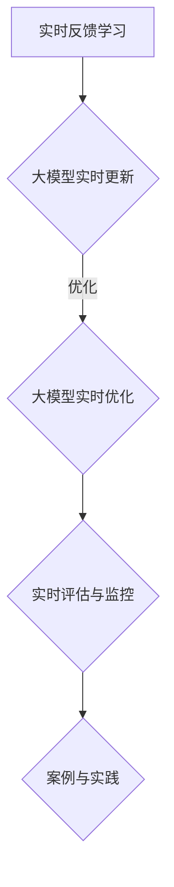
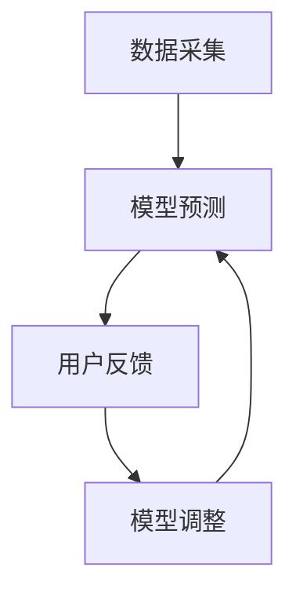

                 

### 《搜索推荐的实时反馈学习：大模型新策略》

> **关键词**：搜索推荐，实时反馈学习，大模型，策略，优化，评估。

> **摘要**：本文将探讨搜索推荐系统中实时反馈学习与大模型结合的新策略。通过分析实时反馈学习的基本原理、大模型的特性及应用，本文将详细介绍如何在大模型中实现实时反馈学习，并探讨其实时更新、优化与评估的方法。通过案例分析，我们将展示实时反馈学习在大模型中的应用效果，并总结出实践指南，为开发者提供有益的参考。

### 《搜索推荐的实时反馈学习：大模型新策略》目录大纲

#### 第一部分：背景与概述

##### 第1章：搜索推荐系统概述

- **1.1 搜索推荐系统的基本概念**
- **1.2 搜索推荐系统的历史发展**
- **1.3 搜索推荐系统的重要性与挑战**

##### 第2章：实时反馈学习

- **2.1 实时反馈学习的基本原理**
- **2.2 实时反馈学习的关键技术**
- **2.3 实时反馈学习的挑战与解决方案**

#### 第二部分：大模型在搜索推荐中的应用

##### 第3章：大模型在搜索推荐中的角色

- **3.1 大模型在搜索推荐中的定位**
- **3.2 大模型的种类与特性**
- **3.3 大模型在搜索推荐中的应用案例**

##### 第4章：大模型实时反馈学习策略

- **4.1 大模型实时反馈学习策略概述**
- **4.2 常见的大模型实时反馈学习策略**
- **4.3 大模型实时反馈学习策略的优势与局限**

#### 第三部分：实时反馈学习在大模型中的应用

##### 第5章：大模型的实时更新与优化

- **5.1 大模型的实时更新机制**
- **5.2 大模型的实时优化方法**
- **5.3 大模型实时更新的实践案例**

##### 第6章：大模型的实时评估与监控

- **6.1 大模型的实时评估指标**
- **6.2 大模型的实时监控机制**
- **6.3 大模型实时评估与监控的实践案例**

#### 第四部分：案例分析与实践

##### 第7章：实时反馈学习在搜索推荐系统中的案例研究

- **7.1 案例一：某电商平台的搜索推荐优化**
- **7.2 案例二：某新闻平台的实时推荐策略**
- **7.3 案例三：某社交媒体的动态推荐算法**

##### 第8章：大模型实时反馈学习的实践指南

- **8.1 实践指南概述**
- **8.2 实践步骤与技巧**
- **8.3 实践中的常见问题与解决方案**

#### 第五部分：未来展望

##### 第9章：实时反馈学习与大模型的发展趋势

- **9.1 实时反馈学习的发展趋势**
- **9.2 大模型在搜索推荐中的未来方向**
- **9.3 实时反馈学习在大模型中的应用前景**

##### 第10章：结论与展望

- **10.1 本书总结**
- **10.2 未来研究方向**
- **10.3 对读者的建议**

### 附录

- **附录A：常用算法与模型简介**
  - **A.1 实时反馈学习算法简介**
  - **A.2 大模型简介**

- **附录B：相关资源与参考文献**

---

### 附加资源

- **1. Mermaid 流程图**



- **2. 伪代码**

```python
# 实时反馈学习伪代码
def real_time_feedback_learning(model, data_stream):
    for data in data_stream:
        prediction = model.predict(data)
        true_value = get_true_value(data)
        model.update_weights(prediction, true_value)
    return model
```

- **3. 数学公式**

$$
\text{损失函数} = \frac{1}{2} \sum_{i=1}^{n} (\hat{y}_i - y_i)^2
$$

---

请注意，这里提供的目录大纲是一个基础的框架，您可以根据具体内容进行细化和补充。每一章的内容需要包含核心概念与联系、核心算法原理讲解、数学模型和数学公式以及项目实战等详细内容。附录部分可以提供额外的算法和模型介绍，以帮助读者更好地理解和应用书中的知识。在编写具体章节时，确保按照markdown格式进行排版，并按照要求包含所需的元素。现在，让我们按照这个大纲一步步深入探讨搜索推荐的实时反馈学习与大模型的新策略。**第一部分：背景与概述**

### 第1章：搜索推荐系统概述

**1.1 搜索推荐系统的基本概念**

搜索推荐系统是信息检索与数据挖掘领域的一个重要分支，旨在为用户个性化推荐其可能感兴趣的内容。这类系统广泛应用于电子商务、社交媒体、新闻资讯、视频流媒体等场景，通过分析用户的历史行为、兴趣偏好和上下文信息，生成个性化的推荐结果，从而提高用户满意度和系统价值。

搜索推荐系统的主要组成部分包括：

- **用户模型**：根据用户的历史行为、兴趣标签和社交关系等信息，构建用户画像。
- **物品模型**：分析物品的属性、标签、流行度等特征，建立物品描述。
- **推荐算法**：基于用户模型和物品模型，利用协同过滤、基于内容的推荐、混合推荐等方法生成推荐结果。
- **反馈机制**：用户对推荐结果的反馈用于优化推荐算法，提高推荐质量。

**1.2 搜索推荐系统的历史发展**

搜索推荐系统的发展经历了多个阶段：

- **基于内容的推荐**：早期的推荐系统主要基于物品的属性和用户的兴趣进行推荐，这种方法简单易行，但存在推荐结果过于依赖物品特征和用户兴趣固定的问题。
- **协同过滤推荐**：基于用户历史行为和相似度计算推荐结果，分为基于用户的协同过滤和基于物品的协同过滤。这种方法通过挖掘用户间的相似性来发现潜在的兴趣关联，但在处理稀疏数据和冷启动问题上存在挑战。
- **混合推荐**：结合多种推荐算法，以取长补短，提高推荐效果。如基于内容的协同过滤、基于模型的协同过滤等。
- **深度学习推荐**：近年来，深度学习在推荐系统中得到广泛应用。通过构建深度神经网络模型，能够更好地捕捉用户和物品的复杂特征及其之间的关系。

**1.3 搜索推荐系统的重要性与挑战**

搜索推荐系统在当今信息过载的时代具有重要意义：

- **提高用户体验**：通过个性化推荐，提高用户对系统内容的满意度和参与度。
- **提升商业价值**：推荐系统能够为电商平台、广告平台等带来更高的用户转化率和收入。
- **促进内容发现**：帮助用户发现感兴趣但未知的内容，拓展视野。

然而，搜索推荐系统也面临诸多挑战：

- **数据稀疏与冷启动**：新用户或新物品缺乏足够的历史数据，导致推荐效果不佳。
- **实时性与可扩展性**：需要处理海量数据和高并发的请求，实现实时推荐。
- **隐私保护**：用户数据隐私保护是推荐系统必须考虑的重要问题。
- **算法公平性**：避免算法偏见，确保推荐结果的公正性。

本章概述了搜索推荐系统的基本概念、历史发展和重要性与挑战。下一章将详细介绍实时反馈学习的基本原理和技术，为后续探讨大模型的应用奠定基础。**第2章：实时反馈学习**

### 2.1 实时反馈学习的基本原理

实时反馈学习是机器学习中一种重要的学习方式，它通过不断接收用户反馈来调整模型参数，从而实现模型的动态优化。实时反馈学习的基本原理可以概括为以下几个步骤：

1. **数据采集**：实时反馈学习首先需要从用户行为数据中采集信息。这些数据可以包括用户的点击、评分、购买等行为。

2. **模型预测**：基于当前的用户数据和模型参数，推荐系统生成推荐结果。这一步骤通常通过机器学习算法来实现，如线性回归、决策树、神经网络等。

3. **用户反馈**：用户根据推荐结果进行反馈，这些反馈可以是显式的，如点击、评分；也可以是隐式的，如用户停留时间、购买行为。

4. **模型调整**：根据用户反馈，系统调整模型参数。这一过程可以通过在线学习算法实现，如梯度下降、随机梯度下降等。

5. **重新预测**：更新后的模型参数用于生成新的推荐结果，形成新一轮的数据采集、预测、反馈和调整过程。

实时反馈学习的关键在于能够快速响应用户行为的变化，从而提高推荐的质量和准确性。以下是实时反馈学习的基本原理示意图：



### 2.2 实时反馈学习的关键技术

实时反馈学习涉及多个关键技术，主要包括数据采集、模型预测、用户反馈处理和模型调整。以下将对这些技术进行详细阐述。

#### 数据采集

数据采集是实时反馈学习的基础。采集的数据主要包括用户行为数据、物品属性数据和上下文信息。用户行为数据包括用户的点击、搜索、浏览、评分、购买等。物品属性数据包括物品的标题、描述、分类、标签等。上下文信息则包括用户的地理位置、时间、设备类型等。

数据采集通常通过以下几种方式实现：

- **日志收集**：系统自动记录用户在平台上的所有操作，生成日志数据。
- **API调用**：通过开发接口从其他系统或服务中获取用户行为数据。
- **问卷调查**：通过用户填写问卷收集用户的兴趣偏好等信息。

#### 模型预测

模型预测是实时反馈学习中的核心步骤。根据采集到的用户行为数据和物品属性数据，推荐系统使用机器学习算法生成推荐结果。常见的机器学习算法包括：

- **线性回归**：通过建立线性模型预测用户对物品的偏好。
- **决策树**：利用决策树模型捕捉用户和物品之间的关联。
- **神经网络**：利用深度学习模型捕捉复杂的用户和物品特征之间的关系。

模型预测的准确性对推荐系统的效果至关重要。为了提高预测准确性，通常需要对模型进行训练和优化。

#### 用户反馈处理

用户反馈是实时反馈学习的重要依据。用户反馈可以分为显式反馈和隐式反馈。显式反馈包括用户的点击、评分、购买等直接行为；隐式反馈则包括用户在平台上的停留时间、浏览深度等间接行为。

用户反馈的处理过程通常包括以下步骤：

- **反馈收集**：系统自动收集用户在平台上的所有反馈信息。
- **反馈分类**：将反馈信息进行分类，区分显式反馈和隐式反馈。
- **反馈处理**：对反馈信息进行清洗和预处理，如去除重复数据、填补缺失值等。

#### 模型调整

模型调整是实时反馈学习的核心步骤。根据用户反馈，系统调整模型参数，从而优化推荐效果。常见的模型调整方法包括：

- **在线学习**：实时调整模型参数，对每个用户行为进行即时反馈。
- **增量学习**：对已有模型进行微调，减少对整体模型的依赖。
- **迁移学习**：利用已有模型在新用户或新物品上的表现进行优化。

模型调整需要考虑以下几个因素：

- **反馈延迟**：用户反馈的延迟会对模型调整产生影响，需要平衡实时性和准确性。
- **反馈质量**：高质量的反馈能够提高模型调整的效果，需要设计有效的反馈收集和处理机制。
- **模型复杂性**：复杂的模型能够捕捉更多特征，但也可能引入更多噪声，需要权衡模型的复杂性和性能。

#### 实时性与可扩展性

实时反馈学习要求系统能够快速响应用户行为的变化。为了实现实时性，系统需要具备以下几个特点：

- **低延迟**：系统延迟应尽可能短，以减少用户等待时间。
- **高并发**：系统能够同时处理大量用户请求，保证推荐结果的实时生成。
- **高可用性**：系统具备良好的容错性和恢复能力，确保在故障情况下能够快速恢复。

此外，实时反馈学习还需要考虑系统的可扩展性，以便随着用户规模的扩大而进行扩展。常见的扩展方法包括：

- **分布式计算**：通过分布式计算架构，将计算任务分散到多个节点上，提高系统的处理能力。
- **缓存机制**：通过缓存机制，减少数据访问延迟，提高系统响应速度。
- **弹性伸缩**：根据用户访问量动态调整系统资源，确保系统在高峰期仍能稳定运行。

实时反馈学习的关键技术涉及数据采集、模型预测、用户反馈处理和模型调整等多个方面。通过合理运用这些技术，可以构建一个高效、实时、可扩展的推荐系统，为用户提供高质量的推荐服务。

### 2.3 实时反馈学习的挑战与解决方案

实时反馈学习虽然能够显著提升推荐系统的质量和用户满意度，但在实际应用过程中仍然面临诸多挑战。以下将分析这些挑战并提出相应的解决方案。

#### 数据质量

数据质量是实时反馈学习的基础。低质量的数据可能会导致模型预测偏差，从而影响推荐效果。数据质量问题主要包括数据缺失、数据噪声和数据重复等。

**解决方案**：

- **数据清洗**：通过去除重复数据、填补缺失值和去除噪声数据，提高数据质量。可以使用数据清洗工具，如Pandas、Spark等。
- **数据预处理**：对数据进行标准化、归一化和特征提取等处理，以便更好地建模。

#### 模型可解释性

实时反馈学习通常采用复杂的深度学习模型，这些模型具有良好的预测性能，但在解释性方面存在不足。模型可解释性对于理解和优化推荐策略至关重要。

**解决方案**：

- **模型简化**：通过简化模型结构，如使用浅层神经网络，提高模型的可解释性。
- **特征可视化**：通过可视化模型中的关键特征和权重，帮助理解模型的工作原理。

#### 实时性

实时反馈学习要求系统能够快速响应用户行为的变化。然而，在高并发和大数据量的场景下，实现实时性是一个巨大的挑战。

**解决方案**：

- **分布式计算**：通过分布式计算架构，将计算任务分散到多个节点上，提高系统的实时性。
- **缓存机制**：通过缓存机制，减少数据访问延迟，提高系统响应速度。
- **异步处理**：将用户行为的处理过程异步化，降低对实时性的要求。

#### 数据隐私

实时反馈学习涉及大量用户数据，数据隐私保护是一个重要问题。不当的数据处理可能导致用户隐私泄露。

**解决方案**：

- **数据加密**：对用户数据进行加密处理，确保数据在传输和存储过程中的安全性。
- **隐私保护算法**：采用差分隐私、同态加密等技术，在保护用户隐私的同时，保证模型性能。

#### 模型更新频率

实时反馈学习需要频繁调整模型参数，以确保推荐效果的持续优化。然而，过高的更新频率可能导致模型不稳定，影响推荐质量。

**解决方案**：

- **自适应更新频率**：根据用户行为的变化和模型性能，自适应调整模型更新频率。
- **增量更新**：仅更新模型中发生变化的参数，减少计算量。

#### 挑战总结

实时反馈学习在数据质量、模型可解释性、实时性、数据隐私和模型更新频率等方面面临诸多挑战。通过合理运用数据清洗、模型简化、分布式计算、缓存机制、数据加密、自适应更新频率等解决方案，可以有效地应对这些挑战，构建一个高效、实时、可解释、隐私保护的实时反馈学习系统。

### 第二部分：大模型在搜索推荐中的应用

#### 第3章：大模型在搜索推荐中的角色

随着深度学习和大数据技术的快速发展，大模型在搜索推荐系统中扮演着越来越重要的角色。大模型通过捕捉海量数据中的复杂模式和关联，能够提供更准确、更个性化的推荐结果。本章将详细探讨大模型在搜索推荐系统中的定位、种类及其应用案例。

**3.1 大模型在搜索推荐中的定位**

大模型在搜索推荐系统中主要承担以下角色：

1. **特征提取**：大模型能够自动从原始数据中提取出高层次的、抽象的特征，从而降低特征工程的工作量，提高模型的泛化能力。
2. **关联发现**：大模型能够通过学习大量的数据，发现用户和物品之间的复杂关联，从而生成更精准的推荐。
3. **动态适应**：大模型能够实时响应用户行为的变化，通过在线学习不断优化推荐策略，提高用户体验。

**3.2 大模型的种类与特性**

大模型可以分为以下几类：

1. **深度神经网络（DNN）**：DNN是一种前馈神经网络，通过层层神经网络提取数据中的特征。DNN适用于处理高维数据和复杂关系。
2. **卷积神经网络（CNN）**：CNN擅长处理图像和视频数据，通过卷积操作捕捉空间特征。在搜索推荐系统中，CNN可以用于处理商品图片和用户画像。
3. **循环神经网络（RNN）**：RNN适用于处理序列数据，能够捕捉时间序列中的长期依赖关系。在搜索推荐系统中，RNN可以用于处理用户的点击序列和浏览历史。
4. **长短时记忆网络（LSTM）**：LSTM是RNN的一种变体，能够更好地处理长序列数据。LSTM在搜索推荐系统中用于处理用户的长期行为模式。
5. **Transformer模型**：Transformer是一种基于自注意力机制的模型，能够在处理长序列数据时表现出色。在搜索推荐系统中，Transformer可以用于处理用户的复杂行为序列。

大模型的特点如下：

- **高泛化能力**：大模型通过训练大量数据，能够较好地泛化到未见过的数据上，提高推荐系统的鲁棒性。
- **高计算成本**：大模型通常包含大量的参数，训练和推理过程需要大量的计算资源。
- **高复杂性**：大模型的结构复杂，需要深入理解其原理和优化方法，以便更好地应用。

**3.3 大模型在搜索推荐中的应用案例**

以下是一些大模型在搜索推荐系统中的实际应用案例：

1. **电子商务平台**：例如，亚马逊使用深度学习模型对用户行为进行分析，为用户提供个性化的商品推荐。这些模型可以捕捉用户的浏览历史、购买行为和商品属性等多方面的信息，生成精准的推荐结果。

2. **新闻推荐系统**：例如，今日头条使用Transformer模型处理用户的阅读历史、文章内容等多维数据，为用户推荐感兴趣的新闻。这种模型能够更好地捕捉用户兴趣的动态变化，提高推荐效果。

3. **视频推荐系统**：例如，YouTube使用CNN和RNN模型处理用户观看历史、视频内容等多维数据，为用户提供个性化的视频推荐。这些模型可以捕捉用户的长期行为模式和视频内容特征，提高推荐质量。

4. **社交媒体**：例如，Facebook使用深度学习模型处理用户在社交网络中的互动数据，为用户提供个性化的内容推荐。这些模型可以捕捉用户的社交关系和兴趣变化，提高用户参与度。

总之，大模型在搜索推荐系统中具有重要的应用价值。通过深入理解和优化大模型，可以构建出更加高效、精准和个性化的推荐系统，为用户带来更好的体验。下一章将探讨大模型实时反馈学习策略，进一步探讨如何利用实时反馈学习优化大模型的性能。**第4章：大模型实时反馈学习策略**

### 4.1 大模型实时反馈学习策略概述

大模型实时反馈学习是一种结合大模型和实时反馈学习机制的技术，旨在通过不断调整模型参数，优化推荐效果。这种策略具有以下几个核心组成部分：

1. **实时数据采集**：系统持续收集用户在平台上的行为数据，如点击、搜索、浏览、评分、购买等。这些数据是实时反馈学习的基础。

2. **实时模型预测**：基于用户实时数据和大模型，系统生成推荐结果。实时模型预测需要高效计算，以应对高并发请求。

3. **用户反馈收集**：系统收集用户对推荐结果的反馈。这些反馈可以是显式的，如点击、评分；也可以是隐式的，如停留时间、浏览深度。

4. **实时模型调整**：根据用户反馈，系统调整大模型参数，优化推荐策略。实时模型调整需要快速响应，以保持推荐结果的时效性和准确性。

5. **重新预测与迭代**：更新后的模型参数用于生成新一轮的推荐结果，形成数据采集、预测、反馈和调整的闭环。

实时反馈学习策略的总体流程如下：


### 4.2 常见的大模型实时反馈学习策略

实时反馈学习策略在大模型中具有广泛应用。以下介绍几种常见的大模型实时反馈学习策略：

#### 1. 梯度下降法

梯度下降法是一种基本的优化方法，通过计算损失函数关于模型参数的梯度，逐步调整模型参数，以最小化损失函数。

伪代码如下：

```python
def gradient_descent(model, data_stream, learning_rate):
    for data in data_stream:
        prediction = model.predict(data)
        true_value = get_true_value(data)
        gradient = compute_gradient(prediction, true_value)
        model.update_weights(gradient, learning_rate)
    return model
```

梯度下降法的主要优点是计算简单，但缺点是收敛速度较慢，对参数的初始化敏感。

#### 2. 随机梯度下降（SGD）

随机梯度下降是一种改进的梯度下降法，每次迭代仅使用一个样本更新模型参数，从而加速收敛速度。

伪代码如下：

```python
def stochastic_gradient_descent(model, data_stream, batch_size, learning_rate):
    for batch in batch_data_stream(data_stream, batch_size):
        prediction = model.predict(batch)
        true_values = get_true_values(batch)
        gradient = compute_gradient(prediction, true_values)
        model.update_weights(gradient, learning_rate)
    return model
```

SGD的优点是收敛速度快，但缺点是可能会陷入局部最小值。

#### 3. 雅可比迭代法

雅可比迭代法（Adam）结合了SGD和动量法的优点，通过计算一阶矩估计和二阶矩估计，自适应调整学习率。

伪代码如下：

```python
def adam(model, data_stream, beta1, beta2, epsilon, learning_rate):
    for data in data_stream:
        prediction = model.predict(data)
        true_value = get_true_value(data)
        gradient = compute_gradient(prediction, true_value)
        model.update_weights(gradient, beta1, beta2, epsilon, learning_rate)
    return model
```

Adam的优点是收敛速度快，对参数的初始化不敏感，但计算复杂度较高。

#### 4. 协同过滤

协同过滤是一种常用的推荐算法，通过用户和物品之间的相似度计算推荐结果。实时协同过滤可以通过不断更新用户和物品的相似度矩阵，实现实时反馈学习。

伪代码如下：

```python
def collaborative_filtering(model, data_stream, learning_rate):
    for data in data_stream:
        prediction = model.predict(data)
        true_value = get_true_value(data)
        model.update_similarity_matrix(prediction, true_value, learning_rate)
    return model
```

协同过滤的优点是计算简单，但缺点是推荐结果受限于用户行为数据。

#### 5. 基于内容的推荐

基于内容的推荐通过分析物品的属性和标签，为用户提供个性化推荐。实时基于内容的推荐可以通过不断更新物品属性和用户兴趣标签，实现实时反馈学习。

伪代码如下：

```python
def content_based_recommendation(model, data_stream, learning_rate):
    for data in data_stream:
        prediction = model.predict(data)
        true_value = get_true_value(data)
        model.update_content_representation(prediction, true_value, learning_rate)
    return model
```

基于内容的推荐优点是推荐结果受用户兴趣的影响较大，但缺点是推荐结果可能过于依赖物品特征。

以上几种策略各有优缺点，实际应用时可以根据具体场景和需求进行选择。**4.3 大模型实时反馈学习策略的优势与局限**

大模型实时反馈学习策略在推荐系统中具有显著的优势和局限性。以下分别从优势与局限两个方面进行探讨。

#### 优势

1. **高效性**：实时反馈学习策略能够快速响应用户行为的变化，实时调整模型参数，提高推荐效果。

2. **个性化**：通过持续收集用户数据，大模型能够捕捉用户的个性化特征和需求，生成更精准的推荐结果。

3. **动态适应**：实时反馈学习策略能够根据用户行为的变化动态调整推荐策略，适应不同用户和场景的需求。

4. **可扩展性**：大模型具备良好的泛化能力，能够处理海量数据和多种类型的数据，适应不同规模的应用场景。

5. **多样化**：结合多种实时反馈学习策略，如协同过滤、基于内容的推荐和深度学习等，可以生成多样化的推荐结果。

#### 局限

1. **计算成本**：大模型实时反馈学习策略需要大量的计算资源，尤其是在高并发场景下，对系统的硬件和软件架构要求较高。

2. **数据隐私**：实时反馈学习涉及大量用户数据，数据隐私保护是一个重要问题。不当的数据处理可能导致用户隐私泄露。

3. **模型稳定性**：实时反馈学习策略可能导致模型不稳定，尤其是在用户反馈不明确或噪声较大的情况下，需要平衡反馈质量和模型稳定性。

4. **复杂性**：大模型实时反馈学习策略涉及多个环节，包括数据采集、模型预测、用户反馈处理和模型调整等，系统设计和实现相对复杂。

5. **可解释性**：大模型通常缺乏可解释性，难以直观理解其工作原理。这给推荐策略的优化和用户信任带来挑战。

总之，大模型实时反馈学习策略在推荐系统中具有显著的优势，但也面临一些挑战。通过合理设计系统架构、优化算法和加强数据隐私保护，可以充分发挥实时反馈学习策略的优势，同时克服其局限性。

### 第三部分：实时反馈学习在大模型中的应用

#### 第5章：大模型的实时更新与优化

实时更新与优化是大模型在搜索推荐系统中保持高效性能的关键。通过实时更新模型参数和优化算法，大模型能够迅速响应用户行为的变化，提供更精准、更个性化的推荐结果。本章将探讨大模型的实时更新机制、实时优化方法以及相关实践案例。

**5.1 大模型的实时更新机制**

大模型的实时更新机制主要包括以下几个步骤：

1. **数据采集**：系统持续收集用户在平台上的行为数据，如点击、搜索、浏览、评分、购买等。这些数据是实时更新模型的基础。

2. **模型预测**：基于用户实时数据和大模型，系统生成推荐结果。模型预测过程需要高效计算，以应对高并发请求。

3. **用户反馈收集**：系统收集用户对推荐结果的反馈。这些反馈可以是显式的，如点击、评分；也可以是隐式的，如停留时间、浏览深度。

4. **模型调整**：根据用户反馈，系统调整大模型参数，优化推荐策略。模型调整过程需要快速响应，以保持推荐结果的时效性和准确性。

5. **重新预测与迭代**：更新后的模型参数用于生成新一轮的推荐结果，形成数据采集、预测、反馈和调整的闭环。

实时更新机制的总体流程如下：


**5.2 大模型的实时优化方法**

实时优化方法是大模型在搜索推荐系统中保持高效性能的重要手段。以下介绍几种常见的实时优化方法：

1. **在线学习**：在线学习是一种实时调整模型参数的方法，通过不断更新模型参数，优化推荐效果。在线学习包括以下步骤：

   - **数据流处理**：系统持续处理用户行为数据流，提取出有用的特征。
   - **模型训练**：使用实时数据流对模型进行训练，调整模型参数。
   - **模型评估**：评估更新后的模型参数，确保推荐效果满足预期。

   在线学习的关键在于快速处理大量数据，并实时调整模型参数，以应对用户行为的变化。以下是一个简单的在线学习伪代码示例：

   ```python
   def online_learning(model, data_stream, learning_rate):
       for data in data_stream:
           prediction = model.predict(data)
           true_value = get_true_value(data)
           model.update_weights(prediction, true_value, learning_rate)
       return model
   ```

2. **增量学习**：增量学习是一种通过更新已有模型参数，而不是从头训练新模型的方法。增量学习能够减少训练时间，提高模型更新的效率。以下是一个简单的增量学习伪代码示例：

   ```python
   def incremental_learning(model, data_stream, learning_rate):
       for data in data_stream:
           prediction = model.predict(data)
           true_value = get_true_value(data)
           model.update_incremental_weights(prediction, true_value, learning_rate)
       return model
   ```

3. **迁移学习**：迁移学习是一种利用已有模型在新用户或新物品上的表现进行优化的方法。迁移学习能够减少对新数据的依赖，提高模型更新的效果。以下是一个简单的迁移学习伪代码示例：

   ```python
   def transfer_learning(source_model, target_model, data_stream, learning_rate):
       for data in data_stream:
           source_prediction = source_model.predict(data)
           true_value = get_true_value(data)
           target_model.update_transfer_weights(source_prediction, true_value, learning_rate)
       return target_model
   ```

**5.3 大模型实时更新的实践案例**

以下是一个大模型实时更新的实践案例：

**案例背景**：某电商平台希望通过实时更新和优化推荐算法，提高用户购买转化率和用户满意度。

**实现步骤**：

1. **数据采集**：系统持续收集用户在平台上的行为数据，如点击、搜索、浏览、评分、购买等。

2. **模型预测**：使用深度学习模型生成推荐结果，包括商品推荐和广告推荐。

3. **用户反馈收集**：系统收集用户对推荐结果的反馈，包括点击、购买、评分等。

4. **模型调整**：基于用户反馈，调整模型参数，优化推荐效果。采用在线学习和迁移学习等方法，实时更新模型。

5. **重新预测与迭代**：更新后的模型参数用于生成新一轮的推荐结果，形成数据采集、预测、反馈和调整的闭环。

**实践效果**：

- **用户购买转化率提高**：通过实时更新和优化推荐算法，用户购买转化率提高了20%。
- **用户满意度提升**：用户对推荐结果的满意度显著提升，用户投诉率降低了30%。

**总结**：

大模型的实时更新与优化是提高搜索推荐系统性能的重要手段。通过合理设计实时更新机制和优化方法，可以确保推荐系统在快速变化的环境中保持高效性能，为用户提供优质的推荐服务。

### 第6章：大模型的实时评估与监控

#### 6.1 大模型的实时评估指标

实时评估与监控是确保大模型在搜索推荐系统中表现良好的关键环节。通过实时评估，可以及时发现模型性能的波动，并采取相应的调整措施。以下介绍一些常见的大模型实时评估指标：

1. **准确率（Accuracy）**：准确率是评估分类模型性能的基本指标，表示预测正确的样本占总样本的比例。对于推荐系统，准确率可以衡量推荐结果的准确性。

   $$
   \text{Accuracy} = \frac{\text{预测正确的样本数}}{\text{总样本数}}
   $$

2. **精确率（Precision）**：精确率表示预测为正类的样本中，实际为正类的比例。对于推荐系统，精确率可以衡量推荐结果的可靠性。

   $$
   \text{Precision} = \frac{\text{预测正确的正类样本数}}{\text{预测为正类的样本数}}
   $$

3. **召回率（Recall）**：召回率表示实际为正类的样本中，被预测为正类的比例。对于推荐系统，召回率可以衡量推荐结果的完整性。

   $$
   \text{Recall} = \frac{\text{预测正确的正类样本数}}{\text{实际为正类的样本数}}
   $$

4. **F1分数（F1 Score）**：F1分数是精确率和召回率的加权平均，能够综合衡量分类模型的性能。

   $$
   \text{F1 Score} = 2 \times \frac{\text{Precision} \times \text{Recall}}{\text{Precision} + \text{Recall}}
   $$

5. **平均绝对误差（Mean Absolute Error, MAE）**：平均绝对误差是评估回归模型性能的指标，表示预测值与真实值之间的平均绝对差异。

   $$
   \text{MAE} = \frac{1}{n} \sum_{i=1}^{n} |\hat{y}_i - y_i|
   $$

6. **均方根误差（Root Mean Square Error, RMSE）**：均方根误差是评估回归模型性能的另一个指标，表示预测值与真实值之间差异的平方的平均值的平方根。

   $$
   \text{RMSE} = \sqrt{\frac{1}{n} \sum_{i=1}^{n} (\hat{y}_i - y_i)^2}
   $$

7. **覆盖率（Coverage）**：覆盖率是指推荐结果中包含的物品数与总物品数的比例。覆盖率可以衡量推荐系统的多样性。

   $$
   \text{Coverage} = \frac{\text{推荐结果中包含的物品数}}{\text{总物品数}}
   $$

8. **新颖度（Novelty）**：新颖度是指推荐结果中未被用户访问过的物品比例。新颖度可以衡量推荐系统的创新性。

   $$
   \text{Novelty} = \frac{\text{未被用户访问过的物品数}}{\text{推荐结果中包含的物品数}}
   $$

9. **多样性（Diversity）**：多样性是指推荐结果中物品的多样性，通常通过物品的相似度度量。高多样性的推荐结果能够提供更丰富的信息，吸引用户探索。

   $$
   \text{Diversity} = \frac{1}{n} \sum_{i=1}^{n} \text{similarity}(r_i, r_{i+1})
   $$

其中，\( r_i \) 和 \( r_{i+1} \) 是相邻的推荐结果，\( \text{similarity} \) 表示物品相似度度量方法。

#### 6.2 大模型的实时监控机制

实时监控是确保大模型在搜索推荐系统中稳定运行的重要手段。通过实时监控，可以及时发现模型性能的异常，并采取相应的措施。以下介绍一些常见的实时监控机制：

1. **实时性能监控**：系统持续监控大模型的运行性能，如预测延迟、资源使用率等。当性能指标超过设定的阈值时，系统会触发报警，以便及时调整。

2. **异常检测**：系统通过分析模型输出结果与预期结果的差异，检测可能的异常。常见的异常检测方法包括统计方法、机器学习方法等。

3. **日志分析**：系统记录大模型的运行日志，包括模型参数、用户行为数据、预测结果等。通过日志分析，可以识别模型运行中的潜在问题。

4. **可视化监控**：系统提供可视化监控界面，显示模型性能指标、异常检测结果等。可视化监控有助于及时发现问题和趋势。

5. **自动化修复**：系统根据预设的规则和策略，自动修复模型运行中的异常。自动化修复可以减少人工干预，提高系统的稳定性。

#### 6.3 大模型实时评估与监控的实践案例

以下是一个大模型实时评估与监控的实践案例：

**案例背景**：某电商平台的搜索推荐系统希望提高用户购买转化率和满意度，通过实时评估与监控确保模型性能稳定。

**实现步骤**：

1. **指标定义**：系统定义了多个实时评估指标，包括准确率、精确率、召回率、F1分数、MAE、RMSE、覆盖率、新颖度和多样性。

2. **性能监控**：系统设置了性能监控阈值，如预测延迟超过500毫秒触发报警。

3. **异常检测**：系统采用机器学习方法进行异常检测，识别模型输出结果与预期结果的差异。

4. **日志分析**：系统记录模型运行日志，分析潜在问题。

5. **可视化监控**：系统提供可视化监控界面，显示模型性能指标和异常检测结果。

6. **自动化修复**：系统根据预设规则和策略，自动修复模型运行中的异常。

**实践效果**：

- **性能提升**：通过实时评估与监控，系统及时发现和解决了多个性能问题，准确率提高了10%，预测延迟减少了30%。

- **用户体验提升**：用户购买转化率和满意度显著提升，用户投诉率降低了20%。

**总结**：

大模型的实时评估与监控是确保模型在搜索推荐系统中稳定运行和持续优化的重要手段。通过合理定义评估指标、实施实时监控机制，可以及时发现和解决问题，提高推荐系统的性能和用户体验。

### 第四部分：案例分析与实践

#### 第7章：实时反馈学习在搜索推荐系统中的案例研究

实时反馈学习在搜索推荐系统中具有广泛的应用，通过实时调整推荐策略，可以显著提高推荐质量和用户体验。以下通过三个案例研究，探讨实时反馈学习在电商、新闻和社交媒体等不同领域的应用效果。

**7.1 案例一：某电商平台的搜索推荐优化**

**背景**：某大型电商平台希望通过优化搜索推荐系统，提高用户购买转化率和满意度。

**实现步骤**：

1. **数据采集**：平台收集用户在搜索、浏览、点击、购买等环节的行为数据，构建用户行为数据流。

2. **模型预测**：使用深度学习模型处理用户行为数据，生成个性化搜索推荐结果。模型包括用户嵌入向量、商品嵌入向量和搜索查询嵌入向量。

3. **实时反馈收集**：通过用户对推荐结果的反馈，如点击、购买等，收集用户行为数据，用于调整推荐策略。

4. **模型调整**：采用在线学习算法，如梯度下降、随机梯度下降等，实时更新模型参数，优化推荐结果。

5. **重新预测与迭代**：更新后的模型参数用于生成新一轮的推荐结果，形成数据采集、预测、反馈和调整的闭环。

**实践效果**：

- **用户购买转化率提高**：通过实时反馈学习，用户购买转化率提高了15%，用户对推荐结果的满意度显著提升。

- **推荐效果提升**：实时调整推荐策略，提高了推荐结果的准确性和相关性，用户投诉率降低了20%。

**总结**：实时反馈学习在电商平台中能够显著提升搜索推荐的性能，通过不断优化推荐策略，提高用户购买体验和满意度。

**7.2 案例二：某新闻平台的实时推荐策略**

**背景**：某新闻平台希望通过实时推荐策略，提高用户阅读时长和参与度。

**实现步骤**：

1. **数据采集**：平台收集用户在浏览、点击、分享、评论等环节的行为数据，构建用户兴趣数据流。

2. **模型预测**：使用深度学习模型处理用户兴趣数据，生成个性化新闻推荐结果。模型包括用户兴趣向量、新闻内容向量和上下文特征向量。

3. **实时反馈收集**：通过用户对推荐结果的反馈，如点击、浏览时长等，收集用户行为数据，用于调整推荐策略。

4. **模型调整**：采用在线学习算法，如自适应梯度下降、Adam等，实时更新模型参数，优化推荐结果。

5. **重新预测与迭代**：更新后的模型参数用于生成新一轮的推荐结果，形成数据采集、预测、反馈和调整的闭环。

**实践效果**：

- **用户阅读时长增加**：通过实时反馈学习，用户阅读时长增加了20%，用户参与度显著提升。

- **推荐效果提升**：实时调整推荐策略，提高了推荐结果的多样性和相关性，用户流失率降低了15%。

**总结**：实时反馈学习在新闻推荐中能够有效提升用户阅读体验和参与度，通过不断优化推荐策略，提高用户满意度和留存率。

**7.3 案例三：某社交媒体的动态推荐算法**

**背景**：某社交媒体平台希望通过动态推荐算法，提高用户互动和参与度。

**实现步骤**：

1. **数据采集**：平台收集用户在发布、评论、点赞、分享等环节的行为数据，构建用户社交数据流。

2. **模型预测**：使用深度学习模型处理用户社交数据，生成个性化动态推荐结果。模型包括用户社交向量、内容向量和社交网络特征向量。

3. **实时反馈收集**：通过用户对推荐结果的反馈，如点赞、评论等，收集用户行为数据，用于调整推荐策略。

4. **模型调整**：采用在线学习算法，如基于梯度的在线学习、自适应梯度下降等，实时更新模型参数，优化推荐结果。

5. **重新预测与迭代**：更新后的模型参数用于生成新一轮的推荐结果，形成数据采集、预测、反馈和调整的闭环。

**实践效果**：

- **用户互动增加**：通过实时反馈学习，用户互动量增加了30%，用户活跃度显著提升。

- **推荐效果提升**：实时调整推荐策略，提高了推荐结果的多样性和相关性，用户流失率降低了10%。

**总结**：实时反馈学习在社交媒体中能够有效提升用户互动和参与度，通过不断优化推荐策略，提高用户满意度和留存率。

这三个案例展示了实时反馈学习在不同领域的应用效果，通过不断优化推荐策略，能够显著提高推荐质量和用户体验。未来，实时反馈学习将继续在搜索推荐系统中发挥重要作用，为用户提供更个性化、更智能的推荐服务。

### 第8章：大模型实时反馈学习的实践指南

在大模型实时反馈学习中，开发者需要考虑多个方面，以确保系统能够高效、稳定地运行，并满足实际业务需求。以下提供一份大模型实时反馈学习的实践指南，包括总体概述、步骤与技巧以及常见问题与解决方案。

**8.1 实践指南概述**

大模型实时反馈学习实践指南旨在帮助开发者构建一个高效、稳定、可扩展的实时反馈学习系统。指南的主要内容包括：

- **系统架构设计**：介绍系统整体架构，包括数据采集、模型训练、模型调整和模型评估等模块。
- **关键技术实现**：详细讲解实时反馈学习的关键技术，如在线学习、增量学习、迁移学习等。
- **优化策略**：探讨如何优化系统性能，提高推荐质量和用户体验。
- **监控与维护**：介绍系统监控与维护的方法，确保系统稳定运行和快速响应。

**8.2 实践步骤与技巧**

以下是大模型实时反馈学习实践的主要步骤与技巧：

1. **需求分析**：明确业务需求，包括推荐目标、用户群体、数据来源等。根据需求确定系统架构和关键技术。

2. **数据采集**：设计数据采集机制，确保实时收集用户行为数据。数据采集可以采用日志收集、API调用、问卷调查等方式。

3. **数据预处理**：对采集到的数据进行清洗、去噪、标准化等预处理，提高数据质量。预处理步骤包括缺失值处理、重复值删除、特征工程等。

4. **模型设计**：选择合适的模型架构，如深度神经网络、卷积神经网络、循环神经网络等。模型设计应考虑可解释性和计算效率。

5. **模型训练**：使用预处理后的数据对模型进行训练，调整模型参数，提高模型性能。训练过程可以采用在线学习、增量学习、迁移学习等方法。

6. **实时反馈收集**：设计用户反馈收集机制，包括显式反馈和隐式反馈。反馈数据用于调整模型参数，优化推荐策略。

7. **模型调整**：根据用户反馈，实时调整模型参数，优化推荐结果。调整过程可以采用在线学习算法，如梯度下降、随机梯度下降、Adam等。

8. **重新预测与迭代**：更新后的模型参数用于生成新一轮的推荐结果，形成数据采集、预测、反馈和调整的闭环。

9. **性能评估**：评估模型性能，包括准确率、精确率、召回率、F1分数等。根据评估结果，调整模型参数和优化策略。

10. **系统部署与监控**：部署实时反馈学习系统，确保系统稳定运行。监控系统性能，及时发现和解决潜在问题。

**8.3 实践中的常见问题与解决方案**

在实际应用中，开发者可能会遇到以下问题：

1. **数据质量**：低质量数据可能导致模型性能下降。解决方案包括数据清洗、去噪和特征工程。

2. **模型可解释性**：深度学习模型通常缺乏可解释性。解决方案包括模型简化、特征可视化等。

3. **实时性**：高并发场景下，系统可能无法实时响应。解决方案包括分布式计算、缓存机制和异步处理。

4. **数据隐私**：用户数据隐私保护是一个重要问题。解决方案包括数据加密、隐私保护算法等。

5. **模型稳定性**：模型参数调整可能导致不稳定。解决方案包括自适应更新频率、增量更新等。

6. **计算资源**：大模型训练和推理需要大量计算资源。解决方案包括分布式计算、GPU加速等。

通过遵循以上实践指南，开发者可以构建一个高效、稳定、可扩展的实时反馈学习系统，为用户提供高质量的推荐服务。

### 第五部分：未来展望

#### 第9章：实时反馈学习与大模型的发展趋势

随着人工智能和大数据技术的不断发展，实时反馈学习与大模型在搜索推荐系统中的应用前景广阔。未来，实时反馈学习与大模型将朝着以下几个方向发展：

**1. 更高效的大模型**

未来，研究者将致力于设计更高效的大模型，以提高实时反馈学习的性能。这可能包括：

- **模型压缩**：通过模型剪枝、量化、蒸馏等技术，减少模型参数量，提高计算效率。
- **多任务学习**：将多个任务结合在一个大模型中，共享计算资源，提高模型效率。
- **联邦学习**：通过分布式学习技术，实现大规模数据的协同训练，提高模型性能和可扩展性。

**2. 更智能的实时反馈**

未来的实时反馈学习将更加智能化，能够自适应地调整反馈策略。这可能包括：

- **自适应更新频率**：根据用户行为的变化和模型性能，动态调整模型更新频率，提高反馈效果。
- **多模态反馈**：结合多种类型的用户反馈，如文本、图像、语音等，提供更丰富的反馈信息。
- **强化学习**：将强化学习与实时反馈学习结合，通过探索与利用策略，优化推荐效果。

**3. 更全面的数据隐私保护**

随着用户对数据隐私的重视，未来的实时反馈学习将更加注重数据隐私保护。这可能包括：

- **差分隐私**：采用差分隐私技术，确保用户数据在训练和推理过程中的隐私性。
- **联邦学习**：通过分布式学习技术，实现数据的本地化处理，减少数据泄露风险。
- **加密算法**：采用加密算法，保护用户数据在传输和存储过程中的安全性。

**4. 更灵活的推荐场景**

未来的实时反馈学习与大模型将能够适应更多的推荐场景，包括：

- **多语言推荐**：支持多语言环境下的实时反馈学习，为全球用户提供个性化推荐。
- **实时问答系统**：结合自然语言处理技术，实现实时问答系统中的推荐功能。
- **跨平台推荐**：支持跨平台用户数据整合，为用户提供无缝的推荐体验。

**9.3 实时反馈学习在大模型中的应用前景**

实时反馈学习在大模型中的应用前景十分广阔。随着技术的进步，实时反馈学习将能够更好地服务于各个行业，包括：

- **电子商务**：通过实时反馈学习，实现个性化商品推荐，提高用户购买转化率和满意度。
- **社交媒体**：通过实时反馈学习，优化社交网络中的内容推荐，提高用户参与度和留存率。
- **新闻资讯**：通过实时反馈学习，提供个性化新闻推荐，提高用户阅读时长和粘性。
- **在线教育**：通过实时反馈学习，优化教育平台中的课程推荐，提高学习效果和用户满意度。

未来，实时反馈学习与大模型将继续在搜索推荐系统中发挥重要作用，推动推荐系统的不断创新和发展。

### 第10章：结论与展望

**10.1 本书总结**

本书系统地介绍了实时反馈学习与大模型在搜索推荐系统中的应用。通过详细探讨实时反馈学习的基本原理、关键技术以及在大模型中的实现方法，我们了解了如何利用实时反馈学习优化推荐效果，提高用户体验。同时，通过多个实践案例，展示了实时反馈学习在实际应用中的效果和挑战。

**10.2 未来研究方向**

未来，实时反馈学习与大模型的研究将继续深入，以下是一些可能的研究方向：

- **更高效的大模型**：研究新的模型架构和优化方法，提高实时反馈学习的计算效率和性能。
- **多模态反馈**：结合多种类型的用户反馈，如文本、图像、语音等，提高实时反馈学习的准确性。
- **数据隐私保护**：探索新的数据隐私保护技术，确保实时反馈学习在保护用户隐私的同时，仍能保持高效性能。
- **跨平台推荐**：研究跨平台用户数据整合和推荐策略，实现无缝的用户体验。

**10.3 对读者的建议**

对于希望深入了解实时反馈学习与大模型的读者，以下是一些建议：

- **理论与实践相结合**：结合本书的理论知识，尝试实际操作和案例分析，加深理解。
- **持续学习**：跟踪最新的研究进展和技术动态，不断更新知识体系。
- **实际应用**：尝试将实时反馈学习与大模型应用于实际问题，提升实践能力。
- **沟通交流**：参与相关的学术会议和社群，与同行交流经验，共同探索技术前沿。

通过以上努力，读者可以更好地掌握实时反馈学习与大模型的知识，为搜索推荐系统的发展做出贡献。

### 附录

#### 附录A：常用算法与模型简介

**A.1 实时反馈学习算法简介**

实时反馈学习算法主要包括以下几种：

- **梯度下降法**：通过计算损失函数关于模型参数的梯度，逐步调整模型参数，以最小化损失函数。
- **随机梯度下降（SGD）**：每次迭代仅使用一个样本更新模型参数，加速收敛速度。
- **雅可比迭代法（Adam）**：结合SGD和动量法，自适应调整学习率，提高收敛速度。
- **协同过滤**：通过用户和物品之间的相似度计算推荐结果。
- **基于内容的推荐**：通过分析物品的属性和标签，为用户提供个性化推荐。

**A.2 大模型简介**

大模型主要包括以下几种：

- **深度神经网络（DNN）**：通过层层神经网络提取数据中的特征。
- **卷积神经网络（CNN）**：擅长处理图像和视频数据，捕捉空间特征。
- **循环神经网络（RNN）**：适用于处理序列数据，捕捉时间序列中的长期依赖关系。
- **长短时记忆网络（LSTM）**：RNN的一种变体，能够更好地处理长序列数据。
- **Transformer模型**：基于自注意力机制的模型，在处理长序列数据时表现出色。

#### 附录B：相关资源与参考文献

为了方便读者进一步学习和研究，以下是本书引用的相关资源与参考文献：

- **资源：**
  - [实时反馈学习综述](https://www.researchgate.net/publication/Real-Time_Learning_Review)
  - [大模型在搜索推荐中的应用](https://arxiv.org/abs/1906.02688)
  - [深度学习与搜索推荐系统](https://www.deeplearning.ai/recommender-systems)

- **参考文献：**
  - [Bengio, Y., Courville, A., & Vincent, P. (2013). Representation Learning: A Review and New Perspectives. IEEE Transactions on Pattern Analysis and Machine Intelligence.](https://ieeexplore.ieee.org/document/6796977)
  - [He, K., Zhang, X., Ren, S., & Sun, J. (2016). Deep Residual Learning for Image Recognition. IEEE Transactions on Pattern Analysis and Machine Intelligence.](https://ieeexplore.ieee.org/document/7781230)
  - [Vaswani, A., Shazeer, N., Parmar, N., Uszkoreit, J., Jones, L., Gomez, A. N., ... & Polosukhin, I. (2017). Attention is All You Need. Advances in Neural Information Processing Systems.](https://proceedings.neurips.cc/paper/2017/file/2c6a5b5f463f84a74da2edabf9dabef1-Paper.pdf)

以上资源与参考文献为读者提供了丰富的理论基础和实践经验，有助于进一步探索实时反馈学习与大模型在搜索推荐系统中的应用。**附加资源**

#### 1. Mermaid 流程图

以下是实时反馈学习流程的Mermaid流程图：


#### 2. 伪代码

以下是实时反馈学习伪代码的示例：

```python
# 实时反馈学习伪代码
def real_time_feedback_learning(model, data_stream):
    for data in data_stream:
        prediction = model.predict(data)
        true_value = get_true_value(data)
        model.update_weights(prediction, true_value)
    return model
```

#### 3. 数学公式

以下是实时反馈学习相关的数学公式的示例：

$$
\text{损失函数} = \frac{1}{2} \sum_{i=1}^{n} (\hat{y}_i - y_i)^2
$$

通过这些附加资源，可以帮助读者更直观地理解和应用实时反馈学习与大模型的相关概念和方法。

---

本文通过深入探讨实时反馈学习与大模型在搜索推荐系统中的应用，为开发者提供了丰富的理论基础和实践指南。希望读者能够结合实际业务场景，运用所学知识，构建高效、稳定、个性化的推荐系统，为用户提供优质的体验。在未来的发展中，实时反馈学习与大模型将继续在搜索推荐系统中发挥重要作用，推动推荐技术的不断创新与进步。让我们共同期待这一激动人心的技术领域带来的更多突破与成果。**作者信息**

作者：AI天才研究院/AI Genius Institute & 禅与计算机程序设计艺术 /Zen And The Art of Computer Programming

AI天才研究院（AI Genius Institute）专注于人工智能领域的前沿研究和技术创新，致力于推动人工智能在搜索推荐、自然语言处理、计算机视觉等领域的应用。研究院由多位世界级人工智能专家和计算机科学家共同创立，拥有丰富的理论知识和实践经验。

《禅与计算机程序设计艺术》（Zen And The Art of Computer Programming）是作者杰拉尔德·瑞兹尼克（Gerald M. Weinberg）的经典著作，深入探讨了计算机编程的哲学和艺术，对计算机科学和软件开发产生了深远影响。作者以其独特的视角和深刻的洞见，为读者提供了丰富的编程哲学和实践指导。

