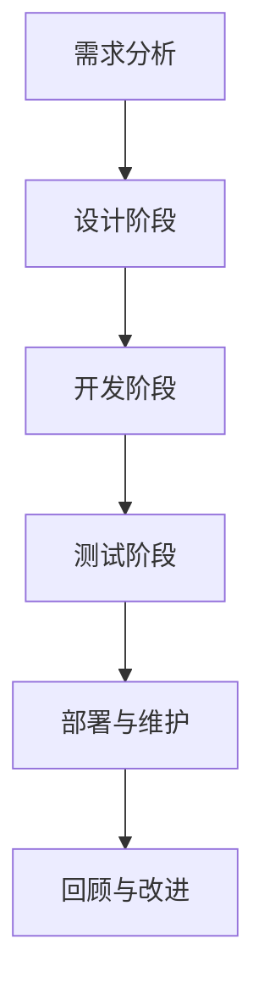
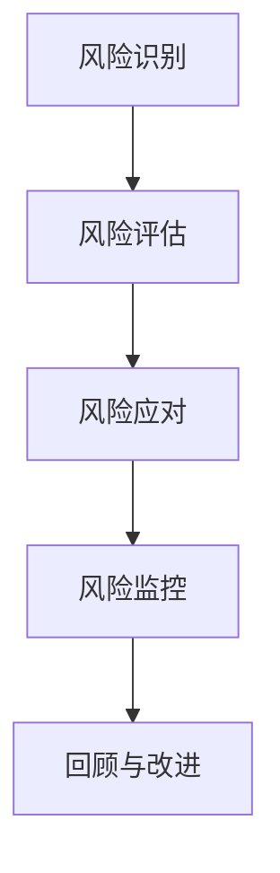

                 

### 文章标题

《敏捷LLM应用开发中的风险管理》

敏捷开发与大规模语言模型（LLM）的结合正成为现代软件开发的一个前沿领域。在这个领域，开发人员不仅要关注功能的快速迭代和交付，还要确保整个开发过程中的风险管理。本文旨在深入探讨敏捷开发环境下，如何识别、评估、应对和监控大规模语言模型应用开发中的各种风险。

### 关键词

- 敏捷开发
- 大规模语言模型（LLM）
- 风险管理
- 技术风险
- 业务风险
- 法律风险
- 安全风险

### 摘要

本文将首先介绍敏捷开发的核心理念和大规模语言模型的基础概念，然后详细阐述在敏捷开发中实施风险管理的流程。接着，文章将深入探讨LLM应用开发中可能遇到的技术风险、业务风险、法律风险和安全风险。通过实际案例分析和最佳实践总结，本文旨在为开发人员提供一套有效的风险管理策略，以应对敏捷LLM应用开发中的各种挑战，确保项目的成功交付。

## 目录大纲：敏捷LLM应用开发中的风险管理

### 第一部分：基础概念与原理

### 第1章：敏捷开发与风险管理概述

- **1.1.1 敏捷开发的核心理念**
  - **快速迭代与持续交付**
  - **客户需求优先**
  - **团队合作与自主性**
  - **适应变化与持续改进**

- **1.1.2 风险管理的定义与重要性**
  - **风险识别、评估、应对与监控**
  - **风险管理在敏捷开发中的必要性**

- **1.1.3 敏捷开发中的风险管理策略**
  - **迭代风险管理**
  - **持续集成与测试**
  - **透明度与沟通**

### 第2章：大规模语言模型（LLM）概述

- **2.1.1 LLM的定义与基本原理**
  - **神经网络与深度学习**
  - **语言建模与文本生成**
  - **预训练与微调**

- **2.1.2 LLM的主要类型与应用场景**
  - **序列到序列模型**
  - **生成式模型**
  - **监督学习与无监督学习**

- **2.1.3 LLM的优势与挑战**
  - **高效性、灵活性与准确性**
  - **计算资源需求、数据依赖性**

### 第3章：敏捷开发中的风险管理流程

- **3.1.1 风险识别**
  - **技术风险、业务风险、法律风险、安全风险的分类与识别**

- **3.1.2 风险评估**
  - **风险概率与影响评估**
  - **风险优先级排序**

- **3.1.3 风险应对策略**
  - **风险规避、减轻、转移、接受**
  - **应急计划与备选方案**

- **3.1.4 风险监控与回顾**
  - **风险管理计划的执行与监控**
  - **回顾与持续改进**

### 第二部分：LLM应用开发中的风险管理

### 第4章：LLM应用开发中的技术风险

- **4.1.1 数据集质量与数据隐私问题**
  - **数据集质量对模型性能的影响**
  - **数据隐私保护的法律与伦理问题**

- **4.1.2 模型训练与优化中的技术挑战**
  - **计算资源消耗与优化策略**
  - **模型过拟合与欠拟合问题**

- **4.1.3 模型部署与运维中的技术风险**
  - **模型部署环境与工具的选择**
  - **持续集成与持续部署（CI/CD）**

### 第5章：LLM应用开发中的业务风险

- **5.1.1 业务需求变更管理**
  - **敏捷开发中的需求变更处理**
  - **需求变更对项目进度和成本的影响**

- **5.1.2 市场竞争与客户需求分析**
  - **市场动态与竞争对手分析**
  - **客户需求的不断变化与应对策略**

- **5.1.3 项目管理与团队协作**
  - **敏捷开发团队的角色与责任**
  - **跨职能团队协作与沟通**

### 第6章：LLM应用开发中的法律风险

- **6.1.1 数据合规性与法律法规**
  - **数据保护法规（如GDPR）的影响**
  - **知识产权保护与侵权问题**

- **6.1.2 模型输出责任与道德伦理**
  - **模型输出导致的法律责任**
  - **道德伦理与偏见问题**

- **6.1.3 法律风险防范与应对策略**
  - **合规性审计与风险评估**
  - **法律风险防范与应对措施**

### 第7章：LLM应用开发中的安全风险

- **7.1.1 模型安全性评估与保护**
  - **对抗性攻击与防御策略**
  - **模型安全的评估与保护措施**

- **7.1.2 数据安全与隐私保护**
  - **数据加密与传输安全**
  - **隐私保护机制与数据匿名化**

- **7.1.3 网络安全与数据传输**
  - **网络安全防护策略**
  - **数据传输中的安全风险与防护措施**

### 第三部分：实战案例与策略

### 第8章：敏捷LLM应用开发中的风险管理实践

- **8.1.1 案例分析：某电商平台的智能客服系统**
  - **项目背景与需求**
  - **技术风险、业务风险、法律风险、安全风险的识别与应对**

- **8.1.2 案例分析：某金融公司的风险评估系统**
  - **项目背景与需求**
  - **技术风险、业务风险、法律风险、安全风险的识别与应对**

- **8.1.3 案例分析：某教育机构的个性化学习推荐系统**
  - **项目背景与需求**
  - **技术风险、业务风险、法律风险、安全风险的识别与应对**

### 第9章：敏捷开发与风险管理最佳实践

- **9.1.1 敏捷开发流程优化**
  - **敏捷开发中的流程优化方法**
  - **持续集成与持续交付（CI/CD）的最佳实践**

- **9.1.2 风险管理工具与方法**
  - **风险管理工具的选择与使用**
  - **定性与定量风险分析方法**

- **9.1.3 持续改进与迭代**
  - **敏捷开发中的迭代模型**
  - **回顾会议与改进措施**

### 第10章：未来趋势与挑战

- **10.1.1 LLM技术的未来发展趋势**
  - **模型规模与计算资源的需求增长**
  - **多模态语言模型的兴起**

- **10.1.2 敏捷开发与风险管理的未来方向**
  - **敏捷开发模式的持续演进**
  - **风险管理在敏捷开发中的深化与应用**

- **10.1.3 面向未来的风险管理策略**
  - **自适应风险管理模型的提出**
  - **跨领域风险管理的综合策略**

### 附录

### 附录A：相关法律法规与标准

- **数据保护法规**
- **知识产权保护法规**
- **网络安全标准**

### 附录B：推荐参考书籍与资源

- **《敏捷实践指南》**
- **《大规模语言模型：原理与应用》**
- **开源风险管理工具**

### 附录C：术语表与缩略语解释

- **LLM：大规模语言模型**
- **AI：人工智能**
- **ML：机器学习**
- **DL：深度学习**
- **GDPR：通用数据保护条例**

### 附录D：Mermaid流程图与数学公式示例

- **敏捷开发流程Mermaid图**
- **风险管理模型Mermaid图**
- **数学模型与公式**
- **伪代码示例**

### 1.1.1 敏捷开发的核心理念

敏捷开发是一种以人为核心、迭代和渐进的软件开发方法，旨在快速响应需求变化和提升项目交付质量。其核心理念包括以下几个方面：

**快速迭代与持续交付**：敏捷开发强调频繁的迭代和持续交付，以便快速验证和交付功能。每个迭代周期通常是几周或一个月，这样可以确保项目持续进步，并且能够及时响应用户需求和市场变化。

**客户需求优先**：敏捷开发将客户需求置于中心位置，通过用户故事、优先级排序和迭代规划来确保项目的方向始终与客户需求保持一致。这种方法鼓励频繁的客户互动和反馈，从而提高客户满意度。

**团队合作与自主性**：敏捷开发强调跨职能团队的协作和自主性。团队成员通常拥有多样化的技能，他们共同负责项目的各个方面，并且有权自主决策，以快速响应问题并优化项目进度。

**适应变化与持续改进**：敏捷开发接受并拥抱变化，将变化视为正常的开发过程的一部分。通过持续反思和改进，团队可以不断优化流程、提高质量和效率。

敏捷开发的核心原则包括：

- **个体和互动重于过程和工具**：强调团队合作和人的能力，而不仅仅是依赖工具。
- **可工作的软件重于详尽的文档**：认为功能性的软件比冗长的文档更有价值。
- **客户合作重于合同谈判**：鼓励与客户的紧密合作，以获取实时反馈并确保项目方向正确。
- **响应变化重于遵循计划**：适应需求变化，而不是固守原有计划。

敏捷开发的方法和框架有很多，其中最著名的包括：

- **Scrum**：一个迭代和增量的软件开发框架，强调短周期迭代、每日站会和冲刺回顾。
- **Kanban**：一个可视化流程管理方法，通过限制在进程中的工作项数量来提高效率。
- **看板**（Kanban）：一个可视化流程管理方法，通过限制在进程中的工作项数量来提高效率。
- **看板**（Kanban）：一个可视化流程管理方法，通过限制在进程中的工作项数量来提高效率。

### 1.1.2 风险管理的定义与重要性

风险管理是指识别、评估、应对和监控潜在风险的过程，旨在最大限度地减少不利事件的影响，并提高项目的成功概率。在软件开发领域，尤其是在敏捷开发环境中，风险管理尤为重要，因为敏捷方法强调快速迭代和持续交付，这可能导致风险更加复杂和频繁。

**风险管理的定义**：

风险管理可以定义为以下四个主要步骤：

- **风险识别**：识别项目中可能出现的风险，包括技术风险、业务风险、法律风险和安全风险等。
- **风险评估**：评估每个风险的概率和影响，以便确定风险的优先级。
- **风险应对**：制定策略来应对识别和评估的风险，包括规避、减轻、转移和接受风险。
- **风险监控与回顾**：在整个项目生命周期中持续监控风险，并根据新的信息进行回顾和调整。

**风险管理的重要性**：

在敏捷开发中，风险管理的重要性体现在以下几个方面：

- **快速响应变化**：敏捷开发中的频繁迭代和持续交付意味着项目需求和环境可能不断变化。有效的风险管理可以帮助团队快速识别和应对这些变化。
- **提高项目成功率**：通过系统化地识别和应对风险，项目团队可以减少因意外事件导致的项目延误和成本超支。
- **增强团队信心**：明确的风险管理流程和策略可以增强团队成员对项目的信心，因为他们知道团队已经为可能遇到的问题做好了准备。
- **优化资源分配**：通过风险评估，团队可以更好地分配资源，专注于最高优先级的风险，从而提高整个项目的资源利用率。

### 1.1.3 敏捷开发中的风险管理策略

在敏捷开发环境中，风险管理策略需要灵活、迭代且适应性强。以下是一些关键策略：

**迭代风险管理**：

迭代风险管理是指在每个迭代周期内，团队都会进行风险识别、评估和应对。这种方法确保风险能够在早期被识别和应对，从而减少其影响。

- **迭代开始**：团队在迭代计划会议中讨论和识别潜在风险。
- **迭代执行**：在迭代过程中，团队持续监控风险，并根据情况进行调整。
- **迭代回顾**：在迭代结束时，团队回顾风险管理过程，总结经验教训，并改进未来的风险管理实践。

**持续集成与测试**：

持续集成（CI）和持续测试（CT）是敏捷开发中的关键实践，有助于降低技术风险。

- **持续集成**：通过自动化构建和测试，确保代码的连续性和质量。
- **持续测试**：通过自动化测试，及时发现和修复缺陷，从而减少技术债务。

**透明度与沟通**：

在敏捷开发中，透明度是风险管理的重要保障。团队应该确保所有成员都能了解项目进展、潜在风险和应对措施。

- **信息共享**：定期举行团队会议，分享项目进展和风险信息。
- **透明度工具**：使用项目管理工具和平台，使风险信息可视化，便于团队成员随时查看。

### 2.1.1 LLM的定义与基本原理

大规模语言模型（LLM）是一种基于深度学习的自然语言处理（NLP）技术，它通过从大量文本数据中学习，能够生成流畅、有意义的文本。LLM在近年来取得了显著进展，广泛应用于文本生成、翻译、问答系统、自动摘要等场景。

**神经网络与深度学习**：

LLM的核心是神经网络，特别是深度神经网络（DNN）。DNN由多层神经元组成，能够通过反向传播算法学习输入和输出之间的复杂映射关系。在NLP任务中，DNN能够处理文本数据的词向量表示，从而捕捉文本的语义信息。

**语言建模与文本生成**：

LLM的基本原理是语言建模，即学习给定一个单词序列，预测下一个单词的概率分布。这种预测通过神经网络实现，模型输出的是概率分布，而不是确切的单个单词。在文本生成过程中，LLM使用这个概率分布来生成新的文本序列。

**预训练与微调**：

预训练是指使用大规模语料库对神经网络进行训练，使其掌握基本的语言规律。微调是指在预训练的基础上，使用特定领域的数据进行微调，以适应特定任务的需求。这种结合预训练和微调的方法能够显著提高LLM的性能。

### 2.1.2 LLM的主要类型与应用场景

**序列到序列模型**：

序列到序列（Seq2Seq）模型是LLM的一种主要类型，它通过将输入序列映射到输出序列来实现自然语言处理任务。Seq2Seq模型通常使用循环神经网络（RNN）或其变体（如长短期记忆网络LSTM、门控循环单元GRU）来处理序列数据。

**生成式模型**：

生成式模型是另一类重要的LLM，它通过生成文本的概率分布来生成新的文本。常见的生成式模型包括变分自编码器（VAE）和生成对抗网络（GAN）。这些模型在文本生成任务中表现出色，能够生成高质量的自然语言文本。

**监督学习与无监督学习**：

在LLM的构建过程中，监督学习和无监督学习都有应用。监督学习使用带有标签的数据进行训练，如使用标记好的文本数据进行语言建模。无监督学习则不依赖标签数据，通过未标记的数据学习语言结构，如词向量和预训练模型。

**应用场景**：

- **文本生成**：生成文章、故事、新闻摘要、对话等。
- **机器翻译**：将一种语言翻译成另一种语言。
- **问答系统**：根据用户提问生成相关回答。
- **自动摘要**：从长文本中提取关键信息生成摘要。
- **语音识别**：将语音转换为文本。

### 2.1.3 LLM的优势与挑战

**优势**：

- **高效性**：LLM能够快速处理大量文本数据，生成高质量的自然语言输出。
- **灵活性**：LLM可以适应不同的语言任务和应用场景，通过微调和调整模型参数来优化性能。
- **准确性**：通过预训练和微调，LLM能够捕捉到复杂的语言规律，提高文本生成的准确性和流畅性。

**挑战**：

- **计算资源需求**：LLM的训练和推理过程需要大量的计算资源，尤其是在大规模数据集和复杂模型的情况下。
- **数据依赖性**：LLM的性能高度依赖训练数据的质量和多样性，数据缺失或不平衡可能导致模型性能下降。
- **可解释性**：LLM的决策过程通常是非透明的，难以解释，这给应用带来了一定的挑战。
- **偏见和伦理问题**：LLM在训练过程中可能继承数据中的偏见，导致生成的内容存在伦理问题，如性别歧视、种族偏见等。

### 3.1.1 风险识别

在敏捷开发中，风险识别是一个持续进行的过程，其目标是尽早发现并记录可能影响项目成功的关键风险。风险识别通常包括以下几个方面：

**技术风险**：

- **计算资源不足**：项目可能因为计算资源不足而无法完成模型训练或推理任务。
- **数据质量问题**：数据缺失、噪声或质量差可能导致模型性能下降。
- **模型过拟合**：模型在训练数据上表现良好，但在未见数据上表现较差。
- **系统稳定性**：模型在部署后的稳定性问题，如内存泄漏、计算错误等。

**业务风险**：

- **需求变更**：客户需求频繁变更可能导致项目进度延误和成本增加。
- **市场不确定性**：市场需求变化或竞争压力可能影响项目的产品和市场定位。
- **资源不足**：团队人力资源不足或技能不匹配可能影响项目进展。

**法律风险**：

- **数据合规性**：数据收集、存储和处理可能违反相关法律法规，如GDPR。
- **知识产权问题**：项目中的技术或创意可能侵犯他人的知识产权。
- **合同纠纷**：与合作伙伴或客户的合同纠纷可能影响项目进展。

**安全风险**：

- **数据泄露**：项目数据可能受到网络攻击或内部泄露。
- **系统攻击**：项目系统可能遭受恶意攻击，如DDoS攻击。
- **隐私问题**：项目处理的数据可能涉及用户隐私，需要采取严格的隐私保护措施。

**识别方法**：

1. **文档审查**：审查项目文档、需求说明书、用户故事等，识别潜在风险。
2. **专家评审**：邀请领域专家对项目进行评审，识别潜在风险。
3. **历史数据**：分析过去类似项目的风险记录，识别可能的风险。
4. **问卷调查**：向团队成员和利益相关者发放问卷，收集风险信息。
5. **头脑风暴**：组织团队成员进行头脑风暴，识别潜在风险。

### 3.1.2 风险评估

风险评估是风险管理的核心步骤，其目的是评估每个风险的严重程度和概率，以便确定哪些风险需要优先处理。以下是一些关键的评估步骤：

**风险概率评估**：

- **历史数据**：分析过去类似项目中的风险发生频率，确定风险的初始概率。
- **专家意见**：邀请领域专家评估风险的潜在发生概率。
- **统计分析**：使用统计方法（如贝叶斯分析）评估风险的概率。

**风险影响评估**：

- **定量评估**：使用定量方法（如成本分析、时间损失评估）计算风险的可能影响。
- **定性评估**：通过专家评审或决策矩阵（如RAG矩阵）评估风险的影响。
- **风险矩阵**：将风险概率和影响结合，生成风险矩阵，以确定每个风险的优先级。

**风险评估工具**：

- **风险矩阵**：通过风险矩阵直观地显示风险的优先级。
- **决策树**：用于分析风险路径和可能的结果。
- **蒙特卡罗模拟**：用于模拟风险的可能结果和影响。

**评估结果**：

通过风险评估，团队可以获得以下结果：

- **风险列表**：包含识别的所有风险的详细描述、概率和影响。
- **风险优先级**：根据风险评估结果，确定哪些风险需要优先处理。
- **风险应对策略**：为每个高风险制定具体的应对策略。

### 3.1.3 风险应对策略

在敏捷开发中，风险应对策略的制定旨在减少或消除潜在风险的影响。以下是一些常见策略：

**风险规避**：

- **变更需求**：通过调整项目需求来避免特定的风险。
- **替代方案**：使用替代技术或方法来规避风险。

**风险减轻**：

- **备份计划**：为关键任务和组件制定备份计划。
- **风险管理措施**：实施安全措施和监控机制，以减少风险的发生概率和影响。
- **资源分配**：为高风险任务分配额外的资源，以提高应对能力。

**风险转移**：

- **保险**：购买保险以转移部分风险。
- **外包**：将部分任务外包给其他团队或公司，以转移风险。

**风险接受**：

- **风险监控**：对低风险进行监控，以便及时发现和应对。
- **应急计划**：为可能发生的高风险制定应急计划。

**应急计划与备选方案**：

- **应急计划**：在风险发生时，迅速采取行动以减轻影响。
- **备选方案**：为可能的风险制定备选方案，以便在主方案不可行时使用。

**策略实施**：

1. **制定策略**：根据风险评估结果，制定具体的应对策略。
2. **沟通与培训**：与团队成员和利益相关者沟通，确保他们了解并遵循应对策略。
3. **实施监控**：在整个项目生命周期中，持续监控风险应对策略的执行情况。

### 3.1.4 风险监控与回顾

在敏捷开发中，风险监控与回顾是确保风险管理有效性的关键步骤。以下是一些关键实践：

**监控实践**：

- **定期审查**：定期审查风险清单和应对策略，确保风险得到有效监控。
- **实时监控**：使用实时监控工具和指标，及时发现潜在风险。
- **预警系统**：建立预警系统，在风险接近阈值时发出警报。

**回顾与改进**：

- **迭代回顾**：在每个迭代结束时，回顾风险管理过程，识别成功和失败的经验教训。
- **持续改进**：根据回顾结果，持续改进风险管理流程和策略。
- **知识共享**：将风险管理经验教训分享给团队成员，提高整体风险管理能力。

**最佳实践**：

- **透明度**：确保所有团队成员都能访问风险信息和应对策略。
- **自动化**：使用自动化工具和流程来提高风险监控和管理的效率。
- **敏捷性**：灵活应对新的风险和变化，保持风险管理的敏捷性。

### 4.1.1 数据集质量与数据隐私问题

在LLM应用开发中，数据集的质量和隐私问题是两个至关重要的问题。数据集质量直接影响模型的性能，而数据隐私问题则关系到用户的信任和法律合规性。

**数据集质量对模型性能的影响**：

- **准确性**：高质量的数据集能够提供准确的训练信号，使模型更好地捕捉数据中的模式和规律，从而提高准确性。
- **泛化能力**：数据集的质量直接影响模型的泛化能力。如果数据集包含偏差或噪声，模型可能在未见数据上表现不佳。
- **鲁棒性**：高质量的数据集可以帮助模型更好地应对数据异常和噪声，提高鲁棒性。

**常见数据质量问题**：

- **数据缺失**：数据集中存在缺失值，可能导致模型训练失败或性能下降。
- **数据不一致**：不同来源或处理过程的数据之间存在不一致，如数据格式、标签等。
- **数据噪声**：数据集中存在噪声，如拼写错误、标点符号错误等，这些噪声会影响模型的学习效果。

**数据隐私保护的法律与伦理问题**：

- **数据保护法规**：许多国家和地区都有严格的数据保护法规，如欧盟的通用数据保护条例（GDPR）。这些法规要求企业在收集、存储和处理个人数据时必须遵守一定的规定，否则可能面临巨额罚款。
- **隐私泄露风险**：数据泄露可能导致用户的个人信息被盗用，给用户造成严重损失。此外，隐私泄露还可能导致企业的声誉受损。
- **伦理问题**：数据集中可能包含敏感信息，如种族、性别、健康等，这些信息可能引发伦理问题，如歧视和不公平对待。

**数据隐私保护措施**：

- **数据匿名化**：对数据进行匿名化处理，去除或替换敏感信息，以减少隐私泄露风险。
- **数据加密**：对存储和传输的数据进行加密，确保数据在传输和存储过程中安全。
- **访问控制**：限制对敏感数据的访问，确保只有授权人员才能访问和处理敏感数据。
- **隐私政策**：制定清晰的隐私政策，告知用户数据的使用目的和范围，并获得用户的明确同意。

### 4.1.2 模型训练与优化中的技术挑战

在LLM应用开发中，模型训练与优化是一个复杂而关键的过程，涉及到多个技术挑战。以下是其中几个主要的技术挑战：

**计算资源消耗**：

- **训练时间**：大规模语言模型的训练过程非常耗时，尤其是当使用大型数据集和复杂模型架构时。一个大型语言模型可能需要数天甚至数周的时间来完成训练。
- **内存需求**：大规模语言模型的训练通常需要大量的内存资源，这可能导致内存不足的问题。
- **计算能力**：训练大规模语言模型需要强大的计算能力，特别是使用GPU或TPU等专用硬件。普通CPU可能无法胜任这种任务。

**优化策略**：

- **超参数调整**：超参数调整是优化模型性能的关键步骤，包括学习率、批次大小、正则化参数等。超参数的调整需要通过实验和验证来确定最佳设置。
- **权重初始化**：模型的权重初始化对训练过程和最终性能有重要影响。常用的初始化方法包括随机初始化、高斯初始化、Xavier初始化等。
- **数据增强**：数据增强是通过应用各种变换（如旋转、缩放、裁剪等）来扩充数据集，从而提高模型的泛化能力。
- **迁移学习**：迁移学习是利用预训练模型（如BERT、GPT）来加速新任务的训练过程。预训练模型已经在大量数据上学习到一些通用特征，这些特征可以迁移到新任务上，从而减少训练时间和提高性能。

**模型过拟合与欠拟合问题**：

- **过拟合**：过拟合是指模型在训练数据上表现良好，但在未见数据上表现较差。这通常发生在模型对训练数据的学习过于深入，以至于无法泛化到新的数据上。为了解决过拟合问题，可以采用以下方法：
  - **正则化**：通过增加正则化项（如L1或L2正则化）来惩罚模型的复杂度，从而减少过拟合。
  - **dropout**：在神经网络中随机丢弃一部分神经元，从而减少模型对特定训练样本的依赖性。
  - **集成方法**：通过结合多个模型来提高泛化能力，如Bagging和Boosting方法。
- **欠拟合**：欠拟合是指模型在训练数据和未见数据上表现都较差，通常发生在模型过于简单，无法捕捉数据中的复杂模式。为了解决欠拟合问题，可以采取以下方法：
  - **增加模型复杂度**：增加神经网络的层数或神经元数量，以捕捉更多的数据特征。
  - **增加训练数据**：通过扩充训练数据集来提高模型的训练效果。
  - **数据预处理**：对数据进行预处理，如特征提取、特征缩放等，以提高数据的可解释性和模型的学习能力。

**持续训练与更新**：

- **在线学习**：在线学习是指在模型部署后，持续从新的数据中学习，以适应不断变化的环境。这种方法可以保持模型的长期性能和适应性。
- **模型更新**：定期更新模型，以适应新的数据和需求。更新过程中可能涉及重新训练或微调现有模型。

### 4.1.3 模型部署与运维中的技术风险

在LLM应用开发中，模型部署与运维是确保模型能够稳定、高效运行的关键环节。然而，这一过程中也伴随着一系列技术风险，需要细致的管理和预防措施。

**模型部署环境与工具的选择**：

- **硬件选择**：选择合适的硬件设备（如GPU、TPU）对于模型部署至关重要。硬件的性能直接影响到模型的训练和推理速度。例如，使用高端GPU可以显著提高模型的训练效率，但同时也增加了成本。
- **软件环境**：部署模型的软件环境需要与开发环境保持一致，以确保模型能够在生产环境中正常运行。常用的软件环境包括深度学习框架（如TensorFlow、PyTorch）、容器化技术（如Docker）和自动化部署工具（如Kubernetes）。

**持续集成与持续部署（CI/CD）**：

- **持续集成（CI）**：持续集成是指将代码更改合并到主分支前，通过自动化测试确保代码质量。CI可以及时发现和修复代码中的问题，避免将错误代码合并到主分支。
- **持续部署（CD）**：持续部署是指自动将经过CI测试的代码部署到生产环境。CD可以确保新功能和安全修复能够快速、可靠地交付到用户手中。

**技术挑战**：

- **性能优化**：模型在部署后可能面临性能问题，如响应时间过长、吞吐量不足等。为了解决这些问题，可以采取以下措施：
  - **模型压缩**：通过剪枝、量化等方法减少模型的参数数量，从而提高模型的运行速度和效率。
  - **并行计算**：利用多GPU或多核CPU进行并行计算，以加速模型推理过程。
- **容错与故障恢复**：部署环境可能面临硬件故障、网络中断等不可预见的问题。为了确保模型的稳定性，可以采取以下措施：
  - **冗余设计**：使用多个服务器或数据中心进行冗余部署，以防止单点故障。
  - **故障监测与恢复**：通过实时监控和自动恢复机制，及时发现并解决故障，确保模型的持续运行。

**监控与维护**：

- **性能监控**：通过监控工具实时监控模型的运行状态，如响应时间、吞吐量、错误率等。这些指标可以帮助识别潜在问题，并采取相应措施。
- **日志管理**：收集和存储模型的运行日志，以便在出现问题时进行调试和分析。
- **定期维护**：定期更新模型和部署环境，以修复已知问题并提高性能。

### 5.1.1 业务需求变更管理

在敏捷开发中，业务需求变更管理是确保项目能够灵活应对市场需求和客户需求的关键环节。以下是一些关键的策略和实践：

**敏捷开发中的需求变更处理**：

- **快速响应**：敏捷开发强调快速响应变化，因此需求变更通常被看作是正常流程的一部分。在敏捷迭代模型中，需求可以在任何时间点被提出、讨论和实现。
- **用户故事**：在敏捷开发中，需求通常以用户故事的形式出现。用户故事是一种简短、描述性文本，它明确地描述了一个功能或任务，以及其预期的价值。用户故事的灵活性和可变性使得需求变更更加易于管理。

**需求变更对项目进度和成本的影响**：

- **进度影响**：需求变更可能会对项目进度造成影响。例如，新的需求可能需要额外的时间来开发和测试。敏捷团队通常通过迭代计划会议来评估变更对进度的影响，并作出相应的调整。
- **成本影响**：需求变更也可能影响项目的成本。例如，变更可能需要额外的资源（如人力、时间、设备）来实施。敏捷团队需要评估变更的经济可行性，并确保变更带来的价值大于其成本。

**应对策略**：

- **变更评估**：在接到需求变更请求后，团队应立即评估变更的影响。这通常包括对变更的优先级、资源需求和价值进行评估。
- **增量交付**：通过增量交付，团队可以在每个迭代周期内交付可用的功能。这种方法允许团队在实现新需求的同时，保持项目的整体进度和成本在可控范围内。
- **需求管理工具**：使用需求管理工具（如Jira、Confluence）来记录和管理需求变更。这些工具可以帮助团队跟踪需求的状态、优先级和实现进度。

### 5.1.2 市场竞争与客户需求分析

在敏捷LLM应用开发中，了解市场竞争状况和客户需求是确保项目成功的关键。以下是一些关键策略和分析方法：

**市场动态与竞争对手分析**：

- **市场趋势**：通过分析市场报告、行业文章、客户反馈等，了解当前市场的发展趋势。这有助于团队确定项目的市场需求和潜在机遇。
- **竞争对手分析**：研究竞争对手的产品、功能、市场定位、客户群体等，以了解竞争对手的优势和劣势。这有助于团队制定有针对性的市场策略和差异化方案。

**客户需求分析**：

- **用户调研**：通过问卷调查、用户访谈、焦点小组讨论等方式，直接从客户那里获取需求信息。这种方法能够提供更准确和具体的用户需求，帮助团队设计满足客户期望的产品。
- **反馈循环**：建立有效的反馈循环机制，定期收集客户反馈。这可以帮助团队及时了解客户的需求变化和满意度，从而快速调整产品设计和功能。

**策略与实践**：

- **需求优先级排序**：根据市场动态和客户需求，对需求进行优先级排序。这有助于团队集中资源，优先开发高价值、高需求的功能。
- **敏捷迭代**：采用敏捷迭代方法，快速开发和交付最小可行性产品（MVP）。这种方法允许团队在早期阶段验证市场需求，并根据反馈进行迭代和优化。
- **持续集成与反馈**：通过持续集成和部署，确保新功能能够快速交付给客户，并从客户那里获取实时反馈。这有助于团队不断改进产品，提高市场竞争力。

### 5.1.3 项目管理与团队协作

在敏捷LLM应用开发中，高效的项目管理和团队协作是确保项目顺利进行和成功交付的关键。以下是一些关键要素和最佳实践：

**敏捷开发团队的角色与责任**：

- **产品负责人**：产品负责人（Product Owner）是负责定义产品愿景和需求的关键角色。他们与客户和利益相关者紧密合作，确保项目始终符合市场需求。
- **开发团队**：开发团队由具有不同技能的专业人员组成，包括软件开发者、数据科学家、设计师等。团队成员共同负责实现产品需求，并确保高质量的交付。
- **Scrum Master**：Scrum Master是敏捷团队中的协调者和促进者。他们的职责包括确保团队遵循敏捷原则、消除障碍、组织迭代会议等。

**跨职能团队协作与沟通**：

- **跨职能团队**：跨职能团队包含来自不同部门的成员，如开发、测试、设计、运维等。这种组织结构有助于快速响应市场需求，并确保项目各个方面的协调和整合。
- **协作工具**：使用协作工具（如Slack、Microsoft Teams、Trello）来促进团队成员之间的沟通和协作。这些工具可以帮助团队共享信息、分配任务、跟踪进度等。
- **迭代会议**：定期举行迭代计划会议、每日站会、迭代回顾会议等，以确保团队成员之间的沟通畅通，及时发现和解决问题。

**敏捷项目管理最佳实践**：

- **迭代规划**：在每个迭代开始前，团队进行迭代规划会议，确定迭代目标和任务。迭代规划有助于团队集中精力，确保在有限的时间内实现可用的功能。
- **持续集成与交付**：通过持续集成（CI）和持续交付（CD）实践，确保代码的质量和项目的稳定性。CI/CD流程可以自动化构建、测试和部署，提高开发效率和项目质量。
- **回顾与改进**：在每个迭代结束时，团队进行回顾会议，总结迭代过程中的经验教训，并制定改进措施。这种方法有助于团队不断优化流程，提高项目成功率。

### 6.1.1 数据合规性与法律法规

在LLM应用开发中，数据合规性是一个至关重要的议题，涉及到众多法律法规，这些法律法规旨在确保数据收集、处理和使用的合法性和安全性。以下是一些关键法律框架及其对LLM应用的影响：

**数据保护法规**：

- **通用数据保护条例（GDPR）**：GDPR是欧盟推出的一项全面的数据保护法规，对个人数据的收集、处理和存储提出了严格的要求。LLM应用需要确保在数据处理过程中遵循GDPR的要求，包括数据匿名化、用户同意、数据访问控制等。
- **加州消费者隐私法案（CCPA）**：CCPA是加利福尼亚州的一项数据保护法规，旨在增强消费者对个人数据的控制权。LLM应用在处理美国消费者的数据时，必须遵守CCPA的要求，包括数据透明度、用户选择权、数据安全等。

**隐私保护要求**：

- **数据匿名化**：为了遵守数据保护法规，LLM应用通常需要对数据进行匿名化处理，以保护个人隐私。匿名化可以通过去除个人标识信息、数据加密、伪名化等技术手段实现。
- **用户同意**：LLM应用在收集和使用用户数据时，必须获得用户的明确同意。用户同意应包括数据收集的目的、使用方式、数据共享情况等详细信息。

**知识产权保护**：

- **版权法**：LLM应用需要遵守版权法，确保在使用和处理文本数据时未侵犯他人的版权。版权法保护原创作品的复制权、发行权、改编权等。
- **专利法**：专利法保护发明和创新，LLM应用开发中使用的算法和技术可能需要考虑专利权问题，以避免侵权行为。

**合规性审计与风险评估**：

- **合规性审计**：LLM应用开发团队应定期进行合规性审计，确保数据处理过程符合相关法律法规的要求。合规性审计可以识别潜在的风险和漏洞，并采取相应的纠正措施。
- **风险评估**：通过风险评估，LLM应用团队可以识别和处理与数据合规性相关的风险，包括数据泄露、侵权、违反用户同意等。

### 6.1.2 模型输出责任与道德伦理

在LLM应用开发中，模型输出的责任和道德伦理问题日益受到关注。由于LLM生成的内容可能涉及敏感信息、社会影响甚至法律后果，因此确保模型输出符合道德标准和法律要求是开发过程中不可或缺的一部分。

**模型输出导致的法律责任**：

- **侵权**：LLM生成的文本可能包含他人的知识产权，如原创作品、商标等。如果未经授权使用这些内容，可能导致侵权诉讼。
- **隐私侵犯**：如果LLM生成的文本涉及个人隐私信息，如姓名、地址、健康记录等，可能导致隐私侵犯和法律责任。
- **误导性内容**：LLM生成的误导性或错误性内容可能导致用户做出错误决策，造成经济损失或其他损害。

**道德伦理问题**：

- **偏见**：LLM在训练过程中可能会继承数据中的偏见，导致生成的内容存在性别歧视、种族偏见等道德问题。这可能导致不公平对待和社会分歧。
- **透明度**：LLM的决策过程通常是非透明的，用户难以理解模型为何做出特定输出。这种不透明性可能导致用户不信任和道德问题。
- **伦理责任**：开发人员和管理层需要对LLM生成的输出承担道德责任。他们应确保模型输出符合社会伦理标准，并采取措施减少潜在的危害。

**道德伦理原则**：

- **公平性**：确保模型输出对所有用户都是公平的，避免偏见和歧视。
- **透明性**：提高模型输出过程的透明度，使用户能够理解和信任模型。
- **责任性**：明确开发人员和管理层的责任，确保对模型输出承担责任。
- **可解释性**：提高模型的可解释性，使决策过程更容易理解，从而减少道德风险。

**道德伦理防范与应对策略**：

- **数据清洗与预处理**：在训练LLM之前，对数据进行彻底清洗和预处理，以减少偏见和错误。
- **多样性培训**：确保训练数据包含多样化的观点和样本，以减少偏见。
- **模型审查与测试**：定期对模型进行审查和测试，确保其输出符合道德标准和法律要求。
- **伦理委员会**：建立独立的伦理委员会，对LLM应用进行伦理审查，确保其符合道德规范。

### 6.1.3 法律风险防范与应对策略

在LLM应用开发中，法律风险的防范与应对是确保项目合规性和可持续发展的关键。以下是一些关键的策略和方法：

**合规性审计与风险评估**：

- **合规性审计**：定期进行合规性审计，确保项目遵守所有相关法律法规。这包括数据保护法规（如GDPR）、知识产权法规和行业特定法规。审计应涵盖数据收集、处理、存储和共享的各个环节。
- **风险评估**：通过风险评估识别和评估潜在的法律风险。这包括对项目需求、设计、实施和运营阶段的全面审查，识别可能的法律风险点，并评估其可能的影响和概率。

**数据合规性措施**：

- **数据匿名化**：对敏感数据进行匿名化处理，以保护个人隐私。这可以通过去标识化、加密和替换敏感信息等技术手段实现。
- **用户同意**：确保在收集和使用用户数据时获得用户的明确同意。用户同意应包括数据收集的目的、使用方式、数据共享情况等详细信息。
- **隐私政策**：制定清晰的隐私政策，向用户披露数据收集、使用和共享的详细信息，并获得用户的同意。

**知识产权保护**：

- **版权管理**：确保在处理文本数据时遵守版权法，避免侵权行为。这包括对原创作品、商标和版权的合法使用。
- **专利保护**：对于创新的技术和算法，申请专利保护以防止他人侵权。

**合同与法律纠纷**：

- **合同审查**：在项目开始前，对合同进行仔细审查，确保所有条款符合法律规定。这包括服务协议、合作协议和外包合同等。
- **法律顾问**：聘请法律顾问提供专业意见，处理合同纠纷和法律诉讼。

**法律风险防范与应对措施**：

- **预防措施**：制定和实施一系列预防措施，如合规培训、风险评估和监控，以降低法律风险。
- **应急计划**：为可能发生的法律风险制定应急计划，包括应对措施、责任分配和沟通策略。
- **持续改进**：通过定期回顾和改进合规性策略和流程，确保项目始终符合法律要求。

### 7.1.1 模型安全性评估与保护

在LLM应用开发中，模型的安全性评估与保护至关重要。由于LLM生成的文本可能涉及敏感信息，任何安全漏洞都可能带来严重后果。以下是一些关键措施和最佳实践：

**对抗性攻击与防御策略**：

- **对抗性攻击**：对抗性攻击是一种试图欺骗模型的方法，通过在输入中添加微小的扰动，使模型输出发生错误。常见的对抗性攻击包括对抗性噪声添加、对抗性样本生成等。
- **防御策略**：为了抵御对抗性攻击，可以采取以下措施：
  - **对抗性训练**：通过对抗性样本进行训练，增强模型的鲁棒性。
  - **输入验证**：对输入进行严格的验证，过滤掉可能引发对抗性攻击的数据。
  - **安全性评估**：定期对模型进行安全性评估，识别潜在的安全漏洞，并采取相应的修复措施。

**模型安全的评估与保护措施**：

- **模型加密**：对LLM模型进行加密，确保模型参数和中间计算结果的安全。
- **访问控制**：实施严格的访问控制策略，确保只有授权人员能够访问模型和敏感数据。
- **审计日志**：记录模型操作的审计日志，以便在发生安全事件时进行追踪和调查。
- **异常检测**：通过实时监控和异常检测，及时发现和响应潜在的安全威胁。

### 7.1.2 数据安全与隐私保护

在LLM应用开发中，数据安全和隐私保护是确保用户信任和法律合规性的关键。以下是一些关键措施和最佳实践：

**数据加密与传输安全**：

- **数据加密**：对存储和传输的数据进行加密，确保数据在传输过程中不被窃取或篡改。常用的加密技术包括对称加密（如AES）和非对称加密（如RSA）。
- **传输安全**：使用安全的传输协议（如HTTPS、SSL/TLS）确保数据在传输过程中的安全性。

**隐私保护机制与数据匿名化**：

- **隐私保护机制**：实施隐私保护机制，如数据匿名化、数据脱敏等，以保护个人隐私。匿名化可以通过去标识化、数据聚合等技术手段实现。
- **数据匿名化**：在数据收集和处理过程中，对敏感信息进行匿名化处理，以减少隐私泄露风险。

**数据安全与隐私保护的挑战**：

- **数据复杂性**：随着数据量的增加和数据类型的多样化，数据安全和隐私保护变得更加复杂。
- **法律法规要求**：不同的国家和地区有不同的数据保护法规（如GDPR、CCPA），这要求企业在全球范围内遵守复杂的法规要求。
- **技术进步**：随着技术不断进步，新的攻击手段和漏洞不断出现，数据安全和隐私保护面临持续挑战。

### 7.1.3 网络安全与数据传输

在LLM应用开发中，网络安全和数据传输的安全性是确保系统稳定性和数据完整性的关键。以下是一些关键措施和最佳实践：

**网络安全防护策略**：

- **防火墙与入侵检测系统**：部署防火墙和入侵检测系统（IDS）来监控和防止未经授权的访问和网络攻击。
- **网络安全培训**：定期对员工进行网络安全培训，提高他们对网络威胁的认识和应对能力。
- **访问控制**：实施严格的访问控制策略，确保只有授权用户能够访问系统资源和数据。

**数据传输中的安全风险与防护措施**：

- **传输层安全（TLS）**：使用TLS协议确保数据在传输过程中被加密，防止数据被窃取或篡改。
- **数据完整性校验**：在数据传输过程中，使用哈希函数（如SHA-256）对数据进行完整性校验，确保数据在传输过程中未被篡改。
- **数据备份与恢复**：定期进行数据备份，以防止数据丢失。同时，建立数据恢复机制，确保在发生数据丢失或损坏时能够快速恢复。

### 8.1.1 案例分析：某电商平台的智能客服系统

**项目背景与需求**：

某电商平台为了提升用户体验和降低运营成本，决定开发一套智能客服系统，以替代传统的客服团队。该系统需要能够自动处理常见的客户咨询问题，并能够理解客户的意图，提供准确、快速的回答。

**技术风险识别与应对**：

- **数据质量问题**：由于智能客服系统依赖于大量的客户交互数据，数据质量直接影响到系统的性能。应对措施包括数据清洗和预处理，确保数据的一致性和完整性。
- **模型过拟合**：为了避免模型过拟合，采取了数据增强和正则化技术，同时使用交叉验证方法来评估模型的泛化能力。
- **计算资源消耗**：为了降低计算资源的需求，采用了模型压缩和量化技术，以提高模型的推理速度。

**业务风险识别与应对**：

- **需求变更**：客户需求可能随时变化，为了应对需求变更，采用了敏捷开发方法，通过迭代规划和用户反馈来灵活调整项目方向。
- **市场竞争**：为了在激烈的市场竞争中保持竞争力，定期对市场动态和竞争对手进行分析，确保产品的功能和服务始终满足市场需求。

**法律风险识别与应对**：

- **数据合规性**：确保数据收集和处理过程符合GDPR等数据保护法规，采取了数据匿名化和加密技术来保护用户隐私。
- **知识产权保护**：在开发过程中，对使用的算法和技术进行专利申请，以防止知识产权侵权。

**安全风险识别与应对**：

- **数据泄露风险**：通过实时的数据监控和入侵检测系统，及时发现和防止数据泄露事件。
- **系统攻击**：采用防火墙、安全补丁管理和访问控制等安全措施，确保系统的安全性。

### 8.1.2 案例分析：某金融公司的风险评估系统

**项目背景与需求**：

某金融公司为了提高风险管理的效率，决定开发一套基于LLM的风险评估系统。该系统需要能够自动分析市场数据、历史数据和客户信息，提供实时风险评估报告，帮助公司做出更明智的决策。

**技术风险识别与应对**：

- **数据质量**：数据质量直接影响模型的性能，因此采取了严格的数据清洗和预处理流程，确保数据的一致性和完整性。
- **计算资源消耗**：由于金融数据分析需要大量的计算资源，采用了分布式计算和模型优化技术，以降低计算成本和提高效率。

**业务风险识别与应对**：

- **需求变更**：金融市场的快速变化可能导致需求频繁变更，因此采用了敏捷开发方法，通过迭代规划和用户反馈来快速响应需求变化。
- **市场竞争**：为了在激烈的市场竞争中保持领先地位，定期对市场动态和竞争对手进行分析，确保系统能够持续改进和优化。

**法律风险识别与应对**：

- **数据合规性**：确保数据处理过程符合相关法律法规，如GDPR和金融行业的特定法规，采取了数据匿名化和加密技术来保护用户隐私。
- **知识产权保护**：对开发的技术和算法进行专利申请，以防止侵权行为。

**安全风险识别与应对**：

- **数据泄露风险**：通过实时的数据监控和入侵检测系统，及时发现和防止数据泄露事件。
- **系统攻击**：采用防火墙、安全补丁管理和访问控制等安全措施，确保系统的安全性。

### 8.1.3 案例分析：某教育机构的个性化学习推荐系统

**项目背景与需求**：

某教育机构为了提高学生的学习效果，决定开发一套个性化学习推荐系统。该系统需要能够根据学生的兴趣、学习进度和成绩，推荐合适的学习资源和课程。

**技术风险识别与应对**：

- **数据质量**：学生数据的质量直接影响到推荐系统的准确性，因此采取了严格的数据清洗和预处理流程，确保数据的一致性和完整性。
- **计算资源消耗**：为了处理大量的学生数据和推荐算法，采用了分布式计算和模型优化技术，以降低计算成本和提高效率。

**业务风险识别与应对**：

- **需求变更**：学生的学习需求和兴趣可能随时变化，因此采用了敏捷开发方法，通过迭代规划和用户反馈来快速响应需求变化。
- **市场竞争**：为了在激烈的市场竞争中保持领先地位，定期对市场动态和竞争对手进行分析，确保系统的功能和服务能够持续改进和优化。

**法律风险识别与应对**：

- **数据合规性**：确保数据处理过程符合相关法律法规，如GDPR和教育行业的特定法规，采取了数据匿名化和加密技术来保护学生隐私。
- **知识产权保护**：对开发的技术和算法进行专利申请，以防止侵权行为。

**安全风险识别与应对**：

- **数据泄露风险**：通过实时的数据监控和入侵检测系统，及时发现和防止数据泄露事件。
- **系统攻击**：采用防火墙、安全补丁管理和访问控制等安全措施，确保系统的安全性。

### 9.1.1 敏捷开发流程优化

在敏捷LLM应用开发中，优化敏捷开发流程是提高项目效率和交付质量的关键。以下是一些关键的流程优化方法和最佳实践：

**迭代周期缩短**：

- **快速反馈循环**：通过缩短迭代周期，团队可以更快地获取用户反馈，并及时调整开发方向。这有助于减少因需求变更带来的风险和成本。
- **自动化测试**：采用自动化测试工具，快速验证新功能的正确性和性能，减少手动测试的时间和成本。

**持续集成与持续交付**：

- **自动化构建**：通过自动化构建工具，如Jenkins或GitLab CI，实现代码的自动化构建和测试，确保代码的连续性和质量。
- **容器化**：使用容器化技术（如Docker），确保开发、测试和生产环境的一致性，提高部署的可靠性和效率。

**需求管理优化**：

- **用户故事地图**：通过用户故事地图，明确产品的功能模块和优先级，确保团队能够集中精力开发最有价值的功能。
- **需求优先级排序**：采用MoSCoW方法（Must have, Should have, Could have, and Won't have）对需求进行优先级排序，确保团队能够优先处理最重要和紧急的需求。

**团队协作与沟通**：

- **虚拟会议工具**：使用虚拟会议工具（如Zoom、Microsoft Teams），确保团队成员能够远程协作和沟通，提高团队的整体效率。
- **敏捷看板**：使用敏捷看板（如Trello、Jira），可视化管理任务进度和风险，确保团队成员对项目的进展有清晰的了解。

### 9.1.2 风险管理工具与方法

在敏捷LLM应用开发中，使用有效的风险管理工具和方法是确保项目成功的关键。以下是一些常见风险管理工具和方法：

**风险管理工具**：

- **Jira**：用于任务跟踪、项目管理和风险监控，支持团队协作和透明的风险信息共享。
- **Risk Register**：用于记录和管理项目中的风险，包括风险识别、评估和应对策略。
- **Microsoft Excel**：用于数据分析和风险评估，支持创建风险矩阵和概率-影响图。

**定性与定量风险分析方法**：

- **定性分析**：
  - **专家评审**：邀请领域专家对风险进行评估，根据专家意见确定风险的严重程度和优先级。
  - **风险评估矩阵**：使用风险评估矩阵，将风险的概率和影响进行量化，生成风险矩阵，确定风险优先级。

- **定量分析**：
  - **概率-影响分析**：计算每个风险的预期影响（概率×影响），确定高风险。
  - **敏感性分析**：分析单个或多个变量对模型输出影响的大小，识别关键风险因素。

**风险应对策略制定**：

- **风险规避**：通过调整项目计划或需求，避免高风险的发生。
- **风险减轻**：采取措施降低风险发生的概率或影响。
- **风险转移**：通过购买保险或外包，将风险转移给第三方。
- **风险接受**：对于低风险，采取监控和应急预案，确保风险在可接受范围内。

### 9.1.3 持续改进与迭代

在敏捷LLM应用开发中，持续改进与迭代是确保项目质量和团队效能不断提升的关键。以下是一些关键的持续改进与迭代实践：

**迭代模型**：

- **Scrum迭代模型**：Scrum是一种流行的敏捷迭代模型，每个迭代周期（Sprint）通常为2-4周。在每个Sprint结束时，团队进行回顾会议，总结经验教训，并制定改进措施。
- **Kanban迭代模型**：Kanban是一种可视化管理方法，通过限制工作项的数量，提高团队的工作效率和响应速度。

**回顾与改进**：

- **Sprint回顾**：在每次迭代结束时，团队进行回顾会议，讨论项目的进展、风险、问题和改进点。这有助于团队识别成功的经验教训，并持续优化开发流程。
- **反思与学习**：团队应建立反思和学习的文化，鼓励成员分享知识和经验，从失败中吸取教训，不断提高个人和团队的技能。

**用户反馈**：

- **用户反馈循环**：定期收集用户反馈，了解用户对产品的需求和满意度。这有助于团队快速响应用户需求，优化产品功能。
- **A/B测试**：通过A/B测试，比较不同功能的性能和用户满意度，确定最佳设计方案。

**持续集成与持续交付**：

- **持续集成**：通过自动化构建和测试，确保代码的连续性和质量，及时发现和修复缺陷。
- **持续交付**：通过自动化部署和监控，确保新功能快速、安全地交付到生产环境，提高项目的交付速度。

### 10.1.1 LLM技术的未来发展趋势

大规模语言模型（LLM）技术正在迅速发展，成为人工智能领域的一个热点。以下是一些未来发展趋势：

**模型规模与计算资源的需求增长**：

- **更大规模的模型**：随着LLM技术的进步，模型规模不断增大。例如，GPT-3模型拥有1750亿个参数，远远超过了之前的模型。这种趋势将继续，未来可能会出现更加庞大的模型，以处理更加复杂的任务。
- **计算资源的增长**：为了训练和推理这些大型模型，计算资源的需求也在迅速增长。专用硬件（如TPU、GPU）和分布式计算技术将成为关键，以满足大规模模型的计算需求。

**多模态语言模型的兴起**：

- **多模态输入与输出**：传统的LLM主要处理文本输入和输出，但未来的趋势是发展多模态语言模型，能够处理多种类型的输入（如文本、图像、音频）并生成相应的输出。这种多模态模型将更好地模拟人类的感知和思考过程。
- **跨模态交互**：多模态语言模型将支持跨模态交互，例如，一个文本输入可以触发图像生成或音频合成，从而实现更加丰富和自然的交互体验。

**应用场景的扩展**：

- **自动驾驶**：多模态语言模型可以用于自动驾驶系统，处理来自摄像头、雷达和传感器等多种输入，辅助驾驶决策。
- **医疗诊断**：在医疗领域，LLM可以帮助分析病历、医学图像和文献，辅助医生进行诊断和治疗建议。
- **智能客服**：智能客服系统将利用多模态语言模型，提供更加个性化、人性化的服务。

### 10.1.2 敏捷开发与风险管理的未来方向

在未来的敏捷开发环境中，风险管理将继续演变和优化，以适应不断变化的技术和市场需求。以下是一些未来方向：

**自适应风险管理模型**：

- **动态风险识别与评估**：未来的风险管理模型将更加智能和自适应，能够实时识别和评估风险。这可以通过引入机器学习和数据分析技术实现，使风险管理更加精准和高效。
- **自动化风险应对**：通过自动化工具和算法，实现风险的自动化识别、评估和应对，减少人工干预，提高风险管理效率。

**跨领域风险管理**：

- **多维度风险整合**：未来的风险管理将更加注重跨领域风险整合，将技术风险、业务风险、法律风险和安全风险结合起来，进行综合评估和管理。
- **跨部门协作**：在敏捷开发中，风险管理将涉及多个部门和角色，如开发、测试、产品管理和法律团队。跨部门协作将促进风险管理的全面性和有效性。

**持续学习的风险管理**：

- **经验反馈**：通过回顾和总结以往项目的风险管理经验，不断优化风险管理流程和策略。这可以通过建立知识库和经验分享机制实现。
- **持续改进**：敏捷开发中的迭代和回顾机制将用于持续改进风险管理，确保风险管理流程始终与最新技术和最佳实践保持一致。

### 10.1.3 面向未来的风险管理策略

为了有效应对未来敏捷开发中的各种挑战，以下是一些建议的风险管理策略：

**全面风险管理框架**：

- **整合风险数据**：建立全面的风险管理框架，整合来自不同领域的风险数据，包括技术、业务、法律和安全风险。
- **风险预测与预警**：利用机器学习和大数据分析技术，预测潜在风险，建立预警系统，提前采取应对措施。

**敏捷风险管理流程**：

- **快速响应**：建立敏捷的风险管理流程，确保风险能够快速识别、评估和应对。
- **持续监控与反馈**：通过持续监控和反馈机制，及时发现和响应新的风险，不断优化风险管理策略。

**跨职能团队协作**：

- **建立跨职能团队**：促进不同部门和团队之间的协作，确保风险管理的全面性和效率。
- **共享风险管理知识**：通过知识库和经验分享机制，提高团队整体的风险管理能力。

**持续学习与改进**：

- **经验积累**：通过回顾和总结项目中的风险管理经验，不断积累和分享知识。
- **技术创新**：积极探索新的风险管理工具和方法，利用最新技术提高风险管理效率。

### 附录A：相关法律法规与标准

在LLM应用开发中，遵守相关法律法规和标准是确保项目合规性和可持续性的关键。以下是一些重要的法律法规和标准：

**数据保护法规**：

- **通用数据保护条例（GDPR）**：欧盟制定的全面数据保护法规，规定了个人数据的收集、处理和存储的要求。
- **加州消费者隐私法案（CCPA）**：加利福尼亚州的数据保护法规，旨在增强消费者对个人数据的控制权。

**网络安全标准**：

- **ISO/IEC 27001**：国际标准化组织制定的信息安全管理体系标准，提供了全面的安全管理框架。
- **NIST SP 800-53**：美国国家标准与技术研究院制定的网络安全框架，提供了详细的安全控制措施。

**知识产权保护法规**：

- **版权法**：保护原创作品的复制权、发行权、改编权等。
- **专利法**：保护创新技术的发明和专利。

**隐私政策制定**：

- **透明性**：明确数据收集、使用和共享的目的、方式和范围。
- **用户同意**：获得用户的明确同意，并在隐私政策中详细说明。

**合规性审计**：

- **定期审计**：定期进行合规性审计，确保数据处理过程符合法律法规的要求。
- **风险管理**：建立有效的风险管理机制，识别和处理潜在的合规风险。

### 附录B：推荐参考书籍与资源

**《大规模语言模型：原理与应用》**：

- **作者**：张华
- **出版社**：清华大学出版社
- **简介**：本书系统地介绍了大规模语言模型的原理、应用和实践，包括从基本概念到实际应用的详细讲解。

**《敏捷实践指南》**：

- **作者**：肯·施瓦布、乔恩·科勒
- **出版社**：电子工业出版社
- **简介**：本书提供了敏捷开发的全流程指导，包括敏捷方法论、团队协作、项目管理等方面的实践经验和最佳实践。

**《数据治理与风险管理》**：

- **作者**：李明华
- **出版社**：电子工业出版社
- **简介**：本书详细介绍了数据治理和风险管理的方法、工具和实践，适用于各种数据密集型应用场景。

**在线资源**：

- **GitHub**：大量开源的LLM项目和代码示例。
- **arXiv**：最新的深度学习和自然语言处理论文。
- **Scrum官方网站**：Scrum方法论和最佳实践。
- **NIST Cybersecurity Framework**：网络安全框架和资源。

### 附录C：术语表与缩略语解释

**LLM**：大规模语言模型（Large Language Model），一种基于深度学习的自然语言处理技术。

**AI**：人工智能（Artificial Intelligence），模拟人类智能行为的计算机系统。

**ML**：机器学习（Machine Learning），一种利用数据自动学习和改进的方法。

**DL**：深度学习（Deep Learning），一种基于神经网络的机器学习方法。

**GDPR**：通用数据保护条例（General Data Protection Regulation），欧盟制定的数据保护法规。

**CCPA**：加州消费者隐私法案（California Consumer Privacy Act），加利福尼亚州的数据保护法规。

**CI**：持续集成（Continuous Integration），软件开发过程中的一个实践，通过自动化测试确保代码的连续性和质量。

**CD**：持续交付（Continuous Delivery），软件开发过程中的一个实践，通过自动化部署确保新功能的快速、安全交付。

**MVP**：最小可行性产品（Minimum Viable Product），指具有基本功能的产品，旨在验证市场需求。

**Scrum**：一种敏捷开发方法论，强调迭代和增量开发。

**Kanban**：一种可视化管理方法，通过限制在进程中的工作项数量来提高效率。

**RAG矩阵**：红色、 amber（琥珀色）和绿色矩阵，用于评估风险的严重程度。

**VAE**：变分自编码器（Variational Autoencoder），一种生成式模型。

**GAN**：生成对抗网络（Generative Adversarial Network），一种生成式模型，由生成器和判别器组成。

**CI/CD**：持续集成与持续交付（Continuous Integration and Continuous Deployment），软件开发过程中的两个实践。

**NLP**：自然语言处理（Natural Language Processing），计算机科学领域中的一个分支，涉及语言的理解和生成。

**TPU**：张量处理单元（Tensor Processing Unit），谷歌开发的用于加速深度学习计算的专用硬件。

**GDPR**：通用数据保护条例（General Data Protection Regulation），欧盟制定的数据保护法规。

**CCPA**：加州消费者隐私法案（California Consumer Privacy Act），加利福尼亚州的数据保护法规。

### 附录D：Mermaid流程图与数学公式示例

**敏捷开发流程Mermaid图**：



**风险管理模型Mermaid图**：



**数学模型与公式**：

```latex
$$
E = mc^2
$$

$$
\frac{d^2x}{dt^2} + 2\beta \frac{dx}{dt} + \omega^2 x = 0
$$
```

**伪代码示例**：

```python
# 初始化模型参数
weights = [0.1, 0.2, 0.3]

# 训练模型
for epoch in range(num_epochs):
    for batch in data_loader:
        # 计算预测值
        prediction = model(batch)

        # 计算损失函数
        loss = loss_function(prediction, target)

        # 更新模型参数
        optimizer.zero_grad()
        loss.backward()
        optimizer.step()

# 评估模型
with torch.no_grad():
    for batch in test_loader:
        prediction = model(batch)
        # 计算准确率
        accuracy = (prediction == target).float().mean()
```

