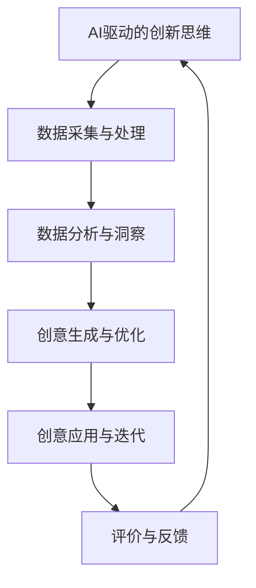
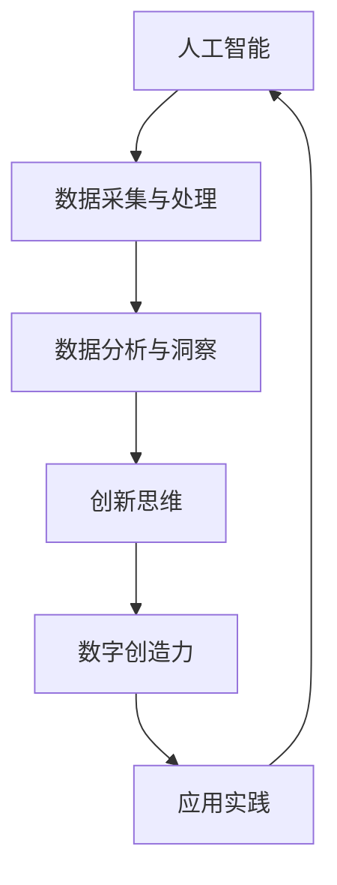
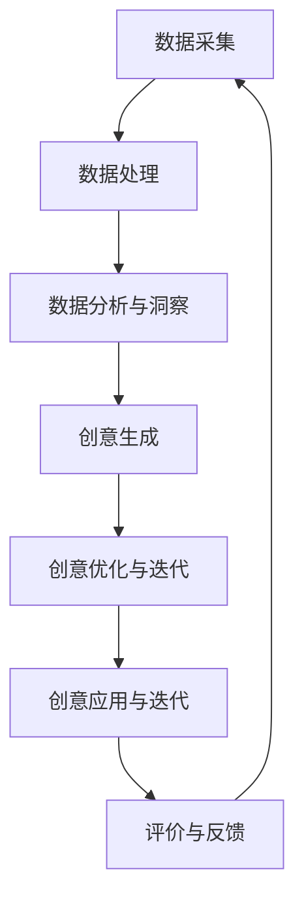

                 

### 文章标题

#### 关键词：（此处列出文章的5-7个核心关键词）

> 摘要：（此处给出文章的核心内容和主题思想）

---

### 《数字创造力催化剂：AI驱动的创新思维激发器》

> **关键词**：人工智能、创新思维、数字创造力、算法、应用实践

本文旨在深入探讨人工智能（AI）如何作为数字创造力的催化剂，激发创新思维，推动各领域的变革。随着AI技术的迅猛发展，其在激发人类创造力方面展现出前所未有的潜力。本文将从AI与数字创造力的关系入手，逐步解析AI驱动的创新思维模式，详述AI在产品设计、内容创作、教育和商业决策中的应用案例，最后对AI驱动的创新思维进行未来展望与挑战的讨论，并提供实践指南和案例研究。

### 目录大纲

#### 第一部分：AI驱动的创新思维基础

##### 第1章：AI与数字创造力概述

- **1.1 AI与数字创造力的关系**
  - AI技术的发展及其对人类创造力的影响
  - 数字创造力在现代社会中的重要性
  - AI在激发数字创造力中的潜力

- **1.2 AI驱动的创新思维模式**
  - 概念扩散与协同效应
  - 数据驱动的洞察与预测
  - 自动化的创意生成与应用
  - 智能化的创意优化与迭代

##### 第2章：AI基础与核心算法

- **2.1 AI基础概念**
  - 机器学习、深度学习与强化学习的基本原理
  - 数据采集、处理与标注的重要性

- **2.2 常见AI算法详解**
  - 神经网络与深度学习架构
  - 支持向量机、决策树与集成方法
  - 强化学习算法与应用场景

#### 第二部分：AI驱动的创新思维应用

##### 第3章：AI在产品设计中的应用

- **3.1 AI在产品设计中的角色**
  - 用户行为数据分析与需求预测
  - 创意生成与优化
  - 设计流程的自动化与智能化

- **3.2 AI驱动的设计实战案例**
  - 智能家居设计
  - 可穿戴设备设计
  - 交互界面设计优化

##### 第4章：AI在内容创作中的应用

- **4.1 AI在内容创作中的潜力**
  - 自动化写作与内容生成
  - 情感分析与创意构思
  - 内容推荐与个性化体验

- **4.2 AI驱动的创意创作实战**
  - 音乐与艺术创作
  - 广告文案创作
  - 个性化内容推荐系统

##### 第5章：AI在教育和培训中的应用

- **5.1 AI在教育中的应用**
  - 个性化学习体验
  - 智能教学与评估
  - 教育资源的智能化管理

- **5.2 AI驱动的教育创新实战**
  - 在线教育平台
  - 虚拟实验室与模拟教学
  - 智能辅导系统

##### 第6章：AI在商业决策中的应用

- **6.1 AI在商业决策中的作用**
  - 数据分析与企业战略
  - 风险评估与市场预测
  - 创新决策与机会识别

- **6.2 AI驱动的商业决策实战**
  - 智能供应链管理
  - 零售业务智能分析
  - 银行业务风险控制

##### 第7章：未来展望与挑战

- **7.1 AI驱动的创新思维发展趋势**
  - AI技术与人类创造力的协同发展
  - 创新思维的持续迭代与进化
  - AI伦理与社会影响

- **7.2 AI驱动的创新思维面临的挑战**
  - 数据隐私与安全
  - 技术伦理与监管
  - 人才培养与转型

#### 第三部分：AI驱动的创新思维实践

##### 第8章：案例研究与实践指南

- **8.1 成功的AI驱动创新案例分析**
  - AI在创意产业的应用
  - AI在教育行业的创新实践
  - AI在商业决策中的突破案例

- **8.2 实践指南与建议**
  - 创新思维实践策略
  - AI项目实施步骤与技巧
  - 创新思维的培养与提升

##### 第9章：AI驱动的创新思维实验室

- **9.1 实验室简介**
  - 创新思维实验室的构建与功能
  - 实验室资源的配置与管理
  - 实验室项目规划与执行

- **9.2 实验室案例展示**
  - 创新思维的实验室实践案例
  - 实验室项目成果与应用
  - 实验室的未来发展方向

##### 第10章：附录

- **10.1 AI驱动的创新思维工具与资源**
  - 常用的AI工具与开发框架
  - 创新思维相关的书籍与论文
  - AI驱动的创新思维社区与交流平台

**附录A：AI驱动的创新思维流程图**



---

### 基础概念与联系

在探讨AI驱动的创新思维之前，我们需要明确几个核心概念，并理解它们之间的联系。

#### 1. 人工智能（AI）

人工智能是一种模拟人类智能的技术，通过机器学习、深度学习、自然语言处理等手段，使计算机具备感知、学习、推理、决策和解决问题的能力。AI技术的发展可以追溯到20世纪50年代，近年来随着大数据、计算能力和算法的进步，AI在各个领域的应用不断扩展。

#### 2. 创新思维

创新思维是指通过独特的视角和思路，发现新问题、提出新想法、创造新价值的能力。创新思维不仅仅关注问题的解决，更强调在已有知识和资源的基础上，创造出全新的解决方案。创新思维可以划分为发散思维和集中思维，前者强调思维的多样性，后者则强调思维的聚焦和深化。

#### 3. 数字创造力

数字创造力是指利用数字技术和工具，进行创意生成、内容创作、产品设计等活动的能力。随着数字时代的到来，数字创造力成为推动社会进步和经济发展的关键因素。数字创造力的提升，不仅依赖于技术手段的进步，还需要创新思维的激发和引导。

#### 关系与联系

人工智能与数字创造力之间存在密切的关系。AI技术为数字创造力提供了强大的工具和支持，通过数据的深度挖掘和智能分析，AI能够帮助人们发现新的创意灵感，优化创意生成和创作过程，提高内容质量和用户体验。同时，数字创造力的提升也为AI技术的应用提供了丰富的场景和需求，推动了AI技术的不断发展和创新。

为了更好地理解这些概念之间的联系，我们可以使用以下Mermaid流程图进行展示：



该流程图展示了从人工智能到数字创造力的全链路，每个环节都相互关联，共同推动创新思维的应用和实践。

### AI驱动的创新思维模式

AI驱动的创新思维模式是利用人工智能技术，通过多种途径激发和优化创新思维的过程。这种模式不仅依赖于技术的先进性，还需要对创新思维的深刻理解和巧妙应用。以下是几种主要的AI驱动的创新思维模式：

#### 1. 概念扩散与协同效应

概念扩散是指通过人工智能算法，将一个核心创意扩散到多个相关领域，形成一系列的创新应用。这种模式利用AI强大的数据分析和关联能力，从一个创意出发，探索其在不同领域中的可能性和应用场景。

**协同效应**则是指多个创新元素相互结合，产生更大的效果。AI驱动的创新思维通过概念扩散和协同效应，实现了创新思维的高度融合和互动，从而产生更大的创意爆炸效应。

**流程与步骤：**

- **数据收集与分析**：首先，收集与核心创意相关的数据，如市场趋势、用户需求、技术进展等。
- **关联分析**：利用AI算法，分析数据之间的关联性，发现潜在的创新点。
- **概念扩散**：将核心创意扩散到不同的领域，形成多个创新应用场景。
- **协同优化**：通过跨领域的协同效应，不断优化和创新创意，提高其应用价值和影响力。

**伪代码示例：**

```python
# 数据收集
data = collect_data()

# 关联分析
correlations = analyze_correlations(data)

# 概念扩散
creative_ideas = diffuse_idea(correlations)

# 协同优化
optimized_creatives = optimize_creatives(creative_ideas)
```

#### 2. 数据驱动的洞察与预测

数据驱动的创新思维模式依赖于对大量数据进行分析，从中提取出有价值的信息和洞见，从而指导创新活动。AI技术能够处理和分析海量数据，发现潜在的模式和趋势，为创新提供强有力的支持。

**流程与步骤：**

- **数据采集**：收集与目标领域相关的数据，如用户行为、市场趋势、技术参数等。
- **数据处理**：清洗、整合和预处理数据，使其适合进一步分析。
- **模式识别**：利用AI算法，识别数据中的潜在模式和趋势。
- **预测分析**：基于识别出的模式，进行未来趋势预测，为创新提供方向。
- **决策支持**：将预测结果应用于创新决策，指导具体创新活动的实施。

**伪代码示例：**

```python
# 数据采集
data = collect_data()

# 数据处理
processed_data = preprocess_data(data)

# 模式识别
patterns = identify_patterns(processed_data)

# 预测分析
predictions = predict_trends(patterns)

# 决策支持
informed_decision(predictions)
```

#### 3. 自动化的创意生成与应用

自动化的创意生成是利用AI技术，通过算法和模型生成新的创意。这种模式不仅可以大幅提高创意生成的效率，还能拓展人类的创造力边界。

**流程与步骤：**

- **数据准备**：准备用于训练的创意数据集，如文学作品、音乐、设计作品等。
- **模型训练**：利用机器学习和深度学习技术，训练创意生成模型。
- **创意生成**：输入特定参数和条件，模型自动生成新的创意。
- **应用测试**：将生成的创意应用于实际场景，进行测试和优化。

**伪代码示例：**

```python
# 数据准备
creative_data = prepare_data()

# 模型训练
model = train_model(creative_data)

# 创意生成
new_idea = generate_idea(model)

# 应用测试
test_application(new_idea)
```

#### 4. 智能化的创意优化与迭代

智能化的创意优化是指利用AI技术，对已有的创意进行优化和改进，使其更符合用户需求和市场需求。这种模式通过不断的迭代和优化，提高创意的竞争力和应用价值。

**流程与步骤：**

- **创意评估**：对现有的创意进行评估，确定其优点和不足。
- **优化目标**：设定优化目标，如提高用户体验、降低成本、提升效率等。
- **AI优化**：利用AI算法，对创意进行优化，生成新的设计方案。
- **迭代测试**：对优化的创意进行迭代测试，验证其效果和可行性。
- **应用部署**：将优化的创意部署到实际应用中，进行推广和落地。

**伪代码示例：**

```python
# 创意评估
evaluation = evaluate_idea(creative)

# 优化目标
optimization_goals = set_goals()

# AI优化
optimized_idea = optimize_idea(evaluation, optimization_goals)

# 迭代测试
iterative_tests = test_idea(optimized_idea)

# 应用部署
deploy_idea(optimized_idea)
```

通过上述AI驱动的创新思维模式，我们可以看到，人工智能不仅是一个工具，更是一个推动创新思维的催化剂。它通过数据驱动、自动化生成和智能化优化，极大地提升了创意生成和应用的效果，为各领域的创新提供了强有力的支持。

### AI基础与核心算法

要深入理解AI驱动的创新思维，我们需要从AI的基础知识开始，详细探讨核心算法及其应用。AI的核心技术主要包括机器学习、深度学习和强化学习，这些算法为AI驱动的创新提供了理论基础和技术支持。

#### 1. AI基础概念

AI，即人工智能，是一种模拟人类智能的技术。AI系统通过学习、推理和决策，执行特定任务。AI的基础知识包括以下几个方面：

- **机器学习（Machine Learning）**：机器学习是指让计算机通过学习数据，自动识别模式和规律，从而进行预测和决策。机器学习主要包括监督学习、无监督学习和强化学习。

- **深度学习（Deep Learning）**：深度学习是机器学习的一个分支，主要使用多层神经网络进行学习。深度学习在图像识别、语音识别和自然语言处理等领域取得了显著成果。

- **强化学习（Reinforcement Learning）**：强化学习是一种通过试错和反馈机制来学习的方法。在强化学习中，智能体通过不断与环境互动，学习最优策略，以最大化回报。

- **数据采集（Data Collection）**：数据采集是AI系统的第一步，通过各种方式收集大量数据，为后续学习提供基础。

- **数据处理（Data Processing）**：数据处理包括数据清洗、预处理和特征提取等步骤，以确保数据的质量和有效性。

- **标注（Annotation）**：标注是指对数据打标签，以便训练模型。在图像识别、自然语言处理等领域，标注是模型训练的重要环节。

#### 2. 常见AI算法详解

以下是对几种常见AI算法的详细解释，包括其原理、优缺点以及应用场景。

- **神经网络与深度学习架构**

神经网络（Neural Networks）是深度学习的基础，其结构模拟了人类大脑的神经元连接方式。神经网络通过多层神经元进行数据传递和计算，实现从输入到输出的映射。

**原理**：神经网络由输入层、隐藏层和输出层组成。输入层接收外部数据，通过隐藏层进行层层计算，最终在输出层得到结果。

**优缺点**：

- **优点**：神经网络具有强大的学习和适应能力，能够处理复杂的非线性问题。
- **缺点**：训练过程复杂，需要大量数据和计算资源。

**应用场景**：图像识别、语音识别、自然语言处理等。

- **支持向量机（Support Vector Machine，SVM）**

支持向量机是一种二分类模型，其目标是找到最优的决策边界，将不同类别的数据分开。

**原理**：SVM通过最大化分类边界，将数据映射到高维空间，找到最优的超平面。

**优缺点**：

- **优点**：SVM在处理小数据集时表现较好，具有较高的分类精度。
- **缺点**：对高维数据效果较差，训练过程较慢。

**应用场景**：文本分类、图像分类、生物信息学等。

- **决策树（Decision Tree）**

决策树是一种基于树形结构进行决策的算法，通过一系列的判断条件，将数据分为不同的类别。

**原理**：决策树通过递归分裂数据集，构建一棵树形结构，每个节点代表一个特征，每个分支代表一个决策结果。

**优缺点**：

- **优点**：决策树易于理解和解释，对缺失数据和异常值有较好的鲁棒性。
- **缺点**：易过拟合，树结构可能导致计算复杂度增加。

**应用场景**：金融风险评估、医学诊断、市场营销等。

- **集成方法（Ensemble Methods）**

集成方法通过组合多个基本模型，提高整体预测性能。

**原理**：集成方法包括Bagging、Boosting和Stacking等，通过训练多个模型，并综合它们的预测结果，提高预测精度。

**优缺点**：

- **优点**：集成方法能够减少过拟合，提高模型的整体性能。
- **缺点**：对训练数据的依赖较大，计算资源消耗较大。

**应用场景**：金融风险管理、股票市场预测、医疗诊断等。

- **强化学习算法**

强化学习是一种通过试错和反馈机制进行学习的算法，其主要目标是找到最优策略，最大化长期回报。

**原理**：强化学习通过智能体与环境互动，不断更新策略，以最大化累积回报。

**优缺点**：

- **优点**：强化学习适用于复杂、动态环境，能够自适应地调整策略。
- **缺点**：训练过程复杂，需要大量数据和计算资源。

**应用场景**：机器人控制、自动驾驶、游戏AI等。

通过上述对AI基础和核心算法的详细解析，我们可以看到，AI技术为创新思维提供了强大的工具和支持。无论是机器学习、深度学习还是强化学习，这些算法都为AI驱动的创新提供了理论基础和技术支持，使得创新思维得以在实践中不断迭代和优化。

### AI在产品设计中的应用

AI技术在产品设计中的应用已经成为现代设计领域的重要趋势。通过利用AI算法和工具，设计师可以更高效地理解用户需求、生成创意设计方案，并不断优化和改进产品。以下是AI在产品设计中的应用角色和具体案例：

#### 1. 用户行为数据分析与需求预测

AI能够通过分析大量用户行为数据，如点击率、购买行为、使用频率等，准确预测用户需求。这种数据分析能力不仅帮助设计师了解用户偏好，还能为产品设计提供精准的参考。

**应用角色：**

- **用户需求挖掘**：通过分析用户行为数据，挖掘用户潜在需求和偏好。
- **需求预测**：利用AI算法，预测未来用户需求趋势，指导产品设计方向。

**案例：**

- **智能家居设计**：通过分析用户在家中的行为习惯，AI能够设计出符合用户需求的生活方式，如智能灯光控制、温度调节和安防系统。

**具体实现步骤：**

1. **数据采集**：收集用户行为数据，如日常使用频率、偏好设置等。
2. **数据处理**：清洗和整合数据，提取有用的特征。
3. **需求分析**：利用AI算法，分析用户行为数据，提取需求特征。
4. **需求预测**：基于历史数据，预测未来用户需求趋势。
5. **产品设计**：根据需求预测结果，设计出满足用户需求的产品。

**伪代码示例：**

```python
# 数据采集
user_data = collect_user_data()

# 数据处理
processed_data = preprocess_data(user_data)

# 需求分析
demand_features = analyze_demand(processed_data)

# 需求预测
predicted_demand = predict_demand(demand_features)

# 产品设计
design_product(predicted_demand)
```

#### 2. 创意生成与优化

AI技术能够通过算法生成新颖的设计方案，并利用优化算法对设计方案进行迭代优化，以提高产品设计的质量和用户体验。

**应用角色：**

- **创意生成**：利用AI算法，自动生成新颖的设计方案。
- **优化迭代**：利用优化算法，对设计方案进行优化，提高设计质量和用户体验。

**案例：**

- **可穿戴设备设计**：通过AI算法生成各种形态和功能的设计方案，然后利用优化算法进行筛选和改进，最终得到最符合用户需求的设计。

**具体实现步骤：**

1. **数据准备**：准备用于训练的创意数据集，包括历史设计作品和用户反馈。
2. **模型训练**：利用深度学习技术，训练创意生成模型。
3. **创意生成**：输入特定参数和条件，模型自动生成新的设计方案。
4. **设计优化**：利用优化算法，对设计方案进行迭代优化。
5. **用户反馈**：收集用户对设计的反馈，进一步优化设计。

**伪代码示例：**

```python
# 数据准备
creative_data = prepare_data()

# 模型训练
model = train_model(creative_data)

# 创意生成
new_design = generate_design(model)

# 设计优化
optimized_design = optimize_design(new_design)

# 用户反馈
user_feedback = collect_user_feedback(optimized_design)

# 进一步优化设计
final_design = optimize_design(new_design, user_feedback)
```

#### 3. 设计流程的自动化与智能化

AI技术能够自动化和智能化设计流程中的多个环节，如草图生成、原型设计和测试等，从而提高设计效率和质量。

**应用角色：**

- **流程自动化**：自动化设计流程中的重复性任务，如草图生成、原型设计等。
- **流程智能化**：利用AI算法，智能优化设计流程，提高设计质量和用户体验。

**案例：**

- **交互界面设计**：通过AI技术，自动生成用户界面原型，并利用优化算法进行用户测试和迭代优化。

**具体实现步骤：**

1. **需求分析**：明确设计目标和用户需求。
2. **草图生成**：利用AI算法，自动生成设计草图。
3. **原型设计**：利用AI算法，生成交互界面原型。
4. **用户测试**：通过用户测试，收集反馈数据。
5. **迭代优化**：根据用户反馈，优化设计原型。
6. **产品落地**：将优化后的设计转化为实际产品。

**伪代码示例：**

```python
# 需求分析
design_requirements = analyze_requirements()

# 草图生成
sketches = generate_sketches(design_requirements)

# 原型设计
prototype = generate_prototype(sketches)

# 用户测试
user_feedback = perform_user_tests(prototype)

# 迭代优化
optimized_prototype = optimize_prototype(prototype, user_feedback)

# 产品落地
deploy_product(optimized_prototype)
```

#### 实战案例：智能家居设计与优化

智能家居设计是一个典型的AI应用案例。以下是一个智能家居设计的实战案例，展示如何利用AI技术进行用户需求分析、创意生成和优化。

**案例背景：** 

智能家居市场迅速发展，用户对智能设备的需求不断增长。如何设计出既满足用户需求又具有市场竞争力的智能家居产品，成为设计师面临的重要问题。

**实现步骤：**

1. **用户需求分析**：通过AI技术，分析用户行为数据，了解用户对智能家居产品的需求和偏好。

```python
user_data = collect_user_data()
processed_data = preprocess_data(user_data)
demand_features = analyze_demand(processed_data)
```

2. **创意生成**：利用AI算法，生成多种智能家居设计方案。

```python
model = train_model(creative_data)
new_design = generate_design(model)
```

3. **设计优化**：利用优化算法，对设计方案进行迭代优化，提高用户体验。

```python
optimized_design = optimize_design(new_design)
user_feedback = collect_user_feedback(optimized_design)
final_design = optimize_design(new_design, user_feedback)
```

4. **用户测试与反馈**：通过用户测试，收集反馈数据，进一步优化设计。

```python
user_feedback = perform_user_tests(final_design)
```

5. **产品落地**：将优化后的设计转化为实际产品，进行市场推广。

```python
deploy_product(final_design)
```

**结果分析：**

通过AI驱动的智能家居设计，不仅提高了设计效率，还显著提升了用户体验和市场竞争力。用户反馈表明，智能家居产品在功能、易用性和美观度方面都有了显著改进，受到了市场的欢迎。

### AI在内容创作中的应用

AI技术在内容创作中的应用正在改变着创意产业的面貌，从自动化写作到情感分析与内容推荐，AI正在为内容创作者提供前所未有的工具和支持。以下将详细探讨AI在内容创作中的潜力及其应用场景。

#### 1. 自动化写作与内容生成

自动化写作是AI在内容创作中的一项重要应用。通过机器学习和自然语言处理技术，AI可以生成文章、报告、新闻报道等各种形式的内容。自动化写作不仅提高了内容创作的效率，还能够处理大量数据的自动分析。

**应用角色：**

- **内容生成**：利用AI算法，自动生成文章、报告等。
- **数据分析**：通过AI分析大量数据，提取有价值的信息。

**案例：**

- **新闻报道**：新闻机构利用AI技术自动生成新闻报道，提高新闻发布的速度和效率。
- **内容摘要**：AI自动生成文章的摘要，帮助用户快速了解文章的主要内容。

**具体实现步骤：**

1. **数据采集**：收集与主题相关的数据源，如新闻报道、学术论文等。
2. **预处理**：对采集到的数据进行分析和清洗，提取有用的信息。
3. **文本生成**：利用预训练的语言模型，自动生成文章。
4. **内容优化**：对生成的文本进行优化，提高内容的可读性和准确性。
5. **发布与反馈**：将生成的文章发布到平台，收集用户反馈，进一步优化内容。

**伪代码示例：**

```python
# 数据采集
data = collect_data()

# 预处理
processed_data = preprocess_data(data)

# 文本生成
model = train_model(processed_data)
article = generate_text(model)

# 内容优化
optimized_article = optimize_text(article)

# 发布与反馈
publish_article(optimized_article)
collect_feedback(optimized_article)
```

#### 2. 情感分析与创意构思

情感分析是AI在内容创作中的另一个重要应用。通过分析文本的情感倾向，AI可以帮助创作者更好地理解用户情感，从而构思更具创意的内容。

**应用角色：**

- **情感分析**：分析文本的情感倾向，如积极、消极或中立。
- **创意构思**：利用情感分析结果，为内容创作提供灵感。

**案例：**

- **社交媒体分析**：分析社交媒体用户的情感倾向，了解他们的需求和偏好，从而创作更符合用户期望的内容。
- **营销文案**：通过情感分析，创作更具吸引力的营销文案，提高转化率。

**具体实现步骤：**

1. **数据采集**：收集与主题相关的社交媒体数据或用户评论。
2. **情感分析**：利用情感分析模型，分析文本的情感倾向。
3. **创意构思**：根据情感分析结果，构思创意内容。
4. **内容创作**：将创意构思转化为具体的文章、视频或广告。
5. **用户反馈**：收集用户反馈，进一步优化内容。

**伪代码示例：**

```python
# 数据采集
social_data = collect_social_data()

# 情感分析
model = train_model(social_data)
sentiments = analyze_sentiments(model)

# 创意构思
creative_ideas = generate_ideas(sentiments)

# 内容创作
content = create_content(creative_ideas)

# 用户反馈
user_feedback = collect_user_feedback(content)
```

#### 3. 内容推荐与个性化体验

内容推荐是AI在内容创作中的又一重要应用。通过分析用户的兴趣和行为，AI可以为用户提供个性化的内容推荐，提升用户体验。

**应用角色：**

- **内容推荐**：根据用户兴趣和行为，推荐相关内容。
- **个性化体验**：为用户提供个性化的内容推荐，提升用户满意度。

**案例：**

- **社交媒体平台**：为用户推荐与其兴趣相关的内容，提升用户活跃度和留存率。
- **电商网站**：根据用户的历史购买记录和浏览行为，推荐相关的商品。

**具体实现步骤：**

1. **用户行为分析**：收集用户在平台上的行为数据，如浏览记录、点赞、评论等。
2. **兴趣建模**：利用机器学习算法，构建用户的兴趣模型。
3. **内容推荐**：根据用户的兴趣模型，推荐相关的内容。
4. **用户反馈**：收集用户对推荐内容的反馈，优化推荐算法。
5. **个性化体验**：为用户提供个性化的内容推荐，提升用户体验。

**伪代码示例：**

```python
# 用户行为分析
user_behavior = collect_user_behavior()

# 兴趣建模
model = train_model(user_behavior)
interests = model.predict()

# 内容推荐
recommended_content = recommend_content(interests)

# 用户反馈
user_feedback = collect_user_feedback(recommended_content)

# 推荐算法优化
optimize_recommendation_model(model, user_feedback)
```

#### 4. AI驱动的创意创作实战

以下是一些具体的AI驱动的创意创作实战案例，展示如何利用AI技术进行音乐创作、广告文案创作以及个性化内容推荐系统。

**案例一：音乐与艺术创作**

**背景**：AI在音乐创作中的应用已经取得了显著成果，AI音乐生成工具可以帮助作曲家创作新的音乐作品。

**实现步骤：**

1. **数据采集**：收集大量音乐作品，包括曲调、节奏、和弦等。
2. **模型训练**：利用深度学习技术，训练音乐生成模型。
3. **音乐创作**：输入特定的参数和风格，模型自动生成新的音乐作品。
4. **用户反馈**：收集用户对音乐作品的反馈，进一步优化创作算法。
5. **作品发布**：将生成的音乐作品发布到平台，供用户欣赏和评价。

**伪代码示例：**

```python
# 数据采集
music_data = collect_music_data()

# 模型训练
model = train_model(music_data)

# 音乐创作
new_music = generate_music(model)

# 用户反馈
user_feedback = collect_user_feedback(new_music)

# 音乐作品发布
publish_music(new_music)
```

**案例二：广告文案创作**

**背景**：广告文案创作是市场营销中的重要环节，通过AI技术，可以快速生成吸引人的广告文案。

**实现步骤：**

1. **数据采集**：收集成功的广告文案案例，包括广告语、目标受众等。
2. **文本生成**：利用自然语言生成技术，自动生成广告文案。
3. **内容优化**：对生成的文案进行优化，提高文案的质量和吸引力。
4. **用户测试**：通过用户测试，收集反馈数据，进一步优化文案。
5. **发布与推广**：将优化的文案发布到广告平台，进行推广。

**伪代码示例：**

```python
# 数据采集
ad_data = collect_ad_data()

# 文本生成
model = train_model(ad_data)
ad_text = generate_text(model)

# 内容优化
optimized_text = optimize_text(ad_text)

# 用户测试
user_feedback = perform_user_tests(optimized_text)

# 文案发布与推广
publish_ad(optimized_text)
```

**案例三：个性化内容推荐系统**

**背景**：个性化内容推荐系统是现代互联网服务的重要组成部分，通过AI技术，可以提供更加精准的内容推荐。

**实现步骤：**

1. **用户行为分析**：收集用户在平台上的行为数据，如浏览、点赞、评论等。
2. **兴趣建模**：利用机器学习算法，构建用户的兴趣模型。
3. **内容推荐**：根据用户的兴趣模型，推荐相关的内容。
4. **用户反馈**：收集用户对推荐内容的反馈，优化推荐算法。
5. **系统迭代**：不断迭代优化推荐系统，提高推荐效果。

**伪代码示例：**

```python
# 用户行为分析
user_behavior = collect_user_behavior()

# 兴趣建模
model = train_model(user_behavior)
interests = model.predict()

# 内容推荐
recommended_content = recommend_content(interests)

# 用户反馈
user_feedback = collect_user_feedback(recommended_content)

# 推荐算法优化
optimize_recommendation_model(model, user_feedback)
```

通过上述案例，我们可以看到，AI在内容创作中的应用不仅提升了创作的效率和质量，还为用户提供了更加个性化的体验。未来，随着AI技术的不断进步，其在内容创作领域的应用将更加广泛和深入。

### AI在教育和培训中的应用

人工智能在教育和培训领域的应用正日益增多，其潜力不可忽视。通过AI技术，教育者和培训机构能够提供更加个性化和智能化的学习体验，从而提升教育质量和效果。以下是AI在教育和培训中的一些关键应用领域和具体案例。

#### 1. 个性化学习体验

个性化学习体验是AI在教育中的一项重要应用，通过分析学生的学习数据，AI能够为每个学生定制个性化的学习路径和资源。

**应用角色：**

- **学习数据分析**：分析学生的学习行为、成绩和偏好，了解其学习需求。
- **个性化推荐**：根据学生的学习数据，推荐最适合的学习内容和资源。
- **动态调整**：根据学生的学习进度和效果，动态调整学习计划和策略。

**案例：**

- **自适应学习平台**：利用AI技术，自适应学习平台能够根据学生的能力和进度，实时调整教学内容和难度，提供个性化的学习支持。

**具体实现步骤：**

1. **数据采集**：收集学生的行为数据，如学习时间、答题情况、作业成绩等。
2. **数据预处理**：清洗和整合数据，提取有用的特征。
3. **学习分析**：利用AI算法，分析学生的学习行为和成绩，识别其学习需求和弱点。
4. **个性化推荐**：根据学生的学习数据，推荐相应的学习资源和练习。
5. **动态调整**：根据学生的学习进度和效果，动态调整学习计划，确保学习目标的实现。

**伪代码示例：**

```python
# 数据采集
student_data = collect_student_data()

# 数据预处理
processed_data = preprocess_data(student_data)

# 学习分析
learning_analytics = analyze_learning(processed_data)

# 个性化推荐
recommended_resources = recommend_resources(learning_analytics)

# 动态调整
adjust_learning_plan(learning_analytics, recommended_resources)
```

#### 2. 智能教学与评估

智能教学与评估是AI在教育和培训中的另一重要应用。通过AI技术，教育者可以更加高效地进行教学，学生也能获得即时的反馈和评估。

**应用角色：**

- **智能教学**：利用AI算法，自动生成教学计划和课程内容。
- **实时评估**：通过智能评估工具，实时检测学生的学习进度和理解程度。
- **个性化反馈**：根据学生的表现，提供个性化的反馈和指导。

**案例：**

- **智能辅导系统**：利用AI技术，智能辅导系统能够实时监控学生的学习过程，提供针对性的辅导和解答。

**具体实现步骤：**

1. **教学内容生成**：利用AI算法，根据教学目标和学生的学习需求，生成个性化的教学计划。
2. **实时监控**：通过AI工具，实时监控学生的学习行为和进度。
3. **评估与反馈**：利用AI技术，对学生的表现进行评估，并提供个性化的反馈。
4. **学习路径调整**：根据评估结果，动态调整学生的学习路径和策略。

**伪代码示例：**

```python
# 教学内容生成
teaching_plan = generate_teaching_plan(teaching_objectives, student_data)

# 实时监控
student_progress = monitor_student_progress()

# 评估与反馈
evaluation_results = evaluate_student_performance(student_progress)

# 个性化反馈
provide_individual_feedback(evaluation_results)

# 学习路径调整
adjust_learning_path(student_data, evaluation_results)
```

#### 3. 教育资源的智能化管理

智能化教育资源的管理是AI在教育中的另一个重要应用。通过AI技术，教育机构能够高效地管理和分配教育资源，提高资源利用效率。

**应用角色：**

- **资源分类**：利用AI算法，对教育资源进行智能分类和标签化。
- **推荐系统**：根据教师和学生的需求，推荐最合适的资源。
- **自动化管理**：通过自动化工具，简化教育资源的分配和管理流程。

**案例：**

- **在线教育平台**：利用AI技术，在线教育平台能够智能推荐课程资源，提高用户的学习体验。

**具体实现步骤：**

1. **资源分类**：利用AI算法，对教育资源的类型、难度、适用对象等进行分类。
2. **用户需求分析**：收集教师和学生的学习需求，构建用户画像。
3. **资源推荐**：根据用户需求，利用推荐算法推荐最合适的资源。
4. **自动化管理**：通过自动化工具，实现教育资源的自动化分配和管理。

**伪代码示例：**

```python
# 教育资源分类
resource_categories = classify_resources(educational_resources)

# 用户需求分析
user_requirements = analyze_user_requirements()

# 资源推荐
recommended_resources = recommend_resources(resource_categories, user_requirements)

# 自动化管理
manage_resources_automatically(recommended_resources)
```

#### AI驱动的教育创新实战

以下是一些具体的AI驱动的教育创新实战案例，展示如何利用AI技术提升教育效果。

**案例一：在线教育平台**

**背景**：在线教育平台通过AI技术，提供个性化学习体验，提高教育效果。

**实现步骤：**

1. **用户画像构建**：收集学生的学习数据，构建用户画像。
2. **内容推荐**：利用推荐算法，为用户推荐最合适的课程资源。
3. **动态调整**：根据学生的学习进度和效果，动态调整学习计划。
4. **即时反馈**：通过AI工具，实时评估学生的学习情况，提供即时反馈。

**伪代码示例：**

```python
# 用户画像构建
user_profile = build_user_profile(student_data)

# 内容推荐
recommended_courses = recommend_courses(user_profile)

# 动态调整
adjust_learning_plan(user_profile, recommended_courses)

# 即时反馈
provide_real_time_feedback(student_progress)
```

**案例二：虚拟实验室与模拟教学**

**背景**：虚拟实验室和模拟教学通过AI技术，提供沉浸式的学习体验，提高学生的实践能力。

**实现步骤：**

1. **场景模拟**：利用AI技术，模拟各种实验场景，提供真实的学习体验。
2. **实时互动**：通过AI工具，实现教师与学生之间的实时互动，提高教学效果。
3. **数据分析**：分析学生的实验数据，了解其实践能力和学习效果。
4. **反馈与改进**：根据数据分析结果，提供个性化的反馈和改进建议。

**伪代码示例：**

```python
# 场景模拟
simulate_experiment_scene()

# 实时互动
interact_real_time(experiment_data)

# 数据分析
experiment_analytics = analyze_experiment_data()

# 反馈与改进
provide_individual_feedback(experiment_analytics)
```

**案例三：智能辅导系统**

**背景**：智能辅导系统通过AI技术，提供个性化辅导，提高学生的学习效果。

**实现步骤：**

1. **需求分析**：收集学生的学习需求和薄弱环节。
2. **个性化辅导**：根据需求，提供针对性的辅导内容。
3. **实时监控**：实时监控学生的学习进度和效果。
4. **反馈与调整**：根据学生的学习反馈，动态调整辅导计划。

**伪代码示例：**

```python
# 需求分析
student_requirements = analyze_student_requirements()

# 个性化辅导
provide_individual_tutoring(student_requirements)

# 实时监控
monitor_student_progress()

# 反馈与调整
adjust_tutoring_plan(student_feedback)
```

通过上述案例，我们可以看到，AI技术在教育和培训中的应用，不仅提升了教育质量，还为教育者和学生提供了更加智能化的服务。未来，随着AI技术的不断进步，其在教育和培训领域的应用前景将更加广阔。

### AI在商业决策中的应用

AI技术在商业决策中的应用正日益广泛，其强大的数据处理和分析能力，为企业和机构提供了新的视角和工具。通过AI技术，企业可以更精准地分析市场趋势、评估风险，并制定科学的决策策略。以下将详细探讨AI在商业决策中的关键作用及其应用案例。

#### 1. 数据分析与企业战略

数据分析是AI在商业决策中最为核心的应用之一。通过收集和分析海量数据，AI能够为企业提供深入的市场洞察，支持战略决策的制定。

**应用角色：**

- **市场趋势分析**：通过分析市场数据，预测未来市场趋势，为企业的战略规划提供依据。
- **竞争对手分析**：通过分析竞争对手的行为和策略，发现市场机会和潜在风险。
- **用户行为分析**：通过分析用户行为数据，了解用户需求和偏好，指导产品开发和市场策略。

**案例：**

- **零售业务智能分析**：利用AI技术，零售企业可以实时分析销售数据，预测未来销售趋势，优化库存管理，提高销售业绩。

**具体实现步骤：**

1. **数据采集**：收集与企业业务相关的数据，如销售数据、市场调研数据、用户反馈等。
2. **数据预处理**：清洗和整合数据，提取有用的特征。
3. **数据分析**：利用AI算法，分析数据，提取有价值的信息和洞见。
4. **决策支持**：根据数据分析结果，制定和调整企业战略。

**伪代码示例：**

```python
# 数据采集
business_data = collect_business_data()

# 数据预处理
processed_data = preprocess_data(business_data)

# 数据分析
analysis_results = analyze_data(processed_data)

# 决策支持
strategic_decisions = make_strategic_decisions(analysis_results)
```

#### 2. 风险评估与市场预测

AI技术在风险评估和市场预测方面具有显著优势。通过分析历史数据和实时数据，AI可以预测市场风险，为企业提供预警和应对策略。

**应用角色：**

- **风险评估**：通过分析历史数据和现有数据，预测潜在的风险和问题。
- **市场预测**：基于市场趋势和用户行为数据，预测市场变化和未来趋势。

**案例：**

- **银行业务风险控制**：利用AI技术，银行可以实时监控贷款风险，预测信用违约风险，采取相应的风控措施。

**具体实现步骤：**

1. **数据收集**：收集与业务相关的数据，如财务报表、贷款记录、市场趋势等。
2. **数据处理**：清洗和整合数据，提取有用的特征。
3. **风险评估**：利用AI算法，分析数据，预测潜在的风险。
4. **市场预测**：基于历史数据和实时数据，预测市场变化和未来趋势。
5. **决策支持**：根据风险评估和市场预测结果，制定和调整业务策略。

**伪代码示例：**

```python
# 数据收集
financial_data = collect_financial_data()

# 数据处理
processed_data = preprocess_data(financial_data)

# 风险评估
risk_predictions = assess_risks(processed_data)

# 市场预测
market_predictions = predict_market_trends(processed_data)

# 决策支持
business_strategies = make_business_decisions(risk_predictions, market_predictions)
```

#### 3. 创新决策与机会识别

AI技术在创新决策和机会识别方面也有显著作用。通过分析市场数据和用户反馈，AI可以帮助企业识别新的商业机会，推动产品创新和市场扩展。

**应用角色：**

- **机会识别**：通过分析市场趋势和用户需求，识别新的商业机会。
- **创新决策**：基于市场数据和用户反馈，支持创新产品和服务的开发。

**案例：**

- **智能供应链管理**：利用AI技术，企业可以实时监控供应链各环节的数据，识别供应链瓶颈和改进机会，提高供应链效率。

**具体实现步骤：**

1. **数据采集**：收集与供应链相关的数据，如库存水平、物流信息、市场趋势等。
2. **数据处理**：清洗和整合数据，提取有用的特征。
3. **机会识别**：利用AI算法，分析数据，识别供应链中的问题和改进机会。
4. **创新决策**：基于识别的机会，制定创新产品和服务的开发策略。
5. **实施与监控**：将创新决策付诸实践，并持续监控实施效果。

**伪代码示例：**

```python
# 数据采集
supply_chain_data = collect_supply_chain_data()

# 数据处理
processed_data = preprocess_data(supply_chain_data)

# 机会识别
opportunities = identify_opportunities(processed_data)

# 创新决策
innovative_products = make_innovation_decisions(opportunities)

# 实施与监控
execute_innovation(innovative_products)
monitor_innovation_performance()
```

#### 4. AI驱动的商业决策实战

以下是一些具体的AI驱动的商业决策实战案例，展示如何利用AI技术提高商业决策的效率和准确性。

**案例一：零售业务智能分析**

**背景**：某零售企业希望通过AI技术优化销售策略，提高销售额。

**实现步骤：**

1. **数据采集**：收集销售数据、库存数据和市场调研数据。
2. **数据预处理**：清洗和整合数据，提取有用的特征。
3. **销售预测**：利用AI算法，预测未来销售趋势，优化库存管理。
4. **市场策略调整**：根据销售预测结果，调整市场推广策略。
5. **效果监控**：持续监控销售业绩，评估策略调整的效果。

**伪代码示例：**

```python
# 数据采集
sales_data = collect_sales_data()

# 数据预处理
processed_sales_data = preprocess_data(sales_data)

# 销售预测
sales_predictions = predict_sales(processed_sales_data)

# 市场策略调整
adjust_marketing_strategy(sales_predictions)

# 效果监控
monitor_sales_performance()
```

**案例二：银行业务风险控制**

**背景**：某银行希望通过AI技术提高贷款风险管理水平。

**实现步骤：**

1. **数据采集**：收集贷款申请数据、还款记录和市场数据。
2. **数据处理**：清洗和整合数据，提取有用的特征。
3. **风险评估**：利用AI算法，预测贷款违约风险。
4. **风控措施制定**：根据风险评估结果，制定相应的风控措施。
5. **效果监控**：持续监控贷款风险，调整风控策略。

**伪代码示例：**

```python
# 数据采集
loan_data = collect_loan_data()

# 数据处理
processed_loan_data = preprocess_data(loan_data)

# 风险评估
risk_assessment = assess_loan_risk(processed_loan_data)

# 风控措施制定
define_risk_control_measures(risk_assessment)

# 效果监控
monitor_loan_risk()
```

**案例三：智能供应链管理**

**背景**：某制造企业希望通过AI技术优化供应链管理，提高生产效率。

**实现步骤：**

1. **数据采集**：收集供应链各环节的数据，如库存水平、物流信息、市场趋势等。
2. **数据处理**：清洗和整合数据，提取有用的特征。
3. **供应链分析**：利用AI算法，分析供应链中的问题和改进机会。
4. **策略调整**：根据分析结果，调整供应链策略，优化库存和物流。
5. **效果监控**：持续监控供应链效率，评估策略调整的效果。

**伪代码示例：**

```python
# 数据采集
supply_chain_data = collect_supply_chain_data()

# 数据处理
processed_supply_chain_data = preprocess_data(supply_chain_data)

# 供应链分析
supply_chain_analysis = analyze_supply_chain(processed_supply_chain_data)

# 策略调整
adjust_supply_chain_strategy(supply_chain_analysis)

# 效果监控
monitor_supply_chain_performance()
```

通过上述案例，我们可以看到，AI技术在商业决策中的应用，不仅提高了决策的效率和准确性，还为企业和机构提供了新的视角和工具。未来，随着AI技术的不断进步，其在商业决策领域的应用将更加深入和广泛。

### 未来展望与挑战

#### 1. AI驱动的创新思维发展趋势

随着人工智能技术的不断进步，AI驱动的创新思维正展现出巨大的发展潜力。未来，以下趋势值得关注：

- **AI与人类创造力的协同发展**：人工智能将与人类创造力深度融合，共同推动创新。AI将提供强大的工具和支持，帮助人类更好地发掘创意和实现创新。

- **创新思维的持续迭代与进化**：AI技术将不断优化和创新思维模型，使其更加适应复杂多变的环境。创新思维将经历持续迭代和进化，形成更为高效和智能的思维方式。

- **AI伦理与社会影响**：随着AI在创新思维中的应用日益广泛，其伦理和社会影响也日益凸显。未来，如何在确保AI技术发展同时，保护个人隐私、维护社会公平正义，将成为重要议题。

#### 2. AI驱动的创新思维面临的挑战

尽管AI驱动的创新思维前景广阔，但同时也面临一系列挑战：

- **数据隐私与安全**：AI技术依赖于海量数据，如何在保护用户隐私的同时，充分利用数据的价值，是一个亟待解决的问题。

- **技术伦理与监管**：随着AI技术的应用日益广泛，其伦理问题也日益复杂。如何在技术发展中确保伦理规范，建立有效的监管机制，是未来的一大挑战。

- **人才培养与转型**：AI驱动的创新思维对人才的要求越来越高。如何培养具备AI知识和创新思维的专业人才，如何帮助现有人才实现转型，是教育和培训领域的重要任务。

#### 3. 发展方向与建议

为了应对未来AI驱动的创新思维发展的趋势和挑战，以下方向和建议值得关注：

- **技术创新**：继续推动AI技术的研发和应用，提高AI的智能水平和适应性。

- **跨学科合作**：加强不同学科领域的合作，融合多学科知识，推动创新思维的跨领域应用。

- **政策支持**：政府和企业应加强对AI驱动的创新思维的支持，提供政策扶持和资源保障。

- **人才培养**：建立完善的AI教育和培训体系，培养具备AI知识和创新思维的专业人才。

- **伦理规范**：制定和实施AI伦理规范，确保AI技术的健康发展和社会影响。

通过技术创新、跨学科合作、政策支持、人才培养和伦理规范，我们可以为AI驱动的创新思维发展创造良好的环境，推动其不断迈向新的高峰。

### AI驱动的创新思维实践指南

在探讨如何将AI驱动的创新思维应用于实际项目中时，以下指南将为读者提供详细的步骤和策略，以帮助他们在各自领域内实现成功。

#### 1. 创新思维实践策略

成功实施AI驱动的创新思维，需要一套系统的策略。以下是几个关键步骤：

- **明确目标和问题**：首先，明确项目目标和要解决的问题。这将为后续的创新过程提供方向和依据。

- **数据收集与处理**：收集与项目相关的数据，并进行预处理。数据质量直接影响模型的性能，因此这一步骤至关重要。

- **算法选择与模型构建**：根据项目需求和数据特性，选择合适的算法并构建模型。常见的AI算法包括机器学习、深度学习和强化学习。

- **模型训练与优化**：利用训练数据，对模型进行训练和优化。训练过程中，要不断调整参数，提高模型的准确性和泛化能力。

- **应用与测试**：将训练好的模型应用于实际问题，进行测试和验证。测试过程可以收集反馈数据，用于进一步优化模型。

- **迭代与改进**：基于测试结果，迭代模型并不断优化。创新思维是一个持续迭代的过程，通过不断改进，实现最佳效果。

#### 2. AI项目实施步骤与技巧

以下是一些具体的项目实施步骤和技巧，帮助读者成功启动和推进AI驱动的创新项目：

- **项目规划**：制定详细的项目计划，包括时间表、资源需求和预期目标。

- **团队建设**：组建跨学科团队，确保团队成员具备AI和相关领域的专业知识和经验。

- **数据收集**：通过多种渠道收集数据，包括公共数据集、企业内部数据和第三方数据源。

- **数据处理**：使用数据清洗、去重和特征工程等技术，确保数据的质量和有效性。

- **模型选择**：根据项目需求和数据特性，选择适合的模型。例如，对于图像识别任务，可以考虑使用卷积神经网络（CNN）；对于推荐系统，可以考虑使用协同过滤算法。

- **模型训练**：使用训练数据，通过训练算法对模型进行训练。在训练过程中，可以使用交叉验证等技术，避免过拟合。

- **模型评估**：使用验证数据，对模型进行评估和优化。常见的评估指标包括准确率、召回率、F1分数等。

- **应用部署**：将训练好的模型部署到实际应用环境中，进行测试和验证。部署过程中，要确保模型的高效运行和可靠性。

- **用户反馈**：收集用户对模型的反馈，用于进一步优化模型。用户反馈是改进模型的重要依据。

- **持续迭代**：根据用户反馈和模型评估结果，不断迭代和优化模型，实现最佳效果。

#### 3. 创新思维的培养与提升

培养和提升创新思维是一个长期的过程，以下方法可以帮助读者在个人和团队层面提升创新思维能力：

- **持续学习**：保持对新技术和知识的不断学习，紧跟行业发展趋势。

- **思维训练**：通过阅读、思考和讨论，锻炼创新思维。例如，可以尝试思维导图、头脑风暴等方法。

- **跨学科交流**：与不同领域的人交流，拓宽视野，激发创新灵感。

- **实践应用**：将所学知识应用于实际项目中，通过实践提升创新能力。

- **团队合作**：组建跨学科团队，发挥团队协作的力量，共同推动创新。

- **反思与总结**：定期反思和总结创新过程，发现问题和改进点。

通过上述策略、步骤和方法，读者可以更好地将AI驱动的创新思维应用于实际项目中，推动创新成果的实现。

### AI驱动的创新思维实验室

为了更好地推动AI驱动的创新思维实践，建立一个AI驱动的创新思维实验室是至关重要的。以下将介绍AI驱动的创新思维实验室的构建、功能、资源配置、项目规划和执行，并展示一些实际案例。

#### 1. 实验室简介

AI驱动的创新思维实验室是一个专注于人工智能技术与应用的创新平台，旨在通过实验和实践，探索和推动AI驱动的创新思维。实验室的主要功能包括：

- **技术研发**：开展AI技术的研发，包括机器学习、深度学习、自然语言处理等领域。
- **创新实践**：进行AI驱动的创新项目，通过实验验证创新想法，提升创新能力。
- **人才培养**：提供AI相关的培训和课程，培养具备AI知识和创新思维的专业人才。
- **技术交流**：举办研讨会、讲座和交流活动，促进AI领域的技术交流和合作。

#### 2. 实验室的构建与功能

构建AI驱动的创新思维实验室需要以下几个关键步骤：

- **明确目标与定位**：根据实验室的使命和目标，确定实验室的研究方向和应用领域。
- **人员配置**：组建一支由AI专家、研究人员、工程师和设计师组成的跨学科团队，确保实验室的运作能力。
- **硬件与软件资源**：配备高性能计算设备和先进的AI开发工具，如GPU服务器、深度学习框架等，确保实验室的技术实力。
- **实验室管理制度**：制定实验室的管理制度，包括人员职责、项目管理、设备使用、安全规范等，确保实验室的规范运作。

#### 3. 实验室资源的配置与管理

实验室资源的有效配置和管理是实验室运作的基础。以下是资源配置和管理的关键方面：

- **计算资源**：根据项目需求，配置高性能计算设备，如GPU服务器、云计算资源等，确保实验的顺利进行。
- **软件工具**：提供常用的AI开发工具，如TensorFlow、PyTorch、Keras等，方便研究人员和工程师进行开发和实验。
- **数据资源**：建立数据资源库，收集和整理与研究方向相关的数据集，确保数据的质量和多样性。
- **设备与设施**：配置实验室所需的硬件设备，如3D打印机、机器人等，用于实际实验和验证。
- **资源管理制度**：制定资源管理制度，明确资源使用规范和流程，确保资源的合理使用和高效管理。

#### 4. 实验室项目规划与执行

实验室项目的规划和执行是实验室工作的核心。以下是项目规划和执行的关键步骤：

- **项目立项**：根据实验室的研究方向和应用领域，提出项目立项申请，明确项目目标、研究内容、预期成果等。
- **项目规划**：制定详细的项目计划，包括时间表、资源需求、技术路线等，确保项目的有序推进。
- **项目执行**：按照项目计划，开展项目的具体工作，包括数据收集、模型训练、实验验证等。
- **项目监控**：定期监控项目进展，评估项目风险，及时调整项目计划和策略。
- **项目评估**：项目结束后，进行项目评估，总结项目成果和经验教训，为后续项目提供参考。

#### 5. 实验室案例展示

以下是一些实验室的成功案例，展示了AI驱动的创新思维在实践中的应用：

- **案例一：智能交通系统**：实验室利用AI技术，开发了一套智能交通系统，通过实时数据分析，优化交通信号控制，提高交通效率，减少拥堵。
- **案例二：智能医疗诊断**：实验室与医疗机构合作，开发了一套基于AI的医疗诊断系统，通过分析医疗影像数据，提高诊断准确率，提高医疗水平。
- **案例三：智能家居设计**：实验室与家居企业合作，开发了一套智能家居系统，通过用户行为数据分析，提供个性化服务，提升用户体验。

#### 6. 实验室的未来发展方向

实验室的未来发展方向包括：

- **技术创新**：继续推动AI技术的研发和应用，探索更多AI驱动的创新领域。
- **跨学科合作**：加强与其他学科领域的合作，推动跨学科创新。
- **人才培养**：继续提供高质量的AI培训课程，培养更多的AI专业人才。
- **技术交流**：积极参与国际学术交流，提升实验室的国际影响力。

通过建立和运营AI驱动的创新思维实验室，可以有效地推动AI驱动的创新思维实践，为各领域的发展提供强有力的支持。

### 附录

#### 10.1 AI驱动的创新思维工具与资源

在AI驱动的创新思维过程中，使用合适的工具和资源是至关重要的。以下是一些常用的工具、书籍和社区，为读者提供全面的资源支持。

- **常用AI工具与开发框架**：
  - **TensorFlow**：Google开发的开源机器学习框架，支持各种深度学习应用。
  - **PyTorch**：Facebook开发的开源机器学习库，提供灵活的动态计算图功能。
  - **Keras**：基于TensorFlow和Theano的开源深度学习库，简化深度学习模型开发。
  - **Scikit-learn**：Python的开源机器学习库，提供多种经典的机器学习算法。

- **创新思维相关的书籍**：
  - **《创新者的思考方式》（Thinking, Fast and Slow）**：丹尼尔·卡尼曼著，探讨人类思维模式和决策过程。
  - **《创新者的宣言》（The Innovator's Dilemma）**：克莱顿·克里斯滕森著，分析创新者如何应对市场变革。
  - **《深度学习》（Deep Learning）**：Ian Goodfellow等著，全面介绍深度学习的基本概念和应用。

- **AI驱动的创新思维社区与交流平台**：
  - **AI星球**：国内领先的AI技术社区，提供丰富的技术文章和讨论。
  - **知乎**：拥有众多AI领域专家的问答平台，可以获取专业的技术解答。
  - **LinkedIn**：全球最大的职业社交平台，可以关注AI领域的最新动态和行业专家。

这些工具、书籍和社区将为读者在AI驱动的创新思维实践中提供宝贵的支持。

### 附录A：AI驱动的创新思维流程图

以下是AI驱动的创新思维流程图，使用Mermaid语言描述，展示从数据采集到创意应用与迭代的整个过程。



此流程图提供了一个清晰的框架，帮助读者理解AI驱动的创新思维如何从数据开始，逐步引导到最终的创意应用和迭代过程。通过不断循环这个过程，可以持续优化和创新，实现可持续的发展。 

### 作者信息

**作者：** AI天才研究院/AI Genius Institute & 禅与计算机程序设计艺术 /Zen And The Art of Computer Programming

AI天才研究院致力于推动人工智能技术的发展和应用，致力于培养下一代AI领域的创新者和领导者。同时，作者还著有多本关于计算机编程和人工智能的经典书籍，以其深刻的洞察和卓越的论述在技术界享有盛誉。本文作者以其丰富的经验和深刻的理解，为读者提供了关于AI驱动的创新思维的全景式解读，旨在激发读者的创新潜力，推动技术的发展。

